# Global Macro Economic Simulations and Financial Market Responses

v6 · IRF · evaluation

**Open the typeset report (this is the document):** https://robomacro.com/GlobalMacroTrainingDataset/metals_cut_20/

GitHub and Hugging Face show `.html` as source code. That is not the report. Read it on robomacro.com, or keep scrolling this page.

## What's the impact of Metals supply -20%

a 20% metals-supply cut. Every path is a model impulse response versus baseline, not a forecast and not financial advice.

### Summary

This note traces the model response to a 20% metals-supply cut. Every path is an impulse response versus an unchanged baseline — not a forecast of what will happen in the world and not a reading of market data. The chapters that follow are already sorted by the size of the GDP response.

Chile takes the largest GDP move on this path. GDP expands by 0.58% versus baseline by Q3 — a first-order GDP response. Equities firm 1.29%, and the three-year CPI impulse is +0.18 percentage points. The move shows up first in the trade balance, then in private investment / the cost of capital, government spending. That is the main adjustment: a change in financial conditions and real income, then the usual lag into activity and prices. It is the conditional elasticity to the shock that was switched on, not a prediction that this path will be realised.

Spillovers are not a carbon copy of that first path. Australia expands by 0.44% versus baseline by Q3 — a first-order GDP response. Equities firm 1.08%, and the three-year CPI impulse is +0.06 percentage points. The move shows up first in the trade balance, then in private investment / the cost of capital, government spending. South Africa expands by 0.31% versus baseline by Q3 — a first-order GDP response. Equities firm 1.22%, and the three-year CPI impulse is +0.15 percentage points. The move shows up first in the trade balance, then in private investment / the cost of capital, government spending. Russia expands by 0.18% versus baseline by Q3 — a moderate GDP response. Equities firm 0.28%, and the three-year CPI impulse is +0.18 percentage points. The move shows up first in the trade balance, then in private investment / the cost of capital, government spending. The contrast is the point: the largest spillover is not a scaled copy of the first economy.

South Korea contracts by 0.18% versus baseline by Q3 — a moderate GDP response. Equities soften 0.46%, and the three-year CPI impulse is +0.13 percentage points. The move shows up first in the trade balance, then in private investment / the cost of capital, household consumption.

A few prices are common across the panel. On the government curve, bond prices (higher discount rates) cheapen 0.65% by Q5, and unused tenors stay in the background rather than getting a sentence each; versus the dollar the home currency is stronger versus the dollar (-12.67% in Q3); the metals price index moves to 143.2 in Q3. Treat those as the shared financial backdrop, not as extra shocks, unless they appear in the active treatment.

Read GDP as percent of baseline GDP: −0.52 is minus half a percent, never −52%. A 200 basis-point move is 2.00 percentage points on the policy rate. CPI over three years is the sum of twelve quarterly impulses, not an annualised rate. A rising real exchange rate is a real depreciation — a weaker, more competitive home currency.

The remaining economies are smaller spillovers, written in the same order in the chapters that follow. Each chapter is a desk note, not a catalog of every series. This material is a model-based summary and is not financial advice.

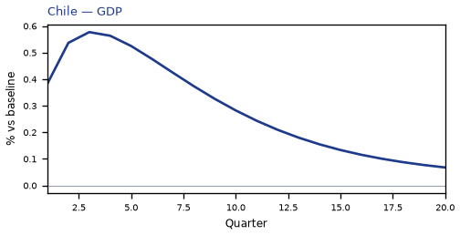

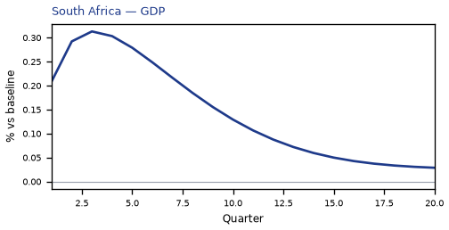

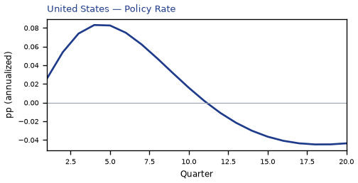

## CL — Chile

The main impact of a 20% metals-supply cut on Chile is a large rise in GDP of 0.58% by Q3. This is a model impulse response versus baseline, not a forecast. Equities firm 1.29% by Q3. The three-year CPI impulse is +0.18 percentage points.

Demand and trade. The trade balance (net exports — this model does not split imports from exports) improves to +3.81% in Q3; private investment / the cost of capital rises 1.54% by Q2; government spending rises 1.26% by Q3; government debt rises 0.38% by Q11; the same direction shows up in household consumption.

Labour. Real wages rises 0.66% by Q20; employment rises 0.46% by Q7; unemployment eases by -0.18 percentage points in Q7.

Prices. Firms' marginal cost rises 0.35% by Q3; CPI inflation, domestic inflation stay close to baseline.

Policy rates and the government curve. Bond prices (higher discount rates) cheapen 0.65% by Q5; 10-year bond prices cheapen 0.42% by Q1; 5-year bond prices cheapen 0.38% by Q1; 30-year bond prices cheapen 0.32% by Q1; the same direction shows up in 2-year bond prices, the local policy rate, 3-month government yields; the rest of the government curve barely moves.

Exchange rates. Versus the dollar the home currency is stronger versus the dollar (-12.67% in Q3); the real exchange rate shows a real appreciation (a stronger home currency), peaking at -12.25% in Q3; the NEER prints a trade-weighted appreciation (+11.80% in Q3).

Equities and risk. Equity prices / financial conditions rises 1.29% by Q3; Tobin's Q (the value of installed capital) rises 1.08% by Q2; the VIX (global equity-implied volatility) stay close to baseline.

Housing and credit. House prices rise 0.50% by Q11; house prices and bank credit are close to unchanged.

Commodities. The metals price index moves to 143.2 in Q3; other published commodity prices stay near their baselines.

Sectors and capital. Manufacturing output rises 3.78% by Q3; services output rises 0.35% by Q3; the capital stock stay close to baseline.

The GDP response has mostly faded by Q15 (Q20 is still +0.07%).

These figures are model IRFs versus baseline, not forecasts and not financial advice.

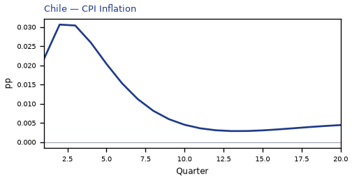

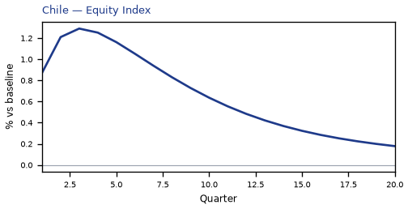

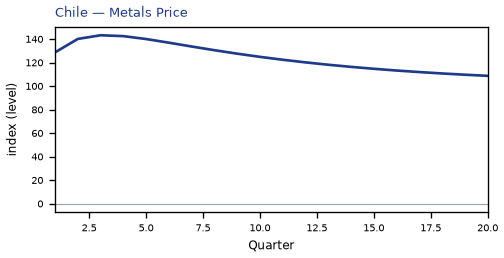

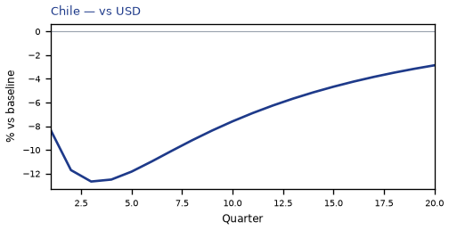

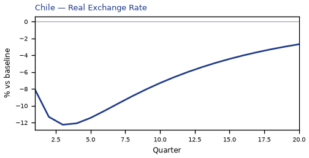

[Q1–Q20 JSON for Chile](numbers/CL.json)

## AU — Australia

The main impact of a 20% metals-supply cut on Australia is a large rise in GDP of 0.44% by Q3. This is a model impulse response versus baseline, not a forecast. Equities firm 1.08% by Q3. The three-year CPI impulse is +0.06 percentage points.

Demand and trade. The trade balance (net exports — this model does not split imports from exports) improves to +2.96% in Q3; private investment / the cost of capital rises 1.14% by Q2; government spending rises 0.52% by Q3; household consumption rises 0.29% by Q4; the same direction shows up in government debt.

Labour. Real wages rises 0.42% by Q20; employment rises 0.39% by Q7; unemployment eases by -0.20 percentage points in Q7.

Prices. Firms' marginal cost rises 0.27% by Q3; CPI inflation, domestic inflation stay close to baseline.

Policy rates and the government curve. Bond prices (higher discount rates) cheapen 1.26% by Q7; 10-year bond prices cheapen 0.66% by Q1; 5-year bond prices cheapen 0.60% by Q2; 30-year bond prices cheapen 0.49% by Q1; the same direction shows up in 2-year bond prices, the local policy rate, 3-month government yields; the rest of the government curve barely moves.

Exchange rates. Versus the dollar the home currency is stronger versus the dollar (-28.77% in Q3); the NEER prints a trade-weighted appreciation (+28.49% in Q3); the real exchange rate shows a real appreciation (a stronger home currency), peaking at -28.35% in Q3.

Equities and risk. Equity prices / financial conditions rises 1.08% by Q3; Tobin's Q (the value of installed capital) rises 0.80% by Q2; the VIX (global equity-implied volatility) stay close to baseline.

Housing and credit. House prices rise 0.29% by Q12; house prices and bank credit are close to unchanged.

Commodities. The metals price index moves to 143.2 in Q3; other published commodity prices stay near their baselines.

Sectors and capital. Manufacturing output rises 8.57% by Q3; services output rises 0.32% by Q3; the capital stock stay close to baseline.

The GDP response has mostly faded by Q15 (Q20 is still +0.04%).

These figures are model IRFs versus baseline, not forecasts and not financial advice.

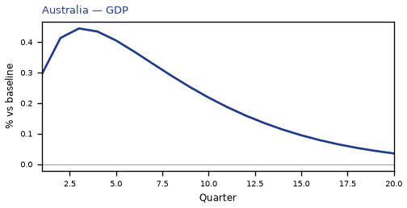

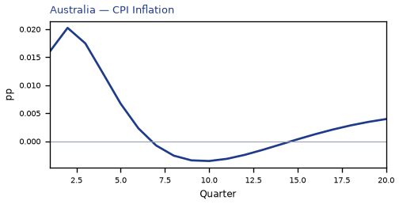

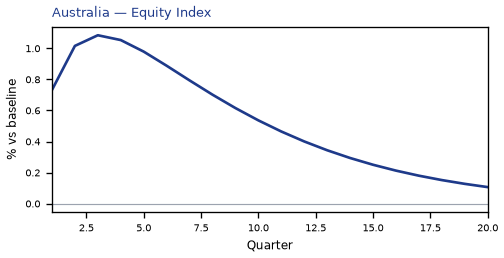

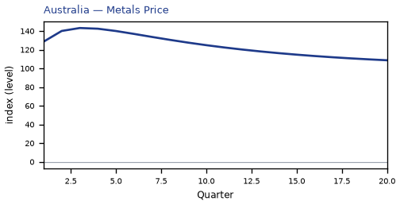

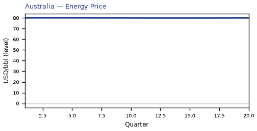

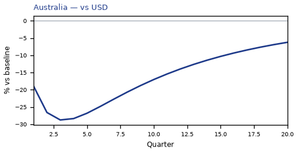

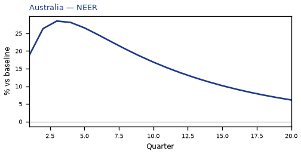

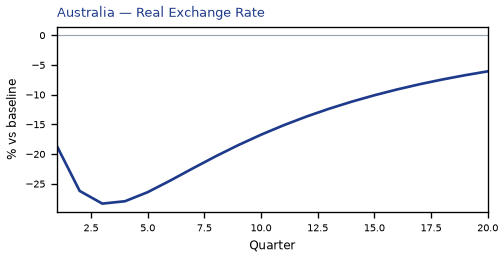

[Q1–Q20 JSON for Australia](numbers/AU.json)

## ZA — South Africa

The main impact of a 20% metals-supply cut on South Africa is a large rise in GDP of 0.31% by Q3. This is a model impulse response versus baseline, not a forecast. Equities firm 1.22% by Q3. The three-year CPI impulse is +0.15 percentage points.

Demand and trade. The trade balance (net exports — this model does not split imports from exports) improves to +2.12% in Q3; private investment / the cost of capital rises 0.80% by Q2; government spending rises 0.27% by Q3; household consumption rises 0.18% by Q4; the same direction shows up in government debt.

Labour. Real wages rises 0.36% by Q19; employment rises 0.25% by Q7; unemployment eases by -0.07 percentage points in Q6.

Prices. Firms' marginal cost rises 0.19% by Q3; CPI inflation, domestic inflation stay close to baseline.

Policy rates and the government curve. Bond prices (higher discount rates) cheapen 0.50% by Q5; 5-year bond prices cheapen 0.21% by Q1; 2-year bond prices cheapen 0.19% by Q2; 10-year bond prices cheapen 0.18% by Q1; the same direction shows up in 30-year bond prices, the local policy rate, 3-month government yields; the rest of the government curve barely moves.

Exchange rates. Versus the dollar the home currency is stronger versus the dollar (-10.01% in Q3); the real exchange rate shows a real appreciation (a stronger home currency), peaking at -9.59% in Q3; the NEER prints a trade-weighted appreciation (+9.29% in Q3).

Equities and risk. Equity prices / financial conditions rises 1.22% by Q3; Tobin's Q (the value of installed capital) rises 0.56% by Q2; the VIX (global equity-implied volatility) stay close to baseline.

Housing and credit. House prices rise 0.25% by Q10; house prices and bank credit are close to unchanged.

Commodities. The metals price index moves to 143.2 in Q3; other published commodity prices stay near their baselines.

Sectors and capital. Manufacturing output rises 2.93% by Q3; services output rises 0.20% by Q3; the capital stock stay close to baseline.

The GDP response has mostly faded by Q13 (Q20 is still +0.03%).

These figures are model IRFs versus baseline, not forecasts and not financial advice.

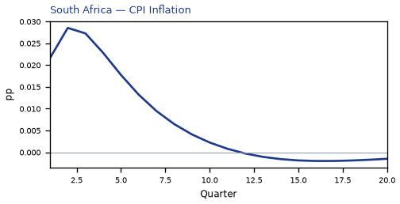

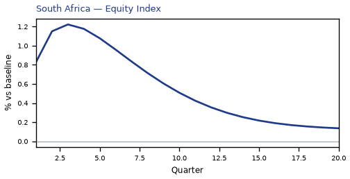

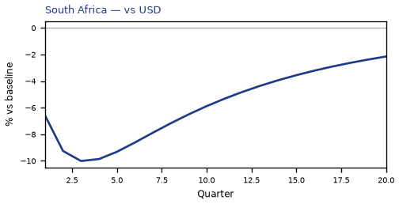

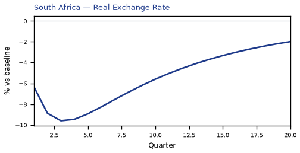

[Q1–Q20 JSON for South Africa](numbers/ZA.json)

## RU — Russia

The main impact of a 20% metals-supply cut on Russia is a moderate rise in GDP of 0.18% by Q3. This is a model impulse response versus baseline, not a forecast. Equities firm 0.28% by Q3. The three-year CPI impulse is +0.18 percentage points.

Demand and trade. The trade balance (net exports — this model does not split imports from exports) improves to +1.28% in Q3; private investment / the cost of capital rises 0.44% by Q2; government spending rises 0.38% by Q3; household consumption rises 0.10% by Q4; government debt stay close to baseline.

Labour. Real wages rises 0.25% by Q15; employment rises 0.13% by Q7; unemployment eases by -0.05 percentage points in Q6.

Prices. Firms' marginal cost rises 0.11% by Q3; CPI inflation, domestic inflation stay close to baseline.

Policy rates and the government curve. Bond prices (higher discount rates) cheapen 0.41% by Q5; 5-year bond prices cheapen 0.21% by Q1; 2-year bond prices cheapen 0.20% by Q2; 10-year bond prices cheapen 0.13% by Q1; the same direction shows up in the local policy rate, 3-month government yields, 2-year government yields; the rest of the government curve barely moves.

Exchange rates. Versus the dollar the home currency is stronger versus the dollar (-0.98% in Q3); the NEER prints a trade-weighted appreciation (+0.62% in Q3); the real exchange rate shows a real appreciation (a stronger home currency), peaking at -0.56% in Q3.

Equities and risk. Tobin's Q (the value of installed capital) rises 0.31% by Q2; equity prices / financial conditions rises 0.28% by Q3; the VIX (global equity-implied volatility) stay close to baseline.

Housing and credit. House prices rise 0.13% by Q8; house prices and bank credit are close to unchanged.

Commodities. The metals price index moves to 143.2 in Q3; other published commodity prices stay near their baselines.

Sectors and capital. Manufacturing output rises 0.20% by Q3; services output rises 0.10% by Q3; the capital stock stay close to baseline.

The GDP response has mostly faded by Q10 (Q20 is still -0.02%).

These figures are model IRFs versus baseline, not forecasts and not financial advice.

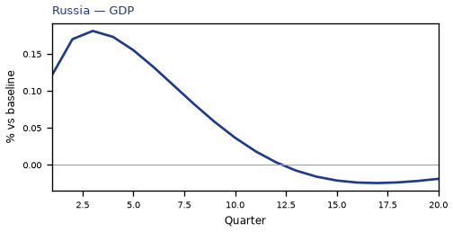

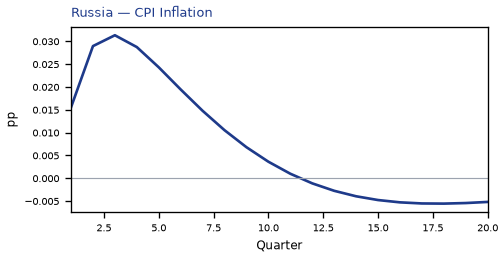

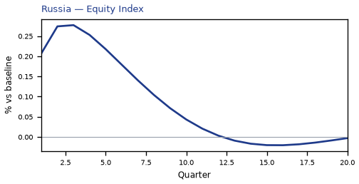

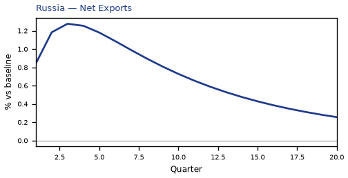

[Q1–Q20 JSON for Russia](numbers/RU.json)

## KR — South Korea

The main impact of a 20% metals-supply cut on South Korea is a moderate drop in GDP of 0.18% by Q3. This is a model impulse response versus baseline, not a forecast. Equities soften 0.46% by Q4. The three-year CPI impulse is +0.13 percentage points.

Demand and trade. The trade balance (net exports — this model does not split imports from exports) softens to -1.05% in Q3; private investment / the cost of capital falls 0.54% by Q3; household consumption falls 0.11% by Q4; government debt falls 0.09% by Q16; government spending stay close to baseline.

Labour. Real wages falls 0.15% by Q20; employment falls 0.13% by Q10; unemployment rises by +0.06 percentage points in Q8.

Prices. Firms' marginal cost falls 0.10% by Q4; CPI inflation, domestic inflation stay close to baseline.

Policy rates and the government curve. Bond prices (higher discount rates) rally 0.29% by Q18; 10-year bond prices rally 0.23% by Q10; 5-year bond prices rally 0.20% by Q12; 30-year bond prices rally 0.17% by Q10; the same direction shows up in 2-year bond prices, the local policy rate, 3-month government yields; the rest of the government curve barely moves.

Exchange rates. The NEER prints a trade-weighted depreciation (-3.10% in Q3); the real exchange rate shows a real depreciation (a weaker, more competitive home currency), peaking at +1.36% in Q3; versus the dollar the home currency is weaker versus the dollar (+0.95% in Q4).

Equities and risk. Equity prices / financial conditions falls 0.46% by Q4; Tobin's Q (the value of installed capital) falls 0.38% by Q3; the VIX (global equity-implied volatility) stay close to baseline.

Housing and credit. House prices fall 0.15% by Q14; house prices and bank credit are close to unchanged.

Commodities. The metals price index moves to 143.2 in Q3; other published commodity prices stay near their baselines.

Sectors and capital. Manufacturing output falls 0.47% by Q3; services output falls 0.11% by Q3; the capital stock stay close to baseline.

The GDP response has mostly faded by Q19 (Q20 is still -0.03%).

These figures are model IRFs versus baseline, not forecasts and not financial advice.

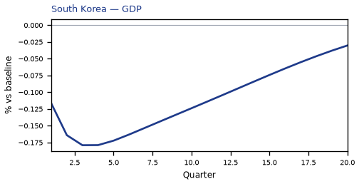

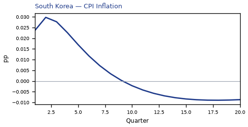

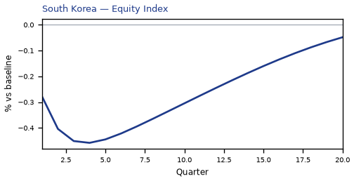

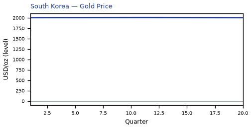

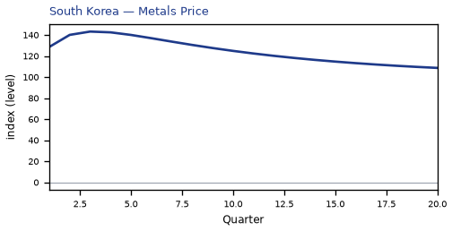

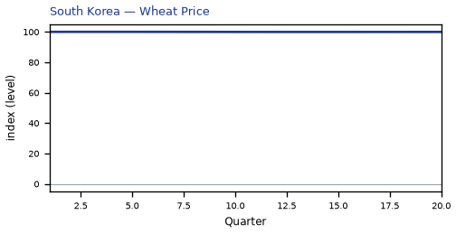

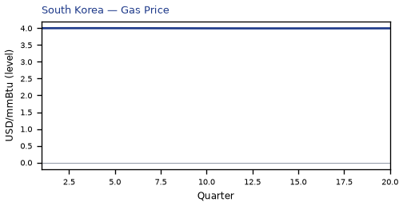

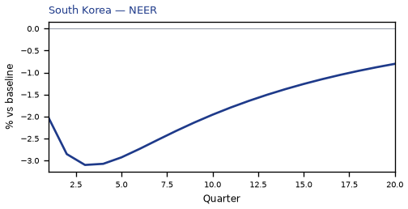

[Q1–Q20 JSON for South Korea](numbers/KR.json)

## AR — Argentina

The main impact of a 20% metals-supply cut on Argentina is a moderate drop in GDP of 0.15% by Q11. This is a model impulse response versus baseline, not a forecast. Equities soften 0.26% by Q10.

Demand and trade. Private investment / the cost of capital falls 0.34% by Q8; government debt falls 0.10% by Q20; household consumption, the trade balance, government spending stay close to baseline.

Labour. Real wages falls 0.24% by Q20; employment falls 0.12% by Q15; unemployment stay close to baseline.

Prices. Firms' marginal cost falls 0.09% by Q11; CPI inflation, domestic inflation stay close to baseline.

Policy rates and the government curve. Bond prices (higher discount rates) cheapen 0.29% by Q3; 5-year bond prices rally 0.25% by Q8; 2-year bond prices rally 0.19% by Q11; 10-year bond prices rally 0.13% by Q8; the same direction shows up in the local policy rate, 3-month government yields, 2-year government yields; the rest of the government curve barely moves.

Exchange rates. Versus the dollar the home currency is stronger versus the dollar (-0.80% in Q3); the NEER prints a trade-weighted depreciation (-0.51% in Q5); the real exchange rate shows a real appreciation (a stronger home currency), peaking at -0.38% in Q3.

Equities and risk. Equity prices / financial conditions falls 0.26% by Q10; Tobin's Q (the value of installed capital) falls 0.24% by Q8; the VIX (global equity-implied volatility) stay close to baseline.

Housing and credit. House prices fall 0.13% by Q15; house prices and bank credit are close to unchanged.

Commodities. The metals price index moves to 143.2 in Q3; other published commodity prices stay near their baselines.

Sectors and capital. Manufacturing output rises 0.11% by Q3; services output falls 0.08% by Q11; the capital stock stay close to baseline.

The GDP response has mostly faded by Q18 (Q20 is still +0.01%).

These figures are model IRFs versus baseline, not forecasts and not financial advice.

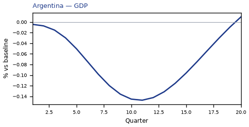

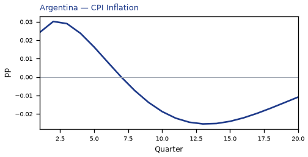

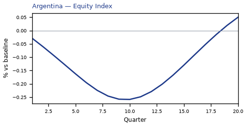

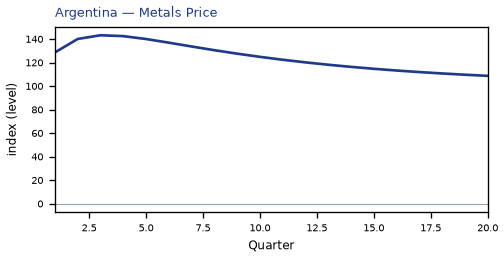

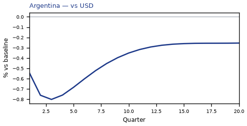

[Q1–Q20 JSON for Argentina](numbers/AR.json)

## JP — Japan

The main impact of a 20% metals-supply cut on Japan is a moderate drop in GDP of 0.15% by Q3. This is a model impulse response versus baseline, not a forecast. Equities soften 0.40% by Q4. The three-year CPI impulse is +0.09 percentage points.

Demand and trade. The trade balance (net exports — this model does not split imports from exports) softens to -0.85% in Q3; private investment / the cost of capital falls 0.40% by Q3; household consumption falls 0.09% by Q4; government spending, government debt stay close to baseline.

Labour. Employment falls 0.11% by Q8; unemployment rises by +0.08 percentage points in Q8; real wages stay close to baseline.

Prices. CPI inflation, domestic inflation, firms' marginal cost stay close to baseline.

Policy rates and the government curve. Bond prices (higher discount rates) cheapen 0.17% by Q5; the rest of the government curve barely moves.

Exchange rates. The NEER prints a trade-weighted depreciation (-3.41% in Q3); the real exchange rate shows a real depreciation (a weaker, more competitive home currency), peaking at +0.99% in Q4; versus the dollar the home currency is weaker versus the dollar (+0.57% in Q4).

Equities and risk. Equity prices / financial conditions falls 0.40% by Q4; Tobin's Q (the value of installed capital) falls 0.28% by Q3; the VIX (global equity-implied volatility) stay close to baseline.

Housing and credit. House prices fall 0.11% by Q15; house prices and bank credit are close to unchanged.

Commodities. The metals price index moves to 143.2 in Q3; other published commodity prices stay near their baselines.

Sectors and capital. Manufacturing output falls 0.34% by Q4; services output falls 0.10% by Q3; the capital stock stay close to baseline.

The GDP response has mostly faded by Q20 (Q20 is still -0.03%).

These figures are model IRFs versus baseline, not forecasts and not financial advice.

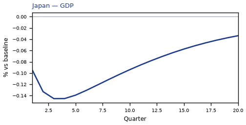

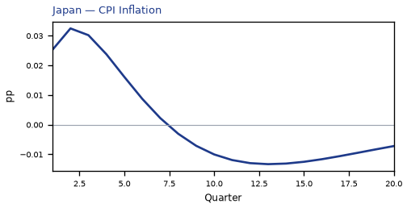

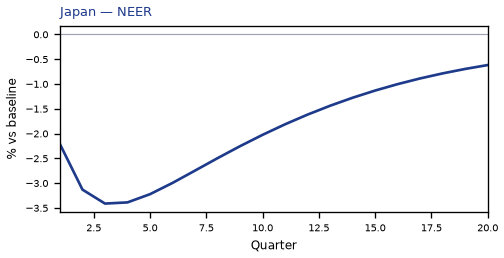

[Q1–Q20 JSON for Japan](numbers/JP.json)

## DE — Germany

The main impact of a 20% metals-supply cut on Germany is a moderate drop in GDP of 0.12% by Q4. This is a model impulse response versus baseline, not a forecast. Equities soften 0.25% by Q4. The three-year CPI impulse is +0.06 percentage points.

Demand and trade. The trade balance (net exports — this model does not split imports from exports) softens to -0.64% in Q3; private investment / the cost of capital falls 0.38% by Q4; household consumption, government spending, government debt stay close to baseline.

Labour. Employment falls 0.09% by Q10; real wages falls 0.08% by Q20; unemployment rises by +0.07 percentage points in Q9.

Prices. CPI inflation, domestic inflation, firms' marginal cost stay close to baseline.

Policy rates and the government curve. Bond prices (higher discount rates) cheapen 0.37% by Q5; 10-year bond prices rally 0.11% by Q13; 5-year bond prices rally 0.10% by Q15; 30-year bond prices rally 0.09% by Q13; the same direction shows up in 2-year bond prices, the local policy rate, 3-month government yields; the rest of the government curve barely moves.

Exchange rates. The NEER prints a trade-weighted depreciation (-0.99% in Q3); the real exchange rate shows a real depreciation (a weaker, more competitive home currency), peaking at +0.87% in Q3; versus the dollar the home currency is weaker versus the dollar (+0.46% in Q3).

Equities and risk. Tobin's Q (the value of installed capital) falls 0.27% by Q4; equity prices / financial conditions falls 0.25% by Q4; the VIX (global equity-implied volatility) stay close to baseline.

Housing and credit. House prices fall 0.11% by Q15; house prices and bank credit are close to unchanged.

Commodities. The metals price index moves to 143.2 in Q3; other published commodity prices stay near their baselines.

Sectors and capital. Manufacturing output falls 0.30% by Q3; services output falls 0.08% by Q4; the capital stock stay close to baseline.

The GDP response has mostly faded by Q20 (Q20 is still -0.03%).

These figures are model IRFs versus baseline, not forecasts and not financial advice.

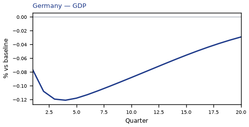

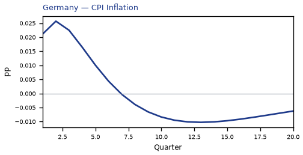

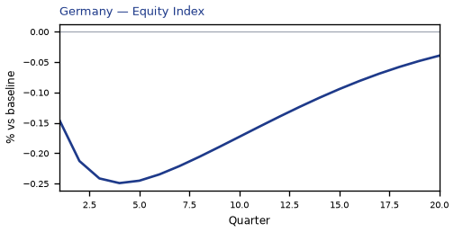

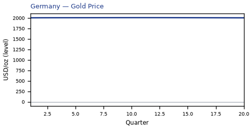

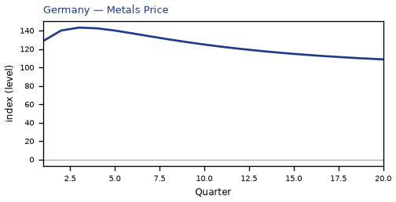

[Q1–Q20 JSON for Germany](numbers/DE.json)

## SE — Sweden

The main impact of a 20% metals-supply cut on Sweden is a moderate rise in GDP of 0.12% by Q3. This is a model impulse response versus baseline, not a forecast. Equities firm 0.32% by Q3. The three-year CPI impulse is +0.10 percentage points.

Demand and trade. The trade balance (net exports — this model does not split imports from exports) improves to +0.84% in Q3; private investment / the cost of capital rises 0.28% by Q2; household consumption, government spending, government debt stay close to baseline.

Labour. Real wages rises 0.13% by Q18; employment rises 0.08% by Q8; unemployment eases by -0.05 percentage points in Q6.

Prices. CPI inflation, domestic inflation, firms' marginal cost stay close to baseline.

Policy rates and the government curve. Bond prices (higher discount rates) cheapen 0.47% by Q5; 5-year bond prices cheapen 0.12% by Q1; 2-year bond prices cheapen 0.12% by Q2; the local policy rate rises 0.08 percentage points by Q5; the same direction shows up in 3-month government yields, 2-year government yields; the rest of the government curve barely moves.

Exchange rates. Versus the dollar the home currency is stronger versus the dollar (-4.77% in Q3); the NEER prints a trade-weighted appreciation (+4.47% in Q3); the real exchange rate shows a real appreciation (a stronger home currency), peaking at -4.35% in Q3.

Equities and risk. Equity prices / financial conditions rises 0.32% by Q3; Tobin's Q (the value of installed capital) rises 0.20% by Q2; the VIX (global equity-implied volatility) stay close to baseline.

Housing and credit. House prices and bank credit are close to unchanged.

Commodities. The metals price index moves to 143.2 in Q3; other published commodity prices stay near their baselines.

Sectors and capital. Manufacturing output rises 1.33% by Q3; services output rises 0.08% by Q3; the capital stock stay close to baseline.

The GDP response has mostly faded by Q14 (Q20 is still +0.02%).

These figures are model IRFs versus baseline, not forecasts and not financial advice.

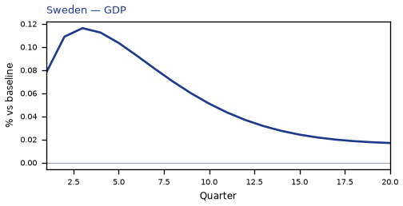

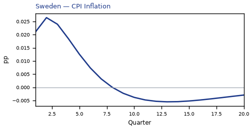

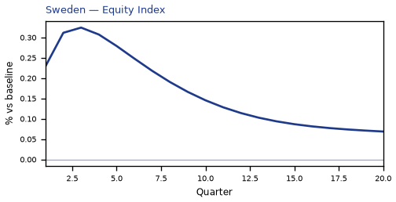

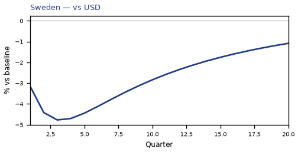

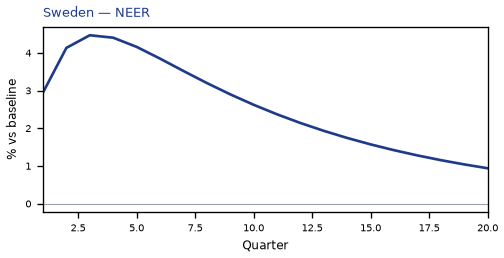

[Q1–Q20 JSON for Sweden](numbers/SE.json)

## BR — Brazil

The main impact of a 20% metals-supply cut on Brazil is a moderate rise in GDP of 0.12% by Q3. This is a model impulse response versus baseline, not a forecast. Equities firm 0.20% by Q2. The three-year CPI impulse is +0.13 percentage points.

Demand and trade. The trade balance (net exports — this model does not split imports from exports) improves to +0.85% in Q3; private investment / the cost of capital rises 0.20% by Q2; government spending rises 0.13% by Q3; household consumption, government debt stay close to baseline.

Labour. Real wages rises 0.14% by Q13; employment, unemployment stay close to baseline.

Prices. CPI inflation, domestic inflation, firms' marginal cost stay close to baseline.

Policy rates and the government curve. Bond prices (higher discount rates) cheapen 0.68% by Q4; 2-year bond prices cheapen 0.24% by Q2; 5-year bond prices cheapen 0.17% by Q1; the local policy rate rises 0.16 percentage points by Q4; the same direction shows up in 3-month government yields, 10-year bond prices, 2-year government yields; the rest of the government curve barely moves.

Exchange rates. Versus the dollar the home currency is stronger versus the dollar (-2.72% in Q3); the real exchange rate shows a real appreciation (a stronger home currency), peaking at -2.30% in Q3; the NEER prints a trade-weighted appreciation (+1.90% in Q3).

Equities and risk. Equity prices / financial conditions rises 0.20% by Q2; Tobin's Q (the value of installed capital) rises 0.14% by Q2; the VIX (global equity-implied volatility) stay close to baseline.

Housing and credit. House prices and bank credit are close to unchanged.

Commodities. The metals price index moves to 143.2 in Q3; other published commodity prices stay near their baselines.

Sectors and capital. Manufacturing output rises 0.71% by Q3; services output, the capital stock stay close to baseline.

The GDP response has mostly faded by Q8 (Q20 is still -0.03%).

These figures are model IRFs versus baseline, not forecasts and not financial advice.

[Q1–Q20 JSON for Brazil](numbers/BR.json)

## TR — Turkey

The main impact of a 20% metals-supply cut on Turkey is a moderate drop in GDP of 0.11% by Q9. This is a model impulse response versus baseline, not a forecast. Equities soften 0.23% by Q7. The three-year CPI impulse is +0.08 percentage points.

Demand and trade. The trade balance (net exports — this model does not split imports from exports) softens to -0.42% in Q3; private investment / the cost of capital falls 0.37% by Q5; government debt falls 0.11% by Q17; household consumption, government spending stay close to baseline.

Labour. Real wages falls 0.17% by Q20; employment falls 0.10% by Q14; unemployment stay close to baseline.

Prices. CPI inflation, domestic inflation, firms' marginal cost stay close to baseline.

Policy rates and the government curve. Bond prices (higher discount rates) cheapen 0.29% by Q4; 5-year bond prices rally 0.19% by Q9; 10-year bond prices rally 0.14% by Q9; 2-year bond prices rally 0.12% by Q13; the same direction shows up in 30-year bond prices, the local policy rate, 3-month government yields; the rest of the government curve barely moves.

Exchange rates. The NEER prints a trade-weighted depreciation (-0.34% in Q6); the real exchange rate shows a real depreciation (a weaker, more competitive home currency), peaking at +0.29% in Q8; versus the dollar the home currency is stronger versus the dollar (-0.18% in Q2).

Equities and risk. Tobin's Q (the value of installed capital) falls 0.26% by Q5; equity prices / financial conditions falls 0.23% by Q7; the VIX (global equity-implied volatility) stay close to baseline.

Housing and credit. House prices fall 0.13% by Q14; house prices and bank credit are close to unchanged.

Commodities. The metals price index moves to 143.2 in Q3; other published commodity prices stay near their baselines.

Sectors and capital. Manufacturing output falls 0.12% by Q8; services output, the capital stock stay close to baseline.

The GDP response has mostly faded by Q18 (Q20 is still +0.00%).

These figures are model IRFs versus baseline, not forecasts and not financial advice.

[Q1–Q20 JSON for Turkey](numbers/TR.json)

## IT — Italy

The main impact of a 20% metals-supply cut on Italy is only a small drop in GDP of 0.10% by Q4. This is a model impulse response versus baseline, not a forecast. Equities soften 0.20% by Q4. The three-year CPI impulse is +0.08 percentage points.

Demand and trade. The trade balance (net exports — this model does not split imports from exports) softens to -0.51% in Q3; private investment / the cost of capital falls 0.32% by Q4; household consumption, government spending, government debt stay close to baseline.

Labour. Employment, unemployment, real wages stay close to baseline.

Prices. CPI inflation, domestic inflation, firms' marginal cost stay close to baseline.

Policy rates and the government curve. Bond prices (higher discount rates) cheapen 0.37% by Q5; 10-year bond prices rally 0.11% by Q13; 5-year bond prices rally 0.10% by Q15; 30-year bond prices rally 0.09% by Q13; the same direction shows up in 2-year bond prices, the local policy rate, 3-month government yields; the rest of the government curve barely moves.

Exchange rates. The real exchange rate shows a real depreciation (a weaker, more competitive home currency), peaking at +0.44% in Q3; the NEER prints a trade-weighted depreciation (-0.38% in Q3); versus the dollar the home currency is stronger versus the dollar (-0.10% in Q18).

Equities and risk. Tobin's Q (the value of installed capital) falls 0.22% by Q4; equity prices / financial conditions falls 0.20% by Q4; the VIX (global equity-implied volatility) stay close to baseline.

Housing and credit. House prices fall 0.08% by Q15; house prices and bank credit are close to unchanged.

Commodities. The metals price index moves to 143.2 in Q3; other published commodity prices stay near their baselines.

Sectors and capital. Manufacturing output falls 0.15% by Q3; services output, the capital stock stay close to baseline.

The GDP response has mostly faded by Q20 (Q20 is still -0.02%).

These figures are model IRFs versus baseline, not forecasts and not financial advice.

[Q1–Q20 JSON for Italy](numbers/IT.json)

## PL — Poland

The main impact of a 20% metals-supply cut on Poland is only a small drop in GDP of 0.08% by Q4. This is a model impulse response versus baseline, not a forecast. Equities soften 0.20% by Q4. The three-year CPI impulse is +0.08 percentage points.

Demand and trade. The trade balance (net exports — this model does not split imports from exports) softens to -0.42% in Q3; private investment / the cost of capital falls 0.33% by Q4; household consumption, government spending, government debt stay close to baseline.

Labour. Employment, unemployment, real wages stay close to baseline.

Prices. CPI inflation, domestic inflation, firms' marginal cost stay close to baseline.

Policy rates and the government curve. Bond prices (higher discount rates) cheapen 0.30% by Q4; 10-year bond prices rally 0.13% by Q12; 5-year bond prices rally 0.12% by Q13; 30-year bond prices rally 0.10% by Q12; the same direction shows up in 2-year bond prices, the local policy rate, 3-month government yields; the rest of the government curve barely moves.

Exchange rates. The real exchange rate shows a real depreciation (a weaker, more competitive home currency), peaking at +0.86% in Q3; the NEER prints a trade-weighted depreciation (-0.70% in Q3); versus the dollar the home currency is weaker versus the dollar (+0.44% in Q3).

Equities and risk. Tobin's Q (the value of installed capital) falls 0.23% by Q4; equity prices / financial conditions falls 0.20% by Q4; the VIX (global equity-implied volatility) stay close to baseline.

Housing and credit. House prices fall 0.09% by Q15; house prices and bank credit are close to unchanged.

Commodities. The metals price index moves to 143.2 in Q3; other published commodity prices stay near their baselines.

Sectors and capital. Manufacturing output falls 0.28% by Q3; services output, the capital stock stay close to baseline.

The GDP response has mostly faded by Q20 (Q20 is still -0.02%).

These figures are model IRFs versus baseline, not forecasts and not financial advice.

[Q1–Q20 JSON for Poland](numbers/PL.json)

## FR — France

The main impact of a 20% metals-supply cut on France is only a small drop in GDP of 0.07% by Q4. This is a model impulse response versus baseline, not a forecast. Equities soften 0.19% by Q5. The three-year CPI impulse is +0.08 percentage points.

Demand and trade. The trade balance (net exports — this model does not split imports from exports) softens to -0.34% in Q3; private investment / the cost of capital falls 0.27% by Q4; household consumption, government spending, government debt stay close to baseline.

Labour. Employment, unemployment, real wages stay close to baseline.

Prices. CPI inflation, domestic inflation, firms' marginal cost stay close to baseline.

Policy rates and the government curve. Bond prices (higher discount rates) cheapen 0.37% by Q5; 10-year bond prices rally 0.11% by Q13; 5-year bond prices rally 0.10% by Q15; 30-year bond prices rally 0.09% by Q13; the same direction shows up in 2-year bond prices, the local policy rate, 3-month government yields; the rest of the government curve barely moves.

Exchange rates. The real exchange rate shows a real depreciation (a weaker, more competitive home currency), peaking at +0.44% in Q3; the NEER prints a trade-weighted depreciation (-0.25% in Q3); versus the dollar the home currency is stronger versus the dollar (-0.10% in Q18).

Equities and risk. Equity prices / financial conditions falls 0.19% by Q5; Tobin's Q (the value of installed capital) falls 0.19% by Q4; the VIX (global equity-implied volatility) stay close to baseline.

Housing and credit. House prices and bank credit are close to unchanged.

Commodities. The metals price index moves to 143.2 in Q3; other published commodity prices stay near their baselines.

Sectors and capital. Manufacturing output falls 0.15% by Q3; services output, the capital stock stay close to baseline.

By Q20, GDP is still -0.02% from baseline.

These figures are model IRFs versus baseline, not forecasts and not financial advice.

[Q1–Q20 JSON for France](numbers/FR.json)

## NG — Nigeria

The main impact of a 20% metals-supply cut on Nigeria is only a small drop in GDP of 0.07% by Q12. This is a model impulse response versus baseline, not a forecast. Equities soften 0.12% by Q9. The three-year CPI impulse is +0.09 percentage points.

Demand and trade. Private investment / the cost of capital falls 0.20% by Q7; government debt falls 0.14% by Q20; household consumption, the trade balance, government spending stay close to baseline.

Labour. Real wages falls 0.08% by Q20; employment, unemployment stay close to baseline.

Prices. CPI inflation, domestic inflation, firms' marginal cost stay close to baseline.

Policy rates and the government curve. Bond prices (higher discount rates) cheapen 0.22% by Q4; 5-year bond prices rally 0.14% by Q10; 2-year bond prices cheapen 0.12% by Q1; 10-year bond prices rally 0.11% by Q10; the same direction shows up in the local policy rate, 3-month government yields, 2-year government yields; the rest of the government curve barely moves.

Exchange rates. Versus the dollar the home currency is stronger versus the dollar (-0.41% in Q3); the NEER prints a trade-weighted depreciation (-0.31% in Q4); the real exchange rate shows a real depreciation (a weaker, more competitive home currency), peaking at +0.08% in Q11.

Equities and risk. Tobin's Q (the value of installed capital) falls 0.14% by Q7; equity prices / financial conditions falls 0.12% by Q9; the VIX (global equity-implied volatility) stay close to baseline.

Housing and credit. House prices and bank credit are close to unchanged.

Commodities. The metals price index moves to 143.2 in Q3; other published commodity prices stay near their baselines.

Sectors and capital. Manufacturing output, services output, the capital stock stay close to baseline.

The GDP response has mostly faded by Q19 (Q20 is still -0.00%).

These figures are model IRFs versus baseline, not forecasts and not financial advice.

[Q1–Q20 JSON for Nigeria](numbers/NG.json)

## UK — United Kingdom

The main impact of a 20% metals-supply cut on United Kingdom is only a small drop in GDP of 0.06% by Q4. This is a model impulse response versus baseline, not a forecast. Equities soften 0.19% by Q4. The three-year CPI impulse is +0.08 percentage points.

Demand and trade. The trade balance (net exports — this model does not split imports from exports) softens to -0.34% in Q3; private investment / the cost of capital falls 0.20% by Q4; household consumption, government spending, government debt stay close to baseline.

Labour. Employment, unemployment, real wages stay close to baseline.

Prices. CPI inflation, domestic inflation, firms' marginal cost stay close to baseline.

Policy rates and the government curve. Bond prices (higher discount rates) cheapen 0.15% by Q6; the rest of the government curve barely moves.

Exchange rates. The NEER prints a trade-weighted depreciation (-0.62% in Q4); the real exchange rate shows a real depreciation (a weaker, more competitive home currency), peaking at +0.51% in Q4; versus the dollar the home currency is stronger versus the dollar (-0.16% in Q19).

Equities and risk. Equity prices / financial conditions falls 0.19% by Q4; Tobin's Q (the value of installed capital) falls 0.14% by Q4; the VIX (global equity-implied volatility) stay close to baseline.

Housing and credit. House prices and bank credit are close to unchanged.

Commodities. The metals price index moves to 143.2 in Q3; other published commodity prices stay near their baselines.

Sectors and capital. Manufacturing output falls 0.16% by Q4; services output, the capital stock stay close to baseline.

The GDP response has mostly faded by Q20 (Q20 is still -0.02%).

These figures are model IRFs versus baseline, not forecasts and not financial advice.

[Q1–Q20 JSON for United Kingdom](numbers/UK.json)

## ES — Spain

The main impact of a 20% metals-supply cut on Spain is only a small drop in GDP of 0.06% by Q4. This is a model impulse response versus baseline, not a forecast. Equities soften 0.16% by Q4. The three-year CPI impulse is +0.08 percentage points.

Demand and trade. The trade balance (net exports — this model does not split imports from exports) softens to -0.34% in Q3; private investment / the cost of capital falls 0.24% by Q4; household consumption, government spending, government debt stay close to baseline.

Labour. Employment, unemployment, real wages stay close to baseline.

Prices. CPI inflation, domestic inflation, firms' marginal cost stay close to baseline.

Policy rates and the government curve. Bond prices (higher discount rates) cheapen 0.37% by Q5; 10-year bond prices rally 0.11% by Q13; 5-year bond prices rally 0.10% by Q15; 30-year bond prices rally 0.09% by Q13; the same direction shows up in 2-year bond prices, the local policy rate, 3-month government yields; the rest of the government curve barely moves.

Exchange rates. The NEER prints a trade-weighted depreciation (-0.54% in Q3); the real exchange rate shows a real depreciation (a weaker, more competitive home currency), peaking at +0.44% in Q3; versus the dollar the home currency is stronger versus the dollar (-0.10% in Q18).

Equities and risk. Tobin's Q (the value of installed capital) falls 0.17% by Q4; equity prices / financial conditions falls 0.16% by Q4; the VIX (global equity-implied volatility) stay close to baseline.

Housing and credit. House prices and bank credit are close to unchanged.

Commodities. The metals price index moves to 143.2 in Q3; other published commodity prices stay near their baselines.

Sectors and capital. Manufacturing output falls 0.14% by Q3; services output, the capital stock stay close to baseline.

The GDP response has mostly faded by Q20 (Q20 is still -0.02%).

These figures are model IRFs versus baseline, not forecasts and not financial advice.

[Q1–Q20 JSON for Spain](numbers/ES.json)

## TH — Thailand

The main impact of a 20% metals-supply cut on Thailand is only a small drop in GDP of 0.06% by Q4. This is a model impulse response versus baseline, not a forecast. Equities soften 0.19% by Q4. The three-year CPI impulse is +0.10 percentage points.

Demand and trade. The trade balance (net exports — this model does not split imports from exports) softens to -0.33% in Q3; private investment / the cost of capital falls 0.24% by Q4; household consumption, government spending, government debt stay close to baseline.

Labour. Employment, unemployment, real wages stay close to baseline.

Prices. CPI inflation, domestic inflation, firms' marginal cost stay close to baseline.

Policy rates and the government curve. Bond prices (higher discount rates) cheapen 0.22% by Q4; 10-year bond prices rally 0.13% by Q12; 5-year bond prices rally 0.12% by Q13; 30-year bond prices rally 0.10% by Q11; the same direction shows up in the local policy rate, 3-month government yields; the rest of the government curve barely moves.

Exchange rates. The NEER prints a trade-weighted depreciation (-0.97% in Q3); the real exchange rate shows a real depreciation (a weaker, more competitive home currency), peaking at +0.25% in Q4; versus the dollar the home currency is stronger versus the dollar (-0.17% in Q3).

Equities and risk. Equity prices / financial conditions falls 0.19% by Q4; Tobin's Q (the value of installed capital) falls 0.17% by Q4; the VIX (global equity-implied volatility) stay close to baseline.

Housing and credit. House prices fall 0.08% by Q14; house prices and bank credit are close to unchanged.

Commodities. The metals price index moves to 143.2 in Q3; other published commodity prices stay near their baselines.

Sectors and capital. Manufacturing output falls 0.10% by Q4; services output, the capital stock stay close to baseline.

The GDP response has mostly faded by Q20 (Q20 is still -0.01%).

These figures are model IRFs versus baseline, not forecasts and not financial advice.

[Q1–Q20 JSON for Thailand](numbers/TH.json)

## CA — Canada

The main impact of a 20% metals-supply cut on Canada is only a small rise in GDP of 0.06% by Q3. This is a model impulse response versus baseline, not a forecast. Equities firm 0.13% by Q2. The three-year CPI impulse is +0.07 percentage points.

Demand and trade. The trade balance (net exports — this model does not split imports from exports) improves to +0.42% in Q3; government spending rises 0.10% by Q3; private investment / the cost of capital rises 0.09% by Q2; household consumption, government debt stay close to baseline.

Labour. Employment, unemployment, real wages stay close to baseline.

Prices. CPI inflation, domestic inflation, firms' marginal cost stay close to baseline.

Policy rates and the government curve. Bond prices (higher discount rates) cheapen 0.60% by Q5; 2-year bond prices cheapen 0.16% by Q2; 5-year bond prices cheapen 0.14% by Q1; the local policy rate rises 0.10 percentage points by Q5; the same direction shows up in 3-month government yields, 2-year government yields, 10-year bond prices; the rest of the government curve barely moves.

Exchange rates. Versus the dollar the home currency is stronger versus the dollar (-0.91% in Q3); the real exchange rate shows a real appreciation (a stronger home currency), peaking at -0.50% in Q4; the NEER prints a trade-weighted appreciation (+0.49% in Q4).

Equities and risk. Equity prices / financial conditions rises 0.13% by Q2; the VIX (global equity-implied volatility), Tobin's Q (the value of installed capital) stay close to baseline.

Housing and credit. House prices and bank credit are close to unchanged.

Commodities. The metals price index moves to 143.2 in Q3; other published commodity prices stay near their baselines.

Sectors and capital. Manufacturing output rises 0.16% by Q4; services output, the capital stock stay close to baseline.

The GDP response has mostly faded by Q9 (Q20 is still -0.00%).

These figures are model IRFs versus baseline, not forecasts and not financial advice.

[Q1–Q20 JSON for Canada](numbers/CA.json)

## IN — India

The main impact of a 20% metals-supply cut on India is only a small drop in GDP of 0.06% by Q12. This is a model impulse response versus baseline, not a forecast. Equities soften 0.14% by Q11. The three-year CPI impulse is +0.11 percentage points.

Demand and trade. Private investment / the cost of capital falls 0.17% by Q7; the trade balance (net exports — this model does not split imports from exports) improves to +0.08% in Q4; household consumption, government spending, government debt stay close to baseline.

Labour. Employment, unemployment, real wages stay close to baseline.

Prices. CPI inflation, domestic inflation, firms' marginal cost stay close to baseline.

Policy rates and the government curve. Bond prices (higher discount rates) cheapen 0.50% by Q4; 5-year bond prices rally 0.14% by Q12; 2-year bond prices cheapen 0.14% by Q2; 10-year bond prices rally 0.13% by Q11; the same direction shows up in the local policy rate, 3-month government yields, 30-year bond prices; the rest of the government curve barely moves.

Exchange rates. The NEER prints a trade-weighted depreciation (-1.64% in Q3); versus the dollar the home currency is stronger versus the dollar (-0.22% in Q3); the real exchange rate shows a real depreciation (a weaker, more competitive home currency), peaking at +0.21% in Q5.

Equities and risk. Equity prices / financial conditions falls 0.14% by Q11; Tobin's Q (the value of installed capital) falls 0.12% by Q7; the VIX (global equity-implied volatility) stay close to baseline.

Housing and credit. House prices and bank credit are close to unchanged.

Commodities. The metals price index moves to 143.2 in Q3; other published commodity prices stay near their baselines.

Sectors and capital. Manufacturing output, services output, the capital stock stay close to baseline.

The GDP response has mostly faded by Q20 (Q20 is still -0.01%).

These figures are model IRFs versus baseline, not forecasts and not financial advice.

[Q1–Q20 JSON for India](numbers/IN.json)

## MX — Mexico

The main impact of a 20% metals-supply cut on Mexico is only a small rise in GDP of 0.05% by Q3. This is a model impulse response versus baseline, not a forecast. The three-year CPI impulse is +0.10 percentage points.

Demand and trade. The trade balance (net exports — this model does not split imports from exports) improves to +0.42% in Q3; government spending rises 0.10% by Q3; private investment / the cost of capital falls 0.08% by Q9; household consumption, government debt stay close to baseline.

Labour. Real wages rises 0.08% by Q13; employment, unemployment stay close to baseline.

Prices. CPI inflation, domestic inflation, firms' marginal cost stay close to baseline.

Policy rates and the government curve. Bond prices (higher discount rates) cheapen 0.44% by Q4; 2-year bond prices cheapen 0.16% by Q2; 5-year bond prices cheapen 0.11% by Q1; the local policy rate rises 0.11 percentage points by Q4; the same direction shows up in 3-month government yields, 10-year bond prices, 2-year government yields; the rest of the government curve barely moves.

Exchange rates. Versus the dollar the home currency is stronger versus the dollar (-1.34% in Q3); the NEER prints a trade-weighted appreciation (+1.07% in Q3); the real exchange rate shows a real appreciation (a stronger home currency), peaking at -0.92% in Q3.

Equities and risk. Equity prices / financial conditions, the VIX (global equity-implied volatility), Tobin's Q (the value of installed capital) stay close to baseline.

Housing and credit. House prices and bank credit are close to unchanged.

Commodities. The metals price index moves to 143.2 in Q3; other published commodity prices stay near their baselines.

Sectors and capital. Manufacturing output rises 0.29% by Q3; services output, the capital stock stay close to baseline.

The GDP response has mostly faded by Q8 (Q20 is still -0.00%).

These figures are model IRFs versus baseline, not forecasts and not financial advice.

[Q1–Q20 JSON for Mexico](numbers/MX.json)

## CO — Colombia

The main impact of a 20% metals-supply cut on Colombia is only a small drop in GDP of 0.05% by Q12. This is a model impulse response versus baseline, not a forecast. Equities soften 0.10% by Q9. The three-year CPI impulse is +0.10 percentage points.

Demand and trade. Private investment / the cost of capital falls 0.18% by Q6; household consumption, the trade balance, government spending, government debt stay close to baseline.

Labour. Employment, unemployment, real wages stay close to baseline.

Prices. CPI inflation, domestic inflation, firms' marginal cost stay close to baseline.

Policy rates and the government curve. Bond prices (higher discount rates) cheapen 0.34% by Q4; 2-year bond prices cheapen 0.13% by Q1; 10-year bond prices rally 0.13% by Q11; 5-year bond prices rally 0.13% by Q12; the same direction shows up in the local policy rate, 3-month government yields, 30-year bond prices; the rest of the government curve barely moves.

Exchange rates. Versus the dollar the home currency is stronger versus the dollar (-0.87% in Q3); the real exchange rate shows a real appreciation (a stronger home currency), peaking at -0.46% in Q3; the NEER prints a trade-weighted appreciation (+0.22% in Q3).

Equities and risk. Tobin's Q (the value of installed capital) falls 0.13% by Q6; equity prices / financial conditions falls 0.10% by Q9; the VIX (global equity-implied volatility) stay close to baseline.

Housing and credit. House prices and bank credit are close to unchanged.

Commodities. The metals price index moves to 143.2 in Q3; other published commodity prices stay near their baselines.

Sectors and capital. Manufacturing output rises 0.14% by Q3; services output, the capital stock stay close to baseline.

The GDP response has mostly faded by Q20 (Q20 is still -0.01%).

These figures are model IRFs versus baseline, not forecasts and not financial advice.

[Q1–Q20 JSON for Colombia](numbers/CO.json)

## ID — Indonesia

The main impact of a 20% metals-supply cut on Indonesia is only a small rise in GDP of 0.04% by Q3. This is a model impulse response versus baseline, not a forecast. The three-year CPI impulse is +0.12 percentage points.

Demand and trade. The trade balance (net exports — this model does not split imports from exports) improves to +0.34% in Q3; private investment / the cost of capital falls 0.08% by Q9; household consumption, government spending, government debt stay close to baseline.

Labour. Real wages rises 0.09% by Q12; employment, unemployment stay close to baseline.

Prices. CPI inflation, domestic inflation, firms' marginal cost stay close to baseline.

Policy rates and the government curve. Bond prices (higher discount rates) cheapen 0.36% by Q5; 2-year bond prices cheapen 0.13% by Q2; 5-year bond prices cheapen 0.11% by Q1; 10-year bond prices rally 0.09% by Q13; the same direction shows up in the local policy rate, 3-month government yields, 2-year government yields; the rest of the government curve barely moves.

Exchange rates. Versus the dollar the home currency is stronger versus the dollar (-0.88% in Q3); the NEER prints a trade-weighted depreciation (-0.62% in Q3); the real exchange rate shows a real appreciation (a stronger home currency), peaking at -0.47% in Q3.

Equities and risk. Equity prices / financial conditions, the VIX (global equity-implied volatility), Tobin's Q (the value of installed capital) stay close to baseline.

Housing and credit. House prices and bank credit are close to unchanged.

Commodities. The metals price index moves to 143.2 in Q3; other published commodity prices stay near their baselines.

Sectors and capital. Manufacturing output rises 0.15% by Q3; services output, the capital stock stay close to baseline.

The GDP response has mostly faded by Q8 (Q20 is still -0.01%).

These figures are model IRFs versus baseline, not forecasts and not financial advice.

[Q1–Q20 JSON for Indonesia](numbers/ID.json)

## SA — Saudi Arabia

The main impact of a 20% metals-supply cut on Saudi Arabia is only a small drop in GDP of 0.04% by Q10. This is a model impulse response versus baseline, not a forecast. Equities soften 0.18% by Q8. The three-year CPI impulse is +0.07 percentage points.

Demand and trade. Private investment / the cost of capital falls 0.22% by Q5; the trade balance (net exports — this model does not split imports from exports) softens to -0.21% in Q3; household consumption, government spending, government debt stay close to baseline.

Labour. Employment, unemployment, real wages stay close to baseline.

Prices. CPI inflation, domestic inflation, firms' marginal cost stay close to baseline.

Policy rates and the government curve. Bond prices (higher discount rates) cheapen 0.42% by Q4; 5-year bond prices rally 0.14% by Q12; 10-year bond prices rally 0.13% by Q11; 2-year bond prices cheapen 0.12% by Q2; the same direction shows up in 30-year bond prices, the local policy rate, 3-month government yields; the rest of the government curve barely moves.

Exchange rates. Versus the dollar the home currency is stronger versus the dollar (-0.43% in Q4); the NEER prints a trade-weighted depreciation (-0.13% in Q3); the real exchange rate stay close to baseline.

Equities and risk. Equity prices / financial conditions falls 0.18% by Q8; Tobin's Q (the value of installed capital) falls 0.16% by Q5; the VIX (global equity-implied volatility) stay close to baseline.

Housing and credit. House prices and bank credit are close to unchanged.

Commodities. The metals price index moves to 143.2 in Q3; other published commodity prices stay near their baselines.

Sectors and capital. Manufacturing output, services output, the capital stock stay close to baseline.

By Q20, GDP is still -0.01% from baseline.

These figures are model IRFs versus baseline, not forecasts and not financial advice.

[Q1–Q20 JSON for Saudi Arabia](numbers/SA.json)

## US — United States

The main impact of a 20% metals-supply cut on the United States is only a small drop in GDP of 0.04% by Q11. This is a model impulse response versus baseline, not a forecast. Equities soften 0.13% by Q10. The three-year CPI impulse is +0.10 percentage points.

Demand and trade. Private investment / the cost of capital falls 0.17% by Q6; household consumption, the trade balance, government spending, government debt stay close to baseline.

Labour. Employment, unemployment, real wages stay close to baseline.

Prices. CPI inflation, domestic inflation, firms' marginal cost stay close to baseline.

Policy rates and the government curve. Bond prices (higher discount rates) cheapen 0.55% by Q4; 5-year bond prices rally 0.14% by Q12; 10-year bond prices rally 0.13% by Q11; 2-year bond prices cheapen 0.12% by Q2; the same direction shows up in 30-year bond prices, the local policy rate, 3-month government yields; the rest of the government curve barely moves.

Exchange rates. The NEER prints a trade-weighted depreciation (-0.85% in Q3); versus the dollar the home currency is stronger versus the dollar (-0.85% in Q3); the real exchange rate shows a real depreciation (a weaker, more competitive home currency), peaking at +0.42% in Q3.

Equities and risk. Equity prices / financial conditions falls 0.13% by Q10; Tobin's Q (the value of installed capital) falls 0.12% by Q6; the VIX (global equity-implied volatility) stay close to baseline.

Housing and credit. House prices and bank credit are close to unchanged.

Commodities. The metals price index moves to 143.2 in Q3; other published commodity prices stay near their baselines.

Sectors and capital. Manufacturing output falls 0.13% by Q3; services output, the capital stock stay close to baseline.

By Q20, GDP is still -0.01% from baseline.

These figures are model IRFs versus baseline, not forecasts and not financial advice.

[Q1–Q20 JSON for United States](numbers/US.json)

## NO — Norway

The main impact of a 20% metals-supply cut on Norway is only a small drop in GDP of 0.03% by Q12. This is a model impulse response versus baseline, not a forecast. The three-year CPI impulse is +0.10 percentage points.

Demand and trade. Private investment / the cost of capital falls 0.12% by Q6; household consumption, the trade balance, government spending, government debt stay close to baseline.

Labour. Employment, unemployment, real wages stay close to baseline.

Prices. CPI inflation, domestic inflation, firms' marginal cost stay close to baseline.

Policy rates and the government curve. Bond prices (higher discount rates) cheapen 0.42% by Q5; 10-year bond prices rally 0.11% by Q13; 2-year bond prices cheapen 0.10% by Q2; 5-year bond prices rally 0.10% by Q14; the same direction shows up in the local policy rate, 3-month government yields, 2-year government yields; the rest of the government curve barely moves.

Exchange rates. Versus the dollar the home currency is stronger versus the dollar (-0.86% in Q3); the real exchange rate shows a real appreciation (a stronger home currency), peaking at -0.44% in Q3; the NEER prints a trade-weighted depreciation (-0.22% in Q3).

Equities and risk. Tobin's Q (the value of installed capital) falls 0.09% by Q6; equity prices / financial conditions, the VIX (global equity-implied volatility) stay close to baseline.

Housing and credit. House prices and bank credit are close to unchanged.

Commodities. The metals price index moves to 143.2 in Q3; other published commodity prices stay near their baselines.

Sectors and capital. Manufacturing output rises 0.13% by Q3; services output, the capital stock stay close to baseline.

By Q20, GDP is still -0.01% from baseline.

These figures are model IRFs versus baseline, not forecasts and not financial advice.

[Q1–Q20 JSON for Norway](numbers/NO.json)

## NL — Netherlands

The main impact of a 20% metals-supply cut on Netherlands is only a small drop in GDP of 0.03% by Q10. This is a model impulse response versus baseline, not a forecast. Equities soften 0.09% by Q7. The three-year CPI impulse is +0.09 percentage points.

Demand and trade. Private investment / the cost of capital falls 0.13% by Q6; household consumption, the trade balance, government spending, government debt stay close to baseline.

Labour. Employment, unemployment, real wages stay close to baseline.

Prices. CPI inflation, domestic inflation, firms' marginal cost stay close to baseline.

Policy rates and the government curve. Bond prices (higher discount rates) cheapen 0.37% by Q5; 10-year bond prices rally 0.11% by Q13; 5-year bond prices rally 0.10% by Q15; 30-year bond prices rally 0.09% by Q13; the same direction shows up in 2-year bond prices, the local policy rate, 3-month government yields; the rest of the government curve barely moves.

Exchange rates. Versus the dollar the home currency is stronger versus the dollar (-0.41% in Q3); the NEER prints a trade-weighted depreciation (-0.12% in Q3); the real exchange rate stay close to baseline.

Equities and risk. Tobin's Q (the value of installed capital) falls 0.09% by Q6; equity prices / financial conditions falls 0.09% by Q7; the VIX (global equity-implied volatility) stay close to baseline.

Housing and credit. House prices and bank credit are close to unchanged.

Commodities. The metals price index moves to 143.2 in Q3; other published commodity prices stay near their baselines.

Sectors and capital. Manufacturing output, services output, the capital stock stay close to baseline.

By Q20, GDP is still -0.01% from baseline.

These figures are model IRFs versus baseline, not forecasts and not financial advice.

[Q1–Q20 JSON for Netherlands](numbers/NL.json)

## MY — Malaysia

The main impact of a 20% metals-supply cut on Malaysia is only a small drop in GDP of 0.02% by Q12. This is a model impulse response versus baseline, not a forecast. The three-year CPI impulse is +0.10 percentage points.

Demand and trade. Private investment / the cost of capital falls 0.11% by Q6; household consumption, the trade balance, government spending, government debt stay close to baseline.

Labour. Employment, unemployment, real wages stay close to baseline.

Prices. CPI inflation, domestic inflation, firms' marginal cost stay close to baseline.

Policy rates and the government curve. Bond prices (higher discount rates) cheapen 0.23% by Q5; 2-year bond prices cheapen 0.09% by Q2; 10-year bond prices rally 0.08% by Q13; the local policy rate rises 0.06 percentage points by Q5; the same direction shows up in 3-month government yields; the rest of the government curve barely moves.

Exchange rates. The NEER prints a trade-weighted depreciation (-1.03% in Q3); versus the dollar the home currency is stronger versus the dollar (-0.61% in Q3); the real exchange rate shows a real appreciation (a stronger home currency), peaking at -0.19% in Q3.

Equities and risk. Equity prices / financial conditions, the VIX (global equity-implied volatility), Tobin's Q (the value of installed capital) stay close to baseline.

Housing and credit. House prices and bank credit are close to unchanged.

Commodities. The metals price index moves to 143.2 in Q3; other published commodity prices stay near their baselines.

Sectors and capital. Manufacturing output, services output, the capital stock stay close to baseline.

By Q20, GDP is still -0.01% from baseline.

These figures are model IRFs versus baseline, not forecasts and not financial advice.

[Q1–Q20 JSON for Malaysia](numbers/MY.json)

## CH — Switzerland

The main impact of a 20% metals-supply cut on Switzerland is only a small drop in GDP of 0.02% by Q9. This is a model impulse response versus baseline, not a forecast. Equities soften 0.10% by Q7. The three-year CPI impulse is +0.09 percentage points.

Demand and trade. Private investment / the cost of capital falls 0.11% by Q6; household consumption, the trade balance, government spending, government debt stay close to baseline.

Labour. Employment, unemployment, real wages stay close to baseline.

Prices. CPI inflation, domestic inflation, firms' marginal cost stay close to baseline.

Policy rates and the government curve. Bond prices (higher discount rates) cheapen 0.29% by Q5; the rest of the government curve barely moves.

Exchange rates. The NEER prints a trade-weighted depreciation (-1.06% in Q3); the real exchange rate shows a real depreciation (a weaker, more competitive home currency), peaking at +0.46% in Q4; versus the dollar the home currency is stronger versus the dollar (-0.12% in Q18).

Equities and risk. Equity prices / financial conditions falls 0.10% by Q7; the VIX (global equity-implied volatility), Tobin's Q (the value of installed capital) stay close to baseline.

Housing and credit. House prices and bank credit are close to unchanged.

Commodities. The metals price index moves to 143.2 in Q3; other published commodity prices stay near their baselines.

Sectors and capital. Manufacturing output falls 0.14% by Q4; services output, the capital stock stay close to baseline.

By Q20, GDP is still -0.01% from baseline.

These figures are model IRFs versus baseline, not forecasts and not financial advice.

[Q1–Q20 JSON for Switzerland](numbers/CH.json)

## CN — China

The main impact of a 20% metals-supply cut on China is almost no drop in GDP of 0.02% by Q14. This is a model impulse response versus baseline, not a forecast. The three-year CPI impulse is +0.11 percentage points. This has almost no impact on China.

[Q1–Q20 JSON for China](numbers/CN.json)

---

These figures are model IRFs versus baseline, not forecasts, and not financial advice.
