# Global Macro Economic Simulations and Financial Market Responses

v6 · IRF · evaluation

**Open the typeset report (this is the document):** https://robomacro.com/GlobalMacroTrainingDataset/metals_cut_20/

GitHub and Hugging Face show `.html` as source code. That is not the report. Read it on robomacro.com, or keep scrolling this page.

## What's the impact of Metals supply -20%

### Active treatment

```json
{
  "metals": -0.2
}
```

### Assumptions

- Every path is a model impulse response versus baseline, not a forecast.
- The solver and weights are not included.
- English never enters the solver.

### Summary

This report traces the model response to a 20% metals-supply cut. Every path is an impulse response versus an unchanged baseline — not a forecast and not market data. The question was: What's the impact of Metals supply -20%

Chile sees a +0.58% GDP peak at Q3, with CPI +0.18pp over three years and equities +1.29%. Australia sees a +0.44% GDP peak at Q3, with CPI +0.06pp over three years and equities +1.08%. South Africa sees a +0.31% GDP peak at Q3, with CPI +0.15pp over three years and equities +1.22%. Russia sees a +0.18% GDP peak at Q3, with CPI +0.18pp over three years and equities +0.28%.

The remaining countries are smaller spillovers and are covered in the chapters that follow. This material is a model-based summary and is not financial advice.

### Countries by GDP impact

- [CL — Chile](#cl--chile) · GDP +0.58% Q3
- [AU — Australia](#au--australia) · GDP +0.44% Q3
- [ZA — South Africa](#za--south-africa) · GDP +0.31% Q3
- [RU — Russia](#ru--russia) · GDP +0.18% Q3
- [KR — South Korea](#kr--south-korea) · GDP -0.18% Q3
- [AR — Argentina](#ar--argentina) · GDP -0.15% Q11
- [JP — Japan](#jp--japan) · GDP -0.15% Q3
- [DE — Germany](#de--germany) · GDP -0.12% Q4
- [SE — Sweden](#se--sweden) · GDP +0.12% Q3
- [BR — Brazil](#br--brazil) · GDP +0.11% Q3
- [TR — Turkey](#tr--turkey) · GDP -0.11% Q9
- [IT — Italy](#it--italy) · GDP -0.09% Q4
- [PL — Poland](#pl--poland) · GDP -0.08% Q4
- [FR — France](#fr--france) · GDP -0.07% Q4
- [NG — Nigeria](#ng--nigeria) · GDP -0.07% Q11
- [UK — United Kingdom](#uk--united-kingdom) · GDP -0.06% Q4
- [ES — Spain](#es--spain) · GDP -0.06% Q4
- [TH — Thailand](#th--thailand) · GDP -0.06% Q4
- [CA — Canada](#ca--canada) · GDP +0.06% Q3
- [IN — India](#in--india) · GDP -0.06% Q12
- [MX — Mexico](#mx--mexico) · GDP +0.05% Q3
- [CO — Colombia](#co--colombia) · GDP -0.05% Q12
- [ID — Indonesia](#id--indonesia) · GDP +0.04% Q3
- [SA — Saudi Arabia](#sa--saudi-arabia) · GDP -0.04% Q5
- [US — United States](#us--united-states) · GDP -0.04% Q11
- [NL — Netherlands](#nl--netherlands) · GDP -0.03% Q10
- [CH — Switzerland](#ch--switzerland) · GDP -0.02% Q9
- [MY — Malaysia](#my--malaysia) · GDP -0.02% Q12
- [NO — Norway](#no--norway) · GDP -0.02% Q12
- [CN — China](#cn--china) · GDP -0.02% Q14


## CL — Chile

The main impact of a 20% metals-supply cut on Chile would be a large rise in GDP of 0.58% by Q3. Equities peak at +1.29% in Q3.

Demand and trade. Consumption peaks at +0.36 % vs baseline in Q4, from +0.19 in Q1 to +0.05 in Q20. Investment peaks at +1.54 % vs baseline in Q2, from +1.02 in Q1 to +0.14 in Q20. Net Exports peaks at +3.81 % vs baseline in Q3, from +2.53 in Q1 to +0.73 in Q20. Gov Spending peaks at +1.26 % vs baseline in Q3, from +0.83 in Q1 to +0.26 in Q20. Gov Debt peaks at +0.38 % vs baseline in Q11, from +0.05 in Q1 to +0.29 in Q20.

External / FX. The real exchange rate shows real appreciation (a stronger home currency). Currency Strength peaks at -12.25 % vs baseline in Q3, from -8.06 in Q1 to -2.69 in Q20.

Labour. Employment peaks at +0.46 % vs baseline in Q7, from +0.09 in Q1 to +0.17 in Q20. Unemployment peaks at -0.18 pp in Q7, from -0.04 in Q1 to -0.05 in Q20. Real Wages peaks at +0.66 % vs baseline in Q20, from +0.01 in Q1 to +0.66 in Q20.

Prices. The three-year CPI impulse is +0.18 percentage points. CPI Inflation peaks at +0.03 pp in Q2, from +0.02 in Q1 to +0.00 in Q20. Domestic Infl. peaks at +0.02 pp in Q2, from +0.02 in Q1 to +0.00 in Q20. Marginal Cost peaks at +0.35 % vs baseline in Q3, from +0.23 in Q1 to +0.04 in Q20.

Financial conditions. Policy Rate peaks at +0.16 pp (annualized) in Q5, from +0.04 in Q1 to +0.03 in Q20. Govt 2Y Yield peaks at +0.14 pp (annualized) in Q3, from +0.12 in Q1 to +0.02 in Q20. Govt 5Y Yield peaks at +0.09 pp (annualized) in Q1, from +0.09 in Q1 to +0.02 in Q20. Govt 10Y Yield peaks at +0.05 pp (annualized) in Q1, from +0.05 in Q1 to +0.01 in Q20. Bond Price peaks at -0.65 % vs baseline in Q5, from -0.16 in Q1 to -0.11 in Q20. Equity Index peaks at +1.29 % vs baseline in Q3, from +0.87 in Q1 to +0.18 in Q20. Tobin's Q peaks at +1.08 % vs baseline in Q2, from +0.72 in Q1 to +0.10 in Q20. House Prices peaks at +0.50 % vs baseline in Q11, from +0.06 in Q1 to +0.38 in Q20. Bank Credit peaks at +0.01 % vs baseline in Q12, from +0.00 in Q1 to +0.01 in Q20. Credit Spread peaks at +0.00 pp in Q1, from +0.00 in Q1 to +0.00 in Q20.

Sectoral and capital. Manuf. GDP peaks at +3.78 % vs baseline in Q3, from +2.49 in Q1 to +0.82 in Q20. Services GDP peaks at +0.35 % vs baseline in Q3, from +0.23 in Q1 to +0.04 in Q20. Capital Stock peaks at +0.07 % vs baseline in Q20, from +0.01 in Q1 to +0.07 in Q20.

Timing. The GDP response has mostly faded by Q15 (Q20 is +0.07%).

These figures are model IRFs versus baseline, not forecasts.


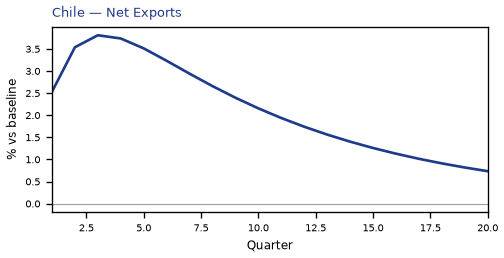

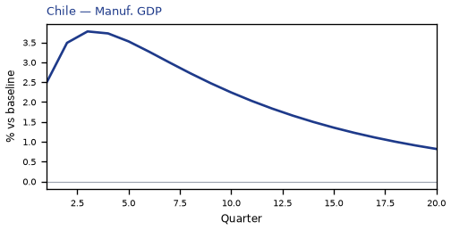

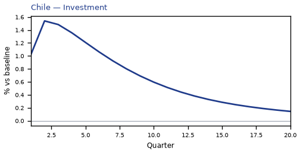

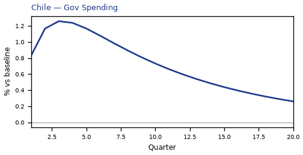

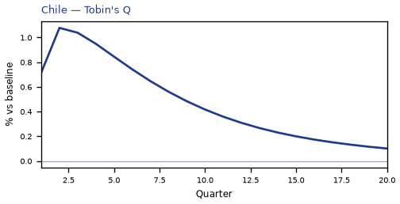

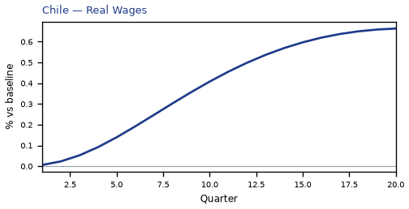

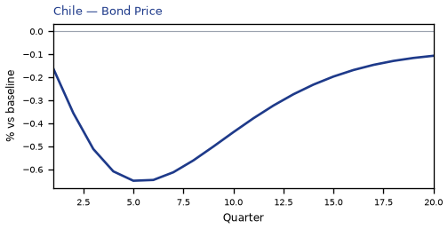

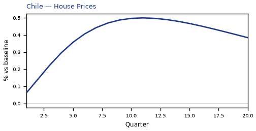

[Q1–Q20 JSON for Chile](numbers/CL.json)

## AU — Australia

The main impact of a 20% metals-supply cut on Australia would be a large rise in GDP of 0.44% by Q3. Equities peak at +1.08% in Q3.

Demand and trade. Consumption peaks at +0.29 % vs baseline in Q4, from +0.15 in Q1 to +0.03 in Q20. Investment peaks at +1.14 % vs baseline in Q2, from +0.77 in Q1 to -0.00 in Q20. Net Exports peaks at +2.96 % vs baseline in Q3, from +1.97 in Q1 to +0.55 in Q20. Gov Spending peaks at +0.52 % vs baseline in Q3, from +0.34 in Q1 to +0.11 in Q20. Gov Debt peaks at +0.16 % vs baseline in Q12, from +0.02 in Q1 to +0.13 in Q20.

External / FX. The real exchange rate shows real appreciation (a stronger home currency). Currency Strength peaks at -28.35 % vs baseline in Q3, from -18.68 in Q1 to -6.08 in Q20.

Labour. Employment peaks at +0.39 % vs baseline in Q7, from +0.09 in Q1 to +0.10 in Q20. Unemployment peaks at -0.20 pp in Q7, from -0.05 in Q1 to -0.05 in Q20. Real Wages peaks at +0.42 % vs baseline in Q20, from +0.00 in Q1 to +0.42 in Q20.

Prices. The three-year CPI impulse is +0.06 percentage points. CPI Inflation peaks at +0.02 pp in Q2, from +0.02 in Q1 to +0.00 in Q20. Domestic Infl. peaks at +0.01 pp in Q2, from +0.01 in Q1 to +0.00 in Q20. Marginal Cost peaks at +0.27 % vs baseline in Q3, from +0.18 in Q1 to +0.02 in Q20.

Financial conditions. Policy Rate peaks at +0.20 pp (annualized) in Q7, from +0.04 in Q1 to +0.06 in Q20. Govt 2Y Yield peaks at +0.19 pp (annualized) in Q4, from +0.16 in Q1 to +0.05 in Q20. Govt 5Y Yield peaks at +0.13 pp (annualized) in Q2, from +0.13 in Q1 to +0.03 in Q20. Govt 10Y Yield peaks at +0.08 pp (annualized) in Q1, from +0.08 in Q1 to +0.02 in Q20. Bond Price peaks at -1.26 % vs baseline in Q7, from -0.27 in Q1 to -0.40 in Q20. Equity Index peaks at +1.08 % vs baseline in Q3, from +0.73 in Q1 to +0.11 in Q20. Tobin's Q peaks at +0.80 % vs baseline in Q2, from +0.54 in Q1 to -0.00 in Q20. House Prices peaks at +0.29 % vs baseline in Q12, from +0.03 in Q1 to +0.24 in Q20. Bank Credit peaks at +0.02 % vs baseline in Q12, from +0.00 in Q1 to +0.01 in Q20. Credit Spread peaks at +0.00 pp in Q1, from +0.00 in Q1 to +0.00 in Q20.

Sectoral and capital. Manuf. GDP peaks at +8.57 % vs baseline in Q3, from +5.65 in Q1 to +1.83 in Q20. Services GDP peaks at +0.32 % vs baseline in Q3, from +0.21 in Q1 to +0.03 in Q20. Capital Stock peaks at +0.04 % vs baseline in Q19, from +0.00 in Q1 to +0.04 in Q20.

Timing. The GDP response has mostly faded by Q15 (Q20 is +0.04%).

These figures are model IRFs versus baseline, not forecasts.


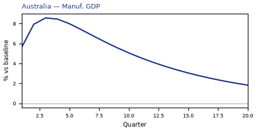

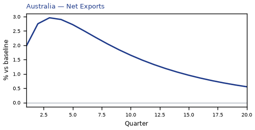

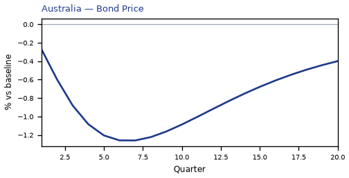

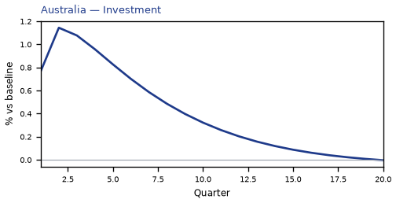

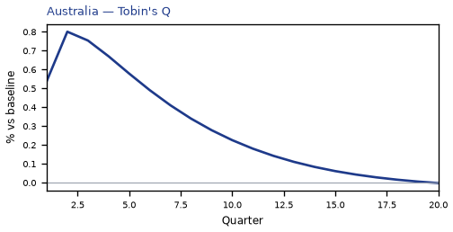

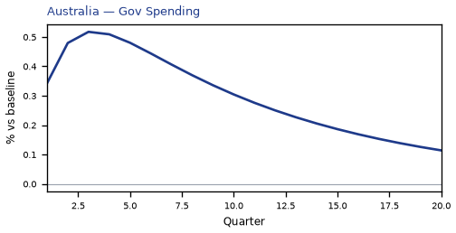

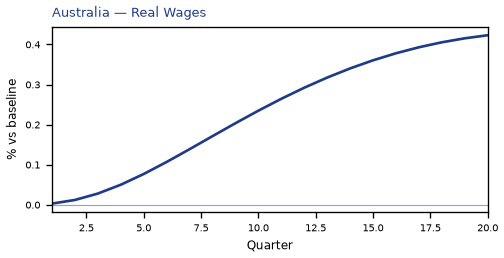

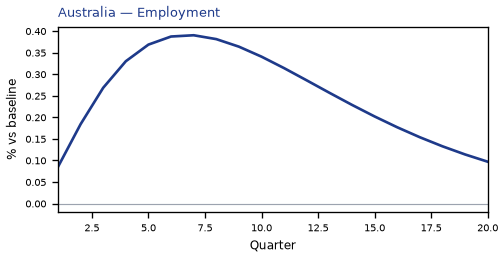

[Q1–Q20 JSON for Australia](numbers/AU.json)

## ZA — South Africa

The main impact of a 20% metals-supply cut on South Africa would be a large rise in GDP of 0.31% by Q3. Equities peak at +1.22% in Q3.

Demand and trade. Consumption peaks at +0.18 % vs baseline in Q4, from +0.09 in Q1 to +0.02 in Q20. Investment peaks at +0.80 % vs baseline in Q2, from +0.54 in Q1 to +0.09 in Q20. Net Exports peaks at +2.12 % vs baseline in Q3, from +1.41 in Q1 to +0.42 in Q20. Gov Spending peaks at +0.27 % vs baseline in Q3, from +0.18 in Q1 to +0.06 in Q20. Gov Debt peaks at +0.18 % vs baseline in Q13, from +0.02 in Q1 to +0.16 in Q20.

External / FX. The real exchange rate shows real appreciation (a stronger home currency). Currency Strength peaks at -9.59 % vs baseline in Q3, from -6.32 in Q1 to -1.98 in Q20.

Labour. Employment peaks at +0.25 % vs baseline in Q7, from +0.05 in Q1 to +0.08 in Q20. Unemployment peaks at -0.07 pp in Q6, from -0.02 in Q1 to -0.01 in Q20. Real Wages peaks at +0.36 % vs baseline in Q19, from +0.00 in Q1 to +0.36 in Q20.

Prices. The three-year CPI impulse is +0.15 percentage points. CPI Inflation peaks at +0.03 pp in Q2, from +0.02 in Q1 to -0.00 in Q20. Domestic Infl. peaks at +0.02 pp in Q2, from +0.02 in Q1 to -0.00 in Q20. Marginal Cost peaks at +0.19 % vs baseline in Q3, from +0.13 in Q1 to +0.02 in Q20.

Financial conditions. Policy Rate peaks at +0.12 pp (annualized) in Q5, from +0.04 in Q1 to -0.01 in Q20. Govt 2Y Yield peaks at +0.10 pp (annualized) in Q2, from +0.09 in Q1 to -0.01 in Q20. Govt 5Y Yield peaks at +0.05 pp (annualized) in Q1, from +0.05 in Q1 to -0.00 in Q20. Govt 10Y Yield peaks at +0.02 pp (annualized) in Q1, from +0.02 in Q1 to -0.00 in Q20. Bond Price peaks at -0.49 % vs baseline in Q5, from -0.15 in Q1 to +0.04 in Q20. Equity Index peaks at +1.22 % vs baseline in Q3, from +0.83 in Q1 to +0.14 in Q20. Tobin's Q peaks at +0.56 % vs baseline in Q2, from +0.38 in Q1 to +0.07 in Q20. House Prices peaks at +0.25 % vs baseline in Q10, from +0.03 in Q1 to +0.18 in Q20. Bank Credit peaks at +0.01 % vs baseline in Q12, from +0.00 in Q1 to +0.01 in Q20. Credit Spread peaks at +0.00 pp in Q1, from +0.00 in Q1 to +0.00 in Q20.

Sectoral and capital. Manuf. GDP peaks at +2.93 % vs baseline in Q3, from +1.93 in Q1 to +0.60 in Q20. Services GDP peaks at +0.20 % vs baseline in Q3, from +0.13 in Q1 to +0.02 in Q20. Capital Stock peaks at +0.03 % vs baseline in Q20, from +0.00 in Q1 to +0.03 in Q20.

Timing. The GDP response has mostly faded by Q13 (Q20 is +0.03%).

These figures are model IRFs versus baseline, not forecasts.


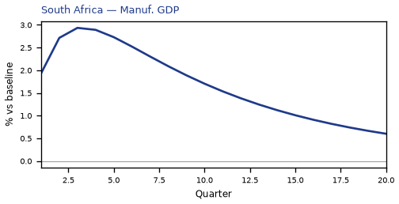

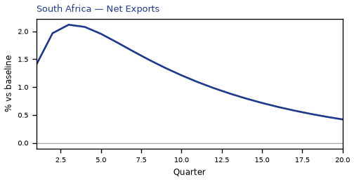

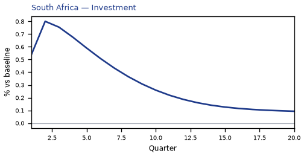

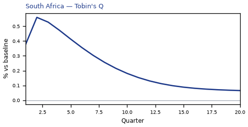

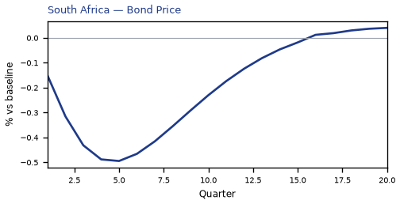

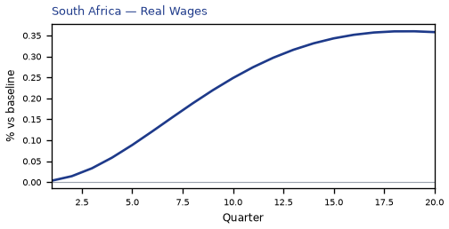

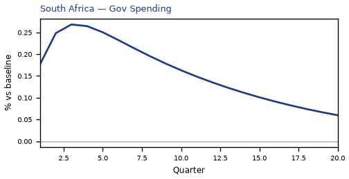

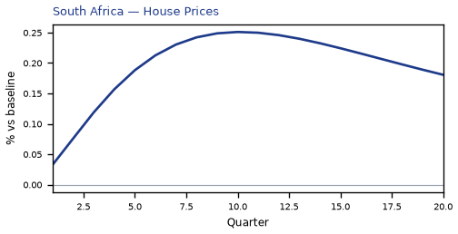

[Q1–Q20 JSON for South Africa](numbers/ZA.json)

## RU — Russia

The main impact of a 20% metals-supply cut on Russia would be a moderate rise in GDP of 0.18% by Q3. Equities peak at +0.28% in Q3.

Demand and trade. Consumption peaks at +0.10 % vs baseline in Q4, from +0.05 in Q1 to -0.01 in Q20. Investment peaks at +0.44 % vs baseline in Q2, from +0.31 in Q1 to -0.01 in Q20. Net Exports peaks at +1.28 % vs baseline in Q3, from +0.84 in Q1 to +0.25 in Q20. Gov Spending peaks at +0.38 % vs baseline in Q3, from +0.25 in Q1 to +0.08 in Q20. Gov Debt peaks at +0.05 % vs baseline in Q10, from +0.01 in Q1 to +0.03 in Q20.

External / FX. The real exchange rate shows real appreciation (a stronger home currency). Currency Strength peaks at -0.56 % vs baseline in Q3, from -0.38 in Q1 to -0.07 in Q20.

Labour. Employment peaks at +0.13 % vs baseline in Q7, from +0.02 in Q1 to +0.01 in Q20. Unemployment peaks at -0.05 pp in Q6, from -0.01 in Q1 to +0.01 in Q20. Real Wages peaks at +0.25 % vs baseline in Q15, from +0.00 in Q1 to +0.22 in Q20.

Prices. The three-year CPI impulse is +0.18 percentage points. CPI Inflation peaks at +0.03 pp in Q3, from +0.02 in Q1 to -0.01 in Q20. Domestic Infl. peaks at +0.02 pp in Q3, from +0.01 in Q1 to -0.00 in Q20. Marginal Cost peaks at +0.11 % vs baseline in Q3, from +0.08 in Q1 to -0.01 in Q20.

Financial conditions. Policy Rate peaks at +0.13 pp (annualized) in Q5, from +0.03 in Q1 to -0.03 in Q20. Govt 2Y Yield peaks at +0.11 pp (annualized) in Q2, from +0.10 in Q1 to -0.02 in Q20. Govt 5Y Yield peaks at +0.05 pp (annualized) in Q1, from +0.05 in Q1 to -0.02 in Q20. Govt 10Y Yield peaks at +0.02 pp (annualized) in Q1, from +0.02 in Q1 to -0.01 in Q20. Bond Price peaks at -0.40 % vs baseline in Q5, from -0.10 in Q1 to +0.08 in Q20. Equity Index peaks at +0.28 % vs baseline in Q3, from +0.21 in Q1 to -0.00 in Q20. Tobin's Q peaks at +0.31 % vs baseline in Q2, from +0.22 in Q1 to -0.00 in Q20. House Prices peaks at +0.13 % vs baseline in Q8, from +0.02 in Q1 to +0.05 in Q20. Bank Credit peaks at +0.00 % vs baseline in Q11, from +0.00 in Q1 to +0.00 in Q20. Credit Spread peaks at +0.00 pp in Q1, from +0.00 in Q1 to +0.00 in Q20.

Sectoral and capital. Manuf. GDP peaks at +0.20 % vs baseline in Q3, from +0.14 in Q1 to +0.02 in Q20. Services GDP peaks at +0.10 % vs baseline in Q3, from +0.07 in Q1 to -0.01 in Q20. Capital Stock peaks at +0.01 % vs baseline in Q9, from +0.00 in Q1 to +0.01 in Q20.

Timing. The GDP response has mostly faded by Q10 (Q20 is -0.02%).

These figures are model IRFs versus baseline, not forecasts.


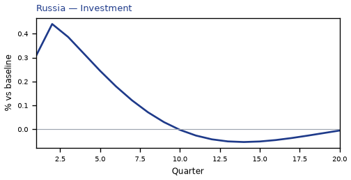

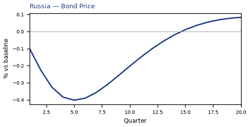

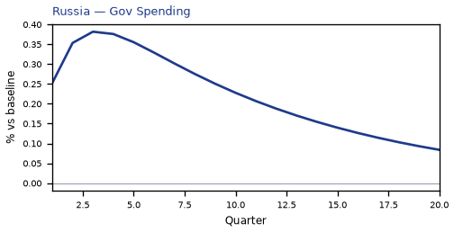

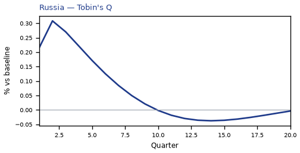

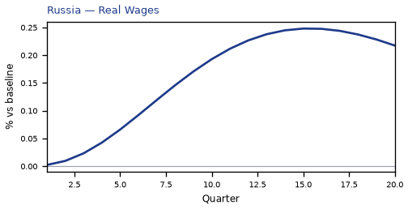

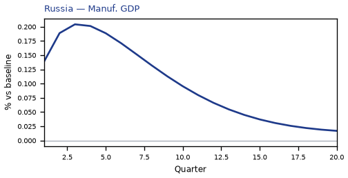


[Q1–Q20 JSON for Russia](numbers/RU.json)

## KR — South Korea

The main impact of a 20% metals-supply cut on South Korea would be a moderate drop in GDP of 0.18% by Q3. Equities peak at -0.46% in Q4.

Demand and trade. Consumption peaks at -0.10 % vs baseline in Q4, from -0.06 in Q1 to -0.02 in Q20. Investment peaks at -0.54 % vs baseline in Q3, from -0.32 in Q1 to +0.01 in Q20. Net Exports peaks at -1.05 % vs baseline in Q3, from -0.70 in Q1 to -0.18 in Q20. Gov Spending peaks at +0.03 % vs baseline in Q4, from +0.02 in Q1 to +0.01 in Q20. Gov Debt peaks at -0.09 % vs baseline in Q16, from -0.01 in Q1 to -0.08 in Q20.

External / FX. The real exchange rate shows real depreciation (a weaker, more competitive home currency). Currency Strength peaks at +1.36 % vs baseline in Q3, from +0.88 in Q1 to +0.43 in Q20.

Labour. Employment peaks at -0.13 % vs baseline in Q10, from -0.02 in Q1 to -0.07 in Q20. Unemployment peaks at +0.06 pp in Q8, from +0.01 in Q1 to +0.02 in Q20. Real Wages peaks at -0.15 % vs baseline in Q20, from -0.00 in Q1 to -0.15 in Q20.

Prices. The three-year CPI impulse is +0.13 percentage points. CPI Inflation peaks at +0.03 pp in Q2, from +0.02 in Q1 to -0.01 in Q20. Domestic Infl. peaks at +0.02 pp in Q2, from +0.02 in Q1 to -0.01 in Q20. Marginal Cost peaks at -0.10 % vs baseline in Q4, from -0.06 in Q1 to -0.02 in Q20.

Financial conditions. Policy Rate peaks at -0.06 pp (annualized) in Q18, from +0.02 in Q1 to -0.06 in Q20. Govt 2Y Yield peaks at -0.06 pp (annualized) in Q15, from +0.04 in Q1 to -0.05 in Q20. Govt 5Y Yield peaks at -0.04 pp (annualized) in Q12, from -0.01 in Q1 to -0.03 in Q20. Govt 10Y Yield peaks at -0.03 pp (annualized) in Q10, from -0.02 in Q1 to -0.02 in Q20. Bond Price peaks at +0.29 % vs baseline in Q18, from -0.10 in Q1 to +0.28 in Q20. Equity Index peaks at -0.46 % vs baseline in Q4, from -0.28 in Q1 to -0.05 in Q20. Tobin's Q peaks at -0.38 % vs baseline in Q3, from -0.23 in Q1 to +0.01 in Q20. House Prices peaks at -0.15 % vs baseline in Q15, from -0.01 in Q1 to -0.13 in Q20. Bank Credit peaks at -0.04 % vs baseline in Q12, from -0.00 in Q1 to -0.03 in Q20. Credit Spread peaks at +0.00 pp in Q12, from +0.00 in Q1 to +0.00 in Q20.

Sectoral and capital. Manuf. GDP peaks at -0.47 % vs baseline in Q3, from -0.30 in Q1 to -0.14 in Q20. Services GDP peaks at -0.11 % vs baseline in Q3, from -0.07 in Q1 to -0.02 in Q20. Capital Stock peaks at -0.03 % vs baseline in Q19, from -0.00 in Q1 to -0.03 in Q20.

Timing. The GDP response has mostly faded by Q19 (Q20 is -0.03%).

These figures are model IRFs versus baseline, not forecasts.


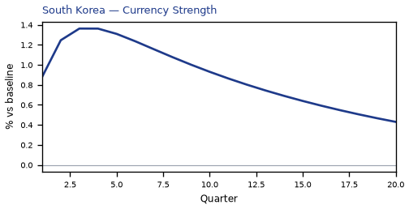

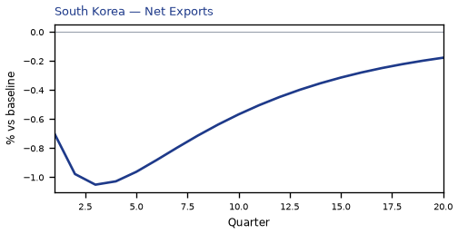

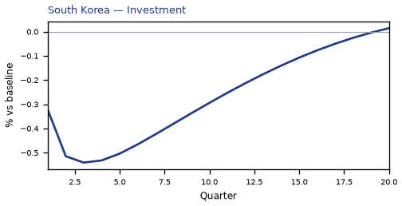

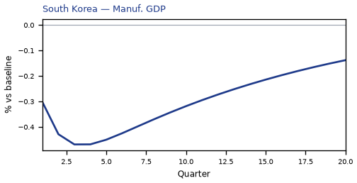

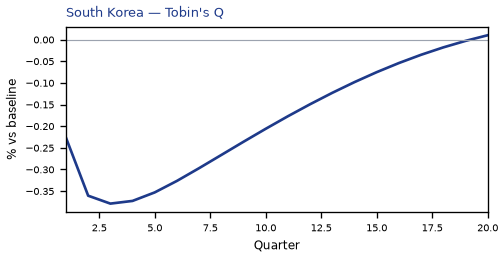

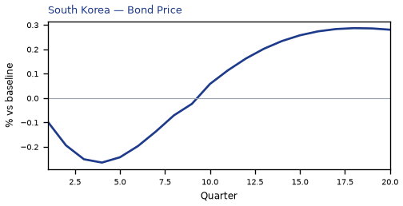

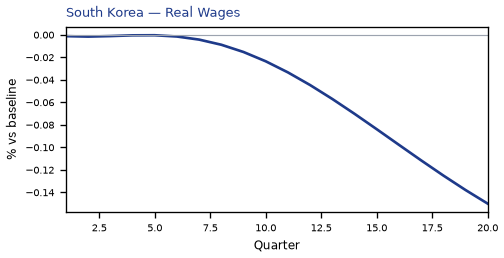

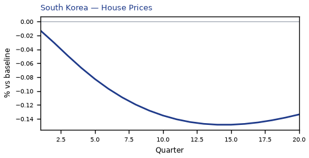

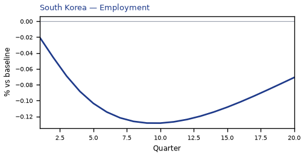

[Q1–Q20 JSON for South Korea](numbers/KR.json)

## AR — Argentina

The main impact of a 20% metals-supply cut on Argentina would be a moderate drop in GDP of 0.15% by Q11. Equities peak at -0.26% in Q10.

Demand and trade. Consumption peaks at -0.07 % vs baseline in Q12, from -0.01 in Q1 to -0.00 in Q20. Investment peaks at -0.34 % vs baseline in Q8, from -0.09 in Q1 to +0.13 in Q20. Net Exports peaks at +0.02 % vs baseline in Q9, from +0.00 in Q1 to -0.00 in Q20. Gov Spending peaks at +0.03 % vs baseline in Q11, from +0.00 in Q1 to -0.00 in Q20. Gov Debt peaks at -0.10 % vs baseline in Q20, from +0.00 in Q1 to -0.10 in Q20.

External / FX. The real exchange rate shows real appreciation (a stronger home currency). Currency Strength peaks at -0.38 % vs baseline in Q3, from -0.27 in Q1 to -0.08 in Q20.

Labour. Employment peaks at -0.12 % vs baseline in Q15, from +0.00 in Q1 to -0.08 in Q20. Unemployment peaks at +0.03 pp in Q13, from +0.00 in Q1 to +0.01 in Q20. Real Wages peaks at -0.24 % vs baseline in Q20, from +0.00 in Q1 to -0.24 in Q20.

Prices. The three-year CPI impulse is +0.05 percentage points. CPI Inflation peaks at +0.03 pp in Q2, from +0.02 in Q1 to -0.01 in Q20. Domestic Infl. peaks at +0.02 pp in Q2, from +0.02 in Q1 to -0.01 in Q20. Marginal Cost peaks at -0.09 % vs baseline in Q11, from -0.00 in Q1 to +0.01 in Q20.

Financial conditions. Policy Rate peaks at +0.12 pp (annualized) in Q3, from +0.06 in Q1 to -0.06 in Q20. Govt 2Y Yield peaks at -0.10 pp (annualized) in Q11, from +0.07 in Q1 to -0.02 in Q20. Govt 5Y Yield peaks at -0.06 pp (annualized) in Q8, from -0.02 in Q1 to +0.01 in Q20. Govt 10Y Yield peaks at -0.02 pp (annualized) in Q8, from -0.01 in Q1 to +0.01 in Q20. Bond Price peaks at -0.29 % vs baseline in Q3, from -0.14 in Q1 to +0.15 in Q20. Equity Index peaks at -0.26 % vs baseline in Q10, from -0.03 in Q1 to +0.05 in Q20. Tobin's Q peaks at -0.23 % vs baseline in Q8, from -0.06 in Q1 to +0.09 in Q20. House Prices peaks at -0.13 % vs baseline in Q15, from -0.00 in Q1 to -0.10 in Q20. Bank Credit peaks at -0.00 % vs baseline in Q19, from +0.00 in Q1 to -0.00 in Q20. Credit Spread peaks at +0.00 pp in Q19, from +0.00 in Q1 to +0.00 in Q20.

Sectoral and capital. Manuf. GDP peaks at +0.11 % vs baseline in Q3, from +0.08 in Q1 to +0.03 in Q20. Services GDP peaks at -0.08 % vs baseline in Q11, from -0.00 in Q1 to +0.00 in Q20. Capital Stock peaks at -0.02 % vs baseline in Q16, from -0.00 in Q1 to -0.02 in Q20.

Timing. The GDP response has mostly faded by Q18 (Q20 is +0.01%).

These figures are model IRFs versus baseline, not forecasts.


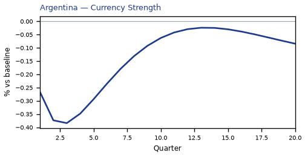

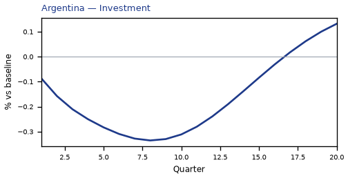

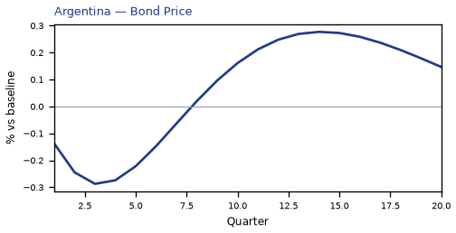

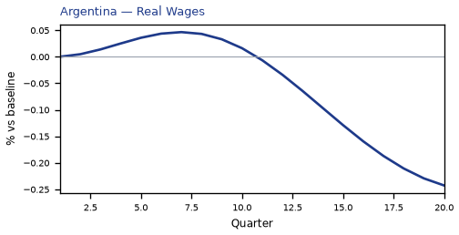

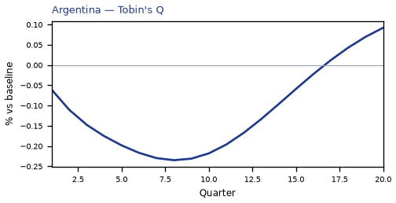

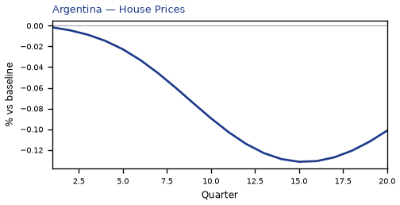

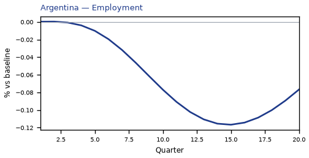


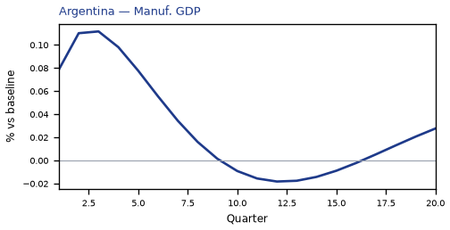

[Q1–Q20 JSON for Argentina](numbers/AR.json)

## JP — Japan

The main impact of a 20% metals-supply cut on Japan would be a moderate drop in GDP of 0.15% by Q3. Equities peak at -0.40% in Q4.

Demand and trade. Consumption peaks at -0.09 % vs baseline in Q4, from -0.05 in Q1 to -0.02 in Q20. Investment peaks at -0.40 % vs baseline in Q3, from -0.24 in Q1 to -0.08 in Q20. Net Exports peaks at -0.85 % vs baseline in Q3, from -0.56 in Q1 to -0.17 in Q20. Gov Spending peaks at +0.03 % vs baseline in Q4, from +0.02 in Q1 to +0.01 in Q20. Gov Debt peaks at -0.04 % vs baseline in Q20, from -0.00 in Q1 to -0.04 in Q20.

External / FX. The real exchange rate shows real depreciation (a weaker, more competitive home currency). Currency Strength peaks at +0.98 % vs baseline in Q4, from +0.61 in Q1 to +0.11 in Q20.

Labour. Employment peaks at -0.11 % vs baseline in Q8, from -0.02 in Q1 to -0.05 in Q20. Unemployment peaks at +0.08 pp in Q8, from +0.01 in Q1 to +0.04 in Q20. Real Wages peaks at +0.06 % vs baseline in Q11, from -0.00 in Q1 to +0.02 in Q20.

Prices. The three-year CPI impulse is +0.09 percentage points. CPI Inflation peaks at +0.03 pp in Q2, from +0.03 in Q1 to -0.01 in Q20. Domestic Infl. peaks at +0.02 pp in Q2, from +0.02 in Q1 to -0.01 in Q20. Marginal Cost peaks at -0.08 % vs baseline in Q4, from -0.05 in Q1 to -0.02 in Q20.

Financial conditions. Policy Rate peaks at +0.01 pp (annualized) in Q6, from +0.00 in Q1 to -0.00 in Q20. Govt 2Y Yield peaks at +0.01 pp (annualized) in Q3, from +0.01 in Q1 to -0.00 in Q20. Govt 5Y Yield peaks at +0.01 pp (annualized) in Q1, from +0.01 in Q1 to -0.01 in Q20. Govt 10Y Yield peaks at -0.00 pp (annualized) in Q20, from +0.00 in Q1 to -0.00 in Q20. Bond Price peaks at -0.17 % vs baseline in Q5, from -0.05 in Q1 to +0.06 in Q20. Equity Index peaks at -0.40 % vs baseline in Q4, from -0.25 in Q1 to -0.08 in Q20. Tobin's Q peaks at -0.28 % vs baseline in Q3, from -0.17 in Q1 to -0.06 in Q20. House Prices peaks at -0.11 % vs baseline in Q15, from -0.01 in Q1 to -0.10 in Q20. Bank Credit peaks at -0.04 % vs baseline in Q12, from -0.00 in Q1 to -0.04 in Q20. Credit Spread peaks at +0.00 pp in Q12, from +0.00 in Q1 to +0.00 in Q20.

Sectoral and capital. Manuf. GDP peaks at -0.34 % vs baseline in Q4, from -0.21 in Q1 to -0.04 in Q20. Services GDP peaks at -0.10 % vs baseline in Q3, from -0.07 in Q1 to -0.02 in Q20. Capital Stock peaks at -0.02 % vs baseline in Q20, from -0.00 in Q1 to -0.02 in Q20.

Timing. The GDP response has mostly faded by Q20 (Q20 is -0.03%).

These figures are model IRFs versus baseline, not forecasts.


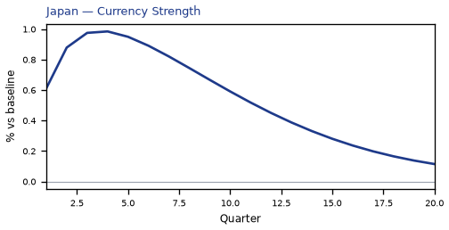

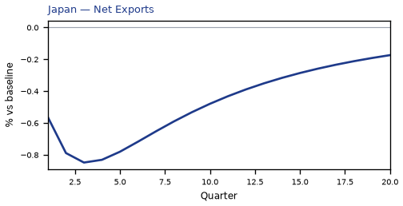

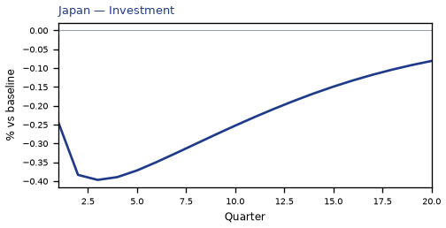


[Q1–Q20 JSON for Japan](numbers/JP.json)

## DE — Germany

The main impact of a 20% metals-supply cut on Germany would be a moderate drop in GDP of 0.12% by Q4. Equities peak at -0.25% in Q4.

Demand and trade. Consumption peaks at -0.06 % vs baseline in Q4, from -0.03 in Q1 to -0.02 in Q20. Investment peaks at -0.38 % vs baseline in Q4, from -0.21 in Q1 to -0.04 in Q20. Net Exports peaks at -0.63 % vs baseline in Q3, from -0.42 in Q1 to -0.13 in Q20. Gov Spending peaks at +0.02 % vs baseline in Q4, from +0.02 in Q1 to +0.01 in Q20. Gov Debt peaks at +0.02 % vs baseline in Q17, from +0.00 in Q1 to +0.01 in Q20.

External / FX. The real exchange rate shows real depreciation (a weaker, more competitive home currency). Currency Strength peaks at +0.87 % vs baseline in Q3, from +0.58 in Q1 to +0.16 in Q20.

Labour. Employment peaks at -0.09 % vs baseline in Q10, from -0.01 in Q1 to -0.05 in Q20. Unemployment peaks at +0.07 pp in Q9, from +0.01 in Q1 to +0.04 in Q20. Real Wages peaks at -0.08 % vs baseline in Q20, from -0.00 in Q1 to -0.08 in Q20.

Prices. The three-year CPI impulse is +0.06 percentage points. CPI Inflation peaks at +0.03 pp in Q2, from +0.02 in Q1 to -0.01 in Q20. Domestic Infl. peaks at +0.02 pp in Q2, from +0.01 in Q1 to -0.00 in Q20. Marginal Cost peaks at -0.06 % vs baseline in Q4, from -0.04 in Q1 to -0.02 in Q20.

Financial conditions. Policy Rate peaks at +0.05 pp (annualized) in Q5, from +0.01 in Q1 to -0.02 in Q20. Govt 2Y Yield peaks at +0.04 pp (annualized) in Q2, from +0.04 in Q1 to -0.02 in Q20. Govt 5Y Yield peaks at -0.02 pp (annualized) in Q15, from +0.01 in Q1 to -0.02 in Q20. Govt 10Y Yield peaks at -0.01 pp (annualized) in Q14, from -0.00 in Q1 to -0.01 in Q20. Bond Price peaks at -0.34 % vs baseline in Q5, from -0.10 in Q1 to +0.15 in Q20. Equity Index peaks at -0.25 % vs baseline in Q4, from -0.15 in Q1 to -0.04 in Q20. Tobin's Q peaks at -0.26 % vs baseline in Q4, from -0.15 in Q1 to -0.03 in Q20. House Prices peaks at -0.11 % vs baseline in Q15, from -0.01 in Q1 to -0.10 in Q20. Bank Credit peaks at -0.04 % vs baseline in Q13, from -0.00 in Q1 to -0.03 in Q20. Credit Spread peaks at +0.00 pp in Q13, from +0.00 in Q1 to +0.00 in Q20.

Sectoral and capital. Manuf. GDP peaks at -0.30 % vs baseline in Q3, from -0.19 in Q1 to -0.05 in Q20. Services GDP peaks at -0.08 % vs baseline in Q4, from -0.05 in Q1 to -0.02 in Q20. Capital Stock peaks at -0.02 % vs baseline in Q20, from -0.00 in Q1 to -0.02 in Q20.

Timing. The GDP response has mostly faded by Q20 (Q20 is -0.03%).

These figures are model IRFs versus baseline, not forecasts.


[Q1–Q20 JSON for Germany](numbers/DE.json)

## SE — Sweden

The main impact of a 20% metals-supply cut on Sweden would be a moderate rise in GDP of 0.12% by Q3. Equities peak at +0.32% in Q3.

Demand and trade. Consumption peaks at +0.07 % vs baseline in Q4, from +0.04 in Q1 to +0.01 in Q20. Investment peaks at +0.28 % vs baseline in Q2, from +0.19 in Q1 to +0.07 in Q20. Net Exports peaks at +0.84 % vs baseline in Q3, from +0.56 in Q1 to +0.16 in Q20. Gov Spending peaks at +0.06 % vs baseline in Q3, from +0.04 in Q1 to +0.01 in Q20. Gov Debt peaks at -0.04 % vs baseline in Q10, from -0.00 in Q1 to -0.03 in Q20.

External / FX. The real exchange rate shows real appreciation (a stronger home currency). Currency Strength peaks at -4.35 % vs baseline in Q3, from -2.87 in Q1 to -0.91 in Q20.

Labour. Employment peaks at +0.08 % vs baseline in Q8, from +0.01 in Q1 to +0.04 in Q20. Unemployment peaks at -0.05 pp in Q6, from -0.01 in Q1 to -0.01 in Q20. Real Wages peaks at +0.13 % vs baseline in Q19, from +0.00 in Q1 to +0.13 in Q20.

Prices. The three-year CPI impulse is +0.10 percentage points. CPI Inflation peaks at +0.03 pp in Q2, from +0.02 in Q1 to -0.00 in Q20. Domestic Infl. peaks at +0.02 pp in Q2, from +0.01 in Q1 to -0.00 in Q20. Marginal Cost peaks at +0.07 % vs baseline in Q3, from +0.05 in Q1 to +0.01 in Q20.

Financial conditions. Policy Rate peaks at +0.07 pp (annualized) in Q5, from +0.02 in Q1 to -0.01 in Q20. Govt 2Y Yield peaks at +0.06 pp (annualized) in Q2, from +0.06 in Q1 to -0.01 in Q20. Govt 5Y Yield peaks at +0.03 pp (annualized) in Q1, from +0.03 in Q1 to -0.01 in Q20. Govt 10Y Yield peaks at +0.01 pp (annualized) in Q1, from +0.01 in Q1 to -0.01 in Q20. Bond Price peaks at -0.47 % vs baseline in Q5, from -0.13 in Q1 to +0.09 in Q20. Equity Index peaks at +0.32 % vs baseline in Q3, from +0.23 in Q1 to +0.07 in Q20. Tobin's Q peaks at +0.20 % vs baseline in Q2, from +0.14 in Q1 to +0.05 in Q20. House Prices peaks at +0.08 % vs baseline in Q12, from +0.01 in Q1 to +0.07 in Q20. Bank Credit peaks at +0.00 % vs baseline in Q11, from +0.00 in Q1 to +0.00 in Q20. Credit Spread peaks at +0.00 pp in Q1, from +0.00 in Q1 to +0.00 in Q20.

Sectoral and capital. Manuf. GDP peaks at +1.33 % vs baseline in Q3, from +0.88 in Q1 to +0.28 in Q20. Services GDP peaks at +0.08 % vs baseline in Q3, from +0.06 in Q1 to +0.01 in Q20. Capital Stock peaks at +0.01 % vs baseline in Q20, from +0.00 in Q1 to +0.01 in Q20.

Timing. The GDP response has mostly faded by Q14 (Q20 is +0.02%).

These figures are model IRFs versus baseline, not forecasts.


[Q1–Q20 JSON for Sweden](numbers/SE.json)

## BR — Brazil

The main impact of a 20% metals-supply cut on Brazil would be a moderate rise in GDP of 0.11% by Q3. Equities peak at +0.20% in Q2.

Demand and trade. Consumption peaks at +0.06 % vs baseline in Q4, from +0.03 in Q1 to -0.02 in Q20. Investment peaks at +0.20 % vs baseline in Q2, from +0.15 in Q1 to +0.00 in Q20. Net Exports peaks at +0.85 % vs baseline in Q3, from +0.57 in Q1 to +0.18 in Q20. Gov Spending peaks at +0.13 % vs baseline in Q3, from +0.09 in Q1 to +0.04 in Q20. Gov Debt peaks at +0.02 % vs baseline in Q8, from +0.00 in Q1 to +0.00 in Q20.

External / FX. The real exchange rate shows real appreciation (a stronger home currency). Currency Strength peaks at -2.30 % vs baseline in Q3, from -1.48 in Q1 to -0.34 in Q20.

Labour. Employment peaks at +0.07 % vs baseline in Q6, from +0.01 in Q1 to -0.03 in Q20. Unemployment peaks at -0.02 pp in Q5, from -0.01 in Q1 to +0.01 in Q20. Real Wages peaks at +0.14 % vs baseline in Q13, from +0.00 in Q1 to +0.08 in Q20.

Prices. The three-year CPI impulse is +0.13 percentage points. CPI Inflation peaks at +0.03 pp in Q2, from +0.02 in Q1 to -0.01 in Q20. Domestic Infl. peaks at +0.02 pp in Q2, from +0.01 in Q1 to -0.00 in Q20. Marginal Cost peaks at +0.07 % vs baseline in Q3, from +0.05 in Q1 to -0.02 in Q20.

Financial conditions. Policy Rate peaks at +0.16 pp (annualized) in Q4, from +0.06 in Q1 to -0.05 in Q20. Govt 2Y Yield peaks at +0.12 pp (annualized) in Q2, from +0.12 in Q1 to -0.04 in Q20. Govt 5Y Yield peaks at +0.04 pp (annualized) in Q1, from +0.04 in Q1 to -0.02 in Q20. Govt 10Y Yield peaks at -0.02 pp (annualized) in Q12, from +0.01 in Q1 to -0.01 in Q20. Bond Price peaks at -0.68 % vs baseline in Q4, from -0.23 in Q1 to +0.21 in Q20. Equity Index peaks at +0.20 % vs baseline in Q2, from +0.15 in Q1 to -0.03 in Q20. Tobin's Q peaks at +0.14 % vs baseline in Q2, from +0.11 in Q1 to +0.00 in Q20. House Prices peaks at +0.06 % vs baseline in Q6, from +0.01 in Q1 to -0.02 in Q20. Bank Credit peaks at +0.00 % vs baseline in Q11, from +0.00 in Q1 to +0.00 in Q20. Credit Spread peaks at +0.00 pp in Q1, from +0.00 in Q1 to +0.00 in Q20.

Sectoral and capital. Manuf. GDP peaks at +0.71 % vs baseline in Q3, from +0.46 in Q1 to +0.10 in Q20. Services GDP peaks at +0.08 % vs baseline in Q3, from +0.05 in Q1 to -0.02 in Q20. Capital Stock peaks at -0.00 % vs baseline in Q19, from +0.00 in Q1 to -0.00 in Q20.

Timing. The GDP response has mostly faded by Q8 (Q20 is -0.03%).

These figures are model IRFs versus baseline, not forecasts.


[Q1–Q20 JSON for Brazil](numbers/BR.json)

## TR — Turkey

The main impact of a 20% metals-supply cut on Turkey would be a moderate drop in GDP of 0.11% by Q9. Equities peak at -0.23% in Q7.

Demand and trade. Consumption peaks at -0.06 % vs baseline in Q10, from -0.03 in Q1 to -0.00 in Q20. Investment peaks at -0.37 % vs baseline in Q5, from -0.19 in Q1 to +0.10 in Q20. Net Exports peaks at -0.42 % vs baseline in Q3, from -0.28 in Q1 to -0.08 in Q20. Gov Spending peaks at +0.02 % vs baseline in Q10, from +0.01 in Q1 to -0.00 in Q20. Gov Debt peaks at -0.11 % vs baseline in Q17, from -0.00 in Q1 to -0.10 in Q20.

External / FX. The real exchange rate shows real depreciation (a weaker, more competitive home currency). Currency Strength peaks at +0.29 % vs baseline in Q8, from +0.14 in Q1 to +0.08 in Q20.

Labour. Employment peaks at -0.10 % vs baseline in Q14, from -0.01 in Q1 to -0.06 in Q20. Unemployment peaks at +0.03 pp in Q11, from +0.00 in Q1 to +0.01 in Q20. Real Wages peaks at -0.17 % vs baseline in Q20, from -0.00 in Q1 to -0.17 in Q20.

Prices. The three-year CPI impulse is +0.08 percentage points. CPI Inflation peaks at +0.02 pp in Q2, from +0.02 in Q1 to -0.01 in Q20. Domestic Infl. peaks at +0.02 pp in Q2, from +0.01 in Q1 to -0.01 in Q20. Marginal Cost peaks at -0.07 % vs baseline in Q10, from -0.03 in Q1 to +0.00 in Q20.

Financial conditions. Policy Rate peaks at +0.09 pp (annualized) in Q4, from +0.04 in Q1 to -0.05 in Q20. Govt 2Y Yield peaks at -0.06 pp (annualized) in Q13, from +0.06 in Q1 to -0.03 in Q20. Govt 5Y Yield peaks at -0.04 pp (annualized) in Q9, from -0.01 in Q1 to -0.01 in Q20. Govt 10Y Yield peaks at -0.02 pp (annualized) in Q9, from -0.01 in Q1 to -0.00 in Q20. Bond Price peaks at -0.29 % vs baseline in Q4, from -0.13 in Q1 to +0.17 in Q20. Equity Index peaks at -0.23 % vs baseline in Q7, from -0.10 in Q1 to +0.03 in Q20. Tobin's Q peaks at -0.26 % vs baseline in Q5, from -0.13 in Q1 to +0.07 in Q20. House Prices peaks at -0.13 % vs baseline in Q14, from -0.01 in Q1 to -0.10 in Q20. Bank Credit peaks at -0.01 % vs baseline in Q13, from -0.00 in Q1 to -0.01 in Q20. Credit Spread peaks at +0.00 pp in Q12, from +0.00 in Q1 to +0.00 in Q20.

Sectoral and capital. Manuf. GDP peaks at -0.12 % vs baseline in Q8, from -0.06 in Q1 to -0.02 in Q20. Services GDP peaks at -0.07 % vs baseline in Q9, from -0.03 in Q1 to +0.00 in Q20. Capital Stock peaks at -0.02 % vs baseline in Q16, from -0.00 in Q1 to -0.02 in Q20.

Timing. The GDP response has mostly faded by Q18 (Q20 is +0.00%).

These figures are model IRFs versus baseline, not forecasts.


[Q1–Q20 JSON for Turkey](numbers/TR.json)

## IT — Italy

The main impact of a 20% metals-supply cut on Italy would be only a small drop in GDP of 0.09% by Q4. Equities peak at -0.20% in Q4.

Demand and trade. Consumption peaks at -0.05 % vs baseline in Q4, from -0.03 in Q1 to -0.01 in Q20. Investment peaks at -0.32 % vs baseline in Q4, from -0.18 in Q1 to -0.02 in Q20. Net Exports peaks at -0.51 % vs baseline in Q3, from -0.34 in Q1 to -0.10 in Q20. Gov Spending peaks at +0.02 % vs baseline in Q4, from +0.01 in Q1 to +0.00 in Q20. Gov Debt peaks at +0.01 % vs baseline in Q5, from +0.00 in Q1 to +0.00 in Q20.

External / FX. The real exchange rate shows real depreciation (a weaker, more competitive home currency). Currency Strength peaks at +0.44 % vs baseline in Q3, from +0.29 in Q1 to +0.07 in Q20.

Labour. Employment peaks at -0.07 % vs baseline in Q10, from -0.01 in Q1 to -0.05 in Q20. Unemployment peaks at +0.03 pp in Q8, from +0.01 in Q1 to +0.02 in Q20. Real Wages peaks at +0.03 % vs baseline in Q10, from -0.00 in Q1 to -0.02 in Q20.

Prices. The three-year CPI impulse is +0.08 percentage points. CPI Inflation peaks at +0.03 pp in Q2, from +0.02 in Q1 to -0.01 in Q20. Domestic Infl. peaks at +0.02 pp in Q2, from +0.01 in Q1 to -0.00 in Q20. Marginal Cost peaks at -0.05 % vs baseline in Q4, from -0.03 in Q1 to -0.01 in Q20.

Financial conditions. Policy Rate peaks at +0.05 pp (annualized) in Q5, from +0.01 in Q1 to -0.02 in Q20. Govt 2Y Yield peaks at +0.04 pp (annualized) in Q2, from +0.04 in Q1 to -0.02 in Q20. Govt 5Y Yield peaks at -0.02 pp (annualized) in Q15, from +0.01 in Q1 to -0.02 in Q20. Govt 10Y Yield peaks at -0.01 pp (annualized) in Q14, from -0.00 in Q1 to -0.01 in Q20. Bond Price peaks at -0.34 % vs baseline in Q5, from -0.10 in Q1 to +0.15 in Q20. Equity Index peaks at -0.20 % vs baseline in Q4, from -0.11 in Q1 to -0.02 in Q20. Tobin's Q peaks at -0.22 % vs baseline in Q4, from -0.12 in Q1 to -0.02 in Q20. House Prices peaks at -0.08 % vs baseline in Q15, from -0.01 in Q1 to -0.08 in Q20. Bank Credit peaks at -0.03 % vs baseline in Q12, from -0.00 in Q1 to -0.02 in Q20. Credit Spread peaks at +0.00 pp in Q12, from +0.00 in Q1 to +0.00 in Q20.

Sectoral and capital. Manuf. GDP peaks at -0.15 % vs baseline in Q3, from -0.10 in Q1 to -0.03 in Q20. Services GDP peaks at -0.07 % vs baseline in Q4, from -0.04 in Q1 to -0.02 in Q20. Capital Stock peaks at -0.02 % vs baseline in Q20, from -0.00 in Q1 to -0.02 in Q20.

Timing. The GDP response has mostly faded by Q20 (Q20 is -0.02%).

These figures are model IRFs versus baseline, not forecasts.


[Q1–Q20 JSON for Italy](numbers/IT.json)

## PL — Poland

The main impact of a 20% metals-supply cut on Poland would be only a small drop in GDP of 0.08% by Q4. Equities peak at -0.20% in Q4.

Demand and trade. Consumption peaks at -0.05 % vs baseline in Q4, from -0.03 in Q1 to -0.01 in Q20. Investment peaks at -0.33 % vs baseline in Q4, from -0.18 in Q1 to +0.00 in Q20. Net Exports peaks at -0.42 % vs baseline in Q3, from -0.28 in Q1 to -0.07 in Q20. Gov Spending peaks at +0.02 % vs baseline in Q4, from +0.01 in Q1 to +0.00 in Q20. Gov Debt peaks at +0.00 % vs baseline in Q1, from +0.00 in Q1 to +0.00 in Q20.

External / FX. The real exchange rate shows real depreciation (a weaker, more competitive home currency). Currency Strength peaks at +0.85 % vs baseline in Q3, from +0.57 in Q1 to +0.21 in Q20.

Labour. Employment peaks at -0.07 % vs baseline in Q11, from -0.01 in Q1 to -0.05 in Q20. Unemployment peaks at +0.03 pp in Q10, from +0.01 in Q1 to +0.02 in Q20. Real Wages peaks at -0.08 % vs baseline in Q20, from -0.00 in Q1 to -0.08 in Q20.

Prices. The three-year CPI impulse is +0.08 percentage points. CPI Inflation peaks at +0.02 pp in Q2, from +0.02 in Q1 to -0.01 in Q20. Domestic Infl. peaks at +0.02 pp in Q2, from +0.01 in Q1 to -0.00 in Q20. Marginal Cost peaks at -0.05 % vs baseline in Q4, from -0.03 in Q1 to -0.01 in Q20.

Financial conditions. Policy Rate peaks at +0.07 pp (annualized) in Q4, from +0.02 in Q1 to -0.03 in Q20. Govt 2Y Yield peaks at +0.05 pp (annualized) in Q2, from +0.05 in Q1 to -0.03 in Q20. Govt 5Y Yield peaks at -0.03 pp (annualized) in Q14, from +0.01 in Q1 to -0.02 in Q20. Govt 10Y Yield peaks at -0.02 pp (annualized) in Q12, from -0.00 in Q1 to -0.01 in Q20. Bond Price peaks at -0.29 % vs baseline in Q4, from -0.10 in Q1 to +0.14 in Q20. Equity Index peaks at -0.20 % vs baseline in Q4, from -0.11 in Q1 to -0.01 in Q20. Tobin's Q peaks at -0.23 % vs baseline in Q4, from -0.12 in Q1 to +0.00 in Q20. House Prices peaks at -0.09 % vs baseline in Q16, from -0.01 in Q1 to -0.08 in Q20. Bank Credit peaks at -0.02 % vs baseline in Q13, from -0.00 in Q1 to -0.02 in Q20. Credit Spread peaks at +0.00 pp in Q13, from +0.00 in Q1 to +0.00 in Q20.

Sectoral and capital. Manuf. GDP peaks at -0.28 % vs baseline in Q3, from -0.19 in Q1 to -0.07 in Q20. Services GDP peaks at -0.05 % vs baseline in Q4, from -0.03 in Q1 to -0.01 in Q20. Capital Stock peaks at -0.02 % vs baseline in Q19, from -0.00 in Q1 to -0.02 in Q20.

Timing. The GDP response has mostly faded by Q20 (Q20 is -0.02%).

These figures are model IRFs versus baseline, not forecasts.


[Q1–Q20 JSON for Poland](numbers/PL.json)

## FR — France

The main impact of a 20% metals-supply cut on France would be only a small drop in GDP of 0.07% by Q4. Equities peak at -0.19% in Q5.

Demand and trade. Consumption peaks at -0.04 % vs baseline in Q4, from -0.02 in Q1 to -0.01 in Q20. Investment peaks at -0.26 % vs baseline in Q4, from -0.13 in Q1 to -0.01 in Q20. Net Exports peaks at -0.34 % vs baseline in Q3, from -0.22 in Q1 to -0.07 in Q20. Gov Spending peaks at +0.02 % vs baseline in Q4, from +0.01 in Q1 to +0.00 in Q20. Gov Debt peaks at +0.05 % vs baseline in Q18, from +0.00 in Q1 to +0.05 in Q20.

External / FX. The real exchange rate shows real depreciation (a weaker, more competitive home currency). Currency Strength peaks at +0.44 % vs baseline in Q3, from +0.29 in Q1 to +0.07 in Q20.

Labour. Employment peaks at -0.06 % vs baseline in Q12, from -0.01 in Q1 to -0.04 in Q20. Unemployment peaks at +0.04 pp in Q10, from +0.01 in Q1 to +0.02 in Q20. Real Wages peaks at +0.03 % vs baseline in Q10, from -0.00 in Q1 to -0.02 in Q20.

Prices. The three-year CPI impulse is +0.08 percentage points. CPI Inflation peaks at +0.03 pp in Q2, from +0.02 in Q1 to -0.01 in Q20. Domestic Infl. peaks at +0.02 pp in Q2, from +0.02 in Q1 to -0.00 in Q20. Marginal Cost peaks at -0.04 % vs baseline in Q4, from -0.02 in Q1 to -0.01 in Q20.

Financial conditions. Policy Rate peaks at +0.05 pp (annualized) in Q5, from +0.01 in Q1 to -0.02 in Q20. Govt 2Y Yield peaks at +0.04 pp (annualized) in Q2, from +0.04 in Q1 to -0.02 in Q20. Govt 5Y Yield peaks at -0.02 pp (annualized) in Q15, from +0.01 in Q1 to -0.02 in Q20. Govt 10Y Yield peaks at -0.01 pp (annualized) in Q14, from -0.00 in Q1 to -0.01 in Q20. Bond Price peaks at -0.34 % vs baseline in Q5, from -0.10 in Q1 to +0.15 in Q20. Equity Index peaks at -0.19 % vs baseline in Q5, from -0.10 in Q1 to -0.03 in Q20. Tobin's Q peaks at -0.18 % vs baseline in Q4, from -0.09 in Q1 to -0.01 in Q20. House Prices peaks at -0.07 % vs baseline in Q15, from -0.00 in Q1 to -0.07 in Q20. Bank Credit peaks at -0.03 % vs baseline in Q13, from -0.00 in Q1 to -0.02 in Q20. Credit Spread peaks at +0.00 pp in Q13, from +0.00 in Q1 to +0.00 in Q20.

Sectoral and capital. Manuf. GDP peaks at -0.15 % vs baseline in Q3, from -0.10 in Q1 to -0.02 in Q20. Services GDP peaks at -0.05 % vs baseline in Q4, from -0.03 in Q1 to -0.01 in Q20. Capital Stock peaks at -0.01 % vs baseline in Q20, from -0.00 in Q1 to -0.01 in Q20.

Timing. By Q20 GDP is still -0.02% from baseline.

These figures are model IRFs versus baseline, not forecasts.


[Q1–Q20 JSON for France](numbers/FR.json)

## NG — Nigeria

The main impact of a 20% metals-supply cut on Nigeria would be only a small drop in GDP of 0.07% by Q11. Equities peak at -0.12% in Q9.

Demand and trade. Consumption peaks at -0.04 % vs baseline in Q12, from -0.00 in Q1 to -0.01 in Q20. Investment peaks at -0.19 % vs baseline in Q7, from -0.05 in Q1 to +0.06 in Q20. Net Exports peaks at +0.01 % vs baseline in Q8, from +0.00 in Q1 to -0.00 in Q20. Gov Spending peaks at +0.01 % vs baseline in Q11, from +0.00 in Q1 to -0.00 in Q20. Gov Debt peaks at -0.14 % vs baseline in Q20, from +0.00 in Q1 to -0.14 in Q20.

External / FX. The real exchange rate shows real depreciation (a weaker, more competitive home currency). Currency Strength peaks at +0.08 % vs baseline in Q11, from -0.00 in Q1 to +0.02 in Q20.

Labour. Employment peaks at -0.05 % vs baseline in Q16, from +0.00 in Q1 to -0.04 in Q20. Unemployment peaks at +0.00 pp in Q13, from +0.00 in Q1 to +0.00 in Q20. Real Wages peaks at -0.08 % vs baseline in Q20, from +0.00 in Q1 to -0.08 in Q20.

Prices. The three-year CPI impulse is +0.09 percentage points. CPI Inflation peaks at +0.03 pp in Q2, from +0.02 in Q1 to -0.01 in Q20. Domestic Infl. peaks at +0.02 pp in Q2, from +0.02 in Q1 to -0.01 in Q20. Marginal Cost peaks at -0.04 % vs baseline in Q12, from -0.00 in Q1 to -0.00 in Q20.

Financial conditions. Policy Rate peaks at +0.09 pp (annualized) in Q4, from +0.03 in Q1 to -0.04 in Q20. Govt 2Y Yield peaks at +0.06 pp (annualized) in Q1, from +0.06 in Q1 to -0.03 in Q20. Govt 5Y Yield peaks at -0.03 pp (annualized) in Q10, from +0.00 in Q1 to -0.01 in Q20. Govt 10Y Yield peaks at -0.01 pp (annualized) in Q10, from -0.00 in Q1 to -0.00 in Q20. Bond Price peaks at -0.22 % vs baseline in Q4, from -0.08 in Q1 to +0.11 in Q20. Equity Index peaks at -0.12 % vs baseline in Q9, from -0.02 in Q1 to +0.02 in Q20. Tobin's Q peaks at -0.14 % vs baseline in Q7, from -0.03 in Q1 to +0.05 in Q20. House Prices peaks at -0.07 % vs baseline in Q16, from -0.00 in Q1 to -0.05 in Q20. Bank Credit peaks at -0.00 % vs baseline in Q18, from +0.00 in Q1 to -0.00 in Q20. Credit Spread peaks at +0.00 pp in Q18, from +0.00 in Q1 to +0.00 in Q20.

Sectoral and capital. Manuf. GDP peaks at -0.03 % vs baseline in Q11, from +0.00 in Q1 to -0.00 in Q20. Services GDP peaks at -0.03 % vs baseline in Q11, from -0.00 in Q1 to -0.00 in Q20. Capital Stock peaks at -0.01 % vs baseline in Q16, from -0.00 in Q1 to -0.01 in Q20.

Timing. The GDP response has mostly faded by Q19 (Q20 is -0.00%).

These figures are model IRFs versus baseline, not forecasts.


[Q1–Q20 JSON for Nigeria](numbers/NG.json)

## UK — United Kingdom

The main impact of a 20% metals-supply cut on United Kingdom would be only a small drop in GDP of 0.06% by Q4. Equities peak at -0.19% in Q4.

Demand and trade. Consumption peaks at -0.04 % vs baseline in Q4, from -0.02 in Q1 to -0.01 in Q20. Investment peaks at -0.20 % vs baseline in Q4, from -0.11 in Q1 to -0.03 in Q20. Net Exports peaks at -0.34 % vs baseline in Q3, from -0.22 in Q1 to -0.07 in Q20. Gov Spending peaks at +0.01 % vs baseline in Q4, from +0.01 in Q1 to +0.00 in Q20. Gov Debt peaks at -0.00 % vs baseline in Q8, from -0.00 in Q1 to -0.00 in Q20.

External / FX. The real exchange rate shows real depreciation (a weaker, more competitive home currency). Currency Strength peaks at +0.50 % vs baseline in Q4, from +0.31 in Q1 to +0.01 in Q20.

Labour. Employment peaks at -0.06 % vs baseline in Q9, from -0.01 in Q1 to -0.03 in Q20. Unemployment peaks at +0.04 pp in Q9, from +0.01 in Q1 to +0.02 in Q20. Real Wages peaks at +0.04 % vs baseline in Q10, from -0.00 in Q1 to -0.02 in Q20.

Prices. The three-year CPI impulse is +0.08 percentage points. CPI Inflation peaks at +0.03 pp in Q2, from +0.02 in Q1 to -0.01 in Q20. Domestic Infl. peaks at +0.02 pp in Q2, from +0.02 in Q1 to -0.00 in Q20. Marginal Cost peaks at -0.04 % vs baseline in Q4, from -0.02 in Q1 to -0.01 in Q20.

Financial conditions. Policy Rate peaks at +0.02 pp (annualized) in Q6, from +0.00 in Q1 to -0.01 in Q20. Govt 2Y Yield peaks at +0.02 pp (annualized) in Q3, from +0.02 in Q1 to -0.01 in Q20. Govt 5Y Yield peaks at -0.01 pp (annualized) in Q20, from +0.01 in Q1 to -0.01 in Q20. Govt 10Y Yield peaks at -0.01 pp (annualized) in Q19, from -0.00 in Q1 to -0.01 in Q20. Bond Price peaks at -0.15 % vs baseline in Q6, from -0.04 in Q1 to +0.05 in Q20. Equity Index peaks at -0.19 % vs baseline in Q4, from -0.11 in Q1 to -0.02 in Q20. Tobin's Q peaks at -0.14 % vs baseline in Q4, from -0.08 in Q1 to -0.02 in Q20. House Prices peaks at -0.06 % vs baseline in Q16, from -0.00 in Q1 to -0.05 in Q20. Bank Credit peaks at -0.02 % vs baseline in Q13, from -0.00 in Q1 to -0.02 in Q20. Credit Spread peaks at +0.00 pp in Q13, from +0.00 in Q1 to +0.00 in Q20.

Sectoral and capital. Manuf. GDP peaks at -0.16 % vs baseline in Q4, from -0.10 in Q1 to -0.01 in Q20. Services GDP peaks at -0.05 % vs baseline in Q4, from -0.03 in Q1 to -0.01 in Q20. Capital Stock peaks at -0.01 % vs baseline in Q20, from -0.00 in Q1 to -0.01 in Q20.

Timing. By Q20 GDP is still -0.02% from baseline.

These figures are model IRFs versus baseline, not forecasts.


[Q1–Q20 JSON for United Kingdom](numbers/UK.json)

## ES — Spain

The main impact of a 20% metals-supply cut on Spain would be only a small drop in GDP of 0.06% by Q4. Equities peak at -0.16% in Q4.

Demand and trade. Consumption peaks at -0.04 % vs baseline in Q4, from -0.02 in Q1 to -0.01 in Q20. Investment peaks at -0.24 % vs baseline in Q4, from -0.13 in Q1 to -0.01 in Q20. Net Exports peaks at -0.34 % vs baseline in Q3, from -0.23 in Q1 to -0.07 in Q20. Gov Spending peaks at +0.01 % vs baseline in Q4, from +0.01 in Q1 to +0.00 in Q20. Gov Debt peaks at +0.00 % vs baseline in Q17, from +0.00 in Q1 to +0.00 in Q20.

External / FX. The real exchange rate shows real depreciation (a weaker, more competitive home currency). Currency Strength peaks at +0.44 % vs baseline in Q3, from +0.29 in Q1 to +0.07 in Q20.

Labour. Employment peaks at -0.05 % vs baseline in Q11, from -0.01 in Q1 to -0.03 in Q20. Unemployment peaks at +0.03 pp in Q10, from +0.00 in Q1 to +0.01 in Q20. Real Wages peaks at +0.04 % vs baseline in Q10, from -0.00 in Q1 to -0.01 in Q20.

Prices. The three-year CPI impulse is +0.09 percentage points. CPI Inflation peaks at +0.03 pp in Q2, from +0.02 in Q1 to -0.01 in Q20. Domestic Infl. peaks at +0.02 pp in Q2, from +0.01 in Q1 to -0.00 in Q20. Marginal Cost peaks at -0.04 % vs baseline in Q4, from -0.02 in Q1 to -0.01 in Q20.

Financial conditions. Policy Rate peaks at +0.05 pp (annualized) in Q5, from +0.01 in Q1 to -0.02 in Q20. Govt 2Y Yield peaks at +0.04 pp (annualized) in Q2, from +0.04 in Q1 to -0.02 in Q20. Govt 5Y Yield peaks at -0.02 pp (annualized) in Q15, from +0.01 in Q1 to -0.02 in Q20. Govt 10Y Yield peaks at -0.01 pp (annualized) in Q14, from -0.00 in Q1 to -0.01 in Q20. Bond Price peaks at -0.34 % vs baseline in Q5, from -0.10 in Q1 to +0.15 in Q20. Equity Index peaks at -0.16 % vs baseline in Q4, from -0.09 in Q1 to -0.01 in Q20. Tobin's Q peaks at -0.17 % vs baseline in Q4, from -0.09 in Q1 to -0.01 in Q20. House Prices peaks at -0.06 % vs baseline in Q15, from -0.00 in Q1 to -0.06 in Q20. Bank Credit peaks at -0.02 % vs baseline in Q13, from -0.00 in Q1 to -0.01 in Q20. Credit Spread peaks at +0.00 pp in Q13, from +0.00 in Q1 to +0.00 in Q20.

Sectoral and capital. Manuf. GDP peaks at -0.14 % vs baseline in Q3, from -0.10 in Q1 to -0.02 in Q20. Services GDP peaks at -0.05 % vs baseline in Q4, from -0.03 in Q1 to -0.01 in Q20. Capital Stock peaks at -0.01 % vs baseline in Q20, from -0.00 in Q1 to -0.01 in Q20.

Timing. By Q20 GDP is still -0.02% from baseline.

These figures are model IRFs versus baseline, not forecasts.


[Q1–Q20 JSON for Spain](numbers/ES.json)

## TH — Thailand

The main impact of a 20% metals-supply cut on Thailand would be only a small drop in GDP of 0.06% by Q4. Equities peak at -0.19% in Q4.

Demand and trade. Consumption peaks at -0.04 % vs baseline in Q4, from -0.02 in Q1 to -0.01 in Q20. Investment peaks at -0.24 % vs baseline in Q4, from -0.13 in Q1 to +0.02 in Q20. Net Exports peaks at -0.33 % vs baseline in Q3, from -0.22 in Q1 to -0.06 in Q20. Gov Spending peaks at +0.01 % vs baseline in Q4, from +0.01 in Q1 to +0.00 in Q20. Gov Debt peaks at -0.08 % vs baseline in Q16, from -0.01 in Q1 to -0.08 in Q20.

External / FX. The real exchange rate shows real depreciation (a weaker, more competitive home currency). Currency Strength peaks at +0.25 % vs baseline in Q4, from +0.17 in Q1 to +0.08 in Q20.

Labour. Employment peaks at -0.05 % vs baseline in Q11, from -0.01 in Q1 to -0.03 in Q20. Unemployment peaks at +0.01 pp in Q8, from +0.00 in Q1 to +0.00 in Q20. Real Wages peaks at -0.06 % vs baseline in Q20, from -0.00 in Q1 to -0.06 in Q20.

Prices. The three-year CPI impulse is +0.10 percentage points. CPI Inflation peaks at +0.03 pp in Q2, from +0.03 in Q1 to -0.01 in Q20. Domestic Infl. peaks at +0.02 pp in Q2, from +0.02 in Q1 to -0.00 in Q20. Marginal Cost peaks at -0.03 % vs baseline in Q4, from -0.02 in Q1 to -0.01 in Q20.

Financial conditions. Policy Rate peaks at +0.05 pp (annualized) in Q4, from +0.02 in Q1 to -0.03 in Q20. Govt 2Y Yield peaks at +0.04 pp (annualized) in Q2, from +0.04 in Q1 to -0.03 in Q20. Govt 5Y Yield peaks at -0.03 pp (annualized) in Q13, from +0.01 in Q1 to -0.02 in Q20. Govt 10Y Yield peaks at -0.02 pp (annualized) in Q12, from -0.01 in Q1 to -0.01 in Q20. Bond Price peaks at -0.21 % vs baseline in Q4, from -0.07 in Q1 to +0.14 in Q20. Equity Index peaks at -0.19 % vs baseline in Q4, from -0.10 in Q1 to -0.02 in Q20. Tobin's Q peaks at -0.17 % vs baseline in Q4, from -0.09 in Q1 to +0.01 in Q20. House Prices peaks at -0.08 % vs baseline in Q14, from -0.01 in Q1 to -0.07 in Q20. Bank Credit peaks at -0.01 % vs baseline in Q13, from -0.00 in Q1 to -0.01 in Q20. Credit Spread peaks at +0.00 pp in Q13, from +0.00 in Q1 to +0.00 in Q20.

Sectoral and capital. Manuf. GDP peaks at -0.10 % vs baseline in Q4, from -0.06 in Q1 to -0.03 in Q20. Services GDP peaks at -0.03 % vs baseline in Q4, from -0.02 in Q1 to -0.01 in Q20. Capital Stock peaks at -0.01 % vs baseline in Q18, from -0.00 in Q1 to -0.01 in Q20.

Timing. The GDP response has mostly faded by Q20 (Q20 is -0.01%).

These figures are model IRFs versus baseline, not forecasts.


[Q1–Q20 JSON for Thailand](numbers/TH.json)

## CA — Canada

The main impact of a 20% metals-supply cut on Canada would be only a small rise in GDP of 0.06% by Q3. Equities peak at +0.13% in Q2.

Demand and trade. Consumption peaks at +0.04 % vs baseline in Q4, from +0.02 in Q1 to -0.00 in Q20. Investment peaks at +0.09 % vs baseline in Q2, from +0.07 in Q1 to +0.04 in Q20. Net Exports peaks at +0.42 % vs baseline in Q3, from +0.28 in Q1 to +0.08 in Q20. Gov Spending peaks at +0.10 % vs baseline in Q3, from +0.06 in Q1 to +0.02 in Q20. Gov Debt peaks at +0.01 % vs baseline in Q8, from +0.00 in Q1 to +0.00 in Q20.

External / FX. The real exchange rate shows real appreciation (a stronger home currency). Currency Strength peaks at -0.50 % vs baseline in Q4, from -0.31 in Q1 to -0.11 in Q20.

Labour. Employment peaks at +0.05 % vs baseline in Q6, from +0.01 in Q1 to -0.00 in Q20. Unemployment peaks at -0.02 pp in Q5, from -0.01 in Q1 to +0.00 in Q20. Real Wages peaks at +0.07 % vs baseline in Q14, from +0.00 in Q1 to +0.06 in Q20.

Prices. The three-year CPI impulse is +0.07 percentage points. CPI Inflation peaks at +0.02 pp in Q2, from +0.02 in Q1 to -0.00 in Q20. Domestic Infl. peaks at +0.02 pp in Q2, from +0.01 in Q1 to -0.00 in Q20. Marginal Cost peaks at +0.04 % vs baseline in Q3, from +0.03 in Q1 to -0.00 in Q20.

Financial conditions. Policy Rate peaks at +0.10 pp (annualized) in Q5, from +0.03 in Q1 to -0.03 in Q20. Govt 2Y Yield peaks at +0.08 pp (annualized) in Q2, from +0.08 in Q1 to -0.02 in Q20. Govt 5Y Yield peaks at +0.03 pp (annualized) in Q1, from +0.03 in Q1 to -0.01 in Q20. Govt 10Y Yield peaks at +0.01 pp (annualized) in Q1, from +0.01 in Q1 to -0.01 in Q20. Bond Price peaks at -0.60 % vs baseline in Q5, from -0.18 in Q1 to +0.15 in Q20. Equity Index peaks at +0.13 % vs baseline in Q2, from +0.10 in Q1 to +0.01 in Q20. Tobin's Q peaks at +0.06 % vs baseline in Q2, from +0.05 in Q1 to +0.03 in Q20. House Prices peaks at +0.03 % vs baseline in Q8, from +0.00 in Q1 to +0.01 in Q20. Bank Credit peaks at +0.00 % vs baseline in Q10, from +0.00 in Q1 to +0.00 in Q20. Credit Spread peaks at +0.00 pp in Q1, from +0.00 in Q1 to +0.00 in Q20.

Sectoral and capital. Manuf. GDP peaks at +0.16 % vs baseline in Q4, from +0.10 in Q1 to +0.03 in Q20. Services GDP peaks at +0.04 % vs baseline in Q3, from +0.03 in Q1 to -0.00 in Q20. Capital Stock peaks at +0.00 % vs baseline in Q4, from +0.00 in Q1 to -0.00 in Q20.

Timing. The GDP response has mostly faded by Q9 (Q20 is -0.00%).

These figures are model IRFs versus baseline, not forecasts.


[Q1–Q20 JSON for Canada](numbers/CA.json)

## IN — India

The main impact of a 20% metals-supply cut on India would be only a small drop in GDP of 0.06% by Q12. Equities peak at -0.14% in Q11.

Demand and trade. Consumption peaks at -0.03 % vs baseline in Q13, from +0.00 in Q1 to -0.01 in Q20. Investment peaks at -0.17 % vs baseline in Q7, from -0.02 in Q1 to +0.05 in Q20. Net Exports peaks at +0.08 % vs baseline in Q4, from +0.05 in Q1 to +0.02 in Q20. Gov Spending peaks at +0.01 % vs baseline in Q11, from +0.00 in Q1 to +0.00 in Q20. Gov Debt peaks at -0.05 % vs baseline in Q20, from +0.00 in Q1 to -0.05 in Q20.

External / FX. The real exchange rate shows real depreciation (a weaker, more competitive home currency). Currency Strength peaks at +0.21 % vs baseline in Q5, from +0.12 in Q1 to +0.08 in Q20.

Labour. Employment peaks at -0.03 % vs baseline in Q18, from +0.00 in Q1 to -0.03 in Q20. Unemployment peaks at +0.00 pp in Q13, from +0.00 in Q1 to +0.00 in Q20. Real Wages peaks at +0.06 % vs baseline in Q10, from +0.00 in Q1 to -0.02 in Q20.

Prices. The three-year CPI impulse is +0.11 percentage points. CPI Inflation peaks at +0.03 pp in Q2, from +0.02 in Q1 to -0.01 in Q20. Domestic Infl. peaks at +0.02 pp in Q2, from +0.01 in Q1 to -0.01 in Q20. Marginal Cost peaks at -0.03 % vs baseline in Q12, from +0.01 in Q1 to -0.01 in Q20.

Financial conditions. Policy Rate peaks at +0.10 pp (annualized) in Q4, from +0.03 in Q1 to -0.05 in Q20. Govt 2Y Yield peaks at +0.08 pp (annualized) in Q2, from +0.08 in Q1 to -0.03 in Q20. Govt 5Y Yield peaks at -0.03 pp (annualized) in Q12, from +0.01 in Q1 to -0.02 in Q20. Govt 10Y Yield peaks at -0.02 pp (annualized) in Q11, from -0.00 in Q1 to -0.01 in Q20. Bond Price peaks at -0.50 % vs baseline in Q4, from -0.16 in Q1 to +0.24 in Q20. Equity Index peaks at -0.14 % vs baseline in Q11, from +0.01 in Q1 to -0.01 in Q20. Tobin's Q peaks at -0.12 % vs baseline in Q7, from -0.02 in Q1 to +0.04 in Q20. House Prices peaks at -0.05 % vs baseline in Q17, from +0.00 in Q1 to -0.04 in Q20. Bank Credit peaks at +0.00 % vs baseline in Q9, from +0.00 in Q1 to +0.00 in Q20. Credit Spread peaks at +0.00 pp in Q1, from +0.00 in Q1 to +0.00 in Q20.

Sectoral and capital. Manuf. GDP peaks at -0.07 % vs baseline in Q9, from -0.04 in Q1 to -0.03 in Q20. Services GDP peaks at -0.03 % vs baseline in Q12, from +0.00 in Q1 to -0.01 in Q20. Capital Stock peaks at -0.01 % vs baseline in Q17, from -0.00 in Q1 to -0.01 in Q20.

Timing. The GDP response has mostly faded by Q20 (Q20 is -0.01%).

These figures are model IRFs versus baseline, not forecasts.


[Q1–Q20 JSON for India](numbers/IN.json)

## MX — Mexico

The main impact of a 20% metals-supply cut on Mexico would be only a small rise in GDP of 0.05% by Q3. Equities peak at +0.07% in Q2.

Demand and trade. Consumption peaks at +0.03 % vs baseline in Q4, from +0.01 in Q1 to -0.00 in Q20. Investment peaks at -0.08 % vs baseline in Q9, from +0.06 in Q1 to +0.05 in Q20. Net Exports peaks at +0.42 % vs baseline in Q3, from +0.28 in Q1 to +0.08 in Q20. Gov Spending peaks at +0.10 % vs baseline in Q3, from +0.06 in Q1 to +0.02 in Q20. Gov Debt peaks at +0.04 % vs baseline in Q7, from +0.01 in Q1 to +0.01 in Q20.

External / FX. The real exchange rate shows real appreciation (a stronger home currency). Currency Strength peaks at -0.92 % vs baseline in Q3, from -0.59 in Q1 to -0.17 in Q20.

Labour. Employment peaks at +0.04 % vs baseline in Q6, from +0.01 in Q1 to -0.01 in Q20. Unemployment peaks at -0.01 pp in Q5, from -0.00 in Q1 to +0.00 in Q20. Real Wages peaks at +0.08 % vs baseline in Q13, from +0.00 in Q1 to +0.05 in Q20.

Prices. The three-year CPI impulse is +0.10 percentage points. CPI Inflation peaks at +0.02 pp in Q2, from +0.02 in Q1 to -0.01 in Q20. Domestic Infl. peaks at +0.02 pp in Q2, from +0.01 in Q1 to -0.00 in Q20. Marginal Cost peaks at +0.03 % vs baseline in Q3, from +0.02 in Q1 to -0.00 in Q20.

Financial conditions. Policy Rate peaks at +0.11 pp (annualized) in Q4, from +0.04 in Q1 to -0.04 in Q20. Govt 2Y Yield peaks at +0.08 pp (annualized) in Q2, from +0.08 in Q1 to -0.03 in Q20. Govt 5Y Yield peaks at +0.02 pp (annualized) in Q1, from +0.02 in Q1 to -0.01 in Q20. Govt 10Y Yield peaks at -0.01 pp (annualized) in Q13, from +0.01 in Q1 to -0.01 in Q20. Bond Price peaks at -0.44 % vs baseline in Q4, from -0.16 in Q1 to +0.15 in Q20. Equity Index peaks at +0.07 % vs baseline in Q2, from +0.06 in Q1 to +0.02 in Q20. Tobin's Q peaks at -0.06 % vs baseline in Q9, from +0.04 in Q1 to +0.04 in Q20. House Prices peaks at +0.03 % vs baseline in Q6, from +0.01 in Q1 to -0.00 in Q20. Bank Credit peaks at +0.00 % vs baseline in Q10, from +0.00 in Q1 to +0.00 in Q20. Credit Spread peaks at +0.00 pp in Q1, from +0.00 in Q1 to +0.00 in Q20.

Sectoral and capital. Manuf. GDP peaks at +0.29 % vs baseline in Q3, from +0.19 in Q1 to +0.05 in Q20. Services GDP peaks at +0.03 % vs baseline in Q3, from +0.02 in Q1 to -0.00 in Q20. Capital Stock peaks at -0.00 % vs baseline in Q16, from +0.00 in Q1 to -0.00 in Q20.

Timing. The GDP response has mostly faded by Q8 (Q20 is -0.00%).

These figures are model IRFs versus baseline, not forecasts.


[Q1–Q20 JSON for Mexico](numbers/MX.json)

## CO — Colombia

The main impact of a 20% metals-supply cut on Colombia would be only a small drop in GDP of 0.05% by Q12. Equities peak at -0.10% in Q9.

Demand and trade. Consumption peaks at -0.02 % vs baseline in Q13, from -0.00 in Q1 to -0.01 in Q20. Investment peaks at -0.18 % vs baseline in Q6, from -0.05 in Q1 to +0.04 in Q20. Net Exports peaks at +0.00 % vs baseline in Q15, from -0.00 in Q1 to +0.00 in Q20. Gov Spending peaks at +0.01 % vs baseline in Q11, from +0.00 in Q1 to +0.00 in Q20. Gov Debt peaks at -0.05 % vs baseline in Q19, from +0.00 in Q1 to -0.05 in Q20.

External / FX. The real exchange rate shows real appreciation (a stronger home currency). Currency Strength peaks at -0.46 % vs baseline in Q3, from -0.30 in Q1 to -0.03 in Q20.

Labour. Employment peaks at -0.04 % vs baseline in Q16, from +0.00 in Q1 to -0.03 in Q20. Unemployment peaks at +0.00 pp in Q13, from +0.00 in Q1 to +0.00 in Q20. Real Wages peaks at +0.05 % vs baseline in Q10, from +0.00 in Q1 to -0.03 in Q20.

Prices. The three-year CPI impulse is +0.10 percentage points. CPI Inflation peaks at +0.03 pp in Q2, from +0.02 in Q1 to -0.01 in Q20. Domestic Infl. peaks at +0.02 pp in Q2, from +0.01 in Q1 to -0.00 in Q20. Marginal Cost peaks at -0.03 % vs baseline in Q12, from -0.00 in Q1 to -0.00 in Q20.

Financial conditions. Policy Rate peaks at +0.09 pp (annualized) in Q4, from +0.03 in Q1 to -0.04 in Q20. Govt 2Y Yield peaks at +0.07 pp (annualized) in Q1, from +0.07 in Q1 to -0.03 in Q20. Govt 5Y Yield peaks at -0.03 pp (annualized) in Q12, from +0.02 in Q1 to -0.02 in Q20. Govt 10Y Yield peaks at -0.02 pp (annualized) in Q12, from +0.00 in Q1 to -0.01 in Q20. Bond Price peaks at -0.34 % vs baseline in Q4, from -0.11 in Q1 to +0.14 in Q20. Equity Index peaks at -0.10 % vs baseline in Q9, from -0.02 in Q1 to +0.01 in Q20. Tobin's Q peaks at -0.13 % vs baseline in Q6, from -0.04 in Q1 to +0.03 in Q20. House Prices peaks at -0.05 % vs baseline in Q16, from -0.00 in Q1 to -0.04 in Q20. Bank Credit peaks at -0.00 % vs baseline in Q18, from +0.00 in Q1 to -0.00 in Q20. Credit Spread peaks at +0.00 pp in Q18, from +0.00 in Q1 to +0.00 in Q20.

Sectoral and capital. Manuf. GDP peaks at +0.14 % vs baseline in Q3, from +0.09 in Q1 to +0.01 in Q20. Services GDP peaks at -0.03 % vs baseline in Q12, from -0.00 in Q1 to -0.01 in Q20. Capital Stock peaks at -0.01 % vs baseline in Q17, from -0.00 in Q1 to -0.01 in Q20.

Timing. The GDP response has mostly faded by Q20 (Q20 is -0.01%).

These figures are model IRFs versus baseline, not forecasts.


[Q1–Q20 JSON for Colombia](numbers/CO.json)

## ID — Indonesia

The main impact of a 20% metals-supply cut on Indonesia would be only a small rise in GDP of 0.04% by Q3. Equities peak at +0.06% in Q2.

Demand and trade. Consumption peaks at +0.03 % vs baseline in Q4, from +0.01 in Q1 to -0.01 in Q20. Investment peaks at -0.08 % vs baseline in Q9, from +0.06 in Q1 to +0.03 in Q20. Net Exports peaks at +0.34 % vs baseline in Q3, from +0.22 in Q1 to +0.07 in Q20. Gov Spending peaks at +0.04 % vs baseline in Q3, from +0.03 in Q1 to +0.01 in Q20. Gov Debt peaks at +0.04 % vs baseline in Q7, from +0.01 in Q1 to -0.00 in Q20.

External / FX. The real exchange rate shows real appreciation (a stronger home currency). Currency Strength peaks at -0.47 % vs baseline in Q3, from -0.31 in Q1 to -0.06 in Q20.

Labour. Employment peaks at +0.03 % vs baseline in Q7, from +0.00 in Q1 to -0.01 in Q20. Unemployment peaks at -0.00 pp in Q5, from -0.00 in Q1 to +0.00 in Q20. Real Wages peaks at +0.09 % vs baseline in Q12, from +0.00 in Q1 to +0.04 in Q20.

Prices. The three-year CPI impulse is +0.12 percentage points. CPI Inflation peaks at +0.03 pp in Q2, from +0.02 in Q1 to -0.01 in Q20. Domestic Infl. peaks at +0.02 pp in Q2, from +0.01 in Q1 to -0.00 in Q20. Marginal Cost peaks at +0.03 % vs baseline in Q3, from +0.02 in Q1 to -0.00 in Q20.

Financial conditions. Policy Rate peaks at +0.09 pp (annualized) in Q5, from +0.02 in Q1 to -0.03 in Q20. Govt 2Y Yield peaks at +0.07 pp (annualized) in Q2, from +0.07 in Q1 to -0.02 in Q20. Govt 5Y Yield peaks at +0.02 pp (annualized) in Q1, from +0.02 in Q1 to -0.01 in Q20. Govt 10Y Yield peaks at -0.01 pp (annualized) in Q13, from +0.01 in Q1 to -0.01 in Q20. Bond Price peaks at -0.36 % vs baseline in Q5, from -0.10 in Q1 to +0.12 in Q20. Equity Index peaks at +0.06 % vs baseline in Q2, from +0.05 in Q1 to +0.00 in Q20. Tobin's Q peaks at -0.06 % vs baseline in Q9, from +0.04 in Q1 to +0.02 in Q20. House Prices peaks at +0.02 % vs baseline in Q6, from +0.00 in Q1 to -0.01 in Q20. Bank Credit peaks at +0.00 % vs baseline in Q11, from +0.00 in Q1 to +0.00 in Q20. Credit Spread peaks at +0.00 pp in Q1, from +0.00 in Q1 to +0.00 in Q20.

Sectoral and capital. Manuf. GDP peaks at +0.15 % vs baseline in Q3, from +0.10 in Q1 to +0.02 in Q20. Services GDP peaks at +0.02 % vs baseline in Q3, from +0.01 in Q1 to -0.00 in Q20. Capital Stock peaks at -0.00 % vs baseline in Q17, from +0.00 in Q1 to -0.00 in Q20.

Timing. The GDP response has mostly faded by Q8 (Q20 is -0.01%).

These figures are model IRFs versus baseline, not forecasts.


[Q1–Q20 JSON for Indonesia](numbers/ID.json)

## SA — Saudi Arabia

The main impact of a 20% metals-supply cut on Saudi Arabia would be only a small drop in GDP of 0.04% by Q5. Equities peak at -0.18% in Q5.

Demand and trade. Consumption peaks at -0.03 % vs baseline in Q3, from -0.01 in Q1 to -0.01 in Q20. Investment peaks at -0.23 % vs baseline in Q4, from -0.10 in Q1 to +0.04 in Q20. Net Exports peaks at -0.21 % vs baseline in Q3, from -0.14 in Q1 to -0.05 in Q20. Gov Spending peaks at +0.01 % vs baseline in Q3, from +0.01 in Q1 to -0.00 in Q20. Gov Debt peaks at -0.07 % vs baseline in Q20, from -0.00 in Q1 to -0.07 in Q20.

External / FX. The real exchange rate shows real appreciation (a stronger home currency). Currency Strength peaks at -0.04 % vs baseline in Q9, from -0.00 in Q1 to -0.00 in Q20.

Labour. Employment peaks at -0.04 % vs baseline in Q12, from -0.00 in Q1 to -0.02 in Q20. Unemployment peaks at +0.02 pp in Q11, from +0.00 in Q1 to +0.01 in Q20. Real Wages peaks at +0.02 % vs baseline in Q10, from -0.00 in Q1 to -0.01 in Q20.

Prices. The three-year CPI impulse is +0.07 percentage points. CPI Inflation peaks at +0.03 pp in Q2, from +0.02 in Q1 to -0.00 in Q20. Domestic Infl. peaks at +0.02 pp in Q2, from +0.01 in Q1 to -0.00 in Q20. Marginal Cost peaks at -0.02 % vs baseline in Q7, from -0.01 in Q1 to -0.01 in Q20.

Financial conditions. Policy Rate peaks at +0.08 pp (annualized) in Q4, from +0.03 in Q1 to -0.04 in Q20. Govt 2Y Yield peaks at +0.06 pp (annualized) in Q2, from +0.06 in Q1 to -0.03 in Q20. Govt 5Y Yield peaks at -0.03 pp (annualized) in Q13, from +0.01 in Q1 to -0.02 in Q20. Govt 10Y Yield peaks at -0.02 pp (annualized) in Q11, from -0.00 in Q1 to -0.01 in Q20. Bond Price peaks at -0.42 % vs baseline in Q4, from -0.13 in Q1 to +0.22 in Q20. Equity Index peaks at -0.18 % vs baseline in Q5, from -0.10 in Q1 to -0.03 in Q20. Tobin's Q peaks at -0.16 % vs baseline in Q4, from -0.07 in Q1 to +0.03 in Q20. House Prices peaks at -0.05 % vs baseline in Q14, from -0.00 in Q1 to -0.04 in Q20. Bank Credit peaks at -0.01 % vs baseline in Q14, from -0.00 in Q1 to -0.01 in Q20. Credit Spread peaks at +0.00 pp in Q14, from +0.00 in Q1 to +0.00 in Q20.

Sectoral and capital. Manuf. GDP peaks at +0.01 % vs baseline in Q10, from -0.00 in Q1 to -0.00 in Q20. Services GDP peaks at -0.02 % vs baseline in Q5, from -0.01 in Q1 to -0.00 in Q20. Capital Stock peaks at -0.01 % vs baseline in Q15, from -0.00 in Q1 to -0.01 in Q20.

Timing. By Q20 GDP is still -0.01% from baseline.

These figures are model IRFs versus baseline, not forecasts.


[Q1–Q20 JSON for Saudi Arabia](numbers/SA.json)

## US — United States

The main impact of a 20% metals-supply cut on the United States would be only a small drop in GDP of 0.04% by Q11. Equities peak at -0.13% in Q10.

Demand and trade. Consumption peaks at -0.02 % vs baseline in Q13, from -0.00 in Q1 to -0.01 in Q20. Investment peaks at -0.17 % vs baseline in Q6, from -0.04 in Q1 to +0.04 in Q20. Net Exports peaks at +0.00 % vs baseline in Q17, from -0.00 in Q1 to +0.00 in Q20. Gov Spending peaks at +0.01 % vs baseline in Q12, from +0.00 in Q1 to +0.00 in Q20. Gov Debt peaks at -0.01 % vs baseline in Q14, from +0.00 in Q1 to -0.00 in Q20.

External / FX. The real exchange rate shows real depreciation (a weaker, more competitive home currency). Currency Strength peaks at +0.42 % vs baseline in Q3, from +0.28 in Q1 to +0.17 in Q20.

Labour. Employment peaks at -0.04 % vs baseline in Q14, from +0.00 in Q1 to -0.02 in Q20. Unemployment peaks at +0.03 pp in Q14, from +0.00 in Q1 to +0.02 in Q20. Real Wages peaks at +0.05 % vs baseline in Q11, from +0.00 in Q1 to +0.02 in Q20.

Prices. The three-year CPI impulse is +0.10 percentage points. CPI Inflation peaks at +0.03 pp in Q2, from +0.02 in Q1 to -0.01 in Q20. Domestic Infl. peaks at +0.02 pp in Q2, from +0.01 in Q1 to -0.00 in Q20. Marginal Cost peaks at -0.02 % vs baseline in Q12, from -0.00 in Q1 to -0.01 in Q20.

Financial conditions. Policy Rate peaks at +0.08 pp (annualized) in Q4, from +0.03 in Q1 to -0.04 in Q20. Govt 2Y Yield peaks at +0.06 pp (annualized) in Q2, from +0.06 in Q1 to -0.03 in Q20. Govt 5Y Yield peaks at -0.03 pp (annualized) in Q13, from +0.01 in Q1 to -0.02 in Q20. Govt 10Y Yield peaks at -0.02 pp (annualized) in Q11, from -0.00 in Q1 to -0.01 in Q20. Bond Price peaks at -0.55 % vs baseline in Q4, from -0.17 in Q1 to +0.29 in Q20. Equity Index peaks at -0.13 % vs baseline in Q10, from -0.02 in Q1 to -0.01 in Q20. Tobin's Q peaks at -0.12 % vs baseline in Q6, from -0.03 in Q1 to +0.03 in Q20. House Prices peaks at -0.03 % vs baseline in Q16, from -0.00 in Q1 to -0.03 in Q20. Bank Credit peaks at -0.00 % vs baseline in Q14, from -0.00 in Q1 to -0.00 in Q20. Credit Spread peaks at +0.00 pp in Q14, from +0.00 in Q1 to +0.00 in Q20.

Sectoral and capital. Manuf. GDP peaks at -0.13 % vs baseline in Q3, from -0.08 in Q1 to -0.05 in Q20. Services GDP peaks at -0.03 % vs baseline in Q11, from -0.00 in Q1 to -0.01 in Q20. Capital Stock peaks at -0.01 % vs baseline in Q16, from -0.00 in Q1 to -0.01 in Q20.

Timing. By Q20 GDP is still -0.01% from baseline.

These figures are model IRFs versus baseline, not forecasts.


[Q1–Q20 JSON for United States](numbers/US.json)

## NL — Netherlands

The main impact of a 20% metals-supply cut on Netherlands would be only a small drop in GDP of 0.03% by Q10. Equities peak at -0.09% in Q7.

Demand and trade. Consumption peaks at -0.01 % vs baseline in Q11, from -0.00 in Q1 to -0.00 in Q20. Investment peaks at -0.12 % vs baseline in Q6, from -0.04 in Q1 to +0.02 in Q20. Net Exports peaks at +0.01 % vs baseline in Q6, from +0.00 in Q1 to -0.00 in Q20. Gov Spending peaks at +0.00 % vs baseline in Q10, from +0.00 in Q1 to +0.00 in Q20. Gov Debt peaks at +0.00 % vs baseline in Q18, from +0.00 in Q1 to +0.00 in Q20.

External / FX. The real exchange rate shows real depreciation (a weaker, more competitive home currency). Currency Strength peaks at +0.01 % vs baseline in Q8, from +0.00 in Q1 to -0.01 in Q20.

Labour. Employment peaks at -0.02 % vs baseline in Q15, from -0.00 in Q1 to -0.01 in Q20. Unemployment peaks at +0.02 pp in Q13, from +0.00 in Q1 to +0.01 in Q20. Real Wages peaks at +0.05 % vs baseline in Q11, from +0.00 in Q1 to +0.01 in Q20.

Prices. The three-year CPI impulse is +0.09 percentage points. CPI Inflation peaks at +0.03 pp in Q2, from +0.02 in Q1 to -0.01 in Q20. Domestic Infl. peaks at +0.02 pp in Q2, from +0.02 in Q1 to -0.00 in Q20. Marginal Cost peaks at -0.01 % vs baseline in Q11, from -0.00 in Q1 to -0.00 in Q20.

Financial conditions. Policy Rate peaks at +0.05 pp (annualized) in Q5, from +0.01 in Q1 to -0.02 in Q20. Govt 2Y Yield peaks at +0.04 pp (annualized) in Q2, from +0.04 in Q1 to -0.02 in Q20. Govt 5Y Yield peaks at -0.02 pp (annualized) in Q15, from +0.01 in Q1 to -0.02 in Q20. Govt 10Y Yield peaks at -0.01 pp (annualized) in Q14, from -0.00 in Q1 to -0.01 in Q20. Bond Price peaks at -0.34 % vs baseline in Q5, from -0.10 in Q1 to +0.15 in Q20. Equity Index peaks at -0.09 % vs baseline in Q7, from -0.03 in Q1 to -0.00 in Q20. Tobin's Q peaks at -0.08 % vs baseline in Q6, from -0.02 in Q1 to +0.01 in Q20. House Prices peaks at -0.03 % vs baseline in Q17, from -0.00 in Q1 to -0.03 in Q20. Bank Credit peaks at -0.01 % vs baseline in Q16, from -0.00 in Q1 to -0.01 in Q20. Credit Spread peaks at +0.00 pp in Q15, from +0.00 in Q1 to +0.00 in Q20.

Sectoral and capital. Manuf. GDP peaks at -0.01 % vs baseline in Q8, from -0.00 in Q1 to +0.00 in Q20. Services GDP peaks at -0.02 % vs baseline in Q10, from -0.01 in Q1 to -0.01 in Q20. Capital Stock peaks at -0.01 % vs baseline in Q17, from -0.00 in Q1 to -0.01 in Q20.

Timing. By Q20 GDP is still -0.01% from baseline.

These figures are model IRFs versus baseline, not forecasts.


[Q1–Q20 JSON for Netherlands](numbers/NL.json)

## CH — Switzerland

The main impact of a 20% metals-supply cut on Switzerland would be only a small drop in GDP of 0.02% by Q9. Equities peak at -0.10% in Q7.

Demand and trade. Consumption peaks at -0.01 % vs baseline in Q10, from -0.00 in Q1 to -0.00 in Q20. Investment peaks at -0.11 % vs baseline in Q6, from -0.03 in Q1 to +0.01 in Q20. Net Exports peaks at +0.01 % vs baseline in Q6, from +0.00 in Q1 to -0.00 in Q20. Gov Spending peaks at +0.00 % vs baseline in Q10, from +0.00 in Q1 to +0.00 in Q20. Gov Debt peaks at -0.01 % vs baseline in Q16, from -0.00 in Q1 to -0.01 in Q20.

External / FX. The real exchange rate shows real depreciation (a weaker, more competitive home currency). Currency Strength peaks at +0.46 % vs baseline in Q3, from +0.29 in Q1 to +0.06 in Q20.

Labour. Employment peaks at -0.02 % vs baseline in Q13, from -0.00 in Q1 to -0.01 in Q20. Unemployment peaks at +0.02 pp in Q13, from +0.00 in Q1 to +0.01 in Q20. Real Wages peaks at +0.06 % vs baseline in Q12, from +0.00 in Q1 to +0.03 in Q20.

Prices. The three-year CPI impulse is +0.09 percentage points. CPI Inflation peaks at +0.03 pp in Q2, from +0.02 in Q1 to -0.01 in Q20. Domestic Infl. peaks at +0.02 pp in Q2, from +0.02 in Q1 to -0.00 in Q20. Marginal Cost peaks at -0.01 % vs baseline in Q10, from -0.00 in Q1 to -0.00 in Q20.

Financial conditions. Policy Rate peaks at +0.04 pp (annualized) in Q5, from +0.01 in Q1 to -0.02 in Q20. Govt 2Y Yield peaks at +0.03 pp (annualized) in Q2, from +0.03 in Q1 to -0.02 in Q20. Govt 5Y Yield peaks at -0.01 pp (annualized) in Q16, from +0.01 in Q1 to -0.01 in Q20. Govt 10Y Yield peaks at -0.01 pp (annualized) in Q15, from +0.00 in Q1 to -0.01 in Q20. Bond Price peaks at -0.28 % vs baseline in Q5, from -0.07 in Q1 to +0.12 in Q20. Equity Index peaks at -0.10 % vs baseline in Q7, from -0.03 in Q1 to -0.01 in Q20. Tobin's Q peaks at -0.08 % vs baseline in Q6, from -0.02 in Q1 to +0.01 in Q20. House Prices peaks at -0.02 % vs baseline in Q16, from -0.00 in Q1 to -0.02 in Q20. Bank Credit peaks at -0.01 % vs baseline in Q15, from -0.00 in Q1 to -0.01 in Q20. Credit Spread peaks at +0.00 pp in Q15, from +0.00 in Q1 to +0.00 in Q20.

Sectoral and capital. Manuf. GDP peaks at -0.14 % vs baseline in Q4, from -0.09 in Q1 to -0.02 in Q20. Services GDP peaks at -0.02 % vs baseline in Q9, from -0.01 in Q1 to -0.01 in Q20. Capital Stock peaks at -0.01 % vs baseline in Q18, from -0.00 in Q1 to -0.01 in Q20.

Timing. By Q20 GDP is still -0.01% from baseline.

These figures are model IRFs versus baseline, not forecasts.


[Q1–Q20 JSON for Switzerland](numbers/CH.json)

## MY — Malaysia

The main impact of a 20% metals-supply cut on Malaysia would be only a small drop in GDP of 0.02% by Q12. Equities peak at -0.07% in Q8.

Demand and trade. Consumption peaks at -0.01 % vs baseline in Q13, from -0.00 in Q1 to -0.01 in Q20. Investment peaks at -0.11 % vs baseline in Q6, from -0.03 in Q1 to +0.02 in Q20. Net Exports peaks at +0.01 % vs baseline in Q5, from +0.01 in Q1 to +0.00 in Q20. Gov Spending peaks at +0.00 % vs baseline in Q11, from +0.00 in Q1 to +0.00 in Q20. Gov Debt peaks at -0.03 % vs baseline in Q20, from +0.00 in Q1 to -0.03 in Q20.

External / FX. The real exchange rate shows real appreciation (a stronger home currency). Currency Strength peaks at -0.19 % vs baseline in Q3, from -0.12 in Q1 to -0.03 in Q20.

Labour. Employment peaks at -0.02 % vs baseline in Q16, from +0.00 in Q1 to -0.01 in Q20. Unemployment peaks at +0.01 pp in Q14, from +0.00 in Q1 to +0.00 in Q20. Real Wages peaks at +0.05 % vs baseline in Q10, from +0.00 in Q1 to +0.00 in Q20.

Prices. The three-year CPI impulse is +0.10 percentage points. CPI Inflation peaks at +0.03 pp in Q2, from +0.03 in Q1 to -0.01 in Q20. Domestic Infl. peaks at +0.02 pp in Q2, from +0.02 in Q1 to -0.00 in Q20. Marginal Cost peaks at -0.01 % vs baseline in Q12, from -0.00 in Q1 to -0.00 in Q20.

Financial conditions. Policy Rate peaks at +0.06 pp (annualized) in Q5, from +0.02 in Q1 to -0.02 in Q20. Govt 2Y Yield peaks at +0.04 pp (annualized) in Q2, from +0.04 in Q1 to -0.02 in Q20. Govt 5Y Yield peaks at -0.02 pp (annualized) in Q14, from +0.01 in Q1 to -0.01 in Q20. Govt 10Y Yield peaks at -0.01 pp (annualized) in Q13, from +0.00 in Q1 to -0.01 in Q20. Bond Price peaks at -0.23 % vs baseline in Q5, from -0.08 in Q1 to +0.10 in Q20. Equity Index peaks at -0.07 % vs baseline in Q8, from -0.01 in Q1 to +0.00 in Q20. Tobin's Q peaks at -0.07 % vs baseline in Q6, from -0.02 in Q1 to +0.02 in Q20. House Prices peaks at -0.03 % vs baseline in Q16, from -0.00 in Q1 to -0.03 in Q20. Bank Credit peaks at -0.00 % vs baseline in Q19, from +0.00 in Q1 to -0.00 in Q20. Credit Spread peaks at +0.00 pp in Q18, from +0.00 in Q1 to +0.00 in Q20.

Sectoral and capital. Manuf. GDP peaks at +0.05 % vs baseline in Q3, from +0.04 in Q1 to +0.01 in Q20. Services GDP peaks at -0.01 % vs baseline in Q12, from -0.00 in Q1 to -0.00 in Q20. Capital Stock peaks at -0.01 % vs baseline in Q17, from -0.00 in Q1 to -0.01 in Q20.

Timing. By Q20 GDP is still -0.01% from baseline.

These figures are model IRFs versus baseline, not forecasts.


[Q1–Q20 JSON for Malaysia](numbers/MY.json)

## NO — Norway

The main impact of a 20% metals-supply cut on Norway would be only a small drop in GDP of 0.02% by Q12. Equities peak at -0.06% in Q7.

Demand and trade. Consumption peaks at -0.01 % vs baseline in Q14, from -0.00 in Q1 to -0.00 in Q20. Investment peaks at -0.12 % vs baseline in Q6, from -0.03 in Q1 to +0.02 in Q20. Net Exports peaks at -0.01 % vs baseline in Q13, from +0.00 in Q1 to -0.00 in Q20. Gov Spending peaks at +0.00 % vs baseline in Q4, from +0.00 in Q1 to -0.00 in Q20. Gov Debt peaks at +0.01 % vs baseline in Q19, from +0.00 in Q1 to +0.01 in Q20.

External / FX. The real exchange rate shows real appreciation (a stronger home currency). Currency Strength peaks at -0.45 % vs baseline in Q3, from -0.29 in Q1 to -0.05 in Q20.

Labour. Employment peaks at -0.02 % vs baseline in Q16, from +0.00 in Q1 to -0.01 in Q20. Unemployment peaks at +0.01 pp in Q15, from +0.00 in Q1 to +0.01 in Q20. Real Wages peaks at +0.05 % vs baseline in Q12, from +0.00 in Q1 to +0.02 in Q20.

Prices. The three-year CPI impulse is +0.10 percentage points. CPI Inflation peaks at +0.03 pp in Q2, from +0.02 in Q1 to -0.00 in Q20. Domestic Infl. peaks at +0.02 pp in Q2, from +0.01 in Q1 to -0.00 in Q20. Marginal Cost peaks at -0.01 % vs baseline in Q12, from -0.00 in Q1 to -0.00 in Q20.

Financial conditions. Policy Rate peaks at +0.07 pp (annualized) in Q5, from +0.02 in Q1 to -0.03 in Q20. Govt 2Y Yield peaks at +0.05 pp (annualized) in Q2, from +0.05 in Q1 to -0.03 in Q20. Govt 5Y Yield peaks at -0.02 pp (annualized) in Q15, from +0.02 in Q1 to -0.02 in Q20. Govt 10Y Yield peaks at -0.01 pp (annualized) in Q13, from +0.00 in Q1 to -0.01 in Q20. Bond Price peaks at -0.42 % vs baseline in Q5, from -0.12 in Q1 to +0.17 in Q20. Equity Index peaks at -0.06 % vs baseline in Q7, from -0.01 in Q1 to +0.00 in Q20. Tobin's Q peaks at -0.08 % vs baseline in Q6, from -0.02 in Q1 to +0.02 in Q20. House Prices peaks at -0.02 % vs baseline in Q17, from -0.00 in Q1 to -0.02 in Q20. Bank Credit peaks at -0.00 % vs baseline in Q17, from +0.00 in Q1 to -0.00 in Q20. Credit Spread peaks at +0.00 pp in Q17, from +0.00 in Q1 to +0.00 in Q20.

Sectoral and capital. Manuf. GDP peaks at +0.13 % vs baseline in Q3, from +0.09 in Q1 to +0.01 in Q20. Services GDP peaks at -0.01 % vs baseline in Q12, from -0.00 in Q1 to -0.00 in Q20. Capital Stock peaks at -0.01 % vs baseline in Q17, from -0.00 in Q1 to -0.01 in Q20.

Timing. By Q20 GDP is still -0.01% from baseline.

These figures are model IRFs versus baseline, not forecasts.


[Q1–Q20 JSON for Norway](numbers/NO.json)

## CN — China

The main impact of a 20% metals-supply cut on China would be no material drop in GDP of 0.02% by Q14. Equities peak at +0.04% in Q2. This has almost no impact on China.


[Q1–Q20 JSON for China](numbers/CN.json)


---

These figures are model IRFs versus baseline, not forecasts, and not financial advice.
