# Global Macro Economic Simulations and Financial Market Responses

v6 · IRF · evaluation

**Open the typeset report (this is the document):** https://robomacro.com/GlobalMacroTrainingDataset/oil180_us150/

GitHub and Hugging Face show `.html` as source code. That is not the report. Read it on robomacro.com, or keep scrolling this page.

## What's the impact of Oil $180 and US +150bp

### Active treatment

```json
{
  "monetary": {
    "US": 150.0
  },
  "oil": 180.0
}
```

### Assumptions

- Every path is a model impulse response versus baseline, not a forecast.
- The solver and weights are not included.
- English never enters the solver.

### Summary

This report traces the model response to a 150 basis-point (1.50 percentage-point) rise in United States interest rates together with oil at $180 a barrel. Every path is an impulse response versus an unchanged baseline — not a forecast and not market data. The question was: What's the impact of Oil $180 and US +150bp

Turkey sees a -4.20% GDP peak at Q14, with CPI +2.14pp over three years and equities -6.91%. India sees a -3.97% GDP peak at Q15, with CPI +2.29pp over three years and equities -10.34%. South Korea sees a -3.63% GDP peak at Q15, with CPI +2.69pp over three years and equities -8.71%. Germany sees a -3.10% GDP peak at Q17, with CPI +2.42pp over three years and equities -5.91%.

The remaining countries are smaller spillovers and are covered in the chapters that follow. This material is a model-based summary and is not financial advice.

### Countries by GDP impact

- [TR — Turkey](#tr--turkey) · GDP -4.20% Q14
- [IN — India](#in--india) · GDP -3.97% Q15
- [KR — South Korea](#kr--south-korea) · GDP -3.63% Q15
- [DE — Germany](#de--germany) · GDP -3.10% Q17
- [SA — Saudi Arabia](#sa--saudi-arabia) · GDP +3.08% Q4
- [JP — Japan](#jp--japan) · GDP -3.08% Q17
- [AR — Argentina](#ar--argentina) · GDP -2.90% Q13
- [PL — Poland](#pl--poland) · GDP -2.83% Q17
- [IT — Italy](#it--italy) · GDP -2.82% Q17
- [ES — Spain](#es--spain) · GDP -2.57% Q17
- [TH — Thailand](#th--thailand) · GDP -2.50% Q15
- [FR — France](#fr--france) · GDP -2.45% Q17
- [ZA — South Africa](#za--south-africa) · GDP -2.42% Q14
- [CL — Chile](#cl--chile) · GDP -2.09% Q14
- [CN — China](#cn--china) · GDP -2.08% Q11
- [BR — Brazil](#br--brazil) · GDP -1.97% Q14
- [ID — Indonesia](#id--indonesia) · GDP -1.96% Q14
- [NL — Netherlands](#nl--netherlands) · GDP -1.87% Q16
- [SE — Sweden](#se--sweden) · GDP -1.80% Q15
- [CH — Switzerland](#ch--switzerland) · GDP -1.62% Q13
- [MX — Mexico](#mx--mexico) · GDP -1.61% Q13
- [US — United States](#us--united-states) · GDP -1.60% Q12
- [UK — United Kingdom](#uk--united-kingdom) · GDP -1.56% Q11
- [RU — Russia](#ru--russia) · GDP +1.38% Q3
- [NO — Norway](#no--norway) · GDP +1.33% Q3
- [CO — Colombia](#co--colombia) · GDP -1.29% Q12
- [NG — Nigeria](#ng--nigeria) · GDP -1.23% Q15
- [AU — Australia](#au--australia) · GDP -1.20% Q10
- [MY — Malaysia](#my--malaysia) · GDP -1.17% Q11
- [CA — Canada](#ca--canada) · GDP -0.62% Q13


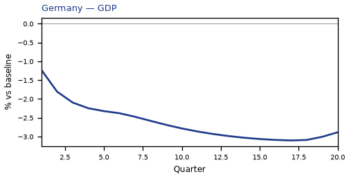


## TR — Turkey

The main impact of a 150 basis-point (1.50 percentage-point) rise in United States interest rates together with oil at $180 a barrel on Turkey would be a large drop in GDP of 4.20% by Q14. Equities peak at -6.91% in Q12.

Demand and trade. Consumption peaks at -2.48 % vs baseline in Q15, from -0.70 in Q1 to -1.75 in Q20. Investment peaks at -10.77 % vs baseline in Q9, from -4.73 in Q1 to -4.31 in Q20. Net Exports peaks at -3.86 % vs baseline in Q4, from -2.45 in Q1 to -1.07 in Q20. Gov Spending peaks at +0.73 % vs baseline in Q14, from +0.24 in Q1 to +0.47 in Q20. Gov Debt peaks at -4.89 % vs baseline in Q20, from -0.13 in Q1 to -4.89 in Q20.

External / FX. The real exchange rate shows real depreciation (a weaker, more competitive home currency). Currency Strength peaks at +5.88 % vs baseline in Q13, from +1.26 in Q1 to +4.64 in Q20.

Labour. Employment peaks at -4.22 % vs baseline in Q18, from -0.22 in Q1 to -4.10 in Q20. Unemployment peaks at +0.99 pp in Q16, from +0.10 in Q1 to +0.84 in Q20. Real Wages peaks at -6.66 % vs baseline in Q20, from -0.03 in Q1 to -6.66 in Q20.

Prices. The three-year CPI impulse is +2.14 percentage points. CPI Inflation peaks at +0.43 pp in Q3, from +0.23 in Q1 to -0.40 in Q20. Domestic Infl. peaks at +0.30 pp in Q3, from +0.16 in Q1 to -0.28 in Q20. Marginal Cost peaks at -2.50 % vs baseline in Q14, from -0.81 in Q1 to -1.63 in Q20.

Financial conditions. Policy Rate peaks at -1.98 pp (annualized) in Q19, from +0.63 in Q1 to -1.98 in Q20. Govt 2Y Yield peaks at -1.91 pp (annualized) in Q16, from +1.34 in Q1 to -1.76 in Q20. Govt 5Y Yield peaks at -1.59 pp (annualized) in Q13, from -0.18 in Q1 to -1.26 in Q20. Govt 10Y Yield peaks at -1.05 pp (annualized) in Q11, from -0.69 in Q1 to -0.78 in Q20. Bond Price peaks at +6.19 % vs baseline in Q19, from -1.97 in Q1 to +6.18 in Q20. Equity Index peaks at -6.91 % vs baseline in Q12, from -2.60 in Q1 to -3.87 in Q20. Tobin's Q peaks at -7.54 % vs baseline in Q9, from -3.31 in Q1 to -3.02 in Q20. House Prices peaks at -5.71 % vs baseline in Q19, from -0.23 in Q1 to -5.70 in Q20. Bank Credit peaks at -0.57 % vs baseline in Q17, from -0.05 in Q1 to -0.56 in Q20. Credit Spread peaks at +0.05 pp in Q17, from +0.00 in Q1 to +0.05 in Q20.

Sectoral and capital. Manuf. GDP peaks at -4.46 % vs baseline in Q11, from -2.14 in Q1 to -3.15 in Q20. Services GDP peaks at -2.54 % vs baseline in Q14, from -0.84 in Q1 to -1.66 in Q20. Capital Stock peaks at -0.87 % vs baseline in Q20, from -0.02 in Q1 to -0.87 in Q20.

Timing. By Q20 GDP is still -2.74% from baseline.

These figures are model IRFs versus baseline, not forecasts.


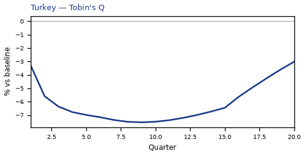

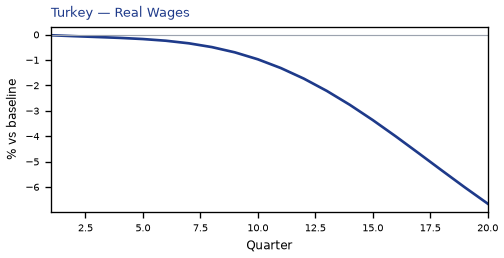

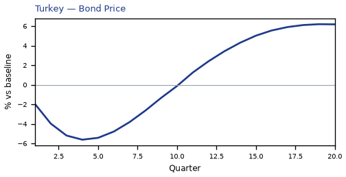

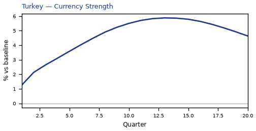

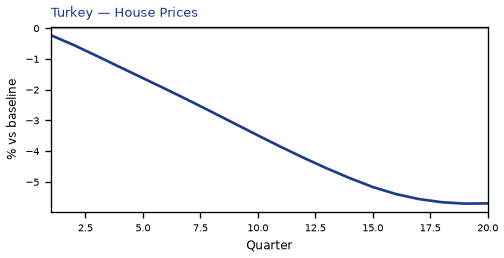

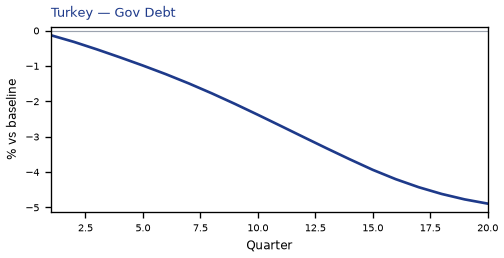

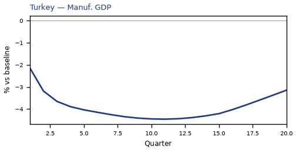

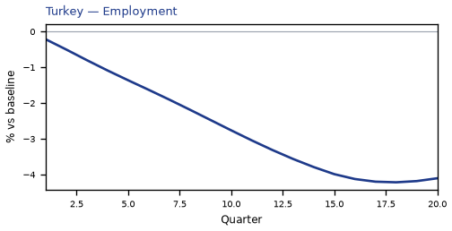

[Q1–Q20 JSON for Turkey](numbers/TR.json)

## IN — India

The main impact of a 150 basis-point (1.50 percentage-point) rise in United States interest rates together with oil at $180 a barrel on India would be a large drop in GDP of 3.97% by Q15. Equities peak at -10.34% in Q15.

Demand and trade. Consumption peaks at -2.43 % vs baseline in Q15, from -0.74 in Q1 to -1.93 in Q20. Investment peaks at -10.78 % vs baseline in Q8, from -4.76 in Q1 to -4.63 in Q20. Net Exports peaks at -3.97 % vs baseline in Q4, from -2.50 in Q1 to -1.13 in Q20. Gov Spending peaks at +0.67 % vs baseline in Q15, from +0.24 in Q1 to +0.50 in Q20. Gov Debt peaks at -7.63 % vs baseline in Q20, from -0.21 in Q1 to -7.63 in Q20.

External / FX. The real exchange rate shows real depreciation (a weaker, more competitive home currency). Currency Strength peaks at +5.07 % vs baseline in Q18, from +0.47 in Q1 to +4.96 in Q20.

Labour. Employment peaks at -3.62 % vs baseline in Q20, from -0.16 in Q1 to -3.62 in Q20. Unemployment peaks at +0.28 pp in Q16, from +0.04 in Q1 to +0.24 in Q20. Real Wages peaks at -5.34 % vs baseline in Q20, from -0.02 in Q1 to -5.34 in Q20.

Prices. The three-year CPI impulse is +2.29 percentage points. CPI Inflation peaks at +0.48 pp in Q3, from +0.28 in Q1 to -0.41 in Q20. Domestic Infl. peaks at +0.34 pp in Q3, from +0.20 in Q1 to -0.28 in Q20. Marginal Cost peaks at -2.36 % vs baseline in Q15, from -0.85 in Q1 to -1.76 in Q20.

Financial conditions. Policy Rate peaks at -2.24 pp (annualized) in Q20, from +0.53 in Q1 to -2.24 in Q20. Govt 2Y Yield peaks at -2.23 pp (annualized) in Q19, from +1.52 in Q1 to -2.22 in Q20. Govt 5Y Yield peaks at -1.96 pp (annualized) in Q16, from +0.02 in Q1 to -1.82 in Q20. Govt 10Y Yield peaks at -1.43 pp (annualized) in Q13, from -0.87 in Q1 to -1.24 in Q20. Bond Price peaks at +11.18 % vs baseline in Q20, from -2.66 in Q1 to +11.18 in Q20. Equity Index peaks at -10.34 % vs baseline in Q15, from -4.04 in Q1 to -7.40 in Q20. Tobin's Q peaks at -7.55 % vs baseline in Q8, from -3.33 in Q1 to -3.24 in Q20. House Prices peaks at -5.41 % vs baseline in Q20, from -0.23 in Q1 to -5.41 in Q20. Bank Credit peaks at -0.67 % vs baseline in Q16, from -0.06 in Q1 to -0.65 in Q20. Credit Spread peaks at +0.02 pp in Q16, from +0.00 in Q1 to +0.02 in Q20.

Sectoral and capital. Manuf. GDP peaks at -3.63 % vs baseline in Q14, from -1.73 in Q1 to -3.11 in Q20. Services GDP peaks at -2.19 % vs baseline in Q15, from -0.81 in Q1 to -1.63 in Q20. Capital Stock peaks at -0.88 % vs baseline in Q20, from -0.02 in Q1 to -0.88 in Q20.

Timing. By Q20 GDP is still -2.97% from baseline.

These figures are model IRFs versus baseline, not forecasts.


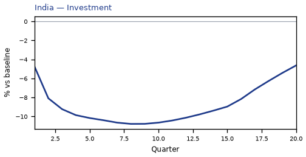

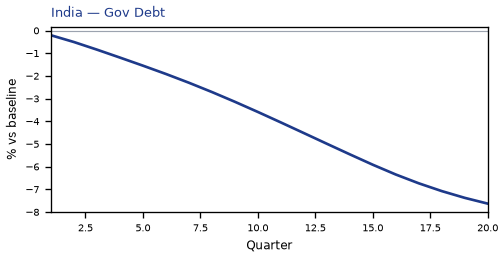

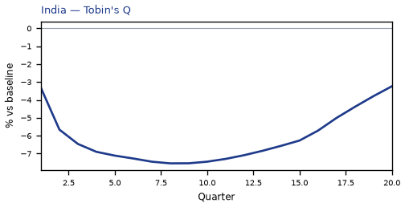

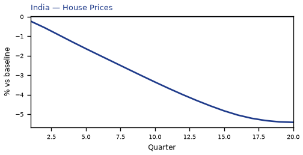

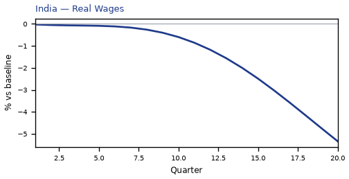

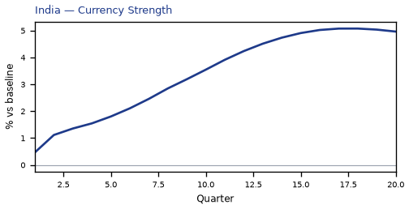

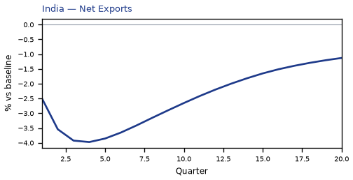

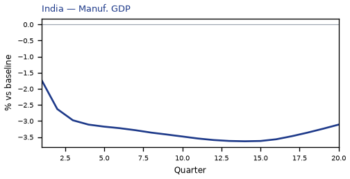

[Q1–Q20 JSON for India](numbers/IN.json)

## KR — South Korea

The main impact of a 150 basis-point (1.50 percentage-point) rise in United States interest rates together with oil at $180 a barrel on South Korea would be a large drop in GDP of 3.63% by Q15. Equities peak at -8.71% in Q14.

Demand and trade. Consumption peaks at -2.30 % vs baseline in Q15, from -0.85 in Q1 to -1.93 in Q20. Investment peaks at -9.42 % vs baseline in Q8, from -4.99 in Q1 to -5.47 in Q20. Net Exports peaks at -4.71 % vs baseline in Q4, from -2.87 in Q1 to -1.07 in Q20. Gov Spending peaks at +0.65 % vs baseline in Q15, from +0.29 in Q1 to +0.52 in Q20. Gov Debt peaks at -2.72 % vs baseline in Q20, from -0.10 in Q1 to -2.72 in Q20.

External / FX. The real exchange rate shows real depreciation (a weaker, more competitive home currency). Currency Strength peaks at +8.00 % vs baseline in Q5, from +4.86 in Q1 to +7.37 in Q20.

Labour. Employment peaks at -3.64 % vs baseline in Q18, from -0.31 in Q1 to -3.56 in Q20. Unemployment peaks at +1.45 pp in Q16, from +0.16 in Q1 to +1.36 in Q20. Real Wages peaks at -3.86 % vs baseline in Q20, from -0.02 in Q1 to -3.86 in Q20.

Prices. The three-year CPI impulse is +2.69 percentage points. CPI Inflation peaks at +0.49 pp in Q2, from +0.39 in Q1 to -0.13 in Q20. Domestic Infl. peaks at +0.34 pp in Q2, from +0.27 in Q1 to -0.09 in Q20. Marginal Cost peaks at -2.15 % vs baseline in Q15, from -0.95 in Q1 to -1.73 in Q20.

Financial conditions. Policy Rate peaks at -1.64 pp (annualized) in Q20, from +0.37 in Q1 to -1.64 in Q20. Govt 2Y Yield peaks at -1.65 pp (annualized) in Q19, from +0.81 in Q1 to -1.65 in Q20. Govt 5Y Yield peaks at -1.51 pp (annualized) in Q16, from -0.22 in Q1 to -1.44 in Q20. Govt 10Y Yield peaks at -1.21 pp (annualized) in Q13, from -0.82 in Q1 to -1.09 in Q20. Bond Price peaks at +8.18 % vs baseline in Q20, from -1.86 in Q1 to +8.18 in Q20. Equity Index peaks at -8.71 % vs baseline in Q14, from -4.17 in Q1 to -6.68 in Q20. Tobin's Q peaks at -6.60 % vs baseline in Q8, from -3.49 in Q1 to -3.83 in Q20. House Prices peaks at -4.64 % vs baseline in Q20, from -0.19 in Q1 to -4.64 in Q20. Bank Credit peaks at -0.88 % vs baseline in Q17, from -0.07 in Q1 to -0.87 in Q20. Credit Spread peaks at +0.01 pp in Q17, from +0.00 in Q1 to +0.01 in Q20.

Sectoral and capital. Manuf. GDP peaks at -5.98 % vs baseline in Q4, from -3.61 in Q1 to -4.34 in Q20. Services GDP peaks at -2.19 % vs baseline in Q15, from -0.99 in Q1 to -1.76 in Q20. Capital Stock peaks at -0.82 % vs baseline in Q20, from -0.02 in Q1 to -0.82 in Q20.

Timing. By Q20 GDP is still -2.92% from baseline.

These figures are model IRFs versus baseline, not forecasts.


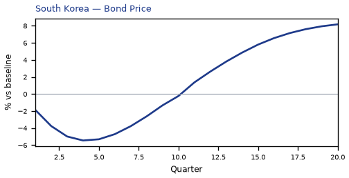

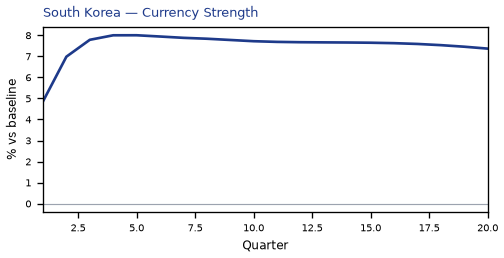

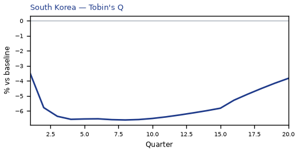

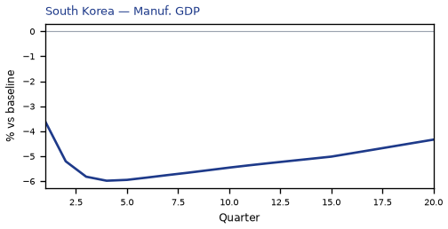

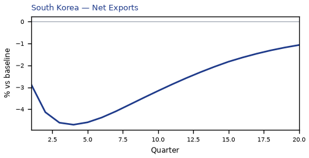

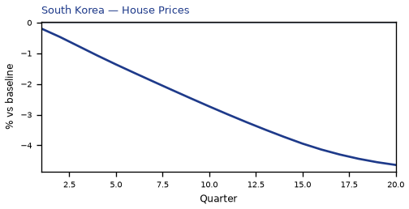

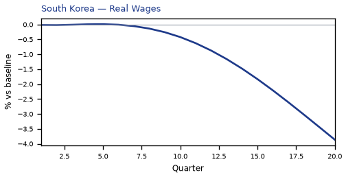

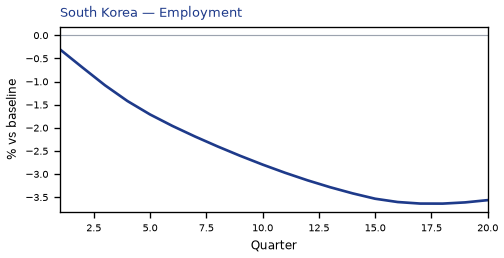

[Q1–Q20 JSON for South Korea](numbers/KR.json)

## DE — Germany

The main impact of a 150 basis-point (1.50 percentage-point) rise in United States interest rates together with oil at $180 a barrel on Germany would be a large drop in GDP of 3.10% by Q17. Equities peak at -5.91% in Q16.

Demand and trade. Consumption peaks at -1.78 % vs baseline in Q18, from -0.59 in Q1 to -1.69 in Q20. Investment peaks at -8.97 % vs baseline in Q10, from -3.80 in Q1 to -7.33 in Q20. Net Exports peaks at -2.71 % vs baseline in Q4, from -1.67 in Q1 to -0.85 in Q20. Gov Spending peaks at +0.69 % vs baseline in Q17, from +0.27 in Q1 to +0.64 in Q20. Gov Debt peaks at +0.61 % vs baseline in Q20, from +0.02 in Q1 to +0.61 in Q20.

External / FX. The real exchange rate shows real depreciation (a weaker, more competitive home currency). Currency Strength peaks at +5.16 % vs baseline in Q4, from +3.14 in Q1 to +2.64 in Q20.

Labour. Employment peaks at -3.26 % vs baseline in Q20, from -0.24 in Q1 to -3.26 in Q20. Unemployment peaks at +2.27 pp in Q19, from +0.19 in Q1 to +2.26 in Q20. Real Wages peaks at -2.08 % vs baseline in Q20, from -0.01 in Q1 to -2.08 in Q20.

Prices. The three-year CPI impulse is +2.42 percentage points. CPI Inflation peaks at +0.59 pp in Q2, from +0.46 in Q1 to -0.20 in Q20. Domestic Infl. peaks at +0.41 pp in Q2, from +0.32 in Q1 to -0.14 in Q20. Marginal Cost peaks at -1.84 % vs baseline in Q17, from -0.72 in Q1 to -1.72 in Q20.

Financial conditions. Policy Rate peaks at +1.24 pp (annualized) in Q6, from +0.30 in Q1 to -0.37 in Q20. Govt 2Y Yield peaks at +1.07 pp (annualized) in Q3, from +0.97 in Q1 to -0.49 in Q20. Govt 5Y Yield peaks at +0.51 pp (annualized) in Q1, from +0.51 in Q1 to -0.51 in Q20. Govt 10Y Yield peaks at -0.41 pp (annualized) in Q18, from -0.00 in Q1 to -0.41 in Q20. Bond Price peaks at -8.68 % vs baseline in Q6, from -2.09 in Q1 to +2.60 in Q20. Equity Index peaks at -5.91 % vs baseline in Q16, from -2.52 in Q1 to -5.40 in Q20. Tobin's Q peaks at -6.28 % vs baseline in Q10, from -2.66 in Q1 to -5.13 in Q20. House Prices peaks at -4.22 % vs baseline in Q20, from -0.15 in Q1 to -4.22 in Q20. Bank Credit peaks at -1.07 % vs baseline in Q18, from -0.07 in Q1 to -1.05 in Q20. Credit Spread peaks at +0.01 pp in Q18, from +0.00 in Q1 to +0.01 in Q20.

Sectoral and capital. Manuf. GDP peaks at -4.33 % vs baseline in Q4, from -2.60 in Q1 to -2.52 in Q20. Services GDP peaks at -2.12 % vs baseline in Q17, from -0.84 in Q1 to -1.97 in Q20. Capital Stock peaks at -0.81 % vs baseline in Q20, from -0.02 in Q1 to -0.81 in Q20.

Timing. By Q20 GDP is still -2.89% from baseline.

These figures are model IRFs versus baseline, not forecasts.


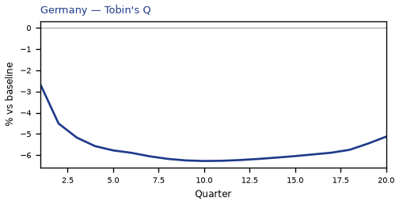

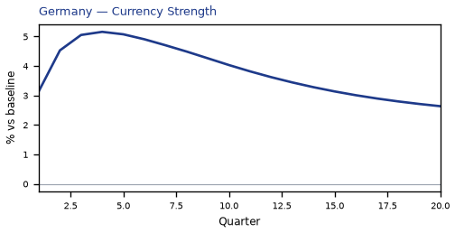

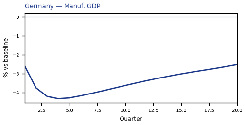

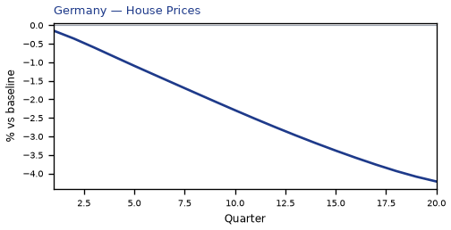

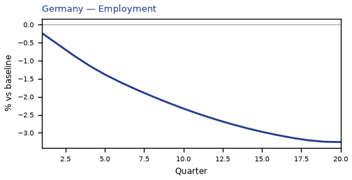

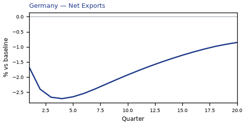

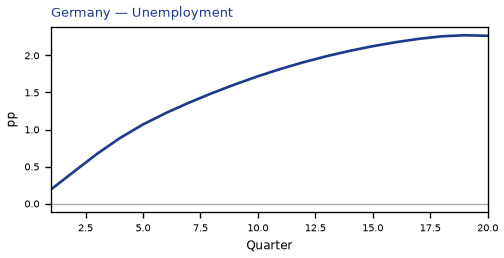

[Q1–Q20 JSON for Germany](numbers/DE.json)

## SA — Saudi Arabia

The main impact of a 150 basis-point (1.50 percentage-point) rise in United States interest rates together with oil at $180 a barrel on Saudi Arabia would be a large rise in GDP of 3.08% by Q4. Equities peak at +11.95% in Q4.

Demand and trade. Consumption peaks at +1.95 % vs baseline in Q5, from +0.91 in Q1 to +0.78 in Q20. Investment peaks at +7.41 % vs baseline in Q2, from +4.86 in Q1 to +3.11 in Q20. Net Exports peaks at +24.76 % vs baseline in Q4, from +15.16 in Q1 to +10.75 in Q20. Gov Spending peaks at +9.49 % vs baseline in Q4, from +5.77 in Q1 to +4.19 in Q20. Gov Debt peaks at +5.40 % vs baseline in Q20, from +0.29 in Q1 to +5.40 in Q20.

External / FX. The real exchange rate shows real appreciation (a stronger home currency). Currency Strength peaks at -0.84 % vs baseline in Q11, from -0.03 in Q1 to -0.68 in Q20.

Labour. Employment peaks at +2.73 % vs baseline in Q9, from +0.45 in Q1 to +1.74 in Q20. Unemployment peaks at -1.02 pp in Q8, from -0.20 in Q1 to -0.57 in Q20. Real Wages peaks at +4.28 % vs baseline in Q20, from +0.01 in Q1 to +4.28 in Q20.

Prices. The three-year CPI impulse is +2.37 percentage points. CPI Inflation peaks at +0.31 pp in Q3, from +0.20 in Q1 to +0.02 in Q20. Domestic Infl. peaks at +0.22 pp in Q3, from +0.14 in Q1 to +0.01 in Q20. Marginal Cost peaks at +1.86 % vs baseline in Q4, from +1.16 in Q1 to +0.69 in Q20.

Financial conditions. Policy Rate peaks at +1.52 pp (annualized) in Q6, from +0.37 in Q1 to +0.06 in Q20. Govt 2Y Yield peaks at +1.27 pp (annualized) in Q2, from +1.20 in Q1 to +0.03 in Q20. Govt 5Y Yield peaks at +0.65 pp (annualized) in Q1, from +0.65 in Q1 to +0.01 in Q20. Govt 10Y Yield peaks at +0.33 pp (annualized) in Q1, from +0.33 in Q1 to +0.01 in Q20. Bond Price peaks at -7.62 % vs baseline in Q6, from -1.85 in Q1 to +1.40 in Q20. Equity Index peaks at +11.95 % vs baseline in Q4, from +7.60 in Q1 to +4.95 in Q20. Tobin's Q peaks at +5.19 % vs baseline in Q2, from +3.40 in Q1 to +2.18 in Q20. House Prices peaks at +3.10 % vs baseline in Q15, from +0.30 in Q1 to +3.01 in Q20. Bank Credit peaks at +0.08 % vs baseline in Q14, from +0.01 in Q1 to +0.08 in Q20. Credit Spread peaks at +0.00 pp in Q1, from +0.00 in Q1 to +0.00 in Q20.

Sectoral and capital. Manuf. GDP peaks at -0.66 % vs baseline in Q3, from -0.44 in Q1 to -0.15 in Q20. Services GDP peaks at +1.36 % vs baseline in Q4, from +0.84 in Q1 to +0.51 in Q20. Capital Stock peaks at +0.47 % vs baseline in Q20, from +0.02 in Q1 to +0.47 in Q20.

Timing. By Q20 GDP is still +1.15% from baseline.

These figures are model IRFs versus baseline, not forecasts.


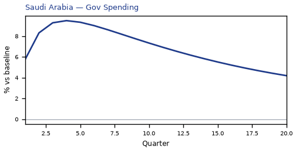

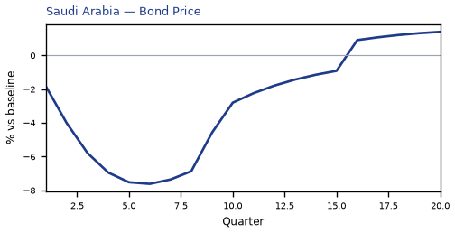


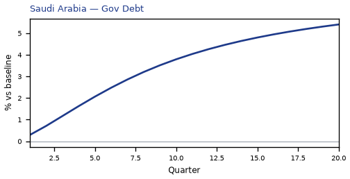

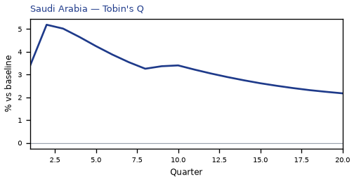

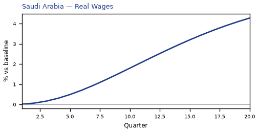

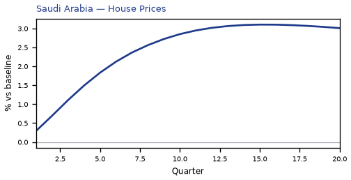

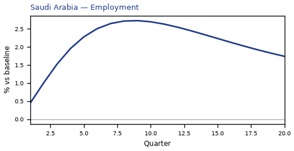

[Q1–Q20 JSON for Saudi Arabia](numbers/SA.json)

## JP — Japan

The main impact of a 150 basis-point (1.50 percentage-point) rise in United States interest rates together with oil at $180 a barrel on Japan would be a large drop in GDP of 3.08% by Q17. Equities peak at -8.32% in Q16.

Demand and trade. Consumption peaks at -2.09 % vs baseline in Q17, from -0.78 in Q1 to -1.93 in Q20. Investment peaks at -8.62 % vs baseline in Q15, from -4.06 in Q1 to -7.55 in Q20. Net Exports peaks at -3.82 % vs baseline in Q4, from -2.34 in Q1 to -1.95 in Q20. Gov Spending peaks at +0.61 % vs baseline in Q17, from +0.29 in Q1 to +0.55 in Q20. Gov Debt peaks at -1.24 % vs baseline in Q20, from -0.04 in Q1 to -1.24 in Q20.

External / FX. The real exchange rate shows real depreciation (a weaker, more competitive home currency). Currency Strength peaks at +9.09 % vs baseline in Q4, from +5.21 in Q1 to -0.50 in Q20.

Labour. Employment peaks at -3.33 % vs baseline in Q18, from -0.35 in Q1 to -3.30 in Q20. Unemployment peaks at +2.27 pp in Q18, from +0.23 in Q1 to +2.25 in Q20. Real Wages peaks at +0.99 % vs baseline in Q12, from -0.00 in Q1 to +0.24 in Q20.

Prices. The three-year CPI impulse is +1.93 percentage points. CPI Inflation peaks at +0.48 pp in Q2, from +0.36 in Q1 to -0.20 in Q20. Domestic Infl. peaks at +0.34 pp in Q2, from +0.25 in Q1 to -0.14 in Q20. Marginal Cost peaks at -1.82 % vs baseline in Q17, from -0.86 in Q1 to -1.66 in Q20.

Financial conditions. Policy Rate peaks at +0.28 pp (annualized) in Q7, from +0.04 in Q1 to -0.03 in Q20. Govt 2Y Yield peaks at +0.25 pp (annualized) in Q4, from +0.20 in Q1 to -0.09 in Q20. Govt 5Y Yield peaks at +0.15 pp (annualized) in Q1, from +0.15 in Q1 to -0.14 in Q20. Govt 10Y Yield peaks at -0.16 pp (annualized) in Q20, from +0.00 in Q1 to -0.16 in Q20. Bond Price peaks at -2.51 % vs baseline in Q5, from -0.67 in Q1 to +1.59 in Q20. Equity Index peaks at -8.32 % vs baseline in Q16, from -4.10 in Q1 to -7.47 in Q20. Tobin's Q peaks at -6.04 % vs baseline in Q15, from -2.84 in Q1 to -5.29 in Q20. House Prices peaks at -3.92 % vs baseline in Q20, from -0.16 in Q1 to -3.92 in Q20. Bank Credit peaks at -1.09 % vs baseline in Q16, from -0.08 in Q1 to -1.05 in Q20. Credit Spread peaks at +0.01 pp in Q16, from +0.00 in Q1 to +0.01 in Q20.

Sectoral and capital. Manuf. GDP peaks at -5.60 % vs baseline in Q4, from -3.29 in Q1 to -1.56 in Q20. Services GDP peaks at -2.13 % vs baseline in Q17, from -1.02 in Q1 to -1.94 in Q20. Capital Stock peaks at -0.78 % vs baseline in Q20, from -0.02 in Q1 to -0.78 in Q20.

Timing. By Q20 GDP is still -2.79% from baseline.

These figures are model IRFs versus baseline, not forecasts.


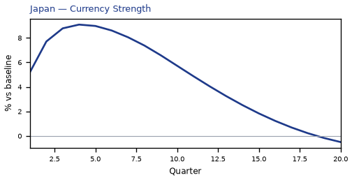


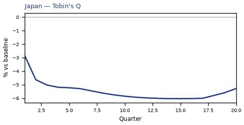

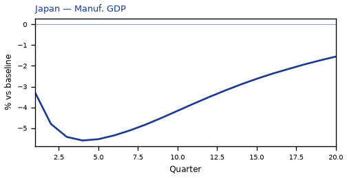

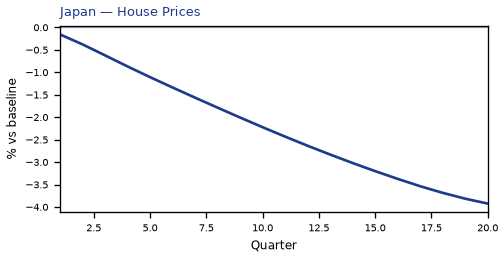

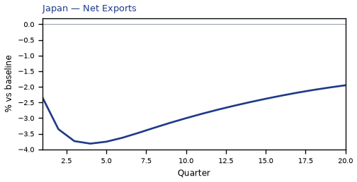

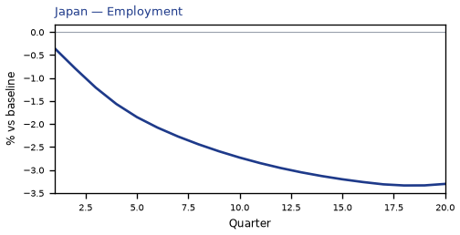

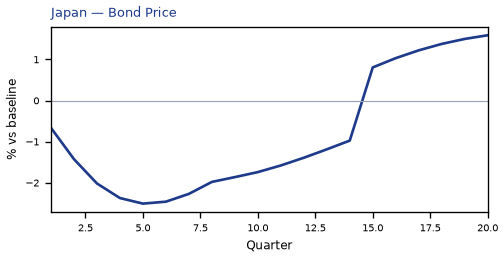

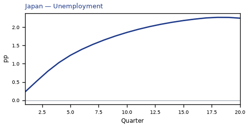

[Q1–Q20 JSON for Japan](numbers/JP.json)

## AR — Argentina

The main impact of a 150 basis-point (1.50 percentage-point) rise in United States interest rates together with oil at $180 a barrel on Argentina would be a large drop in GDP of 2.90% by Q13. Equities peak at -4.69% in Q11.

Demand and trade. Consumption peaks at -1.46 % vs baseline in Q14, from -0.28 in Q1 to -1.02 in Q20. Investment peaks at -6.88 % vs baseline in Q8, from -2.34 in Q1 to -1.58 in Q20. Net Exports peaks at +1.80 % vs baseline in Q8, from +0.73 in Q1 to +1.01 in Q20. Gov Spending peaks at +0.75 % vs baseline in Q12, from +0.20 in Q1 to +0.47 in Q20. Gov Debt peaks at -2.73 % vs baseline in Q20, from -0.03 in Q1 to -2.73 in Q20.

External / FX. The real exchange rate shows real depreciation (a weaker, more competitive home currency). Currency Strength peaks at +2.82 % vs baseline in Q13, from +0.59 in Q1 to +1.65 in Q20.

Labour. Employment peaks at -2.86 % vs baseline in Q18, from -0.07 in Q1 to -2.80 in Q20. Unemployment peaks at +0.57 pp in Q15, from +0.03 in Q1 to +0.46 in Q20. Real Wages peaks at -5.67 % vs baseline in Q20, from -0.01 in Q1 to -5.67 in Q20.

Prices. The three-year CPI impulse is +1.03 percentage points. CPI Inflation peaks at -0.47 pp in Q18, from +0.27 in Q1 to -0.45 in Q20. Domestic Infl. peaks at -0.33 pp in Q18, from +0.19 in Q1 to -0.31 in Q20. Marginal Cost peaks at -1.72 % vs baseline in Q13, from -0.29 in Q1 to -1.06 in Q20.

Financial conditions. Policy Rate peaks at -2.13 pp (annualized) in Q18, from +0.65 in Q1 to -2.09 in Q20. Govt 2Y Yield peaks at -2.04 pp (annualized) in Q15, from +1.04 in Q1 to -1.67 in Q20. Govt 5Y Yield peaks at -1.59 pp (annualized) in Q11, from -0.52 in Q1 to -0.90 in Q20. Govt 10Y Yield peaks at -0.88 pp (annualized) in Q9, from -0.66 in Q1 to -0.47 in Q20. Bond Price peaks at +5.33 % vs baseline in Q18, from -1.63 in Q1 to +5.23 in Q20. Equity Index peaks at -4.69 % vs baseline in Q11, from -1.13 in Q1 to -1.99 in Q20. Tobin's Q peaks at -4.82 % vs baseline in Q8, from -1.63 in Q1 to -1.10 in Q20. House Prices peaks at -3.33 % vs baseline in Q19, from -0.09 in Q1 to -3.31 in Q20. Bank Credit peaks at -0.36 % vs baseline in Q17, from -0.03 in Q1 to -0.36 in Q20. Credit Spread peaks at +0.11 pp in Q17, from +0.01 in Q1 to +0.10 in Q20.

Sectoral and capital. Manuf. GDP peaks at -2.56 % vs baseline in Q10, from -1.26 in Q1 to -1.56 in Q20. Services GDP peaks at -1.66 % vs baseline in Q13, from -0.29 in Q1 to -1.02 in Q20. Capital Stock peaks at -0.49 % vs baseline in Q20, from -0.01 in Q1 to -0.49 in Q20.

Timing. By Q20 GDP is still -1.79% from baseline.

These figures are model IRFs versus baseline, not forecasts.


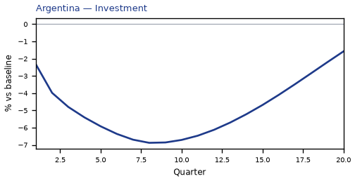

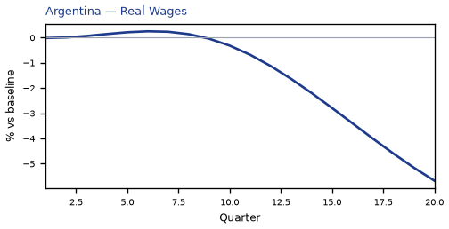

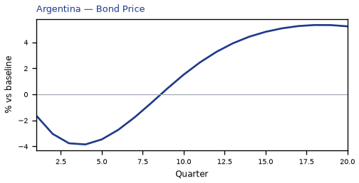


[Q1–Q20 JSON for Argentina](numbers/AR.json)

## PL — Poland

The main impact of a 150 basis-point (1.50 percentage-point) rise in United States interest rates together with oil at $180 a barrel on Poland would be a large drop in GDP of 2.83% by Q17. Equities peak at -4.78% in Q12.

Demand and trade. Consumption peaks at -1.53 % vs baseline in Q18, from -0.56 in Q1 to -1.44 in Q20. Investment peaks at -8.23 % vs baseline in Q8, from -3.92 in Q1 to -5.81 in Q20. Net Exports peaks at -1.95 % vs baseline in Q4, from -1.13 in Q1 to -0.39 in Q20. Gov Spending peaks at +0.56 % vs baseline in Q17, from +0.23 in Q1 to +0.51 in Q20. Gov Debt peaks at +0.00 % vs baseline in Q1, from +0.00 in Q1 to +0.00 in Q20.

External / FX. The real exchange rate shows real depreciation (a weaker, more competitive home currency). Currency Strength peaks at +3.93 % vs baseline in Q3, from +2.73 in Q1 to +2.61 in Q20.

Labour. Employment peaks at -3.09 % vs baseline in Q20, from -0.24 in Q1 to -3.09 in Q20. Unemployment peaks at +1.20 pp in Q19, from +0.12 in Q1 to +1.19 in Q20. Real Wages peaks at -2.80 % vs baseline in Q20, from -0.01 in Q1 to -2.80 in Q20.

Prices. The three-year CPI impulse is +2.14 percentage points. CPI Inflation peaks at +0.46 pp in Q2, from +0.37 in Q1 to -0.17 in Q20. Domestic Infl. peaks at +0.32 pp in Q2, from +0.26 in Q1 to -0.12 in Q20. Marginal Cost peaks at -1.68 % vs baseline in Q17, from -0.68 in Q1 to -1.54 in Q20.

Financial conditions. Policy Rate peaks at +1.61 pp (annualized) in Q5, from +0.49 in Q1 to -0.84 in Q20. Govt 2Y Yield peaks at +1.33 pp (annualized) in Q2, from +1.27 in Q1 to -0.90 in Q20. Govt 5Y Yield peaks at -0.82 pp (annualized) in Q18, from +0.44 in Q1 to -0.81 in Q20. Govt 10Y Yield peaks at -0.65 pp (annualized) in Q16, from -0.18 in Q1 to -0.61 in Q20. Bond Price peaks at -6.70 % vs baseline in Q5, from -2.05 in Q1 to +3.48 in Q20. Equity Index peaks at -4.78 % vs baseline in Q12, from -2.26 in Q1 to -4.10 in Q20. Tobin's Q peaks at -5.76 % vs baseline in Q8, from -2.74 in Q1 to -4.07 in Q20. House Prices peaks at -3.86 % vs baseline in Q20, from -0.14 in Q1 to -3.86 in Q20. Bank Credit peaks at -0.63 % vs baseline in Q18, from -0.05 in Q1 to -0.63 in Q20. Credit Spread peaks at +0.02 pp in Q18, from +0.00 in Q1 to +0.02 in Q20.

Sectoral and capital. Manuf. GDP peaks at -3.97 % vs baseline in Q4, from -2.52 in Q1 to -2.50 in Q20. Services GDP peaks at -1.77 % vs baseline in Q17, from -0.73 in Q1 to -1.63 in Q20. Capital Stock peaks at -0.73 % vs baseline in Q20, from -0.02 in Q1 to -0.73 in Q20.

Timing. By Q20 GDP is still -2.59% from baseline.

These figures are model IRFs versus baseline, not forecasts.


[Q1–Q20 JSON for Poland](numbers/PL.json)

## IT — Italy

The main impact of a 150 basis-point (1.50 percentage-point) rise in United States interest rates together with oil at $180 a barrel on Italy would be a large drop in GDP of 2.82% by Q17. Equities peak at -4.79% in Q12.

Demand and trade. Consumption peaks at -1.50 % vs baseline in Q17, from -0.59 in Q1 to -1.40 in Q20. Investment peaks at -8.38 % vs baseline in Q9, from -3.98 in Q1 to -6.43 in Q20. Net Exports peaks at -2.81 % vs baseline in Q4, from -1.72 in Q1 to -1.03 in Q20. Gov Spending peaks at +0.61 % vs baseline in Q17, from +0.28 in Q1 to +0.56 in Q20. Gov Debt peaks at +0.28 % vs baseline in Q17, from +0.06 in Q1 to +0.27 in Q20.

External / FX. The real exchange rate shows real depreciation (a weaker, more competitive home currency). Currency Strength peaks at +6.11 % vs baseline in Q4, from +3.72 in Q1 to +3.02 in Q20.

Labour. Employment peaks at -3.14 % vs baseline in Q20, from -0.24 in Q1 to -3.14 in Q20. Unemployment peaks at +1.20 pp in Q18, from +0.13 in Q1 to +1.19 in Q20. Real Wages peaks at -0.76 % vs baseline in Q20, from -0.01 in Q1 to -0.76 in Q20.

Prices. The three-year CPI impulse is +2.18 percentage points. CPI Inflation peaks at +0.48 pp in Q2, from +0.36 in Q1 to -0.16 in Q20. Domestic Infl. peaks at +0.33 pp in Q2, from +0.25 in Q1 to -0.11 in Q20. Marginal Cost peaks at -1.67 % vs baseline in Q17, from -0.76 in Q1 to -1.52 in Q20.

Financial conditions. Policy Rate peaks at +1.24 pp (annualized) in Q6, from +0.30 in Q1 to -0.37 in Q20. Govt 2Y Yield peaks at +1.07 pp (annualized) in Q3, from +0.97 in Q1 to -0.49 in Q20. Govt 5Y Yield peaks at +0.51 pp (annualized) in Q1, from +0.51 in Q1 to -0.51 in Q20. Govt 10Y Yield peaks at -0.41 pp (annualized) in Q18, from -0.00 in Q1 to -0.41 in Q20. Bond Price peaks at -8.61 % vs baseline in Q6, from -2.08 in Q1 to +2.58 in Q20. Equity Index peaks at -4.79 % vs baseline in Q12, from -2.45 in Q1 to -4.15 in Q20. Tobin's Q peaks at -5.87 % vs baseline in Q9, from -2.79 in Q1 to -4.50 in Q20. House Prices peaks at -3.75 % vs baseline in Q20, from -0.15 in Q1 to -3.75 in Q20. Bank Credit peaks at -0.87 % vs baseline in Q17, from -0.07 in Q1 to -0.86 in Q20. Credit Spread peaks at +0.01 pp in Q17, from +0.00 in Q1 to +0.01 in Q20.

Sectoral and capital. Manuf. GDP peaks at -4.10 % vs baseline in Q4, from -2.48 in Q1 to -2.25 in Q20. Services GDP peaks at -2.05 % vs baseline in Q17, from -0.95 in Q1 to -1.87 in Q20. Capital Stock peaks at -0.76 % vs baseline in Q20, from -0.02 in Q1 to -0.76 in Q20.

Timing. By Q20 GDP is still -2.57% from baseline.

These figures are model IRFs versus baseline, not forecasts.


[Q1–Q20 JSON for Italy](numbers/IT.json)

## ES — Spain

The main impact of a 150 basis-point (1.50 percentage-point) rise in United States interest rates together with oil at $180 a barrel on Spain would be a large drop in GDP of 2.57% by Q17. Equities peak at -4.88% in Q12.

Demand and trade. Consumption peaks at -1.48 % vs baseline in Q17, from -0.58 in Q1 to -1.39 in Q20. Investment peaks at -7.82 % vs baseline in Q9, from -3.68 in Q1 to -5.84 in Q20. Net Exports peaks at -2.79 % vs baseline in Q4, from -1.72 in Q1 to -1.01 in Q20. Gov Spending peaks at +0.56 % vs baseline in Q17, from +0.25 in Q1 to +0.51 in Q20. Gov Debt peaks at +0.25 % vs baseline in Q20, from +0.01 in Q1 to +0.25 in Q20.

External / FX. The real exchange rate shows real depreciation (a weaker, more competitive home currency). Currency Strength peaks at +5.02 % vs baseline in Q4, from +3.08 in Q1 to +2.50 in Q20.

Labour. Employment peaks at -2.78 % vs baseline in Q20, from -0.22 in Q1 to -2.78 in Q20. Unemployment peaks at +1.28 pp in Q19, from +0.13 in Q1 to +1.27 in Q20. Real Wages peaks at -0.83 % vs baseline in Q20, from -0.01 in Q1 to -0.83 in Q20.

Prices. The three-year CPI impulse is +2.51 percentage points. CPI Inflation peaks at +0.54 pp in Q2, from +0.41 in Q1 to -0.17 in Q20. Domestic Infl. peaks at +0.38 pp in Q2, from +0.29 in Q1 to -0.12 in Q20. Marginal Cost peaks at -1.52 % vs baseline in Q17, from -0.69 in Q1 to -1.39 in Q20.

Financial conditions. Policy Rate peaks at +1.24 pp (annualized) in Q6, from +0.30 in Q1 to -0.37 in Q20. Govt 2Y Yield peaks at +1.07 pp (annualized) in Q3, from +0.97 in Q1 to -0.49 in Q20. Govt 5Y Yield peaks at +0.51 pp (annualized) in Q1, from +0.51 in Q1 to -0.51 in Q20. Govt 10Y Yield peaks at -0.41 pp (annualized) in Q18, from -0.00 in Q1 to -0.41 in Q20. Bond Price peaks at -8.68 % vs baseline in Q6, from -2.09 in Q1 to +2.60 in Q20. Equity Index peaks at -4.88 % vs baseline in Q12, from -2.49 in Q1 to -4.23 in Q20. Tobin's Q peaks at -5.47 % vs baseline in Q9, from -2.58 in Q1 to -4.09 in Q20. House Prices peaks at -3.48 % vs baseline in Q20, from -0.14 in Q1 to -3.48 in Q20. Bank Credit peaks at -0.71 % vs baseline in Q17, from -0.05 in Q1 to -0.70 in Q20. Credit Spread peaks at +0.01 pp in Q17, from +0.00 in Q1 to +0.01 in Q20.

Sectoral and capital. Manuf. GDP peaks at -3.53 % vs baseline in Q4, from -2.14 in Q1 to -1.93 in Q20. Services GDP peaks at -1.89 % vs baseline in Q17, from -0.88 in Q1 to -1.73 in Q20. Capital Stock peaks at -0.70 % vs baseline in Q20, from -0.02 in Q1 to -0.70 in Q20.

Timing. By Q20 GDP is still -2.35% from baseline.

These figures are model IRFs versus baseline, not forecasts.


[Q1–Q20 JSON for Spain](numbers/ES.json)

## TH — Thailand

The main impact of a 150 basis-point (1.50 percentage-point) rise in United States interest rates together with oil at $180 a barrel on Thailand would be a large drop in GDP of 2.50% by Q15. Equities peak at -6.01% in Q12.

Demand and trade. Consumption peaks at -1.66 % vs baseline in Q17, from -0.66 in Q1 to -1.51 in Q20. Investment peaks at -7.02 % vs baseline in Q8, from -3.79 in Q1 to -4.17 in Q20. Net Exports peaks at -2.20 % vs baseline in Q3, from -1.55 in Q1 to -0.28 in Q20. Gov Spending peaks at +0.42 % vs baseline in Q15, from +0.21 in Q1 to +0.36 in Q20. Gov Debt peaks at -4.53 % vs baseline in Q20, from -0.20 in Q1 to -4.53 in Q20.

External / FX. The real exchange rate shows real depreciation (a weaker, more competitive home currency). Currency Strength peaks at +1.21 % vs baseline in Q19, from +0.76 in Q1 to +1.20 in Q20.

Labour. Employment peaks at -2.78 % vs baseline in Q18, from -0.29 in Q1 to -2.75 in Q20. Unemployment peaks at +0.25 pp in Q17, from +0.04 in Q1 to +0.23 in Q20. Real Wages peaks at -3.00 % vs baseline in Q20, from -0.02 in Q1 to -3.00 in Q20.

Prices. The three-year CPI impulse is +2.40 percentage points. CPI Inflation peaks at +0.47 pp in Q2, from +0.34 in Q1 to -0.16 in Q20. Domestic Infl. peaks at +0.33 pp in Q2, from +0.24 in Q1 to -0.11 in Q20. Marginal Cost peaks at -1.48 % vs baseline in Q15, from -0.74 in Q1 to -1.29 in Q20.

Financial conditions. Policy Rate peaks at -1.16 pp (annualized) in Q20, from +0.22 in Q1 to -1.16 in Q20. Govt 2Y Yield peaks at -1.20 pp (annualized) in Q20, from +0.64 in Q1 to -1.20 in Q20. Govt 5Y Yield peaks at -1.08 pp (annualized) in Q17, from -0.03 in Q1 to -1.05 in Q20. Govt 10Y Yield peaks at -0.85 pp (annualized) in Q14, from -0.53 in Q1 to -0.78 in Q20. Bond Price peaks at +4.82 % vs baseline in Q20, from -0.93 in Q1 to +4.82 in Q20. Equity Index peaks at -6.01 % vs baseline in Q12, from -3.26 in Q1 to -4.97 in Q20. Tobin's Q peaks at -4.91 % vs baseline in Q8, from -2.65 in Q1 to -2.92 in Q20. House Prices peaks at -4.26 % vs baseline in Q20, from -0.22 in Q1 to -4.26 in Q20. Bank Credit peaks at -0.56 % vs baseline in Q18, from -0.05 in Q1 to -0.56 in Q20. Credit Spread peaks at +0.01 pp in Q18, from +0.00 in Q1 to +0.01 in Q20.

Sectoral and capital. Manuf. GDP peaks at -3.38 % vs baseline in Q4, from -2.08 in Q1 to -2.07 in Q20. Services GDP peaks at -1.37 % vs baseline in Q15, from -0.70 in Q1 to -1.20 in Q20. Capital Stock peaks at -0.61 % vs baseline in Q20, from -0.02 in Q1 to -0.61 in Q20.

Timing. By Q20 GDP is still -2.18% from baseline.

These figures are model IRFs versus baseline, not forecasts.


[Q1–Q20 JSON for Thailand](numbers/TH.json)

## FR — France

The main impact of a 150 basis-point (1.50 percentage-point) rise in United States interest rates together with oil at $180 a barrel on France would be a large drop in GDP of 2.45% by Q17. Equities peak at -5.38% in Q13.

Demand and trade. Consumption peaks at -1.35 % vs baseline in Q18, from -0.48 in Q1 to -1.28 in Q20. Investment peaks at -7.52 % vs baseline in Q9, from -3.16 in Q1 to -5.68 in Q20. Net Exports peaks at -1.71 % vs baseline in Q4, from -1.10 in Q1 to -0.49 in Q20. Gov Spending peaks at +0.58 % vs baseline in Q17, from +0.23 in Q1 to +0.54 in Q20. Gov Debt peaks at +2.34 % vs baseline in Q20, from +0.07 in Q1 to +2.34 in Q20.

External / FX. The real exchange rate shows real depreciation (a weaker, more competitive home currency). Currency Strength peaks at +5.10 % vs baseline in Q4, from +3.13 in Q1 to +2.60 in Q20.

Labour. Employment peaks at -2.60 % vs baseline in Q20, from -0.16 in Q1 to -2.60 in Q20. Unemployment peaks at +1.81 pp in Q19, from +0.16 in Q1 to +1.80 in Q20. Real Wages peaks at -0.78 % vs baseline in Q20, from -0.00 in Q1 to -0.78 in Q20.

Prices. The three-year CPI impulse is +2.19 percentage points. CPI Inflation peaks at +0.49 pp in Q2, from +0.37 in Q1 to -0.15 in Q20. Domestic Infl. peaks at +0.34 pp in Q2, from +0.26 in Q1 to -0.11 in Q20. Marginal Cost peaks at -1.46 % vs baseline in Q17, from -0.58 in Q1 to -1.36 in Q20.

Financial conditions. Policy Rate peaks at +1.24 pp (annualized) in Q6, from +0.30 in Q1 to -0.37 in Q20. Govt 2Y Yield peaks at +1.07 pp (annualized) in Q3, from +0.97 in Q1 to -0.49 in Q20. Govt 5Y Yield peaks at +0.51 pp (annualized) in Q1, from +0.51 in Q1 to -0.51 in Q20. Govt 10Y Yield peaks at -0.41 pp (annualized) in Q18, from -0.00 in Q1 to -0.41 in Q20. Bond Price peaks at -8.68 % vs baseline in Q6, from -2.09 in Q1 to +2.60 in Q20. Equity Index peaks at -5.38 % vs baseline in Q13, from -2.39 in Q1 to -4.83 in Q20. Tobin's Q peaks at -5.26 % vs baseline in Q9, from -2.21 in Q1 to -3.98 in Q20. House Prices peaks at -3.31 % vs baseline in Q20, from -0.12 in Q1 to -3.31 in Q20. Bank Credit peaks at -0.93 % vs baseline in Q18, from -0.06 in Q1 to -0.92 in Q20. Credit Spread peaks at +0.01 pp in Q18, from +0.00 in Q1 to +0.01 in Q20.

Sectoral and capital. Manuf. GDP peaks at -3.31 % vs baseline in Q4, from -2.00 in Q1 to -1.83 in Q20. Services GDP peaks at -1.89 % vs baseline in Q17, from -0.77 in Q1 to -1.76 in Q20. Capital Stock peaks at -0.67 % vs baseline in Q20, from -0.02 in Q1 to -0.67 in Q20.

Timing. By Q20 GDP is still -2.28% from baseline.

These figures are model IRFs versus baseline, not forecasts.


[Q1–Q20 JSON for France](numbers/FR.json)

## ZA — South Africa

The main impact of a 150 basis-point (1.50 percentage-point) rise in United States interest rates together with oil at $180 a barrel on South Africa would be a large drop in GDP of 2.42% by Q14. Equities peak at -9.42% in Q13.

Demand and trade. Consumption peaks at -1.42 % vs baseline in Q16, from -0.50 in Q1 to -1.28 in Q20. Investment peaks at -7.21 % vs baseline in Q8, from -3.32 in Q1 to -4.20 in Q20. Net Exports peaks at -2.20 % vs baseline in Q4, from -1.24 in Q1 to -0.97 in Q20. Gov Spending peaks at +0.38 % vs baseline in Q14, from +0.16 in Q1 to +0.32 in Q20. Gov Debt peaks at -2.54 % vs baseline in Q20, from -0.08 in Q1 to -2.54 in Q20.

External / FX. The real exchange rate shows real depreciation (a weaker, more competitive home currency). Currency Strength peaks at +3.93 % vs baseline in Q4, from +2.49 in Q1 to +2.68 in Q20.

Labour. Employment peaks at -2.71 % vs baseline in Q19, from -0.20 in Q1 to -2.69 in Q20. Unemployment peaks at +0.59 pp in Q17, from +0.07 in Q1 to +0.56 in Q20. Real Wages peaks at -3.01 % vs baseline in Q20, from -0.01 in Q1 to -3.01 in Q20.

Prices. The three-year CPI impulse is +1.70 percentage points. CPI Inflation peaks at +0.36 pp in Q2, from +0.28 in Q1 to -0.18 in Q20. Domestic Infl. peaks at +0.25 pp in Q2, from +0.20 in Q1 to -0.13 in Q20. Marginal Cost peaks at -1.44 % vs baseline in Q14, from -0.57 in Q1 to -1.23 in Q20.

Financial conditions. Policy Rate peaks at +1.44 pp (annualized) in Q5, from +0.45 in Q1 to -0.96 in Q20. Govt 2Y Yield peaks at +1.16 pp (annualized) in Q2, from +1.13 in Q1 to -0.94 in Q20. Govt 5Y Yield peaks at -0.82 pp (annualized) in Q16, from +0.27 in Q1 to -0.76 in Q20. Govt 10Y Yield peaks at -0.60 pp (annualized) in Q14, from -0.23 in Q1 to -0.53 in Q20. Bond Price peaks at -5.98 % vs baseline in Q5, from -1.87 in Q1 to +3.99 in Q20. Equity Index peaks at -9.42 % vs baseline in Q13, from -3.99 in Q1 to -7.71 in Q20. Tobin's Q peaks at -5.05 % vs baseline in Q8, from -2.32 in Q1 to -2.94 in Q20. House Prices peaks at -3.70 % vs baseline in Q20, from -0.16 in Q1 to -3.70 in Q20. Bank Credit peaks at -0.53 % vs baseline in Q18, from -0.04 in Q1 to -0.53 in Q20. Credit Spread peaks at +0.02 pp in Q18, from +0.00 in Q1 to +0.02 in Q20.

Sectoral and capital. Manuf. GDP peaks at -2.94 % vs baseline in Q4, from -1.80 in Q1 to -1.81 in Q20. Services GDP peaks at -1.55 % vs baseline in Q14, from -0.62 in Q1 to -1.33 in Q20. Capital Stock peaks at -0.61 % vs baseline in Q20, from -0.02 in Q1 to -0.61 in Q20.

Timing. By Q20 GDP is still -2.08% from baseline.

These figures are model IRFs versus baseline, not forecasts.


[Q1–Q20 JSON for South Africa](numbers/ZA.json)

## CL — Chile

The main impact of a 150 basis-point (1.50 percentage-point) rise in United States interest rates together with oil at $180 a barrel on Chile would be a large drop in GDP of 2.09% by Q14. Equities peak at -4.76% in Q8.

Demand and trade. Consumption peaks at -1.31 % vs baseline in Q15, from -0.48 in Q1 to -1.19 in Q20. Investment peaks at -6.68 % vs baseline in Q7, from -3.03 in Q1 to -3.42 in Q20. Net Exports peaks at -2.39 % vs baseline in Q5, from -1.30 in Q1 to -1.23 in Q20. Gov Spending peaks at +0.18 % vs baseline in Q14, from +0.11 in Q1 to +0.16 in Q20. Gov Debt peaks at -2.30 % vs baseline in Q20, from -0.10 in Q1 to -2.30 in Q20.

External / FX. The real exchange rate shows real depreciation (a weaker, more competitive home currency). Currency Strength peaks at +3.15 % vs baseline in Q3, from +1.96 in Q1 to +2.15 in Q20.

Labour. Employment peaks at -2.29 % vs baseline in Q18, from -0.19 in Q1 to -2.26 in Q20. Unemployment peaks at +0.75 pp in Q17, from +0.09 in Q1 to +0.72 in Q20. Real Wages peaks at -2.71 % vs baseline in Q20, from -0.01 in Q1 to -2.71 in Q20.

Prices. The three-year CPI impulse is +1.37 percentage points. CPI Inflation peaks at +0.35 pp in Q2, from +0.27 in Q1 to -0.15 in Q20. Domestic Infl. peaks at +0.25 pp in Q2, from +0.19 in Q1 to -0.11 in Q20. Marginal Cost peaks at -1.24 % vs baseline in Q14, from -0.51 in Q1 to -1.06 in Q20.

Financial conditions. Policy Rate peaks at +1.45 pp (annualized) in Q5, from +0.42 in Q1 to -0.96 in Q20. Govt 2Y Yield peaks at +1.18 pp (annualized) in Q2, from +1.13 in Q1 to -0.96 in Q20. Govt 5Y Yield peaks at -0.84 pp (annualized) in Q16, from +0.29 in Q1 to -0.79 in Q20. Govt 10Y Yield peaks at -0.63 pp (annualized) in Q14, from -0.24 in Q1 to -0.57 in Q20. Bond Price peaks at -6.03 % vs baseline in Q5, from -1.77 in Q1 to +3.99 in Q20. Equity Index peaks at -4.76 % vs baseline in Q8, from -2.19 in Q1 to -3.56 in Q20. Tobin's Q peaks at -4.68 % vs baseline in Q7, from -2.12 in Q1 to -2.40 in Q20. House Prices peaks at -3.26 % vs baseline in Q20, from -0.15 in Q1 to -3.26 in Q20. Bank Credit peaks at -0.43 % vs baseline in Q18, from -0.03 in Q1 to -0.43 in Q20. Credit Spread peaks at +0.01 pp in Q18, from +0.00 in Q1 to +0.01 in Q20.

Sectoral and capital. Manuf. GDP peaks at -2.67 % vs baseline in Q4, from -1.63 in Q1 to -1.60 in Q20. Services GDP peaks at -1.27 % vs baseline in Q14, from -0.53 in Q1 to -1.08 in Q20. Capital Stock peaks at -0.54 % vs baseline in Q20, from -0.02 in Q1 to -0.54 in Q20.

Timing. By Q20 GDP is still -1.79% from baseline.

These figures are model IRFs versus baseline, not forecasts.


[Q1–Q20 JSON for Chile](numbers/CL.json)

## CN — China

The main impact of a 150 basis-point (1.50 percentage-point) rise in United States interest rates together with oil at $180 a barrel on China would be a large drop in GDP of 2.08% by Q11. Equities peak at -4.52% in Q8.

Demand and trade. Consumption peaks at -1.54 % vs baseline in Q12, from -0.68 in Q1 to -1.23 in Q20. Investment peaks at -5.79 % vs baseline in Q4, from -3.19 in Q1 to -1.51 in Q20. Net Exports peaks at -2.85 % vs baseline in Q4, from -1.69 in Q1 to -1.10 in Q20. Gov Spending peaks at +0.35 % vs baseline in Q11, from +0.19 in Q1 to +0.27 in Q20. Gov Debt peaks at -3.71 % vs baseline in Q20, from -0.12 in Q1 to -3.71 in Q20.

External / FX. The real exchange rate shows real depreciation (a weaker, more competitive home currency). Currency Strength peaks at +2.60 % vs baseline in Q20, from +1.32 in Q1 to +2.60 in Q20.

Labour. Employment peaks at -1.93 % vs baseline in Q18, from -0.14 in Q1 to -1.92 in Q20. Unemployment peaks at +0.48 pp in Q14, from +0.08 in Q1 to +0.42 in Q20. Real Wages peaks at -3.21 % vs baseline in Q20, from -0.02 in Q1 to -3.21 in Q20.

Prices. The three-year CPI impulse is +2.23 percentage points. CPI Inflation peaks at +0.53 pp in Q2, from +0.44 in Q1 to -0.22 in Q20. Domestic Infl. peaks at +0.37 pp in Q2, from +0.30 in Q1 to -0.16 in Q20. Marginal Cost peaks at -1.22 % vs baseline in Q11, from -0.65 in Q1 to -0.93 in Q20.

Financial conditions. Policy Rate peaks at -1.79 pp (annualized) in Q20, from +0.10 in Q1 to -1.79 in Q20. Govt 2Y Yield peaks at -1.82 pp (annualized) in Q20, from +0.17 in Q1 to -1.82 in Q20. Govt 5Y Yield peaks at -1.67 pp (annualized) in Q16, from -0.61 in Q1 to -1.59 in Q20. Govt 10Y Yield peaks at -1.31 pp (annualized) in Q12, from -1.08 in Q1 to -1.15 in Q20. Bond Price peaks at +8.95 % vs baseline in Q20, from -0.50 in Q1 to +8.95 in Q20. Equity Index peaks at -4.52 % vs baseline in Q8, from -2.41 in Q1 to -2.93 in Q20. Tobin's Q peaks at -4.05 % vs baseline in Q4, from -2.24 in Q1 to -1.06 in Q20. House Prices peaks at -2.85 % vs baseline in Q19, from -0.17 in Q1 to -2.84 in Q20. Bank Credit peaks at -0.54 % vs baseline in Q17, from -0.04 in Q1 to -0.53 in Q20. Credit Spread peaks at +0.00 pp in Q16, from +0.00 in Q1 to +0.00 in Q20.

Sectoral and capital. Manuf. GDP peaks at -3.88 % vs baseline in Q4, from -2.39 in Q1 to -2.46 in Q20. Services GDP peaks at -1.21 % vs baseline in Q11, from -0.65 in Q1 to -0.91 in Q20. Capital Stock peaks at -0.43 % vs baseline in Q20, from -0.02 in Q1 to -0.43 in Q20.

Timing. By Q20 GDP is still -1.57% from baseline.

These figures are model IRFs versus baseline, not forecasts.


[Q1–Q20 JSON for China](numbers/CN.json)

## BR — Brazil

The main impact of a 150 basis-point (1.50 percentage-point) rise in United States interest rates together with oil at $180 a barrel on Brazil would be a large drop in GDP of 1.97% by Q14. Equities peak at -3.84% in Q11.

Demand and trade. Consumption peaks at -1.07 % vs baseline in Q15, from -0.25 in Q1 to -0.90 in Q20. Investment peaks at -6.17 % vs baseline in Q8, from -2.02 in Q1 to -2.13 in Q20. Net Exports peaks at +2.26 % vs baseline in Q5, from +1.26 in Q1 to +1.27 in Q20. Gov Spending peaks at +0.73 % vs baseline in Q10, from +0.31 in Q1 to +0.52 in Q20. Gov Debt peaks at -0.56 % vs baseline in Q20, from -0.01 in Q1 to -0.56 in Q20.

External / FX. The real exchange rate shows real appreciation (a stronger home currency). Currency Strength peaks at -5.62 % vs baseline in Q5, from -2.44 in Q1 to +0.06 in Q20.

Labour. Employment peaks at -1.93 % vs baseline in Q19, from -0.06 in Q1 to -1.93 in Q20. Unemployment peaks at +0.42 pp in Q16, from +0.03 in Q1 to +0.38 in Q20. Real Wages peaks at -1.99 % vs baseline in Q20, from -0.01 in Q1 to -1.99 in Q20.

Prices. The three-year CPI impulse is +1.73 percentage points. CPI Inflation peaks at +0.33 pp in Q2, from +0.24 in Q1 to -0.17 in Q20. Domestic Infl. peaks at +0.23 pp in Q2, from +0.17 in Q1 to -0.12 in Q20. Marginal Cost peaks at -1.16 % vs baseline in Q14, from -0.23 in Q1 to -0.90 in Q20.

Financial conditions. Policy Rate peaks at +2.00 pp (annualized) in Q5, from +0.63 in Q1 to -1.30 in Q20. Govt 2Y Yield peaks at +1.60 pp (annualized) in Q2, from +1.56 in Q1 to -1.23 in Q20. Govt 5Y Yield peaks at -1.05 pp (annualized) in Q15, from +0.34 in Q1 to -0.92 in Q20. Govt 10Y Yield peaks at -0.71 pp (annualized) in Q13, from -0.27 in Q1 to -0.58 in Q20. Bond Price peaks at -8.33 % vs baseline in Q5, from -2.65 in Q1 to +5.42 in Q20. Equity Index peaks at -3.84 % vs baseline in Q11, from -1.02 in Q1 to -2.37 in Q20. Tobin's Q peaks at -4.32 % vs baseline in Q8, from -1.41 in Q1 to -1.49 in Q20. House Prices peaks at -2.53 % vs baseline in Q20, from -0.07 in Q1 to -2.53 in Q20. Bank Credit peaks at -0.19 % vs baseline in Q18, from -0.01 in Q1 to -0.19 in Q20. Credit Spread peaks at +0.01 pp in Q18, from +0.00 in Q1 to +0.01 in Q20.

Sectoral and capital. Manuf. GDP peaks at -1.04 % vs baseline in Q19, from -0.33 in Q1 to -1.03 in Q20. Services GDP peaks at -1.30 % vs baseline in Q14, from -0.27 in Q1 to -1.00 in Q20. Capital Stock peaks at -0.45 % vs baseline in Q20, from -0.01 in Q1 to -0.45 in Q20.

Timing. By Q20 GDP is still -1.52% from baseline.

These figures are model IRFs versus baseline, not forecasts.


[Q1–Q20 JSON for Brazil](numbers/BR.json)

## ID — Indonesia

The main impact of a 150 basis-point (1.50 percentage-point) rise in United States interest rates together with oil at $180 a barrel on Indonesia would be a large drop in GDP of 1.96% by Q14. Equities peak at -3.84% in Q8.

Demand and trade. Consumption peaks at -1.18 % vs baseline in Q15, from -0.43 in Q1 to -1.03 in Q20. Investment peaks at -6.32 % vs baseline in Q8, from -2.75 in Q1 to -2.77 in Q20. Net Exports peaks at -1.01 % vs baseline in Q4, from -0.65 in Q1 to -0.32 in Q20. Gov Spending peaks at +0.32 % vs baseline in Q14, from +0.13 in Q1 to +0.26 in Q20. Gov Debt peaks at -3.49 % vs baseline in Q20, from -0.15 in Q1 to -3.49 in Q20.

External / FX. The real exchange rate shows real appreciation (a stronger home currency). Currency Strength peaks at -3.88 % vs baseline in Q4, from -2.40 in Q1 to -1.18 in Q20.

Labour. Employment peaks at -1.93 % vs baseline in Q20, from -0.11 in Q1 to -1.93 in Q20. Unemployment peaks at +0.17 pp in Q16, from +0.03 in Q1 to +0.16 in Q20. Real Wages peaks at -2.73 % vs baseline in Q20, from -0.01 in Q1 to -2.73 in Q20.

Prices. The three-year CPI impulse is +1.85 percentage points. CPI Inflation peaks at +0.38 pp in Q3, from +0.22 in Q1 to -0.23 in Q20. Domestic Infl. peaks at +0.26 pp in Q3, from +0.15 in Q1 to -0.16 in Q20. Marginal Cost peaks at -1.16 % vs baseline in Q14, from -0.49 in Q1 to -0.95 in Q20.

Financial conditions. Policy Rate peaks at +1.30 pp (annualized) in Q5, from +0.30 in Q1 to -1.03 in Q20. Govt 2Y Yield peaks at +1.08 pp (annualized) in Q2, from +1.01 in Q1 to -1.05 in Q20. Govt 5Y Yield peaks at -0.90 pp (annualized) in Q16, from +0.25 in Q1 to -0.85 in Q20. Govt 10Y Yield peaks at -0.65 pp (annualized) in Q14, from -0.29 in Q1 to -0.58 in Q20. Bond Price peaks at -5.41 % vs baseline in Q5, from -1.26 in Q1 to +4.30 in Q20. Equity Index peaks at -3.84 % vs baseline in Q8, from -1.82 in Q1 to -2.75 in Q20. Tobin's Q peaks at -4.42 % vs baseline in Q8, from -1.93 in Q1 to -1.94 in Q20. House Prices peaks at -2.90 % vs baseline in Q20, from -0.13 in Q1 to -2.90 in Q20. Bank Credit peaks at -0.42 % vs baseline in Q17, from -0.03 in Q1 to -0.41 in Q20. Credit Spread peaks at +0.02 pp in Q17, from +0.00 in Q1 to +0.02 in Q20.

Sectoral and capital. Manuf. GDP peaks at -1.22 % vs baseline in Q4, from -0.72 in Q1 to -0.93 in Q20. Services GDP peaks at -0.97 % vs baseline in Q14, from -0.42 in Q1 to -0.80 in Q20. Capital Stock peaks at -0.50 % vs baseline in Q20, from -0.01 in Q1 to -0.50 in Q20.

Timing. By Q20 GDP is still -1.61% from baseline.

These figures are model IRFs versus baseline, not forecasts.


[Q1–Q20 JSON for Indonesia](numbers/ID.json)

## NL — Netherlands

The main impact of a 150 basis-point (1.50 percentage-point) rise in United States interest rates together with oil at $180 a barrel on Netherlands would be a large drop in GDP of 1.87% by Q16. Equities peak at -5.01% in Q12.

Demand and trade. Consumption peaks at -1.09 % vs baseline in Q17, from -0.40 in Q1 to -1.05 in Q20. Investment peaks at -6.13 % vs baseline in Q8, from -2.56 in Q1 to -4.24 in Q20. Net Exports peaks at +1.45 % vs baseline in Q5, from +0.78 in Q1 to +0.97 in Q20. Gov Spending peaks at +0.47 % vs baseline in Q13, from +0.22 in Q1 to +0.43 in Q20. Gov Debt peaks at +0.51 % vs baseline in Q20, from +0.02 in Q1 to +0.51 in Q20.

External / FX. The real exchange rate shows real appreciation (a stronger home currency). Currency Strength peaks at -2.05 % vs baseline in Q4, from -1.20 in Q1 to -0.58 in Q20.

Labour. Employment peaks at -1.92 % vs baseline in Q20, from -0.12 in Q1 to -1.92 in Q20. Unemployment peaks at +1.39 pp in Q19, from +0.12 in Q1 to +1.38 in Q20. Real Wages peaks at -0.71 % vs baseline in Q20, from -0.01 in Q1 to -0.71 in Q20.

Prices. The three-year CPI impulse is +2.45 percentage points. CPI Inflation peaks at +0.54 pp in Q2, from +0.43 in Q1 to -0.11 in Q20. Domestic Infl. peaks at +0.38 pp in Q2, from +0.30 in Q1 to -0.08 in Q20. Marginal Cost peaks at -1.11 % vs baseline in Q16, from -0.45 in Q1 to -1.04 in Q20.

Financial conditions. Policy Rate peaks at +1.24 pp (annualized) in Q6, from +0.30 in Q1 to -0.37 in Q20. Govt 2Y Yield peaks at +1.07 pp (annualized) in Q3, from +0.97 in Q1 to -0.49 in Q20. Govt 5Y Yield peaks at +0.51 pp (annualized) in Q1, from +0.51 in Q1 to -0.51 in Q20. Govt 10Y Yield peaks at -0.41 pp (annualized) in Q18, from -0.00 in Q1 to -0.41 in Q20. Bond Price peaks at -8.68 % vs baseline in Q6, from -2.09 in Q1 to +2.60 in Q20. Equity Index peaks at -5.01 % vs baseline in Q12, from -2.27 in Q1 to -4.48 in Q20. Tobin's Q peaks at -4.29 % vs baseline in Q8, from -1.79 in Q1 to -2.97 in Q20. House Prices peaks at -2.79 % vs baseline in Q20, from -0.10 in Q1 to -2.79 in Q20. Bank Credit peaks at -0.81 % vs baseline in Q19, from -0.05 in Q1 to -0.81 in Q20. Credit Spread peaks at +0.01 pp in Q19, from +0.00 in Q1 to +0.01 in Q20.

Sectoral and capital. Manuf. GDP peaks at -1.09 % vs baseline in Q4, from -0.66 in Q1 to -0.78 in Q20. Services GDP peaks at -1.40 % vs baseline in Q16, from -0.59 in Q1 to -1.31 in Q20. Capital Stock peaks at -0.53 % vs baseline in Q20, from -0.01 in Q1 to -0.53 in Q20.

Timing. By Q20 GDP is still -1.76% from baseline.

These figures are model IRFs versus baseline, not forecasts.


[Q1–Q20 JSON for Netherlands](numbers/NL.json)

## SE — Sweden

The main impact of a 150 basis-point (1.50 percentage-point) rise in United States interest rates together with oil at $180 a barrel on Sweden would be a large drop in GDP of 1.80% by Q15. Equities peak at -5.29% in Q8.

Demand and trade. Consumption peaks at -1.03 % vs baseline in Q16, from -0.44 in Q1 to -0.96 in Q20. Investment peaks at -6.13 % vs baseline in Q6, from -2.80 in Q1 to -3.64 in Q20. Net Exports peaks at -2.00 % vs baseline in Q4, from -1.18 in Q1 to -0.83 in Q20. Gov Spending peaks at +0.37 % vs baseline in Q15, from +0.17 in Q1 to +0.33 in Q20. Gov Debt peaks at +1.01 % vs baseline in Q20, from +0.05 in Q1 to +1.01 in Q20.

External / FX. The real exchange rate shows real depreciation (a weaker, more competitive home currency). Currency Strength peaks at +1.06 % vs baseline in Q4, from +0.65 in Q1 to +0.83 in Q20.

Labour. Employment peaks at -1.85 % vs baseline in Q20, from -0.14 in Q1 to -1.85 in Q20. Unemployment peaks at +1.33 pp in Q18, from +0.13 in Q1 to +1.32 in Q20. Real Wages peaks at -1.28 % vs baseline in Q20, from -0.01 in Q1 to -1.28 in Q20.

Prices. The three-year CPI impulse is +1.92 percentage points. CPI Inflation peaks at +0.44 pp in Q2, from +0.34 in Q1 to -0.13 in Q20. Domestic Infl. peaks at +0.31 pp in Q2, from +0.24 in Q1 to -0.09 in Q20. Marginal Cost peaks at -1.07 % vs baseline in Q15, from -0.49 in Q1 to -0.97 in Q20.

Financial conditions. Policy Rate peaks at +1.28 pp (annualized) in Q5, from +0.34 in Q1 to -0.53 in Q20. Govt 2Y Yield peaks at +1.08 pp (annualized) in Q3, from +1.01 in Q1 to -0.61 in Q20. Govt 5Y Yield peaks at -0.57 pp (annualized) in Q19, from +0.44 in Q1 to -0.57 in Q20. Govt 10Y Yield peaks at -0.45 pp (annualized) in Q17, from -0.06 in Q1 to -0.44 in Q20. Bond Price peaks at -7.98 % vs baseline in Q5, from -2.11 in Q1 to +3.29 in Q20. Equity Index peaks at -5.29 % vs baseline in Q8, from -2.64 in Q1 to -4.41 in Q20. Tobin's Q peaks at -4.29 % vs baseline in Q6, from -1.96 in Q1 to -2.55 in Q20. House Prices peaks at -2.51 % vs baseline in Q20, from -0.10 in Q1 to -2.51 in Q20. Bank Credit peaks at -0.62 % vs baseline in Q18, from -0.04 in Q1 to -0.62 in Q20. Credit Spread peaks at +0.01 pp in Q18, from +0.00 in Q1 to +0.01 in Q20.

Sectoral and capital. Manuf. GDP peaks at -2.42 % vs baseline in Q4, from -1.46 in Q1 to -1.38 in Q20. Services GDP peaks at -1.29 % vs baseline in Q15, from -0.60 in Q1 to -1.16 in Q20. Capital Stock peaks at -0.51 % vs baseline in Q20, from -0.01 in Q1 to -0.51 in Q20.

Timing. By Q20 GDP is still -1.63% from baseline.

These figures are model IRFs versus baseline, not forecasts.


[Q1–Q20 JSON for Sweden](numbers/SE.json)

## CH — Switzerland

The main impact of a 150 basis-point (1.50 percentage-point) rise in United States interest rates together with oil at $180 a barrel on Switzerland would be a large drop in GDP of 1.62% by Q13. Equities peak at -6.40% in Q11.

Demand and trade. Consumption peaks at -1.13 % vs baseline in Q15, from -0.39 in Q1 to -1.05 in Q20. Investment peaks at -4.74 % vs baseline in Q8, from -2.04 in Q1 to -3.13 in Q20. Net Exports peaks at -0.64 % vs baseline in Q3, from -0.47 in Q1 to -0.26 in Q20. Gov Spending peaks at +0.32 % vs baseline in Q13, from +0.13 in Q1 to +0.29 in Q20. Gov Debt peaks at -0.99 % vs baseline in Q20, from -0.04 in Q1 to -0.99 in Q20.

External / FX. The real exchange rate shows real depreciation (a weaker, more competitive home currency). Currency Strength peaks at +3.48 % vs baseline in Q6, from +1.53 in Q1 to +0.87 in Q20.

Labour. Employment peaks at -1.69 % vs baseline in Q18, from -0.17 in Q1 to -1.66 in Q20. Unemployment peaks at +1.19 pp in Q18, from +0.11 in Q1 to +1.18 in Q20. Real Wages peaks at +0.64 % vs baseline in Q11, from -0.00 in Q1 to -0.22 in Q20.

Prices. The three-year CPI impulse is +1.92 percentage points. CPI Inflation peaks at +0.40 pp in Q3, from +0.29 in Q1 to -0.12 in Q20. Domestic Infl. peaks at +0.28 pp in Q3, from +0.20 in Q1 to -0.08 in Q20. Marginal Cost peaks at -0.96 % vs baseline in Q13, from -0.40 in Q1 to -0.87 in Q20.

Financial conditions. Policy Rate peaks at -0.57 pp (annualized) in Q20, from +0.10 in Q1 to -0.57 in Q20. Govt 2Y Yield peaks at -0.63 pp (annualized) in Q20, from +0.34 in Q1 to -0.63 in Q20. Govt 5Y Yield peaks at -0.58 pp (annualized) in Q18, from +0.02 in Q1 to -0.58 in Q20. Govt 10Y Yield peaks at -0.47 pp (annualized) in Q15, from -0.28 in Q1 to -0.45 in Q20. Bond Price peaks at +4.00 % vs baseline in Q20, from -0.72 in Q1 to +4.00 in Q20. Equity Index peaks at -6.40 % vs baseline in Q11, from -2.82 in Q1 to -5.47 in Q20. Tobin's Q peaks at -3.32 % vs baseline in Q8, from -1.43 in Q1 to -2.19 in Q20. House Prices peaks at -2.24 % vs baseline in Q20, from -0.08 in Q1 to -2.24 in Q20. Bank Credit peaks at -0.76 % vs baseline in Q19, from -0.04 in Q1 to -0.75 in Q20. Credit Spread peaks at +0.01 pp in Q19, from +0.00 in Q1 to +0.01 in Q20.

Sectoral and capital. Manuf. GDP peaks at -3.08 % vs baseline in Q5, from -1.69 in Q1 to -1.36 in Q20. Services GDP peaks at -1.28 % vs baseline in Q13, from -0.55 in Q1 to -1.16 in Q20. Capital Stock peaks at -0.41 % vs baseline in Q20, from -0.01 in Q1 to -0.41 in Q20.

Timing. By Q20 GDP is still -1.46% from baseline.

These figures are model IRFs versus baseline, not forecasts.


[Q1–Q20 JSON for Switzerland](numbers/CH.json)

## MX — Mexico

The main impact of a 150 basis-point (1.50 percentage-point) rise in United States interest rates together with oil at $180 a barrel on Mexico would be a large drop in GDP of 1.61% by Q13. Equities peak at -3.08% in Q8.

Demand and trade. Consumption peaks at -0.93 % vs baseline in Q15, from -0.31 in Q1 to -0.81 in Q20. Investment peaks at -5.56 % vs baseline in Q7, from -2.17 in Q1 to -2.32 in Q20. Net Exports peaks at +1.95 % vs baseline in Q4, from +1.24 in Q1 to +1.11 in Q20. Gov Spending peaks at +0.68 % vs baseline in Q5, from +0.39 in Q1 to +0.43 in Q20. Gov Debt peaks at -2.65 % vs baseline in Q20, from -0.08 in Q1 to -2.65 in Q20.

External / FX. The real exchange rate shows real appreciation (a stronger home currency). Currency Strength peaks at -19.12 % vs baseline in Q4, from -11.24 in Q1 to -7.42 in Q20.

Labour. Employment peaks at -1.65 % vs baseline in Q19, from -0.09 in Q1 to -1.64 in Q20. Unemployment peaks at +0.15 pp in Q15, from +0.02 in Q1 to +0.13 in Q20. Real Wages peaks at -1.57 % vs baseline in Q20, from -0.01 in Q1 to -1.57 in Q20.

Prices. The three-year CPI impulse is +1.61 percentage points. CPI Inflation peaks at +0.30 pp in Q2, from +0.24 in Q1 to -0.10 in Q20. Domestic Infl. peaks at +0.21 pp in Q2, from +0.16 in Q1 to -0.07 in Q20. Marginal Cost peaks at -0.95 % vs baseline in Q13, from -0.31 in Q1 to -0.75 in Q20.

Financial conditions. Policy Rate peaks at +1.51 pp (annualized) in Q5, from +0.47 in Q1 to -0.73 in Q20. Govt 2Y Yield peaks at +1.25 pp (annualized) in Q2, from +1.20 in Q1 to -0.74 in Q20. Govt 5Y Yield peaks at -0.65 pp (annualized) in Q17, from +0.41 in Q1 to -0.62 in Q20. Govt 10Y Yield peaks at -0.49 pp (annualized) in Q15, from -0.10 in Q1 to -0.44 in Q20. Bond Price peaks at -6.27 % vs baseline in Q5, from -1.95 in Q1 to +3.03 in Q20. Equity Index peaks at -3.08 % vs baseline in Q8, from -1.16 in Q1 to -1.72 in Q20. Tobin's Q peaks at -3.89 % vs baseline in Q7, from -1.52 in Q1 to -1.63 in Q20. House Prices peaks at -2.50 % vs baseline in Q20, from -0.10 in Q1 to -2.50 in Q20. Bank Credit peaks at -0.36 % vs baseline in Q19, from -0.02 in Q1 to -0.36 in Q20. Credit Spread peaks at +0.02 pp in Q19, from +0.00 in Q1 to +0.02 in Q20.

Sectoral and capital. Manuf. GDP peaks at +3.47 % vs baseline in Q4, from +2.01 in Q1 to +1.03 in Q20. Services GDP peaks at -0.97 % vs baseline in Q13, from -0.33 in Q1 to -0.77 in Q20. Capital Stock peaks at -0.42 % vs baseline in Q20, from -0.01 in Q1 to -0.42 in Q20.

Timing. By Q20 GDP is still -1.27% from baseline.

These figures are model IRFs versus baseline, not forecasts.


[Q1–Q20 JSON for Mexico](numbers/MX.json)

## US — United States

The main impact of a 150 basis-point (1.50 percentage-point) rise in United States interest rates together with oil at $180 a barrel on the United States would be a large drop in GDP of 1.60% by Q12. Equities peak at -5.16% in Q11.

Demand and trade. Consumption peaks at -1.08 % vs baseline in Q13, from -0.28 in Q1 to -0.85 in Q20. Investment peaks at -5.99 % vs baseline in Q8, from -1.73 in Q1 to -3.36 in Q20. Net Exports peaks at +0.09 % vs baseline in Q7, from +0.02 in Q1 to +0.03 in Q20. Gov Spending peaks at +0.31 % vs baseline in Q12, from +0.08 in Q1 to +0.24 in Q20. Gov Debt peaks at -0.33 % vs baseline in Q14, from -0.03 in Q1 to -0.28 in Q20.

External / FX. The real exchange rate shows real appreciation (a stronger home currency). Currency Strength peaks at -1.78 % vs baseline in Q11, from -0.20 in Q1 to -1.42 in Q20.

Labour. Employment peaks at -1.77 % vs baseline in Q15, from -0.14 in Q1 to -1.57 in Q20. Unemployment peaks at +1.10 pp in Q16, from +0.07 in Q1 to +1.04 in Q20. Real Wages peaks at -0.95 % vs baseline in Q20, from -0.00 in Q1 to -0.95 in Q20.

Prices. The three-year CPI impulse is +1.59 percentage points. CPI Inflation peaks at +0.41 pp in Q2, from +0.31 in Q1 to -0.16 in Q20. Domestic Infl. peaks at +0.29 pp in Q2, from +0.22 in Q1 to -0.11 in Q20. Marginal Cost peaks at -0.95 % vs baseline in Q12, from -0.25 in Q1 to -0.71 in Q20.

Financial conditions. Policy Rate peaks at +1.52 pp (annualized) in Q6, from +0.37 in Q1 to +0.06 in Q20. Govt 2Y Yield peaks at +1.27 pp (annualized) in Q2, from +1.20 in Q1 to +0.03 in Q20. Govt 5Y Yield peaks at +0.65 pp (annualized) in Q1, from +0.65 in Q1 to +0.01 in Q20. Govt 10Y Yield peaks at +0.33 pp (annualized) in Q1, from +0.33 in Q1 to +0.01 in Q20. Bond Price peaks at -10.02 % vs baseline in Q6, from -2.43 in Q1 to -0.40 in Q20. Equity Index peaks at -5.16 % vs baseline in Q11, from -1.46 in Q1 to -3.83 in Q20. Tobin's Q peaks at -4.19 % vs baseline in Q8, from -1.21 in Q1 to -2.35 in Q20. House Prices peaks at -1.88 % vs baseline in Q20, from -0.05 in Q1 to -1.88 in Q20. Bank Credit peaks at -0.46 % vs baseline in Q18, from -0.02 in Q1 to -0.45 in Q20. Credit Spread peaks at +0.01 pp in Q18, from +0.00 in Q1 to +0.01 in Q20.

Sectoral and capital. Manuf. GDP peaks at -1.37 % vs baseline in Q3, from -0.90 in Q1 to -0.43 in Q20. Services GDP peaks at -1.23 % vs baseline in Q12, from -0.34 in Q1 to -0.93 in Q20. Capital Stock peaks at -0.45 % vs baseline in Q20, from -0.01 in Q1 to -0.45 in Q20.

Timing. By Q20 GDP is still -1.20% from baseline.

These figures are model IRFs versus baseline, not forecasts.


[Q1–Q20 JSON for United States](numbers/US.json)

## UK — United Kingdom

The main impact of a 150 basis-point (1.50 percentage-point) rise in United States interest rates together with oil at $180 a barrel on United Kingdom would be a large drop in GDP of 1.56% by Q11. Equities peak at -4.23% in Q8.

Demand and trade. Consumption peaks at -0.98 % vs baseline in Q11, from -0.35 in Q1 to -0.83 in Q20. Investment peaks at -4.74 % vs baseline in Q9, from -2.01 in Q1 to -3.26 in Q20. Net Exports peaks at -0.81 % vs baseline in Q4, from -0.53 in Q1 to -0.54 in Q20. Gov Spending peaks at +0.32 % vs baseline in Q11, from +0.14 in Q1 to +0.26 in Q20. Gov Debt peaks at -0.14 % vs baseline in Q15, from -0.02 in Q1 to -0.14 in Q20.

External / FX. The real exchange rate shows real depreciation (a weaker, more competitive home currency). Currency Strength peaks at +4.80 % vs baseline in Q5, from +2.36 in Q1 to -0.48 in Q20.

Labour. Employment peaks at -1.76 % vs baseline in Q15, from -0.19 in Q1 to -1.67 in Q20. Unemployment peaks at +1.13 pp in Q16, from +0.11 in Q1 to +1.08 in Q20. Real Wages peaks at -0.76 % vs baseline in Q20, from -0.00 in Q1 to -0.76 in Q20.

Prices. The three-year CPI impulse is +1.59 percentage points. CPI Inflation peaks at +0.42 pp in Q2, from +0.31 in Q1 to -0.19 in Q20. Domestic Infl. peaks at +0.29 pp in Q2, from +0.22 in Q1 to -0.14 in Q20. Marginal Cost peaks at -0.92 % vs baseline in Q11, from -0.41 in Q1 to -0.75 in Q20.

Financial conditions. Policy Rate peaks at +0.35 pp (annualized) in Q7, from +0.06 in Q1 to -0.13 in Q20. Govt 2Y Yield peaks at +0.31 pp (annualized) in Q4, from +0.26 in Q1 to -0.21 in Q20. Govt 5Y Yield peaks at -0.27 pp (annualized) in Q20, from +0.16 in Q1 to -0.27 in Q20. Govt 10Y Yield peaks at -0.28 pp (annualized) in Q20, from -0.06 in Q1 to -0.28 in Q20. Bond Price peaks at -2.46 % vs baseline in Q7, from -0.51 in Q1 to +1.22 in Q20. Equity Index peaks at -4.23 % vs baseline in Q8, from -1.89 in Q1 to -2.72 in Q20. Tobin's Q peaks at -3.32 % vs baseline in Q9, from -1.41 in Q1 to -2.28 in Q20. House Prices peaks at -1.97 % vs baseline in Q20, from -0.08 in Q1 to -1.97 in Q20. Bank Credit peaks at -0.63 % vs baseline in Q17, from -0.04 in Q1 to -0.62 in Q20. Credit Spread peaks at +0.01 pp in Q17, from +0.00 in Q1 to +0.01 in Q20.

Sectoral and capital. Manuf. GDP peaks at -3.03 % vs baseline in Q5, from -1.66 in Q1 to -0.67 in Q20. Services GDP peaks at -1.24 % vs baseline in Q11, from -0.56 in Q1 to -1.01 in Q20. Capital Stock peaks at -0.41 % vs baseline in Q20, from -0.01 in Q1 to -0.41 in Q20.

Timing. By Q20 GDP is still -1.28% from baseline.

These figures are model IRFs versus baseline, not forecasts.


[Q1–Q20 JSON for United Kingdom](numbers/UK.json)

## RU — Russia

The main impact of a 150 basis-point (1.50 percentage-point) rise in United States interest rates together with oil at $180 a barrel on Russia would be a large rise in GDP of 1.38% by Q3. Equities peak at +1.68% in Q2.

Demand and trade. Consumption peaks at +0.73 % vs baseline in Q4, from +0.37 in Q1 to -0.11 in Q20. Investment peaks at +2.90 % vs baseline in Q2, from +2.07 in Q1 to +0.21 in Q20. Net Exports peaks at +14.70 % vs baseline in Q4, from +8.98 in Q1 to +6.21 in Q20. Gov Spending peaks at +4.55 % vs baseline in Q4, from +2.77 in Q1 to +2.10 in Q20. Gov Debt peaks at +0.41 % vs baseline in Q9, from +0.05 in Q1 to +0.18 in Q20.

External / FX. The real exchange rate shows real appreciation (a stronger home currency). Currency Strength peaks at -16.09 % vs baseline in Q4, from -9.82 in Q1 to -8.78 in Q20.

Labour. Employment peaks at +0.97 % vs baseline in Q7, from +0.17 in Q1 to -0.07 in Q20. Unemployment peaks at -0.41 pp in Q6, from -0.09 in Q1 to +0.08 in Q20. Real Wages peaks at +2.19 % vs baseline in Q15, from +0.02 in Q1 to +1.75 in Q20.

Prices. The three-year CPI impulse is +2.17 percentage points. CPI Inflation peaks at +0.34 pp in Q3, from +0.14 in Q1 to -0.09 in Q20. Domestic Infl. peaks at +0.24 pp in Q3, from +0.10 in Q1 to -0.06 in Q20. Marginal Cost peaks at +0.85 % vs baseline in Q3, from +0.54 in Q1 to -0.10 in Q20.

Financial conditions. Policy Rate peaks at +1.53 pp (annualized) in Q6, from +0.32 in Q1 to -0.42 in Q20. Govt 2Y Yield peaks at +1.31 pp (annualized) in Q3, from +1.18 in Q1 to -0.39 in Q20. Govt 5Y Yield peaks at +0.59 pp (annualized) in Q1, from +0.59 in Q1 to -0.23 in Q20. Govt 10Y Yield peaks at +0.19 pp (annualized) in Q1, from +0.19 in Q1 to -0.11 in Q20. Bond Price peaks at -4.79 % vs baseline in Q6, from -0.99 in Q1 to +1.31 in Q20. Equity Index peaks at +1.68 % vs baseline in Q2, from +1.33 in Q1 to +0.43 in Q20. Tobin's Q peaks at +2.03 % vs baseline in Q2, from +1.45 in Q1 to +0.15 in Q20. House Prices peaks at +0.90 % vs baseline in Q8, from +0.13 in Q1 to +0.15 in Q20. Bank Credit peaks at +0.03 % vs baseline in Q13, from +0.00 in Q1 to +0.03 in Q20. Credit Spread peaks at +0.00 pp in Q1, from +0.00 in Q1 to +0.00 in Q20.

Sectoral and capital. Manuf. GDP peaks at +3.48 % vs baseline in Q4, from +2.14 in Q1 to +1.89 in Q20. Services GDP peaks at +0.76 % vs baseline in Q3, from +0.49 in Q1 to -0.10 in Q20. Capital Stock peaks at +0.05 % vs baseline in Q7, from +0.01 in Q1 to +0.01 in Q20.

Timing. The GDP response has mostly faded by Q10 (Q20 is -0.18%).

These figures are model IRFs versus baseline, not forecasts.


[Q1–Q20 JSON for Russia](numbers/RU.json)

## NO — Norway

The main impact of a 150 basis-point (1.50 percentage-point) rise in United States interest rates together with oil at $180 a barrel on Norway would be a large rise in GDP of 1.33% by Q3. Equities peak at +2.46% in Q3.

Demand and trade. Consumption peaks at +0.75 % vs baseline in Q4, from +0.36 in Q1 to +0.11 in Q20. Investment peaks at +2.80 % vs baseline in Q2, from +1.95 in Q1 to +0.56 in Q20. Net Exports peaks at +14.82 % vs baseline in Q4, from +9.08 in Q1 to +6.14 in Q20. Gov Spending peaks at +6.51 % vs baseline in Q4, from +3.96 in Q1 to +2.94 in Q20. Gov Debt peaks at -0.29 % vs baseline in Q12, from -0.03 in Q1 to -0.23 in Q20.

External / FX. The real exchange rate shows real appreciation (a stronger home currency). Currency Strength peaks at -36.14 % vs baseline in Q4, from -21.67 in Q1 to -18.30 in Q20.

Labour. Employment peaks at +0.99 % vs baseline in Q8, from +0.16 in Q1 to +0.38 in Q20. Unemployment peaks at -0.62 pp in Q7, from -0.13 in Q1 to -0.14 in Q20. Real Wages peaks at +1.59 % vs baseline in Q17, from +0.01 in Q1 to +1.54 in Q20.

Prices. The three-year CPI impulse is +1.48 percentage points. CPI Inflation peaks at +0.35 pp in Q2, from +0.26 in Q1 to -0.07 in Q20. Domestic Infl. peaks at +0.24 pp in Q2, from +0.18 in Q1 to -0.05 in Q20. Marginal Cost peaks at +0.82 % vs baseline in Q3, from +0.52 in Q1 to +0.10 in Q20.

Financial conditions. Policy Rate peaks at +1.42 pp (annualized) in Q6, from +0.32 in Q1 to -0.06 in Q20. Govt 2Y Yield peaks at +1.25 pp (annualized) in Q3, from +1.10 in Q1 to -0.13 in Q20. Govt 5Y Yield peaks at +0.73 pp (annualized) in Q1, from +0.73 in Q1 to -0.10 in Q20. Govt 10Y Yield peaks at +0.32 pp (annualized) in Q1, from +0.32 in Q1 to -0.04 in Q20. Bond Price peaks at -8.86 % vs baseline in Q6, from -2.00 in Q1 to +0.90 in Q20. Equity Index peaks at +2.46 % vs baseline in Q3, from +1.73 in Q1 to +0.79 in Q20. Tobin's Q peaks at +1.96 % vs baseline in Q2, from +1.36 in Q1 to +0.39 in Q20. House Prices peaks at +0.83 % vs baseline in Q11, from +0.09 in Q1 to +0.70 in Q20. Bank Credit peaks at +0.05 % vs baseline in Q12, from +0.01 in Q1 to +0.04 in Q20. Credit Spread peaks at +0.00 pp in Q1, from +0.00 in Q1 to +0.00 in Q20.

Sectoral and capital. Manuf. GDP peaks at +9.63 % vs baseline in Q4, from +5.77 in Q1 to +4.88 in Q20. Services GDP peaks at +0.76 % vs baseline in Q3, from +0.48 in Q1 to +0.09 in Q20. Capital Stock peaks at +0.08 % vs baseline in Q20, from +0.01 in Q1 to +0.08 in Q20.

Timing. The GDP response has mostly faded by Q14 (Q20 is +0.15%).

These figures are model IRFs versus baseline, not forecasts.


[Q1–Q20 JSON for Norway](numbers/NO.json)

## CO — Colombia

The main impact of a 150 basis-point (1.50 percentage-point) rise in United States interest rates together with oil at $180 a barrel on Colombia would be a large drop in GDP of 1.29% by Q12. Equities peak at -2.46% in Q8.

Demand and trade. Consumption peaks at -0.73 % vs baseline in Q13, from -0.21 in Q1 to -0.52 in Q20. Investment peaks at -4.68 % vs baseline in Q8, from -1.55 in Q1 to -0.98 in Q20. Net Exports peaks at +3.00 % vs baseline in Q4, from +1.84 in Q1 to +1.34 in Q20. Gov Spending peaks at +0.87 % vs baseline in Q5, from +0.52 in Q1 to +0.47 in Q20. Gov Debt peaks at -1.85 % vs baseline in Q20, from -0.04 in Q1 to -1.85 in Q20.

External / FX. The real exchange rate shows real appreciation (a stronger home currency). Currency Strength peaks at -23.15 % vs baseline in Q4, from -13.72 in Q1 to -10.28 in Q20.

Labour. Employment peaks at -1.25 % vs baseline in Q17, from -0.06 in Q1 to -1.19 in Q20. Unemployment peaks at +0.12 pp in Q14, from +0.01 in Q1 to +0.09 in Q20. Real Wages peaks at -1.11 % vs baseline in Q20, from -0.01 in Q1 to -1.11 in Q20.

Prices. The three-year CPI impulse is +1.98 percentage points. CPI Inflation peaks at +0.36 pp in Q3, from +0.26 in Q1 to -0.14 in Q20. Domestic Infl. peaks at +0.25 pp in Q3, from +0.18 in Q1 to -0.10 in Q20. Marginal Cost peaks at -0.75 % vs baseline in Q12, from -0.20 in Q1 to -0.47 in Q20.

Financial conditions. Policy Rate peaks at +1.52 pp (annualized) in Q5, from +0.42 in Q1 to -0.74 in Q20. Govt 2Y Yield peaks at +1.26 pp (annualized) in Q2, from +1.19 in Q1 to -0.70 in Q20. Govt 5Y Yield peaks at -0.58 pp (annualized) in Q16, from +0.41 in Q1 to -0.52 in Q20. Govt 10Y Yield peaks at -0.39 pp (annualized) in Q14, from -0.04 in Q1 to -0.33 in Q20. Bond Price peaks at -5.44 % vs baseline in Q5, from -1.49 in Q1 to +2.63 in Q20. Equity Index peaks at -2.46 % vs baseline in Q8, from -0.81 in Q1 to -0.88 in Q20. Tobin's Q peaks at -3.28 % vs baseline in Q8, from -1.09 in Q1 to -0.68 in Q20. House Prices peaks at -1.72 % vs baseline in Q19, from -0.06 in Q1 to -1.71 in Q20. Bank Credit peaks at -0.17 % vs baseline in Q19, from -0.01 in Q1 to -0.17 in Q20. Credit Spread peaks at +0.01 pp in Q19, from +0.00 in Q1 to +0.01 in Q20.

Sectoral and capital. Manuf. GDP peaks at +5.20 % vs baseline in Q4, from +3.07 in Q1 to +2.22 in Q20. Services GDP peaks at -0.78 % vs baseline in Q12, from -0.21 in Q1 to -0.48 in Q20. Capital Stock peaks at -0.33 % vs baseline in Q20, from -0.01 in Q1 to -0.33 in Q20.

Timing. By Q20 GDP is still -0.80% from baseline.

These figures are model IRFs versus baseline, not forecasts.


[Q1–Q20 JSON for Colombia](numbers/CO.json)

## NG — Nigeria

The main impact of a 150 basis-point (1.50 percentage-point) rise in United States interest rates together with oil at $180 a barrel on Nigeria would be a large drop in GDP of 1.23% by Q15. Equities peak at -1.74% in Q13.

Demand and trade. Consumption peaks at -0.69 % vs baseline in Q15, from +0.10 in Q1 to -0.52 in Q20. Investment peaks at -3.67 % vs baseline in Q11, from +0.36 in Q1 to -0.87 in Q20. Net Exports peaks at +7.93 % vs baseline in Q4, from +4.83 in Q1 to +3.48 in Q20. Gov Spending peaks at +1.39 % vs baseline in Q4, from +0.84 in Q1 to +0.76 in Q20. Gov Debt peaks at -2.25 % vs baseline in Q20, from +0.07 in Q1 to -2.25 in Q20.

External / FX. The real exchange rate shows real appreciation (a stronger home currency). Currency Strength peaks at -7.12 % vs baseline in Q4, from -4.31 in Q1 to -3.62 in Q20.

Labour. Employment peaks at -0.89 % vs baseline in Q20, from +0.04 in Q1 to -0.89 in Q20. Unemployment peaks at +0.08 pp in Q16, from -0.01 in Q1 to +0.06 in Q20. Real Wages peaks at +1.34 % vs baseline in Q11, from +0.01 in Q1 to -0.40 in Q20.

Prices. The three-year CPI impulse is +2.69 percentage points. CPI Inflation peaks at +0.40 pp in Q4, from +0.16 in Q1 to -0.19 in Q20. Domestic Infl. peaks at +0.28 pp in Q4, from +0.11 in Q1 to -0.13 in Q20. Marginal Cost peaks at -0.72 % vs baseline in Q15, from +0.17 in Q1 to -0.47 in Q20.

Financial conditions. Policy Rate peaks at +1.56 pp (annualized) in Q6, from +0.30 in Q1 to -0.81 in Q20. Govt 2Y Yield peaks at +1.31 pp (annualized) in Q3, from +1.18 in Q1 to -0.69 in Q20. Govt 5Y Yield peaks at -0.53 pp (annualized) in Q15, from +0.43 in Q1 to -0.41 in Q20. Govt 10Y Yield peaks at -0.30 pp (annualized) in Q14, from +0.03 in Q1 to -0.23 in Q20. Bond Price peaks at -3.91 % vs baseline in Q6, from -0.75 in Q1 to +2.02 in Q20. Equity Index peaks at -1.74 % vs baseline in Q13, from +0.20 in Q1 to -0.63 in Q20. Tobin's Q peaks at -2.57 % vs baseline in Q11, from +0.25 in Q1 to -0.61 in Q20. House Prices peaks at -1.24 % vs baseline in Q20, from +0.04 in Q1 to -1.24 in Q20. Bank Credit peaks at +0.01 % vs baseline in Q11, from +0.00 in Q1 to +0.01 in Q20. Credit Spread peaks at +0.00 pp in Q1, from +0.00 in Q1 to +0.00 in Q20.

Sectoral and capital. Manuf. GDP peaks at +1.36 % vs baseline in Q4, from +0.83 in Q1 to +0.65 in Q20. Services GDP peaks at -0.61 % vs baseline in Q15, from +0.13 in Q1 to -0.40 in Q20. Capital Stock peaks at -0.21 % vs baseline in Q20, from +0.00 in Q1 to -0.21 in Q20.

Timing. By Q20 GDP is still -0.80% from baseline.

These figures are model IRFs versus baseline, not forecasts.


[Q1–Q20 JSON for Nigeria](numbers/NG.json)

## AU — Australia

The main impact of a 150 basis-point (1.50 percentage-point) rise in United States interest rates together with oil at $180 a barrel on Australia would be a large drop in GDP of 1.20% by Q10. Equities peak at -3.47% in Q6.

Demand and trade. Consumption peaks at -0.76 % vs baseline in Q10, from -0.35 in Q1 to -0.55 in Q20. Investment peaks at -4.34 % vs baseline in Q5, from -2.02 in Q1 to -0.79 in Q20. Net Exports peaks at -1.11 % vs baseline in Q4, from -0.64 in Q1 to -0.69 in Q20. Gov Spending peaks at +0.18 % vs baseline in Q8, from +0.10 in Q1 to +0.10 in Q20. Gov Debt peaks at -0.73 % vs baseline in Q20, from -0.03 in Q1 to -0.73 in Q20.

External / FX. The real exchange rate shows real depreciation (a weaker, more competitive home currency). Currency Strength peaks at +4.92 % vs baseline in Q9, from +2.09 in Q1 to +3.71 in Q20.

Labour. Employment peaks at -1.32 % vs baseline in Q14, from -0.17 in Q1 to -1.13 in Q20. Unemployment peaks at +0.86 pp in Q14, from +0.10 in Q1 to +0.76 in Q20. Real Wages peaks at -0.94 % vs baseline in Q20, from -0.01 in Q1 to -0.94 in Q20.

Prices. The three-year CPI impulse is +1.72 percentage points. CPI Inflation peaks at +0.37 pp in Q2, from +0.28 in Q1 to -0.11 in Q20. Domestic Infl. peaks at +0.26 pp in Q2, from +0.19 in Q1 to -0.08 in Q20. Marginal Cost peaks at -0.71 % vs baseline in Q10, from -0.36 in Q1 to -0.47 in Q20.

Financial conditions. Policy Rate peaks at -0.90 pp (annualized) in Q20, from +0.22 in Q1 to -0.90 in Q20. Govt 2Y Yield peaks at -0.90 pp (annualized) in Q19, from +0.61 in Q1 to -0.89 in Q20. Govt 5Y Yield peaks at -0.78 pp (annualized) in Q16, from +0.01 in Q1 to -0.72 in Q20. Govt 10Y Yield peaks at -0.56 pp (annualized) in Q13, from -0.34 in Q1 to -0.48 in Q20. Bond Price peaks at +5.61 % vs baseline in Q20, from -1.37 in Q1 to +5.61 in Q20. Equity Index peaks at -3.47 % vs baseline in Q6, from -1.69 in Q1 to -1.55 in Q20. Tobin's Q peaks at -3.04 % vs baseline in Q5, from -1.42 in Q1 to -0.55 in Q20. House Prices peaks at -1.44 % vs baseline in Q20, from -0.07 in Q1 to -1.44 in Q20. Bank Credit peaks at -0.44 % vs baseline in Q18, from -0.03 in Q1 to -0.44 in Q20. Credit Spread peaks at +0.01 pp in Q18, from +0.00 in Q1 to +0.01 in Q20.

Sectoral and capital. Manuf. GDP peaks at -2.79 % vs baseline in Q5, from -1.46 in Q1 to -1.76 in Q20. Services GDP peaks at -0.86 % vs baseline in Q10, from -0.45 in Q1 to -0.57 in Q20. Capital Stock peaks at -0.29 % vs baseline in Q20, from -0.01 in Q1 to -0.29 in Q20.

Timing. By Q20 GDP is still -0.80% from baseline.

These figures are model IRFs versus baseline, not forecasts.


[Q1–Q20 JSON for Australia](numbers/AU.json)

## MY — Malaysia

The main impact of a 150 basis-point (1.50 percentage-point) rise in United States interest rates together with oil at $180 a barrel on Malaysia would be a large drop in GDP of 1.17% by Q11. Equities peak at -3.51% in Q8.

Demand and trade. Consumption peaks at -0.79 % vs baseline in Q12, from -0.34 in Q1 to -0.60 in Q20. Investment peaks at -3.95 % vs baseline in Q6, from -1.91 in Q1 to -1.14 in Q20. Net Exports peaks at +2.39 % vs baseline in Q4, from +1.44 in Q1 to +0.80 in Q20. Gov Spending peaks at +0.70 % vs baseline in Q5, from +0.40 in Q1 to +0.37 in Q20. Gov Debt peaks at -2.30 % vs baseline in Q20, from -0.10 in Q1 to -2.30 in Q20.

External / FX. The real exchange rate shows real appreciation (a stronger home currency). Currency Strength peaks at -8.85 % vs baseline in Q4, from -5.23 in Q1 to -5.06 in Q20.

Labour. Employment peaks at -1.20 % vs baseline in Q16, from -0.12 in Q1 to -1.12 in Q20. Unemployment peaks at +0.28 pp in Q13, from +0.04 in Q1 to +0.24 in Q20. Real Wages peaks at -1.42 % vs baseline in Q20, from -0.01 in Q1 to -1.42 in Q20.

Prices. The three-year CPI impulse is +1.52 percentage points. CPI Inflation peaks at +0.43 pp in Q2, from +0.38 in Q1 to -0.13 in Q20. Domestic Infl. peaks at +0.30 pp in Q2, from +0.27 in Q1 to -0.09 in Q20. Marginal Cost peaks at -0.69 % vs baseline in Q11, from -0.34 in Q1 to -0.47 in Q20.

Financial conditions. Policy Rate peaks at +0.69 pp (annualized) in Q5, from +0.22 in Q1 to -0.66 in Q20. Govt 2Y Yield peaks at -0.64 pp (annualized) in Q18, from +0.54 in Q1 to -0.63 in Q20. Govt 5Y Yield peaks at -0.54 pp (annualized) in Q15, from +0.05 in Q1 to -0.48 in Q20. Govt 10Y Yield peaks at -0.37 pp (annualized) in Q13, from -0.20 in Q1 to -0.31 in Q20. Bond Price peaks at -2.89 % vs baseline in Q5, from -0.90 in Q1 to +2.74 in Q20. Equity Index peaks at -3.51 % vs baseline in Q8, from -1.71 in Q1 to -1.71 in Q20. Tobin's Q peaks at -2.76 % vs baseline in Q6, from -1.34 in Q1 to -0.80 in Q20. House Prices peaks at -1.96 % vs baseline in Q19, from -0.11 in Q1 to -1.95 in Q20. Bank Credit peaks at -0.36 % vs baseline in Q20, from -0.02 in Q1 to -0.36 in Q20. Credit Spread peaks at +0.00 pp in Q20, from +0.00 in Q1 to +0.00 in Q20.

Sectoral and capital. Manuf. GDP peaks at +0.30 % vs baseline in Q20, from +0.03 in Q1 to +0.30 in Q20. Services GDP peaks at -0.67 % vs baseline in Q11, from -0.34 in Q1 to -0.46 in Q20. Capital Stock peaks at -0.29 % vs baseline in Q20, from -0.01 in Q1 to -0.29 in Q20.

Timing. By Q20 GDP is still -0.81% from baseline.

These figures are model IRFs versus baseline, not forecasts.


[Q1–Q20 JSON for Malaysia](numbers/MY.json)

## CA — Canada

The main impact of a 150 basis-point (1.50 percentage-point) rise in United States interest rates together with oil at $180 a barrel on Canada would be a large drop in GDP of 0.62% by Q13. Equities peak at -1.56% in Q11.

Demand and trade. Consumption peaks at -0.36 % vs baseline in Q15, from -0.02 in Q1 to -0.26 in Q20. Investment peaks at -2.69 % vs baseline in Q8, from -0.38 in Q1 to -0.27 in Q20. Net Exports peaks at +5.05 % vs baseline in Q4, from +3.06 in Q1 to +2.33 in Q20. Gov Spending peaks at +1.28 % vs baseline in Q4, from +0.76 in Q1 to +0.64 in Q20. Gov Debt peaks at -0.12 % vs baseline in Q20, from +0.00 in Q1 to -0.12 in Q20.

External / FX. The real exchange rate shows real appreciation (a stronger home currency). Currency Strength peaks at -35.76 % vs baseline in Q4, from -21.54 in Q1 to -15.26 in Q20.

Labour. Employment peaks at -0.62 % vs baseline in Q17, from +0.02 in Q1 to -0.56 in Q20. Unemployment peaks at +0.40 pp in Q17, from -0.01 in Q1 to +0.37 in Q20. Real Wages peaks at +0.83 % vs baseline in Q13, from +0.00 in Q1 to +0.46 in Q20.

Prices. The three-year CPI impulse is +1.81 percentage points. CPI Inflation peaks at +0.36 pp in Q2, from +0.27 in Q1 to -0.06 in Q20. Domestic Infl. peaks at +0.25 pp in Q2, from +0.19 in Q1 to -0.04 in Q20. Marginal Cost peaks at -0.36 % vs baseline in Q13, from +0.04 in Q1 to -0.23 in Q20.

Financial conditions. Policy Rate peaks at +1.35 pp (annualized) in Q5, from +0.37 in Q1 to -0.50 in Q20. Govt 2Y Yield peaks at +1.14 pp (annualized) in Q2, from +1.07 in Q1 to -0.52 in Q20. Govt 5Y Yield peaks at +0.45 pp (annualized) in Q1, from +0.45 in Q1 to -0.42 in Q20. Govt 10Y Yield peaks at -0.31 pp (annualized) in Q15, from +0.02 in Q1 to -0.28 in Q20. Bond Price peaks at -8.04 % vs baseline in Q5, from -2.19 in Q1 to +2.95 in Q20. Equity Index peaks at -1.56 % vs baseline in Q11, from -0.01 in Q1 to -0.57 in Q20. Tobin's Q peaks at -1.88 % vs baseline in Q8, from -0.27 in Q1 to -0.19 in Q20. House Prices peaks at -0.66 % vs baseline in Q20, from +0.00 in Q1 to -0.66 in Q20. Bank Credit peaks at -0.12 % vs baseline in Q20, from -0.00 in Q1 to -0.12 in Q20. Credit Spread peaks at +0.00 pp in Q20, from +0.00 in Q1 to +0.00 in Q20.

Sectoral and capital. Manuf. GDP peaks at +9.28 % vs baseline in Q4, from +5.59 in Q1 to +3.87 in Q20. Services GDP peaks at -0.43 % vs baseline in Q13, from +0.03 in Q1 to -0.27 in Q20. Capital Stock peaks at -0.17 % vs baseline in Q20, from -0.00 in Q1 to -0.17 in Q20.

Timing. By Q20 GDP is still -0.39% from baseline.

These figures are model IRFs versus baseline, not forecasts.


[Q1–Q20 JSON for Canada](numbers/CA.json)


---

These figures are model IRFs versus baseline, not forecasts, and not financial advice.
