# Global Macro Economic Simulations and Financial Market Responses

v6 · IRF · evaluation

**Open the typeset report (this is the document):** https://robomacro.com/GlobalMacroTrainingDataset/oil180_us150/

GitHub and Hugging Face show `.html` as source code. That is not the report. Read it on robomacro.com, or keep scrolling this page.

## What's the impact of Oil $180 and US +150bp

### Active treatment

```json
{
  "monetary": {
    "US": 150.0
  },
  "oil": 180.0
}
```

### Assumptions

- Every path is a model impulse response versus baseline, not a forecast.
- The solver and weights are not included.
- English never enters the solver.

### Summary

This report traces the model response to a 150 basis-point (1.50 percentage-point) rise in United States interest rates together with oil at $180 a barrel. Every path is an impulse response versus an unchanged baseline — not a forecast and not market data. The question was: What's the impact of Oil $180 and US +150bp

Turkey sees a -4.96% GDP peak at Q13, with CPI +1.96pp over three years and equities -8.18%. India sees a -4.62% GDP peak at Q13, with CPI +1.93pp over three years and equities -12.17%. South Korea sees a -4.56% GDP peak at Q12, with CPI +3.00pp over three years and equities -11.22%. Japan sees a -3.95% GDP peak at Q13, with CPI +1.96pp over three years and equities -10.81%.

The remaining countries are smaller spillovers and are covered in the chapters that follow. This material is a model-based summary and is not financial advice.

### Countries by GDP impact

- [TR — Turkey](#tr--turkey) · GDP -4.96% Q13
- [IN — India](#in--india) · GDP -4.62% Q13
- [KR — South Korea](#kr--south-korea) · GDP -4.56% Q12
- [JP — Japan](#jp--japan) · GDP -3.95% Q13
- [DE — Germany](#de--germany) · GDP -3.93% Q14
- [SA — Saudi Arabia](#sa--saudi-arabia) · GDP +3.85% Q1
- [NO — Norway](#no--norway) · GDP +3.82% Q1
- [RU — Russia](#ru--russia) · GDP +3.79% Q2
- [IT — Italy](#it--italy) · GDP -3.63% Q15
- [PL — Poland](#pl--poland) · GDP -3.44% Q17
- [ES — Spain](#es--spain) · GDP -3.39% Q16
- [TH — Thailand](#th--thailand) · GDP -3.32% Q16
- [FR — France](#fr--france) · GDP -3.18% Q17
- [AR — Argentina](#ar--argentina) · GDP -3.09% Q13
- [ZA — South Africa](#za--south-africa) · GDP -2.96% Q15
- [CN — China](#cn--china) · GDP -2.70% Q12
- [CL — Chile](#cl--chile) · GDP -2.64% Q15
- [SE — Sweden](#se--sweden) · GDP -2.30% Q16
- [ID — Indonesia](#id--indonesia) · GDP -2.23% Q14
- [NG — Nigeria](#ng--nigeria) · GDP +2.19% Q3
- [CH — Switzerland](#ch--switzerland) · GDP -2.08% Q15
- [UK — United Kingdom](#uk--united-kingdom) · GDP -1.89% Q12
- [BR — Brazil](#br--brazil) · GDP -1.84% Q13
- [NL — Netherlands](#nl--netherlands) · GDP -1.80% Q15
- [US — United States](#us--united-states) · GDP -1.75% Q12
- [AU — Australia](#au--australia) · GDP -1.50% Q12
- [MX — Mexico](#mx--mexico) · GDP -1.38% Q12
- [CA — Canada](#ca--canada) · GDP +1.30% Q3
- [MY — Malaysia](#my--malaysia) · GDP -0.94% Q12
- [CO — Colombia](#co--colombia) · GDP -0.93% Q13

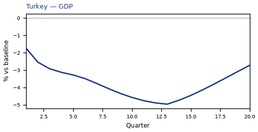


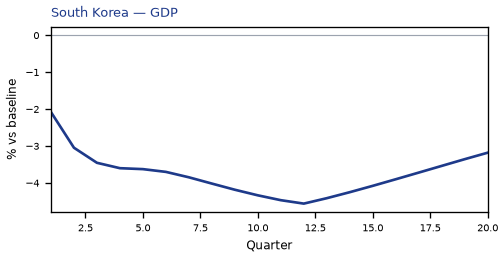

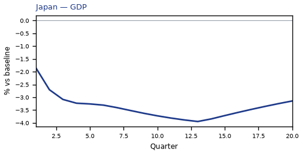


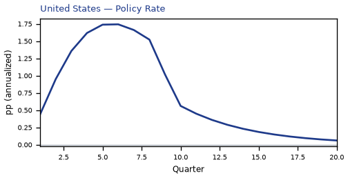

## TR — Turkey

The main impact of a 150 basis-point (1.50 percentage-point) rise in United States interest rates together with oil at $180 a barrel on Turkey would be a large drop in GDP of 4.96% by Q13. Equities peak at -8.18% in Q12.

Demand and trade. Consumption peaks at -2.89 % vs baseline in Q13, from -0.87 in Q1 to -1.76 in Q20. Investment peaks at -12.59 % vs baseline in Q9, from -5.81 in Q1 to -3.87 in Q20. Net Exports peaks at -3.70 % vs baseline in Q3, from -2.38 in Q1 to -1.02 in Q20. Gov Spending peaks at +0.86 % vs baseline in Q13, from +0.30 in Q1 to +0.47 in Q20. Gov Debt peaks at -5.56 % vs baseline in Q20, from -0.16 in Q1 to -5.56 in Q20.

External / FX. The real exchange rate shows real depreciation (a weaker, more competitive home currency). Real Exchange Rate peaks at +6.65 % vs baseline in Q12, from +1.59 in Q1 to +4.74 in Q20.

Labour. Employment peaks at -4.78 % vs baseline in Q17, from -0.27 in Q1 to -4.51 in Q20. Unemployment peaks at +1.14 pp in Q14, from +0.12 in Q1 to +0.87 in Q20. Real Wages peaks at -8.11 % vs baseline in Q20, from -0.03 in Q1 to -8.11 in Q20.

Prices. The three-year CPI impulse is +1.96 percentage points. CPI Inflation peaks at -0.47 pp in Q18, from +0.30 in Q1 to -0.45 in Q20. Domestic Infl. peaks at -0.33 pp in Q18, from +0.21 in Q1 to -0.32 in Q20. Marginal Cost peaks at -2.95 % vs baseline in Q13, from -1.02 in Q1 to -1.62 in Q20.

Financial conditions. Policy Rate peaks at -2.24 pp (annualized) in Q19, from +0.71 in Q1 to -2.21 in Q20. Real Rate peaks at -0.56 pp (annualized) in Q19, from +0.18 in Q1 to -0.55 in Q20. Govt 3M Yield peaks at -2.24 pp (annualized) in Q19, from +0.71 in Q1 to -2.21 in Q20. Govt 2Y Yield peaks at -2.15 pp (annualized) in Q16, from +1.35 in Q1 to -1.92 in Q20. Govt 5Y Yield peaks at -1.78 pp (annualized) in Q12, from -0.37 in Q1 to -1.33 in Q20. Govt 10Y Yield peaks at -1.16 pp (annualized) in Q10, from -0.81 in Q1 to -0.81 in Q20. Govt 30Y Yield peaks at -0.46 pp (annualized) in Q10, from -0.36 in Q1 to -0.33 in Q20. Bond Price (7y) peaks at +7.00 % vs baseline in Q19, from -2.23 in Q1 to +6.91 in Q20. Bond Price 3M peaks at +0.56 % vs baseline in Q19, from -0.18 in Q1 to +0.55 in Q20. Bond Price 2Y peaks at +4.09 % vs baseline in Q16, from -2.57 in Q1 to +3.64 in Q20. Bond Price 5Y peaks at +8.02 % vs baseline in Q12, from +1.64 in Q1 to +6.00 in Q20. Bond Price 10Y peaks at +9.52 % vs baseline in Q10, from +6.62 in Q1 to +6.67 in Q20. Bond Price 30Y peaks at +8.26 % vs baseline in Q10, from +6.56 in Q1 to +5.88 in Q20. Equity Index peaks at -8.18 % vs baseline in Q12, from -3.24 in Q1 to -3.66 in Q20. VIX peaks at +22.03 index_level in Q8, from +18.49 in Q1 to +19.80 in Q20. Tobin's Q peaks at -8.81 % vs baseline in Q9, from -4.07 in Q1 to -2.71 in Q20. House Prices peaks at -6.44 % vs baseline in Q18, from -0.28 in Q1 to -6.36 in Q20. Bank Equity peaks at -0.82 % vs baseline in Q17, from -0.07 in Q1 to -0.80 in Q20. Bank Credit peaks at -0.72 % vs baseline in Q17, from -0.06 in Q1 to -0.70 in Q20. Credit Spread peaks at +0.06 pp in Q17, from +0.01 in Q1 to +0.06 in Q20.

Nominal FX. NEER peaks at -7.01 % vs baseline in Q12, from -1.87 in Q1 to -4.84 in Q20. vs USD peaks at +8.62 % vs baseline in Q12, from +1.82 in Q1 to +6.30 in Q20.

Commodities. Energy Price peaks at +160.39 USD/bbl (level) in Q4, from +129.14 in Q1 to +114.87 in Q20. Metals Price peaks at +98.52 index (level) in Q1, from +98.52 in Q1 to +94.06 in Q20. Food Price peaks at +110.73 index (level) in Q8, from +101.57 in Q1 to +105.58 in Q20. Gas Price peaks at +6.56 USD/mmBtu (level) in Q4, from +5.60 in Q1 to +4.99 in Q20. Copper Price peaks at +98.69 index (level) in Q1, from +98.69 in Q1 to +95.18 in Q20. Wheat Price peaks at +99.37 index (level) in Q1, from +99.37 in Q1 to +96.43 in Q20. Gold Price peaks at +2376.68 USD/oz (level) in Q10, from +2202.10 in Q1 to +2263.02 in Q20.

Sectoral and capital. Manuf. GDP peaks at -4.92 % vs baseline in Q11, from -2.34 in Q1 to -3.16 in Q20. Services GDP peaks at -3.00 % vs baseline in Q13, from -1.05 in Q1 to -1.65 in Q20. Capital Stock peaks at -0.98 % vs baseline in Q20, from -0.03 in Q1 to -0.98 in Q20.

Timing. By Q20 GDP is still -2.73% from baseline.

These figures are model IRFs versus baseline, not forecasts.


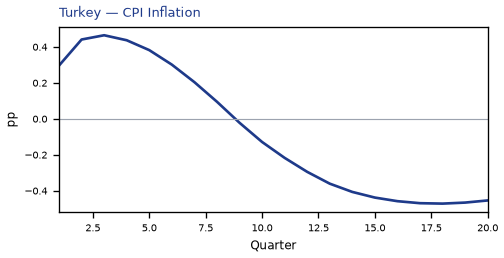

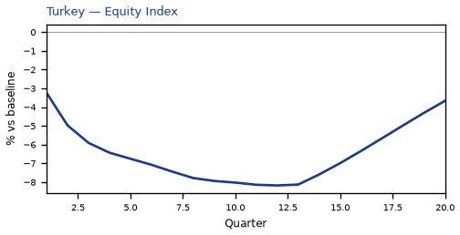


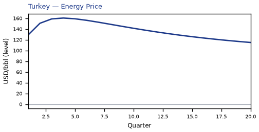


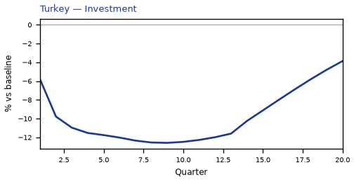

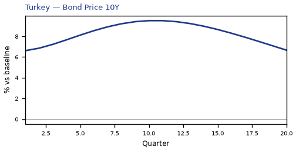

[Q1–Q20 JSON for Turkey](numbers/TR.json)

## IN — India

The main impact of a 150 basis-point (1.50 percentage-point) rise in United States interest rates together with oil at $180 a barrel on India would be a large drop in GDP of 4.62% by Q13. Equities peak at -12.17% in Q13.

Demand and trade. Consumption peaks at -2.80 % vs baseline in Q13, from -0.91 in Q1 to -1.97 in Q20. Investment peaks at -12.40 % vs baseline in Q8, from -5.77 in Q1 to -4.21 in Q20. Net Exports peaks at -3.86 % vs baseline in Q4, from -2.44 in Q1 to -1.08 in Q20. Gov Spending peaks at +0.78 % vs baseline in Q13, from +0.30 in Q1 to +0.50 in Q20. Gov Debt peaks at -8.67 % vs baseline in Q20, from -0.26 in Q1 to -8.67 in Q20.

External / FX. The real exchange rate shows real depreciation (a weaker, more competitive home currency). Real Exchange Rate peaks at +5.61 % vs baseline in Q16, from +0.83 in Q1 to +5.23 in Q20.

Labour. Employment peaks at -4.05 % vs baseline in Q19, from -0.20 in Q1 to -4.04 in Q20. Unemployment peaks at +0.32 pp in Q14, from +0.05 in Q1 to +0.25 in Q20. Real Wages peaks at -6.63 % vs baseline in Q20, from -0.03 in Q1 to -6.63 in Q20.

Prices. The three-year CPI impulse is +1.93 percentage points. CPI Inflation peaks at +0.49 pp in Q3, from +0.33 in Q1 to -0.45 in Q20. Domestic Infl. peaks at +0.34 pp in Q3, from +0.23 in Q1 to -0.32 in Q20. Marginal Cost peaks at -2.74 % vs baseline in Q13, from -1.05 in Q1 to -1.78 in Q20.

Financial conditions. Policy Rate peaks at -2.53 pp (annualized) in Q20, from +0.58 in Q1 to -2.53 in Q20. Real Rate peaks at -0.63 pp (annualized) in Q20, from +0.14 in Q1 to -0.63 in Q20. Govt 3M Yield peaks at -2.53 pp (annualized) in Q20, from +0.58 in Q1 to -2.53 in Q20. Govt 2Y Yield peaks at -2.48 pp (annualized) in Q18, from +1.48 in Q1 to -2.43 in Q20. Govt 5Y Yield peaks at -2.17 pp (annualized) in Q15, from -0.21 in Q1 to -1.94 in Q20. Govt 10Y Yield peaks at -1.57 pp (annualized) in Q12, from -1.04 in Q1 to -1.30 in Q20. Govt 30Y Yield peaks at -0.63 pp (annualized) in Q11, from -0.52 in Q1 to -0.51 in Q20. Bond Price (7y) peaks at +12.67 % vs baseline in Q20, from -2.89 in Q1 to +12.67 in Q20. Bond Price 3M peaks at +0.63 % vs baseline in Q20, from -0.14 in Q1 to +0.63 in Q20. Bond Price 2Y peaks at +4.71 % vs baseline in Q18, from -2.82 in Q1 to +4.62 in Q20. Bond Price 5Y peaks at +9.75 % vs baseline in Q15, from +0.94 in Q1 to +8.74 in Q20. Bond Price 10Y peaks at +12.84 % vs baseline in Q12, from +8.52 in Q1 to +10.62 in Q20. Bond Price 30Y peaks at +11.37 % vs baseline in Q11, from +9.37 in Q1 to +9.23 in Q20. Equity Index peaks at -12.17 % vs baseline in Q13, from -4.98 in Q1 to -7.34 in Q20. VIX peaks at +22.03 index_level in Q8, from +18.49 in Q1 to +19.80 in Q20. Tobin's Q peaks at -8.68 % vs baseline in Q8, from -4.04 in Q1 to -2.95 in Q20. House Prices peaks at -6.04 % vs baseline in Q19, from -0.29 in Q1 to -6.02 in Q20. Bank Equity peaks at -0.94 % vs baseline in Q16, from -0.08 in Q1 to -0.91 in Q20. Bank Credit peaks at -0.83 % vs baseline in Q16, from -0.07 in Q1 to -0.80 in Q20. Credit Spread peaks at +0.02 pp in Q16, from +0.00 in Q1 to +0.02 in Q20.

Nominal FX. NEER peaks at -6.61 % vs baseline in Q15, from -1.89 in Q1 to -5.97 in Q20. vs USD peaks at +7.44 % vs baseline in Q15, from +1.05 in Q1 to +6.79 in Q20.

Commodities. Energy Price peaks at +160.39 USD/bbl (level) in Q4, from +129.14 in Q1 to +114.87 in Q20. Metals Price peaks at +98.52 index (level) in Q1, from +98.52 in Q1 to +94.06 in Q20. Food Price peaks at +110.73 index (level) in Q8, from +101.57 in Q1 to +105.58 in Q20. Gas Price peaks at +6.56 USD/mmBtu (level) in Q4, from +5.60 in Q1 to +4.99 in Q20. Copper Price peaks at +98.69 index (level) in Q1, from +98.69 in Q1 to +95.18 in Q20. Wheat Price peaks at +99.37 index (level) in Q1, from +99.37 in Q1 to +96.43 in Q20. Gold Price peaks at +2376.68 USD/oz (level) in Q10, from +2202.10 in Q1 to +2263.02 in Q20.

Sectoral and capital. Manuf. GDP peaks at -4.04 % vs baseline in Q13, from -1.93 in Q1 to -3.19 in Q20. Services GDP peaks at -2.54 % vs baseline in Q13, from -0.99 in Q1 to -1.65 in Q20. Capital Stock peaks at -0.97 % vs baseline in Q20, from -0.03 in Q1 to -0.97 in Q20.

Timing. By Q20 GDP is still -2.99% from baseline.

These figures are model IRFs versus baseline, not forecasts.

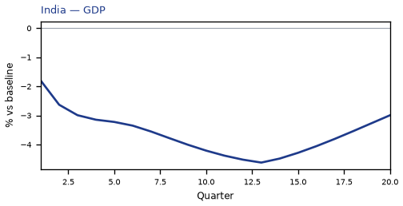

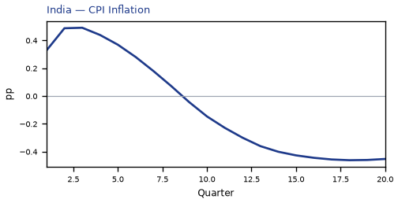

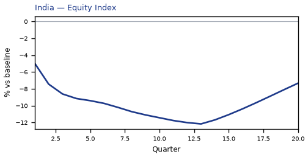


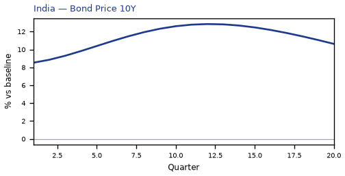


[Q1–Q20 JSON for India](numbers/IN.json)

## KR — South Korea

The main impact of a 150 basis-point (1.50 percentage-point) rise in United States interest rates together with oil at $180 a barrel on South Korea would be a large drop in GDP of 4.56% by Q12. Equities peak at -11.22% in Q12.

Demand and trade. Consumption peaks at -2.85 % vs baseline in Q12, from -1.08 in Q1 to -2.12 in Q20. Investment peaks at -11.88 % vs baseline in Q9, from -6.29 in Q1 to -5.71 in Q20. Net Exports peaks at -4.54 % vs baseline in Q4, from -2.81 in Q1 to -0.88 in Q20. Gov Spending peaks at +0.82 % vs baseline in Q12, from +0.37 in Q1 to +0.57 in Q20. Gov Debt peaks at -3.27 % vs baseline in Q20, from -0.13 in Q1 to -3.27 in Q20.

External / FX. The real exchange rate shows real depreciation (a weaker, more competitive home currency). Real Exchange Rate peaks at +8.36 % vs baseline in Q8, from +4.92 in Q1 to +7.85 in Q20.

Labour. Employment peaks at -4.39 % vs baseline in Q16, from -0.39 in Q1 to -4.13 in Q20. Unemployment peaks at +1.76 pp in Q14, from +0.21 in Q1 to +1.54 in Q20. Real Wages peaks at -5.07 % vs baseline in Q20, from -0.02 in Q1 to -5.07 in Q20.

Prices. The three-year CPI impulse is +3.00 percentage points. CPI Inflation peaks at +0.56 pp in Q2, from +0.45 in Q1 to -0.18 in Q20. Domestic Infl. peaks at +0.39 pp in Q2, from +0.31 in Q1 to -0.12 in Q20. Marginal Cost peaks at -2.70 % vs baseline in Q12, from -1.22 in Q1 to -1.89 in Q20.

Financial conditions. Policy Rate peaks at -1.95 pp (annualized) in Q20, from +0.41 in Q1 to -1.95 in Q20. Real Rate peaks at -0.49 pp (annualized) in Q20, from +0.10 in Q1 to -0.49 in Q20. Govt 3M Yield peaks at -1.95 pp (annualized) in Q20, from +0.41 in Q1 to -1.95 in Q20. Govt 2Y Yield peaks at -1.93 pp (annualized) in Q19, from +0.84 in Q1 to -1.92 in Q20. Govt 5Y Yield peaks at -1.78 pp (annualized) in Q15, from -0.39 in Q1 to -1.67 in Q20. Govt 10Y Yield peaks at -1.43 pp (annualized) in Q12, from -1.01 in Q1 to -1.26 in Q20. Govt 30Y Yield peaks at -0.64 pp (annualized) in Q10, from -0.58 in Q1 to -0.54 in Q20. Bond Price (7y) peaks at +9.75 % vs baseline in Q20, from -2.06 in Q1 to +9.75 in Q20. Bond Price 3M peaks at +0.49 % vs baseline in Q20, from -0.10 in Q1 to +0.49 in Q20. Bond Price 2Y peaks at +3.67 % vs baseline in Q19, from -1.59 in Q1 to +3.65 in Q20. Bond Price 5Y peaks at +7.99 % vs baseline in Q15, from +1.77 in Q1 to +7.52 in Q20. Bond Price 10Y peaks at +11.71 % vs baseline in Q12, from +8.31 in Q1 to +10.31 in Q20. Bond Price 30Y peaks at +11.57 % vs baseline in Q10, from +10.46 in Q1 to +9.71 in Q20. Equity Index peaks at -11.22 % vs baseline in Q12, from -5.32 in Q1 to -7.21 in Q20. VIX peaks at +22.03 index_level in Q8, from +18.49 in Q1 to +19.80 in Q20. Tobin's Q peaks at -8.32 % vs baseline in Q9, from -4.40 in Q1 to -4.00 in Q20. House Prices peaks at -5.57 % vs baseline in Q20, from -0.25 in Q1 to -5.57 in Q20. Bank Equity peaks at -1.41 % vs baseline in Q17, from -0.11 in Q1 to -1.38 in Q20. Bank Credit peaks at -1.12 % vs baseline in Q17, from -0.09 in Q1 to -1.10 in Q20. Credit Spread peaks at +0.02 pp in Q17, from +0.00 in Q1 to +0.01 in Q20.

Nominal FX. NEER peaks at -8.16 % vs baseline in Q14, from -4.64 in Q1 to -7.67 in Q20. vs USD peaks at +10.33 % vs baseline in Q10, from +5.15 in Q1 to +9.41 in Q20.

Commodities. Energy Price peaks at +160.39 USD/bbl (level) in Q4, from +129.14 in Q1 to +114.87 in Q20. Metals Price peaks at +98.52 index (level) in Q1, from +98.52 in Q1 to +94.06 in Q20. Food Price peaks at +110.73 index (level) in Q8, from +101.57 in Q1 to +105.58 in Q20. Gas Price peaks at +6.56 USD/mmBtu (level) in Q4, from +5.60 in Q1 to +4.99 in Q20. Copper Price peaks at +98.69 index (level) in Q1, from +98.69 in Q1 to +95.18 in Q20. Wheat Price peaks at +99.37 index (level) in Q1, from +99.37 in Q1 to +96.43 in Q20. Gold Price peaks at +2376.68 USD/oz (level) in Q10, from +2202.10 in Q1 to +2263.02 in Q20.

Sectoral and capital. Manuf. GDP peaks at -6.31 % vs baseline in Q4, from -3.78 in Q1 to -4.56 in Q20. Services GDP peaks at -2.76 % vs baseline in Q12, from -1.26 in Q1 to -1.93 in Q20. Capital Stock peaks at -0.98 % vs baseline in Q20, from -0.03 in Q1 to -0.98 in Q20.

Timing. By Q20 GDP is still -3.18% from baseline.

These figures are model IRFs versus baseline, not forecasts.


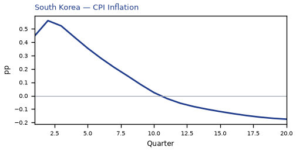

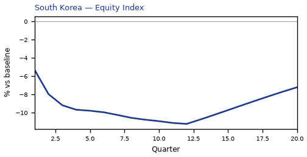


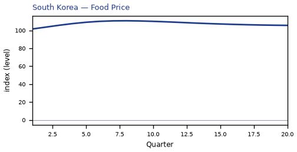

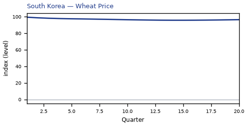


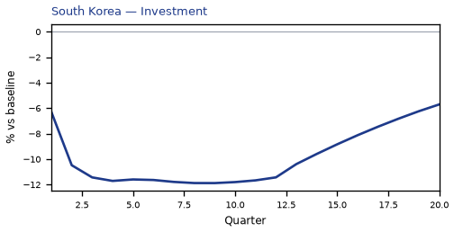

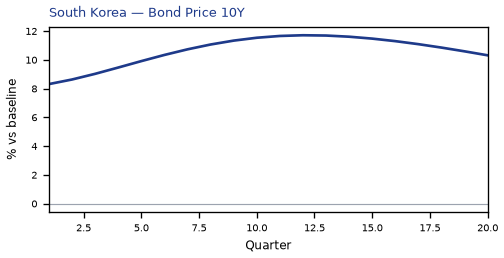

[Q1–Q20 JSON for South Korea](numbers/KR.json)

## JP — Japan

The main impact of a 150 basis-point (1.50 percentage-point) rise in United States interest rates together with oil at $180 a barrel on Japan would be a large drop in GDP of 3.95% by Q13. Equities peak at -10.81% in Q13.

Demand and trade. Consumption peaks at -2.65 % vs baseline in Q13, from -0.98 in Q1 to -2.17 in Q20. Investment peaks at -11.21 % vs baseline in Q13, from -5.11 in Q1 to -8.50 in Q20. Net Exports peaks at -3.75 % vs baseline in Q4, from -2.32 in Q1 to -1.97 in Q20. Gov Spending peaks at +0.78 % vs baseline in Q13, from +0.36 in Q1 to +0.62 in Q20. Gov Debt peaks at -1.53 % vs baseline in Q20, from -0.04 in Q1 to -1.53 in Q20.

External / FX. The real exchange rate shows real depreciation (a weaker, more competitive home currency). Real Exchange Rate peaks at +9.06 % vs baseline in Q4, from +5.23 in Q1 to -1.58 in Q20.

Labour. Employment peaks at -4.07 % vs baseline in Q15, from -0.45 in Q1 to -3.86 in Q20. Unemployment peaks at +2.77 pp in Q16, from +0.29 in Q1 to +2.63 in Q20. Real Wages peaks at +1.04 % vs baseline in Q11, from -0.00 in Q1 to +0.04 in Q20.

Prices. The three-year CPI impulse is +1.96 percentage points. CPI Inflation peaks at +0.55 pp in Q2, from +0.41 in Q1 to -0.23 in Q20. Domestic Infl. peaks at +0.39 pp in Q2, from +0.29 in Q1 to -0.16 in Q20. Marginal Cost peaks at -2.33 % vs baseline in Q13, from -1.08 in Q1 to -1.86 in Q20.

Financial conditions. Policy Rate peaks at +0.31 pp (annualized) in Q7, from +0.05 in Q1 to -0.06 in Q20. Real Rate peaks at +0.08 pp (annualized) in Q7, from +0.01 in Q1 to -0.02 in Q20. Govt 3M Yield peaks at +0.31 pp (annualized) in Q7, from +0.05 in Q1 to -0.06 in Q20. Govt 2Y Yield peaks at +0.28 pp (annualized) in Q4, from +0.22 in Q1 to -0.13 in Q20. Govt 5Y Yield peaks at -0.18 pp (annualized) in Q20, from +0.16 in Q1 to -0.18 in Q20. Govt 10Y Yield peaks at -0.20 pp (annualized) in Q20, from -0.02 in Q1 to -0.20 in Q20. Govt 30Y Yield peaks at -0.14 pp (annualized) in Q20, from -0.10 in Q1 to -0.14 in Q20. Bond Price (7y) peaks at -2.84 % vs baseline in Q5, from -0.78 in Q1 to +1.98 in Q20. Bond Price 3M peaks at -0.08 % vs baseline in Q7, from -0.01 in Q1 to +0.02 in Q20. Bond Price 2Y peaks at -0.52 % vs baseline in Q4, from -0.42 in Q1 to +0.25 in Q20. Bond Price 5Y peaks at +0.83 % vs baseline in Q20, from -0.70 in Q1 to +0.83 in Q20. Bond Price 10Y peaks at +1.66 % vs baseline in Q20, from +0.14 in Q1 to +1.66 in Q20. Bond Price 30Y peaks at +2.45 % vs baseline in Q20, from +1.84 in Q1 to +2.45 in Q20. Equity Index peaks at -10.81 % vs baseline in Q13, from -5.15 in Q1 to -8.38 in Q20. VIX peaks at +22.03 index_level in Q8, from +18.49 in Q1 to +19.80 in Q20. Tobin's Q peaks at -7.84 % vs baseline in Q13, from -3.58 in Q1 to -5.95 in Q20. House Prices peaks at -4.77 % vs baseline in Q20, from -0.20 in Q1 to -4.77 in Q20. Bank Equity peaks at -1.72 % vs baseline in Q16, from -0.14 in Q1 to -1.66 in Q20. Bank Credit peaks at -1.35 % vs baseline in Q16, from -0.11 in Q1 to -1.30 in Q20. Credit Spread peaks at +0.01 pp in Q16, from +0.00 in Q1 to +0.01 in Q20.

Nominal FX. NEER peaks at -9.05 % vs baseline in Q4, from -5.15 in Q1 to +2.55 in Q20. vs USD peaks at +10.12 % vs baseline in Q5, from +5.46 in Q1 to -0.02 in Q20.

Commodities. Energy Price peaks at +160.39 USD/bbl (level) in Q4, from +129.14 in Q1 to +114.87 in Q20. Metals Price peaks at +98.52 index (level) in Q1, from +98.52 in Q1 to +94.06 in Q20. Food Price peaks at +110.73 index (level) in Q8, from +101.57 in Q1 to +105.58 in Q20. Gas Price peaks at +6.56 USD/mmBtu (level) in Q4, from +5.60 in Q1 to +4.99 in Q20. Copper Price peaks at +98.69 index (level) in Q1, from +98.69 in Q1 to +95.18 in Q20. Wheat Price peaks at +99.37 index (level) in Q1, from +99.37 in Q1 to +96.43 in Q20. Gold Price peaks at +2376.68 USD/oz (level) in Q10, from +2202.10 in Q1 to +2263.02 in Q20.

Sectoral and capital. Manuf. GDP peaks at -5.76 % vs baseline in Q4, from -3.40 in Q1 to -1.32 in Q20. Services GDP peaks at -2.73 % vs baseline in Q13, from -1.28 in Q1 to -2.18 in Q20. Capital Stock peaks at -0.96 % vs baseline in Q20, from -0.03 in Q1 to -0.96 in Q20.

Timing. By Q20 GDP is still -3.14% from baseline.

These figures are model IRFs versus baseline, not forecasts.


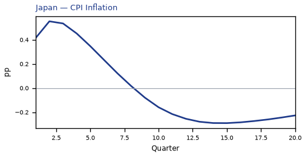

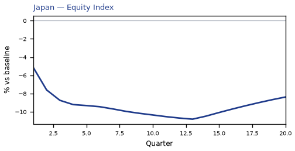


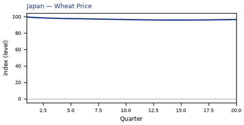


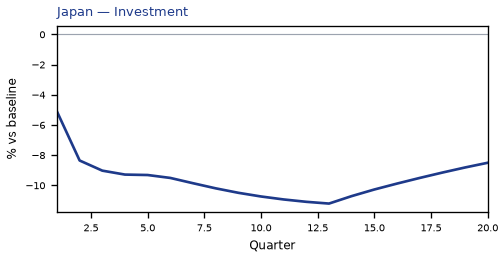

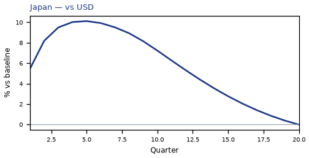

[Q1–Q20 JSON for Japan](numbers/JP.json)

## DE — Germany

The main impact of a 150 basis-point (1.50 percentage-point) rise in United States interest rates together with oil at $180 a barrel on Germany would be a large drop in GDP of 3.93% by Q14. Equities peak at -7.60% in Q14.

Demand and trade. Consumption peaks at -2.23 % vs baseline in Q15, from -0.73 in Q1 to -1.90 in Q20. Investment peaks at -11.22 % vs baseline in Q11, from -4.72 in Q1 to -7.86 in Q20. Net Exports peaks at -2.63 % vs baseline in Q4, from -1.64 in Q1 to -0.73 in Q20. Gov Spending peaks at +0.87 % vs baseline in Q14, from +0.34 in Q1 to +0.72 in Q20. Gov Debt peaks at +0.75 % vs baseline in Q20, from +0.02 in Q1 to +0.75 in Q20.

External / FX. The real exchange rate shows real depreciation (a weaker, more competitive home currency). Real Exchange Rate peaks at +5.16 % vs baseline in Q4, from +3.16 in Q1 to +2.86 in Q20.

Labour. Employment peaks at -3.95 % vs baseline in Q18, from -0.29 in Q1 to -3.89 in Q20. Unemployment peaks at +2.77 pp in Q17, from +0.24 in Q1 to +2.69 in Q20. Real Wages peaks at -2.67 % vs baseline in Q20, from -0.01 in Q1 to -2.67 in Q20.

Prices. The three-year CPI impulse is +2.92 percentage points. CPI Inflation peaks at +0.73 pp in Q2, from +0.58 in Q1 to -0.22 in Q20. Domestic Infl. peaks at +0.51 pp in Q2, from +0.41 in Q1 to -0.16 in Q20. Marginal Cost peaks at -2.33 % vs baseline in Q14, from -0.89 in Q1 to -1.92 in Q20.

Financial conditions. Policy Rate peaks at +1.45 pp (annualized) in Q6, from +0.36 in Q1 to -0.65 in Q20. Real Rate peaks at +0.36 pp (annualized) in Q6, from +0.09 in Q1 to -0.16 in Q20. Govt 3M Yield peaks at +1.45 pp (annualized) in Q6, from +0.36 in Q1 to -0.65 in Q20. Govt 2Y Yield peaks at +1.24 pp (annualized) in Q3, from +1.14 in Q1 to -0.76 in Q20. Govt 5Y Yield peaks at -0.73 pp (annualized) in Q20, from +0.50 in Q1 to -0.73 in Q20. Govt 10Y Yield peaks at -0.60 pp (annualized) in Q17, from -0.12 in Q1 to -0.59 in Q20. Govt 30Y Yield peaks at -0.28 pp (annualized) in Q15, from -0.17 in Q1 to -0.27 in Q20. Bond Price (7y) peaks at -10.15 % vs baseline in Q6, from -2.55 in Q1 to +4.56 in Q20. Bond Price 3M peaks at -0.36 % vs baseline in Q6, from -0.09 in Q1 to +0.16 in Q20. Bond Price 2Y peaks at -2.35 % vs baseline in Q3, from -2.17 in Q1 to +1.45 in Q20. Bond Price 5Y peaks at +3.31 % vs baseline in Q20, from -2.25 in Q1 to +3.31 in Q20. Bond Price 10Y peaks at +4.92 % vs baseline in Q17, from +0.95 in Q1 to +4.82 in Q20. Bond Price 30Y peaks at +5.09 % vs baseline in Q15, from +3.13 in Q1 to +4.84 in Q20. Equity Index peaks at -7.60 % vs baseline in Q14, from -3.14 in Q1 to -6.01 in Q20. VIX peaks at +22.03 index_level in Q8, from +18.49 in Q1 to +19.80 in Q20. Tobin's Q peaks at -7.85 % vs baseline in Q11, from -3.31 in Q1 to -5.50 in Q20. House Prices peaks at -5.13 % vs baseline in Q20, from -0.18 in Q1 to -5.13 in Q20. Bank Equity peaks at -1.62 % vs baseline in Q17, from -0.11 in Q1 to -1.60 in Q20. Bank Credit peaks at -1.31 % vs baseline in Q17, from -0.09 in Q1 to -1.29 in Q20. Credit Spread peaks at +0.02 pp in Q17, from +0.00 in Q1 to +0.01 in Q20.

Nominal FX. NEER peaks at -3.71 % vs baseline in Q4, from -2.25 in Q1 to -1.93 in Q20. vs USD peaks at +6.36 % vs baseline in Q7, from +3.39 in Q1 to +4.42 in Q20.

Commodities. Energy Price peaks at +160.39 USD/bbl (level) in Q4, from +129.14 in Q1 to +114.87 in Q20. Metals Price peaks at +98.52 index (level) in Q1, from +98.52 in Q1 to +94.06 in Q20. Food Price peaks at +110.73 index (level) in Q8, from +101.57 in Q1 to +105.58 in Q20. Gas Price peaks at +6.56 USD/mmBtu (level) in Q4, from +5.60 in Q1 to +4.99 in Q20. Copper Price peaks at +98.69 index (level) in Q1, from +98.69 in Q1 to +95.18 in Q20. Wheat Price peaks at +99.37 index (level) in Q1, from +99.37 in Q1 to +96.43 in Q20. Gold Price peaks at +2376.68 USD/oz (level) in Q10, from +2202.10 in Q1 to +2263.02 in Q20.

Sectoral and capital. Manuf. GDP peaks at -4.47 % vs baseline in Q4, from -2.69 in Q1 to -2.67 in Q20. Services GDP peaks at -2.68 % vs baseline in Q14, from -1.05 in Q1 to -2.21 in Q20. Capital Stock peaks at -0.98 % vs baseline in Q20, from -0.02 in Q1 to -0.98 in Q20.

Timing. By Q20 GDP is still -3.23% from baseline.

These figures are model IRFs versus baseline, not forecasts.


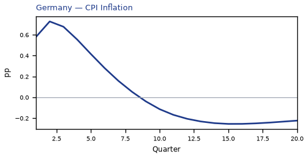

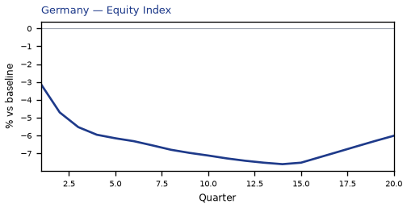


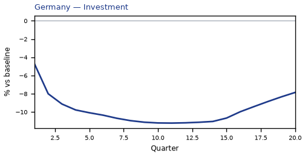


[Q1–Q20 JSON for Germany](numbers/DE.json)

## SA — Saudi Arabia

The main impact of a 150 basis-point (1.50 percentage-point) rise in United States interest rates together with oil at $180 a barrel on Saudi Arabia would be a large rise in GDP of 3.85% by Q1. Equities peak at +15.32% in Q1.

Demand and trade. Consumption peaks at +2.43 % vs baseline in Q9, from +1.85 in Q1 to +2.42 in Q20. Investment peaks at +10.20 % vs baseline in Q20, from +10.17 in Q1 to +10.20 in Q20. Net Exports peaks at +24.67 % vs baseline in Q4, from +15.04 in Q1 to +10.45 in Q20. Gov Spending peaks at +9.35 % vs baseline in Q4, from +5.42 in Q1 to +3.67 in Q20. Gov Debt peaks at +9.60 % vs baseline in Q20, from +0.58 in Q1 to +9.60 in Q20.

External / FX. The real exchange rate shows real appreciation (a stronger home currency). Real Exchange Rate peaks at -0.95 % vs baseline in Q11, from -0.04 in Q1 to -0.75 in Q20.

Labour. Employment peaks at +4.22 % vs baseline in Q20, from +0.90 in Q1 to +4.22 in Q20. Unemployment peaks at -1.49 pp in Q20, from -0.40 in Q1 to -1.49 in Q20. Real Wages peaks at +6.45 % vs baseline in Q20, from +0.03 in Q1 to +6.45 in Q20.

Prices. The three-year CPI impulse is +3.02 percentage points. CPI Inflation peaks at +0.38 pp in Q3, from +0.28 in Q1 to +0.13 in Q20. Domestic Infl. peaks at +0.26 pp in Q3, from +0.19 in Q1 to +0.09 in Q20. Marginal Cost peaks at +2.32 % vs baseline in Q1, from +2.32 in Q1 to +2.20 in Q20.

Financial conditions. Policy Rate peaks at +1.74 pp (annualized) in Q6, from +0.44 in Q1 to +0.06 in Q20. Real Rate peaks at +0.44 pp (annualized) in Q6, from +0.11 in Q1 to +0.01 in Q20. Govt 3M Yield peaks at +1.74 pp (annualized) in Q6, from +0.44 in Q1 to +0.06 in Q20. Govt 2Y Yield peaks at +1.45 pp (annualized) in Q2, from +1.38 in Q1 to +0.03 in Q20. Govt 5Y Yield peaks at +0.73 pp (annualized) in Q1, from +0.73 in Q1 to +0.01 in Q20. Govt 10Y Yield peaks at +0.37 pp (annualized) in Q1, from +0.37 in Q1 to +0.01 in Q20. Govt 30Y Yield peaks at +0.12 pp (annualized) in Q1, from +0.12 in Q1 to +0.00 in Q20. Bond Price (7y) peaks at -8.71 % vs baseline in Q6, from -2.20 in Q1 to +1.74 in Q20. Bond Price 3M peaks at -0.44 % vs baseline in Q6, from -0.11 in Q1 to -0.01 in Q20. Bond Price 2Y peaks at -2.76 % vs baseline in Q2, from -2.62 in Q1 to -0.06 in Q20. Bond Price 5Y peaks at -3.29 % vs baseline in Q1, from -3.29 in Q1 to -0.07 in Q20. Bond Price 10Y peaks at -3.04 % vs baseline in Q1, from -3.04 in Q1 to -0.06 in Q20. Bond Price 30Y peaks at -2.23 % vs baseline in Q1, from -2.23 in Q1 to -0.05 in Q20. Equity Index peaks at +15.32 % vs baseline in Q1, from +15.32 in Q1 to +15.04 in Q20. VIX peaks at +22.03 index_level in Q8, from +18.49 in Q1 to +19.80 in Q20. Tobin's Q peaks at +7.14 % vs baseline in Q20, from +7.12 in Q1 to +7.14 in Q20. House Prices peaks at +6.03 % vs baseline in Q20, from +0.60 in Q1 to +6.03 in Q20. Bank Equity peaks at +0.49 % vs baseline in Q20, from +0.05 in Q1 to +0.49 in Q20. Bank Credit peaks at +0.15 % vs baseline in Q20, from +0.02 in Q1 to +0.15 in Q20. Credit Spread peaks at +0.00 pp in Q1, from +0.00 in Q1 to +0.00 in Q20.

Nominal FX. NEER peaks at +2.31 % vs baseline in Q9, from +0.90 in Q1 to +1.98 in Q20. vs USD peaks at +1.05 % vs baseline in Q10, from +0.19 in Q1 to +0.81 in Q20.

Commodities. Energy Price peaks at +160.39 USD/bbl (level) in Q4, from +129.14 in Q1 to +114.87 in Q20. Metals Price peaks at +98.52 index (level) in Q1, from +98.52 in Q1 to +94.06 in Q20. Food Price peaks at +110.73 index (level) in Q8, from +101.57 in Q1 to +105.58 in Q20. Gas Price peaks at +6.56 USD/mmBtu (level) in Q4, from +5.60 in Q1 to +4.99 in Q20. Copper Price peaks at +98.69 index (level) in Q1, from +98.69 in Q1 to +95.18 in Q20. Wheat Price peaks at +99.37 index (level) in Q1, from +99.37 in Q1 to +96.43 in Q20. Gold Price peaks at +2376.68 USD/oz (level) in Q10, from +2202.10 in Q1 to +2263.02 in Q20.

Sectoral and capital. Manuf. GDP peaks at -0.55 % vs baseline in Q3, from -0.15 in Q1 to +0.25 in Q20. Services GDP peaks at +1.69 % vs baseline in Q1, from +1.69 in Q1 to +1.61 in Q20. Capital Stock peaks at +0.89 % vs baseline in Q20, from +0.05 in Q1 to +0.89 in Q20.

Timing. By Q20 GDP is still +3.65% from baseline.

These figures are model IRFs versus baseline, not forecasts.

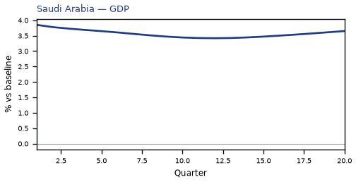

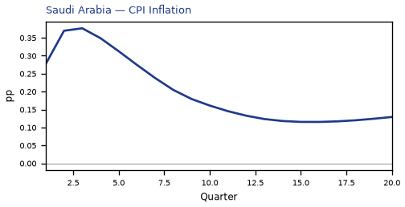

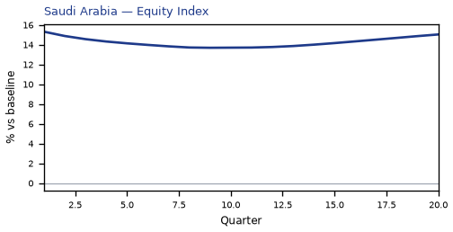

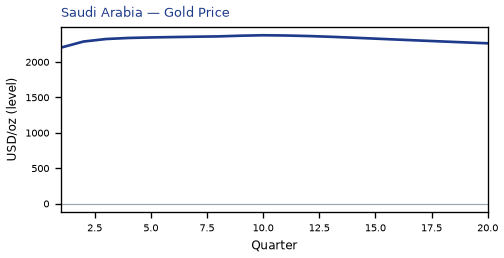


[Q1–Q20 JSON for Saudi Arabia](numbers/SA.json)

## NO — Norway

The main impact of a 150 basis-point (1.50 percentage-point) rise in United States interest rates together with oil at $180 a barrel on Norway would be a large rise in GDP of 3.82% by Q1. Equities peak at +8.24% in Q1.

Demand and trade. Consumption peaks at +2.14 % vs baseline in Q5, from +1.74 in Q1 to +1.33 in Q20. Investment peaks at +9.89 % vs baseline in Q1, from +9.89 in Q1 to +4.11 in Q20. Net Exports peaks at +14.29 % vs baseline in Q4, from +8.76 in Q1 to +4.94 in Q20. Gov Spending peaks at +6.01 % vs baseline in Q4, from +3.33 in Q1 to +2.49 in Q20. Gov Debt peaks at -1.27 % vs baseline in Q20, from -0.13 in Q1 to -1.27 in Q20.

External / FX. The real exchange rate shows real appreciation (a stronger home currency). Real Exchange Rate peaks at -38.05 % vs baseline in Q5, from -22.20 in Q1 to -24.50 in Q20.

Labour. Employment peaks at +3.42 % vs baseline in Q15, from +0.71 in Q1 to +3.00 in Q20. Unemployment peaks at -1.96 pp in Q10, from -0.59 in Q1 to -1.54 in Q20. Real Wages peaks at +3.99 % vs baseline in Q20, from +0.03 in Q1 to +3.99 in Q20.

Prices. The three-year CPI impulse is +0.71 percentage points. CPI Inflation peaks at +0.32 pp in Q2, from +0.26 in Q1 to -0.06 in Q20. Domestic Infl. peaks at +0.22 pp in Q2, from +0.18 in Q1 to -0.04 in Q20. Marginal Cost peaks at +2.30 % vs baseline in Q1, from +2.30 in Q1 to +1.27 in Q20.

Financial conditions. Policy Rate peaks at +2.20 pp (annualized) in Q7, from +0.58 in Q1 to +1.12 in Q20. Real Rate peaks at +0.55 pp (annualized) in Q7, from +0.14 in Q1 to +0.28 in Q20. Govt 3M Yield peaks at +2.20 pp (annualized) in Q7, from +0.58 in Q1 to +1.12 in Q20. Govt 2Y Yield peaks at +2.06 pp (annualized) in Q4, from +1.73 in Q1 to +0.99 in Q20. Govt 5Y Yield peaks at +1.65 pp (annualized) in Q2, from +1.63 in Q1 to +0.87 in Q20. Govt 10Y Yield peaks at +1.24 pp (annualized) in Q2, from +1.24 in Q1 to +0.68 in Q20. Govt 30Y Yield peaks at +0.53 pp (annualized) in Q1, from +0.53 in Q1 to +0.27 in Q20. Bond Price (7y) peaks at -13.77 % vs baseline in Q7, from -3.62 in Q1 to -7.00 in Q20. Bond Price 3M peaks at -0.55 % vs baseline in Q7, from -0.14 in Q1 to -0.28 in Q20. Bond Price 2Y peaks at -3.91 % vs baseline in Q4, from -3.29 in Q1 to -1.89 in Q20. Bond Price 5Y peaks at -7.43 % vs baseline in Q2, from -7.31 in Q1 to -3.93 in Q20. Bond Price 10Y peaks at -10.17 % vs baseline in Q2, from -10.15 in Q1 to -5.55 in Q20. Bond Price 30Y peaks at -9.59 % vs baseline in Q1, from -9.59 in Q1 to -4.90 in Q20. Equity Index peaks at +8.24 % vs baseline in Q1, from +8.24 in Q1 to +5.18 in Q20. VIX peaks at +22.03 index_level in Q8, from +18.49 in Q1 to +19.80 in Q20. Tobin's Q peaks at +6.92 % vs baseline in Q1, from +6.92 in Q1 to +2.88 in Q20. House Prices peaks at +4.10 % vs baseline in Q20, from +0.43 in Q1 to +4.10 in Q20. Bank Equity peaks at +0.60 % vs baseline in Q19, from +0.07 in Q1 to +0.59 in Q20. Bank Credit peaks at +0.23 % vs baseline in Q19, from +0.03 in Q1 to +0.23 in Q20. Credit Spread peaks at +0.00 pp in Q1, from +0.00 in Q1 to +0.00 in Q20.

Nominal FX. NEER peaks at +38.86 % vs baseline in Q5, from +22.74 in Q1 to +25.17 in Q20. vs USD peaks at -37.03 % vs baseline in Q4, from -21.97 in Q1 to -22.94 in Q20.

Commodities. Energy Price peaks at +160.39 USD/bbl (level) in Q4, from +129.14 in Q1 to +114.87 in Q20. Metals Price peaks at +98.52 index (level) in Q1, from +98.52 in Q1 to +94.06 in Q20. Food Price peaks at +110.73 index (level) in Q8, from +101.57 in Q1 to +105.58 in Q20. Gas Price peaks at +6.56 USD/mmBtu (level) in Q4, from +5.60 in Q1 to +4.99 in Q20. Copper Price peaks at +98.69 index (level) in Q1, from +98.69 in Q1 to +95.18 in Q20. Wheat Price peaks at +99.37 index (level) in Q1, from +99.37 in Q1 to +96.43 in Q20. Gold Price peaks at +2376.68 USD/oz (level) in Q10, from +2202.10 in Q1 to +2263.02 in Q20.

Sectoral and capital. Manuf. GDP peaks at +10.63 % vs baseline in Q5, from +6.46 in Q1 to +7.10 in Q20. Services GDP peaks at +2.18 % vs baseline in Q1, from +2.18 in Q1 to +1.20 in Q20. Capital Stock peaks at +0.63 % vs baseline in Q20, from +0.05 in Q1 to +0.63 in Q20.

Timing. By Q20 GDP is still +2.10% from baseline.

These figures are model IRFs versus baseline, not forecasts.

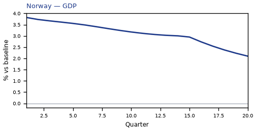

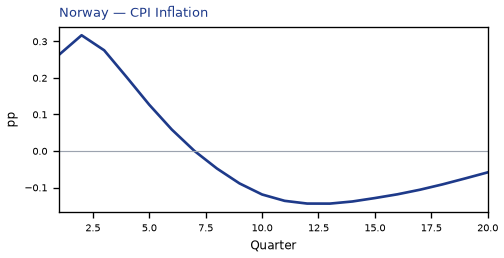

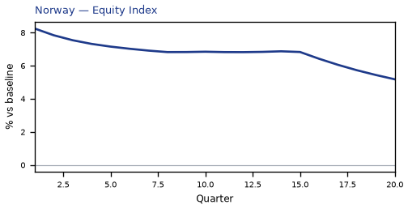


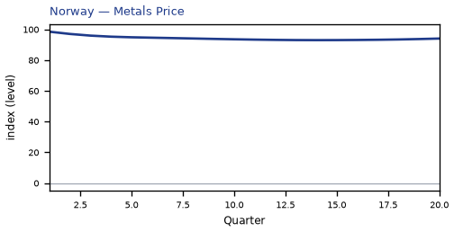

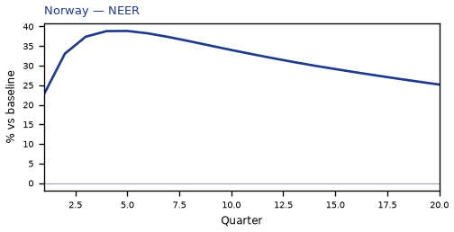

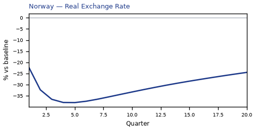

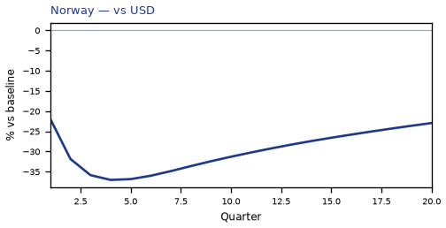

[Q1–Q20 JSON for Norway](numbers/NO.json)

## RU — Russia

The main impact of a 150 basis-point (1.50 percentage-point) rise in United States interest rates together with oil at $180 a barrel on Russia would be a large rise in GDP of 3.79% by Q2. Equities peak at +6.11% in Q2.

Demand and trade. Consumption peaks at +2.05 % vs baseline in Q4, from +1.56 in Q1 to +0.54 in Q20. Investment peaks at +9.41 % vs baseline in Q1, from +9.41 in Q1 to +1.92 in Q20. Net Exports peaks at +14.34 % vs baseline in Q4, from +8.73 in Q1 to +5.80 in Q20. Gov Spending peaks at +4.11 % vs baseline in Q4, from +2.28 in Q1 to +1.88 in Q20. Gov Debt peaks at +1.66 % vs baseline in Q16, from +0.18 in Q1 to +1.60 in Q20.

External / FX. The real exchange rate shows real appreciation (a stronger home currency). Real Exchange Rate peaks at -17.92 % vs baseline in Q5, from -10.83 in Q1 to -11.17 in Q20.

Labour. Employment peaks at +3.10 % vs baseline in Q10, from +0.65 in Q1 to +1.87 in Q20. Unemployment peaks at -1.25 pp in Q7, from -0.38 in Q1 to -0.52 in Q20. Real Wages peaks at +7.15 % vs baseline in Q20, from +0.06 in Q1 to +7.15 in Q20.

Prices. The three-year CPI impulse is +3.51 percentage points. CPI Inflation peaks at +0.44 pp in Q3, from +0.16 in Q1 to +0.01 in Q20. Domestic Infl. peaks at +0.31 pp in Q3, from +0.11 in Q1 to +0.01 in Q20. Marginal Cost peaks at +2.29 % vs baseline in Q2, from +2.16 in Q1 to +0.52 in Q20.

Financial conditions. Policy Rate peaks at +2.17 pp (annualized) in Q6, from +0.43 in Q1 to +0.27 in Q20. Real Rate peaks at +0.54 pp (annualized) in Q6, from +0.11 in Q1 to +0.07 in Q20. Govt 3M Yield peaks at +2.17 pp (annualized) in Q6, from +0.43 in Q1 to +0.27 in Q20. Govt 2Y Yield peaks at +1.95 pp (annualized) in Q4, from +1.67 in Q1 to +0.18 in Q20. Govt 5Y Yield peaks at +1.27 pp (annualized) in Q1, from +1.27 in Q1 to +0.15 in Q20. Govt 10Y Yield peaks at +0.71 pp (annualized) in Q1, from +0.71 in Q1 to +0.10 in Q20. Govt 30Y Yield peaks at +0.24 pp (annualized) in Q1, from +0.24 in Q1 to +0.03 in Q20. Bond Price (7y) peaks at -6.78 % vs baseline in Q6, from -1.36 in Q1 to -0.86 in Q20. Bond Price 3M peaks at -0.54 % vs baseline in Q6, from -0.11 in Q1 to -0.07 in Q20. Bond Price 2Y peaks at -3.71 % vs baseline in Q4, from -3.17 in Q1 to -0.33 in Q20. Bond Price 5Y peaks at -5.70 % vs baseline in Q1, from -5.70 in Q1 to -0.69 in Q20. Bond Price 10Y peaks at -5.79 % vs baseline in Q1, from -5.79 in Q1 to -0.80 in Q20. Bond Price 30Y peaks at -4.30 % vs baseline in Q1, from -4.30 in Q1 to -0.54 in Q20. Equity Index peaks at +6.11 % vs baseline in Q2, from +6.11 in Q1 to +2.46 in Q20. VIX peaks at +22.03 index_level in Q8, from +18.49 in Q1 to +19.80 in Q20. Tobin's Q peaks at +6.59 % vs baseline in Q1, from +6.59 in Q1 to +1.35 in Q20. House Prices peaks at +3.68 % vs baseline in Q13, from +0.55 in Q1 to +3.19 in Q20. Bank Equity peaks at +0.38 % vs baseline in Q18, from +0.04 in Q1 to +0.38 in Q20. Bank Credit peaks at +0.12 % vs baseline in Q18, from +0.01 in Q1 to +0.11 in Q20. Credit Spread peaks at +0.00 pp in Q1, from +0.00 in Q1 to +0.00 in Q20.

Nominal FX. NEER peaks at +21.21 % vs baseline in Q5, from +12.75 in Q1 to +14.74 in Q20. vs USD peaks at -16.84 % vs baseline in Q4, from -10.60 in Q1 to -9.62 in Q20.

Commodities. Energy Price peaks at +160.39 USD/bbl (level) in Q4, from +129.14 in Q1 to +114.87 in Q20. Metals Price peaks at +98.52 index (level) in Q1, from +98.52 in Q1 to +94.06 in Q20. Food Price peaks at +110.73 index (level) in Q8, from +101.57 in Q1 to +105.58 in Q20. Gas Price peaks at +6.56 USD/mmBtu (level) in Q4, from +5.60 in Q1 to +4.99 in Q20. Copper Price peaks at +98.69 index (level) in Q1, from +98.69 in Q1 to +95.18 in Q20. Wheat Price peaks at +99.37 index (level) in Q1, from +99.37 in Q1 to +96.43 in Q20. Gold Price peaks at +2376.68 USD/oz (level) in Q10, from +2202.10 in Q1 to +2263.02 in Q20.

Sectoral and capital. Manuf. GDP peaks at +4.50 % vs baseline in Q5, from +2.98 in Q1 to +2.82 in Q20. Services GDP peaks at +2.08 % vs baseline in Q2, from +1.97 in Q1 to +0.46 in Q20. Capital Stock peaks at +0.48 % vs baseline in Q20, from +0.05 in Q1 to +0.48 in Q20.

Timing. The GDP response has mostly faded by Q19 (Q20 is +0.84%).

These figures are model IRFs versus baseline, not forecasts.

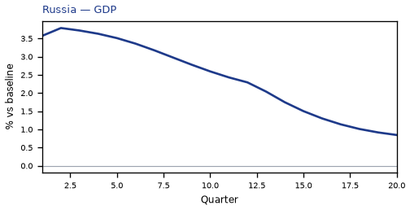

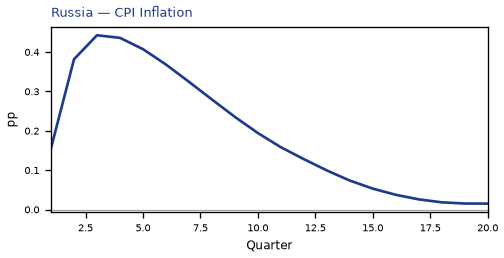

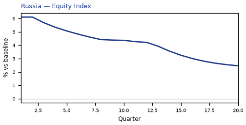


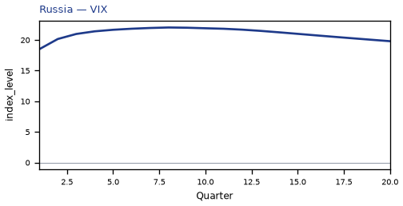

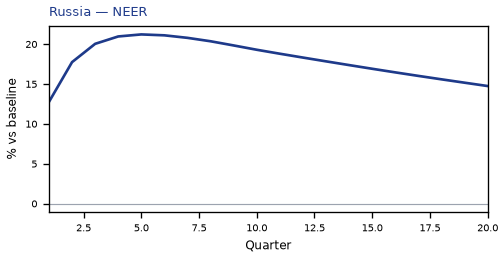

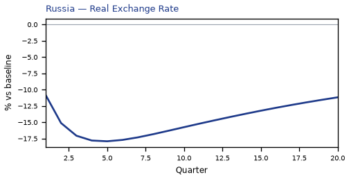

[Q1–Q20 JSON for Russia](numbers/RU.json)

## IT — Italy

The main impact of a 150 basis-point (1.50 percentage-point) rise in United States interest rates together with oil at $180 a barrel on Italy would be a large drop in GDP of 3.63% by Q15. Equities peak at -6.15% in Q15.

Demand and trade. Consumption peaks at -1.91 % vs baseline in Q15, from -0.72 in Q1 to -1.68 in Q20. Investment peaks at -10.39 % vs baseline in Q10, from -4.89 in Q1 to -7.40 in Q20. Net Exports peaks at -2.75 % vs baseline in Q4, from -1.70 in Q1 to -0.92 in Q20. Gov Spending peaks at +0.78 % vs baseline in Q15, from +0.34 in Q1 to +0.66 in Q20. Gov Debt peaks at +0.35 % vs baseline in Q15, from +0.08 in Q1 to +0.32 in Q20.

External / FX. The real exchange rate shows real depreciation (a weaker, more competitive home currency). Real Exchange Rate peaks at +6.10 % vs baseline in Q4, from +3.73 in Q1 to +3.22 in Q20.

Labour. Employment peaks at -3.88 % vs baseline in Q19, from -0.29 in Q1 to -3.87 in Q20. Unemployment peaks at +1.50 pp in Q17, from +0.16 in Q1 to +1.45 in Q20. Real Wages peaks at -0.95 % vs baseline in Q20, from -0.01 in Q1 to -0.95 in Q20.

Prices. The three-year CPI impulse is +2.77 percentage points. CPI Inflation peaks at +0.62 pp in Q2, from +0.48 in Q1 to -0.19 in Q20. Domestic Infl. peaks at +0.43 pp in Q2, from +0.33 in Q1 to -0.14 in Q20. Marginal Cost peaks at -2.15 % vs baseline in Q15, from -0.93 in Q1 to -1.82 in Q20.

Financial conditions. Policy Rate peaks at +1.45 pp (annualized) in Q6, from +0.36 in Q1 to -0.65 in Q20. Real Rate peaks at +0.36 pp (annualized) in Q6, from +0.09 in Q1 to -0.16 in Q20. Govt 3M Yield peaks at +1.45 pp (annualized) in Q6, from +0.36 in Q1 to -0.65 in Q20. Govt 2Y Yield peaks at +1.24 pp (annualized) in Q3, from +1.14 in Q1 to -0.76 in Q20. Govt 5Y Yield peaks at -0.73 pp (annualized) in Q20, from +0.50 in Q1 to -0.73 in Q20. Govt 10Y Yield peaks at -0.60 pp (annualized) in Q17, from -0.12 in Q1 to -0.59 in Q20. Govt 30Y Yield peaks at -0.28 pp (annualized) in Q15, from -0.17 in Q1 to -0.27 in Q20. Bond Price (7y) peaks at -10.07 % vs baseline in Q6, from -2.53 in Q1 to +4.52 in Q20. Bond Price 3M peaks at -0.36 % vs baseline in Q6, from -0.09 in Q1 to +0.16 in Q20. Bond Price 2Y peaks at -2.35 % vs baseline in Q3, from -2.17 in Q1 to +1.45 in Q20. Bond Price 5Y peaks at +3.31 % vs baseline in Q20, from -2.25 in Q1 to +3.31 in Q20. Bond Price 10Y peaks at +4.92 % vs baseline in Q17, from +0.95 in Q1 to +4.82 in Q20. Bond Price 30Y peaks at +5.09 % vs baseline in Q15, from +3.13 in Q1 to +4.84 in Q20. Equity Index peaks at -6.15 % vs baseline in Q15, from -3.00 in Q1 to -4.94 in Q20. VIX peaks at +22.03 index_level in Q8, from +18.49 in Q1 to +19.80 in Q20. Tobin's Q peaks at -7.27 % vs baseline in Q10, from -3.42 in Q1 to -5.18 in Q20. House Prices peaks at -4.62 % vs baseline in Q20, from -0.18 in Q1 to -4.62 in Q20. Bank Equity peaks at -1.28 % vs baseline in Q17, from -0.10 in Q1 to -1.25 in Q20. Bank Credit peaks at -1.07 % vs baseline in Q17, from -0.08 in Q1 to -1.05 in Q20. Credit Spread peaks at +0.02 pp in Q17, from +0.00 in Q1 to +0.02 in Q20.

Nominal FX. NEER peaks at -3.98 % vs baseline in Q4, from -2.42 in Q1 to -1.75 in Q20. vs USD peaks at +7.24 % vs baseline in Q6, from +3.96 in Q1 to +4.78 in Q20.

Commodities. Energy Price peaks at +160.39 USD/bbl (level) in Q4, from +129.14 in Q1 to +114.87 in Q20. Metals Price peaks at +98.52 index (level) in Q1, from +98.52 in Q1 to +94.06 in Q20. Food Price peaks at +110.73 index (level) in Q8, from +101.57 in Q1 to +105.58 in Q20. Gas Price peaks at +6.56 USD/mmBtu (level) in Q4, from +5.60 in Q1 to +4.99 in Q20. Copper Price peaks at +98.69 index (level) in Q1, from +98.69 in Q1 to +95.18 in Q20. Wheat Price peaks at +99.37 index (level) in Q1, from +99.37 in Q1 to +96.43 in Q20. Gold Price peaks at +2376.68 USD/oz (level) in Q10, from +2202.10 in Q1 to +2263.02 in Q20.

Sectoral and capital. Manuf. GDP peaks at -4.21 % vs baseline in Q4, from -2.55 in Q1 to -2.41 in Q20. Services GDP peaks at -2.63 % vs baseline in Q15, from -1.17 in Q1 to -2.23 in Q20. Capital Stock peaks at -0.93 % vs baseline in Q20, from -0.02 in Q1 to -0.93 in Q20.

Timing. By Q20 GDP is still -3.07% from baseline.

These figures are model IRFs versus baseline, not forecasts.

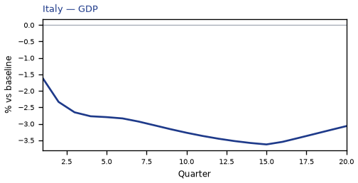

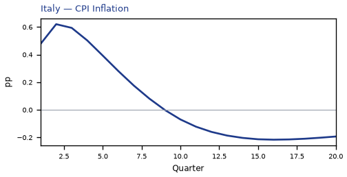

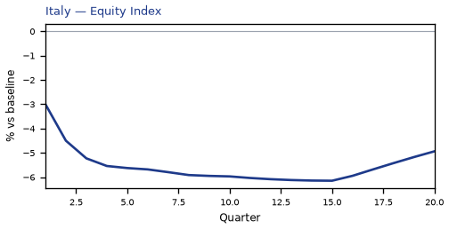


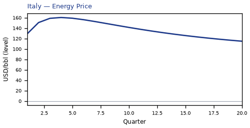


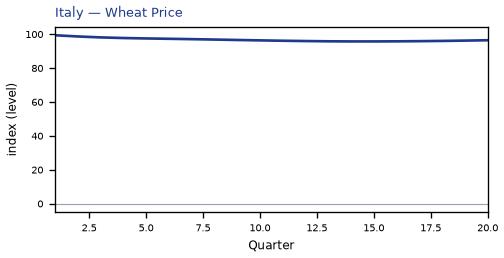


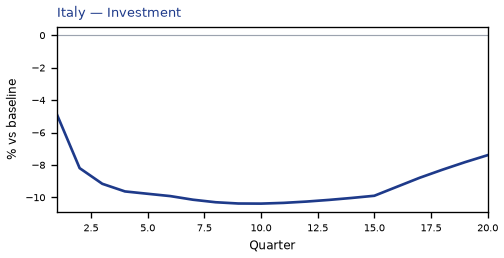


[Q1–Q20 JSON for Italy](numbers/IT.json)

## PL — Poland

The main impact of a 150 basis-point (1.50 percentage-point) rise in United States interest rates together with oil at $180 a barrel on Poland would be a large drop in GDP of 3.44% by Q17. Equities peak at -5.74% in Q13.

Demand and trade. Consumption peaks at -1.86 % vs baseline in Q17, from -0.65 in Q1 to -1.69 in Q20. Investment peaks at -9.56 % vs baseline in Q9, from -4.51 in Q1 to -6.69 in Q20. Net Exports peaks at -1.85 % vs baseline in Q4, from -1.10 in Q1 to -0.33 in Q20. Gov Spending peaks at +0.68 % vs baseline in Q17, from +0.27 in Q1 to +0.60 in Q20. Gov Debt peaks at +0.00 % vs baseline in Q1, from +0.00 in Q1 to +0.00 in Q20.

External / FX. The real exchange rate shows real depreciation (a weaker, more competitive home currency). Real Exchange Rate peaks at +4.07 % vs baseline in Q3, from +2.79 in Q1 to +2.50 in Q20.

Labour. Employment peaks at -3.71 % vs baseline in Q19, from -0.28 in Q1 to -3.69 in Q20. Unemployment peaks at +1.44 pp in Q18, from +0.14 in Q1 to +1.41 in Q20. Real Wages peaks at -3.58 % vs baseline in Q20, from -0.02 in Q1 to -3.58 in Q20.

Prices. The three-year CPI impulse is +2.18 percentage points. CPI Inflation peaks at +0.51 pp in Q2, from +0.41 in Q1 to -0.20 in Q20. Domestic Infl. peaks at +0.36 pp in Q2, from +0.29 in Q1 to -0.14 in Q20. Marginal Cost peaks at -2.04 % vs baseline in Q17, from -0.80 in Q1 to -1.79 in Q20.

Financial conditions. Policy Rate peaks at +1.71 pp (annualized) in Q5, from +0.53 in Q1 to -1.02 in Q20. Real Rate peaks at +0.43 pp (annualized) in Q5, from +0.13 in Q1 to -0.26 in Q20. Govt 3M Yield peaks at +1.71 pp (annualized) in Q5, from +0.53 in Q1 to -1.02 in Q20. Govt 2Y Yield peaks at +1.40 pp (annualized) in Q2, from +1.34 in Q1 to -1.07 in Q20. Govt 5Y Yield peaks at -0.97 pp (annualized) in Q17, from +0.39 in Q1 to -0.95 in Q20. Govt 10Y Yield peaks at -0.76 pp (annualized) in Q15, from -0.27 in Q1 to -0.71 in Q20. Govt 30Y Yield peaks at -0.33 pp (annualized) in Q13, from -0.22 in Q1 to -0.30 in Q20. Bond Price (7y) peaks at -7.11 % vs baseline in Q5, from -2.22 in Q1 to +4.27 in Q20. Bond Price 3M peaks at -0.43 % vs baseline in Q5, from -0.13 in Q1 to +0.26 in Q20. Bond Price 2Y peaks at -2.65 % vs baseline in Q2, from -2.55 in Q1 to +2.04 in Q20. Bond Price 5Y peaks at +4.36 % vs baseline in Q17, from -1.74 in Q1 to +4.26 in Q20. Bond Price 10Y peaks at +6.26 % vs baseline in Q15, from +2.23 in Q1 to +5.84 in Q20. Bond Price 30Y peaks at +6.01 % vs baseline in Q13, from +4.03 in Q1 to +5.40 in Q20. Equity Index peaks at -5.74 % vs baseline in Q13, from -2.65 in Q1 to -4.73 in Q20. VIX peaks at +22.03 index_level in Q8, from +18.49 in Q1 to +19.80 in Q20. Tobin's Q peaks at -6.69 % vs baseline in Q9, from -3.16 in Q1 to -4.68 in Q20. House Prices peaks at -4.59 % vs baseline in Q20, from -0.17 in Q1 to -4.59 in Q20. Bank Equity peaks at -0.83 % vs baseline in Q18, from -0.06 in Q1 to -0.82 in Q20. Bank Credit peaks at -0.75 % vs baseline in Q18, from -0.06 in Q1 to -0.74 in Q20. Credit Spread peaks at +0.02 pp in Q18, from +0.00 in Q1 to +0.02 in Q20.

Nominal FX. NEER peaks at -2.52 % vs baseline in Q3, from -1.79 in Q1 to -1.35 in Q20. vs USD peaks at +5.14 % vs baseline in Q9, from +3.02 in Q1 to +4.06 in Q20.

Commodities. Energy Price peaks at +160.39 USD/bbl (level) in Q4, from +129.14 in Q1 to +114.87 in Q20. Metals Price peaks at +98.52 index (level) in Q1, from +98.52 in Q1 to +94.06 in Q20. Food Price peaks at +110.73 index (level) in Q8, from +101.57 in Q1 to +105.58 in Q20. Gas Price peaks at +6.56 USD/mmBtu (level) in Q4, from +5.60 in Q1 to +4.99 in Q20. Copper Price peaks at +98.69 index (level) in Q1, from +98.69 in Q1 to +95.18 in Q20. Wheat Price peaks at +99.37 index (level) in Q1, from +99.37 in Q1 to +96.43 in Q20. Gold Price peaks at +2376.68 USD/oz (level) in Q10, from +2202.10 in Q1 to +2263.02 in Q20.

Sectoral and capital. Manuf. GDP peaks at -4.12 % vs baseline in Q4, from -2.59 in Q1 to -2.57 in Q20. Services GDP peaks at -2.15 % vs baseline in Q17, from -0.86 in Q1 to -1.89 in Q20. Capital Stock peaks at -0.85 % vs baseline in Q20, from -0.02 in Q1 to -0.85 in Q20.

Timing. By Q20 GDP is still -3.02% from baseline.

These figures are model IRFs versus baseline, not forecasts.


[Q1–Q20 JSON for Poland](numbers/PL.json)

## ES — Spain

The main impact of a 150 basis-point (1.50 percentage-point) rise in United States interest rates together with oil at $180 a barrel on Spain would be a large drop in GDP of 3.39% by Q16. Equities peak at -6.36% in Q15.

Demand and trade. Consumption peaks at -1.94 % vs baseline in Q16, from -0.72 in Q1 to -1.78 in Q20. Investment peaks at -9.77 % vs baseline in Q9, from -4.59 in Q1 to -7.25 in Q20. Net Exports peaks at -2.74 % vs baseline in Q4, from -1.69 in Q1 to -0.89 in Q20. Gov Spending peaks at +0.73 % vs baseline in Q16, from +0.32 in Q1 to +0.65 in Q20. Gov Debt peaks at +0.33 % vs baseline in Q20, from +0.01 in Q1 to +0.33 in Q20.

External / FX. The real exchange rate shows real depreciation (a weaker, more competitive home currency). Real Exchange Rate peaks at +5.00 % vs baseline in Q4, from +3.09 in Q1 to +2.71 in Q20.

Labour. Employment peaks at -3.59 % vs baseline in Q19, from -0.27 in Q1 to -3.59 in Q20. Unemployment peaks at +1.66 pp in Q18, from +0.16 in Q1 to +1.64 in Q20. Real Wages peaks at -1.44 % vs baseline in Q20, from -0.01 in Q1 to -1.44 in Q20.

Prices. The three-year CPI impulse is +2.45 percentage points. CPI Inflation peaks at +0.56 pp in Q2, from +0.43 in Q1 to -0.18 in Q20. Domestic Infl. peaks at +0.39 pp in Q2, from +0.30 in Q1 to -0.13 in Q20. Marginal Cost peaks at -2.01 % vs baseline in Q16, from -0.87 in Q1 to -1.79 in Q20.

Financial conditions. Policy Rate peaks at +1.45 pp (annualized) in Q6, from +0.36 in Q1 to -0.65 in Q20. Real Rate peaks at +0.36 pp (annualized) in Q6, from +0.09 in Q1 to -0.16 in Q20. Govt 3M Yield peaks at +1.45 pp (annualized) in Q6, from +0.36 in Q1 to -0.65 in Q20. Govt 2Y Yield peaks at +1.24 pp (annualized) in Q3, from +1.14 in Q1 to -0.76 in Q20. Govt 5Y Yield peaks at -0.73 pp (annualized) in Q20, from +0.50 in Q1 to -0.73 in Q20. Govt 10Y Yield peaks at -0.60 pp (annualized) in Q17, from -0.12 in Q1 to -0.59 in Q20. Govt 30Y Yield peaks at -0.28 pp (annualized) in Q15, from -0.17 in Q1 to -0.27 in Q20. Bond Price (7y) peaks at -10.15 % vs baseline in Q6, from -2.55 in Q1 to +4.56 in Q20. Bond Price 3M peaks at -0.36 % vs baseline in Q6, from -0.09 in Q1 to +0.16 in Q20. Bond Price 2Y peaks at -2.35 % vs baseline in Q3, from -2.17 in Q1 to +1.45 in Q20. Bond Price 5Y peaks at +3.31 % vs baseline in Q20, from -2.25 in Q1 to +3.31 in Q20. Bond Price 10Y peaks at +4.92 % vs baseline in Q17, from +0.95 in Q1 to +4.82 in Q20. Bond Price 30Y peaks at +5.09 % vs baseline in Q15, from +3.13 in Q1 to +4.84 in Q20. Equity Index peaks at -6.36 % vs baseline in Q15, from -3.09 in Q1 to -5.43 in Q20. VIX peaks at +22.03 index_level in Q8, from +18.49 in Q1 to +19.80 in Q20. Tobin's Q peaks at -6.84 % vs baseline in Q9, from -3.21 in Q1 to -5.08 in Q20. House Prices peaks at -4.43 % vs baseline in Q20, from -0.17 in Q1 to -4.43 in Q20. Bank Equity peaks at -1.09 % vs baseline in Q17, from -0.08 in Q1 to -1.07 in Q20. Bank Credit peaks at -0.88 % vs baseline in Q17, from -0.07 in Q1 to -0.86 in Q20. Credit Spread peaks at +0.01 pp in Q17, from +0.00 in Q1 to +0.01 in Q20.

Nominal FX. NEER peaks at -3.82 % vs baseline in Q4, from -2.31 in Q1 to -1.72 in Q20. vs USD peaks at +6.17 % vs baseline in Q7, from +3.31 in Q1 to +4.27 in Q20.

Commodities. Energy Price peaks at +160.39 USD/bbl (level) in Q4, from +129.14 in Q1 to +114.87 in Q20. Metals Price peaks at +98.52 index (level) in Q1, from +98.52 in Q1 to +94.06 in Q20. Food Price peaks at +110.73 index (level) in Q8, from +101.57 in Q1 to +105.58 in Q20. Gas Price peaks at +6.56 USD/mmBtu (level) in Q4, from +5.60 in Q1 to +4.99 in Q20. Copper Price peaks at +98.69 index (level) in Q1, from +98.69 in Q1 to +95.18 in Q20. Wheat Price peaks at +99.37 index (level) in Q1, from +99.37 in Q1 to +96.43 in Q20. Gold Price peaks at +2376.68 USD/oz (level) in Q10, from +2202.10 in Q1 to +2263.02 in Q20.

Sectoral and capital. Manuf. GDP peaks at -3.62 % vs baseline in Q4, from -2.21 in Q1 to -2.11 in Q20. Services GDP peaks at -2.50 % vs baseline in Q16, from -1.09 in Q1 to -2.22 in Q20. Capital Stock peaks at -0.88 % vs baseline in Q20, from -0.02 in Q1 to -0.88 in Q20.

Timing. By Q20 GDP is still -3.01% from baseline.

These figures are model IRFs versus baseline, not forecasts.


[Q1–Q20 JSON for Spain](numbers/ES.json)

## TH — Thailand

The main impact of a 150 basis-point (1.50 percentage-point) rise in United States interest rates together with oil at $180 a barrel on Thailand would be a large drop in GDP of 3.32% by Q16. Equities peak at -7.90% in Q13.

Demand and trade. Consumption peaks at -2.22 % vs baseline in Q16, from -0.82 in Q1 to -1.98 in Q20. Investment peaks at -8.65 % vs baseline in Q9, from -4.66 in Q1 to -5.56 in Q20. Net Exports peaks at -2.07 % vs baseline in Q3, from -1.46 in Q1 to -0.14 in Q20. Gov Spending peaks at +0.55 % vs baseline in Q16, from +0.26 in Q1 to +0.48 in Q20. Gov Debt peaks at -5.87 % vs baseline in Q20, from -0.25 in Q1 to -5.87 in Q20.

External / FX. The real exchange rate shows real depreciation (a weaker, more competitive home currency). Real Exchange Rate peaks at +1.51 % vs baseline in Q17, from +0.92 in Q1 to +1.47 in Q20.

Labour. Employment peaks at -3.65 % vs baseline in Q18, from -0.36 in Q1 to -3.59 in Q20. Unemployment peaks at +0.32 pp in Q17, from +0.05 in Q1 to +0.30 in Q20. Real Wages peaks at -4.18 % vs baseline in Q20, from -0.02 in Q1 to -4.18 in Q20.

Prices. The three-year CPI impulse is +2.44 percentage points. CPI Inflation peaks at +0.52 pp in Q2, from +0.41 in Q1 to -0.18 in Q20. Domestic Infl. peaks at +0.36 pp in Q2, from +0.28 in Q1 to -0.13 in Q20. Marginal Cost peaks at -1.97 % vs baseline in Q16, from -0.92 in Q1 to -1.70 in Q20.

Financial conditions. Policy Rate peaks at -1.50 pp (annualized) in Q20, from +0.24 in Q1 to -1.50 in Q20. Real Rate peaks at -0.38 pp (annualized) in Q20, from +0.06 in Q1 to -0.38 in Q20. Govt 3M Yield peaks at -1.50 pp (annualized) in Q20, from +0.24 in Q1 to -1.50 in Q20. Govt 2Y Yield peaks at -1.53 pp (annualized) in Q20, from +0.63 in Q1 to -1.53 in Q20. Govt 5Y Yield peaks at -1.39 pp (annualized) in Q16, from -0.21 in Q1 to -1.33 in Q20. Govt 10Y Yield peaks at -1.10 pp (annualized) in Q13, from -0.76 in Q1 to -1.00 in Q20. Govt 30Y Yield peaks at -0.50 pp (annualized) in Q11, from -0.45 in Q1 to -0.43 in Q20. Bond Price (7y) peaks at +6.26 % vs baseline in Q20, from -1.02 in Q1 to +6.26 in Q20. Bond Price 3M peaks at +0.38 % vs baseline in Q20, from -0.06 in Q1 to +0.38 in Q20. Bond Price 2Y peaks at +2.91 % vs baseline in Q20, from -1.19 in Q1 to +2.91 in Q20. Bond Price 5Y peaks at +6.24 % vs baseline in Q16, from +0.94 in Q1 to +6.01 in Q20. Bond Price 10Y peaks at +9.03 % vs baseline in Q13, from +6.21 in Q1 to +8.23 in Q20. Bond Price 30Y peaks at +8.98 % vs baseline in Q11, from +8.10 in Q1 to +7.81 in Q20. Equity Index peaks at -7.90 % vs baseline in Q13, from -4.04 in Q1 to -6.56 in Q20. VIX peaks at +22.03 index_level in Q8, from +18.49 in Q1 to +19.80 in Q20. Tobin's Q peaks at -6.06 % vs baseline in Q9, from -3.26 in Q1 to -3.89 in Q20. House Prices peaks at -5.51 % vs baseline in Q20, from -0.27 in Q1 to -5.51 in Q20. Bank Equity peaks at -0.87 % vs baseline in Q17, from -0.07 in Q1 to -0.86 in Q20. Bank Credit peaks at -0.71 % vs baseline in Q17, from -0.06 in Q1 to -0.70 in Q20. Credit Spread peaks at +0.01 pp in Q17, from +0.00 in Q1 to +0.01 in Q20.

Nominal FX. NEER peaks at +0.64 % vs baseline in Q5, from +0.29 in Q1 to -0.52 in Q20. vs USD peaks at +3.34 % vs baseline in Q13, from +1.15 in Q1 to +3.03 in Q20.

Commodities. Energy Price peaks at +160.39 USD/bbl (level) in Q4, from +129.14 in Q1 to +114.87 in Q20. Metals Price peaks at +98.52 index (level) in Q1, from +98.52 in Q1 to +94.06 in Q20. Food Price peaks at +110.73 index (level) in Q8, from +101.57 in Q1 to +105.58 in Q20. Gas Price peaks at +6.56 USD/mmBtu (level) in Q4, from +5.60 in Q1 to +4.99 in Q20. Copper Price peaks at +98.69 index (level) in Q1, from +98.69 in Q1 to +95.18 in Q20. Wheat Price peaks at +99.37 index (level) in Q1, from +99.37 in Q1 to +96.43 in Q20. Gold Price peaks at +2376.68 USD/oz (level) in Q10, from +2202.10 in Q1 to +2263.02 in Q20.

Sectoral and capital. Manuf. GDP peaks at -3.61 % vs baseline in Q4, from -2.22 in Q1 to -2.35 in Q20. Services GDP peaks at -1.82 % vs baseline in Q16, from -0.87 in Q1 to -1.57 in Q20. Capital Stock peaks at -0.77 % vs baseline in Q20, from -0.02 in Q1 to -0.77 in Q20.

Timing. By Q20 GDP is still -2.86% from baseline.

These figures are model IRFs versus baseline, not forecasts.


[Q1–Q20 JSON for Thailand](numbers/TH.json)

## FR — France

The main impact of a 150 basis-point (1.50 percentage-point) rise in United States interest rates together with oil at $180 a barrel on France would be a large drop in GDP of 3.18% by Q17. Equities peak at -6.92% in Q15.

Demand and trade. Consumption peaks at -1.74 % vs baseline in Q18, from -0.58 in Q1 to -1.66 in Q20. Investment peaks at -9.23 % vs baseline in Q10, from -3.84 in Q1 to -7.12 in Q20. Net Exports peaks at -1.66 % vs baseline in Q4, from -1.07 in Q1 to -0.38 in Q20. Gov Spending peaks at +0.75 % vs baseline in Q17, from +0.28 in Q1 to +0.70 in Q20. Gov Debt peaks at +2.96 % vs baseline in Q20, from +0.09 in Q1 to +2.96 in Q20.

External / FX. The real exchange rate shows real depreciation (a weaker, more competitive home currency). Real Exchange Rate peaks at +5.11 % vs baseline in Q4, from +3.15 in Q1 to +2.83 in Q20.

Labour. Employment peaks at -3.34 % vs baseline in Q20, from -0.19 in Q1 to -3.34 in Q20. Unemployment peaks at +2.33 pp in Q19, from +0.19 in Q1 to +2.32 in Q20. Real Wages peaks at -1.07 % vs baseline in Q20, from -0.01 in Q1 to -1.07 in Q20.

Prices. The three-year CPI impulse is +2.58 percentage points. CPI Inflation peaks at +0.59 pp in Q2, from +0.46 in Q1 to -0.18 in Q20. Domestic Infl. peaks at +0.41 pp in Q2, from +0.32 in Q1 to -0.13 in Q20. Marginal Cost peaks at -1.89 % vs baseline in Q17, from -0.71 in Q1 to -1.76 in Q20.

Financial conditions. Policy Rate peaks at +1.45 pp (annualized) in Q6, from +0.36 in Q1 to -0.65 in Q20. Real Rate peaks at +0.36 pp (annualized) in Q6, from +0.09 in Q1 to -0.16 in Q20. Govt 3M Yield peaks at +1.45 pp (annualized) in Q6, from +0.36 in Q1 to -0.65 in Q20. Govt 2Y Yield peaks at +1.24 pp (annualized) in Q3, from +1.14 in Q1 to -0.76 in Q20. Govt 5Y Yield peaks at -0.73 pp (annualized) in Q20, from +0.50 in Q1 to -0.73 in Q20. Govt 10Y Yield peaks at -0.60 pp (annualized) in Q17, from -0.12 in Q1 to -0.59 in Q20. Govt 30Y Yield peaks at -0.28 pp (annualized) in Q15, from -0.17 in Q1 to -0.27 in Q20. Bond Price (7y) peaks at -10.15 % vs baseline in Q6, from -2.55 in Q1 to +4.56 in Q20. Bond Price 3M peaks at -0.36 % vs baseline in Q6, from -0.09 in Q1 to +0.16 in Q20. Bond Price 2Y peaks at -2.35 % vs baseline in Q3, from -2.17 in Q1 to +1.45 in Q20. Bond Price 5Y peaks at +3.31 % vs baseline in Q20, from -2.25 in Q1 to +3.31 in Q20. Bond Price 10Y peaks at +4.92 % vs baseline in Q17, from +0.95 in Q1 to +4.82 in Q20. Bond Price 30Y peaks at +5.09 % vs baseline in Q15, from +3.13 in Q1 to +4.84 in Q20. Equity Index peaks at -6.92 % vs baseline in Q15, from -2.89 in Q1 to -6.28 in Q20. VIX peaks at +22.03 index_level in Q8, from +18.49 in Q1 to +19.80 in Q20. Tobin's Q peaks at -6.46 % vs baseline in Q10, from -2.69 in Q1 to -4.98 in Q20. House Prices peaks at -4.17 % vs baseline in Q20, from -0.14 in Q1 to -4.17 in Q20. Bank Equity peaks at -1.42 % vs baseline in Q17, from -0.09 in Q1 to -1.40 in Q20. Bank Credit peaks at -1.13 % vs baseline in Q17, from -0.08 in Q1 to -1.11 in Q20. Credit Spread peaks at +0.01 pp in Q17, from +0.00 in Q1 to +0.01 in Q20.

Nominal FX. NEER peaks at -2.63 % vs baseline in Q4, from -1.63 in Q1 to -1.33 in Q20. vs USD peaks at +6.28 % vs baseline in Q7, from +3.37 in Q1 to +4.39 in Q20.

Commodities. Energy Price peaks at +160.39 USD/bbl (level) in Q4, from +129.14 in Q1 to +114.87 in Q20. Metals Price peaks at +98.52 index (level) in Q1, from +98.52 in Q1 to +94.06 in Q20. Food Price peaks at +110.73 index (level) in Q8, from +101.57 in Q1 to +105.58 in Q20. Gas Price peaks at +6.56 USD/mmBtu (level) in Q4, from +5.60 in Q1 to +4.99 in Q20. Copper Price peaks at +98.69 index (level) in Q1, from +98.69 in Q1 to +95.18 in Q20. Wheat Price peaks at +99.37 index (level) in Q1, from +99.37 in Q1 to +96.43 in Q20. Gold Price peaks at +2376.68 USD/oz (level) in Q10, from +2202.10 in Q1 to +2263.02 in Q20.

Sectoral and capital. Manuf. GDP peaks at -3.38 % vs baseline in Q4, from -2.05 in Q1 to -2.01 in Q20. Services GDP peaks at -2.45 % vs baseline in Q17, from -0.93 in Q1 to -2.28 in Q20. Capital Stock peaks at -0.82 % vs baseline in Q20, from -0.02 in Q1 to -0.82 in Q20.

Timing. By Q20 GDP is still -2.96% from baseline.

These figures are model IRFs versus baseline, not forecasts.


[Q1–Q20 JSON for France](numbers/FR.json)

## AR — Argentina

The main impact of a 150 basis-point (1.50 percentage-point) rise in United States interest rates together with oil at $180 a barrel on Argentina would be a large drop in GDP of 3.09% by Q13. Equities peak at -4.88% in Q11.

Demand and trade. Consumption peaks at -1.56 % vs baseline in Q14, from -0.24 in Q1 to -1.12 in Q20. Investment peaks at -7.21 % vs baseline in Q9, from -2.12 in Q1 to -1.80 in Q20. Net Exports peaks at +1.76 % vs baseline in Q8, from +0.72 in Q1 to +0.97 in Q20. Gov Spending peaks at +0.77 % vs baseline in Q12, from +0.18 in Q1 to +0.49 in Q20. Gov Debt peaks at -2.80 % vs baseline in Q20, from -0.02 in Q1 to -2.80 in Q20.

External / FX. The real exchange rate shows real depreciation (a weaker, more competitive home currency). Real Exchange Rate peaks at +2.88 % vs baseline in Q13, from +0.53 in Q1 to +1.67 in Q20.

Labour. Employment peaks at -3.02 % vs baseline in Q18, from -0.05 in Q1 to -2.98 in Q20. Unemployment peaks at +0.61 pp in Q15, from +0.03 in Q1 to +0.50 in Q20. Real Wages peaks at -5.89 % vs baseline in Q20, from -0.01 in Q1 to -5.89 in Q20.

Prices. The three-year CPI impulse is +1.20 percentage points. CPI Inflation peaks at -0.50 pp in Q18, from +0.31 in Q1 to -0.48 in Q20. Domestic Infl. peaks at -0.35 pp in Q18, from +0.21 in Q1 to -0.34 in Q20. Marginal Cost peaks at -1.84 % vs baseline in Q13, from -0.22 in Q1 to -1.17 in Q20.

Financial conditions. Policy Rate peaks at -2.31 pp (annualized) in Q18, from +0.74 in Q1 to -2.27 in Q20. Real Rate peaks at -0.58 pp (annualized) in Q18, from +0.18 in Q1 to -0.57 in Q20. Govt 3M Yield peaks at -2.31 pp (annualized) in Q18, from +0.74 in Q1 to -2.27 in Q20. Govt 2Y Yield peaks at -2.22 pp (annualized) in Q15, from +1.20 in Q1 to -1.85 in Q20. Govt 5Y Yield peaks at -1.76 pp (annualized) in Q11, from -0.54 in Q1 to -1.07 in Q20. Govt 10Y Yield peaks at -1.02 pp (annualized) in Q9, from -0.75 in Q1 to -0.60 in Q20. Govt 30Y Yield peaks at -0.40 pp (annualized) in Q9, from -0.32 in Q1 to -0.25 in Q20. Bond Price (7y) peaks at +5.78 % vs baseline in Q18, from -1.84 in Q1 to +5.68 in Q20. Bond Price 3M peaks at +0.58 % vs baseline in Q18, from -0.18 in Q1 to +0.57 in Q20. Bond Price 2Y peaks at +4.22 % vs baseline in Q15, from -2.27 in Q1 to +3.52 in Q20. Bond Price 5Y peaks at +7.92 % vs baseline in Q11, from +2.45 in Q1 to +4.81 in Q20. Bond Price 10Y peaks at +8.36 % vs baseline in Q9, from +6.19 in Q1 to +4.93 in Q20. Bond Price 30Y peaks at +7.18 % vs baseline in Q9, from +5.70 in Q1 to +4.51 in Q20. Equity Index peaks at -4.88 % vs baseline in Q11, from -0.99 in Q1 to -2.07 in Q20. VIX peaks at +22.03 index_level in Q8, from +18.49 in Q1 to +19.80 in Q20. Tobin's Q peaks at -5.04 % vs baseline in Q9, from -1.48 in Q1 to -1.26 in Q20. House Prices peaks at -3.48 % vs baseline in Q19, from -0.07 in Q1 to -3.47 in Q20. Bank Equity peaks at -0.13 % vs baseline in Q18, from -0.01 in Q1 to -0.13 in Q20. Bank Credit peaks at -0.27 % vs baseline in Q18, from -0.02 in Q1 to -0.27 in Q20. Credit Spread peaks at +0.08 pp in Q18, from +0.01 in Q1 to +0.08 in Q20.

Nominal FX. NEER peaks at -3.31 % vs baseline in Q10, from -0.81 in Q1 to -1.11 in Q20. vs USD peaks at +4.85 % vs baseline in Q12, from +0.76 in Q1 to +3.23 in Q20.

Commodities. Energy Price peaks at +160.39 USD/bbl (level) in Q4, from +129.14 in Q1 to +114.87 in Q20. Metals Price peaks at +98.52 index (level) in Q1, from +98.52 in Q1 to +94.06 in Q20. Food Price peaks at +110.73 index (level) in Q8, from +101.57 in Q1 to +105.58 in Q20. Gas Price peaks at +6.56 USD/mmBtu (level) in Q4, from +5.60 in Q1 to +4.99 in Q20. Copper Price peaks at +98.69 index (level) in Q1, from +98.69 in Q1 to +95.18 in Q20. Wheat Price peaks at +99.37 index (level) in Q1, from +99.37 in Q1 to +96.43 in Q20. Gold Price peaks at +2376.68 USD/oz (level) in Q10, from +2202.10 in Q1 to +2263.02 in Q20.

Sectoral and capital. Manuf. GDP peaks at -2.60 % vs baseline in Q10, from -1.22 in Q1 to -1.59 in Q20. Services GDP peaks at -1.77 % vs baseline in Q13, from -0.22 in Q1 to -1.12 in Q20. Capital Stock peaks at -0.51 % vs baseline in Q20, from -0.01 in Q1 to -0.51 in Q20.

Timing. By Q20 GDP is still -1.97% from baseline.

These figures are model IRFs versus baseline, not forecasts.


[Q1–Q20 JSON for Argentina](numbers/AR.json)

## ZA — South Africa

The main impact of a 150 basis-point (1.50 percentage-point) rise in United States interest rates together with oil at $180 a barrel on South Africa would be a large drop in GDP of 2.96% by Q15. Equities peak at -11.43% in Q13.

Demand and trade. Consumption peaks at -1.74 % vs baseline in Q16, from -0.59 in Q1 to -1.58 in Q20. Investment peaks at -8.39 % vs baseline in Q8, from -3.93 in Q1 to -5.16 in Q20. Net Exports peaks at -2.19 % vs baseline in Q4, from -1.24 in Q1 to -1.01 in Q20. Gov Spending peaks at +0.46 % vs baseline in Q15, from +0.19 in Q1 to +0.40 in Q20. Gov Debt peaks at -3.10 % vs baseline in Q20, from -0.09 in Q1 to -3.10 in Q20.

External / FX. The real exchange rate shows real depreciation (a weaker, more competitive home currency). Real Exchange Rate peaks at +4.18 % vs baseline in Q4, from +2.56 in Q1 to +2.64 in Q20.

Labour. Employment peaks at -3.32 % vs baseline in Q19, from -0.24 in Q1 to -3.30 in Q20. Unemployment peaks at +0.72 pp in Q17, from +0.08 in Q1 to +0.69 in Q20. Real Wages peaks at -3.90 % vs baseline in Q20, from -0.02 in Q1 to -3.90 in Q20.

Prices. The three-year CPI impulse is +1.63 percentage points. CPI Inflation peaks at +0.39 pp in Q2, from +0.31 in Q1 to -0.22 in Q20. Domestic Infl. peaks at +0.28 pp in Q2, from +0.22 in Q1 to -0.15 in Q20. Marginal Cost peaks at -1.75 % vs baseline in Q15, from -0.69 in Q1 to -1.52 in Q20.

Financial conditions. Policy Rate peaks at +1.51 pp (annualized) in Q5, from +0.49 in Q1 to -1.16 in Q20. Real Rate peaks at +0.38 pp (annualized) in Q5, from +0.12 in Q1 to -0.29 in Q20. Govt 3M Yield peaks at +1.51 pp (annualized) in Q5, from +0.49 in Q1 to -1.16 in Q20. Govt 2Y Yield peaks at +1.20 pp (annualized) in Q2, from +1.18 in Q1 to -1.13 in Q20. Govt 5Y Yield peaks at -0.99 pp (annualized) in Q15, from +0.18 in Q1 to -0.90 in Q20. Govt 10Y Yield peaks at -0.72 pp (annualized) in Q13, from -0.34 in Q1 to -0.62 in Q20. Govt 30Y Yield peaks at -0.30 pp (annualized) in Q12, from -0.21 in Q1 to -0.25 in Q20. Bond Price (7y) peaks at -6.27 % vs baseline in Q5, from -2.04 in Q1 to +4.85 in Q20. Bond Price 3M peaks at -0.38 % vs baseline in Q5, from -0.12 in Q1 to +0.29 in Q20. Bond Price 2Y peaks at -2.29 % vs baseline in Q2, from -2.24 in Q1 to +2.14 in Q20. Bond Price 5Y peaks at +4.44 % vs baseline in Q15, from -0.83 in Q1 to +4.05 in Q20. Bond Price 10Y peaks at +5.91 % vs baseline in Q13, from +2.80 in Q1 to +5.09 in Q20. Bond Price 30Y peaks at +5.35 % vs baseline in Q12, from +3.72 in Q1 to +4.49 in Q20. Equity Index peaks at -11.43 % vs baseline in Q13, from -4.83 in Q1 to -9.45 in Q20. VIX peaks at +22.03 index_level in Q8, from +18.49 in Q1 to +19.80 in Q20. Tobin's Q peaks at -5.87 % vs baseline in Q8, from -2.75 in Q1 to -3.61 in Q20. House Prices peaks at -4.49 % vs baseline in Q20, from -0.19 in Q1 to -4.49 in Q20. Bank Equity peaks at -0.75 % vs baseline in Q17, from -0.06 in Q1 to -0.74 in Q20. Bank Credit peaks at -0.64 % vs baseline in Q17, from -0.05 in Q1 to -0.63 in Q20. Credit Spread peaks at +0.02 pp in Q17, from +0.00 in Q1 to +0.02 in Q20.

Nominal FX. NEER peaks at -2.47 % vs baseline in Q3, from -1.49 in Q1 to -1.03 in Q20. vs USD peaks at +5.79 % vs baseline in Q9, from +2.79 in Q1 to +4.20 in Q20.

Commodities. Energy Price peaks at +160.39 USD/bbl (level) in Q4, from +129.14 in Q1 to +114.87 in Q20. Metals Price peaks at +98.52 index (level) in Q1, from +98.52 in Q1 to +94.06 in Q20. Food Price peaks at +110.73 index (level) in Q8, from +101.57 in Q1 to +105.58 in Q20. Gas Price peaks at +6.56 USD/mmBtu (level) in Q4, from +5.60 in Q1 to +4.99 in Q20. Copper Price peaks at +98.69 index (level) in Q1, from +98.69 in Q1 to +95.18 in Q20. Wheat Price peaks at +99.37 index (level) in Q1, from +99.37 in Q1 to +96.43 in Q20. Gold Price peaks at +2376.68 USD/oz (level) in Q10, from +2202.10 in Q1 to +2263.02 in Q20.

Sectoral and capital. Manuf. GDP peaks at -3.08 % vs baseline in Q4, from -1.87 in Q1 to -1.88 in Q20. Services GDP peaks at -1.89 % vs baseline in Q15, from -0.75 in Q1 to -1.63 in Q20. Capital Stock peaks at -0.72 % vs baseline in Q20, from -0.02 in Q1 to -0.72 in Q20.

Timing. By Q20 GDP is still -2.55% from baseline.

These figures are model IRFs versus baseline, not forecasts.


[Q1–Q20 JSON for South Africa](numbers/ZA.json)

## CN — China

The main impact of a 150 basis-point (1.50 percentage-point) rise in United States interest rates together with oil at $180 a barrel on China would be a large drop in GDP of 2.70% by Q12. Equities peak at -5.68% in Q8.

Demand and trade. Consumption peaks at -2.02 % vs baseline in Q13, from -0.84 in Q1 to -1.68 in Q20. Investment peaks at -7.09 % vs baseline in Q4, from -3.96 in Q1 to -2.17 in Q20. Net Exports peaks at -2.77 % vs baseline in Q4, from -1.64 in Q1 to -0.94 in Q20. Gov Spending peaks at +0.46 % vs baseline in Q13, from +0.24 in Q1 to +0.37 in Q20. Gov Debt peaks at -4.79 % vs baseline in Q20, from -0.16 in Q1 to -4.79 in Q20.

External / FX. The real exchange rate shows real depreciation (a weaker, more competitive home currency). Real Exchange Rate peaks at +3.80 % vs baseline in Q20, from +1.65 in Q1 to +3.80 in Q20.

Labour. Employment peaks at -2.56 % vs baseline in Q19, from -0.18 in Q1 to -2.55 in Q20. Unemployment peaks at +0.62 pp in Q15, from +0.09 in Q1 to +0.56 in Q20. Real Wages peaks at -4.34 % vs baseline in Q20, from -0.02 in Q1 to -4.34 in Q20.

Prices. The three-year CPI impulse is +2.31 percentage points. CPI Inflation peaks at +0.61 pp in Q2, from +0.51 in Q1 to -0.28 in Q20. Domestic Infl. peaks at +0.43 pp in Q2, from +0.35 in Q1 to -0.20 in Q20. Marginal Cost peaks at -1.59 % vs baseline in Q13, from -0.81 in Q1 to -1.27 in Q20.

Financial conditions. Policy Rate peaks at -2.39 pp (annualized) in Q20, from +0.11 in Q1 to -2.39 in Q20. Real Rate peaks at -0.60 pp (annualized) in Q20, from +0.03 in Q1 to -0.60 in Q20. Govt 3M Yield peaks at -2.39 pp (annualized) in Q20, from +0.11 in Q1 to -2.39 in Q20. Govt 2Y Yield peaks at -2.44 pp (annualized) in Q20, from +0.11 in Q1 to -2.44 in Q20. Govt 5Y Yield peaks at -2.24 pp (annualized) in Q16, from -0.89 in Q1 to -2.15 in Q20. Govt 10Y Yield peaks at -1.80 pp (annualized) in Q12, from -1.50 in Q1 to -1.59 in Q20. Govt 30Y Yield peaks at -0.80 pp (annualized) in Q8, from -0.78 in Q1 to -0.66 in Q20. Bond Price (7y) peaks at +11.96 % vs baseline in Q20, from -0.54 in Q1 to +11.96 in Q20. Bond Price 3M peaks at +0.60 % vs baseline in Q20, from -0.03 in Q1 to +0.60 in Q20. Bond Price 2Y peaks at +4.63 % vs baseline in Q20, from -0.21 in Q1 to +4.63 in Q20. Bond Price 5Y peaks at +10.10 % vs baseline in Q16, from +4.01 in Q1 to +9.70 in Q20. Bond Price 10Y peaks at +14.76 % vs baseline in Q12, from +12.31 in Q1 to +13.07 in Q20. Bond Price 30Y peaks at +14.32 % vs baseline in Q8, from +14.08 in Q1 to +11.94 in Q20. Equity Index peaks at -5.68 % vs baseline in Q8, from -3.01 in Q1 to -4.05 in Q20. VIX peaks at +22.03 index_level in Q8, from +18.49 in Q1 to +19.80 in Q20. Tobin's Q peaks at -4.96 % vs baseline in Q4, from -2.77 in Q1 to -1.52 in Q20. House Prices peaks at -3.72 % vs baseline in Q20, from -0.21 in Q1 to -3.72 in Q20. Bank Equity peaks at -0.87 % vs baseline in Q16, from -0.07 in Q1 to -0.85 in Q20. Bank Credit peaks at -0.67 % vs baseline in Q16, from -0.05 in Q1 to -0.65 in Q20. Credit Spread peaks at +0.01 pp in Q16, from +0.00 in Q1 to +0.01 in Q20.

Nominal FX. NEER peaks at -3.91 % vs baseline in Q20, from -1.69 in Q1 to -3.91 in Q20. vs USD peaks at +5.42 % vs baseline in Q18, from +1.88 in Q1 to +5.36 in Q20.

Commodities. Energy Price peaks at +160.39 USD/bbl (level) in Q4, from +129.14 in Q1 to +114.87 in Q20. Metals Price peaks at +98.52 index (level) in Q1, from +98.52 in Q1 to +94.06 in Q20. Food Price peaks at +110.73 index (level) in Q8, from +101.57 in Q1 to +105.58 in Q20. Gas Price peaks at +6.56 USD/mmBtu (level) in Q4, from +5.60 in Q1 to +4.99 in Q20. Copper Price peaks at +98.69 index (level) in Q1, from +98.69 in Q1 to +95.18 in Q20. Wheat Price peaks at +99.37 index (level) in Q1, from +99.37 in Q1 to +96.43 in Q20. Gold Price peaks at +2376.68 USD/oz (level) in Q10, from +2202.10 in Q1 to +2263.02 in Q20.

Sectoral and capital. Manuf. GDP peaks at -4.20 % vs baseline in Q5, from -2.58 in Q1 to -3.00 in Q20. Services GDP peaks at -1.57 % vs baseline in Q12, from -0.81 in Q1 to -1.25 in Q20. Capital Stock peaks at -0.54 % vs baseline in Q20, from -0.02 in Q1 to -0.54 in Q20.

Timing. By Q20 GDP is still -2.14% from baseline.

These figures are model IRFs versus baseline, not forecasts.


[Q1–Q20 JSON for China](numbers/CN.json)

## CL — Chile

The main impact of a 150 basis-point (1.50 percentage-point) rise in United States interest rates together with oil at $180 a barrel on Chile would be a large drop in GDP of 2.64% by Q15. Equities peak at -5.82% in Q12.

Demand and trade. Consumption peaks at -1.67 % vs baseline in Q16, from -0.58 in Q1 to -1.54 in Q20. Investment peaks at -7.82 % vs baseline in Q7, from -3.66 in Q1 to -4.51 in Q20. Net Exports peaks at -2.41 % vs baseline in Q5, from -1.29 in Q1 to -1.27 in Q20. Gov Spending peaks at +0.24 % vs baseline in Q16, from +0.14 in Q1 to +0.21 in Q20. Gov Debt peaks at -2.91 % vs baseline in Q20, from -0.12 in Q1 to -2.91 in Q20.

External / FX. The real exchange rate shows real depreciation (a weaker, more competitive home currency). Real Exchange Rate peaks at +3.44 % vs baseline in Q4, from +2.06 in Q1 to +2.44 in Q20.

Labour. Employment peaks at -2.91 % vs baseline in Q19, from -0.24 in Q1 to -2.89 in Q20. Unemployment peaks at +0.95 pp in Q18, from +0.11 in Q1 to +0.92 in Q20. Real Wages peaks at -3.58 % vs baseline in Q20, from -0.02 in Q1 to -3.58 in Q20.

Prices. The three-year CPI impulse is +1.32 percentage points. CPI Inflation peaks at +0.38 pp in Q2, from +0.30 in Q1 to -0.18 in Q20. Domestic Infl. peaks at +0.27 pp in Q2, from +0.21 in Q1 to -0.13 in Q20. Marginal Cost peaks at -1.57 % vs baseline in Q15, from -0.64 in Q1 to -1.38 in Q20.

Financial conditions. Policy Rate peaks at +1.52 pp (annualized) in Q5, from +0.46 in Q1 to -1.19 in Q20. Real Rate peaks at +0.38 pp (annualized) in Q5, from +0.12 in Q1 to -0.30 in Q20. Govt 3M Yield peaks at +1.52 pp (annualized) in Q5, from +0.46 in Q1 to -1.19 in Q20. Govt 2Y Yield peaks at +1.23 pp (annualized) in Q2, from +1.19 in Q1 to -1.18 in Q20. Govt 5Y Yield peaks at -1.04 pp (annualized) in Q16, from +0.20 in Q1 to -0.97 in Q20. Govt 10Y Yield peaks at -0.78 pp (annualized) in Q14, from -0.37 in Q1 to -0.70 in Q20. Govt 30Y Yield peaks at -0.34 pp (annualized) in Q12, from -0.24 in Q1 to -0.29 in Q20. Bond Price (7y) peaks at -6.35 % vs baseline in Q5, from -1.93 in Q1 to +4.97 in Q20. Bond Price 3M peaks at -0.38 % vs baseline in Q5, from -0.12 in Q1 to +0.30 in Q20. Bond Price 2Y peaks at -2.33 % vs baseline in Q2, from -2.26 in Q1 to +2.24 in Q20. Bond Price 5Y peaks at +4.67 % vs baseline in Q16, from -0.92 in Q1 to +4.37 in Q20. Bond Price 10Y peaks at +6.41 % vs baseline in Q14, from +3.02 in Q1 to +5.71 in Q20. Bond Price 30Y peaks at +6.06 % vs baseline in Q12, from +4.38 in Q1 to +5.23 in Q20. Equity Index peaks at -5.82 % vs baseline in Q12, from -2.69 in Q1 to -4.63 in Q20. VIX peaks at +22.03 index_level in Q8, from +18.49 in Q1 to +19.80 in Q20. Tobin's Q peaks at -5.48 % vs baseline in Q7, from -2.56 in Q1 to -3.15 in Q20. House Prices peaks at -4.09 % vs baseline in Q20, from -0.18 in Q1 to -4.09 in Q20. Bank Equity peaks at -0.65 % vs baseline in Q18, from -0.05 in Q1 to -0.64 in Q20. Bank Credit peaks at -0.53 % vs baseline in Q18, from -0.04 in Q1 to -0.53 in Q20. Credit Spread peaks at +0.01 pp in Q18, from +0.00 in Q1 to +0.01 in Q20.

Nominal FX. NEER peaks at -3.59 % vs baseline in Q4, from -1.95 in Q1 to -1.63 in Q20. vs USD peaks at +4.92 % vs baseline in Q9, from +2.28 in Q1 to +4.00 in Q20.

Commodities. Energy Price peaks at +160.39 USD/bbl (level) in Q4, from +129.14 in Q1 to +114.87 in Q20. Metals Price peaks at +98.52 index (level) in Q1, from +98.52 in Q1 to +94.06 in Q20. Food Price peaks at +110.73 index (level) in Q8, from +101.57 in Q1 to +105.58 in Q20. Gas Price peaks at +6.56 USD/mmBtu (level) in Q4, from +5.60 in Q1 to +4.99 in Q20. Copper Price peaks at +98.69 index (level) in Q1, from +98.69 in Q1 to +95.18 in Q20. Wheat Price peaks at +99.37 index (level) in Q1, from +99.37 in Q1 to +96.43 in Q20. Gold Price peaks at +2376.68 USD/oz (level) in Q10, from +2202.10 in Q1 to +2263.02 in Q20.

Sectoral and capital. Manuf. GDP peaks at -2.82 % vs baseline in Q4, from -1.70 in Q1 to -1.77 in Q20. Services GDP peaks at -1.60 % vs baseline in Q15, from -0.66 in Q1 to -1.40 in Q20. Capital Stock peaks at -0.66 % vs baseline in Q20, from -0.02 in Q1 to -0.66 in Q20.

Timing. By Q20 GDP is still -2.31% from baseline.

These figures are model IRFs versus baseline, not forecasts.


[Q1–Q20 JSON for Chile](numbers/CL.json)

## SE — Sweden

The main impact of a 150 basis-point (1.50 percentage-point) rise in United States interest rates together with oil at $180 a barrel on Sweden would be a large drop in GDP of 2.30% by Q16. Equities peak at -6.57% in Q13.

Demand and trade. Consumption peaks at -1.33 % vs baseline in Q17, from -0.51 in Q1 to -1.26 in Q20. Investment peaks at -7.22 % vs baseline in Q8, from -3.27 in Q1 to -4.82 in Q20. Net Exports peaks at -1.93 % vs baseline in Q4, from -1.16 in Q1 to -0.74 in Q20. Gov Spending peaks at +0.47 % vs baseline in Q16, from +0.20 in Q1 to +0.43 in Q20. Gov Debt peaks at +1.27 % vs baseline in Q20, from +0.06 in Q1 to +1.27 in Q20.

External / FX. The real exchange rate shows real depreciation (a weaker, more competitive home currency). Real Exchange Rate peaks at +1.44 % vs baseline in Q5, from +0.76 in Q1 to +1.19 in Q20.

Labour. Employment peaks at -2.37 % vs baseline in Q20, from -0.16 in Q1 to -2.37 in Q20. Unemployment peaks at +1.70 pp in Q19, from +0.15 in Q1 to +1.69 in Q20. Real Wages peaks at -1.73 % vs baseline in Q20, from -0.01 in Q1 to -1.73 in Q20.

Prices. The three-year CPI impulse is +2.08 percentage points. CPI Inflation peaks at +0.49 pp in Q2, from +0.39 in Q1 to -0.15 in Q20. Domestic Infl. peaks at +0.34 pp in Q2, from +0.27 in Q1 to -0.11 in Q20. Marginal Cost peaks at -1.37 % vs baseline in Q16, from -0.58 in Q1 to -1.26 in Q20.

Financial conditions. Policy Rate peaks at +1.39 pp (annualized) in Q5, from +0.37 in Q1 to -0.65 in Q20. Real Rate peaks at +0.35 pp (annualized) in Q5, from +0.09 in Q1 to -0.16 in Q20. Govt 3M Yield peaks at +1.39 pp (annualized) in Q5, from +0.37 in Q1 to -0.65 in Q20. Govt 2Y Yield peaks at +1.17 pp (annualized) in Q2, from +1.10 in Q1 to -0.73 in Q20. Govt 5Y Yield peaks at -0.68 pp (annualized) in Q19, from +0.44 in Q1 to -0.67 in Q20. Govt 10Y Yield peaks at -0.54 pp (annualized) in Q16, from -0.11 in Q1 to -0.52 in Q20. Govt 30Y Yield peaks at -0.24 pp (annualized) in Q14, from -0.14 in Q1 to -0.22 in Q20. Bond Price (7y) peaks at -8.69 % vs baseline in Q5, from -2.32 in Q1 to +4.07 in Q20. Bond Price 3M peaks at -0.35 % vs baseline in Q5, from -0.09 in Q1 to +0.16 in Q20. Bond Price 2Y peaks at -2.22 % vs baseline in Q2, from -2.08 in Q1 to +1.39 in Q20. Bond Price 5Y peaks at +3.04 % vs baseline in Q19, from -1.99 in Q1 to +3.03 in Q20. Bond Price 10Y peaks at +4.44 % vs baseline in Q16, from +0.92 in Q1 to +4.29 in Q20. Bond Price 30Y peaks at +4.31 % vs baseline in Q14, from +2.55 in Q1 to +4.01 in Q20. Equity Index peaks at -6.57 % vs baseline in Q13, from -3.11 in Q1 to -5.78 in Q20. VIX peaks at +22.03 index_level in Q8, from +18.49 in Q1 to +19.80 in Q20. Tobin's Q peaks at -5.06 % vs baseline in Q8, from -2.29 in Q1 to -3.37 in Q20. House Prices peaks at -3.15 % vs baseline in Q20, from -0.12 in Q1 to -3.15 in Q20. Bank Equity peaks at -0.94 % vs baseline in Q18, from -0.07 in Q1 to -0.93 in Q20. Bank Credit peaks at -0.75 % vs baseline in Q18, from -0.05 in Q1 to -0.74 in Q20. Credit Spread peaks at +0.01 pp in Q18, from +0.00 in Q1 to +0.01 in Q20.

Nominal FX. NEER peaks at -3.69 % vs baseline in Q5, from -1.98 in Q1 to -2.74 in Q20. vs USD peaks at +3.41 % vs baseline in Q10, from +0.99 in Q1 to +2.75 in Q20.

Commodities. Energy Price peaks at +160.39 USD/bbl (level) in Q4, from +129.14 in Q1 to +114.87 in Q20. Metals Price peaks at +98.52 index (level) in Q1, from +98.52 in Q1 to +94.06 in Q20. Food Price peaks at +110.73 index (level) in Q8, from +101.57 in Q1 to +105.58 in Q20. Gas Price peaks at +6.56 USD/mmBtu (level) in Q4, from +5.60 in Q1 to +4.99 in Q20. Copper Price peaks at +98.69 index (level) in Q1, from +98.69 in Q1 to +95.18 in Q20. Wheat Price peaks at +99.37 index (level) in Q1, from +99.37 in Q1 to +96.43 in Q20. Gold Price peaks at +2376.68 USD/oz (level) in Q10, from +2202.10 in Q1 to +2263.02 in Q20.

Sectoral and capital. Manuf. GDP peaks at -2.59 % vs baseline in Q4, from -1.53 in Q1 to -1.59 in Q20. Services GDP peaks at -1.65 % vs baseline in Q16, from -0.71 in Q1 to -1.52 in Q20. Capital Stock peaks at -0.63 % vs baseline in Q20, from -0.02 in Q1 to -0.63 in Q20.

Timing. By Q20 GDP is still -2.12% from baseline.

These figures are model IRFs versus baseline, not forecasts.


[Q1–Q20 JSON for Sweden](numbers/SE.json)

## ID — Indonesia

The main impact of a 150 basis-point (1.50 percentage-point) rise in United States interest rates together with oil at $180 a barrel on Indonesia would be a large drop in GDP of 2.23% by Q14. Equities peak at -4.32% in Q9.

Demand and trade. Consumption peaks at -1.34 % vs baseline in Q15, from -0.48 in Q1 to -1.17 in Q20. Investment peaks at -6.91 % vs baseline in Q8, from -3.07 in Q1 to -3.06 in Q20. Net Exports peaks at -0.99 % vs baseline in Q4, from -0.64 in Q1 to -0.34 in Q20. Gov Spending peaks at +0.36 % vs baseline in Q13, from +0.15 in Q1 to +0.29 in Q20. Gov Debt peaks at -3.95 % vs baseline in Q20, from -0.17 in Q1 to -3.95 in Q20.

External / FX. The real exchange rate shows real appreciation (a stronger home currency). Real Exchange Rate peaks at -3.77 % vs baseline in Q4, from -2.33 in Q1 to -1.44 in Q20.

Labour. Employment peaks at -2.19 % vs baseline in Q20, from -0.12 in Q1 to -2.19 in Q20. Unemployment peaks at +0.19 pp in Q15, from +0.03 in Q1 to +0.18 in Q20. Real Wages peaks at -3.30 % vs baseline in Q20, from -0.02 in Q1 to -3.30 in Q20.

Prices. The three-year CPI impulse is +1.71 percentage points. CPI Inflation peaks at +0.40 pp in Q3, from +0.25 in Q1 to -0.26 in Q20. Domestic Infl. peaks at +0.28 pp in Q3, from +0.17 in Q1 to -0.18 in Q20. Marginal Cost peaks at -1.32 % vs baseline in Q14, from -0.55 in Q1 to -1.07 in Q20.

Financial conditions. Policy Rate peaks at +1.34 pp (annualized) in Q5, from +0.33 in Q1 to -1.21 in Q20. Real Rate peaks at +0.34 pp (annualized) in Q5, from +0.08 in Q1 to -0.30 in Q20. Govt 3M Yield peaks at +1.34 pp (annualized) in Q5, from +0.33 in Q1 to -1.21 in Q20. Govt 2Y Yield peaks at -1.21 pp (annualized) in Q19, from +1.04 in Q1 to -1.20 in Q20. Govt 5Y Yield peaks at -1.03 pp (annualized) in Q16, from +0.17 in Q1 to -0.96 in Q20. Govt 10Y Yield peaks at -0.75 pp (annualized) in Q14, from -0.38 in Q1 to -0.65 in Q20. Govt 30Y Yield peaks at -0.31 pp (annualized) in Q13, from -0.22 in Q1 to -0.26 in Q20. Bond Price (7y) peaks at -5.59 % vs baseline in Q5, from -1.39 in Q1 to +5.05 in Q20. Bond Price 3M peaks at -0.34 % vs baseline in Q5, from -0.08 in Q1 to +0.30 in Q20. Bond Price 2Y peaks at +2.30 % vs baseline in Q19, from -1.97 in Q1 to +2.29 in Q20. Bond Price 5Y peaks at +4.65 % vs baseline in Q16, from -0.76 in Q1 to +4.30 in Q20. Bond Price 10Y peaks at +6.11 % vs baseline in Q14, from +3.09 in Q1 to +5.37 in Q20. Bond Price 30Y peaks at +5.52 % vs baseline in Q13, from +3.99 in Q1 to +4.73 in Q20. Equity Index peaks at -4.32 % vs baseline in Q9, from -2.04 in Q1 to -3.06 in Q20. VIX peaks at +22.03 index_level in Q8, from +18.49 in Q1 to +19.80 in Q20. Tobin's Q peaks at -4.84 % vs baseline in Q8, from -2.15 in Q1 to -2.14 in Q20. House Prices peaks at -3.27 % vs baseline in Q20, from -0.15 in Q1 to -3.27 in Q20. Bank Equity peaks at -0.47 % vs baseline in Q17, from -0.04 in Q1 to -0.46 in Q20. Bank Credit peaks at -0.47 % vs baseline in Q17, from -0.04 in Q1 to -0.46 in Q20. Credit Spread peaks at +0.02 pp in Q17, from +0.00 in Q1 to +0.02 in Q20.

Nominal FX. NEER peaks at +4.80 % vs baseline in Q5, from +2.98 in Q1 to +2.50 in Q20. vs USD peaks at -2.88 % vs baseline in Q3, from -2.11 in Q1 to +0.12 in Q20.

Commodities. Energy Price peaks at +160.39 USD/bbl (level) in Q4, from +129.14 in Q1 to +114.87 in Q20. Metals Price peaks at +98.52 index (level) in Q1, from +98.52 in Q1 to +94.06 in Q20. Food Price peaks at +110.73 index (level) in Q8, from +101.57 in Q1 to +105.58 in Q20. Gas Price peaks at +6.56 USD/mmBtu (level) in Q4, from +5.60 in Q1 to +4.99 in Q20. Copper Price peaks at +98.69 index (level) in Q1, from +98.69 in Q1 to +95.18 in Q20. Wheat Price peaks at +99.37 index (level) in Q1, from +99.37 in Q1 to +96.43 in Q20. Gold Price peaks at +2376.68 USD/oz (level) in Q10, from +2202.10 in Q1 to +2263.02 in Q20.

Sectoral and capital. Manuf. GDP peaks at -1.30 % vs baseline in Q4, from -0.77 in Q1 to -0.89 in Q20. Services GDP peaks at -1.10 % vs baseline in Q14, from -0.47 in Q1 to -0.90 in Q20. Capital Stock peaks at -0.55 % vs baseline in Q20, from -0.02 in Q1 to -0.55 in Q20.

Timing. By Q20 GDP is still -1.81% from baseline.

These figures are model IRFs versus baseline, not forecasts.


[Q1–Q20 JSON for Indonesia](numbers/ID.json)

## NG — Nigeria

The main impact of a 150 basis-point (1.50 percentage-point) rise in United States interest rates together with oil at $180 a barrel on Nigeria would be a large rise in GDP of 2.19% by Q3. Equities peak at +2.65% in Q3.

Demand and trade. Consumption peaks at +1.25 % vs baseline in Q4, from +0.62 in Q1 to -0.39 in Q20. Investment peaks at +4.95 % vs baseline in Q2, from +3.45 in Q1 to -0.66 in Q20. Net Exports peaks at +7.70 % vs baseline in Q4, from +4.71 in Q1 to +3.34 in Q20. Gov Spending peaks at +1.11 % vs baseline in Q5, from +0.66 in Q1 to +0.72 in Q20. Gov Debt peaks at +3.62 % vs baseline in Q11, from +0.34 in Q1 to +2.14 in Q20.

External / FX. The real exchange rate shows real appreciation (a stronger home currency). Real Exchange Rate peaks at -8.19 % vs baseline in Q5, from -4.92 in Q1 to -4.52 in Q20.

Labour. Employment peaks at +1.31 % vs baseline in Q8, from +0.19 in Q1 to -0.09 in Q20. Unemployment peaks at -0.24 pp in Q6, from -0.05 in Q1 to +0.05 in Q20. Real Wages peaks at +3.39 % vs baseline in Q13, from +0.03 in Q1 to +2.06 in Q20.

Prices. The three-year CPI impulse is +3.81 percentage points. CPI Inflation peaks at +0.51 pp in Q4, from +0.16 in Q1 to -0.15 in Q20. Domestic Infl. peaks at +0.36 pp in Q4, from +0.11 in Q1 to -0.11 in Q20. Marginal Cost peaks at +1.34 % vs baseline in Q3, from +0.86 in Q1 to -0.36 in Q20.

Financial conditions. Policy Rate peaks at +2.08 pp (annualized) in Q6, from +0.36 in Q1 to -0.62 in Q20. Real Rate peaks at +0.52 pp (annualized) in Q6, from +0.09 in Q1 to -0.16 in Q20. Govt 3M Yield peaks at +2.08 pp (annualized) in Q6, from +0.36 in Q1 to -0.62 in Q20. Govt 2Y Yield peaks at +1.79 pp (annualized) in Q3, from +1.56 in Q1 to -0.54 in Q20. Govt 5Y Yield peaks at +0.78 pp (annualized) in Q1, from +0.78 in Q1 to -0.31 in Q20. Govt 10Y Yield peaks at +0.25 pp (annualized) in Q1, from +0.25 in Q1 to -0.18 in Q20. Govt 30Y Yield peaks at -0.08 pp (annualized) in Q15, from +0.07 in Q1 to -0.06 in Q20. Bond Price (7y) peaks at -5.21 % vs baseline in Q6, from -0.90 in Q1 to +1.56 in Q20. Bond Price 3M peaks at -0.52 % vs baseline in Q6, from -0.09 in Q1 to +0.16 in Q20. Bond Price 2Y peaks at -3.40 % vs baseline in Q3, from -2.96 in Q1 to +1.02 in Q20. Bond Price 5Y peaks at -3.53 % vs baseline in Q1, from -3.53 in Q1 to +1.38 in Q20. Bond Price 10Y peaks at -2.08 % vs baseline in Q1, from -2.08 in Q1 to +1.47 in Q20. Bond Price 30Y peaks at +1.38 % vs baseline in Q15, from -1.34 in Q1 to +1.11 in Q20. Equity Index peaks at +2.65 % vs baseline in Q3, from +1.97 in Q1 to -0.18 in Q20. VIX peaks at +22.03 index_level in Q8, from +18.49 in Q1 to +19.80 in Q20. Tobin's Q peaks at +3.47 % vs baseline in Q2, from +2.42 in Q1 to -0.46 in Q20. House Prices peaks at +1.46 % vs baseline in Q8, from +0.21 in Q1 to -0.03 in Q20. Bank Equity peaks at +0.15 % vs baseline in Q14, from +0.01 in Q1 to +0.14 in Q20. Bank Credit peaks at +0.04 % vs baseline in Q14, from +0.00 in Q1 to +0.04 in Q20. Credit Spread peaks at +0.00 pp in Q1, from +0.00 in Q1 to +0.00 in Q20.

Nominal FX. NEER peaks at +8.21 % vs baseline in Q5, from +4.96 in Q1 to +5.68 in Q20. vs USD peaks at -7.17 % vs baseline in Q4, from -4.69 in Q1 to -2.96 in Q20.

Commodities. Energy Price peaks at +160.39 USD/bbl (level) in Q4, from +129.14 in Q1 to +114.87 in Q20. Metals Price peaks at +98.52 index (level) in Q1, from +98.52 in Q1 to +94.06 in Q20. Food Price peaks at +110.73 index (level) in Q8, from +101.57 in Q1 to +105.58 in Q20. Gas Price peaks at +6.56 USD/mmBtu (level) in Q4, from +5.60 in Q1 to +4.99 in Q20. Copper Price peaks at +98.69 index (level) in Q1, from +98.69 in Q1 to +95.18 in Q20. Wheat Price peaks at +99.37 index (level) in Q1, from +99.37 in Q1 to +96.43 in Q20. Gold Price peaks at +2376.68 USD/oz (level) in Q10, from +2202.10 in Q1 to +2263.02 in Q20.

Sectoral and capital. Manuf. GDP peaks at +1.87 % vs baseline in Q5, from +1.12 in Q1 to +0.95 in Q20. Services GDP peaks at +1.08 % vs baseline in Q3, from +0.69 in Q1 to -0.31 in Q20. Capital Stock peaks at +0.10 % vs baseline in Q7, from +0.02 in Q1 to +0.00 in Q20.

Timing. The GDP response has mostly faded by Q10 (Q20 is -0.62%).

These figures are model IRFs versus baseline, not forecasts.


[Q1–Q20 JSON for Nigeria](numbers/NG.json)

## CH — Switzerland

The main impact of a 150 basis-point (1.50 percentage-point) rise in United States interest rates together with oil at $180 a barrel on Switzerland would be a large drop in GDP of 2.08% by Q15. Equities peak at -8.06% in Q14.

Demand and trade. Consumption peaks at -1.47 % vs baseline in Q16, from -0.46 in Q1 to -1.40 in Q20. Investment peaks at -5.71 % vs baseline in Q9, from -2.39 in Q1 to -4.20 in Q20. Net Exports peaks at -0.58 % vs baseline in Q2, from -0.44 in Q1 to -0.26 in Q20. Gov Spending peaks at +0.41 % vs baseline in Q15, from +0.16 in Q1 to +0.38 in Q20. Gov Debt peaks at -1.26 % vs baseline in Q20, from -0.05 in Q1 to -1.26 in Q20.

External / FX. The real exchange rate shows real depreciation (a weaker, more competitive home currency). Real Exchange Rate peaks at +3.75 % vs baseline in Q6, from +1.59 in Q1 to +0.55 in Q20.

Labour. Employment peaks at -2.18 % vs baseline in Q19, from -0.20 in Q1 to -2.17 in Q20. Unemployment peaks at +1.53 pp in Q19, from +0.13 in Q1 to +1.53 in Q20. Real Wages peaks at +0.68 % vs baseline in Q11, from -0.00 in Q1 to -0.47 in Q20.

Prices. The three-year CPI impulse is +2.04 percentage points. CPI Inflation peaks at +0.45 pp in Q3, from +0.33 in Q1 to -0.15 in Q20. Domestic Infl. peaks at +0.32 pp in Q3, from +0.23 in Q1 to -0.10 in Q20. Marginal Cost peaks at -1.24 % vs baseline in Q15, from -0.48 in Q1 to -1.15 in Q20.

Financial conditions. Policy Rate peaks at -0.75 pp (annualized) in Q20, from +0.12 in Q1 to -0.75 in Q20. Real Rate peaks at -0.19 pp (annualized) in Q20, from +0.03 in Q1 to -0.19 in Q20. Govt 3M Yield peaks at -0.75 pp (annualized) in Q20, from +0.12 in Q1 to -0.75 in Q20. Govt 2Y Yield peaks at -0.76 pp (annualized) in Q20, from +0.37 in Q1 to -0.76 in Q20. Govt 5Y Yield peaks at -0.71 pp (annualized) in Q18, from -0.03 in Q1 to -0.70 in Q20. Govt 10Y Yield peaks at -0.58 pp (annualized) in Q15, from -0.36 in Q1 to -0.55 in Q20. Govt 30Y Yield peaks at -0.27 pp (annualized) in Q12, from -0.24 in Q1 to -0.24 in Q20. Bond Price (7y) peaks at +5.25 % vs baseline in Q20, from -0.81 in Q1 to +5.25 in Q20. Bond Price 3M peaks at +0.19 % vs baseline in Q20, from -0.03 in Q1 to +0.19 in Q20. Bond Price 2Y peaks at +1.44 % vs baseline in Q20, from -0.71 in Q1 to +1.44 in Q20. Bond Price 5Y peaks at +3.19 % vs baseline in Q18, from +0.14 in Q1 to +3.15 in Q20. Bond Price 10Y peaks at +4.78 % vs baseline in Q15, from +2.95 in Q1 to +4.51 in Q20. Bond Price 30Y peaks at +4.89 % vs baseline in Q12, from +4.32 in Q1 to +4.41 in Q20. Equity Index peaks at -8.06 % vs baseline in Q14, from -3.33 in Q1 to -7.30 in Q20. VIX peaks at +22.03 index_level in Q8, from +18.49 in Q1 to +19.80 in Q20. Tobin's Q peaks at -4.00 % vs baseline in Q9, from -1.68 in Q1 to -2.94 in Q20. House Prices peaks at -2.83 % vs baseline in Q20, from -0.10 in Q1 to -2.83 in Q20. Bank Equity peaks at -1.14 % vs baseline in Q18, from -0.07 in Q1 to -1.14 in Q20. Bank Credit peaks at -0.90 % vs baseline in Q18, from -0.05 in Q1 to -0.89 in Q20. Credit Spread peaks at +0.01 pp in Q18, from +0.00 in Q1 to +0.01 in Q20.

Nominal FX. NEER peaks at -1.97 % vs baseline in Q7, from -0.39 in Q1 to +0.58 in Q20. vs USD peaks at +5.37 % vs baseline in Q8, from +1.82 in Q1 to +2.11 in Q20.

Commodities. Energy Price peaks at +160.39 USD/bbl (level) in Q4, from +129.14 in Q1 to +114.87 in Q20. Metals Price peaks at +98.52 index (level) in Q1, from +98.52 in Q1 to +94.06 in Q20. Food Price peaks at +110.73 index (level) in Q8, from +101.57 in Q1 to +105.58 in Q20. Gas Price peaks at +6.56 USD/mmBtu (level) in Q4, from +5.60 in Q1 to +4.99 in Q20. Copper Price peaks at +98.69 index (level) in Q1, from +98.69 in Q1 to +95.18 in Q20. Wheat Price peaks at +99.37 index (level) in Q1, from +99.37 in Q1 to +96.43 in Q20. Gold Price peaks at +2376.68 USD/oz (level) in Q10, from +2202.10 in Q1 to +2263.02 in Q20.

Sectoral and capital. Manuf. GDP peaks at -3.21 % vs baseline in Q5, from -1.74 in Q1 to -1.36 in Q20. Services GDP peaks at -1.65 % vs baseline in Q15, from -0.65 in Q1 to -1.54 in Q20. Capital Stock peaks at -0.50 % vs baseline in Q20, from -0.01 in Q1 to -0.50 in Q20.

Timing. By Q20 GDP is still -1.94% from baseline.

These figures are model IRFs versus baseline, not forecasts.


[Q1–Q20 JSON for Switzerland](numbers/CH.json)

## UK — United Kingdom

The main impact of a 150 basis-point (1.50 percentage-point) rise in United States interest rates together with oil at $180 a barrel on United Kingdom would be a large drop in GDP of 1.89% by Q12. Equities peak at -4.90% in Q8.

Demand and trade. Consumption peaks at -1.18 % vs baseline in Q13, from -0.40 in Q1 to -1.06 in Q20. Investment peaks at -5.68 % vs baseline in Q10, from -2.29 in Q1 to -4.21 in Q20. Net Exports peaks at -0.78 % vs baseline in Q3, from -0.52 in Q1 to -0.55 in Q20. Gov Spending peaks at +0.38 % vs baseline in Q13, from +0.16 in Q1 to +0.33 in Q20. Gov Debt peaks at -0.18 % vs baseline in Q16, from -0.02 in Q1 to -0.17 in Q20.

External / FX. The real exchange rate shows real depreciation (a weaker, more competitive home currency). Real Exchange Rate peaks at +4.90 % vs baseline in Q5, from +2.42 in Q1 to -1.02 in Q20.

Labour. Employment peaks at -2.16 % vs baseline in Q17, from -0.22 in Q1 to -2.10 in Q20. Unemployment peaks at +1.38 pp in Q17, from +0.13 in Q1 to +1.35 in Q20. Real Wages peaks at -0.89 % vs baseline in Q20, from -0.00 in Q1 to -0.89 in Q20.

Prices. The three-year CPI impulse is +1.97 percentage points. CPI Inflation peaks at +0.54 pp in Q2, from +0.40 in Q1 to -0.24 in Q20. Domestic Infl. peaks at +0.38 pp in Q2, from +0.28 in Q1 to -0.17 in Q20. Marginal Cost peaks at -1.11 % vs baseline in Q13, from -0.47 in Q1 to -0.97 in Q20.

Financial conditions. Policy Rate peaks at +0.45 pp (annualized) in Q7, from +0.08 in Q1 to -0.16 in Q20. Real Rate peaks at +0.11 pp (annualized) in Q7, from +0.02 in Q1 to -0.04 in Q20. Govt 3M Yield peaks at +0.45 pp (annualized) in Q7, from +0.08 in Q1 to -0.16 in Q20. Govt 2Y Yield peaks at +0.40 pp (annualized) in Q4, from +0.33 in Q1 to -0.27 in Q20. Govt 5Y Yield peaks at -0.35 pp (annualized) in Q20, from +0.20 in Q1 to -0.35 in Q20. Govt 10Y Yield peaks at -0.35 pp (annualized) in Q20, from -0.08 in Q1 to -0.35 in Q20. Govt 30Y Yield peaks at -0.21 pp (annualized) in Q18, from -0.17 in Q1 to -0.21 in Q20. Bond Price (7y) peaks at -3.14 % vs baseline in Q7, from -0.60 in Q1 to +1.52 in Q20. Bond Price 3M peaks at -0.11 % vs baseline in Q7, from -0.02 in Q1 to +0.04 in Q20. Bond Price 2Y peaks at -0.76 % vs baseline in Q4, from -0.63 in Q1 to +0.51 in Q20. Bond Price 5Y peaks at +1.56 % vs baseline in Q20, from -0.92 in Q1 to +1.56 in Q20. Bond Price 10Y peaks at +2.91 % vs baseline in Q20, from +0.63 in Q1 to +2.91 in Q20. Bond Price 30Y peaks at +3.79 % vs baseline in Q18, from +2.99 in Q1 to +3.77 in Q20. Equity Index peaks at -4.90 % vs baseline in Q8, from -2.14 in Q1 to -3.52 in Q20. VIX peaks at +22.03 index_level in Q8, from +18.49 in Q1 to +19.80 in Q20. Tobin's Q peaks at -3.97 % vs baseline in Q10, from -1.60 in Q1 to -2.94 in Q20. House Prices peaks at -2.40 % vs baseline in Q20, from -0.09 in Q1 to -2.40 in Q20. Bank Equity peaks at -0.91 % vs baseline in Q17, from -0.06 in Q1 to -0.90 in Q20. Bank Credit peaks at -0.73 % vs baseline in Q17, from -0.04 in Q1 to -0.71 in Q20. Credit Spread peaks at +0.01 pp in Q17, from +0.00 in Q1 to +0.01 in Q20.

Nominal FX. NEER peaks at -5.30 % vs baseline in Q5, from -2.53 in Q1 to +0.93 in Q20. vs USD peaks at +6.24 % vs baseline in Q6, from +2.65 in Q1 to +0.54 in Q20.

Commodities. Energy Price peaks at +160.39 USD/bbl (level) in Q4, from +129.14 in Q1 to +114.87 in Q20. Metals Price peaks at +98.52 index (level) in Q1, from +98.52 in Q1 to +94.06 in Q20. Food Price peaks at +110.73 index (level) in Q8, from +101.57 in Q1 to +105.58 in Q20. Gas Price peaks at +6.56 USD/mmBtu (level) in Q4, from +5.60 in Q1 to +4.99 in Q20. Copper Price peaks at +98.69 index (level) in Q1, from +98.69 in Q1 to +95.18 in Q20. Wheat Price peaks at +99.37 index (level) in Q1, from +99.37 in Q1 to +96.43 in Q20. Gold Price peaks at +2376.68 USD/oz (level) in Q10, from +2202.10 in Q1 to +2263.02 in Q20.

Sectoral and capital. Manuf. GDP peaks at -3.09 % vs baseline in Q5, from -1.70 in Q1 to -0.57 in Q20. Services GDP peaks at -1.49 % vs baseline in Q12, from -0.64 in Q1 to -1.30 in Q20. Capital Stock peaks at -0.49 % vs baseline in Q20, from -0.01 in Q1 to -0.49 in Q20.

Timing. By Q20 GDP is still -1.64% from baseline.

These figures are model IRFs versus baseline, not forecasts.


[Q1–Q20 JSON for United Kingdom](numbers/UK.json)

## BR — Brazil

The main impact of a 150 basis-point (1.50 percentage-point) rise in United States interest rates together with oil at $180 a barrel on Brazil would be a large drop in GDP of 1.84% by Q13. Equities peak at -3.53% in Q11.

Demand and trade. Consumption peaks at -0.99 % vs baseline in Q15, from -0.13 in Q1 to -0.79 in Q20. Investment peaks at -5.78 % vs baseline in Q9, from -1.35 in Q1 to -1.54 in Q20. Net Exports peaks at +2.17 % vs baseline in Q5, from +1.24 in Q1 to +1.14 in Q20. Gov Spending peaks at +0.68 % vs baseline in Q11, from +0.25 in Q1 to +0.46 in Q20. Gov Debt peaks at -0.47 % vs baseline in Q20, from -0.00 in Q1 to -0.47 in Q20.

External / FX. The real exchange rate shows real appreciation (a stronger home currency). Real Exchange Rate peaks at -5.91 % vs baseline in Q5, from -2.51 in Q1 to -0.72 in Q20.

Labour. Employment peaks at -1.71 % vs baseline in Q19, from -0.01 in Q1 to -1.70 in Q20. Unemployment peaks at +0.38 pp in Q16, from +0.01 in Q1 to +0.34 in Q20. Real Wages peaks at -1.44 % vs baseline in Q20, from -0.00 in Q1 to -1.44 in Q20.

Prices. The three-year CPI impulse is +1.95 percentage points. CPI Inflation peaks at +0.37 pp in Q2, from +0.28 in Q1 to -0.17 in Q20. Domestic Infl. peaks at +0.26 pp in Q2, from +0.19 in Q1 to -0.12 in Q20. Marginal Cost peaks at -1.09 % vs baseline in Q13, from -0.06 in Q1 to -0.78 in Q20.

Financial conditions. Policy Rate peaks at +2.26 pp (annualized) in Q5, from +0.72 in Q1 to -1.30 in Q20. Real Rate peaks at +0.57 pp (annualized) in Q5, from +0.18 in Q1 to -0.33 in Q20. Govt 3M Yield peaks at +2.26 pp (annualized) in Q5, from +0.72 in Q1 to -1.30 in Q20. Govt 2Y Yield peaks at +1.82 pp (annualized) in Q2, from +1.77 in Q1 to -1.20 in Q20. Govt 5Y Yield peaks at -1.02 pp (annualized) in Q14, from +0.43 in Q1 to -0.86 in Q20. Govt 10Y Yield peaks at -0.67 pp (annualized) in Q13, from -0.19 in Q1 to -0.52 in Q20. Govt 30Y Yield peaks at -0.25 pp (annualized) in Q12, from -0.11 in Q1 to -0.20 in Q20. Bond Price (7y) peaks at -9.42 % vs baseline in Q5, from -3.01 in Q1 to +5.43 in Q20. Bond Price 3M peaks at -0.57 % vs baseline in Q5, from -0.18 in Q1 to +0.33 in Q20. Bond Price 2Y peaks at -3.46 % vs baseline in Q2, from -3.36 in Q1 to +2.27 in Q20. Bond Price 5Y peaks at +4.57 % vs baseline in Q14, from -1.93 in Q1 to +3.85 in Q20. Bond Price 10Y peaks at +5.45 % vs baseline in Q13, from +1.56 in Q1 to +4.29 in Q20. Bond Price 30Y peaks at +4.47 % vs baseline in Q12, from +2.00 in Q1 to +3.52 in Q20. Equity Index peaks at -3.53 % vs baseline in Q11, from -0.50 in Q1 to -1.80 in Q20. VIX peaks at +22.03 index_level in Q8, from +18.49 in Q1 to +19.80 in Q20. Tobin's Q peaks at -4.05 % vs baseline in Q9, from -0.95 in Q1 to -1.08 in Q20. House Prices peaks at -2.20 % vs baseline in Q20, from -0.03 in Q1 to -2.20 in Q20. Bank Equity peaks at -0.10 % vs baseline in Q20, from -0.00 in Q1 to -0.10 in Q20. Bank Credit peaks at -0.09 % vs baseline in Q20, from -0.00 in Q1 to -0.09 in Q20. Credit Spread peaks at +0.00 pp in Q20, from +0.00 in Q1 to +0.00 in Q20.

Nominal FX. NEER peaks at +5.39 % vs baseline in Q6, from +2.26 in Q1 to +0.87 in Q20. vs USD peaks at -4.70 % vs baseline in Q5, from -2.28 in Q1 to +0.84 in Q20.

Commodities. Energy Price peaks at +160.39 USD/bbl (level) in Q4, from +129.14 in Q1 to +114.87 in Q20. Metals Price peaks at +98.52 index (level) in Q1, from +98.52 in Q1 to +94.06 in Q20. Food Price peaks at +110.73 index (level) in Q8, from +101.57 in Q1 to +105.58 in Q20. Gas Price peaks at +6.56 USD/mmBtu (level) in Q4, from +5.60 in Q1 to +4.99 in Q20. Copper Price peaks at +98.69 index (level) in Q1, from +98.69 in Q1 to +95.18 in Q20. Wheat Price peaks at +99.37 index (level) in Q1, from +99.37 in Q1 to +96.43 in Q20. Gold Price peaks at +2376.68 USD/oz (level) in Q10, from +2202.10 in Q1 to +2263.02 in Q20.

Sectoral and capital. Manuf. GDP peaks at -0.81 % vs baseline in Q17, from -0.25 in Q1 to -0.74 in Q20. Services GDP peaks at -1.22 % vs baseline in Q13, from -0.08 in Q1 to -0.87 in Q20. Capital Stock peaks at -0.40 % vs baseline in Q20, from -0.01 in Q1 to -0.40 in Q20.

Timing. By Q20 GDP is still -1.31% from baseline.

These figures are model IRFs versus baseline, not forecasts.


[Q1–Q20 JSON for Brazil](numbers/BR.json)

## NL — Netherlands

The main impact of a 150 basis-point (1.50 percentage-point) rise in United States interest rates together with oil at $180 a barrel on Netherlands would be a large drop in GDP of 1.80% by Q15. Equities peak at -4.77% in Q12.

Demand and trade. Consumption peaks at -1.03 % vs baseline in Q16, from -0.35 in Q1 to -0.99 in Q20. Investment peaks at -6.11 % vs baseline in Q8, from -2.27 in Q1 to -3.56 in Q20. Net Exports peaks at +1.42 % vs baseline in Q5, from +0.76 in Q1 to +1.00 in Q20. Gov Spending peaks at +0.45 % vs baseline in Q13, from +0.20 in Q1 to +0.40 in Q20. Gov Debt peaks at +0.48 % vs baseline in Q20, from +0.01 in Q1 to +0.48 in Q20.

External / FX. The real exchange rate shows real appreciation (a stronger home currency). Real Exchange Rate peaks at -2.03 % vs baseline in Q4, from -1.20 in Q1 to -0.31 in Q20.

Labour. Employment peaks at -1.81 % vs baseline in Q20, from -0.10 in Q1 to -1.81 in Q20. Unemployment peaks at +1.32 pp in Q19, from +0.10 in Q1 to +1.31 in Q20. Real Wages peaks at +1.03 % vs baseline in Q11, from -0.00 in Q1 to -0.26 in Q20.

Prices. The three-year CPI impulse is +3.15 percentage points. CPI Inflation peaks at +0.69 pp in Q2, from +0.55 in Q1 to -0.11 in Q20. Domestic Infl. peaks at +0.49 pp in Q2, from +0.39 in Q1 to -0.08 in Q20. Marginal Cost peaks at -1.06 % vs baseline in Q15, from -0.37 in Q1 to -0.98 in Q20.

Financial conditions. Policy Rate peaks at +1.45 pp (annualized) in Q6, from +0.36 in Q1 to -0.65 in Q20. Real Rate peaks at +0.36 pp (annualized) in Q6, from +0.09 in Q1 to -0.16 in Q20. Govt 3M Yield peaks at +1.45 pp (annualized) in Q6, from +0.36 in Q1 to -0.65 in Q20. Govt 2Y Yield peaks at +1.24 pp (annualized) in Q3, from +1.14 in Q1 to -0.76 in Q20. Govt 5Y Yield peaks at -0.73 pp (annualized) in Q20, from +0.50 in Q1 to -0.73 in Q20. Govt 10Y Yield peaks at -0.60 pp (annualized) in Q17, from -0.12 in Q1 to -0.59 in Q20. Govt 30Y Yield peaks at -0.28 pp (annualized) in Q15, from -0.17 in Q1 to -0.27 in Q20. Bond Price (7y) peaks at -10.15 % vs baseline in Q6, from -2.55 in Q1 to +4.56 in Q20. Bond Price 3M peaks at -0.36 % vs baseline in Q6, from -0.09 in Q1 to +0.16 in Q20. Bond Price 2Y peaks at -2.35 % vs baseline in Q3, from -2.17 in Q1 to +1.45 in Q20. Bond Price 5Y peaks at +3.31 % vs baseline in Q20, from -2.25 in Q1 to +3.31 in Q20. Bond Price 10Y peaks at +4.92 % vs baseline in Q17, from +0.95 in Q1 to +4.82 in Q20. Bond Price 30Y peaks at +5.09 % vs baseline in Q15, from +3.13 in Q1 to +4.84 in Q20. Equity Index peaks at -4.77 % vs baseline in Q12, from -1.91 in Q1 to -4.11 in Q20. VIX peaks at +22.03 index_level in Q8, from +18.49 in Q1 to +19.80 in Q20. Tobin's Q peaks at -4.28 % vs baseline in Q8, from -1.59 in Q1 to -2.49 in Q20. House Prices peaks at -2.62 % vs baseline in Q20, from -0.08 in Q1 to -2.62 in Q20. Bank Equity peaks at -1.00 % vs baseline in Q19, from -0.05 in Q1 to -1.00 in Q20. Bank Credit peaks at -0.79 % vs baseline in Q19, from -0.04 in Q1 to -0.79 in Q20. Credit Spread peaks at +0.01 pp in Q19, from +0.00 in Q1 to +0.01 in Q20.

Nominal FX. NEER peaks at +1.81 % vs baseline in Q4, from +1.15 in Q1 to -0.04 in Q20. vs USD peaks at -1.27 % vs baseline in Q2, from -0.97 in Q1 to +1.25 in Q20.

Commodities. Energy Price peaks at +160.39 USD/bbl (level) in Q4, from +129.14 in Q1 to +114.87 in Q20. Metals Price peaks at +98.52 index (level) in Q1, from +98.52 in Q1 to +94.06 in Q20. Food Price peaks at +110.73 index (level) in Q8, from +101.57 in Q1 to +105.58 in Q20. Gas Price peaks at +6.56 USD/mmBtu (level) in Q4, from +5.60 in Q1 to +4.99 in Q20. Copper Price peaks at +98.69 index (level) in Q1, from +98.69 in Q1 to +95.18 in Q20. Wheat Price peaks at +99.37 index (level) in Q1, from +99.37 in Q1 to +96.43 in Q20. Gold Price peaks at +2376.68 USD/oz (level) in Q10, from +2202.10 in Q1 to +2263.02 in Q20.

Sectoral and capital. Manuf. GDP peaks at -1.07 % vs baseline in Q4, from -0.64 in Q1 to -0.83 in Q20. Services GDP peaks at -1.35 % vs baseline in Q15, from -0.49 in Q1 to -1.24 in Q20. Capital Stock peaks at -0.50 % vs baseline in Q20, from -0.01 in Q1 to -0.50 in Q20.

Timing. By Q20 GDP is still -1.66% from baseline.

These figures are model IRFs versus baseline, not forecasts.


[Q1–Q20 JSON for Netherlands](numbers/NL.json)

## US — United States

The main impact of a 150 basis-point (1.50 percentage-point) rise in United States interest rates together with oil at $180 a barrel on the United States would be a large drop in GDP of 1.75% by Q12. Equities peak at -5.65% in Q12.

Demand and trade. Consumption peaks at -1.19 % vs baseline in Q13, from -0.29 in Q1 to -0.97 in Q20. Investment peaks at -6.49 % vs baseline in Q8, from -1.83 in Q1 to -3.83 in Q20. Net Exports peaks at +0.07 % vs baseline in Q6, from +0.02 in Q1 to +0.02 in Q20. Gov Spending peaks at +0.34 % vs baseline in Q12, from +0.08 in Q1 to +0.27 in Q20. Gov Debt peaks at -0.36 % vs baseline in Q14, from -0.03 in Q1 to -0.32 in Q20.

External / FX. The real exchange rate shows real appreciation (a stronger home currency). Real Exchange Rate peaks at -2.00 % vs baseline in Q10, from -0.23 in Q1 to -1.56 in Q20.

Labour. Employment peaks at -1.94 % vs baseline in Q15, from -0.14 in Q1 to -1.76 in Q20. Unemployment peaks at +1.21 pp in Q16, from +0.07 in Q1 to +1.16 in Q20. Real Wages peaks at -0.96 % vs baseline in Q20, from -0.00 in Q1 to -0.96 in Q20.

Prices. The three-year CPI impulse is +1.87 percentage points. CPI Inflation peaks at +0.48 pp in Q2, from +0.37 in Q1 to -0.18 in Q20. Domestic Infl. peaks at +0.34 pp in Q2, from +0.26 in Q1 to -0.13 in Q20. Marginal Cost peaks at -1.04 % vs baseline in Q12, from -0.25 in Q1 to -0.81 in Q20.

Financial conditions. Policy Rate peaks at +1.74 pp (annualized) in Q6, from +0.44 in Q1 to +0.06 in Q20. Real Rate peaks at +0.44 pp (annualized) in Q6, from +0.11 in Q1 to +0.01 in Q20. Govt 3M Yield peaks at +1.74 pp (annualized) in Q6, from +0.44 in Q1 to +0.06 in Q20. Govt 2Y Yield peaks at +1.45 pp (annualized) in Q2, from +1.38 in Q1 to +0.03 in Q20. Govt 5Y Yield peaks at +0.73 pp (annualized) in Q1, from +0.73 in Q1 to +0.01 in Q20. Govt 10Y Yield peaks at +0.37 pp (annualized) in Q1, from +0.37 in Q1 to +0.01 in Q20. Govt 30Y Yield peaks at +0.12 pp (annualized) in Q1, from +0.12 in Q1 to +0.00 in Q20. Bond Price (7y) peaks at -11.47 % vs baseline in Q6, from -2.90 in Q1 to -0.40 in Q20. Bond Price 3M peaks at -0.44 % vs baseline in Q6, from -0.11 in Q1 to -0.01 in Q20. Bond Price 2Y peaks at -2.76 % vs baseline in Q2, from -2.62 in Q1 to -0.06 in Q20. Bond Price 5Y peaks at -3.29 % vs baseline in Q1, from -3.29 in Q1 to -0.07 in Q20. Bond Price 10Y peaks at -3.04 % vs baseline in Q1, from -3.04 in Q1 to -0.06 in Q20. Bond Price 30Y peaks at -2.23 % vs baseline in Q1, from -2.23 in Q1 to -0.05 in Q20. Equity Index peaks at -5.65 % vs baseline in Q12, from -1.47 in Q1 to -4.36 in Q20. VIX peaks at +22.03 index_level in Q8, from +18.49 in Q1 to +19.80 in Q20. Tobin's Q peaks at -4.54 % vs baseline in Q8, from -1.28 in Q1 to -2.68 in Q20. House Prices peaks at -2.06 % vs baseline in Q20, from -0.05 in Q1 to -2.06 in Q20. Bank Equity peaks at -0.60 % vs baseline in Q18, from -0.03 in Q1 to -0.59 in Q20. Bank Credit peaks at -0.48 % vs baseline in Q18, from -0.02 in Q1 to -0.47 in Q20. Credit Spread peaks at +0.01 pp in Q18, from +0.00 in Q1 to +0.01 in Q20.

Nominal FX. NEER peaks at -6.52 % vs baseline in Q3, from -4.19 in Q1 to -1.30 in Q20. vs USD peaks at -6.52 % vs baseline in Q3, from -4.19 in Q1 to -1.30 in Q20.

Commodities. Energy Price peaks at +160.39 USD/bbl (level) in Q4, from +129.14 in Q1 to +114.87 in Q20. Metals Price peaks at +98.52 index (level) in Q1, from +98.52 in Q1 to +94.06 in Q20. Food Price peaks at +110.73 index (level) in Q8, from +101.57 in Q1 to +105.58 in Q20. Gas Price peaks at +6.56 USD/mmBtu (level) in Q4, from +5.60 in Q1 to +4.99 in Q20. Copper Price peaks at +98.69 index (level) in Q1, from +98.69 in Q1 to +95.18 in Q20. Wheat Price peaks at +99.37 index (level) in Q1, from +99.37 in Q1 to +96.43 in Q20. Gold Price peaks at +2376.68 USD/oz (level) in Q10, from +2202.10 in Q1 to +2263.02 in Q20.

Sectoral and capital. Manuf. GDP peaks at -1.35 % vs baseline in Q3, from -0.90 in Q1 to -0.41 in Q20. Services GDP peaks at -1.35 % vs baseline in Q12, from -0.34 in Q1 to -1.06 in Q20. Capital Stock peaks at -0.49 % vs baseline in Q20, from -0.01 in Q1 to -0.49 in Q20.

Timing. By Q20 GDP is still -1.37% from baseline.

These figures are model IRFs versus baseline, not forecasts.


[Q1–Q20 JSON for United States](numbers/US.json)

## AU — Australia

The main impact of a 150 basis-point (1.50 percentage-point) rise in United States interest rates together with oil at $180 a barrel on Australia would be a large drop in GDP of 1.50% by Q12. Equities peak at -4.08% in Q6.

Demand and trade. Consumption peaks at -0.95 % vs baseline in Q13, from -0.41 in Q1 to -0.78 in Q20. Investment peaks at -4.98 % vs baseline in Q5, from -2.38 in Q1 to -1.31 in Q20. Net Exports peaks at -1.14 % vs baseline in Q4, from -0.64 in Q1 to -0.75 in Q20. Gov Spending peaks at +0.22 % vs baseline in Q10, from +0.12 in Q1 to +0.15 in Q20. Gov Debt peaks at -0.93 % vs baseline in Q20, from -0.04 in Q1 to -0.93 in Q20.

External / FX. The real exchange rate shows real depreciation (a weaker, more competitive home currency). Real Exchange Rate peaks at +5.70 % vs baseline in Q11, from +2.25 in Q1 to +4.34 in Q20.

Labour. Employment peaks at -1.67 % vs baseline in Q15, from -0.20 in Q1 to -1.53 in Q20. Unemployment peaks at +1.08 pp in Q16, from +0.12 in Q1 to +1.01 in Q20. Real Wages peaks at -1.35 % vs baseline in Q20, from -0.01 in Q1 to -1.35 in Q20.

Prices. The three-year CPI impulse is +1.77 percentage points. CPI Inflation peaks at +0.40 pp in Q2, from +0.31 in Q1 to -0.13 in Q20. Domestic Infl. peaks at +0.28 pp in Q2, from +0.21 in Q1 to -0.09 in Q20. Marginal Cost peaks at -0.89 % vs baseline in Q12, from -0.43 in Q1 to -0.67 in Q20.

Financial conditions. Policy Rate peaks at -1.16 pp (annualized) in Q20, from +0.24 in Q1 to -1.16 in Q20. Real Rate peaks at -0.29 pp (annualized) in Q20, from +0.06 in Q1 to -0.29 in Q20. Govt 3M Yield peaks at -1.16 pp (annualized) in Q20, from +0.24 in Q1 to -1.16 in Q20. Govt 2Y Yield peaks at -1.15 pp (annualized) in Q19, from +0.63 in Q1 to -1.15 in Q20. Govt 5Y Yield peaks at -1.01 pp (annualized) in Q15, from -0.09 in Q1 to -0.94 in Q20. Govt 10Y Yield peaks at -0.75 pp (annualized) in Q13, from -0.50 in Q1 to -0.64 in Q20. Govt 30Y Yield peaks at -0.30 pp (annualized) in Q11, from -0.25 in Q1 to -0.25 in Q20. Bond Price (7y) peaks at +7.26 % vs baseline in Q20, from -1.48 in Q1 to +7.26 in Q20. Bond Price 3M peaks at +0.29 % vs baseline in Q20, from -0.06 in Q1 to +0.29 in Q20. Bond Price 2Y peaks at +2.19 % vs baseline in Q19, from -1.20 in Q1 to +2.18 in Q20. Bond Price 5Y peaks at +4.56 % vs baseline in Q15, from +0.42 in Q1 to +4.22 in Q20. Bond Price 10Y peaks at +6.12 % vs baseline in Q13, from +4.10 in Q1 to +5.25 in Q20. Bond Price 30Y peaks at +5.41 % vs baseline in Q11, from +4.56 in Q1 to +4.49 in Q20. Equity Index peaks at -4.08 % vs baseline in Q6, from -2.01 in Q1 to -2.29 in Q20. VIX peaks at +22.03 index_level in Q8, from +18.49 in Q1 to +19.80 in Q20. Tobin's Q peaks at -3.49 % vs baseline in Q5, from -1.66 in Q1 to -0.92 in Q20. House Prices peaks at -1.83 % vs baseline in Q20, from -0.08 in Q1 to -1.83 in Q20. Bank Equity peaks at -0.66 % vs baseline in Q18, from -0.05 in Q1 to -0.65 in Q20. Bank Credit peaks at -0.52 % vs baseline in Q18, from -0.04 in Q1 to -0.52 in Q20. Credit Spread peaks at +0.01 pp in Q18, from +0.00 in Q1 to +0.01 in Q20.

Nominal FX. NEER peaks at -4.44 % vs baseline in Q12, from -1.35 in Q1 to -3.15 in Q20. vs USD peaks at +7.69 % vs baseline in Q11, from +2.48 in Q1 to +5.90 in Q20.

Commodities. Energy Price peaks at +160.39 USD/bbl (level) in Q4, from +129.14 in Q1 to +114.87 in Q20. Metals Price peaks at +98.52 index (level) in Q1, from +98.52 in Q1 to +94.06 in Q20. Food Price peaks at +110.73 index (level) in Q8, from +101.57 in Q1 to +105.58 in Q20. Gas Price peaks at +6.56 USD/mmBtu (level) in Q4, from +5.60 in Q1 to +4.99 in Q20. Copper Price peaks at +98.69 index (level) in Q1, from +98.69 in Q1 to +95.18 in Q20. Wheat Price peaks at +99.37 index (level) in Q1, from +99.37 in Q1 to +96.43 in Q20. Gold Price peaks at +2376.68 USD/oz (level) in Q10, from +2202.10 in Q1 to +2263.02 in Q20.

Sectoral and capital. Manuf. GDP peaks at -3.00 % vs baseline in Q5, from -1.52 in Q1 to -2.00 in Q20. Services GDP peaks at -1.07 % vs baseline in Q12, from -0.53 in Q1 to -0.81 in Q20. Capital Stock peaks at -0.36 % vs baseline in Q20, from -0.01 in Q1 to -0.36 in Q20.

Timing. By Q20 GDP is still -1.14% from baseline.

These figures are model IRFs versus baseline, not forecasts.


[Q1–Q20 JSON for Australia](numbers/AU.json)

## MX — Mexico

The main impact of a 150 basis-point (1.50 percentage-point) rise in United States interest rates together with oil at $180 a barrel on Mexico would be a large drop in GDP of 1.38% by Q12. Equities peak at -2.53% in Q8.

Demand and trade. Consumption peaks at -0.77 % vs baseline in Q14, from -0.17 in Q1 to -0.59 in Q20. Investment peaks at -4.85 % vs baseline in Q8, from -1.43 in Q1 to -1.26 in Q20. Net Exports peaks at +1.86 % vs baseline in Q4, from +1.20 in Q1 to +0.91 in Q20. Gov Spending peaks at +0.60 % vs baseline in Q7, from +0.34 in Q1 to +0.36 in Q20. Gov Debt peaks at -1.99 % vs baseline in Q20, from -0.03 in Q1 to -1.99 in Q20.

External / FX. The real exchange rate shows real appreciation (a stronger home currency). Real Exchange Rate peaks at -19.20 % vs baseline in Q4, from -11.28 in Q1 to -7.98 in Q20.

Labour. Employment peaks at -1.29 % vs baseline in Q18, from -0.03 in Q1 to -1.27 in Q20. Unemployment peaks at +0.12 pp in Q15, from +0.01 in Q1 to +0.10 in Q20. Real Wages peaks at -0.99 % vs baseline in Q20, from -0.00 in Q1 to -0.99 in Q20.

Prices. The three-year CPI impulse is +1.71 percentage points. CPI Inflation peaks at +0.34 pp in Q2, from +0.27 in Q1 to -0.11 in Q20. Domestic Infl. peaks at +0.24 pp in Q2, from +0.19 in Q1 to -0.08 in Q20. Marginal Cost peaks at -0.81 % vs baseline in Q13, from -0.14 in Q1 to -0.53 in Q20.

Financial conditions. Policy Rate peaks at +1.68 pp (annualized) in Q5, from +0.53 in Q1 to -0.75 in Q20. Real Rate peaks at +0.42 pp (annualized) in Q5, from +0.13 in Q1 to -0.19 in Q20. Govt 3M Yield peaks at +1.68 pp (annualized) in Q5, from +0.53 in Q1 to -0.75 in Q20. Govt 2Y Yield peaks at +1.40 pp (annualized) in Q2, from +1.34 in Q1 to -0.73 in Q20. Govt 5Y Yield peaks at -0.63 pp (annualized) in Q16, from +0.45 in Q1 to -0.58 in Q20. Govt 10Y Yield peaks at -0.45 pp (annualized) in Q14, from -0.05 in Q1 to -0.39 in Q20. Govt 30Y Yield peaks at -0.17 pp (annualized) in Q13, from -0.06 in Q1 to -0.14 in Q20. Bond Price (7y) peaks at -7.00 % vs baseline in Q5, from -2.21 in Q1 to +3.13 in Q20. Bond Price 3M peaks at -0.42 % vs baseline in Q5, from -0.13 in Q1 to +0.19 in Q20. Bond Price 2Y peaks at -2.65 % vs baseline in Q2, from -2.55 in Q1 to +1.40 in Q20. Bond Price 5Y peaks at +2.83 % vs baseline in Q16, from -2.05 in Q1 to +2.61 in Q20. Bond Price 10Y peaks at +3.66 % vs baseline in Q14, from +0.42 in Q1 to +3.18 in Q20. Bond Price 30Y peaks at +3.08 % vs baseline in Q13, from +1.13 in Q1 to +2.61 in Q20. Equity Index peaks at -2.53 % vs baseline in Q8, from -0.67 in Q1 to -0.94 in Q20. VIX peaks at +22.03 index_level in Q8, from +18.49 in Q1 to +19.80 in Q20. Tobin's Q peaks at -3.39 % vs baseline in Q8, from -1.00 in Q1 to -0.88 in Q20. House Prices peaks at -1.92 % vs baseline in Q19, from -0.05 in Q1 to -1.92 in Q20. Bank Equity peaks at -0.26 % vs baseline in Q20, from -0.01 in Q1 to -0.26 in Q20. Bank Credit peaks at -0.25 % vs baseline in Q20, from -0.01 in Q1 to -0.25 in Q20. Credit Spread peaks at +0.01 pp in Q20, from +0.00 in Q1 to +0.01 in Q20.

Nominal FX. NEER peaks at +19.20 % vs baseline in Q4, from +11.50 in Q1 to +8.01 in Q20. vs USD peaks at -18.23 % vs baseline in Q4, from -11.06 in Q1 to -6.42 in Q20.

Commodities. Energy Price peaks at +160.39 USD/bbl (level) in Q4, from +129.14 in Q1 to +114.87 in Q20. Metals Price peaks at +98.52 index (level) in Q1, from +98.52 in Q1 to +94.06 in Q20. Food Price peaks at +110.73 index (level) in Q8, from +101.57 in Q1 to +105.58 in Q20. Gas Price peaks at +6.56 USD/mmBtu (level) in Q4, from +5.60 in Q1 to +4.99 in Q20. Copper Price peaks at +98.69 index (level) in Q1, from +98.69 in Q1 to +95.18 in Q20. Wheat Price peaks at +99.37 index (level) in Q1, from +99.37 in Q1 to +96.43 in Q20. Gold Price peaks at +2376.68 USD/oz (level) in Q10, from +2202.10 in Q1 to +2263.02 in Q20.

Sectoral and capital. Manuf. GDP peaks at +3.61 % vs baseline in Q4, from +2.09 in Q1 to +1.30 in Q20. Services GDP peaks at -0.83 % vs baseline in Q12, from -0.15 in Q1 to -0.55 in Q20. Capital Stock peaks at -0.34 % vs baseline in Q20, from -0.01 in Q1 to -0.34 in Q20.

Timing. By Q20 GDP is still -0.91% from baseline.

These figures are model IRFs versus baseline, not forecasts.


[Q1–Q20 JSON for Mexico](numbers/MX.json)

## CA — Canada

The main impact of a 150 basis-point (1.50 percentage-point) rise in United States interest rates together with oil at $180 a barrel on Canada would be a large rise in GDP of 1.30% by Q3. Equities peak at +2.84% in Q3.

Demand and trade. Consumption peaks at +0.80 % vs baseline in Q4, from +0.39 in Q1 to +0.01 in Q20. Investment peaks at +2.30 % vs baseline in Q2, from +1.71 in Q1 to +0.43 in Q20. Net Exports peaks at +4.76 % vs baseline in Q4, from +2.95 in Q1 to +1.94 in Q20. Gov Spending peaks at +1.02 % vs baseline in Q5, from +0.60 in Q1 to +0.55 in Q20. Gov Debt peaks at +0.18 % vs baseline in Q9, from +0.02 in Q1 to +0.10 in Q20.

External / FX. The real exchange rate shows real appreciation (a stronger home currency). Real Exchange Rate peaks at -36.49 % vs baseline in Q4, from -21.77 in Q1 to -16.92 in Q20.

Labour. Employment peaks at +1.16 % vs baseline in Q6, from +0.26 in Q1 to +0.05 in Q20. Unemployment peaks at -0.58 pp in Q6, from -0.13 in Q1 to -0.01 in Q20. Real Wages peaks at +1.57 % vs baseline in Q16, from +0.01 in Q1 to +1.48 in Q20.

Prices. The three-year CPI impulse is +1.48 percentage points. CPI Inflation peaks at +0.35 pp in Q2, from +0.27 in Q1 to -0.05 in Q20. Domestic Infl. peaks at +0.25 pp in Q2, from +0.19 in Q1 to -0.03 in Q20. Marginal Cost peaks at +0.80 % vs baseline in Q3, from +0.51 in Q1 to +0.01 in Q20.

Financial conditions. Policy Rate peaks at +1.76 pp (annualized) in Q5, from +0.46 in Q1 to -0.23 in Q20. Real Rate peaks at +0.44 pp (annualized) in Q5, from +0.12 in Q1 to -0.06 in Q20. Govt 3M Yield peaks at +1.76 pp (annualized) in Q5, from +0.46 in Q1 to -0.23 in Q20. Govt 2Y Yield peaks at +1.53 pp (annualized) in Q3, from +1.41 in Q1 to -0.26 in Q20. Govt 5Y Yield peaks at +0.78 pp (annualized) in Q1, from +0.78 in Q1 to -0.20 in Q20. Govt 10Y Yield peaks at +0.29 pp (annualized) in Q1, from +0.29 in Q1 to -0.12 in Q20. Govt 30Y Yield peaks at +0.09 pp (annualized) in Q1, from +0.09 in Q1 to -0.04 in Q20. Bond Price (7y) peaks at -10.51 % vs baseline in Q5, from -2.76 in Q1 to +1.37 in Q20. Bond Price 3M peaks at -0.44 % vs baseline in Q5, from -0.12 in Q1 to +0.06 in Q20. Bond Price 2Y peaks at -2.91 % vs baseline in Q3, from -2.68 in Q1 to +0.50 in Q20. Bond Price 5Y peaks at -3.51 % vs baseline in Q1, from -3.51 in Q1 to +0.91 in Q20. Bond Price 10Y peaks at -2.39 % vs baseline in Q1, from -2.39 in Q1 to +0.99 in Q20. Bond Price 30Y peaks at -1.63 % vs baseline in Q1, from -1.63 in Q1 to +0.75 in Q20. Equity Index peaks at +2.84 % vs baseline in Q3, from +2.02 in Q1 to +0.57 in Q20. VIX peaks at +22.03 index_level in Q8, from +18.49 in Q1 to +19.80 in Q20. Tobin's Q peaks at +1.61 % vs baseline in Q2, from +1.19 in Q1 to +0.30 in Q20. House Prices peaks at +0.64 % vs baseline in Q9, from +0.09 in Q1 to +0.37 in Q20. Bank Equity peaks at +0.10 % vs baseline in Q9, from +0.01 in Q1 to +0.06 in Q20. Bank Credit peaks at +0.04 % vs baseline in Q9, from +0.01 in Q1 to +0.03 in Q20. Credit Spread peaks at +0.00 pp in Q1, from +0.00 in Q1 to +0.00 in Q20.

Nominal FX. NEER peaks at +35.95 % vs baseline in Q4, from +21.67 in Q1 to +16.38 in Q20. vs USD peaks at -35.53 % vs baseline in Q4, from -21.54 in Q1 to -15.36 in Q20.

Commodities. Energy Price peaks at +160.39 USD/bbl (level) in Q4, from +129.14 in Q1 to +114.87 in Q20. Metals Price peaks at +98.52 index (level) in Q1, from +98.52 in Q1 to +94.06 in Q20. Food Price peaks at +110.73 index (level) in Q8, from +101.57 in Q1 to +105.58 in Q20. Gas Price peaks at +6.56 USD/mmBtu (level) in Q4, from +5.60 in Q1 to +4.99 in Q20. Copper Price peaks at +98.69 index (level) in Q1, from +98.69 in Q1 to +95.18 in Q20. Wheat Price peaks at +99.37 index (level) in Q1, from +99.37 in Q1 to +96.43 in Q20. Gold Price peaks at +2376.68 USD/oz (level) in Q10, from +2202.10 in Q1 to +2263.02 in Q20.

Sectoral and capital. Manuf. GDP peaks at +9.73 % vs baseline in Q4, from +5.80 in Q1 to +4.45 in Q20. Services GDP peaks at +0.90 % vs baseline in Q3, from +0.58 in Q1 to +0.01 in Q20. Capital Stock peaks at +0.04 % vs baseline in Q6, from +0.01 in Q1 to +0.01 in Q20.

Timing. The GDP response has mostly faded by Q11 (Q20 is +0.01%).

These figures are model IRFs versus baseline, not forecasts.


[Q1–Q20 JSON for Canada](numbers/CA.json)

## MY — Malaysia

The main impact of a 150 basis-point (1.50 percentage-point) rise in United States interest rates together with oil at $180 a barrel on Malaysia would be a large drop in GDP of 0.94% by Q12. Equities peak at -2.63% in Q8.

Demand and trade. Consumption peaks at -0.62 % vs baseline in Q13, from -0.17 in Q1 to -0.44 in Q20. Investment peaks at -3.05 % vs baseline in Q7, from -1.11 in Q1 to -0.53 in Q20. Net Exports peaks at +2.23 % vs baseline in Q4, from +1.36 in Q1 to +0.48 in Q20. Gov Spending peaks at +0.62 % vs baseline in Q5, from +0.36 in Q1 to +0.33 in Q20. Gov Debt peaks at -1.64 % vs baseline in Q20, from -0.04 in Q1 to -1.64 in Q20.

External / FX. The real exchange rate shows real appreciation (a stronger home currency). Real Exchange Rate peaks at -9.08 % vs baseline in Q4, from -5.33 in Q1 to -5.86 in Q20.

Labour. Employment peaks at -0.91 % vs baseline in Q17, from -0.05 in Q1 to -0.85 in Q20. Unemployment peaks at +0.22 pp in Q15, from +0.02 in Q1 to +0.18 in Q20. Real Wages peaks at -1.05 % vs baseline in Q20, from -0.00 in Q1 to -1.05 in Q20.

Prices. The three-year CPI impulse is +1.29 percentage points. CPI Inflation peaks at +0.44 pp in Q2, from +0.39 in Q1 to -0.14 in Q20. Domestic Infl. peaks at +0.31 pp in Q2, from +0.27 in Q1 to -0.10 in Q20. Marginal Cost peaks at -0.55 % vs baseline in Q12, from -0.16 in Q1 to -0.34 in Q20.

Financial conditions. Policy Rate peaks at +0.80 pp (annualized) in Q5, from +0.24 in Q1 to -0.64 in Q20. Real Rate peaks at +0.20 pp (annualized) in Q5, from +0.06 in Q1 to -0.16 in Q20. Govt 3M Yield peaks at +0.80 pp (annualized) in Q5, from +0.24 in Q1 to -0.64 in Q20. Govt 2Y Yield peaks at +0.65 pp (annualized) in Q2, from +0.63 in Q1 to -0.60 in Q20. Govt 5Y Yield peaks at -0.50 pp (annualized) in Q14, from +0.10 in Q1 to -0.43 in Q20. Govt 10Y Yield peaks at -0.32 pp (annualized) in Q13, from -0.15 in Q1 to -0.25 in Q20. Govt 30Y Yield peaks at -0.12 pp (annualized) in Q12, from -0.07 in Q1 to -0.09 in Q20. Bond Price (7y) peaks at -3.34 % vs baseline in Q5, from -1.01 in Q1 to +2.67 in Q20. Bond Price 3M peaks at -0.20 % vs baseline in Q5, from -0.06 in Q1 to +0.16 in Q20. Bond Price 2Y peaks at -1.23 % vs baseline in Q2, from -1.19 in Q1 to +1.13 in Q20. Bond Price 5Y peaks at +2.27 % vs baseline in Q14, from -0.44 in Q1 to +1.92 in Q20. Bond Price 10Y peaks at +2.65 % vs baseline in Q13, from +1.25 in Q1 to +2.07 in Q20. Bond Price 30Y peaks at +2.09 % vs baseline in Q12, from +1.22 in Q1 to +1.61 in Q20. Equity Index peaks at -2.63 % vs baseline in Q8, from -0.92 in Q1 to -0.99 in Q20. VIX peaks at +22.03 index_level in Q8, from +18.49 in Q1 to +19.80 in Q20. Tobin's Q peaks at -2.14 % vs baseline in Q7, from -0.77 in Q1 to -0.37 in Q20. House Prices peaks at -1.44 % vs baseline in Q18, from -0.05 in Q1 to -1.43 in Q20. Bank Equity peaks at -0.32 % vs baseline in Q20, from -0.01 in Q1 to -0.32 in Q20. Bank Credit peaks at -0.26 % vs baseline in Q20, from -0.01 in Q1 to -0.26 in Q20. Credit Spread peaks at +0.00 pp in Q20, from +0.00 in Q1 to +0.00 in Q20.

Nominal FX. NEER peaks at +11.04 % vs baseline in Q4, from +6.53 in Q1 to +7.29 in Q20. vs USD peaks at -8.11 % vs baseline in Q4, from -5.10 in Q1 to -4.30 in Q20.

Commodities. Energy Price peaks at +160.39 USD/bbl (level) in Q4, from +129.14 in Q1 to +114.87 in Q20. Metals Price peaks at +98.52 index (level) in Q1, from +98.52 in Q1 to +94.06 in Q20. Food Price peaks at +110.73 index (level) in Q8, from +101.57 in Q1 to +105.58 in Q20. Gas Price peaks at +6.56 USD/mmBtu (level) in Q4, from +5.60 in Q1 to +4.99 in Q20. Copper Price peaks at +98.69 index (level) in Q1, from +98.69 in Q1 to +95.18 in Q20. Wheat Price peaks at +99.37 index (level) in Q1, from +99.37 in Q1 to +96.43 in Q20. Gold Price peaks at +2376.68 USD/oz (level) in Q10, from +2202.10 in Q1 to +2263.02 in Q20.

Sectoral and capital. Manuf. GDP peaks at +0.62 % vs baseline in Q20, from +0.14 in Q1 to +0.62 in Q20. Services GDP peaks at -0.54 % vs baseline in Q12, from -0.17 in Q1 to -0.33 in Q20. Capital Stock peaks at -0.21 % vs baseline in Q20, from -0.01 in Q1 to -0.21 in Q20.

Timing. By Q20 GDP is still -0.58% from baseline.

These figures are model IRFs versus baseline, not forecasts.


[Q1–Q20 JSON for Malaysia](numbers/MY.json)

## CO — Colombia

The main impact of a 150 basis-point (1.50 percentage-point) rise in United States interest rates together with oil at $180 a barrel on Colombia would be a large drop in GDP of 0.93% by Q13. Equities peak at -1.54% in Q11.

Demand and trade. Consumption peaks at -0.50 % vs baseline in Q15, from +0.01 in Q1 to -0.30 in Q20. Investment peaks at -3.42 % vs baseline in Q9, from -0.31 in Q1 to -0.05 in Q20. Net Exports peaks at +2.91 % vs baseline in Q4, from +1.81 in Q1 to +1.18 in Q20. Gov Spending peaks at +0.75 % vs baseline in Q5, from +0.44 in Q1 to +0.41 in Q20. Gov Debt peaks at -0.94 % vs baseline in Q20, from +0.03 in Q1 to -0.94 in Q20.

External / FX. The real exchange rate shows real appreciation (a stronger home currency). Real Exchange Rate peaks at -23.40 % vs baseline in Q4, from -13.81 in Q1 to -11.29 in Q20.

Labour. Employment peaks at -0.77 % vs baseline in Q18, from +0.03 in Q1 to -0.73 in Q20. Unemployment peaks at +0.08 pp in Q15, from -0.00 in Q1 to +0.06 in Q20. Real Wages peaks at +1.12 % vs baseline in Q11, from +0.00 in Q1 to -0.09 in Q20.

Prices. The three-year CPI impulse is +2.25 percentage points. CPI Inflation peaks at +0.41 pp in Q2, from +0.30 in Q1 to -0.13 in Q20. Domestic Infl. peaks at +0.29 pp in Q2, from +0.21 in Q1 to -0.09 in Q20. Marginal Cost peaks at -0.54 % vs baseline in Q14, from +0.09 in Q1 to -0.26 in Q20.

Financial conditions. Policy Rate peaks at +1.75 pp (annualized) in Q5, from +0.48 in Q1 to -0.69 in Q20. Real Rate peaks at +0.44 pp (annualized) in Q5, from +0.12 in Q1 to -0.17 in Q20. Govt 3M Yield peaks at +1.75 pp (annualized) in Q5, from +0.48 in Q1 to -0.69 in Q20. Govt 2Y Yield peaks at +1.45 pp (annualized) in Q2, from +1.37 in Q1 to -0.63 in Q20. Govt 5Y Yield peaks at +0.52 pp (annualized) in Q1, from +0.52 in Q1 to -0.44 in Q20. Govt 10Y Yield peaks at -0.32 pp (annualized) in Q14, from +0.06 in Q1 to -0.26 in Q20. Govt 30Y Yield peaks at -0.11 pp (annualized) in Q14, from +0.00 in Q1 to -0.09 in Q20. Bond Price (7y) peaks at -6.24 % vs baseline in Q5, from -1.71 in Q1 to +2.48 in Q20. Bond Price 3M peaks at -0.44 % vs baseline in Q5, from -0.12 in Q1 to +0.17 in Q20. Bond Price 2Y peaks at -2.76 % vs baseline in Q2, from -2.61 in Q1 to +1.20 in Q20. Bond Price 5Y peaks at -2.35 % vs baseline in Q1, from -2.35 in Q1 to +1.98 in Q20. Bond Price 10Y peaks at +2.64 % vs baseline in Q14, from -0.45 in Q1 to +2.13 in Q20. Bond Price 30Y peaks at +2.02 % vs baseline in Q14, from -0.06 in Q1 to +1.60 in Q20. Equity Index peaks at -1.54 % vs baseline in Q11, from +0.00 in Q1 to -0.12 in Q20. VIX peaks at +22.03 index_level in Q8, from +18.49 in Q1 to +19.80 in Q20. Tobin's Q peaks at -2.39 % vs baseline in Q9, from -0.22 in Q1 to -0.03 in Q20. House Prices peaks at -1.01 % vs baseline in Q18, from +0.01 in Q1 to -0.98 in Q20. Bank Equity peaks at +0.01 % vs baseline in Q7, from +0.00 in Q1 to -0.01 in Q20. Bank Credit peaks at -0.01 % vs baseline in Q20, from +0.00 in Q1 to -0.01 in Q20. Credit Spread peaks at +0.00 pp in Q20, from +0.00 in Q1 to +0.00 in Q20.

Nominal FX. NEER peaks at +22.21 % vs baseline in Q4, from +13.28 in Q1 to +11.33 in Q20. vs USD peaks at -22.43 % vs baseline in Q4, from -13.58 in Q1 to -9.73 in Q20.

Commodities. Energy Price peaks at +160.39 USD/bbl (level) in Q4, from +129.14 in Q1 to +114.87 in Q20. Metals Price peaks at +98.52 index (level) in Q1, from +98.52 in Q1 to +94.06 in Q20. Food Price peaks at +110.73 index (level) in Q8, from +101.57 in Q1 to +105.58 in Q20. Gas Price peaks at +6.56 USD/mmBtu (level) in Q4, from +5.60 in Q1 to +4.99 in Q20. Copper Price peaks at +98.69 index (level) in Q1, from +98.69 in Q1 to +95.18 in Q20. Wheat Price peaks at +99.37 index (level) in Q1, from +99.37 in Q1 to +96.43 in Q20. Gold Price peaks at +2376.68 USD/oz (level) in Q10, from +2202.10 in Q1 to +2263.02 in Q20.

Sectoral and capital. Manuf. GDP peaks at +5.43 % vs baseline in Q4, from +3.18 in Q1 to +2.60 in Q20. Services GDP peaks at -0.56 % vs baseline in Q13, from +0.07 in Q1 to -0.27 in Q20. Capital Stock peaks at -0.20 % vs baseline in Q20, from -0.00 in Q1 to -0.20 in Q20.

Timing. By Q20 GDP is still -0.45% from baseline.

These figures are model IRFs versus baseline, not forecasts.


[Q1–Q20 JSON for Colombia](numbers/CO.json)


---

These figures are model IRFs versus baseline, not forecasts, and not financial advice.
