# Global Macro Economic Simulations and Financial Market Responses

v6 · IRF · evaluation

**Open the typeset report (this is the document):** https://robomacro.com/GlobalMacroTrainingDataset/oil_200/

GitHub and Hugging Face show `.html` as source code. That is not the report. Read it on robomacro.com, or keep scrolling this page.

## What's the impact of Oil $200/bbl?

Oil at $200 a barrel. Every path is a model impulse response versus baseline, not a forecast and not financial advice.

### Summary

This note traces the model response to oil at $200 a barrel. Every path is an impulse response versus an unchanged baseline — not a forecast of what will happen in the world and not a reading of market data. The chapters that follow are already sorted by the size of the GDP response.

Turkey takes the largest GDP move on this path. GDP contracts by 5.81% versus baseline by Q12 — a first-order GDP response. Equities soften 9.67%, and the three-year CPI impulse is +2.14 percentage points. The move shows up first in private investment, then in government debt and the trade balance. That is the main adjustment: a change in financial conditions and real income, then the usual lag into activity and prices. It is the conditional elasticity to the shock that was switched on, not a prediction that this path will be realised.

Spillovers are not a carbon copy of that first path. India contracts by 5.39% versus baseline by Q12 — a first-order GDP response. Equities soften 14.22%, and the three-year CPI impulse is +2.10 percentage points. The move shows up first in private investment, then in government debt and the trade balance. South Korea contracts by 5.32% versus baseline by Q11 — a first-order GDP response. Equities soften 13.22%, and the three-year CPI impulse is +3.24 percentage points. The move shows up first in private investment, then in the trade balance and government debt. Germany contracts by 4.68% versus baseline by Q13 — a first-order GDP response. Equities soften 9.06%, and the three-year CPI impulse is +3.22 percentage points. The move shows up first in private investment, then in the trade balance and household consumption. The contrast is the point: an oil importer does not print the same GDP sign as an oil exporter.

Japan contracts by 4.67% versus baseline by Q11 — a first-order GDP response. Equities soften 12.83%, and the three-year CPI impulse is +2.11 percentage points. The move shows up first in private investment, then in the trade balance and household consumption.

For the lead economy, Turkey, the financial backdrop looks like this. On the government curve, 10-year bond prices rally 10.82% by Q10, and unused tenors stay in the background rather than getting a sentence each; the NEER prints a trade-weighted depreciation (-8.15% in Q12); gold prices move to $2444 in Q8. Treat those as the financial backdrop, not as extra shocks, unless they appear in the active treatment.

Read GDP as percent of baseline GDP: −0.52 is minus half a percent, never −52%. A 200 basis-point move is 2.00 percentage points on the policy rate. CPI over three years is the sum of twelve quarterly impulses, not an annualised rate. A rising real exchange rate is a real depreciation — a weaker, more competitive home currency.

The remaining economies are smaller spillovers, written in the same order in the chapters that follow. Each chapter is a desk note, not a catalog of every series. This material is a model-based summary and is not financial advice.

## TR — Turkey

The main impact of oil at $200 a barrel on Turkey is a large drop in GDP of 5.81% by Q12. This is a model impulse response versus baseline, not a forecast. Equities soften 9.67% by Q11. The three-year CPI impulse is +2.14 percentage points.

Demand and trade. Private investment falls 15.18% by Q9; government debt falls 6.40% by Q20; the trade balance (net exports — this model does not split imports from exports) softens to -4.45% in Q3; household consumption falls 3.37% by Q12; related moves also show up in government spending.

Labour. Real wages fall 9.65% by Q20; employment falls 5.56% by Q16; unemployment rises by +1.33 percentage points in Q14.

Prices. Firms' marginal cost falls 3.45% by Q12; CPI inflation rises 0.55 percentage points by Q3; domestic inflation rises 0.38 percentage points by Q3.

Policy rates and the government curve. 10-year bond prices rally 10.82% by Q10; 5-year bond prices rally 9.25% by Q12; 30-year bond prices rally 9.21% by Q10; benchmark bond prices rally 8.08% by Q18; related moves also show up in 2-year bond prices, the local policy rate, 3-month government yields.

Exchange rates. The NEER prints a trade-weighted depreciation (-8.15% in Q12); the home currency is weaker versus the dollar (+7.49% in Q10); the real exchange rate shows a real depreciation (a weaker, more competitive home currency), peaking at +7.42% in Q12.

Equities and risk. Global VIX moves to 23.1 in Q6 (baseline 15); Tobin's Q (the value of installed capital) falls 10.63% by Q9; equity prices fall 9.67% by Q11.

Housing and credit. House prices fall 7.42% by Q18; bank equity falls 0.98% by Q17; bank credit supply falls 0.86% by Q17; lending spreads rise 0.08 percentage points by Q17.

Commodities. Gold prices move to $2444 in Q8; the energy price moves to $176 a barrel in Q4; the food price index moves to 112.5 in Q8; the gas price moves to $7.04 per mmBtu in Q4; the metals price index moves to 91.5 in Q14; the copper price index moves to 93.1 in Q14; the wheat price index moves to 94.9 in Q14.

Sectors and capital. Manufacturing output falls 5.78% by Q10; services output falls 3.52% by Q12; the capital stock falls 1.13% by Q20.

By Q20, GDP is still -2.85% from baseline.

These figures are model IRFs versus baseline, not forecasts and not financial advice.

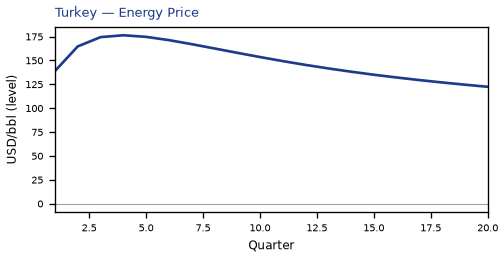

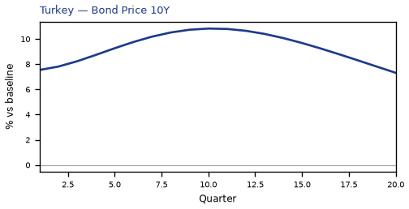

[Q1–Q20 JSON for Turkey](numbers/TR.json)

## IN — India

The main impact of oil at $200 a barrel on India is a large drop in GDP of 5.39% by Q12. This is a model impulse response versus baseline, not a forecast. Equities soften 14.22% by Q11. The three-year CPI impulse is +2.10 percentage points.

Demand and trade. Private investment falls 14.95% by Q8; government debt falls 10.04% by Q20; the trade balance (net exports — this model does not split imports from exports) softens to -4.64% in Q4; household consumption falls 3.26% by Q12; related moves also show up in government spending.

Labour. Real wages fall 7.90% by Q20; employment falls 4.68% by Q18; unemployment rises by +0.38 percentage points in Q13.

Prices. Firms' marginal cost falls 3.19% by Q12; CPI inflation rises 0.58 percentage points by Q3; domestic inflation rises 0.41 percentage points by Q3.

Policy rates and the government curve. 10-year bond prices rally 14.69% by Q12; benchmark bond prices rally 14.56% by Q20; 30-year bond prices rally 12.81% by Q11; 5-year bond prices rally 11.18% by Q14; related moves also show up in 2-year bond prices, the local policy rate, 3-month government yields.

Exchange rates. The NEER prints a trade-weighted depreciation (-7.31% in Q14); the real exchange rate shows a real depreciation (a weaker, more competitive home currency), peaking at +5.76% in Q15; the home currency is weaker versus the dollar (+5.43% in Q14).

Equities and risk. Global VIX moves to 23.1 in Q6 (baseline 15); equity prices fall 14.22% by Q11; Tobin's Q (the value of installed capital) falls 10.47% by Q8.

Housing and credit. House prices fall 6.97% by Q18; bank equity falls 1.13% by Q16; bank credit supply falls 0.99% by Q16.

Commodities. Gold prices move to $2444 in Q8; the energy price moves to $176 a barrel in Q4; the food price index moves to 112.5 in Q8; the gas price moves to $7.04 per mmBtu in Q4; the metals price index moves to 91.5 in Q14; the copper price index moves to 93.1 in Q14; the wheat price index moves to 94.9 in Q14.

Sectors and capital. Manufacturing output falls 4.61% by Q11; services output falls 2.96% by Q12; the capital stock falls 1.13% by Q20.

By Q20, GDP is still -3.22% from baseline.

These figures are model IRFs versus baseline, not forecasts and not financial advice.

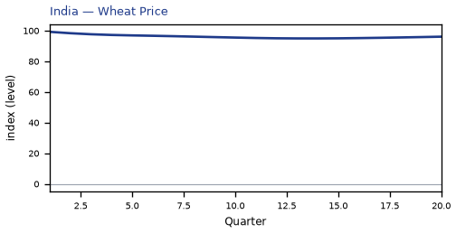

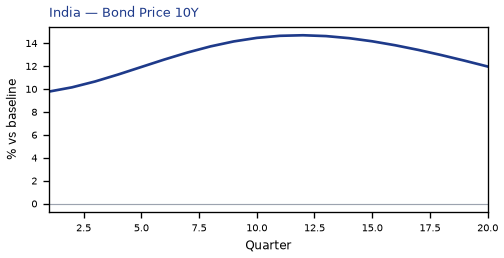

[Q1–Q20 JSON for India](numbers/IN.json)

## KR — South Korea

The main impact of oil at $200 a barrel on South Korea is a large drop in GDP of 5.32% by Q11. This is a model impulse response versus baseline, not a forecast. Equities soften 13.22% by Q10. The three-year CPI impulse is +3.24 percentage points.

Demand and trade. Private investment falls 14.33% by Q9; the trade balance (net exports — this model does not split imports from exports) softens to -5.47% in Q4; government debt falls 3.75% by Q20; household consumption falls 3.33% by Q11; related moves also show up in government spending.

Labour. Real wages fall 6.21% by Q20; employment falls 5.08% by Q15; unemployment rises by +2.05 percentage points in Q13.

Prices. Firms' marginal cost falls 3.15% by Q11; CPI inflation rises 0.65 percentage points by Q2; domestic inflation rises 0.45 percentage points by Q2.

Policy rates and the government curve. 10-year bond prices rally 13.39% by Q12; 30-year bond prices rally 13.01% by Q10; benchmark bond prices rally 11.70% by Q20; 5-year bond prices rally 9.35% by Q14; related moves also show up in 2-year bond prices, the local policy rate, 3-month government yields.

Exchange rates. The home currency is weaker versus the dollar (+10.55% in Q5); the real exchange rate shows a real depreciation (a weaker, more competitive home currency), peaking at +9.72% in Q5; the NEER prints a trade-weighted depreciation (-9.34% in Q5).

Equities and risk. Global VIX moves to 23.1 in Q6 (baseline 15); equity prices fall 13.22% by Q10; Tobin's Q (the value of installed capital) falls 10.03% by Q9.

Housing and credit. House prices fall 6.37% by Q20; bank equity falls 1.70% by Q16; bank credit supply falls 1.35% by Q16.

Commodities. Gold prices move to $2444 in Q8; the energy price moves to $176 a barrel in Q4; the food price index moves to 112.5 in Q8; the gas price moves to $7.04 per mmBtu in Q4; the metals price index moves to 91.5 in Q14; the copper price index moves to 93.1 in Q14; the wheat price index moves to 94.9 in Q14.

Sectors and capital. Manufacturing output falls 7.51% by Q4; services output falls 3.22% by Q11; the capital stock falls 1.13% by Q20.

By Q20, GDP is still -3.44% from baseline.

These figures are model IRFs versus baseline, not forecasts and not financial advice.

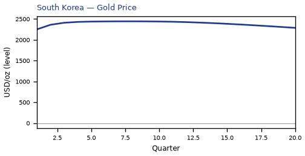

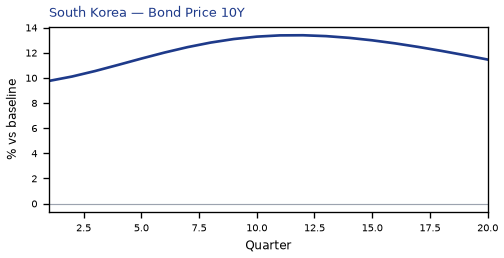

[Q1–Q20 JSON for South Korea](numbers/KR.json)

## DE — Germany

The main impact of oil at $200 a barrel on Germany is a large drop in GDP of 4.68% by Q13. This is a model impulse response versus baseline, not a forecast. Equities soften 9.06% by Q12. The three-year CPI impulse is +3.22 percentage points.

Demand and trade. Private investment falls 13.76% by Q12; the trade balance (net exports — this model does not split imports from exports) softens to -3.18% in Q4; household consumption falls 2.64% by Q13; government spending rises 1.04% by Q13; related moves also show up in government debt.

Labour. Employment falls 4.58% by Q17; real wages fall 3.43% by Q20; unemployment rises by +3.23 percentage points in Q16.

Prices. Firms' marginal cost falls 2.77% by Q13; CPI inflation rises 0.86 percentage points by Q2; domestic inflation rises 0.60 percentage points by Q2.

Policy rates and the government curve. Benchmark bond prices cheapen 12.07% by Q6; 10-year bond prices rally 6.33% by Q16; 30-year bond prices rally 6.13% by Q15; 5-year bond prices rally 4.36% by Q19; related moves also show up in 2-year bond prices, the local policy rate, 3-month government yields.

Exchange rates. The home currency is weaker versus the dollar (+6.84% in Q4); the real exchange rate shows a real depreciation (a weaker, more competitive home currency), peaking at +6.03% in Q4; the NEER prints a trade-weighted depreciation (-4.41% in Q4).

Equities and risk. Global VIX moves to 23.1 in Q6 (baseline 15); Tobin's Q (the value of installed capital) falls 9.63% by Q12; equity prices fall 9.06% by Q12.

Housing and credit. House prices fall 5.96% by Q20; bank equity falls 1.94% by Q17; bank credit supply falls 1.57% by Q17.

Commodities. Gold prices move to $2444 in Q8; the energy price moves to $176 a barrel in Q4; the food price index moves to 112.5 in Q8; the gas price moves to $7.04 per mmBtu in Q4; the metals price index moves to 91.5 in Q14; the copper price index moves to 93.1 in Q14; the wheat price index moves to 94.9 in Q14.

Sectors and capital. Manufacturing output falls 5.31% by Q4; services output falls 3.19% by Q13; the capital stock falls 1.14% by Q20.

By Q20, GDP is still -3.52% from baseline.

These figures are model IRFs versus baseline, not forecasts and not financial advice.

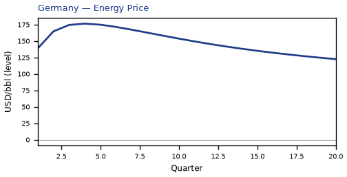

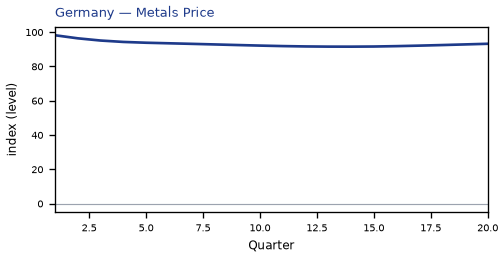

[Q1–Q20 JSON for Germany](numbers/DE.json)

## JP — Japan

The main impact of oil at $200 a barrel on Japan is a large drop in GDP of 4.67% by Q11. This is a model impulse response versus baseline, not a forecast. Equities soften 12.83% by Q11. The three-year CPI impulse is +2.11 percentage points.

Demand and trade. Private investment falls 13.39% by Q11; the trade balance (net exports — this model does not split imports from exports) softens to -4.53% in Q4; household consumption falls 3.12% by Q11; government debt falls 1.78% by Q20; related moves also show up in government spending.

Labour. Employment falls 4.74% by Q14; unemployment rises by +3.22 percentage points in Q14; real wages rise 1.18% by Q11.

Prices. Firms' marginal cost falls 2.76% by Q11; CPI inflation rises 0.64 percentage points by Q2; domestic inflation rises 0.45 percentage points by Q2.

Policy rates and the government curve. Benchmark bond prices rally 3.65% by Q20; 30-year bond prices rally 2.85% by Q19; 10-year bond prices rally 1.95% by Q20; 5-year bond prices rally 1.00% by Q20; related moves also show up in 2-year bond prices, the local policy rate, 3-month government yields.

Exchange rates. The home currency is weaker versus the dollar (+11.33% in Q4); the NEER prints a trade-weighted depreciation (-10.58% in Q4); the real exchange rate shows a real depreciation (a weaker, more competitive home currency), peaking at +10.52% in Q4.

Equities and risk. Global VIX moves to 23.1 in Q6 (baseline 15); equity prices fall 12.83% by Q11; Tobin's Q (the value of installed capital) falls 9.37% by Q11.

Housing and credit. House prices fall 5.51% by Q20; bank equity falls 2.05% by Q16; bank credit supply falls 1.61% by Q16.

Commodities. Gold prices move to $2444 in Q8; the energy price moves to $176 a barrel in Q4; the food price index moves to 112.5 in Q8; the gas price moves to $7.04 per mmBtu in Q4; the metals price index moves to 91.5 in Q14; the copper price index moves to 93.1 in Q14; the wheat price index moves to 94.9 in Q14.

Sectors and capital. Manufacturing output falls 6.80% by Q4; services output falls 3.24% by Q11; the capital stock falls 1.12% by Q20.

By Q20, GDP is still -3.45% from baseline.

These figures are model IRFs versus baseline, not forecasts and not financial advice.

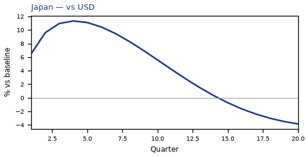

[Q1–Q20 JSON for Japan](numbers/JP.json)

## IT — Italy

The main impact of oil at $200 a barrel on Italy is a large drop in GDP of 4.34% by Q13. This is a model impulse response versus baseline, not a forecast. Equities soften 7.37% by Q12. The three-year CPI impulse is +3.14 percentage points.

Demand and trade. Private investment falls 12.70% by Q10; the trade balance (net exports — this model does not split imports from exports) softens to -3.32% in Q4; household consumption falls 2.26% by Q13; government spending rises 0.93% by Q13; related moves also show up in government debt.

Labour. Employment falls 4.49% by Q18; unemployment rises by +1.76 percentage points in Q15; real wages fall 1.30% by Q20.

Prices. Firms' marginal cost falls 2.56% by Q13; CPI inflation rises 0.73 percentage points by Q2; domestic inflation rises 0.51 percentage points by Q2.

Policy rates and the government curve. Benchmark bond prices cheapen 11.98% by Q6; 10-year bond prices rally 6.33% by Q16; 30-year bond prices rally 6.13% by Q15; 5-year bond prices rally 4.36% by Q19; related moves also show up in 2-year bond prices, the local policy rate, 3-month government yields.

Exchange rates. The home currency is weaker versus the dollar (+7.97% in Q4); the real exchange rate shows a real depreciation (a weaker, more competitive home currency), peaking at +7.17% in Q4; the NEER prints a trade-weighted depreciation (-4.73% in Q4).

Equities and risk. Global VIX moves to 23.1 in Q6 (baseline 15); Tobin's Q (the value of installed capital) falls 8.89% by Q10; equity prices fall 7.37% by Q12.

Housing and credit. House prices fall 5.36% by Q20; bank equity falls 1.53% by Q17; bank credit supply falls 1.28% by Q17.

Commodities. Gold prices move to $2444 in Q8; the energy price moves to $176 a barrel in Q4; the food price index moves to 112.5 in Q8; the gas price moves to $7.04 per mmBtu in Q4; the metals price index moves to 91.5 in Q14; the copper price index moves to 93.1 in Q14; the wheat price index moves to 94.9 in Q14.

Sectors and capital. Manufacturing output falls 5.00% by Q4; services output falls 3.15% by Q13; the capital stock falls 1.08% by Q20.

By Q20, GDP is still -3.33% from baseline.

These figures are model IRFs versus baseline, not forecasts and not financial advice.

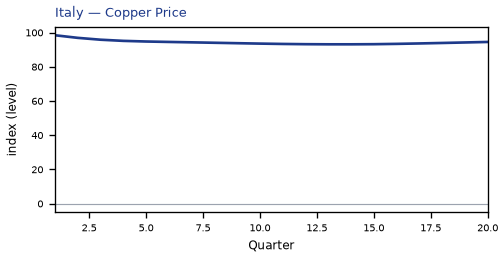

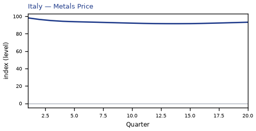

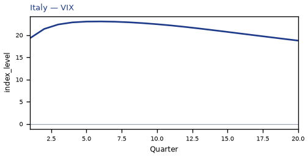

[Q1–Q20 JSON for Italy](numbers/IT.json)

## PL — Poland

The main impact of oil at $200 a barrel on Poland is a large drop in GDP of 4.22% by Q14. This is a model impulse response versus baseline, not a forecast. Equities soften 6.91% by Q12. The three-year CPI impulse is +2.44 percentage points.

Demand and trade. Private investment falls 11.70% by Q9; the trade balance (net exports — this model does not split imports from exports) softens to -2.24% in Q4; household consumption falls 2.23% by Q14; government spending rises 0.83% by Q14; government debt stays close to baseline.

Labour. Real wages fall 4.48% by Q20; employment falls 4.35% by Q17; unemployment rises by +1.70 percentage points in Q16.

Prices. Firms' marginal cost falls 2.50% by Q14; CPI inflation rises 0.59 percentage points by Q2; domestic inflation rises 0.42 percentage points by Q2.

Policy rates and the government curve. Benchmark bond prices cheapen 8.44% by Q5; 10-year bond prices rally 7.33% by Q14; 30-year bond prices rally 6.99% by Q13; 5-year bond prices rally 5.17% by Q17; related moves also show up in 2-year bond prices, the local policy rate, 3-month government yields.

Exchange rates. The home currency is weaker versus the dollar (+5.50% in Q3); the real exchange rate shows a real depreciation (a weaker, more competitive home currency), peaking at +4.79% in Q3; the NEER prints a trade-weighted depreciation (-3.04% in Q3).

Equities and risk. Global VIX moves to 23.1 in Q6 (baseline 15); Tobin's Q (the value of installed capital) falls 8.19% by Q9; equity prices fall 6.91% by Q12.

Housing and credit. House prices fall 5.40% by Q20; bank equity falls 1.00% by Q18; bank credit supply falls 0.90% by Q18.

Commodities. Gold prices move to $2444 in Q8; the energy price moves to $176 a barrel in Q4; the food price index moves to 112.5 in Q8; the gas price moves to $7.04 per mmBtu in Q4; the metals price index moves to 91.5 in Q14; the copper price index moves to 93.1 in Q14; the wheat price index moves to 94.9 in Q14.

Sectors and capital. Manufacturing output falls 4.91% by Q4; services output falls 2.64% by Q14; the capital stock falls 1.01% by Q20.

By Q20, GDP is still -3.24% from baseline.

These figures are model IRFs versus baseline, not forecasts and not financial advice.

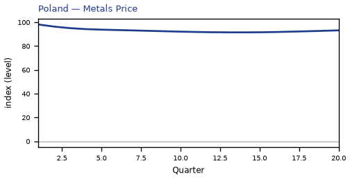

[Q1–Q20 JSON for Poland](numbers/PL.json)

## ES — Spain

The main impact of oil at $200 a barrel on Spain is a large drop in GDP of 4.08% by Q13. This is a model impulse response versus baseline, not a forecast. Equities soften 7.67% by Q13. The three-year CPI impulse is +2.71 percentage points.

Demand and trade. Private investment falls 11.93% by Q10; the trade balance (net exports — this model does not split imports from exports) softens to -3.30% in Q4; household consumption falls 2.32% by Q14; government spending rises 0.88% by Q14; related moves also show up in government debt.

Labour. Employment falls 4.18% by Q18; unemployment rises by +1.94 percentage points in Q16; real wages fall 1.94% by Q20.

Prices. Firms' marginal cost falls 2.42% by Q14; CPI inflation rises 0.66 percentage points by Q2; domestic inflation rises 0.46 percentage points by Q2.

Policy rates and the government curve. Benchmark bond prices cheapen 12.07% by Q6; 10-year bond prices rally 6.33% by Q16; 30-year bond prices rally 6.13% by Q15; 5-year bond prices rally 4.36% by Q19; related moves also show up in 2-year bond prices, the local policy rate, 3-month government yields.

Exchange rates. The home currency is weaker versus the dollar (+6.65% in Q4); the real exchange rate shows a real depreciation (a weaker, more competitive home currency), peaking at +5.85% in Q4; the NEER prints a trade-weighted depreciation (-4.54% in Q4).

Equities and risk. Global VIX moves to 23.1 in Q6 (baseline 15); Tobin's Q (the value of installed capital) falls 8.35% by Q10; equity prices fall 7.67% by Q13.

Housing and credit. House prices fall 5.17% by Q20; bank equity falls 1.30% by Q17; bank credit supply falls 1.05% by Q17.

Commodities. Gold prices move to $2444 in Q8; the energy price moves to $176 a barrel in Q4; the food price index moves to 112.5 in Q8; the gas price moves to $7.04 per mmBtu in Q4; the metals price index moves to 91.5 in Q14; the copper price index moves to 93.1 in Q14; the wheat price index moves to 94.9 in Q14.

Sectors and capital. Manufacturing output falls 4.29% by Q4; services output falls 3.01% by Q13; the capital stock falls 1.03% by Q20.

By Q20, GDP is still -3.26% from baseline.

These figures are model IRFs versus baseline, not forecasts and not financial advice.

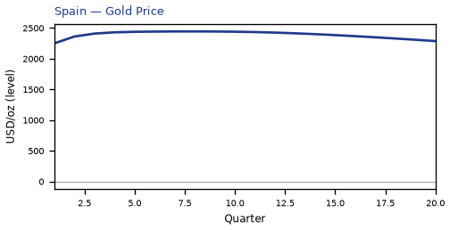

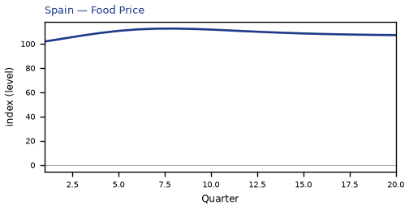

[Q1–Q20 JSON for Spain](numbers/ES.json)

## TH — Thailand

The main impact of oil at $200 a barrel on Thailand is a large drop in GDP of 4.05% by Q13. This is a model impulse response versus baseline, not a forecast. Equities soften 9.61% by Q13. The three-year CPI impulse is +2.67 percentage points.

Demand and trade. Private investment falls 10.56% by Q9; government debt falls 6.85% by Q20; household consumption falls 2.66% by Q13; the trade balance (net exports — this model does not split imports from exports) softens to -2.52% in Q3; related moves also show up in government spending.

Labour. Real wages fall 5.20% by Q20; employment falls 4.28% by Q16; unemployment rises by +0.39 percentage points in Q14.

Prices. Firms' marginal cost falls 2.40% by Q13; CPI inflation rises 0.60 percentage points by Q2; domestic inflation rises 0.42 percentage points by Q2.

Policy rates and the government curve. 10-year bond prices rally 10.46% by Q13; 30-year bond prices rally 10.40% by Q11; benchmark bond prices rally 7.37% by Q20; 5-year bond prices rally 7.23% by Q16; related moves also show up in 2-year bond prices, 2-year government yields, the local policy rate.

Exchange rates. The home currency is weaker versus the dollar (+2.33% in Q4); the real exchange rate shows a real depreciation (a weaker, more competitive home currency), peaking at +1.54% in Q3; the NEER prints a trade-weighted appreciation (+0.74% in Q6).

Equities and risk. Global VIX moves to 23.1 in Q6 (baseline 15); equity prices fall 9.61% by Q13; Tobin's Q (the value of installed capital) falls 7.39% by Q9.

Housing and credit. House prices fall 6.39% by Q20; bank equity falls 1.04% by Q17; bank credit supply falls 0.85% by Q17.

Commodities. Gold prices move to $2444 in Q8; the energy price moves to $176 a barrel in Q4; the food price index moves to 112.5 in Q8; the gas price moves to $7.04 per mmBtu in Q4; the metals price index moves to 91.5 in Q14; the copper price index moves to 93.1 in Q14; the wheat price index moves to 94.9 in Q14.

Sectors and capital. Manufacturing output falls 4.30% by Q4; services output falls 2.23% by Q13; the capital stock falls 0.90% by Q20.

By Q20, GDP is still -3.07% from baseline.

These figures are model IRFs versus baseline, not forecasts and not financial advice.

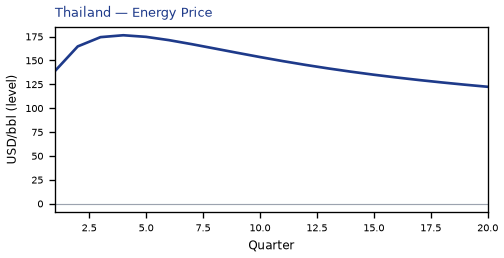

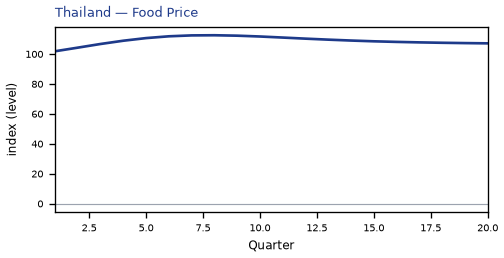

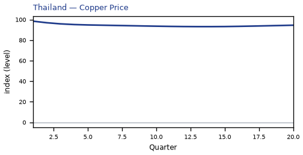

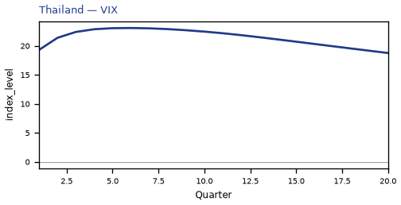

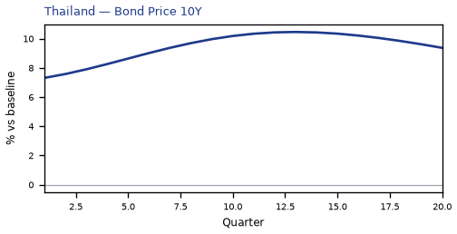

[Q1–Q20 JSON for Thailand](numbers/TH.json)

## FR — France

The main impact of oil at $200 a barrel on France is a large drop in GDP of 3.94% by Q15. This is a model impulse response versus baseline, not a forecast. Equities soften 8.41% by Q14. The three-year CPI impulse is +2.85 percentage points.

Demand and trade. Private investment falls 11.32% by Q10; government debt rises 3.53% by Q20; household consumption falls 2.14% by Q15; the trade balance (net exports — this model does not split imports from exports) softens to -2.02% in Q4; related moves also show up in government spending.

Labour. Employment falls 3.91% by Q19; unemployment rises by +2.76 percentage points in Q17; real wages fall 1.54% by Q20.

Prices. Firms' marginal cost falls 2.34% by Q15; CPI inflation rises 0.70 percentage points by Q2; domestic inflation rises 0.49 percentage points by Q2.

Policy rates and the government curve. Benchmark bond prices cheapen 12.07% by Q6; 10-year bond prices rally 6.33% by Q16; 30-year bond prices rally 6.13% by Q15; 5-year bond prices rally 4.36% by Q19; related moves also show up in 2-year bond prices, the local policy rate, 3-month government yields.

Exchange rates. The home currency is weaker versus the dollar (+6.78% in Q4); the real exchange rate shows a real depreciation (a weaker, more competitive home currency), peaking at +5.97% in Q4; the NEER prints a trade-weighted depreciation (-3.13% in Q4).

Equities and risk. Global VIX moves to 23.1 in Q6 (baseline 15); equity prices fall 8.41% by Q14; Tobin's Q (the value of installed capital) falls 7.93% by Q10.

Housing and credit. House prices fall 4.94% by Q20; bank equity falls 1.69% by Q17; bank credit supply falls 1.35% by Q17.

Commodities. Gold prices move to $2444 in Q8; the energy price moves to $176 a barrel in Q4; the food price index moves to 112.5 in Q8; the gas price moves to $7.04 per mmBtu in Q4; the metals price index moves to 91.5 in Q14; the copper price index moves to 93.1 in Q14; the wheat price index moves to 94.9 in Q14.

Sectors and capital. Manufacturing output falls 4.01% by Q4; services output falls 3.03% by Q15; the capital stock falls 0.97% by Q20.

By Q20, GDP is still -3.19% from baseline.

These figures are model IRFs versus baseline, not forecasts and not financial advice.

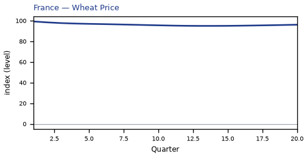

[Q1–Q20 JSON for France](numbers/FR.json)

## RU — Russia

The main impact of oil at $200 a barrel on Russia is a large rise in GDP of 3.83% by Q1. This is a model impulse response versus baseline, not a forecast. Equities firm 6.53% by Q1. The three-year CPI impulse is +3.73 percentage points.

Demand and trade. The trade balance (net exports — this model does not split imports from exports) improves to +17.27% in Q4; private investment rises 10.03% by Q1; government spending rises 5.07% by Q4; household consumption rises 2.02% by Q4; related moves also show up in government debt.

Labour. Real wages rise 7.23% by Q20; employment rises 3.00% by Q9; unemployment eases by -1.22 percentage points in Q7.

Prices. Firms' marginal cost rises 2.31% by Q1; CPI inflation rises 0.50 percentage points by Q3; domestic inflation rises 0.35 percentage points by Q3.

Policy rates and the government curve. Benchmark bond prices cheapen 7.55% by Q6; 10-year bond prices cheapen 6.48% by Q1; 5-year bond prices cheapen 6.07% by Q1; 30-year bond prices cheapen 4.84% by Q1; related moves also show up in 2-year bond prices, the local policy rate, 3-month government yields.

Exchange rates. The NEER prints a trade-weighted appreciation (+24.73% in Q5); the real exchange rate shows a real appreciation (a stronger home currency), peaking at -21.01% in Q5; the home currency is stronger versus the dollar (-20.18% in Q5).

Equities and risk. Global VIX moves to 23.1 in Q6 (baseline 15); Tobin's Q (the value of installed capital) rises 7.02% by Q1; equity prices rise 6.53% by Q1.

Housing and credit. House prices rise 3.60% by Q16; bank equity rises 0.41% by Q20; bank credit supply rises 0.12% by Q20.

Commodities. Gold prices move to $2444 in Q8; the energy price moves to $176 a barrel in Q4; the food price index moves to 112.5 in Q8; the gas price moves to $7.04 per mmBtu in Q4; the metals price index moves to 91.5 in Q14; the copper price index moves to 93.1 in Q14; the wheat price index moves to 94.9 in Q14.

Sectors and capital. Manufacturing output rises 5.10% by Q5; services output rises 2.11% by Q1; the capital stock rises 0.50% by Q20.

By Q20, GDP is still +1.34% from baseline.

These figures are model IRFs versus baseline, not forecasts and not financial advice.

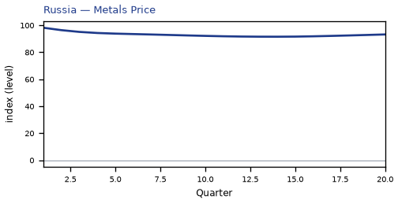

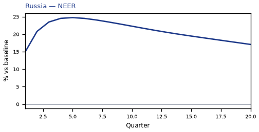

[Q1–Q20 JSON for Russia](numbers/RU.json)

## SA — Saudi Arabia

The main impact of oil at $200 a barrel on Saudi Arabia is a large rise in GDP of 3.82% by Q1. This is a model impulse response versus baseline, not a forecast. Equities firm 15.90% by Q20. The three-year CPI impulse is +3.35 percentage points.

Demand and trade. The trade balance (net exports — this model does not split imports from exports) improves to +29.64% in Q4; private investment rises 13.05% by Q20; government spending rises 11.36% by Q4; government debt rises 9.33% by Q20; related moves also show up in household consumption.

Labour. Real wages rise 6.59% by Q20; employment rises 4.26% by Q20; unemployment eases by -1.52 percentage points in Q20.

Prices. Firms' marginal cost rises 2.30% by Q1; CPI inflation rises 0.42 percentage points by Q3; domestic inflation rises 0.29 percentage points by Q3.

Policy rates and the government curve. Benchmark bond prices cheapen 8.11% by Q5; 10-year bond prices rally 6.93% by Q12; 30-year bond prices rally 5.90% by Q11; 5-year bond prices rally 5.66% by Q14; related moves also show up in 2-year bond prices, the local policy rate, 3-month government yields.

Exchange rates. The NEER prints a trade-weighted appreciation (+2.34% in Q8); the real exchange rate shows a real appreciation (a stronger home currency), peaking at -0.80% in Q9; the home currency is stronger versus the dollar (-0.78% in Q14).

Equities and risk. Global VIX moves to 23.1 in Q6 (baseline 15); equity prices rise 15.90% by Q20; Tobin's Q (the value of installed capital) rises 9.14% by Q20.

Housing and credit. House prices rise 6.26% by Q20; bank equity rises 0.48% by Q20; bank credit supply rises 0.15% by Q20.

Commodities. Gold prices move to $2444 in Q8; the energy price moves to $176 a barrel in Q4; the food price index moves to 112.5 in Q8; the gas price moves to $7.04 per mmBtu in Q4; the metals price index moves to 91.5 in Q14; the copper price index moves to 93.1 in Q14; the wheat price index moves to 94.9 in Q14.

Sectors and capital. Services output rises 1.68% by Q1; the capital stock rises 1.00% by Q20; manufacturing output falls 0.79% by Q3.

By Q20, GDP is still +3.78% from baseline.

These figures are model IRFs versus baseline, not forecasts and not financial advice.

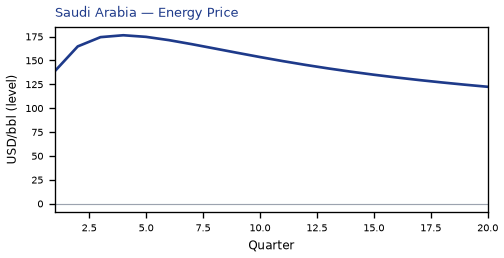

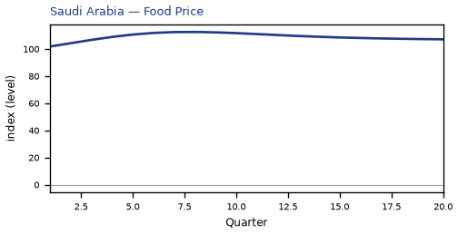

[Q1–Q20 JSON for Saudi Arabia](numbers/SA.json)

## NO — Norway

The main impact of oil at $200 a barrel on Norway is a large rise in GDP of 3.78% by Q1. This is a model impulse response versus baseline, not a forecast. Equities firm 8.14% by Q1. The three-year CPI impulse is +0.94 percentage points.

Demand and trade. The trade balance (net exports — this model does not split imports from exports) improves to +17.28% in Q4; private investment rises 9.71% by Q1; government spending rises 7.37% by Q4; household consumption rises 2.09% by Q5; related moves also show up in government debt.

Labour. Real wages rise 3.94% by Q20; employment rises 3.33% by Q18; unemployment eases by -1.90 percentage points in Q9.

Prices. Firms' marginal cost rises 2.28% by Q1; CPI inflation rises 0.39 percentage points by Q2; domestic inflation rises 0.27 percentage points by Q2.

Policy rates and the government curve. Benchmark bond prices cheapen 14.83% by Q6; 10-year bond prices cheapen 10.86% by Q2; 30-year bond prices cheapen 10.68% by Q1; 5-year bond prices cheapen 7.59% by Q2; related moves also show up in 2-year bond prices, the local policy rate, 3-month government yields.

Exchange rates. The NEER prints a trade-weighted appreciation (+45.88% in Q4); the real exchange rate shows a real appreciation (a stronger home currency), peaking at -45.02% in Q4; the home currency is stronger versus the dollar (-44.21% in Q4).

Equities and risk. Global VIX moves to 23.1 in Q6 (baseline 15); equity prices rise 8.14% by Q1; Tobin's Q (the value of installed capital) rises 6.80% by Q1.

Housing and credit. House prices rise 4.26% by Q20; bank equity rises 0.62% by Q20; bank credit supply rises 0.24% by Q20.

Commodities. Gold prices move to $2444 in Q8; the energy price moves to $176 a barrel in Q4; the food price index moves to 112.5 in Q8; the gas price moves to $7.04 per mmBtu in Q4; the metals price index moves to 91.5 in Q14; the copper price index moves to 93.1 in Q14; the wheat price index moves to 94.9 in Q14.

Sectors and capital. Manufacturing output rises 12.42% by Q5; services output rises 2.16% by Q1; the capital stock rises 0.64% by Q20.

By Q20, GDP is still +2.71% from baseline.

These figures are model IRFs versus baseline, not forecasts and not financial advice.

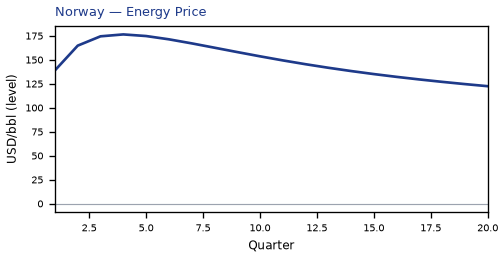

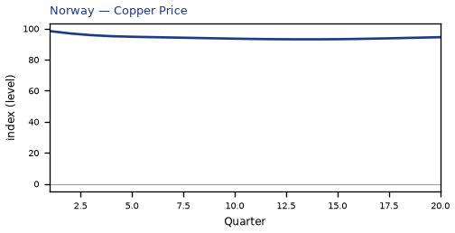

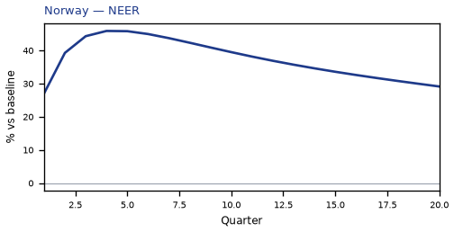

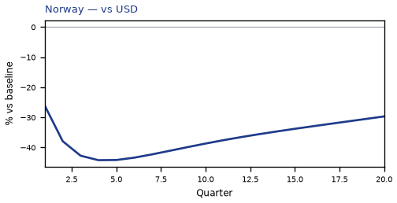

[Q1–Q20 JSON for Norway](numbers/NO.json)

## AR — Argentina

The main impact of oil at $200 a barrel on Argentina is a large drop in GDP of 3.72% by Q13. This is a model impulse response versus baseline, not a forecast. Equities soften 5.56% by Q10. The three-year CPI impulse is +1.37 percentage points.

Demand and trade. Private investment falls 8.49% by Q9; government debt falls 3.35% by Q20; the trade balance (net exports — this model does not split imports from exports) improves to +2.07% in Q7; household consumption falls 1.89% by Q14; related moves also show up in government spending.

Labour. Real wages fall 7.17% by Q20; employment falls 3.70% by Q18; unemployment rises by +0.73 percentage points in Q15.

Prices. Firms' marginal cost falls 2.21% by Q13; CPI inflation falls 0.63 percentage points by Q18; domestic inflation falls 0.44 percentage points by Q18.

Policy rates and the government curve. 10-year bond prices rally 10.10% by Q9; 5-year bond prices rally 9.64% by Q11; 30-year bond prices rally 8.42% by Q9; benchmark bond prices rally 7.17% by Q18; related moves also show up in 2-year bond prices, the local policy rate, 3-month government yields.

Exchange rates. The NEER prints a trade-weighted depreciation (-3.80% in Q10); the home currency is weaker versus the dollar (+3.15% in Q10); the real exchange rate shows a real depreciation (a weaker, more competitive home currency), peaking at +3.07% in Q12.

Equities and risk. Global VIX moves to 23.1 in Q6 (baseline 15); Tobin's Q (the value of installed capital) falls 5.94% by Q9; equity prices fall 5.56% by Q10.

Housing and credit. House prices fall 4.17% by Q19; bank credit supply falls 0.32% by Q18; bank equity falls 0.16% by Q18; lending spreads rise 0.09 percentage points by Q18.

Commodities. Gold prices move to $2444 in Q8; the energy price moves to $176 a barrel in Q4; the food price index moves to 112.5 in Q8; the gas price moves to $7.04 per mmBtu in Q4; the metals price index moves to 91.5 in Q14; the copper price index moves to 93.1 in Q14; the wheat price index moves to 94.9 in Q14.

Sectors and capital. Manufacturing output falls 3.00% by Q10; services output falls 2.13% by Q13; the capital stock falls 0.60% by Q20.

By Q20, GDP is still -2.14% from baseline.

These figures are model IRFs versus baseline, not forecasts and not financial advice.

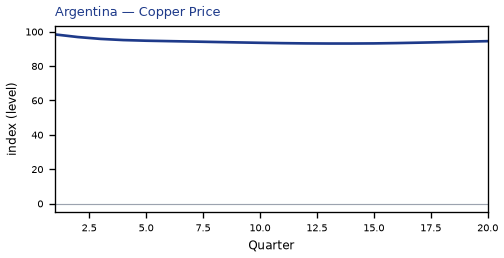

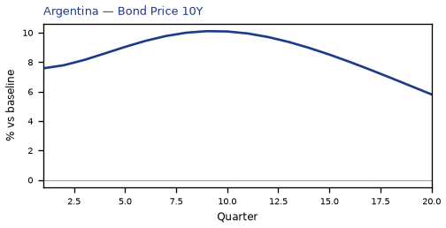

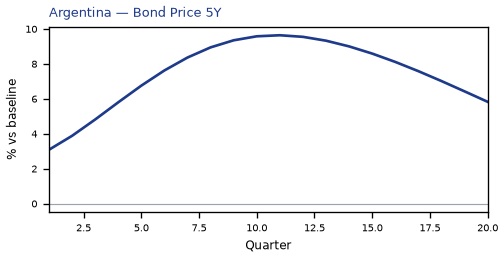

[Q1–Q20 JSON for Argentina](numbers/AR.json)

## ZA — South Africa

The main impact of oil at $200 a barrel on South Africa is a large drop in GDP of 3.69% by Q15. This is a model impulse response versus baseline, not a forecast. Equities soften 13.92% by Q13. The three-year CPI impulse is +1.77 percentage points.

Demand and trade. Private investment falls 10.14% by Q8; government debt falls 3.75% by Q20; the trade balance (net exports — this model does not split imports from exports) softens to -2.64% in Q4; household consumption falls 2.19% by Q16; related moves also show up in government spending.

Labour. Real wages fall 4.92% by Q20; employment falls 4.05% by Q18; unemployment rises by +0.89 percentage points in Q16.

Prices. Firms' marginal cost falls 2.19% by Q15; CPI inflation rises 0.46 percentage points by Q2; domestic inflation rises 0.32 percentage points by Q2.

Policy rates and the government curve. Benchmark bond prices cheapen 7.41% by Q5; 10-year bond prices rally 7.18% by Q13; 30-year bond prices rally 6.52% by Q12; 5-year bond prices rally 5.42% by Q15; related moves also show up in 2-year bond prices, the local policy rate, 3-month government yields.

Exchange rates. The home currency is weaker versus the dollar (+5.70% in Q4); the real exchange rate shows a real depreciation (a weaker, more competitive home currency), peaking at +4.90% in Q4; the NEER prints a trade-weighted depreciation (-2.99% in Q3).

Equities and risk. Global VIX moves to 23.1 in Q6 (baseline 15); equity prices fall 13.92% by Q13; Tobin's Q (the value of installed capital) falls 7.09% by Q8.

Housing and credit. House prices fall 5.38% by Q20; bank equity falls 0.89% by Q17; bank credit supply falls 0.77% by Q17.

Commodities. Gold prices move to $2444 in Q8; the energy price moves to $176 a barrel in Q4; the food price index moves to 112.5 in Q8; the gas price moves to $7.04 per mmBtu in Q4; the metals price index moves to 91.5 in Q14; the copper price index moves to 93.1 in Q14; the wheat price index moves to 94.9 in Q14.

Sectors and capital. Manufacturing output falls 3.65% by Q4; services output falls 2.36% by Q15; the capital stock falls 0.86% by Q20.

By Q20, GDP is still -2.85% from baseline.

These figures are model IRFs versus baseline, not forecasts and not financial advice.

[Q1–Q20 JSON for South Africa](numbers/ZA.json)

## CN — China

The main impact of oil at $200 a barrel on China is a large drop in GDP of 3.37% by Q13. This is a model impulse response versus baseline, not a forecast. Equities soften 6.86% by Q10. The three-year CPI impulse is +2.68 percentage points.

Demand and trade. Private investment falls 8.49% by Q4; government debt falls 5.78% by Q20; the trade balance (net exports — this model does not split imports from exports) softens to -3.33% in Q4; household consumption falls 2.55% by Q14; related moves also show up in government spending.

Labour. Real wages fall 5.36% by Q20; employment falls 3.10% by Q18; unemployment rises by +0.77 percentage points in Q15.

Prices. Firms' marginal cost falls 2.00% by Q13; CPI inflation rises 0.71 percentage points by Q2; domestic inflation rises 0.50 percentage points by Q2.

Policy rates and the government curve. 10-year bond prices rally 18.09% by Q12; 30-year bond prices rally 17.62% by Q8; benchmark bond prices rally 14.48% by Q20; 5-year bond prices rally 12.28% by Q16; related moves also show up in 2-year bond prices, 2-year government yields, the local policy rate.

Exchange rates. The NEER prints a trade-weighted depreciation (-5.06% in Q20); the real exchange rate shows a real depreciation (a weaker, more competitive home currency), peaking at +4.07% in Q20; the home currency is weaker versus the dollar (+3.81% in Q6).

Equities and risk. Global VIX moves to 23.1 in Q6 (baseline 15); equity prices fall 6.86% by Q10; Tobin's Q (the value of installed capital) falls 5.94% by Q4.

Housing and credit. House prices fall 4.49% by Q19; bank equity falls 1.04% by Q16; bank credit supply falls 0.80% by Q16.

Commodities. Gold prices move to $2444 in Q8; the energy price moves to $176 a barrel in Q4; the food price index moves to 112.5 in Q8; the gas price moves to $7.04 per mmBtu in Q4; the metals price index moves to 91.5 in Q14; the copper price index moves to 93.1 in Q14; the wheat price index moves to 94.9 in Q14.

Sectors and capital. Manufacturing output falls 4.97% by Q4; services output falls 1.96% by Q13; the capital stock falls 0.65% by Q20.

By Q20, GDP is still -2.53% from baseline.

These figures are model IRFs versus baseline, not forecasts and not financial advice.

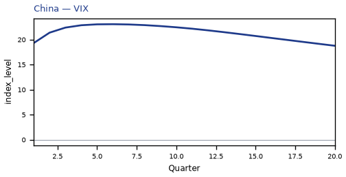

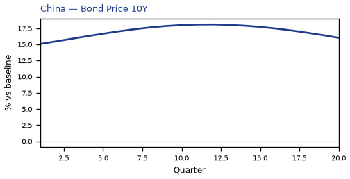

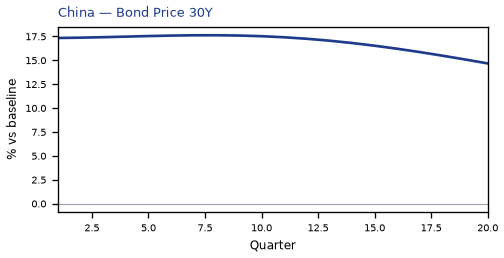

[Q1–Q20 JSON for China](numbers/CN.json)

## CL — Chile

The main impact of oil at $200 a barrel on Chile is a large drop in GDP of 3.29% by Q15. This is a model impulse response versus baseline, not a forecast. Equities soften 6.98% by Q11. The three-year CPI impulse is +1.31 percentage points.

Demand and trade. Private investment falls 9.36% by Q8; government debt falls 3.58% by Q20; the trade balance (net exports — this model does not split imports from exports) softens to -2.92% in Q5; household consumption falls 2.10% by Q17; related moves also show up in government spending.

Labour. Real wages fall 4.61% by Q20; employment falls 3.63% by Q18; unemployment rises by +1.18 percentage points in Q17.

Prices. Firms' marginal cost falls 1.95% by Q15; CPI inflation rises 0.44 percentage points by Q2; domestic inflation rises 0.31 percentage points by Q2.

Policy rates and the government curve. 10-year bond prices rally 8.03% by Q13; 30-year bond prices rally 7.62% by Q12; benchmark bond prices cheapen 7.45% by Q5; 5-year bond prices rally 5.93% by Q15; related moves also show up in 2-year bond prices, the local policy rate, 3-month government yields.

Exchange rates. The home currency is weaker versus the dollar (+4.77% in Q4); the NEER prints a trade-weighted depreciation (-4.23% in Q4); the real exchange rate shows a real depreciation (a weaker, more competitive home currency), peaking at +3.96% in Q4.

Equities and risk. Global VIX moves to 23.1 in Q6 (baseline 15); equity prices fall 6.98% by Q11; Tobin's Q (the value of installed capital) falls 6.55% by Q8.

Housing and credit. House prices fall 5.00% by Q20; bank equity falls 0.77% by Q18; bank credit supply falls 0.63% by Q18.

Commodities. Gold prices move to $2444 in Q8; the energy price moves to $176 a barrel in Q4; the food price index moves to 112.5 in Q8; the gas price moves to $7.04 per mmBtu in Q4; the metals price index moves to 91.5 in Q14; the copper price index moves to 93.1 in Q14; the wheat price index moves to 94.9 in Q14.

Sectors and capital. Manufacturing output falls 3.34% by Q4; services output falls 1.99% by Q15; the capital stock falls 0.79% by Q20.

By Q20, GDP is still -2.80% from baseline.

These figures are model IRFs versus baseline, not forecasts and not financial advice.

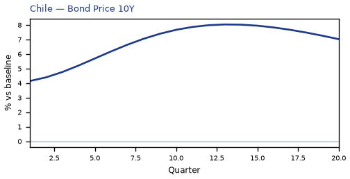

[Q1–Q20 JSON for Chile](numbers/CL.json)

## SE — Sweden

The main impact of oil at $200 a barrel on Sweden is a large drop in GDP of 2.97% by Q17. This is a model impulse response versus baseline, not a forecast. Equities soften 8.19% by Q13. The three-year CPI impulse is +2.31 percentage points.

Demand and trade. Private investment falls 8.84% by Q8; the trade balance (net exports — this model does not split imports from exports) softens to -2.34% in Q4; household consumption falls 1.73% by Q18; government debt rises 1.63% by Q20; related moves also show up in government spending.

Labour. Employment falls 3.06% by Q20; real wages fall 2.33% by Q20; unemployment rises by +2.18 percentage points in Q19.

Prices. Firms' marginal cost falls 1.77% by Q17; CPI inflation rises 0.57 percentage points by Q2; domestic inflation rises 0.40 percentage points by Q2.

Policy rates and the government curve. Benchmark bond prices cheapen 10.29% by Q5; 10-year bond prices rally 5.49% by Q16; 30-year bond prices rally 5.40% by Q14; 5-year bond prices rally 3.78% by Q18; related moves also show up in 2-year bond prices, the local policy rate, 3-month government yields.

Exchange rates. The NEER prints a trade-weighted depreciation (-4.31% in Q5); the home currency is weaker versus the dollar (+2.38% in Q5); the real exchange rate shows a real depreciation (a weaker, more competitive home currency), peaking at +1.57% in Q4.

Equities and risk. Global VIX moves to 23.1 in Q6 (baseline 15); equity prices fall 8.19% by Q13; Tobin's Q (the value of installed capital) falls 6.19% by Q8.

Housing and credit. House prices fall 3.98% by Q20; bank equity falls 1.13% by Q18; bank credit supply falls 0.90% by Q18.

Commodities. Gold prices move to $2444 in Q8; the energy price moves to $176 a barrel in Q4; the food price index moves to 112.5 in Q8; the gas price moves to $7.04 per mmBtu in Q4; the metals price index moves to 91.5 in Q14; the copper price index moves to 93.1 in Q14; the wheat price index moves to 94.9 in Q14.

Sectors and capital. Manufacturing output falls 3.07% by Q4; services output falls 2.13% by Q17; the capital stock falls 0.78% by Q20.

By Q20, GDP is still -2.76% from baseline.

These figures are model IRFs versus baseline, not forecasts and not financial advice.

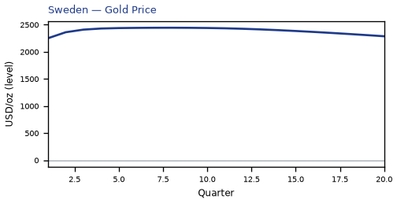

[Q1–Q20 JSON for Sweden](numbers/SE.json)

## ID — Indonesia

The main impact of oil at $200 a barrel on Indonesia is a large drop in GDP of 2.80% by Q14. This is a model impulse response versus baseline, not a forecast. Equities soften 5.22% by Q11. The three-year CPI impulse is +1.90 percentage points.

Demand and trade. Private investment falls 8.35% by Q8; government debt falls 5.00% by Q20; household consumption falls 1.71% by Q16; the trade balance (net exports — this model does not split imports from exports) softens to -1.20% in Q4; related moves also show up in government spending.

Labour. Real wages fall 4.18% by Q20; employment falls 2.79% by Q20; unemployment rises by +0.24 percentage points in Q16.

Prices. Firms' marginal cost falls 1.66% by Q14; CPI inflation rises 0.47 percentage points by Q3; domestic inflation rises 0.33 percentage points by Q3.

Policy rates and the government curve. 10-year bond prices rally 7.90% by Q14; 30-year bond prices rally 7.31% by Q12; benchmark bond prices cheapen 6.61% by Q5; 5-year bond prices rally 5.84% by Q16; related moves also show up in 2-year bond prices, the local policy rate, 3-month government yields.

Exchange rates. The NEER prints a trade-weighted appreciation (+5.76% in Q5); the real exchange rate shows a real appreciation (a stronger home currency), peaking at -4.67% in Q5; the home currency is stronger versus the dollar (-3.85% in Q5).

Equities and risk. Global VIX moves to 23.1 in Q6 (baseline 15); Tobin's Q (the value of installed capital) falls 5.85% by Q8; equity prices fall 5.22% by Q11.

Housing and credit. House prices fall 4.09% by Q20; bank credit supply falls 0.57% by Q17; bank equity falls 0.56% by Q17.

Commodities. Gold prices move to $2444 in Q8; the energy price moves to $176 a barrel in Q4; the food price index moves to 112.5 in Q8; the gas price moves to $7.04 per mmBtu in Q4; the metals price index moves to 91.5 in Q14; the copper price index moves to 93.1 in Q14; the wheat price index moves to 94.9 in Q14.

Sectors and capital. Manufacturing output falls 1.52% by Q4; services output falls 1.39% by Q14; the capital stock falls 0.68% by Q20.

By Q20, GDP is still -2.35% from baseline.

These figures are model IRFs versus baseline, not forecasts and not financial advice.

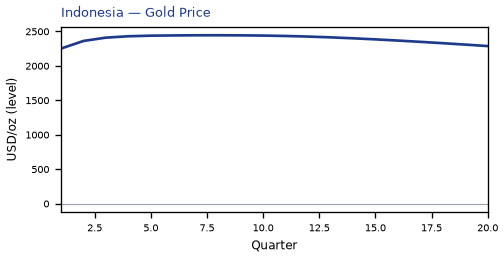

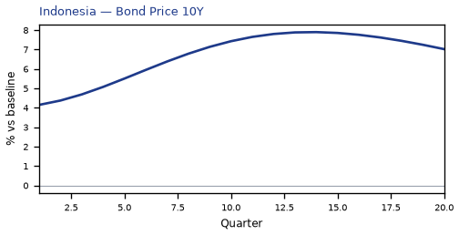

[Q1–Q20 JSON for Indonesia](numbers/ID.json)

## NG — Nigeria

The main impact of oil at $200 a barrel on Nigeria is a large rise in GDP of 2.63% by Q3. This is a model impulse response versus baseline, not a forecast. Equities firm 3.25% by Q3. The three-year CPI impulse is +4.44 percentage points.

Demand and trade. The trade balance (net exports — this model does not split imports from exports) improves to +9.21% in Q4; private investment rises 5.97% by Q2; government debt rises 4.38% by Q11; household consumption rises 1.50% by Q4; related moves also show up in government spending.

Labour. Real wages rise 4.02% by Q13; employment rises 1.58% by Q8; unemployment eases by -0.28 percentage points in Q6.

Prices. Firms' marginal cost rises 1.60% by Q3; CPI inflation rises 0.61 percentage points by Q4; domestic inflation rises 0.43 percentage points by Q4.

Policy rates and the government curve. Benchmark bond prices cheapen 6.17% by Q6; 5-year bond prices cheapen 4.23% by Q1; 2-year bond prices cheapen 4.02% by Q3; 10-year bond prices cheapen 2.62% by Q1; related moves also show up in the local policy rate, 3-month government yields, 2-year government yields.

Exchange rates. The real exchange rate shows a real appreciation (a stronger home currency), peaking at -10.06% in Q5; the NEER prints a trade-weighted appreciation (+9.99% in Q5); the home currency is stronger versus the dollar (-9.23% in Q5).

Equities and risk. Global VIX moves to 23.1 in Q6 (baseline 15); Tobin's Q (the value of installed capital) rises 4.18% by Q2; equity prices rise 3.25% by Q3.

Housing and credit. House prices rise 1.76% by Q8; bank equity rises 0.18% by Q14; bank credit is close to unchanged.

Commodities. Gold prices move to $2444 in Q8; the energy price moves to $176 a barrel in Q4; the food price index moves to 112.5 in Q8; the gas price moves to $7.04 per mmBtu in Q4; the metals price index moves to 91.5 in Q14; the copper price index moves to 93.1 in Q14; the wheat price index moves to 94.9 in Q14.

Sectors and capital. Manufacturing output rises 2.31% by Q5; services output rises 1.30% by Q3; the capital stock rises 0.13% by Q7.

The GDP response has mostly faded by Q10 (Q20 is still -0.69%).

These figures are model IRFs versus baseline, not forecasts and not financial advice.

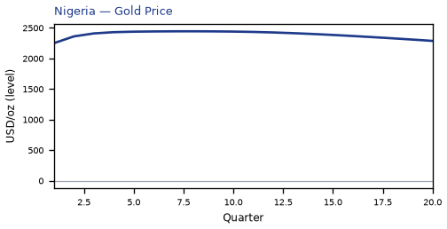

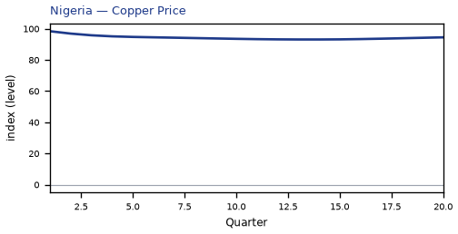

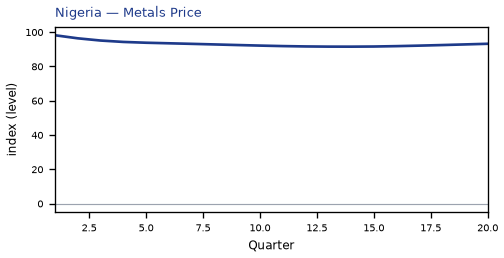

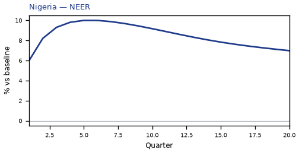

[Q1–Q20 JSON for Nigeria](numbers/NG.json)

## CH — Switzerland

The main impact of oil at $200 a barrel on Switzerland is a large drop in GDP of 2.62% by Q15. This is a model impulse response versus baseline, not a forecast. Equities soften 9.99% by Q13. The three-year CPI impulse is +2.19 percentage points.

Demand and trade. Private investment falls 7.01% by Q10; household consumption falls 1.87% by Q18; government debt falls 1.59% by Q20; the trade balance (net exports — this model does not split imports from exports) softens to -0.71% in Q3; related moves also show up in government spending.

Labour. Employment falls 2.78% by Q19; unemployment rises by +1.94 percentage points in Q19; real wages fall 0.85% by Q20.

Prices. Firms' marginal cost falls 1.56% by Q15; CPI inflation rises 0.52 percentage points by Q3; domestic inflation rises 0.37 percentage points by Q3.

Policy rates and the government curve. 30-year bond prices rally 5.52% by Q12; benchmark bond prices rally 5.25% by Q17; 10-year bond prices rally 5.20% by Q14; 5-year bond prices rally 3.39% by Q16; related moves also show up in 2-year bond prices, 3-month government yields, 2-year government yields.

Exchange rates. The home currency is weaker versus the dollar (+5.04% in Q5); the real exchange rate shows a real depreciation (a weaker, more competitive home currency), peaking at +4.22% in Q6; the NEER prints a trade-weighted depreciation (-2.20% in Q6).

Equities and risk. Global VIX moves to 23.1 in Q6 (baseline 15); equity prices fall 9.99% by Q13; Tobin's Q (the value of installed capital) falls 4.91% by Q10.

Housing and credit. House prices fall 3.53% by Q20; bank equity falls 1.35% by Q18; bank credit supply falls 1.06% by Q18.

Commodities. Gold prices move to $2444 in Q8; the energy price moves to $176 a barrel in Q4; the food price index moves to 112.5 in Q8; the gas price moves to $7.04 per mmBtu in Q4; the metals price index moves to 91.5 in Q14; the copper price index moves to 93.1 in Q14; the wheat price index moves to 94.9 in Q14.

Sectors and capital. Manufacturing output falls 3.78% by Q5; services output falls 2.08% by Q15; the capital stock falls 0.62% by Q20.

By Q20, GDP is still -2.47% from baseline.

These figures are model IRFs versus baseline, not forecasts and not financial advice.

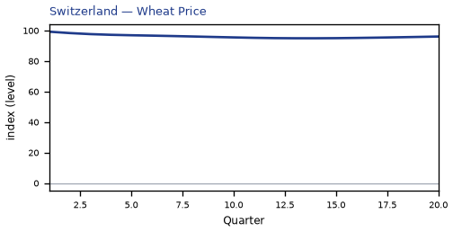

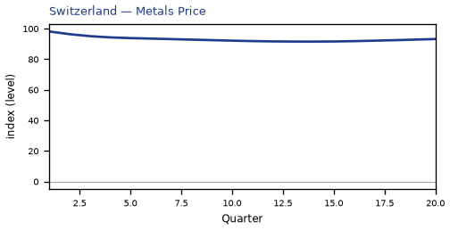

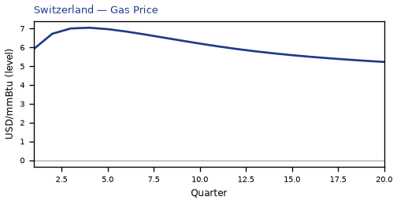

[Q1–Q20 JSON for Switzerland](numbers/CH.json)

## UK — United Kingdom

The main impact of oil at $200 a barrel on the United Kingdom is a large drop in GDP of 2.37% by Q13. This is a model impulse response versus baseline, not a forecast. Equities soften 5.75% by Q9. The three-year CPI impulse is +2.16 percentage points.

Demand and trade. Private investment falls 6.99% by Q11; household consumption falls 1.49% by Q14; the trade balance (net exports — this model does not split imports from exports) softens to -0.96% in Q4; government spending rises 0.48% by Q13; related moves also show up in government debt.

Labour. Employment falls 2.75% by Q18; unemployment rises by +1.74 percentage points in Q18; real wages fall 1.27% by Q20.

Prices. Firms' marginal cost falls 1.40% by Q13; CPI inflation rises 0.63 percentage points by Q2; domestic inflation rises 0.44 percentage points by Q2.

Policy rates and the government curve. 30-year bond prices rally 4.94% by Q17; 10-year bond prices rally 3.78% by Q20; benchmark bond prices cheapen 3.72% by Q7; 5-year bond prices rally 2.06% by Q20; related moves also show up in 2-year bond prices, the local policy rate, 3-month government yields.

Exchange rates. The home currency is weaker versus the dollar (+6.33% in Q5); the NEER prints a trade-weighted depreciation (-6.01% in Q5); the real exchange rate shows a real depreciation (a weaker, more competitive home currency), peaking at +5.50% in Q5.

Equities and risk. Global VIX moves to 23.1 in Q6 (baseline 15); equity prices fall 5.75% by Q9; Tobin's Q (the value of installed capital) falls 4.89% by Q11.

Housing and credit. House prices fall 2.99% by Q20; bank equity falls 1.07% by Q17; bank credit supply falls 0.85% by Q17.

Commodities. Gold prices move to $2444 in Q8; the energy price moves to $176 a barrel in Q4; the food price index moves to 112.5 in Q8; the gas price moves to $7.04 per mmBtu in Q4; the metals price index moves to 91.5 in Q14; the copper price index moves to 93.1 in Q14; the wheat price index moves to 94.9 in Q14.

Sectors and capital. Manufacturing output falls 3.59% by Q4; services output falls 1.87% by Q13; the capital stock falls 0.61% by Q20.

By Q20, GDP is still -2.13% from baseline.

These figures are model IRFs versus baseline, not forecasts and not financial advice.

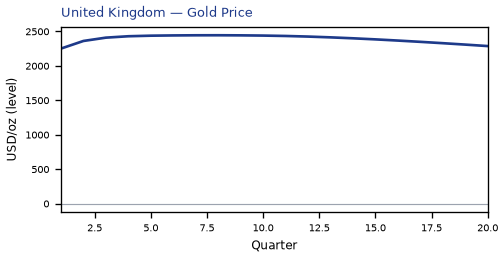

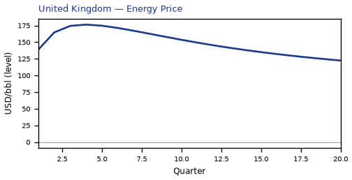

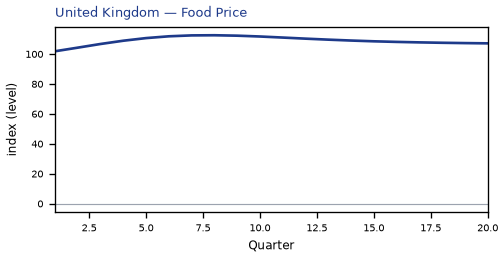

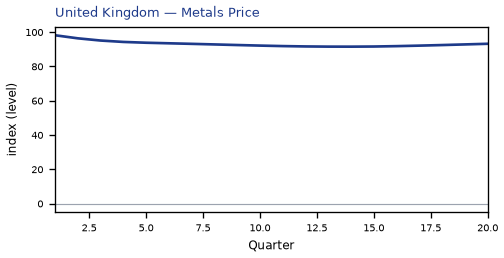

[Q1–Q20 JSON for United Kingdom](numbers/UK.json)

## NL — Netherlands

The main impact of oil at $200 a barrel on the Netherlands is a large drop in GDP of 2.30% by Q15. This is a model impulse response versus baseline, not a forecast. Equities soften 5.93% by Q12. The three-year CPI impulse is +3.34 percentage points.

Demand and trade. Private investment falls 7.43% by Q8; the trade balance (net exports — this model does not split imports from exports) improves to +1.64% in Q5; household consumption falls 1.33% by Q17; government debt rises 0.61% by Q20; related moves also show up in government spending.

Labour. Employment falls 2.33% by Q20; unemployment rises by +1.68 percentage points in Q19; real wages rise 1.14% by Q10.

Prices. Firms' marginal cost falls 1.36% by Q15; CPI inflation rises 0.81 percentage points by Q2; domestic inflation rises 0.57 percentage points by Q2.

Policy rates and the government curve. Benchmark bond prices cheapen 12.07% by Q6; 10-year bond prices rally 6.33% by Q16; 30-year bond prices rally 6.13% by Q15; 5-year bond prices rally 4.36% by Q19; related moves also show up in 2-year bond prices, the local policy rate, 3-month government yields.

Exchange rates. The home currency is stronger versus the dollar (-2.63% in Q17); the real exchange rate shows a real appreciation (a stronger home currency), peaking at -2.61% in Q5; the NEER prints a trade-weighted appreciation (+2.27% in Q4).

Equities and risk. Global VIX moves to 23.1 in Q6 (baseline 15); equity prices fall 5.93% by Q12; Tobin's Q (the value of installed capital) falls 5.20% by Q8.

Housing and credit. House prices fall 3.30% by Q20; bank equity falls 1.18% by Q19; bank credit supply falls 0.94% by Q19.

Commodities. Gold prices move to $2444 in Q8; the energy price moves to $176 a barrel in Q4; the food price index moves to 112.5 in Q8; the gas price moves to $7.04 per mmBtu in Q4; the metals price index moves to 91.5 in Q14; the copper price index moves to 93.1 in Q14; the wheat price index moves to 94.9 in Q14.

Sectors and capital. Services output falls 1.72% by Q15; manufacturing output falls 1.24% by Q4; the capital stock falls 0.61% by Q20.

By Q20, GDP is still -2.14% from baseline.

These figures are model IRFs versus baseline, not forecasts and not financial advice.

[Q1–Q20 JSON for Netherlands](numbers/NL.json)

## BR — Brazil

The main impact of oil at $200 a barrel on Brazil is a large drop in GDP of 2.16% by Q14. This is a model impulse response versus baseline, not a forecast. Equities soften 3.92% by Q11. The three-year CPI impulse is +2.17 percentage points.

Demand and trade. Private investment falls 6.74% by Q8; the trade balance (net exports — this model does not split imports from exports) improves to +2.57% in Q5; household consumption falls 1.17% by Q15; government spending rises 0.81% by Q11; related moves also show up in government debt.

Labour. Employment falls 2.05% by Q19; real wages fall 1.82% by Q20; unemployment rises by +0.45 percentage points in Q16.

Prices. Firms' marginal cost falls 1.28% by Q14; CPI inflation rises 0.43 percentage points by Q2; domestic inflation rises 0.30 percentage points by Q2.

Policy rates and the government curve. Benchmark bond prices cheapen 11.13% by Q5; 10-year bond prices rally 6.78% by Q13; 30-year bond prices rally 5.81% by Q12; 5-year bond prices rally 5.60% by Q14; related moves also show up in 2-year bond prices, the local policy rate, 3-month government yields.

Exchange rates. The real exchange rate shows a real appreciation (a stronger home currency), peaking at -7.46% in Q6; the NEER prints a trade-weighted appreciation (+6.85% in Q6); the home currency is stronger versus the dollar (-6.67% in Q6).

Equities and risk. Global VIX moves to 23.1 in Q6 (baseline 15); Tobin's Q (the value of installed capital) falls 4.72% by Q8; equity prices fall 3.92% by Q11.

Housing and credit. House prices fall 2.59% by Q20; bank equity falls 0.12% by Q19; bank credit supply falls 0.10% by Q19.

Commodities. Gold prices move to $2444 in Q8; the energy price moves to $176 a barrel in Q4; the food price index moves to 112.5 in Q8; the gas price moves to $7.04 per mmBtu in Q4; the metals price index moves to 91.5 in Q14; the copper price index moves to 93.1 in Q14; the wheat price index moves to 94.9 in Q14.

Sectors and capital. Services output falls 1.43% by Q14; manufacturing output falls 0.48% by Q16; the capital stock falls 0.47% by Q20.

By Q20, GDP is still -1.57% from baseline.

These figures are model IRFs versus baseline, not forecasts and not financial advice.

[Q1–Q20 JSON for Brazil](numbers/BR.json)

## AU — Australia

The main impact of oil at $200 a barrel on Australia is a large drop in GDP of 1.91% by Q13. This is a model impulse response versus baseline, not a forecast. Equities soften 4.77% by Q8. The three-year CPI impulse is +1.98 percentage points.

Demand and trade. Private investment falls 5.93% by Q5; the trade balance (net exports — this model does not split imports from exports) softens to -1.39% in Q4; household consumption falls 1.23% by Q14; government debt falls 1.20% by Q20; related moves also show up in government spending.

Labour. Employment falls 2.15% by Q16; real wages fall 1.81% by Q20; unemployment rises by +1.39 percentage points in Q17.

Prices. Firms' marginal cost falls 1.13% by Q13; CPI inflation rises 0.47 percentage points by Q2; domestic inflation rises 0.33 percentage points by Q2.

Policy rates and the government curve. Benchmark bond prices rally 9.38% by Q20; 10-year bond prices rally 8.05% by Q13; 30-year bond prices rally 7.41% by Q11; 5-year bond prices rally 5.91% by Q15; related moves also show up in 2-year bond prices, the local policy rate, 3-month government yields.

Exchange rates. The home currency is weaker versus the dollar (+7.12% in Q6); the real exchange rate shows a real depreciation (a weaker, more competitive home currency), peaking at +6.45% in Q11; the NEER prints a trade-weighted depreciation (-5.19% in Q12).

Equities and risk. Global VIX moves to 23.1 in Q6 (baseline 15); equity prices fall 4.77% by Q8; Tobin's Q (the value of installed capital) falls 4.15% by Q5.

Housing and credit. House prices fall 2.33% by Q20; bank equity falls 0.78% by Q18; bank credit supply falls 0.62% by Q18.

Commodities. Gold prices move to $2444 in Q8; the energy price moves to $176 a barrel in Q4; the food price index moves to 112.5 in Q8; the gas price moves to $7.04 per mmBtu in Q4; the metals price index moves to 91.5 in Q14; the copper price index moves to 93.1 in Q14; the wheat price index moves to 94.9 in Q14.

Sectors and capital. Manufacturing output falls 3.54% by Q5; services output falls 1.37% by Q13; the capital stock falls 0.44% by Q20.

By Q20, GDP is still -1.55% from baseline.

These figures are model IRFs versus baseline, not forecasts and not financial advice.

[Q1–Q20 JSON for Australia](numbers/AU.json)

## US — United States

The main impact of oil at $200 a barrel on the United States is a large drop in GDP of 1.71% by Q12. This is a model impulse response versus baseline, not a forecast. Equities soften 5.41% by Q9. The three-year CPI impulse is +2.69 percentage points.

Demand and trade. Private investment falls 5.94% by Q6; household consumption falls 1.10% by Q13; government debt falls 0.35% by Q14; government spending rises 0.33% by Q12; related moves also show up in the trade balance.

Labour. Employment falls 1.89% by Q15; unemployment rises by +1.18 percentage points in Q15; real wages rise 0.86% by Q10.

Prices. Firms' marginal cost falls 1.01% by Q12; CPI inflation rises 0.58 percentage points by Q2; domestic inflation rises 0.40 percentage points by Q2.

Policy rates and the government curve. Benchmark bond prices cheapen 10.68% by Q5; 10-year bond prices rally 6.93% by Q12; 30-year bond prices rally 5.90% by Q11; 5-year bond prices rally 5.66% by Q14; related moves also show up in 2-year bond prices, the local policy rate, 3-month government yields.

Exchange rates. The NEER prints a trade-weighted depreciation (-8.36% in Q4); the real exchange rate shows a real appreciation (a stronger home currency), peaking at -0.83% in Q5.

Equities and risk. Global VIX moves to 23.1 in Q6 (baseline 15); equity prices fall 5.41% by Q9; Tobin's Q (the value of installed capital) falls 4.16% by Q6.

Housing and credit. House prices fall 1.78% by Q19; bank equity falls 0.56% by Q17; bank credit supply falls 0.45% by Q17.

Commodities. Gold prices move to $2444 in Q8; the energy price moves to $176 a barrel in Q4; the food price index moves to 112.5 in Q8; the gas price moves to $7.04 per mmBtu in Q4; the metals price index moves to 91.5 in Q14; the copper price index moves to 93.1 in Q14; the wheat price index moves to 94.9 in Q14.

Sectors and capital. Manufacturing output falls 1.69% by Q4; services output falls 1.32% by Q12; the capital stock falls 0.38% by Q20.

By Q20, GDP is still -1.13% from baseline.

These figures are model IRFs versus baseline, not forecasts and not financial advice.

[Q1–Q20 JSON for United States](numbers/US.json)

## CA — Canada

The main impact of oil at $200 a barrel on Canada is a large rise in GDP of 1.56% by Q3. This is a model impulse response versus baseline, not a forecast. Equities firm 3.46% by Q3. The three-year CPI impulse is +1.11 percentage points.

Demand and trade. The trade balance (net exports — this model does not split imports from exports) improves to +5.64% in Q4; private investment rises 2.84% by Q2; government spending rises 1.21% by Q5; household consumption rises 0.97% by Q4; related moves also show up in government debt.

Labour. Real wages rise 1.58% by Q14; employment rises 1.40% by Q6; unemployment eases by -0.70 percentage points in Q6.

Prices. Firms' marginal cost rises 0.96% by Q3; CPI inflation rises 0.37 percentage points by Q2; domestic inflation rises 0.26 percentage points by Q2.

Policy rates and the government curve. Benchmark bond prices cheapen 12.06% by Q5; 5-year bond prices cheapen 3.42% by Q1; 2-year bond prices cheapen 3.24% by Q2; 10-year bond prices cheapen 2.40% by Q1; related moves also show up in 30-year bond prices, the local policy rate, 3-month government yields.

Exchange rates. The real exchange rate shows a real appreciation (a stronger home currency), peaking at -44.13% in Q4; the NEER prints a trade-weighted appreciation (+43.60% in Q4); the home currency is stronger versus the dollar (-43.33% in Q4).

Equities and risk. Global VIX moves to 23.1 in Q6 (baseline 15); equity prices rise 3.46% by Q3; Tobin's Q (the value of installed capital) rises 1.99% by Q2.

Housing and credit. House prices rise 0.81% by Q9; bank equity rises 0.12% by Q10; bank credit is close to unchanged.

Commodities. Gold prices move to $2444 in Q8; the energy price moves to $176 a barrel in Q4; the food price index moves to 112.5 in Q8; the gas price moves to $7.04 per mmBtu in Q4; the metals price index moves to 91.5 in Q14; the copper price index moves to 93.1 in Q14; the wheat price index moves to 94.9 in Q14.

Sectors and capital. Manufacturing output rises 11.78% by Q4; services output rises 1.08% by Q3; the capital stock stays close to baseline.

The GDP response has mostly faded by Q11 (Q20 is still +0.20%).

These figures are model IRFs versus baseline, not forecasts and not financial advice.

[Q1–Q20 JSON for Canada](numbers/CA.json)

## MX — Mexico

The main impact of oil at $200 a barrel on Mexico is a large drop in GDP of 1.52% by Q12. This is a model impulse response versus baseline, not a forecast. Equities soften 2.71% by Q9. The three-year CPI impulse is +1.49 percentage points.

Demand and trade. Private investment falls 5.32% by Q7; government debt falls 2.18% by Q20; the trade balance (net exports — this model does not split imports from exports) improves to +2.18% in Q4; household consumption falls 0.84% by Q14; related moves also show up in government spending.

Labour. Real wages fall 1.50% by Q20; employment falls 1.42% by Q18; unemployment rises by +0.13 percentage points in Q14.

Prices. Firms' marginal cost falls 0.89% by Q12; CPI inflation rises 0.37 percentage points by Q2; domestic inflation rises 0.26 percentage points by Q2.

Policy rates and the government curve. Benchmark bond prices cheapen 8.02% by Q5; 10-year bond prices rally 4.36% by Q13; 5-year bond prices rally 3.80% by Q14; 30-year bond prices rally 3.35% by Q12; related moves also show up in 2-year bond prices, the local policy rate, 3-month government yields.

Exchange rates. The NEER prints a trade-weighted appreciation (+23.35% in Q4); the real exchange rate shows a real appreciation (a stronger home currency), peaking at -23.26% in Q4; the home currency is stronger versus the dollar (-22.46% in Q4).

Equities and risk. Global VIX moves to 23.1 in Q6 (baseline 15); Tobin's Q (the value of installed capital) falls 3.72% by Q7; equity prices fall 2.71% by Q9.

Housing and credit. House prices fall 2.05% by Q18; bank equity falls 0.28% by Q20; bank credit supply falls 0.27% by Q20.

Commodities. Gold prices move to $2444 in Q8; the energy price moves to $176 a barrel in Q4; the food price index moves to 112.5 in Q8; the gas price moves to $7.04 per mmBtu in Q4; the metals price index moves to 91.5 in Q14; the copper price index moves to 93.1 in Q14; the wheat price index moves to 94.9 in Q14.

Sectors and capital. Manufacturing output rises 4.41% by Q4; services output falls 0.92% by Q12; the capital stock falls 0.35% by Q20.

By Q20, GDP is still -0.88% from baseline.

These figures are model IRFs versus baseline, not forecasts and not financial advice.

[Q1–Q20 JSON for Mexico](numbers/MX.json)

## MY — Malaysia

The main impact of oil at $200 a barrel on Malaysia is a large drop in GDP of 1.12% by Q12. This is a model impulse response versus baseline, not a forecast. Equities soften 2.98% by Q9. The three-year CPI impulse is +1.19 percentage points.

Demand and trade. Private investment falls 3.58% by Q7; the trade balance (net exports — this model does not split imports from exports) improves to +2.63% in Q4; government debt falls 1.92% by Q20; government spending rises 0.75% by Q5; related moves also show up in household consumption.

Labour. Real wages fall 1.47% by Q20; employment falls 1.08% by Q16; unemployment rises by +0.26 percentage points in Q14.

Prices. Firms' marginal cost falls 0.65% by Q12; CPI inflation rises 0.50 percentage points by Q2; domestic inflation rises 0.35 percentage points by Q2.

Policy rates and the government curve. Benchmark bond prices cheapen 3.85% by Q5; 10-year bond prices rally 3.09% by Q12; 5-year bond prices rally 2.74% by Q14; 30-year bond prices rally 2.39% by Q12; related moves also show up in 2-year bond prices, the local policy rate, 3-month government yields.

Exchange rates. The NEER prints a trade-weighted appreciation (+13.27% in Q5); the real exchange rate shows a real appreciation (a stronger home currency), peaking at -11.01% in Q4; the home currency is stronger versus the dollar (-10.21% in Q4).

Equities and risk. Global VIX moves to 23.1 in Q6 (baseline 15); equity prices fall 2.98% by Q9; Tobin's Q (the value of installed capital) falls 2.51% by Q7.

Housing and credit. House prices fall 1.66% by Q18; bank equity falls 0.38% by Q20; bank credit supply falls 0.30% by Q20.

Commodities. Gold prices move to $2444 in Q8; the energy price moves to $176 a barrel in Q4; the food price index moves to 112.5 in Q8; the gas price moves to $7.04 per mmBtu in Q4; the metals price index moves to 91.5 in Q14; the copper price index moves to 93.1 in Q14; the wheat price index moves to 94.9 in Q14.

Sectors and capital. Manufacturing output rises 1.00% by Q20; services output falls 0.64% by Q12; the capital stock falls 0.24% by Q20.

By Q20, GDP is still -0.61% from baseline.

These figures are model IRFs versus baseline, not forecasts and not financial advice.

[Q1–Q20 JSON for Malaysia](numbers/MY.json)

## CO — Colombia

The main impact of oil at $200 a barrel on Colombia is a large drop in GDP of 1.05% by Q13. This is a model impulse response versus baseline, not a forecast. Equities soften 1.59% by Q10. The three-year CPI impulse is +2.41 percentage points.

Demand and trade. Private investment falls 3.85% by Q9; the trade balance (net exports — this model does not split imports from exports) improves to +3.45% in Q4; government debt falls 1.03% by Q20; government spending rises 0.89% by Q5; related moves also show up in household consumption.

Labour. Real wages rise 1.27% by Q11; employment falls 0.85% by Q18; unemployment rises by +0.09 percentage points in Q15.

Prices. Firms' marginal cost falls 0.61% by Q13; CPI inflation rises 0.47 percentage points by Q3; domestic inflation rises 0.33 percentage points by Q3.

Policy rates and the government curve. Benchmark bond prices cheapen 7.33% by Q5; 2-year bond prices cheapen 3.21% by Q2; 10-year bond prices rally 2.96% by Q14; 5-year bond prices rally 2.77% by Q14; related moves also show up in 30-year bond prices, the local policy rate, 3-month government yields.

Exchange rates. The real exchange rate shows a real appreciation (a stronger home currency), peaking at -28.30% in Q4; the home currency is stronger versus the dollar (-27.50% in Q4); the NEER prints a trade-weighted appreciation (+26.85% in Q4).

Equities and risk. Global VIX moves to 23.1 in Q6 (baseline 15); Tobin's Q (the value of installed capital) falls 2.70% by Q9; equity prices fall 1.59% by Q10.

Housing and credit. House prices fall 1.08% by Q18; bank credit is close to unchanged.

Commodities. Gold prices move to $2444 in Q8; the energy price moves to $176 a barrel in Q4; the food price index moves to 112.5 in Q8; the gas price moves to $7.04 per mmBtu in Q4; the metals price index moves to 91.5 in Q14; the copper price index moves to 93.1 in Q14; the wheat price index moves to 94.9 in Q14.

Sectors and capital. Manufacturing output rises 6.59% by Q4; services output falls 0.63% by Q13; the capital stock falls 0.22% by Q19.

By Q20, GDP is still -0.40% from baseline.

These figures are model IRFs versus baseline, not forecasts and not financial advice.

[Q1–Q20 JSON for Colombia](numbers/CO.json)

---

These figures are model IRFs versus baseline, not forecasts and not financial advice.
