# Global Macro Economic Simulations and Financial Market Responses

v6 · IRF · evaluation

**Open the typeset report (this is the document):** https://robomacro.com/GlobalMacroTrainingDataset/oil_200/

GitHub and Hugging Face show `.html` as source code. That is not the report. Read it on robomacro.com, or keep scrolling this page.

## What's the impact of Oil $200/bbl

### Active treatment

```json
{
  "oil": 200.0
}
```

### Assumptions

- Every path is a model impulse response versus baseline, not a forecast.
- The solver and weights are not included.
- English never enters the solver.

### Summary

This report traces the model response to oil at $200 a barrel. Every path is an impulse response versus an unchanged baseline — not a forecast and not market data. The question was: What's the impact of Oil $200/bbl

Turkey sees a -5.14% GDP peak at Q13, with CPI +2.46pp over three years and equities -8.20%. India sees a -4.79% GDP peak at Q13, with CPI +2.61pp over three years and equities -12.42%. South Korea sees a -4.33% GDP peak at Q13, with CPI +2.93pp over three years and equities -10.46%. Germany sees a -3.91% GDP peak at Q15, with CPI +2.61pp over three years and equities -7.34%.

The remaining countries are smaller spillovers and are covered in the chapters that follow. This material is a model-based summary and is not financial advice.

### Countries by GDP impact

- [TR — Turkey](#tr--turkey) · GDP -5.14% Q13
- [IN — India](#in--india) · GDP -4.79% Q13
- [KR — South Korea](#kr--south-korea) · GDP -4.33% Q13
- [DE — Germany](#de--germany) · GDP -3.91% Q15
- [JP — Japan](#jp--japan) · GDP -3.77% Q14
- [SA — Saudi Arabia](#sa--saudi-arabia) · GDP +3.71% Q4
- [PL — Poland](#pl--poland) · GDP -3.61% Q16
- [IT — Italy](#it--italy) · GDP -3.58% Q15
- [AR — Argentina](#ar--argentina) · GDP -3.54% Q13
- [ES — Spain](#es--spain) · GDP -3.33% Q17
- [TH — Thailand](#th--thailand) · GDP -3.20% Q16
- [FR — France](#fr--france) · GDP -3.19% Q17
- [ZA — South Africa](#za--south-africa) · GDP -3.06% Q15
- [CL — Chile](#cl--chile) · GDP -2.63% Q15
- [CN — China](#cn--china) · GDP -2.62% Q13
- [ID — Indonesia](#id--indonesia) · GDP -2.49% Q14
- [NL — Netherlands](#nl--netherlands) · GDP -2.46% Q17
- [BR — Brazil](#br--brazil) · GDP -2.38% Q14
- [SE — Sweden](#se--sweden) · GDP -2.36% Q16
- [CH — Switzerland](#ch--switzerland) · GDP -2.12% Q15
- [UK — United Kingdom](#uk--united-kingdom) · GDP -1.96% Q13
- [MX — Mexico](#mx--mexico) · GDP -1.88% Q13
- [RU — Russia](#ru--russia) · GDP +1.66% Q3
- [NO — Norway](#no--norway) · GDP +1.60% Q3
- [US — United States](#us--united-states) · GDP -1.53% Q12
- [AU — Australia](#au--australia) · GDP -1.53% Q12
- [CO — Colombia](#co--colombia) · GDP -1.50% Q13
- [MY — Malaysia](#my--malaysia) · GDP -1.47% Q13
- [NG — Nigeria](#ng--nigeria) · GDP -1.44% Q15
- [CA — Canada](#ca--canada) · GDP -0.65% Q13


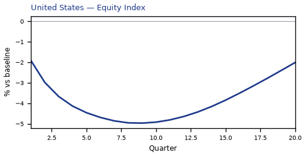

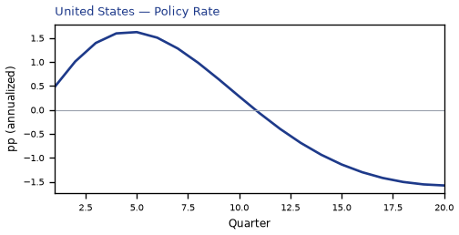

## TR — Turkey

The main impact of oil at $200 a barrel on Turkey would be a large drop in GDP of 5.14% by Q13. Equities peak at -8.20% in Q12.

Demand and trade. Consumption peaks at -2.98 % vs baseline in Q13, from -0.84 in Q1 to -1.88 in Q20. Investment peaks at -13.09 % vs baseline in Q9, from -5.65 in Q1 to -4.15 in Q20. Net Exports peaks at -4.64 % vs baseline in Q4, from -2.96 in Q1 to -1.41 in Q20. Gov Spending peaks at +0.89 % vs baseline in Q13, from +0.28 in Q1 to +0.50 in Q20. Gov Debt peaks at -5.72 % vs baseline in Q20, from -0.16 in Q1 to -5.72 in Q20.

External / FX. The real exchange rate shows real depreciation (a weaker, more competitive home currency). Currency Strength peaks at +6.71 % vs baseline in Q13, from +1.43 in Q1 to +4.92 in Q20.

Labour. Employment peaks at -4.96 % vs baseline in Q17, from -0.26 in Q1 to -4.73 in Q20. Unemployment peaks at +1.18 pp in Q15, from +0.11 in Q1 to +0.93 in Q20. Real Wages peaks at -8.03 % vs baseline in Q20, from -0.03 in Q1 to -8.03 in Q20.

Prices. The three-year CPI impulse is +2.46 percentage points. CPI Inflation peaks at +0.52 pp in Q3, from +0.26 in Q1 to -0.48 in Q20. Domestic Infl. peaks at +0.36 pp in Q3, from +0.18 in Q1 to -0.33 in Q20. Marginal Cost peaks at -3.05 % vs baseline in Q13, from -0.97 in Q1 to -1.72 in Q20.

Financial conditions. Policy Rate peaks at -2.35 pp (annualized) in Q19, from +0.74 in Q1 to -2.33 in Q20. Govt 2Y Yield peaks at -2.26 pp (annualized) in Q16, from +1.60 in Q1 to -2.05 in Q20. Govt 5Y Yield peaks at -1.87 pp (annualized) in Q13, from -0.24 in Q1 to -1.44 in Q20. Govt 10Y Yield peaks at -1.22 pp (annualized) in Q11, from -0.80 in Q1 to -0.88 in Q20. Bond Price peaks at +7.35 % vs baseline in Q19, from -2.32 in Q1 to +7.30 in Q20. Equity Index peaks at -8.20 % vs baseline in Q12, from -3.10 in Q1 to -3.44 in Q20. Tobin's Q peaks at -9.16 % vs baseline in Q9, from -3.95 in Q1 to -2.91 in Q20. House Prices peaks at -6.64 % vs baseline in Q19, from -0.27 in Q1 to -6.59 in Q20. Bank Credit peaks at -0.69 % vs baseline in Q17, from -0.06 in Q1 to -0.68 in Q20. Credit Spread peaks at +0.06 pp in Q17, from +0.00 in Q1 to +0.06 in Q20.

Sectoral and capital. Manuf. GDP peaks at -5.30 % vs baseline in Q11, from -2.55 in Q1 to -3.48 in Q20. Services GDP peaks at -3.11 % vs baseline in Q13, from -1.01 in Q1 to -1.76 in Q20. Capital Stock peaks at -1.02 % vs baseline in Q20, from -0.03 in Q1 to -1.02 in Q20.

Timing. By Q20 GDP is still -2.91% from baseline.

These figures are model IRFs versus baseline, not forecasts.

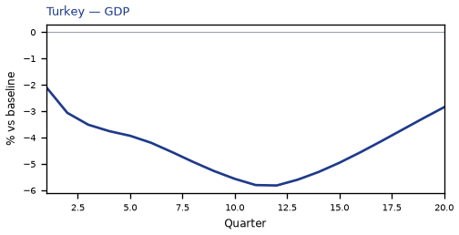

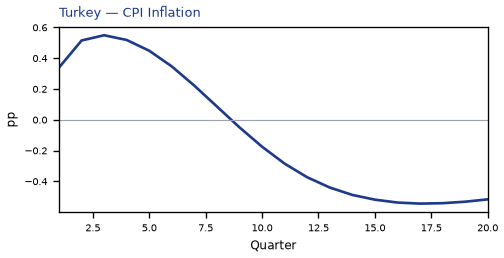

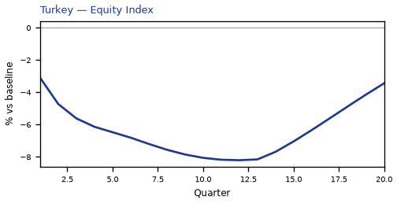

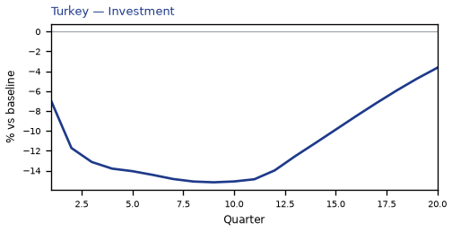

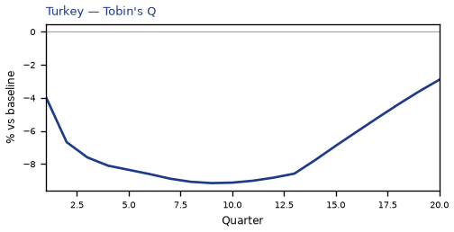

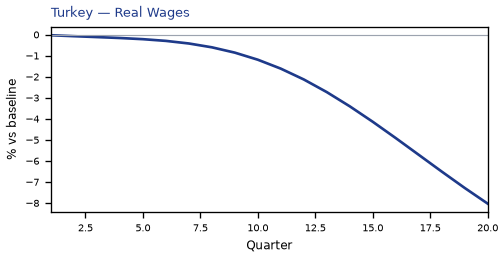

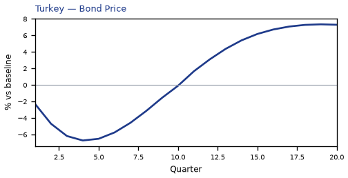

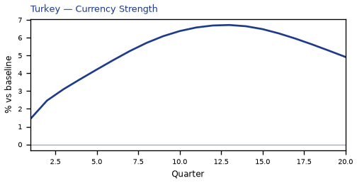

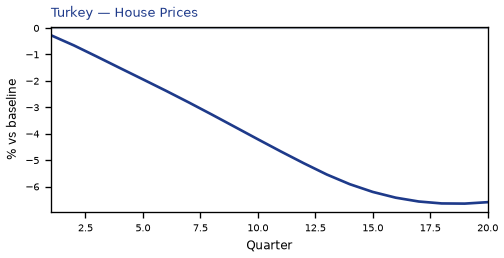


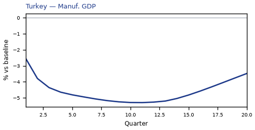

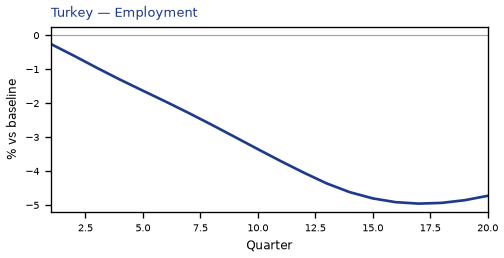

[Q1–Q20 JSON for Turkey](numbers/TR.json)

## IN — India

The main impact of oil at $200 a barrel on India would be a large drop in GDP of 4.79% by Q13. Equities peak at -12.42% in Q13.

Demand and trade. Consumption peaks at -2.90 % vs baseline in Q14, from -0.89 in Q1 to -2.11 in Q20. Investment peaks at -13.09 % vs baseline in Q9, from -5.69 in Q1 to -4.61 in Q20. Net Exports peaks at -4.79 % vs baseline in Q4, from -3.02 in Q1 to -1.49 in Q20. Gov Spending peaks at +0.81 % vs baseline in Q13, from +0.29 in Q1 to +0.54 in Q20. Gov Debt peaks at -8.95 % vs baseline in Q20, from -0.25 in Q1 to -8.95 in Q20.

External / FX. The real exchange rate shows real depreciation (a weaker, more competitive home currency). Currency Strength peaks at +5.29 % vs baseline in Q17, from +0.41 in Q1 to +5.07 in Q20.

Labour. Employment peaks at -4.22 % vs baseline in Q19, from -0.20 in Q1 to -4.21 in Q20. Unemployment peaks at +0.33 pp in Q14, from +0.05 in Q1 to +0.26 in Q20. Real Wages peaks at -6.47 % vs baseline in Q20, from -0.03 in Q1 to -6.47 in Q20.

Prices. The three-year CPI impulse is +2.61 percentage points. CPI Inflation peaks at +0.57 pp in Q3, from +0.32 in Q1 to -0.48 in Q20. Domestic Infl. peaks at +0.40 pp in Q3, from +0.22 in Q1 to -0.33 in Q20. Marginal Cost peaks at -2.84 % vs baseline in Q13, from -1.02 in Q1 to -1.90 in Q20.

Financial conditions. Policy Rate peaks at -2.65 pp (annualized) in Q20, from +0.63 in Q1 to -2.65 in Q20. Govt 2Y Yield peaks at -2.61 pp (annualized) in Q19, from +1.80 in Q1 to -2.59 in Q20. Govt 5Y Yield peaks at -2.29 pp (annualized) in Q15, from -0.00 in Q1 to -2.10 in Q20. Govt 10Y Yield peaks at -1.66 pp (annualized) in Q13, from -1.01 in Q1 to -1.41 in Q20. Bond Price peaks at +13.25 % vs baseline in Q20, from -3.14 in Q1 to +13.25 in Q20. Equity Index peaks at -12.42 % vs baseline in Q13, from -4.83 in Q1 to -7.53 in Q20. Tobin's Q peaks at -9.16 % vs baseline in Q9, from -3.98 in Q1 to -3.22 in Q20. House Prices peaks at -6.29 % vs baseline in Q19, from -0.28 in Q1 to -6.28 in Q20. Bank Credit peaks at -0.80 % vs baseline in Q16, from -0.07 in Q1 to -0.78 in Q20. Credit Spread peaks at +0.02 pp in Q16, from +0.00 in Q1 to +0.02 in Q20.

Sectoral and capital. Manuf. GDP peaks at -4.21 % vs baseline in Q13, from -2.03 in Q1 to -3.39 in Q20. Services GDP peaks at -2.64 % vs baseline in Q13, from -0.97 in Q1 to -1.77 in Q20. Capital Stock peaks at -1.03 % vs baseline in Q20, from -0.03 in Q1 to -1.03 in Q20.

Timing. By Q20 GDP is still -3.21% from baseline.

These figures are model IRFs versus baseline, not forecasts.

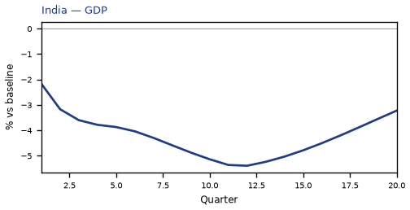

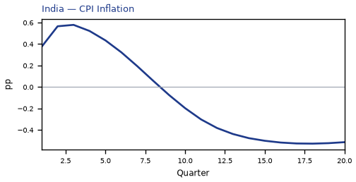

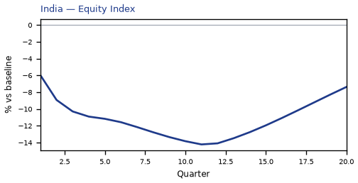

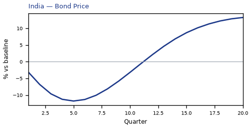

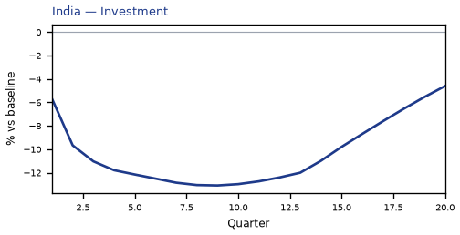

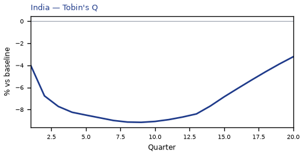

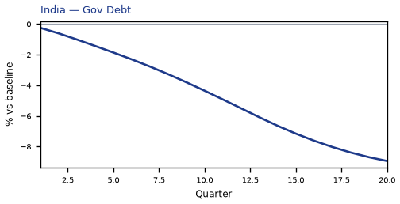

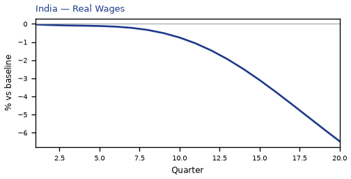

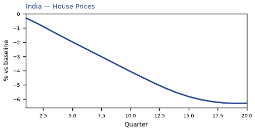

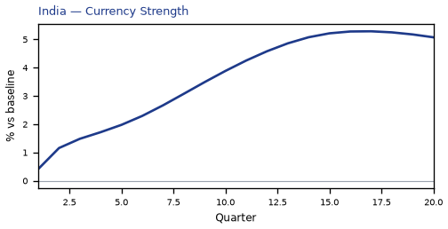

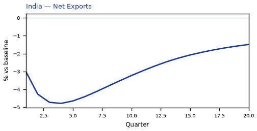

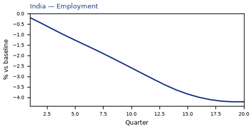

[Q1–Q20 JSON for India](numbers/IN.json)

## KR — South Korea

The main impact of oil at $200 a barrel on South Korea would be a large drop in GDP of 4.33% by Q13. Equities peak at -10.46% in Q12.

Demand and trade. Consumption peaks at -2.72 % vs baseline in Q13, from -1.01 in Q1 to -2.08 in Q20. Investment peaks at -11.36 % vs baseline in Q8, from -5.97 in Q1 to -5.47 in Q20. Net Exports peaks at -5.69 % vs baseline in Q4, from -3.46 in Q1 to -1.64 in Q20. Gov Spending peaks at +0.77 % vs baseline in Q13, from +0.34 in Q1 to +0.56 in Q20. Gov Debt peaks at -3.15 % vs baseline in Q20, from -0.13 in Q1 to -3.15 in Q20.

External / FX. The real exchange rate shows real depreciation (a weaker, more competitive home currency). Currency Strength peaks at +9.41 % vs baseline in Q4, from +5.76 in Q1 to +7.22 in Q20.

Labour. Employment peaks at -4.23 % vs baseline in Q16, from -0.37 in Q1 to -4.03 in Q20. Unemployment peaks at +1.70 pp in Q15, from +0.20 in Q1 to +1.51 in Q20. Real Wages peaks at -4.83 % vs baseline in Q20, from -0.02 in Q1 to -4.83 in Q20.

Prices. The three-year CPI impulse is +2.93 percentage points. CPI Inflation peaks at +0.56 pp in Q2, from +0.45 in Q1 to -0.19 in Q20. Domestic Infl. peaks at +0.39 pp in Q2, from +0.31 in Q1 to -0.14 in Q20. Marginal Cost peaks at -2.56 % vs baseline in Q13, from -1.14 in Q1 to -1.85 in Q20.

Financial conditions. Policy Rate peaks at -2.00 pp (annualized) in Q20, from +0.44 in Q1 to -2.00 in Q20. Govt 2Y Yield peaks at -1.98 pp (annualized) in Q19, from +0.94 in Q1 to -1.96 in Q20. Govt 5Y Yield peaks at -1.79 pp (annualized) in Q15, from -0.33 in Q1 to -1.67 in Q20. Govt 10Y Yield peaks at -1.41 pp (annualized) in Q12, from -0.98 in Q1 to -1.23 in Q20. Bond Price peaks at +10.01 % vs baseline in Q20, from -2.19 in Q1 to +10.01 in Q20. Equity Index peaks at -10.46 % vs baseline in Q12, from -4.99 in Q1 to -6.70 in Q20. Tobin's Q peaks at -7.95 % vs baseline in Q8, from -4.18 in Q1 to -3.83 in Q20. House Prices peaks at -5.35 % vs baseline in Q20, from -0.23 in Q1 to -5.35 in Q20. Bank Credit peaks at -1.06 % vs baseline in Q17, from -0.09 in Q1 to -1.04 in Q20. Credit Spread peaks at +0.01 pp in Q17, from +0.00 in Q1 to +0.01 in Q20.

Sectoral and capital. Manuf. GDP peaks at -7.12 % vs baseline in Q4, from -4.31 in Q1 to -4.60 in Q20. Services GDP peaks at -2.62 % vs baseline in Q13, from -1.18 in Q1 to -1.89 in Q20. Capital Stock peaks at -0.95 % vs baseline in Q20, from -0.03 in Q1 to -0.95 in Q20.

Timing. By Q20 GDP is still -3.13% from baseline.

These figures are model IRFs versus baseline, not forecasts.

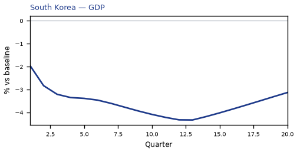

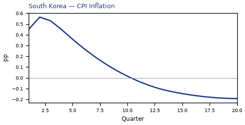

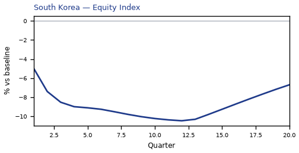

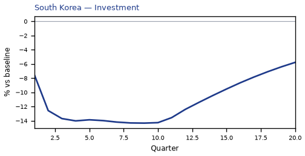

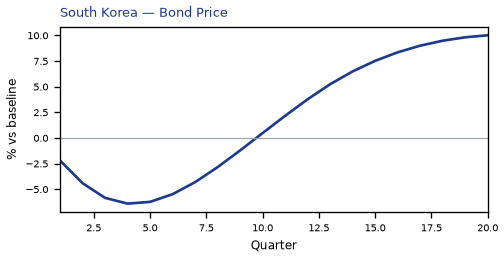

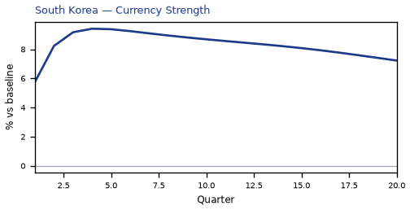

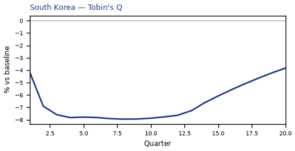

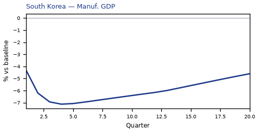

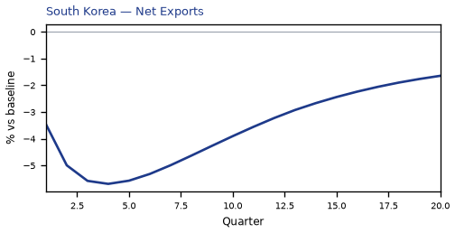

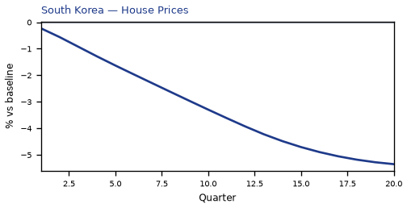

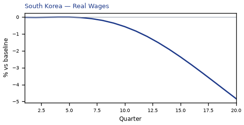

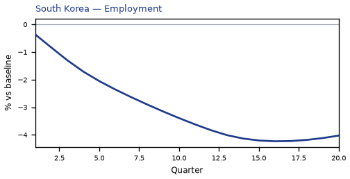

[Q1–Q20 JSON for South Korea](numbers/KR.json)

## DE — Germany

The main impact of oil at $200 a barrel on Germany would be a large drop in GDP of 3.91% by Q15. Equities peak at -7.34% in Q15.

Demand and trade. Consumption peaks at -2.22 % vs baseline in Q15, from -0.71 in Q1 to -1.91 in Q20. Investment peaks at -11.17 % vs baseline in Q12, from -4.56 in Q1 to -8.18 in Q20. Net Exports peaks at -3.29 % vs baseline in Q4, from -2.01 in Q1 to -1.37 in Q20. Gov Spending peaks at +0.87 % vs baseline in Q15, from +0.32 in Q1 to +0.72 in Q20. Gov Debt peaks at +0.74 % vs baseline in Q20, from +0.02 in Q1 to +0.74 in Q20.

External / FX. The real exchange rate shows real depreciation (a weaker, more competitive home currency). Currency Strength peaks at +6.03 % vs baseline in Q4, from +3.73 in Q1 to +1.53 in Q20.

Labour. Employment peaks at -3.91 % vs baseline in Q18, from -0.28 in Q1 to -3.88 in Q20. Unemployment peaks at +2.74 pp in Q17, from +0.23 in Q1 to +2.68 in Q20. Real Wages peaks at -2.84 % vs baseline in Q20, from -0.01 in Q1 to -2.84 in Q20.

Prices. The three-year CPI impulse is +2.61 percentage points. CPI Inflation peaks at +0.69 pp in Q2, from +0.55 in Q1 to -0.28 in Q20. Domestic Infl. peaks at +0.48 pp in Q2, from +0.38 in Q1 to -0.20 in Q20. Marginal Cost peaks at -2.32 % vs baseline in Q15, from -0.86 in Q1 to -1.93 in Q20.

Financial conditions. Policy Rate peaks at +1.50 pp (annualized) in Q6, from +0.36 in Q1 to -0.47 in Q20. Govt 2Y Yield peaks at +1.30 pp (annualized) in Q3, from +1.17 in Q1 to -0.62 in Q20. Govt 5Y Yield peaks at -0.64 pp (annualized) in Q20, from +0.61 in Q1 to -0.64 in Q20. Govt 10Y Yield peaks at -0.52 pp (annualized) in Q18, from -0.01 in Q1 to -0.52 in Q20. Bond Price peaks at -10.52 % vs baseline in Q6, from -2.51 in Q1 to +3.27 in Q20. Equity Index peaks at -7.34 % vs baseline in Q15, from -3.02 in Q1 to -5.82 in Q20. Tobin's Q peaks at -7.82 % vs baseline in Q12, from -3.19 in Q1 to -5.73 in Q20. House Prices peaks at -5.09 % vs baseline in Q20, from -0.18 in Q1 to -5.09 in Q20. Bank Credit peaks at -1.29 % vs baseline in Q18, from -0.09 in Q1 to -1.27 in Q20. Credit Spread peaks at +0.01 pp in Q18, from +0.00 in Q1 to +0.01 in Q20.

Sectoral and capital. Manuf. GDP peaks at -5.15 % vs baseline in Q4, from -3.11 in Q1 to -2.48 in Q20. Services GDP peaks at -2.67 % vs baseline in Q15, from -1.01 in Q1 to -2.22 in Q20. Capital Stock peaks at -0.98 % vs baseline in Q20, from -0.02 in Q1 to -0.98 in Q20.

Timing. By Q20 GDP is still -3.25% from baseline.

These figures are model IRFs versus baseline, not forecasts.

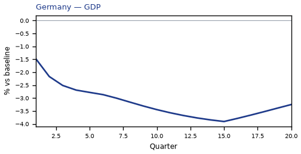

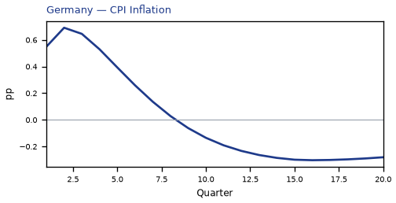

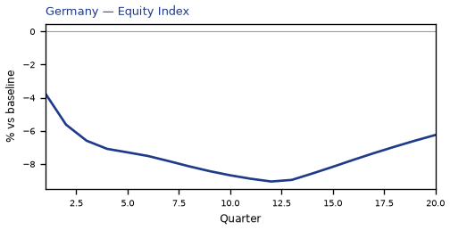

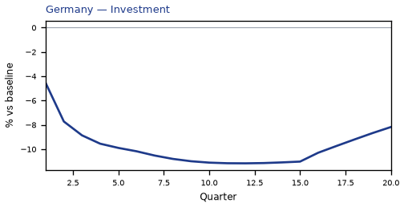

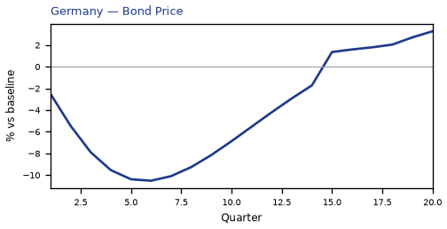

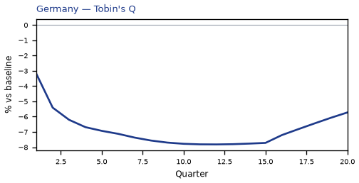

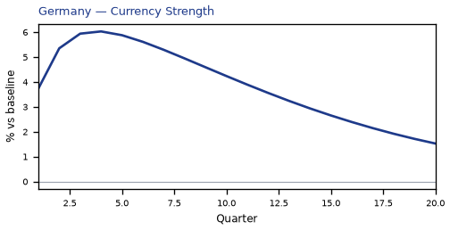

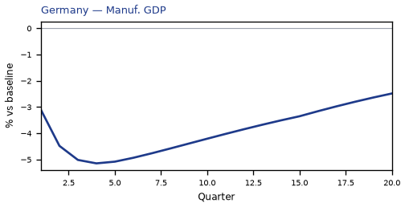

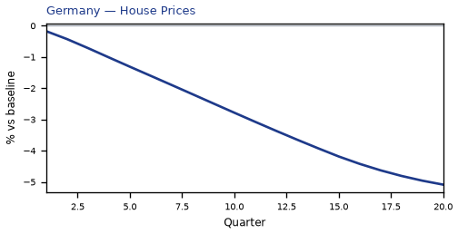

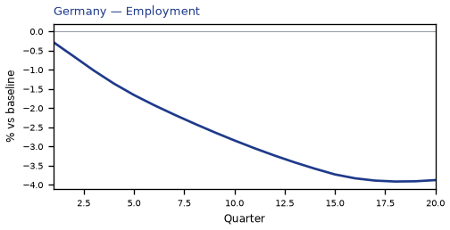

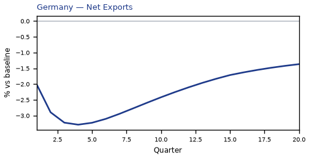

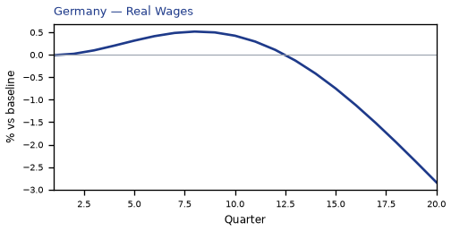

[Q1–Q20 JSON for Germany](numbers/DE.json)

## JP — Japan

The main impact of oil at $200 a barrel on Japan would be a large drop in GDP of 3.77% by Q14. Equities peak at -10.18% in Q13.

Demand and trade. Consumption peaks at -2.54 % vs baseline in Q14, from -0.93 in Q1 to -2.14 in Q20. Investment peaks at -10.70 % vs baseline in Q13, from -4.87 in Q1 to -8.34 in Q20. Net Exports peaks at -4.61 % vs baseline in Q4, from -2.82 in Q1 to -2.51 in Q20. Gov Spending peaks at +0.74 % vs baseline in Q14, from +0.34 in Q1 to +0.61 in Q20. Gov Debt peaks at -1.47 % vs baseline in Q20, from -0.04 in Q1 to -1.47 in Q20.

External / FX. The real exchange rate shows real depreciation (a weaker, more competitive home currency). Currency Strength peaks at +10.59 % vs baseline in Q4, from +6.16 in Q1 to -2.23 in Q20.

Labour. Employment peaks at -3.94 % vs baseline in Q16, from -0.42 in Q1 to -3.77 in Q20. Unemployment peaks at +2.68 pp in Q16, from +0.27 in Q1 to +2.57 in Q20. Real Wages peaks at +1.12 % vs baseline in Q12, from -0.00 in Q1 to +0.12 in Q20.

Prices. The three-year CPI impulse is +2.11 percentage points. CPI Inflation peaks at +0.56 pp in Q2, from +0.42 in Q1 to -0.25 in Q20. Domestic Infl. peaks at +0.39 pp in Q2, from +0.29 in Q1 to -0.17 in Q20. Marginal Cost peaks at -2.23 % vs baseline in Q14, from -1.03 in Q1 to -1.83 in Q20.

Financial conditions. Policy Rate peaks at +0.33 pp (annualized) in Q7, from +0.05 in Q1 to -0.06 in Q20. Govt 2Y Yield peaks at +0.29 pp (annualized) in Q4, from +0.23 in Q1 to -0.13 in Q20. Govt 5Y Yield peaks at -0.18 pp (annualized) in Q20, from +0.17 in Q1 to -0.18 in Q20. Govt 10Y Yield peaks at -0.20 pp (annualized) in Q20, from -0.01 in Q1 to -0.20 in Q20. Bond Price peaks at +3.12 % vs baseline in Q20, from -0.76 in Q1 to +3.12 in Q20. Equity Index peaks at -10.18 % vs baseline in Q13, from -4.91 in Q1 to -8.03 in Q20. Tobin's Q peaks at -7.49 % vs baseline in Q13, from -3.41 in Q1 to -5.84 in Q20. House Prices peaks at -4.61 % vs baseline in Q20, from -0.19 in Q1 to -4.61 in Q20. Bank Credit peaks at -1.29 % vs baseline in Q16, from -0.10 in Q1 to -1.25 in Q20. Credit Spread peaks at +0.01 pp in Q16, from +0.00 in Q1 to +0.01 in Q20.

Sectoral and capital. Manuf. GDP peaks at -6.62 % vs baseline in Q4, from -3.91 in Q1 to -1.31 in Q20. Services GDP peaks at -2.61 % vs baseline in Q14, from -1.23 in Q1 to -2.14 in Q20. Capital Stock peaks at -0.93 % vs baseline in Q20, from -0.02 in Q1 to -0.93 in Q20.

Timing. By Q20 GDP is still -3.09% from baseline.

These figures are model IRFs versus baseline, not forecasts.

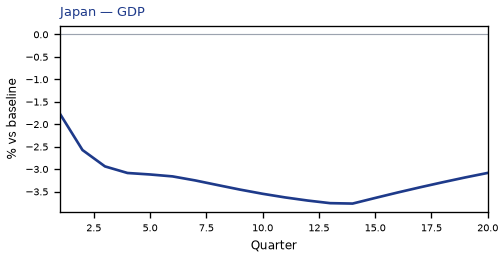


[Q1–Q20 JSON for Japan](numbers/JP.json)

## SA — Saudi Arabia

The main impact of oil at $200 a barrel on Saudi Arabia would be a large rise in GDP of 3.71% by Q4. Equities peak at +14.43% in Q4.

Demand and trade. Consumption peaks at +2.37 % vs baseline in Q5, from +1.09 in Q1 to +1.05 in Q20. Investment peaks at +9.09 % vs baseline in Q2, from +5.90 in Q1 to +6.46 in Q20. Net Exports peaks at +29.73 % vs baseline in Q4, from +18.19 in Q1 to +13.09 in Q20. Gov Spending peaks at +11.39 % vs baseline in Q4, from +6.92 in Q1 to +5.02 in Q20. Gov Debt peaks at +6.48 % vs baseline in Q20, from +0.35 in Q1 to +6.48 in Q20.

External / FX. The real exchange rate shows real appreciation (a stronger home currency). Currency Strength peaks at -0.67 % vs baseline in Q9, from -0.04 in Q1 to +0.31 in Q20.

Labour. Employment peaks at +3.30 % vs baseline in Q9, from +0.54 in Q1 to +2.22 in Q20. Unemployment peaks at -1.23 pp in Q8, from -0.24 in Q1 to -0.74 in Q20. Real Wages peaks at +5.31 % vs baseline in Q20, from +0.02 in Q1 to +5.31 in Q20.

Prices. The three-year CPI impulse is +3.00 percentage points. CPI Inflation peaks at +0.38 pp in Q3, from +0.24 in Q1 to +0.06 in Q20. Domestic Infl. peaks at +0.27 pp in Q3, from +0.17 in Q1 to +0.04 in Q20. Marginal Cost peaks at +2.24 % vs baseline in Q4, from +1.39 in Q1 to +0.94 in Q20.

Financial conditions. Policy Rate peaks at -1.40 pp (annualized) in Q20, from +0.40 in Q1 to -1.40 in Q20. Govt 2Y Yield peaks at -1.34 pp (annualized) in Q17, from +1.02 in Q1 to -1.27 in Q20. Govt 5Y Yield peaks at -1.10 pp (annualized) in Q14, from -0.02 in Q1 to -0.90 in Q20. Govt 10Y Yield peaks at -0.72 pp (annualized) in Q12, from -0.44 in Q1 to -0.55 in Q20. Bond Price peaks at +7.00 % vs baseline in Q20, from -2.00 in Q1 to +7.00 in Q20. Equity Index peaks at +14.43 % vs baseline in Q4, from +9.13 in Q1 to +6.90 in Q20. Tobin's Q peaks at +6.36 % vs baseline in Q2, from +4.13 in Q1 to +4.52 in Q20. House Prices peaks at +3.99 % vs baseline in Q19, from +0.36 in Q1 to +3.98 in Q20. Bank Credit peaks at +0.10 % vs baseline in Q14, from +0.01 in Q1 to +0.09 in Q20. Credit Spread peaks at +0.00 pp in Q1, from +0.00 in Q1 to +0.00 in Q20.

Sectoral and capital. Manuf. GDP peaks at -0.81 % vs baseline in Q3, from -0.53 in Q1 to -0.50 in Q20. Services GDP peaks at +1.63 % vs baseline in Q4, from +1.01 in Q1 to +0.69 in Q20. Capital Stock peaks at +0.71 % vs baseline in Q20, from +0.03 in Q1 to +0.71 in Q20.

Timing. By Q20 GDP is still +1.56% from baseline.

These figures are model IRFs versus baseline, not forecasts.


[Q1–Q20 JSON for Saudi Arabia](numbers/SA.json)

## PL — Poland

The main impact of oil at $200 a barrel on Poland would be a large drop in GDP of 3.61% by Q16. Equities peak at -5.80% in Q12.

Demand and trade. Consumption peaks at -1.94 % vs baseline in Q16, from -0.68 in Q1 to -1.75 in Q20. Investment peaks at -10.07 % vs baseline in Q9, from -4.69 in Q1 to -6.89 in Q20. Net Exports peaks at -2.35 % vs baseline in Q4, from -1.36 in Q1 to -0.55 in Q20. Gov Spending peaks at +0.71 % vs baseline in Q16, from +0.27 in Q1 to +0.62 in Q20. Gov Debt peaks at +0.00 % vs baseline in Q1, from +0.00 in Q1 to +0.00 in Q20.

External / FX. The real exchange rate shows real depreciation (a weaker, more competitive home currency). Currency Strength peaks at +4.66 % vs baseline in Q3, from +3.25 in Q1 to +2.76 in Q20.

Labour. Employment peaks at -3.86 % vs baseline in Q19, from -0.29 in Q1 to -3.84 in Q20. Unemployment peaks at +1.50 pp in Q18, from +0.14 in Q1 to +1.46 in Q20. Real Wages peaks at -3.58 % vs baseline in Q20, from -0.02 in Q1 to -3.58 in Q20.

Prices. The three-year CPI impulse is +2.48 percentage points. CPI Inflation peaks at +0.55 pp in Q2, from +0.44 in Q1 to -0.21 in Q20. Domestic Infl. peaks at +0.38 pp in Q2, from +0.31 in Q1 to -0.15 in Q20. Marginal Cost peaks at -2.14 % vs baseline in Q16, from -0.82 in Q1 to -1.85 in Q20.

Financial conditions. Policy Rate peaks at +1.92 pp (annualized) in Q5, from +0.59 in Q1 to -1.06 in Q20. Govt 2Y Yield peaks at +1.58 pp (annualized) in Q2, from +1.52 in Q1 to -1.13 in Q20. Govt 5Y Yield peaks at -1.02 pp (annualized) in Q18, from +0.49 in Q1 to -1.01 in Q20. Govt 10Y Yield peaks at -0.81 pp (annualized) in Q15, from -0.25 in Q1 to -0.76 in Q20. Bond Price peaks at -8.02 % vs baseline in Q5, from -2.45 in Q1 to +4.41 in Q20. Equity Index peaks at -5.80 % vs baseline in Q12, from -2.70 in Q1 to -4.52 in Q20. Tobin's Q peaks at -7.05 % vs baseline in Q9, from -3.28 in Q1 to -4.82 in Q20. House Prices peaks at -4.77 % vs baseline in Q20, from -0.17 in Q1 to -4.77 in Q20. Bank Credit peaks at -0.77 % vs baseline in Q18, from -0.06 in Q1 to -0.76 in Q20. Credit Spread peaks at +0.02 pp in Q18, from +0.00 in Q1 to +0.02 in Q20.

Sectoral and capital. Manuf. GDP peaks at -4.74 % vs baseline in Q4, from -3.02 in Q1 to -2.89 in Q20. Services GDP peaks at -2.26 % vs baseline in Q16, from -0.88 in Q1 to -1.95 in Q20. Capital Stock peaks at -0.90 % vs baseline in Q20, from -0.02 in Q1 to -0.90 in Q20.

Timing. By Q20 GDP is still -3.11% from baseline.

These figures are model IRFs versus baseline, not forecasts.


[Q1–Q20 JSON for Poland](numbers/PL.json)

## IT — Italy

The main impact of oil at $200 a barrel on Italy would be a large drop in GDP of 3.58% by Q15. Equities peak at -5.86% in Q13.

Demand and trade. Consumption peaks at -1.89 % vs baseline in Q16, from -0.71 in Q1 to -1.69 in Q20. Investment peaks at -10.38 % vs baseline in Q10, from -4.78 in Q1 to -7.75 in Q20. Net Exports peaks at -3.40 % vs baseline in Q4, from -2.07 in Q1 to -1.46 in Q20. Gov Spending peaks at +0.77 % vs baseline in Q15, from +0.33 in Q1 to +0.67 in Q20. Gov Debt peaks at +0.35 % vs baseline in Q16, from +0.07 in Q1 to +0.32 in Q20.

External / FX. The real exchange rate shows real depreciation (a weaker, more competitive home currency). Currency Strength peaks at +7.17 % vs baseline in Q4, from +4.42 in Q1 to +1.98 in Q20.

Labour. Employment peaks at -3.87 % vs baseline in Q19, from -0.28 in Q1 to -3.87 in Q20. Unemployment peaks at +1.49 pp in Q17, from +0.16 in Q1 to +1.45 in Q20. Real Wages peaks at -1.17 % vs baseline in Q20, from -0.01 in Q1 to -1.17 in Q20.

Prices. The three-year CPI impulse is +2.41 percentage points. CPI Inflation peaks at +0.56 pp in Q2, from +0.43 in Q1 to -0.23 in Q20. Domestic Infl. peaks at +0.39 pp in Q2, from +0.30 in Q1 to -0.16 in Q20. Marginal Cost peaks at -2.12 % vs baseline in Q15, from -0.91 in Q1 to -1.83 in Q20.

Financial conditions. Policy Rate peaks at +1.50 pp (annualized) in Q6, from +0.36 in Q1 to -0.47 in Q20. Govt 2Y Yield peaks at +1.30 pp (annualized) in Q3, from +1.17 in Q1 to -0.62 in Q20. Govt 5Y Yield peaks at -0.64 pp (annualized) in Q20, from +0.61 in Q1 to -0.64 in Q20. Govt 10Y Yield peaks at -0.52 pp (annualized) in Q18, from -0.01 in Q1 to -0.52 in Q20. Bond Price peaks at -10.44 % vs baseline in Q6, from -2.49 in Q1 to +3.24 in Q20. Equity Index peaks at -5.86 % vs baseline in Q13, from -2.93 in Q1 to -4.68 in Q20. Tobin's Q peaks at -7.27 % vs baseline in Q10, from -3.34 in Q1 to -5.42 in Q20. House Prices peaks at -4.61 % vs baseline in Q20, from -0.18 in Q1 to -4.61 in Q20. Bank Credit peaks at -1.05 % vs baseline in Q17, from -0.08 in Q1 to -1.03 in Q20. Credit Spread peaks at +0.02 pp in Q17, from +0.00 in Q1 to +0.02 in Q20.

Sectoral and capital. Manuf. GDP peaks at -4.87 % vs baseline in Q4, from -2.97 in Q1 to -2.21 in Q20. Services GDP peaks at -2.60 % vs baseline in Q15, from -1.14 in Q1 to -2.25 in Q20. Capital Stock peaks at -0.93 % vs baseline in Q20, from -0.02 in Q1 to -0.93 in Q20.

Timing. By Q20 GDP is still -3.10% from baseline.

These figures are model IRFs versus baseline, not forecasts.


[Q1–Q20 JSON for Italy](numbers/IT.json)

## AR — Argentina

The main impact of oil at $200 a barrel on Argentina would be a large drop in GDP of 3.54% by Q13. Equities peak at -5.40% in Q10.

Demand and trade. Consumption peaks at -1.80 % vs baseline in Q14, from -0.33 in Q1 to -1.21 in Q20. Investment peaks at -8.18 % vs baseline in Q9, from -2.77 in Q1 to -1.23 in Q20. Net Exports peaks at +2.13 % vs baseline in Q7, from +0.87 in Q1 to +1.18 in Q20. Gov Spending peaks at +0.90 % vs baseline in Q12, from +0.24 in Q1 to +0.54 in Q20. Gov Debt peaks at -3.31 % vs baseline in Q20, from -0.04 in Q1 to -3.31 in Q20.

External / FX. The real exchange rate shows real depreciation (a weaker, more competitive home currency). Currency Strength peaks at +3.09 % vs baseline in Q12, from +0.57 in Q1 to +1.64 in Q20.

Labour. Employment peaks at -3.55 % vs baseline in Q18, from -0.09 in Q1 to -3.45 in Q20. Unemployment peaks at +0.70 pp in Q15, from +0.04 in Q1 to +0.56 in Q20. Real Wages peaks at -7.00 % vs baseline in Q20, from -0.02 in Q1 to -7.00 in Q20.

Prices. The three-year CPI impulse is +1.18 percentage points. CPI Inflation peaks at -0.59 pp in Q18, from +0.32 in Q1 to -0.56 in Q20. Domestic Infl. peaks at -0.42 pp in Q18, from +0.22 in Q1 to -0.39 in Q20. Marginal Cost peaks at -2.10 % vs baseline in Q13, from -0.35 in Q1 to -1.21 in Q20.

Financial conditions. Policy Rate peaks at -2.72 pp (annualized) in Q19, from +0.76 in Q1 to -2.66 in Q20. Govt 2Y Yield peaks at -2.58 pp (annualized) in Q15, from +1.25 in Q1 to -2.11 in Q20. Govt 5Y Yield peaks at -2.00 pp (annualized) in Q11, from -0.68 in Q1 to -1.15 in Q20. Govt 10Y Yield peaks at -1.10 pp (annualized) in Q9, from -0.85 in Q1 to -0.60 in Q20. Bond Price peaks at +6.80 % vs baseline in Q19, from -1.91 in Q1 to +6.66 in Q20. Equity Index peaks at -5.40 % vs baseline in Q10, from -1.33 in Q1 to -1.59 in Q20. Tobin's Q peaks at -5.72 % vs baseline in Q9, from -1.94 in Q1 to -0.86 in Q20. House Prices peaks at -4.05 % vs baseline in Q19, from -0.11 in Q1 to -4.00 in Q20. Bank Credit peaks at -0.43 % vs baseline in Q17, from -0.04 in Q1 to -0.43 in Q20. Credit Spread peaks at +0.13 pp in Q17, from +0.01 in Q1 to +0.12 in Q20.

Sectoral and capital. Manuf. GDP peaks at -2.99 % vs baseline in Q10, from -1.47 in Q1 to -1.75 in Q20. Services GDP peaks at -2.02 % vs baseline in Q13, from -0.35 in Q1 to -1.17 in Q20. Capital Stock peaks at -0.59 % vs baseline in Q20, from -0.01 in Q1 to -0.59 in Q20.

Timing. By Q20 GDP is still -2.04% from baseline.

These figures are model IRFs versus baseline, not forecasts.


[Q1–Q20 JSON for Argentina](numbers/AR.json)

## ES — Spain

The main impact of oil at $200 a barrel on Spain would be a large drop in GDP of 3.33% by Q17. Equities peak at -5.98% in Q13.

Demand and trade. Consumption peaks at -1.92 % vs baseline in Q17, from -0.69 in Q1 to -1.79 in Q20. Investment peaks at -9.66 % vs baseline in Q10, from -4.42 in Q1 to -7.56 in Q20. Net Exports peaks at -3.38 % vs baseline in Q4, from -2.07 in Q1 to -1.45 in Q20. Gov Spending peaks at +0.72 % vs baseline in Q17, from +0.30 in Q1 to +0.65 in Q20. Gov Debt peaks at +0.32 % vs baseline in Q20, from +0.01 in Q1 to +0.32 in Q20.

External / FX. The real exchange rate shows real depreciation (a weaker, more competitive home currency). Currency Strength peaks at +5.86 % vs baseline in Q4, from +3.66 in Q1 to +1.36 in Q20.

Labour. Employment peaks at -3.55 % vs baseline in Q20, from -0.26 in Q1 to -3.55 in Q20. Unemployment peaks at +1.63 pp in Q19, from +0.15 in Q1 to +1.62 in Q20. Real Wages peaks at -1.29 % vs baseline in Q20, from -0.01 in Q1 to -1.29 in Q20.

Prices. The three-year CPI impulse is +2.78 percentage points. CPI Inflation peaks at +0.63 pp in Q2, from +0.49 in Q1 to -0.25 in Q20. Domestic Infl. peaks at +0.44 pp in Q2, from +0.34 in Q1 to -0.17 in Q20. Marginal Cost peaks at -1.97 % vs baseline in Q17, from -0.83 in Q1 to -1.79 in Q20.

Financial conditions. Policy Rate peaks at +1.50 pp (annualized) in Q6, from +0.36 in Q1 to -0.47 in Q20. Govt 2Y Yield peaks at +1.30 pp (annualized) in Q3, from +1.17 in Q1 to -0.62 in Q20. Govt 5Y Yield peaks at -0.64 pp (annualized) in Q20, from +0.61 in Q1 to -0.64 in Q20. Govt 10Y Yield peaks at -0.52 pp (annualized) in Q18, from -0.01 in Q1 to -0.52 in Q20. Bond Price peaks at -10.52 % vs baseline in Q6, from -2.51 in Q1 to +3.27 in Q20. Equity Index peaks at -5.98 % vs baseline in Q13, from -2.97 in Q1 to -5.16 in Q20. Tobin's Q peaks at -6.76 % vs baseline in Q10, from -3.09 in Q1 to -5.29 in Q20. House Prices peaks at -4.36 % vs baseline in Q20, from -0.17 in Q1 to -4.36 in Q20. Bank Credit peaks at -0.86 % vs baseline in Q17, from -0.07 in Q1 to -0.85 in Q20. Credit Spread peaks at +0.01 pp in Q17, from +0.00 in Q1 to +0.01 in Q20.

Sectoral and capital. Manuf. GDP peaks at -4.18 % vs baseline in Q4, from -2.56 in Q1 to -1.86 in Q20. Services GDP peaks at -2.45 % vs baseline in Q17, from -1.05 in Q1 to -2.23 in Q20. Capital Stock peaks at -0.87 % vs baseline in Q20, from -0.02 in Q1 to -0.87 in Q20.

Timing. By Q20 GDP is still -3.02% from baseline.

These figures are model IRFs versus baseline, not forecasts.


[Q1–Q20 JSON for Spain](numbers/ES.json)

## TH — Thailand

The main impact of oil at $200 a barrel on Thailand would be a large drop in GDP of 3.20% by Q16. Equities peak at -7.42% in Q13.

Demand and trade. Consumption peaks at -2.15 % vs baseline in Q17, from -0.79 in Q1 to -1.97 in Q20. Investment peaks at -8.54 % vs baseline in Q9, from -4.53 in Q1 to -5.43 in Q20. Net Exports peaks at -2.67 % vs baseline in Q3, from -1.88 in Q1 to -0.42 in Q20. Gov Spending peaks at +0.53 % vs baseline in Q16, from +0.25 in Q1 to +0.47 in Q20. Gov Debt peaks at -5.71 % vs baseline in Q20, from -0.24 in Q1 to -5.71 in Q20.

External / FX. The real exchange rate shows real depreciation (a weaker, more competitive home currency). Currency Strength peaks at +1.27 % vs baseline in Q3, from +0.81 in Q1 to +1.01 in Q20.

Labour. Employment peaks at -3.56 % vs baseline in Q19, from -0.34 in Q1 to -3.53 in Q20. Unemployment peaks at +0.31 pp in Q17, from +0.05 in Q1 to +0.30 in Q20. Real Wages peaks at -3.89 % vs baseline in Q20, from -0.02 in Q1 to -3.89 in Q20.

Prices. The three-year CPI impulse is +2.70 percentage points. CPI Inflation peaks at +0.54 pp in Q2, from +0.38 in Q1 to -0.19 in Q20. Domestic Infl. peaks at +0.38 pp in Q2, from +0.27 in Q1 to -0.13 in Q20. Marginal Cost peaks at -1.89 % vs baseline in Q16, from -0.89 in Q1 to -1.68 in Q20.

Financial conditions. Policy Rate peaks at -1.49 pp (annualized) in Q20, from +0.26 in Q1 to -1.49 in Q20. Govt 2Y Yield peaks at -1.53 pp (annualized) in Q20, from +0.75 in Q1 to -1.53 in Q20. Govt 5Y Yield peaks at -1.38 pp (annualized) in Q17, from -0.10 in Q1 to -1.33 in Q20. Govt 10Y Yield peaks at -1.09 pp (annualized) in Q14, from -0.70 in Q1 to -1.00 in Q20. Bond Price peaks at +6.22 % vs baseline in Q20, from -1.07 in Q1 to +6.22 in Q20. Equity Index peaks at -7.42 % vs baseline in Q13, from -3.90 in Q1 to -6.17 in Q20. Tobin's Q peaks at -5.98 % vs baseline in Q9, from -3.17 in Q1 to -3.80 in Q20. House Prices peaks at -5.36 % vs baseline in Q20, from -0.26 in Q1 to -5.36 in Q20. Bank Credit peaks at -0.68 % vs baseline in Q18, from -0.05 in Q1 to -0.67 in Q20. Credit Spread peaks at +0.01 pp in Q18, from +0.00 in Q1 to +0.01 in Q20.

Sectoral and capital. Manuf. GDP peaks at -4.02 % vs baseline in Q4, from -2.47 in Q1 to -2.43 in Q20. Services GDP peaks at -1.76 % vs baseline in Q16, from -0.84 in Q1 to -1.56 in Q20. Capital Stock peaks at -0.76 % vs baseline in Q20, from -0.02 in Q1 to -0.76 in Q20.

Timing. By Q20 GDP is still -2.83% from baseline.

These figures are model IRFs versus baseline, not forecasts.


[Q1–Q20 JSON for Thailand](numbers/TH.json)

## FR — France

The main impact of oil at $200 a barrel on France would be a large drop in GDP of 3.19% by Q17. Equities peak at -6.71% in Q15.

Demand and trade. Consumption peaks at -1.75 % vs baseline in Q18, from -0.57 in Q1 to -1.68 in Q20. Investment peaks at -9.32 % vs baseline in Q10, from -3.79 in Q1 to -7.48 in Q20. Net Exports peaks at -2.08 % vs baseline in Q4, from -1.32 in Q1 to -0.83 in Q20. Gov Spending peaks at +0.75 % vs baseline in Q17, from +0.28 in Q1 to +0.70 in Q20. Gov Debt peaks at +2.96 % vs baseline in Q20, from +0.09 in Q1 to +2.96 in Q20.

External / FX. The real exchange rate shows real depreciation (a weaker, more competitive home currency). Currency Strength peaks at +5.96 % vs baseline in Q4, from +3.72 in Q1 to +1.47 in Q20.

Labour. Employment peaks at -3.34 % vs baseline in Q20, from -0.19 in Q1 to -3.34 in Q20. Unemployment peaks at +2.33 pp in Q19, from +0.19 in Q1 to +2.33 in Q20. Real Wages peaks at -1.24 % vs baseline in Q20, from -0.01 in Q1 to -1.24 in Q20.

Prices. The three-year CPI impulse is +2.38 percentage points. CPI Inflation peaks at +0.57 pp in Q2, from +0.44 in Q1 to -0.23 in Q20. Domestic Infl. peaks at +0.40 pp in Q2, from +0.31 in Q1 to -0.16 in Q20. Marginal Cost peaks at -1.89 % vs baseline in Q17, from -0.70 in Q1 to -1.78 in Q20.

Financial conditions. Policy Rate peaks at +1.50 pp (annualized) in Q6, from +0.36 in Q1 to -0.47 in Q20. Govt 2Y Yield peaks at +1.30 pp (annualized) in Q3, from +1.17 in Q1 to -0.62 in Q20. Govt 5Y Yield peaks at -0.64 pp (annualized) in Q20, from +0.61 in Q1 to -0.64 in Q20. Govt 10Y Yield peaks at -0.52 pp (annualized) in Q18, from -0.01 in Q1 to -0.52 in Q20. Bond Price peaks at -10.52 % vs baseline in Q6, from -2.51 in Q1 to +3.27 in Q20. Equity Index peaks at -6.71 % vs baseline in Q15, from -2.85 in Q1 to -6.07 in Q20. Tobin's Q peaks at -6.53 % vs baseline in Q10, from -2.66 in Q1 to -5.23 in Q20. House Prices peaks at -4.19 % vs baseline in Q20, from -0.14 in Q1 to -4.19 in Q20. Bank Credit peaks at -1.13 % vs baseline in Q18, from -0.07 in Q1 to -1.11 in Q20. Credit Spread peaks at +0.01 pp in Q18, from +0.00 in Q1 to +0.01 in Q20.

Sectoral and capital. Manuf. GDP peaks at -3.92 % vs baseline in Q4, from -2.39 in Q1 to -1.75 in Q20. Services GDP peaks at -2.46 % vs baseline in Q17, from -0.92 in Q1 to -2.30 in Q20. Capital Stock peaks at -0.83 % vs baseline in Q20, from -0.02 in Q1 to -0.83 in Q20.

Timing. By Q20 GDP is still -2.99% from baseline.

These figures are model IRFs versus baseline, not forecasts.


[Q1–Q20 JSON for France](numbers/FR.json)

## ZA — South Africa

The main impact of oil at $200 a barrel on South Africa would be a large drop in GDP of 3.06% by Q15. Equities peak at -11.57% in Q13.

Demand and trade. Consumption peaks at -1.81 % vs baseline in Q16, from -0.59 in Q1 to -1.66 in Q20. Investment peaks at -8.72 % vs baseline in Q8, from -3.97 in Q1 to -5.40 in Q20. Net Exports peaks at -2.65 % vs baseline in Q4, from -1.50 in Q1 to -1.26 in Q20. Gov Spending peaks at +0.48 % vs baseline in Q15, from +0.19 in Q1 to +0.42 in Q20. Gov Debt peaks at -3.19 % vs baseline in Q20, from -0.09 in Q1 to -3.19 in Q20.

External / FX. The real exchange rate shows real depreciation (a weaker, more competitive home currency). Currency Strength peaks at +4.61 % vs baseline in Q4, from +2.94 in Q1 to +2.55 in Q20.

Labour. Employment peaks at -3.45 % vs baseline in Q19, from -0.24 in Q1 to -3.44 in Q20. Unemployment peaks at +0.74 pp in Q18, from +0.08 in Q1 to +0.72 in Q20. Real Wages peaks at -3.88 % vs baseline in Q20, from -0.02 in Q1 to -3.88 in Q20.

Prices. The three-year CPI impulse is +1.90 percentage points. CPI Inflation peaks at +0.42 pp in Q2, from +0.33 in Q1 to -0.23 in Q20. Domestic Infl. peaks at +0.30 pp in Q2, from +0.23 in Q1 to -0.16 in Q20. Marginal Cost peaks at -1.82 % vs baseline in Q15, from -0.68 in Q1 to -1.59 in Q20.

Financial conditions. Policy Rate peaks at +1.71 pp (annualized) in Q5, from +0.53 in Q1 to -1.23 in Q20. Govt 2Y Yield peaks at +1.37 pp (annualized) in Q2, from +1.33 in Q1 to -1.21 in Q20. Govt 5Y Yield peaks at -1.05 pp (annualized) in Q16, from +0.27 in Q1 to -0.97 in Q20. Govt 10Y Yield peaks at -0.76 pp (annualized) in Q14, from -0.33 in Q1 to -0.67 in Q20. Bond Price peaks at -7.11 % vs baseline in Q5, from -2.22 in Q1 to +5.14 in Q20. Equity Index peaks at -11.57 % vs baseline in Q13, from -4.77 in Q1 to -9.55 in Q20. Tobin's Q peaks at -6.10 % vs baseline in Q8, from -2.78 in Q1 to -3.78 in Q20. House Prices peaks at -4.62 % vs baseline in Q20, from -0.19 in Q1 to -4.62 in Q20. Bank Credit peaks at -0.64 % vs baseline in Q18, from -0.05 in Q1 to -0.63 in Q20. Credit Spread peaks at +0.02 pp in Q18, from +0.00 in Q1 to +0.02 in Q20.

Sectoral and capital. Manuf. GDP peaks at -3.49 % vs baseline in Q4, from -2.15 in Q1 to -2.01 in Q20. Services GDP peaks at -1.96 % vs baseline in Q15, from -0.75 in Q1 to -1.70 in Q20. Capital Stock peaks at -0.75 % vs baseline in Q20, from -0.02 in Q1 to -0.75 in Q20.

Timing. By Q20 GDP is still -2.67% from baseline.

These figures are model IRFs versus baseline, not forecasts.


[Q1–Q20 JSON for South Africa](numbers/ZA.json)

## CL — Chile

The main impact of oil at $200 a barrel on Chile would be a large drop in GDP of 2.63% by Q15. Equities peak at -5.67% in Q11.

Demand and trade. Consumption peaks at -1.66 % vs baseline in Q16, from -0.57 in Q1 to -1.53 in Q20. Investment peaks at -7.96 % vs baseline in Q7, from -3.62 in Q1 to -4.30 in Q20. Net Exports peaks at -2.90 % vs baseline in Q5, from -1.57 in Q1 to -1.66 in Q20. Gov Spending peaks at +0.23 % vs baseline in Q15, from +0.13 in Q1 to +0.21 in Q20. Gov Debt peaks at -2.89 % vs baseline in Q20, from -0.12 in Q1 to -2.89 in Q20.

External / FX. The real exchange rate shows real depreciation (a weaker, more competitive home currency). Currency Strength peaks at +3.63 % vs baseline in Q3, from +2.29 in Q1 to +1.50 in Q20.

Labour. Employment peaks at -2.91 % vs baseline in Q19, from -0.23 in Q1 to -2.89 in Q20. Unemployment peaks at +0.95 pp in Q18, from +0.10 in Q1 to +0.92 in Q20. Real Wages peaks at -3.55 % vs baseline in Q20, from -0.02 in Q1 to -3.55 in Q20.

Prices. The three-year CPI impulse is +1.41 percentage points. CPI Inflation peaks at +0.40 pp in Q2, from +0.31 in Q1 to -0.20 in Q20. Domestic Infl. peaks at +0.28 pp in Q2, from +0.22 in Q1 to -0.14 in Q20. Marginal Cost peaks at -1.56 % vs baseline in Q15, from -0.62 in Q1 to -1.36 in Q20.

Financial conditions. Policy Rate peaks at +1.70 pp (annualized) in Q5, from +0.50 in Q1 to -1.29 in Q20. Govt 2Y Yield peaks at +1.37 pp (annualized) in Q2, from +1.32 in Q1 to -1.27 in Q20. Govt 5Y Yield peaks at -1.10 pp (annualized) in Q16, from +0.26 in Q1 to -1.01 in Q20. Govt 10Y Yield peaks at -0.81 pp (annualized) in Q14, from -0.36 in Q1 to -0.71 in Q20. Bond Price peaks at -7.09 % vs baseline in Q5, from -2.08 in Q1 to +5.37 in Q20. Equity Index peaks at -5.67 % vs baseline in Q11, from -2.61 in Q1 to -4.20 in Q20. Tobin's Q peaks at -5.57 % vs baseline in Q7, from -2.54 in Q1 to -3.01 in Q20. House Prices peaks at -4.05 % vs baseline in Q20, from -0.18 in Q1 to -4.05 in Q20. Bank Credit peaks at -0.52 % vs baseline in Q18, from -0.04 in Q1 to -0.52 in Q20. Credit Spread peaks at +0.01 pp in Q18, from +0.00 in Q1 to +0.01 in Q20.

Sectoral and capital. Manuf. GDP peaks at -3.15 % vs baseline in Q4, from -1.94 in Q1 to -1.63 in Q20. Services GDP peaks at -1.59 % vs baseline in Q15, from -0.64 in Q1 to -1.39 in Q20. Capital Stock peaks at -0.66 % vs baseline in Q20, from -0.02 in Q1 to -0.66 in Q20.

Timing. By Q20 GDP is still -2.30% from baseline.

These figures are model IRFs versus baseline, not forecasts.


[Q1–Q20 JSON for Chile](numbers/CL.json)

## CN — China

The main impact of oil at $200 a barrel on China would be a large drop in GDP of 2.62% by Q13. Equities peak at -5.41% in Q9.

Demand and trade. Consumption peaks at -1.96 % vs baseline in Q14, from -0.81 in Q1 to -1.65 in Q20. Investment peaks at -6.94 % vs baseline in Q4, from -3.83 in Q1 to -2.15 in Q20. Net Exports peaks at -3.43 % vs baseline in Q4, from -2.04 in Q1 to -1.33 in Q20. Gov Spending peaks at +0.45 % vs baseline in Q13, from +0.23 in Q1 to +0.36 in Q20. Gov Debt peaks at -4.65 % vs baseline in Q20, from -0.15 in Q1 to -4.65 in Q20.

External / FX. The real exchange rate shows real depreciation (a weaker, more competitive home currency). Currency Strength peaks at +2.97 % vs baseline in Q20, from +1.43 in Q1 to +2.97 in Q20.

Labour. Employment peaks at -2.48 % vs baseline in Q19, from -0.17 in Q1 to -2.47 in Q20. Unemployment peaks at +0.60 pp in Q15, from +0.09 in Q1 to +0.55 in Q20. Real Wages peaks at -4.07 % vs baseline in Q20, from -0.02 in Q1 to -4.07 in Q20.

Prices. The three-year CPI impulse is +2.63 percentage points. CPI Inflation peaks at +0.63 pp in Q2, from +0.51 in Q1 to -0.28 in Q20. Domestic Infl. peaks at +0.44 pp in Q2, from +0.36 in Q1 to -0.20 in Q20. Marginal Cost peaks at -1.54 % vs baseline in Q13, from -0.78 in Q1 to -1.23 in Q20.

Financial conditions. Policy Rate peaks at -2.30 pp (annualized) in Q20, from +0.12 in Q1 to -2.30 in Q20. Govt 2Y Yield peaks at -2.37 pp (annualized) in Q20, from +0.20 in Q1 to -2.37 in Q20. Govt 5Y Yield peaks at -2.18 pp (annualized) in Q16, from -0.78 in Q1 to -2.10 in Q20. Govt 10Y Yield peaks at -1.74 pp (annualized) in Q12, from -1.42 in Q1 to -1.56 in Q20. Bond Price peaks at +11.51 % vs baseline in Q20, from -0.59 in Q1 to +11.51 in Q20. Equity Index peaks at -5.41 % vs baseline in Q9, from -2.89 in Q1 to -3.70 in Q20. Tobin's Q peaks at -4.85 % vs baseline in Q4, from -2.68 in Q1 to -1.50 in Q20. House Prices peaks at -3.62 % vs baseline in Q20, from -0.20 in Q1 to -3.62 in Q20. Bank Credit peaks at -0.65 % vs baseline in Q16, from -0.05 in Q1 to -0.63 in Q20. Credit Spread peaks at +0.01 pp in Q16, from +0.00 in Q1 to +0.01 in Q20.

Sectoral and capital. Manuf. GDP peaks at -4.61 % vs baseline in Q4, from -2.82 in Q1 to -2.98 in Q20. Services GDP peaks at -1.53 % vs baseline in Q13, from -0.79 in Q1 to -1.22 in Q20. Capital Stock peaks at -0.54 % vs baseline in Q20, from -0.02 in Q1 to -0.54 in Q20.

Timing. By Q20 GDP is still -2.09% from baseline.

These figures are model IRFs versus baseline, not forecasts.


[Q1–Q20 JSON for China](numbers/CN.json)

## ID — Indonesia

The main impact of oil at $200 a barrel on Indonesia would be a large drop in GDP of 2.49% by Q14. Equities peak at -4.64% in Q11.

Demand and trade. Consumption peaks at -1.52 % vs baseline in Q16, from -0.51 in Q1 to -1.38 in Q20. Investment peaks at -7.65 % vs baseline in Q8, from -3.29 in Q1 to -3.75 in Q20. Net Exports peaks at -1.22 % vs baseline in Q4, from -0.79 in Q1 to -0.41 in Q20. Gov Spending peaks at +0.41 % vs baseline in Q14, from +0.16 in Q1 to +0.34 in Q20. Gov Debt peaks at -4.46 % vs baseline in Q20, from -0.18 in Q1 to -4.46 in Q20.

External / FX. The real exchange rate shows real appreciation (a stronger home currency). Currency Strength peaks at -4.81 % vs baseline in Q5, from -2.99 in Q1 to -1.82 in Q20.

Labour. Employment peaks at -2.49 % vs baseline in Q20, from -0.13 in Q1 to -2.49 in Q20. Unemployment peaks at +0.22 pp in Q16, from +0.03 in Q1 to +0.20 in Q20. Real Wages peaks at -3.51 % vs baseline in Q20, from -0.02 in Q1 to -3.51 in Q20.

Prices. The three-year CPI impulse is +2.12 percentage points. CPI Inflation peaks at +0.45 pp in Q3, from +0.25 in Q1 to -0.29 in Q20. Domestic Infl. peaks at +0.31 pp in Q3, from +0.17 in Q1 to -0.20 in Q20. Marginal Cost peaks at -1.47 % vs baseline in Q14, from -0.59 in Q1 to -1.26 in Q20.

Financial conditions. Policy Rate peaks at +1.55 pp (annualized) in Q5, from +0.35 in Q1 to -1.32 in Q20. Govt 2Y Yield peaks at -1.35 pp (annualized) in Q20, from +1.20 in Q1 to -1.35 in Q20. Govt 5Y Yield peaks at -1.17 pp (annualized) in Q16, from +0.27 in Q1 to -1.11 in Q20. Govt 10Y Yield peaks at -0.86 pp (annualized) in Q14, from -0.41 in Q1 to -0.78 in Q20. Bond Price peaks at -6.44 % vs baseline in Q5, from -1.48 in Q1 to +5.49 in Q20. Equity Index peaks at -4.64 % vs baseline in Q11, from -2.17 in Q1 to -3.37 in Q20. Tobin's Q peaks at -5.35 % vs baseline in Q8, from -2.30 in Q1 to -2.62 in Q20. House Prices peaks at -3.67 % vs baseline in Q20, from -0.16 in Q1 to -3.67 in Q20. Bank Credit peaks at -0.50 % vs baseline in Q17, from -0.04 in Q1 to -0.49 in Q20. Credit Spread peaks at +0.02 pp in Q17, from +0.00 in Q1 to +0.02 in Q20.

Sectoral and capital. Manuf. GDP peaks at -1.43 % vs baseline in Q4, from -0.83 in Q1 to -1.05 in Q20. Services GDP peaks at -1.23 % vs baseline in Q14, from -0.51 in Q1 to -1.05 in Q20. Capital Stock peaks at -0.62 % vs baseline in Q20, from -0.02 in Q1 to -0.62 in Q20.

Timing. By Q20 GDP is still -2.12% from baseline.

These figures are model IRFs versus baseline, not forecasts.


[Q1–Q20 JSON for Indonesia](numbers/ID.json)

## NL — Netherlands

The main impact of oil at $200 a barrel on Netherlands would be a large drop in GDP of 2.46% by Q17. Equities peak at -6.27% in Q15.

Demand and trade. Consumption peaks at -1.45 % vs baseline in Q18, from -0.48 in Q1 to -1.40 in Q20. Investment peaks at -7.52 % vs baseline in Q9, from -3.07 in Q1 to -5.67 in Q20. Net Exports peaks at +1.68 % vs baseline in Q5, from +0.93 in Q1 to +0.75 in Q20. Gov Spending peaks at +0.60 % vs baseline in Q15, from +0.27 in Q1 to +0.56 in Q20. Gov Debt peaks at +0.66 % vs baseline in Q20, from +0.02 in Q1 to +0.66 in Q20.

External / FX. The real exchange rate shows real appreciation (a stronger home currency). Currency Strength peaks at -2.67 % vs baseline in Q5, from -1.48 in Q1 to -2.35 in Q20.

Labour. Employment peaks at -2.50 % vs baseline in Q20, from -0.15 in Q1 to -2.50 in Q20. Unemployment peaks at +1.80 pp in Q20, from +0.15 in Q1 to +1.80 in Q20. Real Wages peaks at -1.32 % vs baseline in Q20, from -0.01 in Q1 to -1.32 in Q20.

Prices. The three-year CPI impulse is +2.49 percentage points. CPI Inflation peaks at +0.63 pp in Q2, from +0.50 in Q1 to -0.20 in Q20. Domestic Infl. peaks at +0.44 pp in Q2, from +0.35 in Q1 to -0.14 in Q20. Marginal Cost peaks at -1.45 % vs baseline in Q17, from -0.54 in Q1 to -1.38 in Q20.

Financial conditions. Policy Rate peaks at +1.50 pp (annualized) in Q6, from +0.36 in Q1 to -0.47 in Q20. Govt 2Y Yield peaks at +1.30 pp (annualized) in Q3, from +1.17 in Q1 to -0.62 in Q20. Govt 5Y Yield peaks at -0.64 pp (annualized) in Q20, from +0.61 in Q1 to -0.64 in Q20. Govt 10Y Yield peaks at -0.52 pp (annualized) in Q18, from -0.01 in Q1 to -0.52 in Q20. Bond Price peaks at -10.52 % vs baseline in Q6, from -2.51 in Q1 to +3.27 in Q20. Equity Index peaks at -6.27 % vs baseline in Q15, from -2.71 in Q1 to -5.71 in Q20. Tobin's Q peaks at -5.26 % vs baseline in Q9, from -2.15 in Q1 to -3.97 in Q20. House Prices peaks at -3.56 % vs baseline in Q20, from -0.12 in Q1 to -3.56 in Q20. Bank Credit peaks at -0.97 % vs baseline in Q19, from -0.06 in Q1 to -0.97 in Q20. Credit Spread peaks at +0.01 pp in Q19, from +0.00 in Q1 to +0.01 in Q20.

Sectoral and capital. Manuf. GDP peaks at -1.26 % vs baseline in Q4, from -0.79 in Q1 to -0.48 in Q20. Services GDP peaks at -1.84 % vs baseline in Q17, from -0.70 in Q1 to -1.74 in Q20. Capital Stock peaks at -0.66 % vs baseline in Q20, from -0.02 in Q1 to -0.66 in Q20.

Timing. By Q20 GDP is still -2.33% from baseline.

These figures are model IRFs versus baseline, not forecasts.


[Q1–Q20 JSON for Netherlands](numbers/NL.json)

## BR — Brazil

The main impact of oil at $200 a barrel on Brazil would be a large drop in GDP of 2.38% by Q14. Equities peak at -4.37% in Q11.

Demand and trade. Consumption peaks at -1.31 % vs baseline in Q15, from -0.30 in Q1 to -1.13 in Q20. Investment peaks at -7.26 % vs baseline in Q8, from -2.41 in Q1 to -2.63 in Q20. Net Exports peaks at +2.68 % vs baseline in Q5, from +1.50 in Q1 to +1.44 in Q20. Gov Spending peaks at +0.87 % vs baseline in Q11, from +0.37 in Q1 to +0.63 in Q20. Gov Debt peaks at -0.68 % vs baseline in Q20, from -0.01 in Q1 to -0.68 in Q20.

External / FX. The real exchange rate shows real appreciation (a stronger home currency). Currency Strength peaks at -7.08 % vs baseline in Q6, from -3.01 in Q1 to -1.32 in Q20.

Labour. Employment peaks at -2.38 % vs baseline in Q20, from -0.07 in Q1 to -2.38 in Q20. Unemployment peaks at +0.50 pp in Q16, from +0.03 in Q1 to +0.46 in Q20. Real Wages peaks at -2.50 % vs baseline in Q20, from -0.01 in Q1 to -2.50 in Q20.

Prices. The three-year CPI impulse is +1.95 percentage points. CPI Inflation peaks at +0.38 pp in Q2, from +0.29 in Q1 to -0.21 in Q20. Domestic Infl. peaks at +0.27 pp in Q2, from +0.20 in Q1 to -0.15 in Q20. Marginal Cost peaks at -1.41 % vs baseline in Q14, from -0.27 in Q1 to -1.12 in Q20.

Financial conditions. Policy Rate peaks at +2.37 pp (annualized) in Q5, from +0.75 in Q1 to -1.65 in Q20. Govt 2Y Yield peaks at +1.89 pp (annualized) in Q2, from +1.85 in Q1 to -1.56 in Q20. Govt 5Y Yield peaks at -1.33 pp (annualized) in Q15, from +0.35 in Q1 to -1.16 in Q20. Govt 10Y Yield peaks at -0.91 pp (annualized) in Q13, from -0.38 in Q1 to -0.75 in Q20. Bond Price peaks at -9.88 % vs baseline in Q5, from -3.14 in Q1 to +6.86 in Q20. Equity Index peaks at -4.37 % vs baseline in Q11, from -1.21 in Q1 to -2.51 in Q20. Tobin's Q peaks at -5.08 % vs baseline in Q8, from -1.68 in Q1 to -1.84 in Q20. House Prices peaks at -3.05 % vs baseline in Q20, from -0.09 in Q1 to -3.05 in Q20. Bank Credit peaks at -0.23 % vs baseline in Q18, from -0.02 in Q1 to -0.22 in Q20. Credit Spread peaks at +0.01 pp in Q18, from +0.00 in Q1 to +0.01 in Q20.

Sectoral and capital. Manuf. GDP peaks at -0.87 % vs baseline in Q18, from -0.37 in Q1 to -0.83 in Q20. Services GDP peaks at -1.57 % vs baseline in Q14, from -0.32 in Q1 to -1.25 in Q20. Capital Stock peaks at -0.54 % vs baseline in Q20, from -0.01 in Q1 to -0.54 in Q20.

Timing. By Q20 GDP is still -1.89% from baseline.

These figures are model IRFs versus baseline, not forecasts.


[Q1–Q20 JSON for Brazil](numbers/BR.json)

## SE — Sweden

The main impact of oil at $200 a barrel on Sweden would be a large drop in GDP of 2.36% by Q16. Equities peak at -6.53% in Q12.

Demand and trade. Consumption peaks at -1.37 % vs baseline in Q18, from -0.52 in Q1 to -1.30 in Q20. Investment peaks at -7.41 % vs baseline in Q8, from -3.36 in Q1 to -4.95 in Q20. Net Exports peaks at -2.41 % vs baseline in Q4, from -1.42 in Q1 to -1.04 in Q20. Gov Spending peaks at +0.48 % vs baseline in Q16, from +0.21 in Q1 to +0.45 in Q20. Gov Debt peaks at +1.30 % vs baseline in Q20, from +0.06 in Q1 to +1.30 in Q20.

External / FX. The real exchange rate shows real depreciation (a weaker, more competitive home currency). Currency Strength peaks at +1.21 % vs baseline in Q3, from +0.76 in Q1 to +0.67 in Q20.

Labour. Employment peaks at -2.43 % vs baseline in Q20, from -0.17 in Q1 to -2.43 in Q20. Unemployment peaks at +1.74 pp in Q19, from +0.16 in Q1 to +1.73 in Q20. Real Wages peaks at -1.70 % vs baseline in Q20, from -0.01 in Q1 to -1.70 in Q20.

Prices. The three-year CPI impulse is +2.23 percentage points. CPI Inflation peaks at +0.52 pp in Q2, from +0.41 in Q1 to -0.17 in Q20. Domestic Infl. peaks at +0.36 pp in Q2, from +0.29 in Q1 to -0.12 in Q20. Marginal Cost peaks at -1.40 % vs baseline in Q16, from -0.59 in Q1 to -1.30 in Q20.

Financial conditions. Policy Rate peaks at +1.53 pp (annualized) in Q5, from +0.40 in Q1 to -0.69 in Q20. Govt 2Y Yield peaks at +1.29 pp (annualized) in Q2, from +1.20 in Q1 to -0.78 in Q20. Govt 5Y Yield peaks at -0.72 pp (annualized) in Q19, from +0.51 in Q1 to -0.72 in Q20. Govt 10Y Yield peaks at -0.57 pp (annualized) in Q17, from -0.10 in Q1 to -0.55 in Q20. Bond Price peaks at -9.55 % vs baseline in Q5, from -2.52 in Q1 to +4.29 in Q20. Equity Index peaks at -6.53 % vs baseline in Q12, from -3.15 in Q1 to -5.68 in Q20. Tobin's Q peaks at -5.19 % vs baseline in Q8, from -2.35 in Q1 to -3.47 in Q20. House Prices peaks at -3.20 % vs baseline in Q20, from -0.12 in Q1 to -3.20 in Q20. Bank Credit peaks at -0.75 % vs baseline in Q18, from -0.05 in Q1 to -0.75 in Q20. Credit Spread peaks at +0.01 pp in Q18, from +0.00 in Q1 to +0.01 in Q20.

Sectoral and capital. Manuf. GDP peaks at -2.88 % vs baseline in Q4, from -1.75 in Q1 to -1.62 in Q20. Services GDP peaks at -1.69 % vs baseline in Q16, from -0.72 in Q1 to -1.57 in Q20. Capital Stock peaks at -0.64 % vs baseline in Q20, from -0.02 in Q1 to -0.64 in Q20.

Timing. By Q20 GDP is still -2.19% from baseline.

These figures are model IRFs versus baseline, not forecasts.


[Q1–Q20 JSON for Sweden](numbers/SE.json)

## CH — Switzerland

The main impact of oil at $200 a barrel on Switzerland would be a large drop in GDP of 2.12% by Q15. Equities peak at -8.02% in Q13.

Demand and trade. Consumption peaks at -1.49 % vs baseline in Q16, from -0.47 in Q1 to -1.43 in Q20. Investment peaks at -5.80 % vs baseline in Q9, from -2.44 in Q1 to -4.26 in Q20. Net Exports peaks at -0.79 % vs baseline in Q3, from -0.57 in Q1 to -0.45 in Q20. Gov Spending peaks at +0.42 % vs baseline in Q15, from +0.16 in Q1 to +0.39 in Q20. Gov Debt peaks at -1.29 % vs baseline in Q20, from -0.05 in Q1 to -1.29 in Q20.

External / FX. The real exchange rate shows real depreciation (a weaker, more competitive home currency). Currency Strength peaks at +3.98 % vs baseline in Q6, from +1.79 in Q1 to +0.22 in Q20.

Labour. Employment peaks at -2.22 % vs baseline in Q19, from -0.20 in Q1 to -2.21 in Q20. Unemployment peaks at +1.56 pp in Q19, from +0.13 in Q1 to +1.55 in Q20. Real Wages peaks at +0.72 % vs baseline in Q11, from -0.00 in Q1 to -0.47 in Q20.

Prices. The three-year CPI impulse is +2.13 percentage points. CPI Inflation peaks at +0.47 pp in Q3, from +0.33 in Q1 to -0.17 in Q20. Domestic Infl. peaks at +0.33 pp in Q3, from +0.23 in Q1 to -0.12 in Q20. Marginal Cost peaks at -1.26 % vs baseline in Q15, from -0.48 in Q1 to -1.17 in Q20.

Financial conditions. Policy Rate peaks at -0.75 pp (annualized) in Q20, from +0.12 in Q1 to -0.75 in Q20. Govt 2Y Yield peaks at -0.76 pp (annualized) in Q20, from +0.40 in Q1 to -0.76 in Q20. Govt 5Y Yield peaks at -0.71 pp (annualized) in Q18, from -0.01 in Q1 to -0.70 in Q20. Govt 10Y Yield peaks at -0.58 pp (annualized) in Q15, from -0.35 in Q1 to -0.55 in Q20. Bond Price peaks at +5.25 % vs baseline in Q20, from -0.86 in Q1 to +5.25 in Q20. Equity Index peaks at -8.02 % vs baseline in Q13, from -3.38 in Q1 to -7.18 in Q20. Tobin's Q peaks at -4.06 % vs baseline in Q9, from -1.71 in Q1 to -2.98 in Q20. House Prices peaks at -2.86 % vs baseline in Q20, from -0.10 in Q1 to -2.86 in Q20. Bank Credit peaks at -0.90 % vs baseline in Q18, from -0.05 in Q1 to -0.90 in Q20. Credit Spread peaks at +0.01 pp in Q18, from +0.00 in Q1 to +0.01 in Q20.

Sectoral and capital. Manuf. GDP peaks at -3.65 % vs baseline in Q5, from -2.01 in Q1 to -1.43 in Q20. Services GDP peaks at -1.68 % vs baseline in Q15, from -0.66 in Q1 to -1.56 in Q20. Capital Stock peaks at -0.51 % vs baseline in Q20, from -0.01 in Q1 to -0.51 in Q20.

Timing. By Q20 GDP is still -1.97% from baseline.

These figures are model IRFs versus baseline, not forecasts.


[Q1–Q20 JSON for Switzerland](numbers/CH.json)

## UK — United Kingdom

The main impact of oil at $200 a barrel on United Kingdom would be a large drop in GDP of 1.96% by Q13. Equities peak at -4.94% in Q8.

Demand and trade. Consumption peaks at -1.24 % vs baseline in Q14, from -0.42 in Q1 to -1.12 in Q20. Investment peaks at -5.81 % vs baseline in Q10, from -2.41 in Q1 to -4.39 in Q20. Net Exports peaks at -1.00 % vs baseline in Q4, from -0.64 in Q1 to -0.74 in Q20. Gov Spending peaks at +0.40 % vs baseline in Q13, from +0.17 in Q1 to +0.35 in Q20. Gov Debt peaks at -0.19 % vs baseline in Q17, from -0.02 in Q1 to -0.18 in Q20.

External / FX. The real exchange rate shows real depreciation (a weaker, more competitive home currency). Currency Strength peaks at +5.48 % vs baseline in Q5, from +2.77 in Q1 to -1.68 in Q20.

Labour. Employment peaks at -2.27 % vs baseline in Q17, from -0.23 in Q1 to -2.22 in Q20. Unemployment peaks at +1.44 pp in Q18, from +0.13 in Q1 to +1.41 in Q20. Real Wages peaks at -1.09 % vs baseline in Q20, from -0.00 in Q1 to -1.09 in Q20.

Prices. The three-year CPI impulse is +1.76 percentage points. CPI Inflation peaks at +0.49 pp in Q2, from +0.37 in Q1 to -0.25 in Q20. Domestic Infl. peaks at +0.35 pp in Q2, from +0.26 in Q1 to -0.18 in Q20. Marginal Cost peaks at -1.16 % vs baseline in Q13, from -0.49 in Q1 to -1.02 in Q20.

Financial conditions. Policy Rate peaks at +0.42 pp (annualized) in Q7, from +0.07 in Q1 to -0.19 in Q20. Govt 2Y Yield peaks at +0.37 pp (annualized) in Q4, from +0.30 in Q1 to -0.30 in Q20. Govt 5Y Yield peaks at -0.37 pp (annualized) in Q20, from +0.18 in Q1 to -0.37 in Q20. Govt 10Y Yield peaks at -0.37 pp (annualized) in Q20, from -0.10 in Q1 to -0.37 in Q20. Bond Price peaks at -2.92 % vs baseline in Q7, from -0.58 in Q1 to +2.40 in Q20. Equity Index peaks at -4.94 % vs baseline in Q8, from -2.25 in Q1 to -3.43 in Q20. Tobin's Q peaks at -4.07 % vs baseline in Q10, from -1.68 in Q1 to -3.07 in Q20. House Prices peaks at -2.50 % vs baseline in Q20, from -0.09 in Q1 to -2.50 in Q20. Bank Credit peaks at -0.75 % vs baseline in Q17, from -0.05 in Q1 to -0.73 in Q20. Credit Spread peaks at +0.01 pp in Q17, from +0.00 in Q1 to +0.01 in Q20.

Sectoral and capital. Manuf. GDP peaks at -3.55 % vs baseline in Q5, from -1.97 in Q1 to -0.51 in Q20. Services GDP peaks at -1.55 % vs baseline in Q13, from -0.67 in Q1 to -1.36 in Q20. Capital Stock peaks at -0.51 % vs baseline in Q20, from -0.01 in Q1 to -0.51 in Q20.

Timing. By Q20 GDP is still -1.72% from baseline.

These figures are model IRFs versus baseline, not forecasts.


[Q1–Q20 JSON for United Kingdom](numbers/UK.json)

## MX — Mexico

The main impact of oil at $200 a barrel on Mexico would be a large drop in GDP of 1.88% by Q13. Equities peak at -3.36% in Q8.

Demand and trade. Consumption peaks at -1.10 % vs baseline in Q15, from -0.36 in Q1 to -0.94 in Q20. Investment peaks at -6.30 % vs baseline in Q7, from -2.56 in Q1 to -2.21 in Q20. Net Exports peaks at +2.29 % vs baseline in Q4, from +1.47 in Q1 to +0.88 in Q20. Gov Spending peaks at +0.81 % vs baseline in Q5, from +0.47 in Q1 to +0.50 in Q20. Gov Debt peaks at -3.10 % vs baseline in Q20, from -0.09 in Q1 to -3.10 in Q20.

External / FX. The real exchange rate shows real appreciation (a stronger home currency). Currency Strength peaks at -23.23 % vs baseline in Q4, from -13.61 in Q1 to -11.28 in Q20.

Labour. Employment peaks at -1.94 % vs baseline in Q19, from -0.11 in Q1 to -1.93 in Q20. Unemployment peaks at +0.17 pp in Q15, from +0.02 in Q1 to +0.15 in Q20. Real Wages peaks at -2.22 % vs baseline in Q20, from -0.01 in Q1 to -2.22 in Q20.

Prices. The three-year CPI impulse is +1.42 percentage points. CPI Inflation peaks at +0.32 pp in Q2, from +0.25 in Q1 to -0.17 in Q20. Domestic Infl. peaks at +0.23 pp in Q2, from +0.18 in Q1 to -0.12 in Q20. Marginal Cost peaks at -1.11 % vs baseline in Q13, from -0.38 in Q1 to -0.85 in Q20.

Financial conditions. Policy Rate peaks at +1.72 pp (annualized) in Q5, from +0.54 in Q1 to -1.11 in Q20. Govt 2Y Yield peaks at +1.39 pp (annualized) in Q2, from +1.35 in Q1 to -1.04 in Q20. Govt 5Y Yield peaks at -0.88 pp (annualized) in Q15, from +0.31 in Q1 to -0.77 in Q20. Govt 10Y Yield peaks at -0.60 pp (annualized) in Q13, from -0.21 in Q1 to -0.49 in Q20. Bond Price peaks at -7.17 % vs baseline in Q5, from -2.23 in Q1 to +4.64 in Q20. Equity Index peaks at -3.36 % vs baseline in Q8, from -1.38 in Q1 to -1.53 in Q20. Tobin's Q peaks at -4.41 % vs baseline in Q7, from -1.79 in Q1 to -1.55 in Q20. House Prices peaks at -2.85 % vs baseline in Q20, from -0.12 in Q1 to -2.85 in Q20. Bank Credit peaks at -0.42 % vs baseline in Q19, from -0.03 in Q1 to -0.42 in Q20. Credit Spread peaks at +0.02 pp in Q19, from +0.00 in Q1 to +0.02 in Q20.

Sectoral and capital. Manuf. GDP peaks at +4.25 % vs baseline in Q4, from +2.45 in Q1 to +1.96 in Q20. Services GDP peaks at -1.14 % vs baseline in Q13, from -0.40 in Q1 to -0.87 in Q20. Capital Stock peaks at -0.47 % vs baseline in Q20, from -0.01 in Q1 to -0.47 in Q20.

Timing. By Q20 GDP is still -1.44% from baseline.

These figures are model IRFs versus baseline, not forecasts.


[Q1–Q20 JSON for Mexico](numbers/MX.json)

## RU — Russia

The main impact of oil at $200 a barrel on Russia would be a large rise in GDP of 1.66% by Q3. Equities peak at +2.07% in Q2.

Demand and trade. Consumption peaks at +0.88 % vs baseline in Q4, from +0.44 in Q1 to -0.12 in Q20. Investment peaks at +3.49 % vs baseline in Q2, from +2.48 in Q1 to +0.35 in Q20. Net Exports peaks at +17.65 % vs baseline in Q4, from +10.78 in Q1 to +7.46 in Q20. Gov Spending peaks at +5.46 % vs baseline in Q4, from +3.32 in Q1 to +2.53 in Q20. Gov Debt peaks at +0.49 % vs baseline in Q9, from +0.06 in Q1 to +0.21 in Q20.

External / FX. The real exchange rate shows real appreciation (a stronger home currency). Currency Strength peaks at -19.35 % vs baseline in Q4, from -11.80 in Q1 to -10.82 in Q20.

Labour. Employment peaks at +1.16 % vs baseline in Q7, from +0.20 in Q1 to -0.08 in Q20. Unemployment peaks at -0.50 pp in Q6, from -0.11 in Q1 to +0.09 in Q20. Real Wages peaks at +2.62 % vs baseline in Q15, from +0.02 in Q1 to +2.07 in Q20.

Prices. The three-year CPI impulse is +2.59 percentage points. CPI Inflation peaks at +0.41 pp in Q3, from +0.16 in Q1 to -0.11 in Q20. Domestic Infl. peaks at +0.29 pp in Q3, from +0.11 in Q1 to -0.08 in Q20. Marginal Cost peaks at +1.02 % vs baseline in Q3, from +0.65 in Q1 to -0.11 in Q20.

Financial conditions. Policy Rate peaks at +1.84 pp (annualized) in Q6, from +0.38 in Q1 to -0.51 in Q20. Govt 2Y Yield peaks at +1.57 pp (annualized) in Q3, from +1.41 in Q1 to -0.47 in Q20. Govt 5Y Yield peaks at +0.70 pp (annualized) in Q1, from +0.70 in Q1 to -0.27 in Q20. Govt 10Y Yield peaks at +0.23 pp (annualized) in Q1, from +0.23 in Q1 to -0.13 in Q20. Bond Price peaks at -5.75 % vs baseline in Q6, from -1.18 in Q1 to +1.59 in Q20. Equity Index peaks at +2.07 % vs baseline in Q2, from +1.61 in Q1 to +1.12 in Q20. Tobin's Q peaks at +2.44 % vs baseline in Q2, from +1.74 in Q1 to +0.24 in Q20. House Prices peaks at +1.08 % vs baseline in Q8, from +0.16 in Q1 to +0.20 in Q20. Bank Credit peaks at +0.04 % vs baseline in Q13, from +0.00 in Q1 to +0.03 in Q20. Credit Spread peaks at +0.00 pp in Q1, from +0.00 in Q1 to +0.00 in Q20.

Sectoral and capital. Manuf. GDP peaks at +4.19 % vs baseline in Q4, from +2.57 in Q1 to +2.36 in Q20. Services GDP peaks at +0.91 % vs baseline in Q3, from +0.59 in Q1 to -0.11 in Q20. Capital Stock peaks at +0.07 % vs baseline in Q7, from +0.01 in Q1 to +0.01 in Q20.

Timing. The GDP response has mostly faded by Q10 (Q20 is -0.19%).

These figures are model IRFs versus baseline, not forecasts.


[Q1–Q20 JSON for Russia](numbers/RU.json)

## NO — Norway

The main impact of oil at $200 a barrel on Norway would be a large rise in GDP of 1.60% by Q3. Equities peak at +3.01% in Q3.

Demand and trade. Consumption peaks at +0.90 % vs baseline in Q4, from +0.44 in Q1 to +0.15 in Q20. Investment peaks at +3.37 % vs baseline in Q2, from +2.34 in Q1 to +0.79 in Q20. Net Exports peaks at +17.77 % vs baseline in Q4, from +10.89 in Q1 to +7.31 in Q20. Gov Spending peaks at +7.81 % vs baseline in Q4, from +4.75 in Q1 to +3.54 in Q20. Gov Debt peaks at -0.34 % vs baseline in Q12, from -0.04 in Q1 to -0.28 in Q20.

External / FX. The real exchange rate shows real appreciation (a stronger home currency). Currency Strength peaks at -43.48 % vs baseline in Q4, from -26.03 in Q1 to -22.67 in Q20.

Labour. Employment peaks at +1.20 % vs baseline in Q8, from +0.19 in Q1 to +0.46 in Q20. Unemployment peaks at -0.75 pp in Q7, from -0.16 in Q1 to -0.18 in Q20. Real Wages peaks at +1.85 % vs baseline in Q16, from +0.01 in Q1 to +1.76 in Q20.

Prices. The three-year CPI impulse is +1.67 percentage points. CPI Inflation peaks at +0.41 pp in Q2, from +0.31 in Q1 to -0.10 in Q20. Domestic Infl. peaks at +0.29 pp in Q2, from +0.22 in Q1 to -0.07 in Q20. Marginal Cost peaks at +0.98 % vs baseline in Q3, from +0.62 in Q1 to +0.13 in Q20.

Financial conditions. Policy Rate peaks at +1.69 pp (annualized) in Q6, from +0.38 in Q1 to -0.11 in Q20. Govt 2Y Yield peaks at +1.49 pp (annualized) in Q3, from +1.31 in Q1 to -0.18 in Q20. Govt 5Y Yield peaks at +0.85 pp (annualized) in Q1, from +0.85 in Q1 to -0.12 in Q20. Govt 10Y Yield peaks at +0.36 pp (annualized) in Q1, from +0.36 in Q1 to -0.04 in Q20. Bond Price peaks at -10.57 % vs baseline in Q6, from -2.38 in Q1 to +1.77 in Q20. Equity Index peaks at +3.01 % vs baseline in Q3, from +2.09 in Q1 to +1.31 in Q20. Tobin's Q peaks at +2.36 % vs baseline in Q2, from +1.64 in Q1 to +0.55 in Q20. House Prices peaks at +1.00 % vs baseline in Q11, from +0.11 in Q1 to +0.85 in Q20. Bank Credit peaks at +0.06 % vs baseline in Q12, from +0.01 in Q1 to +0.05 in Q20. Credit Spread peaks at +0.00 pp in Q1, from +0.00 in Q1 to +0.00 in Q20.

Sectoral and capital. Manuf. GDP peaks at +11.59 % vs baseline in Q4, from +6.93 in Q1 to +6.07 in Q20. Services GDP peaks at +0.91 % vs baseline in Q3, from +0.58 in Q1 to +0.12 in Q20. Capital Stock peaks at +0.10 % vs baseline in Q20, from +0.01 in Q1 to +0.10 in Q20.

Timing. The GDP response has mostly faded by Q14 (Q20 is +0.21%).

These figures are model IRFs versus baseline, not forecasts.


[Q1–Q20 JSON for Norway](numbers/NO.json)

## US — United States

The main impact of oil at $200 a barrel on the United States would be a large drop in GDP of 1.53% by Q12. Equities peak at -4.97% in Q9.

Demand and trade. Consumption peaks at -0.99 % vs baseline in Q13, from -0.34 in Q1 to -0.70 in Q20. Investment peaks at -5.34 % vs baseline in Q6, from -2.05 in Q1 to -0.45 in Q20. Net Exports peaks at +0.20 % vs baseline in Q11, from +0.03 in Q1 to +0.13 in Q20. Gov Spending peaks at +0.30 % vs baseline in Q12, from +0.10 in Q1 to +0.19 in Q20. Gov Debt peaks at -0.31 % vs baseline in Q14, from -0.04 in Q1 to -0.25 in Q20.

External / FX. The real exchange rate shows real appreciation (a stronger home currency). Currency Strength peaks at -0.52 % vs baseline in Q4, from -0.23 in Q1 to +0.30 in Q20.

Labour. Employment peaks at -1.70 % vs baseline in Q14, from -0.17 in Q1 to -1.40 in Q20. Unemployment peaks at +1.07 pp in Q15, from +0.08 in Q1 to +0.94 in Q20. Real Wages peaks at +0.70 % vs baseline in Q10, from -0.00 in Q1 to -0.52 in Q20.

Prices. The three-year CPI impulse is +2.35 percentage points. CPI Inflation peaks at +0.49 pp in Q2, from +0.37 in Q1 to -0.17 in Q20. Domestic Infl. peaks at +0.35 pp in Q2, from +0.26 in Q1 to -0.12 in Q20. Marginal Cost peaks at -0.90 % vs baseline in Q12, from -0.31 in Q1 to -0.57 in Q20.

Financial conditions. Policy Rate peaks at -1.40 pp (annualized) in Q20, from +0.40 in Q1 to -1.40 in Q20. Govt 2Y Yield peaks at -1.34 pp (annualized) in Q17, from +1.02 in Q1 to -1.27 in Q20. Govt 5Y Yield peaks at -1.10 pp (annualized) in Q14, from -0.02 in Q1 to -0.90 in Q20. Govt 10Y Yield peaks at -0.72 pp (annualized) in Q12, from -0.44 in Q1 to -0.55 in Q20. Bond Price peaks at +9.21 % vs baseline in Q20, from -2.63 in Q1 to +9.21 in Q20. Equity Index peaks at -4.97 % vs baseline in Q9, from -1.91 in Q1 to -2.01 in Q20. Tobin's Q peaks at -3.74 % vs baseline in Q6, from -1.43 in Q1 to -0.31 in Q20. House Prices peaks at -1.60 % vs baseline in Q19, from -0.06 in Q1 to -1.60 in Q20. Bank Credit peaks at -0.42 % vs baseline in Q17, from -0.03 in Q1 to -0.41 in Q20. Credit Spread peaks at +0.01 pp in Q17, from +0.00 in Q1 to +0.01 in Q20.

Sectoral and capital. Manuf. GDP peaks at -1.77 % vs baseline in Q4, from -1.09 in Q1 to -1.03 in Q20. Services GDP peaks at -1.18 % vs baseline in Q12, from -0.42 in Q1 to -0.74 in Q20. Capital Stock peaks at -0.34 % vs baseline in Q20, from -0.01 in Q1 to -0.34 in Q20.

Timing. By Q20 GDP is still -0.97% from baseline.

These figures are model IRFs versus baseline, not forecasts.


[Q1–Q20 JSON for United States](numbers/US.json)

## AU — Australia

The main impact of oil at $200 a barrel on Australia would be a large drop in GDP of 1.53% by Q12. Equities peak at -4.04% in Q6.

Demand and trade. Consumption peaks at -0.97 % vs baseline in Q13, from -0.42 in Q1 to -0.81 in Q20. Investment peaks at -5.17 % vs baseline in Q5, from -2.42 in Q1 to -1.35 in Q20. Net Exports peaks at -1.35 % vs baseline in Q4, from -0.77 in Q1 to -0.89 in Q20. Gov Spending peaks at +0.23 % vs baseline in Q10, from +0.12 in Q1 to +0.16 in Q20. Gov Debt peaks at -0.96 % vs baseline in Q20, from -0.04 in Q1 to -0.96 in Q20.

External / FX. The real exchange rate shows real depreciation (a weaker, more competitive home currency). Currency Strength peaks at +5.55 % vs baseline in Q7, from +2.45 in Q1 to +3.95 in Q20.

Labour. Employment peaks at -1.71 % vs baseline in Q16, from -0.20 in Q1 to -1.59 in Q20. Unemployment peaks at +1.11 pp in Q16, from +0.12 in Q1 to +1.04 in Q20. Real Wages peaks at -1.31 % vs baseline in Q20, from -0.01 in Q1 to -1.31 in Q20.

Prices. The three-year CPI impulse is +1.95 percentage points. CPI Inflation peaks at +0.43 pp in Q2, from +0.33 in Q1 to -0.15 in Q20. Domestic Infl. peaks at +0.30 pp in Q2, from +0.23 in Q1 to -0.10 in Q20. Marginal Cost peaks at -0.90 % vs baseline in Q12, from -0.44 in Q1 to -0.70 in Q20.

Financial conditions. Policy Rate peaks at -1.21 pp (annualized) in Q20, from +0.26 in Q1 to -1.21 in Q20. Govt 2Y Yield peaks at -1.21 pp (annualized) in Q19, from +0.72 in Q1 to -1.21 in Q20. Govt 5Y Yield peaks at -1.06 pp (annualized) in Q16, from -0.04 in Q1 to -0.98 in Q20. Govt 10Y Yield peaks at -0.77 pp (annualized) in Q13, from -0.50 in Q1 to -0.67 in Q20. Bond Price peaks at +7.57 % vs baseline in Q20, from -1.62 in Q1 to +7.57 in Q20. Equity Index peaks at -4.04 % vs baseline in Q6, from -2.01 in Q1 to -2.09 in Q20. Tobin's Q peaks at -3.62 % vs baseline in Q5, from -1.69 in Q1 to -0.95 in Q20. House Prices peaks at -1.87 % vs baseline in Q20, from -0.08 in Q1 to -1.87 in Q20. Bank Credit peaks at -0.53 % vs baseline in Q18, from -0.04 in Q1 to -0.52 in Q20. Credit Spread peaks at +0.01 pp in Q18, from +0.00 in Q1 to +0.01 in Q20.

Sectoral and capital. Manuf. GDP peaks at -3.29 % vs baseline in Q5, from -1.73 in Q1 to -2.00 in Q20. Services GDP peaks at -1.09 % vs baseline in Q12, from -0.53 in Q1 to -0.84 in Q20. Capital Stock peaks at -0.37 % vs baseline in Q20, from -0.01 in Q1 to -0.37 in Q20.

Timing. By Q20 GDP is still -1.18% from baseline.

These figures are model IRFs versus baseline, not forecasts.


[Q1–Q20 JSON for Australia](numbers/AU.json)

## CO — Colombia

The main impact of oil at $200 a barrel on Colombia would be a large drop in GDP of 1.50% by Q13. Equities peak at -2.70% in Q9.

Demand and trade. Consumption peaks at -0.85 % vs baseline in Q14, from -0.25 in Q1 to -0.65 in Q20. Investment peaks at -5.44 % vs baseline in Q7, from -1.84 in Q1 to -1.10 in Q20. Net Exports peaks at +3.57 % vs baseline in Q4, from +2.20 in Q1 to +1.43 in Q20. Gov Spending peaks at +1.05 % vs baseline in Q5, from +0.62 in Q1 to +0.57 in Q20. Gov Debt peaks at -2.22 % vs baseline in Q20, from -0.05 in Q1 to -2.22 in Q20.

External / FX. The real exchange rate shows real appreciation (a stronger home currency). Currency Strength peaks at -28.06 % vs baseline in Q4, from -16.56 in Q1 to -14.10 in Q20.

Labour. Employment peaks at -1.50 % vs baseline in Q18, from -0.07 in Q1 to -1.45 in Q20. Unemployment peaks at +0.14 pp in Q15, from +0.01 in Q1 to +0.11 in Q20. Real Wages peaks at -1.51 % vs baseline in Q20, from -0.01 in Q1 to -1.51 in Q20.

Prices. The three-year CPI impulse is +2.12 percentage points. CPI Inflation peaks at +0.42 pp in Q3, from +0.30 in Q1 to -0.18 in Q20. Domestic Infl. peaks at +0.29 pp in Q3, from +0.21 in Q1 to -0.13 in Q20. Marginal Cost peaks at -0.88 % vs baseline in Q13, from -0.24 in Q1 to -0.57 in Q20.

Financial conditions. Policy Rate peaks at +1.79 pp (annualized) in Q5, from +0.49 in Q1 to -0.97 in Q20. Govt 2Y Yield peaks at +1.47 pp (annualized) in Q2, from +1.40 in Q1 to -0.90 in Q20. Govt 5Y Yield peaks at -0.75 pp (annualized) in Q15, from +0.42 in Q1 to -0.64 in Q20. Govt 10Y Yield peaks at -0.49 pp (annualized) in Q14, from -0.09 in Q1 to -0.40 in Q20. Bond Price peaks at -6.40 % vs baseline in Q5, from -1.76 in Q1 to +3.48 in Q20. Equity Index peaks at -2.70 % vs baseline in Q9, from -0.96 in Q1 to -0.69 in Q20. Tobin's Q peaks at -3.81 % vs baseline in Q7, from -1.29 in Q1 to -0.77 in Q20. House Prices peaks at -2.02 % vs baseline in Q19, from -0.07 in Q1 to -2.00 in Q20. Bank Credit peaks at -0.20 % vs baseline in Q19, from -0.01 in Q1 to -0.20 in Q20. Credit Spread peaks at +0.01 pp in Q19, from +0.00 in Q1 to +0.01 in Q20.

Sectoral and capital. Manuf. GDP peaks at +6.32 % vs baseline in Q4, from +3.71 in Q1 to +3.18 in Q20. Services GDP peaks at -0.91 % vs baseline in Q13, from -0.26 in Q1 to -0.59 in Q20. Capital Stock peaks at -0.38 % vs baseline in Q20, from -0.01 in Q1 to -0.38 in Q20.

Timing. By Q20 GDP is still -0.98% from baseline.

These figures are model IRFs versus baseline, not forecasts.


[Q1–Q20 JSON for Colombia](numbers/CO.json)

## MY — Malaysia

The main impact of oil at $200 a barrel on Malaysia would be a large drop in GDP of 1.47% by Q13. Equities peak at -4.03% in Q7.

Demand and trade. Consumption peaks at -1.02 % vs baseline in Q14, from -0.40 in Q1 to -0.87 in Q20. Investment peaks at -4.65 % vs baseline in Q6, from -2.27 in Q1 to -1.74 in Q20. Net Exports peaks at +2.83 % vs baseline in Q4, from +1.69 in Q1 to +0.81 in Q20. Gov Spending peaks at +0.83 % vs baseline in Q5, from +0.49 in Q1 to +0.48 in Q20. Gov Debt peaks at -2.96 % vs baseline in Q20, from -0.11 in Q1 to -2.96 in Q20.

External / FX. The real exchange rate shows real appreciation (a stronger home currency). Currency Strength peaks at -10.76 % vs baseline in Q4, from -6.39 in Q1 to -6.74 in Q20.

Labour. Employment peaks at -1.56 % vs baseline in Q18, from -0.14 in Q1 to -1.52 in Q20. Unemployment peaks at +0.36 pp in Q15, from +0.05 in Q1 to +0.32 in Q20. Real Wages peaks at -1.98 % vs baseline in Q20, from -0.01 in Q1 to -1.98 in Q20.

Prices. The three-year CPI impulse is +1.53 percentage points. CPI Inflation peaks at +0.48 pp in Q2, from +0.42 in Q1 to -0.16 in Q20. Domestic Infl. peaks at +0.34 pp in Q2, from +0.29 in Q1 to -0.11 in Q20. Marginal Cost peaks at -0.86 % vs baseline in Q13, from -0.41 in Q1 to -0.67 in Q20.

Financial conditions. Policy Rate peaks at -0.88 pp (annualized) in Q20, from +0.24 in Q1 to -0.88 in Q20. Govt 2Y Yield peaks at -0.86 pp (annualized) in Q18, from +0.62 in Q1 to -0.84 in Q20. Govt 5Y Yield peaks at -0.72 pp (annualized) in Q15, from +0.00 in Q1 to -0.63 in Q20. Govt 10Y Yield peaks at -0.50 pp (annualized) in Q12, from -0.30 in Q1 to -0.41 in Q20. Bond Price peaks at +3.68 % vs baseline in Q20, from -1.02 in Q1 to +3.68 in Q20. Equity Index peaks at -4.03 % vs baseline in Q7, from -2.03 in Q1 to -2.21 in Q20. Tobin's Q peaks at -3.26 % vs baseline in Q6, from -1.59 in Q1 to -1.22 in Q20. House Prices peaks at -2.50 % vs baseline in Q20, from -0.13 in Q1 to -2.50 in Q20. Bank Credit peaks at -0.43 % vs baseline in Q20, from -0.03 in Q1 to -0.43 in Q20. Credit Spread peaks at +0.01 pp in Q20, from +0.00 in Q1 to +0.01 in Q20.

Sectoral and capital. Manuf. GDP peaks at +0.51 % vs baseline in Q20, from +0.07 in Q1 to +0.51 in Q20. Services GDP peaks at -0.84 % vs baseline in Q13, from -0.41 in Q1 to -0.66 in Q20. Capital Stock peaks at -0.35 % vs baseline in Q20, from -0.01 in Q1 to -0.35 in Q20.

Timing. By Q20 GDP is still -1.15% from baseline.

These figures are model IRFs versus baseline, not forecasts.


[Q1–Q20 JSON for Malaysia](numbers/MY.json)

## NG — Nigeria

The main impact of oil at $200 a barrel on Nigeria would be a large drop in GDP of 1.44% by Q15. Equities peak at -1.77% in Q12.

Demand and trade. Consumption peaks at -0.82 % vs baseline in Q15, from +0.12 in Q1 to -0.64 in Q20. Investment peaks at -4.32 % vs baseline in Q11, from +0.46 in Q1 to -1.14 in Q20. Net Exports peaks at +9.50 % vs baseline in Q4, from +5.78 in Q1 to +4.14 in Q20. Gov Spending peaks at +1.67 % vs baseline in Q4, from +1.01 in Q1 to +0.92 in Q20. Gov Debt peaks at -2.68 % vs baseline in Q20, from +0.09 in Q1 to -2.68 in Q20.

External / FX. The real exchange rate shows real appreciation (a stronger home currency). Currency Strength peaks at -8.69 % vs baseline in Q5, from -5.29 in Q1 to -4.95 in Q20.

Labour. Employment peaks at -1.08 % vs baseline in Q20, from +0.05 in Q1 to -1.08 in Q20. Unemployment peaks at +0.09 pp in Q16, from -0.01 in Q1 to +0.08 in Q20. Real Wages peaks at +1.58 % vs baseline in Q11, from +0.01 in Q1 to -0.52 in Q20.

Prices. The three-year CPI impulse is +3.13 percentage points. CPI Inflation peaks at +0.48 pp in Q4, from +0.18 in Q1 to -0.22 in Q20. Domestic Infl. peaks at +0.33 pp in Q4, from +0.13 in Q1 to -0.16 in Q20. Marginal Cost peaks at -0.85 % vs baseline in Q15, from +0.21 in Q1 to -0.58 in Q20.

Financial conditions. Policy Rate peaks at +1.86 pp (annualized) in Q6, from +0.35 in Q1 to -0.97 in Q20. Govt 2Y Yield peaks at +1.56 pp (annualized) in Q3, from +1.40 in Q1 to -0.83 in Q20. Govt 5Y Yield peaks at -0.65 pp (annualized) in Q15, from +0.50 in Q1 to -0.51 in Q20. Govt 10Y Yield peaks at -0.39 pp (annualized) in Q14, from +0.02 in Q1 to -0.30 in Q20. Bond Price peaks at -4.66 % vs baseline in Q6, from -0.87 in Q1 to +2.42 in Q20. Equity Index peaks at -1.77 % vs baseline in Q12, from +0.26 in Q1 to -0.32 in Q20. Tobin's Q peaks at -3.02 % vs baseline in Q11, from +0.32 in Q1 to -0.80 in Q20. House Prices peaks at -1.46 % vs baseline in Q20, from +0.05 in Q1 to -1.46 in Q20. Bank Credit peaks at +0.01 % vs baseline in Q11, from +0.00 in Q1 to +0.01 in Q20. Credit Spread peaks at +0.00 pp in Q1, from +0.00 in Q1 to +0.00 in Q20.

Sectoral and capital. Manuf. GDP peaks at +1.69 % vs baseline in Q5, from +1.03 in Q1 to +0.96 in Q20. Services GDP peaks at -0.71 % vs baseline in Q15, from +0.16 in Q1 to -0.49 in Q20. Capital Stock peaks at -0.25 % vs baseline in Q20, from +0.00 in Q1 to -0.25 in Q20.

Timing. By Q20 GDP is still -0.99% from baseline.

These figures are model IRFs versus baseline, not forecasts.


[Q1–Q20 JSON for Nigeria](numbers/NG.json)

## CA — Canada

The main impact of oil at $200 a barrel on Canada would be a large drop in GDP of 0.65% by Q13. Equities peak at -1.49% in Q10.

Demand and trade. Consumption peaks at -0.37 % vs baseline in Q14, from -0.02 in Q1 to -0.22 in Q20. Investment peaks at -2.79 % vs baseline in Q7, from -0.42 in Q1 to +0.43 in Q20. Net Exports peaks at +5.99 % vs baseline in Q4, from +3.65 in Q1 to +2.30 in Q20. Gov Spending peaks at +1.53 % vs baseline in Q4, from +0.91 in Q1 to +0.74 in Q20. Gov Debt peaks at -0.12 % vs baseline in Q20, from +0.00 in Q1 to -0.12 in Q20.

External / FX. The real exchange rate shows real appreciation (a stronger home currency). Currency Strength peaks at -43.34 % vs baseline in Q4, from -26.00 in Q1 to -21.39 in Q20.

Labour. Employment peaks at -0.64 % vs baseline in Q16, from +0.03 in Q1 to -0.54 in Q20. Unemployment peaks at +0.41 pp in Q17, from -0.01 in Q1 to +0.35 in Q20. Real Wages peaks at +0.81 % vs baseline in Q12, from +0.00 in Q1 to +0.14 in Q20.

Prices. The three-year CPI impulse is +1.56 percentage points. CPI Inflation peaks at +0.38 pp in Q2, from +0.29 in Q1 to -0.11 in Q20. Domestic Infl. peaks at +0.27 pp in Q2, from +0.20 in Q1 to -0.08 in Q20. Marginal Cost peaks at -0.38 % vs baseline in Q13, from +0.04 in Q1 to -0.18 in Q20.

Financial conditions. Policy Rate peaks at +1.53 pp (annualized) in Q5, from +0.42 in Q1 to -0.80 in Q20. Govt 2Y Yield peaks at +1.25 pp (annualized) in Q2, from +1.19 in Q1 to -0.73 in Q20. Govt 5Y Yield peaks at -0.59 pp (annualized) in Q15, from +0.38 in Q1 to -0.48 in Q20. Govt 10Y Yield peaks at -0.34 pp (annualized) in Q13, from -0.03 in Q1 to -0.25 in Q20. Bond Price peaks at -9.13 % vs baseline in Q5, from -2.49 in Q1 to +4.78 in Q20. Equity Index peaks at -1.49 % vs baseline in Q10, from -0.01 in Q1 to +0.03 in Q20. Tobin's Q peaks at -1.96 % vs baseline in Q7, from -0.29 in Q1 to +0.30 in Q20. House Prices peaks at -0.63 % vs baseline in Q18, from +0.00 in Q1 to -0.61 in Q20. Bank Credit peaks at -0.11 % vs baseline in Q20, from -0.00 in Q1 to -0.11 in Q20. Credit Spread peaks at +0.00 pp in Q20, from +0.00 in Q1 to +0.00 in Q20.

Sectoral and capital. Manuf. GDP peaks at +11.26 % vs baseline in Q4, from +6.75 in Q1 to +5.59 in Q20. Services GDP peaks at -0.45 % vs baseline in Q13, from +0.04 in Q1 to -0.22 in Q20. Capital Stock peaks at -0.15 % vs baseline in Q18, from -0.00 in Q1 to -0.15 in Q20.

Timing. By Q20 GDP is still -0.32% from baseline.

These figures are model IRFs versus baseline, not forecasts.


[Q1–Q20 JSON for Canada](numbers/CA.json)


---

These figures are model IRFs versus baseline, not forecasts, and not financial advice.
