# Global Macro Economic Simulations and Financial Market Responses

v6 · IRF · evaluation

**Open the typeset report (this is the document):** https://robomacro.com/GlobalMacroTrainingDataset/oil_50/

GitHub and Hugging Face show `.html` as source code. That is not the report. Read it on robomacro.com, or keep scrolling this page.

## What's the impact of Oil $50/bbl

### Active treatment

```json
{
  "oil": 50.0
}
```

### Assumptions

- Every path is a model impulse response versus baseline, not a forecast.
- The solver and weights are not included.
- English never enters the solver.

### Summary

This report traces the model response to oil at $50 a barrel. Every path is an impulse response versus an unchanged baseline — not a forecast and not market data. The question was: What's the impact of Oil $50/bbl

Saudi Arabia sees a -1.06% GDP peak at Q4, with CPI -0.84pp over three years and equities -4.08%. Argentina sees a +0.89% GDP peak at Q12, with CPI -0.53pp over three years and equities +1.54%. Turkey sees a +0.82% GDP peak at Q12, with CPI -0.86pp over three years and equities +1.56%. India sees a +0.70% GDP peak at Q13, with CPI -1.01pp over three years and equities +1.99%.

The remaining countries are smaller spillovers and are covered in the chapters that follow. This material is a model-based summary and is not financial advice.

### Countries by GDP impact

- [SA — Saudi Arabia](#sa--saudi-arabia) · GDP -1.06% Q4
- [AR — Argentina](#ar--argentina) · GDP +0.89% Q12
- [TR — Turkey](#tr--turkey) · GDP +0.82% Q12
- [IN — India](#in--india) · GDP +0.70% Q13
- [NO — Norway](#no--norway) · GDP -0.58% Q4
- [RU — Russia](#ru--russia) · GDP -0.57% Q3
- [BR — Brazil](#br--brazil) · GDP +0.50% Q14
- [KR — South Korea](#kr--south-korea) · GDP +0.50% Q9
- [ZA — South Africa](#za--south-africa) · GDP +0.44% Q12
- [JP — Japan](#jp--japan) · GDP +0.41% Q4
- [PL — Poland](#pl--poland) · GDP +0.39% Q11
- [CL — Chile](#cl--chile) · GDP +0.38% Q12
- [ID — Indonesia](#id--indonesia) · GDP +0.38% Q13
- [NG — Nigeria](#ng--nigeria) · GDP +0.38% Q16
- [IT — Italy](#it--italy) · GDP +0.36% Q5
- [DE — Germany](#de--germany) · GDP +0.35% Q5
- [ES — Spain](#es--spain) · GDP +0.33% Q5
- [TH — Thailand](#th--thailand) · GDP +0.32% Q4
- [CN — China](#cn--china) · GDP +0.32% Q5
- [MX — Mexico](#mx--mexico) · GDP +0.30% Q13
- [CO — Colombia](#co--colombia) · GDP +0.29% Q14
- [FR — France](#fr--france) · GDP +0.27% Q9
- [SE — Sweden](#se--sweden) · GDP +0.25% Q11
- [US — United States](#us--united-states) · GDP +0.22% Q13
- [AU — Australia](#au--australia) · GDP +0.20% Q11
- [CH — Switzerland](#ch--switzerland) · GDP +0.18% Q5
- [UK — United Kingdom](#uk--united-kingdom) · GDP +0.18% Q5
- [NL — Netherlands](#nl--netherlands) · GDP +0.17% Q12
- [MY — Malaysia](#my--malaysia) · GDP +0.14% Q12
- [CA — Canada](#ca--canada) · GDP -0.14% Q3

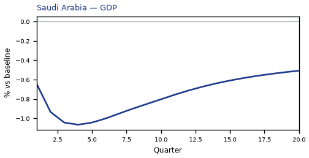


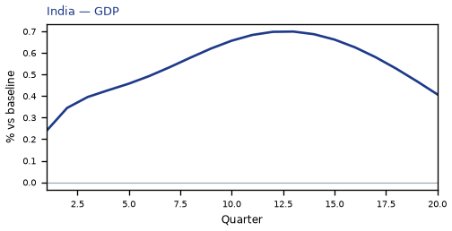

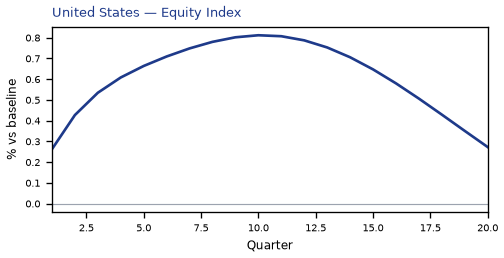

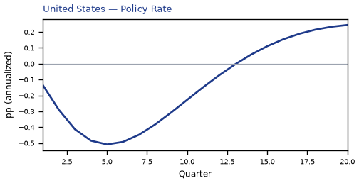

## SA — Saudi Arabia

The main impact of oil at $50 a barrel on Saudi Arabia would be a large drop in GDP of 1.06% by Q4. Equities peak at -4.08% in Q4.

Demand and trade. Consumption peaks at -0.67 % vs baseline in Q5, from -0.30 in Q1 to -0.34 in Q20. Investment peaks at -2.52 % vs baseline in Q2, from -1.63 in Q1 to -1.72 in Q20. Net Exports peaks at -7.56 % vs baseline in Q4, from -4.59 in Q1 to -3.47 in Q20. Gov Spending peaks at -2.88 % vs baseline in Q4, from -1.74 in Q1 to -1.34 in Q20. Gov Debt peaks at -2.00 % vs baseline in Q20, from -0.10 in Q1 to -2.00 in Q20.

External / FX. The real exchange rate shows real depreciation (a weaker, more competitive home currency). Currency Strength peaks at +0.23 % vs baseline in Q11, from +0.01 in Q1 to +0.07 in Q20.

Labour. Employment peaks at -0.96 % vs baseline in Q10, from -0.15 in Q1 to -0.71 in Q20. Unemployment peaks at +0.36 pp in Q9, from +0.06 in Q1 to +0.25 in Q20. Real Wages peaks at -1.55 % vs baseline in Q20, from -0.00 in Q1 to -1.55 in Q20.

Prices. The three-year CPI impulse is -0.84 percentage points. CPI Inflation peaks at -0.10 pp in Q3, from -0.06 in Q1 to -0.02 in Q20. Domestic Infl. peaks at -0.07 pp in Q3, from -0.04 in Q1 to -0.01 in Q20. Marginal Cost peaks at -0.63 % vs baseline in Q4, from -0.38 in Q1 to -0.30 in Q20.

Financial conditions. Policy Rate peaks at -0.42 pp (annualized) in Q5, from -0.11 in Q1 to +0.22 in Q20. Govt 2Y Yield peaks at -0.35 pp (annualized) in Q2, from -0.33 in Q1 to +0.21 in Q20. Govt 5Y Yield peaks at +0.17 pp (annualized) in Q15, from -0.11 in Q1 to +0.15 in Q20. Govt 10Y Yield peaks at +0.10 pp (annualized) in Q13, from +0.02 in Q1 to +0.08 in Q20. Bond Price peaks at +2.11 % vs baseline in Q5, from +0.56 in Q1 to -1.08 in Q20. Equity Index peaks at -4.08 % vs baseline in Q4, from -2.52 in Q1 to -2.09 in Q20. Tobin's Q peaks at -1.77 % vs baseline in Q2, from -1.14 in Q1 to -1.20 in Q20. House Prices peaks at -1.19 % vs baseline in Q20, from -0.10 in Q1 to -1.19 in Q20. Bank Credit peaks at -0.28 % vs baseline in Q16, from -0.02 in Q1 to -0.27 in Q20. Credit Spread peaks at +0.01 pp in Q16, from +0.00 in Q1 to +0.01 in Q20.

Sectoral and capital. Manuf. GDP peaks at +0.19 % vs baseline in Q3, from +0.12 in Q1 to +0.07 in Q20. Services GDP peaks at -0.47 % vs baseline in Q4, from -0.28 in Q1 to -0.22 in Q20. Capital Stock peaks at -0.20 % vs baseline in Q20, from -0.01 in Q1 to -0.20 in Q20.

Timing. By Q20 GDP is still -0.51% from baseline.

These figures are model IRFs versus baseline, not forecasts.


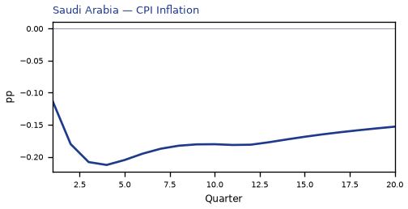

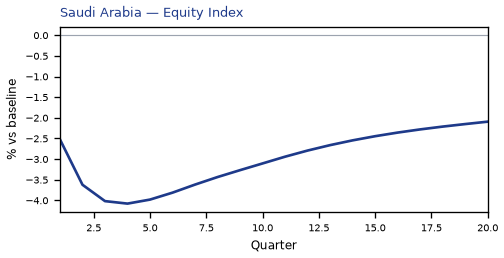

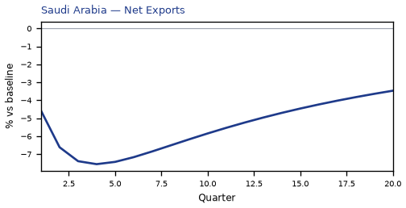

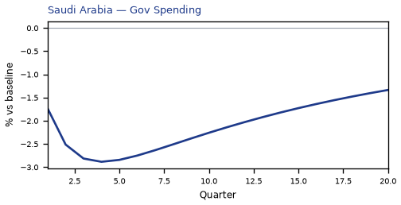

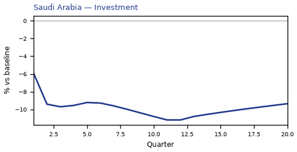


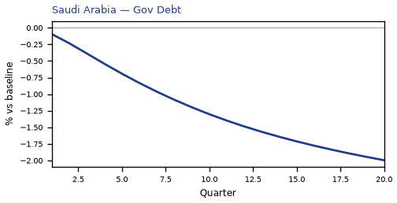

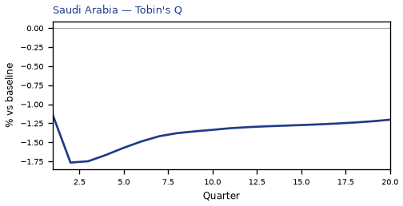

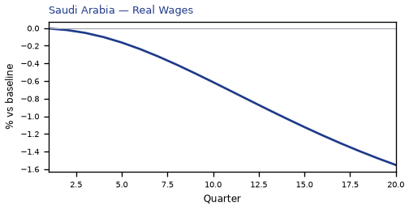

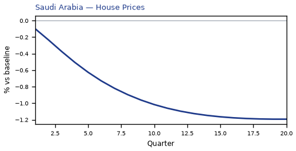

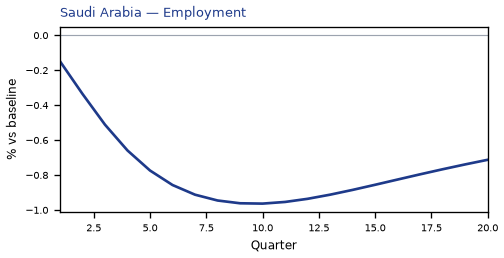

[Q1–Q20 JSON for Saudi Arabia](numbers/SA.json)

## AR — Argentina

The main impact of oil at $50 a barrel on Argentina would be a large rise in GDP of 0.89% by Q12. Equities peak at +1.54% in Q11.

Demand and trade. Consumption peaks at +0.45 % vs baseline in Q13, from +0.05 in Q1 to +0.21 in Q20. Investment peaks at +2.20 % vs baseline in Q10, from +0.48 in Q1 to +0.09 in Q20. Net Exports peaks at -0.61 % vs baseline in Q9, from -0.22 in Q1 to -0.37 in Q20. Gov Spending peaks at -0.24 % vs baseline in Q12, from -0.04 in Q1 to -0.12 in Q20. Gov Debt peaks at +0.74 % vs baseline in Q20, from +0.00 in Q1 to +0.74 in Q20.

External / FX. The real exchange rate shows real appreciation (a stronger home currency). Currency Strength peaks at -0.81 % vs baseline in Q12, from -0.10 in Q1 to -0.23 in Q20.

Labour. Employment peaks at +0.81 % vs baseline in Q17, from +0.01 in Q1 to +0.73 in Q20. Unemployment peaks at -0.23 pp in Q15, from -0.00 in Q1 to -0.16 in Q20. Real Wages peaks at +1.47 % vs baseline in Q20, from +0.00 in Q1 to +1.47 in Q20.

Prices. The three-year CPI impulse is -0.53 percentage points. CPI Inflation peaks at -0.14 pp in Q3, from -0.09 in Q1 to +0.10 in Q20. Domestic Infl. peaks at -0.10 pp in Q3, from -0.06 in Q1 to +0.07 in Q20. Marginal Cost peaks at +0.54 % vs baseline in Q12, from +0.03 in Q1 to +0.20 in Q20.

Financial conditions. Policy Rate peaks at +0.57 pp (annualized) in Q17, from -0.21 in Q1 to +0.49 in Q20. Govt 2Y Yield peaks at +0.53 pp (annualized) in Q14, from -0.41 in Q1 to +0.31 in Q20. Govt 5Y Yield peaks at +0.35 pp (annualized) in Q10, from +0.08 in Q1 to +0.09 in Q20. Govt 10Y Yield peaks at +0.13 pp (annualized) in Q9, from +0.07 in Q1 to +0.00 in Q20. Bond Price peaks at -1.43 % vs baseline in Q17, from +0.53 in Q1 to -1.23 in Q20. Equity Index peaks at +1.54 % vs baseline in Q11, from +0.20 in Q1 to +0.32 in Q20. Tobin's Q peaks at +1.54 % vs baseline in Q10, from +0.33 in Q1 to +0.07 in Q20. House Prices peaks at +0.94 % vs baseline in Q18, from +0.01 in Q1 to +0.90 in Q20. Bank Credit peaks at +0.00 % vs baseline in Q15, from +0.00 in Q1 to +0.00 in Q20. Credit Spread peaks at +0.00 pp in Q1, from +0.00 in Q1 to +0.00 in Q20.

Sectoral and capital. Manuf. GDP peaks at +0.78 % vs baseline in Q11, from +0.34 in Q1 to +0.36 in Q20. Services GDP peaks at +0.51 % vs baseline in Q12, from +0.03 in Q1 to +0.19 in Q20. Capital Stock peaks at +0.14 % vs baseline in Q20, from +0.00 in Q1 to +0.14 in Q20.

Timing. By Q20 GDP is still +0.33% from baseline.

These figures are model IRFs versus baseline, not forecasts.

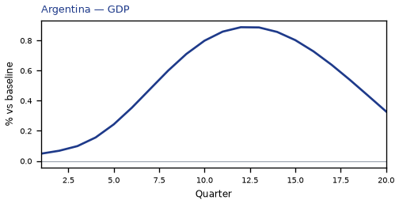

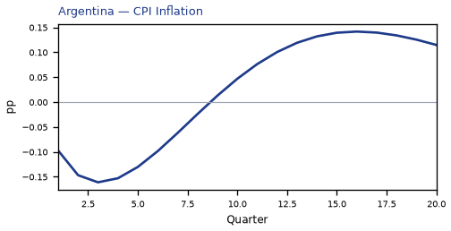

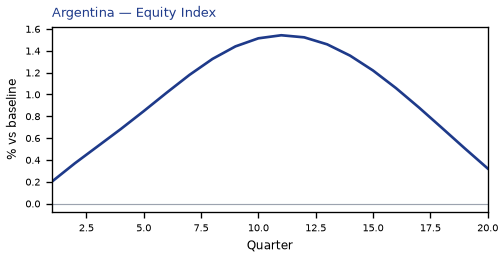

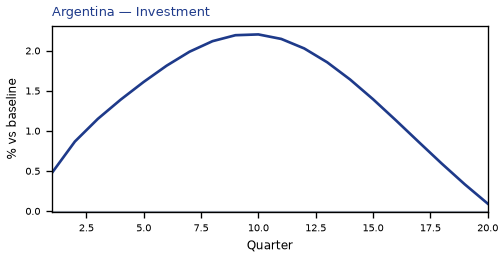

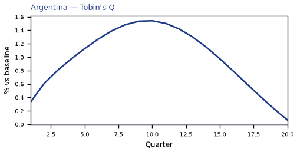

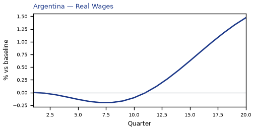

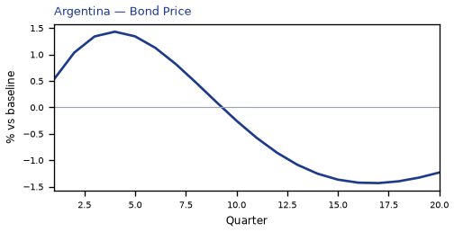

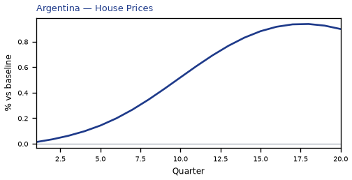

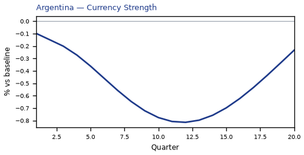

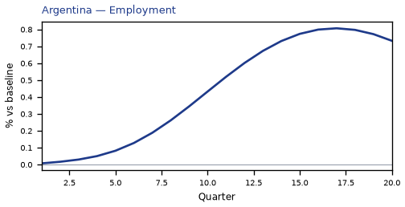

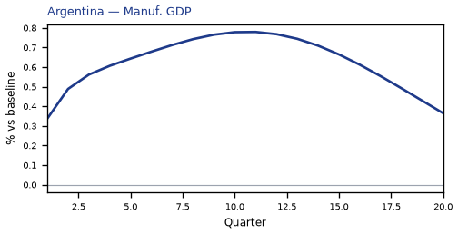

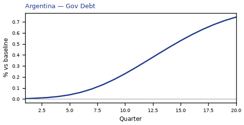

[Q1–Q20 JSON for Argentina](numbers/AR.json)

## TR — Turkey

The main impact of oil at $50 a barrel on Turkey would be a large rise in GDP of 0.82% by Q12. Equities peak at +1.56% in Q10.

Demand and trade. Consumption peaks at +0.48 % vs baseline in Q12, from +0.14 in Q1 to +0.24 in Q20. Investment peaks at +2.59 % vs baseline in Q8, from +1.00 in Q1 to +0.31 in Q20. Net Exports peaks at +1.24 % vs baseline in Q4, from +0.77 in Q1 to +0.47 in Q20. Gov Spending peaks at -0.15 % vs baseline in Q12, from -0.04 in Q1 to -0.06 in Q20. Gov Debt peaks at +0.93 % vs baseline in Q20, from +0.02 in Q1 to +0.93 in Q20.

External / FX. The real exchange rate shows real appreciation (a stronger home currency). Currency Strength peaks at -1.51 % vs baseline in Q13, from -0.29 in Q1 to -1.06 in Q20.

Labour. Employment peaks at +0.79 % vs baseline in Q16, from +0.04 in Q1 to +0.71 in Q20. Unemployment peaks at -0.22 pp in Q14, from -0.02 in Q1 to -0.16 in Q20. Real Wages peaks at +1.13 % vs baseline in Q20, from +0.00 in Q1 to +1.13 in Q20.

Prices. The three-year CPI impulse is -0.86 percentage points. CPI Inflation peaks at -0.14 pp in Q3, from -0.06 in Q1 to +0.08 in Q20. Domestic Infl. peaks at -0.10 pp in Q3, from -0.04 in Q1 to +0.06 in Q20. Marginal Cost peaks at +0.50 % vs baseline in Q12, from +0.15 in Q1 to +0.21 in Q20.

Financial conditions. Policy Rate peaks at -0.62 pp (annualized) in Q4, from -0.20 in Q1 to +0.39 in Q20. Govt 2Y Yield peaks at -0.48 pp (annualized) in Q2, from -0.48 in Q1 to +0.32 in Q20. Govt 5Y Yield peaks at +0.28 pp (annualized) in Q13, from -0.07 in Q1 to +0.18 in Q20. Govt 10Y Yield peaks at +0.15 pp (annualized) in Q12, from +0.05 in Q1 to +0.09 in Q20. Bond Price peaks at +1.95 % vs baseline in Q4, from +0.61 in Q1 to -1.23 in Q20. Equity Index peaks at +1.56 % vs baseline in Q10, from +0.52 in Q1 to +0.41 in Q20. Tobin's Q peaks at +1.81 % vs baseline in Q8, from +0.70 in Q1 to +0.22 in Q20. House Prices peaks at +1.10 % vs baseline in Q17, from +0.04 in Q1 to +1.06 in Q20. Bank Credit peaks at +0.01 % vs baseline in Q17, from +0.00 in Q1 to +0.01 in Q20. Credit Spread peaks at +0.00 pp in Q1, from +0.00 in Q1 to +0.00 in Q20.

Sectoral and capital. Manuf. GDP peaks at +1.19 % vs baseline in Q10, from +0.57 in Q1 to +0.73 in Q20. Services GDP peaks at +0.50 % vs baseline in Q12, from +0.14 in Q1 to +0.21 in Q20. Capital Stock peaks at +0.18 % vs baseline in Q20, from +0.01 in Q1 to +0.18 in Q20.

Timing. By Q20 GDP is still +0.34% from baseline.

These figures are model IRFs versus baseline, not forecasts.

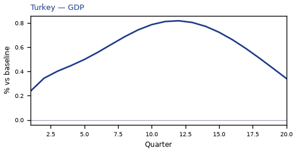

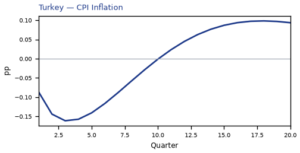

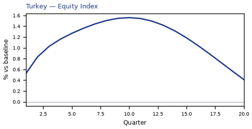

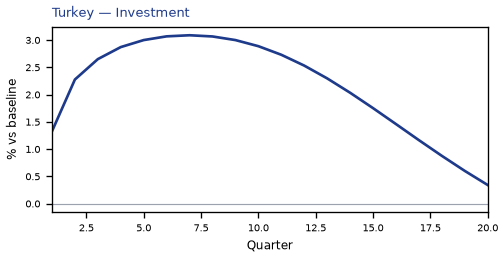

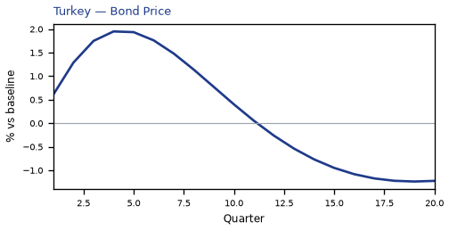

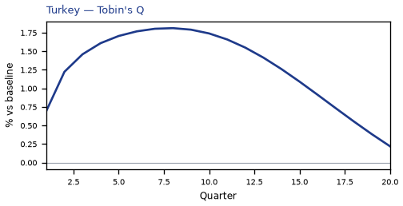

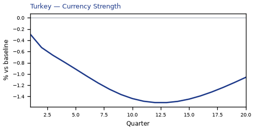

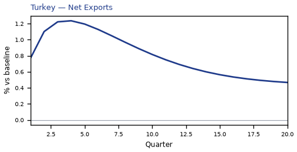

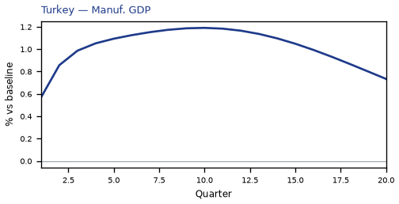

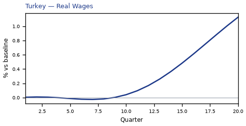


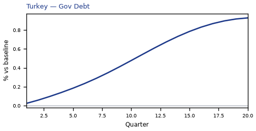

[Q1–Q20 JSON for Turkey](numbers/TR.json)

## IN — India

The main impact of oil at $50 a barrel on India would be a large rise in GDP of 0.70% by Q13. Equities peak at +1.99% in Q11.

Demand and trade. Consumption peaks at +0.43 % vs baseline in Q13, from +0.14 in Q1 to +0.28 in Q20. Investment peaks at +2.58 % vs baseline in Q7, from +0.97 in Q1 to +0.51 in Q20. Net Exports peaks at +1.25 % vs baseline in Q4, from +0.78 in Q1 to +0.45 in Q20. Gov Spending peaks at -0.12 % vs baseline in Q12, from -0.04 in Q1 to -0.07 in Q20. Gov Debt peaks at +1.38 % vs baseline in Q20, from +0.04 in Q1 to +1.38 in Q20.

External / FX. The real exchange rate shows real appreciation (a stronger home currency). Currency Strength peaks at -1.10 % vs baseline in Q17, from -0.02 in Q1 to -1.04 in Q20.

Labour. Employment peaks at +0.63 % vs baseline in Q18, from +0.03 in Q1 to +0.62 in Q20. Unemployment peaks at -0.10 pp in Q15, from -0.01 in Q1 to -0.08 in Q20. Real Wages peaks at +0.74 % vs baseline in Q20, from +0.00 in Q1 to +0.74 in Q20.

Prices. The three-year CPI impulse is -1.01 percentage points. CPI Inflation peaks at -0.17 pp in Q3, from -0.08 in Q1 to +0.08 in Q20. Domestic Infl. peaks at -0.12 pp in Q3, from -0.06 in Q1 to +0.05 in Q20. Marginal Cost peaks at +0.43 % vs baseline in Q13, from +0.15 in Q1 to +0.25 in Q20.

Financial conditions. Policy Rate peaks at -0.72 pp (annualized) in Q5, from -0.17 in Q1 to +0.40 in Q20. Govt 2Y Yield peaks at -0.59 pp (annualized) in Q2, from -0.56 in Q1 to +0.40 in Q20. Govt 5Y Yield peaks at +0.32 pp (annualized) in Q16, from -0.18 in Q1 to +0.29 in Q20. Govt 10Y Yield peaks at +0.20 pp (annualized) in Q14, from +0.04 in Q1 to +0.17 in Q20. Bond Price peaks at +3.60 % vs baseline in Q5, from +0.86 in Q1 to -2.02 in Q20. Equity Index peaks at +1.99 % vs baseline in Q11, from +0.76 in Q1 to +1.00 in Q20. Tobin's Q peaks at +1.81 % vs baseline in Q7, from +0.68 in Q1 to +0.36 in Q20. House Prices peaks at +1.01 % vs baseline in Q18, from +0.04 in Q1 to +0.99 in Q20. Bank Credit peaks at +0.01 % vs baseline in Q16, from +0.00 in Q1 to +0.01 in Q20. Credit Spread peaks at +0.00 pp in Q1, from +0.00 in Q1 to +0.00 in Q20.

Sectoral and capital. Manuf. GDP peaks at +0.88 % vs baseline in Q12, from +0.44 in Q1 to +0.70 in Q20. Services GDP peaks at +0.38 % vs baseline in Q13, from +0.13 in Q1 to +0.22 in Q20. Capital Stock peaks at +0.18 % vs baseline in Q20, from +0.00 in Q1 to +0.18 in Q20.

Timing. By Q20 GDP is still +0.41% from baseline.

These figures are model IRFs versus baseline, not forecasts.

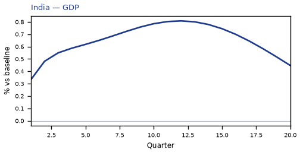

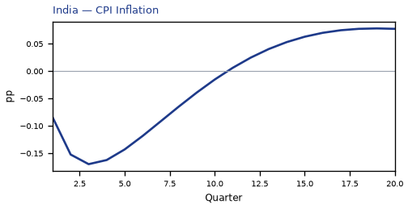

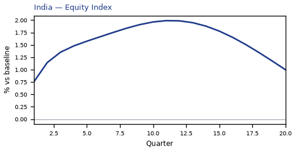

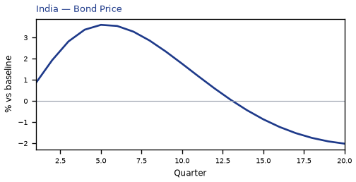

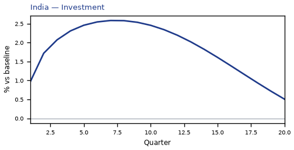

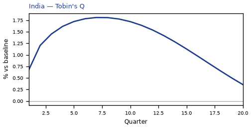

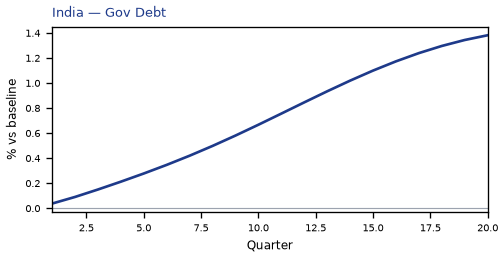

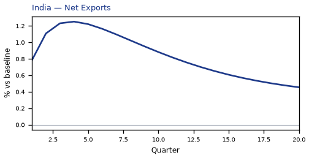

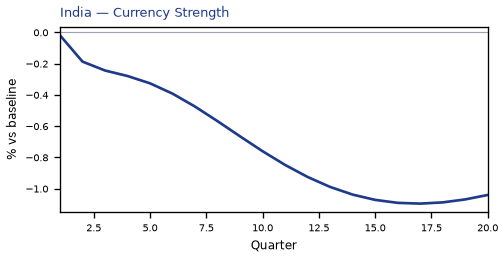

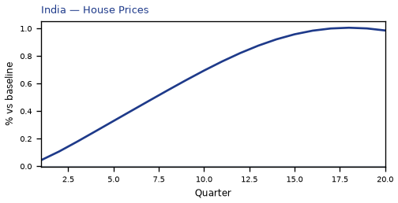

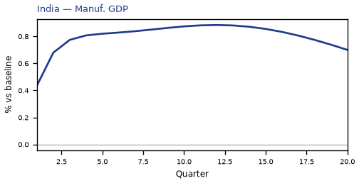

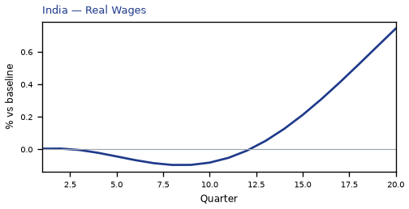

[Q1–Q20 JSON for India](numbers/IN.json)

## NO — Norway

The main impact of oil at $50 a barrel on Norway would be a large drop in GDP of 0.58% by Q4. Equities peak at -1.06% in Q3.

Demand and trade. Consumption peaks at -0.32 % vs baseline in Q5, from -0.15 in Q1 to -0.11 in Q20. Investment peaks at -1.21 % vs baseline in Q2, from -0.81 in Q1 to -0.34 in Q20. Net Exports peaks at -4.51 % vs baseline in Q4, from -2.74 in Q1 to -1.97 in Q20. Gov Spending peaks at -1.96 % vs baseline in Q4, from -1.18 in Q1 to -0.93 in Q20. Gov Debt peaks at +0.14 % vs baseline in Q15, from +0.01 in Q1 to +0.13 in Q20.

External / FX. The real exchange rate shows real depreciation (a weaker, more competitive home currency). Currency Strength peaks at +11.14 % vs baseline in Q4, from +6.59 in Q1 to +6.03 in Q20.

Labour. Employment peaks at -0.45 % vs baseline in Q9, from -0.06 in Q1 to -0.28 in Q20. Unemployment peaks at +0.33 pp in Q8, from +0.05 in Q1 to +0.18 in Q20. Real Wages peaks at -0.68 % vs baseline in Q20, from -0.00 in Q1 to -0.68 in Q20.

Prices. The three-year CPI impulse is -0.49 percentage points. CPI Inflation peaks at -0.11 pp in Q2, from -0.08 in Q1 to +0.02 in Q20. Domestic Infl. peaks at -0.07 pp in Q2, from -0.06 in Q1 to +0.01 in Q20. Marginal Cost peaks at -0.34 % vs baseline in Q4, from -0.21 in Q1 to -0.10 in Q20.

Financial conditions. Policy Rate peaks at -0.49 pp (annualized) in Q6, from -0.10 in Q1 to -0.09 in Q20. Govt 2Y Yield peaks at -0.45 pp (annualized) in Q4, from -0.38 in Q1 to -0.06 in Q20. Govt 5Y Yield peaks at -0.30 pp (annualized) in Q1, from -0.30 in Q1 to -0.05 in Q20. Govt 10Y Yield peaks at -0.17 pp (annualized) in Q1, from -0.17 in Q1 to -0.04 in Q20. Bond Price peaks at +3.08 % vs baseline in Q6, from +0.65 in Q1 to +0.56 in Q20. Equity Index peaks at -1.06 % vs baseline in Q3, from -0.70 in Q1 to -0.49 in Q20. Tobin's Q peaks at -0.85 % vs baseline in Q2, from -0.57 in Q1 to -0.24 in Q20. House Prices peaks at -0.42 % vs baseline in Q16, from -0.04 in Q1 to -0.42 in Q20. Bank Credit peaks at -0.19 % vs baseline in Q15, from -0.02 in Q1 to -0.18 in Q20. Credit Spread peaks at +0.00 pp in Q15, from +0.00 in Q1 to +0.00 in Q20.

Sectoral and capital. Manuf. GDP peaks at -3.00 % vs baseline in Q4, from -1.77 in Q1 to -1.63 in Q20. Services GDP peaks at -0.33 % vs baseline in Q4, from -0.20 in Q1 to -0.10 in Q20. Capital Stock peaks at -0.05 % vs baseline in Q20, from -0.00 in Q1 to -0.05 in Q20.

Timing. By Q20 GDP is still -0.18% from baseline.

These figures are model IRFs versus baseline, not forecasts.


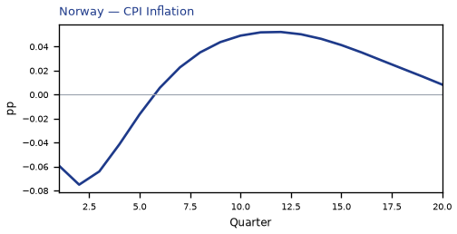


[Q1–Q20 JSON for Norway](numbers/NO.json)

## RU — Russia

The main impact of oil at $50 a barrel on Russia would be a large drop in GDP of 0.57% by Q3. Equities peak at -0.70% in Q3.

Demand and trade. Consumption peaks at -0.30 % vs baseline in Q4, from -0.14 in Q1 to +0.02 in Q20. Investment peaks at -1.19 % vs baseline in Q2, from -0.82 in Q1 to +0.01 in Q20. Net Exports peaks at -4.51 % vs baseline in Q4, from -2.72 in Q1 to -2.10 in Q20. Gov Spending peaks at -1.37 % vs baseline in Q4, from -0.83 in Q1 to -0.69 in Q20. Gov Debt peaks at -0.17 % vs baseline in Q10, from -0.02 in Q1 to -0.11 in Q20.

External / FX. The real exchange rate shows real depreciation (a weaker, more competitive home currency). Currency Strength peaks at +4.89 % vs baseline in Q4, from +2.97 in Q1 to +2.36 in Q20.

Labour. Employment peaks at -0.40 % vs baseline in Q8, from -0.06 in Q1 to -0.05 in Q20. Unemployment peaks at +0.17 pp in Q6, from +0.03 in Q1 to -0.00 in Q20. Real Wages peaks at -0.94 % vs baseline in Q16, from -0.01 in Q1 to -0.87 in Q20.

Prices. The three-year CPI impulse is -0.87 percentage points. CPI Inflation peaks at -0.12 pp in Q3, from -0.05 in Q1 to +0.02 in Q20. Domestic Infl. peaks at -0.08 pp in Q3, from -0.03 in Q1 to +0.01 in Q20. Marginal Cost peaks at -0.33 % vs baseline in Q3, from -0.21 in Q1 to +0.02 in Q20.

Financial conditions. Policy Rate peaks at -0.54 pp (annualized) in Q6, from -0.10 in Q1 to +0.06 in Q20. Govt 2Y Yield peaks at -0.47 pp (annualized) in Q3, from -0.41 in Q1 to +0.08 in Q20. Govt 5Y Yield peaks at -0.26 pp (annualized) in Q1, from -0.26 in Q1 to +0.06 in Q20. Govt 10Y Yield peaks at -0.10 pp (annualized) in Q1, from -0.10 in Q1 to +0.04 in Q20. Bond Price peaks at +1.70 % vs baseline in Q6, from +0.33 in Q1 to -0.19 in Q20. Equity Index peaks at -0.70 % vs baseline in Q3, from -0.53 in Q1 to -0.12 in Q20. Tobin's Q peaks at -0.83 % vs baseline in Q2, from -0.57 in Q1 to +0.01 in Q20. House Prices peaks at -0.39 % vs baseline in Q9, from -0.05 in Q1 to -0.15 in Q20. Bank Credit peaks at -0.14 % vs baseline in Q16, from -0.01 in Q1 to -0.13 in Q20. Credit Spread peaks at +0.00 pp in Q16, from +0.00 in Q1 to +0.00 in Q20.

Sectoral and capital. Manuf. GDP peaks at -1.09 % vs baseline in Q4, from -0.66 in Q1 to -0.47 in Q20. Services GDP peaks at -0.31 % vs baseline in Q3, from -0.19 in Q1 to +0.02 in Q20. Capital Stock peaks at -0.03 % vs baseline in Q8, from -0.00 in Q1 to -0.02 in Q20.

Timing. The GDP response has mostly faded by Q11 (Q20 is +0.03%).

These figures are model IRFs versus baseline, not forecasts.


[Q1–Q20 JSON for Russia](numbers/RU.json)

## BR — Brazil

The main impact of oil at $50 a barrel on Brazil would be a large rise in GDP of 0.50% by Q14. Equities peak at +1.06% in Q12.

Demand and trade. Consumption peaks at +0.28 % vs baseline in Q14, from +0.04 in Q1 to +0.19 in Q20. Investment peaks at +1.69 % vs baseline in Q9, from +0.37 in Q1 to +0.36 in Q20. Net Exports peaks at -0.72 % vs baseline in Q5, from -0.39 in Q1 to -0.47 in Q20. Gov Spending peaks at -0.22 % vs baseline in Q12, from -0.08 in Q1 to -0.14 in Q20. Gov Debt peaks at +0.12 % vs baseline in Q20, from +0.00 in Q1 to +0.12 in Q20.

External / FX. The real exchange rate shows real depreciation (a weaker, more competitive home currency). Currency Strength peaks at +2.00 % vs baseline in Q6, from +0.82 in Q1 to +0.31 in Q20.

Labour. Employment peaks at +0.46 % vs baseline in Q18, from +0.00 in Q1 to +0.44 in Q20. Unemployment peaks at -0.13 pp in Q16, from -0.00 in Q1 to -0.11 in Q20. Real Wages peaks at +0.28 % vs baseline in Q20, from +0.00 in Q1 to +0.28 in Q20.

Prices. The three-year CPI impulse is -0.67 percentage points. CPI Inflation peaks at -0.11 pp in Q3, from -0.08 in Q1 to +0.04 in Q20. Domestic Infl. peaks at -0.08 pp in Q3, from -0.05 in Q1 to +0.03 in Q20. Marginal Cost peaks at +0.31 % vs baseline in Q14, from +0.01 in Q1 to +0.18 in Q20.

Financial conditions. Policy Rate peaks at -0.70 pp (annualized) in Q5, from -0.20 in Q1 to +0.30 in Q20. Govt 2Y Yield peaks at -0.57 pp (annualized) in Q2, from -0.55 in Q1 to +0.28 in Q20. Govt 5Y Yield peaks at +0.23 pp (annualized) in Q15, from -0.19 in Q1 to +0.20 in Q20. Govt 10Y Yield peaks at +0.14 pp (annualized) in Q14, from -0.00 in Q1 to +0.11 in Q20. Bond Price peaks at +2.91 % vs baseline in Q5, from +0.84 in Q1 to -1.23 in Q20. Equity Index peaks at +1.06 % vs baseline in Q12, from +0.13 in Q1 to +0.45 in Q20. Tobin's Q peaks at +1.19 % vs baseline in Q9, from +0.26 in Q1 to +0.25 in Q20. House Prices peaks at +0.61 % vs baseline in Q19, from +0.01 in Q1 to +0.61 in Q20. Bank Credit peaks at +0.00 % vs baseline in Q16, from +0.00 in Q1 to +0.00 in Q20. Credit Spread peaks at +0.00 pp in Q1, from +0.00 in Q1 to +0.00 in Q20.

Sectoral and capital. Manuf. GDP peaks at +0.20 % vs baseline in Q19, from +0.06 in Q1 to +0.20 in Q20. Services GDP peaks at +0.33 % vs baseline in Q14, from +0.01 in Q1 to +0.20 in Q20. Capital Stock peaks at +0.12 % vs baseline in Q20, from +0.00 in Q1 to +0.12 in Q20.

Timing. By Q20 GDP is still +0.30% from baseline.

These figures are model IRFs versus baseline, not forecasts.


[Q1–Q20 JSON for Brazil](numbers/BR.json)

## KR — South Korea

The main impact of oil at $50 a barrel on South Korea would be a large rise in GDP of 0.50% by Q9. Equities peak at +1.56% in Q6.

Demand and trade. Consumption peaks at +0.33 % vs baseline in Q5, from +0.16 in Q1 to +0.18 in Q20. Investment peaks at +2.05 % vs baseline in Q5, from +1.01 in Q1 to +0.35 in Q20. Net Exports peaks at +1.53 % vs baseline in Q4, from +0.91 in Q1 to +0.63 in Q20. Gov Spending peaks at -0.09 % vs baseline in Q8, from -0.05 in Q1 to -0.05 in Q20. Gov Debt peaks at +0.38 % vs baseline in Q20, from +0.02 in Q1 to +0.38 in Q20.

External / FX. The real exchange rate shows real appreciation (a stronger home currency). Currency Strength peaks at -2.33 % vs baseline in Q4, from -1.44 in Q1 to -1.55 in Q20.

Labour. Employment peaks at +0.51 % vs baseline in Q14, from +0.06 in Q1 to +0.42 in Q20. Unemployment peaks at -0.20 pp in Q12, from -0.03 in Q1 to -0.14 in Q20. Real Wages peaks at +0.44 % vs baseline in Q20, from +0.00 in Q1 to +0.44 in Q20.

Prices. The three-year CPI impulse is -0.81 percentage points. CPI Inflation peaks at -0.15 pp in Q2, from -0.11 in Q1 to +0.03 in Q20. Domestic Infl. peaks at -0.10 pp in Q2, from -0.08 in Q1 to +0.02 in Q20. Marginal Cost peaks at +0.31 % vs baseline in Q8, from +0.18 in Q1 to +0.16 in Q20.

Financial conditions. Policy Rate peaks at -0.41 pp (annualized) in Q5, from -0.13 in Q1 to +0.25 in Q20. Govt 2Y Yield peaks at -0.33 pp (annualized) in Q2, from -0.32 in Q1 to +0.25 in Q20. Govt 5Y Yield peaks at +0.22 pp (annualized) in Q16, from -0.08 in Q1 to +0.20 in Q20. Govt 10Y Yield peaks at +0.15 pp (annualized) in Q14, from +0.06 in Q1 to +0.13 in Q20. Bond Price peaks at +2.03 % vs baseline in Q5, from +0.63 in Q1 to -1.25 in Q20. Equity Index peaks at +1.56 % vs baseline in Q6, from +0.80 in Q1 to +0.54 in Q20. Tobin's Q peaks at +1.43 % vs baseline in Q5, from +0.70 in Q1 to +0.25 in Q20. House Prices peaks at +0.66 % vs baseline in Q18, from +0.04 in Q1 to +0.66 in Q20. Bank Credit peaks at +0.02 % vs baseline in Q17, from +0.00 in Q1 to +0.02 in Q20. Credit Spread peaks at +0.00 pp in Q1, from +0.00 in Q1 to +0.00 in Q20.

Sectoral and capital. Manuf. GDP peaks at +1.67 % vs baseline in Q4, from +1.01 in Q1 to +0.93 in Q20. Services GDP peaks at +0.30 % vs baseline in Q9, from +0.17 in Q1 to +0.16 in Q20. Capital Stock peaks at +0.14 % vs baseline in Q20, from +0.01 in Q1 to +0.14 in Q20.

Timing. By Q20 GDP is still +0.26% from baseline.

These figures are model IRFs versus baseline, not forecasts.


[Q1–Q20 JSON for South Korea](numbers/KR.json)

## ZA — South Africa

The main impact of oil at $50 a barrel on South Africa would be a large rise in GDP of 0.44% by Q12. Equities peak at +1.89% in Q11.

Demand and trade. Consumption peaks at +0.25 % vs baseline in Q13, from +0.09 in Q1 to +0.16 in Q20. Investment peaks at +1.71 % vs baseline in Q7, from +0.68 in Q1 to +0.40 in Q20. Net Exports peaks at +0.67 % vs baseline in Q4, from +0.38 in Q1 to +0.29 in Q20. Gov Spending peaks at -0.07 % vs baseline in Q12, from -0.03 in Q1 to -0.04 in Q20. Gov Debt peaks at +0.44 % vs baseline in Q20, from +0.01 in Q1 to +0.44 in Q20.

External / FX. The real exchange rate shows real appreciation (a stronger home currency). Currency Strength peaks at -1.05 % vs baseline in Q3, from -0.69 in Q1 to -0.65 in Q20.

Labour. Employment peaks at +0.47 % vs baseline in Q16, from +0.03 in Q1 to +0.42 in Q20. Unemployment peaks at -0.12 pp in Q15, from -0.01 in Q1 to -0.10 in Q20. Real Wages peaks at +0.37 % vs baseline in Q20, from +0.00 in Q1 to +0.37 in Q20.

Prices. The three-year CPI impulse is -0.68 percentage points. CPI Inflation peaks at -0.12 pp in Q2, from -0.09 in Q1 to +0.04 in Q20. Domestic Infl. peaks at -0.08 pp in Q2, from -0.06 in Q1 to +0.02 in Q20. Marginal Cost peaks at +0.27 % vs baseline in Q12, from +0.10 in Q1 to +0.15 in Q20.

Financial conditions. Policy Rate peaks at -0.50 pp (annualized) in Q5, from -0.14 in Q1 to +0.18 in Q20. Govt 2Y Yield peaks at -0.41 pp (annualized) in Q2, from -0.39 in Q1 to +0.18 in Q20. Govt 5Y Yield peaks at -0.16 pp (annualized) in Q1, from -0.16 in Q1 to +0.15 in Q20. Govt 10Y Yield peaks at +0.11 pp (annualized) in Q15, from -0.01 in Q1 to +0.10 in Q20. Bond Price peaks at +2.06 % vs baseline in Q5, from +0.59 in Q1 to -0.75 in Q20. Equity Index peaks at +1.89 % vs baseline in Q11, from +0.73 in Q1 to +0.88 in Q20. Tobin's Q peaks at +1.20 % vs baseline in Q7, from +0.47 in Q1 to +0.28 in Q20. House Prices peaks at +0.66 % vs baseline in Q18, from +0.03 in Q1 to +0.65 in Q20. Bank Credit peaks at +0.01 % vs baseline in Q17, from +0.00 in Q1 to +0.01 in Q20. Credit Spread peaks at +0.00 pp in Q1, from +0.00 in Q1 to +0.00 in Q20.

Sectoral and capital. Manuf. GDP peaks at +0.81 % vs baseline in Q4, from +0.50 in Q1 to +0.44 in Q20. Services GDP peaks at +0.28 % vs baseline in Q12, from +0.10 in Q1 to +0.16 in Q20. Capital Stock peaks at +0.12 % vs baseline in Q20, from +0.00 in Q1 to +0.12 in Q20.

Timing. By Q20 GDP is still +0.25% from baseline.

These figures are model IRFs versus baseline, not forecasts.


[Q1–Q20 JSON for South Africa](numbers/ZA.json)

## JP — Japan

The main impact of oil at $50 a barrel on Japan would be a large rise in GDP of 0.41% by Q4. Equities peak at +1.33% in Q5.

Demand and trade. Consumption peaks at +0.29 % vs baseline in Q5, from +0.14 in Q1 to +0.14 in Q20. Investment peaks at +1.33 % vs baseline in Q4, from +0.74 in Q1 to +0.60 in Q20. Net Exports peaks at +1.19 % vs baseline in Q4, from +0.72 in Q1 to +0.66 in Q20. Gov Spending peaks at -0.09 % vs baseline in Q4, from -0.05 in Q1 to -0.04 in Q20. Gov Debt peaks at +0.15 % vs baseline in Q20, from +0.01 in Q1 to +0.15 in Q20.

External / FX. The real exchange rate shows real appreciation (a stronger home currency). Currency Strength peaks at -3.01 % vs baseline in Q5, from -1.65 in Q1 to -0.35 in Q20.

Labour. Employment peaks at +0.39 % vs baseline in Q10, from +0.06 in Q1 to +0.29 in Q20. Unemployment peaks at -0.21 pp in Q9, from -0.04 in Q1 to -0.14 in Q20. Real Wages peaks at -0.43 % vs baseline in Q14, from +0.00 in Q1 to -0.34 in Q20.

Prices. The three-year CPI impulse is -0.81 percentage points. CPI Inflation peaks at -0.17 pp in Q3, from -0.12 in Q1 to +0.05 in Q20. Domestic Infl. peaks at -0.12 pp in Q3, from -0.08 in Q1 to +0.03 in Q20. Marginal Cost peaks at +0.26 % vs baseline in Q4, from +0.15 in Q1 to +0.12 in Q20.

Financial conditions. Policy Rate peaks at -0.10 pp (annualized) in Q8, from -0.01 in Q1 to -0.03 in Q20. Govt 2Y Yield peaks at -0.09 pp (annualized) in Q5, from -0.07 in Q1 to -0.01 in Q20. Govt 5Y Yield peaks at -0.07 pp (annualized) in Q2, from -0.07 in Q1 to +0.01 in Q20. Govt 10Y Yield peaks at -0.03 pp (annualized) in Q1, from -0.03 in Q1 to +0.02 in Q20. Bond Price peaks at +0.83 % vs baseline in Q5, from +0.21 in Q1 to -0.41 in Q20. Equity Index peaks at +1.33 % vs baseline in Q5, from +0.75 in Q1 to +0.51 in Q20. Tobin's Q peaks at +0.93 % vs baseline in Q4, from +0.52 in Q1 to +0.42 in Q20. House Prices peaks at +0.46 % vs baseline in Q20, from +0.03 in Q1 to +0.46 in Q20. Bank Credit peaks at +0.03 % vs baseline in Q16, from +0.00 in Q1 to +0.03 in Q20. Credit Spread peaks at +0.00 pp in Q1, from +0.00 in Q1 to +0.00 in Q20.

Sectoral and capital. Manuf. GDP peaks at +1.67 % vs baseline in Q4, from +0.96 in Q1 to +0.47 in Q20. Services GDP peaks at +0.28 % vs baseline in Q4, from +0.17 in Q1 to +0.13 in Q20. Capital Stock peaks at +0.10 % vs baseline in Q20, from +0.00 in Q1 to +0.10 in Q20.

Timing. By Q20 GDP is still +0.19% from baseline.

These figures are model IRFs versus baseline, not forecasts.


[Q1–Q20 JSON for Japan](numbers/JP.json)

## PL — Poland

The main impact of oil at $50 a barrel on Poland would be a large rise in GDP of 0.39% by Q11. Equities peak at +0.91% in Q7.

Demand and trade. Consumption peaks at +0.20 % vs baseline in Q12, from +0.11 in Q1 to +0.14 in Q20. Investment peaks at +1.78 % vs baseline in Q6, from +0.77 in Q1 to +0.44 in Q20. Net Exports peaks at +0.64 % vs baseline in Q4, from +0.37 in Q1 to +0.24 in Q20. Gov Spending peaks at -0.08 % vs baseline in Q11, from -0.04 in Q1 to -0.05 in Q20. Gov Debt peaks at +0.00 % vs baseline in Q1, from +0.00 in Q1 to +0.00 in Q20.

External / FX. The real exchange rate shows real appreciation (a stronger home currency). Currency Strength peaks at -1.17 % vs baseline in Q3, from -0.81 in Q1 to -0.71 in Q20.

Labour. Employment peaks at +0.42 % vs baseline in Q15, from +0.04 in Q1 to +0.37 in Q20. Unemployment peaks at -0.15 pp in Q14, from -0.02 in Q1 to -0.12 in Q20. Real Wages peaks at +0.22 % vs baseline in Q20, from +0.00 in Q1 to +0.22 in Q20.

Prices. The three-year CPI impulse is -0.78 percentage points. CPI Inflation peaks at -0.15 pp in Q2, from -0.11 in Q1 to +0.03 in Q20. Domestic Infl. peaks at -0.10 pp in Q2, from -0.08 in Q1 to +0.02 in Q20. Marginal Cost peaks at +0.24 % vs baseline in Q11, from +0.11 in Q1 to +0.15 in Q20.

Financial conditions. Policy Rate peaks at -0.53 pp (annualized) in Q5, from -0.15 in Q1 to +0.14 in Q20. Govt 2Y Yield peaks at -0.44 pp (annualized) in Q2, from -0.42 in Q1 to +0.16 in Q20. Govt 5Y Yield peaks at -0.20 pp (annualized) in Q1, from -0.20 in Q1 to +0.15 in Q20. Govt 10Y Yield peaks at +0.12 pp (annualized) in Q17, from -0.03 in Q1 to +0.11 in Q20. Bond Price peaks at +2.20 % vs baseline in Q5, from +0.64 in Q1 to -0.59 in Q20. Equity Index peaks at +0.91 % vs baseline in Q7, from +0.41 in Q1 to +0.30 in Q20. Tobin's Q peaks at +1.25 % vs baseline in Q6, from +0.54 in Q1 to +0.31 in Q20. House Prices peaks at +0.55 % vs baseline in Q19, from +0.03 in Q1 to +0.55 in Q20. Bank Credit peaks at +0.01 % vs baseline in Q17, from +0.00 in Q1 to +0.01 in Q20. Credit Spread peaks at +0.00 pp in Q1, from +0.00 in Q1 to +0.00 in Q20.

Sectoral and capital. Manuf. GDP peaks at +1.12 % vs baseline in Q4, from +0.71 in Q1 to +0.60 in Q20. Services GDP peaks at +0.24 % vs baseline in Q11, from +0.11 in Q1 to +0.15 in Q20. Capital Stock peaks at +0.13 % vs baseline in Q20, from +0.00 in Q1 to +0.13 in Q20.

Timing. By Q20 GDP is still +0.23% from baseline.

These figures are model IRFs versus baseline, not forecasts.


[Q1–Q20 JSON for Poland](numbers/PL.json)

## CL — Chile

The main impact of oil at $50 a barrel on Chile would be a large rise in GDP of 0.38% by Q12. Equities peak at +1.03% in Q9.

Demand and trade. Consumption peaks at +0.23 % vs baseline in Q13, from +0.09 in Q1 to +0.15 in Q20. Investment peaks at +1.62 % vs baseline in Q6, from +0.63 in Q1 to +0.32 in Q20. Net Exports peaks at +0.70 % vs baseline in Q5, from +0.39 in Q1 to +0.35 in Q20. Gov Spending peaks at -0.04 % vs baseline in Q12, from -0.02 in Q1 to -0.02 in Q20. Gov Debt peaks at +0.39 % vs baseline in Q19, from +0.02 in Q1 to +0.39 in Q20.

External / FX. The real exchange rate shows real appreciation (a stronger home currency). Currency Strength peaks at -0.80 % vs baseline in Q3, from -0.53 in Q1 to -0.33 in Q20.

Labour. Employment peaks at +0.40 % vs baseline in Q15, from +0.03 in Q1 to +0.35 in Q20. Unemployment peaks at -0.15 pp in Q14, from -0.02 in Q1 to -0.12 in Q20. Real Wages peaks at +0.36 % vs baseline in Q20, from +0.00 in Q1 to +0.36 in Q20.

Prices. The three-year CPI impulse is -0.56 percentage points. CPI Inflation peaks at -0.11 pp in Q2, from -0.09 in Q1 to +0.03 in Q20. Domestic Infl. peaks at -0.08 pp in Q2, from -0.06 in Q1 to +0.02 in Q20. Marginal Cost peaks at +0.24 % vs baseline in Q12, from +0.09 in Q1 to +0.13 in Q20.

Financial conditions. Policy Rate peaks at -0.50 pp (annualized) in Q5, from -0.13 in Q1 to +0.18 in Q20. Govt 2Y Yield peaks at -0.41 pp (annualized) in Q2, from -0.39 in Q1 to +0.18 in Q20. Govt 5Y Yield peaks at -0.16 pp (annualized) in Q1, from -0.16 in Q1 to +0.15 in Q20. Govt 10Y Yield peaks at +0.11 pp (annualized) in Q15, from -0.01 in Q1 to +0.10 in Q20. Bond Price peaks at +2.07 % vs baseline in Q5, from +0.56 in Q1 to -0.75 in Q20. Equity Index peaks at +1.03 % vs baseline in Q9, from +0.43 in Q1 to +0.37 in Q20. Tobin's Q peaks at +1.14 % vs baseline in Q6, from +0.44 in Q1 to +0.22 in Q20. House Prices peaks at +0.59 % vs baseline in Q18, from +0.03 in Q1 to +0.58 in Q20. Bank Credit peaks at +0.01 % vs baseline in Q17, from +0.00 in Q1 to +0.01 in Q20. Credit Spread peaks at +0.00 pp in Q1, from +0.00 in Q1 to +0.00 in Q20.

Sectoral and capital. Manuf. GDP peaks at +0.73 % vs baseline in Q4, from +0.45 in Q1 to +0.34 in Q20. Services GDP peaks at +0.23 % vs baseline in Q12, from +0.09 in Q1 to +0.13 in Q20. Capital Stock peaks at +0.11 % vs baseline in Q20, from +0.00 in Q1 to +0.11 in Q20.

Timing. By Q20 GDP is still +0.21% from baseline.

These figures are model IRFs versus baseline, not forecasts.


[Q1–Q20 JSON for Chile](numbers/CL.json)

## ID — Indonesia

The main impact of oil at $50 a barrel on Indonesia would be a large rise in GDP of 0.38% by Q13. Equities peak at +0.83% in Q10.

Demand and trade. Consumption peaks at +0.23 % vs baseline in Q14, from +0.07 in Q1 to +0.16 in Q20. Investment peaks at +1.55 % vs baseline in Q8, from +0.52 in Q1 to +0.40 in Q20. Net Exports peaks at +0.32 % vs baseline in Q4, from +0.21 in Q1 to +0.09 in Q20. Gov Spending peaks at -0.07 % vs baseline in Q13, from -0.02 in Q1 to -0.04 in Q20. Gov Debt peaks at +0.64 % vs baseline in Q20, from +0.02 in Q1 to +0.64 in Q20.

External / FX. The real exchange rate shows real depreciation (a weaker, more competitive home currency). Currency Strength peaks at +1.27 % vs baseline in Q5, from +0.78 in Q1 to +0.35 in Q20.

Labour. Employment peaks at +0.35 % vs baseline in Q19, from +0.02 in Q1 to +0.35 in Q20. Unemployment peaks at -0.05 pp in Q16, from -0.00 in Q1 to -0.05 in Q20. Real Wages peaks at +0.31 % vs baseline in Q20, from +0.00 in Q1 to +0.31 in Q20.

Prices. The three-year CPI impulse is -0.83 percentage points. CPI Inflation peaks at -0.14 pp in Q3, from -0.07 in Q1 to +0.05 in Q20. Domestic Infl. peaks at -0.10 pp in Q3, from -0.05 in Q1 to +0.03 in Q20. Marginal Cost peaks at +0.23 % vs baseline in Q13, from +0.08 in Q1 to +0.15 in Q20.

Financial conditions. Policy Rate peaks at -0.48 pp (annualized) in Q6, from -0.10 in Q1 to +0.18 in Q20. Govt 2Y Yield peaks at -0.42 pp (annualized) in Q3, from -0.37 in Q1 to +0.20 in Q20. Govt 5Y Yield peaks at -0.18 pp (annualized) in Q1, from -0.18 in Q1 to +0.17 in Q20. Govt 10Y Yield peaks at +0.12 pp (annualized) in Q16, from -0.01 in Q1 to +0.11 in Q20. Bond Price peaks at +2.02 % vs baseline in Q6, from +0.41 in Q1 to -0.75 in Q20. Equity Index peaks at +0.83 % vs baseline in Q10, from +0.32 in Q1 to +0.40 in Q20. Tobin's Q peaks at +1.08 % vs baseline in Q8, from +0.36 in Q1 to +0.28 in Q20. House Prices peaks at +0.56 % vs baseline in Q19, from +0.02 in Q1 to +0.56 in Q20. Bank Credit peaks at +0.01 % vs baseline in Q17, from +0.00 in Q1 to +0.00 in Q20. Credit Spread peaks at +0.00 pp in Q1, from +0.00 in Q1 to +0.00 in Q20.

Sectoral and capital. Manuf. GDP peaks at +0.29 % vs baseline in Q4, from +0.17 in Q1 to +0.24 in Q20. Services GDP peaks at +0.19 % vs baseline in Q13, from +0.06 in Q1 to +0.12 in Q20. Capital Stock peaks at +0.11 % vs baseline in Q20, from +0.00 in Q1 to +0.11 in Q20.

Timing. By Q20 GDP is still +0.24% from baseline.

These figures are model IRFs versus baseline, not forecasts.


[Q1–Q20 JSON for Indonesia](numbers/ID.json)

## NG — Nigeria

The main impact of oil at $50 a barrel on Nigeria would be a large rise in GDP of 0.38% by Q16. Equities peak at +0.57% in Q14.

Demand and trade. Consumption peaks at +0.22 % vs baseline in Q16, from -0.06 in Q1 to +0.18 in Q20. Investment peaks at +1.20 % vs baseline in Q12, from -0.30 in Q1 to +0.45 in Q20. Net Exports peaks at -2.42 % vs baseline in Q4, from -1.45 in Q1 to -1.16 in Q20. Gov Spending peaks at -0.41 % vs baseline in Q4, from -0.24 in Q1 to -0.25 in Q20. Gov Debt peaks at +0.51 % vs baseline in Q20, from -0.04 in Q1 to +0.51 in Q20.

External / FX. The real exchange rate shows real depreciation (a weaker, more competitive home currency). Currency Strength peaks at +2.24 % vs baseline in Q4, from +1.37 in Q1 to +0.89 in Q20.

Labour. Employment peaks at +0.26 % vs baseline in Q20, from -0.02 in Q1 to +0.26 in Q20. Unemployment peaks at -0.05 pp in Q18, from +0.00 in Q1 to -0.05 in Q20. Real Wages peaks at -0.60 % vs baseline in Q12, from -0.00 in Q1 to -0.11 in Q20.

Prices. The three-year CPI impulse is -1.08 percentage points. CPI Inflation peaks at -0.15 pp in Q4, from -0.05 in Q1 to +0.05 in Q20. Domestic Infl. peaks at -0.11 pp in Q4, from -0.04 in Q1 to +0.04 in Q20. Marginal Cost peaks at +0.23 % vs baseline in Q16, from -0.10 in Q1 to +0.17 in Q20.

Financial conditions. Policy Rate peaks at -0.58 pp (annualized) in Q6, from -0.10 in Q1 to +0.20 in Q20. Govt 2Y Yield peaks at -0.49 pp (annualized) in Q3, from -0.43 in Q1 to +0.20 in Q20. Govt 5Y Yield peaks at -0.21 pp (annualized) in Q1, from -0.21 in Q1 to +0.14 in Q20. Govt 10Y Yield peaks at +0.09 pp (annualized) in Q15, from -0.04 in Q1 to +0.08 in Q20. Bond Price peaks at +1.45 % vs baseline in Q6, from +0.25 in Q1 to -0.51 in Q20. Equity Index peaks at +0.57 % vs baseline in Q14, from -0.17 in Q1 to +0.29 in Q20. Tobin's Q peaks at +0.84 % vs baseline in Q12, from -0.21 in Q1 to +0.31 in Q20. House Prices peaks at +0.37 % vs baseline in Q20, from -0.02 in Q1 to +0.37 in Q20. Bank Credit peaks at -0.11 % vs baseline in Q15, from -0.01 in Q1 to -0.11 in Q20. Credit Spread peaks at +0.02 pp in Q15, from +0.00 in Q1 to +0.02 in Q20.

Sectoral and capital. Manuf. GDP peaks at -0.45 % vs baseline in Q4, from -0.28 in Q1 to -0.12 in Q20. Services GDP peaks at +0.19 % vs baseline in Q16, from -0.08 in Q1 to +0.14 in Q20. Capital Stock peaks at +0.07 % vs baseline in Q20, from -0.00 in Q1 to +0.07 in Q20.

Timing. By Q20 GDP is still +0.28% from baseline.

These figures are model IRFs versus baseline, not forecasts.


[Q1–Q20 JSON for Nigeria](numbers/NG.json)

## IT — Italy

The main impact of oil at $50 a barrel on Italy would be a large rise in GDP of 0.36% by Q5. Equities peak at +0.90% in Q5.

Demand and trade. Consumption peaks at +0.22 % vs baseline in Q4, from +0.11 in Q1 to +0.12 in Q20. Investment peaks at +1.63 % vs baseline in Q5, from +0.76 in Q1 to +0.51 in Q20. Net Exports peaks at +0.90 % vs baseline in Q4, from +0.54 in Q1 to +0.44 in Q20. Gov Spending peaks at -0.08 % vs baseline in Q5, from -0.05 in Q1 to -0.05 in Q20. Gov Debt peaks at -0.04 % vs baseline in Q7, from -0.01 in Q1 to -0.02 in Q20.

External / FX. The real exchange rate shows real appreciation (a stronger home currency). Currency Strength peaks at -1.84 % vs baseline in Q4, from -1.11 in Q1 to -0.70 in Q20.

Labour. Employment peaks at +0.38 % vs baseline in Q14, from +0.04 in Q1 to +0.35 in Q20. Unemployment peaks at -0.14 pp in Q12, from -0.02 in Q1 to -0.11 in Q20. Real Wages peaks at -0.29 % vs baseline in Q12, from +0.00 in Q1 to -0.12 in Q20.

Prices. The three-year CPI impulse is -0.77 percentage points. CPI Inflation peaks at -0.15 pp in Q2, from -0.11 in Q1 to +0.04 in Q20. Domestic Infl. peaks at -0.11 pp in Q2, from -0.08 in Q1 to +0.03 in Q20. Marginal Cost peaks at +0.23 % vs baseline in Q5, from +0.13 in Q1 to +0.14 in Q20.

Financial conditions. Policy Rate peaks at -0.38 pp (annualized) in Q6, from -0.09 in Q1 to +0.07 in Q20. Govt 2Y Yield peaks at -0.33 pp (annualized) in Q3, from -0.30 in Q1 to +0.10 in Q20. Govt 5Y Yield peaks at -0.17 pp (annualized) in Q1, from -0.17 in Q1 to +0.11 in Q20. Govt 10Y Yield peaks at +0.09 pp (annualized) in Q19, from -0.03 in Q1 to +0.09 in Q20. Bond Price peaks at +2.65 % vs baseline in Q6, from +0.63 in Q1 to -0.48 in Q20. Equity Index peaks at +0.90 % vs baseline in Q5, from +0.46 in Q1 to +0.30 in Q20. Tobin's Q peaks at +1.14 % vs baseline in Q5, from +0.53 in Q1 to +0.36 in Q20. House Prices peaks at +0.50 % vs baseline in Q19, from +0.03 in Q1 to +0.50 in Q20. Bank Credit peaks at +0.02 % vs baseline in Q17, from +0.00 in Q1 to +0.02 in Q20. Credit Spread peaks at +0.00 pp in Q1, from +0.00 in Q1 to +0.00 in Q20.

Sectoral and capital. Manuf. GDP peaks at +1.17 % vs baseline in Q4, from +0.71 in Q1 to +0.51 in Q20. Services GDP peaks at +0.26 % vs baseline in Q5, from +0.15 in Q1 to +0.16 in Q20. Capital Stock peaks at +0.12 % vs baseline in Q20, from +0.00 in Q1 to +0.12 in Q20.

Timing. By Q20 GDP is still +0.21% from baseline.

These figures are model IRFs versus baseline, not forecasts.


[Q1–Q20 JSON for Italy](numbers/IT.json)

## DE — Germany

The main impact of oil at $50 a barrel on Germany would be a large rise in GDP of 0.35% by Q5. Equities peak at +0.89% in Q5.

Demand and trade. Consumption peaks at +0.22 % vs baseline in Q4, from +0.11 in Q1 to +0.13 in Q20. Investment peaks at +1.59 % vs baseline in Q5, from +0.74 in Q1 to +0.49 in Q20. Net Exports peaks at +0.89 % vs baseline in Q4, from +0.53 in Q1 to +0.44 in Q20. Gov Spending peaks at -0.08 % vs baseline in Q5, from -0.05 in Q1 to -0.05 in Q20. Gov Debt peaks at -0.07 % vs baseline in Q20, from -0.00 in Q1 to -0.07 in Q20.

External / FX. The real exchange rate shows real appreciation (a stronger home currency). Currency Strength peaks at -1.53 % vs baseline in Q4, from -0.93 in Q1 to -0.55 in Q20.

Labour. Employment peaks at +0.35 % vs baseline in Q14, from +0.04 in Q1 to +0.31 in Q20. Unemployment peaks at -0.20 pp in Q12, from -0.03 in Q1 to -0.16 in Q20. Real Wages peaks at -0.26 % vs baseline in Q11, from +0.00 in Q1 to +0.05 in Q20.

Prices. The three-year CPI impulse is -0.84 percentage points. CPI Inflation peaks at -0.18 pp in Q2, from -0.14 in Q1 to +0.04 in Q20. Domestic Infl. peaks at -0.13 pp in Q2, from -0.10 in Q1 to +0.03 in Q20. Marginal Cost peaks at +0.22 % vs baseline in Q5, from +0.13 in Q1 to +0.13 in Q20.

Financial conditions. Policy Rate peaks at -0.38 pp (annualized) in Q6, from -0.09 in Q1 to +0.07 in Q20. Govt 2Y Yield peaks at -0.33 pp (annualized) in Q3, from -0.30 in Q1 to +0.10 in Q20. Govt 5Y Yield peaks at -0.17 pp (annualized) in Q1, from -0.17 in Q1 to +0.11 in Q20. Govt 10Y Yield peaks at +0.09 pp (annualized) in Q19, from -0.03 in Q1 to +0.09 in Q20. Bond Price peaks at +2.67 % vs baseline in Q6, from +0.64 in Q1 to -0.49 in Q20. Equity Index peaks at +0.89 % vs baseline in Q5, from +0.47 in Q1 to +0.36 in Q20. Tobin's Q peaks at +1.11 % vs baseline in Q5, from +0.52 in Q1 to +0.34 in Q20. House Prices peaks at +0.49 % vs baseline in Q20, from +0.03 in Q1 to +0.49 in Q20. Bank Credit peaks at +0.02 % vs baseline in Q17, from +0.00 in Q1 to +0.02 in Q20. Credit Spread peaks at +0.00 pp in Q1, from +0.00 in Q1 to +0.00 in Q20.

Sectoral and capital. Manuf. GDP peaks at +1.22 % vs baseline in Q4, from +0.73 in Q1 to +0.53 in Q20. Services GDP peaks at +0.24 % vs baseline in Q5, from +0.14 in Q1 to +0.14 in Q20. Capital Stock peaks at +0.11 % vs baseline in Q20, from +0.00 in Q1 to +0.11 in Q20.

Timing. By Q20 GDP is still +0.21% from baseline.

These figures are model IRFs versus baseline, not forecasts.


[Q1–Q20 JSON for Germany](numbers/DE.json)

## ES — Spain

The main impact of oil at $50 a barrel on Spain would be a large rise in GDP of 0.33% by Q5. Equities peak at +0.93% in Q5.

Demand and trade. Consumption peaks at +0.22 % vs baseline in Q4, from +0.11 in Q1 to +0.13 in Q20. Investment peaks at +1.56 % vs baseline in Q6, from +0.72 in Q1 to +0.48 in Q20. Net Exports peaks at +0.89 % vs baseline in Q4, from +0.54 in Q1 to +0.43 in Q20. Gov Spending peaks at -0.08 % vs baseline in Q5, from -0.05 in Q1 to -0.05 in Q20. Gov Debt peaks at -0.03 % vs baseline in Q20, from -0.00 in Q1 to -0.03 in Q20.

External / FX. The real exchange rate shows real appreciation (a stronger home currency). Currency Strength peaks at -1.51 % vs baseline in Q4, from -0.92 in Q1 to -0.52 in Q20.

Labour. Employment peaks at +0.35 % vs baseline in Q14, from +0.04 in Q1 to +0.32 in Q20. Unemployment peaks at -0.13 pp in Q12, from -0.02 in Q1 to -0.10 in Q20. Real Wages peaks at -0.31 % vs baseline in Q12, from +0.00 in Q1 to -0.11 in Q20.

Prices. The three-year CPI impulse is -0.85 percentage points. CPI Inflation peaks at -0.17 pp in Q2, from -0.13 in Q1 to +0.04 in Q20. Domestic Infl. peaks at -0.12 pp in Q2, from -0.09 in Q1 to +0.03 in Q20. Marginal Cost peaks at +0.21 % vs baseline in Q5, from +0.12 in Q1 to +0.13 in Q20.

Financial conditions. Policy Rate peaks at -0.38 pp (annualized) in Q6, from -0.09 in Q1 to +0.07 in Q20. Govt 2Y Yield peaks at -0.33 pp (annualized) in Q3, from -0.30 in Q1 to +0.10 in Q20. Govt 5Y Yield peaks at -0.17 pp (annualized) in Q1, from -0.17 in Q1 to +0.11 in Q20. Govt 10Y Yield peaks at +0.09 pp (annualized) in Q19, from -0.03 in Q1 to +0.09 in Q20. Bond Price peaks at +2.67 % vs baseline in Q6, from +0.64 in Q1 to -0.49 in Q20. Equity Index peaks at +0.93 % vs baseline in Q5, from +0.47 in Q1 to +0.32 in Q20. Tobin's Q peaks at +1.09 % vs baseline in Q6, from +0.50 in Q1 to +0.34 in Q20. House Prices peaks at +0.47 % vs baseline in Q19, from +0.03 in Q1 to +0.47 in Q20. Bank Credit peaks at +0.01 % vs baseline in Q17, from +0.00 in Q1 to +0.01 in Q20. Credit Spread peaks at +0.00 pp in Q1, from +0.00 in Q1 to +0.00 in Q20.

Sectoral and capital. Manuf. GDP peaks at +1.01 % vs baseline in Q4, from +0.61 in Q1 to +0.43 in Q20. Services GDP peaks at +0.25 % vs baseline in Q5, from +0.14 in Q1 to +0.15 in Q20. Capital Stock peaks at +0.11 % vs baseline in Q20, from +0.00 in Q1 to +0.11 in Q20.

Timing. By Q20 GDP is still +0.21% from baseline.

These figures are model IRFs versus baseline, not forecasts.


[Q1–Q20 JSON for Spain](numbers/ES.json)

## TH — Thailand

The main impact of oil at $50 a barrel on Thailand would be a large rise in GDP of 0.32% by Q4. Equities peak at +1.07% in Q5.

Demand and trade. Consumption peaks at +0.24 % vs baseline in Q4, from +0.12 in Q1 to +0.13 in Q20. Investment peaks at +1.44 % vs baseline in Q5, from +0.72 in Q1 to +0.28 in Q20. Net Exports peaks at +0.69 % vs baseline in Q3, from +0.49 in Q1 to +0.15 in Q20. Gov Spending peaks at -0.06 % vs baseline in Q4, from -0.04 in Q1 to -0.03 in Q20. Gov Debt peaks at +0.56 % vs baseline in Q20, from +0.03 in Q1 to +0.56 in Q20.

External / FX. The real exchange rate shows real appreciation (a stronger home currency). Currency Strength peaks at -0.27 % vs baseline in Q3, from -0.17 in Q1 to -0.11 in Q20.

Labour. Employment peaks at +0.35 % vs baseline in Q13, from +0.05 in Q1 to +0.29 in Q20. Unemployment peaks at -0.04 pp in Q12, from -0.01 in Q1 to -0.03 in Q20. Real Wages peaks at +0.22 % vs baseline in Q20, from +0.00 in Q1 to +0.22 in Q20.

Prices. The three-year CPI impulse is -0.83 percentage points. CPI Inflation peaks at -0.15 pp in Q3, from -0.10 in Q1 to +0.03 in Q20. Domestic Infl. peaks at -0.10 pp in Q3, from -0.07 in Q1 to +0.02 in Q20. Marginal Cost peaks at +0.21 % vs baseline in Q4, from +0.13 in Q1 to +0.11 in Q20.

Financial conditions. Policy Rate peaks at -0.33 pp (annualized) in Q6, from -0.07 in Q1 to +0.14 in Q20. Govt 2Y Yield peaks at -0.28 pp (annualized) in Q3, from -0.26 in Q1 to +0.16 in Q20. Govt 5Y Yield peaks at +0.14 pp (annualized) in Q18, from -0.12 in Q1 to +0.14 in Q20. Govt 10Y Yield peaks at +0.11 pp (annualized) in Q16, from +0.01 in Q1 to +0.10 in Q20. Bond Price peaks at +1.38 % vs baseline in Q6, from +0.31 in Q1 to -0.60 in Q20. Equity Index peaks at +1.07 % vs baseline in Q5, from +0.60 in Q1 to +0.35 in Q20. Tobin's Q peaks at +1.01 % vs baseline in Q5, from +0.50 in Q1 to +0.20 in Q20. House Prices peaks at +0.56 % vs baseline in Q17, from +0.04 in Q1 to +0.55 in Q20. Bank Credit peaks at +0.01 % vs baseline in Q16, from +0.00 in Q1 to +0.01 in Q20. Credit Spread peaks at +0.00 pp in Q1, from +0.00 in Q1 to +0.00 in Q20.

Sectoral and capital. Manuf. GDP peaks at +0.91 % vs baseline in Q4, from +0.56 in Q1 to +0.43 in Q20. Services GDP peaks at +0.18 % vs baseline in Q4, from +0.11 in Q1 to +0.10 in Q20. Capital Stock peaks at +0.10 % vs baseline in Q20, from +0.00 in Q1 to +0.10 in Q20.

Timing. By Q20 GDP is still +0.18% from baseline.

These figures are model IRFs versus baseline, not forecasts.


[Q1–Q20 JSON for Thailand](numbers/TH.json)

## CN — China

The main impact of oil at $50 a barrel on China would be a large rise in GDP of 0.32% by Q5. Equities peak at +0.87% in Q5.

Demand and trade. Consumption peaks at +0.26 % vs baseline in Q5, from +0.12 in Q1 to +0.13 in Q20. Investment peaks at +1.21 % vs baseline in Q5, from +0.61 in Q1 to +0.09 in Q20. Net Exports peaks at +0.91 % vs baseline in Q4, from +0.53 in Q1 to +0.44 in Q20. Gov Spending peaks at -0.06 % vs baseline in Q5, from -0.03 in Q1 to -0.03 in Q20. Gov Debt peaks at +0.55 % vs baseline in Q20, from +0.02 in Q1 to +0.55 in Q20.

External / FX. The real exchange rate shows real appreciation (a stronger home currency). Currency Strength peaks at -0.41 % vs baseline in Q4, from -0.29 in Q1 to -0.20 in Q20.

Labour. Employment peaks at +0.28 % vs baseline in Q15, from +0.03 in Q1 to +0.25 in Q20. Unemployment peaks at -0.09 pp in Q11, from -0.01 in Q1 to -0.06 in Q20. Real Wages peaks at +0.33 % vs baseline in Q20, from +0.00 in Q1 to +0.33 in Q20.

Prices. The three-year CPI impulse is -0.85 percentage points. CPI Inflation peaks at -0.17 pp in Q2, from -0.13 in Q1 to +0.04 in Q20. Domestic Infl. peaks at -0.12 pp in Q2, from -0.09 in Q1 to +0.03 in Q20. Marginal Cost peaks at +0.20 % vs baseline in Q5, from +0.12 in Q1 to +0.10 in Q20.

Financial conditions. Policy Rate peaks at +0.22 pp (annualized) in Q20, from -0.04 in Q1 to +0.22 in Q20. Govt 2Y Yield peaks at +0.24 pp (annualized) in Q20, from -0.13 in Q1 to +0.24 in Q20. Govt 5Y Yield peaks at +0.21 pp (annualized) in Q17, from -0.00 in Q1 to +0.20 in Q20. Govt 10Y Yield peaks at +0.15 pp (annualized) in Q13, from +0.10 in Q1 to +0.13 in Q20. Bond Price peaks at -1.12 % vs baseline in Q20, from +0.22 in Q1 to -1.12 in Q20. Equity Index peaks at +0.87 % vs baseline in Q5, from +0.45 in Q1 to +0.26 in Q20. Tobin's Q peaks at +0.85 % vs baseline in Q5, from +0.43 in Q1 to +0.07 in Q20. House Prices peaks at +0.44 % vs baseline in Q16, from +0.03 in Q1 to +0.42 in Q20. Bank Credit peaks at +0.01 % vs baseline in Q17, from +0.00 in Q1 to +0.01 in Q20. Credit Spread peaks at +0.00 pp in Q1, from +0.00 in Q1 to +0.00 in Q20.

Sectoral and capital. Manuf. GDP peaks at +1.04 % vs baseline in Q4, from +0.64 in Q1 to +0.49 in Q20. Services GDP peaks at +0.19 % vs baseline in Q5, from +0.11 in Q1 to +0.09 in Q20. Capital Stock peaks at +0.08 % vs baseline in Q20, from +0.00 in Q1 to +0.08 in Q20.

Timing. By Q20 GDP is still +0.15% from baseline.

These figures are model IRFs versus baseline, not forecasts.


[Q1–Q20 JSON for China](numbers/CN.json)

## MX — Mexico

The main impact of oil at $50 a barrel on Mexico would be a moderate rise in GDP of 0.30% by Q13. Equities peak at +0.63% in Q10.

Demand and trade. Consumption peaks at +0.17 % vs baseline in Q14, from +0.04 in Q1 to +0.11 in Q20. Investment peaks at +1.25 % vs baseline in Q8, from +0.35 in Q1 to +0.19 in Q20. Net Exports peaks at -0.57 % vs baseline in Q4, from -0.36 in Q1 to -0.28 in Q20. Gov Spending peaks at -0.18 % vs baseline in Q6, from -0.10 in Q1 to -0.10 in Q20. Gov Debt peaks at +0.42 % vs baseline in Q20, from +0.01 in Q1 to +0.42 in Q20.

External / FX. The real exchange rate shows real depreciation (a weaker, more competitive home currency). Currency Strength peaks at +5.96 % vs baseline in Q4, from +3.46 in Q1 to +2.83 in Q20.

Labour. Employment peaks at +0.28 % vs baseline in Q17, from +0.01 in Q1 to +0.26 in Q20. Unemployment peaks at -0.04 pp in Q16, from -0.00 in Q1 to -0.03 in Q20. Real Wages peaks at -0.16 % vs baseline in Q10, from +0.00 in Q1 to +0.12 in Q20.

Prices. The three-year CPI impulse is -0.56 percentage points. CPI Inflation peaks at -0.09 pp in Q3, from -0.07 in Q1 to +0.02 in Q20. Domestic Infl. peaks at -0.06 pp in Q3, from -0.05 in Q1 to +0.02 in Q20. Marginal Cost peaks at +0.19 % vs baseline in Q13, from +0.03 in Q1 to +0.10 in Q20.

Financial conditions. Policy Rate peaks at -0.51 pp (annualized) in Q5, from -0.14 in Q1 to +0.16 in Q20. Govt 2Y Yield peaks at -0.43 pp (annualized) in Q2, from -0.40 in Q1 to +0.16 in Q20. Govt 5Y Yield peaks at -0.18 pp (annualized) in Q1, from -0.18 in Q1 to +0.13 in Q20. Govt 10Y Yield peaks at +0.09 pp (annualized) in Q15, from -0.03 in Q1 to +0.08 in Q20. Bond Price peaks at +2.14 % vs baseline in Q5, from +0.59 in Q1 to -0.67 in Q20. Equity Index peaks at +0.63 % vs baseline in Q10, from +0.16 in Q1 to +0.16 in Q20. Tobin's Q peaks at +0.87 % vs baseline in Q8, from +0.25 in Q1 to +0.13 in Q20. House Prices peaks at +0.44 % vs baseline in Q18, from +0.01 in Q1 to +0.43 in Q20. Bank Credit peaks at +0.00 % vs baseline in Q18, from +0.00 in Q1 to +0.00 in Q20. Credit Spread peaks at +0.00 pp in Q1, from +0.00 in Q1 to +0.00 in Q20.

Sectoral and capital. Manuf. GDP peaks at -1.15 % vs baseline in Q4, from -0.66 in Q1 to -0.52 in Q20. Services GDP peaks at +0.18 % vs baseline in Q13, from +0.03 in Q1 to +0.10 in Q20. Capital Stock peaks at +0.09 % vs baseline in Q20, from +0.00 in Q1 to +0.09 in Q20.

Timing. By Q20 GDP is still +0.16% from baseline.

These figures are model IRFs versus baseline, not forecasts.


[Q1–Q20 JSON for Mexico](numbers/MX.json)

## CO — Colombia

The main impact of oil at $50 a barrel on Colombia would be a moderate rise in GDP of 0.29% by Q14. Equities peak at +0.57% in Q11.

Demand and trade. Consumption peaks at +0.17 % vs baseline in Q15, from +0.02 in Q1 to +0.11 in Q20. Investment peaks at +1.16 % vs baseline in Q9, from +0.21 in Q1 to +0.20 in Q20. Net Exports peaks at -0.90 % vs baseline in Q4, from -0.55 in Q1 to -0.43 in Q20. Gov Spending peaks at -0.24 % vs baseline in Q5, from -0.14 in Q1 to -0.14 in Q20. Gov Debt peaks at +0.35 % vs baseline in Q20, from -0.00 in Q1 to +0.35 in Q20.

External / FX. The real exchange rate shows real depreciation (a weaker, more competitive home currency). Currency Strength peaks at +7.17 % vs baseline in Q4, from +4.19 in Q1 to +3.39 in Q20.

Labour. Employment peaks at +0.26 % vs baseline in Q18, from -0.00 in Q1 to +0.25 in Q20. Unemployment peaks at -0.04 pp in Q16, from +0.00 in Q1 to -0.03 in Q20. Real Wages peaks at -0.30 % vs baseline in Q11, from -0.00 in Q1 to +0.02 in Q20.

Prices. The three-year CPI impulse is -0.76 percentage points. CPI Inflation peaks at -0.12 pp in Q3, from -0.08 in Q1 to +0.03 in Q20. Domestic Infl. peaks at -0.09 pp in Q3, from -0.06 in Q1 to +0.02 in Q20. Marginal Cost peaks at +0.18 % vs baseline in Q14, from +0.00 in Q1 to +0.10 in Q20.

Financial conditions. Policy Rate peaks at -0.53 pp (annualized) in Q5, from -0.13 in Q1 to +0.16 in Q20. Govt 2Y Yield peaks at -0.45 pp (annualized) in Q3, from -0.42 in Q1 to +0.16 in Q20. Govt 5Y Yield peaks at -0.19 pp (annualized) in Q1, from -0.19 in Q1 to +0.13 in Q20. Govt 10Y Yield peaks at +0.09 pp (annualized) in Q16, from -0.04 in Q1 to +0.08 in Q20. Bond Price peaks at +1.89 % vs baseline in Q5, from +0.48 in Q1 to -0.57 in Q20. Equity Index peaks at +0.57 % vs baseline in Q11, from +0.08 in Q1 to +0.17 in Q20. Tobin's Q peaks at +0.81 % vs baseline in Q9, from +0.15 in Q1 to +0.14 in Q20. House Prices peaks at +0.37 % vs baseline in Q19, from +0.00 in Q1 to +0.37 in Q20. Bank Credit peaks at -0.00 % vs baseline in Q6, from -0.00 in Q1 to +0.00 in Q20. Credit Spread peaks at +0.00 pp in Q6, from +0.00 in Q1 to +0.00 in Q20.

Sectoral and capital. Manuf. GDP peaks at -1.65 % vs baseline in Q4, from -0.96 in Q1 to -0.76 in Q20. Services GDP peaks at +0.17 % vs baseline in Q14, from -0.00 in Q1 to +0.10 in Q20. Capital Stock peaks at +0.08 % vs baseline in Q20, from +0.00 in Q1 to +0.08 in Q20.

Timing. By Q20 GDP is still +0.16% from baseline.

These figures are model IRFs versus baseline, not forecasts.


[Q1–Q20 JSON for Colombia](numbers/CO.json)

## FR — France

The main impact of oil at $50 a barrel on France would be a moderate rise in GDP of 0.27% by Q9. Equities peak at +0.85% in Q5.

Demand and trade. Consumption peaks at +0.17 % vs baseline in Q4, from +0.09 in Q1 to +0.10 in Q20. Investment peaks at +1.37 % vs baseline in Q6, from +0.61 in Q1 to +0.38 in Q20. Net Exports peaks at +0.55 % vs baseline in Q4, from +0.35 in Q1 to +0.26 in Q20. Gov Spending peaks at -0.07 % vs baseline in Q7, from -0.04 in Q1 to -0.04 in Q20. Gov Debt peaks at -0.27 % vs baseline in Q20, from -0.01 in Q1 to -0.27 in Q20.

External / FX. The real exchange rate shows real appreciation (a stronger home currency). Currency Strength peaks at -1.51 % vs baseline in Q4, from -0.92 in Q1 to -0.52 in Q20.

Labour. Employment peaks at +0.28 % vs baseline in Q15, from +0.03 in Q1 to +0.26 in Q20. Unemployment peaks at -0.16 pp in Q13, from -0.02 in Q1 to -0.13 in Q20. Real Wages peaks at -0.29 % vs baseline in Q12, from +0.00 in Q1 to -0.13 in Q20.

Prices. The three-year CPI impulse is -0.76 percentage points. CPI Inflation peaks at -0.15 pp in Q2, from -0.11 in Q1 to +0.04 in Q20. Domestic Infl. peaks at -0.11 pp in Q2, from -0.08 in Q1 to +0.03 in Q20. Marginal Cost peaks at +0.17 % vs baseline in Q7, from +0.10 in Q1 to +0.11 in Q20.

Financial conditions. Policy Rate peaks at -0.38 pp (annualized) in Q6, from -0.09 in Q1 to +0.07 in Q20. Govt 2Y Yield peaks at -0.33 pp (annualized) in Q3, from -0.30 in Q1 to +0.10 in Q20. Govt 5Y Yield peaks at -0.17 pp (annualized) in Q1, from -0.17 in Q1 to +0.11 in Q20. Govt 10Y Yield peaks at +0.09 pp (annualized) in Q19, from -0.03 in Q1 to +0.09 in Q20. Bond Price peaks at +2.67 % vs baseline in Q6, from +0.64 in Q1 to -0.49 in Q20. Equity Index peaks at +0.85 % vs baseline in Q5, from +0.44 in Q1 to +0.31 in Q20. Tobin's Q peaks at +0.96 % vs baseline in Q6, from +0.42 in Q1 to +0.26 in Q20. House Prices peaks at +0.40 % vs baseline in Q19, from +0.02 in Q1 to +0.40 in Q20. Bank Credit peaks at +0.02 % vs baseline in Q17, from +0.00 in Q1 to +0.02 in Q20. Credit Spread peaks at +0.00 pp in Q1, from +0.00 in Q1 to +0.00 in Q20.

Sectoral and capital. Manuf. GDP peaks at +0.94 % vs baseline in Q4, from +0.57 in Q1 to +0.39 in Q20. Services GDP peaks at +0.21 % vs baseline in Q9, from +0.12 in Q1 to +0.13 in Q20. Capital Stock peaks at +0.10 % vs baseline in Q20, from +0.00 in Q1 to +0.10 in Q20.

Timing. By Q20 GDP is still +0.17% from baseline.

These figures are model IRFs versus baseline, not forecasts.


[Q1–Q20 JSON for France](numbers/FR.json)

## SE — Sweden

The main impact of oil at $50 a barrel on Sweden would be a moderate rise in GDP of 0.25% by Q11. Equities peak at +0.96% in Q6.

Demand and trade. Consumption peaks at +0.16 % vs baseline in Q4, from +0.08 in Q1 to +0.10 in Q20. Investment peaks at +1.32 % vs baseline in Q6, from +0.56 in Q1 to +0.33 in Q20. Net Exports peaks at +0.62 % vs baseline in Q4, from +0.37 in Q1 to +0.28 in Q20. Gov Spending peaks at -0.05 % vs baseline in Q11, from -0.03 in Q1 to -0.04 in Q20. Gov Debt peaks at -0.14 % vs baseline in Q19, from -0.01 in Q1 to -0.14 in Q20.

External / FX. The real exchange rate shows real appreciation (a stronger home currency). Currency Strength peaks at -0.27 % vs baseline in Q3, from -0.18 in Q1 to -0.18 in Q20.

Labour. Employment peaks at +0.26 % vs baseline in Q16, from +0.02 in Q1 to +0.24 in Q20. Unemployment peaks at -0.15 pp in Q14, from -0.02 in Q1 to -0.12 in Q20. Real Wages peaks at -0.21 % vs baseline in Q11, from +0.00 in Q1 to +0.01 in Q20.

Prices. The three-year CPI impulse is -0.69 percentage points. CPI Inflation peaks at -0.14 pp in Q2, from -0.11 in Q1 to +0.03 in Q20. Domestic Infl. peaks at -0.10 pp in Q2, from -0.07 in Q1 to +0.02 in Q20. Marginal Cost peaks at +0.16 % vs baseline in Q11, from +0.09 in Q1 to +0.10 in Q20.

Financial conditions. Policy Rate peaks at -0.42 pp (annualized) in Q6, from -0.11 in Q1 to +0.09 in Q20. Govt 2Y Yield peaks at -0.36 pp (annualized) in Q3, from -0.33 in Q1 to +0.12 in Q20. Govt 5Y Yield peaks at -0.18 pp (annualized) in Q1, from -0.18 in Q1 to +0.12 in Q20. Govt 10Y Yield peaks at +0.09 pp (annualized) in Q18, from -0.03 in Q1 to +0.09 in Q20. Bond Price peaks at +2.60 % vs baseline in Q6, from +0.66 in Q1 to -0.55 in Q20. Equity Index peaks at +0.96 % vs baseline in Q6, from +0.48 in Q1 to +0.41 in Q20. Tobin's Q peaks at +0.92 % vs baseline in Q6, from +0.39 in Q1 to +0.23 in Q20. House Prices peaks at +0.37 % vs baseline in Q20, from +0.02 in Q1 to +0.37 in Q20. Bank Credit peaks at +0.01 % vs baseline in Q17, from +0.00 in Q1 to +0.01 in Q20. Credit Spread peaks at +0.00 pp in Q1, from +0.00 in Q1 to +0.00 in Q20.

Sectoral and capital. Manuf. GDP peaks at +0.67 % vs baseline in Q4, from +0.41 in Q1 to +0.34 in Q20. Services GDP peaks at +0.18 % vs baseline in Q11, from +0.10 in Q1 to +0.12 in Q20. Capital Stock peaks at +0.09 % vs baseline in Q20, from +0.00 in Q1 to +0.09 in Q20.

Timing. By Q20 GDP is still +0.16% from baseline.

These figures are model IRFs versus baseline, not forecasts.


[Q1–Q20 JSON for Sweden](numbers/SE.json)

## US — United States

The main impact of oil at $50 a barrel on the United States would be a moderate rise in GDP of 0.22% by Q13. Equities peak at +0.81% in Q10.

Demand and trade. Consumption peaks at +0.14 % vs baseline in Q14, from +0.05 in Q1 to +0.09 in Q20. Investment peaks at +1.02 % vs baseline in Q6, from +0.34 in Q1 to +0.01 in Q20. Net Exports peaks at -0.06 % vs baseline in Q14, from -0.01 in Q1 to -0.05 in Q20. Gov Spending peaks at -0.05 % vs baseline in Q13, from -0.01 in Q1 to -0.03 in Q20. Gov Debt peaks at +0.05 % vs baseline in Q15, from +0.00 in Q1 to +0.03 in Q20.

External / FX. The real exchange rate shows real appreciation (a stronger home currency). Currency Strength peaks at -0.23 % vs baseline in Q19, from +0.04 in Q1 to -0.22 in Q20.

Labour. Employment peaks at +0.25 % vs baseline in Q15, from +0.02 in Q1 to +0.20 in Q20. Unemployment peaks at -0.13 pp in Q15, from -0.01 in Q1 to -0.10 in Q20. Real Wages peaks at -0.29 % vs baseline in Q13, from +0.00 in Q1 to -0.14 in Q20.

Prices. The three-year CPI impulse is -0.72 percentage points. CPI Inflation peaks at -0.13 pp in Q2, from -0.10 in Q1 to +0.03 in Q20. Domestic Infl. peaks at -0.09 pp in Q2, from -0.07 in Q1 to +0.02 in Q20. Marginal Cost peaks at +0.14 % vs baseline in Q13, from +0.04 in Q1 to +0.08 in Q20.

Financial conditions. Policy Rate peaks at -0.42 pp (annualized) in Q5, from -0.11 in Q1 to +0.22 in Q20. Govt 2Y Yield peaks at -0.35 pp (annualized) in Q2, from -0.33 in Q1 to +0.21 in Q20. Govt 5Y Yield peaks at +0.17 pp (annualized) in Q15, from -0.11 in Q1 to +0.15 in Q20. Govt 10Y Yield peaks at +0.10 pp (annualized) in Q13, from +0.02 in Q1 to +0.08 in Q20. Bond Price peaks at +2.78 % vs baseline in Q5, from +0.74 in Q1 to -1.43 in Q20. Equity Index peaks at +0.81 % vs baseline in Q10, from +0.26 in Q1 to +0.27 in Q20. Tobin's Q peaks at +0.71 % vs baseline in Q6, from +0.24 in Q1 to +0.01 in Q20. House Prices peaks at +0.25 % vs baseline in Q18, from +0.01 in Q1 to +0.25 in Q20. Bank Credit peaks at +0.00 % vs baseline in Q17, from +0.00 in Q1 to +0.00 in Q20. Credit Spread peaks at +0.00 pp in Q1, from +0.00 in Q1 to +0.00 in Q20.

Sectoral and capital. Manuf. GDP peaks at +0.42 % vs baseline in Q4, from +0.27 in Q1 to +0.29 in Q20. Services GDP peaks at +0.17 % vs baseline in Q13, from +0.04 in Q1 to +0.09 in Q20. Capital Stock peaks at +0.06 % vs baseline in Q20, from +0.00 in Q1 to +0.06 in Q20.

Timing. By Q20 GDP is still +0.12% from baseline.

These figures are model IRFs versus baseline, not forecasts.


[Q1–Q20 JSON for United States](numbers/US.json)

## AU — Australia

The main impact of oil at $50 a barrel on Australia would be a moderate rise in GDP of 0.20% by Q11. Equities peak at +0.68% in Q6.

Demand and trade. Consumption peaks at +0.13 % vs baseline in Q4, from +0.06 in Q1 to +0.08 in Q20. Investment peaks at +0.98 % vs baseline in Q6, from +0.40 in Q1 to +0.09 in Q20. Net Exports peaks at +0.31 % vs baseline in Q4, from +0.19 in Q1 to +0.14 in Q20. Gov Spending peaks at -0.04 % vs baseline in Q10, from -0.02 in Q1 to -0.02 in Q20. Gov Debt peaks at +0.12 % vs baseline in Q20, from +0.01 in Q1 to +0.12 in Q20.

External / FX. The real exchange rate shows real appreciation (a stronger home currency). Currency Strength peaks at -1.02 % vs baseline in Q5, from -0.51 in Q1 to -0.55 in Q20.

Labour. Employment peaks at +0.22 % vs baseline in Q14, from +0.03 in Q1 to +0.18 in Q20. Unemployment peaks at -0.11 pp in Q14, from -0.01 in Q1 to -0.09 in Q20. Real Wages peaks at -0.18 % vs baseline in Q11, from +0.00 in Q1 to +0.01 in Q20.

Prices. The three-year CPI impulse is -0.61 percentage points. CPI Inflation peaks at -0.11 pp in Q2, from -0.09 in Q1 to +0.03 in Q20. Domestic Infl. peaks at -0.08 pp in Q2, from -0.06 in Q1 to +0.02 in Q20. Marginal Cost peaks at +0.12 % vs baseline in Q11, from +0.06 in Q1 to +0.07 in Q20.

Financial conditions. Policy Rate peaks at -0.30 pp (annualized) in Q5, from -0.07 in Q1 to +0.15 in Q20. Govt 2Y Yield peaks at -0.25 pp (annualized) in Q3, from -0.24 in Q1 to +0.16 in Q20. Govt 5Y Yield peaks at +0.14 pp (annualized) in Q17, from -0.09 in Q1 to +0.13 in Q20. Govt 10Y Yield peaks at +0.10 pp (annualized) in Q15, from +0.02 in Q1 to +0.09 in Q20. Bond Price peaks at +1.90 % vs baseline in Q5, from +0.47 in Q1 to -0.94 in Q20. Equity Index peaks at +0.68 % vs baseline in Q6, from +0.31 in Q1 to +0.19 in Q20. Tobin's Q peaks at +0.68 % vs baseline in Q6, from +0.28 in Q1 to +0.06 in Q20. House Prices peaks at +0.26 % vs baseline in Q18, from +0.01 in Q1 to +0.25 in Q20. Bank Credit peaks at +0.01 % vs baseline in Q17, from +0.00 in Q1 to +0.01 in Q20. Credit Spread peaks at +0.00 pp in Q1, from +0.00 in Q1 to +0.00 in Q20.

Sectoral and capital. Manuf. GDP peaks at +0.70 % vs baseline in Q5, from +0.39 in Q1 to +0.35 in Q20. Services GDP peaks at +0.14 % vs baseline in Q11, from +0.07 in Q1 to +0.08 in Q20. Capital Stock peaks at +0.06 % vs baseline in Q20, from +0.00 in Q1 to +0.06 in Q20.

Timing. By Q20 GDP is still +0.11% from baseline.

These figures are model IRFs versus baseline, not forecasts.


[Q1–Q20 JSON for Australia](numbers/AU.json)

## CH — Switzerland

The main impact of oil at $50 a barrel on Switzerland would be a moderate rise in GDP of 0.18% by Q5. Equities peak at +0.94% in Q5.

Demand and trade. Consumption peaks at +0.14 % vs baseline in Q5, from +0.07 in Q1 to +0.08 in Q20. Investment peaks at +0.80 % vs baseline in Q6, from +0.37 in Q1 to +0.18 in Q20. Net Exports peaks at +0.21 % vs baseline in Q3, from +0.15 in Q1 to +0.15 in Q20. Gov Spending peaks at -0.04 % vs baseline in Q5, from -0.02 in Q1 to -0.02 in Q20. Gov Debt peaks at +0.10 % vs baseline in Q18, from +0.01 in Q1 to +0.10 in Q20.

External / FX. The real exchange rate shows real appreciation (a stronger home currency). Currency Strength peaks at -1.10 % vs baseline in Q6, from -0.50 in Q1 to -0.16 in Q20.

Labour. Employment peaks at +0.18 % vs baseline in Q12, from +0.03 in Q1 to +0.15 in Q20. Unemployment peaks at -0.10 pp in Q11, from -0.02 in Q1 to -0.08 in Q20. Real Wages peaks at -0.29 % vs baseline in Q13, from +0.00 in Q1 to -0.15 in Q20.

Prices. The three-year CPI impulse is -0.64 percentage points. CPI Inflation peaks at -0.13 pp in Q3, from -0.09 in Q1 to +0.04 in Q20. Domestic Infl. peaks at -0.09 pp in Q3, from -0.07 in Q1 to +0.02 in Q20. Marginal Cost peaks at +0.12 % vs baseline in Q5, from +0.07 in Q1 to +0.07 in Q20.

Financial conditions. Policy Rate peaks at -0.17 pp (annualized) in Q6, from -0.04 in Q1 to +0.08 in Q20. Govt 2Y Yield peaks at -0.15 pp (annualized) in Q3, from -0.13 in Q1 to +0.09 in Q20. Govt 5Y Yield peaks at +0.08 pp (annualized) in Q19, from -0.07 in Q1 to +0.08 in Q20. Govt 10Y Yield peaks at +0.06 pp (annualized) in Q17, from +0.01 in Q1 to +0.06 in Q20. Bond Price peaks at +1.22 % vs baseline in Q6, from +0.25 in Q1 to -0.53 in Q20. Equity Index peaks at +0.94 % vs baseline in Q5, from +0.50 in Q1 to +0.35 in Q20. Tobin's Q peaks at +0.56 % vs baseline in Q6, from +0.26 in Q1 to +0.13 in Q20. House Prices peaks at +0.25 % vs baseline in Q19, from +0.01 in Q1 to +0.25 in Q20. Bank Credit peaks at +0.01 % vs baseline in Q17, from +0.00 in Q1 to +0.01 in Q20. Credit Spread peaks at +0.00 pp in Q1, from +0.00 in Q1 to +0.00 in Q20.

Sectoral and capital. Manuf. GDP peaks at +0.90 % vs baseline in Q5, from +0.50 in Q1 to +0.32 in Q20. Services GDP peaks at +0.15 % vs baseline in Q5, from +0.09 in Q1 to +0.08 in Q20. Capital Stock peaks at +0.06 % vs baseline in Q20, from +0.00 in Q1 to +0.06 in Q20.

Timing. By Q20 GDP is still +0.10% from baseline.

These figures are model IRFs versus baseline, not forecasts.


[Q1–Q20 JSON for Switzerland](numbers/CH.json)

## UK — United Kingdom

The main impact of oil at $50 a barrel on United Kingdom would be a moderate rise in GDP of 0.18% by Q5. Equities peak at +0.69% in Q5.

Demand and trade. Consumption peaks at +0.12 % vs baseline in Q5, from +0.06 in Q1 to +0.07 in Q20. Investment peaks at +0.70 % vs baseline in Q6, from +0.34 in Q1 to +0.30 in Q20. Net Exports peaks at +0.27 % vs baseline in Q4, from +0.17 in Q1 to +0.21 in Q20. Gov Spending peaks at -0.04 % vs baseline in Q5, from -0.02 in Q1 to -0.02 in Q20. Gov Debt peaks at +0.02 % vs baseline in Q10, from +0.00 in Q1 to +0.01 in Q20.

External / FX. The real exchange rate shows real appreciation (a stronger home currency). Currency Strength peaks at -1.53 % vs baseline in Q5, from -0.72 in Q1 to +0.10 in Q20.

Labour. Employment peaks at +0.19 % vs baseline in Q10, from +0.03 in Q1 to +0.15 in Q20. Unemployment peaks at -0.10 pp in Q10, from -0.02 in Q1 to -0.07 in Q20. Real Wages peaks at -0.30 % vs baseline in Q12, from +0.00 in Q1 to -0.13 in Q20.

Prices. The three-year CPI impulse is -0.67 percentage points. CPI Inflation peaks at -0.14 pp in Q3, from -0.10 in Q1 to +0.04 in Q20. Domestic Infl. peaks at -0.10 pp in Q3, from -0.07 in Q1 to +0.03 in Q20. Marginal Cost peaks at +0.11 % vs baseline in Q5, from +0.07 in Q1 to +0.06 in Q20.

Financial conditions. Policy Rate peaks at -0.12 pp (annualized) in Q8, from -0.02 in Q1 to -0.01 in Q20. Govt 2Y Yield peaks at -0.11 pp (annualized) in Q5, from -0.09 in Q1 to +0.01 in Q20. Govt 5Y Yield peaks at -0.08 pp (annualized) in Q1, from -0.08 in Q1 to +0.03 in Q20. Govt 10Y Yield peaks at +0.03 pp (annualized) in Q20, from -0.02 in Q1 to +0.03 in Q20. Bond Price peaks at +0.87 % vs baseline in Q8, from +0.16 in Q1 to -0.31 in Q20. Equity Index peaks at +0.69 % vs baseline in Q5, from +0.33 in Q1 to +0.15 in Q20. Tobin's Q peaks at +0.49 % vs baseline in Q6, from +0.24 in Q1 to +0.21 in Q20. House Prices peaks at +0.22 % vs baseline in Q20, from +0.01 in Q1 to +0.22 in Q20. Bank Credit peaks at +0.01 % vs baseline in Q17, from +0.00 in Q1 to +0.01 in Q20. Credit Spread peaks at +0.00 pp in Q1, from +0.00 in Q1 to +0.00 in Q20.

Sectoral and capital. Manuf. GDP peaks at +0.90 % vs baseline in Q5, from +0.49 in Q1 to +0.18 in Q20. Services GDP peaks at +0.14 % vs baseline in Q5, from +0.08 in Q1 to +0.08 in Q20. Capital Stock peaks at +0.05 % vs baseline in Q20, from +0.00 in Q1 to +0.05 in Q20.

Timing. By Q20 GDP is still +0.10% from baseline.

These figures are model IRFs versus baseline, not forecasts.


[Q1–Q20 JSON for United Kingdom](numbers/UK.json)

## NL — Netherlands

The main impact of oil at $50 a barrel on Netherlands would be a moderate rise in GDP of 0.17% by Q12. Equities peak at +0.64% in Q7.

Demand and trade. Consumption peaks at +0.10 % vs baseline in Q4, from +0.06 in Q1 to +0.07 in Q20. Investment peaks at +1.02 % vs baseline in Q6, from +0.39 in Q1 to +0.21 in Q20. Net Exports peaks at -0.40 % vs baseline in Q5, from -0.21 in Q1 to -0.18 in Q20. Gov Spending peaks at -0.07 % vs baseline in Q8, from -0.04 in Q1 to -0.05 in Q20. Gov Debt peaks at -0.05 % vs baseline in Q20, from -0.00 in Q1 to -0.05 in Q20.

External / FX. The real exchange rate shows real depreciation (a weaker, more competitive home currency). Currency Strength peaks at +0.68 % vs baseline in Q5, from +0.38 in Q1 to +0.51 in Q20.

Labour. Employment peaks at +0.17 % vs baseline in Q16, from +0.01 in Q1 to +0.16 in Q20. Unemployment peaks at -0.10 pp in Q14, from -0.01 in Q1 to -0.08 in Q20. Real Wages peaks at -0.32 % vs baseline in Q12, from +0.00 in Q1 to -0.15 in Q20.

Prices. The three-year CPI impulse is -0.78 percentage points. CPI Inflation peaks at -0.17 pp in Q2, from -0.13 in Q1 to +0.04 in Q20. Domestic Infl. peaks at -0.12 pp in Q2, from -0.09 in Q1 to +0.03 in Q20. Marginal Cost peaks at +0.11 % vs baseline in Q12, from +0.05 in Q1 to +0.07 in Q20.

Financial conditions. Policy Rate peaks at -0.38 pp (annualized) in Q6, from -0.09 in Q1 to +0.07 in Q20. Govt 2Y Yield peaks at -0.33 pp (annualized) in Q3, from -0.30 in Q1 to +0.10 in Q20. Govt 5Y Yield peaks at -0.17 pp (annualized) in Q1, from -0.17 in Q1 to +0.11 in Q20. Govt 10Y Yield peaks at +0.09 pp (annualized) in Q19, from -0.03 in Q1 to +0.09 in Q20. Bond Price peaks at +2.67 % vs baseline in Q6, from +0.64 in Q1 to -0.49 in Q20. Equity Index peaks at +0.64 % vs baseline in Q7, from +0.30 in Q1 to +0.23 in Q20. Tobin's Q peaks at +0.72 % vs baseline in Q6, from +0.27 in Q1 to +0.14 in Q20. House Prices peaks at +0.28 % vs baseline in Q19, from +0.01 in Q1 to +0.28 in Q20. Bank Credit peaks at +0.01 % vs baseline in Q18, from +0.00 in Q1 to +0.01 in Q20. Credit Spread peaks at +0.00 pp in Q1, from +0.00 in Q1 to +0.00 in Q20.

Sectoral and capital. Manuf. GDP peaks at +0.26 % vs baseline in Q4, from +0.17 in Q1 to +0.07 in Q20. Services GDP peaks at +0.13 % vs baseline in Q12, from +0.06 in Q1 to +0.08 in Q20. Capital Stock peaks at +0.07 % vs baseline in Q20, from +0.00 in Q1 to +0.07 in Q20.

Timing. By Q20 GDP is still +0.11% from baseline.

These figures are model IRFs versus baseline, not forecasts.


[Q1–Q20 JSON for Netherlands](numbers/NL.json)

## MY — Malaysia

The main impact of oil at $50 a barrel on Malaysia would be a moderate rise in GDP of 0.14% by Q12. Equities peak at +0.52% in Q8.

Demand and trade. Consumption peaks at +0.10 % vs baseline in Q13, from +0.04 in Q1 to +0.06 in Q20. Investment peaks at +0.71 % vs baseline in Q7, from +0.26 in Q1 to +0.04 in Q20. Net Exports peaks at -0.70 % vs baseline in Q4, from -0.41 in Q1 to -0.28 in Q20. Gov Spending peaks at -0.18 % vs baseline in Q5, from -0.10 in Q1 to -0.10 in Q20. Gov Debt peaks at +0.25 % vs baseline in Q20, from +0.01 in Q1 to +0.25 in Q20.

External / FX. The real exchange rate shows real depreciation (a weaker, more competitive home currency). Currency Strength peaks at +2.72 % vs baseline in Q4, from +1.60 in Q1 to +1.55 in Q20.

Labour. Employment peaks at +0.14 % vs baseline in Q16, from +0.01 in Q1 to +0.12 in Q20. Unemployment peaks at -0.04 pp in Q15, from -0.00 in Q1 to -0.03 in Q20. Real Wages peaks at -0.23 % vs baseline in Q11, from +0.00 in Q1 to +0.01 in Q20.

Prices. The three-year CPI impulse is -0.59 percentage points. CPI Inflation peaks at -0.13 pp in Q2, from -0.11 in Q1 to +0.03 in Q20. Domestic Infl. peaks at -0.09 pp in Q2, from -0.08 in Q1 to +0.02 in Q20. Marginal Cost peaks at +0.09 % vs baseline in Q12, from +0.03 in Q1 to +0.04 in Q20.

Financial conditions. Policy Rate peaks at -0.27 pp (annualized) in Q5, from -0.07 in Q1 to +0.10 in Q20. Govt 2Y Yield peaks at -0.23 pp (annualized) in Q3, from -0.21 in Q1 to +0.10 in Q20. Govt 5Y Yield peaks at -0.09 pp (annualized) in Q1, from -0.09 in Q1 to +0.08 in Q20. Govt 10Y Yield peaks at +0.06 pp (annualized) in Q15, from -0.01 in Q1 to +0.05 in Q20. Bond Price peaks at +1.12 % vs baseline in Q5, from +0.30 in Q1 to -0.42 in Q20. Equity Index peaks at +0.52 % vs baseline in Q8, from +0.20 in Q1 to +0.09 in Q20. Tobin's Q peaks at +0.50 % vs baseline in Q7, from +0.18 in Q1 to +0.03 in Q20. House Prices peaks at +0.25 % vs baseline in Q17, from +0.01 in Q1 to +0.24 in Q20. Bank Credit peaks at +0.00 % vs baseline in Q18, from +0.00 in Q1 to +0.00 in Q20. Credit Spread peaks at +0.00 pp in Q1, from +0.00 in Q1 to +0.00 in Q20.

Sectoral and capital. Manuf. GDP peaks at -0.13 % vs baseline in Q20, from -0.05 in Q1 to -0.13 in Q20. Services GDP peaks at +0.08 % vs baseline in Q12, from +0.03 in Q1 to +0.04 in Q20. Capital Stock peaks at +0.05 % vs baseline in Q20, from +0.00 in Q1 to +0.05 in Q20.

Timing. By Q20 GDP is still +0.07% from baseline.

These figures are model IRFs versus baseline, not forecasts.


[Q1–Q20 JSON for Malaysia](numbers/MY.json)

## CA — Canada

The main impact of oil at $50 a barrel on Canada would be a moderate drop in GDP of 0.14% by Q3. Equities peak at -0.19% in Q2.

Demand and trade. Consumption peaks at -0.07 % vs baseline in Q5, from -0.03 in Q1 to +0.01 in Q20. Investment peaks at +0.46 % vs baseline in Q8, from -0.06 in Q1 to -0.12 in Q20. Net Exports peaks at -1.53 % vs baseline in Q4, from -0.92 in Q1 to -0.69 in Q20. Gov Spending peaks at -0.37 % vs baseline in Q4, from -0.22 in Q1 to -0.19 in Q20. Gov Debt peaks at -0.02 % vs baseline in Q8, from -0.00 in Q1 to -0.00 in Q20.

External / FX. The real exchange rate shows real depreciation (a weaker, more competitive home currency). Currency Strength peaks at +11.05 % vs baseline in Q4, from +6.57 in Q1 to +5.51 in Q20.

Labour. Employment peaks at -0.12 % vs baseline in Q6, from -0.03 in Q1 to +0.03 in Q20. Unemployment peaks at +0.07 pp in Q6, from +0.01 in Q1 to -0.01 in Q20. Real Wages peaks at -0.33 % vs baseline in Q14, from -0.00 in Q1 to -0.28 in Q20.

Prices. The three-year CPI impulse is -0.51 percentage points. CPI Inflation peaks at -0.10 pp in Q2, from -0.08 in Q1 to +0.02 in Q20. Domestic Infl. peaks at -0.07 pp in Q2, from -0.05 in Q1 to +0.01 in Q20. Marginal Cost peaks at -0.08 % vs baseline in Q3, from -0.05 in Q1 to +0.01 in Q20.

Financial conditions. Policy Rate peaks at -0.45 pp (annualized) in Q5, from -0.11 in Q1 to +0.10 in Q20. Govt 2Y Yield peaks at -0.39 pp (annualized) in Q3, from -0.36 in Q1 to +0.11 in Q20. Govt 5Y Yield peaks at -0.19 pp (annualized) in Q1, from -0.19 in Q1 to +0.07 in Q20. Govt 10Y Yield peaks at -0.06 pp (annualized) in Q1, from -0.06 in Q1 to +0.04 in Q20. Bond Price peaks at +2.71 % vs baseline in Q5, from +0.68 in Q1 to -0.59 in Q20. Equity Index peaks at -0.19 % vs baseline in Q2, from -0.16 in Q1 to -0.07 in Q20. Tobin's Q peaks at +0.32 % vs baseline in Q8, from -0.04 in Q1 to -0.08 in Q20. House Prices peaks at -0.04 % vs baseline in Q6, from -0.01 in Q1 to +0.02 in Q20. Bank Credit peaks at -0.04 % vs baseline in Q12, from -0.00 in Q1 to -0.04 in Q20. Credit Spread peaks at +0.00 pp in Q12, from +0.00 in Q1 to +0.00 in Q20.

Sectoral and capital. Manuf. GDP peaks at -2.90 % vs baseline in Q4, from -1.72 in Q1 to -1.45 in Q20. Services GDP peaks at -0.10 % vs baseline in Q3, from -0.06 in Q1 to +0.01 in Q20. Capital Stock peaks at +0.02 % vs baseline in Q17, from -0.00 in Q1 to +0.02 in Q20.

Timing. The GDP response has mostly faded by Q9 (Q20 is +0.01%).

These figures are model IRFs versus baseline, not forecasts.


[Q1–Q20 JSON for Canada](numbers/CA.json)


---

These figures are model IRFs versus baseline, not forecasts, and not financial advice.
