# Global Macro Economic Simulations and Financial Market Responses

v6 · IRF · evaluation

**Open the typeset report (this is the document):** https://robomacro.com/GlobalMacroTrainingDataset/oil_50/

GitHub and Hugging Face show `.html` as source code. That is not the report. Read it on robomacro.com, or keep scrolling this page.

## What's the impact of Oil $50/bbl

### Active treatment

```json
{
  "oil": 50.0
}
```

### Assumptions

- Every path is a model impulse response versus baseline, not a forecast.
- The solver and weights are not included.
- English never enters the solver.

### Summary

This report traces the model response to oil at $50 a barrel. Every path is an impulse response versus an unchanged baseline — not a forecast and not market data. The question was: What's the impact of Oil $50/bbl

Saudi Arabia sees a -4.05% GDP peak at Q11, with CPI -2.21pp over three years and equities -16.11%. Norway sees a -2.25% GDP peak at Q4, with CPI +0.00pp over three years and equities -4.68%. Russia sees a -1.93% GDP peak at Q4, with CPI -1.60pp over three years and equities -3.04%. Argentina sees a +0.98% GDP peak at Q13, with CPI -0.64pp over three years and equities +1.70%.

The remaining countries are smaller spillovers and are covered in the chapters that follow. This material is a model-based summary and is not financial advice.

### Countries by GDP impact

- [SA — Saudi Arabia](#sa--saudi-arabia) · GDP -4.05% Q11
- [NO — Norway](#no--norway) · GDP -2.25% Q4
- [RU — Russia](#ru--russia) · GDP -1.93% Q4
- [AR — Argentina](#ar--argentina) · GDP +0.98% Q13
- [TR — Turkey](#tr--turkey) · GDP +0.96% Q11
- [NG — Nigeria](#ng--nigeria) · GDP -0.82% Q3
- [IN — India](#in--india) · GDP +0.81% Q12
- [KR — South Korea](#kr--south-korea) · GDP +0.68% Q5
- [JP — Japan](#jp--japan) · GDP +0.58% Q4
- [CA — Canada](#ca--canada) · GDP -0.55% Q4
- [ZA — South Africa](#za--south-africa) · GDP +0.52% Q12
- [IT — Italy](#it--italy) · GDP +0.49% Q5
- [BR — Brazil](#br--brazil) · GDP +0.49% Q14
- [DE — Germany](#de--germany) · GDP +0.48% Q5
- [CL — Chile](#cl--chile) · GDP +0.47% Q11
- [ES — Spain](#es--spain) · GDP +0.47% Q5
- [TH — Thailand](#th--thailand) · GDP +0.45% Q4
- [PL — Poland](#pl--poland) · GDP +0.45% Q10
- [CN — China](#cn--china) · GDP +0.45% Q5
- [ID — Indonesia](#id--indonesia) · GDP +0.42% Q13
- [FR — France](#fr--france) · GDP +0.37% Q5
- [SE — Sweden](#se--sweden) · GDP +0.28% Q4
- [US — United States](#us--united-states) · GDP +0.25% Q13
- [AU — Australia](#au--australia) · GDP +0.24% Q10
- [CH — Switzerland](#ch--switzerland) · GDP +0.24% Q5
- [CO — Colombia](#co--colombia) · GDP -0.24% Q3
- [MX — Mexico](#mx--mexico) · GDP +0.23% Q14
- [UK — United Kingdom](#uk--united-kingdom) · GDP +0.22% Q5
- [NL — Netherlands](#nl--netherlands) · GDP +0.12% Q13
- [MY — Malaysia](#my--malaysia) · GDP -0.10% Q3


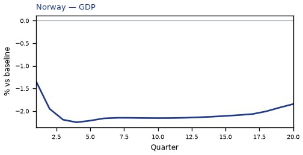

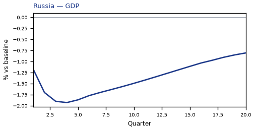


## SA — Saudi Arabia

The main impact of oil at $50 a barrel on Saudi Arabia would be a large drop in GDP of 4.05% by Q11. Equities peak at -16.11% in Q12.

Demand and trade. Consumption peaks at -2.69 % vs baseline in Q12, from -1.06 in Q1 to -2.17 in Q20. Investment peaks at -11.19 % vs baseline in Q11, from -5.91 in Q1 to -9.36 in Q20. Net Exports peaks at -7.42 % vs baseline in Q4, from -4.49 in Q1 to -3.33 in Q20. Gov Spending peaks at -2.42 % vs baseline in Q4, from -1.46 in Q1 to -0.85 in Q20. Gov Debt peaks at -9.46 % vs baseline in Q20, from -0.33 in Q1 to -9.46 in Q20.

External / FX. The real exchange rate shows real depreciation (a weaker, more competitive home currency). Real Exchange Rate peaks at +0.28 % vs baseline in Q11, from +0.01 in Q1 to +0.09 in Q20.

Labour. Employment peaks at -4.38 % vs baseline in Q15, from -0.50 in Q1 to -4.15 in Q20. Unemployment peaks at +1.60 pp in Q14, from +0.22 in Q1 to +1.47 in Q20. Real Wages peaks at -6.07 % vs baseline in Q20, from -0.02 in Q1 to -6.07 in Q20.

Prices. The three-year CPI impulse is -2.21 percentage points. CPI Inflation peaks at -0.21 pp in Q4, from -0.11 in Q1 to -0.15 in Q20. Domestic Infl. peaks at -0.15 pp in Q4, from -0.08 in Q1 to -0.11 in Q20. Marginal Cost peaks at -2.42 % vs baseline in Q11, from -1.31 in Q1 to -1.94 in Q20.

Financial conditions. Policy Rate peaks at -0.51 pp (annualized) in Q5, from -0.14 in Q1 to +0.24 in Q20. Real Rate peaks at -0.13 pp (annualized) in Q5, from -0.03 in Q1 to +0.06 in Q20. Govt 3M Yield peaks at -0.51 pp (annualized) in Q5, from -0.14 in Q1 to +0.24 in Q20. Govt 2Y Yield peaks at -0.42 pp (annualized) in Q2, from -0.39 in Q1 to +0.23 in Q20. Govt 5Y Yield peaks at +0.19 pp (annualized) in Q15, from -0.14 in Q1 to +0.17 in Q20. Govt 10Y Yield peaks at +0.12 pp (annualized) in Q14, from +0.01 in Q1 to +0.10 in Q20. Govt 30Y Yield peaks at +0.04 pp (annualized) in Q14, from +0.01 in Q1 to +0.03 in Q20. Bond Price (7y) peaks at +2.54 % vs baseline in Q5, from +0.68 in Q1 to -1.22 in Q20. Bond Price 3M peaks at +0.13 % vs baseline in Q5, from +0.03 in Q1 to -0.06 in Q20. Bond Price 2Y peaks at +0.79 % vs baseline in Q2, from +0.75 in Q1 to -0.45 in Q20. Bond Price 5Y peaks at -0.86 % vs baseline in Q15, from +0.61 in Q1 to -0.76 in Q20. Bond Price 10Y peaks at -0.98 % vs baseline in Q14, from -0.10 in Q1 to -0.79 in Q20. Bond Price 30Y peaks at -0.70 % vs baseline in Q14, from -0.11 in Q1 to -0.55 in Q20. Equity Index peaks at -16.11 % vs baseline in Q12, from -8.68 in Q1 to -13.04 in Q20. VIX peaks at +16.24 index_level in Q4, from +15.75 in Q1 to +15.58 in Q20. Tobin's Q peaks at -7.83 % vs baseline in Q11, from -4.14 in Q1 to -6.55 in Q20. House Prices peaks at -6.16 % vs baseline in Q20, from -0.34 in Q1 to -6.16 in Q20. Bank Equity peaks at -1.14 % vs baseline in Q16, from -0.10 in Q1 to -1.11 in Q20. Bank Credit peaks at -0.96 % vs baseline in Q16, from -0.08 in Q1 to -0.94 in Q20. Credit Spread peaks at +0.02 pp in Q16, from +0.00 in Q1 to +0.02 in Q20.

Nominal FX. NEER peaks at -0.63 % vs baseline in Q9, from -0.23 in Q1 to -0.31 in Q20. vs USD peaks at +0.48 % vs baseline in Q16, from -0.04 in Q1 to +0.42 in Q20.

Commodities. Energy Price peaks at +68.34 USD/bbl (level) in Q20, from +65.07 in Q1 to +68.34 in Q20. Metals Price peaks at +100.94 index (level) in Q10, from +100.26 in Q1 to +100.56 in Q20. Food Price peaks at +99.32 index (level) in Q1, from +99.32 in Q1 to +96.63 in Q20. Gas Price peaks at +3.61 USD/mmBtu (level) in Q20, from +3.51 in Q1 to +3.61 in Q20. Copper Price peaks at +100.87 index (level) in Q8, from +100.26 in Q1 to +100.51 in Q20. Wheat Price peaks at +100.54 index (level) in Q14, from +100.08 in Q1 to +100.36 in Q20. Gold Price peaks at +2065.27 USD/oz (level) in Q4, from +2034.50 in Q1 to +2012.05 in Q20.

Sectoral and capital. Manuf. GDP peaks at -0.43 % vs baseline in Q12, from -0.11 in Q1 to -0.34 in Q20. Services GDP peaks at -1.78 % vs baseline in Q11, from -0.96 in Q1 to -1.43 in Q20. Capital Stock peaks at -0.98 % vs baseline in Q20, from -0.03 in Q1 to -0.98 in Q20.

Timing. By Q20 GDP is still -3.24% from baseline.

These figures are model IRFs versus baseline, not forecasts.


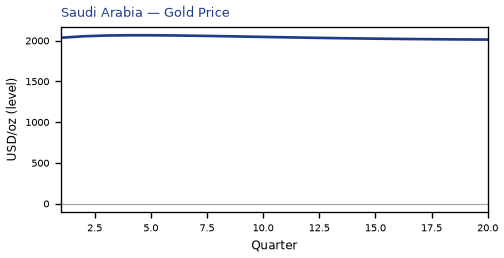


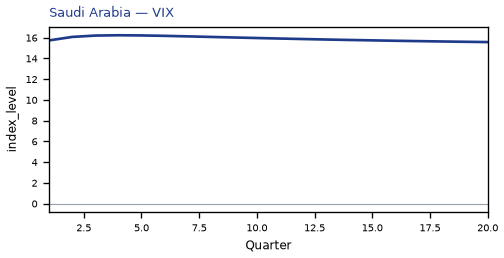


[Q1–Q20 JSON for Saudi Arabia](numbers/SA.json)

## NO — Norway

The main impact of oil at $50 a barrel on Norway would be a large drop in GDP of 2.25% by Q4. Equities peak at -4.68% in Q4.

Demand and trade. Consumption peaks at -1.31 % vs baseline in Q11, from -0.61 in Q1 to -1.14 in Q20. Investment peaks at -5.43 % vs baseline in Q2, from -3.47 in Q1 to -3.57 in Q20. Net Exports peaks at -4.22 % vs baseline in Q4, from -2.62 in Q1 to -1.21 in Q20. Gov Spending peaks at -1.62 % vs baseline in Q4, from -0.98 in Q1 to -0.59 in Q20. Gov Debt peaks at +0.83 % vs baseline in Q20, from +0.04 in Q1 to +0.83 in Q20.

External / FX. The real exchange rate shows real depreciation (a weaker, more competitive home currency). Real Exchange Rate peaks at +12.63 % vs baseline in Q6, from +6.90 in Q1 to +10.47 in Q20.

Labour. Employment peaks at -2.30 % vs baseline in Q18, from -0.25 in Q1 to -2.26 in Q20. Unemployment peaks at +1.60 pp in Q17, from +0.21 in Q1 to +1.54 in Q20. Real Wages peaks at -2.34 % vs baseline in Q20, from -0.01 in Q1 to -2.34 in Q20.

Prices. The three-year CPI impulse is +0.00 percentage points. CPI Inflation peaks at -0.08 pp in Q2, from -0.06 in Q1 to +0.01 in Q20. Domestic Infl. peaks at -0.05 pp in Q2, from -0.04 in Q1 to +0.01 in Q20. Marginal Cost peaks at -1.34 % vs baseline in Q4, from -0.80 in Q1 to -1.10 in Q20.

Financial conditions. Policy Rate peaks at -1.05 pp (annualized) in Q10, from -0.18 in Q1 to -1.00 in Q20. Real Rate peaks at -0.26 pp (annualized) in Q10, from -0.05 in Q1 to -0.25 in Q20. Govt 3M Yield peaks at -1.05 pp (annualized) in Q10, from -0.18 in Q1 to -1.00 in Q20. Govt 2Y Yield peaks at -1.04 pp (annualized) in Q8, from -0.74 in Q1 to -0.97 in Q20. Govt 5Y Yield peaks at -1.01 pp (annualized) in Q6, from -0.91 in Q1 to -0.90 in Q20. Govt 10Y Yield peaks at -0.92 pp (annualized) in Q4, from -0.90 in Q1 to -0.74 in Q20. Govt 30Y Yield peaks at -0.48 pp (annualized) in Q1, from -0.48 in Q1 to -0.35 in Q20. Bond Price (7y) peaks at +6.56 % vs baseline in Q10, from +1.13 in Q1 to +6.25 in Q20. Bond Price 3M peaks at +0.26 % vs baseline in Q10, from +0.05 in Q1 to +0.25 in Q20. Bond Price 2Y peaks at +1.97 % vs baseline in Q8, from +1.40 in Q1 to +1.84 in Q20. Bond Price 5Y peaks at +4.54 % vs baseline in Q6, from +4.10 in Q1 to +4.04 in Q20. Bond Price 10Y peaks at +7.56 % vs baseline in Q4, from +7.36 in Q1 to +6.10 in Q20. Bond Price 30Y peaks at +8.71 % vs baseline in Q1, from +8.71 in Q1 to +6.24 in Q20. Equity Index peaks at -4.68 % vs baseline in Q4, from -2.87 in Q1 to -4.16 in Q20. VIX peaks at +16.24 index_level in Q4, from +15.75 in Q1 to +15.58 in Q20. Tobin's Q peaks at -3.80 % vs baseline in Q2, from -2.43 in Q1 to -2.50 in Q20. House Prices peaks at -2.85 % vs baseline in Q20, from -0.15 in Q1 to -2.85 in Q20. Bank Equity peaks at -0.95 % vs baseline in Q16, from -0.08 in Q1 to -0.92 in Q20. Bank Credit peaks at -0.75 % vs baseline in Q16, from -0.07 in Q1 to -0.73 in Q20. Credit Spread peaks at +0.01 pp in Q16, from +0.00 in Q1 to +0.01 in Q20.

Nominal FX. NEER peaks at -12.84 % vs baseline in Q6, from -7.04 in Q1 to -10.55 in Q20. vs USD peaks at +12.46 % vs baseline in Q6, from +6.85 in Q1 to +10.79 in Q20.

Commodities. Energy Price peaks at +68.34 USD/bbl (level) in Q20, from +65.07 in Q1 to +68.34 in Q20. Metals Price peaks at +100.94 index (level) in Q10, from +100.26 in Q1 to +100.56 in Q20. Food Price peaks at +99.32 index (level) in Q1, from +99.32 in Q1 to +96.63 in Q20. Gas Price peaks at +3.61 USD/mmBtu (level) in Q20, from +3.51 in Q1 to +3.61 in Q20. Copper Price peaks at +100.87 index (level) in Q8, from +100.26 in Q1 to +100.51 in Q20. Wheat Price peaks at +100.54 index (level) in Q14, from +100.08 in Q1 to +100.36 in Q20. Gold Price peaks at +2065.27 USD/oz (level) in Q4, from +2034.50 in Q1 to +2012.05 in Q20.

Sectoral and capital. Manuf. GDP peaks at -3.75 % vs baseline in Q6, from -2.04 in Q1 to -3.26 in Q20. Services GDP peaks at -1.29 % vs baseline in Q4, from -0.77 in Q1 to -1.06 in Q20. Capital Stock peaks at -0.44 % vs baseline in Q20, from -0.02 in Q1 to -0.44 in Q20.

Timing. By Q20 GDP is still -1.84% from baseline.

These figures are model IRFs versus baseline, not forecasts.


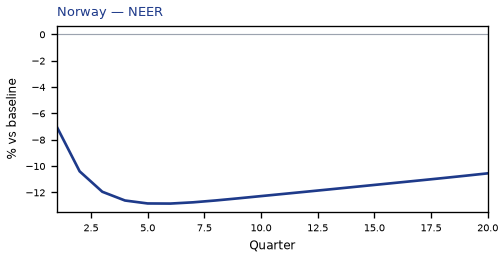


[Q1–Q20 JSON for Norway](numbers/NO.json)

## RU — Russia

The main impact of oil at $50 a barrel on Russia would be a large drop in GDP of 1.93% by Q4. Equities peak at -3.04% in Q3.

Demand and trade. Consumption peaks at -1.06 % vs baseline in Q5, from -0.51 in Q1 to -0.49 in Q20. Investment peaks at -4.74 % vs baseline in Q2, from -3.08 in Q1 to -1.60 in Q20. Net Exports peaks at -4.38 % vs baseline in Q4, from -2.64 in Q1 to -1.97 in Q20. Gov Spending peaks at -1.14 % vs baseline in Q4, from -0.68 in Q1 to -0.55 in Q20. Gov Debt peaks at -0.90 % vs baseline in Q20, from -0.06 in Q1 to -0.90 in Q20.

External / FX. The real exchange rate shows real depreciation (a weaker, more competitive home currency). Real Exchange Rate peaks at +5.82 % vs baseline in Q5, from +3.44 in Q1 to +3.53 in Q20.

Labour. Employment peaks at -1.62 % vs baseline in Q12, from -0.21 in Q1 to -1.28 in Q20. Unemployment peaks at +0.62 pp in Q9, from +0.12 in Q1 to +0.39 in Q20. Real Wages peaks at -3.86 % vs baseline in Q20, from -0.02 in Q1 to -3.86 in Q20.

Prices. The three-year CPI impulse is -1.60 percentage points. CPI Inflation peaks at -0.18 pp in Q4, from -0.04 in Q1 to -0.06 in Q20. Domestic Infl. peaks at -0.13 pp in Q4, from -0.02 in Q1 to -0.04 in Q20. Marginal Cost peaks at -1.15 % vs baseline in Q4, from -0.70 in Q1 to -0.48 in Q20.

Financial conditions. Policy Rate peaks at -0.90 pp (annualized) in Q7, from -0.13 in Q1 to -0.40 in Q20. Real Rate peaks at -0.23 pp (annualized) in Q7, from -0.03 in Q1 to -0.10 in Q20. Govt 3M Yield peaks at -0.90 pp (annualized) in Q7, from -0.13 in Q1 to -0.40 in Q20. Govt 2Y Yield peaks at -0.84 pp (annualized) in Q5, from -0.66 in Q1 to -0.33 in Q20. Govt 5Y Yield peaks at -0.65 pp (annualized) in Q3, from -0.63 in Q1 to -0.27 in Q20. Govt 10Y Yield peaks at -0.45 pp (annualized) in Q2, from -0.45 in Q1 to -0.20 in Q20. Govt 30Y Yield peaks at -0.19 pp (annualized) in Q1, from -0.19 in Q1 to -0.09 in Q20. Bond Price (7y) peaks at +2.82 % vs baseline in Q7, from +0.40 in Q1 to +1.23 in Q20. Bond Price 3M peaks at +0.23 % vs baseline in Q7, from +0.03 in Q1 to +0.10 in Q20. Bond Price 2Y peaks at +1.60 % vs baseline in Q5, from +1.25 in Q1 to +0.62 in Q20. Bond Price 5Y peaks at +2.91 % vs baseline in Q3, from +2.85 in Q1 to +1.20 in Q20. Bond Price 10Y peaks at +3.66 % vs baseline in Q2, from +3.65 in Q1 to +1.62 in Q20. Bond Price 30Y peaks at +3.38 % vs baseline in Q1, from +3.38 in Q1 to +1.56 in Q20. Equity Index peaks at -3.04 % vs baseline in Q3, from -1.99 in Q1 to -1.64 in Q20. VIX peaks at +16.24 index_level in Q4, from +15.75 in Q1 to +15.58 in Q20. Tobin's Q peaks at -3.32 % vs baseline in Q2, from -2.15 in Q1 to -1.12 in Q20. House Prices peaks at -2.02 % vs baseline in Q16, from -0.18 in Q1 to -1.96 in Q20. Bank Equity peaks at -0.54 % vs baseline in Q16, from -0.05 in Q1 to -0.52 in Q20. Bank Credit peaks at -0.47 % vs baseline in Q16, from -0.04 in Q1 to -0.46 in Q20. Credit Spread peaks at +0.02 pp in Q16, from +0.00 in Q1 to +0.01 in Q20.

Nominal FX. NEER peaks at -6.67 % vs baseline in Q5, from -3.95 in Q1 to -4.07 in Q20. vs USD peaks at +5.64 % vs baseline in Q5, from +3.39 in Q1 to +3.85 in Q20.

Commodities. Energy Price peaks at +68.34 USD/bbl (level) in Q20, from +65.07 in Q1 to +68.34 in Q20. Metals Price peaks at +100.94 index (level) in Q10, from +100.26 in Q1 to +100.56 in Q20. Food Price peaks at +99.32 index (level) in Q1, from +99.32 in Q1 to +96.63 in Q20. Gas Price peaks at +3.61 USD/mmBtu (level) in Q20, from +3.51 in Q1 to +3.61 in Q20. Copper Price peaks at +100.87 index (level) in Q8, from +100.26 in Q1 to +100.51 in Q20. Wheat Price peaks at +100.54 index (level) in Q14, from +100.08 in Q1 to +100.36 in Q20. Gold Price peaks at +2065.27 USD/oz (level) in Q4, from +2034.50 in Q1 to +2012.05 in Q20.

Sectoral and capital. Manuf. GDP peaks at -1.63 % vs baseline in Q5, from -0.97 in Q1 to -0.99 in Q20. Services GDP peaks at -1.06 % vs baseline in Q4, from -0.65 in Q1 to -0.44 in Q20. Capital Stock peaks at -0.29 % vs baseline in Q20, from -0.02 in Q1 to -0.29 in Q20.

Timing. By Q20 GDP is still -0.81% from baseline.

These figures are model IRFs versus baseline, not forecasts.


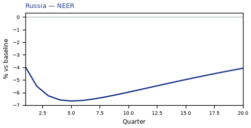


[Q1–Q20 JSON for Russia](numbers/RU.json)

## AR — Argentina

The main impact of oil at $50 a barrel on Argentina would be a large rise in GDP of 0.98% by Q13. Equities peak at +1.70% in Q11.

Demand and trade. Consumption peaks at +0.50 % vs baseline in Q13, from +0.04 in Q1 to +0.25 in Q20. Investment peaks at +2.40 % vs baseline in Q10, from +0.41 in Q1 to +0.21 in Q20. Net Exports peaks at -0.63 % vs baseline in Q9, from -0.22 in Q1 to -0.39 in Q20. Gov Spending peaks at -0.26 % vs baseline in Q12, from -0.04 in Q1 to -0.13 in Q20. Gov Debt peaks at +0.79 % vs baseline in Q20, from +0.00 in Q1 to +0.79 in Q20.

External / FX. The real exchange rate shows real appreciation (a stronger home currency). Real Exchange Rate peaks at -0.89 % vs baseline in Q12, from -0.08 in Q1 to -0.28 in Q20.

Labour. Employment peaks at +0.88 % vs baseline in Q17, from +0.00 in Q1 to +0.82 in Q20. Unemployment peaks at -0.25 pp in Q15, from -0.00 in Q1 to -0.19 in Q20. Real Wages peaks at +1.56 % vs baseline in Q20, from +0.00 in Q1 to +1.56 in Q20.

Prices. The three-year CPI impulse is -0.64 percentage points. CPI Inflation peaks at -0.16 pp in Q3, from -0.10 in Q1 to +0.11 in Q20. Domestic Infl. peaks at -0.11 pp in Q3, from -0.07 in Q1 to +0.08 in Q20. Marginal Cost peaks at +0.59 % vs baseline in Q13, from +0.01 in Q1 to +0.25 in Q20.

Financial conditions. Policy Rate peaks at -0.66 pp (annualized) in Q4, from -0.24 in Q1 to +0.55 in Q20. Real Rate peaks at -0.16 pp (annualized) in Q4, from -0.06 in Q1 to +0.14 in Q20. Govt 3M Yield peaks at -0.66 pp (annualized) in Q4, from -0.24 in Q1 to +0.55 in Q20. Govt 2Y Yield peaks at +0.58 pp (annualized) in Q14, from -0.47 in Q1 to +0.36 in Q20. Govt 5Y Yield peaks at +0.39 pp (annualized) in Q10, from +0.08 in Q1 to +0.13 in Q20. Govt 10Y Yield peaks at +0.16 pp (annualized) in Q9, from +0.09 in Q1 to +0.02 in Q20. Govt 30Y Yield peaks at +0.04 pp (annualized) in Q10, from +0.01 in Q1 to -0.00 in Q20. Bond Price (7y) peaks at +1.64 % vs baseline in Q4, from +0.60 in Q1 to -1.38 in Q20. Bond Price 3M peaks at +0.16 % vs baseline in Q4, from +0.06 in Q1 to -0.14 in Q20. Bond Price 2Y peaks at -1.11 % vs baseline in Q14, from +0.89 in Q1 to -0.69 in Q20. Bond Price 5Y peaks at -1.77 % vs baseline in Q10, from -0.35 in Q1 to -0.58 in Q20. Bond Price 10Y peaks at -1.32 % vs baseline in Q9, from -0.71 in Q1 to -0.19 in Q20. Bond Price 30Y peaks at -0.68 % vs baseline in Q10, from -0.11 in Q1 to +0.04 in Q20. Equity Index peaks at +1.70 % vs baseline in Q11, from +0.16 in Q1 to +0.42 in Q20. VIX peaks at +16.24 index_level in Q4, from +15.75 in Q1 to +15.58 in Q20. Tobin's Q peaks at +1.68 % vs baseline in Q10, from +0.29 in Q1 to +0.15 in Q20. House Prices peaks at +1.02 % vs baseline in Q18, from +0.01 in Q1 to +0.99 in Q20. Bank Equity peaks at -0.01 % vs baseline in Q20, from +0.00 in Q1 to -0.01 in Q20. Bank Credit peaks at -0.01 % vs baseline in Q20, from +0.00 in Q1 to -0.01 in Q20. Credit Spread peaks at +0.00 pp in Q20, from +0.00 in Q1 to +0.00 in Q20.

Nominal FX. NEER peaks at +1.18 % vs baseline in Q10, from +0.22 in Q1 to +0.29 in Q20. vs USD peaks at -0.84 % vs baseline in Q10, from -0.13 in Q1 to +0.04 in Q20.

Commodities. Energy Price peaks at +68.34 USD/bbl (level) in Q20, from +65.07 in Q1 to +68.34 in Q20. Metals Price peaks at +100.94 index (level) in Q10, from +100.26 in Q1 to +100.56 in Q20. Food Price peaks at +99.32 index (level) in Q1, from +99.32 in Q1 to +96.63 in Q20. Gas Price peaks at +3.61 USD/mmBtu (level) in Q20, from +3.51 in Q1 to +3.61 in Q20. Copper Price peaks at +100.87 index (level) in Q8, from +100.26 in Q1 to +100.51 in Q20. Wheat Price peaks at +100.54 index (level) in Q14, from +100.08 in Q1 to +100.36 in Q20. Gold Price peaks at +2065.27 USD/oz (level) in Q4, from +2034.50 in Q1 to +2012.05 in Q20.

Sectoral and capital. Manuf. GDP peaks at +0.82 % vs baseline in Q11, from +0.33 in Q1 to +0.40 in Q20. Services GDP peaks at +0.56 % vs baseline in Q13, from +0.01 in Q1 to +0.23 in Q20. Capital Stock peaks at +0.15 % vs baseline in Q20, from +0.00 in Q1 to +0.15 in Q20.

Timing. By Q20 GDP is still +0.40% from baseline.

These figures are model IRFs versus baseline, not forecasts.


[Q1–Q20 JSON for Argentina](numbers/AR.json)

## TR — Turkey

The main impact of oil at $50 a barrel on Turkey would be a large rise in GDP of 0.96% by Q11. Equities peak at +1.88% in Q9.

Demand and trade. Consumption peaks at +0.56 % vs baseline in Q12, from +0.19 in Q1 to +0.27 in Q20. Investment peaks at +3.09 % vs baseline in Q7, from +1.33 in Q1 to +0.34 in Q20. Net Exports peaks at +1.20 % vs baseline in Q4, from +0.75 in Q1 to +0.45 in Q20. Gov Spending peaks at -0.17 % vs baseline in Q11, from -0.06 in Q1 to -0.07 in Q20. Gov Debt peaks at +1.12 % vs baseline in Q20, from +0.03 in Q1 to +1.12 in Q20.

External / FX. The real exchange rate shows real appreciation (a stronger home currency). Real Exchange Rate peaks at -1.85 % vs baseline in Q12, from -0.40 in Q1 to -1.28 in Q20.

Labour. Employment peaks at +0.94 % vs baseline in Q16, from +0.06 in Q1 to +0.83 in Q20. Unemployment peaks at -0.26 pp in Q14, from -0.03 in Q1 to -0.18 in Q20. Real Wages peaks at +1.43 % vs baseline in Q20, from +0.01 in Q1 to +1.43 in Q20.

Prices. The three-year CPI impulse is -0.91 percentage points. CPI Inflation peaks at -0.16 pp in Q3, from -0.09 in Q1 to +0.09 in Q20. Domestic Infl. peaks at -0.11 pp in Q3, from -0.06 in Q1 to +0.07 in Q20. Marginal Cost peaks at +0.59 % vs baseline in Q11, from +0.21 in Q1 to +0.24 in Q20.

Financial conditions. Policy Rate peaks at -0.67 pp (annualized) in Q4, from -0.23 in Q1 to +0.44 in Q20. Real Rate peaks at -0.17 pp (annualized) in Q4, from -0.06 in Q1 to +0.11 in Q20. Govt 3M Yield peaks at -0.67 pp (annualized) in Q4, from -0.23 in Q1 to +0.44 in Q20. Govt 2Y Yield peaks at -0.50 pp (annualized) in Q2, from -0.50 in Q1 to +0.35 in Q20. Govt 5Y Yield peaks at +0.31 pp (annualized) in Q12, from -0.06 in Q1 to +0.20 in Q20. Govt 10Y Yield peaks at +0.17 pp (annualized) in Q11, from +0.06 in Q1 to +0.10 in Q20. Govt 30Y Yield peaks at +0.06 pp (annualized) in Q11, from +0.02 in Q1 to +0.03 in Q20. Bond Price (7y) peaks at +2.09 % vs baseline in Q4, from +0.70 in Q1 to -1.38 in Q20. Bond Price 3M peaks at +0.17 % vs baseline in Q4, from +0.06 in Q1 to -0.11 in Q20. Bond Price 2Y peaks at +0.96 % vs baseline in Q2, from +0.96 in Q1 to -0.67 in Q20. Bond Price 5Y peaks at -1.41 % vs baseline in Q12, from +0.26 in Q1 to -0.91 in Q20. Bond Price 10Y peaks at -1.39 % vs baseline in Q11, from -0.50 in Q1 to -0.81 in Q20. Bond Price 30Y peaks at -0.99 % vs baseline in Q11, from -0.34 in Q1 to -0.58 in Q20. Equity Index peaks at +1.88 % vs baseline in Q9, from +0.72 in Q1 to +0.46 in Q20. VIX peaks at +16.24 index_level in Q4, from +15.75 in Q1 to +15.58 in Q20. Tobin's Q peaks at +2.16 % vs baseline in Q7, from +0.93 in Q1 to +0.24 in Q20. House Prices peaks at +1.31 % vs baseline in Q17, from +0.06 in Q1 to +1.25 in Q20. Bank Equity peaks at +0.05 % vs baseline in Q16, from +0.00 in Q1 to +0.05 in Q20. Bank Credit peaks at +0.01 % vs baseline in Q16, from +0.00 in Q1 to +0.01 in Q20. Credit Spread peaks at +0.00 pp in Q1, from +0.00 in Q1 to +0.00 in Q20.

Nominal FX. NEER peaks at +2.10 % vs baseline in Q12, from +0.53 in Q1 to +1.53 in Q20. vs USD peaks at -1.78 % vs baseline in Q10, from -0.45 in Q1 to -0.95 in Q20.

Commodities. Energy Price peaks at +68.34 USD/bbl (level) in Q20, from +65.07 in Q1 to +68.34 in Q20. Metals Price peaks at +100.94 index (level) in Q10, from +100.26 in Q1 to +100.56 in Q20. Food Price peaks at +99.32 index (level) in Q1, from +99.32 in Q1 to +96.63 in Q20. Gas Price peaks at +3.61 USD/mmBtu (level) in Q20, from +3.51 in Q1 to +3.61 in Q20. Copper Price peaks at +100.87 index (level) in Q8, from +100.26 in Q1 to +100.51 in Q20. Wheat Price peaks at +100.54 index (level) in Q14, from +100.08 in Q1 to +100.36 in Q20. Gold Price peaks at +2065.27 USD/oz (level) in Q4, from +2034.50 in Q1 to +2012.05 in Q20.

Sectoral and capital. Manuf. GDP peaks at +1.34 % vs baseline in Q10, from +0.63 in Q1 to +0.82 in Q20. Services GDP peaks at +0.58 % vs baseline in Q11, from +0.20 in Q1 to +0.23 in Q20. Capital Stock peaks at +0.22 % vs baseline in Q20, from +0.01 in Q1 to +0.22 in Q20.

Timing. By Q20 GDP is still +0.38% from baseline.

These figures are model IRFs versus baseline, not forecasts.


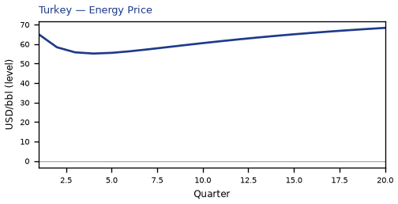


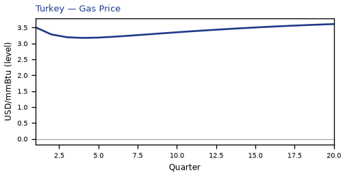


[Q1–Q20 JSON for Turkey](numbers/TR.json)

## NG — Nigeria

The main impact of oil at $50 a barrel on Nigeria would be a large drop in GDP of 0.82% by Q3. Equities peak at -0.99% in Q3.

Demand and trade. Consumption peaks at -0.46 % vs baseline in Q4, from -0.22 in Q1 to +0.15 in Q20. Investment peaks at -1.81 % vs baseline in Q2, from -1.24 in Q1 to +0.47 in Q20. Net Exports peaks at -2.37 % vs baseline in Q4, from -1.42 in Q1 to -1.16 in Q20. Gov Spending peaks at -0.32 % vs baseline in Q10, from -0.19 in Q1 to -0.25 in Q20. Gov Debt peaks at -1.33 % vs baseline in Q11, from -0.12 in Q1 to -0.84 in Q20.

External / FX. The real exchange rate shows real depreciation (a weaker, more competitive home currency). Real Exchange Rate peaks at +2.58 % vs baseline in Q5, from +1.56 in Q1 to +1.05 in Q20.

Labour. Employment peaks at -0.49 % vs baseline in Q8, from -0.07 in Q1 to +0.01 in Q20. Unemployment peaks at +0.05 pp in Q5, from +0.01 in Q1 to -0.03 in Q20. Real Wages peaks at -1.32 % vs baseline in Q14, from -0.01 in Q1 to -0.94 in Q20.

Prices. The three-year CPI impulse is -1.52 percentage points. CPI Inflation peaks at -0.20 pp in Q4, from -0.05 in Q1 to +0.04 in Q20. Domestic Infl. peaks at -0.14 pp in Q4, from -0.04 in Q1 to +0.03 in Q20. Marginal Cost peaks at -0.49 % vs baseline in Q3, from -0.30 in Q1 to +0.15 in Q20.

Financial conditions. Policy Rate peaks at -0.77 pp (annualized) in Q6, from -0.12 in Q1 to +0.13 in Q20. Real Rate peaks at -0.19 pp (annualized) in Q6, from -0.03 in Q1 to +0.03 in Q20. Govt 3M Yield peaks at -0.77 pp (annualized) in Q6, from -0.12 in Q1 to +0.13 in Q20. Govt 2Y Yield peaks at -0.67 pp (annualized) in Q3, from -0.57 in Q1 to +0.16 in Q20. Govt 5Y Yield peaks at -0.35 pp (annualized) in Q1, from -0.35 in Q1 to +0.12 in Q20. Govt 10Y Yield peaks at -0.12 pp (annualized) in Q1, from -0.12 in Q1 to +0.07 in Q20. Govt 30Y Yield peaks at -0.03 pp (annualized) in Q1, from -0.03 in Q1 to +0.03 in Q20. Bond Price (7y) peaks at +1.93 % vs baseline in Q6, from +0.30 in Q1 to -0.34 in Q20. Bond Price 3M peaks at +0.19 % vs baseline in Q6, from +0.03 in Q1 to -0.03 in Q20. Bond Price 2Y peaks at +1.27 % vs baseline in Q3, from +1.09 in Q1 to -0.30 in Q20. Bond Price 5Y peaks at +1.56 % vs baseline in Q1, from +1.56 in Q1 to -0.52 in Q20. Bond Price 10Y peaks at +0.97 % vs baseline in Q1, from +0.97 in Q1 to -0.61 in Q20. Bond Price 30Y peaks at +0.59 % vs baseline in Q1, from +0.59 in Q1 to -0.47 in Q20. Equity Index peaks at -0.99 % vs baseline in Q3, from -0.71 in Q1 to +0.22 in Q20. VIX peaks at +16.24 index_level in Q4, from +15.75 in Q1 to +15.58 in Q20. Tobin's Q peaks at -1.27 % vs baseline in Q2, from -0.87 in Q1 to +0.33 in Q20. House Prices peaks at -0.55 % vs baseline in Q8, from -0.08 in Q1 to -0.01 in Q20. Bank Equity peaks at -0.20 % vs baseline in Q16, from -0.02 in Q1 to -0.20 in Q20. Bank Credit peaks at -0.36 % vs baseline in Q16, from -0.03 in Q1 to -0.35 in Q20. Credit Spread peaks at +0.05 pp in Q16, from +0.00 in Q1 to +0.05 in Q20.

Nominal FX. NEER peaks at -2.46 % vs baseline in Q5, from -1.51 in Q1 to -1.11 in Q20. vs USD peaks at +2.40 % vs baseline in Q5, from +1.51 in Q1 to +1.38 in Q20.

Commodities. Energy Price peaks at +68.34 USD/bbl (level) in Q20, from +65.07 in Q1 to +68.34 in Q20. Metals Price peaks at +100.94 index (level) in Q10, from +100.26 in Q1 to +100.56 in Q20. Food Price peaks at +99.32 index (level) in Q1, from +99.32 in Q1 to +96.63 in Q20. Gas Price peaks at +3.61 USD/mmBtu (level) in Q20, from +3.51 in Q1 to +3.61 in Q20. Copper Price peaks at +100.87 index (level) in Q8, from +100.26 in Q1 to +100.51 in Q20. Wheat Price peaks at +100.54 index (level) in Q14, from +100.08 in Q1 to +100.36 in Q20. Gold Price peaks at +2065.27 USD/oz (level) in Q4, from +2034.50 in Q1 to +2012.05 in Q20.

Sectoral and capital. Manuf. GDP peaks at -0.60 % vs baseline in Q5, from -0.37 in Q1 to -0.18 in Q20. Services GDP peaks at -0.41 % vs baseline in Q3, from -0.25 in Q1 to +0.12 in Q20. Capital Stock peaks at -0.04 % vs baseline in Q7, from -0.01 in Q1 to +0.00 in Q20.

Timing. The GDP response has mostly faded by Q10 (Q20 is +0.24%).

These figures are model IRFs versus baseline, not forecasts.


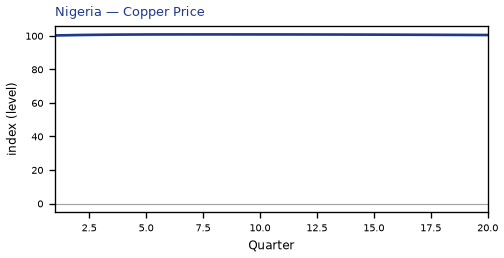


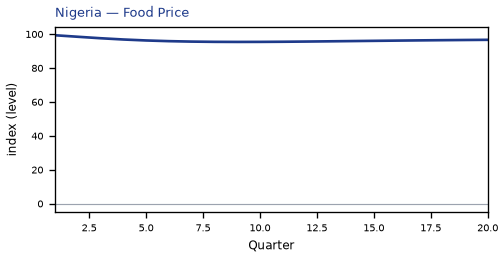


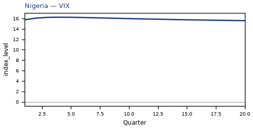


[Q1–Q20 JSON for Nigeria](numbers/NG.json)

## IN — India

The main impact of oil at $50 a barrel on India would be a large rise in GDP of 0.81% by Q12. Equities peak at +2.34% in Q10.

Demand and trade. Consumption peaks at +0.50 % vs baseline in Q12, from +0.19 in Q1 to +0.31 in Q20. Investment peaks at +3.02 % vs baseline in Q7, from +1.26 in Q1 to +0.54 in Q20. Net Exports peaks at +1.23 % vs baseline in Q4, from +0.77 in Q1 to +0.44 in Q20. Gov Spending peaks at -0.14 % vs baseline in Q12, from -0.06 in Q1 to -0.08 in Q20. Gov Debt peaks at +1.65 % vs baseline in Q20, from +0.05 in Q1 to +1.65 in Q20.

External / FX. The real exchange rate shows real appreciation (a stronger home currency). Real Exchange Rate peaks at -1.33 % vs baseline in Q16, from -0.12 in Q1 to -1.24 in Q20.

Labour. Employment peaks at +0.74 % vs baseline in Q18, from +0.04 in Q1 to +0.72 in Q20. Unemployment peaks at -0.11 pp in Q14, from -0.01 in Q1 to -0.09 in Q20. Real Wages peaks at +0.98 % vs baseline in Q20, from +0.01 in Q1 to +0.98 in Q20.

Prices. The three-year CPI impulse is -1.03 percentage points. CPI Inflation peaks at -0.18 pp in Q3, from -0.10 in Q1 to +0.09 in Q20. Domestic Infl. peaks at -0.13 pp in Q3, from -0.07 in Q1 to +0.06 in Q20. Marginal Cost peaks at +0.50 % vs baseline in Q12, from +0.21 in Q1 to +0.28 in Q20.

Financial conditions. Policy Rate peaks at -0.75 pp (annualized) in Q5, from -0.19 in Q1 to +0.45 in Q20. Real Rate peaks at -0.19 pp (annualized) in Q5, from -0.05 in Q1 to +0.11 in Q20. Govt 3M Yield peaks at -0.75 pp (annualized) in Q5, from -0.19 in Q1 to +0.45 in Q20. Govt 2Y Yield peaks at -0.61 pp (annualized) in Q2, from -0.58 in Q1 to +0.43 in Q20. Govt 5Y Yield peaks at +0.36 pp (annualized) in Q15, from -0.17 in Q1 to +0.31 in Q20. Govt 10Y Yield peaks at +0.22 pp (annualized) in Q13, from +0.06 in Q1 to +0.18 in Q20. Govt 30Y Yield peaks at +0.08 pp (annualized) in Q13, from +0.03 in Q1 to +0.06 in Q20. Bond Price (7y) peaks at +3.73 % vs baseline in Q5, from +0.94 in Q1 to -2.26 in Q20. Bond Price 3M peaks at +0.19 % vs baseline in Q5, from +0.05 in Q1 to -0.11 in Q20. Bond Price 2Y peaks at +1.16 % vs baseline in Q2, from +1.09 in Q1 to -0.82 in Q20. Bond Price 5Y peaks at -1.60 % vs baseline in Q15, from +0.75 in Q1 to -1.39 in Q20. Bond Price 10Y peaks at -1.83 % vs baseline in Q13, from -0.51 in Q1 to -1.48 in Q20. Bond Price 30Y peaks at -1.36 % vs baseline in Q13, from -0.51 in Q1 to -1.08 in Q20. Equity Index peaks at +2.34 % vs baseline in Q10, from +1.02 in Q1 to +1.10 in Q20. VIX peaks at +16.24 index_level in Q4, from +15.75 in Q1 to +15.58 in Q20. Tobin's Q peaks at +2.11 % vs baseline in Q7, from +0.88 in Q1 to +0.38 in Q20. House Prices peaks at +1.18 % vs baseline in Q18, from +0.06 in Q1 to +1.14 in Q20. Bank Equity peaks at +0.05 % vs baseline in Q16, from +0.00 in Q1 to +0.05 in Q20. Bank Credit peaks at +0.02 % vs baseline in Q16, from +0.00 in Q1 to +0.02 in Q20. Credit Spread peaks at +0.00 pp in Q1, from +0.00 in Q1 to +0.00 in Q20.

Nominal FX. NEER peaks at +1.83 % vs baseline in Q15, from +0.50 in Q1 to +1.67 in Q20. vs USD peaks at -1.09 % vs baseline in Q13, from -0.17 in Q1 to -0.91 in Q20.

Commodities. Energy Price peaks at +68.34 USD/bbl (level) in Q20, from +65.07 in Q1 to +68.34 in Q20. Metals Price peaks at +100.94 index (level) in Q10, from +100.26 in Q1 to +100.56 in Q20. Food Price peaks at +99.32 index (level) in Q1, from +99.32 in Q1 to +96.63 in Q20. Gas Price peaks at +3.61 USD/mmBtu (level) in Q20, from +3.51 in Q1 to +3.61 in Q20. Copper Price peaks at +100.87 index (level) in Q8, from +100.26 in Q1 to +100.51 in Q20. Wheat Price peaks at +100.54 index (level) in Q14, from +100.08 in Q1 to +100.36 in Q20. Gold Price peaks at +2065.27 USD/oz (level) in Q4, from +2034.50 in Q1 to +2012.05 in Q20.

Sectoral and capital. Manuf. GDP peaks at +1.00 % vs baseline in Q11, from +0.49 in Q1 to +0.77 in Q20. Services GDP peaks at +0.44 % vs baseline in Q12, from +0.18 in Q1 to +0.25 in Q20. Capital Stock peaks at +0.21 % vs baseline in Q20, from +0.01 in Q1 to +0.21 in Q20.

Timing. By Q20 GDP is still +0.45% from baseline.

These figures are model IRFs versus baseline, not forecasts.


[Q1–Q20 JSON for India](numbers/IN.json)

## KR — South Korea

The main impact of oil at $50 a barrel on South Korea would be a large rise in GDP of 0.68% by Q5. Equities peak at +2.10% in Q5.

Demand and trade. Consumption peaks at +0.46 % vs baseline in Q5, from +0.23 in Q1 to +0.23 in Q20. Investment peaks at +2.66 % vs baseline in Q5, from +1.36 in Q1 to +0.43 in Q20. Net Exports peaks at +1.50 % vs baseline in Q4, from +0.89 in Q1 to +0.60 in Q20. Gov Spending peaks at -0.13 % vs baseline in Q5, from -0.07 in Q1 to -0.06 in Q20. Gov Debt peaks at +0.49 % vs baseline in Q20, from +0.03 in Q1 to +0.49 in Q20.

External / FX. The real exchange rate shows real appreciation (a stronger home currency). Real Exchange Rate peaks at -2.41 % vs baseline in Q4, from -1.46 in Q1 to -1.76 in Q20.

Labour. Employment peaks at +0.66 % vs baseline in Q13, from +0.08 in Q1 to +0.53 in Q20. Unemployment peaks at -0.26 pp in Q11, from -0.04 in Q1 to -0.18 in Q20. Real Wages peaks at +0.64 % vs baseline in Q20, from +0.00 in Q1 to +0.64 in Q20.

Prices. The three-year CPI impulse is -0.94 percentage points. CPI Inflation peaks at -0.17 pp in Q2, from -0.13 in Q1 to +0.04 in Q20. Domestic Infl. peaks at -0.12 pp in Q2, from -0.09 in Q1 to +0.03 in Q20. Marginal Cost peaks at +0.43 % vs baseline in Q5, from +0.25 in Q1 to +0.20 in Q20.

Financial conditions. Policy Rate peaks at -0.44 pp (annualized) in Q5, from -0.14 in Q1 to +0.30 in Q20. Real Rate peaks at -0.11 pp (annualized) in Q5, from -0.04 in Q1 to +0.08 in Q20. Govt 3M Yield peaks at -0.44 pp (annualized) in Q5, from -0.14 in Q1 to +0.30 in Q20. Govt 2Y Yield peaks at -0.35 pp (annualized) in Q2, from -0.34 in Q1 to +0.30 in Q20. Govt 5Y Yield peaks at +0.26 pp (annualized) in Q15, from -0.07 in Q1 to +0.24 in Q20. Govt 10Y Yield peaks at +0.19 pp (annualized) in Q13, from +0.08 in Q1 to +0.16 in Q20. Govt 30Y Yield peaks at +0.07 pp (annualized) in Q12, from +0.05 in Q1 to +0.06 in Q20. Bond Price (7y) peaks at +2.20 % vs baseline in Q5, from +0.70 in Q1 to -1.52 in Q20. Bond Price 3M peaks at +0.11 % vs baseline in Q5, from +0.04 in Q1 to -0.08 in Q20. Bond Price 2Y peaks at +0.66 % vs baseline in Q2, from +0.65 in Q1 to -0.57 in Q20. Bond Price 5Y peaks at -1.17 % vs baseline in Q15, from +0.30 in Q1 to -1.07 in Q20. Bond Price 10Y peaks at -1.53 % vs baseline in Q13, from -0.67 in Q1 to -1.30 in Q20. Bond Price 30Y peaks at -1.30 % vs baseline in Q12, from -0.83 in Q1 to -1.08 in Q20. Equity Index peaks at +2.10 % vs baseline in Q5, from +1.11 in Q1 to +0.68 in Q20. VIX peaks at +16.24 index_level in Q4, from +15.75 in Q1 to +15.58 in Q20. Tobin's Q peaks at +1.86 % vs baseline in Q5, from +0.95 in Q1 to +0.30 in Q20. House Prices peaks at +0.85 % vs baseline in Q18, from +0.05 in Q1 to +0.84 in Q20. Bank Equity peaks at +0.08 % vs baseline in Q16, from +0.01 in Q1 to +0.08 in Q20. Bank Credit peaks at +0.03 % vs baseline in Q16, from +0.00 in Q1 to +0.03 in Q20. Credit Spread peaks at +0.00 pp in Q1, from +0.00 in Q1 to +0.00 in Q20.

Nominal FX. NEER peaks at +2.35 % vs baseline in Q4, from +1.41 in Q1 to +1.84 in Q20. vs USD peaks at -2.58 % vs baseline in Q5, from -1.50 in Q1 to -1.44 in Q20.

Commodities. Energy Price peaks at +68.34 USD/bbl (level) in Q20, from +65.07 in Q1 to +68.34 in Q20. Metals Price peaks at +100.94 index (level) in Q10, from +100.26 in Q1 to +100.56 in Q20. Food Price peaks at +99.32 index (level) in Q1, from +99.32 in Q1 to +96.63 in Q20. Gas Price peaks at +3.61 USD/mmBtu (level) in Q20, from +3.51 in Q1 to +3.61 in Q20. Copper Price peaks at +100.87 index (level) in Q8, from +100.26 in Q1 to +100.51 in Q20. Wheat Price peaks at +100.54 index (level) in Q14, from +100.08 in Q1 to +100.36 in Q20. Gold Price peaks at +2065.27 USD/oz (level) in Q4, from +2034.50 in Q1 to +2012.05 in Q20.

Sectoral and capital. Manuf. GDP peaks at +1.76 % vs baseline in Q4, from +1.06 in Q1 to +1.02 in Q20. Services GDP peaks at +0.41 % vs baseline in Q5, from +0.24 in Q1 to +0.19 in Q20. Capital Stock peaks at +0.17 % vs baseline in Q20, from +0.01 in Q1 to +0.17 in Q20.

Timing. By Q20 GDP is still +0.32% from baseline.

These figures are model IRFs versus baseline, not forecasts.


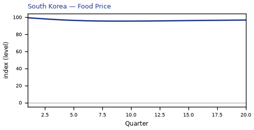


[Q1–Q20 JSON for South Korea](numbers/KR.json)

## JP — Japan

The main impact of oil at $50 a barrel on Japan would be a large rise in GDP of 0.58% by Q4. Equities peak at +1.85% in Q4.

Demand and trade. Consumption peaks at +0.41 % vs baseline in Q5, from +0.20 in Q1 to +0.20 in Q20. Investment peaks at +1.85 % vs baseline in Q4, from +1.04 in Q1 to +0.82 in Q20. Net Exports peaks at +1.18 % vs baseline in Q4, from +0.71 in Q1 to +0.68 in Q20. Gov Spending peaks at -0.12 % vs baseline in Q4, from -0.07 in Q1 to -0.06 in Q20. Gov Debt peaks at +0.20 % vs baseline in Q20, from +0.01 in Q1 to +0.20 in Q20.

External / FX. The real exchange rate shows real appreciation (a stronger home currency). Real Exchange Rate peaks at -3.09 % vs baseline in Q5, from -1.67 in Q1 to -0.26 in Q20.

Labour. Employment peaks at +0.55 % vs baseline in Q9, from +0.09 in Q1 to +0.39 in Q20. Unemployment peaks at -0.30 pp in Q9, from -0.05 in Q1 to -0.20 in Q20. Real Wages peaks at -0.47 % vs baseline in Q14, from +0.00 in Q1 to -0.36 in Q20.

Prices. The three-year CPI impulse is -0.91 percentage points. CPI Inflation peaks at -0.19 pp in Q3, from -0.14 in Q1 to +0.05 in Q20. Domestic Infl. peaks at -0.13 pp in Q3, from -0.10 in Q1 to +0.04 in Q20. Marginal Cost peaks at +0.37 % vs baseline in Q4, from +0.22 in Q1 to +0.17 in Q20.

Financial conditions. Policy Rate peaks at -0.11 pp (annualized) in Q8, from -0.02 in Q1 to -0.03 in Q20. Real Rate peaks at -0.03 pp (annualized) in Q8, from -0.00 in Q1 to -0.01 in Q20. Govt 3M Yield peaks at -0.11 pp (annualized) in Q8, from -0.02 in Q1 to -0.03 in Q20. Govt 2Y Yield peaks at -0.10 pp (annualized) in Q5, from -0.08 in Q1 to -0.01 in Q20. Govt 5Y Yield peaks at -0.07 pp (annualized) in Q2, from -0.07 in Q1 to +0.01 in Q20. Govt 10Y Yield peaks at -0.03 pp (annualized) in Q1, from -0.03 in Q1 to +0.02 in Q20. Govt 30Y Yield peaks at +0.02 pp (annualized) in Q20, from +0.01 in Q1 to +0.02 in Q20. Bond Price (7y) peaks at +0.97 % vs baseline in Q5, from +0.25 in Q1 to -0.44 in Q20. Bond Price 3M peaks at +0.03 % vs baseline in Q8, from +0.00 in Q1 to +0.01 in Q20. Bond Price 2Y peaks at +0.20 % vs baseline in Q5, from +0.15 in Q1 to +0.01 in Q20. Bond Price 5Y peaks at +0.33 % vs baseline in Q2, from +0.33 in Q1 to -0.04 in Q20. Bond Price 10Y peaks at +0.25 % vs baseline in Q1, from +0.25 in Q1 to -0.18 in Q20. Bond Price 30Y peaks at -0.37 % vs baseline in Q20, from -0.13 in Q1 to -0.37 in Q20. Equity Index peaks at +1.85 % vs baseline in Q4, from +1.06 in Q1 to +0.72 in Q20. VIX peaks at +16.24 index_level in Q4, from +15.75 in Q1 to +15.58 in Q20. Tobin's Q peaks at +1.29 % vs baseline in Q4, from +0.73 in Q1 to +0.57 in Q20. House Prices peaks at +0.62 % vs baseline in Q20, from +0.04 in Q1 to +0.62 in Q20. Bank Equity peaks at +0.09 % vs baseline in Q16, from +0.01 in Q1 to +0.09 in Q20. Bank Credit peaks at +0.04 % vs baseline in Q16, from +0.00 in Q1 to +0.04 in Q20. Credit Spread peaks at +0.00 pp in Q1, from +0.00 in Q1 to +0.00 in Q20.

Nominal FX. NEER peaks at +3.20 % vs baseline in Q5, from +1.70 in Q1 to +0.26 in Q20. vs USD peaks at -3.27 % vs baseline in Q5, from -1.72 in Q1 to +0.06 in Q20.

Commodities. Energy Price peaks at +68.34 USD/bbl (level) in Q20, from +65.07 in Q1 to +68.34 in Q20. Metals Price peaks at +100.94 index (level) in Q10, from +100.26 in Q1 to +100.56 in Q20. Food Price peaks at +99.32 index (level) in Q1, from +99.32 in Q1 to +96.63 in Q20. Gas Price peaks at +3.61 USD/mmBtu (level) in Q20, from +3.51 in Q1 to +3.61 in Q20. Copper Price peaks at +100.87 index (level) in Q8, from +100.26 in Q1 to +100.51 in Q20. Wheat Price peaks at +100.54 index (level) in Q14, from +100.08 in Q1 to +100.36 in Q20. Gold Price peaks at +2065.27 USD/oz (level) in Q4, from +2034.50 in Q1 to +2012.05 in Q20.

Sectoral and capital. Manuf. GDP peaks at +1.75 % vs baseline in Q4, from +1.00 in Q1 to +0.47 in Q20. Services GDP peaks at +0.40 % vs baseline in Q4, from +0.24 in Q1 to +0.19 in Q20. Capital Stock peaks at +0.14 % vs baseline in Q20, from +0.01 in Q1 to +0.14 in Q20.

Timing. By Q20 GDP is still +0.27% from baseline.

These figures are model IRFs versus baseline, not forecasts.


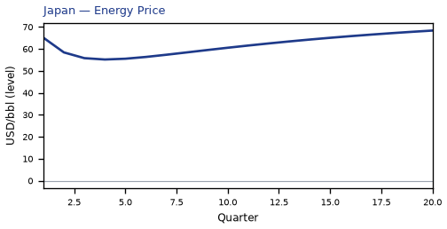


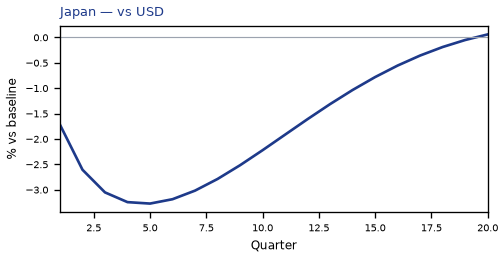

[Q1–Q20 JSON for Japan](numbers/JP.json)

## CA — Canada

The main impact of oil at $50 a barrel on Canada would be a large drop in GDP of 0.55% by Q4. Equities peak at -1.19% in Q3.

Demand and trade. Consumption peaks at -0.34 % vs baseline in Q5, from -0.15 in Q1 to -0.10 in Q20. Investment peaks at -1.01 % vs baseline in Q2, from -0.70 in Q1 to -0.38 in Q20. Net Exports peaks at -1.46 % vs baseline in Q4, from -0.89 in Q1 to -0.58 in Q20. Gov Spending peaks at -0.29 % vs baseline in Q5, from -0.17 in Q1 to -0.17 in Q20. Gov Debt peaks at -0.09 % vs baseline in Q13, from -0.01 in Q1 to -0.08 in Q20.

External / FX. The real exchange rate shows real depreciation (a weaker, more competitive home currency). Real Exchange Rate peaks at +11.37 % vs baseline in Q4, from +6.66 in Q1 to +6.26 in Q20.

Labour. Employment peaks at -0.51 % vs baseline in Q7, from -0.10 in Q1 to -0.20 in Q20. Unemployment peaks at +0.30 pp in Q8, from +0.05 in Q1 to +0.14 in Q20. Real Wages peaks at -0.64 % vs baseline in Q19, from -0.00 in Q1 to -0.64 in Q20.

Prices. The three-year CPI impulse is -0.43 percentage points. CPI Inflation peaks at -0.10 pp in Q2, from -0.08 in Q1 to +0.02 in Q20. Domestic Infl. peaks at -0.07 pp in Q2, from -0.05 in Q1 to +0.01 in Q20. Marginal Cost peaks at -0.33 % vs baseline in Q4, from -0.20 in Q1 to -0.08 in Q20.

Financial conditions. Policy Rate peaks at -0.61 pp (annualized) in Q6, from -0.14 in Q1 to -0.01 in Q20. Real Rate peaks at -0.15 pp (annualized) in Q6, from -0.04 in Q1 to -0.00 in Q20. Govt 3M Yield peaks at -0.61 pp (annualized) in Q6, from -0.14 in Q1 to -0.01 in Q20. Govt 2Y Yield peaks at -0.53 pp (annualized) in Q3, from -0.48 in Q1 to +0.01 in Q20. Govt 5Y Yield peaks at -0.31 pp (annualized) in Q1, from -0.31 in Q1 to -0.02 in Q20. Govt 10Y Yield peaks at -0.16 pp (annualized) in Q1, from -0.16 in Q1 to -0.03 in Q20. Govt 30Y Yield peaks at -0.06 pp (annualized) in Q1, from -0.06 in Q1 to -0.01 in Q20. Bond Price (7y) peaks at +3.62 % vs baseline in Q6, from +0.86 in Q1 to -0.29 in Q20. Bond Price 3M peaks at +0.15 % vs baseline in Q6, from +0.04 in Q1 to +0.00 in Q20. Bond Price 2Y peaks at +1.02 % vs baseline in Q3, from +0.91 in Q1 to -0.01 in Q20. Bond Price 5Y peaks at +1.40 % vs baseline in Q1, from +1.40 in Q1 to +0.07 in Q20. Bond Price 10Y peaks at +1.35 % vs baseline in Q1, from +1.35 in Q1 to +0.21 in Q20. Bond Price 30Y peaks at +1.16 % vs baseline in Q1, from +1.16 in Q1 to +0.23 in Q20. Equity Index peaks at -1.19 % vs baseline in Q3, from -0.78 in Q1 to -0.48 in Q20. VIX peaks at +16.24 index_level in Q4, from +15.75 in Q1 to +15.58 in Q20. Tobin's Q peaks at -0.71 % vs baseline in Q2, from -0.49 in Q1 to -0.27 in Q20. House Prices peaks at -0.34 % vs baseline in Q13, from -0.04 in Q1 to -0.34 in Q20. Bank Equity peaks at -0.21 % vs baseline in Q15, from -0.02 in Q1 to -0.20 in Q20. Bank Credit peaks at -0.16 % vs baseline in Q15, from -0.01 in Q1 to -0.16 in Q20. Credit Spread peaks at +0.00 pp in Q15, from +0.00 in Q1 to +0.00 in Q20.

Nominal FX. NEER peaks at -11.24 % vs baseline in Q4, from -6.62 in Q1 to -6.40 in Q20. vs USD peaks at +11.21 % vs baseline in Q4, from +6.61 in Q1 to +6.59 in Q20.

Commodities. Energy Price peaks at +68.34 USD/bbl (level) in Q20, from +65.07 in Q1 to +68.34 in Q20. Metals Price peaks at +100.94 index (level) in Q10, from +100.26 in Q1 to +100.56 in Q20. Food Price peaks at +99.32 index (level) in Q1, from +99.32 in Q1 to +96.63 in Q20. Gas Price peaks at +3.61 USD/mmBtu (level) in Q20, from +3.51 in Q1 to +3.61 in Q20. Copper Price peaks at +100.87 index (level) in Q8, from +100.26 in Q1 to +100.51 in Q20. Wheat Price peaks at +100.54 index (level) in Q14, from +100.08 in Q1 to +100.36 in Q20. Gold Price peaks at +2065.27 USD/oz (level) in Q4, from +2034.50 in Q1 to +2012.05 in Q20.

Sectoral and capital. Manuf. GDP peaks at -3.06 % vs baseline in Q4, from -1.79 in Q1 to -1.70 in Q20. Services GDP peaks at -0.38 % vs baseline in Q4, from -0.23 in Q1 to -0.10 in Q20. Capital Stock peaks at -0.04 % vs baseline in Q20, from -0.00 in Q1 to -0.04 in Q20.

Timing. By Q20 GDP is still -0.14% from baseline.

These figures are model IRFs versus baseline, not forecasts.


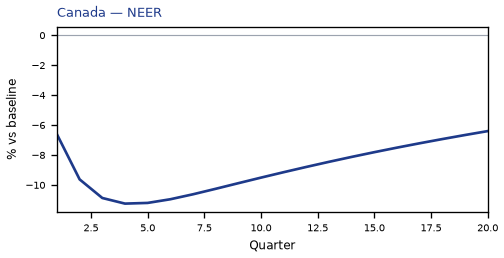

[Q1–Q20 JSON for Canada](numbers/CA.json)

## ZA — South Africa

The main impact of oil at $50 a barrel on South Africa would be a large rise in GDP of 0.52% by Q12. Equities peak at +2.25% in Q10.

Demand and trade. Consumption peaks at +0.30 % vs baseline in Q12, from +0.12 in Q1 to +0.18 in Q20. Investment peaks at +2.02 % vs baseline in Q6, from +0.85 in Q1 to +0.46 in Q20. Net Exports peaks at +0.67 % vs baseline in Q4, from +0.38 in Q1 to +0.30 in Q20. Gov Spending peaks at -0.09 % vs baseline in Q12, from -0.04 in Q1 to -0.05 in Q20. Gov Debt peaks at +0.52 % vs baseline in Q20, from +0.02 in Q1 to +0.52 in Q20.

External / FX. The real exchange rate shows real appreciation (a stronger home currency). Real Exchange Rate peaks at -1.11 % vs baseline in Q4, from -0.72 in Q1 to -0.65 in Q20.

Labour. Employment peaks at +0.56 % vs baseline in Q15, from +0.05 in Q1 to +0.49 in Q20. Unemployment peaks at -0.14 pp in Q14, from -0.02 in Q1 to -0.11 in Q20. Real Wages peaks at +0.50 % vs baseline in Q20, from +0.00 in Q1 to +0.50 in Q20.

Prices. The three-year CPI impulse is -0.73 percentage points. CPI Inflation peaks at -0.13 pp in Q2, from -0.10 in Q1 to +0.04 in Q20. Domestic Infl. peaks at -0.09 pp in Q2, from -0.07 in Q1 to +0.03 in Q20. Marginal Cost peaks at +0.32 % vs baseline in Q11, from +0.13 in Q1 to +0.17 in Q20.

Financial conditions. Policy Rate peaks at -0.54 pp (annualized) in Q5, from -0.16 in Q1 to +0.21 in Q20. Real Rate peaks at -0.13 pp (annualized) in Q5, from -0.04 in Q1 to +0.05 in Q20. Govt 3M Yield peaks at -0.54 pp (annualized) in Q5, from -0.16 in Q1 to +0.21 in Q20. Govt 2Y Yield peaks at -0.44 pp (annualized) in Q2, from -0.42 in Q1 to +0.21 in Q20. Govt 5Y Yield peaks at +0.17 pp (annualized) in Q16, from -0.16 in Q1 to +0.16 in Q20. Govt 10Y Yield peaks at +0.12 pp (annualized) in Q15, from -0.00 in Q1 to +0.11 in Q20. Govt 30Y Yield peaks at +0.05 pp (annualized) in Q14, from +0.01 in Q1 to +0.04 in Q20. Bond Price (7y) peaks at +2.23 % vs baseline in Q5, from +0.65 in Q1 to -0.86 in Q20. Bond Price 3M peaks at +0.13 % vs baseline in Q5, from +0.04 in Q1 to -0.05 in Q20. Bond Price 2Y peaks at +0.84 % vs baseline in Q2, from +0.80 in Q1 to -0.39 in Q20. Bond Price 5Y peaks at -0.78 % vs baseline in Q16, from +0.74 in Q1 to -0.73 in Q20. Bond Price 10Y peaks at -1.00 % vs baseline in Q15, from +0.04 in Q1 to -0.89 in Q20. Bond Price 30Y peaks at -0.87 % vs baseline in Q14, from -0.23 in Q1 to -0.76 in Q20. Equity Index peaks at +2.25 % vs baseline in Q10, from +0.96 in Q1 to +1.01 in Q20. VIX peaks at +16.24 index_level in Q4, from +15.75 in Q1 to +15.58 in Q20. Tobin's Q peaks at +1.42 % vs baseline in Q6, from +0.59 in Q1 to +0.32 in Q20. House Prices peaks at +0.78 % vs baseline in Q18, from +0.04 in Q1 to +0.76 in Q20. Bank Equity peaks at +0.04 % vs baseline in Q16, from +0.00 in Q1 to +0.04 in Q20. Bank Credit peaks at +0.01 % vs baseline in Q16, from +0.00 in Q1 to +0.01 in Q20. Credit Spread peaks at +0.00 pp in Q1, from +0.00 in Q1 to +0.00 in Q20.

Nominal FX. NEER peaks at +0.67 % vs baseline in Q3, from +0.44 in Q1 to +0.39 in Q20. vs USD peaks at -1.28 % vs baseline in Q4, from -0.76 in Q1 to -0.32 in Q20.

Commodities. Energy Price peaks at +68.34 USD/bbl (level) in Q20, from +65.07 in Q1 to +68.34 in Q20. Metals Price peaks at +100.94 index (level) in Q10, from +100.26 in Q1 to +100.56 in Q20. Food Price peaks at +99.32 index (level) in Q1, from +99.32 in Q1 to +96.63 in Q20. Gas Price peaks at +3.61 USD/mmBtu (level) in Q20, from +3.51 in Q1 to +3.61 in Q20. Copper Price peaks at +100.87 index (level) in Q8, from +100.26 in Q1 to +100.51 in Q20. Wheat Price peaks at +100.54 index (level) in Q14, from +100.08 in Q1 to +100.36 in Q20. Gold Price peaks at +2065.27 USD/oz (level) in Q4, from +2034.50 in Q1 to +2012.05 in Q20.

Sectoral and capital. Manuf. GDP peaks at +0.85 % vs baseline in Q4, from +0.52 in Q1 to +0.45 in Q20. Services GDP peaks at +0.33 % vs baseline in Q12, from +0.13 in Q1 to +0.18 in Q20. Capital Stock peaks at +0.14 % vs baseline in Q20, from +0.00 in Q1 to +0.14 in Q20.

Timing. By Q20 GDP is still +0.28% from baseline.

These figures are model IRFs versus baseline, not forecasts.


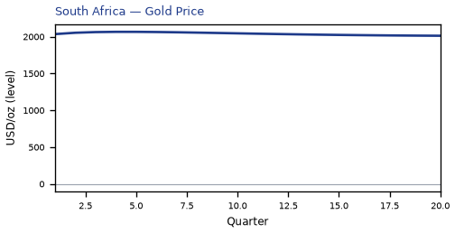


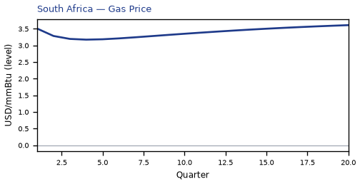


[Q1–Q20 JSON for South Africa](numbers/ZA.json)

## IT — Italy

The main impact of oil at $50 a barrel on Italy would be a large rise in GDP of 0.49% by Q5. Equities peak at +1.20% in Q5.

Demand and trade. Consumption peaks at +0.30 % vs baseline in Q4, from +0.15 in Q1 to +0.16 in Q20. Investment peaks at +2.16 % vs baseline in Q5, from +1.03 in Q1 to +0.65 in Q20. Net Exports peaks at +0.89 % vs baseline in Q4, from +0.53 in Q1 to +0.44 in Q20. Gov Spending peaks at -0.11 % vs baseline in Q5, from -0.07 in Q1 to -0.07 in Q20. Gov Debt peaks at -0.05 % vs baseline in Q7, from -0.02 in Q1 to -0.03 in Q20.

External / FX. The real exchange rate shows real appreciation (a stronger home currency). Real Exchange Rate peaks at -1.85 % vs baseline in Q4, from -1.12 in Q1 to -0.71 in Q20.

Labour. Employment peaks at +0.52 % vs baseline in Q14, from +0.06 in Q1 to +0.46 in Q20. Unemployment peaks at -0.19 pp in Q11, from -0.03 in Q1 to -0.14 in Q20. Real Wages peaks at -0.36 % vs baseline in Q12, from +0.00 in Q1 to -0.14 in Q20.

Prices. The three-year CPI impulse is -0.99 percentage points. CPI Inflation peaks at -0.20 pp in Q2, from -0.15 in Q1 to +0.05 in Q20. Domestic Infl. peaks at -0.14 pp in Q2, from -0.10 in Q1 to +0.03 in Q20. Marginal Cost peaks at +0.31 % vs baseline in Q5, from +0.18 in Q1 to +0.18 in Q20.

Financial conditions. Policy Rate peaks at -0.47 pp (annualized) in Q6, from -0.11 in Q1 to +0.11 in Q20. Real Rate peaks at -0.12 pp (annualized) in Q6, from -0.03 in Q1 to +0.03 in Q20. Govt 3M Yield peaks at -0.47 pp (annualized) in Q6, from -0.11 in Q1 to +0.11 in Q20. Govt 2Y Yield peaks at -0.41 pp (annualized) in Q3, from -0.37 in Q1 to +0.15 in Q20. Govt 5Y Yield peaks at -0.21 pp (annualized) in Q1, from -0.21 in Q1 to +0.15 in Q20. Govt 10Y Yield peaks at +0.12 pp (annualized) in Q19, from -0.03 in Q1 to +0.12 in Q20. Govt 30Y Yield peaks at +0.05 pp (annualized) in Q17, from +0.01 in Q1 to +0.05 in Q20. Bond Price (7y) peaks at +3.28 % vs baseline in Q6, from +0.78 in Q1 to -0.74 in Q20. Bond Price 3M peaks at +0.12 % vs baseline in Q6, from +0.03 in Q1 to -0.03 in Q20. Bond Price 2Y peaks at +0.78 % vs baseline in Q3, from +0.70 in Q1 to -0.28 in Q20. Bond Price 5Y peaks at +0.94 % vs baseline in Q1, from +0.94 in Q1 to -0.67 in Q20. Bond Price 10Y peaks at -0.97 % vs baseline in Q19, from +0.24 in Q1 to -0.97 in Q20. Bond Price 30Y peaks at -0.91 % vs baseline in Q17, from -0.24 in Q1 to -0.89 in Q20. Equity Index peaks at +1.20 % vs baseline in Q5, from +0.62 in Q1 to +0.42 in Q20. VIX peaks at +16.24 index_level in Q4, from +15.75 in Q1 to +15.58 in Q20. Tobin's Q peaks at +1.52 % vs baseline in Q5, from +0.72 in Q1 to +0.45 in Q20. House Prices peaks at +0.66 % vs baseline in Q19, from +0.04 in Q1 to +0.66 in Q20. Bank Equity peaks at +0.07 % vs baseline in Q16, from +0.01 in Q1 to +0.07 in Q20. Bank Credit peaks at +0.02 % vs baseline in Q16, from +0.00 in Q1 to +0.02 in Q20. Credit Spread peaks at +0.00 pp in Q1, from +0.00 in Q1 to +0.00 in Q20.

Nominal FX. NEER peaks at +1.26 % vs baseline in Q4, from +0.75 in Q1 to +0.52 in Q20. vs USD peaks at -2.02 % vs baseline in Q4, from -1.17 in Q1 to -0.38 in Q20.

Commodities. Energy Price peaks at +68.34 USD/bbl (level) in Q20, from +65.07 in Q1 to +68.34 in Q20. Metals Price peaks at +100.94 index (level) in Q10, from +100.26 in Q1 to +100.56 in Q20. Food Price peaks at +99.32 index (level) in Q1, from +99.32 in Q1 to +96.63 in Q20. Gas Price peaks at +3.61 USD/mmBtu (level) in Q20, from +3.51 in Q1 to +3.61 in Q20. Copper Price peaks at +100.87 index (level) in Q8, from +100.26 in Q1 to +100.51 in Q20. Wheat Price peaks at +100.54 index (level) in Q14, from +100.08 in Q1 to +100.36 in Q20. Gold Price peaks at +2065.27 USD/oz (level) in Q4, from +2034.50 in Q1 to +2012.05 in Q20.

Sectoral and capital. Manuf. GDP peaks at +1.21 % vs baseline in Q4, from +0.73 in Q1 to +0.53 in Q20. Services GDP peaks at +0.36 % vs baseline in Q5, from +0.21 in Q1 to +0.21 in Q20. Capital Stock peaks at +0.15 % vs baseline in Q20, from +0.01 in Q1 to +0.15 in Q20.

Timing. By Q20 GDP is still +0.28% from baseline.

These figures are model IRFs versus baseline, not forecasts.


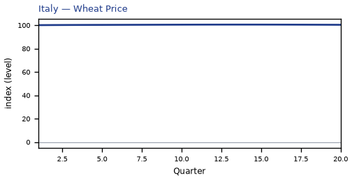

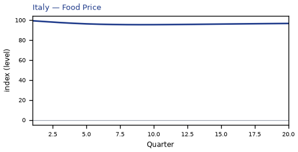

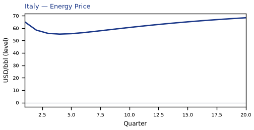

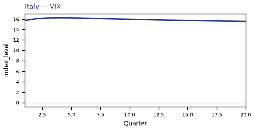


[Q1–Q20 JSON for Italy](numbers/IT.json)

## BR — Brazil

The main impact of oil at $50 a barrel on Brazil would be a large rise in GDP of 0.49% by Q14. Equities peak at +1.01% in Q12.

Demand and trade. Consumption peaks at +0.27 % vs baseline in Q15, from -0.00 in Q1 to +0.19 in Q20. Investment peaks at +1.65 % vs baseline in Q10, from +0.16 in Q1 to +0.38 in Q20. Net Exports peaks at -0.72 % vs baseline in Q5, from -0.38 in Q1 to -0.48 in Q20. Gov Spending peaks at -0.21 % vs baseline in Q13, from -0.06 in Q1 to -0.15 in Q20. Gov Debt peaks at +0.10 % vs baseline in Q20, from -0.00 in Q1 to +0.10 in Q20.

External / FX. The real exchange rate shows real depreciation (a weaker, more competitive home currency). Real Exchange Rate peaks at +2.13 % vs baseline in Q6, from +0.85 in Q1 to +0.39 in Q20.

Labour. Employment peaks at +0.42 % vs baseline in Q19, from -0.01 in Q1 to +0.42 in Q20. Unemployment peaks at -0.13 pp in Q17, from +0.00 in Q1 to -0.11 in Q20. Real Wages peaks at -0.34 % vs baseline in Q11, from -0.00 in Q1 to +0.09 in Q20.

Prices. The three-year CPI impulse is -0.80 percentage points. CPI Inflation peaks at -0.13 pp in Q3, from -0.09 in Q1 to +0.04 in Q20. Domestic Infl. peaks at -0.09 pp in Q3, from -0.06 in Q1 to +0.03 in Q20. Marginal Cost peaks at +0.30 % vs baseline in Q14, from -0.04 in Q1 to +0.19 in Q20.

Financial conditions. Policy Rate peaks at -0.81 pp (annualized) in Q5, from -0.23 in Q1 to +0.29 in Q20. Real Rate peaks at -0.20 pp (annualized) in Q5, from -0.06 in Q1 to +0.07 in Q20. Govt 3M Yield peaks at -0.81 pp (annualized) in Q5, from -0.23 in Q1 to +0.29 in Q20. Govt 2Y Yield peaks at -0.66 pp (annualized) in Q2, from -0.63 in Q1 to +0.28 in Q20. Govt 5Y Yield peaks at -0.25 pp (annualized) in Q1, from -0.25 in Q1 to +0.20 in Q20. Govt 10Y Yield peaks at +0.14 pp (annualized) in Q14, from -0.03 in Q1 to +0.11 in Q20. Govt 30Y Yield peaks at +0.05 pp (annualized) in Q14, from -0.01 in Q1 to +0.04 in Q20. Bond Price (7y) peaks at +3.36 % vs baseline in Q5, from +0.96 in Q1 to -1.23 in Q20. Bond Price 3M peaks at +0.20 % vs baseline in Q5, from +0.06 in Q1 to -0.07 in Q20. Bond Price 2Y peaks at +1.26 % vs baseline in Q2, from +1.20 in Q1 to -0.53 in Q20. Bond Price 5Y peaks at +1.12 % vs baseline in Q1, from +1.12 in Q1 to -0.90 in Q20. Bond Price 10Y peaks at -1.16 % vs baseline in Q14, from +0.24 in Q1 to -0.94 in Q20. Bond Price 30Y peaks at -0.82 % vs baseline in Q14, from +0.14 in Q1 to -0.65 in Q20. Equity Index peaks at +1.01 % vs baseline in Q12, from -0.03 in Q1 to +0.45 in Q20. VIX peaks at +16.24 index_level in Q4, from +15.75 in Q1 to +15.58 in Q20. Tobin's Q peaks at +1.15 % vs baseline in Q10, from +0.11 in Q1 to +0.26 in Q20. House Prices peaks at +0.55 % vs baseline in Q20, from -0.00 in Q1 to +0.55 in Q20. Bank Equity peaks at -0.05 % vs baseline in Q17, from -0.00 in Q1 to -0.04 in Q20. Bank Credit peaks at -0.04 % vs baseline in Q17, from -0.00 in Q1 to -0.04 in Q20. Credit Spread peaks at +0.00 pp in Q17, from +0.00 in Q1 to +0.00 in Q20.

Nominal FX. NEER peaks at -1.91 % vs baseline in Q6, from -0.72 in Q1 to -0.28 in Q20. vs USD peaks at +1.96 % vs baseline in Q6, from +0.80 in Q1 to +0.71 in Q20.

Commodities. Energy Price peaks at +68.34 USD/bbl (level) in Q20, from +65.07 in Q1 to +68.34 in Q20. Metals Price peaks at +100.94 index (level) in Q10, from +100.26 in Q1 to +100.56 in Q20. Food Price peaks at +99.32 index (level) in Q1, from +99.32 in Q1 to +96.63 in Q20. Gas Price peaks at +3.61 USD/mmBtu (level) in Q20, from +3.51 in Q1 to +3.61 in Q20. Copper Price peaks at +100.87 index (level) in Q8, from +100.26 in Q1 to +100.51 in Q20. Wheat Price peaks at +100.54 index (level) in Q14, from +100.08 in Q1 to +100.36 in Q20. Gold Price peaks at +2065.27 USD/oz (level) in Q4, from +2034.50 in Q1 to +2012.05 in Q20.

Sectoral and capital. Manuf. GDP peaks at +0.18 % vs baseline in Q19, from +0.03 in Q1 to +0.18 in Q20. Services GDP peaks at +0.32 % vs baseline in Q14, from -0.05 in Q1 to +0.20 in Q20. Capital Stock peaks at +0.11 % vs baseline in Q20, from +0.00 in Q1 to +0.11 in Q20.

Timing. By Q20 GDP is still +0.30% from baseline.

These figures are model IRFs versus baseline, not forecasts.


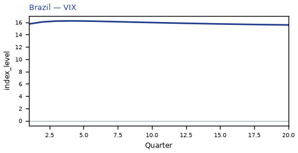


[Q1–Q20 JSON for Brazil](numbers/BR.json)

## DE — Germany

The main impact of oil at $50 a barrel on Germany would be a large rise in GDP of 0.48% by Q5. Equities peak at +1.21% in Q5.

Demand and trade. Consumption peaks at +0.31 % vs baseline in Q4, from +0.16 in Q1 to +0.17 in Q20. Investment peaks at +2.12 % vs baseline in Q5, from +1.01 in Q1 to +0.63 in Q20. Net Exports peaks at +0.88 % vs baseline in Q4, from +0.53 in Q1 to +0.44 in Q20. Gov Spending peaks at -0.11 % vs baseline in Q5, from -0.07 in Q1 to -0.07 in Q20. Gov Debt peaks at -0.09 % vs baseline in Q20, from -0.01 in Q1 to -0.09 in Q20.

External / FX. The real exchange rate shows real appreciation (a stronger home currency). Real Exchange Rate peaks at -1.53 % vs baseline in Q4, from -0.93 in Q1 to -0.55 in Q20.

Labour. Employment peaks at +0.48 % vs baseline in Q13, from +0.06 in Q1 to +0.41 in Q20. Unemployment peaks at -0.27 pp in Q11, from -0.04 in Q1 to -0.21 in Q20. Real Wages peaks at -0.29 % vs baseline in Q10, from +0.00 in Q1 to +0.11 in Q20.

Prices. The three-year CPI impulse is -1.03 percentage points. CPI Inflation peaks at -0.22 pp in Q2, from -0.17 in Q1 to +0.05 in Q20. Domestic Infl. peaks at -0.16 pp in Q2, from -0.12 in Q1 to +0.04 in Q20. Marginal Cost peaks at +0.30 % vs baseline in Q5, from +0.18 in Q1 to +0.17 in Q20.

Financial conditions. Policy Rate peaks at -0.47 pp (annualized) in Q6, from -0.11 in Q1 to +0.11 in Q20. Real Rate peaks at -0.12 pp (annualized) in Q6, from -0.03 in Q1 to +0.03 in Q20. Govt 3M Yield peaks at -0.47 pp (annualized) in Q6, from -0.11 in Q1 to +0.11 in Q20. Govt 2Y Yield peaks at -0.41 pp (annualized) in Q3, from -0.37 in Q1 to +0.15 in Q20. Govt 5Y Yield peaks at -0.21 pp (annualized) in Q1, from -0.21 in Q1 to +0.15 in Q20. Govt 10Y Yield peaks at +0.12 pp (annualized) in Q19, from -0.03 in Q1 to +0.12 in Q20. Govt 30Y Yield peaks at +0.05 pp (annualized) in Q17, from +0.01 in Q1 to +0.05 in Q20. Bond Price (7y) peaks at +3.30 % vs baseline in Q6, from +0.79 in Q1 to -0.74 in Q20. Bond Price 3M peaks at +0.12 % vs baseline in Q6, from +0.03 in Q1 to -0.03 in Q20. Bond Price 2Y peaks at +0.78 % vs baseline in Q3, from +0.70 in Q1 to -0.28 in Q20. Bond Price 5Y peaks at +0.94 % vs baseline in Q1, from +0.94 in Q1 to -0.67 in Q20. Bond Price 10Y peaks at -0.97 % vs baseline in Q19, from +0.24 in Q1 to -0.97 in Q20. Bond Price 30Y peaks at -0.91 % vs baseline in Q17, from -0.24 in Q1 to -0.89 in Q20. Equity Index peaks at +1.21 % vs baseline in Q5, from +0.65 in Q1 to +0.49 in Q20. VIX peaks at +16.24 index_level in Q4, from +15.75 in Q1 to +15.58 in Q20. Tobin's Q peaks at +1.48 % vs baseline in Q5, from +0.71 in Q1 to +0.44 in Q20. House Prices peaks at +0.66 % vs baseline in Q19, from +0.04 in Q1 to +0.66 in Q20. Bank Equity peaks at +0.07 % vs baseline in Q17, from +0.01 in Q1 to +0.07 in Q20. Bank Credit peaks at +0.02 % vs baseline in Q17, from +0.00 in Q1 to +0.02 in Q20. Credit Spread peaks at +0.00 pp in Q1, from +0.00 in Q1 to +0.00 in Q20.

Nominal FX. NEER peaks at +1.13 % vs baseline in Q4, from +0.68 in Q1 to +0.48 in Q20. vs USD peaks at -1.70 % vs baseline in Q4, from -0.97 in Q1 to -0.23 in Q20.

Commodities. Energy Price peaks at +68.34 USD/bbl (level) in Q20, from +65.07 in Q1 to +68.34 in Q20. Metals Price peaks at +100.94 index (level) in Q10, from +100.26 in Q1 to +100.56 in Q20. Food Price peaks at +99.32 index (level) in Q1, from +99.32 in Q1 to +96.63 in Q20. Gas Price peaks at +3.61 USD/mmBtu (level) in Q20, from +3.51 in Q1 to +3.61 in Q20. Copper Price peaks at +100.87 index (level) in Q8, from +100.26 in Q1 to +100.51 in Q20. Wheat Price peaks at +100.54 index (level) in Q14, from +100.08 in Q1 to +100.36 in Q20. Gold Price peaks at +2065.27 USD/oz (level) in Q4, from +2034.50 in Q1 to +2012.05 in Q20.

Sectoral and capital. Manuf. GDP peaks at +1.26 % vs baseline in Q4, from +0.76 in Q1 to +0.56 in Q20. Services GDP peaks at +0.33 % vs baseline in Q5, from +0.20 in Q1 to +0.19 in Q20. Capital Stock peaks at +0.15 % vs baseline in Q20, from +0.01 in Q1 to +0.15 in Q20.

Timing. By Q20 GDP is still +0.28% from baseline.

These figures are model IRFs versus baseline, not forecasts.


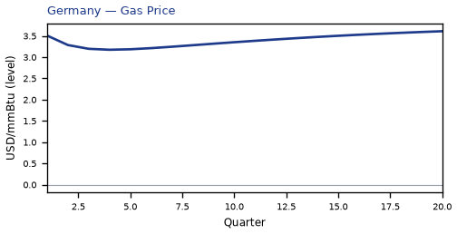


[Q1–Q20 JSON for Germany](numbers/DE.json)

## CL — Chile

The main impact of oil at $50 a barrel on Chile would be a large rise in GDP of 0.47% by Q11. Equities peak at +1.30% in Q8.

Demand and trade. Consumption peaks at +0.29 % vs baseline in Q12, from +0.13 in Q1 to +0.18 in Q20. Investment peaks at +1.97 % vs baseline in Q6, from +0.82 in Q1 to +0.39 in Q20. Net Exports peaks at +0.70 % vs baseline in Q5, from +0.39 in Q1 to +0.35 in Q20. Gov Spending peaks at -0.06 % vs baseline in Q12, from -0.03 in Q1 to -0.03 in Q20. Gov Debt peaks at +0.49 % vs baseline in Q19, from +0.02 in Q1 to +0.48 in Q20.

External / FX. The real exchange rate shows real appreciation (a stronger home currency). Real Exchange Rate peaks at -0.87 % vs baseline in Q3, from -0.56 in Q1 to -0.34 in Q20.

Labour. Employment peaks at +0.50 % vs baseline in Q15, from +0.05 in Q1 to +0.43 in Q20. Unemployment peaks at -0.19 pp in Q14, from -0.02 in Q1 to -0.14 in Q20. Real Wages peaks at +0.51 % vs baseline in Q20, from +0.00 in Q1 to +0.51 in Q20.

Prices. The three-year CPI impulse is -0.60 percentage points. CPI Inflation peaks at -0.13 pp in Q2, from -0.10 in Q1 to +0.03 in Q20. Domestic Infl. peaks at -0.09 pp in Q2, from -0.07 in Q1 to +0.02 in Q20. Marginal Cost peaks at +0.29 % vs baseline in Q11, from +0.13 in Q1 to +0.16 in Q20.

Financial conditions. Policy Rate peaks at -0.54 pp (annualized) in Q5, from -0.15 in Q1 to +0.21 in Q20. Real Rate peaks at -0.13 pp (annualized) in Q5, from -0.04 in Q1 to +0.05 in Q20. Govt 3M Yield peaks at -0.54 pp (annualized) in Q5, from -0.15 in Q1 to +0.21 in Q20. Govt 2Y Yield peaks at -0.45 pp (annualized) in Q2, from -0.42 in Q1 to +0.21 in Q20. Govt 5Y Yield peaks at +0.18 pp (annualized) in Q16, from -0.17 in Q1 to +0.17 in Q20. Govt 10Y Yield peaks at +0.13 pp (annualized) in Q15, from -0.00 in Q1 to +0.12 in Q20. Govt 30Y Yield peaks at +0.05 pp (annualized) in Q14, from +0.02 in Q1 to +0.05 in Q20. Bond Price (7y) peaks at +2.25 % vs baseline in Q5, from +0.61 in Q1 to -0.89 in Q20. Bond Price 3M peaks at +0.13 % vs baseline in Q5, from +0.04 in Q1 to -0.05 in Q20. Bond Price 2Y peaks at +0.85 % vs baseline in Q2, from +0.80 in Q1 to -0.41 in Q20. Bond Price 5Y peaks at -0.81 % vs baseline in Q16, from +0.75 in Q1 to -0.76 in Q20. Bond Price 10Y peaks at -1.05 % vs baseline in Q15, from +0.02 in Q1 to -0.95 in Q20. Bond Price 30Y peaks at -0.97 % vs baseline in Q14, from -0.32 in Q1 to -0.86 in Q20. Equity Index peaks at +1.30 % vs baseline in Q8, from +0.58 in Q1 to +0.47 in Q20. VIX peaks at +16.24 index_level in Q4, from +15.75 in Q1 to +15.58 in Q20. Tobin's Q peaks at +1.38 % vs baseline in Q6, from +0.58 in Q1 to +0.28 in Q20. House Prices peaks at +0.73 % vs baseline in Q18, from +0.04 in Q1 to +0.71 in Q20. Bank Equity peaks at +0.04 % vs baseline in Q17, from +0.00 in Q1 to +0.04 in Q20. Bank Credit peaks at +0.01 % vs baseline in Q17, from +0.00 in Q1 to +0.01 in Q20. Credit Spread peaks at +0.00 pp in Q1, from +0.00 in Q1 to +0.00 in Q20.

Nominal FX. NEER peaks at +0.99 % vs baseline in Q4, from +0.57 in Q1 to +0.26 in Q20. vs USD peaks at -1.03 % vs baseline in Q4, from -0.60 in Q1 to -0.01 in Q20.

Commodities. Energy Price peaks at +68.34 USD/bbl (level) in Q20, from +65.07 in Q1 to +68.34 in Q20. Metals Price peaks at +100.94 index (level) in Q10, from +100.26 in Q1 to +100.56 in Q20. Food Price peaks at +99.32 index (level) in Q1, from +99.32 in Q1 to +96.63 in Q20. Gas Price peaks at +3.61 USD/mmBtu (level) in Q20, from +3.51 in Q1 to +3.61 in Q20. Copper Price peaks at +100.87 index (level) in Q8, from +100.26 in Q1 to +100.51 in Q20. Wheat Price peaks at +100.54 index (level) in Q14, from +100.08 in Q1 to +100.36 in Q20. Gold Price peaks at +2065.27 USD/oz (level) in Q4, from +2034.50 in Q1 to +2012.05 in Q20.

Sectoral and capital. Manuf. GDP peaks at +0.77 % vs baseline in Q4, from +0.47 in Q1 to +0.36 in Q20. Services GDP peaks at +0.29 % vs baseline in Q11, from +0.12 in Q1 to +0.16 in Q20. Capital Stock peaks at +0.14 % vs baseline in Q20, from +0.00 in Q1 to +0.14 in Q20.

Timing. By Q20 GDP is still +0.26% from baseline.

These figures are model IRFs versus baseline, not forecasts.


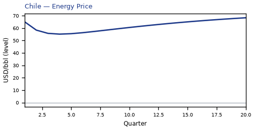


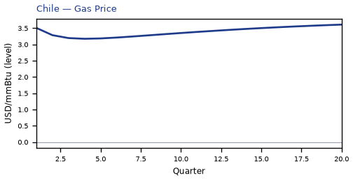


[Q1–Q20 JSON for Chile](numbers/CL.json)

## ES — Spain

The main impact of oil at $50 a barrel on Spain would be a large rise in GDP of 0.47% by Q5. Equities peak at +1.25% in Q5.

Demand and trade. Consumption peaks at +0.30 % vs baseline in Q4, from +0.15 in Q1 to +0.17 in Q20. Investment peaks at +2.09 % vs baseline in Q5, from +0.98 in Q1 to +0.62 in Q20. Net Exports peaks at +0.88 % vs baseline in Q4, from +0.53 in Q1 to +0.43 in Q20. Gov Spending peaks at -0.11 % vs baseline in Q5, from -0.06 in Q1 to -0.06 in Q20. Gov Debt peaks at -0.04 % vs baseline in Q20, from -0.00 in Q1 to -0.04 in Q20.

External / FX. The real exchange rate shows real appreciation (a stronger home currency). Real Exchange Rate peaks at -1.51 % vs baseline in Q4, from -0.92 in Q1 to -0.53 in Q20.

Labour. Employment peaks at +0.48 % vs baseline in Q14, from +0.05 in Q1 to +0.43 in Q20. Unemployment peaks at -0.18 pp in Q11, from -0.03 in Q1 to -0.14 in Q20. Real Wages peaks at -0.28 % vs baseline in Q11, from +0.00 in Q1 to -0.01 in Q20.

Prices. The three-year CPI impulse is -0.88 percentage points. CPI Inflation peaks at -0.18 pp in Q2, from -0.13 in Q1 to +0.04 in Q20. Domestic Infl. peaks at -0.12 pp in Q2, from -0.09 in Q1 to +0.03 in Q20. Marginal Cost peaks at +0.30 % vs baseline in Q5, from +0.17 in Q1 to +0.17 in Q20.

Financial conditions. Policy Rate peaks at -0.47 pp (annualized) in Q6, from -0.11 in Q1 to +0.11 in Q20. Real Rate peaks at -0.12 pp (annualized) in Q6, from -0.03 in Q1 to +0.03 in Q20. Govt 3M Yield peaks at -0.47 pp (annualized) in Q6, from -0.11 in Q1 to +0.11 in Q20. Govt 2Y Yield peaks at -0.41 pp (annualized) in Q3, from -0.37 in Q1 to +0.15 in Q20. Govt 5Y Yield peaks at -0.21 pp (annualized) in Q1, from -0.21 in Q1 to +0.15 in Q20. Govt 10Y Yield peaks at +0.12 pp (annualized) in Q19, from -0.03 in Q1 to +0.12 in Q20. Govt 30Y Yield peaks at +0.05 pp (annualized) in Q17, from +0.01 in Q1 to +0.05 in Q20. Bond Price (7y) peaks at +3.30 % vs baseline in Q6, from +0.79 in Q1 to -0.74 in Q20. Bond Price 3M peaks at +0.12 % vs baseline in Q6, from +0.03 in Q1 to -0.03 in Q20. Bond Price 2Y peaks at +0.78 % vs baseline in Q3, from +0.70 in Q1 to -0.28 in Q20. Bond Price 5Y peaks at +0.94 % vs baseline in Q1, from +0.94 in Q1 to -0.67 in Q20. Bond Price 10Y peaks at -0.97 % vs baseline in Q19, from +0.24 in Q1 to -0.97 in Q20. Bond Price 30Y peaks at -0.91 % vs baseline in Q17, from -0.24 in Q1 to -0.89 in Q20. Equity Index peaks at +1.25 % vs baseline in Q5, from +0.65 in Q1 to +0.46 in Q20. VIX peaks at +16.24 index_level in Q4, from +15.75 in Q1 to +15.58 in Q20. Tobin's Q peaks at +1.46 % vs baseline in Q5, from +0.69 in Q1 to +0.43 in Q20. House Prices peaks at +0.64 % vs baseline in Q19, from +0.04 in Q1 to +0.64 in Q20. Bank Equity peaks at +0.06 % vs baseline in Q16, from +0.00 in Q1 to +0.06 in Q20. Bank Credit peaks at +0.02 % vs baseline in Q16, from +0.00 in Q1 to +0.02 in Q20. Credit Spread peaks at +0.00 pp in Q1, from +0.00 in Q1 to +0.00 in Q20.

Nominal FX. NEER peaks at +1.20 % vs baseline in Q4, from +0.72 in Q1 to +0.43 in Q20. vs USD peaks at -1.68 % vs baseline in Q4, from -0.97 in Q1 to -0.21 in Q20.

Commodities. Energy Price peaks at +68.34 USD/bbl (level) in Q20, from +65.07 in Q1 to +68.34 in Q20. Metals Price peaks at +100.94 index (level) in Q10, from +100.26 in Q1 to +100.56 in Q20. Food Price peaks at +99.32 index (level) in Q1, from +99.32 in Q1 to +96.63 in Q20. Gas Price peaks at +3.61 USD/mmBtu (level) in Q20, from +3.51 in Q1 to +3.61 in Q20. Copper Price peaks at +100.87 index (level) in Q8, from +100.26 in Q1 to +100.51 in Q20. Wheat Price peaks at +100.54 index (level) in Q14, from +100.08 in Q1 to +100.36 in Q20. Gold Price peaks at +2065.27 USD/oz (level) in Q4, from +2034.50 in Q1 to +2012.05 in Q20.

Sectoral and capital. Manuf. GDP peaks at +1.04 % vs baseline in Q4, from +0.63 in Q1 to +0.45 in Q20. Services GDP peaks at +0.35 % vs baseline in Q5, from +0.21 in Q1 to +0.20 in Q20. Capital Stock peaks at +0.15 % vs baseline in Q20, from +0.00 in Q1 to +0.15 in Q20.

Timing. By Q20 GDP is still +0.28% from baseline.

These figures are model IRFs versus baseline, not forecasts.


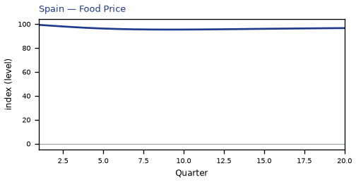


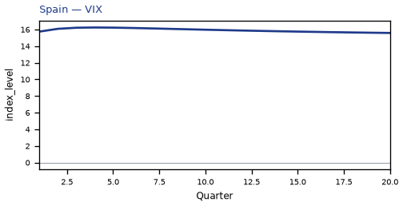

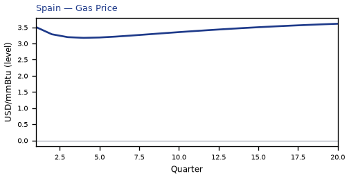


[Q1–Q20 JSON for Spain](numbers/ES.json)

## TH — Thailand

The main impact of oil at $50 a barrel on Thailand would be a large rise in GDP of 0.45% by Q4. Equities peak at +1.44% in Q5.

Demand and trade. Consumption peaks at +0.33 % vs baseline in Q4, from +0.16 in Q1 to +0.16 in Q20. Investment peaks at +1.83 % vs baseline in Q5, from +0.95 in Q1 to +0.33 in Q20. Net Exports peaks at +0.65 % vs baseline in Q3, from +0.47 in Q1 to +0.13 in Q20. Gov Spending peaks at -0.08 % vs baseline in Q4, from -0.05 in Q1 to -0.04 in Q20. Gov Debt peaks at +0.72 % vs baseline in Q19, from +0.05 in Q1 to +0.72 in Q20.

External / FX. The real exchange rate shows real appreciation (a stronger home currency). Real Exchange Rate peaks at -0.33 % vs baseline in Q3, from -0.22 in Q1 to -0.12 in Q20.

Labour. Employment peaks at +0.45 % vs baseline in Q12, from +0.07 in Q1 to +0.35 in Q20. Unemployment peaks at -0.06 pp in Q10, from -0.01 in Q1 to -0.04 in Q20. Real Wages peaks at +0.38 % vs baseline in Q20, from +0.00 in Q1 to +0.38 in Q20.

Prices. The three-year CPI impulse is -0.89 percentage points. CPI Inflation peaks at -0.16 pp in Q3, from -0.12 in Q1 to +0.04 in Q20. Domestic Infl. peaks at -0.11 pp in Q3, from -0.08 in Q1 to +0.03 in Q20. Marginal Cost peaks at +0.29 % vs baseline in Q4, from +0.18 in Q1 to +0.13 in Q20.

Financial conditions. Policy Rate peaks at -0.34 pp (annualized) in Q5, from -0.08 in Q1 to +0.18 in Q20. Real Rate peaks at -0.08 pp (annualized) in Q5, from -0.02 in Q1 to +0.04 in Q20. Govt 3M Yield peaks at -0.34 pp (annualized) in Q5, from -0.08 in Q1 to +0.18 in Q20. Govt 2Y Yield peaks at -0.28 pp (annualized) in Q3, from -0.26 in Q1 to +0.19 in Q20. Govt 5Y Yield peaks at +0.17 pp (annualized) in Q17, from -0.10 in Q1 to +0.16 in Q20. Govt 10Y Yield peaks at +0.12 pp (annualized) in Q15, from +0.03 in Q1 to +0.11 in Q20. Govt 30Y Yield peaks at +0.05 pp (annualized) in Q14, from +0.03 in Q1 to +0.05 in Q20. Bond Price (7y) peaks at +1.41 % vs baseline in Q5, from +0.34 in Q1 to -0.74 in Q20. Bond Price 3M peaks at +0.08 % vs baseline in Q5, from +0.02 in Q1 to -0.04 in Q20. Bond Price 2Y peaks at +0.54 % vs baseline in Q3, from +0.50 in Q1 to -0.36 in Q20. Bond Price 5Y peaks at -0.74 % vs baseline in Q17, from +0.46 in Q1 to -0.72 in Q20. Bond Price 10Y peaks at -1.00 % vs baseline in Q15, from -0.23 in Q1 to -0.94 in Q20. Bond Price 30Y peaks at -0.90 % vs baseline in Q14, from -0.48 in Q1 to -0.82 in Q20. Equity Index peaks at +1.44 % vs baseline in Q5, from +0.80 in Q1 to +0.44 in Q20. VIX peaks at +16.24 index_level in Q4, from +15.75 in Q1 to +15.58 in Q20. Tobin's Q peaks at +1.28 % vs baseline in Q5, from +0.66 in Q1 to +0.23 in Q20. House Prices peaks at +0.72 % vs baseline in Q16, from +0.05 in Q1 to +0.69 in Q20. Bank Equity peaks at +0.04 % vs baseline in Q15, from +0.00 in Q1 to +0.04 in Q20. Bank Credit peaks at +0.01 % vs baseline in Q15, from +0.00 in Q1 to +0.01 in Q20. Credit Spread peaks at +0.00 pp in Q1, from +0.00 in Q1 to +0.00 in Q20.

Nominal FX. NEER peaks at -0.31 % vs baseline in Q7, from -0.12 in Q1 to -0.02 in Q20. vs USD peaks at -0.48 % vs baseline in Q4, from -0.27 in Q1 to +0.20 in Q20.

Commodities. Energy Price peaks at +68.34 USD/bbl (level) in Q20, from +65.07 in Q1 to +68.34 in Q20. Metals Price peaks at +100.94 index (level) in Q10, from +100.26 in Q1 to +100.56 in Q20. Food Price peaks at +99.32 index (level) in Q1, from +99.32 in Q1 to +96.63 in Q20. Gas Price peaks at +3.61 USD/mmBtu (level) in Q20, from +3.51 in Q1 to +3.61 in Q20. Copper Price peaks at +100.87 index (level) in Q8, from +100.26 in Q1 to +100.51 in Q20. Wheat Price peaks at +100.54 index (level) in Q14, from +100.08 in Q1 to +100.36 in Q20. Gold Price peaks at +2065.27 USD/oz (level) in Q4, from +2034.50 in Q1 to +2012.05 in Q20.

Sectoral and capital. Manuf. GDP peaks at +0.97 % vs baseline in Q4, from +0.60 in Q1 to +0.45 in Q20. Services GDP peaks at +0.25 % vs baseline in Q4, from +0.16 in Q1 to +0.12 in Q20. Capital Stock peaks at +0.12 % vs baseline in Q20, from +0.00 in Q1 to +0.12 in Q20.

Timing. By Q20 GDP is still +0.21% from baseline.

These figures are model IRFs versus baseline, not forecasts.


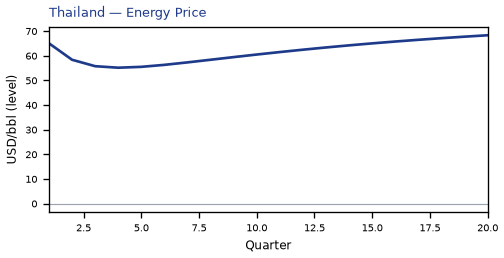


[Q1–Q20 JSON for Thailand](numbers/TH.json)

## PL — Poland

The main impact of oil at $50 a barrel on Poland would be a large rise in GDP of 0.45% by Q10. Equities peak at +1.11% in Q6.

Demand and trade. Consumption peaks at +0.25 % vs baseline in Q4, from +0.13 in Q1 to +0.15 in Q20. Investment peaks at +2.09 % vs baseline in Q5, from +0.93 in Q1 to +0.50 in Q20. Net Exports peaks at +0.62 % vs baseline in Q4, from +0.36 in Q1 to +0.22 in Q20. Gov Spending peaks at -0.09 % vs baseline in Q10, from -0.05 in Q1 to -0.05 in Q20. Gov Debt peaks at +0.00 % vs baseline in Q1, from +0.00 in Q1 to +0.00 in Q20.

External / FX. The real exchange rate shows real appreciation (a stronger home currency). Real Exchange Rate peaks at -1.23 % vs baseline in Q3, from -0.83 in Q1 to -0.83 in Q20.

Labour. Employment peaks at +0.49 % vs baseline in Q15, from +0.05 in Q1 to +0.42 in Q20. Unemployment peaks at -0.18 pp in Q13, from -0.02 in Q1 to -0.14 in Q20. Real Wages peaks at +0.29 % vs baseline in Q20, from +0.00 in Q1 to +0.29 in Q20.

Prices. The three-year CPI impulse is -0.88 percentage points. CPI Inflation peaks at -0.16 pp in Q2, from -0.13 in Q1 to +0.03 in Q20. Domestic Infl. peaks at -0.11 pp in Q2, from -0.09 in Q1 to +0.02 in Q20. Marginal Cost peaks at +0.28 % vs baseline in Q10, from +0.15 in Q1 to +0.16 in Q20.

Financial conditions. Policy Rate peaks at -0.58 pp (annualized) in Q5, from -0.17 in Q1 to +0.16 in Q20. Real Rate peaks at -0.14 pp (annualized) in Q5, from -0.04 in Q1 to +0.04 in Q20. Govt 3M Yield peaks at -0.58 pp (annualized) in Q5, from -0.17 in Q1 to +0.16 in Q20. Govt 2Y Yield peaks at -0.48 pp (annualized) in Q2, from -0.46 in Q1 to +0.18 in Q20. Govt 5Y Yield peaks at -0.22 pp (annualized) in Q1, from -0.22 in Q1 to +0.16 in Q20. Govt 10Y Yield peaks at +0.13 pp (annualized) in Q17, from -0.03 in Q1 to +0.12 in Q20. Govt 30Y Yield peaks at +0.05 pp (annualized) in Q15, from +0.01 in Q1 to +0.05 in Q20. Bond Price (7y) peaks at +2.41 % vs baseline in Q5, from +0.69 in Q1 to -0.65 in Q20. Bond Price 3M peaks at +0.14 % vs baseline in Q5, from +0.04 in Q1 to -0.04 in Q20. Bond Price 2Y peaks at +0.92 % vs baseline in Q2, from +0.87 in Q1 to -0.34 in Q20. Bond Price 5Y peaks at +0.98 % vs baseline in Q1, from +0.98 in Q1 to -0.73 in Q20. Bond Price 10Y peaks at -1.03 % vs baseline in Q17, from +0.23 in Q1 to -1.00 in Q20. Bond Price 30Y peaks at -0.98 % vs baseline in Q15, from -0.24 in Q1 to -0.92 in Q20. Equity Index peaks at +1.11 % vs baseline in Q6, from +0.52 in Q1 to +0.35 in Q20. VIX peaks at +16.24 index_level in Q4, from +15.75 in Q1 to +15.58 in Q20. Tobin's Q peaks at +1.47 % vs baseline in Q5, from +0.65 in Q1 to +0.35 in Q20. House Prices peaks at +0.65 % vs baseline in Q19, from +0.03 in Q1 to +0.65 in Q20. Bank Equity peaks at +0.04 % vs baseline in Q16, from +0.00 in Q1 to +0.04 in Q20. Bank Credit peaks at +0.01 % vs baseline in Q16, from +0.00 in Q1 to +0.01 in Q20. Credit Spread peaks at +0.00 pp in Q1, from +0.00 in Q1 to +0.00 in Q20.

Nominal FX. NEER peaks at +0.84 % vs baseline in Q20, from +0.57 in Q1 to +0.84 in Q20. vs USD peaks at -1.38 % vs baseline in Q4, from -0.88 in Q1 to -0.51 in Q20.

Commodities. Energy Price peaks at +68.34 USD/bbl (level) in Q20, from +65.07 in Q1 to +68.34 in Q20. Metals Price peaks at +100.94 index (level) in Q10, from +100.26 in Q1 to +100.56 in Q20. Food Price peaks at +99.32 index (level) in Q1, from +99.32 in Q1 to +96.63 in Q20. Gas Price peaks at +3.61 USD/mmBtu (level) in Q20, from +3.51 in Q1 to +3.61 in Q20. Copper Price peaks at +100.87 index (level) in Q8, from +100.26 in Q1 to +100.51 in Q20. Wheat Price peaks at +100.54 index (level) in Q14, from +100.08 in Q1 to +100.36 in Q20. Gold Price peaks at +2065.27 USD/oz (level) in Q4, from +2034.50 in Q1 to +2012.05 in Q20.

Sectoral and capital. Manuf. GDP peaks at +1.17 % vs baseline in Q4, from +0.73 in Q1 to +0.65 in Q20. Services GDP peaks at +0.28 % vs baseline in Q10, from +0.14 in Q1 to +0.17 in Q20. Capital Stock peaks at +0.15 % vs baseline in Q20, from +0.00 in Q1 to +0.15 in Q20.

Timing. By Q20 GDP is still +0.26% from baseline.

These figures are model IRFs versus baseline, not forecasts.


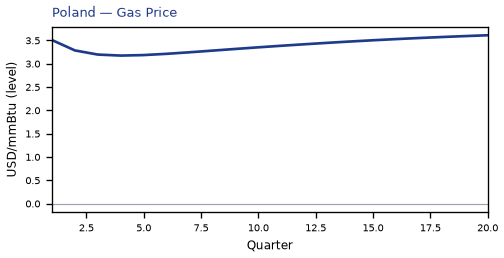


[Q1–Q20 JSON for Poland](numbers/PL.json)

## CN — China

The main impact of oil at $50 a barrel on China would be a large rise in GDP of 0.45% by Q5. Equities peak at +1.18% in Q5.

Demand and trade. Consumption peaks at +0.36 % vs baseline in Q5, from +0.17 in Q1 to +0.16 in Q20. Investment peaks at +1.58 % vs baseline in Q4, from +0.84 in Q1 to +0.09 in Q20. Net Exports peaks at +0.89 % vs baseline in Q4, from +0.52 in Q1 to +0.43 in Q20. Gov Spending peaks at -0.08 % vs baseline in Q5, from -0.05 in Q1 to -0.03 in Q20. Gov Debt peaks at +0.74 % vs baseline in Q20, from +0.03 in Q1 to +0.74 in Q20.

External / FX. The real exchange rate shows real appreciation (a stronger home currency). Real Exchange Rate peaks at -0.60 % vs baseline in Q5, from -0.41 in Q1 to -0.38 in Q20.

Labour. Employment peaks at +0.37 % vs baseline in Q14, from +0.04 in Q1 to +0.33 in Q20. Unemployment peaks at -0.12 pp in Q10, from -0.02 in Q1 to -0.08 in Q20. Real Wages peaks at +0.50 % vs baseline in Q20, from +0.00 in Q1 to +0.50 in Q20.

Prices. The three-year CPI impulse is -0.94 percentage points. CPI Inflation peaks at -0.20 pp in Q2, from -0.16 in Q1 to +0.05 in Q20. Domestic Infl. peaks at -0.14 pp in Q2, from -0.11 in Q1 to +0.04 in Q20. Marginal Cost peaks at +0.28 % vs baseline in Q5, from +0.17 in Q1 to +0.12 in Q20.

Financial conditions. Policy Rate peaks at +0.29 pp (annualized) in Q20, from -0.05 in Q1 to +0.29 in Q20. Real Rate peaks at +0.07 pp (annualized) in Q20, from -0.01 in Q1 to +0.07 in Q20. Govt 3M Yield peaks at +0.29 pp (annualized) in Q20, from -0.05 in Q1 to +0.29 in Q20. Govt 2Y Yield peaks at +0.30 pp (annualized) in Q20, from -0.13 in Q1 to +0.30 in Q20. Govt 5Y Yield peaks at +0.27 pp (annualized) in Q16, from +0.04 in Q1 to +0.25 in Q20. Govt 10Y Yield peaks at +0.19 pp (annualized) in Q12, from +0.14 in Q1 to +0.16 in Q20. Govt 30Y Yield peaks at +0.06 pp (annualized) in Q11, from +0.05 in Q1 to +0.05 in Q20. Bond Price (7y) peaks at -1.47 % vs baseline in Q20, from +0.23 in Q1 to -1.47 in Q20. Bond Price 3M peaks at -0.07 % vs baseline in Q20, from +0.01 in Q1 to -0.07 in Q20. Bond Price 2Y peaks at -0.57 % vs baseline in Q20, from +0.24 in Q1 to -0.57 in Q20. Bond Price 5Y peaks at -1.20 % vs baseline in Q16, from -0.16 in Q1 to -1.12 in Q20. Bond Price 10Y peaks at -1.55 % vs baseline in Q12, from -1.13 in Q1 to -1.28 in Q20. Bond Price 30Y peaks at -1.09 % vs baseline in Q11, from -0.93 in Q1 to -0.85 in Q20. Equity Index peaks at +1.18 % vs baseline in Q5, from +0.63 in Q1 to +0.33 in Q20. VIX peaks at +16.24 index_level in Q4, from +15.75 in Q1 to +15.58 in Q20. Tobin's Q peaks at +1.10 % vs baseline in Q4, from +0.59 in Q1 to +0.06 in Q20. House Prices peaks at +0.58 % vs baseline in Q15, from +0.04 in Q1 to +0.54 in Q20. Bank Equity peaks at +0.05 % vs baseline in Q16, from +0.00 in Q1 to +0.05 in Q20. Bank Credit peaks at +0.02 % vs baseline in Q16, from +0.00 in Q1 to +0.02 in Q20. Credit Spread peaks at +0.00 pp in Q1, from +0.00 in Q1 to +0.00 in Q20.

Nominal FX. NEER peaks at +0.70 % vs baseline in Q6, from +0.45 in Q1 to +0.51 in Q20. vs USD peaks at -0.78 % vs baseline in Q5, from -0.45 in Q1 to -0.05 in Q20.

Commodities. Energy Price peaks at +68.34 USD/bbl (level) in Q20, from +65.07 in Q1 to +68.34 in Q20. Metals Price peaks at +100.94 index (level) in Q10, from +100.26 in Q1 to +100.56 in Q20. Food Price peaks at +99.32 index (level) in Q1, from +99.32 in Q1 to +96.63 in Q20. Gas Price peaks at +3.61 USD/mmBtu (level) in Q20, from +3.51 in Q1 to +3.61 in Q20. Copper Price peaks at +100.87 index (level) in Q8, from +100.26 in Q1 to +100.51 in Q20. Wheat Price peaks at +100.54 index (level) in Q14, from +100.08 in Q1 to +100.36 in Q20. Gold Price peaks at +2065.27 USD/oz (level) in Q4, from +2034.50 in Q1 to +2012.05 in Q20.

Sectoral and capital. Manuf. GDP peaks at +1.14 % vs baseline in Q4, from +0.70 in Q1 to +0.56 in Q20. Services GDP peaks at +0.26 % vs baseline in Q5, from +0.15 in Q1 to +0.11 in Q20. Capital Stock peaks at +0.10 % vs baseline in Q20, from +0.00 in Q1 to +0.10 in Q20.

Timing. By Q20 GDP is still +0.19% from baseline.

These figures are model IRFs versus baseline, not forecasts.


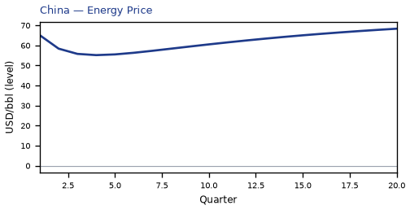


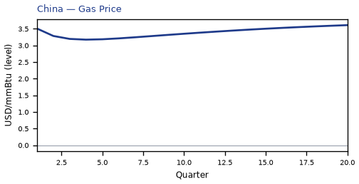


[Q1–Q20 JSON for China](numbers/CN.json)

## ID — Indonesia

The main impact of oil at $50 a barrel on Indonesia would be a large rise in GDP of 0.42% by Q13. Equities peak at +0.93% in Q10.

Demand and trade. Consumption peaks at +0.25 % vs baseline in Q14, from +0.09 in Q1 to +0.18 in Q20. Investment peaks at +1.71 % vs baseline in Q8, from +0.60 in Q1 to +0.42 in Q20. Net Exports peaks at +0.31 % vs baseline in Q4, from +0.20 in Q1 to +0.09 in Q20. Gov Spending peaks at -0.07 % vs baseline in Q13, from -0.03 in Q1 to -0.05 in Q20. Gov Debt peaks at +0.70 % vs baseline in Q20, from +0.03 in Q1 to +0.70 in Q20.

External / FX. The real exchange rate shows real depreciation (a weaker, more competitive home currency). Real Exchange Rate peaks at +1.25 % vs baseline in Q5, from +0.77 in Q1 to +0.37 in Q20.

Labour. Employment peaks at +0.39 % vs baseline in Q18, from +0.02 in Q1 to +0.38 in Q20. Unemployment peaks at -0.06 pp in Q15, from -0.01 in Q1 to -0.05 in Q20. Real Wages peaks at +0.37 % vs baseline in Q20, from +0.00 in Q1 to +0.37 in Q20.

Prices. The three-year CPI impulse is -0.87 percentage points. CPI Inflation peaks at -0.15 pp in Q3, from -0.08 in Q1 to +0.05 in Q20. Domestic Infl. peaks at -0.10 pp in Q3, from -0.06 in Q1 to +0.03 in Q20. Marginal Cost peaks at +0.26 % vs baseline in Q13, from +0.09 in Q1 to +0.16 in Q20.

Financial conditions. Policy Rate peaks at -0.52 pp (annualized) in Q6, from -0.11 in Q1 to +0.20 in Q20. Real Rate peaks at -0.13 pp (annualized) in Q6, from -0.03 in Q1 to +0.05 in Q20. Govt 3M Yield peaks at -0.52 pp (annualized) in Q6, from -0.11 in Q1 to +0.20 in Q20. Govt 2Y Yield peaks at -0.44 pp (annualized) in Q3, from -0.40 in Q1 to +0.22 in Q20. Govt 5Y Yield peaks at -0.19 pp (annualized) in Q1, from -0.19 in Q1 to +0.18 in Q20. Govt 10Y Yield peaks at +0.13 pp (annualized) in Q16, from -0.01 in Q1 to +0.12 in Q20. Govt 30Y Yield peaks at +0.05 pp (annualized) in Q15, from +0.01 in Q1 to +0.05 in Q20. Bond Price (7y) peaks at +2.15 % vs baseline in Q6, from +0.46 in Q1 to -0.82 in Q20. Bond Price 3M peaks at +0.13 % vs baseline in Q6, from +0.03 in Q1 to -0.05 in Q20. Bond Price 2Y peaks at +0.84 % vs baseline in Q3, from +0.75 in Q1 to -0.41 in Q20. Bond Price 5Y peaks at +0.85 % vs baseline in Q1, from +0.85 in Q1 to -0.80 in Q20. Bond Price 10Y peaks at -1.06 % vs baseline in Q16, from +0.06 in Q1 to -0.99 in Q20. Bond Price 30Y peaks at -0.90 % vs baseline in Q15, from -0.22 in Q1 to -0.82 in Q20. Equity Index peaks at +0.93 % vs baseline in Q10, from +0.38 in Q1 to +0.42 in Q20. VIX peaks at +16.24 index_level in Q4, from +15.75 in Q1 to +15.58 in Q20. Tobin's Q peaks at +1.20 % vs baseline in Q8, from +0.42 in Q1 to +0.29 in Q20. House Prices peaks at +0.62 % vs baseline in Q18, from +0.03 in Q1 to +0.62 in Q20. Bank Equity peaks at +0.02 % vs baseline in Q16, from +0.00 in Q1 to +0.02 in Q20. Bank Credit peaks at +0.01 % vs baseline in Q16, from +0.00 in Q1 to +0.01 in Q20. Credit Spread peaks at +0.00 pp in Q1, from +0.00 in Q1 to +0.00 in Q20.

Nominal FX. NEER peaks at -1.48 % vs baseline in Q5, from -0.92 in Q1 to -0.44 in Q20. vs USD peaks at +1.07 % vs baseline in Q4, from +0.72 in Q1 to +0.70 in Q20.

Commodities. Energy Price peaks at +68.34 USD/bbl (level) in Q20, from +65.07 in Q1 to +68.34 in Q20. Metals Price peaks at +100.94 index (level) in Q10, from +100.26 in Q1 to +100.56 in Q20. Food Price peaks at +99.32 index (level) in Q1, from +99.32 in Q1 to +96.63 in Q20. Gas Price peaks at +3.61 USD/mmBtu (level) in Q20, from +3.51 in Q1 to +3.61 in Q20. Copper Price peaks at +100.87 index (level) in Q8, from +100.26 in Q1 to +100.51 in Q20. Wheat Price peaks at +100.54 index (level) in Q14, from +100.08 in Q1 to +100.36 in Q20. Gold Price peaks at +2065.27 USD/oz (level) in Q4, from +2034.50 in Q1 to +2012.05 in Q20.

Sectoral and capital. Manuf. GDP peaks at +0.31 % vs baseline in Q4, from +0.18 in Q1 to +0.24 in Q20. Services GDP peaks at +0.21 % vs baseline in Q13, from +0.07 in Q1 to +0.13 in Q20. Capital Stock peaks at +0.12 % vs baseline in Q20, from +0.00 in Q1 to +0.12 in Q20.

Timing. By Q20 GDP is still +0.26% from baseline.

These figures are model IRFs versus baseline, not forecasts.


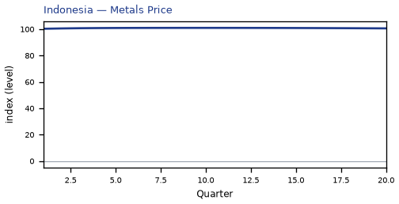


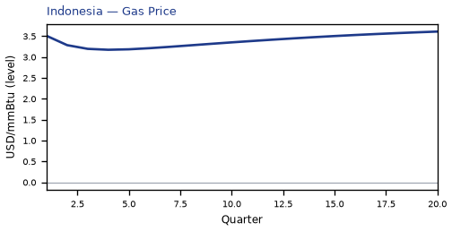


[Q1–Q20 JSON for Indonesia](numbers/ID.json)

## FR — France

The main impact of oil at $50 a barrel on France would be a large rise in GDP of 0.37% by Q5. Equities peak at +1.12% in Q5.

Demand and trade. Consumption peaks at +0.23 % vs baseline in Q4, from +0.12 in Q1 to +0.13 in Q20. Investment peaks at +1.79 % vs baseline in Q6, from +0.81 in Q1 to +0.47 in Q20. Net Exports peaks at +0.55 % vs baseline in Q4, from +0.34 in Q1 to +0.26 in Q20. Gov Spending peaks at -0.09 % vs baseline in Q5, from -0.05 in Q1 to -0.06 in Q20. Gov Debt peaks at -0.35 % vs baseline in Q20, from -0.02 in Q1 to -0.35 in Q20.

External / FX. The real exchange rate shows real appreciation (a stronger home currency). Real Exchange Rate peaks at -1.51 % vs baseline in Q4, from -0.92 in Q1 to -0.53 in Q20.

Labour. Employment peaks at +0.37 % vs baseline in Q15, from +0.04 in Q1 to +0.34 in Q20. Unemployment peaks at -0.21 pp in Q12, from -0.03 in Q1 to -0.17 in Q20. Real Wages peaks at -0.34 % vs baseline in Q12, from +0.00 in Q1 to -0.12 in Q20.

Prices. The three-year CPI impulse is -0.92 percentage points. CPI Inflation peaks at -0.19 pp in Q2, from -0.14 in Q1 to +0.04 in Q20. Domestic Infl. peaks at -0.13 pp in Q2, from -0.10 in Q1 to +0.03 in Q20. Marginal Cost peaks at +0.23 % vs baseline in Q5, from +0.14 in Q1 to +0.14 in Q20.

Financial conditions. Policy Rate peaks at -0.47 pp (annualized) in Q6, from -0.11 in Q1 to +0.11 in Q20. Real Rate peaks at -0.12 pp (annualized) in Q6, from -0.03 in Q1 to +0.03 in Q20. Govt 3M Yield peaks at -0.47 pp (annualized) in Q6, from -0.11 in Q1 to +0.11 in Q20. Govt 2Y Yield peaks at -0.41 pp (annualized) in Q3, from -0.37 in Q1 to +0.15 in Q20. Govt 5Y Yield peaks at -0.21 pp (annualized) in Q1, from -0.21 in Q1 to +0.15 in Q20. Govt 10Y Yield peaks at +0.12 pp (annualized) in Q19, from -0.03 in Q1 to +0.12 in Q20. Govt 30Y Yield peaks at +0.05 pp (annualized) in Q17, from +0.01 in Q1 to +0.05 in Q20. Bond Price (7y) peaks at +3.30 % vs baseline in Q6, from +0.79 in Q1 to -0.74 in Q20. Bond Price 3M peaks at +0.12 % vs baseline in Q6, from +0.03 in Q1 to -0.03 in Q20. Bond Price 2Y peaks at +0.78 % vs baseline in Q3, from +0.70 in Q1 to -0.28 in Q20. Bond Price 5Y peaks at +0.94 % vs baseline in Q1, from +0.94 in Q1 to -0.67 in Q20. Bond Price 10Y peaks at -0.97 % vs baseline in Q19, from +0.24 in Q1 to -0.97 in Q20. Bond Price 30Y peaks at -0.91 % vs baseline in Q17, from -0.24 in Q1 to -0.89 in Q20. Equity Index peaks at +1.12 % vs baseline in Q5, from +0.58 in Q1 to +0.43 in Q20. VIX peaks at +16.24 index_level in Q4, from +15.75 in Q1 to +15.58 in Q20. Tobin's Q peaks at +1.25 % vs baseline in Q6, from +0.57 in Q1 to +0.33 in Q20. House Prices peaks at +0.53 % vs baseline in Q19, from +0.03 in Q1 to +0.52 in Q20. Bank Equity peaks at +0.06 % vs baseline in Q16, from +0.00 in Q1 to +0.06 in Q20. Bank Credit peaks at +0.02 % vs baseline in Q16, from +0.00 in Q1 to +0.02 in Q20. Credit Spread peaks at +0.00 pp in Q1, from +0.00 in Q1 to +0.00 in Q20.

Nominal FX. NEER peaks at +0.79 % vs baseline in Q4, from +0.49 in Q1 to +0.31 in Q20. vs USD peaks at -1.68 % vs baseline in Q4, from -0.97 in Q1 to -0.21 in Q20.

Commodities. Energy Price peaks at +68.34 USD/bbl (level) in Q20, from +65.07 in Q1 to +68.34 in Q20. Metals Price peaks at +100.94 index (level) in Q10, from +100.26 in Q1 to +100.56 in Q20. Food Price peaks at +99.32 index (level) in Q1, from +99.32 in Q1 to +96.63 in Q20. Gas Price peaks at +3.61 USD/mmBtu (level) in Q20, from +3.51 in Q1 to +3.61 in Q20. Copper Price peaks at +100.87 index (level) in Q8, from +100.26 in Q1 to +100.51 in Q20. Wheat Price peaks at +100.54 index (level) in Q14, from +100.08 in Q1 to +100.36 in Q20. Gold Price peaks at +2065.27 USD/oz (level) in Q4, from +2034.50 in Q1 to +2012.05 in Q20.

Sectoral and capital. Manuf. GDP peaks at +0.97 % vs baseline in Q4, from +0.59 in Q1 to +0.41 in Q20. Services GDP peaks at +0.28 % vs baseline in Q5, from +0.17 in Q1 to +0.17 in Q20. Capital Stock peaks at +0.13 % vs baseline in Q20, from +0.00 in Q1 to +0.13 in Q20.

Timing. By Q20 GDP is still +0.22% from baseline.

These figures are model IRFs versus baseline, not forecasts.


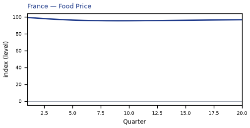


[Q1–Q20 JSON for France](numbers/FR.json)

## SE — Sweden

The main impact of oil at $50 a barrel on Sweden would be a moderate rise in GDP of 0.28% by Q4. Equities peak at +1.14% in Q5.

Demand and trade. Consumption peaks at +0.19 % vs baseline in Q4, from +0.10 in Q1 to +0.11 in Q20. Investment peaks at +1.54 % vs baseline in Q5, from +0.69 in Q1 to +0.39 in Q20. Net Exports peaks at +0.60 % vs baseline in Q4, from +0.36 in Q1 to +0.22 in Q20. Gov Spending peaks at -0.06 % vs baseline in Q4, from -0.04 in Q1 to -0.04 in Q20. Gov Debt peaks at -0.15 % vs baseline in Q19, from -0.01 in Q1 to -0.15 in Q20.

External / FX. The real exchange rate shows real appreciation (a stronger home currency). Real Exchange Rate peaks at -0.54 % vs baseline in Q20, from -0.22 in Q1 to -0.54 in Q20.

Labour. Employment peaks at +0.28 % vs baseline in Q15, from +0.03 in Q1 to +0.26 in Q20. Unemployment peaks at -0.16 pp in Q13, from -0.03 in Q1 to -0.13 in Q20. Real Wages peaks at -0.25 % vs baseline in Q11, from +0.00 in Q1 to -0.04 in Q20.

Prices. The three-year CPI impulse is -0.87 percentage points. CPI Inflation peaks at -0.16 pp in Q2, from -0.12 in Q1 to +0.03 in Q20. Domestic Infl. peaks at -0.11 pp in Q2, from -0.09 in Q1 to +0.02 in Q20. Marginal Cost peaks at +0.18 % vs baseline in Q4, from +0.11 in Q1 to +0.11 in Q20.

Financial conditions. Policy Rate peaks at -0.48 pp (annualized) in Q6, from -0.12 in Q1 to +0.08 in Q20. Real Rate peaks at -0.12 pp (annualized) in Q6, from -0.03 in Q1 to +0.02 in Q20. Govt 3M Yield peaks at -0.48 pp (annualized) in Q6, from -0.12 in Q1 to +0.08 in Q20. Govt 2Y Yield peaks at -0.41 pp (annualized) in Q3, from -0.37 in Q1 to +0.11 in Q20. Govt 5Y Yield peaks at -0.22 pp (annualized) in Q1, from -0.22 in Q1 to +0.11 in Q20. Govt 10Y Yield peaks at +0.10 pp (annualized) in Q20, from -0.05 in Q1 to +0.10 in Q20. Govt 30Y Yield peaks at +0.05 pp (annualized) in Q17, from +0.01 in Q1 to +0.05 in Q20. Bond Price (7y) peaks at +2.97 % vs baseline in Q6, from +0.73 in Q1 to -0.47 in Q20. Bond Price 3M peaks at +0.12 % vs baseline in Q6, from +0.03 in Q1 to -0.02 in Q20. Bond Price 2Y peaks at +0.79 % vs baseline in Q3, from +0.71 in Q1 to -0.21 in Q20. Bond Price 5Y peaks at +0.98 % vs baseline in Q1, from +0.98 in Q1 to -0.51 in Q20. Bond Price 10Y peaks at -0.79 % vs baseline in Q20, from +0.42 in Q1 to -0.79 in Q20. Bond Price 30Y peaks at -0.83 % vs baseline in Q17, from -0.14 in Q1 to -0.82 in Q20. Equity Index peaks at +1.14 % vs baseline in Q5, from +0.62 in Q1 to +0.44 in Q20. VIX peaks at +16.24 index_level in Q4, from +15.75 in Q1 to +15.58 in Q20. Tobin's Q peaks at +1.08 % vs baseline in Q5, from +0.49 in Q1 to +0.27 in Q20. House Prices peaks at +0.42 % vs baseline in Q19, from +0.02 in Q1 to +0.42 in Q20. Bank Equity peaks at +0.02 % vs baseline in Q15, from +0.00 in Q1 to +0.02 in Q20. Bank Credit peaks at +0.01 % vs baseline in Q15, from +0.00 in Q1 to +0.01 in Q20. Credit Spread peaks at +0.00 pp in Q1, from +0.00 in Q1 to +0.00 in Q20.

Nominal FX. NEER peaks at +1.56 % vs baseline in Q20, from +0.64 in Q1 to +1.56 in Q20. vs USD peaks at -0.64 % vs baseline in Q6, from -0.27 in Q1 to -0.22 in Q20.

Commodities. Energy Price peaks at +68.34 USD/bbl (level) in Q20, from +65.07 in Q1 to +68.34 in Q20. Metals Price peaks at +100.94 index (level) in Q10, from +100.26 in Q1 to +100.56 in Q20. Food Price peaks at +99.32 index (level) in Q1, from +99.32 in Q1 to +96.63 in Q20. Gas Price peaks at +3.61 USD/mmBtu (level) in Q20, from +3.51 in Q1 to +3.61 in Q20. Copper Price peaks at +100.87 index (level) in Q8, from +100.26 in Q1 to +100.51 in Q20. Wheat Price peaks at +100.54 index (level) in Q14, from +100.08 in Q1 to +100.36 in Q20. Gold Price peaks at +2065.27 USD/oz (level) in Q4, from +2034.50 in Q1 to +2012.05 in Q20.

Sectoral and capital. Manuf. GDP peaks at +0.74 % vs baseline in Q4, from +0.43 in Q1 to +0.46 in Q20. Services GDP peaks at +0.20 % vs baseline in Q4, from +0.13 in Q1 to +0.13 in Q20. Capital Stock peaks at +0.11 % vs baseline in Q20, from +0.00 in Q1 to +0.11 in Q20.

Timing. By Q20 GDP is still +0.18% from baseline.

These figures are model IRFs versus baseline, not forecasts.


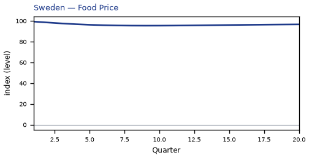

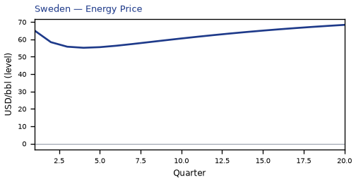


[Q1–Q20 JSON for Sweden](numbers/SE.json)

## US — United States

The main impact of oil at $50 a barrel on the United States would be a moderate rise in GDP of 0.25% by Q13. Equities peak at +0.90% in Q11.

Demand and trade. Consumption peaks at +0.16 % vs baseline in Q14, from +0.05 in Q1 to +0.11 in Q20. Investment peaks at +1.15 % vs baseline in Q6, from +0.37 in Q1 to +0.02 in Q20. Net Exports peaks at -0.07 % vs baseline in Q15, from -0.01 in Q1 to -0.06 in Q20. Gov Spending peaks at -0.05 % vs baseline in Q13, from -0.01 in Q1 to -0.03 in Q20. Gov Debt peaks at +0.05 % vs baseline in Q15, from +0.00 in Q1 to +0.04 in Q20.

External / FX. The real exchange rate shows real appreciation (a stronger home currency). Real Exchange Rate peaks at -0.32 % vs baseline in Q20, from +0.05 in Q1 to -0.32 in Q20.

Labour. Employment peaks at +0.28 % vs baseline in Q15, from +0.02 in Q1 to +0.22 in Q20. Unemployment peaks at -0.14 pp in Q16, from -0.01 in Q1 to -0.12 in Q20. Real Wages peaks at -0.35 % vs baseline in Q13, from +0.00 in Q1 to -0.19 in Q20.

Prices. The three-year CPI impulse is -0.86 percentage points. CPI Inflation peaks at -0.16 pp in Q2, from -0.12 in Q1 to +0.04 in Q20. Domestic Infl. peaks at -0.11 pp in Q2, from -0.08 in Q1 to +0.02 in Q20. Marginal Cost peaks at +0.16 % vs baseline in Q13, from +0.04 in Q1 to +0.09 in Q20.

Financial conditions. Policy Rate peaks at -0.51 pp (annualized) in Q5, from -0.14 in Q1 to +0.24 in Q20. Real Rate peaks at -0.13 pp (annualized) in Q5, from -0.03 in Q1 to +0.06 in Q20. Govt 3M Yield peaks at -0.51 pp (annualized) in Q5, from -0.14 in Q1 to +0.24 in Q20. Govt 2Y Yield peaks at -0.42 pp (annualized) in Q2, from -0.39 in Q1 to +0.23 in Q20. Govt 5Y Yield peaks at +0.19 pp (annualized) in Q15, from -0.14 in Q1 to +0.17 in Q20. Govt 10Y Yield peaks at +0.12 pp (annualized) in Q14, from +0.01 in Q1 to +0.10 in Q20. Govt 30Y Yield peaks at +0.04 pp (annualized) in Q14, from +0.01 in Q1 to +0.03 in Q20. Bond Price (7y) peaks at +3.35 % vs baseline in Q5, from +0.89 in Q1 to -1.61 in Q20. Bond Price 3M peaks at +0.13 % vs baseline in Q5, from +0.03 in Q1 to -0.06 in Q20. Bond Price 2Y peaks at +0.79 % vs baseline in Q2, from +0.75 in Q1 to -0.45 in Q20. Bond Price 5Y peaks at -0.86 % vs baseline in Q15, from +0.61 in Q1 to -0.76 in Q20. Bond Price 10Y peaks at -0.97 % vs baseline in Q14, from -0.10 in Q1 to -0.78 in Q20. Bond Price 30Y peaks at -0.70 % vs baseline in Q14, from -0.11 in Q1 to -0.55 in Q20. Equity Index peaks at +0.90 % vs baseline in Q11, from +0.27 in Q1 to +0.32 in Q20. VIX peaks at +16.24 index_level in Q4, from +15.75 in Q1 to +15.58 in Q20. Tobin's Q peaks at +0.80 % vs baseline in Q6, from +0.26 in Q1 to +0.01 in Q20. House Prices peaks at +0.28 % vs baseline in Q18, from +0.01 in Q1 to +0.28 in Q20. Bank Equity peaks at +0.01 % vs baseline in Q18, from +0.00 in Q1 to +0.01 in Q20. Bank Credit peaks at +0.00 % vs baseline in Q18, from +0.00 in Q1 to +0.00 in Q20. Credit Spread peaks at +0.00 pp in Q1, from +0.00 in Q1 to +0.00 in Q20.

Nominal FX. NEER peaks at +2.22 % vs baseline in Q4, from +1.34 in Q1 to +1.68 in Q20. vs USD peaks at +2.22 % vs baseline in Q4, from +1.34 in Q1 to +1.68 in Q20.

Commodities. Energy Price peaks at +68.34 USD/bbl (level) in Q20, from +65.07 in Q1 to +68.34 in Q20. Metals Price peaks at +100.94 index (level) in Q10, from +100.26 in Q1 to +100.56 in Q20. Food Price peaks at +99.32 index (level) in Q1, from +99.32 in Q1 to +96.63 in Q20. Gas Price peaks at +3.61 USD/mmBtu (level) in Q20, from +3.51 in Q1 to +3.61 in Q20. Copper Price peaks at +100.87 index (level) in Q8, from +100.26 in Q1 to +100.51 in Q20. Wheat Price peaks at +100.54 index (level) in Q14, from +100.08 in Q1 to +100.36 in Q20. Gold Price peaks at +2065.27 USD/oz (level) in Q4, from +2034.50 in Q1 to +2012.05 in Q20.

Sectoral and capital. Manuf. GDP peaks at +0.41 % vs baseline in Q4, from +0.26 in Q1 to +0.33 in Q20. Services GDP peaks at +0.19 % vs baseline in Q13, from +0.04 in Q1 to +0.11 in Q20. Capital Stock peaks at +0.07 % vs baseline in Q20, from +0.00 in Q1 to +0.07 in Q20.

Timing. By Q20 GDP is still +0.14% from baseline.

These figures are model IRFs versus baseline, not forecasts.


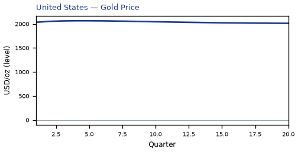


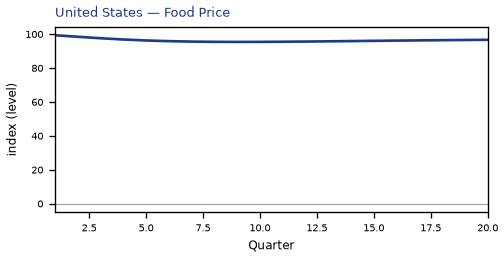

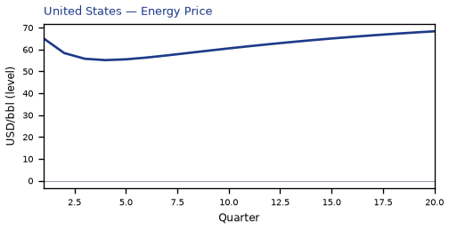

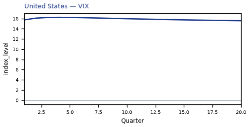


[Q1–Q20 JSON for United States](numbers/US.json)

## AU — Australia

The main impact of oil at $50 a barrel on Australia would be a moderate rise in GDP of 0.24% by Q10. Equities peak at +0.86% in Q6.

Demand and trade. Consumption peaks at +0.17 % vs baseline in Q4, from +0.08 in Q1 to +0.10 in Q20. Investment peaks at +1.17 % vs baseline in Q6, from +0.50 in Q1 to +0.10 in Q20. Net Exports peaks at +0.31 % vs baseline in Q4, from +0.19 in Q1 to +0.14 in Q20. Gov Spending peaks at -0.05 % vs baseline in Q10, from -0.02 in Q1 to -0.03 in Q20. Gov Debt peaks at +0.15 % vs baseline in Q20, from +0.01 in Q1 to +0.15 in Q20.

External / FX. The real exchange rate shows real appreciation (a stronger home currency). Real Exchange Rate peaks at -1.18 % vs baseline in Q5, from -0.55 in Q1 to -0.57 in Q20.

Labour. Employment peaks at +0.28 % vs baseline in Q13, from +0.04 in Q1 to +0.22 in Q20. Unemployment peaks at -0.14 pp in Q13, from -0.02 in Q1 to -0.11 in Q20. Real Wages peaks at -0.18 % vs baseline in Q11, from +0.00 in Q1 to +0.06 in Q20.

Prices. The three-year CPI impulse is -0.67 percentage points. CPI Inflation peaks at -0.13 pp in Q2, from -0.10 in Q1 to +0.03 in Q20. Domestic Infl. peaks at -0.09 pp in Q2, from -0.07 in Q1 to +0.02 in Q20. Marginal Cost peaks at +0.15 % vs baseline in Q10, from +0.08 in Q1 to +0.08 in Q20.

Financial conditions. Policy Rate peaks at -0.33 pp (annualized) in Q5, from -0.08 in Q1 to +0.18 in Q20. Real Rate peaks at -0.08 pp (annualized) in Q5, from -0.02 in Q1 to +0.05 in Q20. Govt 3M Yield peaks at -0.33 pp (annualized) in Q5, from -0.08 in Q1 to +0.18 in Q20. Govt 2Y Yield peaks at -0.27 pp (annualized) in Q2, from -0.25 in Q1 to +0.19 in Q20. Govt 5Y Yield peaks at +0.16 pp (annualized) in Q17, from -0.09 in Q1 to +0.15 in Q20. Govt 10Y Yield peaks at +0.11 pp (annualized) in Q15, from +0.03 in Q1 to +0.10 in Q20. Govt 30Y Yield peaks at +0.04 pp (annualized) in Q14, from +0.02 in Q1 to +0.04 in Q20. Bond Price (7y) peaks at +2.03 % vs baseline in Q5, from +0.51 in Q1 to -1.14 in Q20. Bond Price 3M peaks at +0.08 % vs baseline in Q5, from +0.02 in Q1 to -0.05 in Q20. Bond Price 2Y peaks at +0.51 % vs baseline in Q2, from +0.48 in Q1 to -0.36 in Q20. Bond Price 5Y peaks at -0.73 % vs baseline in Q17, from +0.40 in Q1 to -0.69 in Q20. Bond Price 10Y peaks at -0.93 % vs baseline in Q15, from -0.25 in Q1 to -0.83 in Q20. Bond Price 30Y peaks at -0.77 % vs baseline in Q14, from -0.38 in Q1 to -0.68 in Q20. Equity Index peaks at +0.86 % vs baseline in Q6, from +0.41 in Q1 to +0.24 in Q20. VIX peaks at +16.24 index_level in Q4, from +15.75 in Q1 to +15.58 in Q20. Tobin's Q peaks at +0.82 % vs baseline in Q6, from +0.35 in Q1 to +0.07 in Q20. House Prices peaks at +0.32 % vs baseline in Q18, from +0.02 in Q1 to +0.31 in Q20. Bank Equity peaks at +0.03 % vs baseline in Q17, from +0.00 in Q1 to +0.03 in Q20. Bank Credit peaks at +0.01 % vs baseline in Q17, from +0.00 in Q1 to +0.01 in Q20. Credit Spread peaks at +0.00 pp in Q1, from +0.00 in Q1 to +0.00 in Q20.

Nominal FX. NEER peaks at +0.80 % vs baseline in Q6, from +0.32 in Q1 to +0.41 in Q20. vs USD peaks at -1.35 % vs baseline in Q5, from -0.60 in Q1 to -0.24 in Q20.

Commodities. Energy Price peaks at +68.34 USD/bbl (level) in Q20, from +65.07 in Q1 to +68.34 in Q20. Metals Price peaks at +100.94 index (level) in Q10, from +100.26 in Q1 to +100.56 in Q20. Food Price peaks at +99.32 index (level) in Q1, from +99.32 in Q1 to +96.63 in Q20. Gas Price peaks at +3.61 USD/mmBtu (level) in Q20, from +3.51 in Q1 to +3.61 in Q20. Copper Price peaks at +100.87 index (level) in Q8, from +100.26 in Q1 to +100.51 in Q20. Wheat Price peaks at +100.54 index (level) in Q14, from +100.08 in Q1 to +100.36 in Q20. Gold Price peaks at +2065.27 USD/oz (level) in Q4, from +2034.50 in Q1 to +2012.05 in Q20.

Sectoral and capital. Manuf. GDP peaks at +0.75 % vs baseline in Q5, from +0.41 in Q1 to +0.37 in Q20. Services GDP peaks at +0.17 % vs baseline in Q10, from +0.09 in Q1 to +0.10 in Q20. Capital Stock peaks at +0.07 % vs baseline in Q20, from +0.00 in Q1 to +0.07 in Q20.

Timing. By Q20 GDP is still +0.13% from baseline.

These figures are model IRFs versus baseline, not forecasts.


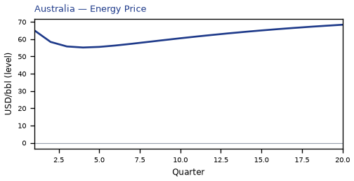

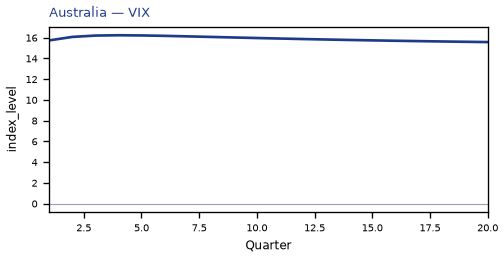


[Q1–Q20 JSON for Australia](numbers/AU.json)

## CH — Switzerland

The main impact of oil at $50 a barrel on Switzerland would be a moderate rise in GDP of 0.24% by Q5. Equities peak at +1.20% in Q5.

Demand and trade. Consumption peaks at +0.18 % vs baseline in Q5, from +0.09 in Q1 to +0.10 in Q20. Investment peaks at +1.00 % vs baseline in Q6, from +0.48 in Q1 to +0.23 in Q20. Net Exports peaks at +0.18 % vs baseline in Q3, from +0.14 in Q1 to +0.15 in Q20. Gov Spending peaks at -0.05 % vs baseline in Q5, from -0.03 in Q1 to -0.03 in Q20. Gov Debt peaks at +0.13 % vs baseline in Q18, from +0.01 in Q1 to +0.13 in Q20.

External / FX. The real exchange rate shows real appreciation (a stronger home currency). Real Exchange Rate peaks at -1.26 % vs baseline in Q6, from -0.53 in Q1 to -0.18 in Q20.

Labour. Employment peaks at +0.24 % vs baseline in Q11, from +0.04 in Q1 to +0.18 in Q20. Unemployment peaks at -0.13 pp in Q11, from -0.02 in Q1 to -0.10 in Q20. Real Wages peaks at -0.33 % vs baseline in Q13, from +0.00 in Q1 to -0.17 in Q20.

Prices. The three-year CPI impulse is -0.76 percentage points. CPI Inflation peaks at -0.15 pp in Q3, from -0.11 in Q1 to +0.04 in Q20. Domestic Infl. peaks at -0.11 pp in Q3, from -0.08 in Q1 to +0.03 in Q20. Marginal Cost peaks at +0.15 % vs baseline in Q5, from +0.09 in Q1 to +0.08 in Q20.

Financial conditions. Policy Rate peaks at -0.20 pp (annualized) in Q6, from -0.04 in Q1 to +0.09 in Q20. Real Rate peaks at -0.05 pp (annualized) in Q6, from -0.01 in Q1 to +0.02 in Q20. Govt 3M Yield peaks at -0.20 pp (annualized) in Q6, from -0.04 in Q1 to +0.09 in Q20. Govt 2Y Yield peaks at -0.17 pp (annualized) in Q3, from -0.15 in Q1 to +0.11 in Q20. Govt 5Y Yield peaks at +0.10 pp (annualized) in Q19, from -0.07 in Q1 to +0.10 in Q20. Govt 10Y Yield peaks at +0.08 pp (annualized) in Q17, from +0.01 in Q1 to +0.07 in Q20. Govt 30Y Yield peaks at +0.03 pp (annualized) in Q15, from +0.02 in Q1 to +0.03 in Q20. Bond Price (7y) peaks at +1.38 % vs baseline in Q6, from +0.29 in Q1 to -0.65 in Q20. Bond Price 3M peaks at +0.05 % vs baseline in Q6, from +0.01 in Q1 to -0.02 in Q20. Bond Price 2Y peaks at +0.32 % vs baseline in Q3, from +0.29 in Q1 to -0.21 in Q20. Bond Price 5Y peaks at -0.46 % vs baseline in Q19, from +0.32 in Q1 to -0.46 in Q20. Bond Price 10Y peaks at -0.62 % vs baseline in Q17, from -0.12 in Q1 to -0.60 in Q20. Bond Price 30Y peaks at -0.56 % vs baseline in Q15, from -0.30 in Q1 to -0.53 in Q20. Equity Index peaks at +1.20 % vs baseline in Q5, from +0.64 in Q1 to +0.46 in Q20. VIX peaks at +16.24 index_level in Q4, from +15.75 in Q1 to +15.58 in Q20. Tobin's Q peaks at +0.70 % vs baseline in Q6, from +0.33 in Q1 to +0.16 in Q20. House Prices peaks at +0.32 % vs baseline in Q19, from +0.02 in Q1 to +0.32 in Q20. Bank Equity peaks at +0.04 % vs baseline in Q17, from +0.00 in Q1 to +0.04 in Q20. Bank Credit peaks at +0.02 % vs baseline in Q17, from +0.00 in Q1 to +0.02 in Q20. Credit Spread peaks at +0.00 pp in Q1, from +0.00 in Q1 to +0.00 in Q20.

Nominal FX. NEER peaks at +0.76 % vs baseline in Q7, from +0.20 in Q1 to +0.03 in Q20. vs USD peaks at -1.43 % vs baseline in Q6, from -0.58 in Q1 to +0.14 in Q20.

Commodities. Energy Price peaks at +68.34 USD/bbl (level) in Q20, from +65.07 in Q1 to +68.34 in Q20. Metals Price peaks at +100.94 index (level) in Q10, from +100.26 in Q1 to +100.56 in Q20. Food Price peaks at +99.32 index (level) in Q1, from +99.32 in Q1 to +96.63 in Q20. Gas Price peaks at +3.61 USD/mmBtu (level) in Q20, from +3.51 in Q1 to +3.61 in Q20. Copper Price peaks at +100.87 index (level) in Q8, from +100.26 in Q1 to +100.51 in Q20. Wheat Price peaks at +100.54 index (level) in Q14, from +100.08 in Q1 to +100.36 in Q20. Gold Price peaks at +2065.27 USD/oz (level) in Q4, from +2034.50 in Q1 to +2012.05 in Q20.

Sectoral and capital. Manuf. GDP peaks at +0.96 % vs baseline in Q5, from +0.52 in Q1 to +0.34 in Q20. Services GDP peaks at +0.19 % vs baseline in Q5, from +0.11 in Q1 to +0.10 in Q20. Capital Stock peaks at +0.07 % vs baseline in Q20, from +0.00 in Q1 to +0.07 in Q20.

Timing. By Q20 GDP is still +0.13% from baseline.

These figures are model IRFs versus baseline, not forecasts.


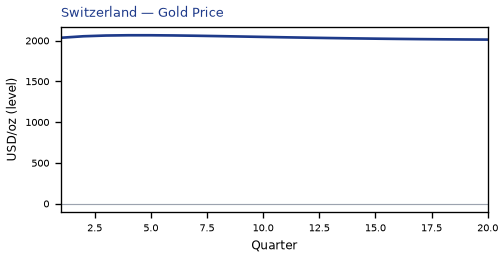


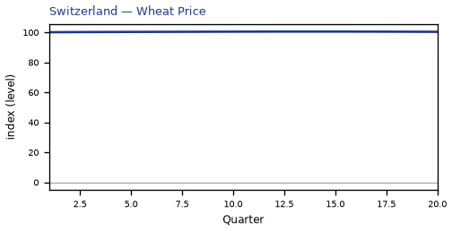


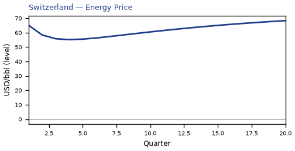


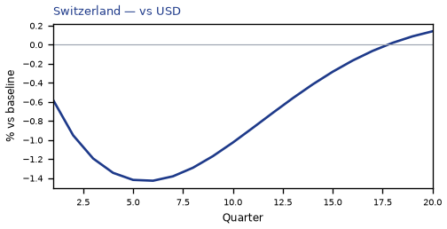

[Q1–Q20 JSON for Switzerland](numbers/CH.json)

## CO — Colombia

The main impact of oil at $50 a barrel on Colombia would be a moderate drop in GDP of 0.24% by Q3. Equities peak at +0.35% in Q12.

Demand and trade. Consumption peaks at -0.11 % vs baseline in Q4, from -0.05 in Q1 to +0.07 in Q20. Investment peaks at +0.84 % vs baseline in Q10, from -0.16 in Q1 to +0.05 in Q20. Net Exports peaks at -0.88 % vs baseline in Q4, from -0.54 in Q1 to -0.41 in Q20. Gov Spending peaks at -0.20 % vs baseline in Q6, from -0.12 in Q1 to -0.13 in Q20. Gov Debt peaks at -0.16 % vs baseline in Q8, from -0.02 in Q1 to +0.08 in Q20.

External / FX. The real exchange rate shows real depreciation (a weaker, more competitive home currency). Real Exchange Rate peaks at +7.30 % vs baseline in Q4, from +4.23 in Q1 to +3.69 in Q20.

Labour. Employment peaks at -0.15 % vs baseline in Q6, from -0.03 in Q1 to +0.13 in Q20. Unemployment peaks at -0.02 pp in Q17, from +0.00 in Q1 to -0.02 in Q20. Real Wages peaks at -0.56 % vs baseline in Q13, from -0.00 in Q1 to -0.34 in Q20.

Prices. The three-year CPI impulse is -0.90 percentage points. CPI Inflation peaks at -0.14 pp in Q3, from -0.09 in Q1 to +0.03 in Q20. Domestic Infl. peaks at -0.10 pp in Q3, from -0.07 in Q1 to +0.02 in Q20. Marginal Cost peaks at -0.13 % vs baseline in Q3, from -0.08 in Q1 to +0.06 in Q20.

Financial conditions. Policy Rate peaks at -0.62 pp (annualized) in Q5, from -0.15 in Q1 to +0.14 in Q20. Real Rate peaks at -0.15 pp (annualized) in Q5, from -0.04 in Q1 to +0.03 in Q20. Govt 3M Yield peaks at -0.62 pp (annualized) in Q5, from -0.15 in Q1 to +0.14 in Q20. Govt 2Y Yield peaks at -0.53 pp (annualized) in Q3, from -0.49 in Q1 to +0.14 in Q20. Govt 5Y Yield peaks at -0.25 pp (annualized) in Q1, from -0.25 in Q1 to +0.11 in Q20. Govt 10Y Yield peaks at +0.08 pp (annualized) in Q16, from -0.07 in Q1 to +0.07 in Q20. Govt 30Y Yield peaks at +0.03 pp (annualized) in Q16, from -0.01 in Q1 to +0.03 in Q20. Bond Price (7y) peaks at +2.21 % vs baseline in Q5, from +0.55 in Q1 to -0.49 in Q20. Bond Price 3M peaks at +0.15 % vs baseline in Q5, from +0.04 in Q1 to -0.03 in Q20. Bond Price 2Y peaks at +1.00 % vs baseline in Q3, from +0.92 in Q1 to -0.27 in Q20. Bond Price 5Y peaks at +1.12 % vs baseline in Q1, from +1.12 in Q1 to -0.49 in Q20. Bond Price 10Y peaks at -0.63 % vs baseline in Q16, from +0.60 in Q1 to -0.58 in Q20. Bond Price 30Y peaks at -0.55 % vs baseline in Q16, from +0.26 in Q1 to -0.51 in Q20. Equity Index peaks at +0.35 % vs baseline in Q12, from -0.17 in Q1 to +0.04 in Q20. VIX peaks at +16.24 index_level in Q4, from +15.75 in Q1 to +15.58 in Q20. Tobin's Q peaks at +0.59 % vs baseline in Q10, from -0.11 in Q1 to +0.04 in Q20. House Prices peaks at +0.17 % vs baseline in Q20, from -0.02 in Q1 to +0.17 in Q20. Bank Equity peaks at -0.06 % vs baseline in Q15, from -0.01 in Q1 to -0.06 in Q20. Bank Credit peaks at -0.06 % vs baseline in Q15, from -0.01 in Q1 to -0.06 in Q20. Credit Spread peaks at +0.00 pp in Q15, from +0.00 in Q1 to +0.00 in Q20.

Nominal FX. NEER peaks at -6.89 % vs baseline in Q4, from -4.03 in Q1 to -3.61 in Q20. vs USD peaks at +7.13 % vs baseline in Q4, from +4.18 in Q1 to +4.02 in Q20.

Commodities. Energy Price peaks at +68.34 USD/bbl (level) in Q20, from +65.07 in Q1 to +68.34 in Q20. Metals Price peaks at +100.94 index (level) in Q10, from +100.26 in Q1 to +100.56 in Q20. Food Price peaks at +99.32 index (level) in Q1, from +99.32 in Q1 to +96.63 in Q20. Gas Price peaks at +3.61 USD/mmBtu (level) in Q20, from +3.51 in Q1 to +3.61 in Q20. Copper Price peaks at +100.87 index (level) in Q8, from +100.26 in Q1 to +100.51 in Q20. Wheat Price peaks at +100.54 index (level) in Q14, from +100.08 in Q1 to +100.36 in Q20. Gold Price peaks at +2065.27 USD/oz (level) in Q4, from +2034.50 in Q1 to +2012.05 in Q20.

Sectoral and capital. Manuf. GDP peaks at -1.74 % vs baseline in Q4, from -1.00 in Q1 to -0.86 in Q20. Services GDP peaks at -0.14 % vs baseline in Q3, from -0.09 in Q1 to +0.06 in Q20. Capital Stock peaks at +0.05 % vs baseline in Q20, from -0.00 in Q1 to +0.05 in Q20.

Timing. The GDP response has mostly faded by Q8 (Q20 is +0.09%).

These figures are model IRFs versus baseline, not forecasts.


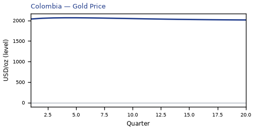


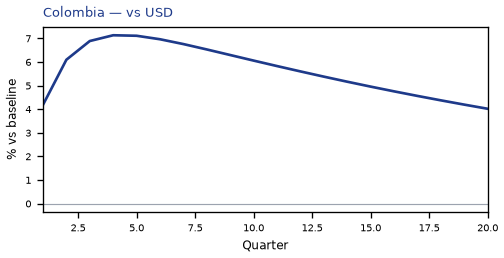

[Q1–Q20 JSON for Colombia](numbers/CO.json)

## MX — Mexico

The main impact of oil at $50 a barrel on Mexico would be a moderate rise in GDP of 0.23% by Q14. Equities peak at +0.50% in Q11.

Demand and trade. Consumption peaks at +0.13 % vs baseline in Q15, from +0.00 in Q1 to +0.08 in Q20. Investment peaks at +1.03 % vs baseline in Q9, from +0.13 in Q1 to +0.07 in Q20. Net Exports peaks at -0.54 % vs baseline in Q4, from -0.35 in Q1 to -0.25 in Q20. Gov Spending peaks at -0.16 % vs baseline in Q9, from -0.09 in Q1 to -0.10 in Q20. Gov Debt peaks at +0.25 % vs baseline in Q20, from -0.01 in Q1 to +0.25 in Q20.

External / FX. The real exchange rate shows real depreciation (a weaker, more competitive home currency). Real Exchange Rate peaks at +6.05 % vs baseline in Q4, from +3.48 in Q1 to +3.02 in Q20.

Labour. Employment peaks at +0.19 % vs baseline in Q18, from -0.01 in Q1 to +0.18 in Q20. Unemployment peaks at -0.03 pp in Q16, from +0.00 in Q1 to -0.02 in Q20. Real Wages peaks at -0.29 % vs baseline in Q12, from -0.00 in Q1 to -0.08 in Q20.

Prices. The three-year CPI impulse is -0.64 percentage points. CPI Inflation peaks at -0.10 pp in Q3, from -0.08 in Q1 to +0.02 in Q20. Domestic Infl. peaks at -0.07 pp in Q3, from -0.05 in Q1 to +0.02 in Q20. Marginal Cost peaks at +0.15 % vs baseline in Q14, from -0.02 in Q1 to +0.07 in Q20.

Financial conditions. Policy Rate peaks at -0.59 pp (annualized) in Q5, from -0.16 in Q1 to +0.16 in Q20. Real Rate peaks at -0.15 pp (annualized) in Q5, from -0.04 in Q1 to +0.04 in Q20. Govt 3M Yield peaks at -0.59 pp (annualized) in Q5, from -0.16 in Q1 to +0.16 in Q20. Govt 2Y Yield peaks at -0.49 pp (annualized) in Q2, from -0.46 in Q1 to +0.16 in Q20. Govt 5Y Yield peaks at -0.22 pp (annualized) in Q1, from -0.22 in Q1 to +0.12 in Q20. Govt 10Y Yield peaks at +0.08 pp (annualized) in Q16, from -0.05 in Q1 to +0.08 in Q20. Govt 30Y Yield peaks at +0.03 pp (annualized) in Q15, from -0.01 in Q1 to +0.03 in Q20. Bond Price (7y) peaks at +2.44 % vs baseline in Q5, from +0.68 in Q1 to -0.66 in Q20. Bond Price 3M peaks at +0.15 % vs baseline in Q5, from +0.04 in Q1 to -0.04 in Q20. Bond Price 2Y peaks at +0.93 % vs baseline in Q2, from +0.88 in Q1 to -0.30 in Q20. Bond Price 5Y peaks at +0.97 % vs baseline in Q1, from +0.97 in Q1 to -0.54 in Q20. Bond Price 10Y peaks at -0.69 % vs baseline in Q16, from +0.42 in Q1 to -0.62 in Q20. Bond Price 30Y peaks at -0.62 % vs baseline in Q15, from +0.13 in Q1 to -0.55 in Q20. Equity Index peaks at +0.50 % vs baseline in Q11, from +0.01 in Q1 to +0.07 in Q20. VIX peaks at +16.24 index_level in Q4, from +15.75 in Q1 to +15.58 in Q20. Tobin's Q peaks at +0.72 % vs baseline in Q9, from +0.09 in Q1 to +0.05 in Q20. House Prices peaks at +0.30 % vs baseline in Q19, from -0.00 in Q1 to +0.30 in Q20. Bank Equity peaks at -0.02 % vs baseline in Q10, from -0.00 in Q1 to -0.02 in Q20. Bank Credit peaks at -0.02 % vs baseline in Q10, from -0.00 in Q1 to -0.02 in Q20. Credit Spread peaks at +0.00 pp in Q10, from +0.00 in Q1 to +0.00 in Q20.

Nominal FX. NEER peaks at -6.07 % vs baseline in Q4, from -3.53 in Q1 to -3.19 in Q20. vs USD peaks at +5.88 % vs baseline in Q4, from +3.44 in Q1 to +3.34 in Q20.

Commodities. Energy Price peaks at +68.34 USD/bbl (level) in Q20, from +65.07 in Q1 to +68.34 in Q20. Metals Price peaks at +100.94 index (level) in Q10, from +100.26 in Q1 to +100.56 in Q20. Food Price peaks at +99.32 index (level) in Q1, from +99.32 in Q1 to +96.63 in Q20. Gas Price peaks at +3.61 USD/mmBtu (level) in Q20, from +3.51 in Q1 to +3.61 in Q20. Copper Price peaks at +100.87 index (level) in Q8, from +100.26 in Q1 to +100.51 in Q20. Wheat Price peaks at +100.54 index (level) in Q14, from +100.08 in Q1 to +100.36 in Q20. Gold Price peaks at +2065.27 USD/oz (level) in Q4, from +2034.50 in Q1 to +2012.05 in Q20.

Sectoral and capital. Manuf. GDP peaks at -1.21 % vs baseline in Q4, from -0.68 in Q1 to -0.59 in Q20. Services GDP peaks at +0.14 % vs baseline in Q14, from -0.03 in Q1 to +0.07 in Q20. Capital Stock peaks at +0.07 % vs baseline in Q20, from +0.00 in Q1 to +0.07 in Q20.

Timing. By Q20 GDP is still +0.11% from baseline.

These figures are model IRFs versus baseline, not forecasts.


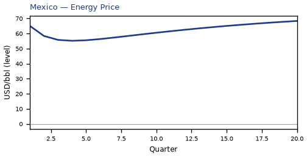


[Q1–Q20 JSON for Mexico](numbers/MX.json)

## UK — United Kingdom

The main impact of oil at $50 a barrel on United Kingdom would be a moderate rise in GDP of 0.22% by Q5. Equities peak at +0.84% in Q5.

Demand and trade. Consumption peaks at +0.15 % vs baseline in Q5, from +0.07 in Q1 to +0.08 in Q20. Investment peaks at +0.87 % vs baseline in Q6, from +0.42 in Q1 to +0.37 in Q20. Net Exports peaks at +0.26 % vs baseline in Q4, from +0.16 in Q1 to +0.20 in Q20. Gov Spending peaks at -0.05 % vs baseline in Q5, from -0.03 in Q1 to -0.03 in Q20. Gov Debt peaks at +0.02 % vs baseline in Q10, from +0.00 in Q1 to +0.01 in Q20.

External / FX. The real exchange rate shows real appreciation (a stronger home currency). Real Exchange Rate peaks at -1.67 % vs baseline in Q5, from -0.76 in Q1 to +0.04 in Q20.

Labour. Employment peaks at +0.23 % vs baseline in Q10, from +0.04 in Q1 to +0.18 in Q20. Unemployment peaks at -0.12 pp in Q10, from -0.02 in Q1 to -0.08 in Q20. Real Wages peaks at -0.39 % vs baseline in Q13, from +0.00 in Q1 to -0.20 in Q20.

Prices. The three-year CPI impulse is -0.88 percentage points. CPI Inflation peaks at -0.18 pp in Q3, from -0.13 in Q1 to +0.05 in Q20. Domestic Infl. peaks at -0.13 pp in Q3, from -0.09 in Q1 to +0.03 in Q20. Marginal Cost peaks at +0.14 % vs baseline in Q5, from +0.08 in Q1 to +0.07 in Q20.

Financial conditions. Policy Rate peaks at -0.16 pp (annualized) in Q8, from -0.03 in Q1 to -0.02 in Q20. Real Rate peaks at -0.04 pp (annualized) in Q8, from -0.01 in Q1 to -0.01 in Q20. Govt 3M Yield peaks at -0.16 pp (annualized) in Q8, from -0.03 in Q1 to -0.02 in Q20. Govt 2Y Yield peaks at -0.15 pp (annualized) in Q5, from -0.11 in Q1 to +0.00 in Q20. Govt 5Y Yield peaks at -0.10 pp (annualized) in Q1, from -0.10 in Q1 to +0.03 in Q20. Govt 10Y Yield peaks at +0.04 pp (annualized) in Q20, from -0.03 in Q1 to +0.04 in Q20. Govt 30Y Yield peaks at +0.03 pp (annualized) in Q20, from +0.01 in Q1 to +0.03 in Q20. Bond Price (7y) peaks at +1.12 % vs baseline in Q8, from +0.19 in Q1 to -0.34 in Q20. Bond Price 3M peaks at +0.04 % vs baseline in Q8, from +0.01 in Q1 to +0.01 in Q20. Bond Price 2Y peaks at +0.28 % vs baseline in Q5, from +0.22 in Q1 to -0.01 in Q20. Bond Price 5Y peaks at +0.45 % vs baseline in Q1, from +0.45 in Q1 to -0.13 in Q20. Bond Price 10Y peaks at -0.32 % vs baseline in Q20, from +0.28 in Q1 to -0.32 in Q20. Bond Price 30Y peaks at -0.51 % vs baseline in Q20, from -0.19 in Q1 to -0.51 in Q20. Equity Index peaks at +0.84 % vs baseline in Q5, from +0.41 in Q1 to +0.19 in Q20. VIX peaks at +16.24 index_level in Q4, from +15.75 in Q1 to +15.58 in Q20. Tobin's Q peaks at +0.61 % vs baseline in Q6, from +0.30 in Q1 to +0.26 in Q20. House Prices peaks at +0.27 % vs baseline in Q20, from +0.02 in Q1 to +0.27 in Q20. Bank Equity peaks at +0.03 % vs baseline in Q17, from +0.00 in Q1 to +0.03 in Q20. Bank Credit peaks at +0.01 % vs baseline in Q17, from +0.00 in Q1 to +0.01 in Q20. Credit Spread peaks at +0.00 pp in Q1, from +0.00 in Q1 to +0.00 in Q20.

Nominal FX. NEER peaks at +1.88 % vs baseline in Q6, from +0.83 in Q1 to +0.27 in Q20. vs USD peaks at -1.85 % vs baseline in Q5, from -0.81 in Q1 to +0.36 in Q20.

Commodities. Energy Price peaks at +68.34 USD/bbl (level) in Q20, from +65.07 in Q1 to +68.34 in Q20. Metals Price peaks at +100.94 index (level) in Q10, from +100.26 in Q1 to +100.56 in Q20. Food Price peaks at +99.32 index (level) in Q1, from +99.32 in Q1 to +96.63 in Q20. Gas Price peaks at +3.61 USD/mmBtu (level) in Q20, from +3.51 in Q1 to +3.61 in Q20. Copper Price peaks at +100.87 index (level) in Q8, from +100.26 in Q1 to +100.51 in Q20. Wheat Price peaks at +100.54 index (level) in Q14, from +100.08 in Q1 to +100.36 in Q20. Gold Price peaks at +2065.27 USD/oz (level) in Q4, from +2034.50 in Q1 to +2012.05 in Q20.

Sectoral and capital. Manuf. GDP peaks at +0.95 % vs baseline in Q5, from +0.50 in Q1 to +0.21 in Q20. Services GDP peaks at +0.17 % vs baseline in Q5, from +0.10 in Q1 to +0.09 in Q20. Capital Stock peaks at +0.07 % vs baseline in Q20, from +0.00 in Q1 to +0.07 in Q20.

Timing. By Q20 GDP is still +0.11% from baseline.

These figures are model IRFs versus baseline, not forecasts.


[Q1–Q20 JSON for United Kingdom](numbers/UK.json)

## NL — Netherlands

The main impact of oil at $50 a barrel on Netherlands would be a moderate rise in GDP of 0.12% by Q13. Equities peak at +0.48% in Q7.

Demand and trade. Consumption peaks at +0.06 % vs baseline in Q3, from +0.04 in Q1 to +0.04 in Q20. Investment peaks at +0.96 % vs baseline in Q6, from +0.29 in Q1 to +0.01 in Q20. Net Exports peaks at -0.39 % vs baseline in Q5, from -0.21 in Q1 to -0.18 in Q20. Gov Spending peaks at -0.06 % vs baseline in Q10, from -0.03 in Q1 to -0.04 in Q20. Gov Debt peaks at -0.03 % vs baseline in Q20, from -0.00 in Q1 to -0.03 in Q20.

External / FX. The real exchange rate shows real depreciation (a weaker, more competitive home currency). Real Exchange Rate peaks at +0.69 % vs baseline in Q5, from +0.39 in Q1 to +0.52 in Q20.

Labour. Employment peaks at +0.11 % vs baseline in Q17, from +0.01 in Q1 to +0.10 in Q20. Unemployment peaks at -0.06 pp in Q15, from -0.00 in Q1 to -0.05 in Q20. Real Wages peaks at -0.48 % vs baseline in Q13, from +0.00 in Q1 to -0.33 in Q20.

Prices. The three-year CPI impulse is -1.02 percentage points. CPI Inflation peaks at -0.21 pp in Q2, from -0.17 in Q1 to +0.04 in Q20. Domestic Infl. peaks at -0.15 pp in Q2, from -0.12 in Q1 to +0.03 in Q20. Marginal Cost peaks at +0.08 % vs baseline in Q13, from +0.03 in Q1 to +0.04 in Q20.

Financial conditions. Policy Rate peaks at -0.47 pp (annualized) in Q6, from -0.11 in Q1 to +0.11 in Q20. Real Rate peaks at -0.12 pp (annualized) in Q6, from -0.03 in Q1 to +0.03 in Q20. Govt 3M Yield peaks at -0.47 pp (annualized) in Q6, from -0.11 in Q1 to +0.11 in Q20. Govt 2Y Yield peaks at -0.41 pp (annualized) in Q3, from -0.37 in Q1 to +0.15 in Q20. Govt 5Y Yield peaks at -0.21 pp (annualized) in Q1, from -0.21 in Q1 to +0.15 in Q20. Govt 10Y Yield peaks at +0.12 pp (annualized) in Q19, from -0.03 in Q1 to +0.12 in Q20. Govt 30Y Yield peaks at +0.05 pp (annualized) in Q17, from +0.01 in Q1 to +0.05 in Q20. Bond Price (7y) peaks at +3.30 % vs baseline in Q6, from +0.79 in Q1 to -0.74 in Q20. Bond Price 3M peaks at +0.12 % vs baseline in Q6, from +0.03 in Q1 to -0.03 in Q20. Bond Price 2Y peaks at +0.78 % vs baseline in Q3, from +0.70 in Q1 to -0.28 in Q20. Bond Price 5Y peaks at +0.94 % vs baseline in Q1, from +0.94 in Q1 to -0.67 in Q20. Bond Price 10Y peaks at -0.97 % vs baseline in Q19, from +0.24 in Q1 to -0.97 in Q20. Bond Price 30Y peaks at -0.91 % vs baseline in Q17, from -0.24 in Q1 to -0.89 in Q20. Equity Index peaks at +0.48 % vs baseline in Q7, from +0.18 in Q1 to +0.08 in Q20. VIX peaks at +16.24 index_level in Q4, from +15.75 in Q1 to +15.58 in Q20. Tobin's Q peaks at +0.67 % vs baseline in Q6, from +0.20 in Q1 to +0.01 in Q20. House Prices peaks at +0.20 % vs baseline in Q18, from +0.01 in Q1 to +0.19 in Q20. Bank Equity peaks at +0.01 % vs baseline in Q16, from +0.00 in Q1 to +0.01 in Q20. Bank Credit peaks at +0.00 % vs baseline in Q16, from +0.00 in Q1 to +0.00 in Q20. Credit Spread peaks at +0.00 pp in Q1, from +0.00 in Q1 to +0.00 in Q20.

Nominal FX. NEER peaks at -0.55 % vs baseline in Q4, from -0.34 in Q1 to -0.16 in Q20. vs USD peaks at +0.85 % vs baseline in Q18, from +0.34 in Q1 to +0.84 in Q20.

Commodities. Energy Price peaks at +68.34 USD/bbl (level) in Q20, from +65.07 in Q1 to +68.34 in Q20. Metals Price peaks at +100.94 index (level) in Q10, from +100.26 in Q1 to +100.56 in Q20. Food Price peaks at +99.32 index (level) in Q1, from +99.32 in Q1 to +96.63 in Q20. Gas Price peaks at +3.61 USD/mmBtu (level) in Q20, from +3.51 in Q1 to +3.61 in Q20. Copper Price peaks at +100.87 index (level) in Q8, from +100.26 in Q1 to +100.51 in Q20. Wheat Price peaks at +100.54 index (level) in Q14, from +100.08 in Q1 to +100.36 in Q20. Gold Price peaks at +2065.27 USD/oz (level) in Q4, from +2034.50 in Q1 to +2012.05 in Q20.

Sectoral and capital. Manuf. GDP peaks at +0.25 % vs baseline in Q4, from +0.16 in Q1 to +0.06 in Q20. Services GDP peaks at +0.09 % vs baseline in Q13, from +0.02 in Q1 to +0.04 in Q20. Capital Stock peaks at +0.06 % vs baseline in Q20, from +0.00 in Q1 to +0.06 in Q20.

Timing. By Q20 GDP is still +0.06% from baseline.

These figures are model IRFs versus baseline, not forecasts.


[Q1–Q20 JSON for Netherlands](numbers/NL.json)

## MY — Malaysia

The main impact of oil at $50 a barrel on Malaysia would be a moderate drop in GDP of 0.10% by Q3. Equities peak at -0.17% in Q20.

Demand and trade. Consumption peaks at -0.06 % vs baseline in Q5, from -0.02 in Q1 to -0.01 in Q20. Investment peaks at +0.34 % vs baseline in Q8, from -0.03 in Q1 to -0.17 in Q20. Net Exports peaks at -0.66 % vs baseline in Q4, from -0.39 in Q1 to -0.21 in Q20. Gov Spending peaks at -0.16 % vs baseline in Q5, from -0.09 in Q1 to -0.08 in Q20. Gov Debt peaks at -0.10 % vs baseline in Q9, from -0.01 in Q1 to -0.06 in Q20.

External / FX. The real exchange rate shows real depreciation (a weaker, more competitive home currency). Real Exchange Rate peaks at +2.81 % vs baseline in Q4, from +1.64 in Q1 to +1.77 in Q20.

Labour. Employment peaks at -0.08 % vs baseline in Q7, from -0.01 in Q1 to -0.01 in Q20. Unemployment peaks at +0.02 pp in Q6, from +0.00 in Q1 to +0.00 in Q20. Real Wages peaks at -0.37 % vs baseline in Q13, from -0.00 in Q1 to -0.23 in Q20.

Prices. The three-year CPI impulse is -0.59 percentage points. CPI Inflation peaks at -0.14 pp in Q2, from -0.12 in Q1 to +0.03 in Q20. Domestic Infl. peaks at -0.10 pp in Q2, from -0.08 in Q1 to +0.02 in Q20. Marginal Cost peaks at -0.05 % vs baseline in Q3, from -0.03 in Q1 to -0.01 in Q20.

Financial conditions. Policy Rate peaks at -0.32 pp (annualized) in Q6, from -0.08 in Q1 to +0.06 in Q20. Real Rate peaks at -0.08 pp (annualized) in Q6, from -0.02 in Q1 to +0.02 in Q20. Govt 3M Yield peaks at -0.32 pp (annualized) in Q6, from -0.08 in Q1 to +0.06 in Q20. Govt 2Y Yield peaks at -0.27 pp (annualized) in Q3, from -0.25 in Q1 to +0.07 in Q20. Govt 5Y Yield peaks at -0.13 pp (annualized) in Q1, from -0.13 in Q1 to +0.04 in Q20. Govt 10Y Yield peaks at -0.05 pp (annualized) in Q1, from -0.05 in Q1 to +0.02 in Q20. Govt 30Y Yield peaks at -0.01 pp (annualized) in Q1, from -0.01 in Q1 to +0.01 in Q20. Bond Price (7y) peaks at +1.33 % vs baseline in Q6, from +0.34 in Q1 to -0.27 in Q20. Bond Price 3M peaks at +0.08 % vs baseline in Q6, from +0.02 in Q1 to -0.02 in Q20. Bond Price 2Y peaks at +0.52 % vs baseline in Q3, from +0.48 in Q1 to -0.13 in Q20. Bond Price 5Y peaks at +0.60 % vs baseline in Q1, from +0.60 in Q1 to -0.20 in Q20. Bond Price 10Y peaks at +0.38 % vs baseline in Q1, from +0.38 in Q1 to -0.19 in Q20. Bond Price 30Y peaks at +0.27 % vs baseline in Q1, from +0.27 in Q1 to -0.14 in Q20. Equity Index peaks at -0.17 % vs baseline in Q20, from -0.08 in Q1 to -0.17 in Q20. VIX peaks at +16.24 index_level in Q4, from +15.75 in Q1 to +15.58 in Q20. Tobin's Q peaks at +0.24 % vs baseline in Q8, from -0.02 in Q1 to -0.12 in Q20. House Prices peaks at -0.04 % vs baseline in Q6, from -0.01 in Q1 to -0.00 in Q20. Bank Equity peaks at -0.03 % vs baseline in Q20, from -0.00 in Q1 to -0.03 in Q20. Bank Credit peaks at -0.03 % vs baseline in Q20, from -0.00 in Q1 to -0.03 in Q20. Credit Spread peaks at +0.00 pp in Q20, from +0.00 in Q1 to +0.00 in Q20.

Nominal FX. NEER peaks at -3.35 % vs baseline in Q4, from -1.96 in Q1 to -2.02 in Q20. vs USD peaks at +2.64 % vs baseline in Q4, from +1.60 in Q1 to +2.09 in Q20.

Commodities. Energy Price peaks at +68.34 USD/bbl (level) in Q20, from +65.07 in Q1 to +68.34 in Q20. Metals Price peaks at +100.94 index (level) in Q10, from +100.26 in Q1 to +100.56 in Q20. Food Price peaks at +99.32 index (level) in Q1, from +99.32 in Q1 to +96.63 in Q20. Gas Price peaks at +3.61 USD/mmBtu (level) in Q20, from +3.51 in Q1 to +3.61 in Q20. Copper Price peaks at +100.87 index (level) in Q8, from +100.26 in Q1 to +100.51 in Q20. Wheat Price peaks at +100.54 index (level) in Q14, from +100.08 in Q1 to +100.36 in Q20. Gold Price peaks at +2065.27 USD/oz (level) in Q4, from +2034.50 in Q1 to +2012.05 in Q20.

Sectoral and capital. Manuf. GDP peaks at -0.21 % vs baseline in Q20, from -0.09 in Q1 to -0.21 in Q20. Services GDP peaks at -0.06 % vs baseline in Q3, from -0.04 in Q1 to -0.02 in Q20. Capital Stock peaks at +0.02 % vs baseline in Q16, from -0.00 in Q1 to +0.01 in Q20.

Timing. The GDP response has mostly faded by Q10 (Q20 is -0.03%).

These figures are model IRFs versus baseline, not forecasts.


[Q1–Q20 JSON for Malaysia](numbers/MY.json)


---

These figures are model IRFs versus baseline, not forecasts, and not financial advice.
