# Global Macro Economic Simulations and Financial Market Responses

v6 · IRF · evaluation

**Open the typeset report (this is the document):** https://robomacro.com/GlobalMacroTrainingDataset/risk_250/

GitHub and Hugging Face show `.html` as source code. That is not the report. Read it on robomacro.com, or keep scrolling this page.

## What's the impact of Risk premium +250bp

### Active treatment

```json
{
  "risk_premium": 250.0
}
```

### Assumptions

- Every path is a model impulse response versus baseline, not a forecast.
- The solver and weights are not included.
- English never enters the solver.

### Summary

This report traces the model response to a 250bp rise in the risk premium. Every path is an impulse response versus an unchanged baseline — not a forecast and not market data. The question was: What's the impact of Risk premium +250bp

Argentina sees a -2.32% GDP peak at Q7, with CPI -1.76pp over three years and equities -25.10%. Russia sees a -1.85% GDP peak at Q7, with CPI -1.01pp over three years and equities -25.08%. Nigeria sees a -1.83% GDP peak at Q7, with CPI -1.27pp over three years and equities -25.07%. China sees a -1.82% GDP peak at Q7, with CPI -0.95pp over three years and equities -25.04%.

The remaining countries are smaller spillovers and are covered in the chapters that follow. This material is a model-based summary and is not financial advice.

### Countries by GDP impact

- [AR — Argentina](#ar--argentina) · GDP -2.32% Q7
- [RU — Russia](#ru--russia) · GDP -1.85% Q7
- [NG — Nigeria](#ng--nigeria) · GDP -1.83% Q7
- [CN — China](#cn--china) · GDP -1.82% Q7
- [TR — Turkey](#tr--turkey) · GDP -1.61% Q7
- [MY — Malaysia](#my--malaysia) · GDP -1.58% Q7
- [IN — India](#in--india) · GDP -1.57% Q7
- [TH — Thailand](#th--thailand) · GDP -1.52% Q7
- [SA — Saudi Arabia](#sa--saudi-arabia) · GDP -1.44% Q7
- [ID — Indonesia](#id--indonesia) · GDP -1.34% Q7
- [MX — Mexico](#mx--mexico) · GDP -1.33% Q7
- [BR — Brazil](#br--brazil) · GDP -1.27% Q7
- [CO — Colombia](#co--colombia) · GDP -1.25% Q7
- [KR — South Korea](#kr--south-korea) · GDP -1.24% Q7
- [CL — Chile](#cl--chile) · GDP -1.20% Q7
- [NL — Netherlands](#nl--netherlands) · GDP -1.17% Q7
- [PL — Poland](#pl--poland) · GDP -1.14% Q7
- [ZA — South Africa](#za--south-africa) · GDP -1.14% Q7
- [DE — Germany](#de--germany) · GDP -1.11% Q7
- [CH — Switzerland](#ch--switzerland) · GDP -1.11% Q7
- [CA — Canada](#ca--canada) · GDP -1.06% Q7
- [FR — France](#fr--france) · GDP -1.06% Q7
- [UK — United Kingdom](#uk--united-kingdom) · GDP -1.02% Q7
- [NO — Norway](#no--norway) · GDP -1.02% Q7
- [SE — Sweden](#se--sweden) · GDP -0.96% Q7
- [AU — Australia](#au--australia) · GDP -0.95% Q7
- [ES — Spain](#es--spain) · GDP -0.94% Q7
- [US — United States](#us--united-states) · GDP -0.92% Q7
- [JP — Japan](#jp--japan) · GDP -0.92% Q7
- [IT — Italy](#it--italy) · GDP -0.89% Q7


## AR — Argentina

The main impact of a 250bp rise in the risk premium on Argentina would be a large drop in GDP of 2.32% by Q7. Equities peak at -25.10% in Q1.

Demand and trade. Consumption peaks at -1.15 % vs baseline in Q7, from -0.11 in Q1 to +0.76 in Q20. Investment peaks at -5.20 % vs baseline in Q5, from -1.33 in Q1 to +3.58 in Q20. Net Exports peaks at +0.52 % vs baseline in Q1, from +0.52 in Q1 to -0.14 in Q20. Gov Spending peaks at +0.41 % vs baseline in Q7, from +0.00 in Q1 to -0.31 in Q20. Gov Debt peaks at -1.21 % vs baseline in Q14, from +0.00 in Q1 to -0.84 in Q20.

External / FX. The real exchange rate shows real depreciation (a weaker, more competitive home currency). Currency Strength peaks at +6.89 % vs baseline in Q1, from +6.89 in Q1 to -0.33 in Q20.

Labour. Employment peaks at -1.70 % vs baseline in Q10, from +0.00 in Q1 to +0.32 in Q20. Unemployment peaks at +0.39 pp in Q8, from +0.00 in Q1 to -0.30 in Q20. Real Wages peaks at -3.40 % vs baseline in Q16, from +0.00 in Q1 to -2.71 in Q20.

Prices. The three-year CPI impulse is -1.76 percentage points. CPI Inflation peaks at +0.72 pp in Q1, from +0.72 in Q1 to +0.13 in Q20. Domestic Infl. peaks at +0.51 pp in Q1, from +0.51 in Q1 to +0.09 in Q20. Marginal Cost peaks at -1.39 % vs baseline in Q7, from -0.01 in Q1 to +0.94 in Q20.

Financial conditions. Policy Rate peaks at -1.56 pp (annualized) in Q9, from +0.87 in Q1 to +0.57 in Q20. Govt 2Y Yield peaks at -1.33 pp (annualized) in Q6, from -0.32 in Q1 to +0.75 in Q20. Govt 5Y Yield peaks at +0.52 pp (annualized) in Q18, from -0.48 in Q1 to +0.49 in Q20. Govt 10Y Yield peaks at +0.21 pp (annualized) in Q17, from -0.01 in Q1 to +0.19 in Q20. Bond Price peaks at +3.89 % vs baseline in Q9, from -2.17 in Q1 to -1.42 in Q20. Equity Index peaks at -25.10 % vs baseline in Q1, from -25.10 in Q1 to -2.34 in Q20. Tobin's Q peaks at -3.64 % vs baseline in Q5, from -0.93 in Q1 to +2.51 in Q20. House Prices peaks at -1.66 % vs baseline in Q11, from -0.02 in Q1 to +0.01 in Q20. Bank Credit peaks at -0.81 % vs baseline in Q13, from +0.00 in Q1 to -0.65 in Q20. Credit Spread peaks at +0.24 pp in Q13, from +0.00 in Q1 to +0.19 in Q20.

Sectoral and capital. Manuf. GDP peaks at -2.23 % vs baseline in Q5, from -2.07 in Q1 to +0.42 in Q20. Services GDP peaks at -1.33 % vs baseline in Q7, from -0.01 in Q1 to +0.89 in Q20. Capital Stock peaks at -0.18 % vs baseline in Q11, from -0.01 in Q1 to -0.06 in Q20.

Timing. The GDP response has mostly faded by Q13 (Q20 is +1.56%).

These figures are model IRFs versus baseline, not forecasts.


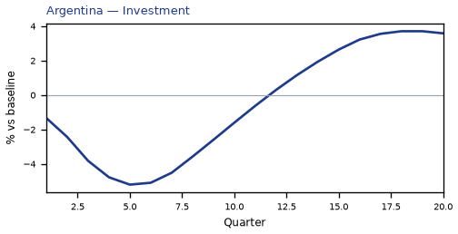

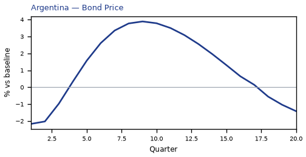

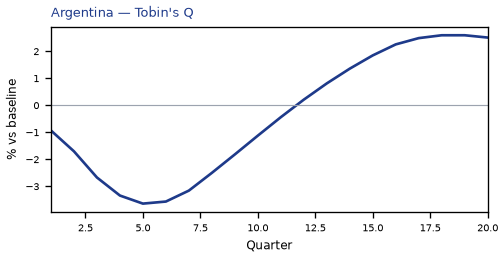

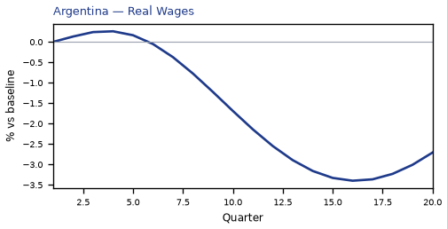

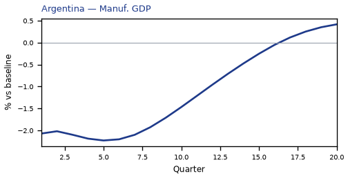

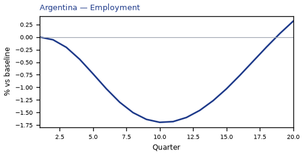

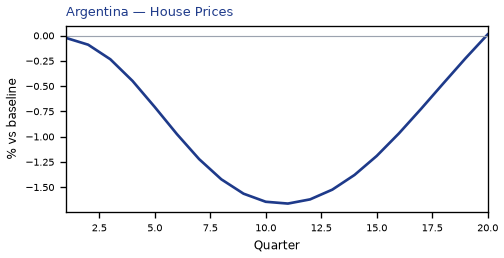


[Q1–Q20 JSON for Argentina](numbers/AR.json)

## RU — Russia

The main impact of a 250bp rise in the risk premium on Russia would be a large drop in GDP of 1.85% by Q7. Equities peak at -25.08% in Q1.

Demand and trade. Consumption peaks at -1.02 % vs baseline in Q8, from -0.03 in Q1 to -0.13 in Q20. Investment peaks at -4.65 % vs baseline in Q6, from -0.33 in Q1 to +0.09 in Q20. Net Exports peaks at -0.50 % vs baseline in Q9, from +0.23 in Q1 to -0.07 in Q20. Gov Spending peaks at +0.13 % vs baseline in Q5, from +0.00 in Q1 to +0.00 in Q20. Gov Debt peaks at -0.69 % vs baseline in Q16, from +0.00 in Q1 to -0.64 in Q20.

External / FX. The real exchange rate shows real depreciation (a weaker, more competitive home currency). Currency Strength peaks at +2.34 % vs baseline in Q1, from +2.34 in Q1 to -0.07 in Q20.

Labour. Employment peaks at -1.45 % vs baseline in Q12, from +0.00 in Q1 to -0.80 in Q20. Unemployment peaks at +0.58 pp in Q10, from +0.00 in Q1 to +0.19 in Q20. Real Wages peaks at -2.98 % vs baseline in Q20, from +0.00 in Q1 to -2.98 in Q20.

Prices. The three-year CPI impulse is -1.01 percentage points. CPI Inflation peaks at +0.28 pp in Q1, from +0.28 in Q1 to -0.02 in Q20. Domestic Infl. peaks at +0.20 pp in Q1, from +0.20 in Q1 to -0.01 in Q20. Marginal Cost peaks at -1.11 % vs baseline in Q7, from -0.00 in Q1 to -0.08 in Q20.

Financial conditions. Policy Rate peaks at -0.79 pp (annualized) in Q11, from +0.21 in Q1 to -0.28 in Q20. Govt 2Y Yield peaks at -0.72 pp (annualized) in Q8, from -0.14 in Q1 to -0.13 in Q20. Govt 5Y Yield peaks at -0.48 pp (annualized) in Q5, from -0.41 in Q1 to -0.08 in Q20. Govt 10Y Yield peaks at -0.27 pp (annualized) in Q5, from -0.24 in Q1 to -0.08 in Q20. Bond Price peaks at +2.47 % vs baseline in Q11, from -0.66 in Q1 to +0.86 in Q20. Equity Index peaks at -25.08 % vs baseline in Q1, from -25.08 in Q1 to -5.13 in Q20. Tobin's Q peaks at -3.26 % vs baseline in Q6, from -0.23 in Q1 to +0.06 in Q20. House Prices peaks at -1.68 % vs baseline in Q14, from -0.00 in Q1 to -1.33 in Q20. Bank Credit peaks at -0.37 % vs baseline in Q13, from +0.00 in Q1 to -0.30 in Q20. Credit Spread peaks at +0.01 pp in Q13, from +0.00 in Q1 to +0.01 in Q20.

Sectoral and capital. Manuf. GDP peaks at -0.94 % vs baseline in Q6, from -0.70 in Q1 to -0.00 in Q20. Services GDP peaks at -1.02 % vs baseline in Q7, from -0.00 in Q1 to -0.08 in Q20. Capital Stock peaks at -0.21 % vs baseline in Q18, from -0.00 in Q1 to -0.21 in Q20.

Timing. The GDP response has mostly faded by Q17 (Q20 is -0.14%).

These figures are model IRFs versus baseline, not forecasts.


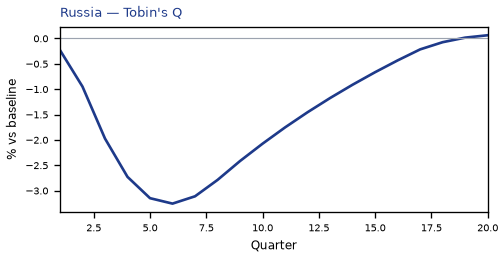


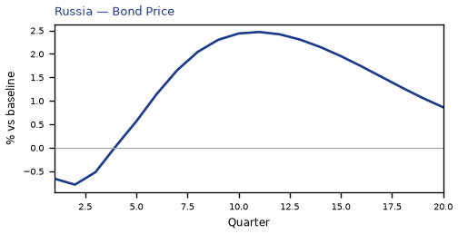

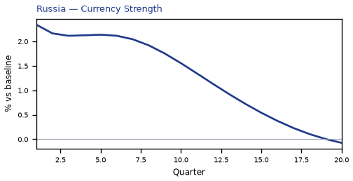

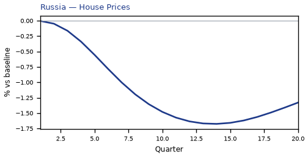

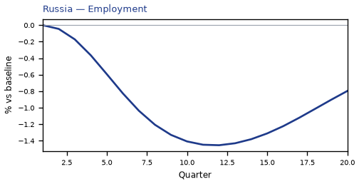

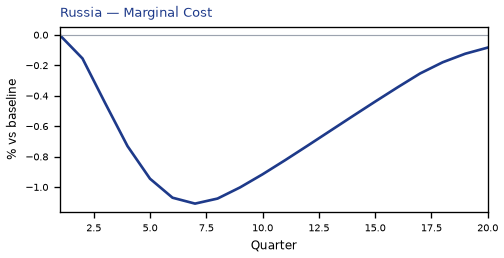

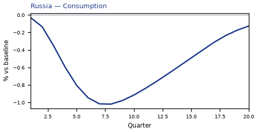

[Q1–Q20 JSON for Russia](numbers/RU.json)

## NG — Nigeria

The main impact of a 250bp rise in the risk premium on Nigeria would be a large drop in GDP of 1.83% by Q7. Equities peak at -25.07% in Q1.

Demand and trade. Consumption peaks at -1.06 % vs baseline in Q8, from -0.05 in Q1 to +0.07 in Q20. Investment peaks at -4.39 % vs baseline in Q6, from -0.64 in Q1 to +0.67 in Q20. Net Exports peaks at +0.42 % vs baseline in Q1, from +0.42 in Q1 to -0.01 in Q20. Gov Spending peaks at +0.23 % vs baseline in Q7, from +0.00 in Q1 to -0.03 in Q20. Gov Debt peaks at -3.68 % vs baseline in Q16, from +0.00 in Q1 to -3.55 in Q20.

External / FX. The real exchange rate shows real depreciation (a weaker, more competitive home currency). Currency Strength peaks at +4.18 % vs baseline in Q1, from +4.18 in Q1 to +0.29 in Q20.

Labour. Employment peaks at -1.23 % vs baseline in Q12, from +0.00 in Q1 to -0.67 in Q20. Unemployment peaks at +0.11 pp in Q8, from +0.00 in Q1 to -0.00 in Q20. Real Wages peaks at -2.63 % vs baseline in Q19, from +0.00 in Q1 to -2.60 in Q20.

Prices. The three-year CPI impulse is -1.27 percentage points. CPI Inflation peaks at +0.58 pp in Q1, from +0.58 in Q1 to +0.02 in Q20. Domestic Infl. peaks at +0.41 pp in Q1, from +0.41 in Q1 to +0.01 in Q20. Marginal Cost peaks at -1.09 % vs baseline in Q7, from -0.00 in Q1 to +0.12 in Q20.

Financial conditions. Policy Rate peaks at -0.98 pp (annualized) in Q10, from +0.42 in Q1 to -0.06 in Q20. Govt 2Y Yield peaks at -0.86 pp (annualized) in Q7, from -0.14 in Q1 to +0.08 in Q20. Govt 5Y Yield peaks at -0.46 pp (annualized) in Q4, from -0.41 in Q1 to +0.03 in Q20. Govt 10Y Yield peaks at -0.23 pp (annualized) in Q5, from -0.19 in Q1 to -0.03 in Q20. Bond Price peaks at +2.44 % vs baseline in Q10, from -1.05 in Q1 to +0.14 in Q20. Equity Index peaks at -25.07 % vs baseline in Q1, from -25.07 in Q1 to -4.60 in Q20. Tobin's Q peaks at -3.08 % vs baseline in Q6, from -0.45 in Q1 to +0.47 in Q20. House Prices peaks at -1.53 % vs baseline in Q13, from -0.01 in Q1 to -0.96 in Q20. Bank Credit peaks at -0.62 % vs baseline in Q13, from +0.00 in Q1 to -0.50 in Q20. Credit Spread peaks at +0.09 pp in Q13, from +0.00 in Q1 to +0.07 in Q20.

Sectoral and capital. Manuf. GDP peaks at -1.25 % vs baseline in Q1, from -1.25 in Q1 to -0.07 in Q20. Services GDP peaks at -0.90 % vs baseline in Q7, from -0.00 in Q1 to +0.10 in Q20. Capital Stock peaks at -0.18 % vs baseline in Q15, from -0.00 in Q1 to -0.16 in Q20.

Timing. The GDP response has mostly faded by Q15 (Q20 is +0.19%).

These figures are model IRFs versus baseline, not forecasts.


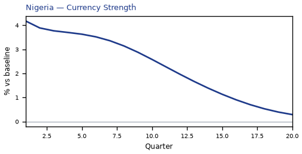

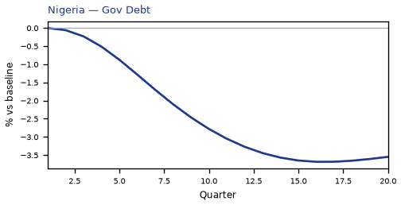

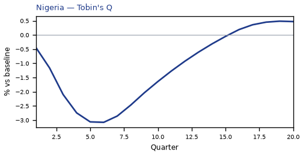

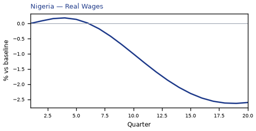

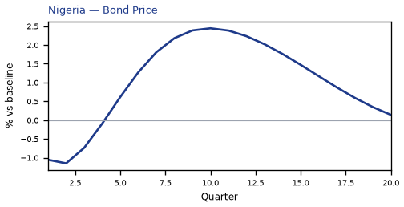

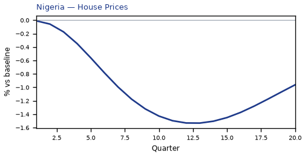

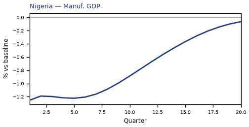


[Q1–Q20 JSON for Nigeria](numbers/NG.json)

## CN — China

The main impact of a 250bp rise in the risk premium on China would be a large drop in GDP of 1.82% by Q7. Equities peak at -25.04% in Q1.

Demand and trade. Consumption peaks at -1.37 % vs baseline in Q7, from -0.00 in Q1 to -0.28 in Q20. Investment peaks at -4.32 % vs baseline in Q6, from -0.04 in Q1 to +0.55 in Q20. Net Exports peaks at +0.38 % vs baseline in Q8, from +0.09 in Q1 to +0.17 in Q20. Gov Spending peaks at +0.32 % vs baseline in Q7, from +0.00 in Q1 to +0.05 in Q20. Gov Debt peaks at -2.06 % vs baseline in Q20, from +0.00 in Q1 to -2.06 in Q20.

External / FX. The real exchange rate shows real depreciation (a weaker, more competitive home currency). Currency Strength peaks at +1.89 % vs baseline in Q14, from +1.00 in Q1 to +1.60 in Q20.

Labour. Employment peaks at -1.23 % vs baseline in Q13, from +0.00 in Q1 to -0.91 in Q20. Unemployment peaks at +0.36 pp in Q10, from +0.00 in Q1 to +0.13 in Q20. Real Wages peaks at -2.70 % vs baseline in Q20, from +0.00 in Q1 to -2.70 in Q20.

Prices. The three-year CPI impulse is -0.95 percentage points. CPI Inflation peaks at -0.15 pp in Q7, from +0.07 in Q1 to -0.02 in Q20. Domestic Infl. peaks at -0.10 pp in Q7, from +0.05 in Q1 to -0.01 in Q20. Marginal Cost peaks at -1.09 % vs baseline in Q7, from -0.00 in Q1 to -0.18 in Q20.

Financial conditions. Policy Rate peaks at -1.17 pp (annualized) in Q13, from +0.02 in Q1 to -0.88 in Q20. Govt 2Y Yield peaks at -1.12 pp (annualized) in Q10, from -0.34 in Q1 to -0.68 in Q20. Govt 5Y Yield peaks at -0.92 pp (annualized) in Q7, from -0.77 in Q1 to -0.47 in Q20. Govt 10Y Yield peaks at -0.62 pp (annualized) in Q4, from -0.60 in Q1 to -0.32 in Q20. Bond Price peaks at +5.83 % vs baseline in Q13, from -0.09 in Q1 to +4.42 in Q20. Equity Index peaks at -25.04 % vs baseline in Q1, from -25.04 in Q1 to -5.66 in Q20. Tobin's Q peaks at -3.02 % vs baseline in Q6, from -0.03 in Q1 to +0.38 in Q20. House Prices peaks at -1.59 % vs baseline in Q14, from -0.00 in Q1 to -1.31 in Q20. Bank Credit peaks at -0.42 % vs baseline in Q13, from +0.00 in Q1 to -0.33 in Q20. Credit Spread peaks at +0.00 pp in Q13, from +0.00 in Q1 to +0.00 in Q20.

Sectoral and capital. Manuf. GDP peaks at -0.96 % vs baseline in Q8, from -0.30 in Q1 to -0.57 in Q20. Services GDP peaks at -1.06 % vs baseline in Q7, from -0.00 in Q1 to -0.18 in Q20. Capital Stock peaks at -0.18 % vs baseline in Q16, from -0.00 in Q1 to -0.17 in Q20.

Timing. The GDP response has mostly faded by Q19 (Q20 is -0.30%).

These figures are model IRFs versus baseline, not forecasts.


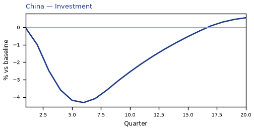

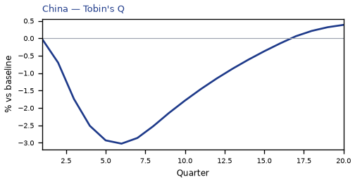

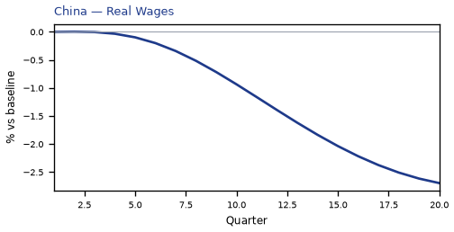

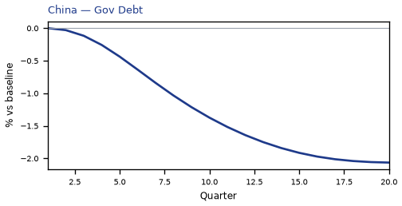

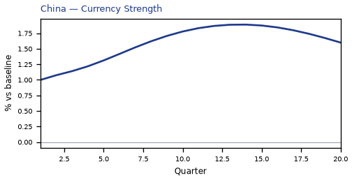

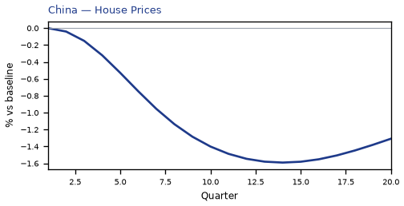

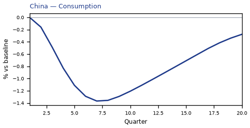

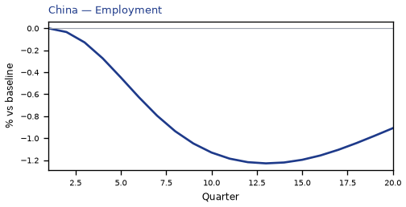

[Q1–Q20 JSON for China](numbers/CN.json)

## TR — Turkey

The main impact of a 250bp rise in the risk premium on Turkey would be a large drop in GDP of 1.61% by Q7. Equities peak at -25.09% in Q1.

Demand and trade. Consumption peaks at -0.92 % vs baseline in Q8, from -0.11 in Q1 to +0.07 in Q20. Investment peaks at -4.07 % vs baseline in Q6, from -1.29 in Q1 to +0.81 in Q20. Net Exports peaks at +0.91 % vs baseline in Q7, from +0.68 in Q1 to +0.11 in Q20. Gov Spending peaks at +0.28 % vs baseline in Q7, from +0.00 in Q1 to -0.03 in Q20. Gov Debt peaks at -1.22 % vs baseline in Q15, from +0.00 in Q1 to -1.07 in Q20.

External / FX. The real exchange rate shows real depreciation (a weaker, more competitive home currency). Currency Strength peaks at +4.83 % vs baseline in Q1, from +4.83 in Q1 to +0.77 in Q20.

Labour. Employment peaks at -1.24 % vs baseline in Q12, from +0.00 in Q1 to -0.56 in Q20. Unemployment peaks at +0.32 pp in Q10, from +0.00 in Q1 to +0.02 in Q20. Real Wages peaks at -2.40 % vs baseline in Q20, from +0.00 in Q1 to -2.40 in Q20.

Prices. The three-year CPI impulse is -0.17 percentage points. CPI Inflation peaks at +0.81 pp in Q1, from +0.81 in Q1 to -0.03 in Q20. Domestic Infl. peaks at +0.57 pp in Q1, from +0.57 in Q1 to -0.02 in Q20. Marginal Cost peaks at -0.96 % vs baseline in Q7, from -0.01 in Q1 to +0.12 in Q20.

Financial conditions. Policy Rate peaks at +0.92 pp (annualized) in Q2, from +0.84 in Q1 to -0.13 in Q20. Govt 2Y Yield peaks at -0.71 pp (annualized) in Q8, from +0.17 in Q1 to -0.01 in Q20. Govt 5Y Yield peaks at -0.40 pp (annualized) in Q5, from -0.26 in Q1 to -0.01 in Q20. Govt 10Y Yield peaks at -0.21 pp (annualized) in Q6, from -0.13 in Q1 to -0.03 in Q20. Bond Price peaks at -2.86 % vs baseline in Q2, from -2.64 in Q1 to +0.41 in Q20. Equity Index peaks at -25.09 % vs baseline in Q1, from -25.09 in Q1 to -4.54 in Q20. Tobin's Q peaks at -2.85 % vs baseline in Q6, from -0.90 in Q1 to +0.57 in Q20. House Prices peaks at -1.45 % vs baseline in Q13, from -0.02 in Q1 to -0.91 in Q20. Bank Credit peaks at -0.27 % vs baseline in Q13, from +0.00 in Q1 to -0.21 in Q20. Credit Spread peaks at +0.02 pp in Q13, from +0.00 in Q1 to +0.02 in Q20.

Sectoral and capital. Manuf. GDP peaks at -1.58 % vs baseline in Q6, from -1.45 in Q1 to -0.17 in Q20. Services GDP peaks at -0.97 % vs baseline in Q7, from -0.01 in Q1 to +0.12 in Q20. Capital Stock peaks at -0.18 % vs baseline in Q15, from -0.01 in Q1 to -0.16 in Q20.

Timing. The GDP response has mostly faded by Q15 (Q20 is +0.20%).

These figures are model IRFs versus baseline, not forecasts.


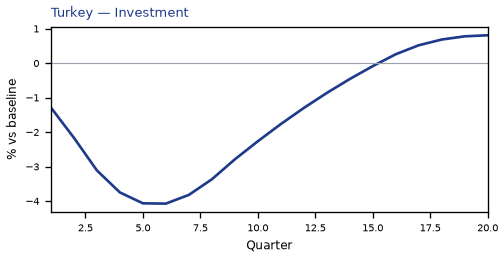

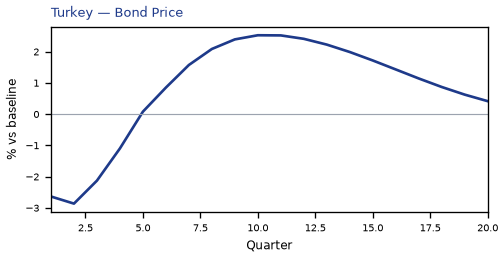

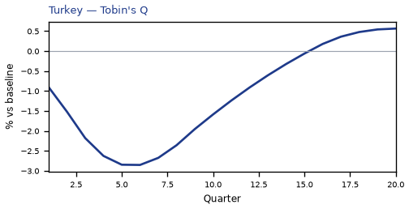

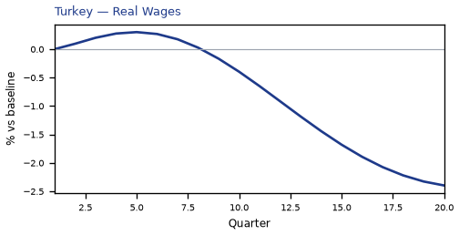

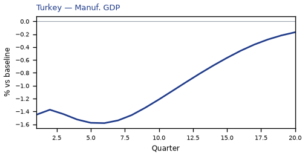


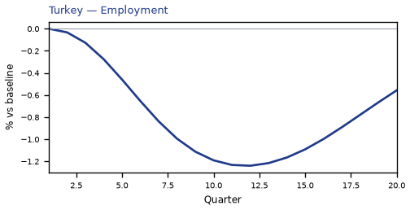

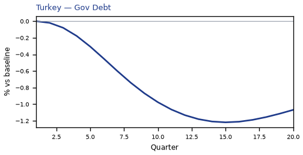

[Q1–Q20 JSON for Turkey](numbers/TR.json)

## MY — Malaysia

The main impact of a 250bp rise in the risk premium on Malaysia would be a large drop in GDP of 1.58% by Q7. Equities peak at -25.06% in Q1.

Demand and trade. Consumption peaks at -1.12 % vs baseline in Q8, from -0.02 in Q1 to -0.30 in Q20. Investment peaks at -4.11 % vs baseline in Q6, from -0.27 in Q1 to -0.50 in Q20. Net Exports peaks at +0.43 % vs baseline in Q1, from +0.43 in Q1 to +0.15 in Q20. Gov Spending peaks at +0.22 % vs baseline in Q7, from +0.00 in Q1 to +0.05 in Q20. Gov Debt peaks at -2.15 % vs baseline in Q17, from +0.00 in Q1 to -2.10 in Q20.

External / FX. The real exchange rate shows real depreciation (a weaker, more competitive home currency). Currency Strength peaks at +1.44 % vs baseline in Q1, from +1.44 in Q1 to +0.38 in Q20.

Labour. Employment peaks at -1.36 % vs baseline in Q12, from +0.00 in Q1 to -0.84 in Q20. Unemployment peaks at +0.32 pp in Q10, from +0.00 in Q1 to +0.14 in Q20. Real Wages peaks at -1.95 % vs baseline in Q20, from +0.00 in Q1 to -1.95 in Q20.

Prices. The three-year CPI impulse is -0.21 percentage points. CPI Inflation peaks at +0.47 pp in Q1, from +0.47 in Q1 to +0.01 in Q20. Domestic Infl. peaks at +0.33 pp in Q1, from +0.33 in Q1 to +0.00 in Q20. Marginal Cost peaks at -0.94 % vs baseline in Q7, from -0.00 in Q1 to -0.21 in Q20.

Financial conditions. Policy Rate peaks at -0.54 pp (annualized) in Q12, from +0.17 in Q1 to -0.29 in Q20. Govt 2Y Yield peaks at -0.50 pp (annualized) in Q9, from -0.06 in Q1 to -0.20 in Q20. Govt 5Y Yield peaks at -0.37 pp (annualized) in Q6, from -0.29 in Q1 to -0.14 in Q20. Govt 10Y Yield peaks at -0.24 pp (annualized) in Q6, from -0.21 in Q1 to -0.11 in Q20. Bond Price peaks at +2.24 % vs baseline in Q12, from -0.71 in Q1 to +1.20 in Q20. Equity Index peaks at -25.06 % vs baseline in Q1, from -25.06 in Q1 to -5.93 in Q20. Tobin's Q peaks at -2.88 % vs baseline in Q6, from -0.19 in Q1 to -0.35 in Q20. House Prices peaks at -1.78 % vs baseline in Q15, from -0.01 in Q1 to -1.59 in Q20. Bank Credit peaks at -0.37 % vs baseline in Q13, from +0.00 in Q1 to -0.29 in Q20. Credit Spread peaks at +0.00 pp in Q13, from +0.00 in Q1 to +0.00 in Q20.

Sectoral and capital. Manuf. GDP peaks at -0.70 % vs baseline in Q6, from -0.43 in Q1 to -0.21 in Q20. Services GDP peaks at -0.90 % vs baseline in Q7, from -0.00 in Q1 to -0.20 in Q20. Capital Stock peaks at -0.21 % vs baseline in Q20, from -0.00 in Q1 to -0.21 in Q20.

Timing. The GDP response has mostly faded by Q20 (Q20 is -0.35%).

These figures are model IRFs versus baseline, not forecasts.


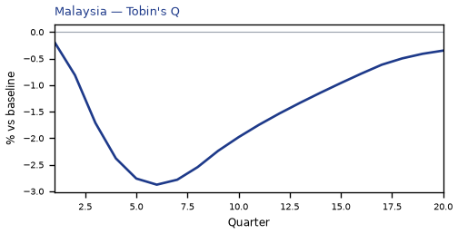

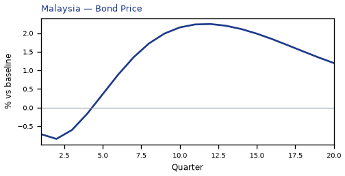

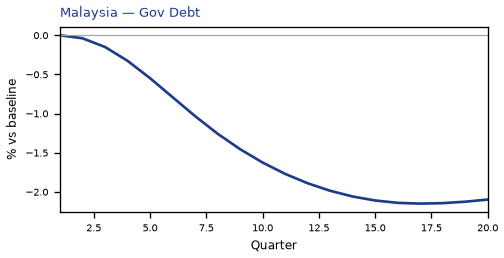

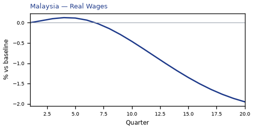

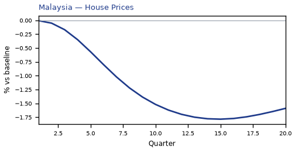

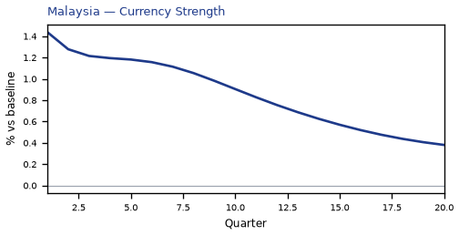

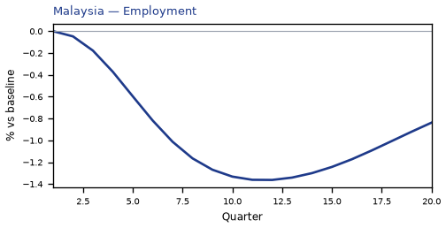


[Q1–Q20 JSON for Malaysia](numbers/MY.json)

## IN — India

The main impact of a 250bp rise in the risk premium on India would be a large drop in GDP of 1.57% by Q7. Equities peak at -25.07% in Q1.

Demand and trade. Consumption peaks at -0.94 % vs baseline in Q7, from -0.02 in Q1 to +0.04 in Q20. Investment peaks at -3.73 % vs baseline in Q5, from -0.31 in Q1 to +0.58 in Q20. Net Exports peaks at +0.43 % vs baseline in Q7, from +0.26 in Q1 to -0.01 in Q20. Gov Spending peaks at +0.26 % vs baseline in Q7, from +0.00 in Q1 to -0.02 in Q20. Gov Debt peaks at -1.84 % vs baseline in Q15, from +0.00 in Q1 to -1.68 in Q20.

External / FX. The real exchange rate shows real depreciation (a weaker, more competitive home currency). Currency Strength peaks at +2.40 % vs baseline in Q1, from +2.40 in Q1 to -0.13 in Q20.

Labour. Employment peaks at -0.98 % vs baseline in Q12, from +0.00 in Q1 to -0.58 in Q20. Unemployment peaks at +0.10 pp in Q8, from +0.00 in Q1 to -0.00 in Q20. Real Wages peaks at -2.22 % vs baseline in Q20, from +0.00 in Q1 to -2.22 in Q20.

Prices. The three-year CPI impulse is -1.17 percentage points. CPI Inflation peaks at +0.26 pp in Q1, from +0.26 in Q1 to +0.02 in Q20. Domestic Infl. peaks at +0.18 pp in Q1, from +0.18 in Q1 to +0.01 in Q20. Marginal Cost peaks at -0.94 % vs baseline in Q7, from -0.00 in Q1 to +0.08 in Q20.

Financial conditions. Policy Rate peaks at -0.92 pp (annualized) in Q10, from +0.20 in Q1 to -0.09 in Q20. Govt 2Y Yield peaks at -0.82 pp (annualized) in Q7, from -0.20 in Q1 to +0.06 in Q20. Govt 5Y Yield peaks at -0.46 pp (annualized) in Q4, from -0.43 in Q1 to +0.05 in Q20. Govt 10Y Yield peaks at -0.21 pp (annualized) in Q5, from -0.19 in Q1 to -0.01 in Q20. Bond Price peaks at +4.62 % vs baseline in Q10, from -0.99 in Q1 to +0.46 in Q20. Equity Index peaks at -25.07 % vs baseline in Q1, from -25.07 in Q1 to -4.57 in Q20. Tobin's Q peaks at -2.61 % vs baseline in Q5, from -0.22 in Q1 to +0.40 in Q20. House Prices peaks at -1.30 % vs baseline in Q12, from -0.01 in Q1 to -0.81 in Q20. Bank Credit peaks at -0.36 % vs baseline in Q13, from +0.00 in Q1 to -0.29 in Q20. Credit Spread peaks at +0.01 pp in Q13, from +0.00 in Q1 to +0.01 in Q20.

Sectoral and capital. Manuf. GDP peaks at -0.86 % vs baseline in Q6, from -0.72 in Q1 to +0.08 in Q20. Services GDP peaks at -0.86 % vs baseline in Q7, from -0.00 in Q1 to +0.08 in Q20. Capital Stock peaks at -0.14 % vs baseline in Q14, from -0.00 in Q1 to -0.13 in Q20.

Timing. The GDP response has mostly faded by Q15 (Q20 is +0.14%).

These figures are model IRFs versus baseline, not forecasts.


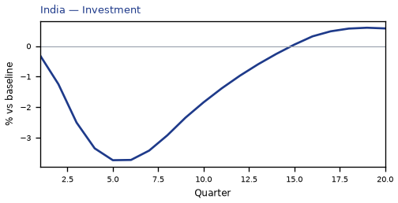

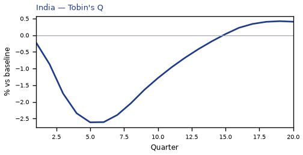

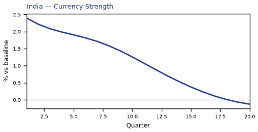

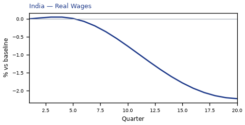

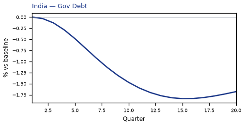

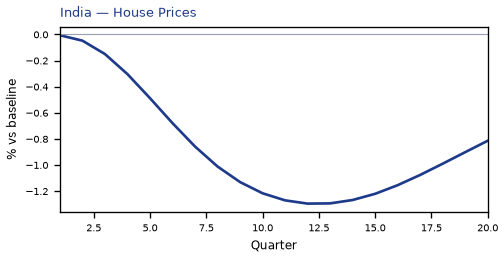

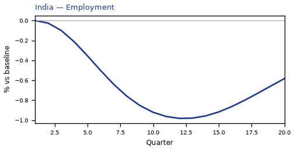


[Q1–Q20 JSON for India](numbers/IN.json)

## TH — Thailand

The main impact of a 250bp rise in the risk premium on Thailand would be a large drop in GDP of 1.52% by Q7. Equities peak at -25.05% in Q1.

Demand and trade. Consumption peaks at -0.99 % vs baseline in Q8, from -0.02 in Q1 to -0.23 in Q20. Investment peaks at -3.88 % vs baseline in Q6, from -0.22 in Q1 to -0.26 in Q20. Net Exports peaks at +0.33 % vs baseline in Q1, from +0.33 in Q1 to +0.05 in Q20. Gov Spending peaks at +0.26 % vs baseline in Q7, from +0.00 in Q1 to +0.05 in Q20. Gov Debt peaks at -1.78 % vs baseline in Q16, from +0.00 in Q1 to -1.65 in Q20.

External / FX. The real exchange rate shows real depreciation (a weaker, more competitive home currency). Currency Strength peaks at +1.31 % vs baseline in Q1, from +1.31 in Q1 to +0.18 in Q20.

Labour. Employment peaks at -1.35 % vs baseline in Q11, from +0.00 in Q1 to -0.72 in Q20. Unemployment peaks at +0.13 pp in Q9, from +0.00 in Q1 to +0.04 in Q20. Real Wages peaks at -2.00 % vs baseline in Q20, from +0.00 in Q1 to -2.00 in Q20.

Prices. The three-year CPI impulse is -0.42 percentage points. CPI Inflation peaks at +0.36 pp in Q1, from +0.36 in Q1 to +0.00 in Q20. Domestic Infl. peaks at +0.25 pp in Q1, from +0.25 in Q1 to +0.00 in Q20. Marginal Cost peaks at -0.91 % vs baseline in Q7, from -0.00 in Q1 to -0.16 in Q20.

Financial conditions. Policy Rate peaks at -0.61 pp (annualized) in Q11, from +0.14 in Q1 to -0.29 in Q20. Govt 2Y Yield peaks at -0.57 pp (annualized) in Q9, from -0.10 in Q1 to -0.18 in Q20. Govt 5Y Yield peaks at -0.40 pp (annualized) in Q6, from -0.34 in Q1 to -0.12 in Q20. Govt 10Y Yield peaks at -0.24 pp (annualized) in Q5, from -0.23 in Q1 to -0.09 in Q20. Bond Price peaks at +2.55 % vs baseline in Q11, from -0.58 in Q1 to +1.22 in Q20. Equity Index peaks at -25.05 % vs baseline in Q1, from -25.05 in Q1 to -5.66 in Q20. Tobin's Q peaks at -2.71 % vs baseline in Q6, from -0.16 in Q1 to -0.18 in Q20. House Prices peaks at -1.60 % vs baseline in Q14, from -0.00 in Q1 to -1.38 in Q20. Bank Credit peaks at -0.33 % vs baseline in Q13, from +0.00 in Q1 to -0.26 in Q20. Credit Spread peaks at +0.01 pp in Q13, from +0.00 in Q1 to +0.01 in Q20.

Sectoral and capital. Manuf. GDP peaks at -0.62 % vs baseline in Q6, from -0.39 in Q1 to -0.13 in Q20. Services GDP peaks at -0.84 % vs baseline in Q7, from -0.00 in Q1 to -0.15 in Q20. Capital Stock peaks at -0.19 % vs baseline in Q20, from -0.00 in Q1 to -0.19 in Q20.

Timing. The GDP response has mostly faded by Q19 (Q20 is -0.27%).

These figures are model IRFs versus baseline, not forecasts.


[Q1–Q20 JSON for Thailand](numbers/TH.json)

## SA — Saudi Arabia

The main impact of a 250bp rise in the risk premium on Saudi Arabia would be a large drop in GDP of 1.44% by Q7. Equities peak at -25.05% in Q1.

Demand and trade. Consumption peaks at -0.90 % vs baseline in Q8, from +0.00 in Q1 to -0.23 in Q20. Investment peaks at -3.37 % vs baseline in Q6, from +0.02 in Q1 to -0.68 in Q20. Net Exports peaks at -0.79 % vs baseline in Q8, from +0.00 in Q1 to +0.01 in Q20. Gov Spending peaks at -0.15 % vs baseline in Q9, from +0.00 in Q1 to +0.02 in Q20. Gov Debt peaks at -2.12 % vs baseline in Q20, from +0.00 in Q1 to -2.12 in Q20.

External / FX. The real exchange rate shows real depreciation (a weaker, more competitive home currency). Currency Strength peaks at +0.48 % vs baseline in Q17, from +0.00 in Q1 to +0.45 in Q20.

Labour. Employment peaks at -1.26 % vs baseline in Q11, from +0.00 in Q1 to -0.70 in Q20. Unemployment peaks at +0.48 pp in Q10, from +0.00 in Q1 to +0.22 in Q20. Real Wages peaks at -1.50 % vs baseline in Q20, from +0.00 in Q1 to -1.50 in Q20.

Prices. The three-year CPI impulse is -0.58 percentage points. CPI Inflation peaks at -0.08 pp in Q7, from +0.00 in Q1 to -0.00 in Q20. Domestic Infl. peaks at -0.06 pp in Q7, from +0.00 in Q1 to -0.00 in Q20. Marginal Cost peaks at -0.86 % vs baseline in Q7, from -0.00 in Q1 to -0.17 in Q20.

Financial conditions. Policy Rate peaks at -0.67 pp (annualized) in Q10, from -0.02 in Q1 to -0.06 in Q20. Govt 2Y Yield peaks at -0.60 pp (annualized) in Q7, from -0.29 in Q1 to +0.07 in Q20. Govt 5Y Yield peaks at -0.37 pp (annualized) in Q1, from -0.37 in Q1 to +0.10 in Q20. Govt 10Y Yield peaks at -0.13 pp (annualized) in Q1, from -0.13 in Q1 to +0.07 in Q20. Bond Price peaks at +3.35 % vs baseline in Q10, from -0.14 in Q1 to +0.48 in Q20. Equity Index peaks at -25.05 % vs baseline in Q1, from -25.05 in Q1 to -6.18 in Q20. Tobin's Q peaks at -2.36 % vs baseline in Q6, from +0.01 in Q1 to -0.47 in Q20. House Prices peaks at -1.35 % vs baseline in Q15, from -0.00 in Q1 to -1.20 in Q20. Bank Credit peaks at -0.33 % vs baseline in Q13, from +0.00 in Q1 to -0.26 in Q20. Credit Spread peaks at +0.01 pp in Q13, from +0.00 in Q1 to +0.01 in Q20.

Sectoral and capital. Manuf. GDP peaks at -0.23 % vs baseline in Q12, from -0.00 in Q1 to -0.17 in Q20. Services GDP peaks at -0.63 % vs baseline in Q7, from -0.00 in Q1 to -0.13 in Q20. Capital Stock peaks at -0.17 % vs baseline in Q20, from +0.00 in Q1 to -0.17 in Q20.

Timing. The GDP response has mostly faded by Q19 (Q20 is -0.29%).

These figures are model IRFs versus baseline, not forecasts.


[Q1–Q20 JSON for Saudi Arabia](numbers/SA.json)

## ID — Indonesia

The main impact of a 250bp rise in the risk premium on Indonesia would be a large drop in GDP of 1.34% by Q7. Equities peak at -25.05% in Q1.

Demand and trade. Consumption peaks at -0.80 % vs baseline in Q8, from -0.03 in Q1 to -0.02 in Q20. Investment peaks at -3.42 % vs baseline in Q6, from -0.33 in Q1 to +0.38 in Q20. Net Exports peaks at +0.34 % vs baseline in Q1, from +0.34 in Q1 to +0.00 in Q20. Gov Spending peaks at +0.21 % vs baseline in Q7, from +0.00 in Q1 to -0.01 in Q20. Gov Debt peaks at -1.54 % vs baseline in Q13, from +0.00 in Q1 to -1.13 in Q20.

External / FX. The real exchange rate shows real depreciation (a weaker, more competitive home currency). Currency Strength peaks at +3.12 % vs baseline in Q1, from +3.12 in Q1 to +0.12 in Q20.

Labour. Employment peaks at -0.92 % vs baseline in Q12, from +0.00 in Q1 to -0.54 in Q20. Unemployment peaks at +0.10 pp in Q9, from +0.00 in Q1 to +0.01 in Q20. Real Wages peaks at -1.98 % vs baseline in Q20, from +0.00 in Q1 to -1.98 in Q20.

Prices. The three-year CPI impulse is -0.85 percentage points. CPI Inflation peaks at +0.38 pp in Q1, from +0.38 in Q1 to +0.01 in Q20. Domestic Infl. peaks at +0.26 pp in Q1, from +0.26 in Q1 to +0.00 in Q20. Marginal Cost peaks at -0.80 % vs baseline in Q7, from -0.00 in Q1 to +0.02 in Q20.

Financial conditions. Policy Rate peaks at -0.65 pp (annualized) in Q11, from +0.21 in Q1 to -0.15 in Q20. Govt 2Y Yield peaks at -0.58 pp (annualized) in Q8, from -0.05 in Q1 to -0.03 in Q20. Govt 5Y Yield peaks at -0.35 pp (annualized) in Q5, from -0.30 in Q1 to -0.00 in Q20. Govt 10Y Yield peaks at -0.17 pp (annualized) in Q5, from -0.15 in Q1 to -0.02 in Q20. Bond Price peaks at +2.69 % vs baseline in Q11, from -0.88 in Q1 to +0.64 in Q20. Equity Index peaks at -25.05 % vs baseline in Q1, from -25.05 in Q1 to -4.91 in Q20. Tobin's Q peaks at -2.39 % vs baseline in Q6, from -0.23 in Q1 to +0.27 in Q20. House Prices peaks at -1.18 % vs baseline in Q13, from -0.01 in Q1 to -0.82 in Q20. Bank Credit peaks at -0.31 % vs baseline in Q13, from +0.00 in Q1 to -0.25 in Q20. Credit Spread peaks at +0.01 pp in Q13, from +0.00 in Q1 to +0.01 in Q20.

Sectoral and capital. Manuf. GDP peaks at -0.94 % vs baseline in Q1, from -0.94 in Q1 to -0.02 in Q20. Services GDP peaks at -0.67 % vs baseline in Q7, from -0.00 in Q1 to +0.02 in Q20. Capital Stock peaks at -0.14 % vs baseline in Q15, from -0.00 in Q1 to -0.13 in Q20.

Timing. The GDP response has mostly faded by Q16 (Q20 is +0.04%).

These figures are model IRFs versus baseline, not forecasts.


[Q1–Q20 JSON for Indonesia](numbers/ID.json)

## MX — Mexico

The main impact of a 250bp rise in the risk premium on Mexico would be a large drop in GDP of 1.33% by Q7. Equities peak at -25.07% in Q1.

Demand and trade. Consumption peaks at -0.78 % vs baseline in Q8, from -0.12 in Q1 to -0.04 in Q20. Investment peaks at -3.42 % vs baseline in Q5, from -1.27 in Q1 to +0.30 in Q20. Net Exports peaks at +0.71 % vs baseline in Q1, from +0.71 in Q1 to +0.07 in Q20. Gov Spending peaks at +0.19 % vs baseline in Q7, from +0.00 in Q1 to -0.01 in Q20. Gov Debt peaks at -1.42 % vs baseline in Q14, from +0.00 in Q1 to -1.20 in Q20.

External / FX. The real exchange rate shows real depreciation (a weaker, more competitive home currency). Currency Strength peaks at +3.75 % vs baseline in Q1, from +3.75 in Q1 to +0.54 in Q20.

Labour. Employment peaks at -1.05 % vs baseline in Q12, from +0.00 in Q1 to -0.52 in Q20. Unemployment peaks at +0.11 pp in Q9, from +0.00 in Q1 to +0.01 in Q20. Real Wages peaks at -1.61 % vs baseline in Q20, from +0.00 in Q1 to -1.61 in Q20.

Prices. The three-year CPI impulse is -0.11 percentage points. CPI Inflation peaks at +0.93 pp in Q1, from +0.93 in Q1 to -0.01 in Q20. Domestic Infl. peaks at +0.65 pp in Q1, from +0.65 in Q1 to -0.01 in Q20. Marginal Cost peaks at -0.80 % vs baseline in Q7, from -0.00 in Q1 to +0.01 in Q20.

Financial conditions. Policy Rate peaks at +0.90 pp (annualized) in Q2, from +0.83 in Q1 to -0.15 in Q20. Govt 2Y Yield peaks at -0.55 pp (annualized) in Q8, from +0.20 in Q1 to -0.05 in Q20. Govt 5Y Yield peaks at -0.33 pp (annualized) in Q6, from -0.18 in Q1 to -0.03 in Q20. Govt 10Y Yield peaks at -0.17 pp (annualized) in Q6, from -0.10 in Q1 to -0.03 in Q20. Bond Price peaks at -3.73 % vs baseline in Q2, from -3.47 in Q1 to +0.62 in Q20. Equity Index peaks at -25.07 % vs baseline in Q1, from -25.07 in Q1 to -4.92 in Q20. Tobin's Q peaks at -2.39 % vs baseline in Q5, from -0.89 in Q1 to +0.21 in Q20. House Prices peaks at -1.28 % vs baseline in Q13, from -0.02 in Q1 to -0.91 in Q20. Bank Credit peaks at -0.31 % vs baseline in Q13, from +0.00 in Q1 to -0.24 in Q20. Credit Spread peaks at +0.02 pp in Q13, from +0.00 in Q1 to +0.01 in Q20.

Sectoral and capital. Manuf. GDP peaks at -1.13 % vs baseline in Q1, from -1.13 in Q1 to -0.15 in Q20. Services GDP peaks at -0.81 % vs baseline in Q7, from -0.00 in Q1 to +0.01 in Q20. Capital Stock peaks at -0.16 % vs baseline in Q16, from -0.01 in Q1 to -0.15 in Q20.

Timing. The GDP response has mostly faded by Q16 (Q20 is +0.01%).

These figures are model IRFs versus baseline, not forecasts.


[Q1–Q20 JSON for Mexico](numbers/MX.json)

## BR — Brazil

The main impact of a 250bp rise in the risk premium on Brazil would be a large drop in GDP of 1.27% by Q7. Equities peak at -25.08% in Q1.

Demand and trade. Consumption peaks at -0.68 % vs baseline in Q8, from -0.05 in Q1 to +0.18 in Q20. Investment peaks at -2.99 % vs baseline in Q5, from -0.53 in Q1 to +1.07 in Q20. Net Exports peaks at +0.26 % vs baseline in Q1, from +0.26 in Q1 to -0.08 in Q20. Gov Spending peaks at +0.21 % vs baseline in Q7, from +0.00 in Q1 to -0.09 in Q20. Gov Debt peaks at -0.22 % vs baseline in Q14, from +0.00 in Q1 to -0.16 in Q20.

External / FX. The real exchange rate shows real depreciation (a weaker, more competitive home currency). Currency Strength peaks at +3.69 % vs baseline in Q1, from +3.69 in Q1 to -0.15 in Q20.

Labour. Employment peaks at -0.93 % vs baseline in Q11, from +0.00 in Q1 to -0.19 in Q20. Unemployment peaks at +0.23 pp in Q9, from +0.00 in Q1 to -0.04 in Q20. Real Wages peaks at -1.57 % vs baseline in Q20, from +0.00 in Q1 to -1.57 in Q20.

Prices. The three-year CPI impulse is -0.59 percentage points. CPI Inflation peaks at +0.28 pp in Q1, from +0.28 in Q1 to +0.01 in Q20. Domestic Infl. peaks at +0.20 pp in Q1, from +0.20 in Q1 to +0.01 in Q20. Marginal Cost peaks at -0.76 % vs baseline in Q7, from -0.00 in Q1 to +0.22 in Q20.

Financial conditions. Policy Rate peaks at -0.82 pp (annualized) in Q10, from +0.34 in Q1 to -0.00 in Q20. Govt 2Y Yield peaks at -0.71 pp (annualized) in Q7, from -0.10 in Q1 to +0.12 in Q20. Govt 5Y Yield peaks at -0.36 pp (annualized) in Q4, from -0.32 in Q1 to +0.10 in Q20. Govt 10Y Yield peaks at -0.14 pp (annualized) in Q5, from -0.11 in Q1 to +0.05 in Q20. Bond Price peaks at +3.41 % vs baseline in Q10, from -1.42 in Q1 to +0.14 in Q20. Equity Index peaks at -25.08 % vs baseline in Q1, from -25.08 in Q1 to -4.17 in Q20. Tobin's Q peaks at -2.09 % vs baseline in Q5, from -0.37 in Q1 to +0.75 in Q20. House Prices peaks at -0.96 % vs baseline in Q12, from -0.01 in Q1 to -0.40 in Q20. Bank Credit peaks at -0.26 % vs baseline in Q13, from +0.00 in Q1 to -0.21 in Q20. Credit Spread peaks at +0.01 pp in Q13, from +0.00 in Q1 to +0.01 in Q20.

Sectoral and capital. Manuf. GDP peaks at -1.11 % vs baseline in Q1, from -1.11 in Q1 to +0.12 in Q20. Services GDP peaks at -0.84 % vs baseline in Q7, from -0.00 in Q1 to +0.24 in Q20. Capital Stock peaks at -0.11 % vs baseline in Q13, from -0.00 in Q1 to -0.08 in Q20.

Timing. The GDP response has mostly faded by Q14 (Q20 is +0.37%).

These figures are model IRFs versus baseline, not forecasts.


[Q1–Q20 JSON for Brazil](numbers/BR.json)

## CO — Colombia

The main impact of a 250bp rise in the risk premium on Colombia would be a large drop in GDP of 1.25% by Q7. Equities peak at -25.06% in Q1.

Demand and trade. Consumption peaks at -0.74 % vs baseline in Q8, from -0.06 in Q1 to +0.02 in Q20. Investment peaks at -3.16 % vs baseline in Q5, from -0.62 in Q1 to +0.45 in Q20. Net Exports peaks at +0.45 % vs baseline in Q1, from +0.45 in Q1 to +0.00 in Q20. Gov Spending peaks at +0.18 % vs baseline in Q7, from +0.00 in Q1 to -0.02 in Q20. Gov Debt peaks at -1.24 % vs baseline in Q14, from +0.00 in Q1 to -1.03 in Q20.

External / FX. The real exchange rate shows real depreciation (a weaker, more competitive home currency). Currency Strength peaks at +4.06 % vs baseline in Q1, from +4.06 in Q1 to +0.27 in Q20.

Labour. Employment peaks at -1.01 % vs baseline in Q11, from +0.00 in Q1 to -0.39 in Q20. Unemployment peaks at +0.10 pp in Q9, from +0.00 in Q1 to +0.00 in Q20. Real Wages peaks at -1.68 % vs baseline in Q20, from +0.00 in Q1 to -1.68 in Q20.

Prices. The three-year CPI impulse is -0.51 percentage points. CPI Inflation peaks at +0.54 pp in Q1, from +0.54 in Q1 to +0.00 in Q20. Domestic Infl. peaks at +0.38 pp in Q1, from +0.38 in Q1 to +0.00 in Q20. Marginal Cost peaks at -0.75 % vs baseline in Q7, from -0.00 in Q1 to +0.06 in Q20.

Financial conditions. Policy Rate peaks at -0.62 pp (annualized) in Q10, from +0.40 in Q1 to -0.09 in Q20. Govt 2Y Yield peaks at -0.54 pp (annualized) in Q7, from +0.03 in Q1 to +0.01 in Q20. Govt 5Y Yield peaks at -0.30 pp (annualized) in Q5, from -0.23 in Q1 to +0.02 in Q20. Govt 10Y Yield peaks at -0.14 pp (annualized) in Q5, from -0.10 in Q1 to -0.00 in Q20. Bond Price peaks at +2.21 % vs baseline in Q10, from -1.44 in Q1 to +0.31 in Q20. Equity Index peaks at -25.06 % vs baseline in Q1, from -25.06 in Q1 to -4.77 in Q20. Tobin's Q peaks at -2.21 % vs baseline in Q5, from -0.43 in Q1 to +0.31 in Q20. House Prices peaks at -1.08 % vs baseline in Q13, from -0.01 in Q1 to -0.70 in Q20. Bank Credit peaks at -0.24 % vs baseline in Q13, from +0.00 in Q1 to -0.19 in Q20. Credit Spread peaks at +0.01 pp in Q13, from +0.00 in Q1 to +0.01 in Q20.

Sectoral and capital. Manuf. GDP peaks at -1.22 % vs baseline in Q1, from -1.22 in Q1 to -0.06 in Q20. Services GDP peaks at -0.76 % vs baseline in Q7, from -0.00 in Q1 to +0.06 in Q20. Capital Stock peaks at -0.13 % vs baseline in Q15, from -0.00 in Q1 to -0.12 in Q20.

Timing. The GDP response has mostly faded by Q15 (Q20 is +0.10%).

These figures are model IRFs versus baseline, not forecasts.


[Q1–Q20 JSON for Colombia](numbers/CO.json)

## KR — South Korea

The main impact of a 250bp rise in the risk premium on South Korea would be a large drop in GDP of 1.24% by Q7. Equities peak at -25.06% in Q1.

Demand and trade. Consumption peaks at -0.77 % vs baseline in Q7, from -0.02 in Q1 to -0.04 in Q20. Investment peaks at -3.02 % vs baseline in Q6, from -0.18 in Q1 to +0.30 in Q20. Net Exports peaks at +0.56 % vs baseline in Q7, from +0.18 in Q1 to -0.03 in Q20. Gov Spending peaks at +0.22 % vs baseline in Q7, from +0.00 in Q1 to +0.00 in Q20. Gov Debt peaks at -0.57 % vs baseline in Q15, from +0.00 in Q1 to -0.50 in Q20.

External / FX. The real exchange rate shows real depreciation (a weaker, more competitive home currency). Currency Strength peaks at +0.97 % vs baseline in Q1, from +0.97 in Q1 to -0.41 in Q20.

Labour. Employment peaks at -0.97 % vs baseline in Q11, from +0.00 in Q1 to -0.39 in Q20. Unemployment peaks at +0.41 pp in Q10, from +0.00 in Q1 to +0.10 in Q20. Real Wages peaks at -1.52 % vs baseline in Q20, from +0.00 in Q1 to -1.52 in Q20.

Prices. The three-year CPI impulse is -0.45 percentage points. CPI Inflation peaks at +0.18 pp in Q1, from +0.18 in Q1 to -0.00 in Q20. Domestic Infl. peaks at +0.13 pp in Q1, from +0.13 in Q1 to -0.00 in Q20. Marginal Cost peaks at -0.74 % vs baseline in Q7, from -0.00 in Q1 to -0.00 in Q20.

Financial conditions. Policy Rate peaks at -0.60 pp (annualized) in Q11, from +0.11 in Q1 to -0.18 in Q20. Govt 2Y Yield peaks at -0.55 pp (annualized) in Q8, from -0.15 in Q1 to -0.07 in Q20. Govt 5Y Yield peaks at -0.36 pp (annualized) in Q5, from -0.33 in Q1 to -0.02 in Q20. Govt 10Y Yield peaks at -0.18 pp (annualized) in Q4, from -0.17 in Q1 to -0.01 in Q20. Bond Price peaks at +3.02 % vs baseline in Q11, from -0.55 in Q1 to +0.92 in Q20. Equity Index peaks at -25.06 % vs baseline in Q1, from -25.06 in Q1 to -4.96 in Q20. Tobin's Q peaks at -2.11 % vs baseline in Q6, from -0.12 in Q1 to +0.21 in Q20. House Prices peaks at -0.92 % vs baseline in Q14, from -0.00 in Q1 to -0.74 in Q20. Bank Credit peaks at -0.33 % vs baseline in Q13, from +0.00 in Q1 to -0.26 in Q20. Credit Spread peaks at +0.00 pp in Q13, from +0.00 in Q1 to +0.00 in Q20.

Sectoral and capital. Manuf. GDP peaks at -0.36 % vs baseline in Q5, from -0.29 in Q1 to +0.13 in Q20. Services GDP peaks at -0.75 % vs baseline in Q7, from -0.00 in Q1 to -0.00 in Q20. Capital Stock peaks at -0.12 % vs baseline in Q16, from -0.00 in Q1 to -0.12 in Q20.

Timing. The GDP response has mostly faded by Q16 (Q20 is -0.01%).

These figures are model IRFs versus baseline, not forecasts.


[Q1–Q20 JSON for South Korea](numbers/KR.json)

## CL — Chile

The main impact of a 250bp rise in the risk premium on Chile would be a large drop in GDP of 1.20% by Q7. Equities peak at -25.07% in Q1.

Demand and trade. Consumption peaks at -0.74 % vs baseline in Q8, from -0.06 in Q1 to -0.01 in Q20. Investment peaks at -3.06 % vs baseline in Q6, from -0.60 in Q1 to +0.33 in Q20. Net Exports peaks at +0.41 % vs baseline in Q1, from +0.41 in Q1 to -0.07 in Q20. Gov Spending peaks at +0.10 % vs baseline in Q6, from +0.00 in Q1 to -0.03 in Q20. Gov Debt peaks at -0.83 % vs baseline in Q13, from +0.00 in Q1 to -0.61 in Q20.

External / FX. The real exchange rate shows real depreciation (a weaker, more competitive home currency). Currency Strength peaks at +2.75 % vs baseline in Q1, from +2.75 in Q1 to +0.07 in Q20.

Labour. Employment peaks at -1.03 % vs baseline in Q11, from +0.00 in Q1 to -0.34 in Q20. Unemployment peaks at +0.36 pp in Q10, from +0.00 in Q1 to +0.06 in Q20. Real Wages peaks at -1.58 % vs baseline in Q20, from +0.00 in Q1 to -1.58 in Q20.

Prices. The three-year CPI impulse is -0.52 percentage points. CPI Inflation peaks at +0.54 pp in Q1, from +0.54 in Q1 to +0.01 in Q20. Domestic Infl. peaks at +0.38 pp in Q1, from +0.38 in Q1 to +0.01 in Q20. Marginal Cost peaks at -0.72 % vs baseline in Q7, from -0.00 in Q1 to +0.02 in Q20.

Financial conditions. Policy Rate peaks at -0.56 pp (annualized) in Q11, from +0.39 in Q1 to -0.12 in Q20. Govt 2Y Yield peaks at -0.50 pp (annualized) in Q8, from +0.04 in Q1 to -0.01 in Q20. Govt 5Y Yield peaks at -0.29 pp (annualized) in Q5, from -0.22 in Q1 to +0.01 in Q20. Govt 10Y Yield peaks at -0.14 pp (annualized) in Q5, from -0.10 in Q1 to -0.01 in Q20. Bond Price peaks at +2.35 % vs baseline in Q11, from -1.61 in Q1 to +0.48 in Q20. Equity Index peaks at -25.07 % vs baseline in Q1, from -25.07 in Q1 to -4.85 in Q20. Tobin's Q peaks at -2.14 % vs baseline in Q6, from -0.42 in Q1 to +0.23 in Q20. House Prices peaks at -1.09 % vs baseline in Q13, from -0.01 in Q1 to -0.75 in Q20. Bank Credit peaks at -0.25 % vs baseline in Q13, from +0.00 in Q1 to -0.19 in Q20. Credit Spread peaks at +0.01 pp in Q13, from +0.00 in Q1 to +0.00 in Q20.

Sectoral and capital. Manuf. GDP peaks at -0.83 % vs baseline in Q1, from -0.83 in Q1 to -0.01 in Q20. Services GDP peaks at -0.73 % vs baseline in Q7, from -0.00 in Q1 to +0.02 in Q20. Capital Stock peaks at -0.13 % vs baseline in Q15, from -0.00 in Q1 to -0.12 in Q20.

Timing. The GDP response has mostly faded by Q16 (Q20 is +0.04%).

These figures are model IRFs versus baseline, not forecasts.


[Q1–Q20 JSON for Chile](numbers/CL.json)

## NL — Netherlands

The main impact of a 250bp rise in the risk premium on Netherlands would be a large drop in GDP of 1.17% by Q7. Equities peak at -25.05% in Q1.

Demand and trade. Consumption peaks at -0.69 % vs baseline in Q8, from -0.01 in Q1 to -0.13 in Q20. Investment peaks at -3.30 % vs baseline in Q7, from -0.07 in Q1 to -0.39 in Q20. Net Exports peaks at +0.17 % vs baseline in Q4, from +0.16 in Q1 to -0.07 in Q20. Gov Spending peaks at +0.24 % vs baseline in Q7, from +0.00 in Q1 to +0.04 in Q20. Gov Debt peaks at +0.20 % vs baseline in Q15, from +0.00 in Q1 to +0.18 in Q20.

External / FX. The real exchange rate shows real depreciation (a weaker, more competitive home currency). Currency Strength peaks at +0.60 % vs baseline in Q1, from +0.60 in Q1 to -0.29 in Q20.

Labour. Employment peaks at -0.88 % vs baseline in Q12, from +0.00 in Q1 to -0.54 in Q20. Unemployment peaks at +0.67 pp in Q11, from +0.00 in Q1 to +0.32 in Q20. Real Wages peaks at -1.11 % vs baseline in Q20, from +0.00 in Q1 to -1.11 in Q20.

Prices. The three-year CPI impulse is -0.47 percentage points. CPI Inflation peaks at +0.20 pp in Q1, from +0.20 in Q1 to +0.01 in Q20. Domestic Infl. peaks at +0.14 pp in Q1, from +0.14 in Q1 to +0.01 in Q20. Marginal Cost peaks at -0.70 % vs baseline in Q7, from -0.00 in Q1 to -0.11 in Q20.

Financial conditions. Policy Rate peaks at -0.08 pp (annualized) in Q14, from +0.04 in Q1 to -0.06 in Q20. Govt 2Y Yield peaks at -0.07 pp (annualized) in Q12, from +0.03 in Q1 to -0.05 in Q20. Govt 5Y Yield peaks at -0.06 pp (annualized) in Q9, from -0.03 in Q1 to -0.03 in Q20. Govt 10Y Yield peaks at -0.04 pp (annualized) in Q7, from -0.03 in Q1 to -0.02 in Q20. Bond Price peaks at +0.93 % vs baseline in Q11, from -0.30 in Q1 to +0.43 in Q20. Equity Index peaks at -25.05 % vs baseline in Q1, from -25.05 in Q1 to -5.52 in Q20. Tobin's Q peaks at -2.31 % vs baseline in Q7, from -0.05 in Q1 to -0.27 in Q20. House Prices peaks at -1.04 % vs baseline in Q15, from -0.00 in Q1 to -0.96 in Q20. Bank Credit peaks at -0.44 % vs baseline in Q13, from +0.00 in Q1 to -0.34 in Q20. Credit Spread peaks at +0.00 pp in Q13, from +0.00 in Q1 to +0.00 in Q20.

Sectoral and capital. Manuf. GDP peaks at -0.26 % vs baseline in Q6, from -0.18 in Q1 to +0.06 in Q20. Services GDP peaks at -0.87 % vs baseline in Q7, from -0.00 in Q1 to -0.14 in Q20. Capital Stock peaks at -0.17 % vs baseline in Q20, from -0.00 in Q1 to -0.17 in Q20.

Timing. The GDP response has mostly faded by Q18 (Q20 is -0.19%).

These figures are model IRFs versus baseline, not forecasts.


[Q1–Q20 JSON for Netherlands](numbers/NL.json)

## PL — Poland

The main impact of a 250bp rise in the risk premium on Poland would be a large drop in GDP of 1.14% by Q7. Equities peak at -25.06% in Q1.

Demand and trade. Consumption peaks at -0.60 % vs baseline in Q8, from -0.04 in Q1 to -0.06 in Q20. Investment peaks at -3.02 % vs baseline in Q6, from -0.33 in Q1 to +0.02 in Q20. Net Exports peaks at +0.41 % vs baseline in Q7, from +0.30 in Q1 to -0.00 in Q20. Gov Spending peaks at +0.23 % vs baseline in Q7, from +0.00 in Q1 to +0.01 in Q20. Gov Debt peaks at +0.00 % vs baseline in Q1, from +0.00 in Q1 to +0.00 in Q20.

External / FX. The real exchange rate shows real depreciation (a weaker, more competitive home currency). Currency Strength peaks at +1.41 % vs baseline in Q1, from +1.41 in Q1 to -0.13 in Q20.

Labour. Employment peaks at -0.96 % vs baseline in Q11, from +0.00 in Q1 to -0.41 in Q20. Unemployment peaks at +0.39 pp in Q10, from +0.00 in Q1 to +0.12 in Q20. Real Wages peaks at -1.34 % vs baseline in Q20, from +0.00 in Q1 to -1.34 in Q20.

Prices. The three-year CPI impulse is -0.35 percentage points. CPI Inflation peaks at +0.36 pp in Q1, from +0.36 in Q1 to -0.01 in Q20. Domestic Infl. peaks at +0.25 pp in Q1, from +0.25 in Q1 to -0.00 in Q20. Marginal Cost peaks at -0.68 % vs baseline in Q7, from -0.00 in Q1 to -0.04 in Q20.

Financial conditions. Policy Rate peaks at -0.35 pp (annualized) in Q11, from +0.21 in Q1 to -0.10 in Q20. Govt 2Y Yield peaks at -0.31 pp (annualized) in Q8, from +0.01 in Q1 to -0.04 in Q20. Govt 5Y Yield peaks at -0.19 pp (annualized) in Q5, from -0.14 in Q1 to -0.01 in Q20. Govt 10Y Yield peaks at -0.10 pp (annualized) in Q5, from -0.08 in Q1 to -0.01 in Q20. Bond Price peaks at +1.45 % vs baseline in Q11, from -0.89 in Q1 to +0.40 in Q20. Equity Index peaks at -25.06 % vs baseline in Q1, from -25.06 in Q1 to -5.05 in Q20. Tobin's Q peaks at -2.11 % vs baseline in Q6, from -0.23 in Q1 to +0.01 in Q20. House Prices peaks at -0.90 % vs baseline in Q14, from -0.00 in Q1 to -0.77 in Q20. Bank Credit peaks at -0.27 % vs baseline in Q13, from +0.00 in Q1 to -0.22 in Q20. Credit Spread peaks at +0.01 pp in Q13, from +0.00 in Q1 to +0.01 in Q20.

Sectoral and capital. Manuf. GDP peaks at -0.42 % vs baseline in Q1, from -0.42 in Q1 to +0.03 in Q20. Services GDP peaks at -0.72 % vs baseline in Q7, from -0.00 in Q1 to -0.04 in Q20. Capital Stock peaks at -0.14 % vs baseline in Q19, from -0.00 in Q1 to -0.14 in Q20.

Timing. The GDP response has mostly faded by Q16 (Q20 is -0.06%).

These figures are model IRFs versus baseline, not forecasts.


[Q1–Q20 JSON for Poland](numbers/PL.json)

## ZA — South Africa

The main impact of a 250bp rise in the risk premium on South Africa would be a large drop in GDP of 1.14% by Q7. Equities peak at -25.08% in Q1.

Demand and trade. Consumption peaks at -0.65 % vs baseline in Q8, from -0.06 in Q1 to +0.02 in Q20. Investment peaks at -2.93 % vs baseline in Q6, from -0.63 in Q1 to +0.40 in Q20. Net Exports peaks at +0.45 % vs baseline in Q1, from +0.45 in Q1 to -0.06 in Q20. Gov Spending peaks at +0.17 % vs baseline in Q7, from +0.00 in Q1 to -0.02 in Q20. Gov Debt peaks at -0.70 % vs baseline in Q15, from +0.00 in Q1 to -0.62 in Q20.

External / FX. The real exchange rate shows real depreciation (a weaker, more competitive home currency). Currency Strength peaks at +3.22 % vs baseline in Q1, from +3.22 in Q1 to -0.10 in Q20.

Labour. Employment peaks at -0.98 % vs baseline in Q11, from +0.00 in Q1 to -0.32 in Q20. Unemployment peaks at +0.23 pp in Q9, from +0.00 in Q1 to +0.03 in Q20. Real Wages peaks at -1.48 % vs baseline in Q20, from +0.00 in Q1 to -1.48 in Q20.

Prices. The three-year CPI impulse is -0.35 percentage points. CPI Inflation peaks at +0.54 pp in Q1, from +0.54 in Q1 to -0.00 in Q20. Domestic Infl. peaks at +0.38 pp in Q1, from +0.38 in Q1 to -0.00 in Q20. Marginal Cost peaks at -0.68 % vs baseline in Q7, from -0.00 in Q1 to +0.05 in Q20.

Financial conditions. Policy Rate peaks at -0.49 pp (annualized) in Q10, from +0.41 in Q1 to -0.09 in Q20. Govt 2Y Yield peaks at -0.43 pp (annualized) in Q8, from +0.07 in Q1 to -0.01 in Q20. Govt 5Y Yield peaks at -0.25 pp (annualized) in Q5, from -0.17 in Q1 to +0.01 in Q20. Govt 10Y Yield peaks at -0.11 pp (annualized) in Q6, from -0.08 in Q1 to +0.00 in Q20. Bond Price peaks at +2.04 % vs baseline in Q10, from -1.69 in Q1 to +0.36 in Q20. Equity Index peaks at -25.08 % vs baseline in Q1, from -25.08 in Q1 to -4.62 in Q20. Tobin's Q peaks at -2.05 % vs baseline in Q6, from -0.44 in Q1 to +0.28 in Q20. House Prices peaks at -1.02 % vs baseline in Q13, from -0.01 in Q1 to -0.67 in Q20. Bank Credit peaks at -0.27 % vs baseline in Q13, from +0.00 in Q1 to -0.22 in Q20. Credit Spread peaks at +0.01 pp in Q13, from +0.00 in Q1 to +0.01 in Q20.

Sectoral and capital. Manuf. GDP peaks at -0.97 % vs baseline in Q1, from -0.97 in Q1 to +0.05 in Q20. Services GDP peaks at -0.73 % vs baseline in Q7, from -0.00 in Q1 to +0.05 in Q20. Capital Stock peaks at -0.13 % vs baseline in Q15, from -0.00 in Q1 to -0.12 in Q20.

Timing. The GDP response has mostly faded by Q15 (Q20 is +0.08%).

These figures are model IRFs versus baseline, not forecasts.


[Q1–Q20 JSON for South Africa](numbers/ZA.json)

## DE — Germany

The main impact of a 250bp rise in the risk premium on Germany would be a large drop in GDP of 1.11% by Q7. Equities peak at -25.04% in Q1.

Demand and trade. Consumption peaks at -0.64 % vs baseline in Q8, from -0.01 in Q1 to -0.10 in Q20. Investment peaks at -3.15 % vs baseline in Q7, from -0.07 in Q1 to -0.29 in Q20. Net Exports peaks at +0.36 % vs baseline in Q7, from +0.11 in Q1 to -0.02 in Q20. Gov Spending peaks at +0.25 % vs baseline in Q7, from +0.00 in Q1 to +0.03 in Q20. Gov Debt peaks at +0.13 % vs baseline in Q16, from +0.00 in Q1 to +0.13 in Q20.

External / FX. The real exchange rate shows real depreciation (a weaker, more competitive home currency). Currency Strength peaks at +0.60 % vs baseline in Q1, from +0.60 in Q1 to -0.33 in Q20.

Labour. Employment peaks at -0.89 % vs baseline in Q11, from +0.00 in Q1 to -0.46 in Q20. Unemployment peaks at +0.63 pp in Q11, from +0.00 in Q1 to +0.28 in Q20. Real Wages peaks at -1.13 % vs baseline in Q20, from +0.00 in Q1 to -1.13 in Q20.

Prices. The three-year CPI impulse is -0.54 percentage points. CPI Inflation peaks at +0.12 pp in Q1, from +0.12 in Q1 to +0.01 in Q20. Domestic Infl. peaks at +0.09 pp in Q1, from +0.09 in Q1 to +0.01 in Q20. Marginal Cost peaks at -0.67 % vs baseline in Q7, from -0.00 in Q1 to -0.09 in Q20.

Financial conditions. Policy Rate peaks at -0.08 pp (annualized) in Q14, from +0.04 in Q1 to -0.06 in Q20. Govt 2Y Yield peaks at -0.07 pp (annualized) in Q12, from +0.03 in Q1 to -0.05 in Q20. Govt 5Y Yield peaks at -0.06 pp (annualized) in Q9, from -0.03 in Q1 to -0.03 in Q20. Govt 10Y Yield peaks at -0.04 pp (annualized) in Q7, from -0.03 in Q1 to -0.02 in Q20. Bond Price peaks at +0.99 % vs baseline in Q11, from -0.30 in Q1 to +0.43 in Q20. Equity Index peaks at -25.04 % vs baseline in Q1, from -25.04 in Q1 to -5.32 in Q20. Tobin's Q peaks at -2.20 % vs baseline in Q7, from -0.05 in Q1 to -0.20 in Q20. House Prices peaks at -0.90 % vs baseline in Q15, from -0.00 in Q1 to -0.82 in Q20. Bank Credit peaks at -0.40 % vs baseline in Q13, from +0.00 in Q1 to -0.31 in Q20. Credit Spread peaks at +0.00 pp in Q13, from +0.00 in Q1 to +0.00 in Q20.

Sectoral and capital. Manuf. GDP peaks at -0.23 % vs baseline in Q5, from -0.18 in Q1 to +0.06 in Q20. Services GDP peaks at -0.76 % vs baseline in Q7, from -0.00 in Q1 to -0.10 in Q20. Capital Stock peaks at -0.16 % vs baseline in Q20, from -0.00 in Q1 to -0.16 in Q20.

Timing. The GDP response has mostly faded by Q18 (Q20 is -0.15%).

These figures are model IRFs versus baseline, not forecasts.


[Q1–Q20 JSON for Germany](numbers/DE.json)

## CH — Switzerland

The main impact of a 250bp rise in the risk premium on Switzerland would be a large drop in GDP of 1.11% by Q7. Equities peak at -25.04% in Q1.

Demand and trade. Consumption peaks at -0.78 % vs baseline in Q8, from +0.01 in Q1 to -0.13 in Q20. Investment peaks at -2.79 % vs baseline in Q7, from +0.08 in Q1 to -0.17 in Q20. Net Exports peaks at -0.28 % vs baseline in Q1, from -0.28 in Q1 to -0.06 in Q20. Gov Spending peaks at +0.22 % vs baseline in Q7, from +0.00 in Q1 to +0.03 in Q20. Gov Debt peaks at -0.43 % vs baseline in Q14, from +0.00 in Q1 to -0.35 in Q20.

External / FX. The real exchange rate shows real appreciation (a stronger home currency). Currency Strength peaks at -1.42 % vs baseline in Q1, from -1.42 in Q1 to -0.40 in Q20.

Labour. Employment peaks at -0.95 % vs baseline in Q10, from +0.00 in Q1 to -0.37 in Q20. Unemployment peaks at +0.63 pp in Q11, from +0.00 in Q1 to +0.28 in Q20. Real Wages peaks at -0.83 % vs baseline in Q20, from +0.00 in Q1 to -0.83 in Q20.

Prices. The three-year CPI impulse is -0.69 percentage points. CPI Inflation peaks at -0.26 pp in Q1, from -0.26 in Q1 to +0.03 in Q20. Domestic Infl. peaks at -0.18 pp in Q1, from -0.18 in Q1 to +0.02 in Q20. Marginal Cost peaks at -0.66 % vs baseline in Q7, from -0.00 in Q1 to -0.09 in Q20.

Financial conditions. Policy Rate peaks at -0.30 pp (annualized) in Q11, from -0.06 in Q1 to -0.14 in Q20. Govt 2Y Yield peaks at -0.28 pp (annualized) in Q8, from -0.17 in Q1 to -0.08 in Q20. Govt 5Y Yield peaks at -0.21 pp (annualized) in Q3, from -0.21 in Q1 to -0.04 in Q20. Govt 10Y Yield peaks at -0.12 pp (annualized) in Q1, from -0.12 in Q1 to -0.03 in Q20. Bond Price peaks at +2.09 % vs baseline in Q11, from +0.43 in Q1 to +0.96 in Q20. Equity Index peaks at -25.04 % vs baseline in Q1, from -25.04 in Q1 to -5.60 in Q20. Tobin's Q peaks at -1.95 % vs baseline in Q7, from +0.06 in Q1 to -0.12 in Q20. House Prices peaks at -0.88 % vs baseline in Q15, from +0.00 in Q1 to -0.79 in Q20. Bank Credit peaks at -0.40 % vs baseline in Q13, from +0.00 in Q1 to -0.31 in Q20. Credit Spread peaks at +0.00 pp in Q13, from +0.00 in Q1 to +0.00 in Q20.

Sectoral and capital. Manuf. GDP peaks at +0.42 % vs baseline in Q1, from +0.42 in Q1 to +0.09 in Q20. Services GDP peaks at -0.88 % vs baseline in Q7, from -0.00 in Q1 to -0.12 in Q20. Capital Stock peaks at -0.13 % vs baseline in Q20, from +0.00 in Q1 to -0.13 in Q20.

Timing. The GDP response has mostly faded by Q18 (Q20 is -0.15%).

These figures are model IRFs versus baseline, not forecasts.


[Q1–Q20 JSON for Switzerland](numbers/CH.json)

## CA — Canada

The main impact of a 250bp rise in the risk premium on Canada would be a large drop in GDP of 1.06% by Q7. Equities peak at -25.05% in Q1.

Demand and trade. Consumption peaks at -0.68 % vs baseline in Q8, from -0.00 in Q1 to +0.01 in Q20. Investment peaks at -2.41 % vs baseline in Q6, from -0.02 in Q1 to +0.39 in Q20. Net Exports peaks at -0.21 % vs baseline in Q9, from +0.01 in Q1 to -0.07 in Q20. Gov Spending peaks at +0.14 % vs baseline in Q7, from +0.00 in Q1 to -0.02 in Q20. Gov Debt peaks at -0.16 % vs baseline in Q13, from +0.00 in Q1 to -0.12 in Q20.

External / FX. The real exchange rate shows real depreciation (a weaker, more competitive home currency). Currency Strength peaks at +1.53 % vs baseline in Q8, from +0.03 in Q1 to -0.04 in Q20.

Labour. Employment peaks at -0.99 % vs baseline in Q10, from +0.00 in Q1 to -0.18 in Q20. Unemployment peaks at +0.59 pp in Q10, from +0.00 in Q1 to +0.14 in Q20. Real Wages peaks at -1.00 % vs baseline in Q20, from +0.00 in Q1 to -1.00 in Q20.

Prices. The three-year CPI impulse is -0.39 percentage points. CPI Inflation peaks at -0.06 pp in Q7, from +0.01 in Q1 to +0.01 in Q20. Domestic Infl. peaks at -0.04 pp in Q7, from +0.01 in Q1 to +0.01 in Q20. Marginal Cost peaks at -0.63 % vs baseline in Q7, from -0.00 in Q1 to +0.04 in Q20.

Financial conditions. Policy Rate peaks at -0.62 pp (annualized) in Q10, from +0.01 in Q1 to -0.13 in Q20. Govt 2Y Yield peaks at -0.56 pp (annualized) in Q7, from -0.23 in Q1 to -0.01 in Q20. Govt 5Y Yield peaks at -0.35 pp (annualized) in Q3, from -0.35 in Q1 to +0.02 in Q20. Govt 10Y Yield peaks at -0.16 pp (annualized) in Q1, from -0.16 in Q1 to +0.01 in Q20. Bond Price peaks at +3.67 % vs baseline in Q10, from -0.11 in Q1 to +0.76 in Q20. Equity Index peaks at -25.05 % vs baseline in Q1, from -25.05 in Q1 to -4.83 in Q20. Tobin's Q peaks at -1.69 % vs baseline in Q6, from -0.01 in Q1 to +0.27 in Q20. House Prices peaks at -0.72 % vs baseline in Q13, from -0.00 in Q1 to -0.54 in Q20. Bank Credit peaks at -0.29 % vs baseline in Q13, from +0.00 in Q1 to -0.22 in Q20. Credit Spread peaks at +0.00 pp in Q13, from +0.00 in Q1 to +0.00 in Q20.

Sectoral and capital. Manuf. GDP peaks at -0.59 % vs baseline in Q8, from -0.01 in Q1 to +0.03 in Q20. Services GDP peaks at -0.73 % vs baseline in Q7, from -0.00 in Q1 to +0.04 in Q20. Capital Stock peaks at -0.09 % vs baseline in Q14, from -0.00 in Q1 to -0.08 in Q20.

Timing. The GDP response has mostly faded by Q15 (Q20 is +0.06%).

These figures are model IRFs versus baseline, not forecasts.


[Q1–Q20 JSON for Canada](numbers/CA.json)

## FR — France

The main impact of a 250bp rise in the risk premium on France would be a large drop in GDP of 1.06% by Q7. Equities peak at -25.04% in Q1.

Demand and trade. Consumption peaks at -0.58 % vs baseline in Q8, from -0.01 in Q1 to -0.09 in Q20. Investment peaks at -3.00 % vs baseline in Q7, from -0.07 in Q1 to -0.24 in Q20. Net Exports peaks at +0.20 % vs baseline in Q7, from +0.09 in Q1 to -0.03 in Q20. Gov Spending peaks at +0.25 % vs baseline in Q7, from +0.00 in Q1 to +0.03 in Q20. Gov Debt peaks at +0.61 % vs baseline in Q16, from +0.00 in Q1 to +0.59 in Q20.

External / FX. The real exchange rate shows real depreciation (a weaker, more competitive home currency). Currency Strength peaks at +0.60 % vs baseline in Q1, from +0.60 in Q1 to -0.32 in Q20.

Labour. Employment peaks at -0.80 % vs baseline in Q12, from +0.00 in Q1 to -0.48 in Q20. Unemployment peaks at +0.60 pp in Q11, from +0.00 in Q1 to +0.26 in Q20. Real Wages peaks at -0.85 % vs baseline in Q20, from +0.00 in Q1 to -0.85 in Q20.

Prices. The three-year CPI impulse is -0.50 percentage points. CPI Inflation peaks at +0.09 pp in Q1, from +0.09 in Q1 to +0.01 in Q20. Domestic Infl. peaks at +0.06 pp in Q1, from +0.06 in Q1 to +0.01 in Q20. Marginal Cost peaks at -0.63 % vs baseline in Q7, from -0.00 in Q1 to -0.08 in Q20.

Financial conditions. Policy Rate peaks at -0.08 pp (annualized) in Q14, from +0.04 in Q1 to -0.06 in Q20. Govt 2Y Yield peaks at -0.07 pp (annualized) in Q12, from +0.03 in Q1 to -0.05 in Q20. Govt 5Y Yield peaks at -0.06 pp (annualized) in Q9, from -0.03 in Q1 to -0.03 in Q20. Govt 10Y Yield peaks at -0.04 pp (annualized) in Q7, from -0.03 in Q1 to -0.02 in Q20. Bond Price peaks at +1.14 % vs baseline in Q11, from -0.30 in Q1 to +0.44 in Q20. Equity Index peaks at -25.04 % vs baseline in Q1, from -25.04 in Q1 to -5.30 in Q20. Tobin's Q peaks at -2.10 % vs baseline in Q7, from -0.05 in Q1 to -0.17 in Q20. House Prices peaks at -0.83 % vs baseline in Q15, from -0.00 in Q1 to -0.75 in Q20. Bank Credit peaks at -0.39 % vs baseline in Q13, from +0.00 in Q1 to -0.30 in Q20. Credit Spread peaks at +0.00 pp in Q13, from +0.00 in Q1 to +0.00 in Q20.

Sectoral and capital. Manuf. GDP peaks at -0.18 % vs baseline in Q4, from -0.18 in Q1 to +0.08 in Q20. Services GDP peaks at -0.82 % vs baseline in Q7, from -0.00 in Q1 to -0.10 in Q20. Capital Stock peaks at -0.15 % vs baseline in Q20, from -0.00 in Q1 to -0.15 in Q20.

Timing. The GDP response has mostly faded by Q17 (Q20 is -0.13%).

These figures are model IRFs versus baseline, not forecasts.


[Q1–Q20 JSON for France](numbers/FR.json)

## UK — United Kingdom

The main impact of a 250bp rise in the risk premium on United Kingdom would be a large drop in GDP of 1.02% by Q7. Equities peak at -25.05% in Q1.

Demand and trade. Consumption peaks at -0.65 % vs baseline in Q8, from -0.00 in Q1 to -0.09 in Q20. Investment peaks at -2.80 % vs baseline in Q7, from -0.01 in Q1 to -0.13 in Q20. Net Exports peaks at +0.09 % vs baseline in Q7, from -0.01 in Q1 to -0.02 in Q20. Gov Spending peaks at +0.21 % vs baseline in Q7, from +0.00 in Q1 to +0.02 in Q20. Gov Debt peaks at -0.08 % vs baseline in Q10, from +0.00 in Q1 to -0.03 in Q20.

External / FX. The real exchange rate shows real appreciation (a stronger home currency). Currency Strength peaks at -1.15 % vs baseline in Q11, from -0.08 in Q1 to -0.48 in Q20.

Labour. Employment peaks at -0.97 % vs baseline in Q10, from +0.00 in Q1 to -0.35 in Q20. Unemployment peaks at +0.58 pp in Q11, from +0.00 in Q1 to +0.24 in Q20. Real Wages peaks at -0.99 % vs baseline in Q20, from +0.00 in Q1 to -0.99 in Q20.

Prices. The three-year CPI impulse is -0.83 percentage points. CPI Inflation peaks at -0.11 pp in Q7, from -0.01 in Q1 to +0.02 in Q20. Domestic Infl. peaks at -0.07 pp in Q7, from -0.01 in Q1 to +0.01 in Q20. Marginal Cost peaks at -0.61 % vs baseline in Q7, from -0.00 in Q1 to -0.07 in Q20.

Financial conditions. Policy Rate peaks at -0.14 pp (annualized) in Q14, from -0.00 in Q1 to -0.10 in Q20. Govt 2Y Yield peaks at -0.13 pp (annualized) in Q10, from -0.04 in Q1 to -0.08 in Q20. Govt 5Y Yield peaks at -0.11 pp (annualized) in Q7, from -0.09 in Q1 to -0.06 in Q20. Govt 10Y Yield peaks at -0.07 pp (annualized) in Q5, from -0.07 in Q1 to -0.04 in Q20. Bond Price peaks at +1.10 % vs baseline in Q11, from -0.12 in Q1 to +0.72 in Q20. Equity Index peaks at -25.05 % vs baseline in Q1, from -25.05 in Q1 to -5.26 in Q20. Tobin's Q peaks at -1.96 % vs baseline in Q7, from -0.00 in Q1 to -0.09 in Q20. House Prices peaks at -0.73 % vs baseline in Q14, from -0.00 in Q1 to -0.65 in Q20. Bank Credit peaks at -0.32 % vs baseline in Q13, from +0.00 in Q1 to -0.25 in Q20. Credit Spread peaks at +0.00 pp in Q13, from +0.00 in Q1 to +0.00 in Q20.

Sectoral and capital. Manuf. GDP peaks at +0.27 % vs baseline in Q12, from +0.02 in Q1 to +0.13 in Q20. Services GDP peaks at -0.81 % vs baseline in Q7, from -0.00 in Q1 to -0.09 in Q20. Capital Stock peaks at -0.13 % vs baseline in Q20, from +0.00 in Q1 to -0.13 in Q20.

Timing. The GDP response has mostly faded by Q17 (Q20 is -0.11%).

These figures are model IRFs versus baseline, not forecasts.


[Q1–Q20 JSON for United Kingdom](numbers/UK.json)

## NO — Norway

The main impact of a 250bp rise in the risk premium on Norway would be a large drop in GDP of 1.02% by Q7. Equities peak at -25.05% in Q1.

Demand and trade. Consumption peaks at -0.59 % vs baseline in Q8, from -0.00 in Q1 to -0.03 in Q20. Investment peaks at -2.43 % vs baseline in Q6, from -0.02 in Q1 to +0.30 in Q20. Net Exports peaks at -0.46 % vs baseline in Q8, from +0.01 in Q1 to -0.02 in Q20. Gov Spending peaks at -0.08 % vs baseline in Q11, from +0.00 in Q1 to -0.02 in Q20. Gov Debt peaks at +0.22 % vs baseline in Q14, from +0.00 in Q1 to +0.18 in Q20.

External / FX. The real exchange rate shows real depreciation (a weaker, more competitive home currency). Currency Strength peaks at +1.82 % vs baseline in Q8, from +0.08 in Q1 to +0.26 in Q20.

Labour. Employment peaks at -0.78 % vs baseline in Q11, from +0.00 in Q1 to -0.34 in Q20. Unemployment peaks at +0.57 pp in Q10, from +0.00 in Q1 to +0.18 in Q20. Real Wages peaks at -0.85 % vs baseline in Q20, from +0.00 in Q1 to -0.85 in Q20.

Prices. The three-year CPI impulse is -0.27 percentage points. CPI Inflation peaks at -0.04 pp in Q7, from +0.01 in Q1 to +0.00 in Q20. Domestic Infl. peaks at -0.03 pp in Q7, from +0.01 in Q1 to +0.00 in Q20. Marginal Cost peaks at -0.61 % vs baseline in Q7, from -0.00 in Q1 to -0.01 in Q20.

Financial conditions. Policy Rate peaks at -0.49 pp (annualized) in Q11, from +0.01 in Q1 to -0.19 in Q20. Govt 2Y Yield peaks at -0.45 pp (annualized) in Q8, from -0.17 in Q1 to -0.10 in Q20. Govt 5Y Yield peaks at -0.31 pp (annualized) in Q4, from -0.30 in Q1 to -0.04 in Q20. Govt 10Y Yield peaks at -0.16 pp (annualized) in Q3, from -0.16 in Q1 to -0.02 in Q20. Bond Price peaks at +3.08 % vs baseline in Q11, from -0.09 in Q1 to +1.21 in Q20. Equity Index peaks at -25.05 % vs baseline in Q1, from -25.05 in Q1 to -5.00 in Q20. Tobin's Q peaks at -1.70 % vs baseline in Q6, from -0.01 in Q1 to +0.21 in Q20. House Prices peaks at -0.73 % vs baseline in Q14, from -0.00 in Q1 to -0.59 in Q20. Bank Credit peaks at -0.30 % vs baseline in Q13, from +0.00 in Q1 to -0.24 in Q20. Credit Spread peaks at +0.00 pp in Q13, from +0.00 in Q1 to +0.00 in Q20.

Sectoral and capital. Manuf. GDP peaks at -0.67 % vs baseline in Q8, from -0.03 in Q1 to -0.08 in Q20. Services GDP peaks at -0.58 % vs baseline in Q7, from -0.00 in Q1 to -0.01 in Q20. Capital Stock peaks at -0.10 % vs baseline in Q16, from -0.00 in Q1 to -0.09 in Q20.

Timing. The GDP response has mostly faded by Q16 (Q20 is -0.01%).

These figures are model IRFs versus baseline, not forecasts.


[Q1–Q20 JSON for Norway](numbers/NO.json)

## SE — Sweden

The main impact of a 250bp rise in the risk premium on Sweden would be a large drop in GDP of 0.96% by Q7. Equities peak at -25.05% in Q1.

Demand and trade. Consumption peaks at -0.55 % vs baseline in Q8, from -0.00 in Q1 to -0.06 in Q20. Investment peaks at -2.48 % vs baseline in Q6, from -0.01 in Q1 to -0.09 in Q20. Net Exports peaks at +0.09 % vs baseline in Q6, from +0.00 in Q1 to -0.08 in Q20. Gov Spending peaks at +0.20 % vs baseline in Q7, from +0.00 in Q1 to +0.02 in Q20. Gov Debt peaks at +0.33 % vs baseline in Q13, from +0.00 in Q1 to +0.26 in Q20.

External / FX. The real exchange rate shows real appreciation (a stronger home currency). Currency Strength peaks at -0.39 % vs baseline in Q20, from +0.02 in Q1 to -0.39 in Q20.

Labour. Employment peaks at -0.72 % vs baseline in Q11, from +0.00 in Q1 to -0.38 in Q20. Unemployment peaks at +0.54 pp in Q10, from +0.00 in Q1 to +0.21 in Q20. Real Wages peaks at -1.04 % vs baseline in Q20, from +0.00 in Q1 to -1.04 in Q20.

Prices. The three-year CPI impulse is -0.54 percentage points. CPI Inflation peaks at -0.07 pp in Q7, from +0.00 in Q1 to +0.01 in Q20. Domestic Infl. peaks at -0.05 pp in Q7, from +0.00 in Q1 to +0.01 in Q20. Marginal Cost peaks at -0.58 % vs baseline in Q7, from -0.00 in Q1 to -0.05 in Q20.

Financial conditions. Policy Rate peaks at -0.26 pp (annualized) in Q11, from +0.00 in Q1 to -0.07 in Q20. Govt 2Y Yield peaks at -0.23 pp (annualized) in Q8, from -0.09 in Q1 to -0.02 in Q20. Govt 5Y Yield peaks at -0.15 pp (annualized) in Q3, from -0.15 in Q1 to +0.01 in Q20. Govt 10Y Yield peaks at -0.07 pp (annualized) in Q1, from -0.07 in Q1 to +0.01 in Q20. Bond Price peaks at +1.61 % vs baseline in Q11, from -0.09 in Q1 to +0.41 in Q20. Equity Index peaks at -25.05 % vs baseline in Q1, from -25.05 in Q1 to -5.22 in Q20. Tobin's Q peaks at -1.73 % vs baseline in Q6, from -0.01 in Q1 to -0.06 in Q20. House Prices peaks at -0.74 % vs baseline in Q14, from -0.00 in Q1 to -0.64 in Q20. Bank Credit peaks at -0.31 % vs baseline in Q13, from +0.00 in Q1 to -0.25 in Q20. Credit Spread peaks at +0.00 pp in Q13, from +0.00 in Q1 to +0.00 in Q20.

Sectoral and capital. Manuf. GDP peaks at -0.21 % vs baseline in Q6, from -0.01 in Q1 to +0.11 in Q20. Services GDP peaks at -0.69 % vs baseline in Q7, from -0.00 in Q1 to -0.06 in Q20. Capital Stock peaks at -0.12 % vs baseline in Q20, from +0.00 in Q1 to -0.12 in Q20.

Timing. The GDP response has mostly faded by Q17 (Q20 is -0.08%).

These figures are model IRFs versus baseline, not forecasts.


[Q1–Q20 JSON for Sweden](numbers/SE.json)

## AU — Australia

The main impact of a 250bp rise in the risk premium on Australia would be a large drop in GDP of 0.95% by Q7. Equities peak at -25.05% in Q1.

Demand and trade. Consumption peaks at -0.62 % vs baseline in Q8, from -0.00 in Q1 to -0.01 in Q20. Investment peaks at -2.20 % vs baseline in Q6, from -0.01 in Q1 to +0.42 in Q20. Net Exports peaks at -0.24 % vs baseline in Q9, from +0.00 in Q1 to -0.12 in Q20. Gov Spending peaks at +0.12 % vs baseline in Q7, from +0.00 in Q1 to -0.02 in Q20. Gov Debt peaks at -0.36 % vs baseline in Q14, from +0.00 in Q1 to -0.28 in Q20.

External / FX. The real exchange rate shows real depreciation (a weaker, more competitive home currency). Currency Strength peaks at +2.32 % vs baseline in Q8, from +0.03 in Q1 to -0.17 in Q20.

Labour. Employment peaks at -0.89 % vs baseline in Q10, from +0.00 in Q1 to -0.20 in Q20. Unemployment peaks at +0.54 pp in Q10, from +0.00 in Q1 to +0.15 in Q20. Real Wages peaks at -1.10 % vs baseline in Q20, from +0.00 in Q1 to -1.10 in Q20.

Prices. The three-year CPI impulse is -0.52 percentage points. CPI Inflation peaks at -0.07 pp in Q7, from +0.00 in Q1 to +0.00 in Q20. Domestic Infl. peaks at -0.05 pp in Q7, from +0.00 in Q1 to +0.00 in Q20. Marginal Cost peaks at -0.57 % vs baseline in Q7, from -0.00 in Q1 to +0.02 in Q20.

Financial conditions. Policy Rate peaks at -0.56 pp (annualized) in Q11, from +0.00 in Q1 to -0.21 in Q20. Govt 2Y Yield peaks at -0.52 pp (annualized) in Q8, from -0.20 in Q1 to -0.09 in Q20. Govt 5Y Yield peaks at -0.36 pp (annualized) in Q4, from -0.34 in Q1 to -0.02 in Q20. Govt 10Y Yield peaks at -0.17 pp (annualized) in Q1, from -0.17 in Q1 to -0.00 in Q20. Bond Price peaks at +3.51 % vs baseline in Q11, from -0.05 in Q1 to +1.30 in Q20. Equity Index peaks at -25.05 % vs baseline in Q1, from -25.05 in Q1 to -4.92 in Q20. Tobin's Q peaks at -1.54 % vs baseline in Q6, from -0.01 in Q1 to +0.29 in Q20. House Prices peaks at -0.64 % vs baseline in Q13, from -0.00 in Q1 to -0.49 in Q20. Bank Credit peaks at -0.28 % vs baseline in Q13, from +0.00 in Q1 to -0.23 in Q20. Credit Spread peaks at +0.00 pp in Q13, from +0.00 in Q1 to +0.00 in Q20.

Sectoral and capital. Manuf. GDP peaks at -0.79 % vs baseline in Q8, from -0.01 in Q1 to +0.06 in Q20. Services GDP peaks at -0.68 % vs baseline in Q7, from -0.00 in Q1 to +0.02 in Q20. Capital Stock peaks at -0.08 % vs baseline in Q14, from +0.00 in Q1 to -0.07 in Q20.

Timing. The GDP response has mostly faded by Q16 (Q20 is +0.03%).

These figures are model IRFs versus baseline, not forecasts.


[Q1–Q20 JSON for Australia](numbers/AU.json)

## ES — Spain

The main impact of a 250bp rise in the risk premium on Spain would be a large drop in GDP of 0.94% by Q7. Equities peak at -25.05% in Q1.

Demand and trade. Consumption peaks at -0.54 % vs baseline in Q8, from -0.01 in Q1 to -0.07 in Q20. Investment peaks at -2.65 % vs baseline in Q7, from -0.07 in Q1 to -0.14 in Q20. Net Exports peaks at +0.27 % vs baseline in Q7, from +0.11 in Q1 to -0.02 in Q20. Gov Spending peaks at +0.21 % vs baseline in Q7, from +0.00 in Q1 to +0.02 in Q20. Gov Debt peaks at +0.06 % vs baseline in Q15, from +0.00 in Q1 to +0.05 in Q20.

External / FX. The real exchange rate shows real depreciation (a weaker, more competitive home currency). Currency Strength peaks at +0.72 % vs baseline in Q1, from +0.72 in Q1 to -0.30 in Q20.

Labour. Employment peaks at -0.75 % vs baseline in Q11, from +0.00 in Q1 to -0.39 in Q20. Unemployment peaks at +0.36 pp in Q10, from +0.00 in Q1 to +0.15 in Q20. Real Wages peaks at -0.79 % vs baseline in Q20, from +0.00 in Q1 to -0.79 in Q20.

Prices. The three-year CPI impulse is -0.47 percentage points. CPI Inflation peaks at +0.11 pp in Q1, from +0.11 in Q1 to +0.01 in Q20. Domestic Infl. peaks at +0.08 pp in Q1, from +0.08 in Q1 to +0.01 in Q20. Marginal Cost peaks at -0.56 % vs baseline in Q7, from -0.00 in Q1 to -0.06 in Q20.

Financial conditions. Policy Rate peaks at -0.08 pp (annualized) in Q14, from +0.04 in Q1 to -0.06 in Q20. Govt 2Y Yield peaks at -0.07 pp (annualized) in Q12, from +0.03 in Q1 to -0.05 in Q20. Govt 5Y Yield peaks at -0.06 pp (annualized) in Q9, from -0.03 in Q1 to -0.03 in Q20. Govt 10Y Yield peaks at -0.04 pp (annualized) in Q7, from -0.03 in Q1 to -0.02 in Q20. Bond Price peaks at +1.12 % vs baseline in Q11, from -0.30 in Q1 to +0.43 in Q20. Equity Index peaks at -25.05 % vs baseline in Q1, from -25.05 in Q1 to -5.17 in Q20. Tobin's Q peaks at -1.85 % vs baseline in Q7, from -0.05 in Q1 to -0.10 in Q20. House Prices peaks at -0.73 % vs baseline in Q15, from -0.00 in Q1 to -0.64 in Q20. Bank Credit peaks at -0.26 % vs baseline in Q13, from +0.00 in Q1 to -0.20 in Q20. Credit Spread peaks at +0.00 pp in Q13, from +0.00 in Q1 to +0.00 in Q20.

Sectoral and capital. Manuf. GDP peaks at -0.22 % vs baseline in Q1, from -0.22 in Q1 to +0.08 in Q20. Services GDP peaks at -0.69 % vs baseline in Q7, from -0.00 in Q1 to -0.07 in Q20. Capital Stock peaks at -0.13 % vs baseline in Q20, from -0.00 in Q1 to -0.13 in Q20.

Timing. The GDP response has mostly faded by Q17 (Q20 is -0.09%).

These figures are model IRFs versus baseline, not forecasts.


[Q1–Q20 JSON for Spain](numbers/ES.json)

## US — United States

The main impact of a 250bp rise in the risk premium on the United States would be a large drop in GDP of 0.92% by Q7. Equities peak at -25.06% in Q1.

Demand and trade. Consumption peaks at -0.61 % vs baseline in Q8, from +0.00 in Q1 to +0.11 in Q20. Investment peaks at -1.93 % vs baseline in Q6, from +0.02 in Q1 to +0.67 in Q20. Net Exports peaks at -0.07 % vs baseline in Q20, from -0.06 in Q1 to -0.07 in Q20. Gov Spending peaks at +0.18 % vs baseline in Q7, from +0.00 in Q1 to -0.04 in Q20. Gov Debt peaks at -0.17 % vs baseline in Q9, from +0.00 in Q1 to +0.02 in Q20.

External / FX. The real exchange rate shows real appreciation (a stronger home currency). Currency Strength peaks at -1.04 % vs baseline in Q1, from -1.04 in Q1 to -1.01 in Q20.

Labour. Employment peaks at -0.90 % vs baseline in Q9, from +0.00 in Q1 to +0.04 in Q20. Unemployment peaks at +0.51 pp in Q10, from +0.00 in Q1 to +0.03 in Q20. Real Wages peaks at -0.94 % vs baseline in Q20, from +0.00 in Q1 to -0.94 in Q20.

Prices. The three-year CPI impulse is -0.66 percentage points. CPI Inflation peaks at -0.08 pp in Q7, from -0.03 in Q1 to +0.01 in Q20. Domestic Infl. peaks at -0.05 pp in Q7, from -0.02 in Q1 to +0.01 in Q20. Marginal Cost peaks at -0.55 % vs baseline in Q7, from -0.00 in Q1 to +0.12 in Q20.

Financial conditions. Policy Rate peaks at -0.67 pp (annualized) in Q10, from -0.02 in Q1 to -0.06 in Q20. Govt 2Y Yield peaks at -0.60 pp (annualized) in Q7, from -0.29 in Q1 to +0.07 in Q20. Govt 5Y Yield peaks at -0.37 pp (annualized) in Q1, from -0.37 in Q1 to +0.10 in Q20. Govt 10Y Yield peaks at -0.13 pp (annualized) in Q1, from -0.13 in Q1 to +0.07 in Q20. Bond Price peaks at +4.41 % vs baseline in Q10, from +0.14 in Q1 to +0.42 in Q20. Equity Index peaks at -25.06 % vs baseline in Q1, from -25.06 in Q1 to -4.32 in Q20. Tobin's Q peaks at -1.35 % vs baseline in Q6, from +0.02 in Q1 to +0.47 in Q20. House Prices peaks at -0.51 % vs baseline in Q12, from +0.00 in Q1 to -0.29 in Q20. Bank Credit peaks at -0.26 % vs baseline in Q13, from +0.00 in Q1 to -0.20 in Q20. Credit Spread peaks at +0.00 pp in Q13, from +0.00 in Q1 to +0.00 in Q20.

Sectoral and capital. Manuf. GDP peaks at +0.34 % vs baseline in Q20, from +0.31 in Q1 to +0.34 in Q20. Services GDP peaks at -0.71 % vs baseline in Q7, from -0.00 in Q1 to +0.15 in Q20. Capital Stock peaks at -0.06 % vs baseline in Q12, from +0.00 in Q1 to -0.04 in Q20.

Timing. The GDP response has mostly faded by Q14 (Q20 is +0.20%).

These figures are model IRFs versus baseline, not forecasts.


[Q1–Q20 JSON for United States](numbers/US.json)

## JP — Japan

The main impact of a 250bp rise in the risk premium on Japan would be a large drop in GDP of 0.92% by Q7. Equities peak at -25.04% in Q1.

Demand and trade. Consumption peaks at -0.62 % vs baseline in Q8, from +0.00 in Q1 to -0.10 in Q20. Investment peaks at -2.51 % vs baseline in Q7, from +0.01 in Q1 to -0.22 in Q20. Net Exports peaks at -0.14 % vs baseline in Q1, from -0.14 in Q1 to -0.13 in Q20. Gov Spending peaks at +0.18 % vs baseline in Q7, from +0.00 in Q1 to +0.02 in Q20. Gov Debt peaks at -0.22 % vs baseline in Q20, from +0.00 in Q1 to -0.22 in Q20.

External / FX. The real exchange rate shows real appreciation (a stronger home currency). Currency Strength peaks at -3.37 % vs baseline in Q10, from -1.56 in Q1 to -1.87 in Q20.

Labour. Employment peaks at -0.80 % vs baseline in Q10, from +0.00 in Q1 to -0.33 in Q20. Unemployment peaks at +0.52 pp in Q11, from +0.00 in Q1 to +0.22 in Q20. Real Wages peaks at -0.73 % vs baseline in Q20, from +0.00 in Q1 to -0.73 in Q20.

Prices. The three-year CPI impulse is -1.11 percentage points. CPI Inflation peaks at -0.18 pp in Q1, from -0.18 in Q1 to +0.06 in Q20. Domestic Infl. peaks at -0.13 pp in Q1, from -0.13 in Q1 to +0.04 in Q20. Marginal Cost peaks at -0.55 % vs baseline in Q7, from -0.00 in Q1 to -0.07 in Q20.

Financial conditions. Policy Rate peaks at -0.09 pp (annualized) in Q12, from -0.01 in Q1 to -0.05 in Q20. Govt 2Y Yield peaks at -0.09 pp (annualized) in Q9, from -0.04 in Q1 to -0.03 in Q20. Govt 5Y Yield peaks at -0.07 pp (annualized) in Q4, from -0.06 in Q1 to -0.01 in Q20. Govt 10Y Yield peaks at -0.04 pp (annualized) in Q1, from -0.04 in Q1 to -0.00 in Q20. Bond Price peaks at +1.44 % vs baseline in Q11, from -0.16 in Q1 to +0.55 in Q20. Equity Index peaks at -25.04 % vs baseline in Q1, from -25.04 in Q1 to -5.37 in Q20. Tobin's Q peaks at -1.76 % vs baseline in Q7, from +0.01 in Q1 to -0.16 in Q20. House Prices peaks at -0.66 % vs baseline in Q15, from -0.00 in Q1 to -0.59 in Q20. Bank Credit peaks at -0.33 % vs baseline in Q13, from +0.00 in Q1 to -0.26 in Q20. Credit Spread peaks at +0.00 pp in Q13, from +0.00 in Q1 to +0.00 in Q20.

Sectoral and capital. Manuf. GDP peaks at +0.90 % vs baseline in Q11, from +0.47 in Q1 to +0.54 in Q20. Services GDP peaks at -0.64 % vs baseline in Q7, from -0.00 in Q1 to -0.08 in Q20. Capital Stock peaks at -0.12 % vs baseline in Q20, from +0.00 in Q1 to -0.12 in Q20.

Timing. The GDP response has mostly faded by Q17 (Q20 is -0.12%).

These figures are model IRFs versus baseline, not forecasts.


[Q1–Q20 JSON for Japan](numbers/JP.json)

## IT — Italy

The main impact of a 250bp rise in the risk premium on Italy would be a large drop in GDP of 0.89% by Q7. Equities peak at -25.05% in Q1.

Demand and trade. Consumption peaks at -0.47 % vs baseline in Q8, from -0.01 in Q1 to -0.06 in Q20. Investment peaks at -2.49 % vs baseline in Q6, from -0.07 in Q1 to -0.13 in Q20. Net Exports peaks at +0.28 % vs baseline in Q7, from +0.10 in Q1 to -0.01 in Q20. Gov Spending peaks at +0.19 % vs baseline in Q7, from +0.00 in Q1 to +0.02 in Q20. Gov Debt peaks at +0.08 % vs baseline in Q8, from +0.00 in Q1 to +0.01 in Q20.

External / FX. The real exchange rate shows real depreciation (a weaker, more competitive home currency). Currency Strength peaks at +0.72 % vs baseline in Q1, from +0.72 in Q1 to -0.31 in Q20.

Labour. Employment peaks at -0.72 % vs baseline in Q11, from +0.00 in Q1 to -0.40 in Q20. Unemployment peaks at +0.30 pp in Q10, from +0.00 in Q1 to +0.11 in Q20. Real Wages peaks at -0.66 % vs baseline in Q20, from +0.00 in Q1 to -0.66 in Q20.

Prices. The three-year CPI impulse is -0.44 percentage points. CPI Inflation peaks at +0.09 pp in Q1, from +0.09 in Q1 to +0.01 in Q20. Domestic Infl. peaks at +0.06 pp in Q1, from +0.06 in Q1 to +0.01 in Q20. Marginal Cost peaks at -0.53 % vs baseline in Q7, from -0.00 in Q1 to -0.05 in Q20.

Financial conditions. Policy Rate peaks at -0.08 pp (annualized) in Q14, from +0.04 in Q1 to -0.06 in Q20. Govt 2Y Yield peaks at -0.07 pp (annualized) in Q12, from +0.03 in Q1 to -0.05 in Q20. Govt 5Y Yield peaks at -0.06 pp (annualized) in Q9, from -0.03 in Q1 to -0.03 in Q20. Govt 10Y Yield peaks at -0.04 pp (annualized) in Q7, from -0.03 in Q1 to -0.02 in Q20. Bond Price peaks at +1.22 % vs baseline in Q11, from -0.30 in Q1 to +0.47 in Q20. Equity Index peaks at -25.05 % vs baseline in Q1, from -25.05 in Q1 to -5.15 in Q20. Tobin's Q peaks at -1.74 % vs baseline in Q6, from -0.05 in Q1 to -0.09 in Q20. House Prices peaks at -0.68 % vs baseline in Q15, from -0.00 in Q1 to -0.60 in Q20. Bank Credit peaks at -0.28 % vs baseline in Q13, from +0.00 in Q1 to -0.22 in Q20. Credit Spread peaks at +0.00 pp in Q13, from +0.00 in Q1 to +0.00 in Q20.

Sectoral and capital. Manuf. GDP peaks at -0.22 % vs baseline in Q1, from -0.22 in Q1 to +0.08 in Q20. Services GDP peaks at -0.64 % vs baseline in Q7, from -0.00 in Q1 to -0.07 in Q20. Capital Stock peaks at -0.12 % vs baseline in Q20, from -0.00 in Q1 to -0.12 in Q20.

Timing. The GDP response has mostly faded by Q17 (Q20 is -0.09%).

These figures are model IRFs versus baseline, not forecasts.


[Q1–Q20 JSON for Italy](numbers/IT.json)


---

These figures are model IRFs versus baseline, not forecasts, and not financial advice.
