# Global Macro Economic Simulations and Financial Market Responses

v6 · IRF · evaluation

**Open the typeset report (this is the document):** https://robomacro.com/GlobalMacroTrainingDataset/risk_250/

GitHub and Hugging Face show `.html` as source code. That is not the report. Read it on robomacro.com, or keep scrolling this page.

## What's the impact of Risk premium +250bp?

A 250bp rise in the risk premium. Every path is a model impulse response versus baseline, not a forecast and not financial advice.

### Summary

This note traces the model response to a 250bp rise in the risk premium. Every path is an impulse response versus an unchanged baseline — not a forecast of what will happen in the world and not a reading of market data. The chapters that follow are already sorted by the size of the GDP response.

Argentina takes the largest GDP move on this path. GDP contracts by 2.32% versus baseline by Q7 — a first-order GDP response. Equities soften 25.10%, and the three-year CPI impulse is -1.81 percentage points. The move shows up first in private investment, then in government debt and household consumption. That is the main adjustment: a change in financial conditions and real income, then the usual lag into activity and prices. It is the conditional elasticity to the shock that was switched on, not a prediction that this path will be realised.

Spillovers are not a carbon copy of that first path. Russia contracts by 2.02% versus baseline by Q7 — a first-order GDP response. Equities soften 25.08%, and the three-year CPI impulse is -1.12 percentage points. The move shows up first in private investment, then in household consumption and government debt. Nigeria contracts by 1.89% versus baseline by Q7 — a first-order GDP response. Equities soften 25.07%, and the three-year CPI impulse is -1.40 percentage points. The move shows up first in private investment, then in government debt and household consumption. China contracts by 1.81% versus baseline by Q7 — a first-order GDP response. Equities soften 25.04%, and the three-year CPI impulse is -1.02 percentage points. The move shows up first in private investment, then in government debt and household consumption. The contrast is the point: the largest spillover is not a scaled copy of the first economy.

Saudi Arabia contracts by 1.76% versus baseline by Q7 — a first-order GDP response. Equities soften 25.05%, and the three-year CPI impulse is -0.72 percentage points. The move shows up first in private investment, then in government debt and household consumption.

For the lead economy, Argentina, the financial backdrop looks like this. On the government curve, benchmark bond prices rally 3.95% by Q9, and unused tenors stay in the background rather than getting a sentence each; the home currency is weaker versus the dollar (+7.93% in Q1). Treat those as the financial backdrop, not as extra shocks, unless they appear in the active treatment.

Read GDP as percent of baseline GDP: −0.52 is minus half a percent, never −52%. A 200 basis-point move is 2.00 percentage points on the policy rate. CPI over three years is the sum of twelve quarterly impulses, not an annualised rate. A rising real exchange rate is a real depreciation — a weaker, more competitive home currency.

The remaining economies are smaller spillovers, written in the same order in the chapters that follow. Each chapter is a desk note, not a catalog of every series. This material is a model-based summary and is not financial advice.

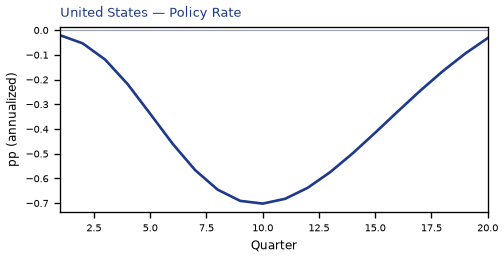

## AR — Argentina

The main impact of a 250bp rise in the risk premium on Argentina is a large drop in GDP of 2.32% by Q7. This is a model impulse response versus baseline, not a forecast. Equities soften 25.10% by Q1. The three-year CPI impulse is -1.81 percentage points.

Demand and trade. Private investment falls 5.17% by Q5; government debt falls 1.20% by Q14; household consumption falls 1.14% by Q7; the trade balance (net exports — this model does not split imports from exports) improves to +0.52% in Q1; related moves also show up in government spending.

Labour. Real wages fall 3.39% by Q16; employment falls 1.69% by Q10; unemployment rises by +0.39 percentage points in Q8.

Prices. Firms' marginal cost falls 1.39% by Q7; CPI inflation rises 0.72 percentage points by Q1; domestic inflation rises 0.51 percentage points by Q1.

Policy rates and the government curve. Benchmark bond prices rally 3.95% by Q9; 2-year bond prices rally 2.55% by Q6; 5-year bond prices cheapen 2.37% by Q18; 10-year bond prices cheapen 1.79% by Q17; related moves also show up in the local policy rate, 3-month government yields, 2-year government yields.

Exchange rates. The home currency is weaker versus the dollar (+7.93% in Q1); the real exchange rate shows a real depreciation (a weaker, more competitive home currency), peaking at +6.88% in Q1; the NEER prints a trade-weighted depreciation (-5.47% in Q1).

Equities and risk. Global VIX moves to 42.5 in Q1 (baseline 15); equity prices fall 25.10% by Q1; Tobin's Q (the value of installed capital) falls 3.62% by Q5.

Housing and credit. House prices fall 1.65% by Q11; bank credit supply falls 0.82% by Q13; bank equity falls 0.40% by Q13; lending spreads rise 0.24 percentage points by Q13.

Commodities. Gold prices move to $3453 in Q1; the gas price moves to $3.78 per mmBtu in Q8; the food price index moves to 95.9 in Q8; the energy price moves to $77 a barrel in Q8; the metals price index moves to 96.2 in Q8; the copper price index moves to 97.0 in Q8; other published commodity prices stay within 3% of their baselines.

Sectors and capital. Manufacturing output falls 2.22% by Q5; services output falls 1.33% by Q7; the capital stock falls 0.18% by Q11.

By Q20, GDP is still +1.59% from baseline.

These figures are model IRFs versus baseline, not forecasts and not financial advice.

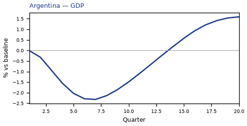

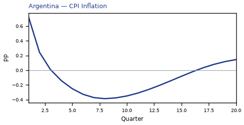

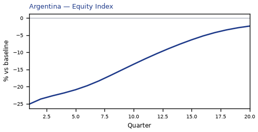

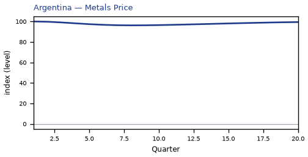

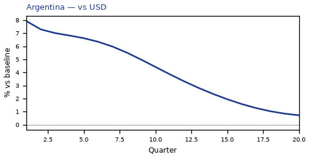

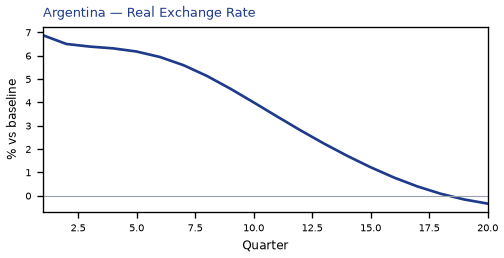

[Q1–Q20 JSON for Argentina](numbers/AR.json)

## RU — Russia

The main impact of a 250bp rise in the risk premium on Russia is a large drop in GDP of 2.02% by Q7. This is a model impulse response versus baseline, not a forecast. Equities soften 25.08% by Q1. The three-year CPI impulse is -1.12 percentage points.

Demand and trade. Private investment falls 5.04% by Q6; household consumption falls 1.12% by Q8; government debt falls 0.76% by Q16; the trade balance (net exports — this model does not split imports from exports) softens to -0.48% in Q9; related moves also show up in government spending.

Labour. Real wages fall 3.30% by Q20; employment falls 1.60% by Q12; unemployment rises by +0.64 percentage points in Q10.

Prices. Firms' marginal cost falls 1.21% by Q7; CPI inflation rises 0.28 percentage points by Q1; domestic inflation rises 0.20 percentage points by Q1.

Policy rates and the government curve. Benchmark bond prices rally 2.70% by Q11; 10-year bond prices rally 2.54% by Q5; 30-year bond prices rally 2.52% by Q5; 5-year bond prices rally 2.37% by Q5; related moves also show up in 2-year bond prices, the local policy rate, 3-month government yields.

Exchange rates. The home currency is weaker versus the dollar (+3.41% in Q1); the real exchange rate shows a real depreciation (a weaker, more competitive home currency), peaking at +2.36% in Q1; the NEER prints a trade-weighted depreciation (-1.14% in Q1).

Equities and risk. Global VIX moves to 42.5 in Q1 (baseline 15); equity prices fall 25.08% by Q1; Tobin's Q (the value of installed capital) falls 3.53% by Q6.

Housing and credit. House prices fall 1.85% by Q14; bank equity falls 0.47% by Q14; bank credit supply falls 0.41% by Q14.

Commodities. Gold prices move to $3453 in Q1; the gas price moves to $3.78 per mmBtu in Q8; the food price index moves to 95.9 in Q8; the energy price moves to $77 a barrel in Q8; the metals price index moves to 96.2 in Q8; the copper price index moves to 97.0 in Q8; other published commodity prices stay within 3% of their baselines.

Sectors and capital. Services output falls 1.11% by Q7; manufacturing output falls 0.99% by Q6; the capital stock falls 0.24% by Q20.

The GDP response has mostly faded by Q18 (Q20 is still -0.23%).

These figures are model IRFs versus baseline, not forecasts and not financial advice.

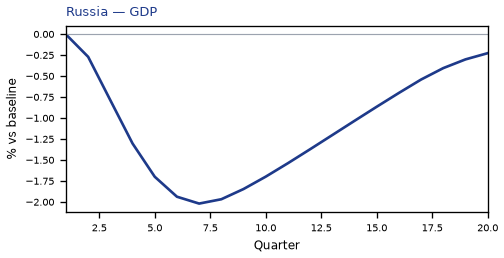

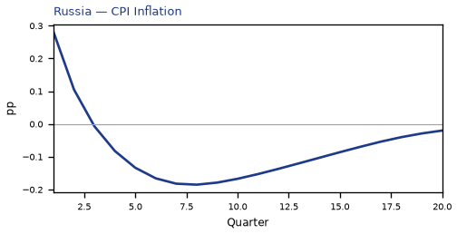

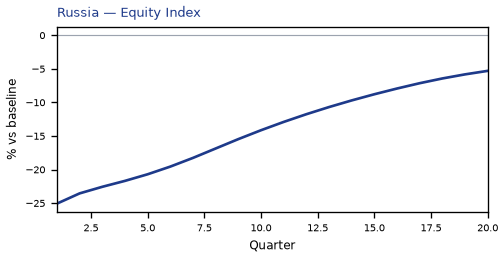

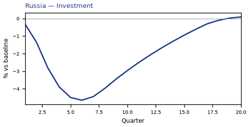

[Q1–Q20 JSON for Russia](numbers/RU.json)

## NG — Nigeria

The main impact of a 250bp rise in the risk premium on Nigeria is a large drop in GDP of 1.89% by Q7. This is a model impulse response versus baseline, not a forecast. Equities soften 25.07% by Q1. The three-year CPI impulse is -1.40 percentage points.

Demand and trade. Private investment falls 4.50% by Q6; government debt falls 3.81% by Q16; household consumption falls 1.09% by Q8; the trade balance (net exports — this model does not split imports from exports) improves to +0.42% in Q1; related moves also show up in government spending.

Labour. Real wages fall 2.74% by Q19; employment falls 1.27% by Q12; unemployment rises by +0.12 percentage points in Q8.

Prices. Firms' marginal cost falls 1.13% by Q7; CPI inflation rises 0.59 percentage points by Q1; domestic inflation rises 0.41 percentage points by Q1.

Policy rates and the government curve. Benchmark bond prices rally 2.62% by Q10; 5-year bond prices rally 2.18% by Q4; 10-year bond prices rally 2.03% by Q5; 30-year bond prices rally 1.98% by Q5; related moves also show up in 2-year bond prices, the local policy rate, 3-month government yields.

Exchange rates. The home currency is weaker versus the dollar (+5.25% in Q1); the real exchange rate shows a real depreciation (a weaker, more competitive home currency), peaking at +4.20% in Q1; the NEER prints a trade-weighted depreciation (-3.09% in Q1).

Equities and risk. Global VIX moves to 42.5 in Q1 (baseline 15); equity prices fall 25.07% by Q1; Tobin's Q (the value of installed capital) falls 3.15% by Q6.

Housing and credit. House prices fall 1.58% by Q13; bank credit supply falls 0.65% by Q13; bank equity falls 0.36% by Q13; lending spreads rise 0.09 percentage points by Q13.

Commodities. Gold prices move to $3453 in Q1; the gas price moves to $3.78 per mmBtu in Q8; the food price index moves to 95.9 in Q8; the energy price moves to $77 a barrel in Q8; the metals price index moves to 96.2 in Q8; the copper price index moves to 97.0 in Q8; other published commodity prices stay within 3% of their baselines.

Sectors and capital. Manufacturing output falls 1.26% by Q1; services output falls 0.94% by Q7; the capital stock falls 0.18% by Q15.

The GDP response has mostly faded by Q15 (Q20 is still +0.20%).

These figures are model IRFs versus baseline, not forecasts and not financial advice.

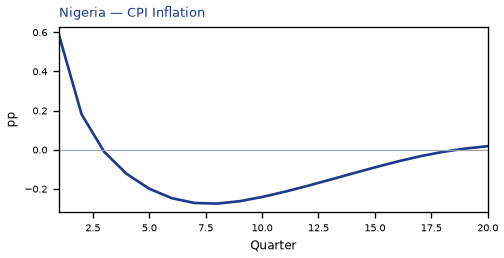

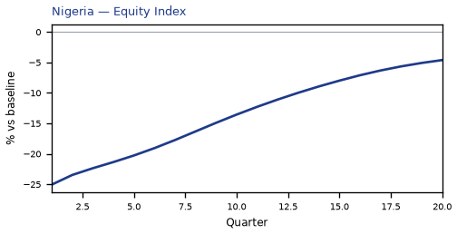

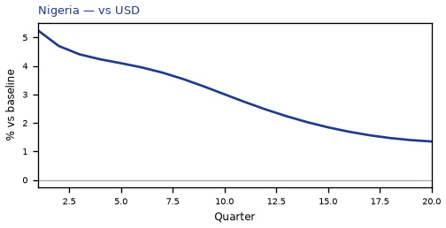

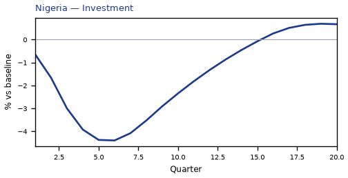

[Q1–Q20 JSON for Nigeria](numbers/NG.json)

## CN — China

The main impact of a 250bp rise in the risk premium on China is a large drop in GDP of 1.81% by Q7. This is a model impulse response versus baseline, not a forecast. Equities soften 25.04% by Q1. The three-year CPI impulse is -1.02 percentage points.

Demand and trade. Private investment falls 4.25% by Q6; government debt falls 2.03% by Q20; household consumption falls 1.35% by Q7; the trade balance (net exports — this model does not split imports from exports) improves to +0.38% in Q8; related moves also show up in government spending.

Labour. Real wages fall 2.68% by Q20; employment falls 1.21% by Q13; unemployment rises by +0.35 percentage points in Q10.

Prices. Firms' marginal cost falls 1.08% by Q7; CPI inflation falls 0.16 percentage points by Q7; domestic inflation falls 0.11 percentage points by Q7.

Policy rates and the government curve. Benchmark bond prices rally 5.84% by Q13; 10-year bond prices rally 4.97% by Q4; 30-year bond prices rally 4.78% by Q3; 5-year bond prices rally 4.09% by Q6; related moves also show up in 2-year bond prices, the local policy rate, 3-month government yields.

Exchange rates. The home currency is weaker versus the dollar (+2.66% in Q18); the NEER prints a trade-weighted depreciation (-2.07% in Q17); the real exchange rate shows a real depreciation (a weaker, more competitive home currency), peaking at +1.85% in Q14.

Equities and risk. Global VIX moves to 42.5 in Q1 (baseline 15); equity prices fall 25.04% by Q1; Tobin's Q (the value of installed capital) falls 2.98% by Q6.

Housing and credit. House prices fall 1.56% by Q14; bank equity falls 0.54% by Q13; bank credit supply falls 0.41% by Q13.

Commodities. Gold prices move to $3453 in Q1; the gas price moves to $3.78 per mmBtu in Q8; the food price index moves to 95.9 in Q8; the energy price moves to $77 a barrel in Q8; the metals price index moves to 96.2 in Q8; the copper price index moves to 97.0 in Q8; other published commodity prices stay within 3% of their baselines.

Sectors and capital. Services output falls 1.05% by Q7; manufacturing output falls 0.94% by Q8; the capital stock falls 0.17% by Q16.

The GDP response has mostly faded by Q18 (Q20 is still -0.29%).

These figures are model IRFs versus baseline, not forecasts and not financial advice.

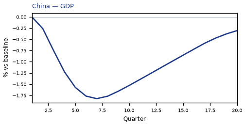

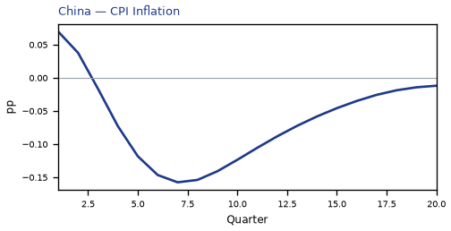

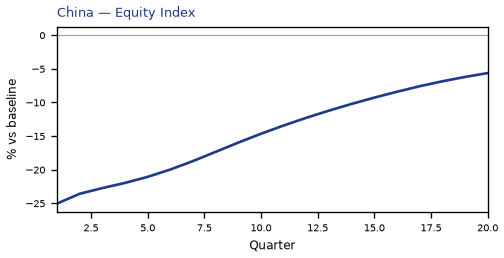

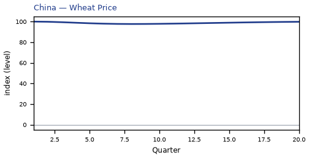

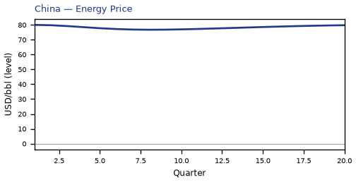

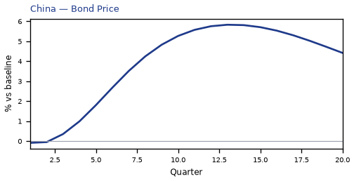

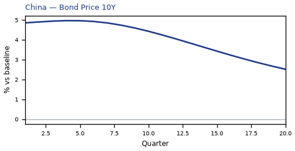

[Q1–Q20 JSON for China](numbers/CN.json)

## SA — Saudi Arabia

The main impact of a 250bp rise in the risk premium on Saudi Arabia is a large drop in GDP of 1.76% by Q7. This is a model impulse response versus baseline, not a forecast. Equities soften 25.05% by Q1. The three-year CPI impulse is -0.72 percentage points.

Demand and trade. Private investment falls 4.20% by Q6; government debt falls 2.84% by Q20; household consumption falls 1.12% by Q8; the trade balance (net exports — this model does not split imports from exports) softens to -0.77% in Q8; related moves also show up in government spending.

Labour. Real wages fall 1.92% by Q20; employment falls 1.59% by Q12; unemployment rises by +0.60 percentage points in Q11.

Prices. Firms' marginal cost falls 1.06% by Q7; CPI inflation falls 0.10 percentage points by Q7; domestic inflation falls 0.07 percentage points by Q7.

Policy rates and the government curve. Benchmark bond prices rally 3.51% by Q10; 5-year bond prices rally 1.69% by Q1; 2-year bond prices rally 1.19% by Q7; 10-year bond prices rally 1.06% by Q1; related moves also show up in the local policy rate, 3-month government yields, 30-year bond prices; the rest of the government curve moves less.

Exchange rates. The home currency is weaker versus the dollar (+1.51% in Q20); the NEER prints a trade-weighted appreciation (+0.69% in Q1); the real exchange rate shows a real depreciation (a weaker, more competitive home currency), peaking at +0.49% in Q17.

Equities and risk. Global VIX moves to 42.5 in Q1 (baseline 15); equity prices fall 25.05% by Q1; Tobin's Q (the value of installed capital) falls 2.94% by Q6.

Housing and credit. House prices fall 1.79% by Q16; bank equity falls 0.48% by Q14; bank credit supply falls 0.41% by Q14.

Commodities. Gold prices move to $3453 in Q1; the gas price moves to $3.78 per mmBtu in Q8; the food price index moves to 95.9 in Q8; the energy price moves to $77 a barrel in Q8; the metals price index moves to 96.2 in Q8; the copper price index moves to 97.0 in Q8; other published commodity prices stay within 3% of their baselines.

Sectors and capital. Services output falls 0.78% by Q7; manufacturing output falls 0.28% by Q12; the capital stock falls 0.25% by Q20.

By Q20, GDP is still -0.55% from baseline.

These figures are model IRFs versus baseline, not forecasts and not financial advice.

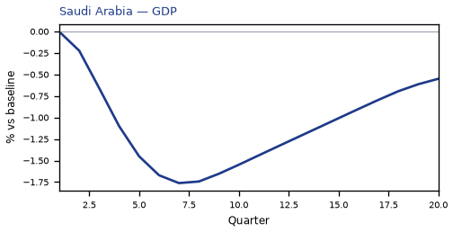

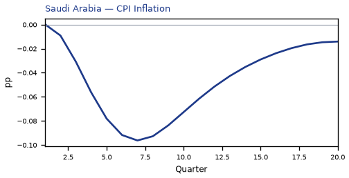

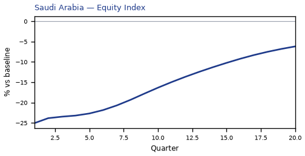

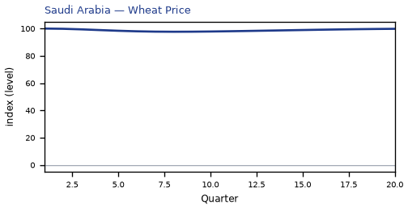

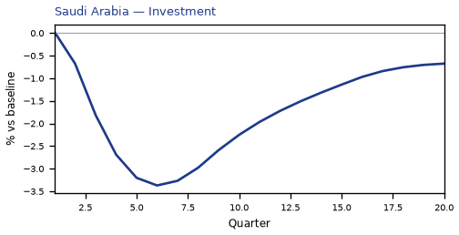

[Q1–Q20 JSON for Saudi Arabia](numbers/SA.json)

## MY — Malaysia

The main impact of a 250bp rise in the risk premium on Malaysia is a large drop in GDP of 1.60% by Q7. This is a model impulse response versus baseline, not a forecast. Equities soften 25.06% by Q1. The three-year CPI impulse is -0.25 percentage points.

Demand and trade. Private investment falls 4.14% by Q6; government debt falls 2.18% by Q17; household consumption falls 1.13% by Q8; the trade balance (net exports — this model does not split imports from exports) improves to +0.43% in Q1; related moves also show up in government spending.

Labour. Real wages fall 1.98% by Q20; employment falls 1.38% by Q12; unemployment rises by +0.33 percentage points in Q10.

Prices. Firms' marginal cost falls 0.96% by Q7; CPI inflation rises 0.47 percentage points by Q1; domestic inflation rises 0.33 percentage points by Q1.

Policy rates and the government curve. Benchmark bond prices rally 2.30% by Q11; 10-year bond prices rally 1.98% by Q5; 30-year bond prices rally 1.88% by Q5; 5-year bond prices rally 1.67% by Q6; related moves also show up in 2-year bond prices, the local policy rate, 3-month government yields.

Exchange rates. The home currency is weaker versus the dollar (+2.47% in Q1); the real exchange rate shows a real depreciation (a weaker, more competitive home currency), peaking at +1.42% in Q1; the NEER prints a trade-weighted depreciation (-0.75% in Q1).

Equities and risk. Global VIX moves to 42.5 in Q1 (baseline 15); equity prices fall 25.06% by Q1; Tobin's Q (the value of installed capital) falls 2.90% by Q6.

Housing and credit. House prices fall 1.81% by Q15; bank equity falls 0.47% by Q13; bank credit supply falls 0.37% by Q13.

Commodities. Gold prices move to $3453 in Q1; the gas price moves to $3.78 per mmBtu in Q8; the food price index moves to 95.9 in Q8; the energy price moves to $77 a barrel in Q8; the metals price index moves to 96.2 in Q8; the copper price index moves to 97.0 in Q8; other published commodity prices stay within 3% of their baselines.

Sectors and capital. Services output falls 0.91% by Q7; manufacturing output falls 0.69% by Q6; the capital stock falls 0.21% by Q20.

The GDP response has mostly faded by Q20 (Q20 is still -0.37%).

These figures are model IRFs versus baseline, not forecasts and not financial advice.

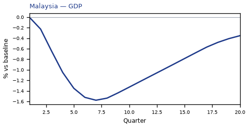

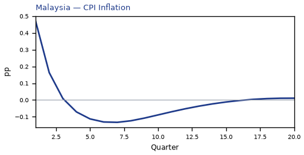

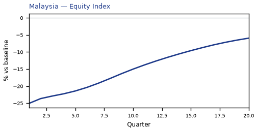

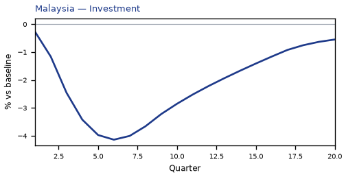

[Q1–Q20 JSON for Malaysia](numbers/MY.json)

## TR — Turkey

The main impact of a 250bp rise in the risk premium on Turkey is a large drop in GDP of 1.58% by Q7. This is a model impulse response versus baseline, not a forecast. Equities soften 25.09% by Q1. The three-year CPI impulse is -0.26 percentage points.

Demand and trade. Private investment falls 3.95% by Q5; government debt falls 1.17% by Q15; household consumption falls 0.90% by Q8; the trade balance (net exports — this model does not split imports from exports) improves to +0.89% in Q7; related moves also show up in government spending.

Labour. Real wages fall 2.33% by Q20; employment falls 1.20% by Q12; unemployment rises by +0.32 percentage points in Q9.

Prices. Firms' marginal cost falls 0.94% by Q7; CPI inflation rises 0.81 percentage points by Q1; domestic inflation rises 0.57 percentage points by Q1.

Policy rates and the government curve. Benchmark bond prices cheapen 2.84% by Q2; 5-year bond prices rally 1.75% by Q5; 10-year bond prices rally 1.65% by Q6; 30-year bond prices rally 1.44% by Q5; related moves also show up in 2-year bond prices, the local policy rate, 3-month government yields.

Exchange rates. The home currency is weaker versus the dollar (+5.87% in Q1); the real exchange rate shows a real depreciation (a weaker, more competitive home currency), peaking at +4.82% in Q1; the NEER prints a trade-weighted depreciation (-4.03% in Q1).

Equities and risk. Global VIX moves to 42.5 in Q1 (baseline 15); equity prices fall 25.09% by Q1; Tobin's Q (the value of installed capital) falls 2.76% by Q5.

Housing and credit. House prices fall 1.39% by Q12; bank equity falls 0.30% by Q13; bank credit supply falls 0.26% by Q13.

Commodities. Gold prices move to $3453 in Q1; the gas price moves to $3.78 per mmBtu in Q8; the food price index moves to 95.9 in Q8; the energy price moves to $77 a barrel in Q8; the metals price index moves to 96.2 in Q8; the copper price index moves to 97.0 in Q8; other published commodity prices stay within 3% of their baselines.

Sectors and capital. Manufacturing output falls 1.55% by Q5; services output falls 0.96% by Q7; the capital stock falls 0.17% by Q14.

The GDP response has mostly faded by Q15 (Q20 is still +0.24%).

These figures are model IRFs versus baseline, not forecasts and not financial advice.

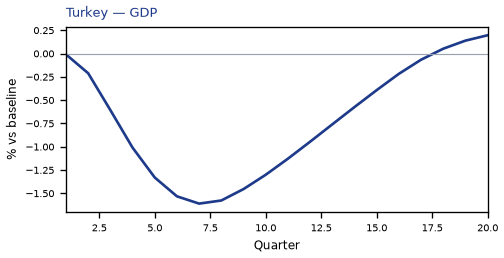

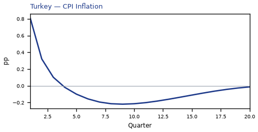

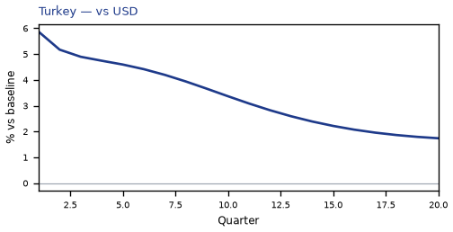

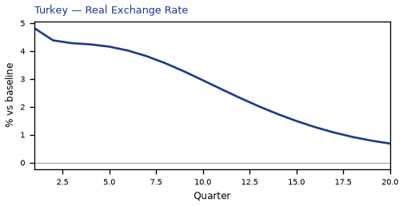

[Q1–Q20 JSON for Turkey](numbers/TR.json)

## IN — India

The main impact of a 250bp rise in the risk premium on India is a large drop in GDP of 1.55% by Q7. This is a model impulse response versus baseline, not a forecast. Equities soften 25.07% by Q1. The three-year CPI impulse is -1.24 percentage points.

Demand and trade. Private investment falls 3.64% by Q5; government debt falls 1.78% by Q15; household consumption falls 0.92% by Q7; the trade balance (net exports — this model does not split imports from exports) improves to +0.42% in Q7; related moves also show up in government spending.

Labour. Real wages fall 2.18% by Q20; employment falls 0.96% by Q12; unemployment rises by +0.10 percentage points in Q8.

Prices. Firms' marginal cost falls 0.92% by Q7; CPI inflation rises 0.26 percentage points by Q1; domestic inflation rises 0.19 percentage points by Q1.

Policy rates and the government curve. Benchmark bond prices rally 4.83% by Q10; 5-year bond prices rally 2.06% by Q4; 10-year bond prices rally 1.71% by Q5; 2-year bond prices rally 1.62% by Q7; related moves also show up in 30-year bond prices, the local policy rate, 3-month government yields.

Exchange rates. The home currency is weaker versus the dollar (+3.46% in Q1); the real exchange rate shows a real depreciation (a weaker, more competitive home currency), peaking at +2.41% in Q1; the NEER prints a trade-weighted depreciation (-1.42% in Q1).

Equities and risk. Global VIX moves to 42.5 in Q1 (baseline 15); equity prices fall 25.07% by Q1; Tobin's Q (the value of installed capital) falls 2.55% by Q5.

Housing and credit. House prices fall 1.26% by Q12; bank equity falls 0.40% by Q13; bank credit supply falls 0.35% by Q13.

Commodities. Gold prices move to $3453 in Q1; the gas price moves to $3.78 per mmBtu in Q8; the food price index moves to 95.9 in Q8; the energy price moves to $77 a barrel in Q8; the metals price index moves to 96.2 in Q8; the copper price index moves to 97.0 in Q8; other published commodity prices stay within 3% of their baselines.

Sectors and capital. Manufacturing output falls 0.85% by Q5; services output falls 0.85% by Q7; the capital stock falls 0.14% by Q14.

The GDP response has mostly faded by Q15 (Q20 is still +0.17%).

These figures are model IRFs versus baseline, not forecasts and not financial advice.

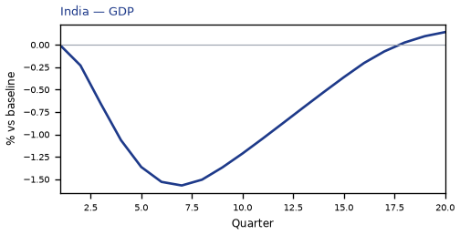

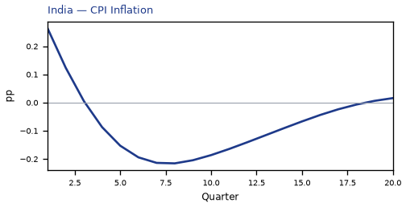

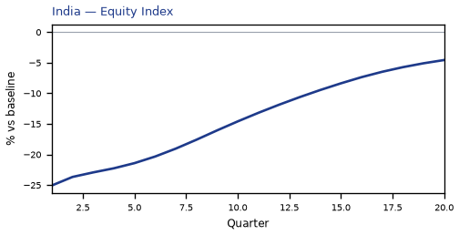

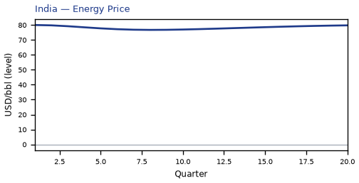

[Q1–Q20 JSON for India](numbers/IN.json)

## TH — Thailand

The main impact of a 250bp rise in the risk premium on Thailand is a large drop in GDP of 1.50% by Q7. This is a model impulse response versus baseline, not a forecast. Equities soften 25.05% by Q1. The three-year CPI impulse is -0.47 percentage points.

Demand and trade. Private investment falls 3.80% by Q6; government debt falls 1.74% by Q16; household consumption falls 0.98% by Q8; the trade balance (net exports — this model does not split imports from exports) improves to +0.32% in Q1; related moves also show up in government spending.

Labour. Real wages fall 1.98% by Q20; employment falls 1.33% by Q11; unemployment rises by +0.13 percentage points in Q9.

Prices. Firms' marginal cost falls 0.90% by Q7; CPI inflation rises 0.36 percentage points by Q1; domestic inflation rises 0.25 percentage points by Q1.

Policy rates and the government curve. Benchmark bond prices rally 2.59% by Q11; 10-year bond prices rally 1.95% by Q5; 5-year bond prices rally 1.80% by Q5; 30-year bond prices rally 1.77% by Q5; related moves also show up in 2-year bond prices, the local policy rate, 3-month government yields.

Exchange rates. The home currency is weaker versus the dollar (+2.34% in Q1); the real exchange rate shows a real depreciation (a weaker, more competitive home currency), peaking at +1.29% in Q1; the NEER prints a trade-weighted depreciation (-0.79% in Q1).

Equities and risk. Global VIX moves to 42.5 in Q1 (baseline 15); equity prices fall 25.05% by Q1; Tobin's Q (the value of installed capital) falls 2.66% by Q6.

Housing and credit. House prices fall 1.57% by Q14; bank equity falls 0.40% by Q13; bank credit supply falls 0.33% by Q13.

Commodities. Gold prices move to $3453 in Q1; the gas price moves to $3.78 per mmBtu in Q8; the food price index moves to 95.9 in Q8; the energy price moves to $77 a barrel in Q8; the metals price index moves to 96.2 in Q8; the copper price index moves to 97.0 in Q8; other published commodity prices stay within 3% of their baselines.

Sectors and capital. Services output falls 0.83% by Q7; manufacturing output falls 0.61% by Q6; the capital stock falls 0.18% by Q20.

The GDP response has mostly faded by Q18 (Q20 is still -0.25%).

These figures are model IRFs versus baseline, not forecasts and not financial advice.

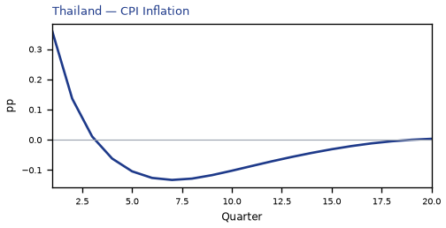

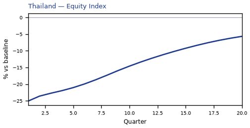

[Q1–Q20 JSON for Thailand](numbers/TH.json)

## MX — Mexico

The main impact of a 250bp rise in the risk premium on Mexico is a large drop in GDP of 1.35% by Q7. This is a model impulse response versus baseline, not a forecast. Equities soften 25.06% by Q1. The three-year CPI impulse is -0.16 percentage points.

Demand and trade. Private investment falls 3.43% by Q5; government debt falls 1.44% by Q14; household consumption falls 0.79% by Q8; the trade balance (net exports — this model does not split imports from exports) improves to +0.71% in Q1; related moves also show up in government spending.

Labour. Real wages fall 1.63% by Q20; employment falls 1.06% by Q12; unemployment rises by +0.11 percentage points in Q9.

Prices. CPI inflation rises 0.93 percentage points by Q1; firms' marginal cost falls 0.81% by Q7; domestic inflation rises 0.65 percentage points by Q1.

Policy rates and the government curve. Benchmark bond prices cheapen 3.72% by Q2; 5-year bond prices rally 1.48% by Q5; 10-year bond prices rally 1.41% by Q6; 30-year bond prices rally 1.17% by Q6; related moves also show up in 2-year bond prices, the local policy rate, 3-month government yields.

Exchange rates. The home currency is weaker versus the dollar (+4.80% in Q1); the NEER prints a trade-weighted depreciation (-3.78% in Q1); the real exchange rate shows a real depreciation (a weaker, more competitive home currency), peaking at +3.75% in Q1.

Equities and risk. Global VIX moves to 42.5 in Q1 (baseline 15); equity prices fall 25.06% by Q1; Tobin's Q (the value of installed capital) falls 2.40% by Q5.

Housing and credit. House prices fall 1.28% by Q13; bank equity falls 0.32% by Q13; bank credit supply falls 0.31% by Q13.

Commodities. Gold prices move to $3453 in Q1; the gas price moves to $3.78 per mmBtu in Q8; the food price index moves to 95.9 in Q8; the energy price moves to $77 a barrel in Q8; the metals price index moves to 96.2 in Q8; the copper price index moves to 97.0 in Q8; other published commodity prices stay within 3% of their baselines.

Sectors and capital. Manufacturing output falls 1.13% by Q1; services output falls 0.82% by Q7; the capital stock falls 0.16% by Q16.

The GDP response has mostly faded by Q16 (Q20 is still +0.02%).

These figures are model IRFs versus baseline, not forecasts and not financial advice.

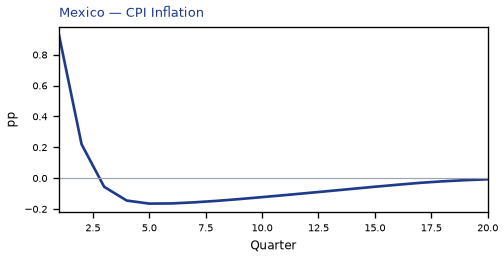

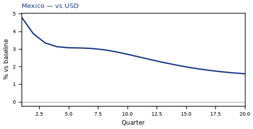

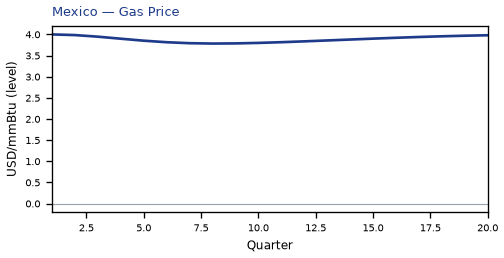

[Q1–Q20 JSON for Mexico](numbers/MX.json)

## ID — Indonesia

The main impact of a 250bp rise in the risk premium on Indonesia is a large drop in GDP of 1.34% by Q7. This is a model impulse response versus baseline, not a forecast. Equities soften 25.05% by Q1. The three-year CPI impulse is -0.90 percentage points.

Demand and trade. Private investment falls 3.36% by Q6; government debt falls 1.52% by Q13; household consumption falls 0.80% by Q8; the trade balance (net exports — this model does not split imports from exports) improves to +0.34% in Q1; related moves also show up in government spending.

Labour. Real wages fall 1.97% by Q20; employment falls 0.91% by Q12; unemployment rises by +0.10 percentage points in Q9.

Prices. Firms' marginal cost falls 0.80% by Q7; CPI inflation rises 0.38 percentage points by Q1; domestic inflation rises 0.26 percentage points by Q1.

Policy rates and the government curve. Benchmark bond prices rally 2.79% by Q11; 5-year bond prices rally 1.57% by Q5; 10-year bond prices rally 1.38% by Q5; 30-year bond prices rally 1.16% by Q5; related moves also show up in 2-year bond prices, the local policy rate, 3-month government yields.

Exchange rates. The home currency is weaker versus the dollar (+4.17% in Q1); the real exchange rate shows a real depreciation (a weaker, more competitive home currency), peaking at +3.12% in Q1; the NEER prints a trade-weighted depreciation (-2.29% in Q1).

Equities and risk. Global VIX moves to 42.5 in Q1 (baseline 15); equity prices fall 25.05% by Q1; Tobin's Q (the value of installed capital) falls 2.35% by Q6.

Housing and credit. House prices fall 1.16% by Q13; bank credit supply falls 0.31% by Q13; bank equity falls 0.31% by Q13.

Commodities. Gold prices move to $3453 in Q1; the gas price moves to $3.78 per mmBtu in Q8; the food price index moves to 95.9 in Q8; the energy price moves to $77 a barrel in Q8; the metals price index moves to 96.2 in Q8; the copper price index moves to 97.0 in Q8; other published commodity prices stay within 3% of their baselines.

Sectors and capital. Manufacturing output falls 0.94% by Q1; services output falls 0.66% by Q7; the capital stock falls 0.14% by Q15.

The GDP response has mostly faded by Q16 (Q20 is still +0.05%).

These figures are model IRFs versus baseline, not forecasts and not financial advice.

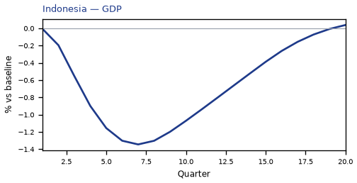

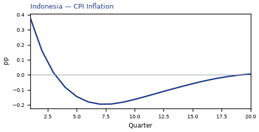

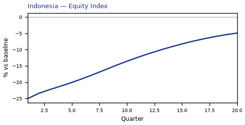

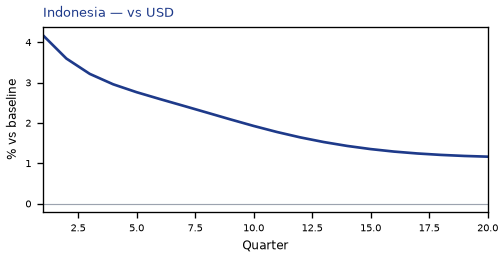

[Q1–Q20 JSON for Indonesia](numbers/ID.json)

## BR — Brazil

The main impact of a 250bp rise in the risk premium on Brazil is a large drop in GDP of 1.28% by Q7. This is a model impulse response versus baseline, not a forecast. Equities soften 25.08% by Q1. The three-year CPI impulse is -0.65 percentage points.

Demand and trade. Private investment falls 2.98% by Q5; household consumption falls 0.69% by Q8; the trade balance (net exports — this model does not split imports from exports) improves to +0.26% in Q1; government debt falls 0.22% by Q14; related moves also show up in government spending.

Labour. Real wages fall 1.59% by Q20; employment falls 0.94% by Q11; unemployment rises by +0.23 percentage points in Q9.

Prices. Firms' marginal cost falls 0.77% by Q7; CPI inflation rises 0.28 percentage points by Q1; domestic inflation rises 0.20 percentage points by Q1.

Policy rates and the government curve. Benchmark bond prices rally 3.60% by Q10; 5-year bond prices rally 1.65% by Q4; 2-year bond prices rally 1.42% by Q7; 10-year bond prices rally 1.13% by Q5; related moves also show up in 30-year bond prices, the local policy rate, 3-month government yields.

Exchange rates. The home currency is weaker versus the dollar (+4.74% in Q1); the real exchange rate shows a real depreciation (a weaker, more competitive home currency), peaking at +3.69% in Q1; the NEER prints a trade-weighted depreciation (-2.74% in Q1).

Equities and risk. Global VIX moves to 42.5 in Q1 (baseline 15); equity prices fall 25.08% by Q1; Tobin's Q (the value of installed capital) falls 2.08% by Q5.

Housing and credit. House prices fall 0.96% by Q12; bank equity falls 0.32% by Q13; bank credit supply falls 0.27% by Q13.

Commodities. Gold prices move to $3453 in Q1; the gas price moves to $3.78 per mmBtu in Q8; the food price index moves to 95.9 in Q8; the energy price moves to $77 a barrel in Q8; the metals price index moves to 96.2 in Q8; the copper price index moves to 97.0 in Q8; other published commodity prices stay within 3% of their baselines.

Sectors and capital. Manufacturing output falls 1.11% by Q1; services output falls 0.85% by Q7; the capital stock falls 0.11% by Q12.

The GDP response has mostly faded by Q14 (Q20 is still +0.39%).

These figures are model IRFs versus baseline, not forecasts and not financial advice.

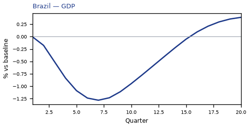

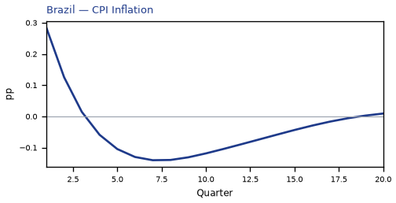

[Q1–Q20 JSON for Brazil](numbers/BR.json)

## CO — Colombia

The main impact of a 250bp rise in the risk premium on Colombia is a large drop in GDP of 1.28% by Q7. This is a model impulse response versus baseline, not a forecast. Equities soften 25.06% by Q1. The three-year CPI impulse is -0.57 percentage points.

Demand and trade. Private investment falls 3.19% by Q5; government debt falls 1.26% by Q14; household consumption falls 0.75% by Q8; the trade balance (net exports — this model does not split imports from exports) improves to +0.45% in Q1; related moves also show up in government spending.

Labour. Real wages fall 1.73% by Q20; employment falls 1.03% by Q11; unemployment rises by +0.10 percentage points in Q9.

Prices. Firms' marginal cost falls 0.77% by Q7; CPI inflation rises 0.54 percentage points by Q1; domestic inflation rises 0.37 percentage points by Q1.

Policy rates and the government curve. Benchmark bond prices rally 2.33% by Q10; 5-year bond prices rally 1.39% by Q5; 10-year bond prices rally 1.21% by Q5; 2-year bond prices rally 1.08% by Q7; related moves also show up in 30-year bond prices, the local policy rate, 3-month government yields.

Exchange rates. The home currency is weaker versus the dollar (+5.10% in Q1); the real exchange rate shows a real depreciation (a weaker, more competitive home currency), peaking at +4.06% in Q1; the NEER prints a trade-weighted depreciation (-3.18% in Q1).

Equities and risk. Global VIX moves to 42.5 in Q1 (baseline 15); equity prices fall 25.06% by Q1; Tobin's Q (the value of installed capital) falls 2.23% by Q5.

Housing and credit. House prices fall 1.10% by Q13; bank equity falls 0.28% by Q13; bank credit supply falls 0.25% by Q13.

Commodities. Gold prices move to $3453 in Q1; the gas price moves to $3.78 per mmBtu in Q8; the food price index moves to 95.9 in Q8; the energy price moves to $77 a barrel in Q8; the metals price index moves to 96.2 in Q8; the copper price index moves to 97.0 in Q8; other published commodity prices stay within 3% of their baselines.

Sectors and capital. Manufacturing output falls 1.22% by Q1; services output falls 0.77% by Q7; the capital stock falls 0.13% by Q15.

The GDP response has mostly faded by Q15 (Q20 is still +0.10%).

These figures are model IRFs versus baseline, not forecasts and not financial advice.

[Q1–Q20 JSON for Colombia](numbers/CO.json)

## NO — Norway

The main impact of a 250bp rise in the risk premium on Norway is a large drop in GDP of 1.23% by Q7. This is a model impulse response versus baseline, not a forecast. Equities soften 25.05% by Q1. The three-year CPI impulse is -0.30 percentage points.

Demand and trade. Private investment falls 2.92% by Q6; household consumption falls 0.71% by Q8; the trade balance (net exports — this model does not split imports from exports) softens to -0.43% in Q8; government debt rises 0.27% by Q15; government spending stays close to baseline.

Labour. Real wages fall 1.02% by Q20; employment falls 0.95% by Q11; unemployment rises by +0.70 percentage points in Q11.

Prices. Firms' marginal cost falls 0.73% by Q7; CPI inflation falls 0.05 percentage points by Q7; domestic inflation stays close to baseline.

Policy rates and the government curve. Benchmark bond prices rally 3.68% by Q11; 10-year bond prices rally 1.78% by Q4; 5-year bond prices rally 1.72% by Q4; 30-year bond prices rally 1.54% by Q3; related moves also show up in 2-year bond prices, the local policy rate, 3-month government yields.

Exchange rates. The home currency is weaker versus the dollar (+2.28% in Q9); the real exchange rate shows a real depreciation (a weaker, more competitive home currency), peaking at +1.89% in Q9; the NEER prints a trade-weighted depreciation (-1.61% in Q10).

Equities and risk. Global VIX moves to 42.5 in Q1 (baseline 15); equity prices fall 25.05% by Q1; Tobin's Q (the value of installed capital) falls 2.04% by Q6.

Housing and credit. House prices fall 0.91% by Q15; bank equity falls 0.46% by Q14; bank credit supply falls 0.36% by Q14.

Commodities. Gold prices move to $3453 in Q1; the gas price moves to $3.78 per mmBtu in Q8; the food price index moves to 95.9 in Q8; the energy price moves to $77 a barrel in Q8; the metals price index moves to 96.2 in Q8; the copper price index moves to 97.0 in Q8; other published commodity prices stay within 3% of their baselines.

Sectors and capital. Manufacturing output falls 0.73% by Q8; services output falls 0.70% by Q7; the capital stock falls 0.13% by Q17.

The GDP response has mostly faded by Q17 (Q20 is still -0.08%).

These figures are model IRFs versus baseline, not forecasts and not financial advice.

[Q1–Q20 JSON for Norway](numbers/NO.json)

## KR — South Korea

The main impact of a 250bp rise in the risk premium on South Korea is a large drop in GDP of 1.22% by Q7. This is a model impulse response versus baseline, not a forecast. Equities soften 25.06% by Q1. The three-year CPI impulse is -0.52 percentage points.

Demand and trade. Private investment falls 2.91% by Q6; household consumption falls 0.75% by Q7; government debt falls 0.55% by Q14; the trade balance (net exports — this model does not split imports from exports) improves to +0.55% in Q7; related moves also show up in government spending.

Labour. Real wages fall 1.50% by Q20; employment falls 0.94% by Q11; unemployment rises by +0.40 percentage points in Q10.

Prices. Firms' marginal cost falls 0.73% by Q7; CPI inflation rises 0.18 percentage points by Q1; domestic inflation rises 0.13 percentage points by Q1.

Policy rates and the government curve. Benchmark bond prices rally 3.13% by Q10; 5-year bond prices rally 1.60% by Q4; 10-year bond prices rally 1.40% by Q4; 30-year bond prices rally 1.08% by Q4; related moves also show up in 2-year bond prices, the local policy rate, 3-month government yields.

Exchange rates. The home currency is weaker versus the dollar (+2.01% in Q1); the real exchange rate shows a real depreciation (a weaker, more competitive home currency), peaking at +0.96% in Q1; the NEER prints a trade-weighted appreciation (+0.69% in Q12).

Equities and risk. Global VIX moves to 42.5 in Q1 (baseline 15); equity prices fall 25.06% by Q1; Tobin's Q (the value of installed capital) falls 2.04% by Q6.

Housing and credit. House prices fall 0.88% by Q14; bank equity falls 0.40% by Q13; bank credit supply falls 0.32% by Q13.

Commodities. Gold prices move to $3453 in Q1; the gas price moves to $3.78 per mmBtu in Q8; the food price index moves to 95.9 in Q8; the energy price moves to $77 a barrel in Q8; the metals price index moves to 96.2 in Q8; the copper price index moves to 97.0 in Q8; other published commodity prices stay within 3% of their baselines.

Sectors and capital. Services output falls 0.74% by Q7; manufacturing output falls 0.35% by Q4; the capital stock falls 0.12% by Q15.

The GDP response has mostly faded by Q16 (Q20 is still +0.01%).

These figures are model IRFs versus baseline, not forecasts and not financial advice.

[Q1–Q20 JSON for South Korea](numbers/KR.json)

## CL — Chile

The main impact of a 250bp rise in the risk premium on Chile is a large drop in GDP of 1.18% by Q7. This is a model impulse response versus baseline, not a forecast. Equities soften 25.07% by Q1. The three-year CPI impulse is -0.57 percentage points.

Demand and trade. Private investment falls 2.98% by Q6; government debt falls 0.82% by Q13; household consumption falls 0.72% by Q8; the trade balance (net exports — this model does not split imports from exports) improves to +0.41% in Q1; related moves also show up in government spending.

Labour. Real wages fall 1.56% by Q20; employment falls 1.02% by Q10; unemployment rises by +0.35 percentage points in Q10.

Prices. Firms' marginal cost falls 0.71% by Q7; CPI inflation rises 0.54 percentage points by Q1; domestic inflation rises 0.38 percentage points by Q1.

Policy rates and the government curve. Benchmark bond prices rally 2.45% by Q10; 5-year bond prices rally 1.31% by Q5; 10-year bond prices rally 1.12% by Q5; 2-year bond prices rally 0.99% by Q8; related moves also show up in 30-year bond prices, the local policy rate, 3-month government yields; the rest of the government curve moves less.

Exchange rates. The home currency is weaker versus the dollar (+3.80% in Q1); the real exchange rate shows a real depreciation (a weaker, more competitive home currency), peaking at +2.75% in Q1; the NEER prints a trade-weighted depreciation (-1.43% in Q1).

Equities and risk. Global VIX moves to 42.5 in Q1 (baseline 15); equity prices fall 25.07% by Q1; Tobin's Q (the value of installed capital) falls 2.08% by Q6.

Housing and credit. House prices fall 1.06% by Q13; bank equity falls 0.30% by Q13; bank credit supply falls 0.24% by Q13.

Commodities. Gold prices move to $3453 in Q1; the gas price moves to $3.78 per mmBtu in Q8; the food price index moves to 95.9 in Q8; the energy price moves to $77 a barrel in Q8; the metals price index moves to 96.2 in Q8; the copper price index moves to 97.0 in Q8; other published commodity prices stay within 3% of their baselines.

Sectors and capital. Manufacturing output falls 0.83% by Q1; services output falls 0.72% by Q7; the capital stock falls 0.12% by Q15.

The GDP response has mostly faded by Q16 (Q20 is still +0.06%).

These figures are model IRFs versus baseline, not forecasts and not financial advice.

[Q1–Q20 JSON for Chile](numbers/CL.json)

## NL — Netherlands

The main impact of a 250bp rise in the risk premium on the Netherlands is a large drop in GDP of 1.18% by Q7. This is a model impulse response versus baseline, not a forecast. Equities soften 25.05% by Q1. The three-year CPI impulse is -0.49 percentage points.

Demand and trade. Private investment falls 3.12% by Q6; household consumption falls 0.69% by Q8; government spending rises 0.24% by Q7; government debt rises 0.20% by Q15; related moves also show up in the trade balance.

Labour. Real wages fall 1.10% by Q20; employment falls 0.87% by Q12; unemployment rises by +0.67 percentage points in Q11.

Prices. Firms' marginal cost falls 0.70% by Q7; CPI inflation rises 0.20 percentage points by Q1; domestic inflation rises 0.14 percentage points by Q1.

Policy rates and the government curve. Benchmark bond prices rally 1.71% by Q11; 5-year bond prices rally 0.60% by Q4; 10-year bond prices rally 0.49% by Q4; 2-year bond prices rally 0.42% by Q8; related moves also show up in 30-year bond prices, the local policy rate, 3-month government yields; the rest of the government curve barely moves.

Exchange rates. The home currency is weaker versus the dollar (+1.65% in Q1); the real exchange rate shows a real depreciation (a weaker, more competitive home currency), peaking at +0.60% in Q1; the NEER prints a trade-weighted appreciation (+0.11% in Q14).

Equities and risk. Global VIX moves to 42.5 in Q1 (baseline 15); equity prices fall 25.05% by Q1; Tobin's Q (the value of installed capital) falls 2.18% by Q6.

Housing and credit. House prices fall 1.01% by Q15; bank equity falls 0.55% by Q13; bank credit supply falls 0.44% by Q13.

Commodities. Gold prices move to $3453 in Q1; the gas price moves to $3.78 per mmBtu in Q8; the food price index moves to 95.9 in Q8; the energy price moves to $77 a barrel in Q8; the metals price index moves to 96.2 in Q8; the copper price index moves to 97.0 in Q8; other published commodity prices stay within 3% of their baselines.

Sectors and capital. Services output falls 0.88% by Q7; manufacturing output falls 0.27% by Q6; the capital stock falls 0.16% by Q20.

The GDP response has mostly faded by Q18 (Q20 is still -0.16%).

These figures are model IRFs versus baseline, not forecasts and not financial advice.

[Q1–Q20 JSON for Netherlands](numbers/NL.json)

## PL — Poland

The main impact of a 250bp rise in the risk premium on Poland is a large drop in GDP of 1.13% by Q7. This is a model impulse response versus baseline, not a forecast. Equities soften 25.06% by Q1. The three-year CPI impulse is -0.48 percentage points.

Demand and trade. Private investment falls 2.92% by Q6; household consumption falls 0.59% by Q8; the trade balance (net exports — this model does not split imports from exports) improves to +0.38% in Q6; government spending rises 0.22% by Q7; government debt stays close to baseline.

Labour. Real wages fall 1.36% by Q20; employment falls 0.94% by Q11; unemployment rises by +0.38 percentage points in Q10.

Prices. Firms' marginal cost falls 0.67% by Q7; CPI inflation rises 0.35 percentage points by Q1; domestic inflation rises 0.25 percentage points by Q1.

Policy rates and the government curve. Benchmark bond prices rally 1.64% by Q10; 5-year bond prices rally 0.90% by Q5; 10-year bond prices rally 0.76% by Q5; 2-year bond prices rally 0.66% by Q8; related moves also show up in 30-year bond prices, the local policy rate, 3-month government yields; the rest of the government curve moves less.

Exchange rates. The home currency is weaker versus the dollar (+2.44% in Q1); the real exchange rate shows a real depreciation (a weaker, more competitive home currency), peaking at +1.39% in Q1; the NEER prints a trade-weighted depreciation (-0.63% in Q1).

Equities and risk. Global VIX moves to 42.5 in Q1 (baseline 15); equity prices fall 25.06% by Q1; Tobin's Q (the value of installed capital) falls 2.04% by Q6.

Housing and credit. House prices fall 0.87% by Q14; bank equity falls 0.30% by Q13; bank credit supply falls 0.27% by Q13.

Commodities. Gold prices move to $3453 in Q1; the gas price moves to $3.78 per mmBtu in Q8; the food price index moves to 95.9 in Q8; the energy price moves to $77 a barrel in Q8; the metals price index moves to 96.2 in Q8; the copper price index moves to 97.0 in Q8; other published commodity prices stay within 3% of their baselines.

Sectors and capital. Services output falls 0.71% by Q7; manufacturing output falls 0.42% by Q1; the capital stock falls 0.13% by Q18.

The GDP response has mostly faded by Q16 (Q20 is still -0.04%).

These figures are model IRFs versus baseline, not forecasts and not financial advice.

[Q1–Q20 JSON for Poland](numbers/PL.json)

## ZA — South Africa

The main impact of a 250bp rise in the risk premium on South Africa is a large drop in GDP of 1.13% by Q7. This is a model impulse response versus baseline, not a forecast. Equities soften 25.08% by Q1. The three-year CPI impulse is -0.42 percentage points.

Demand and trade. Private investment falls 2.85% by Q6; government debt falls 0.69% by Q15; household consumption falls 0.64% by Q8; the trade balance (net exports — this model does not split imports from exports) improves to +0.45% in Q1; related moves also show up in government spending.

Labour. Real wages fall 1.47% by Q20; employment falls 0.96% by Q11; unemployment rises by +0.23 percentage points in Q9.

Prices. Firms' marginal cost falls 0.67% by Q7; CPI inflation rises 0.54 percentage points by Q1; domestic inflation rises 0.38 percentage points by Q1.

Policy rates and the government curve. Benchmark bond prices rally 2.16% by Q10; 5-year bond prices rally 1.11% by Q5; 10-year bond prices rally 0.91% by Q5; 2-year bond prices rally 0.86% by Q7; related moves also show up in 30-year bond prices, the local policy rate, 3-month government yields; the rest of the government curve moves less.

Exchange rates. The home currency is weaker versus the dollar (+4.26% in Q1); the real exchange rate shows a real depreciation (a weaker, more competitive home currency), peaking at +3.21% in Q1; the NEER prints a trade-weighted depreciation (-2.32% in Q1).

Equities and risk. Global VIX moves to 42.5 in Q1 (baseline 15); equity prices fall 25.08% by Q1; Tobin's Q (the value of installed capital) falls 1.99% by Q6.

Housing and credit. House prices fall 0.99% by Q12; bank equity falls 0.31% by Q13; bank credit supply falls 0.27% by Q13.

Commodities. Gold prices move to $3453 in Q1; the gas price moves to $3.78 per mmBtu in Q8; the food price index moves to 95.9 in Q8; the energy price moves to $77 a barrel in Q8; the metals price index moves to 96.2 in Q8; the copper price index moves to 97.0 in Q8; other published commodity prices stay within 3% of their baselines.

Sectors and capital. Manufacturing output falls 0.96% by Q1; services output falls 0.72% by Q7; the capital stock falls 0.12% by Q15.

The GDP response has mostly faded by Q15 (Q20 is still +0.10%).

These figures are model IRFs versus baseline, not forecasts and not financial advice.

[Q1–Q20 JSON for South Africa](numbers/ZA.json)

## CA — Canada

The main impact of a 250bp rise in the risk premium on Canada is a large drop in GDP of 1.11% by Q7. This is a model impulse response versus baseline, not a forecast. Equities soften 25.05% by Q1. The three-year CPI impulse is -0.43 percentage points.

Demand and trade. Private investment falls 2.50% by Q6; household consumption falls 0.71% by Q8; the trade balance (net exports — this model does not split imports from exports) softens to -0.20% in Q9; government debt falls 0.17% by Q13; related moves also show up in government spending.

Labour. Real wages fall 1.05% by Q20; employment falls 1.04% by Q10; unemployment rises by +0.62 percentage points in Q10.

Prices. Firms' marginal cost falls 0.66% by Q7; CPI inflation falls 0.06 percentage points by Q7; domestic inflation stays close to baseline.

Policy rates and the government curve. Benchmark bond prices rally 3.92% by Q10; 5-year bond prices rally 1.67% by Q3; 10-year bond prices rally 1.38% by Q2; 2-year bond prices rally 1.13% by Q7; related moves also show up in 30-year bond prices, the local policy rate, 3-month government yields.

Exchange rates. The home currency is weaker versus the dollar (+1.92% in Q8); the real exchange rate shows a real depreciation (a weaker, more competitive home currency), peaking at +1.55% in Q8; the NEER prints a trade-weighted depreciation (-1.42% in Q8).

Equities and risk. Global VIX moves to 42.5 in Q1 (baseline 15); equity prices fall 25.05% by Q1; Tobin's Q (the value of installed capital) falls 1.75% by Q6.

Housing and credit. House prices fall 0.76% by Q13; bank equity falls 0.38% by Q13; bank credit supply falls 0.30% by Q13.

Commodities. Gold prices move to $3453 in Q1; the gas price moves to $3.78 per mmBtu in Q8; the food price index moves to 95.9 in Q8; the energy price moves to $77 a barrel in Q8; the metals price index moves to 96.2 in Q8; the copper price index moves to 97.0 in Q8; other published commodity prices stay within 3% of their baselines.

Sectors and capital. Services output falls 0.77% by Q7; manufacturing output falls 0.60% by Q8; the capital stock falls 0.09% by Q14.

The GDP response has mostly faded by Q16 (Q20 is still +0.05%).

These figures are model IRFs versus baseline, not forecasts and not financial advice.

[Q1–Q20 JSON for Canada](numbers/CA.json)

## CH — Switzerland

The main impact of a 250bp rise in the risk premium on Switzerland is a large drop in GDP of 1.10% by Q7. This is a model impulse response versus baseline, not a forecast. Equities soften 25.04% by Q1. The three-year CPI impulse is -0.84 percentage points.

Demand and trade. Private investment falls 2.72% by Q7; household consumption falls 0.78% by Q8; government debt falls 0.43% by Q13; the trade balance (net exports — this model does not split imports from exports) softens to -0.29% in Q1; related moves also show up in government spending.

Labour. Employment falls 0.94% by Q10; real wages fall 0.89% by Q20; unemployment rises by +0.62 percentage points in Q11.

Prices. Firms' marginal cost falls 0.66% by Q7; CPI inflation falls 0.26 percentage points by Q1; domestic inflation falls 0.18 percentage points by Q1.

Policy rates and the government curve. Benchmark bond prices rally 2.29% by Q10; 5-year bond prices rally 1.01% by Q2; 10-year bond prices rally 1.00% by Q1; 30-year bond prices rally 0.77% by Q1; related moves also show up in 2-year bond prices, the local policy rate, 3-month government yields; the rest of the government curve moves less.

Exchange rates. The NEER prints a trade-weighted appreciation (+2.04% in Q1); the real exchange rate shows a real appreciation (a stronger home currency), peaking at -1.45% in Q1; the home currency is stronger versus the dollar (-0.96% in Q8).

Equities and risk. Global VIX moves to 42.5 in Q1 (baseline 15); equity prices fall 25.04% by Q1; Tobin's Q (the value of installed capital) falls 1.91% by Q7.

Housing and credit. House prices fall 0.86% by Q15; bank equity falls 0.51% by Q13; bank credit supply falls 0.40% by Q13.

Commodities. Gold prices move to $3453 in Q1; the gas price moves to $3.78 per mmBtu in Q8; the food price index moves to 95.9 in Q8; the energy price moves to $77 a barrel in Q8; the metals price index moves to 96.2 in Q8; the copper price index moves to 97.0 in Q8; other published commodity prices stay within 3% of their baselines.

Sectors and capital. Services output falls 0.87% by Q7; manufacturing output rises 0.44% by Q1; the capital stock falls 0.13% by Q20.

The GDP response has mostly faded by Q17 (Q20 is still -0.13%).

These figures are model IRFs versus baseline, not forecasts and not financial advice.

[Q1–Q20 JSON for Switzerland](numbers/CH.json)

## DE — Germany

The main impact of a 250bp rise in the risk premium on Germany is a large drop in GDP of 1.09% by Q7. This is a model impulse response versus baseline, not a forecast. Equities soften 25.04% by Q1. The three-year CPI impulse is -0.57 percentage points.

Demand and trade. Private investment falls 2.87% by Q6; household consumption falls 0.61% by Q8; the trade balance (net exports — this model does not split imports from exports) improves to +0.37% in Q7; government spending rises 0.24% by Q7; related moves also show up in government debt.

Labour. Real wages fall 1.09% by Q20; employment falls 0.86% by Q11; unemployment rises by +0.61 percentage points in Q10.

Prices. Firms' marginal cost falls 0.65% by Q7; CPI inflation rises 0.13 percentage points by Q1; domestic inflation rises 0.09 percentage points by Q1.

Policy rates and the government curve. Benchmark bond prices rally 1.71% by Q11; 5-year bond prices rally 0.60% by Q4; 10-year bond prices rally 0.49% by Q4; 2-year bond prices rally 0.42% by Q8; related moves also show up in 30-year bond prices, the local policy rate, 3-month government yields; the rest of the government curve barely moves.

Exchange rates. The home currency is weaker versus the dollar (+1.65% in Q1); the real exchange rate shows a real depreciation (a weaker, more competitive home currency), peaking at +0.60% in Q1; the NEER prints a trade-weighted appreciation (+0.37% in Q10).

Equities and risk. Global VIX moves to 42.5 in Q1 (baseline 15); equity prices fall 25.04% by Q1; Tobin's Q (the value of installed capital) falls 2.01% by Q6.

Housing and credit. House prices fall 0.84% by Q14; bank equity falls 0.48% by Q13; bank credit supply falls 0.39% by Q13.

Commodities. Gold prices move to $3453 in Q1; the gas price moves to $3.78 per mmBtu in Q8; the food price index moves to 95.9 in Q8; the energy price moves to $77 a barrel in Q8; the metals price index moves to 96.2 in Q8; the copper price index moves to 97.0 in Q8; other published commodity prices stay within 3% of their baselines.

Sectors and capital. Services output falls 0.74% by Q7; manufacturing output falls 0.24% by Q5; the capital stock falls 0.14% by Q20.

The GDP response has mostly faded by Q17 (Q20 is still -0.10%).

These figures are model IRFs versus baseline, not forecasts and not financial advice.

[Q1–Q20 JSON for Germany](numbers/DE.json)

## FR — France

The main impact of a 250bp rise in the risk premium on France is a large drop in GDP of 1.04% by Q7. This is a model impulse response versus baseline, not a forecast. Equities soften 25.04% by Q1. The three-year CPI impulse is -0.52 percentage points.

Demand and trade. Private investment falls 2.74% by Q6; government debt rises 0.58% by Q16; household consumption falls 0.56% by Q8; government spending rises 0.25% by Q7; related moves also show up in the trade balance.

Labour. Real wages fall 0.83% by Q20; employment falls 0.78% by Q12; unemployment rises by +0.59 percentage points in Q10.

Prices. Firms' marginal cost falls 0.62% by Q7; CPI inflation falls 0.09 percentage points by Q7; domestic inflation falls 0.07 percentage points by Q7.

Policy rates and the government curve. Benchmark bond prices rally 1.71% by Q11; 5-year bond prices rally 0.60% by Q4; 10-year bond prices rally 0.49% by Q4; 2-year bond prices rally 0.42% by Q8; related moves also show up in 30-year bond prices, the local policy rate, 3-month government yields; the rest of the government curve barely moves.

Exchange rates. The home currency is weaker versus the dollar (+1.65% in Q1); the real exchange rate shows a real depreciation (a weaker, more competitive home currency), peaking at +0.60% in Q1; the NEER prints a trade-weighted appreciation (+0.25% in Q10).

Equities and risk. Global VIX moves to 42.5 in Q1 (baseline 15); equity prices fall 25.04% by Q1; Tobin's Q (the value of installed capital) falls 1.92% by Q6.

Housing and credit. House prices fall 0.77% by Q14; bank equity falls 0.48% by Q13; bank credit supply falls 0.38% by Q13.

Commodities. Gold prices move to $3453 in Q1; the gas price moves to $3.78 per mmBtu in Q8; the food price index moves to 95.9 in Q8; the energy price moves to $77 a barrel in Q8; the metals price index moves to 96.2 in Q8; the copper price index moves to 97.0 in Q8; other published commodity prices stay within 3% of their baselines.

Sectors and capital. Services output falls 0.80% by Q7; manufacturing output falls 0.19% by Q4; the capital stock falls 0.13% by Q20.

The GDP response has mostly faded by Q17 (Q20 is still -0.09%).

These figures are model IRFs versus baseline, not forecasts and not financial advice.

[Q1–Q20 JSON for France](numbers/FR.json)

## UK — United Kingdom

The main impact of a 250bp rise in the risk premium on the United Kingdom is a large drop in GDP of 1.02% by Q7. This is a model impulse response versus baseline, not a forecast. Equities soften 25.05% by Q1. The three-year CPI impulse is -0.95 percentage points.

Demand and trade. Private investment falls 2.76% by Q7; household consumption falls 0.64% by Q8; government spending rises 0.21% by Q7; government debt falls 0.08% by Q10; the trade balance stays close to baseline.

Labour. Real wages fall 1.03% by Q20; employment falls 0.97% by Q10; unemployment rises by +0.57 percentage points in Q11.

Prices. Firms' marginal cost falls 0.61% by Q7; CPI inflation falls 0.12 percentage points by Q7; domestic inflation falls 0.09 percentage points by Q7.

Policy rates and the government curve. Benchmark bond prices rally 1.18% by Q11; 10-year bond prices rally 0.61% by Q4; 30-year bond prices rally 0.54% by Q1; 5-year bond prices rally 0.51% by Q6; related moves also show up in 2-year bond prices, the local policy rate, 3-month government yields; the rest of the government curve barely moves.

Exchange rates. The NEER prints a trade-weighted appreciation (+1.67% in Q10); the real exchange rate shows a real appreciation (a stronger home currency), peaking at -1.40% in Q11; the home currency is stronger versus the dollar (-0.98% in Q10).

Equities and risk. Global VIX moves to 42.5 in Q1 (baseline 15); equity prices fall 25.05% by Q1; Tobin's Q (the value of installed capital) falls 1.93% by Q7.

Housing and credit. House prices fall 0.72% by Q14; bank equity falls 0.40% by Q13; bank credit supply falls 0.32% by Q13.

Commodities. Gold prices move to $3453 in Q1; the gas price moves to $3.78 per mmBtu in Q8; the food price index moves to 95.9 in Q8; the energy price moves to $77 a barrel in Q8; the metals price index moves to 96.2 in Q8; the copper price index moves to 97.0 in Q8; other published commodity prices stay within 3% of their baselines.

Sectors and capital. Services output falls 0.80% by Q7; manufacturing output rises 0.34% by Q12; the capital stock falls 0.13% by Q20.

The GDP response has mostly faded by Q17 (Q20 is still -0.11%).

These figures are model IRFs versus baseline, not forecasts and not financial advice.

[Q1–Q20 JSON for United Kingdom](numbers/UK.json)

## SE — Sweden

The main impact of a 250bp rise in the risk premium on Sweden is a large drop in GDP of 0.96% by Q7. This is a model impulse response versus baseline, not a forecast. Equities soften 25.05% by Q1. The three-year CPI impulse is -0.67 percentage points.

Demand and trade. Private investment falls 2.40% by Q6; household consumption falls 0.55% by Q8; government debt rises 0.33% by Q13; government spending rises 0.19% by Q7; related moves also show up in the trade balance.

Labour. Real wages fall 1.08% by Q20; employment falls 0.71% by Q11; unemployment rises by +0.54 percentage points in Q10.

Prices. Firms' marginal cost falls 0.57% by Q7; CPI inflation falls 0.09 percentage points by Q7; domestic inflation falls 0.06 percentage points by Q7.

Policy rates and the government curve. Benchmark bond prices rally 1.89% by Q10; 5-year bond prices rally 0.75% by Q2; 10-year bond prices rally 0.56% by Q1; 2-year bond prices rally 0.52% by Q7; related moves also show up in 30-year bond prices, the local policy rate, 3-month government yields; the rest of the government curve barely moves.

Exchange rates. The home currency is weaker versus the dollar (+1.04% in Q1); the NEER prints a trade-weighted appreciation (+0.61% in Q1); the real exchange rate shows a real appreciation (a stronger home currency), peaking at -0.50% in Q19.

Equities and risk. Global VIX moves to 42.5 in Q1 (baseline 15); equity prices fall 25.05% by Q1; Tobin's Q (the value of installed capital) falls 1.68% by Q6.

Housing and credit. House prices fall 0.72% by Q14; bank equity falls 0.39% by Q13; bank credit supply falls 0.31% by Q13.

Commodities. Gold prices move to $3453 in Q1; the gas price moves to $3.78 per mmBtu in Q8; the food price index moves to 95.9 in Q8; the energy price moves to $77 a barrel in Q8; the metals price index moves to 96.2 in Q8; the copper price index moves to 97.0 in Q8; other published commodity prices stay within 3% of their baselines.

Sectors and capital. Services output falls 0.68% by Q7; manufacturing output falls 0.16% by Q6; the capital stock falls 0.11% by Q20.

The GDP response has mostly faded by Q17 (Q20 is still -0.07%).

These figures are model IRFs versus baseline, not forecasts and not financial advice.

[Q1–Q20 JSON for Sweden](numbers/SE.json)

## AU — Australia

The main impact of a 250bp rise in the risk premium on Australia is a large drop in GDP of 0.95% by Q7. This is a model impulse response versus baseline, not a forecast. Equities soften 25.05% by Q1. The three-year CPI impulse is -0.57 percentage points.

Demand and trade. Private investment falls 2.16% by Q6; household consumption falls 0.61% by Q8; government debt falls 0.35% by Q14; the trade balance (net exports — this model does not split imports from exports) softens to -0.24% in Q9; related moves also show up in government spending.

Labour. Real wages fall 1.11% by Q20; employment falls 0.88% by Q10; unemployment rises by +0.53 percentage points in Q10.

Prices. Firms' marginal cost falls 0.57% by Q7; CPI inflation falls 0.08 percentage points by Q7; domestic inflation falls 0.05 percentage points by Q7.

Policy rates and the government curve. Benchmark bond prices rally 3.63% by Q11; 5-year bond prices rally 1.61% by Q4; 10-year bond prices rally 1.40% by Q1; 2-year bond prices rally 1.01% by Q8; related moves also show up in 30-year bond prices, the local policy rate, 3-month government yields.

Exchange rates. The home currency is weaker versus the dollar (+2.61% in Q8); the real exchange rate shows a real depreciation (a weaker, more competitive home currency), peaking at +2.23% in Q8; the NEER prints a trade-weighted depreciation (-1.84% in Q8).

Equities and risk. Global VIX moves to 42.5 in Q1 (baseline 15); equity prices fall 25.05% by Q1; Tobin's Q (the value of installed capital) falls 1.51% by Q6.

Housing and credit. House prices fall 0.62% by Q13; bank equity falls 0.35% by Q13; bank credit supply falls 0.28% by Q13.

Commodities. Gold prices move to $3453 in Q1; the gas price moves to $3.78 per mmBtu in Q8; the food price index moves to 95.9 in Q8; the energy price moves to $77 a barrel in Q8; the metals price index moves to 96.2 in Q8; the copper price index moves to 97.0 in Q8; other published commodity prices stay within 3% of their baselines.

Sectors and capital. Manufacturing output falls 0.76% by Q8; services output falls 0.68% by Q7; the capital stock falls 0.08% by Q14.

The GDP response has mostly faded by Q16 (Q20 is still +0.03%).

These figures are model IRFs versus baseline, not forecasts and not financial advice.

[Q1–Q20 JSON for Australia](numbers/AU.json)

## US — United States

The main impact of a 250bp rise in the risk premium on the United States is a large drop in GDP of 0.92% by Q7. This is a model impulse response versus baseline, not a forecast. Equities soften 25.06% by Q1. The three-year CPI impulse is -0.72 percentage points.

Demand and trade. Private investment falls 1.89% by Q6; household consumption falls 0.61% by Q8; government spending rises 0.17% by Q7; government debt falls 0.17% by Q9; the trade balance stays close to baseline.

Labour. Real wages fall 0.95% by Q20; employment falls 0.89% by Q9; unemployment rises by +0.50 percentage points in Q10.

Prices. Firms' marginal cost falls 0.55% by Q7; CPI inflation falls 0.09 percentage points by Q7; domestic inflation falls 0.06 percentage points by Q7.

Policy rates and the government curve. Benchmark bond prices rally 4.62% by Q10; 5-year bond prices rally 1.69% by Q1; 2-year bond prices rally 1.19% by Q7; 10-year bond prices rally 1.06% by Q1; related moves also show up in the local policy rate, 3-month government yields, 30-year bond prices; the rest of the government curve moves less.

Exchange rates. The NEER prints a trade-weighted appreciation (+2.30% in Q1); the real exchange rate shows a real appreciation (a stronger home currency), peaking at -1.05% in Q20.

Equities and risk. Global VIX moves to 42.5 in Q1 (baseline 15); equity prices fall 25.06% by Q1; Tobin's Q (the value of installed capital) falls 1.32% by Q6.

Housing and credit. House prices fall 0.50% by Q12; bank equity falls 0.32% by Q13; bank credit supply falls 0.26% by Q13.

Commodities. Gold prices move to $3453 in Q1; the gas price moves to $3.78 per mmBtu in Q8; the food price index moves to 95.9 in Q8; the energy price moves to $77 a barrel in Q8; the metals price index moves to 96.2 in Q8; the copper price index moves to 97.0 in Q8; other published commodity prices stay within 3% of their baselines.

Sectors and capital. Services output falls 0.71% by Q7; manufacturing output rises 0.36% by Q20; the capital stock stays close to baseline.

The GDP response has mostly faded by Q14 (Q20 is still +0.21%).

These figures are model IRFs versus baseline, not forecasts and not financial advice.

[Q1–Q20 JSON for United States](numbers/US.json)

## ES — Spain

The main impact of a 250bp rise in the risk premium on Spain is a large drop in GDP of 0.92% by Q7. This is a model impulse response versus baseline, not a forecast. Equities soften 25.05% by Q1. The three-year CPI impulse is -0.47 percentage points.

Demand and trade. Private investment falls 2.42% by Q6; household consumption falls 0.52% by Q8; the trade balance (net exports — this model does not split imports from exports) improves to +0.27% in Q7; government spending rises 0.20% by Q7; government debt stays close to baseline.

Labour. Real wages fall 0.75% by Q20; employment falls 0.73% by Q11; unemployment rises by +0.35 percentage points in Q10.

Prices. Firms' marginal cost falls 0.55% by Q7; CPI inflation rises 0.11 percentage points by Q1; domestic inflation rises 0.08 percentage points by Q1.

Policy rates and the government curve. Benchmark bond prices rally 1.71% by Q11; 5-year bond prices rally 0.60% by Q4; 10-year bond prices rally 0.49% by Q4; 2-year bond prices rally 0.42% by Q8; related moves also show up in 30-year bond prices, the local policy rate, 3-month government yields; the rest of the government curve barely moves.

Exchange rates. The home currency is weaker versus the dollar (+1.77% in Q1); the real exchange rate shows a real depreciation (a weaker, more competitive home currency), peaking at +0.73% in Q1; the NEER prints a trade-weighted appreciation (+0.51% in Q9).

Equities and risk. Global VIX moves to 42.5 in Q1 (baseline 15); equity prices fall 25.05% by Q1; Tobin's Q (the value of installed capital) falls 1.70% by Q6.

Housing and credit. House prices fall 0.67% by Q14; bank equity falls 0.32% by Q13; bank credit supply falls 0.26% by Q13.

Commodities. Gold prices move to $3453 in Q1; the gas price moves to $3.78 per mmBtu in Q8; the food price index moves to 95.9 in Q8; the energy price moves to $77 a barrel in Q8; the metals price index moves to 96.2 in Q8; the copper price index moves to 97.0 in Q8; other published commodity prices stay within 3% of their baselines.

Sectors and capital. Services output falls 0.68% by Q7; manufacturing output falls 0.22% by Q1; the capital stock falls 0.11% by Q20.

The GDP response has mostly faded by Q16 (Q20 is still -0.06%).

These figures are model IRFs versus baseline, not forecasts and not financial advice.

[Q1–Q20 JSON for Spain](numbers/ES.json)

## JP — Japan

The main impact of a 250bp rise in the risk premium on Japan is a large drop in GDP of 0.90% by Q7. This is a model impulse response versus baseline, not a forecast. Equities soften 25.04% by Q1. The three-year CPI impulse is -1.17 percentage points.

Demand and trade. Private investment falls 2.43% by Q7; household consumption falls 0.60% by Q8; government debt falls 0.22% by Q20; government spending rises 0.18% by Q7; related moves also show up in the trade balance.

Labour. Employment falls 0.78% by Q10; real wages fall 0.76% by Q19; unemployment rises by +0.51 percentage points in Q10.

Prices. Firms' marginal cost falls 0.53% by Q7; CPI inflation falls 0.18 percentage points by Q1; domestic inflation falls 0.13 percentage points by Q1.

Policy rates and the government curve. Benchmark bond prices rally 1.54% by Q11; 5-year bond prices rally 0.32% by Q4; 10-year bond prices rally 0.31% by Q1; 30-year bond prices rally 0.18% by Q1; related moves also show up in 2-year bond prices, the local policy rate, 3-month government yields; the rest of the government curve barely moves.

Exchange rates. The NEER prints a trade-weighted appreciation (+4.34% in Q10); the real exchange rate shows a real appreciation (a stronger home currency), peaking at -3.46% in Q10; the home currency is stronger versus the dollar (-3.04% in Q10).

Equities and risk. Global VIX moves to 42.5 in Q1 (baseline 15); equity prices fall 25.04% by Q1; Tobin's Q (the value of installed capital) falls 1.70% by Q7.

Housing and credit. House prices fall 0.63% by Q15; bank equity falls 0.41% by Q13; bank credit supply falls 0.32% by Q13.

Commodities. Gold prices move to $3453 in Q1; the gas price moves to $3.78 per mmBtu in Q8; the food price index moves to 95.9 in Q8; the energy price moves to $77 a barrel in Q8; the metals price index moves to 96.2 in Q8; the copper price index moves to 97.0 in Q8; other published commodity prices stay within 3% of their baselines.

Sectors and capital. Manufacturing output rises 0.93% by Q11; services output falls 0.62% by Q7; the capital stock falls 0.12% by Q20.

The GDP response has mostly faded by Q17 (Q20 is still -0.11%).

These figures are model IRFs versus baseline, not forecasts and not financial advice.

[Q1–Q20 JSON for Japan](numbers/JP.json)

## IT — Italy

The main impact of a 250bp rise in the risk premium on Italy is a large drop in GDP of 0.87% by Q7. This is a model impulse response versus baseline, not a forecast. Equities soften 25.05% by Q1. The three-year CPI impulse is -0.48 percentage points.

Demand and trade. Private investment falls 2.27% by Q6; household consumption falls 0.45% by Q8; the trade balance (net exports — this model does not split imports from exports) improves to +0.28% in Q7; government spending rises 0.19% by Q7; related moves also show up in government debt.

Labour. Employment falls 0.70% by Q11; real wages fall 0.65% by Q20; unemployment rises by +0.29 percentage points in Q10.

Prices. Firms' marginal cost falls 0.52% by Q7; CPI inflation falls 0.09 percentage points by Q7; domestic inflation falls 0.06 percentage points by Q7.

Policy rates and the government curve. Benchmark bond prices rally 1.70% by Q11; 5-year bond prices rally 0.60% by Q4; 10-year bond prices rally 0.49% by Q4; 2-year bond prices rally 0.42% by Q8; related moves also show up in 30-year bond prices, the local policy rate, 3-month government yields; the rest of the government curve barely moves.

Exchange rates. The home currency is weaker versus the dollar (+1.77% in Q1); the real exchange rate shows a real depreciation (a weaker, more competitive home currency), peaking at +0.73% in Q1; the NEER prints a trade-weighted appreciation (+0.45% in Q9).

Equities and risk. Global VIX moves to 42.5 in Q1 (baseline 15); equity prices fall 25.05% by Q1; Tobin's Q (the value of installed capital) falls 1.59% by Q6.

Housing and credit. House prices fall 0.62% by Q14; bank equity falls 0.33% by Q13; bank credit supply falls 0.27% by Q13.

Commodities. Gold prices move to $3453 in Q1; the gas price moves to $3.78 per mmBtu in Q8; the food price index moves to 95.9 in Q8; the energy price moves to $77 a barrel in Q8; the metals price index moves to 96.2 in Q8; the copper price index moves to 97.0 in Q8; other published commodity prices stay within 3% of their baselines.

Sectors and capital. Services output falls 0.63% by Q7; manufacturing output falls 0.22% by Q1; the capital stock falls 0.10% by Q20.

The GDP response has mostly faded by Q16 (Q20 is still -0.05%).

These figures are model IRFs versus baseline, not forecasts and not financial advice.

[Q1–Q20 JSON for Italy](numbers/IT.json)

---

These figures are model IRFs versus baseline, not forecasts and not financial advice.
