# Global Macro Economic Simulations and Financial Market Responses

v6 · IRF · evaluation

**Open the typeset report (this is the document):** https://robomacro.com/GlobalMacroTrainingDataset/tariff_us_cn_25/

GitHub and Hugging Face show `.html` as source code. That is not the report. Read it on robomacro.com, or keep scrolling this page.

## What's the impact of US-China tariffs 25% each way

bilateral tariffs at 25%. Every path is a model impulse response versus baseline, not a forecast and not financial advice.

### Summary

This note traces the model response to bilateral tariffs at 25%. Every path is an impulse response versus an unchanged baseline — not a forecast of what will happen in the world and not a reading of market data. The chapters that follow are already sorted by the size of the GDP response.

China is where the shock lands. GDP contracts by 0.51% by Q1, a first-order GDP response for bilateral tariffs at 25%. Equities soften 1.07%, and the three-year CPI impulse is +0.66 percentage points. The move shows up first in government debt, then in private investment / the cost of capital, the trade balance. That is the main adjustment: a change in financial conditions and real income, then the usual lag into activity and prices. It is the conditional elasticity to the shock that was switched on, not a prediction that this path will be realised.

Spillovers are not a carbon copy of that first path. The United States contracts by 0.33% versus baseline by Q17 — a first-order GDP response. Equities soften 1.10%, and the three-year CPI impulse is +1.19 percentage points. The move shows up first in private investment / the cost of capital, then in government debt, the trade balance. Canada expands by 0.19% versus baseline by Q1 — a moderate GDP response. Equities firm 0.48%. The move shows up first in private investment / the cost of capital, then in the trade balance, household consumption. Mexico expands by 0.19% versus baseline by Q1 — a moderate GDP response. Equities firm 0.34%. The move shows up first in private investment / the cost of capital, then in the trade balance, government debt. The contrast is the point: the two tariffed economies do not print the same path as a bystander that only sees diverted trade.

Malaysia expands by 0.14% versus baseline by Q1 — a moderate GDP response. Equities firm 0.38%. The move shows up first in private investment / the cost of capital, then in government debt, the trade balance.

A few prices are common across the panel. On the government curve, 30-year bond prices rally 2.08% by Q8, and unused tenors stay in the background rather than getting a sentence each; versus the dollar the home currency is weaker versus the dollar (+0.87% in Q20). Treat those as the shared financial backdrop, not as extra shocks, unless they appear in the active treatment.

Read GDP as percent of baseline GDP: −0.52 is minus half a percent, never −52%. A 200 basis-point move is 2.00 percentage points on the policy rate. CPI over three years is the sum of twelve quarterly impulses, not an annualised rate. A rising real exchange rate is a real depreciation — a weaker, more competitive home currency.

The remaining economies are smaller spillovers, written in the same order in the chapters that follow. Each chapter is a desk note, not a catalog of every series. This material is a model-based summary and is not financial advice.

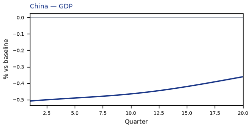

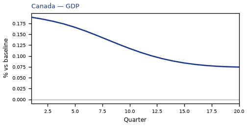

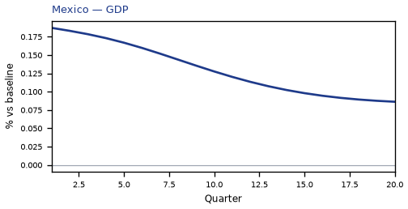

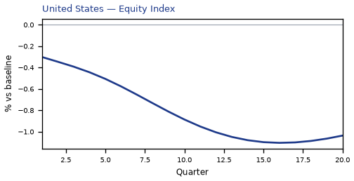

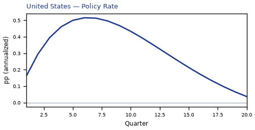

## CN — China

The main impact of bilateral tariffs at 25% on China is a large drop in GDP of 0.51% by Q1. This is a model impulse response versus baseline, not a forecast. Equities soften 1.07% by Q1. The three-year CPI impulse is +0.66 percentage points.

Demand and trade. Government debt falls 4.59% by Q20; private investment / the cost of capital falls 1.43% by Q1; the trade balance (net exports — this model does not split imports from exports) softens to -0.45% in Q1; household consumption falls 0.38% by Q4; the same direction shows up in government spending.

Labour. Real wages falls 0.59% by Q20; employment falls 0.44% by Q17; unemployment rises by +0.11 percentage points in Q10.

Prices. Firms' marginal cost falls 0.30% by Q1; CPI inflation rises 0.09 percentage points by Q1; domestic inflation rises 0.07 percentage points by Q1.

Policy rates and the government curve. 30-year bond prices rally 2.08% by Q8; 10-year bond prices rally 1.63% by Q14; bond prices (higher discount rates) rally 1.05% by Q20; 5-year bond prices rally 1.01% by Q20; the same direction shows up in 2-year bond prices, 2-year government yields, 5-year government yields; the rest of the government curve barely moves.

Exchange rates. Versus the dollar the home currency is weaker versus the dollar (+0.87% in Q20); the NEER prints a trade-weighted depreciation (-0.23% in Q20); the real exchange rate shows a real depreciation (a weaker, more competitive home currency), peaking at +0.17% in Q20.

Equities and risk. Equity prices / financial conditions falls 1.07% by Q1; Tobin's Q (the value of installed capital) falls 1.00% by Q1; the VIX (global equity-implied volatility) stay close to baseline.

Housing and credit. House prices fall 0.68% by Q20; bank equity falls 0.22% by Q20; bank credit supply falls 0.17% by Q20; house prices and bank credit are close to unchanged.

Commodities. Other published commodity prices stay near their baselines.

Sectors and capital. Services output falls 0.30% by Q1; manufacturing output falls 0.16% by Q1; the capital stock falls 0.11% by Q20.

By Q20, GDP is still -0.36% from baseline.

These figures are model IRFs versus baseline, not forecasts and not financial advice.

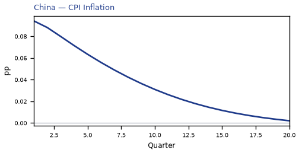

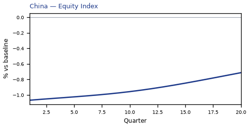

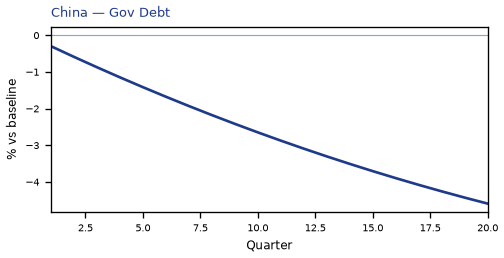

[Q1–Q20 JSON for China](numbers/CN.json)

## US — United States

The main impact of bilateral tariffs at 25% on the United States is a large drop in GDP of 0.33% by Q17. This is a model impulse response versus baseline, not a forecast. Equities soften 1.10% by Q16. The three-year CPI impulse is +1.19 percentage points.

Demand and trade. Private investment / the cost of capital falls 1.34% by Q11; government debt falls 0.80% by Q10; the trade balance (net exports — this model does not split imports from exports) improves to +0.26% in Q1; household consumption falls 0.22% by Q18; government spending stay close to baseline.

Labour. Real wages rises 0.49% by Q17; employment falls 0.38% by Q20; unemployment rises by +0.23 percentage points in Q20.

Prices. Firms' marginal cost falls 0.20% by Q17; CPI inflation rises 0.14 percentage points by Q2; domestic inflation rises 0.10 percentage points by Q2.

Policy rates and the government curve. Bond prices (higher discount rates) cheapen 3.37% by Q6; 5-year bond prices cheapen 1.40% by Q1; 10-year bond prices cheapen 1.02% by Q1; 2-year bond prices cheapen 0.89% by Q3; the same direction shows up in 30-year bond prices, the local policy rate, 3-month government yields; the rest of the government curve barely moves.

Exchange rates. The NEER prints a trade-weighted appreciation (+0.74% in Q20); versus the dollar the home currency is weaker versus the dollar (+0.74% in Q20); the real exchange rate shows a real appreciation (a stronger home currency), peaking at -0.70% in Q20.

Equities and risk. Equity prices / financial conditions falls 1.10% by Q16; Tobin's Q (the value of installed capital) falls 0.94% by Q11; the VIX (global equity-implied volatility) stay close to baseline.

Housing and credit. House prices fall 0.41% by Q20; house prices and bank credit are close to unchanged.

Commodities. Other published commodity prices stay near their baselines.

Sectors and capital. Services output falls 0.26% by Q17; manufacturing output rises 0.16% by Q20; the capital stock falls 0.11% by Q20.

By Q20, GDP is still -0.32% from baseline.

These figures are model IRFs versus baseline, not forecasts and not financial advice.

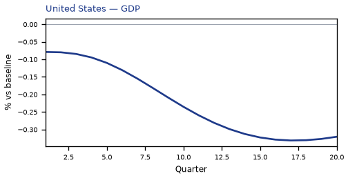

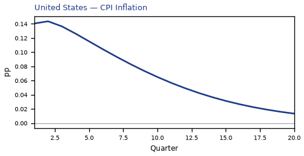

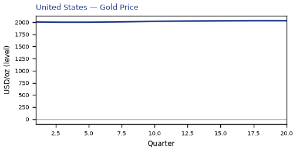

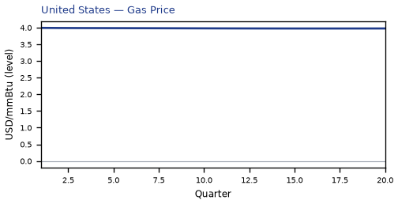

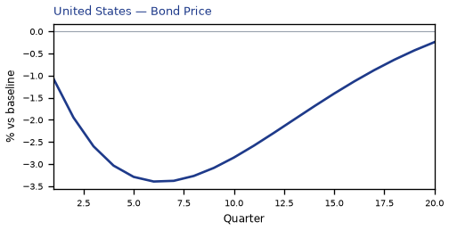

[Q1–Q20 JSON for United States](numbers/US.json)

## CA — Canada

The main impact of bilateral tariffs at 25% on Canada is a moderate rise in GDP of 0.19% by Q1. This is a model impulse response versus baseline, not a forecast. Equities firm 0.48% by Q1.

Demand and trade. Private investment / the cost of capital rises 0.50% by Q1; the trade balance (net exports — this model does not split imports from exports) improves to +0.25% in Q1; household consumption rises 0.11% by Q3; government spending, government debt stay close to baseline.

Labour. Employment rises 0.17% by Q7; real wages rises 0.16% by Q20; unemployment eases by -0.09 percentage points in Q7.

Prices. Firms' marginal cost rises 0.11% by Q1; CPI inflation, domestic inflation stay close to baseline.

Policy rates and the government curve. 30-year bond prices cheapen 0.70% by Q2; 10-year bond prices cheapen 0.41% by Q4; bond prices (higher discount rates) cheapen 0.37% by Q8; 5-year bond prices cheapen 0.23% by Q4; the same direction shows up in 2-year bond prices, the local policy rate, 3-month government yields; the rest of the government curve barely moves.

Exchange rates. Versus the dollar the home currency is weaker versus the dollar (+0.76% in Q18); the NEER prints a trade-weighted depreciation (-0.45% in Q17); the real exchange rate shows a real depreciation (a weaker, more competitive home currency), peaking at +0.09% in Q11.

Equities and risk. Equity prices / financial conditions rises 0.48% by Q1; Tobin's Q (the value of installed capital) rises 0.35% by Q1; the VIX (global equity-implied volatility) stay close to baseline.

Housing and credit. House prices rise 0.15% by Q20; house prices and bank credit are close to unchanged.

Commodities. Other published commodity prices stay near their baselines.

Sectors and capital. Services output rises 0.13% by Q1; manufacturing output, the capital stock stay close to baseline.

By Q20, GDP is still +0.07% from baseline.

These figures are model IRFs versus baseline, not forecasts and not financial advice.

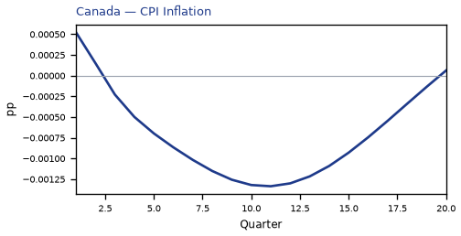

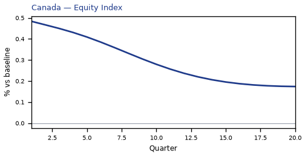

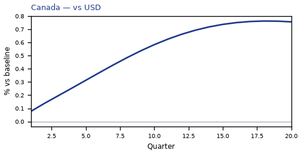

[Q1–Q20 JSON for Canada](numbers/CA.json)

## MX — Mexico

The main impact of bilateral tariffs at 25% on Mexico is a moderate rise in GDP of 0.19% by Q1. This is a model impulse response versus baseline, not a forecast. Equities firm 0.34% by Q1.

Demand and trade. Private investment / the cost of capital rises 0.52% by Q1; the trade balance (net exports — this model does not split imports from exports) improves to +0.26% in Q1; government debt rises 0.24% by Q20; household consumption rises 0.11% by Q4; government spending stay close to baseline.

Labour. Real wages rises 0.26% by Q20; employment rises 0.15% by Q11; unemployment stay close to baseline.

Prices. Firms' marginal cost rises 0.11% by Q1; CPI inflation, domestic inflation stay close to baseline.

Policy rates and the government curve. 30-year bond prices cheapen 0.36% by Q3; 10-year bond prices cheapen 0.22% by Q20; 5-year bond prices cheapen 0.12% by Q20; bond prices (higher discount rates) cheapen 0.10% by Q20; the rest of the government curve barely moves.

Exchange rates. Versus the dollar the home currency is weaker versus the dollar (+0.78% in Q19); the NEER prints a trade-weighted depreciation (-0.40% in Q17); the real exchange rate shows a real depreciation (a weaker, more competitive home currency), peaking at +0.09% in Q13.

Equities and risk. Tobin's Q (the value of installed capital) rises 0.36% by Q1; equity prices / financial conditions rises 0.34% by Q1; the VIX (global equity-implied volatility) stay close to baseline.

Housing and credit. House prices rise 0.21% by Q17; house prices and bank credit are close to unchanged.

Commodities. Other published commodity prices stay near their baselines.

Sectors and capital. Services output rises 0.11% by Q1; manufacturing output, the capital stock stay close to baseline.

By Q20, GDP is still +0.09% from baseline.

These figures are model IRFs versus baseline, not forecasts and not financial advice.

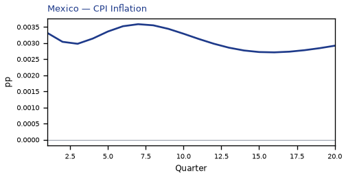

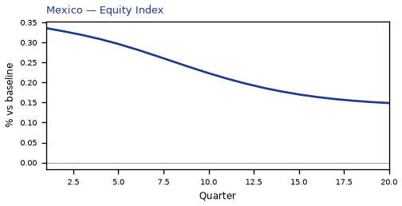

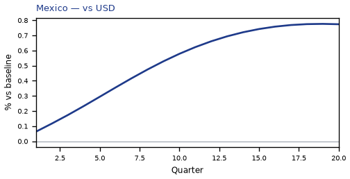

[Q1–Q20 JSON for Mexico](numbers/MX.json)

## MY — Malaysia

The main impact of bilateral tariffs at 25% on Malaysia is a moderate rise in GDP of 0.14% by Q1. This is a model impulse response versus baseline, not a forecast. Equities firm 0.38% by Q1.

Demand and trade. Private investment / the cost of capital rises 0.39% by Q1; government debt rises 0.25% by Q20; the trade balance (net exports — this model does not split imports from exports) improves to +0.20% in Q1; household consumption rises 0.10% by Q3; government spending stay close to baseline.

Labour. Real wages rises 0.19% by Q20; employment rises 0.12% by Q11; unemployment stay close to baseline.

Prices. Firms' marginal cost rises 0.09% by Q1; CPI inflation, domestic inflation stay close to baseline.

Policy rates and the government curve. 30-year bond prices cheapen 0.42% by Q3; 10-year bond prices cheapen 0.25% by Q14; 5-year bond prices cheapen 0.14% by Q20; bond prices (higher discount rates) cheapen 0.12% by Q20; the rest of the government curve barely moves.

Exchange rates. Versus the dollar the home currency is weaker versus the dollar (+0.70% in Q19); the NEER prints a trade-weighted depreciation (-0.08% in Q13); the real exchange rate stay close to baseline.

Equities and risk. Equity prices / financial conditions rises 0.38% by Q1; Tobin's Q (the value of installed capital) rises 0.27% by Q1; the VIX (global equity-implied volatility) stay close to baseline.

Housing and credit. House prices rise 0.19% by Q20; house prices and bank credit are close to unchanged.

Commodities. Other published commodity prices stay near their baselines.

Sectors and capital. Services output rises 0.08% by Q1; manufacturing output, the capital stock stay close to baseline.

By Q20, GDP is still +0.08% from baseline.

These figures are model IRFs versus baseline, not forecasts and not financial advice.

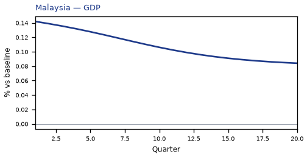

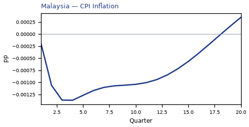

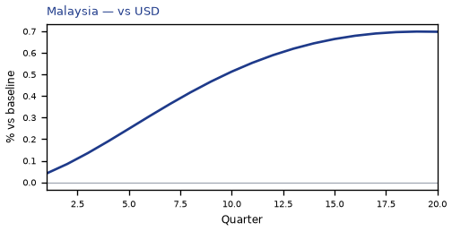

[Q1–Q20 JSON for Malaysia](numbers/MY.json)

## TH — Thailand

The main impact of bilateral tariffs at 25% on Thailand is a moderate rise in GDP of 0.12% by Q1. This is a model impulse response versus baseline, not a forecast. Equities firm 0.31% by Q1.

Demand and trade. Private investment / the cost of capital rises 0.34% by Q1; government debt rises 0.19% by Q20; the trade balance (net exports — this model does not split imports from exports) improves to +0.18% in Q1; household consumption, government spending stay close to baseline.

Labour. Real wages rises 0.17% by Q20; employment rises 0.11% by Q10; unemployment stay close to baseline.

Prices. CPI inflation, domestic inflation, firms' marginal cost stay close to baseline.

Policy rates and the government curve. 30-year bond prices cheapen 0.41% by Q4; 10-year bond prices cheapen 0.26% by Q18; 5-year bond prices cheapen 0.15% by Q20; bond prices (higher discount rates) cheapen 0.12% by Q20; the rest of the government curve barely moves.

Exchange rates. Versus the dollar the home currency is weaker versus the dollar (+0.66% in Q20); the real exchange rate, the nominal effective exchange rate (increase = trade-weighted appreciation) stay close to baseline.

Equities and risk. Equity prices / financial conditions rises 0.31% by Q1; Tobin's Q (the value of installed capital) rises 0.24% by Q1; the VIX (global equity-implied volatility) stay close to baseline.

Housing and credit. House prices rise 0.17% by Q20; house prices and bank credit are close to unchanged.

Commodities. Other published commodity prices stay near their baselines.

Sectors and capital. Manufacturing output, services output, the capital stock stay close to baseline.

By Q20, GDP is still +0.08% from baseline.

These figures are model IRFs versus baseline, not forecasts and not financial advice.

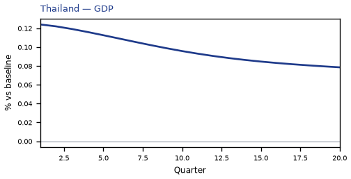

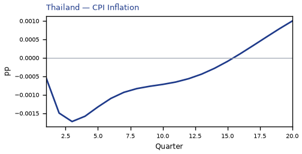

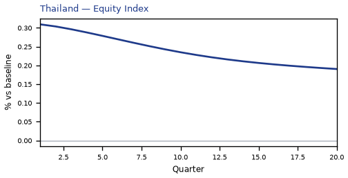

[Q1–Q20 JSON for Thailand](numbers/TH.json)

## KR — South Korea

The main impact of bilateral tariffs at 25% on South Korea is a moderate rise in GDP of 0.11% by Q1. This is a model impulse response versus baseline, not a forecast. Equities firm 0.28% by Q1.

Demand and trade. Private investment / the cost of capital rises 0.30% by Q1; the trade balance (net exports — this model does not split imports from exports) improves to +0.18% in Q3; household consumption, government spending, government debt stay close to baseline.

Labour. Real wages rises 0.15% by Q20; employment rises 0.09% by Q11; unemployment stay close to baseline.

Prices. CPI inflation, domestic inflation, firms' marginal cost stay close to baseline.

Policy rates and the government curve. 30-year bond prices cheapen 0.35% by Q2; 10-year bond prices cheapen 0.23% by Q8; bond prices (higher discount rates) cheapen 0.14% by Q20; 5-year bond prices cheapen 0.13% by Q20; the rest of the government curve barely moves.

Exchange rates. Versus the dollar the home currency is weaker versus the dollar (+0.60% in Q20); the real exchange rate shows a real appreciation (a stronger home currency), peaking at -0.10% in Q20; the nominal effective exchange rate (increase = trade-weighted appreciation) stay close to baseline.

Equities and risk. Equity prices / financial conditions rises 0.28% by Q1; Tobin's Q (the value of installed capital) rises 0.21% by Q1; the VIX (global equity-implied volatility) stay close to baseline.

Housing and credit. House prices rise 0.12% by Q20; house prices and bank credit are close to unchanged.

Commodities. Other published commodity prices stay near their baselines.

Sectors and capital. Manufacturing output, services output, the capital stock stay close to baseline.

By Q20, GDP is still +0.06% from baseline.

These figures are model IRFs versus baseline, not forecasts and not financial advice.

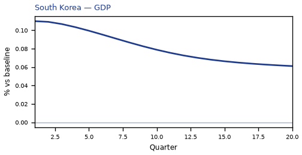

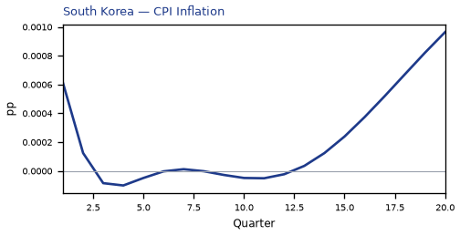

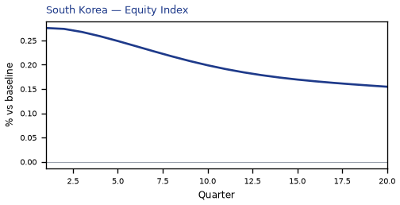

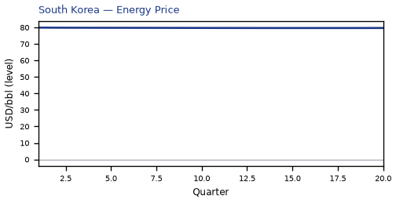

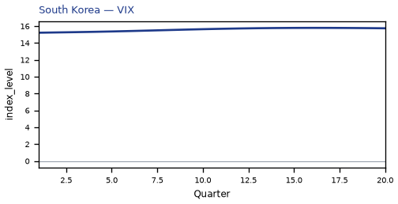

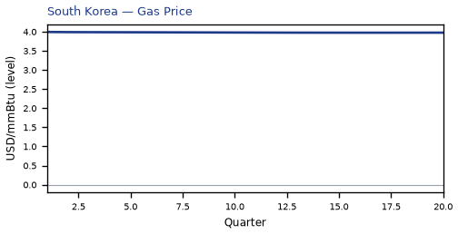

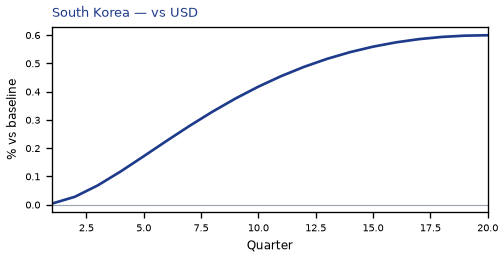

[Q1–Q20 JSON for South Korea](numbers/KR.json)

## CL — Chile

The main impact of bilateral tariffs at 25% on Chile is only a small rise in GDP of 0.10% by Q1. This is a model impulse response versus baseline, not a forecast. Equities firm 0.23% by Q1.

Demand and trade. Private investment / the cost of capital rises 0.28% by Q1; the trade balance (net exports — this model does not split imports from exports) improves to +0.13% in Q1; government debt rises 0.09% by Q20; household consumption, government spending stay close to baseline.

Labour. Real wages rises 0.14% by Q20; employment rises 0.09% by Q10; unemployment stay close to baseline.

Prices. CPI inflation, domestic inflation, firms' marginal cost stay close to baseline.

Policy rates and the government curve. 30-year bond prices cheapen 0.23% by Q10; 10-year bond prices cheapen 0.16% by Q20; 5-year bond prices cheapen 0.09% by Q20; the rest of the government curve barely moves.

Exchange rates. Versus the dollar the home currency is weaker versus the dollar (+0.84% in Q18); the NEER prints a trade-weighted depreciation (-0.27% in Q13); the real exchange rate shows a real depreciation (a weaker, more competitive home currency), peaking at +0.18% in Q8.

Equities and risk. Equity prices / financial conditions rises 0.23% by Q1; Tobin's Q (the value of installed capital) rises 0.19% by Q1; the VIX (global equity-implied volatility) stay close to baseline.

Housing and credit. House prices rise 0.12% by Q20; house prices and bank credit are close to unchanged.

Commodities. Other published commodity prices stay near their baselines.

Sectors and capital. Manufacturing output, services output, the capital stock stay close to baseline.

By Q20, GDP is still +0.06% from baseline.

These figures are model IRFs versus baseline, not forecasts and not financial advice.

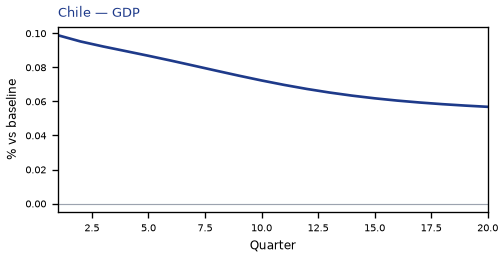

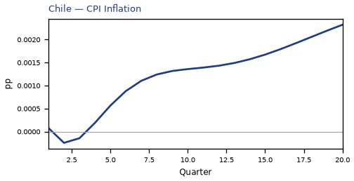

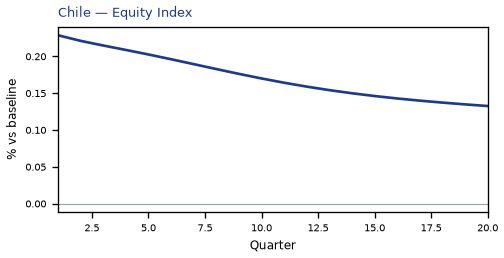

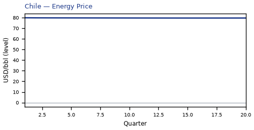

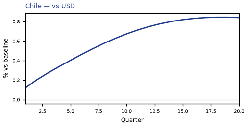

[Q1–Q20 JSON for Chile](numbers/CL.json)

## SA — Saudi Arabia

The main impact of bilateral tariffs at 25% on Saudi Arabia is only a small drop in GDP of 0.10% by Q16. This is a model impulse response versus baseline, not a forecast. Equities soften 0.43% by Q15. The three-year CPI impulse is -0.14 percentage points.

Demand and trade. Private investment / the cost of capital falls 0.87% by Q8; government debt falls 0.15% by Q20; the trade balance (net exports — this model does not split imports from exports) softens to -0.10% in Q17; household consumption, government spending stay close to baseline.

Labour. Real wages falls 0.13% by Q20; employment falls 0.10% by Q20; unemployment stay close to baseline.

Prices. CPI inflation, domestic inflation, firms' marginal cost stay close to baseline.

Policy rates and the government curve. Bond prices (higher discount rates) cheapen 2.56% by Q6; 5-year bond prices cheapen 1.40% by Q1; 10-year bond prices cheapen 1.02% by Q1; 2-year bond prices cheapen 0.89% by Q3; the same direction shows up in 30-year bond prices, the local policy rate, 3-month government yields; the rest of the government curve barely moves.

Exchange rates. The real exchange rate shows a real appreciation (a stronger home currency), peaking at -0.38% in Q15; versus the dollar the home currency is weaker versus the dollar (+0.35% in Q20); the NEER prints a trade-weighted appreciation (+0.30% in Q15).

Equities and risk. Tobin's Q (the value of installed capital) falls 0.61% by Q8; equity prices / financial conditions falls 0.43% by Q15; the VIX (global equity-implied volatility) stay close to baseline.

Housing and credit. House prices fall 0.18% by Q20; house prices and bank credit are close to unchanged.

Commodities. Other published commodity prices stay near their baselines.

Sectors and capital. Manufacturing output rises 0.11% by Q15; services output, the capital stock stay close to baseline.

By Q20, GDP is still -0.08% from baseline.

These figures are model IRFs versus baseline, not forecasts and not financial advice.

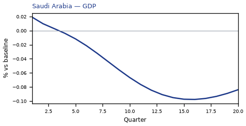

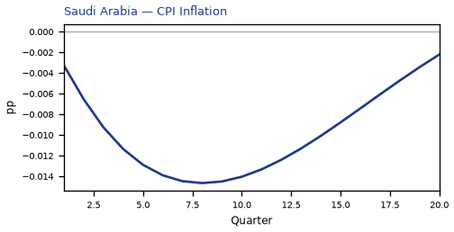

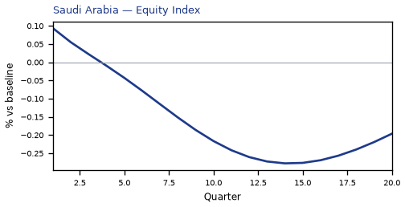

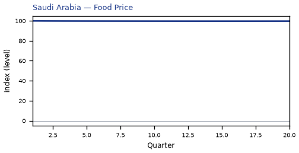

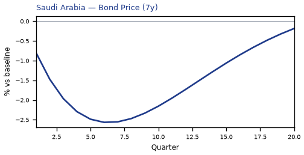

[Q1–Q20 JSON for Saudi Arabia](numbers/SA.json)

## CH — Switzerland

The main impact of bilateral tariffs at 25% on Switzerland is only a small rise in GDP of 0.09% by Q1. This is a model impulse response versus baseline, not a forecast. Equities firm 0.36% by Q1.

Demand and trade. Private investment / the cost of capital rises 0.25% by Q1; the trade balance (net exports — this model does not split imports from exports) improves to +0.11% in Q1; household consumption, government spending, government debt stay close to baseline.

Labour. Employment, unemployment, real wages stay close to baseline.

Prices. CPI inflation, domestic inflation, firms' marginal cost stay close to baseline.

Policy rates and the government curve. 30-year bond prices cheapen 0.26% by Q5; 10-year bond prices cheapen 0.16% by Q20; bond prices (higher discount rates) cheapen 0.11% by Q20; 5-year bond prices cheapen 0.09% by Q20; the rest of the government curve barely moves.

Exchange rates. Versus the dollar the home currency is weaker versus the dollar (+0.65% in Q20); the real exchange rate, the nominal effective exchange rate (increase = trade-weighted appreciation) stay close to baseline.

Equities and risk. Equity prices / financial conditions rises 0.36% by Q1; Tobin's Q (the value of installed capital) rises 0.18% by Q1; the VIX (global equity-implied volatility) stay close to baseline.

Housing and credit. House prices rise 0.10% by Q20; house prices and bank credit are close to unchanged.

Commodities. Other published commodity prices stay near their baselines.

Sectors and capital. Manufacturing output, services output, the capital stock stay close to baseline.

By Q20, GDP is still +0.06% from baseline.

These figures are model IRFs versus baseline, not forecasts and not financial advice.

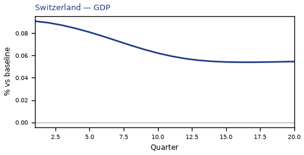

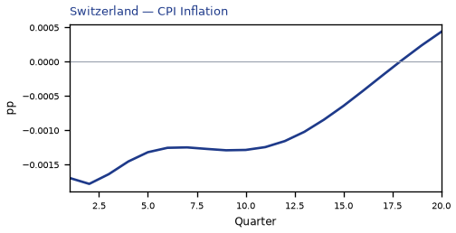

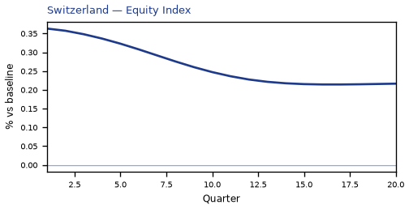

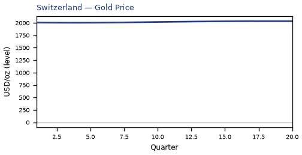

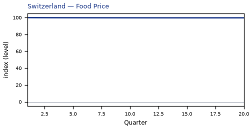

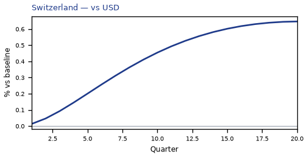

[Q1–Q20 JSON for Switzerland](numbers/CH.json)

## ZA — South Africa

The main impact of bilateral tariffs at 25% on South Africa is only a small rise in GDP of 0.07% by Q1. This is a model impulse response versus baseline, not a forecast. Equities firm 0.29% by Q1.

Demand and trade. Private investment / the cost of capital rises 0.21% by Q1; the trade balance (net exports — this model does not split imports from exports) improves to +0.10% in Q1; household consumption, government spending, government debt stay close to baseline.

Labour. Real wages rises 0.11% by Q20; employment, unemployment stay close to baseline.

Prices. CPI inflation, domestic inflation, firms' marginal cost stay close to baseline.

Policy rates and the government curve. 30-year bond prices cheapen 0.14% by Q14; 10-year bond prices cheapen 0.10% by Q20; the rest of the government curve barely moves.

Exchange rates. Versus the dollar the home currency is weaker versus the dollar (+0.82% in Q19); the NEER prints a trade-weighted depreciation (-0.19% in Q11); the real exchange rate shows a real depreciation (a weaker, more competitive home currency), peaking at +0.14% in Q9.

Equities and risk. Equity prices / financial conditions rises 0.29% by Q1; Tobin's Q (the value of installed capital) rises 0.15% by Q1; the VIX (global equity-implied volatility) stay close to baseline.

Housing and credit. House prices rise 0.10% by Q20; house prices and bank credit are close to unchanged.

Commodities. Other published commodity prices stay near their baselines.

Sectors and capital. Manufacturing output, services output, the capital stock stay close to baseline.

By Q20, GDP is still +0.05% from baseline.

These figures are model IRFs versus baseline, not forecasts and not financial advice.

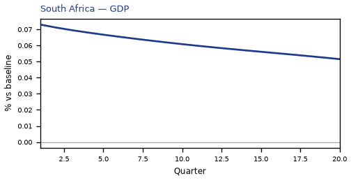

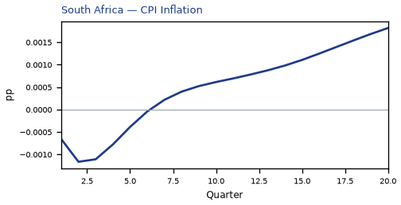

[Q1–Q20 JSON for South Africa](numbers/ZA.json)

## JP — Japan

The main impact of bilateral tariffs at 25% on Japan is only a small rise in GDP of 0.06% by Q1. This is a model impulse response versus baseline, not a forecast. Equities firm 0.18% by Q2.

Demand and trade. Private investment / the cost of capital rises 0.18% by Q2; the trade balance (net exports — this model does not split imports from exports) improves to +0.11% in Q5; household consumption, government spending, government debt stay close to baseline.

Labour. Employment, unemployment, real wages stay close to baseline.

Prices. CPI inflation, domestic inflation, firms' marginal cost stay close to baseline.

Policy rates and the government curve. The rest of the government curve barely moves.

Exchange rates. Versus the dollar the home currency is weaker versus the dollar (+0.63% in Q20); the real exchange rate, the nominal effective exchange rate (increase = trade-weighted appreciation) stay close to baseline.

Equities and risk. Equity prices / financial conditions rises 0.18% by Q2; Tobin's Q (the value of installed capital) rises 0.13% by Q2; the VIX (global equity-implied volatility) stay close to baseline.

Housing and credit. House prices and bank credit are close to unchanged.

Commodities. Other published commodity prices stay near their baselines.

Sectors and capital. Manufacturing output, services output, the capital stock stay close to baseline.

By Q20, GDP is still +0.04% from baseline.

These figures are model IRFs versus baseline, not forecasts and not financial advice.

[Q1–Q20 JSON for Japan](numbers/JP.json)

## CO — Colombia

The main impact of bilateral tariffs at 25% on Colombia is only a small rise in GDP of 0.04% by Q1. This is a model impulse response versus baseline, not a forecast.

Demand and trade. Private investment / the cost of capital rises 0.13% by Q3; household consumption, the trade balance, government spending, government debt stay close to baseline.

Labour. Employment, unemployment, real wages stay close to baseline.

Prices. CPI inflation, domestic inflation, firms' marginal cost stay close to baseline.

Policy rates and the government curve. 30-year bond prices cheapen 0.11% by Q19; 10-year bond prices cheapen 0.09% by Q20; the rest of the government curve barely moves.

Exchange rates. Versus the dollar the home currency is weaker versus the dollar (+0.82% in Q19); the NEER prints a trade-weighted depreciation (-0.28% in Q16); the real exchange rate shows a real depreciation (a weaker, more competitive home currency), peaking at +0.13% in Q16.

Equities and risk. Tobin's Q (the value of installed capital) rises 0.09% by Q3; equity prices / financial conditions, the VIX (global equity-implied volatility) stay close to baseline.

Housing and credit. House prices and bank credit are close to unchanged.

Commodities. Other published commodity prices stay near their baselines.

Sectors and capital. Manufacturing output, services output, the capital stock stay close to baseline.

By Q20, GDP is still +0.02% from baseline.

These figures are model IRFs versus baseline, not forecasts and not financial advice.

[Q1–Q20 JSON for Colombia](numbers/CO.json)

## IT — Italy

The main impact of bilateral tariffs at 25% on Italy is only a small rise in GDP of 0.04% by Q2. This is a model impulse response versus baseline, not a forecast.

Demand and trade. Private investment / the cost of capital rises 0.12% by Q3; household consumption, the trade balance, government spending, government debt stay close to baseline.

Labour. Employment, unemployment, real wages stay close to baseline.

Prices. CPI inflation, domestic inflation, firms' marginal cost stay close to baseline.

Policy rates and the government curve. The rest of the government curve barely moves.

Exchange rates. Versus the dollar the home currency is weaker versus the dollar (+0.68% in Q20); the real exchange rate, the nominal effective exchange rate (increase = trade-weighted appreciation) stay close to baseline.

Equities and risk. Tobin's Q (the value of installed capital) rises 0.09% by Q3; equity prices / financial conditions, the VIX (global equity-implied volatility) stay close to baseline.

Housing and credit. House prices and bank credit are close to unchanged.

Commodities. Other published commodity prices stay near their baselines.

Sectors and capital. Manufacturing output, services output, the capital stock stay close to baseline.

By Q20, GDP is still +0.03% from baseline.

These figures are model IRFs versus baseline, not forecasts and not financial advice.

[Q1–Q20 JSON for Italy](numbers/IT.json)

## AU — Australia

The main impact of bilateral tariffs at 25% on Australia is only a small rise in GDP of 0.04% by Q1. This is a model impulse response versus baseline, not a forecast. Equities firm 0.10% by Q1.

Demand and trade. Private investment / the cost of capital rises 0.11% by Q1; household consumption, the trade balance, government spending, government debt stay close to baseline.

Labour. Employment, unemployment, real wages stay close to baseline.

Prices. CPI inflation, domestic inflation, firms' marginal cost stay close to baseline.

Policy rates and the government curve. 30-year bond prices cheapen 0.19% by Q7; 10-year bond prices cheapen 0.12% by Q20; the rest of the government curve barely moves.

Exchange rates. Versus the dollar the home currency is weaker versus the dollar (+1.07% in Q17); the NEER prints a trade-weighted depreciation (-0.49% in Q11); the real exchange rate shows a real depreciation (a weaker, more competitive home currency), peaking at +0.43% in Q9.

Equities and risk. Equity prices / financial conditions rises 0.10% by Q1; the VIX (global equity-implied volatility), Tobin's Q (the value of installed capital) stay close to baseline.

Housing and credit. House prices and bank credit are close to unchanged.

Commodities. Other published commodity prices stay near their baselines.

Sectors and capital. Manufacturing output falls 0.12% by Q9; services output, the capital stock stay close to baseline.

By Q20, GDP is still +0.02% from baseline.

These figures are model IRFs versus baseline, not forecasts and not financial advice.

[Q1–Q20 JSON for Australia](numbers/AU.json)

## DE — Germany

The main impact of bilateral tariffs at 25% on Germany is only a small rise in GDP of 0.04% by Q2. This is a model impulse response versus baseline, not a forecast. Equities firm 0.08% by Q2.

Demand and trade. Private investment / the cost of capital rises 0.12% by Q2; household consumption, the trade balance, government spending, government debt stay close to baseline.

Labour. Employment, unemployment, real wages stay close to baseline.

Prices. CPI inflation, domestic inflation, firms' marginal cost stay close to baseline.

Policy rates and the government curve. The rest of the government curve barely moves.

Exchange rates. Versus the dollar the home currency is weaker versus the dollar (+0.68% in Q20); the real exchange rate, the nominal effective exchange rate (increase = trade-weighted appreciation) stay close to baseline.

Equities and risk. Tobin's Q (the value of installed capital) rises 0.08% by Q2; equity prices / financial conditions rises 0.08% by Q2; the VIX (global equity-implied volatility) stay close to baseline.

Housing and credit. House prices and bank credit are close to unchanged.

Commodities. Other published commodity prices stay near their baselines.

Sectors and capital. Manufacturing output, services output, the capital stock stay close to baseline.

By Q20, GDP is still +0.03% from baseline.

These figures are model IRFs versus baseline, not forecasts and not financial advice.

[Q1–Q20 JSON for Germany](numbers/DE.json)

## SE — Sweden

The main impact of bilateral tariffs at 25% on Sweden is only a small rise in GDP of 0.04% by Q1. This is a model impulse response versus baseline, not a forecast. Equities firm 0.11% by Q1.

Demand and trade. Private investment / the cost of capital rises 0.11% by Q2; household consumption, the trade balance, government spending, government debt stay close to baseline.

Labour. Employment, unemployment, real wages stay close to baseline.

Prices. CPI inflation, domestic inflation, firms' marginal cost stay close to baseline.

Policy rates and the government curve. The rest of the government curve barely moves.

Exchange rates. Versus the dollar the home currency is weaker versus the dollar (+0.76% in Q20); the NEER prints a trade-weighted depreciation (-0.08% in Q12); the real exchange rate stay close to baseline.

Equities and risk. Equity prices / financial conditions rises 0.11% by Q1; the VIX (global equity-implied volatility), Tobin's Q (the value of installed capital) stay close to baseline.

Housing and credit. House prices and bank credit are close to unchanged.

Commodities. Other published commodity prices stay near their baselines.

Sectors and capital. Manufacturing output, services output, the capital stock stay close to baseline.

By Q20, GDP is still +0.03% from baseline.

These figures are model IRFs versus baseline, not forecasts and not financial advice.

[Q1–Q20 JSON for Sweden](numbers/SE.json)

## BR — Brazil

The main impact of bilateral tariffs at 25% on Brazil is only a small rise in GDP of 0.03% by Q1. This is a model impulse response versus baseline, not a forecast.

Demand and trade. Private investment / the cost of capital rises 0.11% by Q4; household consumption, the trade balance, government spending, government debt stay close to baseline.

Labour. Employment, unemployment, real wages stay close to baseline.

Prices. CPI inflation, domestic inflation, firms' marginal cost stay close to baseline.

Policy rates and the government curve. 10-year bond prices cheapen 0.09% by Q17; 30-year bond prices cheapen 0.08% by Q16; the rest of the government curve barely moves.

Exchange rates. Versus the dollar the home currency is weaker versus the dollar (+0.79% in Q19); the NEER prints a trade-weighted depreciation (-0.21% in Q15); the real exchange rate shows a real depreciation (a weaker, more competitive home currency), peaking at +0.10% in Q15.

Equities and risk. Equity prices / financial conditions, the VIX (global equity-implied volatility), Tobin's Q (the value of installed capital) stay close to baseline.

Housing and credit. House prices and bank credit are close to unchanged.

Commodities. Other published commodity prices stay near their baselines.

Sectors and capital. Manufacturing output, services output, the capital stock stay close to baseline.

By Q20, GDP is still +0.02% from baseline.

These figures are model IRFs versus baseline, not forecasts and not financial advice.

[Q1–Q20 JSON for Brazil](numbers/BR.json)

## IN — India

The main impact of bilateral tariffs at 25% on India is only a small rise in GDP of 0.03% by Q16. This is a model impulse response versus baseline, not a forecast. Equities firm 0.09% by Q15.

Demand and trade. Private investment / the cost of capital rises 0.11% by Q10; household consumption, the trade balance, government spending, government debt stay close to baseline.

Labour. Employment, unemployment, real wages stay close to baseline.

Prices. CPI inflation, domestic inflation, firms' marginal cost stay close to baseline.

Policy rates and the government curve. Bond prices (higher discount rates) rally 0.12% by Q5; 10-year bond prices cheapen 0.10% by Q18; 30-year bond prices cheapen 0.09% by Q17; the rest of the government curve barely moves.

Exchange rates. Versus the dollar the home currency is weaker versus the dollar (+0.71% in Q20); the real exchange rate, the nominal effective exchange rate (increase = trade-weighted appreciation) stay close to baseline.

Equities and risk. Equity prices / financial conditions rises 0.09% by Q15; the VIX (global equity-implied volatility), Tobin's Q (the value of installed capital) stay close to baseline.

Housing and credit. House prices and bank credit are close to unchanged.

Commodities. Other published commodity prices stay near their baselines.

Sectors and capital. Manufacturing output, services output, the capital stock stay close to baseline.

By Q20, GDP is still +0.03% from baseline.

These figures are model IRFs versus baseline, not forecasts and not financial advice.

[Q1–Q20 JSON for India](numbers/IN.json)

## UK — United Kingdom

The main impact of bilateral tariffs at 25% on United Kingdom is only a small rise in GDP of 0.03% by Q1. This is a model impulse response versus baseline, not a forecast.

Demand and trade. Private investment / the cost of capital rises 0.09% by Q1; household consumption, the trade balance, government spending, government debt stay close to baseline.

Labour. Employment, unemployment, real wages stay close to baseline.

Prices. CPI inflation, domestic inflation, firms' marginal cost stay close to baseline.

Policy rates and the government curve. The rest of the government curve barely moves.

Exchange rates. Versus the dollar the home currency is weaker versus the dollar (+0.69% in Q20); the real exchange rate, the nominal effective exchange rate (increase = trade-weighted appreciation) stay close to baseline.

Equities and risk. Equity prices / financial conditions, the VIX (global equity-implied volatility), Tobin's Q (the value of installed capital) stay close to baseline.

Housing and credit. House prices and bank credit are close to unchanged.

Commodities. Other published commodity prices stay near their baselines.

Sectors and capital. Manufacturing output, services output, the capital stock stay close to baseline.

The GDP response has mostly faded by Q9 (Q20 is still +0.01%).

These figures are model IRFs versus baseline, not forecasts and not financial advice.

[Q1–Q20 JSON for United Kingdom](numbers/UK.json)

## AR — Argentina

The main impact of bilateral tariffs at 25% on Argentina is almost no rise in GDP of 0.03% by Q15. This is a model impulse response versus baseline, not a forecast. This has almost no impact on Argentina.

[Q1–Q20 JSON for Argentina](numbers/AR.json)

## NO — Norway

The main impact of bilateral tariffs at 25% on Norway is only a small drop in GDP of 0.03% by Q15. This is a model impulse response versus baseline, not a forecast.

Demand and trade. Household consumption, private investment / the cost of capital, the trade balance, government spending stay close to baseline.

Labour. Employment, unemployment, real wages stay close to baseline.

Prices. CPI inflation, domestic inflation, firms' marginal cost stay close to baseline.

Policy rates and the government curve. Bond prices (higher discount rates) rally 0.12% by Q16; 10-year bond prices rally 0.08% by Q1; the rest of the government curve barely moves.

Exchange rates. Versus the dollar the home currency is weaker versus the dollar (+0.89% in Q20); the NEER prints a trade-weighted depreciation (-0.23% in Q17); the real exchange rate shows a real depreciation (a weaker, more competitive home currency), peaking at +0.19% in Q17.

Equities and risk. Equity prices / financial conditions, the VIX (global equity-implied volatility), Tobin's Q (the value of installed capital) stay close to baseline.

Housing and credit. House prices and bank credit are close to unchanged.

Commodities. Other published commodity prices stay near their baselines.

Sectors and capital. Manufacturing output, services output, the capital stock stay close to baseline.

By Q20, GDP is still -0.02% from baseline.

These figures are model IRFs versus baseline, not forecasts and not financial advice.

[Q1–Q20 JSON for Norway](numbers/NO.json)

## TR — Turkey

The main impact of bilateral tariffs at 25% on Turkey is almost no rise in GDP of 0.03% by Q15. This is a model impulse response versus baseline, not a forecast. This has almost no impact on Turkey.

[Q1–Q20 JSON for Turkey](numbers/TR.json)

## FR — France

The main impact of bilateral tariffs at 25% on France is only a small rise in GDP of 0.03% by Q1. This is a model impulse response versus baseline, not a forecast.

Demand and trade. Household consumption, private investment / the cost of capital, the trade balance, government spending stay close to baseline.

Labour. Employment, unemployment, real wages stay close to baseline.

Prices. CPI inflation, domestic inflation, firms' marginal cost stay close to baseline.

Policy rates and the government curve. The rest of the government curve barely moves.

Exchange rates. Versus the dollar the home currency is weaker versus the dollar (+0.69% in Q20); the real exchange rate, the nominal effective exchange rate (increase = trade-weighted appreciation) stay close to baseline.

Equities and risk. Equity prices / financial conditions, the VIX (global equity-implied volatility), Tobin's Q (the value of installed capital) stay close to baseline.

Housing and credit. House prices and bank credit are close to unchanged.

Commodities. Other published commodity prices stay near their baselines.

Sectors and capital. Manufacturing output, services output, the capital stock stay close to baseline.

By Q20, GDP is still +0.02% from baseline.

These figures are model IRFs versus baseline, not forecasts and not financial advice.

[Q1–Q20 JSON for France](numbers/FR.json)

## ID — Indonesia

The main impact of bilateral tariffs at 25% on Indonesia is only a small rise in GDP of 0.03% by Q18. This is a model impulse response versus baseline, not a forecast.

Demand and trade. Private investment / the cost of capital rises 0.09% by Q5; household consumption, the trade balance, government spending, government debt stay close to baseline.

Labour. Employment, unemployment, real wages stay close to baseline.

Prices. CPI inflation, domestic inflation, firms' marginal cost stay close to baseline.

Policy rates and the government curve. 30-year bond prices cheapen 0.10% by Q19; 10-year bond prices cheapen 0.09% by Q20; the rest of the government curve barely moves.

Exchange rates. Versus the dollar the home currency is weaker versus the dollar (+0.74% in Q20); the real exchange rate, the nominal effective exchange rate (increase = trade-weighted appreciation) stay close to baseline.

Equities and risk. Equity prices / financial conditions, the VIX (global equity-implied volatility), Tobin's Q (the value of installed capital) stay close to baseline.

Housing and credit. House prices and bank credit are close to unchanged.

Commodities. Other published commodity prices stay near their baselines.

Sectors and capital. Manufacturing output, services output, the capital stock stay close to baseline.

By Q20, GDP is still +0.03% from baseline.

These figures are model IRFs versus baseline, not forecasts and not financial advice.

[Q1–Q20 JSON for Indonesia](numbers/ID.json)

## NG — Nigeria

The main impact of bilateral tariffs at 25% on Nigeria is almost no rise in GDP of 0.02% by Q18. This is a model impulse response versus baseline, not a forecast. The three-year CPI impulse is -0.06 percentage points. This has almost no impact on Nigeria.

[Q1–Q20 JSON for Nigeria](numbers/NG.json)

## RU — Russia

The main impact of bilateral tariffs at 25% on Russia is almost no drop in GDP of 0.02% by Q9. This is a model impulse response versus baseline, not a forecast. This has almost no impact on Russia.

[Q1–Q20 JSON for Russia](numbers/RU.json)

## NL — Netherlands

The main impact of bilateral tariffs at 25% on Netherlands is almost no rise in GDP of 0.02% by Q1. This is a model impulse response versus baseline, not a forecast. This has almost no impact on Netherlands.

[Q1–Q20 JSON for Netherlands](numbers/NL.json)

## ES — Spain

The main impact of bilateral tariffs at 25% on Spain is almost no rise in GDP of 0.02% by Q2. This is a model impulse response versus baseline, not a forecast. This has almost no impact on Spain.

[Q1–Q20 JSON for Spain](numbers/ES.json)

## PL — Poland

The main impact of bilateral tariffs at 25% on Poland is almost no rise in GDP of 0.01% by Q20. This is a model impulse response versus baseline, not a forecast. This has almost no impact on Poland.

[Q1–Q20 JSON for Poland](numbers/PL.json)

---

These figures are model IRFs versus baseline, not forecasts, and not financial advice.
