# Global Macro Economic Simulations and Financial Market Responses

v6 · IRF · evaluation

**Open the typeset report (this is the document):** https://robomacro.com/GlobalMacroTrainingDataset/tariff_us_cn_25/

GitHub and Hugging Face show `.html` as source code. That is not the report. Read it on robomacro.com, or keep scrolling this page.

## What's the impact of US-China tariffs 25% each way

### Active treatment

```json
{
  "bilateral_tariffs": [
    {
      "origin": "US",
      "target": "CN",
      "rate": 0.25
    },
    {
      "origin": "CN",
      "target": "US",
      "rate": 0.25
    }
  ]
}
```

### Assumptions

- Every path is a model impulse response versus baseline, not a forecast.
- The solver and weights are not included.
- English never enters the solver.

### Summary

This report traces the model response to bilateral tariffs at 25%. Every path is an impulse response versus an unchanged baseline — not a forecast and not market data. The question was: What's the impact of US-China tariffs 25% each way

China sees a -0.51% GDP peak at Q1, with CPI +0.67pp over three years and equities -1.07%. United States sees a -0.33% GDP peak at Q17, with CPI +1.20pp over three years and equities -1.11%. Canada sees a +0.19% GDP peak at Q1, with CPI -0.01pp over three years and equities +0.49%. Mexico sees a +0.19% GDP peak at Q1, with CPI +0.04pp over three years and equities +0.34%.

The remaining countries are smaller spillovers and are covered in the chapters that follow. This material is a model-based summary and is not financial advice.

### Countries by GDP impact

- [CN — China](#cn--china) · GDP -0.51% Q1
- [US — United States](#us--united-states) · GDP -0.33% Q17
- [CA — Canada](#ca--canada) · GDP +0.19% Q1
- [MX — Mexico](#mx--mexico) · GDP +0.19% Q1
- [MY — Malaysia](#my--malaysia) · GDP +0.14% Q1
- [TH — Thailand](#th--thailand) · GDP +0.12% Q1
- [KR — South Korea](#kr--south-korea) · GDP +0.11% Q1
- [CL — Chile](#cl--chile) · GDP +0.10% Q1
- [CH — Switzerland](#ch--switzerland) · GDP +0.09% Q1
- [ZA — South Africa](#za--south-africa) · GDP +0.07% Q1
- [JP — Japan](#jp--japan) · GDP +0.06% Q1
- [SA — Saudi Arabia](#sa--saudi-arabia) · GDP -0.06% Q16
- [CO — Colombia](#co--colombia) · GDP +0.04% Q1
- [IT — Italy](#it--italy) · GDP +0.04% Q2
- [AU — Australia](#au--australia) · GDP +0.04% Q1
- [DE — Germany](#de--germany) · GDP +0.04% Q1
- [SE — Sweden](#se--sweden) · GDP +0.04% Q1
- [BR — Brazil](#br--brazil) · GDP +0.04% Q1
- [UK — United Kingdom](#uk--united-kingdom) · GDP +0.03% Q1
- [IN — India](#in--india) · GDP +0.03% Q17
- [FR — France](#fr--france) · GDP +0.03% Q1
- [ID — Indonesia](#id--indonesia) · GDP +0.03% Q1
- [AR — Argentina](#ar--argentina) · GDP +0.03% Q16
- [TR — Turkey](#tr--turkey) · GDP +0.02% Q15
- [NG — Nigeria](#ng--nigeria) · GDP +0.02% Q18
- [NL — Netherlands](#nl--netherlands) · GDP +0.02% Q1
- [ES — Spain](#es--spain) · GDP +0.02% Q2
- [PL — Poland](#pl--poland) · GDP +0.01% Q2
- [NO — Norway](#no--norway) · GDP +0.01% Q1
- [RU — Russia](#ru--russia) · GDP +0.01% Q1


## CN — China

The main impact of bilateral tariffs at 25% on China would be a large drop in GDP of 0.51% by Q1. Equities peak at -1.07% in Q1.

Demand and trade. Consumption peaks at -0.38 % vs baseline in Q4, from -0.31 in Q1 to -0.28 in Q20. Investment peaks at -1.43 % vs baseline in Q1, from -1.43 in Q1 to -0.68 in Q20. Net Exports peaks at -0.45 % vs baseline in Q1, from -0.45 in Q1 to -0.31 in Q20. Gov Spending peaks at +0.09 % vs baseline in Q1, from +0.09 in Q1 to +0.06 in Q20. Gov Debt peaks at -4.59 % vs baseline in Q20, from -0.30 in Q1 to -4.59 in Q20.

External / FX. The real exchange rate shows real depreciation (a weaker, more competitive home currency). Currency Strength peaks at +0.17 % vs baseline in Q20, from +0.00 in Q1 to +0.17 in Q20.

Labour. Employment peaks at -0.45 % vs baseline in Q17, from -0.07 in Q1 to -0.44 in Q20. Unemployment peaks at +0.11 pp in Q10, from +0.03 in Q1 to +0.09 in Q20. Real Wages peaks at -0.59 % vs baseline in Q20, from -0.01 in Q1 to -0.59 in Q20.

Prices. The three-year CPI impulse is +0.67 percentage points. CPI Inflation peaks at +0.09 pp in Q1, from +0.09 in Q1 to +0.00 in Q20. Domestic Infl. peaks at +0.07 pp in Q1, from +0.07 in Q1 to +0.00 in Q20. Marginal Cost peaks at -0.31 % vs baseline in Q1, from -0.31 in Q1 to -0.22 in Q20.

Financial conditions. Policy Rate peaks at -0.21 pp (annualized) in Q20, from +0.00 in Q1 to -0.21 in Q20. Govt 2Y Yield peaks at -0.23 pp (annualized) in Q20, from -0.01 in Q1 to -0.23 in Q20. Govt 5Y Yield peaks at -0.23 pp (annualized) in Q20, from -0.09 in Q1 to -0.23 in Q20. Govt 10Y Yield peaks at -0.20 pp (annualized) in Q14, from -0.16 in Q1 to -0.19 in Q20. Bond Price peaks at +1.06 % vs baseline in Q20, from -0.02 in Q1 to +1.06 in Q20. Equity Index peaks at -1.07 % vs baseline in Q1, from -1.07 in Q1 to -0.72 in Q20. Tobin's Q peaks at -1.00 % vs baseline in Q1, from -1.00 in Q1 to -0.48 in Q20. House Prices peaks at -0.69 % vs baseline in Q20, from -0.08 in Q1 to -0.69 in Q20. Bank Credit peaks at -0.17 % vs baseline in Q20, from -0.02 in Q1 to -0.17 in Q20. Credit Spread peaks at +0.00 pp in Q20, from +0.00 in Q1 to +0.00 in Q20.

Sectoral and capital. Manuf. GDP peaks at -0.16 % vs baseline in Q1, from -0.16 in Q1 to -0.16 in Q20. Services GDP peaks at -0.30 % vs baseline in Q1, from -0.30 in Q1 to -0.21 in Q20. Capital Stock peaks at -0.11 % vs baseline in Q20, from -0.01 in Q1 to -0.11 in Q20.

Timing. By Q20 GDP is still -0.36% from baseline.

These figures are model IRFs versus baseline, not forecasts.


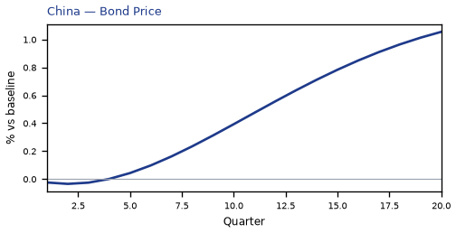

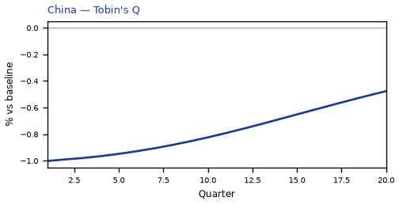

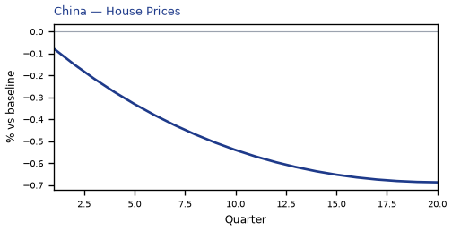

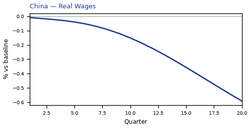

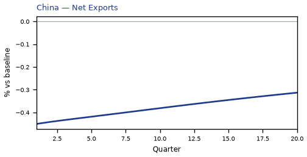

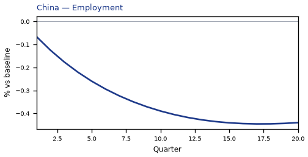

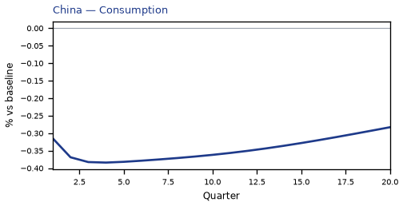

[Q1–Q20 JSON for China](numbers/CN.json)

## US — United States

The main impact of bilateral tariffs at 25% on the United States would be a large drop in GDP of 0.33% by Q17. Equities peak at -1.11% in Q16.

Demand and trade. Consumption peaks at -0.23 % vs baseline in Q18, from -0.07 in Q1 to -0.22 in Q20. Investment peaks at -1.34 % vs baseline in Q11, from -0.46 in Q1 to -0.95 in Q20. Net Exports peaks at +0.26 % vs baseline in Q1, from +0.26 in Q1 to +0.16 in Q20. Gov Spending peaks at +0.06 % vs baseline in Q17, from +0.02 in Q1 to +0.06 in Q20. Gov Debt peaks at -0.80 % vs baseline in Q10, from -0.30 in Q1 to -0.73 in Q20.

External / FX. The real exchange rate shows real appreciation (a stronger home currency). Currency Strength peaks at -0.71 % vs baseline in Q20, from -0.02 in Q1 to -0.71 in Q20.

Labour. Employment peaks at -0.38 % vs baseline in Q20, from -0.03 in Q1 to -0.38 in Q20. Unemployment peaks at +0.24 pp in Q20, from +0.01 in Q1 to +0.24 in Q20. Real Wages peaks at +0.49 % vs baseline in Q17, from -0.00 in Q1 to +0.47 in Q20.

Prices. The three-year CPI impulse is +1.20 percentage points. CPI Inflation peaks at +0.14 pp in Q2, from +0.14 in Q1 to +0.01 in Q20. Domestic Infl. peaks at +0.10 pp in Q2, from +0.10 in Q1 to +0.01 in Q20. Marginal Cost peaks at -0.20 % vs baseline in Q17, from -0.05 in Q1 to -0.19 in Q20.

Financial conditions. Policy Rate peaks at +0.52 pp (annualized) in Q6, from +0.16 in Q1 to +0.04 in Q20. Govt 2Y Yield peaks at +0.47 pp (annualized) in Q3, from +0.42 in Q1 to -0.03 in Q20. Govt 5Y Yield peaks at +0.31 pp (annualized) in Q1, from +0.31 in Q1 to -0.06 in Q20. Govt 10Y Yield peaks at +0.12 pp (annualized) in Q1, from +0.12 in Q1 to -0.05 in Q20. Bond Price peaks at -3.39 % vs baseline in Q6, from -1.07 in Q1 to -0.24 in Q20. Equity Index peaks at -1.11 % vs baseline in Q16, from -0.30 in Q1 to -1.04 in Q20. Tobin's Q peaks at -0.94 % vs baseline in Q11, from -0.32 in Q1 to -0.67 in Q20. House Prices peaks at -0.41 % vs baseline in Q20, from -0.01 in Q1 to -0.41 in Q20. Bank Credit peaks at -0.03 % vs baseline in Q20, from -0.00 in Q1 to -0.03 in Q20. Credit Spread peaks at +0.00 pp in Q20, from +0.00 in Q1 to +0.00 in Q20.

Sectoral and capital. Manuf. GDP peaks at +0.16 % vs baseline in Q20, from -0.00 in Q1 to +0.16 in Q20. Services GDP peaks at -0.26 % vs baseline in Q17, from -0.06 in Q1 to -0.25 in Q20. Capital Stock peaks at -0.11 % vs baseline in Q20, from -0.00 in Q1 to -0.11 in Q20.

Timing. By Q20 GDP is still -0.32% from baseline.

These figures are model IRFs versus baseline, not forecasts.


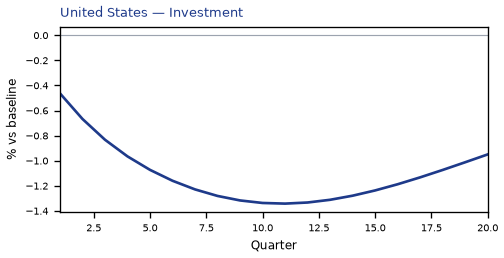

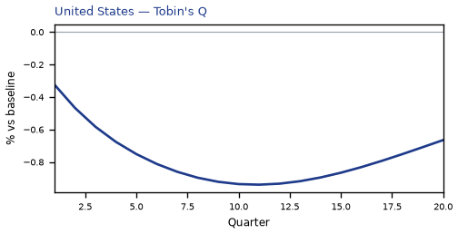

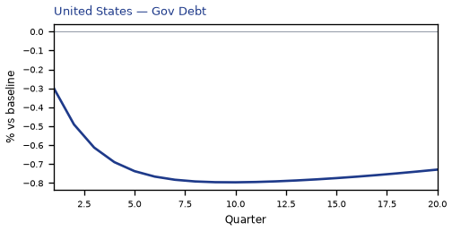

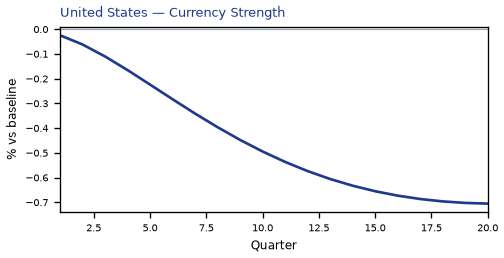


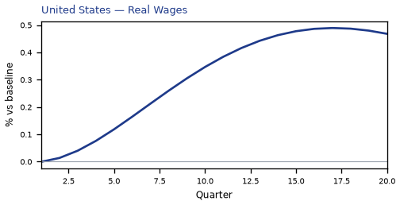

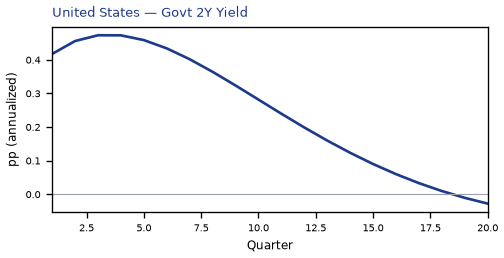

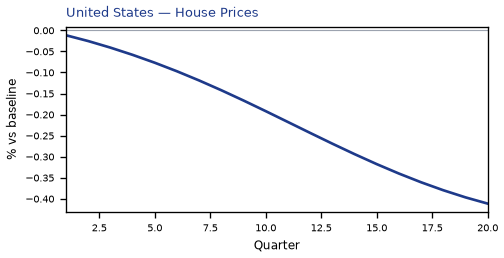

[Q1–Q20 JSON for United States](numbers/US.json)

## CA — Canada

The main impact of bilateral tariffs at 25% on Canada would be a moderate rise in GDP of 0.19% by Q1. Equities peak at +0.49% in Q1.

Demand and trade. Consumption peaks at +0.12 % vs baseline in Q3, from +0.10 in Q1 to +0.05 in Q20. Investment peaks at +0.50 % vs baseline in Q1, from +0.50 in Q1 to +0.14 in Q20. Net Exports peaks at +0.25 % vs baseline in Q1, from +0.25 in Q1 to +0.15 in Q20. Gov Spending peaks at -0.04 % vs baseline in Q2, from -0.04 in Q1 to -0.02 in Q20. Gov Debt peaks at +0.03 % vs baseline in Q18, from +0.00 in Q1 to +0.03 in Q20.

External / FX. The real exchange rate shows real depreciation (a weaker, more competitive home currency). Currency Strength peaks at +0.09 % vs baseline in Q4, from +0.05 in Q1 to +0.05 in Q20.

Labour. Employment peaks at +0.17 % vs baseline in Q7, from +0.06 in Q1 to +0.10 in Q20. Unemployment peaks at -0.09 pp in Q7, from -0.03 in Q1 to -0.05 in Q20. Real Wages peaks at +0.17 % vs baseline in Q20, from +0.00 in Q1 to +0.17 in Q20.

Prices. The three-year CPI impulse is -0.01 percentage points. CPI Inflation peaks at -0.00 pp in Q11, from +0.00 in Q1 to +0.00 in Q20. Domestic Infl. peaks at -0.00 pp in Q11, from +0.00 in Q1 to +0.00 in Q20. Marginal Cost peaks at +0.11 % vs baseline in Q1, from +0.11 in Q1 to +0.04 in Q20.

Financial conditions. Policy Rate peaks at +0.07 pp (annualized) in Q8, from +0.02 in Q1 to +0.05 in Q20. Govt 2Y Yield peaks at +0.06 pp (annualized) in Q5, from +0.05 in Q1 to +0.05 in Q20. Govt 5Y Yield peaks at +0.05 pp (annualized) in Q4, from +0.05 in Q1 to +0.05 in Q20. Govt 10Y Yield peaks at +0.05 pp (annualized) in Q4, from +0.05 in Q1 to +0.05 in Q20. Bond Price peaks at -0.39 % vs baseline in Q8, from -0.11 in Q1 to -0.27 in Q20. Equity Index peaks at +0.49 % vs baseline in Q1, from +0.49 in Q1 to +0.18 in Q20. Tobin's Q peaks at +0.35 % vs baseline in Q1, from +0.35 in Q1 to +0.10 in Q20. House Prices peaks at +0.15 % vs baseline in Q20, from +0.02 in Q1 to +0.15 in Q20. Bank Credit peaks at +0.01 % vs baseline in Q20, from +0.00 in Q1 to +0.01 in Q20. Credit Spread peaks at +0.00 pp in Q1, from +0.00 in Q1 to +0.00 in Q20.

Sectoral and capital. Manuf. GDP peaks at +0.02 % vs baseline in Q1, from +0.02 in Q1 to +0.01 in Q20. Services GDP peaks at +0.13 % vs baseline in Q1, from +0.13 in Q1 to +0.05 in Q20. Capital Stock peaks at +0.03 % vs baseline in Q20, from +0.00 in Q1 to +0.03 in Q20.

Timing. By Q20 GDP is still +0.07% from baseline.

These figures are model IRFs versus baseline, not forecasts.


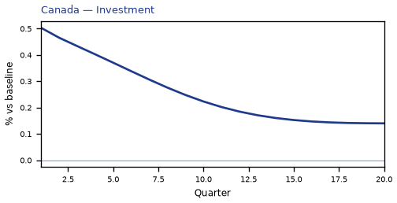

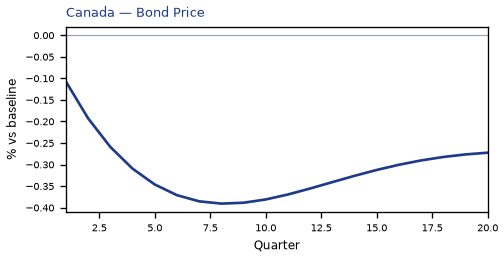

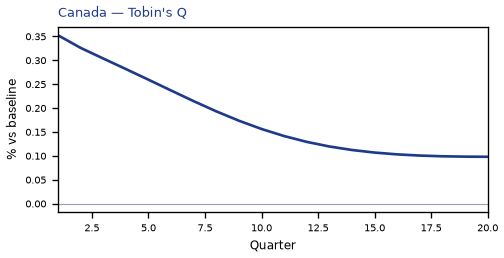

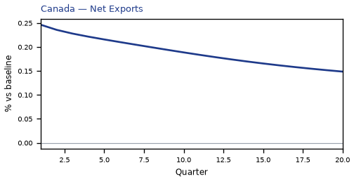

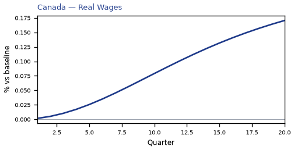

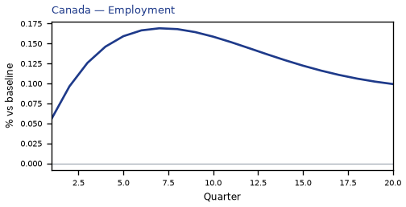

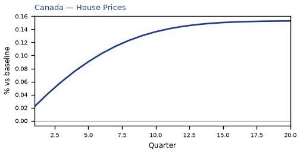

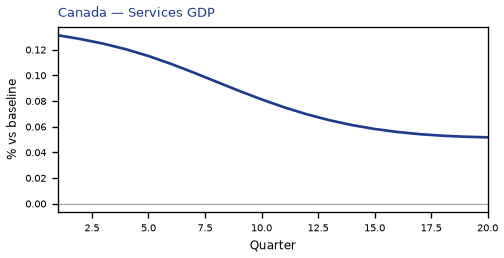

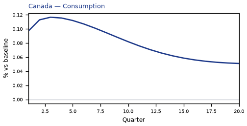

[Q1–Q20 JSON for Canada](numbers/CA.json)

## MX — Mexico

The main impact of bilateral tariffs at 25% on Mexico would be a moderate rise in GDP of 0.19% by Q1. Equities peak at +0.34% in Q1.

Demand and trade. Consumption peaks at +0.11 % vs baseline in Q4, from +0.09 in Q1 to +0.06 in Q20. Investment peaks at +0.52 % vs baseline in Q1, from +0.52 in Q1 to +0.21 in Q20. Net Exports peaks at +0.26 % vs baseline in Q1, from +0.26 in Q1 to +0.19 in Q20. Gov Spending peaks at -0.03 % vs baseline in Q2, from -0.03 in Q1 to -0.02 in Q20. Gov Debt peaks at +0.25 % vs baseline in Q20, from +0.03 in Q1 to +0.25 in Q20.

External / FX. The real exchange rate shows real depreciation (a weaker, more competitive home currency). Currency Strength peaks at +0.09 % vs baseline in Q13, from +0.04 in Q1 to +0.07 in Q20.

Labour. Employment peaks at +0.15 % vs baseline in Q11, from +0.03 in Q1 to +0.13 in Q20. Unemployment peaks at -0.02 pp in Q8, from -0.01 in Q1 to -0.01 in Q20. Real Wages peaks at +0.26 % vs baseline in Q20, from +0.00 in Q1 to +0.26 in Q20.

Prices. The three-year CPI impulse is +0.04 percentage points. CPI Inflation peaks at +0.00 pp in Q7, from +0.00 in Q1 to +0.00 in Q20. Domestic Infl. peaks at +0.00 pp in Q7, from +0.00 in Q1 to +0.00 in Q20. Marginal Cost peaks at +0.11 % vs baseline in Q1, from +0.11 in Q1 to +0.05 in Q20.

Financial conditions. Policy Rate peaks at +0.02 pp (annualized) in Q10, from +0.01 in Q1 to +0.02 in Q20. Govt 2Y Yield peaks at +0.03 pp (annualized) in Q20, from +0.02 in Q1 to +0.03 in Q20. Govt 5Y Yield peaks at +0.03 pp (annualized) in Q20, from +0.02 in Q1 to +0.03 in Q20. Govt 10Y Yield peaks at +0.03 pp (annualized) in Q20, from +0.02 in Q1 to +0.03 in Q20. Bond Price peaks at -0.10 % vs baseline in Q10, from -0.02 in Q1 to -0.10 in Q20. Equity Index peaks at +0.34 % vs baseline in Q1, from +0.34 in Q1 to +0.15 in Q20. Tobin's Q peaks at +0.36 % vs baseline in Q1, from +0.36 in Q1 to +0.14 in Q20. House Prices peaks at +0.21 % vs baseline in Q17, from +0.03 in Q1 to +0.21 in Q20. Bank Credit peaks at +0.00 % vs baseline in Q20, from +0.00 in Q1 to +0.00 in Q20. Credit Spread peaks at +0.00 pp in Q1, from +0.00 in Q1 to +0.00 in Q20.

Sectoral and capital. Manuf. GDP peaks at +0.04 % vs baseline in Q1, from +0.04 in Q1 to +0.01 in Q20. Services GDP peaks at +0.11 % vs baseline in Q1, from +0.11 in Q1 to +0.05 in Q20. Capital Stock peaks at +0.03 % vs baseline in Q20, from +0.00 in Q1 to +0.03 in Q20.

Timing. By Q20 GDP is still +0.09% from baseline.

These figures are model IRFs versus baseline, not forecasts.


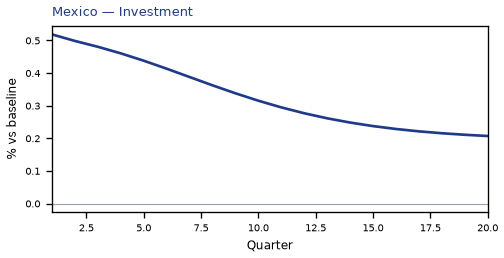

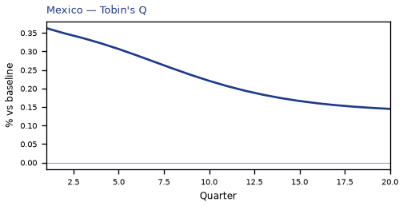

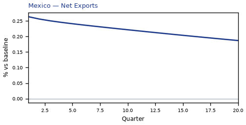

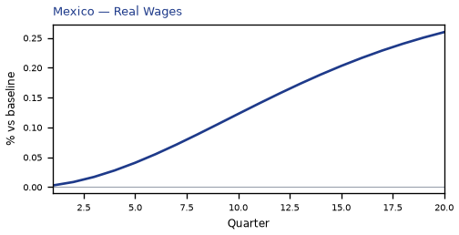

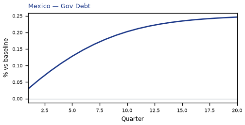

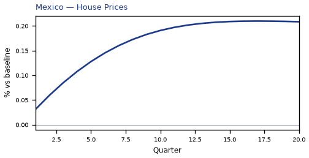

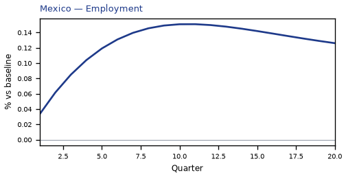

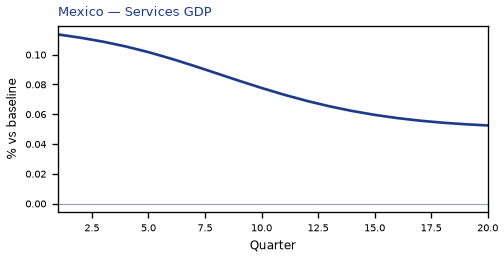


[Q1–Q20 JSON for Mexico](numbers/MX.json)

## MY — Malaysia

The main impact of bilateral tariffs at 25% on Malaysia would be a moderate rise in GDP of 0.14% by Q1. Equities peak at +0.38% in Q1.

Demand and trade. Consumption peaks at +0.10 % vs baseline in Q3, from +0.08 in Q1 to +0.06 in Q20. Investment peaks at +0.39 % vs baseline in Q1, from +0.39 in Q1 to +0.20 in Q20. Net Exports peaks at +0.20 % vs baseline in Q1, from +0.20 in Q1 to +0.13 in Q20. Gov Spending peaks at -0.02 % vs baseline in Q2, from -0.02 in Q1 to -0.02 in Q20. Gov Debt peaks at +0.25 % vs baseline in Q20, from +0.03 in Q1 to +0.25 in Q20.

External / FX. The real exchange rate shows real depreciation (a weaker, more competitive home currency). Currency Strength peaks at +0.03 % vs baseline in Q4, from +0.02 in Q1 to -0.01 in Q20.

Labour. Employment peaks at +0.12 % vs baseline in Q11, from +0.03 in Q1 to +0.11 in Q20. Unemployment peaks at -0.03 pp in Q8, from -0.01 in Q1 to -0.03 in Q20. Real Wages peaks at +0.19 % vs baseline in Q20, from +0.00 in Q1 to +0.19 in Q20.

Prices. The three-year CPI impulse is -0.01 percentage points. CPI Inflation peaks at -0.00 pp in Q4, from +0.00 in Q1 to +0.00 in Q20. Domestic Infl. peaks at -0.00 pp in Q4, from +0.00 in Q1 to +0.00 in Q20. Marginal Cost peaks at +0.09 % vs baseline in Q1, from +0.09 in Q1 to +0.05 in Q20.

Financial conditions. Policy Rate peaks at +0.03 pp (annualized) in Q20, from +0.01 in Q1 to +0.03 in Q20. Govt 2Y Yield peaks at +0.03 pp (annualized) in Q20, from +0.02 in Q1 to +0.03 in Q20. Govt 5Y Yield peaks at +0.03 pp (annualized) in Q20, from +0.03 in Q1 to +0.03 in Q20. Govt 10Y Yield peaks at +0.03 pp (annualized) in Q11, from +0.03 in Q1 to +0.03 in Q20. Bond Price peaks at -0.13 % vs baseline in Q20, from -0.03 in Q1 to -0.13 in Q20. Equity Index peaks at +0.38 % vs baseline in Q1, from +0.38 in Q1 to +0.23 in Q20. Tobin's Q peaks at +0.27 % vs baseline in Q1, from +0.27 in Q1 to +0.14 in Q20. House Prices peaks at +0.20 % vs baseline in Q20, from +0.03 in Q1 to +0.20 in Q20. Bank Credit peaks at +0.01 % vs baseline in Q20, from +0.00 in Q1 to +0.01 in Q20. Credit Spread peaks at +0.00 pp in Q1, from +0.00 in Q1 to +0.00 in Q20.

Sectoral and capital. Manuf. GDP peaks at +0.04 % vs baseline in Q1, from +0.04 in Q1 to +0.04 in Q20. Services GDP peaks at +0.08 % vs baseline in Q1, from +0.08 in Q1 to +0.05 in Q20. Capital Stock peaks at +0.03 % vs baseline in Q20, from +0.00 in Q1 to +0.03 in Q20.

Timing. By Q20 GDP is still +0.09% from baseline.

These figures are model IRFs versus baseline, not forecasts.


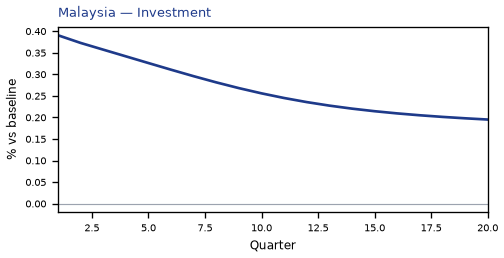

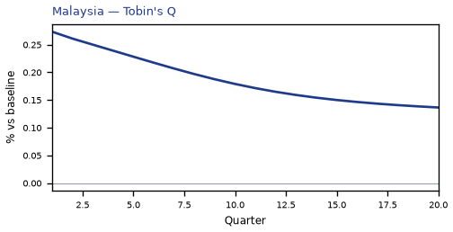

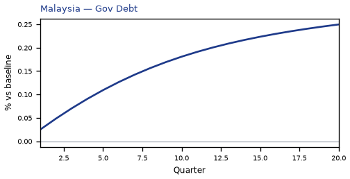

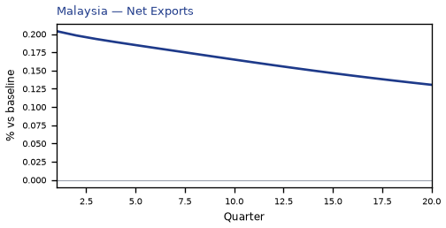

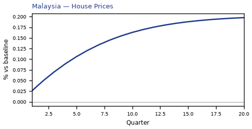


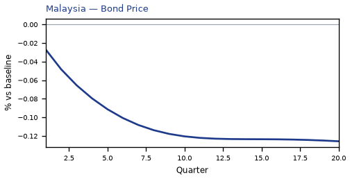

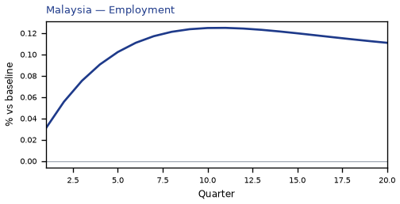

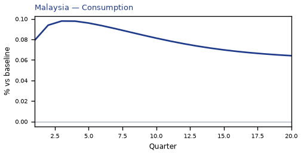

[Q1–Q20 JSON for Malaysia](numbers/MY.json)

## TH — Thailand

The main impact of bilateral tariffs at 25% on Thailand would be a moderate rise in GDP of 0.12% by Q1. Equities peak at +0.31% in Q1.

Demand and trade. Consumption peaks at +0.08 % vs baseline in Q4, from +0.06 in Q1 to +0.05 in Q20. Investment peaks at +0.34 % vs baseline in Q1, from +0.34 in Q1 to +0.17 in Q20. Net Exports peaks at +0.18 % vs baseline in Q1, from +0.18 in Q1 to +0.12 in Q20. Gov Spending peaks at -0.02 % vs baseline in Q1, from -0.02 in Q1 to -0.01 in Q20. Gov Debt peaks at +0.19 % vs baseline in Q20, from +0.02 in Q1 to +0.19 in Q20.

External / FX. The real exchange rate shows real appreciation (a stronger home currency). Currency Strength peaks at -0.04 % vs baseline in Q20, from +0.00 in Q1 to -0.04 in Q20.

Labour. Employment peaks at +0.11 % vs baseline in Q10, from +0.03 in Q1 to +0.10 in Q20. Unemployment peaks at -0.01 pp in Q8, from -0.00 in Q1 to -0.01 in Q20. Real Wages peaks at +0.17 % vs baseline in Q20, from +0.00 in Q1 to +0.17 in Q20.

Prices. The three-year CPI impulse is -0.01 percentage points. CPI Inflation peaks at -0.00 pp in Q3, from -0.00 in Q1 to +0.00 in Q20. Domestic Infl. peaks at -0.00 pp in Q3, from -0.00 in Q1 to +0.00 in Q20. Marginal Cost peaks at +0.07 % vs baseline in Q1, from +0.07 in Q1 to +0.05 in Q20.

Financial conditions. Policy Rate peaks at +0.03 pp (annualized) in Q20, from +0.01 in Q1 to +0.03 in Q20. Govt 2Y Yield peaks at +0.03 pp (annualized) in Q20, from +0.01 in Q1 to +0.03 in Q20. Govt 5Y Yield peaks at +0.03 pp (annualized) in Q20, from +0.02 in Q1 to +0.03 in Q20. Govt 10Y Yield peaks at +0.03 pp (annualized) in Q18, from +0.03 in Q1 to +0.03 in Q20. Bond Price peaks at -0.12 % vs baseline in Q20, from -0.02 in Q1 to -0.12 in Q20. Equity Index peaks at +0.31 % vs baseline in Q1, from +0.31 in Q1 to +0.18 in Q20. Tobin's Q peaks at +0.24 % vs baseline in Q1, from +0.24 in Q1 to +0.12 in Q20. House Prices peaks at +0.17 % vs baseline in Q20, from +0.02 in Q1 to +0.17 in Q20. Bank Credit peaks at +0.00 % vs baseline in Q20, from +0.00 in Q1 to +0.00 in Q20. Credit Spread peaks at +0.00 pp in Q1, from +0.00 in Q1 to +0.00 in Q20.

Sectoral and capital. Manuf. GDP peaks at +0.05 % vs baseline in Q20, from +0.04 in Q1 to +0.05 in Q20. Services GDP peaks at +0.07 % vs baseline in Q1, from +0.07 in Q1 to +0.04 in Q20. Capital Stock peaks at +0.02 % vs baseline in Q20, from +0.00 in Q1 to +0.02 in Q20.

Timing. By Q20 GDP is still +0.08% from baseline.

These figures are model IRFs versus baseline, not forecasts.


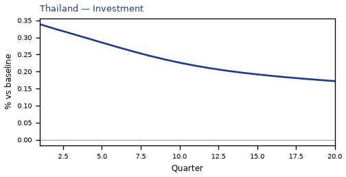

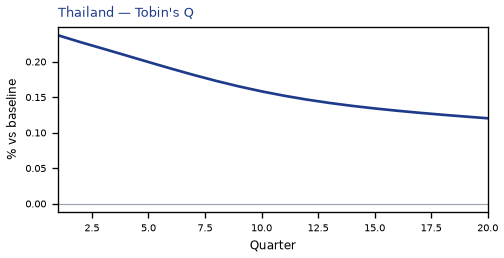

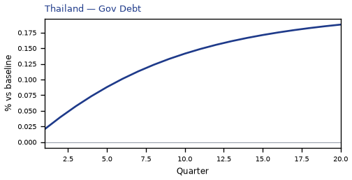


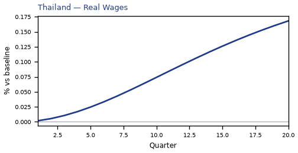


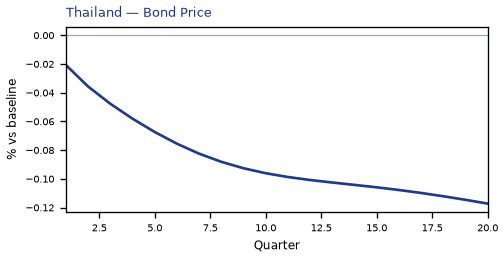

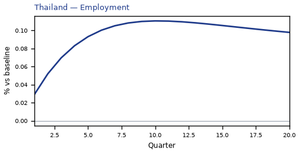

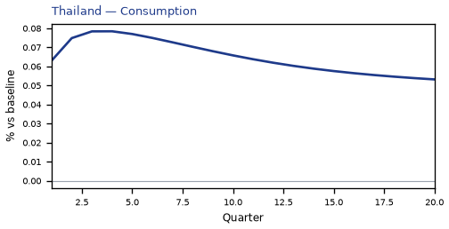

[Q1–Q20 JSON for Thailand](numbers/TH.json)

## KR — South Korea

The main impact of bilateral tariffs at 25% on South Korea would be a moderate rise in GDP of 0.11% by Q1. Equities peak at +0.27% in Q1.

Demand and trade. Consumption peaks at +0.07 % vs baseline in Q3, from +0.05 in Q1 to +0.04 in Q20. Investment peaks at +0.30 % vs baseline in Q1, from +0.30 in Q1 to +0.13 in Q20. Net Exports peaks at +0.18 % vs baseline in Q3, from +0.18 in Q1 to +0.15 in Q20. Gov Spending peaks at -0.02 % vs baseline in Q1, from -0.02 in Q1 to -0.01 in Q20. Gov Debt peaks at +0.07 % vs baseline in Q20, from +0.01 in Q1 to +0.07 in Q20.

External / FX. The real exchange rate shows real appreciation (a stronger home currency). Currency Strength peaks at -0.10 % vs baseline in Q20, from -0.02 in Q1 to -0.10 in Q20.

Labour. Employment peaks at +0.09 % vs baseline in Q10, from +0.02 in Q1 to +0.08 in Q20. Unemployment peaks at -0.04 pp in Q8, from -0.01 in Q1 to -0.03 in Q20. Real Wages peaks at +0.15 % vs baseline in Q20, from +0.00 in Q1 to +0.15 in Q20.

Prices. The three-year CPI impulse is +0.00 percentage points. CPI Inflation peaks at +0.00 pp in Q20, from +0.00 in Q1 to +0.00 in Q20. Domestic Infl. peaks at +0.00 pp in Q20, from +0.00 in Q1 to +0.00 in Q20. Marginal Cost peaks at +0.07 % vs baseline in Q1, from +0.07 in Q1 to +0.04 in Q20.

Financial conditions. Policy Rate peaks at +0.03 pp (annualized) in Q10, from +0.01 in Q1 to +0.03 in Q20. Govt 2Y Yield peaks at +0.03 pp (annualized) in Q20, from +0.02 in Q1 to +0.03 in Q20. Govt 5Y Yield peaks at +0.03 pp (annualized) in Q20, from +0.02 in Q1 to +0.03 in Q20. Govt 10Y Yield peaks at +0.03 pp (annualized) in Q7, from +0.03 in Q1 to +0.03 in Q20. Bond Price peaks at -0.13 % vs baseline in Q10, from -0.04 in Q1 to -0.13 in Q20. Equity Index peaks at +0.27 % vs baseline in Q1, from +0.27 in Q1 to +0.15 in Q20. Tobin's Q peaks at +0.21 % vs baseline in Q1, from +0.21 in Q1 to +0.09 in Q20. House Prices peaks at +0.11 % vs baseline in Q20, from +0.01 in Q1 to +0.11 in Q20. Bank Credit peaks at +0.00 % vs baseline in Q20, from +0.00 in Q1 to +0.00 in Q20. Credit Spread peaks at +0.00 pp in Q1, from +0.00 in Q1 to +0.00 in Q20.

Sectoral and capital. Manuf. GDP peaks at +0.06 % vs baseline in Q18, from +0.05 in Q1 to +0.06 in Q20. Services GDP peaks at +0.07 % vs baseline in Q1, from +0.07 in Q1 to +0.04 in Q20. Capital Stock peaks at +0.02 % vs baseline in Q20, from +0.00 in Q1 to +0.02 in Q20.

Timing. By Q20 GDP is still +0.06% from baseline.

These figures are model IRFs versus baseline, not forecasts.


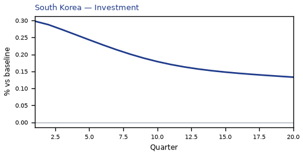

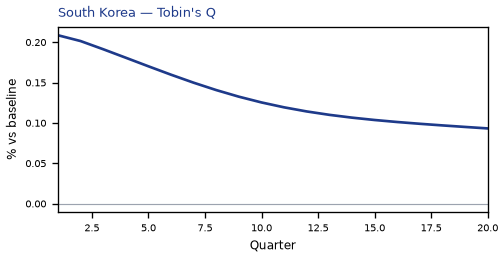

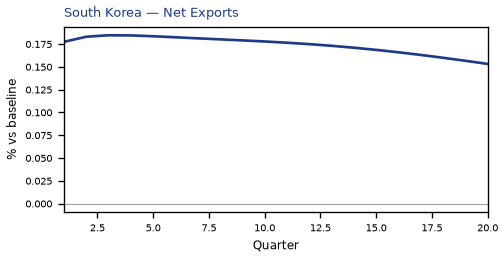

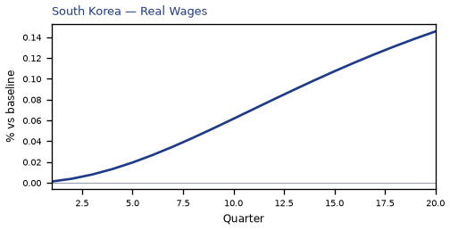


[Q1–Q20 JSON for South Korea](numbers/KR.json)

## CL — Chile

The main impact of bilateral tariffs at 25% on Chile would be only a small rise in GDP of 0.10% by Q1. Equities peak at +0.23% in Q1.

Demand and trade. Consumption peaks at +0.06 % vs baseline in Q3, from +0.05 in Q1 to +0.04 in Q20. Investment peaks at +0.28 % vs baseline in Q1, from +0.28 in Q1 to +0.14 in Q20. Net Exports peaks at +0.13 % vs baseline in Q1, from +0.13 in Q1 to +0.08 in Q20. Gov Spending peaks at -0.04 % vs baseline in Q5, from -0.03 in Q1 to -0.03 in Q20. Gov Debt peaks at +0.09 % vs baseline in Q20, from +0.01 in Q1 to +0.09 in Q20.

External / FX. The real exchange rate shows real depreciation (a weaker, more competitive home currency). Currency Strength peaks at +0.18 % vs baseline in Q8, from +0.09 in Q1 to +0.14 in Q20.

Labour. Employment peaks at +0.09 % vs baseline in Q10, from +0.02 in Q1 to +0.07 in Q20. Unemployment peaks at -0.03 pp in Q8, from -0.01 in Q1 to -0.03 in Q20. Real Wages peaks at +0.14 % vs baseline in Q20, from +0.00 in Q1 to +0.14 in Q20.

Prices. The three-year CPI impulse is +0.01 percentage points. CPI Inflation peaks at +0.00 pp in Q20, from +0.00 in Q1 to +0.00 in Q20. Domestic Infl. peaks at +0.00 pp in Q20, from +0.00 in Q1 to +0.00 in Q20. Marginal Cost peaks at +0.06 % vs baseline in Q1, from +0.06 in Q1 to +0.03 in Q20.

Financial conditions. Policy Rate peaks at +0.01 pp (annualized) in Q20, from +0.00 in Q1 to +0.01 in Q20. Govt 2Y Yield peaks at +0.02 pp (annualized) in Q20, from +0.00 in Q1 to +0.02 in Q20. Govt 5Y Yield peaks at +0.02 pp (annualized) in Q20, from +0.01 in Q1 to +0.02 in Q20. Govt 10Y Yield peaks at +0.02 pp (annualized) in Q20, from +0.01 in Q1 to +0.02 in Q20. Bond Price peaks at -0.06 % vs baseline in Q20, from -0.00 in Q1 to -0.06 in Q20. Equity Index peaks at +0.23 % vs baseline in Q1, from +0.23 in Q1 to +0.13 in Q20. Tobin's Q peaks at +0.19 % vs baseline in Q1, from +0.19 in Q1 to +0.10 in Q20. House Prices peaks at +0.12 % vs baseline in Q20, from +0.02 in Q1 to +0.12 in Q20. Bank Credit peaks at +0.00 % vs baseline in Q20, from +0.00 in Q1 to +0.00 in Q20. Credit Spread peaks at +0.00 pp in Q1, from +0.00 in Q1 to +0.00 in Q20.

Sectoral and capital. Manuf. GDP peaks at -0.04 % vs baseline in Q9, from -0.01 in Q1 to -0.02 in Q20. Services GDP peaks at +0.06 % vs baseline in Q1, from +0.06 in Q1 to +0.03 in Q20. Capital Stock peaks at +0.02 % vs baseline in Q20, from +0.00 in Q1 to +0.02 in Q20.

Timing. By Q20 GDP is still +0.06% from baseline.

These figures are model IRFs versus baseline, not forecasts.


[Q1–Q20 JSON for Chile](numbers/CL.json)

## CH — Switzerland

The main impact of bilateral tariffs at 25% on Switzerland would be only a small rise in GDP of 0.09% by Q1. Equities peak at +0.36% in Q1.

Demand and trade. Consumption peaks at +0.06 % vs baseline in Q3, from +0.05 in Q1 to +0.04 in Q20. Investment peaks at +0.25 % vs baseline in Q1, from +0.25 in Q1 to +0.13 in Q20. Net Exports peaks at +0.11 % vs baseline in Q1, from +0.11 in Q1 to +0.08 in Q20. Gov Spending peaks at -0.02 % vs baseline in Q1, from -0.02 in Q1 to -0.01 in Q20. Gov Debt peaks at +0.04 % vs baseline in Q20, from +0.01 in Q1 to +0.04 in Q20.

External / FX. The real exchange rate shows real appreciation (a stronger home currency). Currency Strength peaks at -0.06 % vs baseline in Q20, from -0.01 in Q1 to -0.06 in Q20.

Labour. Employment peaks at +0.08 % vs baseline in Q8, from +0.02 in Q1 to +0.06 in Q20. Unemployment peaks at -0.04 pp in Q7, from -0.01 in Q1 to -0.03 in Q20. Real Wages peaks at +0.04 % vs baseline in Q20, from +0.00 in Q1 to +0.04 in Q20.

Prices. The three-year CPI impulse is -0.01 percentage points. CPI Inflation peaks at -0.00 pp in Q1, from -0.00 in Q1 to +0.00 in Q20. Domestic Infl. peaks at -0.00 pp in Q1, from -0.00 in Q1 to +0.00 in Q20. Marginal Cost peaks at +0.05 % vs baseline in Q1, from +0.05 in Q1 to +0.03 in Q20.

Financial conditions. Policy Rate peaks at +0.02 pp (annualized) in Q20, from +0.00 in Q1 to +0.02 in Q20. Govt 2Y Yield peaks at +0.02 pp (annualized) in Q20, from +0.01 in Q1 to +0.02 in Q20. Govt 5Y Yield peaks at +0.02 pp (annualized) in Q20, from +0.01 in Q1 to +0.02 in Q20. Govt 10Y Yield peaks at +0.02 pp (annualized) in Q20, from +0.02 in Q1 to +0.02 in Q20. Bond Price peaks at -0.11 % vs baseline in Q20, from -0.02 in Q1 to -0.11 in Q20. Equity Index peaks at +0.36 % vs baseline in Q1, from +0.36 in Q1 to +0.22 in Q20. Tobin's Q peaks at +0.18 % vs baseline in Q1, from +0.18 in Q1 to +0.09 in Q20. House Prices peaks at +0.10 % vs baseline in Q20, from +0.01 in Q1 to +0.10 in Q20. Bank Credit peaks at +0.00 % vs baseline in Q20, from +0.00 in Q1 to +0.00 in Q20. Credit Spread peaks at +0.00 pp in Q1, from +0.00 in Q1 to +0.00 in Q20.

Sectoral and capital. Manuf. GDP peaks at +0.04 % vs baseline in Q20, from +0.03 in Q1 to +0.04 in Q20. Services GDP peaks at +0.07 % vs baseline in Q1, from +0.07 in Q1 to +0.04 in Q20. Capital Stock peaks at +0.02 % vs baseline in Q20, from +0.00 in Q1 to +0.02 in Q20.

Timing. By Q20 GDP is still +0.05% from baseline.

These figures are model IRFs versus baseline, not forecasts.


[Q1–Q20 JSON for Switzerland](numbers/CH.json)

## ZA — South Africa

The main impact of bilateral tariffs at 25% on South Africa would be only a small rise in GDP of 0.07% by Q1. Equities peak at +0.29% in Q1.

Demand and trade. Consumption peaks at +0.04 % vs baseline in Q3, from +0.03 in Q1 to +0.03 in Q20. Investment peaks at +0.21 % vs baseline in Q1, from +0.21 in Q1 to +0.12 in Q20. Net Exports peaks at +0.10 % vs baseline in Q1, from +0.10 in Q1 to +0.06 in Q20. Gov Spending peaks at -0.02 % vs baseline in Q4, from -0.02 in Q1 to -0.01 in Q20. Gov Debt peaks at +0.07 % vs baseline in Q20, from +0.01 in Q1 to +0.07 in Q20.

External / FX. The real exchange rate shows real depreciation (a weaker, more competitive home currency). Currency Strength peaks at +0.14 % vs baseline in Q9, from +0.07 in Q1 to +0.11 in Q20.

Labour. Employment peaks at +0.07 % vs baseline in Q13, from +0.02 in Q1 to +0.07 in Q20. Unemployment peaks at -0.02 pp in Q10, from -0.01 in Q1 to -0.02 in Q20. Real Wages peaks at +0.11 % vs baseline in Q20, from +0.00 in Q1 to +0.11 in Q20.

Prices. The three-year CPI impulse is -0.00 percentage points. CPI Inflation peaks at +0.00 pp in Q20, from -0.00 in Q1 to +0.00 in Q20. Domestic Infl. peaks at +0.00 pp in Q20, from -0.00 in Q1 to +0.00 in Q20. Marginal Cost peaks at +0.04 % vs baseline in Q1, from +0.04 in Q1 to +0.03 in Q20.

Financial conditions. Policy Rate peaks at +0.01 pp (annualized) in Q20, from -0.00 in Q1 to +0.01 in Q20. Govt 2Y Yield peaks at +0.01 pp (annualized) in Q20, from -0.00 in Q1 to +0.01 in Q20. Govt 5Y Yield peaks at +0.01 pp (annualized) in Q20, from +0.00 in Q1 to +0.01 in Q20. Govt 10Y Yield peaks at +0.01 pp (annualized) in Q20, from +0.01 in Q1 to +0.01 in Q20. Bond Price peaks at -0.04 % vs baseline in Q20, from +0.00 in Q1 to -0.04 in Q20. Equity Index peaks at +0.29 % vs baseline in Q1, from +0.29 in Q1 to +0.20 in Q20. Tobin's Q peaks at +0.14 % vs baseline in Q1, from +0.14 in Q1 to +0.09 in Q20. House Prices peaks at +0.10 % vs baseline in Q20, from +0.01 in Q1 to +0.10 in Q20. Bank Credit peaks at +0.00 % vs baseline in Q20, from +0.00 in Q1 to +0.00 in Q20. Credit Spread peaks at +0.00 pp in Q1, from +0.00 in Q1 to +0.00 in Q20.

Sectoral and capital. Manuf. GDP peaks at -0.03 % vs baseline in Q8, from -0.01 in Q1 to -0.02 in Q20. Services GDP peaks at +0.05 % vs baseline in Q1, from +0.05 in Q1 to +0.03 in Q20. Capital Stock peaks at +0.02 % vs baseline in Q20, from +0.00 in Q1 to +0.02 in Q20.

Timing. By Q20 GDP is still +0.05% from baseline.

These figures are model IRFs versus baseline, not forecasts.


[Q1–Q20 JSON for South Africa](numbers/ZA.json)

## JP — Japan

The main impact of bilateral tariffs at 25% on Japan would be only a small rise in GDP of 0.06% by Q1. Equities peak at +0.18% in Q1.

Demand and trade. Consumption peaks at +0.04 % vs baseline in Q3, from +0.03 in Q1 to +0.03 in Q20. Investment peaks at +0.18 % vs baseline in Q1, from +0.18 in Q1 to +0.12 in Q20. Net Exports peaks at +0.11 % vs baseline in Q5, from +0.10 in Q1 to +0.10 in Q20. Gov Spending peaks at -0.01 % vs baseline in Q1, from -0.01 in Q1 to -0.01 in Q20. Gov Debt peaks at +0.02 % vs baseline in Q20, from +0.00 in Q1 to +0.02 in Q20.

External / FX. The real exchange rate shows real appreciation (a stronger home currency). Currency Strength peaks at -0.08 % vs baseline in Q16, from -0.03 in Q1 to -0.07 in Q20.

Labour. Employment peaks at +0.05 % vs baseline in Q7, from +0.02 in Q1 to +0.05 in Q20. Unemployment peaks at -0.03 pp in Q7, from -0.01 in Q1 to -0.02 in Q20. Real Wages peaks at -0.01 % vs baseline in Q17, from +0.00 in Q1 to -0.01 in Q20.

Prices. The three-year CPI impulse is -0.02 percentage points. CPI Inflation peaks at -0.00 pp in Q1, from -0.00 in Q1 to +0.00 in Q20. Domestic Infl. peaks at -0.00 pp in Q1, from -0.00 in Q1 to +0.00 in Q20. Marginal Cost peaks at +0.04 % vs baseline in Q1, from +0.04 in Q1 to +0.03 in Q20.

Financial conditions. Policy Rate peaks at -0.00 pp (annualized) in Q14, from -0.00 in Q1 to -0.00 in Q20. Govt 2Y Yield peaks at -0.00 pp (annualized) in Q10, from -0.00 in Q1 to -0.00 in Q20. Govt 5Y Yield peaks at -0.00 pp (annualized) in Q4, from -0.00 in Q1 to +0.00 in Q20. Govt 10Y Yield peaks at +0.00 pp (annualized) in Q20, from -0.00 in Q1 to +0.00 in Q20. Bond Price peaks at +0.02 % vs baseline in Q14, from +0.00 in Q1 to +0.01 in Q20. Equity Index peaks at +0.18 % vs baseline in Q1, from +0.18 in Q1 to +0.12 in Q20. Tobin's Q peaks at +0.13 % vs baseline in Q1, from +0.13 in Q1 to +0.09 in Q20. House Prices peaks at +0.06 % vs baseline in Q20, from +0.01 in Q1 to +0.06 in Q20. Bank Credit peaks at +0.00 % vs baseline in Q20, from +0.00 in Q1 to +0.00 in Q20. Credit Spread peaks at +0.00 pp in Q1, from +0.00 in Q1 to +0.00 in Q20.

Sectoral and capital. Manuf. GDP peaks at +0.04 % vs baseline in Q17, from +0.03 in Q1 to +0.04 in Q20. Services GDP peaks at +0.04 % vs baseline in Q1, from +0.04 in Q1 to +0.03 in Q20. Capital Stock peaks at +0.01 % vs baseline in Q20, from +0.00 in Q1 to +0.01 in Q20.

Timing. By Q20 GDP is still +0.04% from baseline.

These figures are model IRFs versus baseline, not forecasts.


[Q1–Q20 JSON for Japan](numbers/JP.json)

## SA — Saudi Arabia

The main impact of bilateral tariffs at 25% on Saudi Arabia would be only a small drop in GDP of 0.06% by Q16. Equities peak at -0.28% in Q14.

Demand and trade. Consumption peaks at -0.03 % vs baseline in Q17, from -0.01 in Q1 to -0.02 in Q20. Investment peaks at -0.80 % vs baseline in Q8, from -0.16 in Q1 to -0.18 in Q20. Net Exports peaks at -0.10 % vs baseline in Q17, from +0.03 in Q1 to -0.09 in Q20. Gov Spending peaks at -0.04 % vs baseline in Q17, from -0.02 in Q1 to -0.04 in Q20. Gov Debt peaks at -0.07 % vs baseline in Q20, from +0.00 in Q1 to -0.07 in Q20.

External / FX. The real exchange rate shows real appreciation (a stronger home currency). Currency Strength peaks at -0.39 % vs baseline in Q15, from -0.01 in Q1 to -0.35 in Q20.

Labour. Employment peaks at -0.06 % vs baseline in Q19, from +0.01 in Q1 to -0.06 in Q20. Unemployment peaks at +0.02 pp in Q19, from -0.00 in Q1 to +0.02 in Q20. Real Wages peaks at -0.09 % vs baseline in Q20, from +0.00 in Q1 to -0.09 in Q20.

Prices. The three-year CPI impulse is -0.12 percentage points. CPI Inflation peaks at -0.01 pp in Q8, from -0.00 in Q1 to -0.00 in Q20. Domestic Infl. peaks at -0.01 pp in Q8, from -0.00 in Q1 to -0.00 in Q20. Marginal Cost peaks at -0.04 % vs baseline in Q16, from +0.02 in Q1 to -0.03 in Q20.

Financial conditions. Policy Rate peaks at +0.52 pp (annualized) in Q6, from +0.16 in Q1 to +0.04 in Q20. Govt 2Y Yield peaks at +0.47 pp (annualized) in Q3, from +0.42 in Q1 to -0.03 in Q20. Govt 5Y Yield peaks at +0.31 pp (annualized) in Q1, from +0.31 in Q1 to -0.06 in Q20. Govt 10Y Yield peaks at +0.12 pp (annualized) in Q1, from +0.12 in Q1 to -0.05 in Q20. Bond Price peaks at -2.58 % vs baseline in Q6, from -0.81 in Q1 to -0.18 in Q20. Equity Index peaks at -0.28 % vs baseline in Q14, from +0.09 in Q1 to -0.20 in Q20. Tobin's Q peaks at -0.56 % vs baseline in Q8, from -0.11 in Q1 to -0.13 in Q20. House Prices peaks at -0.12 % vs baseline in Q19, from +0.00 in Q1 to -0.12 in Q20. Bank Credit peaks at +0.00 % vs baseline in Q8, from +0.00 in Q1 to +0.00 in Q20. Credit Spread peaks at +0.00 pp in Q1, from +0.00 in Q1 to +0.00 in Q20.

Sectoral and capital. Manuf. GDP peaks at +0.11 % vs baseline in Q15, from +0.01 in Q1 to +0.10 in Q20. Services GDP peaks at -0.03 % vs baseline in Q16, from +0.01 in Q1 to -0.02 in Q20. Capital Stock peaks at -0.05 % vs baseline in Q20, from -0.00 in Q1 to -0.05 in Q20.

Timing. By Q20 GDP is still -0.05% from baseline.

These figures are model IRFs versus baseline, not forecasts.


[Q1–Q20 JSON for Saudi Arabia](numbers/SA.json)

## CO — Colombia

The main impact of bilateral tariffs at 25% on Colombia would be only a small rise in GDP of 0.04% by Q1. Equities peak at +0.08% in Q1.

Demand and trade. Consumption peaks at +0.03 % vs baseline in Q3, from +0.02 in Q1 to +0.02 in Q20. Investment peaks at +0.13 % vs baseline in Q3, from +0.13 in Q1 to +0.06 in Q20. Net Exports peaks at +0.07 % vs baseline in Q1, from +0.07 in Q1 to +0.04 in Q20. Gov Spending peaks at -0.01 % vs baseline in Q4, from -0.01 in Q1 to -0.01 in Q20. Gov Debt peaks at +0.06 % vs baseline in Q20, from +0.01 in Q1 to +0.06 in Q20.

External / FX. The real exchange rate shows real depreciation (a weaker, more competitive home currency). Currency Strength peaks at +0.13 % vs baseline in Q16, from +0.04 in Q1 to +0.12 in Q20.

Labour. Employment peaks at +0.04 % vs baseline in Q12, from +0.01 in Q1 to +0.04 in Q20. Unemployment peaks at -0.01 pp in Q8, from -0.00 in Q1 to -0.00 in Q20. Real Wages peaks at +0.06 % vs baseline in Q20, from +0.00 in Q1 to +0.06 in Q20.

Prices. The three-year CPI impulse is -0.01 percentage points. CPI Inflation peaks at -0.00 pp in Q3, from -0.00 in Q1 to +0.00 in Q20. Domestic Infl. peaks at -0.00 pp in Q3, from -0.00 in Q1 to +0.00 in Q20. Marginal Cost peaks at +0.03 % vs baseline in Q1, from +0.03 in Q1 to +0.02 in Q20.

Financial conditions. Policy Rate peaks at -0.01 pp (annualized) in Q5, from -0.00 in Q1 to +0.01 in Q20. Govt 2Y Yield peaks at +0.01 pp (annualized) in Q20, from -0.01 in Q1 to +0.01 in Q20. Govt 5Y Yield peaks at +0.01 pp (annualized) in Q20, from -0.00 in Q1 to +0.01 in Q20. Govt 10Y Yield peaks at +0.01 pp (annualized) in Q20, from +0.00 in Q1 to +0.01 in Q20. Bond Price peaks at +0.03 % vs baseline in Q5, from +0.01 in Q1 to -0.02 in Q20. Equity Index peaks at +0.08 % vs baseline in Q1, from +0.08 in Q1 to +0.05 in Q20. Tobin's Q peaks at +0.09 % vs baseline in Q3, from +0.09 in Q1 to +0.05 in Q20. House Prices peaks at +0.05 % vs baseline in Q20, from +0.01 in Q1 to +0.05 in Q20. Bank Credit peaks at +0.00 % vs baseline in Q20, from +0.00 in Q1 to +0.00 in Q20. Credit Spread peaks at +0.00 pp in Q1, from +0.00 in Q1 to +0.00 in Q20.

Sectoral and capital. Manuf. GDP peaks at -0.02 % vs baseline in Q16, from -0.00 in Q1 to -0.02 in Q20. Services GDP peaks at +0.03 % vs baseline in Q1, from +0.03 in Q1 to +0.02 in Q20. Capital Stock peaks at +0.01 % vs baseline in Q20, from +0.00 in Q1 to +0.01 in Q20.

Timing. By Q20 GDP is still +0.03% from baseline.

These figures are model IRFs versus baseline, not forecasts.


[Q1–Q20 JSON for Colombia](numbers/CO.json)

## IT — Italy

The main impact of bilateral tariffs at 25% on Italy would be only a small rise in GDP of 0.04% by Q2. Equities peak at +0.07% in Q2.

Demand and trade. Consumption peaks at +0.02 % vs baseline in Q4, from +0.02 in Q1 to +0.02 in Q20. Investment peaks at +0.11 % vs baseline in Q2, from +0.11 in Q1 to +0.08 in Q20. Net Exports peaks at +0.07 % vs baseline in Q10, from +0.06 in Q1 to +0.06 in Q20. Gov Spending peaks at -0.01 % vs baseline in Q2, from -0.01 in Q1 to -0.01 in Q20. Gov Debt peaks at -0.00 % vs baseline in Q5, from -0.00 in Q1 to -0.00 in Q20.

External / FX. The real exchange rate shows real appreciation (a stronger home currency). Currency Strength peaks at -0.04 % vs baseline in Q17, from -0.01 in Q1 to -0.04 in Q20.

Labour. Employment peaks at +0.04 % vs baseline in Q15, from +0.01 in Q1 to +0.04 in Q20. Unemployment peaks at -0.01 pp in Q9, from -0.00 in Q1 to -0.01 in Q20. Real Wages peaks at +0.02 % vs baseline in Q20, from +0.00 in Q1 to +0.02 in Q20.

Prices. The three-year CPI impulse is -0.01 percentage points. CPI Inflation peaks at -0.00 pp in Q3, from -0.00 in Q1 to +0.00 in Q20. Domestic Infl. peaks at -0.00 pp in Q3, from -0.00 in Q1 to +0.00 in Q20. Marginal Cost peaks at +0.02 % vs baseline in Q2, from +0.02 in Q1 to +0.02 in Q20.

Financial conditions. Policy Rate peaks at +0.00 pp (annualized) in Q18, from +0.00 in Q1 to +0.00 in Q20. Govt 2Y Yield peaks at +0.00 pp (annualized) in Q15, from +0.00 in Q1 to +0.00 in Q20. Govt 5Y Yield peaks at +0.00 pp (annualized) in Q12, from +0.00 in Q1 to +0.00 in Q20. Govt 10Y Yield peaks at +0.00 pp (annualized) in Q8, from +0.00 in Q1 to +0.00 in Q20. Bond Price peaks at -0.03 % vs baseline in Q18, from -0.00 in Q1 to -0.03 in Q20. Equity Index peaks at +0.07 % vs baseline in Q2, from +0.07 in Q1 to +0.05 in Q20. Tobin's Q peaks at +0.08 % vs baseline in Q2, from +0.08 in Q1 to +0.05 in Q20. House Prices peaks at +0.05 % vs baseline in Q20, from +0.00 in Q1 to +0.05 in Q20. Bank Credit peaks at +0.00 % vs baseline in Q20, from +0.00 in Q1 to +0.00 in Q20. Credit Spread peaks at +0.00 pp in Q1, from +0.00 in Q1 to +0.00 in Q20.

Sectoral and capital. Manuf. GDP peaks at +0.03 % vs baseline in Q16, from +0.01 in Q1 to +0.03 in Q20. Services GDP peaks at +0.03 % vs baseline in Q2, from +0.03 in Q1 to +0.02 in Q20. Capital Stock peaks at +0.01 % vs baseline in Q20, from +0.00 in Q1 to +0.01 in Q20.

Timing. By Q20 GDP is still +0.03% from baseline.

These figures are model IRFs versus baseline, not forecasts.


[Q1–Q20 JSON for Italy](numbers/IT.json)

## AU — Australia

The main impact of bilateral tariffs at 25% on Australia would be only a small rise in GDP of 0.04% by Q1. Equities peak at +0.10% in Q1.

Demand and trade. Consumption peaks at +0.02 % vs baseline in Q3, from +0.02 in Q1 to +0.01 in Q20. Investment peaks at +0.11 % vs baseline in Q1, from +0.11 in Q1 to +0.04 in Q20. Net Exports peaks at +0.05 % vs baseline in Q1, from +0.05 in Q1 to +0.01 in Q20. Gov Spending peaks at -0.02 % vs baseline in Q4, from -0.01 in Q1 to -0.01 in Q20. Gov Debt peaks at +0.02 % vs baseline in Q20, from +0.00 in Q1 to +0.02 in Q20.

External / FX. The real exchange rate shows real depreciation (a weaker, more competitive home currency). Currency Strength peaks at +0.43 % vs baseline in Q9, from +0.22 in Q1 to +0.35 in Q20.

Labour. Employment peaks at +0.03 % vs baseline in Q7, from +0.01 in Q1 to +0.02 in Q20. Unemployment peaks at -0.02 pp in Q7, from -0.01 in Q1 to -0.01 in Q20. Real Wages peaks at +0.03 % vs baseline in Q20, from +0.00 in Q1 to +0.03 in Q20.

Prices. The three-year CPI impulse is -0.01 percentage points. CPI Inflation peaks at -0.00 pp in Q3, from -0.00 in Q1 to +0.00 in Q20. Domestic Infl. peaks at -0.00 pp in Q3, from -0.00 in Q1 to +0.00 in Q20. Marginal Cost peaks at +0.02 % vs baseline in Q1, from +0.02 in Q1 to +0.01 in Q20.

Financial conditions. Policy Rate peaks at +0.01 pp (annualized) in Q20, from +0.00 in Q1 to +0.01 in Q20. Govt 2Y Yield peaks at +0.01 pp (annualized) in Q20, from +0.01 in Q1 to +0.01 in Q20. Govt 5Y Yield peaks at +0.01 pp (annualized) in Q20, from +0.01 in Q1 to +0.01 in Q20. Govt 10Y Yield peaks at +0.01 pp (annualized) in Q20, from +0.01 in Q1 to +0.01 in Q20. Bond Price peaks at -0.06 % vs baseline in Q20, from -0.01 in Q1 to -0.06 in Q20. Equity Index peaks at +0.10 % vs baseline in Q1, from +0.10 in Q1 to +0.04 in Q20. Tobin's Q peaks at +0.08 % vs baseline in Q1, from +0.08 in Q1 to +0.03 in Q20. House Prices peaks at +0.03 % vs baseline in Q20, from +0.00 in Q1 to +0.03 in Q20. Bank Credit peaks at +0.00 % vs baseline in Q20, from +0.00 in Q1 to +0.00 in Q20. Credit Spread peaks at +0.00 pp in Q1, from +0.00 in Q1 to +0.00 in Q20.

Sectoral and capital. Manuf. GDP peaks at -0.12 % vs baseline in Q9, from -0.06 in Q1 to -0.10 in Q20. Services GDP peaks at +0.03 % vs baseline in Q1, from +0.03 in Q1 to +0.01 in Q20. Capital Stock peaks at +0.01 % vs baseline in Q20, from +0.00 in Q1 to +0.01 in Q20.

Timing. By Q20 GDP is still +0.02% from baseline.

These figures are model IRFs versus baseline, not forecasts.


[Q1–Q20 JSON for Australia](numbers/AU.json)

## DE — Germany

The main impact of bilateral tariffs at 25% on Germany would be only a small rise in GDP of 0.04% by Q1. Equities peak at +0.08% in Q1.

Demand and trade. Consumption peaks at +0.02 % vs baseline in Q3, from +0.02 in Q1 to +0.01 in Q20. Investment peaks at +0.11 % vs baseline in Q1, from +0.11 in Q1 to +0.06 in Q20. Net Exports peaks at +0.08 % vs baseline in Q10, from +0.07 in Q1 to +0.07 in Q20. Gov Spending peaks at -0.01 % vs baseline in Q1, from -0.01 in Q1 to -0.01 in Q20. Gov Debt peaks at -0.01 % vs baseline in Q20, from -0.00 in Q1 to -0.01 in Q20.

External / FX. The real exchange rate shows real appreciation (a stronger home currency). Currency Strength peaks at -0.03 % vs baseline in Q16, from -0.01 in Q1 to -0.03 in Q20.

Labour. Employment peaks at +0.03 % vs baseline in Q8, from +0.01 in Q1 to +0.03 in Q20. Unemployment peaks at -0.02 pp in Q6, from -0.01 in Q1 to -0.01 in Q20. Real Wages peaks at +0.03 % vs baseline in Q20, from +0.00 in Q1 to +0.03 in Q20.

Prices. The three-year CPI impulse is -0.01 percentage points. CPI Inflation peaks at -0.00 pp in Q3, from -0.00 in Q1 to +0.00 in Q20. Domestic Infl. peaks at -0.00 pp in Q3, from -0.00 in Q1 to +0.00 in Q20. Marginal Cost peaks at +0.02 % vs baseline in Q1, from +0.02 in Q1 to +0.01 in Q20.

Financial conditions. Policy Rate peaks at +0.00 pp (annualized) in Q18, from +0.00 in Q1 to +0.00 in Q20. Govt 2Y Yield peaks at +0.00 pp (annualized) in Q15, from +0.00 in Q1 to +0.00 in Q20. Govt 5Y Yield peaks at +0.00 pp (annualized) in Q12, from +0.00 in Q1 to +0.00 in Q20. Govt 10Y Yield peaks at +0.00 pp (annualized) in Q8, from +0.00 in Q1 to +0.00 in Q20. Bond Price peaks at -0.03 % vs baseline in Q18, from -0.00 in Q1 to -0.03 in Q20. Equity Index peaks at +0.08 % vs baseline in Q1, from +0.08 in Q1 to +0.05 in Q20. Tobin's Q peaks at +0.08 % vs baseline in Q1, from +0.08 in Q1 to +0.04 in Q20. House Prices peaks at +0.04 % vs baseline in Q20, from +0.00 in Q1 to +0.04 in Q20. Bank Credit peaks at +0.00 % vs baseline in Q20, from +0.00 in Q1 to +0.00 in Q20. Credit Spread peaks at +0.00 pp in Q1, from +0.00 in Q1 to +0.00 in Q20.

Sectoral and capital. Manuf. GDP peaks at +0.03 % vs baseline in Q18, from +0.02 in Q1 to +0.03 in Q20. Services GDP peaks at +0.03 % vs baseline in Q1, from +0.03 in Q1 to +0.02 in Q20. Capital Stock peaks at +0.01 % vs baseline in Q20, from +0.00 in Q1 to +0.01 in Q20.

Timing. By Q20 GDP is still +0.02% from baseline.

These figures are model IRFs versus baseline, not forecasts.


[Q1–Q20 JSON for Germany](numbers/DE.json)

## SE — Sweden

The main impact of bilateral tariffs at 25% on Sweden would be only a small rise in GDP of 0.04% by Q1. Equities peak at +0.11% in Q1.

Demand and trade. Consumption peaks at +0.02 % vs baseline in Q3, from +0.02 in Q1 to +0.02 in Q20. Investment peaks at +0.11 % vs baseline in Q1, from +0.11 in Q1 to +0.07 in Q20. Net Exports peaks at +0.05 % vs baseline in Q1, from +0.05 in Q1 to +0.04 in Q20. Gov Spending peaks at -0.01 % vs baseline in Q2, from -0.01 in Q1 to -0.01 in Q20. Gov Debt peaks at -0.02 % vs baseline in Q20, from -0.00 in Q1 to -0.02 in Q20.

External / FX. The real exchange rate shows real depreciation (a weaker, more competitive home currency). Currency Strength peaks at +0.07 % vs baseline in Q11, from +0.03 in Q1 to +0.06 in Q20.

Labour. Employment peaks at +0.03 % vs baseline in Q16, from +0.01 in Q1 to +0.03 in Q20. Unemployment peaks at -0.02 pp in Q9, from -0.01 in Q1 to -0.02 in Q20. Real Wages peaks at +0.04 % vs baseline in Q20, from +0.00 in Q1 to +0.04 in Q20.

Prices. The three-year CPI impulse is -0.01 percentage points. CPI Inflation peaks at -0.00 pp in Q2, from -0.00 in Q1 to +0.00 in Q20. Domestic Infl. peaks at -0.00 pp in Q2, from -0.00 in Q1 to +0.00 in Q20. Marginal Cost peaks at +0.02 % vs baseline in Q1, from +0.02 in Q1 to +0.02 in Q20.

Financial conditions. Policy Rate peaks at -0.00 pp (annualized) in Q6, from -0.00 in Q1 to +0.00 in Q20. Govt 2Y Yield peaks at -0.00 pp (annualized) in Q3, from -0.00 in Q1 to +0.00 in Q20. Govt 5Y Yield peaks at +0.01 pp (annualized) in Q20, from -0.00 in Q1 to +0.01 in Q20. Govt 10Y Yield peaks at +0.01 pp (annualized) in Q20, from +0.00 in Q1 to +0.01 in Q20. Bond Price peaks at +0.03 % vs baseline in Q6, from +0.01 in Q1 to -0.01 in Q20. Equity Index peaks at +0.11 % vs baseline in Q1, from +0.11 in Q1 to +0.08 in Q20. Tobin's Q peaks at +0.07 % vs baseline in Q1, from +0.07 in Q1 to +0.05 in Q20. House Prices peaks at +0.04 % vs baseline in Q20, from +0.00 in Q1 to +0.04 in Q20. Bank Credit peaks at +0.00 % vs baseline in Q20, from +0.00 in Q1 to +0.00 in Q20. Credit Spread peaks at +0.00 pp in Q1, from +0.00 in Q1 to +0.00 in Q20.

Sectoral and capital. Manuf. GDP peaks at -0.01 % vs baseline in Q8, from +0.00 in Q1 to -0.00 in Q20. Services GDP peaks at +0.03 % vs baseline in Q1, from +0.03 in Q1 to +0.02 in Q20. Capital Stock peaks at +0.01 % vs baseline in Q20, from +0.00 in Q1 to +0.01 in Q20.

Timing. By Q20 GDP is still +0.03% from baseline.

These figures are model IRFs versus baseline, not forecasts.


[Q1–Q20 JSON for Sweden](numbers/SE.json)

## BR — Brazil

The main impact of bilateral tariffs at 25% on Brazil would be only a small rise in GDP of 0.04% by Q1. Equities peak at +0.07% in Q1.

Demand and trade. Consumption peaks at +0.02 % vs baseline in Q3, from +0.02 in Q1 to +0.01 in Q20. Investment peaks at +0.11 % vs baseline in Q3, from +0.10 in Q1 to +0.05 in Q20. Net Exports peaks at +0.05 % vs baseline in Q1, from +0.05 in Q1 to +0.01 in Q20. Gov Spending peaks at -0.01 % vs baseline in Q13, from -0.01 in Q1 to -0.01 in Q20. Gov Debt peaks at +0.01 % vs baseline in Q20, from +0.00 in Q1 to +0.01 in Q20.

External / FX. The real exchange rate shows real depreciation (a weaker, more competitive home currency). Currency Strength peaks at +0.10 % vs baseline in Q15, from +0.03 in Q1 to +0.09 in Q20.

Labour. Employment peaks at +0.03 % vs baseline in Q17, from +0.01 in Q1 to +0.03 in Q20. Unemployment peaks at -0.01 pp in Q10, from -0.00 in Q1 to -0.01 in Q20. Real Wages peaks at +0.05 % vs baseline in Q20, from +0.00 in Q1 to +0.05 in Q20.

Prices. The three-year CPI impulse is -0.01 percentage points. CPI Inflation peaks at -0.00 pp in Q3, from -0.00 in Q1 to +0.00 in Q20. Domestic Infl. peaks at -0.00 pp in Q3, from -0.00 in Q1 to +0.00 in Q20. Marginal Cost peaks at +0.02 % vs baseline in Q1, from +0.02 in Q1 to +0.01 in Q20.

Financial conditions. Policy Rate peaks at -0.01 pp (annualized) in Q5, from -0.00 in Q1 to +0.01 in Q20. Govt 2Y Yield peaks at +0.01 pp (annualized) in Q20, from -0.01 in Q1 to +0.01 in Q20. Govt 5Y Yield peaks at +0.01 pp (annualized) in Q20, from -0.00 in Q1 to +0.01 in Q20. Govt 10Y Yield peaks at +0.01 pp (annualized) in Q17, from +0.01 in Q1 to +0.01 in Q20. Bond Price peaks at +0.05 % vs baseline in Q5, from +0.01 in Q1 to -0.04 in Q20. Equity Index peaks at +0.07 % vs baseline in Q1, from +0.07 in Q1 to +0.04 in Q20. Tobin's Q peaks at +0.07 % vs baseline in Q3, from +0.07 in Q1 to +0.04 in Q20. House Prices peaks at +0.04 % vs baseline in Q20, from +0.01 in Q1 to +0.04 in Q20. Bank Credit peaks at +0.00 % vs baseline in Q20, from +0.00 in Q1 to +0.00 in Q20. Credit Spread peaks at +0.00 pp in Q1, from +0.00 in Q1 to +0.00 in Q20.

Sectoral and capital. Manuf. GDP peaks at -0.02 % vs baseline in Q14, from -0.00 in Q1 to -0.01 in Q20. Services GDP peaks at +0.02 % vs baseline in Q1, from +0.02 in Q1 to +0.02 in Q20. Capital Stock peaks at +0.01 % vs baseline in Q20, from +0.00 in Q1 to +0.01 in Q20.

Timing. By Q20 GDP is still +0.02% from baseline.

These figures are model IRFs versus baseline, not forecasts.


[Q1–Q20 JSON for Brazil](numbers/BR.json)

## UK — United Kingdom

The main impact of bilateral tariffs at 25% on United Kingdom would be only a small rise in GDP of 0.03% by Q1. Equities peak at +0.08% in Q1.

Demand and trade. Consumption peaks at +0.02 % vs baseline in Q2, from +0.02 in Q1 to +0.01 in Q20. Investment peaks at +0.09 % vs baseline in Q1, from +0.09 in Q1 to +0.03 in Q20. Net Exports peaks at +0.05 % vs baseline in Q5, from +0.05 in Q1 to +0.05 in Q20. Gov Spending peaks at -0.01 % vs baseline in Q1, from -0.01 in Q1 to -0.00 in Q20. Gov Debt peaks at +0.00 % vs baseline in Q5, from +0.00 in Q1 to +0.00 in Q20.

External / FX. The real exchange rate shows real appreciation (a stronger home currency). Currency Strength peaks at -0.02 % vs baseline in Q14, from -0.01 in Q1 to -0.02 in Q20.

Labour. Employment peaks at +0.02 % vs baseline in Q5, from +0.01 in Q1 to +0.01 in Q20. Unemployment peaks at -0.01 pp in Q5, from -0.00 in Q1 to -0.00 in Q20. Real Wages peaks at +0.00 % vs baseline in Q12, from +0.00 in Q1 to +0.00 in Q20.

Prices. The three-year CPI impulse is -0.01 percentage points. CPI Inflation peaks at -0.00 pp in Q11, from -0.00 in Q1 to +0.00 in Q20. Domestic Infl. peaks at -0.00 pp in Q11, from -0.00 in Q1 to +0.00 in Q20. Marginal Cost peaks at +0.02 % vs baseline in Q1, from +0.02 in Q1 to +0.01 in Q20.

Financial conditions. Policy Rate peaks at -0.00 pp (annualized) in Q16, from -0.00 in Q1 to -0.00 in Q20. Govt 2Y Yield peaks at -0.00 pp (annualized) in Q12, from -0.00 in Q1 to -0.00 in Q20. Govt 5Y Yield peaks at -0.00 pp (annualized) in Q4, from -0.00 in Q1 to +0.00 in Q20. Govt 10Y Yield peaks at +0.00 pp (annualized) in Q20, from +0.00 in Q1 to +0.00 in Q20. Bond Price peaks at +0.02 % vs baseline in Q16, from +0.00 in Q1 to +0.01 in Q20. Equity Index peaks at +0.08 % vs baseline in Q1, from +0.08 in Q1 to +0.02 in Q20. Tobin's Q peaks at +0.06 % vs baseline in Q1, from +0.06 in Q1 to +0.02 in Q20. House Prices peaks at +0.02 % vs baseline in Q8, from +0.00 in Q1 to +0.01 in Q20. Bank Credit peaks at -0.00 % vs baseline in Q18, from +0.00 in Q1 to -0.00 in Q20. Credit Spread peaks at +0.00 pp in Q18, from +0.00 in Q1 to +0.00 in Q20.

Sectoral and capital. Manuf. GDP peaks at +0.01 % vs baseline in Q19, from +0.01 in Q1 to +0.01 in Q20. Services GDP peaks at +0.02 % vs baseline in Q1, from +0.02 in Q1 to +0.01 in Q20. Capital Stock peaks at +0.00 % vs baseline in Q20, from +0.00 in Q1 to +0.00 in Q20.

Timing. The GDP response has mostly faded by Q9 (Q20 is +0.01%).

These figures are model IRFs versus baseline, not forecasts.


[Q1–Q20 JSON for United Kingdom](numbers/UK.json)

## IN — India

The main impact of bilateral tariffs at 25% on India would be only a small rise in GDP of 0.03% by Q17. Equities peak at +0.08% in Q15.

Demand and trade. Consumption peaks at +0.02 % vs baseline in Q17, from +0.01 in Q1 to +0.02 in Q20. Investment peaks at +0.09 % vs baseline in Q9, from +0.07 in Q1 to +0.07 in Q20. Net Exports peaks at +0.05 % vs baseline in Q13, from +0.04 in Q1 to +0.04 in Q20. Gov Spending peaks at -0.01 % vs baseline in Q17, from -0.00 in Q1 to -0.01 in Q20. Gov Debt peaks at +0.07 % vs baseline in Q20, from +0.00 in Q1 to +0.07 in Q20.

External / FX. The real exchange rate shows real appreciation (a stronger home currency). Currency Strength peaks at -0.01 % vs baseline in Q3, from -0.00 in Q1 to +0.00 in Q20.

Labour. Employment peaks at +0.03 % vs baseline in Q20, from +0.00 in Q1 to +0.03 in Q20. Unemployment peaks at -0.00 pp in Q19, from -0.00 in Q1 to -0.00 in Q20. Real Wages peaks at +0.03 % vs baseline in Q20, from +0.00 in Q1 to +0.03 in Q20.

Prices. The three-year CPI impulse is -0.03 percentage points. CPI Inflation peaks at -0.00 pp in Q3, from -0.00 in Q1 to +0.00 in Q20. Domestic Infl. peaks at -0.00 pp in Q3, from -0.00 in Q1 to +0.00 in Q20. Marginal Cost peaks at +0.02 % vs baseline in Q17, from +0.01 in Q1 to +0.02 in Q20.

Financial conditions. Policy Rate peaks at -0.02 pp (annualized) in Q5, from -0.01 in Q1 to +0.01 in Q20. Govt 2Y Yield peaks at -0.02 pp (annualized) in Q3, from -0.02 in Q1 to +0.01 in Q20. Govt 5Y Yield peaks at +0.02 pp (annualized) in Q20, from -0.01 in Q1 to +0.02 in Q20. Govt 10Y Yield peaks at +0.01 pp (annualized) in Q18, from +0.00 in Q1 to +0.01 in Q20. Bond Price peaks at +0.10 % vs baseline in Q5, from +0.03 in Q1 to -0.04 in Q20. Equity Index peaks at +0.08 % vs baseline in Q15, from +0.06 in Q1 to +0.07 in Q20. Tobin's Q peaks at +0.06 % vs baseline in Q9, from +0.05 in Q1 to +0.05 in Q20. House Prices peaks at +0.05 % vs baseline in Q20, from +0.00 in Q1 to +0.05 in Q20. Bank Credit peaks at +0.00 % vs baseline in Q20, from +0.00 in Q1 to +0.00 in Q20. Credit Spread peaks at +0.00 pp in Q1, from +0.00 in Q1 to +0.00 in Q20.

Sectoral and capital. Manuf. GDP peaks at +0.02 % vs baseline in Q16, from +0.01 in Q1 to +0.02 in Q20. Services GDP peaks at +0.02 % vs baseline in Q17, from +0.01 in Q1 to +0.02 in Q20. Capital Stock peaks at +0.01 % vs baseline in Q20, from +0.00 in Q1 to +0.01 in Q20.

Timing. By Q20 GDP is still +0.03% from baseline.

These figures are model IRFs versus baseline, not forecasts.


[Q1–Q20 JSON for India](numbers/IN.json)

## FR — France

The main impact of bilateral tariffs at 25% on France would be only a small rise in GDP of 0.03% by Q1. Equities peak at +0.06% in Q1.

Demand and trade. Consumption peaks at +0.01 % vs baseline in Q3, from +0.01 in Q1 to +0.01 in Q20. Investment peaks at +0.07 % vs baseline in Q1, from +0.07 in Q1 to +0.03 in Q20. Net Exports peaks at +0.04 % vs baseline in Q4, from +0.04 in Q1 to +0.04 in Q20. Gov Spending peaks at -0.01 % vs baseline in Q1, from -0.01 in Q1 to -0.00 in Q20. Gov Debt peaks at -0.02 % vs baseline in Q20, from -0.00 in Q1 to -0.02 in Q20.

External / FX. The real exchange rate shows real appreciation (a stronger home currency). Currency Strength peaks at -0.03 % vs baseline in Q18, from -0.01 in Q1 to -0.03 in Q20.

Labour. Employment peaks at +0.02 % vs baseline in Q8, from +0.00 in Q1 to +0.01 in Q20. Unemployment peaks at -0.01 pp in Q6, from -0.00 in Q1 to -0.01 in Q20. Real Wages peaks at +0.00 % vs baseline in Q20, from +0.00 in Q1 to +0.00 in Q20.

Prices. The three-year CPI impulse is -0.02 percentage points. CPI Inflation peaks at -0.00 pp in Q3, from -0.00 in Q1 to +0.00 in Q20. Domestic Infl. peaks at -0.00 pp in Q3, from -0.00 in Q1 to +0.00 in Q20. Marginal Cost peaks at +0.02 % vs baseline in Q1, from +0.02 in Q1 to +0.01 in Q20.

Financial conditions. Policy Rate peaks at +0.00 pp (annualized) in Q18, from +0.00 in Q1 to +0.00 in Q20. Govt 2Y Yield peaks at +0.00 pp (annualized) in Q15, from +0.00 in Q1 to +0.00 in Q20. Govt 5Y Yield peaks at +0.00 pp (annualized) in Q12, from +0.00 in Q1 to +0.00 in Q20. Govt 10Y Yield peaks at +0.00 pp (annualized) in Q8, from +0.00 in Q1 to +0.00 in Q20. Bond Price peaks at -0.03 % vs baseline in Q18, from -0.00 in Q1 to -0.03 in Q20. Equity Index peaks at +0.06 % vs baseline in Q1, from +0.06 in Q1 to +0.03 in Q20. Tobin's Q peaks at +0.05 % vs baseline in Q1, from +0.05 in Q1 to +0.02 in Q20. House Prices peaks at +0.02 % vs baseline in Q20, from +0.00 in Q1 to +0.02 in Q20. Bank Credit peaks at +0.00 % vs baseline in Q7, from +0.00 in Q1 to +0.00 in Q20. Credit Spread peaks at +0.00 pp in Q1, from +0.00 in Q1 to +0.00 in Q20.

Sectoral and capital. Manuf. GDP peaks at +0.02 % vs baseline in Q18, from +0.01 in Q1 to +0.02 in Q20. Services GDP peaks at +0.02 % vs baseline in Q1, from +0.02 in Q1 to +0.01 in Q20. Capital Stock peaks at +0.00 % vs baseline in Q20, from +0.00 in Q1 to +0.00 in Q20.

Timing. By Q20 GDP is still +0.01% from baseline.

These figures are model IRFs versus baseline, not forecasts.


[Q1–Q20 JSON for France](numbers/FR.json)

## ID — Indonesia

The main impact of bilateral tariffs at 25% on Indonesia would be only a small rise in GDP of 0.03% by Q1. Equities peak at +0.05% in Q1.

Demand and trade. Consumption peaks at +0.02 % vs baseline in Q3, from +0.01 in Q1 to +0.01 in Q20. Investment peaks at +0.08 % vs baseline in Q4, from +0.07 in Q1 to +0.06 in Q20. Net Exports peaks at +0.05 % vs baseline in Q1, from +0.05 in Q1 to +0.04 in Q20. Gov Spending peaks at -0.01 % vs baseline in Q17, from -0.00 in Q1 to -0.01 in Q20. Gov Debt peaks at +0.05 % vs baseline in Q20, from +0.00 in Q1 to +0.05 in Q20.

External / FX. The real exchange rate shows real depreciation (a weaker, more competitive home currency). Currency Strength peaks at +0.04 % vs baseline in Q15, from +0.01 in Q1 to +0.04 in Q20.

Labour. Employment peaks at +0.03 % vs baseline in Q20, from +0.00 in Q1 to +0.03 in Q20. Unemployment peaks at -0.00 pp in Q20, from -0.00 in Q1 to -0.00 in Q20. Real Wages peaks at +0.03 % vs baseline in Q20, from +0.00 in Q1 to +0.03 in Q20.

Prices. The three-year CPI impulse is -0.03 percentage points. CPI Inflation peaks at -0.00 pp in Q3, from -0.00 in Q1 to +0.00 in Q20. Domestic Infl. peaks at -0.00 pp in Q3, from -0.00 in Q1 to +0.00 in Q20. Marginal Cost peaks at +0.02 % vs baseline in Q1, from +0.02 in Q1 to +0.01 in Q20.

Financial conditions. Policy Rate peaks at -0.01 pp (annualized) in Q6, from -0.00 in Q1 to +0.00 in Q20. Govt 2Y Yield peaks at -0.01 pp (annualized) in Q3, from -0.01 in Q1 to +0.01 in Q20. Govt 5Y Yield peaks at +0.01 pp (annualized) in Q20, from -0.01 in Q1 to +0.01 in Q20. Govt 10Y Yield peaks at +0.01 pp (annualized) in Q20, from +0.00 in Q1 to +0.01 in Q20. Bond Price peaks at +0.05 % vs baseline in Q6, from +0.01 in Q1 to -0.01 in Q20. Equity Index peaks at +0.05 % vs baseline in Q1, from +0.05 in Q1 to +0.05 in Q20. Tobin's Q peaks at +0.06 % vs baseline in Q4, from +0.05 in Q1 to +0.04 in Q20. House Prices peaks at +0.04 % vs baseline in Q20, from +0.00 in Q1 to +0.04 in Q20. Bank Credit peaks at +0.00 % vs baseline in Q20, from +0.00 in Q1 to +0.00 in Q20. Credit Spread peaks at +0.00 pp in Q1, from +0.00 in Q1 to +0.00 in Q20.

Sectoral and capital. Manuf. GDP peaks at +0.00 % vs baseline in Q1, from +0.00 in Q1 to +0.00 in Q20. Services GDP peaks at +0.01 % vs baseline in Q1, from +0.01 in Q1 to +0.01 in Q20. Capital Stock peaks at +0.01 % vs baseline in Q20, from +0.00 in Q1 to +0.01 in Q20.

Timing. By Q20 GDP is still +0.02% from baseline.

These figures are model IRFs versus baseline, not forecasts.


[Q1–Q20 JSON for Indonesia](numbers/ID.json)

## AR — Argentina

The main impact of bilateral tariffs at 25% on Argentina would be no material rise in GDP of 0.03% by Q16. Equities peak at +0.04% in Q14. This has almost no impact on Argentina.


[Q1–Q20 JSON for Argentina](numbers/AR.json)

## TR — Turkey

The main impact of bilateral tariffs at 25% on Turkey would be no material rise in GDP of 0.02% by Q15. Equities peak at +0.04% in Q14. This has almost no impact on Turkey.


[Q1–Q20 JSON for Turkey](numbers/TR.json)

## NG — Nigeria

The main impact of bilateral tariffs at 25% on Nigeria would be no material rise in GDP of 0.02% by Q18. Equities peak at +0.04% in Q16. This has almost no impact on Nigeria.


[Q1–Q20 JSON for Nigeria](numbers/NG.json)

## NL — Netherlands

The main impact of bilateral tariffs at 25% on Netherlands would be no material rise in GDP of 0.02% by Q1. Equities peak at +0.05% in Q1. This has almost no impact on Netherlands.


[Q1–Q20 JSON for Netherlands](numbers/NL.json)

## ES — Spain

The main impact of bilateral tariffs at 25% on Spain would be no material rise in GDP of 0.02% by Q2. Equities peak at +0.03% in Q2. This has almost no impact on Spain.


[Q1–Q20 JSON for Spain](numbers/ES.json)

## PL — Poland

The main impact of bilateral tariffs at 25% on Poland would be no material rise in GDP of 0.01% by Q2. Equities peak at +0.03% in Q3. This has almost no impact on Poland.


[Q1–Q20 JSON for Poland](numbers/PL.json)

## NO — Norway

The main impact of bilateral tariffs at 25% on Norway would be no material rise in GDP of 0.01% by Q1. Equities peak at +0.02% in Q1. This has almost no impact on Norway.


[Q1–Q20 JSON for Norway](numbers/NO.json)

## RU — Russia

The main impact of bilateral tariffs at 25% on Russia would be no material rise in GDP of 0.01% by Q1. Equities peak at +0.02% in Q1. This has almost no impact on Russia.


[Q1–Q20 JSON for Russia](numbers/RU.json)


---

These figures are model IRFs versus baseline, not forecasts, and not financial advice.
