# Global Macro Economic Simulations and Financial Market Responses

v6 · IRF · evaluation

**Open the typeset report (this is the document):** https://robomacro.com/GlobalMacroTrainingDataset/uk_housing_25/

GitHub and Hugging Face show `.html` as source code. That is not the report. Read it on robomacro.com, or keep scrolling this page.

## What's the impact of UK housing -25%

### Active treatment

```json
{
  "housing": {
    "UK": -0.25
  }
}
```

### Assumptions

- Every path is a model impulse response versus baseline, not a forecast.
- The solver and weights are not included.
- English never enters the solver.

### Summary

This report traces the model response to a -25% United Kingdom housing shock. Every path is an impulse response versus an unchanged baseline — not a forecast and not market data. The question was: What's the impact of UK housing -25%

United Kingdom sees a -3.27% GDP peak at Q20, with CPI -0.70pp over three years and equities -8.09%. Netherlands sees a -0.15% GDP peak at Q20, with CPI -0.04pp over three years and equities -0.38%. Switzerland sees a -0.14% GDP peak at Q14, with CPI -0.04pp over three years and equities -0.53%. Germany sees a -0.12% GDP peak at Q14, with CPI -0.04pp over three years and equities -0.22%.

The remaining countries are smaller spillovers and are covered in the chapters that follow. This material is a model-based summary and is not financial advice.

### Countries by GDP impact

- [UK — United Kingdom](#uk--united-kingdom) · GDP -3.27% Q20
- [NL — Netherlands](#nl--netherlands) · GDP -0.15% Q20
- [CH — Switzerland](#ch--switzerland) · GDP -0.14% Q14
- [DE — Germany](#de--germany) · GDP -0.12% Q14
- [FR — France](#fr--france) · GDP -0.10% Q14
- [US — United States](#us--united-states) · GDP -0.09% Q12
- [NO — Norway](#no--norway) · GDP -0.07% Q16
- [SE — Sweden](#se--sweden) · GDP -0.07% Q20
- [ES — Spain](#es--spain) · GDP -0.07% Q14
- [AU — Australia](#au--australia) · GDP -0.06% Q13
- [CA — Canada](#ca--canada) · GDP -0.06% Q12
- [JP — Japan](#jp--japan) · GDP -0.06% Q13
- [SA — Saudi Arabia](#sa--saudi-arabia) · GDP -0.04% Q13
- [AR — Argentina](#ar--argentina) · GDP +0.04% Q20
- [PL — Poland](#pl--poland) · GDP -0.04% Q13
- [ZA — South Africa](#za--south-africa) · GDP -0.04% Q11
- [CN — China](#cn--china) · GDP -0.04% Q11
- [IT — Italy](#it--italy) · GDP -0.03% Q13
- [TR — Turkey](#tr--turkey) · GDP -0.03% Q10
- [MY — Malaysia](#my--malaysia) · GDP -0.02% Q12
- [IN — India](#in--india) · GDP -0.02% Q9
- [TH — Thailand](#th--thailand) · GDP -0.02% Q12
- [BR — Brazil](#br--brazil) · GDP -0.02% Q10
- [MX — Mexico](#mx--mexico) · GDP -0.02% Q10
- [KR — South Korea](#kr--south-korea) · GDP -0.02% Q10
- [NG — Nigeria](#ng--nigeria) · GDP -0.02% Q9
- [RU — Russia](#ru--russia) · GDP -0.02% Q10
- [CL — Chile](#cl--chile) · GDP -0.01% Q10
- [CO — Colombia](#co--colombia) · GDP -0.01% Q9
- [ID — Indonesia](#id--indonesia) · GDP -0.01% Q9


## UK — United Kingdom

The main impact of a -25% United Kingdom housing shock on United Kingdom would be a large drop in GDP of 3.27% by Q20. Equities peak at -8.09% in Q20.

Demand and trade. Consumption peaks at -2.09 % vs baseline in Q20, from +0.00 in Q1 to -2.09 in Q20. Investment peaks at -8.84 % vs baseline in Q20, from +0.00 in Q1 to -8.84 in Q20. Net Exports peaks at +0.21 % vs baseline in Q20, from +0.00 in Q1 to +0.21 in Q20. Gov Spending peaks at +0.67 % vs baseline in Q20, from +0.00 in Q1 to +0.67 in Q20. Gov Debt peaks at -0.28 % vs baseline in Q20, from +0.00 in Q1 to -0.28 in Q20.

External / FX. The real exchange rate shows real depreciation (a weaker, more competitive home currency). Currency Strength peaks at +0.24 % vs baseline in Q20, from +0.00 in Q1 to +0.24 in Q20.

Labour. Employment peaks at -3.38 % vs baseline in Q20, from +0.00 in Q1 to -3.38 in Q20. Unemployment peaks at +2.06 pp in Q20, from +0.00 in Q1 to +2.06 in Q20. Real Wages peaks at -1.97 % vs baseline in Q20, from +0.00 in Q1 to -1.97 in Q20.

Prices. The three-year CPI impulse is -0.70 percentage points. CPI Inflation peaks at -0.17 pp in Q20, from +0.00 in Q1 to -0.17 in Q20. Domestic Infl. peaks at -0.12 pp in Q20, from +0.00 in Q1 to -0.12 in Q20. Marginal Cost peaks at -1.96 % vs baseline in Q20, from +0.00 in Q1 to -1.96 in Q20.

Financial conditions. Policy Rate peaks at -0.32 pp (annualized) in Q20, from +0.00 in Q1 to -0.32 in Q20. Govt 2Y Yield peaks at -0.42 pp (annualized) in Q20, from -0.02 in Q1 to -0.42 in Q20. Govt 5Y Yield peaks at -0.60 pp (annualized) in Q20, from -0.12 in Q1 to -0.60 in Q20. Govt 10Y Yield peaks at -0.84 pp (annualized) in Q20, from -0.38 in Q1 to -0.84 in Q20. Bond Price peaks at +2.21 % vs baseline in Q20, from +0.00 in Q1 to +2.21 in Q20. Equity Index peaks at -8.09 % vs baseline in Q20, from +0.00 in Q1 to -8.09 in Q20. Tobin's Q peaks at -6.19 % vs baseline in Q20, from +0.00 in Q1 to -6.19 in Q20. House Prices peaks at -27.63 % vs baseline in Q20, from +0.00 in Q1 to -27.63 in Q20. Bank Credit peaks at -9.55 % vs baseline in Q20, from +0.00 in Q1 to -9.55 in Q20. Credit Spread peaks at +0.12 pp in Q20, from +0.00 in Q1 to +0.12 in Q20.

Sectoral and capital. Manuf. GDP peaks at -0.62 % vs baseline in Q20, from +0.00 in Q1 to -0.62 in Q20. Services GDP peaks at -2.59 % vs baseline in Q20, from +0.00 in Q1 to -2.59 in Q20. Capital Stock peaks at -0.50 % vs baseline in Q20, from +0.00 in Q1 to -0.50 in Q20.

Timing. By Q20 GDP is still -3.27% from baseline.

These figures are model IRFs versus baseline, not forecasts.


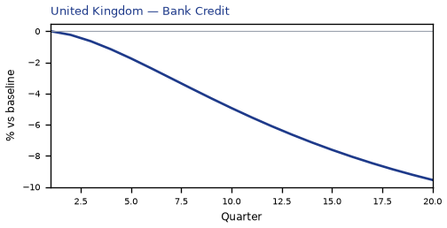

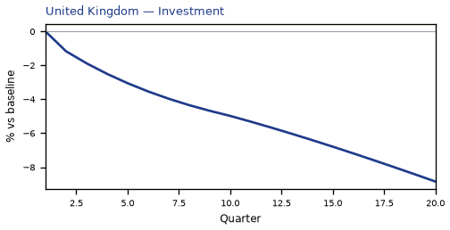

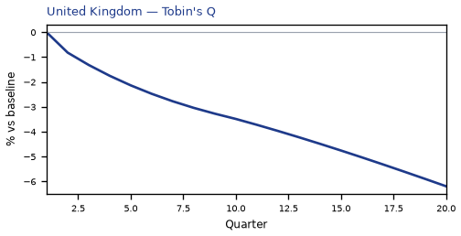

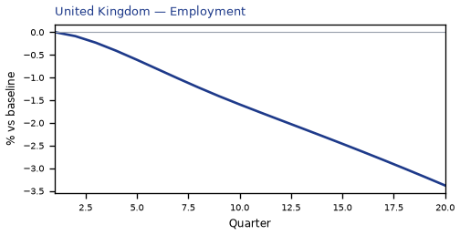

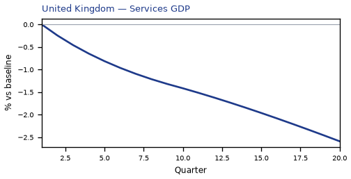

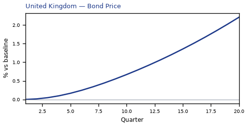


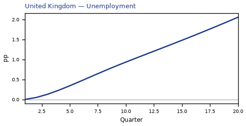

[Q1–Q20 JSON for United Kingdom](numbers/UK.json)

## NL — Netherlands

The main impact of a -25% United Kingdom housing shock on Netherlands would be a moderate drop in GDP of 0.15% by Q20. Equities peak at -0.38% in Q20.

Demand and trade. Consumption peaks at -0.09 % vs baseline in Q20, from +0.00 in Q1 to -0.09 in Q20. Investment peaks at -0.41 % vs baseline in Q20, from +0.00 in Q1 to -0.41 in Q20. Net Exports peaks at +0.01 % vs baseline in Q9, from -0.00 in Q1 to +0.00 in Q20. Gov Spending peaks at +0.03 % vs baseline in Q20, from +0.00 in Q1 to +0.03 in Q20. Gov Debt peaks at +0.04 % vs baseline in Q20, from +0.00 in Q1 to +0.04 in Q20.

External / FX. The real exchange rate shows real appreciation (a stronger home currency). Currency Strength peaks at -0.03 % vs baseline in Q20, from -0.00 in Q1 to -0.03 in Q20.

Labour. Employment peaks at -0.14 % vs baseline in Q20, from +0.00 in Q1 to -0.14 in Q20. Unemployment peaks at +0.10 pp in Q20, from +0.00 in Q1 to +0.10 in Q20. Real Wages peaks at -0.13 % vs baseline in Q20, from +0.00 in Q1 to -0.13 in Q20.

Prices. The three-year CPI impulse is -0.04 percentage points. CPI Inflation peaks at -0.01 pp in Q13, from -0.00 in Q1 to -0.01 in Q20. Domestic Infl. peaks at -0.00 pp in Q13, from -0.00 in Q1 to -0.00 in Q20. Marginal Cost peaks at -0.09 % vs baseline in Q20, from +0.00 in Q1 to -0.09 in Q20.

Financial conditions. Policy Rate peaks at +0.00 pp (annualized) in Q1, from +0.00 in Q1 to +0.00 in Q20. Govt 2Y Yield peaks at +0.00 pp (annualized) in Q1, from +0.00 in Q1 to +0.00 in Q20. Govt 5Y Yield peaks at +0.00 pp (annualized) in Q1, from +0.00 in Q1 to +0.00 in Q20. Govt 10Y Yield peaks at +0.00 pp (annualized) in Q1, from +0.00 in Q1 to +0.00 in Q20. Bond Price peaks at +0.07 % vs baseline in Q19, from -0.00 in Q1 to +0.07 in Q20. Equity Index peaks at -0.38 % vs baseline in Q20, from +0.00 in Q1 to -0.38 in Q20. Tobin's Q peaks at -0.28 % vs baseline in Q20, from +0.00 in Q1 to -0.28 in Q20. House Prices peaks at -0.18 % vs baseline in Q20, from +0.00 in Q1 to -0.18 in Q20. Bank Credit peaks at -0.27 % vs baseline in Q20, from +0.00 in Q1 to -0.27 in Q20. Credit Spread peaks at +0.00 pp in Q20, from +0.00 in Q1 to +0.00 in Q20.

Sectoral and capital. Manuf. GDP peaks at -0.02 % vs baseline in Q11, from +0.00 in Q1 to -0.01 in Q20. Services GDP peaks at -0.11 % vs baseline in Q20, from +0.00 in Q1 to -0.11 in Q20. Capital Stock peaks at -0.03 % vs baseline in Q20, from +0.00 in Q1 to -0.03 in Q20.

Timing. By Q20 GDP is still -0.15% from baseline.

These figures are model IRFs versus baseline, not forecasts.


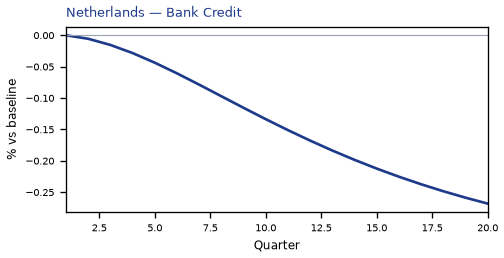

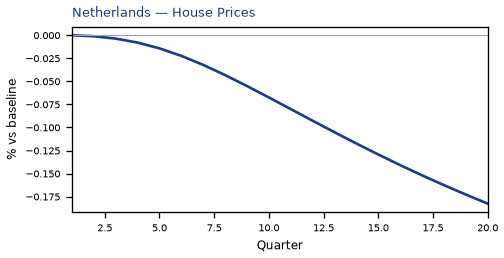

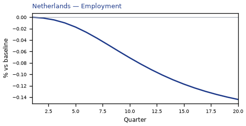

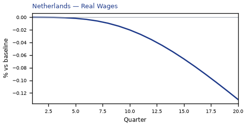

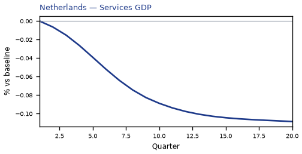

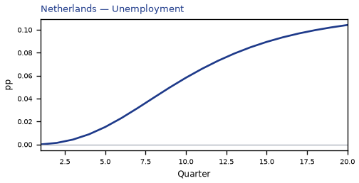

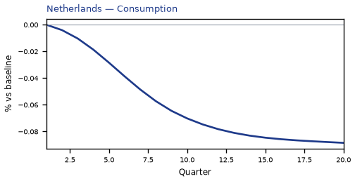

[Q1–Q20 JSON for Netherlands](numbers/NL.json)

## CH — Switzerland

The main impact of a -25% United Kingdom housing shock on Switzerland would be a moderate drop in GDP of 0.14% by Q14. Equities peak at -0.53% in Q14.

Demand and trade. Consumption peaks at -0.10 % vs baseline in Q15, from +0.00 in Q1 to -0.09 in Q20. Investment peaks at -0.34 % vs baseline in Q13, from -0.00 in Q1 to -0.28 in Q20. Net Exports peaks at +0.01 % vs baseline in Q14, from +0.00 in Q1 to +0.01 in Q20. Gov Spending peaks at +0.03 % vs baseline in Q14, from +0.00 in Q1 to +0.03 in Q20. Gov Debt peaks at -0.08 % vs baseline in Q20, from +0.00 in Q1 to -0.08 in Q20.

External / FX. The real exchange rate shows real appreciation (a stronger home currency). Currency Strength peaks at -0.07 % vs baseline in Q20, from +0.00 in Q1 to -0.07 in Q20.

Labour. Employment peaks at -0.14 % vs baseline in Q19, from +0.00 in Q1 to -0.14 in Q20. Unemployment peaks at +0.10 pp in Q19, from +0.00 in Q1 to +0.10 in Q20. Real Wages peaks at -0.09 % vs baseline in Q20, from +0.00 in Q1 to -0.09 in Q20.

Prices. The three-year CPI impulse is -0.04 percentage points. CPI Inflation peaks at -0.00 pp in Q7, from +0.00 in Q1 to -0.00 in Q20. Domestic Infl. peaks at -0.00 pp in Q7, from +0.00 in Q1 to -0.00 in Q20. Marginal Cost peaks at -0.08 % vs baseline in Q14, from +0.00 in Q1 to -0.07 in Q20.

Financial conditions. Policy Rate peaks at -0.04 pp (annualized) in Q20, from +0.00 in Q1 to -0.04 in Q20. Govt 2Y Yield peaks at -0.05 pp (annualized) in Q20, from -0.01 in Q1 to -0.05 in Q20. Govt 5Y Yield peaks at -0.05 pp (annualized) in Q20, from -0.02 in Q1 to -0.05 in Q20. Govt 10Y Yield peaks at -0.04 pp (annualized) in Q18, from -0.03 in Q1 to -0.04 in Q20. Bond Price peaks at +0.31 % vs baseline in Q20, from -0.00 in Q1 to +0.31 in Q20. Equity Index peaks at -0.53 % vs baseline in Q14, from +0.00 in Q1 to -0.48 in Q20. Tobin's Q peaks at -0.23 % vs baseline in Q13, from -0.00 in Q1 to -0.20 in Q20. House Prices peaks at -0.16 % vs baseline in Q20, from +0.00 in Q1 to -0.16 in Q20. Bank Credit peaks at -0.35 % vs baseline in Q20, from +0.00 in Q1 to -0.35 in Q20. Credit Spread peaks at +0.00 pp in Q20, from +0.00 in Q1 to +0.00 in Q20.

Sectoral and capital. Manuf. GDP peaks at -0.01 % vs baseline in Q13, from -0.00 in Q1 to -0.00 in Q20. Services GDP peaks at -0.11 % vs baseline in Q14, from +0.00 in Q1 to -0.10 in Q20. Capital Stock peaks at -0.02 % vs baseline in Q20, from +0.00 in Q1 to -0.02 in Q20.

Timing. By Q20 GDP is still -0.12% from baseline.

These figures are model IRFs versus baseline, not forecasts.


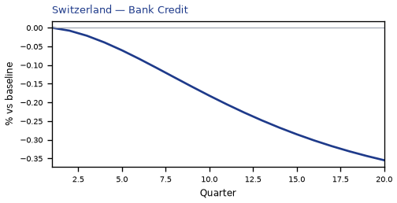

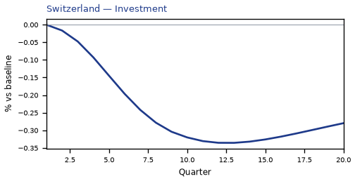

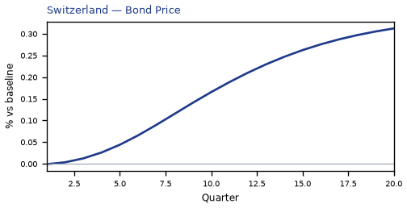

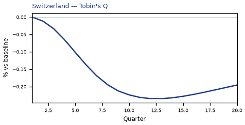

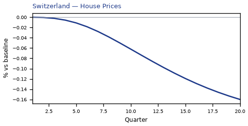


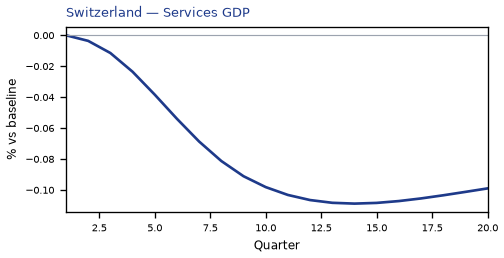

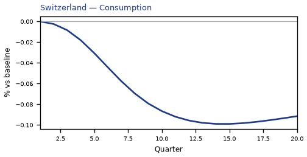

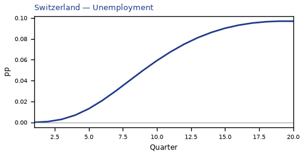

[Q1–Q20 JSON for Switzerland](numbers/CH.json)

## DE — Germany

The main impact of a -25% United Kingdom housing shock on Germany would be a moderate drop in GDP of 0.12% by Q14. Equities peak at -0.22% in Q14.

Demand and trade. Consumption peaks at -0.07 % vs baseline in Q15, from +0.00 in Q1 to -0.07 in Q20. Investment peaks at -0.33 % vs baseline in Q14, from +0.00 in Q1 to -0.31 in Q20. Net Exports peaks at +0.03 % vs baseline in Q13, from -0.00 in Q1 to +0.02 in Q20. Gov Spending peaks at +0.03 % vs baseline in Q14, from +0.00 in Q1 to +0.02 in Q20. Gov Debt peaks at +0.02 % vs baseline in Q20, from +0.00 in Q1 to +0.02 in Q20.

External / FX. The real exchange rate shows real appreciation (a stronger home currency). Currency Strength peaks at -0.05 % vs baseline in Q20, from -0.00 in Q1 to -0.05 in Q20.

Labour. Employment peaks at -0.12 % vs baseline in Q20, from +0.00 in Q1 to -0.12 in Q20. Unemployment peaks at +0.08 pp in Q20, from +0.00 in Q1 to +0.08 in Q20. Real Wages peaks at -0.12 % vs baseline in Q20, from +0.00 in Q1 to -0.12 in Q20.

Prices. The three-year CPI impulse is -0.04 percentage points. CPI Inflation peaks at -0.01 pp in Q13, from -0.00 in Q1 to -0.01 in Q20. Domestic Infl. peaks at -0.01 pp in Q13, from -0.00 in Q1 to -0.00 in Q20. Marginal Cost peaks at -0.07 % vs baseline in Q14, from +0.00 in Q1 to -0.07 in Q20.

Financial conditions. Policy Rate peaks at +0.00 pp (annualized) in Q1, from +0.00 in Q1 to +0.00 in Q20. Govt 2Y Yield peaks at +0.00 pp (annualized) in Q1, from +0.00 in Q1 to +0.00 in Q20. Govt 5Y Yield peaks at +0.00 pp (annualized) in Q1, from +0.00 in Q1 to +0.00 in Q20. Govt 10Y Yield peaks at +0.00 pp (annualized) in Q1, from +0.00 in Q1 to +0.00 in Q20. Bond Price peaks at +0.07 % vs baseline in Q19, from -0.00 in Q1 to +0.07 in Q20. Equity Index peaks at -0.22 % vs baseline in Q14, from +0.00 in Q1 to -0.20 in Q20. Tobin's Q peaks at -0.23 % vs baseline in Q14, from +0.00 in Q1 to -0.21 in Q20. House Prices peaks at -0.14 % vs baseline in Q20, from +0.00 in Q1 to -0.14 in Q20. Bank Credit peaks at -0.32 % vs baseline in Q20, from +0.00 in Q1 to -0.32 in Q20. Credit Spread peaks at +0.00 pp in Q20, from +0.00 in Q1 to +0.00 in Q20.

Sectoral and capital. Manuf. GDP peaks at -0.02 % vs baseline in Q10, from +0.00 in Q1 to -0.01 in Q20. Services GDP peaks at -0.08 % vs baseline in Q14, from +0.00 in Q1 to -0.08 in Q20. Capital Stock peaks at -0.02 % vs baseline in Q20, from +0.00 in Q1 to -0.02 in Q20.

Timing. By Q20 GDP is still -0.11% from baseline.

These figures are model IRFs versus baseline, not forecasts.


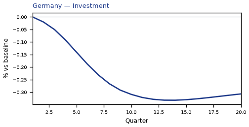

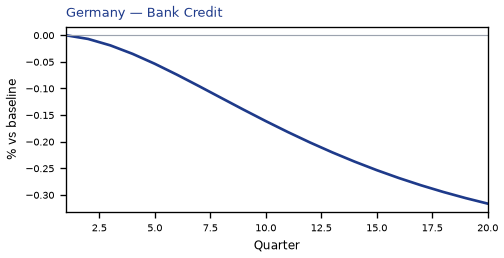

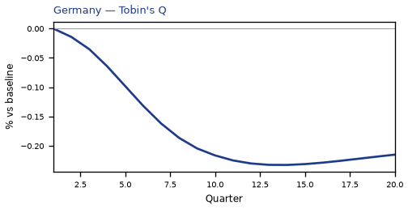

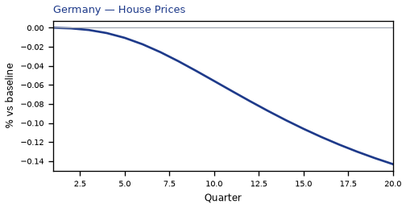

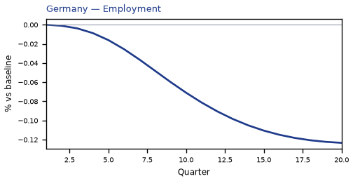

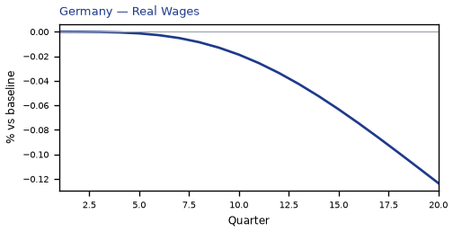


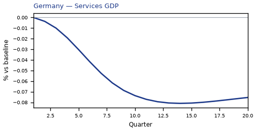

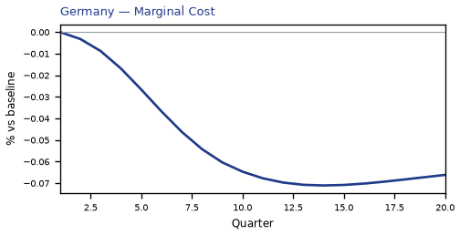

[Q1–Q20 JSON for Germany](numbers/DE.json)

## FR — France

The main impact of a -25% United Kingdom housing shock on France would be a moderate drop in GDP of 0.10% by Q14. Equities peak at -0.21% in Q14.

Demand and trade. Consumption peaks at -0.06 % vs baseline in Q15, from +0.00 in Q1 to -0.05 in Q20. Investment peaks at -0.28 % vs baseline in Q14, from +0.00 in Q1 to -0.26 in Q20. Net Exports peaks at +0.01 % vs baseline in Q11, from -0.00 in Q1 to +0.01 in Q20. Gov Spending peaks at +0.02 % vs baseline in Q14, from +0.00 in Q1 to +0.02 in Q20. Gov Debt peaks at +0.08 % vs baseline in Q20, from +0.00 in Q1 to +0.08 in Q20.

External / FX. The real exchange rate shows real appreciation (a stronger home currency). Currency Strength peaks at -0.06 % vs baseline in Q20, from -0.00 in Q1 to -0.06 in Q20.

Labour. Employment peaks at -0.10 % vs baseline in Q20, from +0.00 in Q1 to -0.10 in Q20. Unemployment peaks at +0.07 pp in Q20, from +0.00 in Q1 to +0.07 in Q20. Real Wages peaks at -0.08 % vs baseline in Q20, from +0.00 in Q1 to -0.08 in Q20.

Prices. The three-year CPI impulse is -0.04 percentage points. CPI Inflation peaks at -0.01 pp in Q13, from -0.00 in Q1 to -0.01 in Q20. Domestic Infl. peaks at -0.00 pp in Q13, from -0.00 in Q1 to -0.00 in Q20. Marginal Cost peaks at -0.06 % vs baseline in Q14, from +0.00 in Q1 to -0.06 in Q20.

Financial conditions. Policy Rate peaks at +0.00 pp (annualized) in Q1, from +0.00 in Q1 to +0.00 in Q20. Govt 2Y Yield peaks at +0.00 pp (annualized) in Q1, from +0.00 in Q1 to +0.00 in Q20. Govt 5Y Yield peaks at +0.00 pp (annualized) in Q1, from +0.00 in Q1 to +0.00 in Q20. Govt 10Y Yield peaks at +0.00 pp (annualized) in Q1, from +0.00 in Q1 to +0.00 in Q20. Bond Price peaks at +0.08 % vs baseline in Q19, from -0.00 in Q1 to +0.08 in Q20. Equity Index peaks at -0.21 % vs baseline in Q14, from +0.00 in Q1 to -0.19 in Q20. Tobin's Q peaks at -0.20 % vs baseline in Q14, from +0.00 in Q1 to -0.18 in Q20. House Prices peaks at -0.12 % vs baseline in Q20, from +0.00 in Q1 to -0.12 in Q20. Bank Credit peaks at -0.25 % vs baseline in Q20, from +0.00 in Q1 to -0.25 in Q20. Credit Spread peaks at +0.00 pp in Q20, from +0.00 in Q1 to +0.00 in Q20.

Sectoral and capital. Manuf. GDP peaks at -0.01 % vs baseline in Q8, from +0.00 in Q1 to +0.01 in Q20. Services GDP peaks at -0.08 % vs baseline in Q14, from +0.00 in Q1 to -0.07 in Q20. Capital Stock peaks at -0.02 % vs baseline in Q20, from +0.00 in Q1 to -0.02 in Q20.

Timing. By Q20 GDP is still -0.10% from baseline.

These figures are model IRFs versus baseline, not forecasts.


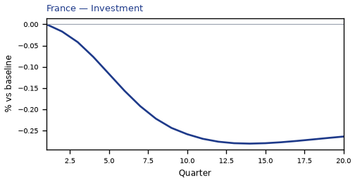


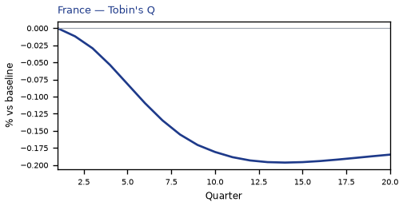

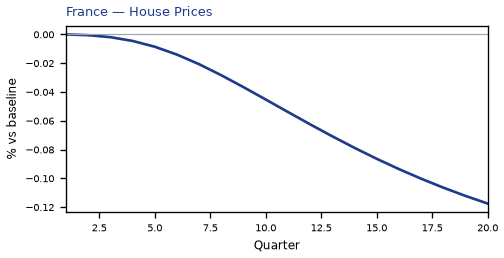

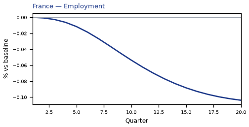

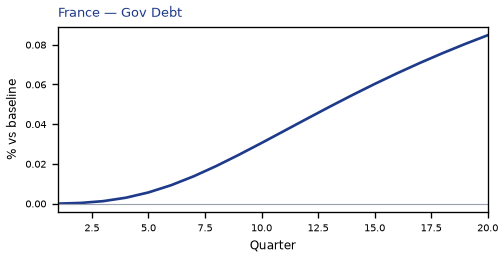

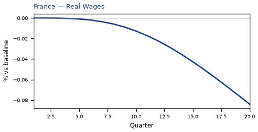

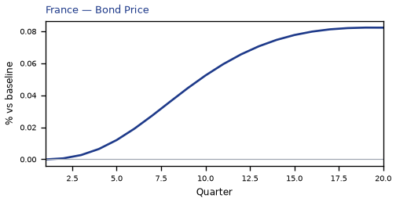

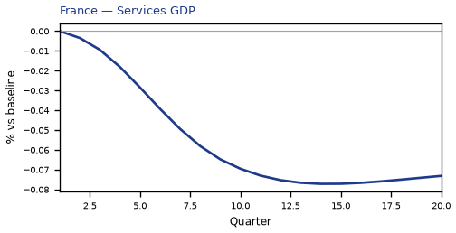

[Q1–Q20 JSON for France](numbers/FR.json)

## US — United States

The main impact of a -25% United Kingdom housing shock on the United States would be only a small drop in GDP of 0.09% by Q12. Equities peak at -0.25% in Q11.

Demand and trade. Consumption peaks at -0.06 % vs baseline in Q13, from +0.00 in Q1 to -0.04 in Q20. Investment peaks at -0.17 % vs baseline in Q10, from -0.00 in Q1 to -0.05 in Q20. Net Exports peaks at +0.00 % vs baseline in Q13, from +0.00 in Q1 to +0.00 in Q20. Gov Spending peaks at +0.02 % vs baseline in Q12, from +0.00 in Q1 to +0.01 in Q20. Gov Debt peaks at -0.02 % vs baseline in Q14, from +0.00 in Q1 to -0.01 in Q20.

External / FX. The real exchange rate shows real depreciation (a weaker, more competitive home currency). Currency Strength peaks at +0.07 % vs baseline in Q14, from +0.01 in Q1 to +0.04 in Q20.

Labour. Employment peaks at -0.10 % vs baseline in Q15, from +0.00 in Q1 to -0.08 in Q20. Unemployment peaks at +0.06 pp in Q16, from +0.00 in Q1 to +0.05 in Q20. Real Wages peaks at -0.10 % vs baseline in Q20, from +0.00 in Q1 to -0.10 in Q20.

Prices. The three-year CPI impulse is -0.04 percentage points. CPI Inflation peaks at -0.01 pp in Q14, from +0.00 in Q1 to -0.01 in Q20. Domestic Infl. peaks at -0.00 pp in Q14, from +0.00 in Q1 to -0.00 in Q20. Marginal Cost peaks at -0.05 % vs baseline in Q12, from +0.00 in Q1 to -0.03 in Q20.

Financial conditions. Policy Rate peaks at -0.07 pp (annualized) in Q17, from +0.00 in Q1 to -0.07 in Q20. Govt 2Y Yield peaks at -0.07 pp (annualized) in Q14, from -0.01 in Q1 to -0.06 in Q20. Govt 5Y Yield peaks at -0.06 pp (annualized) in Q10, from -0.04 in Q1 to -0.04 in Q20. Govt 10Y Yield peaks at -0.04 pp (annualized) in Q8, from -0.04 in Q1 to -0.04 in Q20. Bond Price peaks at +0.45 % vs baseline in Q17, from -0.00 in Q1 to +0.43 in Q20. Equity Index peaks at -0.25 % vs baseline in Q11, from +0.00 in Q1 to -0.14 in Q20. Tobin's Q peaks at -0.12 % vs baseline in Q10, from -0.00 in Q1 to -0.04 in Q20. House Prices peaks at -0.07 % vs baseline in Q20, from +0.00 in Q1 to -0.07 in Q20. Bank Credit peaks at -0.28 % vs baseline in Q20, from +0.00 in Q1 to -0.28 in Q20. Credit Spread peaks at +0.00 pp in Q20, from +0.00 in Q1 to +0.00 in Q20.

Sectoral and capital. Manuf. GDP peaks at -0.03 % vs baseline in Q14, from -0.00 in Q1 to -0.02 in Q20. Services GDP peaks at -0.07 % vs baseline in Q12, from +0.00 in Q1 to -0.04 in Q20. Capital Stock peaks at -0.01 % vs baseline in Q20, from +0.00 in Q1 to -0.01 in Q20.

Timing. By Q20 GDP is still -0.06% from baseline.

These figures are model IRFs versus baseline, not forecasts.


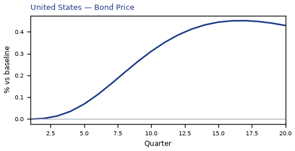

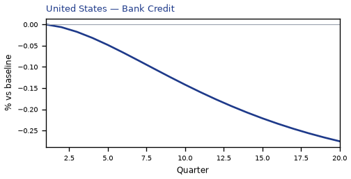

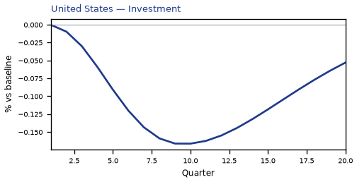

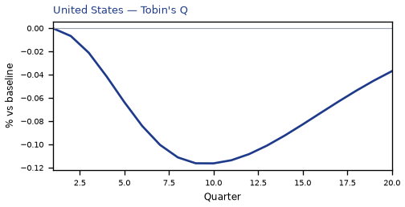

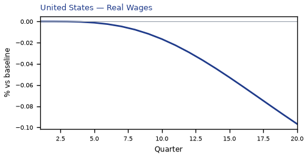

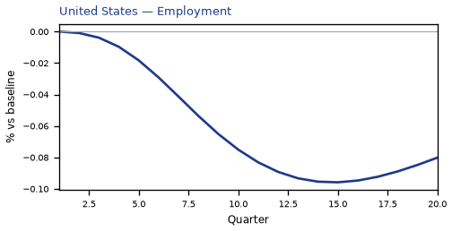

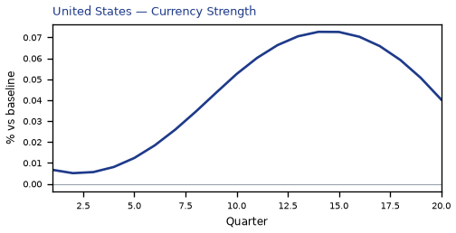

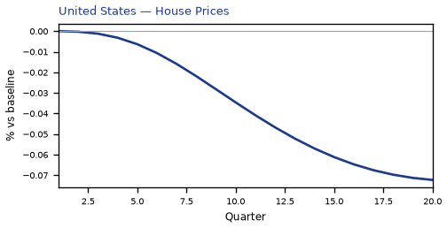


[Q1–Q20 JSON for United States](numbers/US.json)

## NO — Norway

The main impact of a -25% United Kingdom housing shock on Norway would be only a small drop in GDP of 0.07% by Q16. Equities peak at -0.14% in Q15.

Demand and trade. Consumption peaks at -0.04 % vs baseline in Q17, from +0.00 in Q1 to -0.04 in Q20. Investment peaks at -0.15 % vs baseline in Q12, from -0.00 in Q1 to -0.13 in Q20. Net Exports peaks at -0.04 % vs baseline in Q20, from +0.00 in Q1 to -0.04 in Q20. Gov Spending peaks at -0.01 % vs baseline in Q20, from +0.00 in Q1 to -0.01 in Q20. Gov Debt peaks at +0.02 % vs baseline in Q20, from +0.00 in Q1 to +0.02 in Q20.

External / FX. The real exchange rate shows real depreciation (a weaker, more competitive home currency). Currency Strength peaks at +0.16 % vs baseline in Q20, from +0.00 in Q1 to +0.16 in Q20.

Labour. Employment peaks at -0.08 % vs baseline in Q20, from +0.00 in Q1 to -0.08 in Q20. Unemployment peaks at +0.05 pp in Q20, from +0.00 in Q1 to +0.05 in Q20. Real Wages peaks at -0.07 % vs baseline in Q20, from +0.00 in Q1 to -0.07 in Q20.

Prices. The three-year CPI impulse is -0.01 percentage points. CPI Inflation peaks at -0.00 pp in Q20, from +0.00 in Q1 to -0.00 in Q20. Domestic Infl. peaks at -0.00 pp in Q20, from +0.00 in Q1 to -0.00 in Q20. Marginal Cost peaks at -0.04 % vs baseline in Q16, from +0.00 in Q1 to -0.04 in Q20.

Financial conditions. Policy Rate peaks at -0.05 pp (annualized) in Q20, from +0.00 in Q1 to -0.05 in Q20. Govt 2Y Yield peaks at -0.05 pp (annualized) in Q20, from -0.01 in Q1 to -0.05 in Q20. Govt 5Y Yield peaks at -0.05 pp (annualized) in Q20, from -0.03 in Q1 to -0.05 in Q20. Govt 10Y Yield peaks at -0.05 pp (annualized) in Q20, from -0.04 in Q1 to -0.05 in Q20. Bond Price peaks at +0.30 % vs baseline in Q20, from -0.00 in Q1 to +0.30 in Q20. Equity Index peaks at -0.14 % vs baseline in Q15, from +0.00 in Q1 to -0.13 in Q20. Tobin's Q peaks at -0.11 % vs baseline in Q12, from -0.00 in Q1 to -0.09 in Q20. House Prices peaks at -0.08 % vs baseline in Q20, from +0.00 in Q1 to -0.08 in Q20. Bank Credit peaks at -0.13 % vs baseline in Q20, from +0.00 in Q1 to -0.13 in Q20. Credit Spread peaks at +0.00 pp in Q20, from +0.00 in Q1 to +0.00 in Q20.

Sectoral and capital. Manuf. GDP peaks at -0.06 % vs baseline in Q19, from -0.00 in Q1 to -0.06 in Q20. Services GDP peaks at -0.04 % vs baseline in Q16, from +0.00 in Q1 to -0.04 in Q20. Capital Stock peaks at -0.01 % vs baseline in Q20, from +0.00 in Q1 to -0.01 in Q20.

Timing. By Q20 GDP is still -0.07% from baseline.

These figures are model IRFs versus baseline, not forecasts.


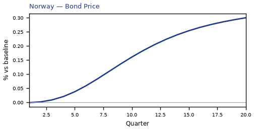

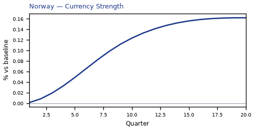

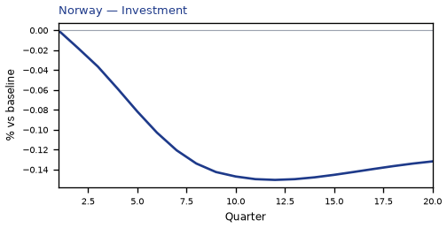


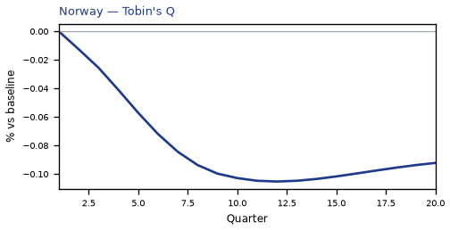


[Q1–Q20 JSON for Norway](numbers/NO.json)

## SE — Sweden

The main impact of a -25% United Kingdom housing shock on Sweden would be only a small drop in GDP of 0.07% by Q20. Equities peak at -0.19% in Q20.

Demand and trade. Consumption peaks at -0.04 % vs baseline in Q20, from +0.00 in Q1 to -0.04 in Q20. Investment peaks at -0.17 % vs baseline in Q15, from +0.00 in Q1 to -0.17 in Q20. Net Exports peaks at +0.01 % vs baseline in Q10, from -0.00 in Q1 to +0.00 in Q20. Gov Spending peaks at +0.01 % vs baseline in Q20, from +0.00 in Q1 to +0.01 in Q20. Gov Debt peaks at +0.04 % vs baseline in Q20, from +0.00 in Q1 to +0.04 in Q20.

External / FX. The real exchange rate shows real appreciation (a stronger home currency). Currency Strength peaks at -0.04 % vs baseline in Q20, from -0.00 in Q1 to -0.04 in Q20.

Labour. Employment peaks at -0.07 % vs baseline in Q20, from +0.00 in Q1 to -0.07 in Q20. Unemployment peaks at +0.05 pp in Q20, from +0.00 in Q1 to +0.05 in Q20. Real Wages peaks at -0.08 % vs baseline in Q20, from +0.00 in Q1 to -0.08 in Q20.

Prices. The three-year CPI impulse is -0.03 percentage points. CPI Inflation peaks at -0.01 pp in Q20, from -0.00 in Q1 to -0.01 in Q20. Domestic Infl. peaks at -0.00 pp in Q20, from -0.00 in Q1 to -0.00 in Q20. Marginal Cost peaks at -0.04 % vs baseline in Q20, from +0.00 in Q1 to -0.04 in Q20.

Financial conditions. Policy Rate peaks at -0.02 pp (annualized) in Q20, from +0.00 in Q1 to -0.02 in Q20. Govt 2Y Yield peaks at -0.03 pp (annualized) in Q20, from -0.00 in Q1 to -0.03 in Q20. Govt 5Y Yield peaks at -0.03 pp (annualized) in Q20, from -0.01 in Q1 to -0.03 in Q20. Govt 10Y Yield peaks at -0.03 pp (annualized) in Q20, from -0.02 in Q1 to -0.03 in Q20. Bond Price peaks at +0.15 % vs baseline in Q20, from +0.00 in Q1 to +0.15 in Q20. Equity Index peaks at -0.19 % vs baseline in Q20, from +0.00 in Q1 to -0.19 in Q20. Tobin's Q peaks at -0.12 % vs baseline in Q15, from +0.00 in Q1 to -0.12 in Q20. House Prices peaks at -0.08 % vs baseline in Q20, from +0.00 in Q1 to -0.08 in Q20. Bank Credit peaks at -0.13 % vs baseline in Q20, from +0.00 in Q1 to -0.13 in Q20. Credit Spread peaks at +0.00 pp in Q20, from +0.00 in Q1 to +0.00 in Q20.

Sectoral and capital. Manuf. GDP peaks at -0.01 % vs baseline in Q9, from +0.00 in Q1 to +0.00 in Q20. Services GDP peaks at -0.05 % vs baseline in Q20, from +0.00 in Q1 to -0.05 in Q20. Capital Stock peaks at -0.01 % vs baseline in Q20, from +0.00 in Q1 to -0.01 in Q20.

Timing. By Q20 GDP is still -0.07% from baseline.

These figures are model IRFs versus baseline, not forecasts.


[Q1–Q20 JSON for Sweden](numbers/SE.json)

## ES — Spain

The main impact of a -25% United Kingdom housing shock on Spain would be only a small drop in GDP of 0.07% by Q14. Equities peak at -0.11% in Q13.

Demand and trade. Consumption peaks at -0.04 % vs baseline in Q15, from +0.00 in Q1 to -0.04 in Q20. Investment peaks at -0.19 % vs baseline in Q14, from +0.00 in Q1 to -0.17 in Q20. Net Exports peaks at +0.01 % vs baseline in Q12, from -0.00 in Q1 to +0.01 in Q20. Gov Spending peaks at +0.01 % vs baseline in Q14, from +0.00 in Q1 to +0.01 in Q20. Gov Debt peaks at +0.01 % vs baseline in Q20, from +0.00 in Q1 to +0.01 in Q20.

External / FX. The real exchange rate shows real appreciation (a stronger home currency). Currency Strength peaks at -0.06 % vs baseline in Q20, from -0.00 in Q1 to -0.06 in Q20.

Labour. Employment peaks at -0.07 % vs baseline in Q20, from +0.00 in Q1 to -0.07 in Q20. Unemployment peaks at +0.03 pp in Q20, from +0.00 in Q1 to +0.03 in Q20. Real Wages peaks at -0.06 % vs baseline in Q20, from +0.00 in Q1 to -0.06 in Q20.

Prices. The three-year CPI impulse is -0.03 percentage points. CPI Inflation peaks at -0.01 pp in Q12, from -0.00 in Q1 to -0.00 in Q20. Domestic Infl. peaks at -0.00 pp in Q12, from -0.00 in Q1 to -0.00 in Q20. Marginal Cost peaks at -0.04 % vs baseline in Q14, from +0.00 in Q1 to -0.04 in Q20.

Financial conditions. Policy Rate peaks at +0.00 pp (annualized) in Q1, from +0.00 in Q1 to +0.00 in Q20. Govt 2Y Yield peaks at +0.00 pp (annualized) in Q1, from +0.00 in Q1 to +0.00 in Q20. Govt 5Y Yield peaks at +0.00 pp (annualized) in Q1, from +0.00 in Q1 to +0.00 in Q20. Govt 10Y Yield peaks at +0.00 pp (annualized) in Q1, from +0.00 in Q1 to +0.00 in Q20. Bond Price peaks at +0.08 % vs baseline in Q19, from -0.00 in Q1 to +0.08 in Q20. Equity Index peaks at -0.11 % vs baseline in Q13, from +0.00 in Q1 to -0.10 in Q20. Tobin's Q peaks at -0.13 % vs baseline in Q14, from +0.00 in Q1 to -0.12 in Q20. House Prices peaks at -0.08 % vs baseline in Q20, from +0.00 in Q1 to -0.08 in Q20. Bank Credit peaks at -0.17 % vs baseline in Q20, from +0.00 in Q1 to -0.17 in Q20. Credit Spread peaks at +0.00 pp in Q20, from +0.00 in Q1 to +0.00 in Q20.

Sectoral and capital. Manuf. GDP peaks at +0.01 % vs baseline in Q20, from +0.00 in Q1 to +0.01 in Q20. Services GDP peaks at -0.05 % vs baseline in Q14, from +0.00 in Q1 to -0.05 in Q20. Capital Stock peaks at -0.01 % vs baseline in Q20, from +0.00 in Q1 to -0.01 in Q20.

Timing. By Q20 GDP is still -0.06% from baseline.

These figures are model IRFs versus baseline, not forecasts.


[Q1–Q20 JSON for Spain](numbers/ES.json)

## AU — Australia

The main impact of a -25% United Kingdom housing shock on Australia would be only a small drop in GDP of 0.06% by Q13. Equities peak at -0.14% in Q12.

Demand and trade. Consumption peaks at -0.04 % vs baseline in Q14, from +0.00 in Q1 to -0.04 in Q20. Investment peaks at -0.13 % vs baseline in Q11, from -0.00 in Q1 to -0.08 in Q20. Net Exports peaks at -0.01 % vs baseline in Q20, from +0.00 in Q1 to -0.01 in Q20. Gov Spending peaks at +0.01 % vs baseline in Q13, from +0.00 in Q1 to +0.01 in Q20. Gov Debt peaks at -0.04 % vs baseline in Q20, from +0.00 in Q1 to -0.04 in Q20.

External / FX. The real exchange rate shows real depreciation (a weaker, more competitive home currency). Currency Strength peaks at +0.14 % vs baseline in Q16, from +0.00 in Q1 to +0.13 in Q20.

Labour. Employment peaks at -0.07 % vs baseline in Q17, from +0.00 in Q1 to -0.07 in Q20. Unemployment peaks at +0.04 pp in Q18, from +0.00 in Q1 to +0.04 in Q20. Real Wages peaks at -0.08 % vs baseline in Q20, from +0.00 in Q1 to -0.08 in Q20.

Prices. The three-year CPI impulse is -0.02 percentage points. CPI Inflation peaks at -0.00 pp in Q12, from +0.00 in Q1 to -0.00 in Q20. Domestic Infl. peaks at -0.00 pp in Q12, from +0.00 in Q1 to -0.00 in Q20. Marginal Cost peaks at -0.04 % vs baseline in Q13, from +0.00 in Q1 to -0.03 in Q20.

Financial conditions. Policy Rate peaks at -0.04 pp (annualized) in Q20, from +0.00 in Q1 to -0.04 in Q20. Govt 2Y Yield peaks at -0.04 pp (annualized) in Q18, from -0.01 in Q1 to -0.04 in Q20. Govt 5Y Yield peaks at -0.04 pp (annualized) in Q14, from -0.02 in Q1 to -0.04 in Q20. Govt 10Y Yield peaks at -0.04 pp (annualized) in Q13, from -0.03 in Q1 to -0.04 in Q20. Bond Price peaks at +0.28 % vs baseline in Q20, from -0.00 in Q1 to +0.28 in Q20. Equity Index peaks at -0.14 % vs baseline in Q12, from +0.00 in Q1 to -0.11 in Q20. Tobin's Q peaks at -0.09 % vs baseline in Q11, from -0.00 in Q1 to -0.06 in Q20. House Prices peaks at -0.06 % vs baseline in Q20, from +0.00 in Q1 to -0.06 in Q20. Bank Credit peaks at -0.17 % vs baseline in Q20, from +0.00 in Q1 to -0.17 in Q20. Credit Spread peaks at +0.00 pp in Q20, from +0.00 in Q1 to +0.00 in Q20.

Sectoral and capital. Manuf. GDP peaks at -0.05 % vs baseline in Q15, from -0.00 in Q1 to -0.04 in Q20. Services GDP peaks at -0.05 % vs baseline in Q13, from +0.00 in Q1 to -0.04 in Q20. Capital Stock peaks at -0.01 % vs baseline in Q20, from +0.00 in Q1 to -0.01 in Q20.

Timing. By Q20 GDP is still -0.05% from baseline.

These figures are model IRFs versus baseline, not forecasts.


[Q1–Q20 JSON for Australia](numbers/AU.json)

## CA — Canada

The main impact of a -25% United Kingdom housing shock on Canada would be only a small drop in GDP of 0.06% by Q12. Equities peak at -0.13% in Q12.

Demand and trade. Consumption peaks at -0.04 % vs baseline in Q13, from +0.00 in Q1 to -0.03 in Q20. Investment peaks at -0.11 % vs baseline in Q10, from +0.00 in Q1 to -0.06 in Q20. Net Exports peaks at -0.03 % vs baseline in Q20, from -0.00 in Q1 to -0.03 in Q20. Gov Spending peaks at +0.01 % vs baseline in Q11, from +0.00 in Q1 to +0.00 in Q20. Gov Debt peaks at -0.01 % vs baseline in Q20, from +0.00 in Q1 to -0.01 in Q20.

External / FX. The real exchange rate shows real depreciation (a weaker, more competitive home currency). Currency Strength peaks at +0.10 % vs baseline in Q20, from -0.00 in Q1 to +0.10 in Q20.

Labour. Employment peaks at -0.06 % vs baseline in Q16, from +0.00 in Q1 to -0.06 in Q20. Unemployment peaks at +0.04 pp in Q17, from +0.00 in Q1 to +0.04 in Q20. Real Wages peaks at -0.07 % vs baseline in Q20, from +0.00 in Q1 to -0.07 in Q20.

Prices. The three-year CPI impulse is -0.03 percentage points. CPI Inflation peaks at -0.00 pp in Q11, from -0.00 in Q1 to -0.00 in Q20. Domestic Infl. peaks at -0.00 pp in Q11, from -0.00 in Q1 to -0.00 in Q20. Marginal Cost peaks at -0.04 % vs baseline in Q12, from +0.00 in Q1 to -0.03 in Q20.

Financial conditions. Policy Rate peaks at -0.04 pp (annualized) in Q17, from -0.00 in Q1 to -0.04 in Q20. Govt 2Y Yield peaks at -0.04 pp (annualized) in Q14, from -0.01 in Q1 to -0.04 in Q20. Govt 5Y Yield peaks at -0.04 pp (annualized) in Q10, from -0.03 in Q1 to -0.03 in Q20. Govt 10Y Yield peaks at -0.03 pp (annualized) in Q9, from -0.03 in Q1 to -0.03 in Q20. Bond Price peaks at +0.27 % vs baseline in Q17, from +0.00 in Q1 to +0.25 in Q20. Equity Index peaks at -0.13 % vs baseline in Q12, from +0.00 in Q1 to -0.09 in Q20. Tobin's Q peaks at -0.08 % vs baseline in Q10, from +0.00 in Q1 to -0.04 in Q20. House Prices peaks at -0.06 % vs baseline in Q20, from +0.00 in Q1 to -0.06 in Q20. Bank Credit peaks at -0.13 % vs baseline in Q20, from +0.00 in Q1 to -0.13 in Q20. Credit Spread peaks at +0.00 pp in Q20, from +0.00 in Q1 to +0.00 in Q20.

Sectoral and capital. Manuf. GDP peaks at -0.04 % vs baseline in Q14, from +0.00 in Q1 to -0.03 in Q20. Services GDP peaks at -0.04 % vs baseline in Q12, from +0.00 in Q1 to -0.03 in Q20. Capital Stock peaks at -0.01 % vs baseline in Q20, from +0.00 in Q1 to -0.01 in Q20.

Timing. By Q20 GDP is still -0.04% from baseline.

These figures are model IRFs versus baseline, not forecasts.


[Q1–Q20 JSON for Canada](numbers/CA.json)

## JP — Japan

The main impact of a -25% United Kingdom housing shock on Japan would be only a small drop in GDP of 0.06% by Q13. Equities peak at -0.15% in Q13.

Demand and trade. Consumption peaks at -0.04 % vs baseline in Q14, from +0.00 in Q1 to -0.03 in Q20. Investment peaks at -0.15 % vs baseline in Q12, from +0.00 in Q1 to -0.12 in Q20. Net Exports peaks at +0.01 % vs baseline in Q12, from -0.00 in Q1 to +0.01 in Q20. Gov Spending peaks at +0.01 % vs baseline in Q13, from +0.00 in Q1 to +0.01 in Q20. Gov Debt peaks at -0.02 % vs baseline in Q20, from +0.00 in Q1 to -0.02 in Q20.

External / FX. The real exchange rate shows real appreciation (a stronger home currency). Currency Strength peaks at -0.24 % vs baseline in Q20, from -0.01 in Q1 to -0.24 in Q20.

Labour. Employment peaks at -0.06 % vs baseline in Q18, from +0.00 in Q1 to -0.06 in Q20. Unemployment peaks at +0.04 pp in Q18, from +0.00 in Q1 to +0.04 in Q20. Real Wages peaks at -0.05 % vs baseline in Q20, from +0.00 in Q1 to -0.05 in Q20.

Prices. The three-year CPI impulse is -0.06 percentage points. CPI Inflation peaks at -0.01 pp in Q9, from -0.00 in Q1 to -0.00 in Q20. Domestic Infl. peaks at -0.00 pp in Q9, from -0.00 in Q1 to -0.00 in Q20. Marginal Cost peaks at -0.03 % vs baseline in Q13, from +0.00 in Q1 to -0.03 in Q20.

Financial conditions. Policy Rate peaks at -0.01 pp (annualized) in Q20, from +0.00 in Q1 to -0.01 in Q20. Govt 2Y Yield peaks at -0.01 pp (annualized) in Q20, from -0.00 in Q1 to -0.01 in Q20. Govt 5Y Yield peaks at -0.01 pp (annualized) in Q16, from -0.00 in Q1 to -0.01 in Q20. Govt 10Y Yield peaks at -0.01 pp (annualized) in Q13, from -0.01 in Q1 to -0.01 in Q20. Bond Price peaks at +0.10 % vs baseline in Q19, from +0.00 in Q1 to +0.10 in Q20. Equity Index peaks at -0.15 % vs baseline in Q13, from +0.00 in Q1 to -0.12 in Q20. Tobin's Q peaks at -0.11 % vs baseline in Q12, from +0.00 in Q1 to -0.08 in Q20. House Prices peaks at -0.06 % vs baseline in Q20, from +0.00 in Q1 to -0.06 in Q20. Bank Credit peaks at -0.18 % vs baseline in Q20, from +0.00 in Q1 to -0.18 in Q20. Credit Spread peaks at +0.00 pp in Q20, from +0.00 in Q1 to +0.00 in Q20.

Sectoral and capital. Manuf. GDP peaks at +0.07 % vs baseline in Q20, from +0.00 in Q1 to +0.07 in Q20. Services GDP peaks at -0.04 % vs baseline in Q13, from +0.00 in Q1 to -0.03 in Q20. Capital Stock peaks at -0.01 % vs baseline in Q20, from +0.00 in Q1 to -0.01 in Q20.

Timing. By Q20 GDP is still -0.05% from baseline.

These figures are model IRFs versus baseline, not forecasts.


[Q1–Q20 JSON for Japan](numbers/JP.json)

## SA — Saudi Arabia

The main impact of a -25% United Kingdom housing shock on Saudi Arabia would be only a small drop in GDP of 0.04% by Q13. Equities peak at -0.16% in Q12.

Demand and trade. Consumption peaks at -0.03 % vs baseline in Q14, from +0.00 in Q1 to -0.03 in Q20. Investment peaks at -0.06 % vs baseline in Q8, from -0.00 in Q1 to -0.00 in Q20. Net Exports peaks at -0.07 % vs baseline in Q20, from +0.00 in Q1 to -0.07 in Q20. Gov Spending peaks at -0.03 % vs baseline in Q20, from +0.00 in Q1 to -0.03 in Q20. Gov Debt peaks at -0.09 % vs baseline in Q20, from +0.00 in Q1 to -0.09 in Q20.

External / FX. The real exchange rate shows real depreciation (a weaker, more competitive home currency). Currency Strength peaks at +0.06 % vs baseline in Q20, from +0.00 in Q1 to +0.06 in Q20.

Labour. Employment peaks at -0.05 % vs baseline in Q18, from +0.00 in Q1 to -0.05 in Q20. Unemployment peaks at +0.02 pp in Q17, from +0.00 in Q1 to +0.02 in Q20. Real Wages peaks at -0.05 % vs baseline in Q20, from +0.00 in Q1 to -0.05 in Q20.

Prices. The three-year CPI impulse is -0.02 percentage points. CPI Inflation peaks at -0.00 pp in Q9, from +0.00 in Q1 to -0.00 in Q20. Domestic Infl. peaks at -0.00 pp in Q9, from +0.00 in Q1 to -0.00 in Q20. Marginal Cost peaks at -0.03 % vs baseline in Q13, from +0.00 in Q1 to -0.02 in Q20.

Financial conditions. Policy Rate peaks at -0.07 pp (annualized) in Q17, from +0.00 in Q1 to -0.07 in Q20. Govt 2Y Yield peaks at -0.07 pp (annualized) in Q14, from -0.01 in Q1 to -0.06 in Q20. Govt 5Y Yield peaks at -0.06 pp (annualized) in Q10, from -0.04 in Q1 to -0.04 in Q20. Govt 10Y Yield peaks at -0.04 pp (annualized) in Q8, from -0.04 in Q1 to -0.04 in Q20. Bond Price peaks at +0.34 % vs baseline in Q17, from -0.00 in Q1 to +0.33 in Q20. Equity Index peaks at -0.16 % vs baseline in Q12, from +0.00 in Q1 to -0.13 in Q20. Tobin's Q peaks at -0.04 % vs baseline in Q8, from -0.00 in Q1 to -0.00 in Q20. House Prices peaks at -0.05 % vs baseline in Q20, from +0.00 in Q1 to -0.05 in Q20. Bank Credit peaks at -0.07 % vs baseline in Q20, from +0.00 in Q1 to -0.07 in Q20. Credit Spread peaks at +0.00 pp in Q20, from +0.00 in Q1 to +0.00 in Q20.

Sectoral and capital. Manuf. GDP peaks at -0.02 % vs baseline in Q20, from +0.00 in Q1 to -0.02 in Q20. Services GDP peaks at -0.02 % vs baseline in Q13, from +0.00 in Q1 to -0.02 in Q20. Capital Stock peaks at -0.00 % vs baseline in Q20, from +0.00 in Q1 to -0.00 in Q20.

Timing. By Q20 GDP is still -0.04% from baseline.

These figures are model IRFs versus baseline, not forecasts.


[Q1–Q20 JSON for Saudi Arabia](numbers/SA.json)

## AR — Argentina

The main impact of a -25% United Kingdom housing shock on Argentina would be only a small rise in GDP of 0.04% by Q20. Equities peak at +0.12% in Q20.

Demand and trade. Consumption peaks at +0.02 % vs baseline in Q20, from +0.00 in Q1 to +0.02 in Q20. Investment peaks at +0.11 % vs baseline in Q20, from -0.00 in Q1 to +0.11 in Q20. Net Exports peaks at -0.03 % vs baseline in Q20, from +0.00 in Q1 to -0.03 in Q20. Gov Spending peaks at -0.01 % vs baseline in Q20, from +0.00 in Q1 to -0.01 in Q20. Gov Debt peaks at +0.01 % vs baseline in Q20, from +0.00 in Q1 to +0.01 in Q20.

External / FX. The real exchange rate shows real appreciation (a stronger home currency). Currency Strength peaks at -0.05 % vs baseline in Q20, from +0.00 in Q1 to -0.05 in Q20.

Labour. Employment peaks at +0.02 % vs baseline in Q20, from +0.00 in Q1 to +0.02 in Q20. Unemployment peaks at -0.01 pp in Q20, from +0.00 in Q1 to -0.01 in Q20. Real Wages peaks at -0.02 % vs baseline in Q14, from +0.00 in Q1 to -0.00 in Q20.

Prices. The three-year CPI impulse is -0.03 percentage points. CPI Inflation peaks at -0.00 pp in Q9, from +0.00 in Q1 to +0.00 in Q20. Domestic Infl. peaks at -0.00 pp in Q9, from +0.00 in Q1 to +0.00 in Q20. Marginal Cost peaks at +0.03 % vs baseline in Q20, from +0.00 in Q1 to +0.03 in Q20.

Financial conditions. Policy Rate peaks at -0.02 pp (annualized) in Q10, from +0.00 in Q1 to +0.01 in Q20. Govt 2Y Yield peaks at -0.02 pp (annualized) in Q7, from -0.01 in Q1 to +0.02 in Q20. Govt 5Y Yield peaks at +0.02 pp (annualized) in Q20, from -0.01 in Q1 to +0.02 in Q20. Govt 10Y Yield peaks at +0.01 pp (annualized) in Q19, from +0.00 in Q1 to +0.01 in Q20. Bond Price peaks at +0.05 % vs baseline in Q10, from -0.00 in Q1 to -0.02 in Q20. Equity Index peaks at +0.12 % vs baseline in Q20, from -0.00 in Q1 to +0.12 in Q20. Tobin's Q peaks at +0.08 % vs baseline in Q20, from -0.00 in Q1 to +0.08 in Q20. House Prices peaks at +0.03 % vs baseline in Q20, from +0.00 in Q1 to +0.03 in Q20. Bank Credit peaks at -0.03 % vs baseline in Q20, from +0.00 in Q1 to -0.03 in Q20. Credit Spread peaks at +0.01 pp in Q20, from +0.00 in Q1 to +0.01 in Q20.

Sectoral and capital. Manuf. GDP peaks at +0.03 % vs baseline in Q20, from -0.00 in Q1 to +0.03 in Q20. Services GDP peaks at +0.02 % vs baseline in Q20, from +0.00 in Q1 to +0.02 in Q20. Capital Stock peaks at +0.00 % vs baseline in Q20, from +0.00 in Q1 to +0.00 in Q20.

Timing. By Q20 GDP is still +0.04% from baseline.

These figures are model IRFs versus baseline, not forecasts.


[Q1–Q20 JSON for Argentina](numbers/AR.json)

## PL — Poland

The main impact of a -25% United Kingdom housing shock on Poland would be no material drop in GDP of 0.04% by Q13. Equities peak at -0.05% in Q10. This has almost no impact on Poland.


[Q1–Q20 JSON for Poland](numbers/PL.json)

## ZA — South Africa

The main impact of a -25% United Kingdom housing shock on South Africa would be only a small drop in GDP of 0.04% by Q11. Equities peak at -0.13% in Q11.

Demand and trade. Consumption peaks at -0.02 % vs baseline in Q12, from +0.00 in Q1 to -0.02 in Q20. Investment peaks at -0.09 % vs baseline in Q9, from +0.00 in Q1 to -0.04 in Q20. Net Exports peaks at +0.01 % vs baseline in Q20, from -0.00 in Q1 to +0.01 in Q20. Gov Spending peaks at +0.01 % vs baseline in Q11, from +0.00 in Q1 to +0.00 in Q20. Gov Debt peaks at -0.04 % vs baseline in Q20, from +0.00 in Q1 to -0.04 in Q20.

External / FX. The real exchange rate shows real depreciation (a weaker, more competitive home currency). Currency Strength peaks at +0.06 % vs baseline in Q20, from -0.00 in Q1 to +0.06 in Q20.

Labour. Employment peaks at -0.04 % vs baseline in Q16, from +0.00 in Q1 to -0.04 in Q20. Unemployment peaks at +0.01 pp in Q14, from +0.00 in Q1 to +0.01 in Q20. Real Wages peaks at -0.07 % vs baseline in Q20, from +0.00 in Q1 to -0.07 in Q20.

Prices. The three-year CPI impulse is -0.02 percentage points. CPI Inflation peaks at -0.00 pp in Q11, from -0.00 in Q1 to -0.00 in Q20. Domestic Infl. peaks at -0.00 pp in Q11, from -0.00 in Q1 to -0.00 in Q20. Marginal Cost peaks at -0.02 % vs baseline in Q11, from +0.00 in Q1 to -0.01 in Q20.

Financial conditions. Policy Rate peaks at -0.02 pp (annualized) in Q14, from -0.00 in Q1 to -0.02 in Q20. Govt 2Y Yield peaks at -0.02 pp (annualized) in Q11, from -0.00 in Q1 to -0.01 in Q20. Govt 5Y Yield peaks at -0.02 pp (annualized) in Q8, from -0.01 in Q1 to -0.01 in Q20. Govt 10Y Yield peaks at -0.01 pp (annualized) in Q8, from -0.01 in Q1 to -0.01 in Q20. Bond Price peaks at +0.08 % vs baseline in Q14, from +0.00 in Q1 to +0.07 in Q20. Equity Index peaks at -0.13 % vs baseline in Q11, from +0.00 in Q1 to -0.06 in Q20. Tobin's Q peaks at -0.06 % vs baseline in Q9, from +0.00 in Q1 to -0.03 in Q20. House Prices peaks at -0.05 % vs baseline in Q20, from +0.00 in Q1 to -0.05 in Q20. Bank Credit peaks at -0.12 % vs baseline in Q20, from +0.00 in Q1 to -0.12 in Q20. Credit Spread peaks at +0.00 pp in Q20, from +0.00 in Q1 to +0.00 in Q20.

Sectoral and capital. Manuf. GDP peaks at -0.02 % vs baseline in Q12, from +0.00 in Q1 to -0.02 in Q20. Services GDP peaks at -0.03 % vs baseline in Q11, from +0.00 in Q1 to -0.02 in Q20. Capital Stock peaks at -0.01 % vs baseline in Q20, from +0.00 in Q1 to -0.01 in Q20.

Timing. By Q20 GDP is still -0.02% from baseline.

These figures are model IRFs versus baseline, not forecasts.


[Q1–Q20 JSON for South Africa](numbers/ZA.json)

## CN — China

The main impact of a -25% United Kingdom housing shock on China would be only a small drop in GDP of 0.04% by Q11. Equities peak at -0.06% in Q10.

Demand and trade. Consumption peaks at -0.03 % vs baseline in Q12, from +0.00 in Q1 to -0.01 in Q20. Investment peaks at -0.07 % vs baseline in Q9, from +0.00 in Q1 to +0.01 in Q20. Net Exports peaks at +0.02 % vs baseline in Q18, from -0.00 in Q1 to +0.02 in Q20. Gov Spending peaks at +0.01 % vs baseline in Q11, from +0.00 in Q1 to +0.00 in Q20. Gov Debt peaks at -0.05 % vs baseline in Q20, from +0.00 in Q1 to -0.05 in Q20.

External / FX. The real exchange rate shows real depreciation (a weaker, more competitive home currency). Currency Strength peaks at +0.01 % vs baseline in Q17, from -0.00 in Q1 to +0.01 in Q20.

Labour. Employment peaks at -0.03 % vs baseline in Q17, from +0.00 in Q1 to -0.03 in Q20. Unemployment peaks at +0.01 pp in Q14, from +0.00 in Q1 to +0.01 in Q20. Real Wages peaks at -0.07 % vs baseline in Q20, from +0.00 in Q1 to -0.07 in Q20.

Prices. The three-year CPI impulse is -0.04 percentage points. CPI Inflation peaks at -0.00 pp in Q11, from -0.00 in Q1 to -0.00 in Q20. Domestic Infl. peaks at -0.00 pp in Q11, from -0.00 in Q1 to -0.00 in Q20. Marginal Cost peaks at -0.02 % vs baseline in Q11, from +0.00 in Q1 to -0.01 in Q20.

Financial conditions. Policy Rate peaks at -0.03 pp (annualized) in Q18, from +0.00 in Q1 to -0.03 in Q20. Govt 2Y Yield peaks at -0.03 pp (annualized) in Q15, from -0.00 in Q1 to -0.03 in Q20. Govt 5Y Yield peaks at -0.03 pp (annualized) in Q10, from -0.02 in Q1 to -0.02 in Q20. Govt 10Y Yield peaks at -0.02 pp (annualized) in Q6, from -0.02 in Q1 to -0.01 in Q20. Bond Price peaks at +0.17 % vs baseline in Q18, from +0.00 in Q1 to +0.16 in Q20. Equity Index peaks at -0.06 % vs baseline in Q10, from +0.00 in Q1 to -0.01 in Q20. Tobin's Q peaks at -0.05 % vs baseline in Q9, from +0.00 in Q1 to +0.00 in Q20. House Prices peaks at -0.03 % vs baseline in Q18, from +0.00 in Q1 to -0.03 in Q20. Bank Credit peaks at -0.06 % vs baseline in Q20, from +0.00 in Q1 to -0.06 in Q20. Credit Spread peaks at +0.00 pp in Q20, from +0.00 in Q1 to +0.00 in Q20.

Sectoral and capital. Manuf. GDP peaks at -0.01 % vs baseline in Q11, from +0.00 in Q1 to +0.00 in Q20. Services GDP peaks at -0.02 % vs baseline in Q11, from +0.00 in Q1 to -0.01 in Q20. Capital Stock peaks at -0.00 % vs baseline in Q19, from +0.00 in Q1 to -0.00 in Q20.

Timing. By Q20 GDP is still -0.02% from baseline.

These figures are model IRFs versus baseline, not forecasts.


[Q1–Q20 JSON for China](numbers/CN.json)

## IT — Italy

The main impact of a -25% United Kingdom housing shock on Italy would be no material drop in GDP of 0.03% by Q13. Equities peak at -0.03% in Q10. This has almost no impact on Italy.


[Q1–Q20 JSON for Italy](numbers/IT.json)

## TR — Turkey

The main impact of a -25% United Kingdom housing shock on Turkey would be only a small drop in GDP of 0.03% by Q10. Equities peak at +0.05% in Q20.

Demand and trade. Consumption peaks at -0.02 % vs baseline in Q10, from +0.00 in Q1 to -0.00 in Q20. Investment peaks at -0.05 % vs baseline in Q8, from -0.00 in Q1 to +0.03 in Q20. Net Exports peaks at +0.02 % vs baseline in Q13, from +0.00 in Q1 to +0.02 in Q20. Gov Spending peaks at +0.00 % vs baseline in Q10, from +0.00 in Q1 to -0.00 in Q20. Gov Debt peaks at -0.02 % vs baseline in Q18, from +0.00 in Q1 to -0.02 in Q20.

External / FX. The real exchange rate shows real depreciation (a weaker, more competitive home currency). Currency Strength peaks at +0.03 % vs baseline in Q9, from +0.00 in Q1 to +0.01 in Q20.

Labour. Employment peaks at -0.02 % vs baseline in Q14, from +0.00 in Q1 to -0.02 in Q20. Unemployment peaks at +0.01 pp in Q12, from +0.00 in Q1 to +0.00 in Q20. Real Wages peaks at -0.05 % vs baseline in Q20, from +0.00 in Q1 to -0.05 in Q20.

Prices. The three-year CPI impulse is -0.02 percentage points. CPI Inflation peaks at -0.00 pp in Q12, from +0.00 in Q1 to -0.00 in Q20. Domestic Infl. peaks at -0.00 pp in Q12, from +0.00 in Q1 to -0.00 in Q20. Marginal Cost peaks at -0.02 % vs baseline in Q10, from +0.00 in Q1 to +0.00 in Q20.

Financial conditions. Policy Rate peaks at -0.02 pp (annualized) in Q13, from +0.00 in Q1 to -0.01 in Q20. Govt 2Y Yield peaks at -0.02 pp (annualized) in Q10, from -0.00 in Q1 to -0.01 in Q20. Govt 5Y Yield peaks at -0.01 pp (annualized) in Q6, from -0.01 in Q1 to -0.00 in Q20. Govt 10Y Yield peaks at -0.01 pp (annualized) in Q6, from -0.01 in Q1 to -0.00 in Q20. Bond Price peaks at +0.07 % vs baseline in Q13, from -0.00 in Q1 to +0.04 in Q20. Equity Index peaks at +0.05 % vs baseline in Q20, from -0.00 in Q1 to +0.05 in Q20. Tobin's Q peaks at -0.04 % vs baseline in Q8, from -0.00 in Q1 to +0.02 in Q20. House Prices peaks at -0.02 % vs baseline in Q15, from +0.00 in Q1 to -0.02 in Q20. Bank Credit peaks at -0.06 % vs baseline in Q20, from +0.00 in Q1 to -0.06 in Q20. Credit Spread peaks at +0.01 pp in Q20, from +0.00 in Q1 to +0.01 in Q20.

Sectoral and capital. Manuf. GDP peaks at -0.01 % vs baseline in Q8, from -0.00 in Q1 to +0.00 in Q20. Services GDP peaks at -0.02 % vs baseline in Q10, from +0.00 in Q1 to +0.00 in Q20. Capital Stock peaks at -0.00 % vs baseline in Q15, from +0.00 in Q1 to -0.00 in Q20.

Timing. The GDP response has mostly faded by Q18 (Q20 is +0.00%).

These figures are model IRFs versus baseline, not forecasts.


[Q1–Q20 JSON for Turkey](numbers/TR.json)

## MY — Malaysia

The main impact of a -25% United Kingdom housing shock on Malaysia would be no material drop in GDP of 0.02% by Q12. Equities peak at -0.05% in Q10. This has almost no impact on Malaysia.


[Q1–Q20 JSON for Malaysia](numbers/MY.json)

## IN — India

The main impact of a -25% United Kingdom housing shock on India would be only a small drop in GDP of 0.02% by Q9. Equities peak at +0.05% in Q20.

Demand and trade. Consumption peaks at -0.01 % vs baseline in Q10, from +0.00 in Q1 to +0.00 in Q20. Investment peaks at +0.05 % vs baseline in Q20, from -0.00 in Q1 to +0.05 in Q20. Net Exports peaks at +0.01 % vs baseline in Q12, from +0.00 in Q1 to +0.01 in Q20. Gov Spending peaks at +0.00 % vs baseline in Q9, from +0.00 in Q1 to -0.00 in Q20. Gov Debt peaks at -0.03 % vs baseline in Q17, from +0.00 in Q1 to -0.03 in Q20.

External / FX. The real exchange rate shows real appreciation (a stronger home currency). Currency Strength peaks at -0.02 % vs baseline in Q20, from +0.00 in Q1 to -0.02 in Q20.

Labour. Employment peaks at -0.02 % vs baseline in Q15, from +0.00 in Q1 to -0.01 in Q20. Unemployment peaks at +0.00 pp in Q11, from +0.00 in Q1 to -0.00 in Q20. Real Wages peaks at -0.05 % vs baseline in Q20, from +0.00 in Q1 to -0.05 in Q20.

Prices. The three-year CPI impulse is -0.04 percentage points. CPI Inflation peaks at -0.01 pp in Q11, from +0.00 in Q1 to -0.00 in Q20. Domestic Infl. peaks at -0.00 pp in Q11, from +0.00 in Q1 to -0.00 in Q20. Marginal Cost peaks at -0.01 % vs baseline in Q9, from +0.00 in Q1 to +0.00 in Q20.

Financial conditions. Policy Rate peaks at -0.03 pp (annualized) in Q13, from +0.00 in Q1 to -0.02 in Q20. Govt 2Y Yield peaks at -0.03 pp (annualized) in Q10, from -0.01 in Q1 to -0.01 in Q20. Govt 5Y Yield peaks at -0.02 pp (annualized) in Q6, from -0.02 in Q1 to -0.01 in Q20. Govt 10Y Yield peaks at -0.01 pp (annualized) in Q1, from -0.01 in Q1 to -0.00 in Q20. Bond Price peaks at +0.16 % vs baseline in Q13, from -0.00 in Q1 to +0.10 in Q20. Equity Index peaks at +0.05 % vs baseline in Q20, from +0.00 in Q1 to +0.05 in Q20. Tobin's Q peaks at +0.04 % vs baseline in Q20, from -0.00 in Q1 to +0.04 in Q20. House Prices peaks at -0.02 % vs baseline in Q14, from +0.00 in Q1 to -0.01 in Q20. Bank Credit peaks at -0.06 % vs baseline in Q20, from +0.00 in Q1 to -0.06 in Q20. Credit Spread peaks at +0.00 pp in Q20, from +0.00 in Q1 to +0.00 in Q20.

Sectoral and capital. Manuf. GDP peaks at +0.01 % vs baseline in Q20, from -0.00 in Q1 to +0.01 in Q20. Services GDP peaks at -0.01 % vs baseline in Q9, from +0.00 in Q1 to +0.00 in Q20. Capital Stock peaks at -0.00 % vs baseline in Q12, from +0.00 in Q1 to +0.00 in Q20.

Timing. The GDP response has mostly faded by Q17 (Q20 is +0.01%).

These figures are model IRFs versus baseline, not forecasts.


[Q1–Q20 JSON for India](numbers/IN.json)

## TH — Thailand

The main impact of a -25% United Kingdom housing shock on Thailand would be no material drop in GDP of 0.02% by Q12. Equities peak at -0.04% in Q9. This has almost no impact on Thailand.


[Q1–Q20 JSON for Thailand](numbers/TH.json)

## BR — Brazil

The main impact of a -25% United Kingdom housing shock on Brazil would be only a small drop in GDP of 0.02% by Q10. Equities peak at +0.05% in Q20.

Demand and trade. Consumption peaks at -0.01 % vs baseline in Q10, from +0.00 in Q1 to +0.00 in Q20. Investment peaks at +0.05 % vs baseline in Q20, from -0.00 in Q1 to +0.05 in Q20. Net Exports peaks at -0.03 % vs baseline in Q20, from +0.00 in Q1 to -0.03 in Q20. Gov Spending peaks at -0.01 % vs baseline in Q20, from +0.00 in Q1 to -0.01 in Q20. Gov Debt peaks at -0.00 % vs baseline in Q17, from +0.00 in Q1 to -0.00 in Q20.

External / FX. The real exchange rate shows real depreciation (a weaker, more competitive home currency). Currency Strength peaks at +0.07 % vs baseline in Q11, from +0.00 in Q1 to +0.04 in Q20.

Labour. Employment peaks at -0.02 % vs baseline in Q14, from +0.00 in Q1 to -0.01 in Q20. Unemployment peaks at +0.00 pp in Q12, from +0.00 in Q1 to +0.00 in Q20. Real Wages peaks at -0.04 % vs baseline in Q20, from +0.00 in Q1 to -0.04 in Q20.

Prices. The three-year CPI impulse is -0.03 percentage points. CPI Inflation peaks at -0.00 pp in Q11, from +0.00 in Q1 to -0.00 in Q20. Domestic Infl. peaks at -0.00 pp in Q11, from +0.00 in Q1 to -0.00 in Q20. Marginal Cost peaks at -0.01 % vs baseline in Q10, from +0.00 in Q1 to +0.00 in Q20.

Financial conditions. Policy Rate peaks at -0.03 pp (annualized) in Q13, from +0.00 in Q1 to -0.02 in Q20. Govt 2Y Yield peaks at -0.03 pp (annualized) in Q10, from -0.01 in Q1 to -0.01 in Q20. Govt 5Y Yield peaks at -0.02 pp (annualized) in Q6, from -0.02 in Q1 to -0.01 in Q20. Govt 10Y Yield peaks at -0.01 pp (annualized) in Q1, from -0.01 in Q1 to -0.00 in Q20. Bond Price peaks at +0.12 % vs baseline in Q13, from -0.00 in Q1 to +0.08 in Q20. Equity Index peaks at +0.05 % vs baseline in Q20, from +0.00 in Q1 to +0.05 in Q20. Tobin's Q peaks at +0.03 % vs baseline in Q20, from -0.00 in Q1 to +0.03 in Q20. House Prices peaks at -0.02 % vs baseline in Q14, from +0.00 in Q1 to -0.01 in Q20. Bank Credit peaks at -0.06 % vs baseline in Q20, from +0.00 in Q1 to -0.06 in Q20. Credit Spread peaks at +0.00 pp in Q20, from +0.00 in Q1 to +0.00 in Q20.

Sectoral and capital. Manuf. GDP peaks at -0.02 % vs baseline in Q10, from -0.00 in Q1 to -0.01 in Q20. Services GDP peaks at -0.01 % vs baseline in Q10, from +0.00 in Q1 to +0.00 in Q20. Capital Stock peaks at -0.00 % vs baseline in Q13, from +0.00 in Q1 to -0.00 in Q20.

Timing. The GDP response has mostly faded by Q17 (Q20 is +0.01%).

These figures are model IRFs versus baseline, not forecasts.


[Q1–Q20 JSON for Brazil](numbers/BR.json)

## MX — Mexico

The main impact of a -25% United Kingdom housing shock on Mexico would be no material drop in GDP of 0.02% by Q10. Equities peak at +0.03% in Q20. This has almost no impact on Mexico.


[Q1–Q20 JSON for Mexico](numbers/MX.json)

## KR — South Korea

The main impact of a -25% United Kingdom housing shock on South Korea would be no material drop in GDP of 0.02% by Q10. Equities peak at -0.03% in Q8. This has almost no impact on South Korea.


[Q1–Q20 JSON for South Korea](numbers/KR.json)

## NG — Nigeria

The main impact of a -25% United Kingdom housing shock on Nigeria would be only a small drop in GDP of 0.02% by Q9. Equities peak at +0.06% in Q20.

Demand and trade. Consumption peaks at -0.01 % vs baseline in Q10, from -0.00 in Q1 to +0.01 in Q20. Investment peaks at +0.06 % vs baseline in Q20, from -0.00 in Q1 to +0.06 in Q20. Net Exports peaks at -0.03 % vs baseline in Q20, from +0.00 in Q1 to -0.03 in Q20. Gov Spending peaks at -0.01 % vs baseline in Q20, from +0.00 in Q1 to -0.01 in Q20. Gov Debt peaks at -0.04 % vs baseline in Q16, from +0.00 in Q1 to -0.03 in Q20.

External / FX. The real exchange rate shows real depreciation (a weaker, more competitive home currency). Currency Strength peaks at +0.03 % vs baseline in Q8, from +0.00 in Q1 to +0.00 in Q20.

Labour. Employment peaks at -0.01 % vs baseline in Q13, from +0.00 in Q1 to -0.00 in Q20. Unemployment peaks at +0.00 pp in Q10, from +0.00 in Q1 to -0.00 in Q20. Real Wages peaks at -0.05 % vs baseline in Q20, from +0.00 in Q1 to -0.05 in Q20.

Prices. The three-year CPI impulse is -0.05 percentage points. CPI Inflation peaks at -0.01 pp in Q10, from +0.00 in Q1 to -0.00 in Q20. Domestic Infl. peaks at -0.00 pp in Q10, from +0.00 in Q1 to -0.00 in Q20. Marginal Cost peaks at -0.01 % vs baseline in Q9, from +0.00 in Q1 to +0.01 in Q20.

Financial conditions. Policy Rate peaks at -0.03 pp (annualized) in Q12, from +0.00 in Q1 to -0.02 in Q20. Govt 2Y Yield peaks at -0.03 pp (annualized) in Q9, from -0.01 in Q1 to -0.01 in Q20. Govt 5Y Yield peaks at -0.02 pp (annualized) in Q5, from -0.02 in Q1 to -0.00 in Q20. Govt 10Y Yield peaks at -0.01 pp (annualized) in Q3, from -0.01 in Q1 to -0.00 in Q20. Bond Price peaks at +0.07 % vs baseline in Q12, from -0.00 in Q1 to +0.04 in Q20. Equity Index peaks at +0.06 % vs baseline in Q20, from +0.00 in Q1 to +0.06 in Q20. Tobin's Q peaks at +0.04 % vs baseline in Q20, from -0.00 in Q1 to +0.04 in Q20. House Prices peaks at -0.01 % vs baseline in Q13, from +0.00 in Q1 to -0.00 in Q20. Bank Credit peaks at -0.07 % vs baseline in Q20, from +0.00 in Q1 to -0.07 in Q20. Credit Spread peaks at +0.01 pp in Q20, from +0.00 in Q1 to +0.01 in Q20.

Sectoral and capital. Manuf. GDP peaks at -0.01 % vs baseline in Q8, from -0.00 in Q1 to +0.00 in Q20. Services GDP peaks at -0.01 % vs baseline in Q9, from +0.00 in Q1 to +0.01 in Q20. Capital Stock peaks at +0.00 % vs baseline in Q20, from +0.00 in Q1 to +0.00 in Q20.

Timing. The GDP response has mostly faded by Q15 (Q20 is +0.01%).

These figures are model IRFs versus baseline, not forecasts.


[Q1–Q20 JSON for Nigeria](numbers/NG.json)

## RU — Russia

The main impact of a -25% United Kingdom housing shock on Russia would be no material drop in GDP of 0.02% by Q10. Equities peak at +0.05% in Q20. This has almost no impact on Russia.


[Q1–Q20 JSON for Russia](numbers/RU.json)

## CL — Chile

The main impact of a -25% United Kingdom housing shock on Chile would be no material drop in GDP of 0.01% by Q10. Equities peak at +0.03% in Q20. This has almost no impact on Chile.


[Q1–Q20 JSON for Chile](numbers/CL.json)

## CO — Colombia

The main impact of a -25% United Kingdom housing shock on Colombia would be no material drop in GDP of 0.01% by Q9. Equities peak at +0.04% in Q20. This has almost no impact on Colombia.


[Q1–Q20 JSON for Colombia](numbers/CO.json)

## ID — Indonesia

The main impact of a -25% United Kingdom housing shock on Indonesia would be no material drop in GDP of 0.01% by Q9. Equities peak at +0.04% in Q20. This has almost no impact on Indonesia.


[Q1–Q20 JSON for Indonesia](numbers/ID.json)


---

These figures are model IRFs versus baseline, not forecasts, and not financial advice.
