# Global Macro Economic Simulations and Financial Market Responses

v6 · IRF · evaluation

**Open the typeset report (this is the document):** https://robomacro.com/GlobalMacroTrainingDataset/uk_housing_25/

GitHub and Hugging Face show `.html` as source code. That is not the report. Read it on robomacro.com, or keep scrolling this page.

## What's the impact of UK housing -25%

a -25% United Kingdom housing shock. Every path is a model impulse response versus baseline, not a forecast and not financial advice.

### Summary

This note traces the model response to a -25% United Kingdom housing shock. Every path is an impulse response versus an unchanged baseline — not a forecast of what will happen in the world and not a reading of market data. The chapters that follow are already sorted by the size of the GDP response.

United Kingdom is where the shock lands. GDP contracts by 3.27% by Q20, a first-order GDP response for a -25% United Kingdom housing shock. Equities soften 8.09%, and the three-year CPI impulse is -0.71 percentage points. The move shows up first in private investment / the cost of capital, then in household consumption, government spending. That is the main adjustment: a change in financial conditions and real income, then the usual lag into activity and prices. It is the conditional elasticity to the shock that was switched on, not a prediction that this path will be realised.

Spillovers are not a carbon copy of that first path. Netherlands contracts by 0.14% versus baseline by Q20 — a moderate GDP response. Equities soften 0.37%. The move shows up first in private investment / the cost of capital, then in household consumption, employment. Switzerland contracts by 0.14% versus baseline by Q14 — a moderate GDP response. Equities soften 0.52%, and the three-year CPI impulse is -0.06 percentage points. The move shows up first in private investment / the cost of capital, then in household consumption, employment. Germany contracts by 0.11% versus baseline by Q14 — a moderate GDP response. Equities soften 0.21%. The move shows up first in private investment / the cost of capital, then in real wages, employment. The contrast is the point: neighbours feel a fraction of the housing-country hit, not a copy of it.

France contracts by 0.10% versus baseline by Q14 — only a small GDP response. Equities soften 0.20%. The move shows up first in private investment / the cost of capital, then in government debt, employment.

A few prices are common across the panel. On the government curve, 30-year bond prices rally 23.23% by Q20, and unused tenors stay in the background rather than getting a sentence each; the NEER prints a trade-weighted depreciation (-0.25% in Q20). Treat those as the shared financial backdrop, not as extra shocks, unless they appear in the active treatment.

Read GDP as percent of baseline GDP: −0.52 is minus half a percent, never −52%. A 200 basis-point move is 2.00 percentage points on the policy rate. CPI over three years is the sum of twelve quarterly impulses, not an annualised rate. A rising real exchange rate is a real depreciation — a weaker, more competitive home currency.

The remaining economies are smaller spillovers, written in the same order in the chapters that follow. Each chapter is a desk note, not a catalog of every series. This material is a model-based summary and is not financial advice.

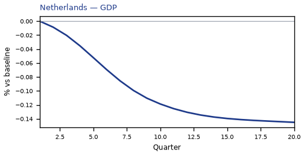

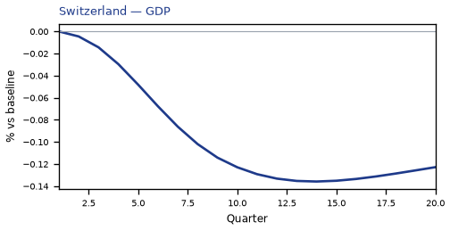

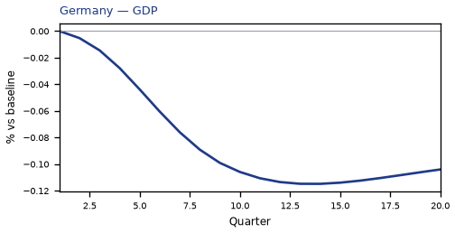

## UK — United Kingdom

The main impact of a -25% United Kingdom housing shock on United Kingdom is a large drop in GDP of 3.27% by Q20. This is a model impulse response versus baseline, not a forecast. Equities soften 8.09% by Q20. The three-year CPI impulse is -0.71 percentage points.

Demand and trade. Private investment / the cost of capital falls 8.84% by Q20; household consumption falls 2.08% by Q20; government spending rises 0.67% by Q20; government debt falls 0.28% by Q20; the same direction shows up in the trade balance.

Labour. Employment falls 3.38% by Q20; unemployment rises by +2.06 percentage points in Q20; real wages falls 1.97% by Q20.

Prices. Firms' marginal cost falls 1.96% by Q20; CPI inflation falls 0.17 percentage points by Q20; domestic inflation falls 0.12 percentage points by Q20.

Policy rates and the government curve. 30-year bond prices rally 23.23% by Q20; 10-year bond prices rally 6.92% by Q20; 5-year bond prices rally 2.70% by Q20; bond prices (higher discount rates) rally 2.22% by Q20; the same direction shows up in 30-year government yields, 10-year government yields, 2-year bond prices; the rest of the government curve barely moves.

Exchange rates. The NEER prints a trade-weighted depreciation (-0.25% in Q20); the real exchange rate shows a real depreciation (a weaker, more competitive home currency), peaking at +0.24% in Q20; versus the dollar the home currency is weaker versus the dollar (+0.22% in Q20).

Equities and risk. Equity prices / financial conditions falls 8.09% by Q20; Tobin's Q (the value of installed capital) falls 6.19% by Q20; the VIX (global equity-implied volatility) stay close to baseline.

Housing and credit. House prices fall 27.63% by Q20; bank equity falls 12.01% by Q20; bank credit supply falls 9.55% by Q20; lending spreads rises 0.12 percentage points by Q20.

Commodities. Other published commodity prices stay near their baselines.

Sectors and capital. Services output falls 2.59% by Q20; manufacturing output falls 0.62% by Q20; the capital stock falls 0.50% by Q20.

By Q20, GDP is still -3.27% from baseline.

These figures are model IRFs versus baseline, not forecasts and not financial advice.

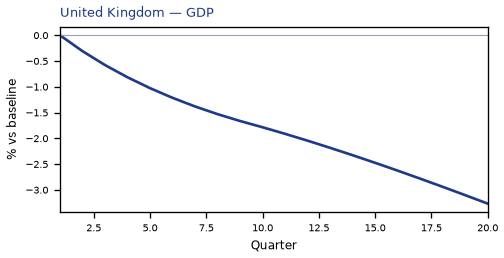

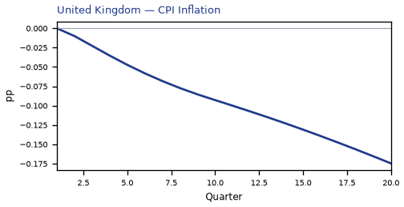

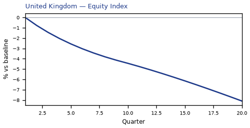

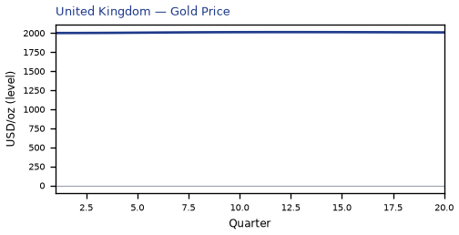

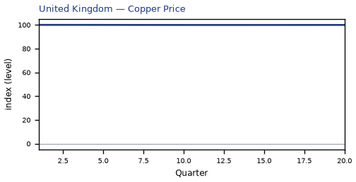

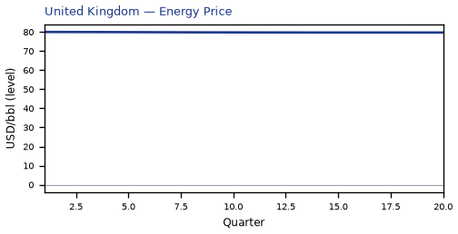

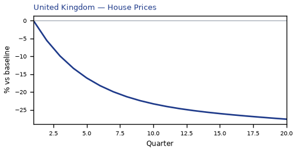

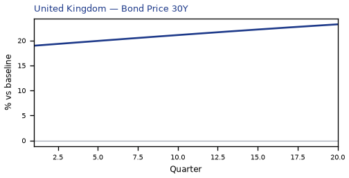

[Q1–Q20 JSON for United Kingdom](numbers/UK.json)

## NL — Netherlands

The main impact of a -25% United Kingdom housing shock on Netherlands is a moderate drop in GDP of 0.14% by Q20. This is a model impulse response versus baseline, not a forecast. Equities soften 0.37% by Q20.

Demand and trade. Private investment / the cost of capital falls 0.36% by Q20; household consumption falls 0.09% by Q20; the trade balance, government spending, government debt stay close to baseline.

Labour. Employment falls 0.14% by Q20; real wages falls 0.13% by Q20; unemployment rises by +0.10 percentage points in Q20.

Prices. Firms' marginal cost falls 0.08% by Q20; CPI inflation, domestic inflation stay close to baseline.

Policy rates and the government curve. 30-year bond prices rally 0.28% by Q10; bond prices (higher discount rates) rally 0.16% by Q19; 10-year bond prices rally 0.15% by Q11; 5-year bond prices rally 0.10% by Q13; the rest of the government curve barely moves.

Exchange rates. The real exchange rate, the nominal effective exchange rate (increase = trade-weighted appreciation), the bilateral real versus the dollar (increase = home weaker vs USD) stay close to baseline.

Equities and risk. Equity prices / financial conditions falls 0.37% by Q20; Tobin's Q (the value of installed capital) falls 0.25% by Q20; the VIX (global equity-implied volatility) stay close to baseline.

Housing and credit. Bank equity falls 0.34% by Q20; bank credit supply falls 0.27% by Q20; house prices fall 0.18% by Q20; house prices and bank credit are close to unchanged.

Commodities. Other published commodity prices stay near their baselines.

Sectors and capital. Services output falls 0.11% by Q20; manufacturing output, the capital stock stay close to baseline.

By Q20, GDP is still -0.14% from baseline.

These figures are model IRFs versus baseline, not forecasts and not financial advice.

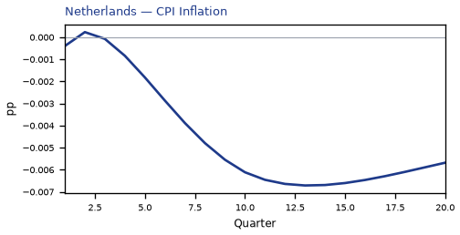

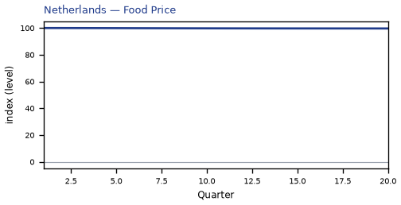

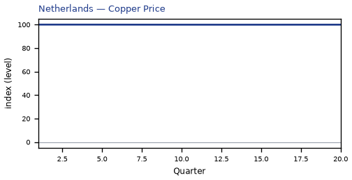

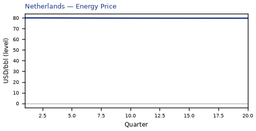

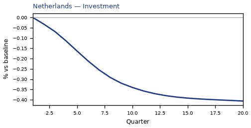

[Q1–Q20 JSON for Netherlands](numbers/NL.json)

## CH — Switzerland

The main impact of a -25% United Kingdom housing shock on Switzerland is a moderate drop in GDP of 0.14% by Q14. This is a model impulse response versus baseline, not a forecast. Equities soften 0.52% by Q14. The three-year CPI impulse is -0.06 percentage points.

Demand and trade. Private investment / the cost of capital falls 0.33% by Q12; household consumption falls 0.10% by Q14; the trade balance, government spending, government debt stay close to baseline.

Labour. Employment falls 0.14% by Q18; real wages falls 0.10% by Q20; unemployment rises by +0.10 percentage points in Q19.

Prices. Firms' marginal cost falls 0.08% by Q14; CPI inflation, domestic inflation stay close to baseline.

Policy rates and the government curve. 30-year bond prices rally 0.74% by Q14; 10-year bond prices rally 0.37% by Q16; bond prices (higher discount rates) rally 0.33% by Q20; 5-year bond prices rally 0.21% by Q18; the same direction shows up in 2-year bond prices; the rest of the government curve barely moves.

Exchange rates. Versus the dollar the home currency is stronger versus the dollar (-0.16% in Q15); the real exchange rate shows a real appreciation (a stronger home currency), peaking at -0.12% in Q20; the NEER prints a trade-weighted appreciation (+0.10% in Q20).

Equities and risk. Equity prices / financial conditions falls 0.52% by Q14; Tobin's Q (the value of installed capital) falls 0.23% by Q12; the VIX (global equity-implied volatility) stay close to baseline.

Housing and credit. Bank equity falls 0.45% by Q20; bank credit supply falls 0.35% by Q20; house prices fall 0.16% by Q20; house prices and bank credit are close to unchanged.

Commodities. Other published commodity prices stay near their baselines.

Sectors and capital. Services output falls 0.11% by Q14; manufacturing output, the capital stock stay close to baseline.

By Q20, GDP is still -0.12% from baseline.

These figures are model IRFs versus baseline, not forecasts and not financial advice.

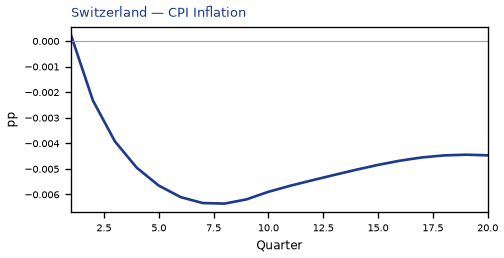

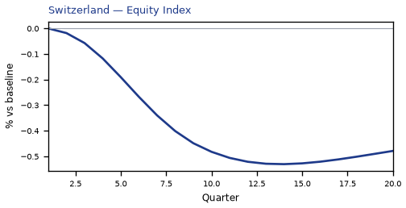

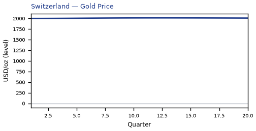

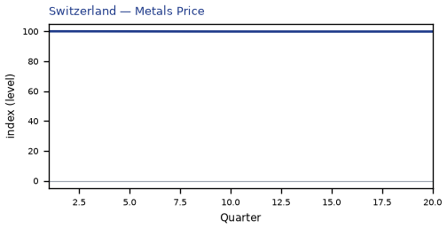

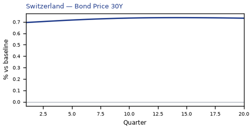

[Q1–Q20 JSON for Switzerland](numbers/CH.json)

## DE — Germany

The main impact of a -25% United Kingdom housing shock on Germany is a moderate drop in GDP of 0.11% by Q14. This is a model impulse response versus baseline, not a forecast. Equities soften 0.21% by Q13.

Demand and trade. Private investment / the cost of capital falls 0.29% by Q12; household consumption, the trade balance, government spending, government debt stay close to baseline.

Labour. Real wages falls 0.12% by Q20; employment falls 0.12% by Q20; unemployment rises by +0.08 percentage points in Q19.

Prices. CPI inflation, domestic inflation, firms' marginal cost stay close to baseline.

Policy rates and the government curve. 30-year bond prices rally 0.28% by Q10; bond prices (higher discount rates) rally 0.16% by Q19; 10-year bond prices rally 0.15% by Q11; 5-year bond prices rally 0.10% by Q13; the rest of the government curve barely moves.

Exchange rates. The real exchange rate, the nominal effective exchange rate (increase = trade-weighted appreciation), the bilateral real versus the dollar (increase = home weaker vs USD) stay close to baseline.

Equities and risk. Equity prices / financial conditions falls 0.21% by Q13; Tobin's Q (the value of installed capital) falls 0.20% by Q12; the VIX (global equity-implied volatility) stay close to baseline.

Housing and credit. Bank equity falls 0.39% by Q20; bank credit supply falls 0.32% by Q20; house prices fall 0.13% by Q20; house prices and bank credit are close to unchanged.

Commodities. Other published commodity prices stay near their baselines.

Sectors and capital. Manufacturing output, services output, the capital stock stay close to baseline.

By Q20, GDP is still -0.10% from baseline.

These figures are model IRFs versus baseline, not forecasts and not financial advice.

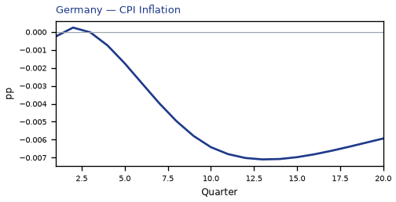

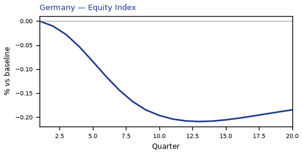

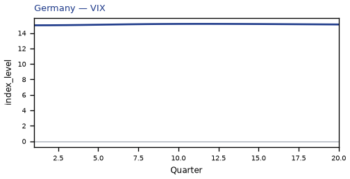

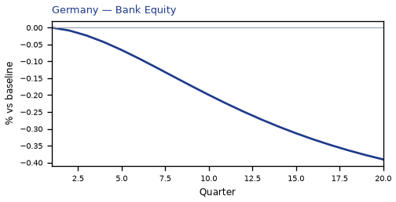

[Q1–Q20 JSON for Germany](numbers/DE.json)

## FR — France

The main impact of a -25% United Kingdom housing shock on France is only a small drop in GDP of 0.10% by Q14. This is a model impulse response versus baseline, not a forecast. Equities soften 0.20% by Q13.

Demand and trade. Private investment / the cost of capital falls 0.24% by Q12; government debt rises 0.08% by Q20; household consumption, the trade balance, government spending stay close to baseline.

Labour. Employment falls 0.10% by Q20; real wages falls 0.08% by Q20; unemployment rises by +0.07 percentage points in Q20.

Prices. CPI inflation, domestic inflation, firms' marginal cost stay close to baseline.

Policy rates and the government curve. 30-year bond prices rally 0.28% by Q10; bond prices (higher discount rates) rally 0.16% by Q19; 10-year bond prices rally 0.15% by Q11; 5-year bond prices rally 0.10% by Q13; the rest of the government curve barely moves.

Exchange rates. Versus the dollar the home currency is stronger versus the dollar (-0.08% in Q15); the real exchange rate, the nominal effective exchange rate (increase = trade-weighted appreciation) stay close to baseline.

Equities and risk. Equity prices / financial conditions falls 0.20% by Q13; Tobin's Q (the value of installed capital) falls 0.17% by Q12; the VIX (global equity-implied volatility) stay close to baseline.

Housing and credit. Bank equity falls 0.32% by Q20; bank credit supply falls 0.25% by Q20; house prices fall 0.11% by Q20; house prices and bank credit are close to unchanged.

Commodities. Other published commodity prices stay near their baselines.

Sectors and capital. Manufacturing output, services output, the capital stock stay close to baseline.

By Q20, GDP is still -0.09% from baseline.

These figures are model IRFs versus baseline, not forecasts and not financial advice.

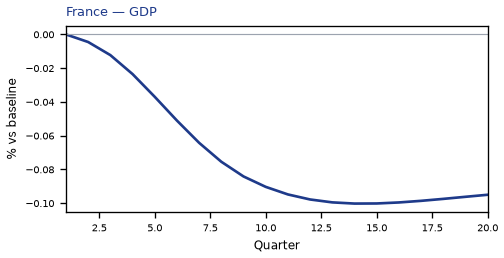

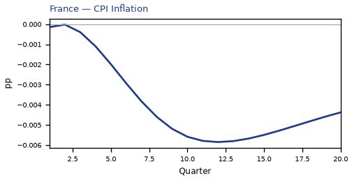

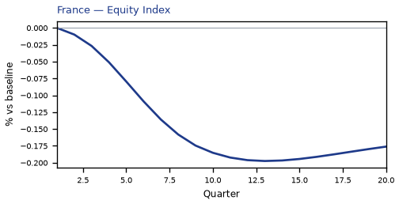

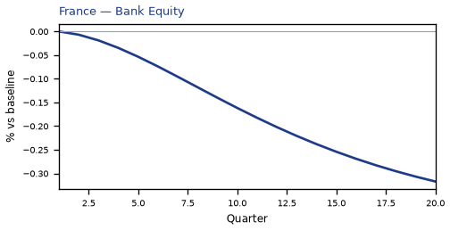

[Q1–Q20 JSON for France](numbers/FR.json)

## NO — Norway

The main impact of a -25% United Kingdom housing shock on Norway is only a small drop in GDP of 0.09% by Q16. This is a model impulse response versus baseline, not a forecast. Equities soften 0.17% by Q15.

Demand and trade. Private investment / the cost of capital falls 0.19% by Q12; household consumption, the trade balance, government spending, government debt stay close to baseline.

Labour. Employment falls 0.10% by Q20; real wages falls 0.08% by Q20; unemployment rises by +0.07 percentage points in Q20.

Prices. CPI inflation, domestic inflation, firms' marginal cost stay close to baseline.

Policy rates and the government curve. 30-year bond prices rally 1.14% by Q20; 10-year bond prices rally 0.54% by Q20; bond prices (higher discount rates) rally 0.36% by Q20; 5-year bond prices rally 0.29% by Q20; the same direction shows up in 2-year bond prices, 10-year government yields, 5-year government yields; the rest of the government curve barely moves.

Exchange rates. The NEER prints a trade-weighted depreciation (-0.18% in Q20); the real exchange rate shows a real depreciation (a weaker, more competitive home currency), peaking at +0.17% in Q20; versus the dollar the home currency is weaker versus the dollar (+0.15% in Q20).

Equities and risk. Equity prices / financial conditions falls 0.17% by Q15; Tobin's Q (the value of installed capital) falls 0.13% by Q12; the VIX (global equity-implied volatility) stay close to baseline.

Housing and credit. Bank equity falls 0.17% by Q20; bank credit supply falls 0.14% by Q20; house prices fall 0.10% by Q20; house prices and bank credit are close to unchanged.

Commodities. Other published commodity prices stay near their baselines.

Sectors and capital. Manufacturing output, services output, the capital stock stay close to baseline.

By Q20, GDP is still -0.09% from baseline.

These figures are model IRFs versus baseline, not forecasts and not financial advice.

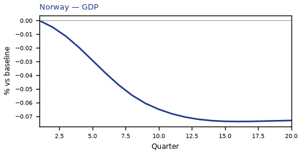

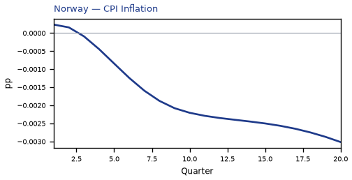

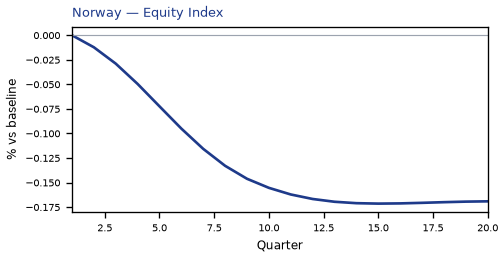

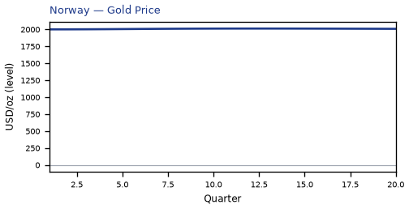

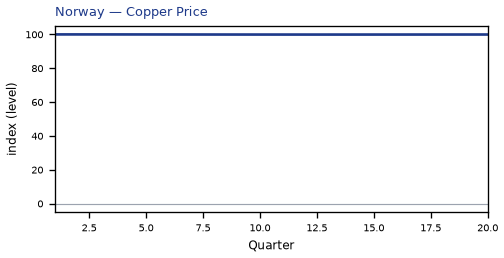

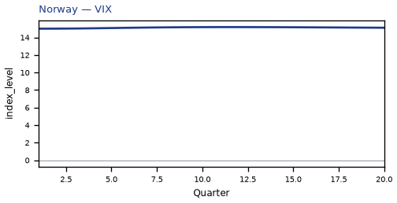

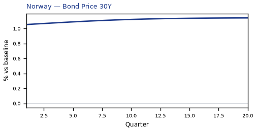

[Q1–Q20 JSON for Norway](numbers/NO.json)

## US — United States

The main impact of a -25% United Kingdom housing shock on the United States is only a small drop in GDP of 0.09% by Q12. This is a model impulse response versus baseline, not a forecast. Equities soften 0.24% by Q11.

Demand and trade. Private investment / the cost of capital falls 0.16% by Q9; household consumption, the trade balance, government spending, government debt stay close to baseline.

Labour. Real wages falls 0.10% by Q20; employment falls 0.10% by Q15; unemployment rises by +0.06 percentage points in Q16.

Prices. CPI inflation, domestic inflation, firms' marginal cost stay close to baseline.

Policy rates and the government curve. 30-year bond prices rally 0.60% by Q8; bond prices (higher discount rates) rally 0.46% by Q16; 10-year bond prices rally 0.37% by Q8; 5-year bond prices rally 0.27% by Q10; the same direction shows up in 2-year bond prices, the local policy rate, 3-month government yields; the rest of the government curve barely moves.

Exchange rates. The real exchange rate, the nominal effective exchange rate (increase = trade-weighted appreciation), the bilateral real versus the dollar (increase = home weaker vs USD) stay close to baseline.

Equities and risk. Equity prices / financial conditions falls 0.24% by Q11; Tobin's Q (the value of installed capital) falls 0.11% by Q9; the VIX (global equity-implied volatility) stay close to baseline.

Housing and credit. Bank equity falls 0.34% by Q20; bank credit supply falls 0.28% by Q20; house prices and bank credit are close to unchanged.

Commodities. Other published commodity prices stay near their baselines.

Sectors and capital. Manufacturing output, services output, the capital stock stay close to baseline.

By Q20, GDP is still -0.05% from baseline.

These figures are model IRFs versus baseline, not forecasts and not financial advice.

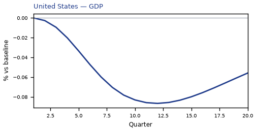

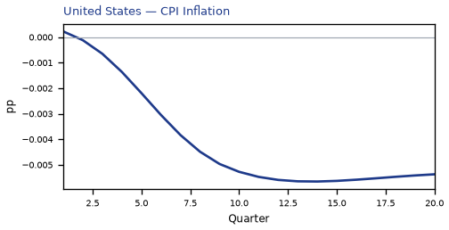

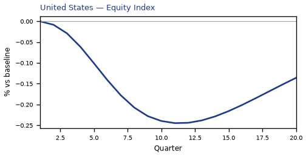

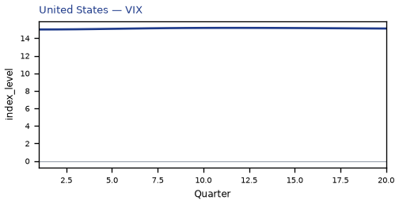

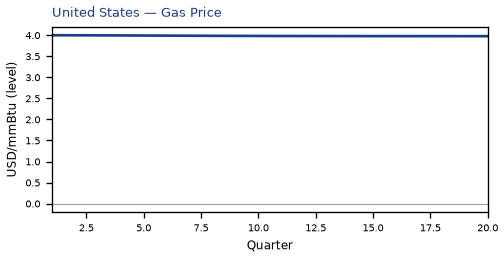

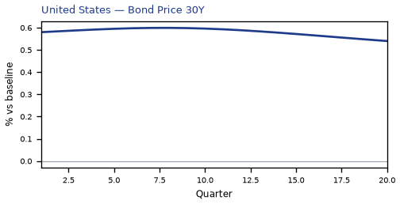

[Q1–Q20 JSON for United States](numbers/US.json)

## SA — Saudi Arabia

The main impact of a -25% United Kingdom housing shock on Saudi Arabia is only a small drop in GDP of 0.07% by Q14. This is a model impulse response versus baseline, not a forecast. Equities soften 0.27% by Q13.

Demand and trade. Government debt falls 0.14% by Q20; private investment / the cost of capital falls 0.11% by Q9; household consumption, the trade balance, government spending stay close to baseline.

Labour. Employment falls 0.08% by Q20; unemployment, real wages stay close to baseline.

Prices. CPI inflation, domestic inflation, firms' marginal cost stay close to baseline.

Policy rates and the government curve. 30-year bond prices rally 0.60% by Q8; 10-year bond prices rally 0.37% by Q8; bond prices (higher discount rates) rally 0.35% by Q16; 5-year bond prices rally 0.27% by Q10; the same direction shows up in 2-year bond prices, the local policy rate, 3-month government yields; the rest of the government curve barely moves.

Exchange rates. The real exchange rate, the nominal effective exchange rate (increase = trade-weighted appreciation), the bilateral real versus the dollar (increase = home weaker vs USD) stay close to baseline.

Equities and risk. Equity prices / financial conditions falls 0.27% by Q13; Tobin's Q (the value of installed capital) falls 0.08% by Q9; the VIX (global equity-implied volatility) stay close to baseline.

Housing and credit. Bank equity falls 0.09% by Q20; house prices fall 0.09% by Q20; house prices and bank credit are close to unchanged.

Commodities. Other published commodity prices stay near their baselines.

Sectors and capital. Manufacturing output, services output, the capital stock stay close to baseline.

By Q20, GDP is still -0.07% from baseline.

These figures are model IRFs versus baseline, not forecasts and not financial advice.

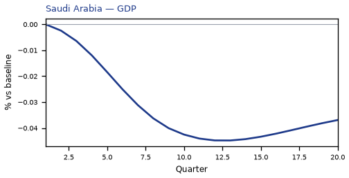

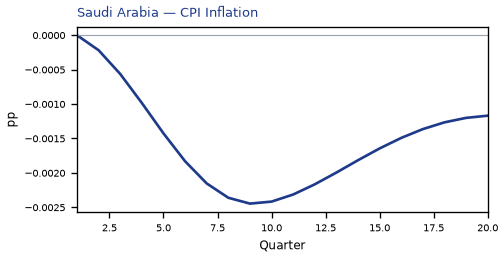

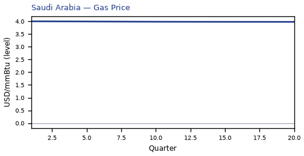

[Q1–Q20 JSON for Saudi Arabia](numbers/SA.json)

## SE — Sweden

The main impact of a -25% United Kingdom housing shock on Sweden is only a small drop in GDP of 0.07% by Q17. This is a model impulse response versus baseline, not a forecast. Equities soften 0.18% by Q15.

Demand and trade. Private investment / the cost of capital falls 0.16% by Q14; household consumption, the trade balance, government spending, government debt stay close to baseline.

Labour. Real wages falls 0.09% by Q20; unemployment rises by +0.05 percentage points in Q20; employment stay close to baseline.

Prices. CPI inflation, domestic inflation, firms' marginal cost stay close to baseline.

Policy rates and the government curve. 30-year bond prices rally 0.41% by Q10; 10-year bond prices rally 0.23% by Q16; bond prices (higher discount rates) rally 0.18% by Q20; 5-year bond prices rally 0.13% by Q18; the rest of the government curve barely moves.

Exchange rates. Versus the dollar the home currency is stronger versus the dollar (-0.12% in Q17); the NEER prints a trade-weighted appreciation (+0.10% in Q20); the real exchange rate shows a real appreciation (a stronger home currency), peaking at -0.09% in Q20.

Equities and risk. Equity prices / financial conditions falls 0.18% by Q15; Tobin's Q (the value of installed capital) falls 0.11% by Q14; the VIX (global equity-implied volatility) stay close to baseline.

Housing and credit. Bank equity falls 0.16% by Q20; bank credit supply falls 0.13% by Q20; house prices fall 0.08% by Q20; house prices and bank credit are close to unchanged.

Commodities. Other published commodity prices stay near their baselines.

Sectors and capital. Manufacturing output, services output, the capital stock stay close to baseline.

By Q20, GDP is still -0.07% from baseline.

These figures are model IRFs versus baseline, not forecasts and not financial advice.

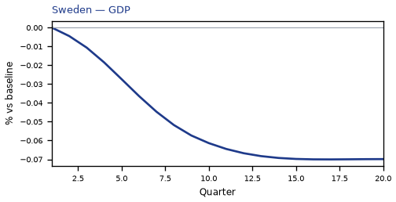

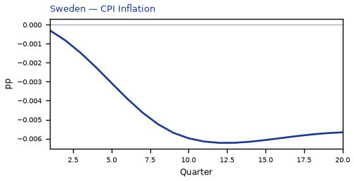

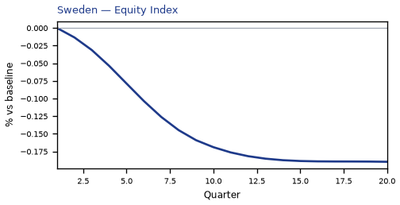

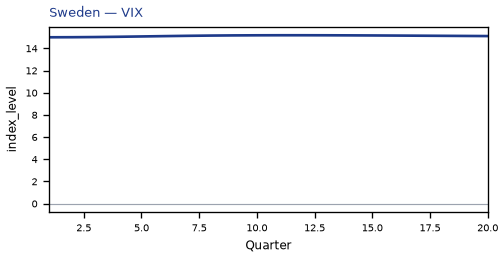

[Q1–Q20 JSON for Sweden](numbers/SE.json)

## AU — Australia

The main impact of a -25% United Kingdom housing shock on Australia is only a small drop in GDP of 0.06% by Q13. This is a model impulse response versus baseline, not a forecast. Equities soften 0.13% by Q12.

Demand and trade. Private investment / the cost of capital falls 0.12% by Q11; household consumption, the trade balance, government spending, government debt stay close to baseline.

Labour. Employment, unemployment, real wages stay close to baseline.

Prices. CPI inflation, domestic inflation, firms' marginal cost stay close to baseline.

Policy rates and the government curve. 30-year bond prices rally 0.61% by Q11; 10-year bond prices rally 0.32% by Q12; bond prices (higher discount rates) rally 0.28% by Q19; 5-year bond prices rally 0.19% by Q13; the same direction shows up in 2-year bond prices; the rest of the government curve barely moves.

Exchange rates. The NEER prints a trade-weighted depreciation (-0.14% in Q17); the real exchange rate shows a real depreciation (a weaker, more competitive home currency), peaking at +0.12% in Q15; versus the dollar the home currency is weaker versus the dollar (+0.09% in Q20).

Equities and risk. Equity prices / financial conditions falls 0.13% by Q12; Tobin's Q (the value of installed capital) falls 0.09% by Q11; the VIX (global equity-implied volatility) stay close to baseline.

Housing and credit. Bank equity falls 0.21% by Q20; bank credit supply falls 0.17% by Q20; house prices and bank credit are close to unchanged.

Commodities. Other published commodity prices stay near their baselines.

Sectors and capital. Manufacturing output, services output, the capital stock stay close to baseline.

By Q20, GDP is still -0.05% from baseline.

These figures are model IRFs versus baseline, not forecasts and not financial advice.

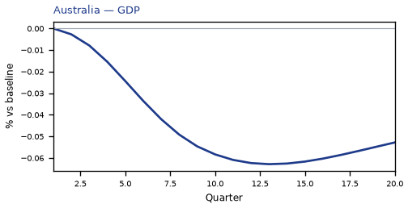

[Q1–Q20 JSON for Australia](numbers/AU.json)

## ES — Spain

The main impact of a -25% United Kingdom housing shock on Spain is only a small drop in GDP of 0.06% by Q13. This is a model impulse response versus baseline, not a forecast. Equities soften 0.10% by Q12.

Demand and trade. Private investment / the cost of capital falls 0.15% by Q12; household consumption, the trade balance, government spending, government debt stay close to baseline.

Labour. Employment, unemployment, real wages stay close to baseline.

Prices. CPI inflation, domestic inflation, firms' marginal cost stay close to baseline.

Policy rates and the government curve. 30-year bond prices rally 0.28% by Q10; bond prices (higher discount rates) rally 0.16% by Q19; 10-year bond prices rally 0.15% by Q11; 5-year bond prices rally 0.10% by Q13; the rest of the government curve barely moves.

Exchange rates. Versus the dollar the home currency is stronger versus the dollar (-0.09% in Q15); the real exchange rate, the nominal effective exchange rate (increase = trade-weighted appreciation) stay close to baseline.

Equities and risk. Tobin's Q (the value of installed capital) falls 0.10% by Q12; equity prices / financial conditions falls 0.10% by Q12; the VIX (global equity-implied volatility) stay close to baseline.

Housing and credit. Bank equity falls 0.22% by Q20; bank credit supply falls 0.17% by Q20; house prices and bank credit are close to unchanged.

Commodities. Other published commodity prices stay near their baselines.

Sectors and capital. Manufacturing output, services output, the capital stock stay close to baseline.

By Q20, GDP is still -0.06% from baseline.

These figures are model IRFs versus baseline, not forecasts and not financial advice.

[Q1–Q20 JSON for Spain](numbers/ES.json)

## CA — Canada

The main impact of a -25% United Kingdom housing shock on Canada is only a small drop in GDP of 0.06% by Q12. This is a model impulse response versus baseline, not a forecast. Equities soften 0.14% by Q12.

Demand and trade. Private investment / the cost of capital falls 0.12% by Q10; household consumption, the trade balance, government spending, government debt stay close to baseline.

Labour. Employment, unemployment, real wages stay close to baseline.

Prices. CPI inflation, domestic inflation, firms' marginal cost stay close to baseline.

Policy rates and the government curve. 30-year bond prices rally 0.55% by Q9; bond prices (higher discount rates) rally 0.29% by Q16; 10-year bond prices rally 0.28% by Q9; 5-year bond prices rally 0.19% by Q10; the same direction shows up in 2-year bond prices; the rest of the government curve barely moves.

Exchange rates. The real exchange rate shows a real depreciation (a weaker, more competitive home currency), peaking at +0.10% in Q20; the NEER prints a trade-weighted depreciation (-0.10% in Q20); versus the dollar the home currency is weaker versus the dollar (+0.08% in Q20).

Equities and risk. Equity prices / financial conditions falls 0.14% by Q12; Tobin's Q (the value of installed capital) falls 0.08% by Q10; the VIX (global equity-implied volatility) stay close to baseline.

Housing and credit. Bank equity falls 0.16% by Q20; bank credit supply falls 0.13% by Q20; house prices and bank credit are close to unchanged.

Commodities. Other published commodity prices stay near their baselines.

Sectors and capital. Manufacturing output, services output, the capital stock stay close to baseline.

By Q20, GDP is still -0.05% from baseline.

These figures are model IRFs versus baseline, not forecasts and not financial advice.

[Q1–Q20 JSON for Canada](numbers/CA.json)

## JP — Japan

The main impact of a -25% United Kingdom housing shock on Japan is only a small drop in GDP of 0.06% by Q13. This is a model impulse response versus baseline, not a forecast. Equities soften 0.14% by Q12. The three-year CPI impulse is -0.06 percentage points.

Demand and trade. Private investment / the cost of capital falls 0.15% by Q12; household consumption, the trade balance, government spending, government debt stay close to baseline.

Labour. Employment, unemployment, real wages stay close to baseline.

Prices. CPI inflation, domestic inflation, firms' marginal cost stay close to baseline.

Policy rates and the government curve. Bond prices (higher discount rates) rally 0.11% by Q19; 30-year bond prices rally 0.10% by Q9; the rest of the government curve barely moves.

Exchange rates. Versus the dollar the home currency is stronger versus the dollar (-0.29% in Q16); the NEER prints a trade-weighted appreciation (+0.26% in Q20); the real exchange rate shows a real appreciation (a stronger home currency), peaking at -0.25% in Q20.

Equities and risk. Equity prices / financial conditions falls 0.14% by Q12; Tobin's Q (the value of installed capital) falls 0.10% by Q12; the VIX (global equity-implied volatility) stay close to baseline.

Housing and credit. Bank equity falls 0.22% by Q20; bank credit supply falls 0.18% by Q20; house prices and bank credit are close to unchanged.

Commodities. Other published commodity prices stay near their baselines.

Sectors and capital. Manufacturing output, services output, the capital stock stay close to baseline.

By Q20, GDP is still -0.05% from baseline.

These figures are model IRFs versus baseline, not forecasts and not financial advice.

[Q1–Q20 JSON for Japan](numbers/JP.json)

## AR — Argentina

The main impact of a -25% United Kingdom housing shock on Argentina is only a small rise in GDP of 0.05% by Q20. This is a model impulse response versus baseline, not a forecast. Equities firm 0.13% by Q20.

Demand and trade. Private investment / the cost of capital rises 0.12% by Q20; household consumption, the trade balance, government spending, government debt stay close to baseline.

Labour. Employment, unemployment, real wages stay close to baseline.

Prices. CPI inflation, domestic inflation, firms' marginal cost stay close to baseline.

Policy rates and the government curve. 30-year bond prices cheapen 0.14% by Q19; 10-year bond prices cheapen 0.10% by Q19; the rest of the government curve barely moves.

Exchange rates. Versus the dollar the home currency is stronger versus the dollar (-0.10% in Q16); the real exchange rate, the nominal effective exchange rate (increase = trade-weighted appreciation) stay close to baseline.

Equities and risk. Equity prices / financial conditions rises 0.13% by Q20; Tobin's Q (the value of installed capital) rises 0.08% by Q20; the VIX (global equity-implied volatility) stay close to baseline.

Housing and credit. House prices and bank credit are close to unchanged.

Commodities. Other published commodity prices stay near their baselines.

Sectors and capital. Manufacturing output, services output, the capital stock stay close to baseline.

By Q20, GDP is still +0.05% from baseline.

These figures are model IRFs versus baseline, not forecasts and not financial advice.

[Q1–Q20 JSON for Argentina](numbers/AR.json)

## PL — Poland

The main impact of a -25% United Kingdom housing shock on Poland is almost no drop in GDP of 0.04% by Q12. This is a model impulse response versus baseline, not a forecast. This has almost no impact on Poland.

[Q1–Q20 JSON for Poland](numbers/PL.json)

## ZA — South Africa

The main impact of a -25% United Kingdom housing shock on South Africa is only a small drop in GDP of 0.04% by Q11. This is a model impulse response versus baseline, not a forecast. Equities soften 0.13% by Q10.

Demand and trade. Private investment / the cost of capital falls 0.08% by Q9; household consumption, the trade balance, government spending, government debt stay close to baseline.

Labour. Employment, unemployment, real wages stay close to baseline.

Prices. CPI inflation, domestic inflation, firms' marginal cost stay close to baseline.

Policy rates and the government curve. 30-year bond prices rally 0.16% by Q7; 10-year bond prices rally 0.10% by Q7; bond prices (higher discount rates) rally 0.09% by Q14; the rest of the government curve barely moves.

Exchange rates. The real exchange rate, the nominal effective exchange rate (increase = trade-weighted appreciation), the bilateral real versus the dollar (increase = home weaker vs USD) stay close to baseline.

Equities and risk. Equity prices / financial conditions falls 0.13% by Q10; the VIX (global equity-implied volatility), Tobin's Q (the value of installed capital) stay close to baseline.

Housing and credit. Bank equity falls 0.14% by Q20; bank credit supply falls 0.12% by Q20; house prices and bank credit are close to unchanged.

Commodities. Other published commodity prices stay near their baselines.

Sectors and capital. Manufacturing output, services output, the capital stock stay close to baseline.

By Q20, GDP is still -0.02% from baseline.

These figures are model IRFs versus baseline, not forecasts and not financial advice.

[Q1–Q20 JSON for South Africa](numbers/ZA.json)

## CN — China

The main impact of a -25% United Kingdom housing shock on China is only a small drop in GDP of 0.03% by Q11. This is a model impulse response versus baseline, not a forecast.

Demand and trade. Household consumption, private investment / the cost of capital, the trade balance, government spending stay close to baseline.

Labour. Employment, unemployment, real wages stay close to baseline.

Prices. CPI inflation, domestic inflation, firms' marginal cost stay close to baseline.

Policy rates and the government curve. 30-year bond prices rally 0.17% by Q6; bond prices (higher discount rates) rally 0.17% by Q17; 10-year bond prices rally 0.16% by Q5; 5-year bond prices rally 0.13% by Q10; the rest of the government curve barely moves.

Exchange rates. The real exchange rate, the nominal effective exchange rate (increase = trade-weighted appreciation), the bilateral real versus the dollar (increase = home weaker vs USD) stay close to baseline.

Equities and risk. Equity prices / financial conditions, the VIX (global equity-implied volatility), Tobin's Q (the value of installed capital) stay close to baseline.

Housing and credit. House prices and bank credit are close to unchanged.

Commodities. Other published commodity prices stay near their baselines.

Sectors and capital. Manufacturing output, services output, the capital stock stay close to baseline.

By Q20, GDP is still -0.01% from baseline.

These figures are model IRFs versus baseline, not forecasts and not financial advice.

[Q1–Q20 JSON for China](numbers/CN.json)

## RU — Russia

The main impact of a -25% United Kingdom housing shock on Russia is almost no drop in GDP of 0.03% by Q11. This is a model impulse response versus baseline, not a forecast. This has almost no impact on Russia.

[Q1–Q20 JSON for Russia](numbers/RU.json)

## IT — Italy

The main impact of a -25% United Kingdom housing shock on Italy is almost no drop in GDP of 0.03% by Q12. This is a model impulse response versus baseline, not a forecast. This has almost no impact on Italy.

[Q1–Q20 JSON for Italy](numbers/IT.json)

## MY — Malaysia

The main impact of a -25% United Kingdom housing shock on Malaysia is almost no drop in GDP of 0.03% by Q12. This is a model impulse response versus baseline, not a forecast. This has almost no impact on Malaysia.

[Q1–Q20 JSON for Malaysia](numbers/MY.json)

## TR — Turkey

The main impact of a -25% United Kingdom housing shock on Turkey is only a small drop in GDP of 0.02% by Q9. This is a model impulse response versus baseline, not a forecast.

Demand and trade. Household consumption, private investment / the cost of capital, the trade balance, government spending stay close to baseline.

Labour. Employment, unemployment, real wages stay close to baseline.

Prices. CPI inflation, domestic inflation, firms' marginal cost stay close to baseline.

Policy rates and the government curve. 30-year bond prices rally 0.10% by Q5; the rest of the government curve barely moves.

Exchange rates. The real exchange rate, the nominal effective exchange rate (increase = trade-weighted appreciation), the bilateral real versus the dollar (increase = home weaker vs USD) stay close to baseline.

Equities and risk. Equity prices / financial conditions, the VIX (global equity-implied volatility), Tobin's Q (the value of installed capital) stay close to baseline.

Housing and credit. House prices and bank credit are close to unchanged.

Commodities. Other published commodity prices stay near their baselines.

Sectors and capital. Manufacturing output, services output, the capital stock stay close to baseline.

The GDP response has mostly faded by Q16 (Q20 is still +0.01%).

These figures are model IRFs versus baseline, not forecasts and not financial advice.

[Q1–Q20 JSON for Turkey](numbers/TR.json)

## BR — Brazil

The main impact of a -25% United Kingdom housing shock on Brazil is only a small drop in GDP of 0.02% by Q9. This is a model impulse response versus baseline, not a forecast.

Demand and trade. Household consumption, private investment / the cost of capital, the trade balance, government spending stay close to baseline.

Labour. Employment, unemployment, real wages stay close to baseline.

Prices. CPI inflation, domestic inflation, firms' marginal cost stay close to baseline.

Policy rates and the government curve. Bond prices (higher discount rates) rally 0.13% by Q13; 30-year bond prices rally 0.11% by Q5; 5-year bond prices rally 0.10% by Q6; 10-year bond prices rally 0.10% by Q1; the rest of the government curve barely moves.

Exchange rates. The real exchange rate, the nominal effective exchange rate (increase = trade-weighted appreciation), the bilateral real versus the dollar (increase = home weaker vs USD) stay close to baseline.

Equities and risk. Equity prices / financial conditions, the VIX (global equity-implied volatility), Tobin's Q (the value of installed capital) stay close to baseline.

Housing and credit. House prices and bank credit are close to unchanged.

Commodities. Other published commodity prices stay near their baselines.

Sectors and capital. Manufacturing output, services output, the capital stock stay close to baseline.

The GDP response has mostly faded by Q16 (Q20 is still +0.01%).

These figures are model IRFs versus baseline, not forecasts and not financial advice.

[Q1–Q20 JSON for Brazil](numbers/BR.json)

## MX — Mexico

The main impact of a -25% United Kingdom housing shock on Mexico is almost no drop in GDP of 0.02% by Q10. This is a model impulse response versus baseline, not a forecast. This has almost no impact on Mexico.

[Q1–Q20 JSON for Mexico](numbers/MX.json)

## NG — Nigeria

The main impact of a -25% United Kingdom housing shock on Nigeria is only a small drop in GDP of 0.02% by Q9. This is a model impulse response versus baseline, not a forecast. The three-year CPI impulse is -0.06 percentage points.

Demand and trade. Household consumption, private investment / the cost of capital, the trade balance, government spending stay close to baseline.

Labour. Employment, unemployment, real wages stay close to baseline.

Prices. CPI inflation, domestic inflation, firms' marginal cost stay close to baseline.

Policy rates and the government curve. 30-year bond prices rally 0.14% by Q5; 10-year bond prices rally 0.11% by Q4; 5-year bond prices rally 0.10% by Q5; bond prices (higher discount rates) rally 0.08% by Q12; the rest of the government curve barely moves.

Exchange rates. The real exchange rate, the nominal effective exchange rate (increase = trade-weighted appreciation), the bilateral real versus the dollar (increase = home weaker vs USD) stay close to baseline.

Equities and risk. Equity prices / financial conditions, the VIX (global equity-implied volatility), Tobin's Q (the value of installed capital) stay close to baseline.

Housing and credit. House prices and bank credit are close to unchanged.

Commodities. Other published commodity prices stay near their baselines.

Sectors and capital. Manufacturing output, services output, the capital stock stay close to baseline.

The GDP response has mostly faded by Q16 (Q20 is still +0.01%).

These figures are model IRFs versus baseline, not forecasts and not financial advice.

[Q1–Q20 JSON for Nigeria](numbers/NG.json)

## IN — India

The main impact of a -25% United Kingdom housing shock on India is only a small drop in GDP of 0.02% by Q9. This is a model impulse response versus baseline, not a forecast.

Demand and trade. Household consumption, private investment / the cost of capital, the trade balance, government spending stay close to baseline.

Labour. Employment, unemployment, real wages stay close to baseline.

Prices. CPI inflation, domestic inflation, firms' marginal cost stay close to baseline.

Policy rates and the government curve. Bond prices (higher discount rates) rally 0.18% by Q13; 5-year bond prices rally 0.11% by Q6; 10-year bond prices rally 0.10% by Q1; 30-year bond prices rally 0.09% by Q4; the rest of the government curve barely moves.

Exchange rates. The real exchange rate, the nominal effective exchange rate (increase = trade-weighted appreciation), the bilateral real versus the dollar (increase = home weaker vs USD) stay close to baseline.

Equities and risk. Equity prices / financial conditions, the VIX (global equity-implied volatility), Tobin's Q (the value of installed capital) stay close to baseline.

Housing and credit. House prices and bank credit are close to unchanged.

Commodities. Other published commodity prices stay near their baselines.

Sectors and capital. Manufacturing output, services output, the capital stock stay close to baseline.

The GDP response has mostly faded by Q16 (Q20 is still +0.01%).

These figures are model IRFs versus baseline, not forecasts and not financial advice.

[Q1–Q20 JSON for India](numbers/IN.json)

## TH — Thailand

The main impact of a -25% United Kingdom housing shock on Thailand is almost no drop in GDP of 0.02% by Q11. This is a model impulse response versus baseline, not a forecast. This has almost no impact on Thailand.

[Q1–Q20 JSON for Thailand](numbers/TH.json)

## KR — South Korea

The main impact of a -25% United Kingdom housing shock on South Korea is almost no drop in GDP of 0.02% by Q10. This is a model impulse response versus baseline, not a forecast. This has almost no impact on South Korea.

[Q1–Q20 JSON for South Korea](numbers/KR.json)

## CO — Colombia

The main impact of a -25% United Kingdom housing shock on Colombia is almost no drop in GDP of 0.01% by Q9. This is a model impulse response versus baseline, not a forecast. This has almost no impact on Colombia.

[Q1–Q20 JSON for Colombia](numbers/CO.json)

## CL — Chile

The main impact of a -25% United Kingdom housing shock on Chile is almost no drop in GDP of 0.01% by Q9. This is a model impulse response versus baseline, not a forecast. This has almost no impact on Chile.

[Q1–Q20 JSON for Chile](numbers/CL.json)

## ID — Indonesia

The main impact of a -25% United Kingdom housing shock on Indonesia is almost no rise in GDP of 0.01% by Q20. This is a model impulse response versus baseline, not a forecast. This has almost no impact on Indonesia.

[Q1–Q20 JSON for Indonesia](numbers/ID.json)

---

These figures are model IRFs versus baseline, not forecasts, and not financial advice.
