# Global Macro Economic Simulations and Financial Market Responses

v6 · IRF · evaluation

**Open the typeset report (this is the document):** https://robomacro.com/GlobalMacroTrainingDataset/us_cut_200/

GitHub and Hugging Face show `.html` as source code. That is not the report. Read it on robomacro.com, or keep scrolling this page.

## What's the impact of US policy rate -200bp

a 200 basis-point (2.00 percentage-point) cut in United States interest rates. Every path is a model impulse response versus baseline, not a forecast and not financial advice.

### Summary

This note traces the model response to a 200 basis-point (2.00 percentage-point) cut in United States interest rates. Every path is an impulse response versus an unchanged baseline — not a forecast of what will happen in the world and not a reading of market data. The chapters that follow are already sorted by the size of the GDP response.

The United States is where the shock lands. GDP expands by 0.47% by Q11, a first-order GDP response for a 200 basis-point (2.00 percentage-point) cut in United States interest rates. Equities firm 1.61%, and the three-year CPI impulse is +0.23 percentage points. The move shows up first in private investment / the cost of capital, then in household consumption, government debt. That is the main adjustment: a change in financial conditions and real income, then the usual lag into activity and prices. It is the conditional elasticity to the shock that was switched on, not a prediction that this path will be realised.

Spillovers are not a carbon copy of that first path. Saudi Arabia expands by 0.13% versus baseline by Q13 — a moderate GDP response. Equities firm 0.55%, and the three-year CPI impulse is +0.15 percentage points. The move shows up first in private investment / the cost of capital, then in government debt, the trade balance. Mexico expands by 0.13% versus baseline by Q12 — a moderate GDP response. Equities firm 0.42%, and the three-year CPI impulse is -0.25 percentage points. The move shows up first in private investment / the cost of capital, then in the trade balance, government debt. Canada expands by 0.10% versus baseline by Q12 — a moderate GDP response. Equities firm 0.39%, and the three-year CPI impulse is -0.29 percentage points. The move shows up first in private investment / the cost of capital, then in the trade balance, real wages. The contrast is the point: a neighbour with a floating rate does not print the same curve as a euro-area member that shares a policy rate.

Colombia expands by 0.06% versus baseline by Q11 — only a small GDP response. Equities firm 0.33%, and the three-year CPI impulse is -0.09 percentage points. The move shows up first in private investment / the cost of capital, then in bond prices (higher discount rates), 2-year bond prices.

A few prices are common across the panel. On the government curve, bond prices (higher discount rates) rally 6.75% by Q8, and unused tenors stay in the background rather than getting a sentence each; the NEER prints a trade-weighted depreciation (-1.05% in Q10). Treat those as the shared financial backdrop, not as extra shocks, unless they appear in the active treatment.

Read GDP as percent of baseline GDP: −0.52 is minus half a percent, never −52%. A 200 basis-point move is 2.00 percentage points on the policy rate. CPI over three years is the sum of twelve quarterly impulses, not an annualised rate. A rising real exchange rate is a real depreciation — a weaker, more competitive home currency.

The remaining economies are smaller spillovers, written in the same order in the chapters that follow. Each chapter is a desk note, not a catalog of every series. This material is a model-based summary and is not financial advice.

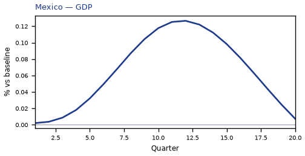

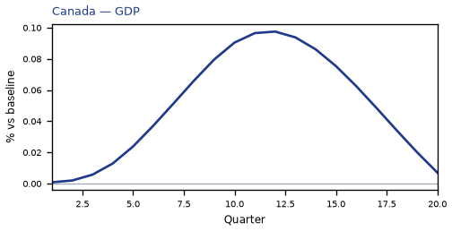

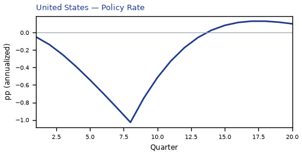

## US — United States

The main impact of a 200 basis-point (2.00 percentage-point) cut in United States interest rates on the United States is a large rise in GDP of 0.47% by Q11. This is a model impulse response versus baseline, not a forecast. Equities firm 1.61% by Q11. The three-year CPI impulse is +0.23 percentage points.

Demand and trade. Private investment / the cost of capital rises 2.53% by Q8; household consumption rises 0.29% by Q12; government debt rises 0.09% by Q13; government spending falls 0.09% by Q11; the trade balance stay close to baseline.

Labour. Employment rises 0.48% by Q13; real wages rises 0.46% by Q20; unemployment eases by -0.24 percentage points in Q14.

Prices. Firms' marginal cost rises 0.28% by Q11; CPI inflation, domestic inflation stay close to baseline.

Policy rates and the government curve. Bond prices (higher discount rates) rally 6.75% by Q8; 10-year bond prices rally 1.29% by Q2; 2-year bond prices rally 1.21% by Q4; 5-year bond prices rally 1.14% by Q1; the same direction shows up in the local policy rate, 3-month government yields, 30-year bond prices.

Exchange rates. The NEER prints a trade-weighted depreciation (-1.05% in Q10); versus the dollar the home currency is stronger versus the dollar (-1.05% in Q10); the real exchange rate shows a real depreciation (a weaker, more competitive home currency), peaking at +0.61% in Q11.

Equities and risk. Tobin's Q (the value of installed capital) rises 1.77% by Q8; equity prices / financial conditions rises 1.61% by Q11; the VIX (global equity-implied volatility) stay close to baseline.

Housing and credit. House prices rise 0.41% by Q16; house prices and bank credit are close to unchanged.

Commodities. Other published commodity prices stay near their baselines.

Sectors and capital. Services output rises 0.36% by Q11; manufacturing output falls 0.10% by Q11; the capital stock rises 0.10% by Q18.

The GDP response has mostly faded by Q19 (Q20 is still +0.03%).

These figures are model IRFs versus baseline, not forecasts and not financial advice.

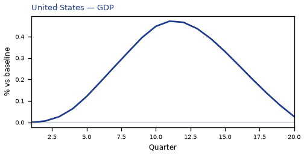

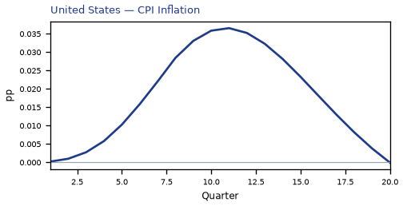

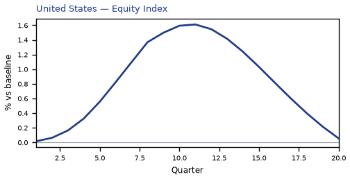

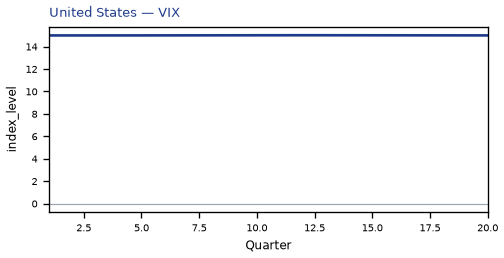

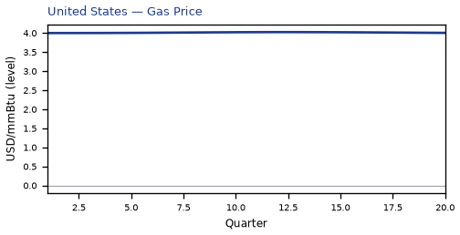

[Q1–Q20 JSON for United States](numbers/US.json)

## SA — Saudi Arabia

The main impact of a 200 basis-point (2.00 percentage-point) cut in United States interest rates on Saudi Arabia is a moderate rise in GDP of 0.13% by Q13. This is a model impulse response versus baseline, not a forecast. Equities firm 0.55% by Q12. The three-year CPI impulse is +0.15 percentage points.

Demand and trade. Private investment / the cost of capital rises 1.74% by Q8; government debt rises 0.18% by Q20; the trade balance (net exports — this model does not split imports from exports) improves to +0.14% in Q12; household consumption, government spending stay close to baseline.

Labour. Real wages rises 0.15% by Q20; employment rises 0.12% by Q16; unemployment stay close to baseline.

Prices. Firms' marginal cost rises 0.08% by Q13; CPI inflation, domestic inflation stay close to baseline.

Policy rates and the government curve. Bond prices (higher discount rates) rally 5.13% by Q8; 10-year bond prices rally 1.29% by Q2; 2-year bond prices rally 1.21% by Q4; 5-year bond prices rally 1.14% by Q1; the same direction shows up in the local policy rate, 3-month government yields, 30-year bond prices.

Exchange rates. The NEER prints a trade-weighted depreciation (-0.51% in Q9); the real exchange rate shows a real depreciation (a weaker, more competitive home currency), peaking at +0.43% in Q11; versus the dollar the home currency is stronger versus the dollar (-0.19% in Q11).

Equities and risk. Tobin's Q (the value of installed capital) rises 1.22% by Q8; equity prices / financial conditions rises 0.55% by Q12; the VIX (global equity-implied volatility) stay close to baseline.

Housing and credit. House prices rise 0.19% by Q16; house prices and bank credit are close to unchanged.

Commodities. Other published commodity prices stay near their baselines.

Sectors and capital. Manufacturing output falls 0.11% by Q11; services output, the capital stock stay close to baseline.

By Q20, GDP is still +0.05% from baseline.

These figures are model IRFs versus baseline, not forecasts and not financial advice.

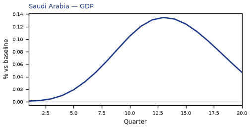

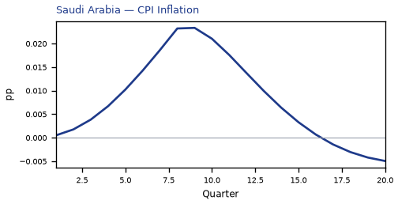

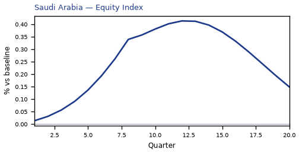

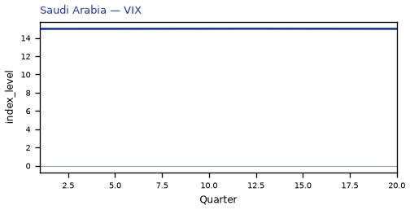

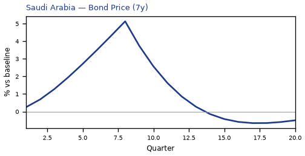

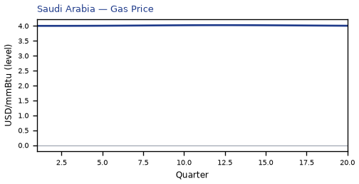

[Q1–Q20 JSON for Saudi Arabia](numbers/SA.json)

## MX — Mexico

The main impact of a 200 basis-point (2.00 percentage-point) cut in United States interest rates on Mexico is a moderate rise in GDP of 0.13% by Q12. This is a model impulse response versus baseline, not a forecast. Equities firm 0.42% by Q8. The three-year CPI impulse is -0.25 percentage points.

Demand and trade. Private investment / the cost of capital rises 0.46% by Q9; the trade balance (net exports — this model does not split imports from exports) softens to -0.15% in Q9; government debt rises 0.13% by Q18; household consumption, government spending stay close to baseline.

Labour. Real wages falls 0.11% by Q11; employment rises 0.09% by Q15; unemployment stay close to baseline.

Prices. CPI inflation falls 0.06 percentage points by Q2; domestic inflation, firms' marginal cost stay close to baseline.

Policy rates and the government curve. Bond prices (higher discount rates) rally 0.50% by Q4; 2-year bond prices rally 0.21% by Q2; 5-year bond prices cheapen 0.19% by Q12; 10-year bond prices cheapen 0.19% by Q12; the same direction shows up in 30-year bond prices, the local policy rate, 3-month government yields; the rest of the government curve barely moves.

Exchange rates. Versus the dollar the home currency is stronger versus the dollar (-1.38% in Q10); the NEER prints a trade-weighted appreciation (+0.95% in Q10); the real exchange rate shows a real appreciation (a stronger home currency), peaking at -0.83% in Q9.

Equities and risk. Equity prices / financial conditions rises 0.42% by Q8; Tobin's Q (the value of installed capital) rises 0.32% by Q9; the VIX (global equity-implied volatility) stay close to baseline.

Housing and credit. House prices rise 0.14% by Q16; house prices and bank credit are close to unchanged.

Commodities. Other published commodity prices stay near their baselines.

Sectors and capital. Manufacturing output rises 0.27% by Q9; services output, the capital stock stay close to baseline.

The GDP response has mostly faded by Q19 (Q20 is still +0.01%).

These figures are model IRFs versus baseline, not forecasts and not financial advice.

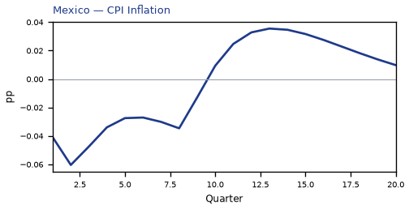

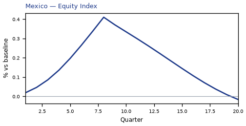

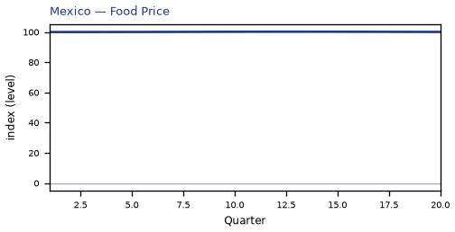

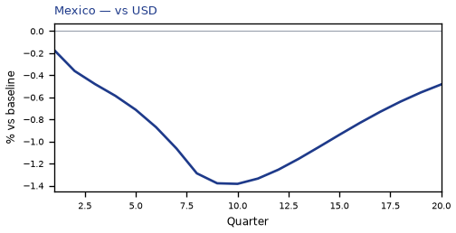

[Q1–Q20 JSON for Mexico](numbers/MX.json)

## CA — Canada

The main impact of a 200 basis-point (2.00 percentage-point) cut in United States interest rates on Canada is a moderate rise in GDP of 0.10% by Q12. This is a model impulse response versus baseline, not a forecast. Equities firm 0.39% by Q8. The three-year CPI impulse is -0.29 percentage points.

Demand and trade. Private investment / the cost of capital rises 0.40% by Q9; the trade balance (net exports — this model does not split imports from exports) softens to -0.15% in Q8; household consumption, government spending, government debt stay close to baseline.

Labour. Real wages falls 0.14% by Q12; employment rises 0.10% by Q14; unemployment eases by -0.05 percentage points in Q14.

Prices. CPI inflation falls 0.07 percentage points by Q2; domestic inflation falls 0.05 percentage points by Q2; firms' marginal cost stay close to baseline.

Policy rates and the government curve. Bond prices (higher discount rates) rally 0.70% by Q5; 5-year bond prices cheapen 0.22% by Q12; 2-year bond prices rally 0.20% by Q2; 10-year bond prices cheapen 0.19% by Q12; the same direction shows up in 30-year bond prices, the local policy rate, 3-month government yields; the rest of the government curve barely moves.

Exchange rates. Versus the dollar the home currency is stronger versus the dollar (-1.61% in Q9); the NEER prints a trade-weighted appreciation (+1.23% in Q9); the real exchange rate shows a real appreciation (a stronger home currency), peaking at -1.06% in Q9.

Equities and risk. Equity prices / financial conditions rises 0.39% by Q8; Tobin's Q (the value of installed capital) rises 0.28% by Q9; the VIX (global equity-implied volatility) stay close to baseline.

Housing and credit. House prices rise 0.09% by Q16; house prices and bank credit are close to unchanged.

Commodities. Other published commodity prices stay near their baselines.

Sectors and capital. Manufacturing output rises 0.33% by Q9; services output, the capital stock stay close to baseline.

The GDP response has mostly faded by Q19 (Q20 is still +0.01%).

These figures are model IRFs versus baseline, not forecasts and not financial advice.

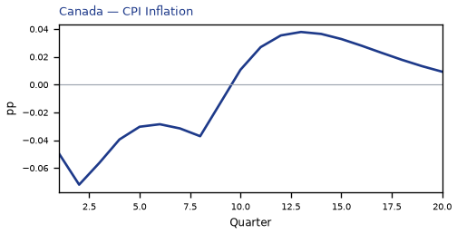

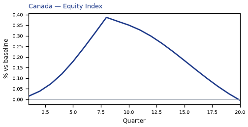

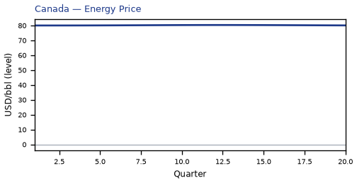

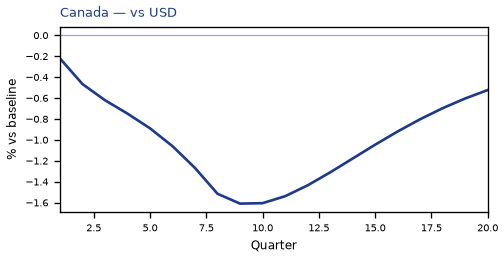

[Q1–Q20 JSON for Canada](numbers/CA.json)

## CO — Colombia

The main impact of a 200 basis-point (2.00 percentage-point) cut in United States interest rates on Colombia is only a small rise in GDP of 0.06% by Q11. This is a model impulse response versus baseline, not a forecast. Equities firm 0.33% by Q8. The three-year CPI impulse is -0.09 percentage points.

Demand and trade. Private investment / the cost of capital rises 0.19% by Q9; household consumption, the trade balance, government spending, government debt stay close to baseline.

Labour. Employment, unemployment, real wages stay close to baseline.

Prices. CPI inflation, domestic inflation, firms' marginal cost stay close to baseline.

Policy rates and the government curve. Bond prices (higher discount rates) cheapen 0.18% by Q16; 2-year bond prices cheapen 0.08% by Q13; the local policy rate rises 0.05 percentage points by Q16; 3-month government yields rise 0.05 percentage points by Q16; the rest of the government curve barely moves.

Exchange rates. Versus the dollar the home currency is stronger versus the dollar (-1.17% in Q10); the real exchange rate shows a real appreciation (a stronger home currency), peaking at -0.60% in Q9; the NEER prints a trade-weighted appreciation (+0.52% in Q10).

Equities and risk. Equity prices / financial conditions rises 0.33% by Q8; Tobin's Q (the value of installed capital) rises 0.13% by Q9; the VIX (global equity-implied volatility) stay close to baseline.

Housing and credit. House prices and bank credit are close to unchanged.

Commodities. Other published commodity prices stay near their baselines.

Sectors and capital. Manufacturing output rises 0.19% by Q9; services output, the capital stock stay close to baseline.

The GDP response has mostly faded by Q18 (Q20 is still -0.00%).

These figures are model IRFs versus baseline, not forecasts and not financial advice.

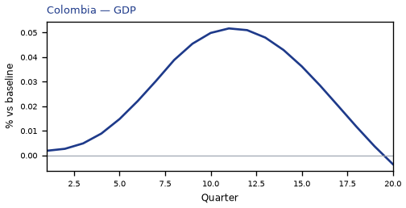

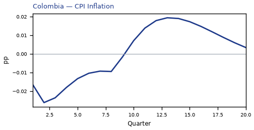

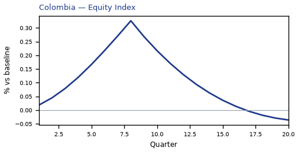

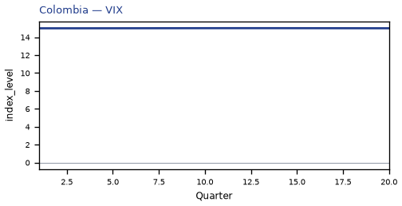

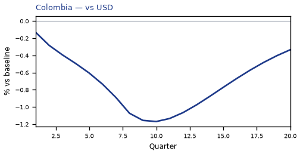

[Q1–Q20 JSON for Colombia](numbers/CO.json)

## AR — Argentina

The main impact of a 200 basis-point (2.00 percentage-point) cut in United States interest rates on Argentina is only a small rise in GDP of 0.05% by Q9. This is a model impulse response versus baseline, not a forecast. Equities firm 0.49% by Q8.

Demand and trade. Private investment / the cost of capital rises 0.13% by Q8; household consumption, the trade balance, government spending, government debt stay close to baseline.

Labour. Employment, unemployment, real wages stay close to baseline.

Prices. CPI inflation, domestic inflation, firms' marginal cost stay close to baseline.

Policy rates and the government curve. Bond prices (higher discount rates) rally 0.12% by Q8; 5-year bond prices rally 0.08% by Q17; the rest of the government curve barely moves.

Exchange rates. Versus the dollar the home currency is stronger versus the dollar (-0.72% in Q9); the real exchange rate shows a real appreciation (a stronger home currency), peaking at -0.22% in Q8; the NEER prints a trade-weighted depreciation (-0.09% in Q17).

Equities and risk. Equity prices / financial conditions rises 0.49% by Q8; Tobin's Q (the value of installed capital) rises 0.09% by Q8; the VIX (global equity-implied volatility) stay close to baseline.

Housing and credit. House prices and bank credit are close to unchanged.

Commodities. Other published commodity prices stay near their baselines.

Sectors and capital. Manufacturing output, services output, the capital stock stay close to baseline.

The GDP response has mostly faded by Q15 (Q20 is still -0.05%).

These figures are model IRFs versus baseline, not forecasts and not financial advice.

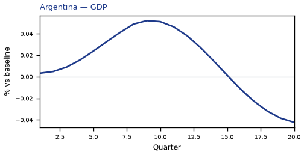

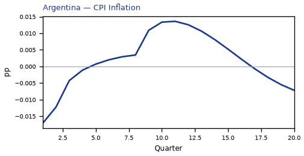

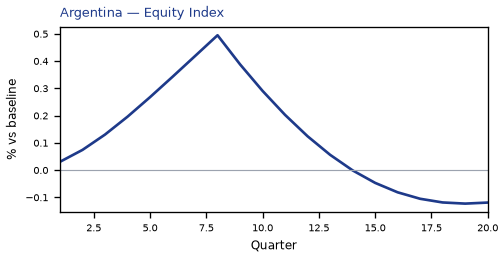

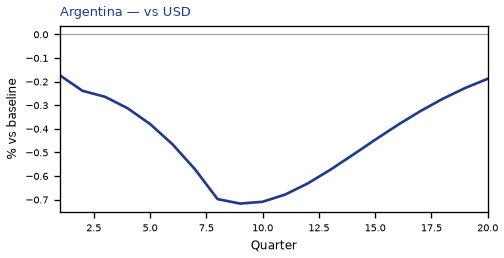

[Q1–Q20 JSON for Argentina](numbers/AR.json)

## BR — Brazil

The main impact of a 200 basis-point (2.00 percentage-point) cut in United States interest rates on Brazil is only a small rise in GDP of 0.05% by Q11. This is a model impulse response versus baseline, not a forecast. Equities firm 0.38% by Q8.

Demand and trade. Private investment / the cost of capital rises 0.15% by Q9; household consumption, the trade balance, government spending, government debt stay close to baseline.

Labour. Employment, unemployment, real wages stay close to baseline.

Prices. CPI inflation, domestic inflation, firms' marginal cost stay close to baseline.

Policy rates and the government curve. Bond prices (higher discount rates) cheapen 0.21% by Q15; the rest of the government curve barely moves.

Exchange rates. Versus the dollar the home currency is stronger versus the dollar (-1.07% in Q10); the real exchange rate shows a real appreciation (a stronger home currency), peaking at -0.50% in Q9; the NEER prints a trade-weighted appreciation (+0.43% in Q10).

Equities and risk. Equity prices / financial conditions rises 0.38% by Q8; Tobin's Q (the value of installed capital) rises 0.10% by Q9; the VIX (global equity-implied volatility) stay close to baseline.

Housing and credit. House prices and bank credit are close to unchanged.

Commodities. Other published commodity prices stay near their baselines.

Sectors and capital. Manufacturing output rises 0.15% by Q9; services output, the capital stock stay close to baseline.

The GDP response has mostly faded by Q18 (Q20 is still -0.01%).

These figures are model IRFs versus baseline, not forecasts and not financial advice.

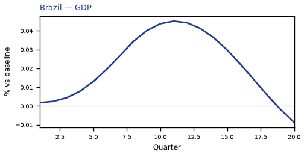

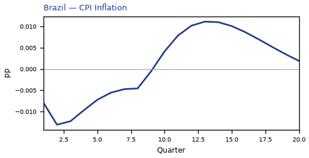

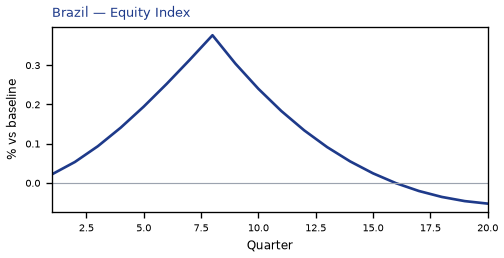

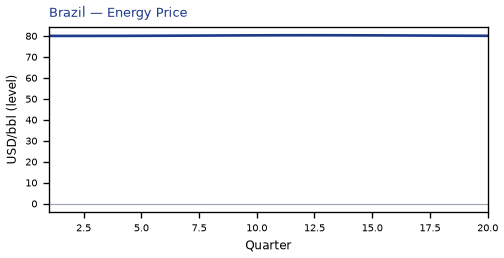

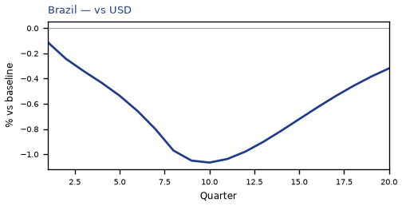

[Q1–Q20 JSON for Brazil](numbers/BR.json)

## CL — Chile

The main impact of a 200 basis-point (2.00 percentage-point) cut in United States interest rates on Chile is only a small rise in GDP of 0.04% by Q11. This is a model impulse response versus baseline, not a forecast. Equities firm 0.34% by Q8. The three-year CPI impulse is -0.09 percentage points.

Demand and trade. Private investment / the cost of capital rises 0.17% by Q9; household consumption, the trade balance, government spending, government debt stay close to baseline.

Labour. Employment, unemployment, real wages stay close to baseline.

Prices. CPI inflation, domestic inflation, firms' marginal cost stay close to baseline.

Policy rates and the government curve. Bond prices (higher discount rates) rally 0.20% by Q5; the rest of the government curve barely moves.

Exchange rates. Versus the dollar the home currency is stronger versus the dollar (-0.96% in Q10); the real exchange rate shows a real appreciation (a stronger home currency), peaking at -0.39% in Q8; the NEER prints a trade-weighted appreciation (+0.30% in Q10).

Equities and risk. Equity prices / financial conditions rises 0.34% by Q8; Tobin's Q (the value of installed capital) rises 0.12% by Q9; the VIX (global equity-implied volatility) stay close to baseline.

Housing and credit. House prices and bank credit are close to unchanged.

Commodities. Other published commodity prices stay near their baselines.

Sectors and capital. Manufacturing output rises 0.12% by Q8; services output, the capital stock stay close to baseline.

The GDP response has mostly faded by Q18 (Q20 is still -0.00%).

These figures are model IRFs versus baseline, not forecasts and not financial advice.

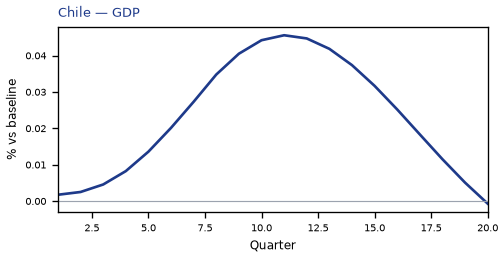

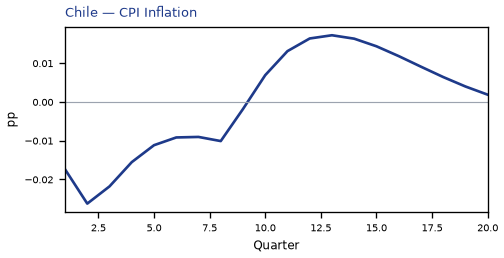

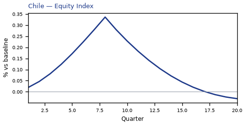

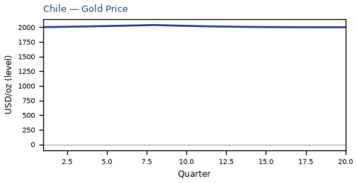

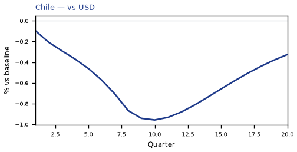

[Q1–Q20 JSON for Chile](numbers/CL.json)

## NO — Norway

The main impact of a 200 basis-point (2.00 percentage-point) cut in United States interest rates on Norway is only a small rise in GDP of 0.04% by Q12. This is a model impulse response versus baseline, not a forecast. Equities firm 0.27% by Q8.

Demand and trade. Private investment / the cost of capital rises 0.12% by Q10; household consumption, the trade balance, government spending, government debt stay close to baseline.

Labour. Employment, unemployment, real wages stay close to baseline.

Prices. CPI inflation, domestic inflation, firms' marginal cost stay close to baseline.

Policy rates and the government curve. Bond prices (higher discount rates) rally 0.45% by Q8; the rest of the government curve barely moves.

Exchange rates. Versus the dollar the home currency is stronger versus the dollar (-0.92% in Q11); the real exchange rate shows a real appreciation (a stronger home currency), peaking at -0.32% in Q10; the NEER prints a trade-weighted appreciation (+0.14% in Q12).

Equities and risk. Equity prices / financial conditions rises 0.27% by Q8; Tobin's Q (the value of installed capital) rises 0.08% by Q10; the VIX (global equity-implied volatility) stay close to baseline.

Housing and credit. House prices and bank credit are close to unchanged.

Commodities. Other published commodity prices stay near their baselines.

Sectors and capital. Manufacturing output rises 0.10% by Q10; services output, the capital stock stay close to baseline.

The GDP response has mostly faded by Q19 (Q20 is still +0.00%).

These figures are model IRFs versus baseline, not forecasts and not financial advice.

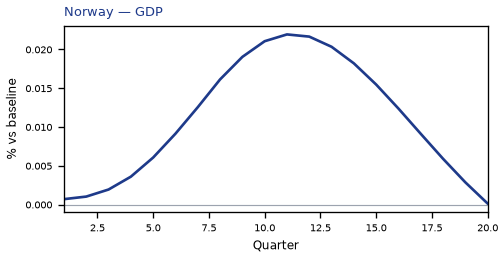

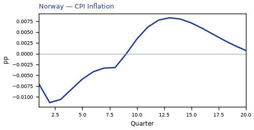

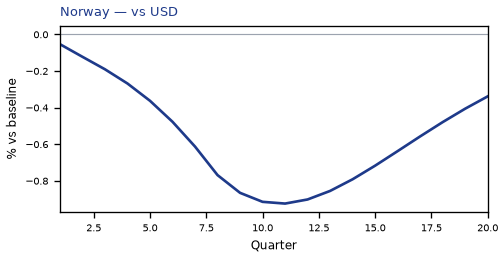

[Q1–Q20 JSON for Norway](numbers/NO.json)

## MY — Malaysia

The main impact of a 200 basis-point (2.00 percentage-point) cut in United States interest rates on Malaysia is only a small rise in GDP of 0.04% by Q11. This is a model impulse response versus baseline, not a forecast. Equities firm 0.29% by Q8. The three-year CPI impulse is -0.05 percentage points.

Demand and trade. Private investment / the cost of capital rises 0.13% by Q8; household consumption, the trade balance, government spending, government debt stay close to baseline.

Labour. Employment, unemployment, real wages stay close to baseline.

Prices. CPI inflation falls 0.06 percentage points by Q1; domestic inflation, firms' marginal cost stay close to baseline.

Policy rates and the government curve. Bond prices (higher discount rates) rally 0.19% by Q8; the rest of the government curve barely moves.

Exchange rates. Versus the dollar the home currency is stronger versus the dollar (-0.77% in Q9); the real exchange rate shows a real appreciation (a stronger home currency), peaking at -0.29% in Q8; the NEER prints a trade-weighted appreciation (+0.13% in Q8).

Equities and risk. Equity prices / financial conditions rises 0.29% by Q8; Tobin's Q (the value of installed capital) rises 0.09% by Q8; the VIX (global equity-implied volatility) stay close to baseline.

Housing and credit. House prices and bank credit are close to unchanged.

Commodities. Other published commodity prices stay near their baselines.

Sectors and capital. Manufacturing output rises 0.09% by Q8; services output, the capital stock stay close to baseline.

The GDP response has mostly faded by Q18 (Q20 is still -0.00%).

These figures are model IRFs versus baseline, not forecasts and not financial advice.

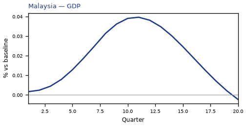

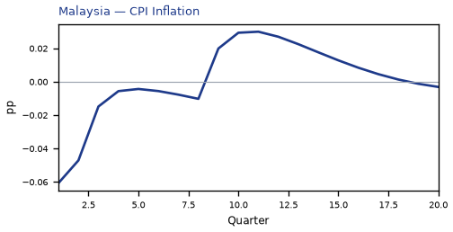

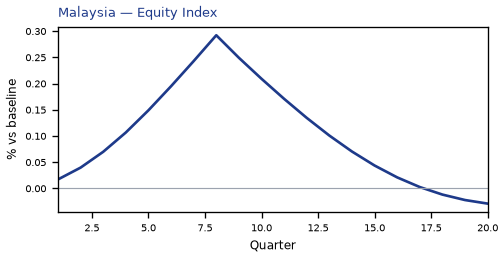

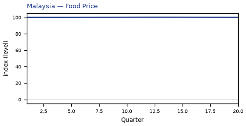

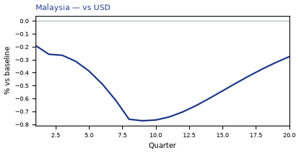

[Q1–Q20 JSON for Malaysia](numbers/MY.json)

## TR — Turkey

The main impact of a 200 basis-point (2.00 percentage-point) cut in United States interest rates on Turkey is only a small rise in GDP of 0.04% by Q9. This is a model impulse response versus baseline, not a forecast. Equities firm 0.42% by Q8.

Demand and trade. Private investment / the cost of capital rises 0.10% by Q8; household consumption, the trade balance, government spending, government debt stay close to baseline.

Labour. Employment, unemployment, real wages stay close to baseline.

Prices. CPI inflation, domestic inflation, firms' marginal cost stay close to baseline.

Policy rates and the government curve. Bond prices (higher discount rates) rally 0.12% by Q8; the rest of the government curve barely moves.

Exchange rates. Versus the dollar the home currency is stronger versus the dollar (-0.70% in Q10); the real exchange rate shows a real appreciation (a stronger home currency), peaking at -0.18% in Q8; the NEER prints a trade-weighted depreciation (-0.10% in Q20).

Equities and risk. Equity prices / financial conditions rises 0.42% by Q8; the VIX (global equity-implied volatility), Tobin's Q (the value of installed capital) stay close to baseline.

Housing and credit. House prices and bank credit are close to unchanged.

Commodities. Other published commodity prices stay near their baselines.

Sectors and capital. Manufacturing output, services output, the capital stock stay close to baseline.

The GDP response has mostly faded by Q15 (Q20 is still -0.02%).

These figures are model IRFs versus baseline, not forecasts and not financial advice.

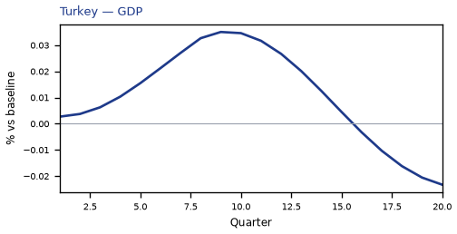

[Q1–Q20 JSON for Turkey](numbers/TR.json)

## NG — Nigeria

The main impact of a 200 basis-point (2.00 percentage-point) cut in United States interest rates on Nigeria is only a small rise in GDP of 0.03% by Q10. This is a model impulse response versus baseline, not a forecast. Equities firm 0.36% by Q8.

Demand and trade. Private investment / the cost of capital rises 0.08% by Q8; household consumption, the trade balance, government spending, government debt stay close to baseline.

Labour. Employment, unemployment, real wages stay close to baseline.

Prices. CPI inflation, domestic inflation, firms' marginal cost stay close to baseline.

Policy rates and the government curve. Bond prices (higher discount rates) cheapen 0.11% by Q13; the rest of the government curve barely moves.

Exchange rates. Versus the dollar the home currency is stronger versus the dollar (-0.74% in Q9); the real exchange rate shows a real appreciation (a stronger home currency), peaking at -0.25% in Q8; the nominal effective exchange rate (increase = trade-weighted appreciation) stay close to baseline.

Equities and risk. Equity prices / financial conditions rises 0.36% by Q8; the VIX (global equity-implied volatility), Tobin's Q (the value of installed capital) stay close to baseline.

Housing and credit. House prices and bank credit are close to unchanged.

Commodities. Other published commodity prices stay near their baselines.

Sectors and capital. Manufacturing output, services output, the capital stock stay close to baseline.

The GDP response has mostly faded by Q16 (Q20 is still -0.03%).

These figures are model IRFs versus baseline, not forecasts and not financial advice.

[Q1–Q20 JSON for Nigeria](numbers/NG.json)

## RU — Russia

The main impact of a 200 basis-point (2.00 percentage-point) cut in United States interest rates on Russia is only a small rise in GDP of 0.03% by Q11. This is a model impulse response versus baseline, not a forecast. Equities firm 0.41% by Q8.

Demand and trade. Household consumption, private investment / the cost of capital, the trade balance, government spending stay close to baseline.

Labour. Employment, unemployment, real wages stay close to baseline.

Prices. CPI inflation, domestic inflation, firms' marginal cost stay close to baseline.

Policy rates and the government curve. Bond prices (higher discount rates) rally 0.12% by Q8; the rest of the government curve barely moves.

Exchange rates. Versus the dollar the home currency is stronger versus the dollar (-0.69% in Q11); the NEER prints a trade-weighted depreciation (-0.16% in Q8); the real exchange rate stay close to baseline.

Equities and risk. Equity prices / financial conditions rises 0.41% by Q8; the VIX (global equity-implied volatility), Tobin's Q (the value of installed capital) stay close to baseline.

Housing and credit. House prices and bank credit are close to unchanged.

Commodities. Other published commodity prices stay near their baselines.

Sectors and capital. Manufacturing output, services output, the capital stock stay close to baseline.

The GDP response has mostly faded by Q17 (Q20 is still -0.01%).

These figures are model IRFs versus baseline, not forecasts and not financial advice.

[Q1–Q20 JSON for Russia](numbers/RU.json)

## NL — Netherlands

The main impact of a 200 basis-point (2.00 percentage-point) cut in United States interest rates on Netherlands is only a small rise in GDP of 0.03% by Q11. This is a model impulse response versus baseline, not a forecast. Equities firm 0.25% by Q8. The three-year CPI impulse is -0.21 percentage points.

Demand and trade. Private investment / the cost of capital rises 0.13% by Q10; the trade balance (net exports — this model does not split imports from exports) softens to -0.10% in Q10; household consumption, government spending, government debt stay close to baseline.

Labour. Real wages falls 0.09% by Q15; employment, unemployment stay close to baseline.

Prices. CPI inflation, domestic inflation, firms' marginal cost stay close to baseline.

Policy rates and the government curve. Bond prices (higher discount rates) rally 0.51% by Q8; 10-year bond prices rally 0.09% by Q1; the rest of the government curve barely moves.

Exchange rates. Versus the dollar the home currency is stronger versus the dollar (-1.00% in Q11); the real exchange rate shows a real appreciation (a stronger home currency), peaking at -0.39% in Q11; the NEER prints a trade-weighted appreciation (+0.29% in Q13).

Equities and risk. Equity prices / financial conditions rises 0.25% by Q8; Tobin's Q (the value of installed capital) rises 0.09% by Q10; the VIX (global equity-implied volatility) stay close to baseline.

Housing and credit. House prices and bank credit are close to unchanged.

Commodities. Other published commodity prices stay near their baselines.

Sectors and capital. Manufacturing output rises 0.12% by Q11; services output, the capital stock stay close to baseline.

The GDP response has mostly faded by Q20 (Q20 is still +0.00%).

These figures are model IRFs versus baseline, not forecasts and not financial advice.

[Q1–Q20 JSON for Netherlands](numbers/NL.json)

## KR — South Korea

The main impact of a 200 basis-point (2.00 percentage-point) cut in United States interest rates on South Korea is only a small rise in GDP of 0.03% by Q11. This is a model impulse response versus baseline, not a forecast. Equities firm 0.31% by Q8. The three-year CPI impulse is -0.12 percentage points.

Demand and trade. Private investment / the cost of capital rises 0.13% by Q8; the trade balance (net exports — this model does not split imports from exports) softens to -0.10% in Q9; household consumption, government spending, government debt stay close to baseline.

Labour. Employment, unemployment, real wages stay close to baseline.

Prices. CPI inflation, domestic inflation, firms' marginal cost stay close to baseline.

Policy rates and the government curve. Bond prices (higher discount rates) rally 0.24% by Q5; 2-year bond prices rally 0.08% by Q2; the rest of the government curve barely moves.

Exchange rates. Versus the dollar the home currency is stronger versus the dollar (-0.93% in Q10); the real exchange rate shows a real appreciation (a stronger home currency), peaking at -0.38% in Q8; the NEER prints a trade-weighted appreciation (+0.28% in Q9).

Equities and risk. Equity prices / financial conditions rises 0.31% by Q8; Tobin's Q (the value of installed capital) rises 0.09% by Q8; the VIX (global equity-implied volatility) stay close to baseline.

Housing and credit. House prices and bank credit are close to unchanged.

Commodities. Other published commodity prices stay near their baselines.

Sectors and capital. Manufacturing output rises 0.11% by Q8; services output, the capital stock stay close to baseline.

The GDP response has mostly faded by Q19 (Q20 is still +0.00%).

These figures are model IRFs versus baseline, not forecasts and not financial advice.

[Q1–Q20 JSON for South Korea](numbers/KR.json)

## ZA — South Africa

The main impact of a 200 basis-point (2.00 percentage-point) cut in United States interest rates on South Africa is only a small rise in GDP of 0.03% by Q10. This is a model impulse response versus baseline, not a forecast. Equities firm 0.35% by Q8. The three-year CPI impulse is -0.05 percentage points.

Demand and trade. Private investment / the cost of capital rises 0.10% by Q8; household consumption, the trade balance, government spending, government debt stay close to baseline.

Labour. Employment, unemployment, real wages stay close to baseline.

Prices. CPI inflation, domestic inflation, firms' marginal cost stay close to baseline.

Policy rates and the government curve. Bond prices (higher discount rates) rally 0.20% by Q8; the rest of the government curve barely moves.

Exchange rates. Versus the dollar the home currency is stronger versus the dollar (-0.84% in Q10); the real exchange rate shows a real appreciation (a stronger home currency), peaking at -0.27% in Q8; the NEER prints a trade-weighted appreciation (+0.13% in Q11).

Equities and risk. Equity prices / financial conditions rises 0.35% by Q8; the VIX (global equity-implied volatility), Tobin's Q (the value of installed capital) stay close to baseline.

Housing and credit. House prices and bank credit are close to unchanged.

Commodities. Other published commodity prices stay near their baselines.

Sectors and capital. Manufacturing output rises 0.08% by Q8; services output, the capital stock stay close to baseline.

The GDP response has mostly faded by Q18 (Q20 is still -0.00%).

These figures are model IRFs versus baseline, not forecasts and not financial advice.

[Q1–Q20 JSON for South Africa](numbers/ZA.json)

## TH — Thailand

The main impact of a 200 basis-point (2.00 percentage-point) cut in United States interest rates on Thailand is only a small rise in GDP of 0.02% by Q10. This is a model impulse response versus baseline, not a forecast. Equities firm 0.26% by Q8.

Demand and trade. Private investment / the cost of capital rises 0.09% by Q8; household consumption, the trade balance, government spending, government debt stay close to baseline.

Labour. Employment, unemployment, real wages stay close to baseline.

Prices. CPI inflation, domestic inflation, firms' marginal cost stay close to baseline.

Policy rates and the government curve. Bond prices (higher discount rates) rally 0.19% by Q8; the rest of the government curve barely moves.

Exchange rates. Versus the dollar the home currency is stronger versus the dollar (-0.70% in Q10); the real exchange rate shows a real appreciation (a stronger home currency), peaking at -0.21% in Q8; the nominal effective exchange rate (increase = trade-weighted appreciation) stay close to baseline.

Equities and risk. Equity prices / financial conditions rises 0.26% by Q8; the VIX (global equity-implied volatility), Tobin's Q (the value of installed capital) stay close to baseline.

Housing and credit. House prices and bank credit are close to unchanged.

Commodities. Other published commodity prices stay near their baselines.

Sectors and capital. Manufacturing output, services output, the capital stock stay close to baseline.

The GDP response has mostly faded by Q17 (Q20 is still -0.00%).

These figures are model IRFs versus baseline, not forecasts and not financial advice.

[Q1–Q20 JSON for Thailand](numbers/TH.json)

## ID — Indonesia

The main impact of a 200 basis-point (2.00 percentage-point) cut in United States interest rates on Indonesia is only a small rise in GDP of 0.02% by Q10. This is a model impulse response versus baseline, not a forecast. Equities firm 0.25% by Q8.

Demand and trade. Household consumption, private investment / the cost of capital, the trade balance, government spending stay close to baseline.

Labour. Employment, unemployment, real wages stay close to baseline.

Prices. CPI inflation, domestic inflation, firms' marginal cost stay close to baseline.

Policy rates and the government curve. Bond prices (higher discount rates) rally 0.17% by Q8; the rest of the government curve barely moves.

Exchange rates. Versus the dollar the home currency is stronger versus the dollar (-0.70% in Q10); the real exchange rate shows a real appreciation (a stronger home currency), peaking at -0.20% in Q8; the nominal effective exchange rate (increase = trade-weighted appreciation) stay close to baseline.

Equities and risk. Equity prices / financial conditions rises 0.25% by Q8; the VIX (global equity-implied volatility), Tobin's Q (the value of installed capital) stay close to baseline.

Housing and credit. House prices and bank credit are close to unchanged.

Commodities. Other published commodity prices stay near their baselines.

Sectors and capital. Manufacturing output, services output, the capital stock stay close to baseline.

The GDP response has mostly faded by Q16 (Q20 is still -0.01%).

These figures are model IRFs versus baseline, not forecasts and not financial advice.

[Q1–Q20 JSON for Indonesia](numbers/ID.json)

## IN — India

The main impact of a 200 basis-point (2.00 percentage-point) cut in United States interest rates on India is only a small rise in GDP of 0.02% by Q9. This is a model impulse response versus baseline, not a forecast. Equities firm 0.31% by Q8.

Demand and trade. Household consumption, private investment / the cost of capital, the trade balance, government spending stay close to baseline.

Labour. Employment, unemployment, real wages stay close to baseline.

Prices. CPI inflation, domestic inflation, firms' marginal cost stay close to baseline.

Policy rates and the government curve. Bond prices (higher discount rates) rally 0.24% by Q8; the rest of the government curve barely moves.

Exchange rates. Versus the dollar the home currency is stronger versus the dollar (-0.73% in Q9); the real exchange rate shows a real appreciation (a stronger home currency), peaking at -0.25% in Q8; the NEER prints a trade-weighted appreciation (+0.09% in Q8).

Equities and risk. Equity prices / financial conditions rises 0.31% by Q8; the VIX (global equity-implied volatility), Tobin's Q (the value of installed capital) stay close to baseline.

Housing and credit. House prices and bank credit are close to unchanged.

Commodities. Other published commodity prices stay near their baselines.

Sectors and capital. Manufacturing output, services output, the capital stock stay close to baseline.

The GDP response has mostly faded by Q15 (Q20 is still -0.02%).

These figures are model IRFs versus baseline, not forecasts and not financial advice.

[Q1–Q20 JSON for India](numbers/IN.json)

## CH — Switzerland

The main impact of a 200 basis-point (2.00 percentage-point) cut in United States interest rates on Switzerland is only a small rise in GDP of 0.02% by Q11. This is a model impulse response versus baseline, not a forecast. Equities firm 0.21% by Q8. The three-year CPI impulse is -0.09 percentage points.

Demand and trade. Household consumption, private investment / the cost of capital, the trade balance, government spending stay close to baseline.

Labour. Employment, unemployment, real wages stay close to baseline.

Prices. CPI inflation, domestic inflation, firms' marginal cost stay close to baseline.

Policy rates and the government curve. Bond prices (higher discount rates) rally 0.49% by Q8; the rest of the government curve barely moves.

Exchange rates. Versus the dollar the home currency is stronger versus the dollar (-0.83% in Q10); the real exchange rate shows a real appreciation (a stronger home currency), peaking at -0.27% in Q8; the NEER prints a trade-weighted depreciation (-0.09% in Q20).

Equities and risk. Equity prices / financial conditions rises 0.21% by Q8; the VIX (global equity-implied volatility), Tobin's Q (the value of installed capital) stay close to baseline.

Housing and credit. House prices and bank credit are close to unchanged.

Commodities. Other published commodity prices stay near their baselines.

Sectors and capital. Manufacturing output rises 0.08% by Q8; services output, the capital stock stay close to baseline.

The GDP response has mostly faded by Q19 (Q20 is still +0.00%).

These figures are model IRFs versus baseline, not forecasts and not financial advice.

[Q1–Q20 JSON for Switzerland](numbers/CH.json)

## AU — Australia

The main impact of a 200 basis-point (2.00 percentage-point) cut in United States interest rates on Australia is only a small rise in GDP of 0.02% by Q11. This is a model impulse response versus baseline, not a forecast. Equities firm 0.24% by Q8.

Demand and trade. Household consumption, private investment / the cost of capital, the trade balance, government spending stay close to baseline.

Labour. Employment, unemployment, real wages stay close to baseline.

Prices. CPI inflation, domestic inflation, firms' marginal cost stay close to baseline.

Policy rates and the government curve. Bond prices (higher discount rates) rally 0.27% by Q8; the rest of the government curve barely moves.

Exchange rates. Versus the dollar the home currency is stronger versus the dollar (-0.89% in Q10); the real exchange rate shows a real appreciation (a stronger home currency), peaking at -0.32% in Q9; the NEER prints a trade-weighted appreciation (+0.18% in Q11).

Equities and risk. Equity prices / financial conditions rises 0.24% by Q8; the VIX (global equity-implied volatility), Tobin's Q (the value of installed capital) stay close to baseline.

Housing and credit. House prices and bank credit are close to unchanged.

Commodities. Other published commodity prices stay near their baselines.

Sectors and capital. Manufacturing output rises 0.09% by Q8; services output, the capital stock stay close to baseline.

The GDP response has mostly faded by Q18 (Q20 is still -0.00%).

These figures are model IRFs versus baseline, not forecasts and not financial advice.

[Q1–Q20 JSON for Australia](numbers/AU.json)

## PL — Poland

The main impact of a 200 basis-point (2.00 percentage-point) cut in United States interest rates on Poland is only a small rise in GDP of 0.02% by Q10. This is a model impulse response versus baseline, not a forecast. Equities firm 0.28% by Q8.

Demand and trade. Household consumption, private investment / the cost of capital, the trade balance, government spending stay close to baseline.

Labour. Employment, unemployment, real wages stay close to baseline.

Prices. CPI inflation, domestic inflation, firms' marginal cost stay close to baseline.

Policy rates and the government curve. Bond prices (higher discount rates) rally 0.31% by Q8; the rest of the government curve barely moves.

Exchange rates. Versus the dollar the home currency is stronger versus the dollar (-0.73% in Q10); the real exchange rate shows a real appreciation (a stronger home currency), peaking at -0.15% in Q8; the NEER prints a trade-weighted depreciation (-0.10% in Q8).

Equities and risk. Equity prices / financial conditions rises 0.28% by Q8; the VIX (global equity-implied volatility), Tobin's Q (the value of installed capital) stay close to baseline.

Housing and credit. House prices and bank credit are close to unchanged.

Commodities. Other published commodity prices stay near their baselines.

Sectors and capital. Manufacturing output, services output, the capital stock stay close to baseline.

The GDP response has mostly faded by Q18 (Q20 is still -0.00%).

These figures are model IRFs versus baseline, not forecasts and not financial advice.

[Q1–Q20 JSON for Poland](numbers/PL.json)

## UK — United Kingdom

The main impact of a 200 basis-point (2.00 percentage-point) cut in United States interest rates on United Kingdom is only a small rise in GDP of 0.01% by Q10. This is a model impulse response versus baseline, not a forecast. Equities firm 0.23% by Q8.

Demand and trade. Household consumption, private investment / the cost of capital, the trade balance, government spending stay close to baseline.

Labour. Employment, unemployment, real wages stay close to baseline.

Prices. CPI inflation, domestic inflation, firms' marginal cost stay close to baseline.

Policy rates and the government curve. Bond prices (higher discount rates) rally 0.60% by Q8; the rest of the government curve barely moves.

Exchange rates. Versus the dollar the home currency is stronger versus the dollar (-0.91% in Q10); the real exchange rate shows a real appreciation (a stronger home currency), peaking at -0.37% in Q8; the NEER prints a trade-weighted appreciation (+0.20% in Q8).

Equities and risk. Equity prices / financial conditions rises 0.23% by Q8; the VIX (global equity-implied volatility), Tobin's Q (the value of installed capital) stay close to baseline.

Housing and credit. House prices and bank credit are close to unchanged.

Commodities. Other published commodity prices stay near their baselines.

Sectors and capital. Manufacturing output rises 0.11% by Q8; services output, the capital stock stay close to baseline.

The GDP response has mostly faded by Q18 (Q20 is still +0.00%).

These figures are model IRFs versus baseline, not forecasts and not financial advice.

[Q1–Q20 JSON for United Kingdom](numbers/UK.json)

## FR — France

The main impact of a 200 basis-point (2.00 percentage-point) cut in United States interest rates on France is only a small rise in GDP of 0.01% by Q10. This is a model impulse response versus baseline, not a forecast. Equities firm 0.21% by Q8. The three-year CPI impulse is -0.12 percentage points.

Demand and trade. Household consumption, private investment / the cost of capital, the trade balance, government spending stay close to baseline.

Labour. Employment, unemployment, real wages stay close to baseline.

Prices. CPI inflation, domestic inflation, firms' marginal cost stay close to baseline.

Policy rates and the government curve. Bond prices (higher discount rates) rally 0.63% by Q8; 10-year bond prices rally 0.09% by Q1; the rest of the government curve barely moves.

Exchange rates. Versus the dollar the home currency is stronger versus the dollar (-0.97% in Q11); the real exchange rate shows a real appreciation (a stronger home currency), peaking at -0.36% in Q10; the NEER prints a trade-weighted appreciation (+0.17% in Q14).

Equities and risk. Equity prices / financial conditions rises 0.21% by Q8; the VIX (global equity-implied volatility), Tobin's Q (the value of installed capital) stay close to baseline.

Housing and credit. House prices and bank credit are close to unchanged.

Commodities. Other published commodity prices stay near their baselines.

Sectors and capital. Manufacturing output rises 0.10% by Q10; services output, the capital stock stay close to baseline.

By Q20, GDP is still +0.00% from baseline.

These figures are model IRFs versus baseline, not forecasts and not financial advice.

[Q1–Q20 JSON for France](numbers/FR.json)

## SE — Sweden

The main impact of a 200 basis-point (2.00 percentage-point) cut in United States interest rates on Sweden is only a small rise in GDP of 0.01% by Q10. This is a model impulse response versus baseline, not a forecast. Equities firm 0.23% by Q8.

Demand and trade. Household consumption, private investment / the cost of capital, the trade balance, government spending stay close to baseline.

Labour. Employment, unemployment, real wages stay close to baseline.

Prices. CPI inflation, domestic inflation, firms' marginal cost stay close to baseline.

Policy rates and the government curve. Bond prices (higher discount rates) rally 0.43% by Q8; the rest of the government curve barely moves.

Exchange rates. Versus the dollar the home currency is stronger versus the dollar (-0.74% in Q11); the real exchange rate shows a real appreciation (a stronger home currency), peaking at -0.16% in Q8; the NEER prints a trade-weighted depreciation (-0.10% in Q20).

Equities and risk. Equity prices / financial conditions rises 0.23% by Q8; the VIX (global equity-implied volatility), Tobin's Q (the value of installed capital) stay close to baseline.

Housing and credit. House prices and bank credit are close to unchanged.

Commodities. Other published commodity prices stay near their baselines.

Sectors and capital. Manufacturing output, services output, the capital stock stay close to baseline.

The GDP response has mostly faded by Q18 (Q20 is still -0.00%).

These figures are model IRFs versus baseline, not forecasts and not financial advice.

[Q1–Q20 JSON for Sweden](numbers/SE.json)

## ES — Spain

The main impact of a 200 basis-point (2.00 percentage-point) cut in United States interest rates on Spain is only a small rise in GDP of 0.01% by Q10. This is a model impulse response versus baseline, not a forecast. Equities firm 0.22% by Q8. The three-year CPI impulse is -0.12 percentage points.

Demand and trade. Household consumption, private investment / the cost of capital, the trade balance, government spending stay close to baseline.

Labour. Employment, unemployment, real wages stay close to baseline.

Prices. CPI inflation, domestic inflation, firms' marginal cost stay close to baseline.

Policy rates and the government curve. Bond prices (higher discount rates) rally 0.61% by Q8; 10-year bond prices rally 0.09% by Q1; the rest of the government curve barely moves.

Exchange rates. Versus the dollar the home currency is stronger versus the dollar (-0.97% in Q11); the real exchange rate shows a real appreciation (a stronger home currency), peaking at -0.36% in Q10; the NEER prints a trade-weighted appreciation (+0.20% in Q14).

Equities and risk. Equity prices / financial conditions rises 0.22% by Q8; the VIX (global equity-implied volatility), Tobin's Q (the value of installed capital) stay close to baseline.

Housing and credit. House prices and bank credit are close to unchanged.

Commodities. Other published commodity prices stay near their baselines.

Sectors and capital. Manufacturing output rises 0.10% by Q10; services output, the capital stock stay close to baseline.

By Q20, GDP is still +0.00% from baseline.

These figures are model IRFs versus baseline, not forecasts and not financial advice.

[Q1–Q20 JSON for Spain](numbers/ES.json)

## DE — Germany

The main impact of a 200 basis-point (2.00 percentage-point) cut in United States interest rates on Germany is only a small rise in GDP of 0.01% by Q10. This is a model impulse response versus baseline, not a forecast. Equities firm 0.17% by Q8. The three-year CPI impulse is -0.15 percentage points.

Demand and trade. The trade balance (net exports — this model does not split imports from exports) softens to -0.09% in Q11; household consumption, private investment / the cost of capital, government spending, government debt stay close to baseline.

Labour. Employment, unemployment, real wages stay close to baseline.

Prices. CPI inflation, domestic inflation, firms' marginal cost stay close to baseline.

Policy rates and the government curve. Bond prices (higher discount rates) rally 0.54% by Q8; 10-year bond prices rally 0.09% by Q1; the rest of the government curve barely moves.

Exchange rates. Versus the dollar the home currency is stronger versus the dollar (-0.96% in Q11); the real exchange rate shows a real appreciation (a stronger home currency), peaking at -0.36% in Q10; the NEER prints a trade-weighted appreciation (+0.21% in Q15).

Equities and risk. Equity prices / financial conditions rises 0.17% by Q8; the VIX (global equity-implied volatility), Tobin's Q (the value of installed capital) stay close to baseline.

Housing and credit. House prices and bank credit are close to unchanged.

Commodities. Other published commodity prices stay near their baselines.

Sectors and capital. Manufacturing output rises 0.10% by Q10; services output, the capital stock stay close to baseline.

By Q20, GDP is still +0.00% from baseline.

These figures are model IRFs versus baseline, not forecasts and not financial advice.

[Q1–Q20 JSON for Germany](numbers/DE.json)

## CN — China

The main impact of a 200 basis-point (2.00 percentage-point) cut in United States interest rates on China is only a small rise in GDP of 0.01% by Q9. This is a model impulse response versus baseline, not a forecast. Equities firm 0.17% by Q8.

Demand and trade. Household consumption, private investment / the cost of capital, the trade balance, government spending stay close to baseline.

Labour. Employment, unemployment, real wages stay close to baseline.

Prices. CPI inflation, domestic inflation, firms' marginal cost stay close to baseline.

Policy rates and the government curve. Bond prices (higher discount rates) rally 0.24% by Q8; the rest of the government curve barely moves.

Exchange rates. Versus the dollar the home currency is stronger versus the dollar (-0.67% in Q9); the real exchange rate shows a real appreciation (a stronger home currency), peaking at -0.23% in Q2; the NEER prints a trade-weighted depreciation (-0.13% in Q11).

Equities and risk. Equity prices / financial conditions rises 0.17% by Q8; the VIX (global equity-implied volatility), Tobin's Q (the value of installed capital) stay close to baseline.

Housing and credit. House prices and bank credit are close to unchanged.

Commodities. Other published commodity prices stay near their baselines.

Sectors and capital. Manufacturing output, services output, the capital stock stay close to baseline.

The GDP response has mostly faded by Q15 (Q20 is still -0.00%).

These figures are model IRFs versus baseline, not forecasts and not financial advice.

[Q1–Q20 JSON for China](numbers/CN.json)

## IT — Italy

The main impact of a 200 basis-point (2.00 percentage-point) cut in United States interest rates on Italy is only a small rise in GDP of 0.01% by Q9. This is a model impulse response versus baseline, not a forecast. Equities firm 0.22% by Q8. The three-year CPI impulse is -0.10 percentage points.

Demand and trade. Household consumption, private investment / the cost of capital, the trade balance, government spending stay close to baseline.

Labour. Employment, unemployment, real wages stay close to baseline.

Prices. CPI inflation, domestic inflation, firms' marginal cost stay close to baseline.

Policy rates and the government curve. Bond prices (higher discount rates) rally 0.67% by Q8; 10-year bond prices rally 0.09% by Q1; the rest of the government curve barely moves.

Exchange rates. Versus the dollar the home currency is stronger versus the dollar (-0.96% in Q11); the real exchange rate shows a real appreciation (a stronger home currency), peaking at -0.35% in Q10; the NEER prints a trade-weighted appreciation (+0.17% in Q14).

Equities and risk. Equity prices / financial conditions rises 0.22% by Q8; the VIX (global equity-implied volatility), Tobin's Q (the value of installed capital) stay close to baseline.

Housing and credit. House prices and bank credit are close to unchanged.

Commodities. Other published commodity prices stay near their baselines.

Sectors and capital. Manufacturing output rises 0.10% by Q10; services output, the capital stock stay close to baseline.

By Q20, GDP is still +0.00% from baseline.

These figures are model IRFs versus baseline, not forecasts and not financial advice.

[Q1–Q20 JSON for Italy](numbers/IT.json)

## JP — Japan

The main impact of a 200 basis-point (2.00 percentage-point) cut in United States interest rates on Japan is only a small rise in GDP of 0.01% by Q8. This is a model impulse response versus baseline, not a forecast. Equities firm 0.14% by Q8. The three-year CPI impulse is -0.05 percentage points.

Demand and trade. Household consumption, private investment / the cost of capital, the trade balance, government spending stay close to baseline.

Labour. Employment, unemployment, real wages stay close to baseline.

Prices. CPI inflation, domestic inflation, firms' marginal cost stay close to baseline.

Policy rates and the government curve. Bond prices (higher discount rates) rally 0.78% by Q8; the rest of the government curve barely moves.

Exchange rates. Versus the dollar the home currency is stronger versus the dollar (-0.95% in Q9); the real exchange rate shows a real appreciation (a stronger home currency), peaking at -0.43% in Q8; the NEER prints a trade-weighted appreciation (+0.31% in Q9).

Equities and risk. Equity prices / financial conditions rises 0.14% by Q8; the VIX (global equity-implied volatility), Tobin's Q (the value of installed capital) stay close to baseline.

Housing and credit. House prices and bank credit are close to unchanged.

Commodities. Other published commodity prices stay near their baselines.

Sectors and capital. Manufacturing output rises 0.13% by Q8; services output, the capital stock stay close to baseline.

The GDP response has mostly faded by Q13 (Q20 is still -0.00%).

These figures are model IRFs versus baseline, not forecasts and not financial advice.

[Q1–Q20 JSON for Japan](numbers/JP.json)

---

These figures are model IRFs versus baseline, not forecasts, and not financial advice.
