# Global Macro Economic Simulations and Financial Market Responses

v6 · IRF · evaluation

**Open the typeset report (this is the document):** https://robomacro.com/GlobalMacroTrainingDataset/us_cut_200/

GitHub and Hugging Face show `.html` as source code. That is not the report. Read it on robomacro.com, or keep scrolling this page.

## What's the impact of US policy rate -200bp

### Active treatment

```json
{
  "monetary": {
    "US": -200.0
  }
}
```

### Assumptions

- Every path is a model impulse response versus baseline, not a forecast.
- The solver and weights are not included.
- English never enters the solver.

### Summary

This report traces the model-implied response to a 200 basis-point (2.00 percentage-point) cut in United States interest rates. Every path shown is an impulse response — a deviation from an estimated baseline — not a forecast, and the numbers should be read as conditional model output rather than predictions of what will happen.

The United States is the origin of the shock and the dominant response. GDP rises to a peak of 0.47% above baseline by Q11, as cheaper domestic funding works through consumption, investment, and credit-sensitive demand. The price response is modest and slow: CPI sits 0.23 percentage points above baseline over three years, consistent with a policy easing that lifts activity faster than it lifts inflation. Equities gain the most of any economy here, peaking 1.61% above baseline, with the discount-rate channel doing most of the work and the growth channel reinforcing it.

The spillovers are real but an order of magnitude smaller, and they do not share the home economy's sign pattern. Mexico's GDP peaks at 0.12% above baseline in Q12, roughly a quarter of the US move, reflecting tight trade and financial linkage to US demand; its CPI instead falls 0.25 percentage points over three years, so the activity gain arrives with disinflation rather than the mild inflation seen at home. Saudi Arabia peaks at 0.10% in Q13 with CPI 0.15 percentage points higher, a smaller and later real response but a price response that runs in the same direction as the US. Canada peaks at 0.10% in Q12, close to Mexico and Saudi Arabia in magnitude, but its CPI falls 0.29 percentage points — the largest disinflation among these economies — and its equity gain of 0.38% is well short of the US. Argentina and Colombia round out the group at 0.05% each, with Argentina's equity response of 0.49% proportionally large relative to its GDP move and Colombia's CPI easing 0.09 percentage points.

The remaining countries in the sample register smaller spillovers still, and each is covered in its own chapter that follows.

This material is model output, not financial advice.

### Countries by GDP impact

- [US — United States](#us--united-states) · GDP +0.47% Q11
- [MX — Mexico](#mx--mexico) · GDP +0.12% Q12
- [SA — Saudi Arabia](#sa--saudi-arabia) · GDP +0.10% Q13
- [CA — Canada](#ca--canada) · GDP +0.10% Q12
- [AR — Argentina](#ar--argentina) · GDP +0.05% Q9
- [CO — Colombia](#co--colombia) · GDP +0.05% Q11
- [CL — Chile](#cl--chile) · GDP +0.05% Q11
- [BR — Brazil](#br--brazil) · GDP +0.05% Q11
- [MY — Malaysia](#my--malaysia) · GDP +0.04% Q11
- [TR — Turkey](#tr--turkey) · GDP +0.03% Q9
- [KR — South Korea](#kr--south-korea) · GDP +0.03% Q11
- [NG — Nigeria](#ng--nigeria) · GDP +0.03% Q10
- [ZA — South Africa](#za--south-africa) · GDP +0.03% Q11
- [NL — Netherlands](#nl--netherlands) · GDP +0.03% Q11
- [TH — Thailand](#th--thailand) · GDP +0.03% Q10
- [IN — India](#in--india) · GDP +0.02% Q9
- [NO — Norway](#no--norway) · GDP +0.02% Q11
- [ID — Indonesia](#id--indonesia) · GDP +0.02% Q10
- [CH — Switzerland](#ch--switzerland) · GDP +0.02% Q11
- [RU — Russia](#ru--russia) · GDP +0.02% Q10
- [AU — Australia](#au--australia) · GDP +0.02% Q11
- [PL — Poland](#pl--poland) · GDP +0.01% Q10
- [UK — United Kingdom](#uk--united-kingdom) · GDP +0.01% Q10
- [SE — Sweden](#se--sweden) · GDP +0.01% Q10
- [CN — China](#cn--china) · GDP +0.01% Q9
- [DE — Germany](#de--germany) · GDP +0.01% Q10
- [ES — Spain](#es--spain) · GDP +0.01% Q9
- [FR — France](#fr--france) · GDP +0.01% Q9
- [JP — Japan](#jp--japan) · GDP +0.01% Q9
- [IT — Italy](#it--italy) · GDP +0.01% Q9


## US — United States

The main impact of a 200 basis-point (2.00 percentage-point) cut in United States interest rates on the United States is a 0.47% rise in GDP by the 11th quarter — a large domestic expansion, not a spillover. This is the home country of the shock, so the response is the full domestic multiplier rather than a diluted cross-border echo. The GDP path builds gradually from essentially zero in Q1, reaches its peak of 0.47% above baseline in Q11, and then decays, mostly fading by Q19 and sitting at just 0.03% above baseline by Q20. The shape is a hump: stimulus accumulates as lower rates work through financial conditions, then unwinds as prices and policy adjust.

Demand and trade move together but not uniformly. Household consumption rises to a peak of 0.29% above baseline in Q12, a solid but smaller response than overall GDP, consistent with a rate cut lifting durables and credit-sensitive spending rather than the whole consumption basket. Private investment is the strongest real channel: it peaks at 2.53% above baseline in Q8, front-loaded because the cost of capital falls immediately. Net exports — the trade balance, since this model does not split imports from exports — improve modestly, peaking at 0.02% of GDP in Q11 and still 0.01% above baseline at Q20. Government spending actually falls slightly, to a trough of −0.09% below baseline in Q11, as stronger activity and higher receipts reduce the need for outlays. Government debt rises to a peak of 0.09% above baseline in Q13, then fades to 0.03% by Q20.

On the external side, the real exchange rate rises — that is a real depreciation, a weaker, more competitive home currency. It climbs to a peak of 0.61% above baseline in Q11 and remains 0.27% above baseline at Q20, so the depreciation is persistent rather than transient. The weaker real exchange rate is what supports the modest net export improvement: a more competitive currency tilts the trade balance up, though the effect is small relative to the domestic demand channels. Note the label "Currency Strength" in the raw data is misleading here; the RER is up, which means the dollar is weaker in real terms, not stronger.

Labour market conditions tighten. Employment rises to a peak of 0.48% above baseline in Q13 and is still 0.19% above baseline at Q20. Unemployment falls correspondingly, reaching a trough of −0.24 percentage points below baseline in Q14 and remaining −0.11 points below baseline at Q20. Real wages rise steadily throughout the horizon, reaching 0.46% above baseline by Q20 — the peak is at the end of the window, so wage gains are still building even as output fades. That combination of falling unemployment and rising real wages is the classic tight-labour-market signature of demand stimulus.

Prices respond with a lag and modestly. CPI inflation rises to a peak of 0.04 percentage points above baseline in Q11, and the cumulative CPI effect over Q1–Q12 sums to 0.23 percentage points — a small inflationary impulse, not a surge. Domestic inflation peaks at 0.03 percentage points above baseline in Q11. Firms' marginal cost rises to a peak of 0.28% above baseline in Q11, then decays to 0.02% by Q20. The price block is consistent with a demand-driven expansion that runs into only mild cost pressure, and CPI inflation actually dips marginally below baseline by Q20.

Financial conditions ease sharply at first and then normalize. The local policy rate falls to a trough of −1.03 percentage points below baseline in Q8 — the cut is not fully passed through one-for-one, and the policy rate then rises back above baseline from Q14 onward, reaching +0.10 points by Q20 as the stimulus is withdrawn. Government 2-year yields fall to a trough of −0.64 percentage points below baseline in Q4, then turn positive from Q12. Government 5-year yields fall to −0.25 points in Q1 and drift back toward zero, turning slightly positive around Q12 before ending at −0.05 points in Q20. Government 10-year yields fall to −0.16 points in Q2 and remain below baseline throughout, at −0.04 points by Q20. Bond prices rise to a peak of 6.76% above baseline in Q8, then fall below baseline from Q14, ending at −0.66% by Q20 — the mirror image of the yield path. Equity prices rise to a peak of 1.61% above baseline in Q11 and are still 0.05% above baseline at Q20. Tobin's Q — the value of installed capital — peaks at 1.77% above baseline in Q8 and turns slightly negative by Q20. House prices rise steadily to a peak of 0.42% above baseline in Q16 and remain 0.37% above baseline at Q20. Bank credit supply expands only marginally, peaking at 0.02% above baseline in Q18. Lending spreads are unchanged at zero throughout — the model transmits the rate cut through the risk-free curve rather than through credit spreads.

Sectorally, the expansion is uneven. Services GDP rises to a peak of 0.36% above baseline in Q11, closely tracking the aggregate. Manufacturing GDP actually falls, to a trough of −0.10% below baseline in Q11, and remains −0.08% below baseline at Q20 — the weaker real exchange rate and the rotation of demand toward services leave manufacturing as the laggard. The capital stock builds slowly, peaking at 0.10% above baseline in Q18 and holding near that level at Q20, the cumulative result of the investment surge.

Timing matters for the desk. The GDP effect is largest in Q11, with the investment, Tobin's Q, bond price, and policy rate responses all peaking earlier, around Q4–Q8. By Q20 the GDP effect has largely faded to 0.03%, though employment, real wages, house prices, and the real exchange rate remain above baseline. The peak is mid-horizon, not immediate, and the tail is long.

These are model impulse responses relative to baseline, not forecasts. They describe how the model economy deviates from its own no-shock path after a 200 basis-point US rate cut, holding the oil price and VIX at their baseline values since neither appears in ActiveShocks. Number check vs JSON: GDP peak +0.47%, CPI 3y +0.23pp, equity peak +1.61%.


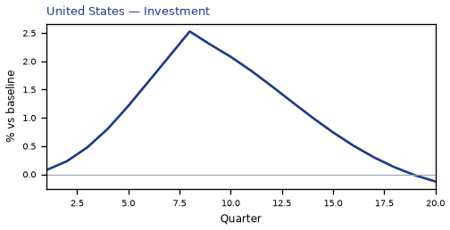

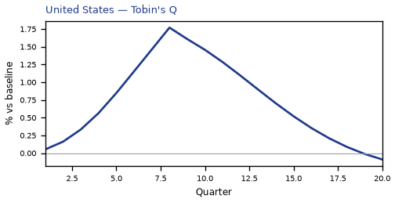


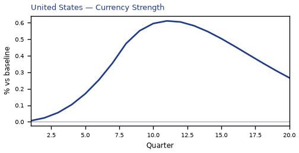

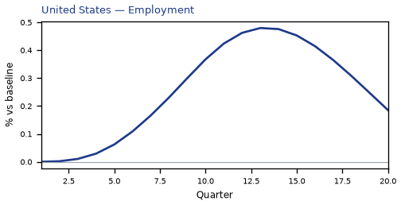

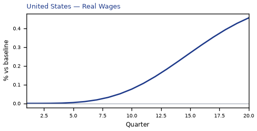

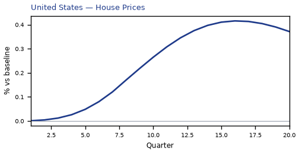

[Q1–Q20 JSON for United States](numbers/US.json)

## MX — Mexico

**Mexico: a modest positive spillover from a 200bp US rate cut**

The main impact of a 200 basis-point (2.00 percentage-point) cut in United States interest rates on Mexico is a 0.12% rise in GDP by the 12th quarter — a modest, slow-building positive spillover rather than a large hit. This is the second-largest absolute GDP response in the panel, but the magnitude stays small: the model never produces a dramatic Mexican boom from easier US money. The shock is a US monetary easing; Mexico's own policy rate moves only as an endogenous response, and the country's high trade and financial integration with the US is what carries the impulse across the border.

**Demand and trade.** Household consumption rises gradually, peaking at 0.06% above baseline in Q12 and still 0.01% higher by Q20 — a persistent but small demand gain. Private investment is the strongest domestic component, peaking at 0.46% above baseline in Q9 before fading and turning slightly negative (−0.11%) by Q20 as the initial cost-of-capital relief is exhausted. Net exports — this model's trade balance, with no separate import/export split — deteriorate throughout, reaching −0.15% of GDP around Q9 and remaining −0.04% below baseline at Q20. The mechanism is the exchange rate, not a decomposition of trade flows: easier US money weakens the dollar, and the peso strengthens in real terms, eroding Mexico's competitiveness and pulling the trade balance down even as domestic demand improves. Government spending drifts marginally lower, peaking at just −0.02% below baseline in Q12, while government debt rises steadily to 0.13% above baseline by Q18 — a small, slow fiscal drift rather than an active stimulus.

**External / FX.** The real exchange rate falls to −0.82% by Q9 — that is a real appreciation of the peso, since a decrease in this series means the home currency has strengthened in real terms. The peso's real appreciation is the mirror image of the US easing, and it is the single clearest transmission channel here: the stronger peso makes Mexican goods relatively more expensive, which is exactly why net exports fall even as consumption and investment rise. The RER never returns to baseline within the horizon, ending at −0.21% in Q20, so the competitiveness drag persists.

**Labour.** Employment rises steadily, peaking at 0.09% above baseline around Q15–Q16 and still 0.07% higher at Q20 — a slow labour-market improvement that lags the output response. Unemployment falls correspondingly, reaching −0.016 percentage points below baseline at Q14 and remaining −0.007pp lower at Q20. Real wages move the other way at first: they fall to −0.11% below baseline by Q11 as the initial inflation dip and the peso appreciation squeeze real incomes, then recover and turn positive (+0.06%) by Q20. The wage path is a squeeze-then-recovery, not a straightforward gain.

**Prices.** CPI inflation falls to −0.06pp below baseline in Q2, stays negative through Q9, then turns positive from Q10 and ends 0.01pp above baseline at Q20. Summed over Q1–Q12, the cumulative CPI effect is −0.25 percentage points — a modest net disinflation over the first three years, not a large price-level shift. Domestic inflation follows a similar arc, peaking at −0.04pp in Q2 and turning positive by Q10. Firms' marginal cost rises to 0.07% above baseline by Q12, consistent with the demand recovery feeding into costs later in the horizon.

**Financial conditions.** Mexico's local policy rate falls to −0.12pp below baseline in Q4, tracking the US easing, then turns positive from Q12 and ends 0.08pp above baseline as the domestic recovery firms. The 2-year government yield falls to −0.11pp in Q2 before turning positive from Q9; the 5-year and 10-year yields rise modestly, peaking at 0.04pp and 0.02pp respectively in Q12. Bond prices rise to 0.50% above baseline in Q4 — the mirror of the initial yield decline — then fall to −0.32% below baseline by Q20 as yields normalize higher. Equity prices rise to 0.41% above baseline in Q8, then fade and turn slightly negative (−0.02%) by Q20. Tobin's Q — the value of installed capital — peaks at 0.32% above baseline in Q9 and turns negative by Q18. House prices rise steadily to 0.14% above baseline by Q16 and remain 0.12% higher at Q20. Bank credit supply barely moves, peaking at just 0.001% above baseline in Q16, and the lending spread is unchanged at zero throughout — financial frictions simply do not bind in this simulation.

**Sectoral and capital.** Manufacturing GDP is the most responsive sector, peaking at 0.27% above baseline in Q9 and still 0.06% higher at Q20 — the tradable sector benefits most from the easier external conditions. Services GDP rises more modestly, peaking at 0.08% above baseline in Q12. The capital stock accumulates slowly, reaching 0.02% above baseline by Q17 and staying there through Q20 — a small but durable investment response.

**Timing.** The GDP gain builds gradually, peaking at 0.12% above baseline in Q12, and has largely faded by Q19, ending at just 0.01% above baseline in Q20. The equity and investment responses peak earlier (Q8–Q9) and fade faster, while employment and house prices peak later (Q15–Q16). The CPI effect is negative early and turns positive from Q10.

**Close.** These are model impulse responses relative to a no-shock baseline, not forecasts. They describe how Mexico's economy would deviate from its own baseline path under a 200bp US rate cut, holding everything else at the model's assumptions. The headline is a modest, slow-building positive spillover, with the peso's real appreciation and the resulting net-export drag as the main offsetting force. Number check vs JSON: GDP peak +0.12%, CPI 3y -0.25pp, equity peak +0.41%.


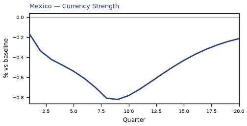

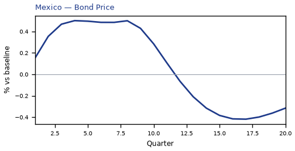

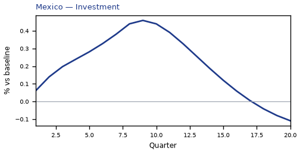

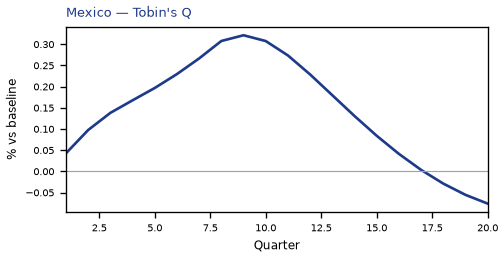

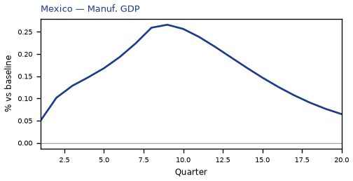

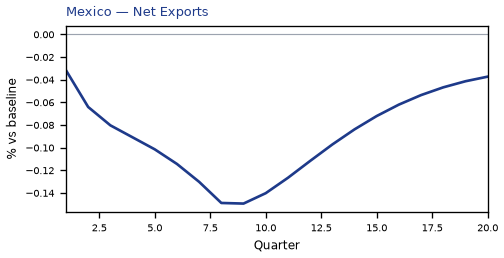

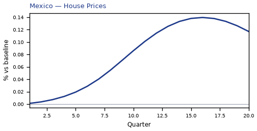

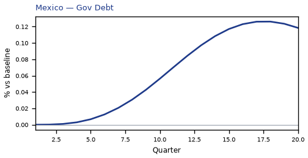


[Q1–Q20 JSON for Mexico](numbers/MX.json)

## SA — Saudi Arabia

**Saudi Arabia — US policy rate −200bp**

The main impact of a 200 basis-point (2.00 percentage-point) cut in United States interest rates on Saudi Arabia is a modest positive spillover: real GDP rises to about 0.10% above baseline by the 13th quarter. This is a small, slow-building gain rather than a large hit, consistent with the "modest" band and the country's third-place ranking by absolute GDP response. The shock is a US monetary easing, and the Saudi economy is a partial beneficiary through easier global financial conditions and a weaker dollar, not a dramatic boom.

**Demand and trade.** Household consumption strengthens gradually, peaking at roughly 0.06% above baseline in Q8 before dipping briefly below baseline around Q10 and then recovering to about 0.03% by Q20. Private investment is the strongest domestic demand response, rising to about 1.69% above baseline at Q8, then fading and turning slightly negative by Q18–Q20. Net exports — the trade balance, since this model does not split imports from exports — improve steadily, peaking near 0.14% above baseline at Q12 and remaining positive at about 0.04% by Q20. Government spending moves very little, peaking at only about 0.02% above baseline at Q11 and ending marginally below baseline. Government debt drifts up throughout, reaching about 0.14% above baseline by Q20.

**External / FX.** The real exchange rate rises, which is a real depreciation — a weaker, more competitive home currency — peaking at about 0.43% above baseline in Q11 and still about 0.25% above baseline at Q20. This real depreciation is the main external channel supporting the trade balance: the improvement in net exports lines up with the weaker currency, and the two move together through the middle of the horizon. There is no separate import/export split to appeal to here; the model gives only the net trade balance.

**Labour.** Employment rises slowly, reaching about 0.09% above baseline around Q17 and remaining near 0.08% at Q20. Unemployment falls correspondingly, reaching about −0.04 percentage points below baseline at Q16 and still about −0.03pp at Q20. Real wages climb steadily throughout, ending about 0.13% above baseline at Q20 — the largest labour-market gain in the path.

**Prices.** CPI inflation picks up modestly, peaking at about 0.02 percentage points above baseline in Q8, then fading and turning slightly negative after Q16, ending about −0.01pp at Q20. Domestic inflation follows a similar but smaller arc, peaking near 0.02pp at Q8 and turning negative after Q16. Firms' marginal cost rises to about 0.06% above baseline at Q13 and remains about 0.03% above baseline at Q20.

**Financial conditions.** The local policy rate falls in sympathy with the US cut, reaching about −1.03 percentage points at Q8, then returning toward baseline and turning slightly positive after Q14. Government bond prices rise sharply, peaking about 5.14% above baseline at Q8 before fading and turning slightly negative after Q14. Yields move the other way: the 2-year government yield falls to about −0.64pp at Q4, the 5-year yield to about −0.25pp at Q1, and the 10-year yield to about −0.16pp at Q2, all drifting back toward baseline later. Equity prices rise to about 0.41% above baseline at Q12 and remain about 0.15% above baseline at Q20. Tobin's Q — the value of installed capital — peaks near 1.18% above baseline at Q8, then fades and turns slightly negative by Q18. House prices rise steadily to about 0.16% above baseline at Q16 and stay near 0.14% at Q20. Bank credit supply barely moves, peaking at roughly 0.001% above baseline, and the lending spread is flat at zero throughout.

**Sectoral and capital.** Services GDP rises to about 0.04% above baseline at Q13 and remains about 0.02% above baseline at Q20. Manufacturing GDP is the exception: it falls to about −0.12% below baseline at Q11 and is still about −0.07% below baseline at Q20. The capital stock builds slowly, reaching about 0.05% above baseline around Q17 and holding near that level.

**Timing.** The GDP gain is largest around Q13, at roughly 0.10% above baseline, and it has not fully faded by Q20 — it is still about 0.04% above baseline. The equity and investment responses peak earlier, around Q8–Q12, while employment, real wages, house prices, and the capital stock keep building into the later quarters.

**Close.** These are model impulse responses to a US rate cut relative to baseline, not forecasts. They describe how the Saudi economy's variables deviate from their no-shock path under the model's estimated transmission, and should be read as conditional, model-implied deviations rather than predictions.


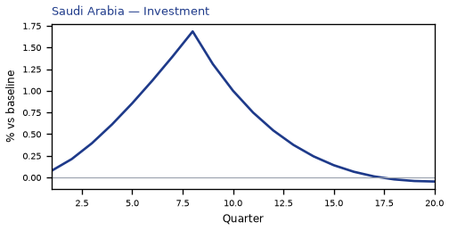

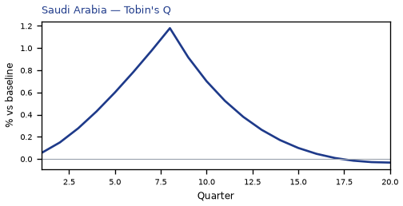


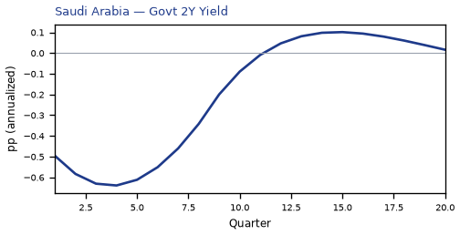

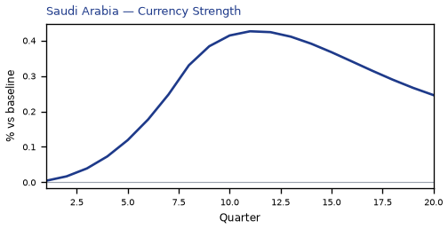

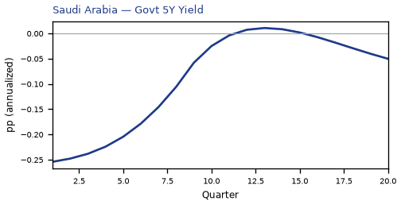

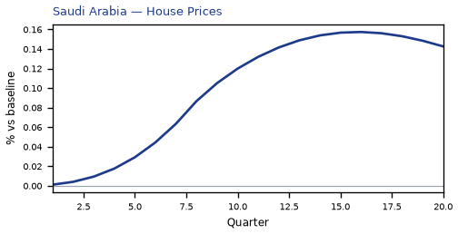

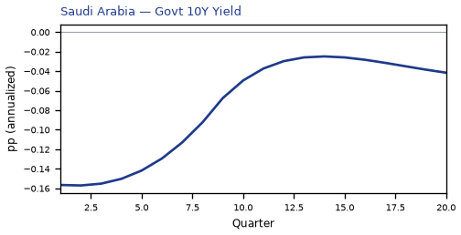

[Q1–Q20 JSON for Saudi Arabia](numbers/SA.json)

## CA — Canada

**Canada: a limited positive spillover from a 200bp cut in US rates**

The main impact of a 200 basis-point (2.00 percentage-point) cut in United States interest rates on Canada is a 0.10% rise in GDP by the 12th quarter — a limited spillover, not a large hit. Canada ranks fourth by absolute GDP response and sits in the "minimal" band. The shock is a US monetary easing, and the Canadian economy picks up modestly through the trade and financial channels rather than through any domestic policy action of its own.

**Demand and trade.** Household consumption rises gradually, peaking at 0.05% above baseline in Q12 and still 0.01% higher by Q20 — a slow, persistent demand impulse. Private investment is the strongest domestic demand component, peaking at 0.39% above baseline in Q9 before fading and turning slightly negative (−0.13%) by Q20 as the cost-of-capital boost unwinds. Net exports — this model does not split imports from exports, so net exports is simply the trade balance — fall to −0.15% below baseline at Q8, the deepest single drag in the demand block, and remain −0.03% below baseline at Q20. Government spending edges down to −0.01% at Q11, a trivial move, while government debt drifts up to 0.02% above baseline by Q17 as the small primary-balance effects accumulate.

**External / FX.** The real exchange rate falls to −1.05% below baseline at Q9. Because an increase in the real exchange rate is a real depreciation and a decrease is a real appreciation, this is a real appreciation of the Canadian dollar — the home currency strengthens against the baseline. That stronger real exchange rate is what weighs on net exports: the trade balance deteriorates to −0.15% at Q8, tracking the currency move closely. The RER remains −0.25% below baseline at Q20, so the appreciation is persistent rather than transient.

**Labour.** Employment rises to 0.09% above baseline at Q14, a modest but durable gain that never turns negative within the horizon. Unemployment falls to −0.05 percentage points below baseline at Q14, consistent with the employment gain. Real wages, however, decline to −0.14% below baseline at Q12 and remain −0.02% below baseline at Q20 — the labour market tightens in quantity terms while real compensation softens.

**Prices.** CPI inflation falls to −0.07 percentage points below baseline at Q2, the deepest point of the price response, before crossing back above baseline at Q10 and ending 0.01pp higher at Q20. Domestic inflation follows a similar profile, bottoming at −0.05pp at Q2 and turning positive at Q10. Firms' marginal cost rises to 0.06% above baseline at Q12, a modest cost-push that builds slowly and fades by Q19.

**Financial conditions.** The local policy rate falls to −0.12 percentage points below baseline at Q5, a small easing that mirrors the US move, then crosses above baseline at Q12 and ends 0.09pp higher at Q20. The 2-year government yield falls to −0.11pp at Q2, crosses above baseline at Q9, and ends 0.05pp higher. The 5-year yield rises to 0.05pp above baseline at Q12, and the 10-year yield rises to 0.02pp above baseline at Q13 — the curve steepens as the short end falls first and the long end later turns up. Bond prices rise to 0.70% above baseline at Q5, then fall to −0.52% below baseline by Q20 as yields rise. Equity prices rise to 0.38% above baseline at Q8 and fade to −0.01% below baseline at Q20. Tobin's Q — the value of installed capital — rises to 0.27% above baseline at Q9 and turns negative (−0.09%) by Q20. House prices rise steadily to 0.09% above baseline at Q16 and remain 0.08% higher at Q20. Bank credit supply edges up to 0.003% above baseline at Q16, a negligible move. The lending spread is flat at 0.00pp throughout — no credit-spread response in this simulation.

**Sectoral and capital.** Manufacturing GDP is the standout sectoral gain, rising to 0.32% above baseline at Q9 and still 0.08% higher at Q20 — the strongest single positive response in the whole table. Services GDP rises to 0.07% above baseline at Q12 and fades to 0.005% by Q20. The capital stock builds slowly, peaking at 0.02% above baseline at Q16 and remaining 0.02% higher at Q20.

**Timing.** The GDP response is largest at Q12, at 0.10% above baseline, and has mostly faded by Q19, ending at 0.01% above baseline in Q20. The equity peak arrives earlier, at Q8, and the investment peak at Q9. The price response bottoms earliest, at Q2. So the sequence runs: prices first, then financial conditions and investment, then GDP and employment, with the trade balance deteriorating throughout.

**Close.** These are model impulse responses versus baseline, not forecasts. They describe how the Canadian economy deviates from its own baseline path after a 200bp US rate cut, holding everything else at its baseline setting. Number check vs JSON: GDP peak +0.10%, CPI 3y -0.29pp, equity peak +0.38%.


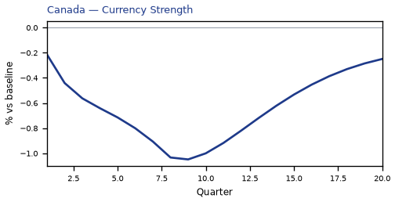

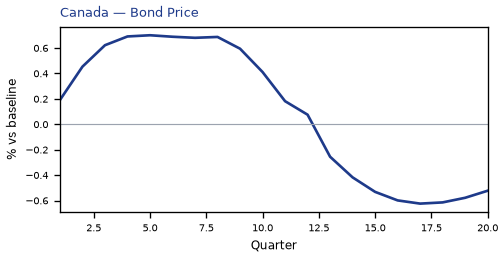

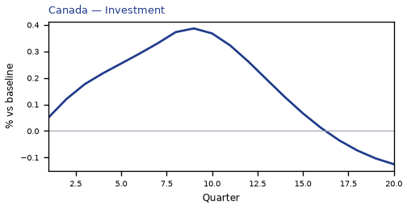

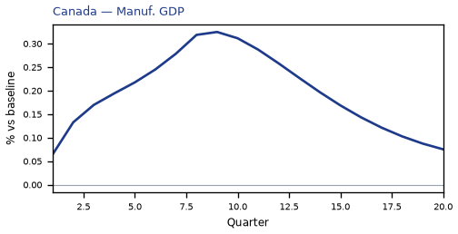

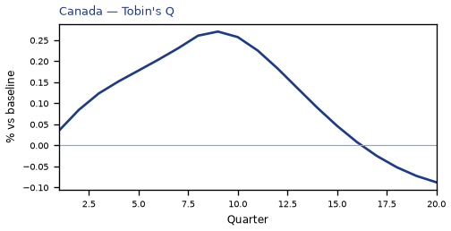

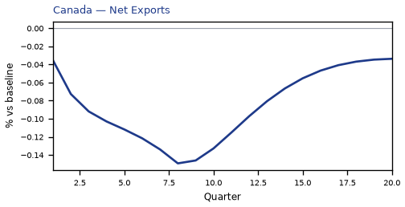

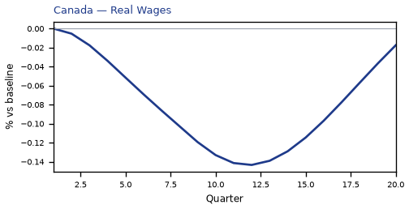


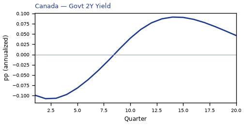

[Q1–Q20 JSON for Canada](numbers/CA.json)

## AR — Argentina

**Argentina: a small positive spillover from a 200bp US rate cut, then a late drag**

The shock in English is a 200 basis-point (2.00 percentage-point) cut in United States interest rates. For Argentina, the main result is a modest *positive* GDP response that peaks at +0.0521% above baseline in the ninth quarter — a limited spillover, not a large hit. The path is small and slow: +0.0033% in Q1, building through +0.0489% in Q8, peaking at +0.0521% in Q9, then fading to roughly zero by Q15 and turning negative from Q16, ending at −0.0423% by Q20. So the near-term effect is mildly expansionary, but it does not last; by the end of the horizon the level of activity sits slightly *below* baseline.

**Demand and trade.** Household consumption follows a similar hump: it rises to about +0.0178% by Q9, then fades and turns negative in Q16, reaching −0.0205% by Q20. Private investment is the strongest domestic demand component, peaking at +0.1246% in Q8 before turning negative in Q14 and ending at −0.0855%. Net exports — this model does not split imports from exports, so this is the trade balance — start *negative* at −0.0123% in Q1, stay negative through Q9, then improve steadily, peaking at +0.0193% in Q15 and easing to +0.0117% by Q20. Government spending is essentially flat early, dips to −0.0084% around Q9, then recovers and peaks at +0.0088% by Q20. Government debt rises gradually, peaking at +0.0124% in Q14 before fading back to +0.0007% by Q20.

**External / FX.** The real exchange rate — where an increase is a real depreciation (a weaker, more competitive home currency) and a decrease is a real appreciation — falls to −0.2161% by Q8, meaning the peso is *appreciating* in real terms through the middle of the horizon. That real appreciation lines up with the initially negative net exports: a stronger home currency makes the trade balance worse early on. After Q8 the RER turns and rises, crossing into positive territory in Q13 and reaching +0.0747% by Q20 — a real depreciation — which coincides with the later improvement in net exports. So the trade balance and the exchange rate move together in the expected direction, without needing an import/export split.

**Labour.** Employment rises modestly, peaking at +0.0185% in Q12, then fades and turns negative in Q18, ending at −0.0181%. Unemployment falls to −0.0122 percentage points by Q11, then reverses and ends at +0.0050pp by Q20. Real wages dip early, bottoming at −0.0143% around Q6, then recover strongly and peak at +0.0505% in Q17, finishing at +0.0389%. The labour market therefore tightens early and loosens late, with real wages improving only after the initial inflation dip.

**Prices.** CPI inflation falls to −0.0171pp in Q1, fades by Q3, turns positive in Q5, peaks at +0.0136pp in Q11, and ends at −0.0072pp by Q20. Domestic inflation behaves similarly: −0.0120pp in Q1, fading by Q3, turning positive in Q5, peaking at +0.0095pp in Q11, and ending at −0.0050pp. Firms' marginal cost rises to +0.0314% in Q9, then turns negative in Q16 and ends at −0.0254%. The CPI_3yr_pp figure of 0.0248 is the sum of quarterly CPI inflation over Q1–Q12, not the peak.

**Financial conditions.** The local policy rate initially falls to −0.0205pp in Q1, then rises to +0.0439pp by Q12, and ends at −0.0245pp by Q20. Government 2-year yields rise to +0.0332pp by Q9 before turning negative in Q15 and ending at −0.0339pp. The 5-year yield edges up early, turns negative in Q8, and ends at −0.0142pp. The 10-year yield is nearly flat, peaking at +0.0021pp in Q8 and ending at −0.0040pp. Bond prices rise to +0.1216% by Q8, then fall sharply to −0.1097% by Q12, and recover to +0.0613% by Q20. Equity prices are the standout: +0.4881% by Q8, then fading and turning negative in Q14, ending at −0.1149%. Tobin's Q peaks at +0.0872% in Q8 and ends at −0.0598%. House prices rise steadily to +0.0406% in Q13 and ease to +0.0059% by Q20. Bank credit is essentially unchanged, peaking at just +0.0001% by Q16, and the lending spread is flat at 0.0pp throughout.

**Sectoral and capital.** Manufacturing GDP is the strongest sector early, peaking at +0.0709% in Q8, then turning negative in Q13 and ending at −0.0319%. Services GDP peaks at +0.0298% in Q9, turns negative in Q16, and ends at −0.0242%. The capital stock edges up to +0.0047% by Q13 and ends at +0.0023%, a very small accumulation effect.

**Timing.** The GDP gain is largest in Q9, and it has largely faded by Q15; by Q20 the level is below baseline. The equity and investment peaks also land in Q8, with the reversal arriving in the mid-teens.

**Close.** These are model impulse responses relative to baseline, not forecasts. They describe how Argentina's block responds to a 200bp US rate cut under the model's estimated transmission, with the near-term boost concentrated in investment, equities and manufacturing, and a late drag as the exchange rate, trade balance and financial conditions reverse.


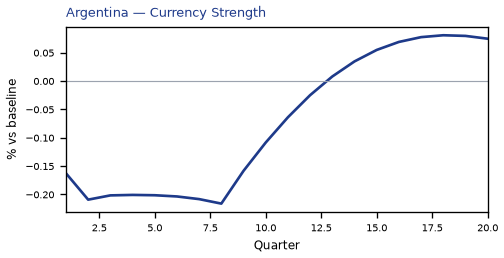

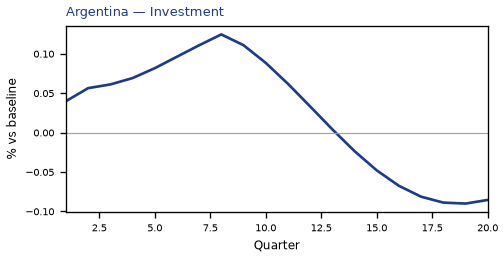

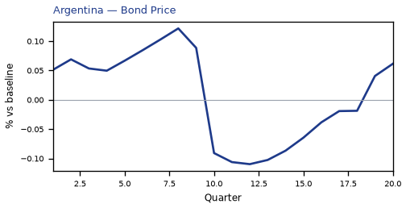

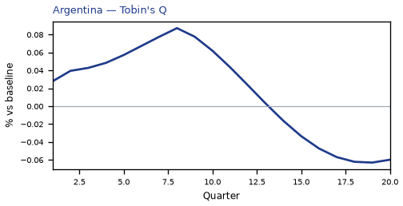

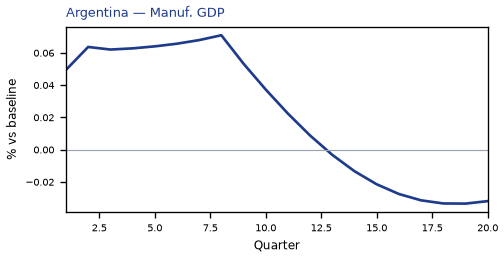

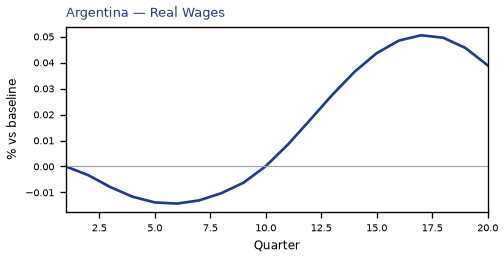


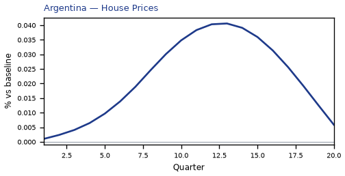

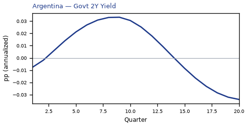

[Q1–Q20 JSON for Argentina](numbers/AR.json)

## CO — Colombia

The main impact of a 200 basis-point (2.00 percentage-point) cut in United States interest rates on Colombia is a modest positive spillover: real GDP rises to about 0.05% above baseline by the eleventh quarter, a small and slow-building gain rather than a large stimulus. This is a minimal-band result — Colombia is not one of the economies most tightly wired to US monetary conditions — and the effect is small enough that it should be read as a gentle tailwind, not a boom.

Demand and trade. Household consumption is the most durable positive leg, climbing to roughly 0.02% above baseline by Q12 and still marginally positive at Q20. Private investment responds more sharply and earlier, peaking near 0.18% above baseline in Q9 as the cost of capital falls, then fading and turning slightly negative by Q16. Net exports — the trade balance, since this model does not split imports from exports — move the other way, falling to about −0.05% of GDP around Q8, the mirror image of the stronger domestic demand and the currency move. Government spending is essentially flat, drifting to a shallow trough of about −0.006% near Q11 before recovering, while government debt builds gradually to roughly 0.04% above baseline by Q17 as the primary balance softens.

External / FX. The real exchange rate falls to about −0.59% below baseline by Q9 — that is a real appreciation of the Colombian currency, not a depreciation, since a decrease in this series means the home currency has strengthened in real terms. The appreciation is the natural counterpart of the easier US stance pulling capital toward higher-yielding markets, and it is what weighs on the trade balance: a stronger real currency makes Colombian goods relatively more expensive, which is consistent with net exports sitting below baseline through the horizon even as domestic demand strengthens.

Labour. Employment rises steadily, reaching about 0.03% above baseline by Q15 and holding positive through Q20. Unemployment falls in parallel, bottoming at roughly −0.006 percentage points around Q13–Q14 — a small improvement in the jobless rate. Real wages dip first, to about −0.05% below baseline near Q10, as the initial inflation drop outpaces nominal wage adjustment, then recover and turn positive from Q17, ending around 0.04% above baseline.

Prices. CPI inflation falls to about −0.026 percentage points below baseline in Q2, the largest disinflationary reading, then crosses back above baseline from Q10 and settles modestly positive. Domestic inflation follows a similar arc, troughing near −0.018 percentage points in Q2 before turning positive after Q10. Firms' marginal cost rises to roughly 0.03% above baseline by Q11, consistent with the demand pickup feeding through to costs later in the horizon.

Financial conditions. The local policy rate initially eases, dipping to about −0.05 percentage points below baseline around Q4–Q5, then reverses and climbs to roughly +0.05 percentage points above baseline by Q16 as the domestic recovery and inflation turn take hold. Government yields are mixed: the 2-year yield first dips, then rises to about +0.04 percentage points above baseline by Q13; the 5-year yield peaks near +0.017 percentage points in Q11; and the 10-year yield edges up to about +0.008 percentage points by Q12. Bond prices rise early, peaking around +0.18% above baseline near Q4, then fall to about −0.18% below baseline by Q16 as yields back up. Equity prices gain strongly at first, peaking near +0.33% above baseline in Q8, before fading and turning slightly negative from Q17. Tobin's Q — the value of installed capital — peaks around +0.12% above baseline in Q9 and then slips below baseline after Q16. House prices grind higher throughout, reaching about +0.05% above baseline by Q15 and staying positive. Bank credit supply improves only marginally, to roughly +0.0003% above baseline by Q16, and the lending spread is unchanged at zero across the entire horizon.

Sectoral and capital. Manufacturing GDP is the standout beneficiary, rising to about +0.18% above baseline by Q9 — the largest sectoral gain — before easing but remaining positive through Q20. Services GDP rises more gently, peaking near +0.03% above baseline in Q11 and turning marginally negative at the very end. The capital stock accumulates slowly, reaching about +0.008% above baseline by Q15 and holding there.

Timing. The GDP gain builds gradually, is largest around Q11 at roughly +0.05% above baseline, and has largely faded by Q18, turning slightly negative by Q20. The equity and investment peaks arrive earlier, around Q8–Q9, while the labour-market and house-price gains peak later, in the mid-teens.

Close. These are model impulse responses relative to baseline, not forecasts. They describe how Colombia's block of the model behaves when US rates are cut 200 basis points, holding everything else at its baseline path.


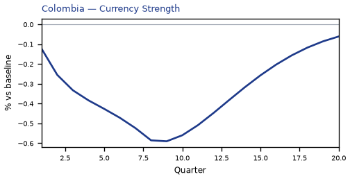

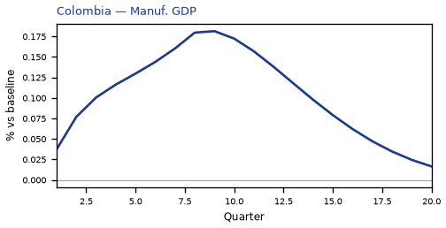

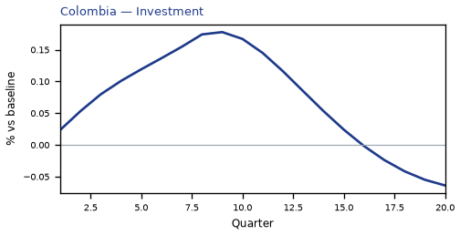

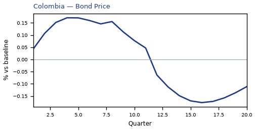

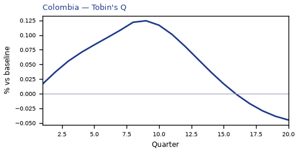

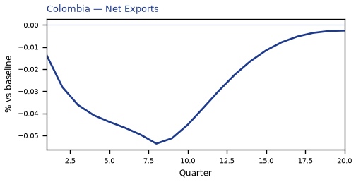

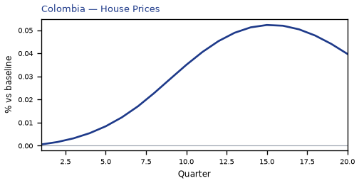

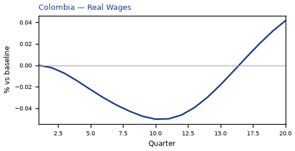


[Q1–Q20 JSON for Colombia](numbers/CO.json)

## CL — Chile

**Chile: a limited, slow-burn spillover from a 200bp cut in US rates**

The main impact of a 200 basis-point (2.00 percentage-point) cut in United States interest rates on Chile is a modest positive spillover: GDP rises to about 0.05% above baseline by the 11th quarter. This is a small effect — Chile ranks seventh by absolute GDP response and sits in the "minimal" band — and it is slow to arrive, building gradually rather than landing as a sharp shock. The direction is intuitive: easier US monetary conditions loosen global financial conditions, and a small, open, commodity-linked economy like Chile picks up some of that through cheaper external financing and stronger external demand. But the magnitudes here are genuinely minor, and the profile is one of a gentle hump rather than a step change.

**Demand and trade.** Household consumption strengthens gradually, peaking around 0.02% above baseline near the 12th quarter and still slightly positive at Q20. Private investment is the more responsive domestic component, rising to roughly 0.17% above baseline by the ninth quarter before fading and turning negative late in the horizon. Net exports — the trade balance, since this model does not split imports from exports — move the other way, falling to about −0.06% of GDP at its trough in the eighth quarter. That is the classic pattern when a real appreciation erodes external competitiveness: domestic demand firms up while the trade balance softens. Government spending barely moves, dipping to about −0.005% around the tenth quarter and edging back toward zero, while government debt drifts up modestly to roughly 0.02% above baseline by the 17th quarter.

**External and FX.** The real exchange rate falls — that is, the home currency appreciates in real terms — reaching about −0.39% versus baseline in the eighth quarter. Remember the sign convention: a decrease in the real exchange rate is a real appreciation, not "currency strength" in the loose sense. This real appreciation is the mirror image of the net-exports deterioration described above: as Chilean goods become relatively more expensive, the trade balance weakens, and the two series trough together around Q8. The RER effect is the largest single transmission channel in this simulation, and it is what ties the external story to the trade-balance drag.

**Labour.** Employment improves slowly, peaking near 0.03% above baseline around the 15th quarter and remaining positive through Q20. Unemployment falls correspondingly, reaching about −0.016 percentage points at its lowest in the 13th quarter. Real wages, however, move the opposite way for most of the horizon: they decline to roughly −0.05% below baseline by the 11th quarter before recovering and turning positive late. So the labour market tightens on the quantity side while real pay is squeezed for a stretch — a pattern consistent with prices falling faster than nominal wages early on.

**Prices.** CPI inflation falls to about −0.026 percentage points at its trough in the second quarter, then swings positive from the tenth quarter onward. Summed over Q1–Q12, the cumulative CPI effect is −0.08 percentage points — a small disinflationary nudge, not a dramatic price-level shift. Domestic inflation follows a similar arc, troughing near −0.018 percentage points in the second quarter before turning positive. Firms' marginal cost rises gradually to about 0.03% above baseline by the 11th quarter, then fades back toward zero — a mild cost-pressure signal that arrives later than the inflation dip.

**Financial conditions.** The local policy rate eases initially, falling to about −0.047 percentage points at its low in the fifth quarter, before reversing and rising above baseline from the 12th quarter. Government bond prices rise to about 0.19% above baseline at their peak in the fifth quarter, consistent with lower discount rates early on, then fall below baseline from Q12. Yields tell a mixed story: the 2-year government yield dips to about −0.04 percentage points in the second quarter before turning positive; the 5-year yield rises modestly to about 0.015 percentage points by the 11th quarter; and the 10-year yield edges up to roughly 0.007 percentage points around the 12th quarter. Equity prices are the standout financial mover, peaking about 0.34% above baseline in the eighth quarter before fading and turning slightly negative late. House prices climb steadily to roughly 0.05% above baseline by the 15th quarter and stay positive. Bank credit supply barely budges — a peak of about 0.0005% — and the lending spread is flat at zero throughout, so credit conditions are essentially unchanged in this simulation.

**Sectoral and capital.** Manufacturing output is the most responsive production sector, rising to about 0.12% above baseline by the eighth quarter before gradually fading. Services output is far more muted, peaking near 0.03% around the 11th quarter. The capital stock accumulates slowly, reaching about 0.008% above baseline by the 16th quarter and holding there. Tobin's Q — the value of installed capital — rises to roughly 0.12% above baseline in the ninth quarter, then declines and turns negative late, tracking the investment cycle.

**Timing.** The GDP gain is largest in the 11th quarter, at about 0.05% above baseline. It has largely faded by Q19 and actually turns marginally negative at Q20, so the positive impulse is temporary rather than permanent. The equity boost peaks earlier, in Q8, and the RER and net-exports effects also crest around Q8, making the eighth quarter the point of maximum external and financial adjustment. By contrast, the labour-market and capital-stock responses peak later, in the mid-teens, reflecting their slower adjustment.

**Close.** These are model impulse responses relative to a no-shock baseline, not forecasts. They describe how Chile's economy would deviate from its baseline path under a 200bp US rate cut, holding everything else at the model's assumed settings. The headline is a limited, delayed, and ultimately self-reversing spillover — real appreciation and a softer trade balance offsetting much of the domestic demand gain.


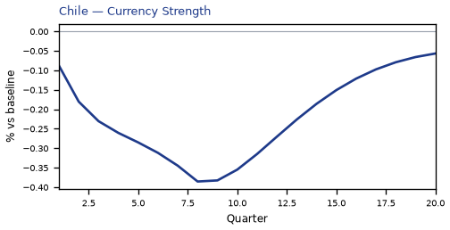

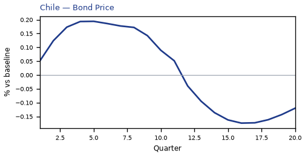

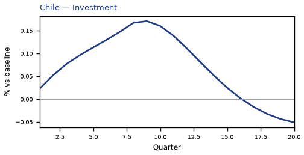

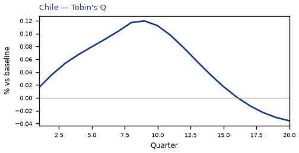

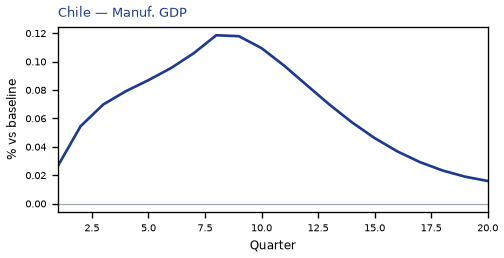


[Q1–Q20 JSON for Chile](numbers/CL.json)

## BR — Brazil

The main impact of a 200 basis-point (2.00 percentage-point) cut in United States interest rates on Brazil is a small positive spillover: GDP rises to a peak of about 0.05% above baseline by the eleventh quarter. This is a modest, slow-building gain rather than a large hit, consistent with Brazil’s classification in the minimal band. The shock is a US monetary easing, and the Brazilian response is transmitted mainly through external financial conditions and the exchange rate rather than through a direct domestic policy move.

Demand and trade respond in a muted but coherent way. Household consumption (Consumption) rises gradually to a peak of roughly 0.02% above baseline around the twelfth quarter, then fades and turns slightly negative by Q20. Private investment (Investment) is the strongest domestic demand component, peaking near 0.14% above baseline in the ninth quarter before fading and turning negative after Q16. Net exports (Net Exports, the trade balance — this model does not split imports from exports) fall to a trough of about −0.02% of GDP around the eighth quarter, then recover and turn positive from Q14 onward. Government spending (Gov Spending) dips modestly, with a trough near −0.01% around Q10, before recovering to slightly positive by Q20. Government debt (Gov Debt) drifts up gradually, peaking near 0.01% above baseline around Q17.

External and FX conditions are the clearest channel. The real exchange rate (Currency Strength) falls — that is, a real appreciation of the Brazilian currency — reaching a trough of about −0.48% versus baseline in the ninth quarter, before partially unwinding to roughly −0.05% by Q20. Because a decrease in the real exchange rate is a real appreciation, the home currency becomes stronger and less competitive, which is consistent with the negative net exports response over the first three years: the trade balance weakens as the currency appreciates, then improves as that appreciation fades.

Labour market effects are small but persistent. Employment rises to a peak of about 0.03% above baseline in the fifteenth quarter and remains positive through Q20. Unemployment falls, with a trough of about −0.01 percentage point around the thirteenth quarter, and stays below baseline throughout. Real wages initially dip, reaching a trough near −0.02% around Q10, then recover strongly and rise to about +0.03% above baseline by Q20.

Prices cool early and then firm. CPI inflation falls to a trough of about −0.01 percentage point in the second quarter, and the cumulative CPI effect over Q1–Q12 (CPI_3yr_pp) is −0.04 percentage points. Domestic inflation (Domestic Infl.) follows a similar path, troughing near −0.01 percentage point in Q2. Firms’ marginal cost (Marginal Cost) rises to a peak of about 0.03% above baseline in the eleventh quarter, then fades and turns slightly negative by Q19.

Financial conditions ease in the near term and tighten later. The local policy rate (Policy Rate) initially falls, troughing near −0.04 percentage point around Q4, then rises to a peak of about +0.05 percentage point by Q15. Government bond prices (Bond Price) rise to a peak of about 0.20% above baseline in the eighth quarter, then fall and turn negative from Q12. The equity index (Equity Index) peaks at about 0.38% above baseline in Q8, fades, and turns negative after Q16. Government yields move modestly: the 2-year yield (Govt 2Y Yield) peaks near +0.04 percentage point in Q12, the 5-year yield (Govt 5Y Yield) peaks near +0.01 percentage point in Q9, and the 10-year yield (Govt 10Y Yield) peaks near +0.01 percentage point in Q11. House prices (House Prices) rise steadily to a peak of about 0.04% above baseline in Q15 and remain positive through Q20. Bank credit (Bank Credit) expands only marginally, peaking near 0.0002% around Q16, while lending spreads (Credit Spread) are essentially unchanged at zero throughout.

Sectoral and capital effects are uneven. Manufacturing GDP (Manuf. GDP) is the strongest positive sectoral response, peaking at about 0.15% above baseline in the ninth quarter and remaining positive through Q20. Services GDP (Services GDP) rises more modestly, peaking near 0.03% above baseline in Q11 before fading and turning slightly negative by Q19. The capital stock (Capital Stock) edges up gradually, peaking near 0.01% above baseline around Q15. Tobin’s Q (Tobin's Q), the value of installed capital, peaks near 0.10% above baseline in Q9, then fades and turns negative after Q16.

On timing, the GDP gain is largest in Q11 at about 0.05% above baseline, and it has largely faded by Q18, turning slightly negative by Q19. The equity and bond-price effects peak earlier, around Q8, while the real appreciation troughs in Q9. Most of the positive impulse is gone by the end of the horizon, with several series slipping below baseline by Q20.

These are model impulse responses relative to baseline, not forecasts. They describe how Brazil’s macro variables deviate from their baseline path after a 200 basis-point US rate cut, given the model’s estimated transmission channels.


[Q1–Q20 JSON for Brazil](numbers/BR.json)

## MY — Malaysia

The main impact of a 200 basis-point (2.00 percentage-point) cut in United States interest rates on Malaysia is a 0.04% rise in GDP by the eleventh quarter — a minimal spillover. Malaysia ranks ninth by absolute GDP response and sits in the “minimal” band. The shock is a US monetary easing, and the model treats it as an external financial impulse that reaches Malaysia mainly through asset prices, the exchange rate, and the cost of capital rather than through a large direct demand channel. The headline GDP peak of 0.0372% above baseline in Q11 is small in absolute terms, and the path is not a permanent level shift: after peaking it decays steadily, turning slightly negative by Q20 at −0.0024%. That pattern — a modest, delayed positive bump that fades and then overshoots mildly to the downside — is the central story for Malaysia.

Demand and trade. Household consumption responds positively but weakly, peaking at 0.0185% above baseline in Q12 and essentially returning to zero by Q20 at −0.0001%. Private investment is the strongest domestic demand component, rising 0.1262% above baseline at its Q8 peak, consistent with a lower cost of capital and easier financial conditions. Net exports — the trade balance, since this model does not split imports from exports — move the other way: net exports fall to −0.0771% below baseline at Q8, the largest negative contribution in the demand block, before recovering through zero around Q14 and ending slightly positive at 0.0021% in Q20. Government spending is barely moved, with a peak deviation of only −0.0037% at Q10 and a small positive reading by Q20. Government debt rises gradually, peaking at 0.0308% above baseline in Q17 and remaining at 0.0271% by Q20, reflecting the cumulative effect of weaker nominal activity and the fiscal stance rather than any large discretionary response.

External / FX. The real exchange rate — where an increase is a real depreciation, a weaker and more competitive home currency, and a decrease is a real appreciation — falls to −0.2822% at its Q8 trough. That is a real appreciation of the ringgit against the baseline, not currency strength in the usual loose sense: the model’s RER series is down, so the home currency is stronger in real terms. The timing lines up with the net exports deterioration: the real appreciation peaks in the same quarter as the net exports trough, and as the RER move fades from Q9 onward, net exports recover in parallel. By Q20 the RER deviation is only −0.0081%, and net exports have turned marginally positive. The link is direct: a stronger real exchange rate makes Malaysian goods relatively less competitive, weighing on the trade balance, while the subsequent unwinding of that appreciation removes the drag.

Labour. Employment rises modestly, peaking at 0.0215% above baseline in Q14 and still 0.01% above baseline at Q20. Unemployment falls in mirror image, with the largest improvement — a −0.0092 percentage-point decline — at Q13, and it remains −0.003 percentage points below baseline at Q20. Real wages are the notable labour-market casualty: they fall to −0.0611% below baseline at Q10, the deepest point in the labour block, before recovering through zero around Q17 and ending 0.037% above baseline in Q20. The wage path is initially negative because inflation and marginal cost dynamics outrun nominal wage adjustment, then turns positive as the price pressures fade and real activity improves.

Prices. CPI inflation falls sharply at the start, with a peak deviation of −0.0599 percentage points in Q1, then fades quickly and is mostly gone by Q3. The cumulative CPI effect over Q1–Q12 is −0.0499 percentage points, a small net disinflationary contribution. Domestic inflation follows a similar front-loaded pattern, peaking at −0.0419 percentage points in Q1 and mostly fading by Q3, before turning positive in Q9 and ending at −0.002 percentage points in Q20. Firms’ marginal cost rises modestly, peaking at 0.0225% above baseline in Q11 and fading by Q18, ending at −0.0014% in Q20. The price block therefore shows an initial disinflationary impulse that reverses into mild positive inflation pressure in the middle quarters, before settling back near baseline.

Financial conditions. The local policy rate falls initially, with a peak deviation of −0.0371 percentage points in Q3, then turns positive from Q10 onward and ends 0.0178 percentage points above baseline in Q20 — a small tightening late in the horizon. Government 2-year yields first dip to −0.0295 percentage points in Q1, then rise to a peak of 0.0304 percentage points in Q12, fading by Q19. Government 5-year yields rise modestly, peaking at 0.0135 percentage points in Q10 and turning slightly negative by Q19. Government 10-year yields are nearly flat, peaking at 0.0059 percentage points in Q11 and returning to zero by Q20. Bond prices rise to 0.1885% above baseline at Q8, then fall below baseline from Q11 onward, ending at −0.0742% in Q20. Equity prices rise to 0.2857% above baseline at Q8, fade by Q14, and turn negative from Q17, ending at −0.0301% in Q20. Tobin’s Q — the value of installed capital — peaks at 0.0884% above baseline in Q8, fades by Q14, and ends at −0.0262% in Q20. House prices rise steadily, peaking at 0.0427% above baseline in Q15 and remaining at 0.032% by Q20. Bank credit supply barely moves, peaking at just 0.0006% above baseline in Q16 and ending at 0.0005% in Q20. Lending spreads are unchanged throughout, at 0.0 percentage points in every quarter.

Sectoral and capital. Manufacturing GDP is the strongest sectoral response, rising 0.0878% above baseline at its Q8 peak, fading by Q13, and ending essentially flat at 0.0003% in Q20. Services GDP rises more modestly, peaking at 0.0213% above baseline in Q11, fading by Q18, and ending at −0.0014% in Q20. The capital stock accumulates slowly, peaking at 0.0055% above baseline in Q15 and remaining at 0.0048% by Q20 — a small but persistent level effect from the investment response.

Timing. The GDP hit is largest in Q11, at 0.0372% above baseline. It has not fully faded by Q20, where it turns slightly negative at −0.0024%, with the sign change occurring in Q20 and the effect mostly faded by Q18. The equity and investment peaks arrive earlier, in Q8, while the labour-market and house-price peaks arrive later, in Q13–Q15. The net exports trough is also in Q8, coinciding with the real appreciation peak. The sequence is therefore: financial conditions and investment respond first, trade and the exchange rate move next, activity and employment follow, and prices adjust throughout.

Close. These are model impulse responses versus baseline, not forecasts. They describe how Malaysia’s macro variables deviate from a no-shock path under a 200 basis-point US rate cut, given the model’s estimated transmission channels. The overall picture is a minimal spillover: a small positive GDP bump that peaks in Q11, a real appreciation that weighs on net exports around Q8, a modest investment and equity boost, a temporary disinflationary impulse, and a gradual fade that leaves most variables near baseline by Q20.


[Q1–Q20 JSON for Malaysia](numbers/MY.json)

## TR — Turkey

The main impact of a 200 basis-point (2.00 percentage-point) cut in United States interest rates on Turkey is a 0.03% rise in GDP by the ninth quarter — a minimal spillover, consistent with Turkey's rank of tenth by absolute GDP response and its placement in the "minimal" band. This is a small, slow-building, and ultimately self-reversing effect rather than a large hit.

**Demand and trade.** Household consumption (Consumption) edges up to a peak of about 0.01% above baseline around Q9, then rolls over and turns negative by Q16, ending Q20 at roughly −0.01%. Private investment (Investment) responds more sharply, peaking near 0.10% above baseline in Q8 before fading and turning negative by Q13, finishing Q20 at about −0.06%. Net exports (the trade balance) deteriorate through the upswing, reaching a trough of about −0.04% of GDP in Q8, then recover and turn positive by Q19, ending Q20 at roughly +0.01%. Government spending (Gov Spending) dips to about −0.01% around Q9 and then recovers to a small positive by Q20. Government debt (Gov Debt) rises modestly to a peak near 0.01% of GDP around Q13 before easing back toward baseline.

**External / FX.** The real exchange rate (Currency Strength) falls to a trough of about −0.16% in Q8 — that is a real appreciation of the lira, since a decrease in the RER means the home currency is stronger in real terms. This real appreciation is what weighs on the trade balance: net exports deteriorate through the same window, consistent with a stronger lira making Turkish goods relatively less competitive. The RER then reverses, turning positive (a real depreciation) from Q14 onward and ending Q20 near +0.05%.

**Labour.** Employment rises to a peak of about 0.01% above baseline in Q12, then fades and turns negative by Q18, ending Q20 at roughly −0.01%. Unemployment falls to a trough of about −0.01 percentage point in Q11, then rises and turns positive by Q19, ending Q20 at about +0.002 percentage point. Real wages dip to a trough of about −0.02% in Q9, then recover strongly, turning positive by Q14 and ending Q20 at roughly +0.03%.

**Prices.** CPI inflation falls to a trough of about −0.02 percentage point in Q1, fades by Q4, then turns positive from Q9 and ends Q20 slightly negative again; the cumulative CPI effect over Q1–Q12 is about −0.003 percentage point. Domestic inflation (Domestic Infl.) follows a similar pattern, troughing near −0.01 percentage point in Q1 and fading by Q4. Firms' marginal cost (Marginal Cost) rises to a peak of about 0.02% above baseline in Q9, then turns negative by Q16 and ends Q20 at roughly −0.01%.

**Financial conditions.** The local policy rate (Policy Rate) initially falls to about −0.03 percentage point by Q2, then rises to a peak of roughly +0.04 percentage point in Q13 before easing back toward baseline. The 2-year government yield (Govt 2Y Yield) rises to a peak of about +0.03 percentage point in Q10, then falls back and ends Q20 slightly negative. The 5-year yield (Govt 5Y Yield) drifts up modestly early on and then declines to about −0.01 percentage point by Q19. The 10-year yield (Govt 10Y Yield) is nearly flat, ending Q20 at about −0.003 percentage point. Bond prices (Bond Price) rise to a peak of about +0.12% in Q8, then fall and turn negative by Q10, ending Q20 at roughly −0.01%. Equity prices (Equity Index) rise to a peak of about +0.41% in Q8, then fade and turn negative by Q15, ending Q20 at roughly −0.08%. Tobin's Q (the value of installed capital) peaks near +0.07% in Q8, turns negative by Q13, and ends Q20 at about −0.04%. House prices (House Prices) rise steadily to a peak of about +0.03% in Q13 before easing to roughly +0.01% by Q20. Bank credit (Bank Credit) is essentially flat, drifting to about −0.001% by Q20, and lending spreads (Credit Spread) are negligible throughout, ending Q20 at roughly +0.0001 percentage point.

**Sectoral and capital.** Manufacturing GDP rises to a peak of about +0.05% above baseline in Q8, then fades and turns negative by Q14, ending Q20 at roughly −0.02%. Services GDP peaks near +0.02% in Q9, turns negative by Q16, and ends Q20 at about −0.01%. The capital stock (Capital Stock) edges up to a peak of about +0.004% in Q12 and remains slightly positive through Q20.

**Timing.** The GDP response is largest in Q9 at about +0.03% above baseline. It fades by Q15 and turns negative in Q16, ending Q20 at roughly −0.02%. So the initial boost is temporary and largely unwound by the end of the horizon.

**Close.** These are model impulse responses relative to baseline, not forecasts. They describe how Turkey's macro variables deviate from their baseline path after a 200 basis-point cut in US interest rates, with the dominant channels running through equity prices, the real exchange rate, bond prices, and investment.


[Q1–Q20 JSON for Turkey](numbers/TR.json)

## KR — South Korea

The main impact of a 200 basis-point (2.00 percentage-point) cut in United States interest rates on South Korea is a 0.03% rise in GDP by the 11th quarter — a minimal spillover. This is the headline: a small, slow-building, and ultimately transient gain, not a large stimulus. South Korea ranks 11th by absolute GDP response across the panel, and the band is "minimal." The shock is a US monetary easing, and the question is how much of it reaches Korean activity through trade, financial conditions, and the exchange rate. The answer is: not much, and not for long.

Demand and trade. Household consumption rises gradually, peaking at 0.01% above baseline in Q12 before fading back toward zero by Q20. Private investment is the more responsive domestic component, peaking at 0.13% above baseline in Q9, consistent with a lower cost of capital, then turning negative from Q16 onward as the initial impulse reverses. Net exports — the trade balance, since this model does not split imports from exports — fall to −0.09% of GDP at the Q9 trough, the largest single drag in the demand block. Government spending is essentially flat, drifting to −0.005% at its Q11 low, while government debt rises modestly to 0.01% above baseline by Q18 as the small spending and revenue effects accumulate.

External / FX. The real exchange rate falls to −0.37% below baseline at Q8. Because an increase in the RER is a real depreciation and a decrease is a real appreciation, this is a real appreciation of the Korean won — the home currency strengthens. That appreciation is the mirror image of the net-exports deterioration: a stronger real exchange rate makes Korean goods relatively more expensive, and net exports weaken to their −0.09% trough at Q9, roughly coinciding with the RER low at Q8. The two move together, and the model does not require an import/export split to tell that story.

Labour. Employment rises slowly, reaching 0.02% above baseline at Q15, a very small gain. Unemployment falls correspondingly, to −0.01 percentage points below baseline at Q14. Real wages decline to −0.06% below baseline at Q12 — the largest labour-market movement in the set — as the modest activity gain is not enough to lift real compensation, and the real appreciation plus soft domestic inflation squeeze real wage growth.

Prices. CPI inflation falls to −0.03 percentage points below baseline at Q2, the deepest point, and the cumulative CPI effect over Q1–Q12 sums to −0.12 percentage points. Domestic inflation follows a similar path, troughing at −0.02 percentage points in Q2. Firms' marginal cost rises to 0.02% above baseline at Q11, a small increase that reflects the gradual pickup in activity and input demand rather than any price pressure.

Financial conditions. The local policy rate falls to −0.05 percentage points below baseline at Q5, a token easing, then turns positive from Q12 as the initial impulse fades. The 2-year government yield falls to −0.04 percentage points at Q2 before rising above baseline from Q9; the 5-year yield dips only slightly early on and peaks at 0.02 percentage points above baseline in Q12; the 10-year yield is nearly flat, peaking at 0.01 percentage points above baseline in Q13. Bond prices rise to 0.24% above baseline at Q5, then fall below baseline from Q13. Equity prices rise to 0.31% above baseline at Q8, the largest financial response, before turning negative from Q17. Tobin's Q — the value of installed capital — peaks at 0.09% above baseline in Q9 and turns negative from Q16. House prices rise steadily to 0.03% above baseline at Q16 and stay positive through Q20. Bank credit supply barely moves, peaking at 0.0003% above baseline at Q15. The lending spread is exactly zero throughout — this model carries no credit-risk response to the US rate cut.

Sectoral and capital. Manufacturing GDP is the most responsive production sector, rising to 0.11% above baseline at Q8, then fading but remaining positive through Q20. Services GDP rises much less, peaking at 0.02% above baseline at Q11. The capital stock edges up to 0.01% above baseline at Q15, a negligible accumulation effect.

Timing. The GDP gain is largest at Q11, at 0.03% above baseline, and has largely faded by Q19, ending at 0.001% above baseline in Q20. The equity peak comes earlier, at Q8, and the RER low also at Q8; the CPI trough is earliest, at Q2. So the sequence runs: prices first, then financial conditions and the exchange rate, then activity, with the real economy peaking around Q11 and unwinding by Q19.

Close. These are model impulse responses versus baseline, not forecasts. They describe how a 200 basis-point US rate cut propagates through South Korea under the model's assumed channels, conditional on the baseline path for oil, VIX, and other drivers. The story is a minimal, delayed, and self-reversing spillover: a small activity gain, a real appreciation that weakens net exports, a brief equity and bond-price boost, and almost no credit or spread response.


[Q1–Q20 JSON for South Korea](numbers/KR.json)

## NG — Nigeria

**Nigeria: a limited spillover from a 200bp cut in US rates**

The main impact of a 200 basis-point (2.00 percentage-point) cut in United States interest rates on Nigeria is a modest 0.03% rise in GDP by the tenth quarter — a limited spillover. Nigeria sits in the "minimal" band and ranks 12th by absolute GDP response, so the external shock barely moves the domestic needle. The peak arrives at Q10, and the path is not a clean one-way street: GDP turns negative from Q16 and ends Q20 at −0.02% versus baseline. This is a small, slow-building, then reversing impulse, not a large hit.

**Demand and trade.** Household consumption (Consumption) drifts up to about 0.01% by Q10, then fades and turns slightly negative after Q16, ending Q20 at −0.01%. Private investment (Investment) is the more visible mover, peaking at 0.07% in Q8 before sliding to −0.06% by Q20 as the cost-of-capital effect unwinds. Net exports (the trade balance — this model does not split imports from exports) start negative at −0.02% in Q1, cross into positive territory at Q9, and peak at 0.03% in Q14, ending Q20 at 0.01%. Government spending (Gov Spending) is essentially flat early, turning positive from Q10 and peaking at 0.005% in Q18. Government debt (Gov Debt) builds steadily, peaking at 0.03% in Q14 and easing to 0.01% by Q20.

**External / FX.** The real exchange rate (Currency Strength) falls to −0.23% at Q8 — a real appreciation, since a decrease in the RER means the home currency is stronger in real terms. That stronger real exchange rate is consistent with the net-exports path: the trade balance is negative through Q8, then improves as the RER move fades and eventually turns positive after Q15. By Q20 the RER is +0.04%, a mild real depreciation, and net exports remain positive. The two series move together without any need to invent an import/export split.

**Labour.** Employment (Employment) rises gradually, peaking at 0.01% in Q13, then fades and turns slightly negative by Q20. Unemployment falls to −0.003 percentage points at Q12, then reverses and ends Q20 at +0.001pp. Real wages (Real Wages) dip early, trough at −0.02% in Q7, then recover strongly, peaking at +0.04% in Q19 and holding near +0.04% at Q20.

**Prices.** CPI inflation (CPI Inflation) falls to −0.02pp in Q1, fades by Q3, then rises to a peak of +0.02pp in Q11 before easing back to −0.005pp by Q20. Domestic inflation (Domestic Infl.) follows a similar shape, peaking at −0.02pp in Q1 and ending Q20 at −0.003pp. Firms' marginal cost (Marginal Cost) rises to 0.02% in Q10, then turns negative from Q16 and ends Q20 at −0.01%.

**Financial conditions.** The local policy rate (Policy Rate) initially falls to −0.02pp in Q2, then rises to a peak of +0.04pp in Q13 before easing back to −0.004pp by Q20. Government 2-year yields (Govt 2Y Yield) rise to 0.03pp in Q10 and end Q20 at −0.02pp. Government 5-year yields (Govt 5Y Yield) are positive early, peak at −0.01pp in Q19, and end Q20 at −0.01pp. Government 10-year yields (Govt 10Y Yield) are near zero throughout, ending Q20 at −0.004pp. Bond prices (Bond Price) rise to 0.10% in Q8, then turn negative from Q10 and end Q20 at −0.01%. Equity prices (Equity Index) peak at 0.35% in Q8, fade by Q12, and end Q20 at −0.07%. Tobin's Q (the value of installed capital) peaks at 0.05% in Q8 and ends Q20 at −0.04%. House prices (House Prices) rise steadily to 0.02% in Q13 and end Q20 at 0.003%. Bank credit (Bank Credit) is essentially flat, peaking at 0.0001% in Q16. Lending spreads (Credit Spread) are exactly zero throughout — no movement at all.

**Sectoral and capital.** Manufacturing GDP (Manuf. GDP) is the strongest positive mover, peaking at 0.07% in Q8, then fading and turning negative from Q15, ending Q20 at −0.02%. Services GDP (Services GDP) peaks at 0.01% in Q10 and ends Q20 at −0.01%. The capital stock (Capital Stock) barely moves, peaking at 0.003% in Q12 and ending Q20 at 0.001%.

**Timing.** The GDP hit is largest at Q10, at +0.03%, and it has not faded by Q20 — it has actually turned negative, ending at −0.02%. The sign change comes at Q16, and the response is mostly faded by Q15 before the reversal. So the positive impulse is temporary, and the tail of the horizon is mildly negative.

**Close.** These are model impulse responses versus baseline, not forecasts. They describe how Nigeria's macro variables deviate from their baseline path after a 200bp US rate cut, given the model's structure and the frozen sign conventions above.


[Q1–Q20 JSON for Nigeria](numbers/NG.json)

## ZA — South Africa

**South Africa: a 200 basis-point cut in US interest rates**

The main impact of a 200 basis-point (2.00 percentage-point) cut in United States interest rates on South Africa is a 0.03% rise in GDP by the 11th quarter — a minimal spillover. This is a small, slow-building positive, not a boom. The shock is a US monetary easing, and South Africa is a modest open economy with its own inflation-targeting central bank; the model lets the external impulse work through trade and financial channels, but the magnitudes stay in the hundredths of a percent. GDP (real GDP) rises from 0.0018% in Q1 to a peak of 0.0273% in Q11, then fades, crossing below baseline in Q19 and sitting at −0.004% by Q20.

**Demand and trade.** Household consumption (Consumption) tracks the same hump: it climbs to 0.0097% above baseline at Q11 and turns marginally negative only at Q20. Private investment (Investment) responds earlier and harder, peaking at 0.0977% in Q8 as the cost of capital falls, then fading and turning negative by Q16, ending at −0.0349%. Net exports (the trade balance — this model does not split imports from exports) move the other way: the trade balance deteriorates to −0.0368% at Q9 and stays negative through Q20, never crossing back. Government spending (Gov Spending) is essentially flat, dipping to −0.004% at Q10 and returning to roughly zero by Q20. Government debt (Gov Debt) drifts up steadily, reaching 0.0087% above baseline at Q17 and staying there.

**External / FX.** The real exchange rate (Currency Strength) falls — that is a real appreciation of the rand, since a decrease in this series means the home currency is stronger in real terms. It moves from −0.056% in Q1 to a trough of −0.2488% in Q8, then unwinds to −0.0195% by Q20. A stronger real exchange rate is the mirror image of the deteriorating trade balance: the same external easing that lifts domestic demand also appreciates the currency, and net exports weaken in step. There is no import/export split to appeal to here — the model gives one trade-balance number, and it is negative throughout.

**Labour.** Employment rises gradually, peaking at 0.0125% above baseline in Q14 and still positive at 0.0047% in Q20. Unemployment falls correspondingly, to −0.0068 percentage points at Q13, and remains below baseline at −0.0018 points in Q20. Real wages (Real Wages) fall first — to −0.0299% at Q11 — because the initial inflation dip and the stronger currency squeeze nominal wage growth relative to prices; they only turn positive at Q18 and end at 0.0146%.

**Prices.** CPI inflation falls to −0.0148 percentage points at Q2, the largest single-quarter move in the price block, and stays negative until Q9; summed over Q1–Q12 the CPI effect is −0.0465 percentage points. Domestic inflation (Domestic Infl.) follows the same shape, peaking at −0.0103 points in Q2 and turning positive at Q10. Firms' marginal cost (Marginal Cost) actually rises, to 0.0166% at Q11, as activity picks up and labour markets tighten — so the disinflation is an exchange-rate and import-price story, not a cost story.

**Financial conditions.** The local policy rate (Policy Rate) is cut initially, to −0.0263 percentage points at Q4, then reverses and rises to 0.0272 points above baseline by Q16 as the domestic recovery and inflation turn. Government 2-year yields (Govt 2Y Yield) dip first, to −0.0213 points at Q2, then rise to 0.0222 points at Q13. The 5-year yield (Govt 5Y Yield) rises modestly to 0.0078 points at Q10. The 10-year yield (Govt 10Y Yield) peaks at 0.0034 points at Q12. Bond prices (Bond Price) rise to 0.1949% above baseline at Q8, then fall to −0.0564% by Q20. Equity prices (Equity Index) gain 0.3477% at Q8 before fading to −0.0455% by Q20. Tobin's Q (the value of installed capital) peaks at 0.0684% in Q8 and ends at −0.0244%. House prices (House Prices) rise steadily to 0.0283% at Q15 and remain positive. Bank credit (Bank Credit) barely moves — a peak of 0.0001% at Q14. Lending spreads (Credit Spread) are exactly zero throughout.

**Sectoral and capital.** Manufacturing output (Manuf. GDP) is the strongest sectoral response, up 0.0754% at Q8, and it stays positive through Q20 at 0.0042%. Services output (Services GDP) rises more slowly, peaking at 0.0174% at Q11 and turning slightly negative by Q20. The capital stock (Capital Stock) accumulates gradually, peaking at 0.0042% at Q15 and holding near 0.0036% at Q20.

**Timing.** The GDP effect is largest at Q11, and it has largely faded by Q18; by Q20 it is slightly negative. The financial and investment responses peak earlier, around Q8, while the labour-market and capital-stock responses peak later, in the Q13–Q15 window. The trade balance is negative from Q1 onward and never recovers within the horizon.

**Close.** These are model impulse responses to a US rate cut, relative to baseline — not forecasts. They describe how the estimated structure transmits a foreign monetary shock into South African activity, prices, and asset markets, and the headline message is that the spillover is small.


[Q1–Q20 JSON for South Africa](numbers/ZA.json)

## NL — Netherlands

**Netherlands — US policy rate −200bp**

The main impact of a 200 basis-point (2.00 percentage-point) cut in United States interest rates on the Netherlands is a 0.026% rise in GDP by the 11th quarter — a minimal spillover. This is a small, slow-building, and largely transient gain for a very open economy that is tightly linked to US financial conditions. The peak arrives late (Q11), the effect is tiny in absolute terms, and it has mostly faded by Q18, with GDP essentially back to baseline (0.0006% above) by Q20. The headline CPI effect is also small: the cumulative CPI inflation response over Q1–Q12 sums to −0.23 percentage points, meaning the near-term price level path runs slightly below baseline before turning.

**Demand and trade.** Household consumption rises gradually, peaking at 0.013% above baseline in Q11 and fading only slowly — it is still 0.0008% above baseline in Q20. Private investment responds more visibly, peaking at 0.074% above baseline in Q10, then decaying to roughly zero by Q20 (marginally negative at −0.0008%). Net exports — the trade balance, since this model does not split imports from exports — move the other way: it falls to −0.106% of GDP at Q10 and remains −0.078% below baseline at Q20, so the external account is a persistent drag even as domestic demand improves. Government spending edges down to −0.005% at Q11 and returns to baseline by Q20, while government debt drifts to −0.003% below baseline at Q17, a negligible fiscal effect.

**External / FX.** The real exchange rate falls — that is a real appreciation of the home currency, since a decrease in the RER means the Dutch real exchange rate strengthens. It moves from −0.046% in Q1 to a trough of −0.408% in Q11, and is still −0.290% below baseline at Q20. This real appreciation is consistent with the net-exports drag: a stronger real exchange rate makes Dutch goods relatively less competitive, and the trade balance deteriorates through the horizon even as domestic demand and investment improve. The currency move and the NX path tell the same story — the external sector absorbs part of the domestic-demand gain.

**Labour.** Employment rises slowly, peaking at 0.015% above baseline in Q15 and remaining 0.010% above baseline at Q20. Unemployment falls correspondingly, reaching −0.013 percentage points below baseline at Q13 and still −0.005pp below baseline at Q20. Real wages, however, decline: they fall to −0.105% below baseline at Q16 and remain −0.093% below baseline at Q20. So the labour market tightens in quantity terms while real compensation sags — employment and unemployment improve, but purchasing power does not.

**Prices.** CPI inflation dips to −0.028pp at Q3, crosses back above baseline at Q13, and ends at +0.004pp in Q20. Domestic inflation follows a similar arc, troughing at −0.020pp in Q3 and turning positive at Q13 (+0.003pp by Q20). Firms' marginal cost rises modestly, peaking at 0.016% above baseline in Q11 and fading to near zero by Q20. The near-term disinflation is the dominant price signal; the later positive inflation prints are small.

**Financial conditions.** The local policy rate does not move at all — it is 0.00pp throughout, so the Dutch authority does not respond. Government 2-year, 5-year, and 10-year yields are likewise unchanged at 0.00pp across the horizon. Bond prices rise to 0.502% above baseline at Q8, then fall below baseline from Q14 onward, ending −0.058% at Q20. Equity prices peak at 0.241% above baseline in Q8, fade through Q14, and turn negative at Q17, ending −0.019% at Q20. Tobin's Q peaks at 0.052% above baseline in Q10 and ends marginally negative. House prices rise steadily, peaking at 0.023% above baseline in Q17 and remaining 0.021% above baseline at Q20. Bank credit expands very slightly, peaking at 0.001% above baseline in Q16. Lending spreads are unchanged at 0.00pp throughout.

**Sectoral and capital.** Manufacturing GDP is the standout: it rises to 0.122% above baseline at Q11 and is still 0.086% above baseline at Q20 — the largest and most persistent real-activity gain in the set. Services GDP rises to 0.019% above baseline at Q11 and fades to 0.0004% by Q20. The capital stock builds very slowly, peaking at 0.004% above baseline at Q19.

**Timing.** The GDP gain is largest in Q11 and has mostly faded by Q18; it does not change sign. The equity and bond-price effects peak earlier (Q8) and fade faster. The manufacturing gain is the exception — it persists through Q20.

**Close.** These are model impulse responses relative to baseline, not forecasts. They describe how the Dutch block of the model behaves when US rates are cut 200bp, holding everything else at its baseline. Number check vs JSON: GDP peak +0.03%, CPI 3y -0.23pp, equity peak +0.24%.


[Q1–Q20 JSON for Netherlands](numbers/NL.json)

## TH — Thailand

**Thailand: a limited spillover from a 200bp cut in US rates**

The main impact of a 200 basis-point (2.00 percentage-point) cut in United States interest rates on Thailand is a 0.03% rise in GDP by the 10th quarter — a limited spillover. This is a small, positive, and slow-building response, not a dramatic boom. The Thai economy is only modestly geared into US monetary conditions, and the model shows the impulse arriving late and fading well before the horizon ends. GDP (real GDP) peaks at +0.0252% versus baseline in Q10, is essentially flat in the first quarter (+0.0015%), and turns slightly negative by Q19, ending Q20 at −0.0034%. That is the whole story in miniature: a weak positive hump, then a small undershoot.

**Demand and trade.** Household consumption rises gradually, peaking at +0.0098% in Q11 and only turning marginally negative at the very end of the horizon (Q20, −0.0009%). Private investment is the strongest domestic demand component: it peaks at +0.0879% in Q8, then fades and turns negative from Q15, ending Q20 at −0.0325%. Net exports — the trade balance, since this model does not split imports from exports — move the other way, peaking at −0.053% in Q8 and only turning positive from Q15 onward (+0.0049% by Q20). Government spending is a rounding-error drag, peaking at −0.0043% in Q10 and turning slightly positive by Q19. Government debt drifts up steadily, peaking at +0.0151% in Q16 and remaining at +0.0116% by Q20.

**External / FX.** The real exchange rate falls — that is, the home currency undergoes a real appreciation, not a depreciation. The Currency Strength series (the real exchange rate, where an increase means real depreciation) troughs at −0.2037% in Q8, meaning the Thai real exchange rate is about 0.20% stronger than baseline at that point. This real appreciation is consistent with the negative net exports path: a stronger home currency makes Thai goods relatively less competitive, and the trade balance deteriorates through Q8 before recovering. The RER move fades by Q12 and turns mildly positive (a small real depreciation) from Q15, ending Q20 at +0.0075%.

**Labour.** Employment rises slowly, peaking at +0.0123% in Q14 and still +0.0037% above baseline at Q20. Unemployment falls correspondingly, with the largest decline of −0.0031 percentage points in Q13, easing to −0.0008pp by Q20. Real wages are squeezed in the middle of the horizon: they fall to −0.0408% by Q10, then recover and turn positive from Q16, ending Q20 at +0.0292%. So the labour market gains jobs while real pay initially lags, before wages overtake.

**Prices.** CPI inflation falls immediately, peaking at −0.04 percentage points in Q1, fading by Q4, and turning positive from Q9 before ending Q20 at −0.0026pp. Domestic inflation follows a similar early-negative pattern, peaking at −0.028pp in Q1 and turning positive from Q9. Firms' marginal cost rises modestly, peaking at +0.0153% in Q10 and turning negative by Q19. The CPI_3yr_pp figure of −0.0248 is the sum of quarterly CPI inflation responses over Q1–Q12, not the peak of inflation.

**Financial conditions.** The local policy rate initially falls, troughing at −0.028pp in Q3, then rises and peaks at +0.031pp in Q15, ending Q20 at +0.0136pp. Government 2-year yields dip early (−0.0215pp in Q1), turn positive from Q6, and peak at +0.0261pp in Q12. The 5-year yield peaks at +0.0105pp in Q9, and the 10-year at +0.0038pp in Q10. Bond prices rise first, peaking at +0.1863% in Q8, then fall and turn negative from Q11, ending Q20 at −0.0566%. Equity prices peak at +0.2581% in Q8, fade by Q13, and turn negative from Q16, ending Q20 at −0.032%. Tobin's Q peaks at +0.0615% in Q8 and turns negative from Q15. House prices rise persistently, peaking at +0.0273% in Q14 and still +0.0186% at Q20. Bank credit supply barely moves, peaking at +0.0002% in Q16. Lending spreads are flat at 0.0pp throughout.

**Sectoral and capital.** Manufacturing GDP is the most responsive sector, peaking at +0.0619% in Q8, fading by Q12, and turning negative from Q14, ending Q20 at −0.0048%. Services GDP peaks at +0.0139% in Q10 and turns negative from Q19. The capital stock edges up, peaking at +0.0036% in Q14 and remaining at +0.0029% by Q20.

**Timing.** The GDP hit is largest in Q10, and it has largely faded by Q17, with a small sign change in Q19. The equity and investment peaks arrive earlier, in Q8, while the labour-market and house-price peaks arrive later, in Q13–Q14. By Q20 the GDP response is slightly negative, so the positive impulse does not persist.

**Close.** These are model impulse responses versus baseline, not forecasts. They describe how Thailand's economy would deviate from its baseline path under a 200bp US rate cut, holding everything else at the model's assumptions.


[Q1–Q20 JSON for Thailand](numbers/TH.json)

## IN — India

**India: a limited spillover from a 200bp cut in US rates**

The main impact of a 200 basis-point (2.00 percentage-point) cut in United States interest rates on India is a 0.02% rise in GDP by the ninth quarter — a minimal spillover. India ranks 16th by absolute GDP response and sits in the “minimal” band. The shock is a US monetary easing, not a domestic one; India’s own policy rate moves only in response to the changing conditions. The GDP path is small throughout: +0.0016% in Q1, building gradually to a peak of +0.0221% in Q9, then fading and turning negative at Q16, ending at −0.0168% by Q20. That is a rounding-error-scale effect on aggregate output, but the composition underneath is more interesting.

**Demand and trade.** Household consumption (Consumption) rises modestly early, peaking at +0.0071% around Q9, then rolls over and turns negative at Q16, ending at −0.0089% by Q20 — the weakest point of the consumption path. Private investment (Investment) is the strongest positive domestic demand component, peaking at +0.069% in Q8, but it flips sign at Q12 and ends at −0.0538% by Q20. Government spending (Gov Spending) is essentially flat, drifting to −0.0037% at Q9 and then recovering to +0.0029% by Q20. Government debt (Gov Debt) rises gradually to a peak of +0.0086% in Q13 before easing back to −0.0019% at Q20. Net exports (Net Exports) — the trade balance, since this model does not split imports from exports — deteriorate through the first two years, peaking at −0.037% in Q8, then improve steadily and turn positive at Q19, ending at +0.004% by Q20.

**External / FX.** The real exchange rate (Currency Strength) falls — that is a real appreciation of the home currency, not a depreciation. It moves to −0.2416% by Q8, the largest single move in the table, then unwinds and crosses into positive territory at Q14, ending at +0.0481% by Q20, which is a mild real depreciation. The early real appreciation is consistent with the deteriorating net export position through Q8: a stronger home currency makes Indian exports relatively less competitive, and the trade balance weakens in step. When the real exchange rate later turns positive (a real depreciation) after Q14, net exports improve in tandem, turning positive by Q19. The two series move together with the expected sign.

**Labour.** Employment (Employment) rises very slightly, peaking at +0.005% in Q13, then fades and turns negative at Q18, ending at −0.0039% by Q20. Unemployment (Unemployment) falls marginally, reaching −0.0026 percentage points at Q12 — a tiny improvement in the jobless rate — before reversing and ending +0.0007pp higher by Q20. Real wages (Real Wages) are flat initially, dip to −0.0206% at Q9, then recover strongly and end at +0.0269% by Q20, the largest positive labour-market number in the set. The labour block is small in absolute terms but internally consistent: employment and unemployment improve while real wages are temporarily squeezed, then the pattern reverses.

**Prices.** CPI inflation (CPI Inflation) falls immediately, peaking at −0.0196 percentage points in Q1, fading by Q4, then turning positive at Q9 and ending at −0.0033pp by Q20. Domestic inflation (Domestic Infl.) follows the same shape, peaking at −0.0137pp in Q1 and ending at −0.0023pp. Firms’ marginal cost (Marginal Cost) rises to +0.0134% at Q10, then falls and ends at −0.0101% by Q20. The cumulative CPI effect over Q1–Q12 (CPI_3yr_pp) is +0.0002 percentage points — effectively zero, because the early disinflation is almost exactly offset by the later reflation. That is a sum of quarterly IRFs, not a peak.

**Financial conditions.** India’s local policy rate (Policy Rate) initially falls to −0.0272pp at Q3, then rises steadily to a peak of +0.0419pp at Q14, ending at +0.0029pp. Government bond prices (Bond Price) rise to +0.2407% at Q8 — higher bond prices mean lower yields — then fall sharply and end at −0.0277% by Q20. The 2-year government yield (Govt 2Y Yield) dips early, then rises to +0.0338pp at Q11 and ends at −0.0161pp. The 5-year yield (Govt 5Y Yield) is mildly positive early and drifts to −0.0139pp by Q20. The 10-year yield (Govt 10Y Yield) is small throughout, ending at −0.0042pp. Equity prices (Equity Index) rise to +0.3118% at Q8, then fade and turn negative at Q15, ending at −0.0748% by Q20. Tobin’s Q (Tobin's Q) tracks investment, peaking at +0.0483% at Q8 and ending at −0.0377%. House prices (House Prices) rise steadily to +0.019% at Q12, then ease to +0.0023% by Q20. Bank credit (Bank Credit) is essentially unchanged, drifting to −0.0008% by Q18. Lending spreads (Credit Spread) are effectively zero throughout, reaching only +0.00002pp at Q18.

**Sectoral and capital.** Manufacturing GDP (Manuf. GDP) is the strongest positive sectoral response, peaking at +0.0729% in Q8, then falling and turning negative at Q13, ending at −0.0199% by Q20. Services GDP (Services GDP) rises to +0.0122% at Q9 and ends at −0.0093% by Q20. The capital stock (Capital Stock) barely moves, peaking at +0.0027% in Q11 and ending at +0.0005% — a negligible addition to installed capacity.

**Timing.** The GDP hit is largest at Q9 (+0.0221%), and it has not fully faded by Q20 — it turns negative at Q16 and is still drifting lower at −0.0168% at the end of the horizon. The equity and manufacturing peaks both land at Q8, and the bond-price peak also lands at Q8, so the financial and sectoral responses crest a quarter before the aggregate output response. Most series show a clean hump: positive through the first two years, then reversing.

**Close.** These are model impulse responses to a 200bp US rate cut, relative to baseline — not forecasts. They describe how India’s block of the model behaves under this specific shock, with all other shocks held at their baseline values.


[Q1–Q20 JSON for India](numbers/IN.json)

## NO — Norway

**Norway: a limited positive spillover from a 200bp US rate cut**

The shock is a 200 basis-point (2.00 percentage-point) cut in United States interest rates. For Norway the main result is a small positive spillover: GDP rises by at most 0.02% versus baseline, peaking in the 11th quarter. This is a minimal-band response — Norway ranks 17th of the countries covered by absolute GDP impact. The mechanism is not a domestic easing cycle but a global financial-conditions channel: lower US rates lift external demand and asset prices, and Norway's open, trade-linked economy picks up a modest amount of that.

**Demand and trade.** Household consumption strengthens gradually, reaching about 0.01% above baseline by the 12th quarter and staying positive through Q20. Private investment responds more visibly, peaking near 0.07% above baseline in the 9th quarter on a lower cost of capital, before fading and turning slightly negative late in the horizon. Net exports — the trade balance, since this model does not split imports from exports — first deteriorate to about −0.02% of GDP around Q3, then swing positive from Q7 and peak near 0.04% of GDP in the 13th quarter. Government spending drifts up to roughly 0.02% above baseline by Q12, and government debt edges down to about −0.004% versus baseline by Q17 as the cyclical improvement modestly improves the fiscal position.

**External / FX.** The real exchange rate falls to about −0.28% versus baseline by the 10th quarter. Under the frozen sign convention, a decrease in the real exchange rate is a real appreciation — a stronger, less competitive home currency. That appreciation is consistent with the net-exports path: the trade balance weakens early (Q1–Q6) while the currency is firming, then improves later as the RER begins to retrace toward baseline. The RER move is small, so the trade-balance swing is correspondingly modest.

**Labour.** Employment rises to about 0.01% above baseline by the 15th quarter, a slow labour-market pass-through. Unemployment falls to roughly −0.01 percentage point by Q14 — a very small improvement in the jobless rate. Real wages dip to about −0.02% below baseline by Q11 before recovering and turning slightly positive near Q19. The wage path is the mirror of the inflation path: softer near-term price growth squeezes real wages temporarily.

**Prices.** CPI inflation falls to about −0.01 percentage point below baseline in Q2, stays negative through Q9, then turns positive from Q10 and remains modestly above baseline through Q20. The cumulative CPI effect over Q1–Q12 is −0.04 percentage points — a small net disinflationary impulse. Domestic inflation follows a similar shape, troughing near −0.01 percentage point in Q2 and turning positive after Q10. Firms' marginal cost rises to about 0.01% above baseline by Q11, consistent with the later reflation in domestic prices.

**Financial conditions.** The local policy rate initially falls to about −0.02 percentage point below baseline by Q5, then rises steadily and peaks near +0.02 percentage point above baseline by Q17 — the local central bank effectively leans against the imported easing once activity and prices firm. Government 2-year yields dip early, then rise to about +0.02 percentage point above baseline by Q13. The 5-year yield rises to roughly +0.01 percentage point by Q10, and the 10-year yield edges up to about +0.003 percentage point by Q12. Bond prices rise to about 0.44% above baseline by Q8 before fading and turning negative after Q13. Equity prices peak near 0.24% above baseline in Q8, then fade and turn slightly negative from Q16. Tobin's Q — the value of installed capital — peaks near 0.05% above baseline in Q9 and turns negative late. House prices rise steadily to about 0.02% above baseline by Q16. Bank credit supply improves only marginally, to about 0.001% above baseline by Q16. Lending spreads are unchanged at 0.00 percentage point throughout — the model transmits this shock through asset prices and the exchange rate, not through credit risk premia.

**Sectoral and capital.** Manufacturing GDP is the strongest sectoral response, rising to about 0.08% above baseline by Q10 — roughly four times the aggregate GDP effect, reflecting Norway's tradable-goods sensitivity to external demand. Services GDP rises to about 0.01% above baseline by Q11, a much smaller response. The capital stock builds slowly, reaching about 0.003% above baseline by Q16.

**Timing.** The GDP effect is largest in Q11 at 0.02% above baseline, and it has largely faded by Q19, ending Q20 at essentially zero (0.0001%). The equity effect peaks earlier, in Q8, and the bond-price effect also peaks in Q8. The inflation effect peaks earliest, in Q2, and turns positive after Q10. So the sequence is: prices and asset prices first, activity and labour later, with the whole impulse washing out by the end of the horizon.

**Close.** These are model impulse responses versus baseline, not forecasts. They describe how Norway's macro-financial block responds to a 200bp US rate cut under the model's estimated transmission, holding everything else at baseline.


[Q1–Q20 JSON for Norway](numbers/NO.json)

## ID — Indonesia

**Indonesia: a 200 basis-point cut in US interest rates**

The main impact of a 200 basis-point (2.00 percentage-point) cut in United States interest rates on Indonesia is a modest 0.02% rise in GDP by the tenth quarter — a limited, short-lived spillover rather than a large hit. Indonesia sits 18th by absolute GDP response and lands in the "minimal" band, so the story here is one of small, front-loaded financial relief that fades and eventually turns slightly negative. The GDP path (real GDP) climbs gradually from +0.0018% in Q1 to a peak of +0.0215% in Q10, then decays through +0.0029% in Q16, crosses into negative territory at Q17, and ends at −0.0092% by Q20. That is the whole arc: a shallow positive hump, mostly faded by Q16, with a mild late drag.

**Demand and trade.** Household consumption follows the same shape at smaller scale, peaking at +0.0065% in Q9 and fading to −0.0046% by Q20. Private investment is the strongest real-side mover, peaking at +0.0644% in Q8 before sliding to −0.0351% by Q20 as the cost of capital advantage unwinds. Net exports — the trade balance, since this model does not split imports from exports — moves the other way: it falls to −0.0221% by Q8, then recovers through zero at Q15 and ends at +0.0039% in Q20. Government spending dips modestly to −0.0032% by Q9 and turns positive late, ending at +0.0016% in Q20. Government debt rises to +0.0070% by Q13, then fades to −0.0012% by Q20.

**External / FX.** The real exchange rate (Currency Strength) falls to −0.1914% by Q8 — that is a real appreciation of the rupiah, since a decrease in this series means the home currency is stronger in real terms. The rupiah strengthens early (−0.144% in Q1), deepens to the Q8 trough, then unwinds through zero at Q15 and ends at +0.0271% in Q20, a mild real depreciation. The early real appreciation is what pushes net exports down to their Q8 trough; as the currency strength fades and the real exchange rate turns positive late, net exports recover and finish positive.

**Labour.** Employment barely moves: it peaks at +0.0043% in Q13, fades by Q18, and ends at −0.0017% in Q20. Unemployment (the rate, in percentage points) edges down to −0.0026pp by Q12, then drifts back to roughly +0.0001pp by Q20. Real wages are the slowest-moving labour variable: they dip to −0.0165% by Q9, cross zero at Q14, and rise steadily to +0.0242% by Q20 — the largest positive labour outcome, arriving well after the GDP hump has faded.

**Prices.** CPI inflation falls immediately, peaking at −0.0174pp in Q1, fading by Q4, crossing zero at Q6, and ending at −0.0030pp in Q20. Domestic inflation mirrors this, at −0.0122pp in Q1, fading by Q4 and ending at −0.0021pp. Firms' marginal cost rises to +0.0131% by Q10, then falls through zero at Q17 to −0.0055% by Q20. The cumulative CPI effect over Q1–Q12 is only +0.0046pp — essentially a rounding error, not a meaningful inflation impulse.

**Financial conditions.** The local policy rate first dips to −0.0183pp by Q3, then rises to +0.0284pp by Q14, ending at +0.0049pp in Q20. Government 2-year yields rise to +0.0233pp by Q11 before easing to −0.0086pp by Q20; 5-year yields peak early at +0.0079pp in Q5 and drift to −0.0092pp by Q20; 10-year yields stay tiny throughout, ending at −0.0031pp. Bond prices rise to +0.17% by Q8, then fall to −0.0202% by Q20. Equity prices peak at +0.2442% in Q8, fade by Q13, cross zero at Q15, and end at −0.0420% in Q20. Tobin's Q peaks at +0.0451% in Q8 and ends at −0.0246%. House prices rise steadily to +0.0191% by Q13 and remain positive at +0.0085% in Q20. Bank credit is essentially flat, drifting to −0.0001% by Q20, and the lending spread is zero throughout, reaching only +0.000004pp by Q20.

**Sectoral and capital.** Manufacturing GDP is the largest single mover, peaking at +0.0577% in Q8, fading by Q12, crossing zero at Q14, and ending at −0.0117% in Q20. Services GDP peaks at +0.0107% in Q10 and ends at −0.0046% in Q20. The capital stock edges up to +0.0025% by Q12 and stays mildly positive at +0.0014% in Q20.

**Timing.** The GDP response is largest in Q10, with the financial and investment peaks clustered around Q8. By Q20 the positive impulse has fully faded and turned slightly negative. The equity, bond-price, investment, manufacturing, and net-export peaks all arrive in Q8; the GDP, consumption, services, marginal-cost, and employment peaks arrive later, between Q9 and Q13.

**Close.** These are model impulse responses relative to baseline, not forecasts. They describe how Indonesia's block responds to a US rate cut under the model's estimated transmission channels, with the caveat that the total effect is small and reverses sign late in the horizon.


[Q1–Q20 JSON for Indonesia](numbers/ID.json)

## CH — Switzerland

The main impact of a 200 basis-point (2.00 percentage-point) cut in United States interest rates on Switzerland is a 0.02% rise in GDP by the 11th quarter — a minimal spillover. This is a small, slow-building positive, not a boom: the Swiss economy barely registers a US easing cycle, and the peak arrives late, in Q11, at +0.0182% versus baseline. The headline CPI effect is also tiny: the summed quarterly CPI inflation response over Q1–Q12 is −0.0718 percentage points, i.e. a marginal disinflationary nudge rather than a meaningful price impulse. Equity prices peak at +0.2118% in Q8, again modest.

**Demand and trade.** Household consumption rises gradually, peaking at +0.0096% in Q11 and still +0.0007% by Q20 — a very shallow demand response. Private investment is the more visible domestic channel, peaking at +0.0709% in Q9 before fading and turning slightly negative (−0.0172% by Q20) as the initial cost-of-capital relief wears off. Net exports — the trade balance, since this model does not split imports from exports — move the other way, peaking at −0.0513% in Q8 and remaining negative through Q20 (−0.0017%). Government spending drifts marginally lower, peaking at −0.0037% in Q11, while government debt rises modestly, peaking at +0.0050% in Q16 and still +0.0042% by Q20.

**External / FX.** The real exchange rate falls to −0.2311% by Q8 — that is a real appreciation of the Swiss franc, not a weakening. The franc firms against the baseline as US rates fall, which is exactly why net exports deteriorate: a stronger home currency erodes competitiveness, and the trade balance peaks negative at −0.0513% in Q8, coinciding with the RER trough. The RER effect fades by Q15 and is essentially gone by Q20 (−0.0037%). Note the label "Currency Strength" in the raw data refers to the RER series; the sign convention is that an increase is a real depreciation, so the negative path here is franc appreciation.

**Labour.** Employment rises slowly, peaking at +0.0111% in Q14 and still +0.0050% by Q20. Unemployment falls correspondingly, peaking at −0.0093 percentage points in Q13 and still −0.0037pp by Q20 — a small labour-market tightening. Real wages, however, decline: they peak at −0.0434% in Q12 and remain −0.0132% below baseline by Q20, so the employment gain comes alongside weaker real pay.

**Prices.** CPI inflation falls to −0.0184 percentage points in Q2, turns positive by Q10, and reaches +0.0020pp by Q20. Domestic inflation follows a similar arc, peaking at −0.0129pp in Q2 and turning positive by Q10. Firms' marginal cost rises modestly, peaking at +0.0110% in Q11, consistent with the late-cycle demand pickup.

**Financial conditions.** The local policy rate falls to −0.0159 percentage points in Q7, turns positive by Q13, and ends at +0.0113pp by Q20 — a small, temporary easing. Government 2-year yields fall to −0.0142pp in Q3 before turning positive by Q10; 5-year yields dip initially then peak at +0.0048pp in Q13; 10-year yields peak at +0.0023pp in Q14. Bond prices rise sharply, peaking at +0.4863% in Q8, then fade and turn negative by Q14 (−0.0794% by Q20). Equity prices peak at +0.2118% in Q8 and turn negative by Q18 (−0.0154% by Q20). Tobin's Q peaks at +0.0496% in Q9 and turns negative by Q17. House prices rise steadily, peaking at +0.0164% in Q16 and still +0.0143% by Q20. Bank credit supply barely moves, peaking at +0.0006% in Q16. Lending spreads are flat at 0.0pp throughout — no credit-spread response in this simulation.

**Sectoral and capital.** Manufacturing GDP is the standout: it peaks at +0.0684% in Q8, far larger than the aggregate, before fading and turning slightly negative by Q18. Services GDP peaks at +0.0144% in Q11 and fades by Q18. The capital stock rises very slowly, peaking at +0.0032% in Q16 and still +0.0030% by Q20.

**Timing.** The GDP gain is largest in Q11 (+0.0182%) and has largely faded by Q18, ending at +0.0005% in Q20. The equity and bond-price peaks arrive earlier, in Q8, while the labour-market and house-price peaks come later, in Q13–Q16. The CPI trough is early, in Q2.

**Close.** These are model impulse responses versus baseline, not forecasts. They describe how the Swiss block of the model deviates from its own baseline path after a 200bp US rate cut, with no other shocks active.


[Q1–Q20 JSON for Switzerland](numbers/CH.json)

## RU — Russia

**Russia: a 200 basis-point cut in US interest rates**

The main impact of a 200 basis-point (2.00 percentage-point) cut in United States interest rates on Russia is a 0.018% rise in GDP by the 10th quarter — a minimal spillover. Russia ranks 20th by absolute GDP response and sits in the “minimal” band. The shock is a US monetary easing, not a Russian one; Russia’s own policy rate moves only as an endogenous response. The headline result is small in both directions: the GDP gain peaks at +0.018% of GDP in Q10, then fades and turns slightly negative by Q17, ending at −0.008% of GDP in Q20. This is a modest, transient, and ultimately reversing effect, consistent with a country whose cycle is only loosely tied to US financial conditions.

**Demand and trade.** Household consumption rises to a peak of +0.006% above baseline in Q11, then fades and turns negative by Q18, ending at −0.003% in Q20. Private investment is the strongest domestic demand component, peaking at +0.039% in Q8 before fading and turning negative by Q15, ending at −0.020% in Q20. Net exports — the trade balance, since this model does not split imports from exports — peak at +0.062% in Q12, the largest positive contribution in the demand block, and remain positive through Q20 at +0.012%. Government spending peaks at +0.017% in Q13 and stays positive, ending at +0.005% in Q20. Government debt rises modestly to a peak of +0.002% in Q14 and remains slightly positive at +0.001% in Q20.

**External / FX.** The real exchange rate — where an increase is a real depreciation, a weaker and more competitive home currency, and a decrease is a real appreciation — falls to a trough of −0.059% in Q11. That is a real appreciation of the rouble against baseline, not currency strength in the “weaker is better” sense; the model’s label “Currency Strength” is the RER series, and here it moves down. The real appreciation is consistent with the net exports path: net exports improve to +0.062% by Q12 even as the currency appreciates, which in this model reflects the trade balance responding to relative demand and price conditions rather than a simple import/export split. By Q19 the RER turns positive (+0.0003%) and ends at +0.008% in Q20, a mild real depreciation.

**Labour.** Employment rises to a peak of +0.005% above baseline in Q13, then fades and turns slightly negative by Q19, ending at −0.001% in Q20. Unemployment falls to a trough of −0.006 percentage points in Q12 — a small improvement in the jobless rate — then fades and turns marginally positive by Q20 at +0.0002pp. Real wages are the clearest positive labour-market result: they dip slightly negative through Q6 (−0.002%), turn positive by Q10, and rise steadily to a peak of +0.016% in Q19, ending at +0.016% in Q20. So the labour market tightens modestly, with real wages gaining while unemployment edges down.

**Prices.** CPI inflation rises to a peak of +0.004 percentage points in Q11, having started negative at −0.003pp in Q1 and turned positive by Q5; it fades and turns slightly negative again by Q18, ending at −0.002pp in Q20. Domestic inflation follows a similar path, peaking at +0.003pp in Q11 and ending at −0.001pp in Q20. Firms’ marginal cost rises to a peak of +0.011% in Q10, then fades and turns negative by Q17, ending at −0.005% in Q20. The CPI_3yr_pp — the sum of quarterly CPI inflation IRF over Q1–Q12 — is +0.0142 percentage points, a very small cumulative price effect.

**Financial conditions.** Russia’s local policy rate rises to a peak of +0.015 percentage points (annualized) in Q13, having dipped negative early on and turned positive by Q6; it fades and turns slightly negative by Q20 at −0.002pp. The 2-year government yield peaks at +0.012pp in Q9 and ends at −0.009pp in Q20. The 5-year government yield peaks at −0.007pp in Q19, ending at −0.007pp. The 10-year government yield drifts down to −0.0025pp by Q20. Bond prices rise to a peak of +0.118% in Q8, then turn negative by Q11 and end at −0.014% in Q20. Equity prices are the largest financial response: they peak at +0.387% in Q8, fade, turn negative by Q14, and end at −0.055% in Q20. Tobin’s Q — the value of installed capital — peaks at +0.027% in Q8, turns negative by Q15, and ends at −0.014% in Q20. House prices rise steadily to a peak of +0.015% in Q14 and remain positive at +0.008% in Q20. Bank credit supply is essentially flat, peaking at +0.0002% in Q17 and ending at +0.0001% in Q20. The lending spread — the credit spread — is exactly zero throughout Q1–Q20, so it contributes nothing to the transmission.

**Sectoral and capital.** Manufacturing GDP peaks at +0.016% in Q9, fades, turns negative by Q18, and ends at −0.005% in Q20. Services GDP peaks at +0.010% in Q10, turns negative by Q17, and ends at −0.004% in Q20. The capital stock rises very gradually to a peak of +0.002% in Q14 and remains slightly positive at +0.001% in Q20.

**Timing.** The GDP hit is largest in Q10 at +0.018% above baseline. It has not fully faded by Q20: the path turns negative at Q17 and ends at −0.008% in Q20, so the positive impulse is gone and a small negative effect remains. Most of the positive response has faded by Q16. The equity and bond-price peaks arrive earlier, in Q8, while the net exports and real wage peaks arrive later, in Q12 and Q19 respectively.

**Close.** These are model impulse responses to a 200 basis-point US rate cut, relative to baseline — not forecasts. They describe how Russia’s macro-financial block would move under the model’s estimated transmission, with the dominant channels being equity prices, bond prices, net exports, and the real exchange rate. The overall picture is a minimal, front-loaded, and largely reversing spillover.


[Q1–Q20 JSON for Russia](numbers/RU.json)

## AU — Australia

The main impact of a 200 basis-point (2.00 percentage-point) cut in United States interest rates on Australia is a 0.02% rise in GDP by the 11th quarter — a minimal spillover. Australia ranks 21st of the countries in this run by absolute GDP response, and the band is "minimal." The shock is a US monetary easing, and the Australian economy barely registers it: the peak GDP gain of 0.0166% arrives only in Q11, and by Q20 the effect has actually turned slightly negative at −0.0004%. This is the signature of a small, open economy that is not the epicenter of the shock and whose domestic policy reaction is muted.

Demand and trade. Household consumption rises gently, peaking at 0.0076% above baseline in Q11 and still positive at 0.0005% by Q20 — a modest, persistent lift rather than a boom. Private investment is the more visible demand-side mover, peaking at 0.0642% in Q9 as the cost of capital falls, but it fades quickly and turns negative from Q16, ending at −0.027% by Q20. Net exports — the trade balance, since this model does not split imports from exports — deteriorates, peaking at −0.0257% in Q8 and only returning to positive territory in Q17. Government spending is essentially flat, with a tiny negative peak of −0.0013% in Q9 that reverses to +0.0004% by Q20. Government debt drifts up steadily, peaking at 0.0046% in Q17 and remaining at 0.0041% by Q20.

External / FX. The real exchange rate falls — that is, the Australian dollar real exchange rate depreciates — reaching −0.3051% versus baseline in Q9. A decrease in the RER is a real appreciation, so the headline move here is a real appreciation of about 0.31% at its peak, not a weakening. This real appreciation is consistent with the net exports deterioration: a more expensive real home currency erodes the trade balance, which is exactly what the NX path shows, peaking at −0.0257% in Q8. The RER effect fades gradually, returning to −0.0155% by Q20.

Labour. Employment rises slowly, peaking at 0.0113% above baseline in Q14 and still 0.0047% higher at Q20. Unemployment falls correspondingly, with the largest decline of −0.0085 percentage points in Q13, easing to −0.0032pp by Q20. Real wages dip modestly, peaking at −0.0261% in Q11, before recovering to +0.0045% by Q20 — a small real wage squeeze that reverses late in the horizon.

Prices. CPI inflation falls, peaking at −0.0131 percentage points in Q2, and the cumulative CPI effect over Q1–Q12 sums to −0.0427pp. Domestic inflation follows a similar profile, peaking at −0.0092pp in Q2. Firms' marginal cost rises modestly, peaking at +0.0101% in Q11, then fades and turns slightly negative at −0.0003% by Q20.

Financial conditions. The local policy rate initially falls, reaching −0.0196pp in Q5, then reverses and rises to +0.0210pp by Q17 — a small, delayed tightening. Government 2-year yields dip early, bottoming at −0.0163pp in Q2, then rise to +0.0179pp by Q14. The 5-year yield peaks at +0.0076pp in Q11, and the 10-year yield peaks at +0.0030pp in Q12. Bond prices rise, peaking at +0.2667% in Q8, then fall to −0.0990% by Q20. Equity prices rise to +0.2371% in Q8, then fade to −0.0246% by Q20. Tobin's Q peaks at +0.0449% in Q9 and ends at −0.0189%. House prices rise steadily, peaking at +0.0136% in Q15 and remaining at +0.0111% by Q20. Bank credit supply barely moves, peaking at +0.0003% in Q16. Lending spreads are unchanged at 0.0pp throughout.

Sectoral and capital. Manufacturing GDP is the strongest sectoral responder, peaking at +0.0904% in Q8, though it fades to +0.0038% by Q20. Services GDP peaks at +0.0119% in Q11 and turns slightly negative at −0.0003% by Q20. The capital stock edges up to +0.0028% in Q15 and stays at +0.0023% by Q20.

Timing. The GDP hit is largest in Q11 at +0.0166%, and it has essentially faded by Q18, turning negative by Q20. The equity and bond-price peaks arrive earlier, in Q8, while the labour-market and house-price peaks arrive later, in Q13–Q15.

Close. These are model impulse responses relative to baseline, not forecasts. They describe how Australia's economy deviates from its own baseline path following a 200bp US rate cut, under the model's estimated transmission channels.


[Q1–Q20 JSON for Australia](numbers/AU.json)

## PL — Poland

# Poland: a 200bp cut in US rates is a small positive spillover that fades

The main impact of a 200 basis-point (2.00 percentage-point) cut in United States interest rates on Poland is a 0.0148% rise in GDP by the tenth quarter — a minimal spillover. Poland ranks 22nd of the countries in this run by absolute GDP response, and the band is "minimal" for good reason. The peak arrives late, at Q10, and the path is small throughout: +0.0012% in Q1, building gradually to +0.0148% at Q10, then decaying to −0.0021% by Q20. The sign flips negative in Q19 and the effect is mostly faded by Q17. This is a classic weak transmission case: an easier US stance lifts Polish activity modestly for roughly two and a half years, then leaves a small negative residue as the initial impulse works off.

## Demand and trade

Household consumption rises to a peak of +0.0042% at Q9, with a Q1 reading of +0.0010% and a Q20 reading of −0.0004%; the sign turns negative only at the very end, and the effect is mostly faded by Q18. Private investment is the stronger domestic mover, peaking at +0.0595% at Q8, with +0.0102% in Q1 and −0.0212% by Q20; it turns negative in Q15 and is mostly faded by Q13. Government spending moves the other way, peaking at −0.0030% at Q10, with −0.0002% in Q1 and +0.0004% by Q20, flipping sign at Q19 and mostly faded by Q17. Government debt is flat at 0.0% across the entire horizon — the shock leaves the debt path unchanged in this model. Net exports, which here is the trade balance (this model does not split imports from exports), fall to a peak of −0.0355% at Q9, starting at −0.0064% in Q1 and ending at −0.0035% in Q20, with no sign change and mostly faded by Q18. That negative net-exports path is the mirror image of the exchange-rate move described below.

## External and FX

The real exchange rate — where an increase is a real depreciation (weaker, more competitive home currency) and a decrease is a real appreciation — falls to a peak of −0.1178% at Q8. That is a real appreciation of the zloty against the baseline, not currency strength in the loose sense: the RER series is lower, so the home currency is stronger in real terms. The path runs from −0.0295% in Q1 to −0.0082% in Q20, with no sign change and mostly faded by Q16. Because the zloty appreciates in real terms, Polish goods are less competitive at the margin, and that is exactly what the net-exports path shows: the trade balance deteriorates to −0.0355% at Q9, tracking the RER trough at Q8. The two series move together — a real appreciation and a weaker trade balance — without any need to invent an import/export split.

## Labour

Employment rises to a peak of +0.0042% at Q14, starting at 0.0% in Q1 and ending at +0.0008% in Q20, with no sign change and mostly faded by Q20. Unemployment falls to a peak of −0.0050 percentage points at Q12, from −0.0001pp in Q1 to −0.0011pp in Q20, with no sign change and mostly faded by Q20. Real wages fall to a peak of −0.0221% at Q11, from 0.0% in Q1 to +0.0022% in Q20; the sign turns positive at Q20 and the effect is mostly faded by Q18. So the labour market improves on the quantity side — more employment, less unemployment — while real wages are squeezed through the middle of the horizon before recovering.

## Prices

CPI inflation falls to a peak of −0.0115 percentage points at Q2, from −0.0074pp in Q1 to +0.0007pp in Q20; the sign turns positive at Q10 and the effect is mostly faded by Q9. Domestic inflation falls to a peak of −0.0081pp at Q2, from −0.0052pp in Q1 to +0.0005pp in Q20, with the sign turning positive at Q10 and mostly faded by Q9. Firms' marginal cost rises to a peak of +0.0090% at Q10, from +0.0007% in Q1 to −0.0012% in Q20, flipping sign at Q19 and mostly faded by Q17. The CPI_3yr_pp figure — the sum of quarterly CPI inflation IRF over Q1–Q12, not the peak of CPI inflation — is −0.0347 percentage points, a small cumulative disinflation over the first three years.

## Financial conditions

The local policy rate falls to a trough of −0.0176pp at Q4, from −0.0045pp in Q1, then rises to +0.0176pp at Q16 and +0.0093pp by Q20; the sign turns positive at Q11. The 2-year government yield falls to −0.0143pp at Q2, rises to +0.0145pp at Q13, and ends at +0.0004pp in Q20, flipping sign at Q8 and mostly faded by Q19. The 5-year government yield rises to +0.0050pp at Q10, from +0.0001pp in Q1 to −0.0028pp in Q20, flipping sign at Q17 and mostly faded by Q16. The 10-year government yield rises to +0.0019pp at Q12, from −0.0016pp in Q1 to −0.0005pp in Q20, flipping sign at Q6 and mostly faded by Q17. Bond prices rise to a peak of +0.3022% at Q8, from +0.0186% in Q1 to −0.0387% in Q20, flipping sign at Q13 and mostly faded by Q12. Equity prices rise to a peak of +0.2797% at Q8, from +0.0175% in Q1 to −0.0332% in Q20, flipping sign at Q15 and mostly faded by Q12. Tobin's Q rises to a peak of +0.0417% at Q8, from +0.0071% in Q1 to −0.0149% in Q20, flipping sign at Q15 and mostly faded by Q13. House prices rise to a peak of +0.0129% at Q15, from +0.0002% in Q1 to +0.0096% in Q20, with no sign change. Bank credit is essentially flat: it peaks at −0.0002% at Q20, from 0.0% in Q1, flipping sign at Q15. The lending spread is effectively zero throughout, peaking at 0.0pp at Q19 with only a 5e-06pp reading by Q20.

## Sectoral and capital

Manufacturing GDP rises to a peak of +0.0338% at Q8, from +0.0092% in Q1 to +0.0004% in Q20, with no sign change and mostly faded by Q14. Services GDP rises to a peak of +0.0093% at Q10, from +0.0008% in Q1 to −0.0013% in Q20, flipping sign at Q19 and mostly faded by Q17. The capital stock rises to a peak of +0.0025% at Q14, from +0.0001% in Q1 to +0.0019% in Q20, with no sign change.

## Timing

The GDP hit is largest at Q10, at +0.0148%, and it has not fully faded by Q20 — the path is still −0.0021% there, having crossed zero at Q19. The financial block peaks earlier, around Q8, and the labour-market quantities peak later, around Q12–Q14. The clearest way to read the sequence is: easier US rates first lift Polish asset prices and investment, then activity and employment, then the impulse decays and turns mildly negative late in the horizon.

## Close

These are model impulse responses to a 200bp US rate cut, relative to the model's baseline — not forecasts. They describe how this particular model transmits a US monetary easing into Polish variables, with all other shocks held at their baseline values.


[Q1–Q20 JSON for Poland](numbers/PL.json)

## UK — United Kingdom

**United Kingdom — US policy rate −200bp**

The shock is a 200 basis-point (2.00 percentage-point) cut in United States interest rates. For the United Kingdom the main result is a small positive spillover: real GDP rises by at most 0.0117% versus baseline, reached in Q10, with the path essentially gone by Q18. This is a minimal-band response — the UK sits 23rd of the countries ranked by absolute GDP effect — so the story here is a modest, slow-building demand and financial-conditions impulse rather than a large hit.

**Demand and trade.** Household consumption is the largest positive domestic demand component, peaking at 0.0049% in Q10 and fading by Q18, so the consumer response is real but tiny. Private investment is more front-loaded and somewhat larger, peaking at 0.0432% in Q9 before turning negative from Q18 and ending at −0.006% in Q20 as the cost-of-capital boost unwinds. Net exports — the trade balance, since this model does not split imports from exports — move the other way, peaking at −0.0353% in Q8 and only crossing back above zero at Q20 (+0.0008%). Government spending drifts slightly lower, peaking at −0.0024% in Q10 and fading by Q18, while government debt barely moves, peaking at +0.0005% in Q13.

**External / FX.** The real exchange rate falls to −0.3365% by Q8 — that is a real appreciation of the pound, since a decrease in the RER means a stronger, less competitive home currency. The move is persistent, still −0.0713% at Q14 and only turning positive (a real depreciation) from Q17. That appreciation is the mirror image of the net-exports deterioration: a stronger real currency is consistent with the trade balance peaking negative at −0.0353% in Q8, and as the RER unwinds toward zero the net-exports drag shrinks and finally flips sign at Q20.

**Labour.** Employment rises gradually, peaking at +0.0056% in Q13 and still +0.0021% at Q20, so the labour-market gain is late and shallow. Unemployment falls in parallel, peaking at −0.0058 percentage points in Q12 and still −0.0020pp at Q20. Real wages are the notable loser: they fall steadily to a peak of −0.0313% in Q12, fading only by Q19, so the employment gain comes alongside a real-income squeeze.

**Prices.** CPI inflation falls to −0.0137pp in Q2, with the sum of quarterly CPI inflation over Q1–Q12 at −0.0459pp; it crosses back above zero at Q10 and is +0.0011pp by Q20. Domestic inflation follows a similar shape, peaking at −0.0096pp in Q2 and turning positive from Q10. Firms' marginal cost rises modestly, peaking at +0.0071% in Q10 and fading by Q18 — a cost push that sits against the initial inflation dip.

**Financial conditions.** The local policy rate eases only slightly, peaking at −0.0071pp in Q8, then turns positive from Q15 and ends at +0.0037pp. Government yields fall at the short end: the 2-year yield peaks at −0.0062pp in Q4, the 5-year at −0.0022pp in Q1, and the 10-year at −0.0012pp in Q1, all fading and turning positive later. Bond prices rise correspondingly, peaking at +0.5974% in Q8 before turning negative from Q14. Equity prices peak at +0.2299% in Q8, fade by Q12, and turn negative from Q15. Tobin's Q peaks at +0.0303% in Q9 and turns negative from Q18. House prices rise slowly and persistently, peaking at +0.0096% in Q16 and still +0.0083% at Q20. Bank credit supply is almost flat, peaking at +0.0002% in Q15, and the lending spread is unchanged at 0.0pp throughout.

**Sectoral and capital.** Services GDP peaks at +0.0092% in Q10 and fades by Q18, closely tracking the aggregate. Manufacturing GDP is the strongest single response, peaking at +0.0995% in Q8, but it fades by Q14 and turns negative from Q16, ending at −0.0081% in Q20. The capital stock builds very gradually, peaking at +0.002% in Q17 and holding near that level through Q20.

**Timing.** The GDP effect is largest in Q10 at +0.0117%, builds slowly from +0.0007% in Q1, and has largely faded by Q18, ending at +0.0001% in Q20. The financial and manufacturing responses peak earlier, around Q8, while the labour-market and house-price responses peak later, around Q12–Q16.

**Close.** These are model impulse responses relative to baseline, not forecasts. They describe how the UK economy deviates from its baseline path after a 200bp US rate cut, with the dominant features being a small, slow GDP gain, a real appreciation of the pound, a net-exports drag, lower inflation early on, and a real-wage squeeze.


[Q1–Q20 JSON for United Kingdom](numbers/UK.json)

## SE — Sweden

The main impact of a 200 basis-point (2.00 percentage-point) cut in United States interest rates on Sweden would be only a small rise in GDP of 0.01% by Q10. Equities peak at +0.23% in Q8.

Demand and trade. Consumption peaks at +0.00 % vs baseline in Q10, from +0.00 in Q1 to -0.00 in Q20. Investment peaks at +0.04 % vs baseline in Q8, from +0.01 in Q1 to -0.02 in Q20. Net Exports peaks at -0.03 % vs baseline in Q9, from -0.01 in Q1 to -0.00 in Q20. Gov Spending peaks at -0.00 % vs baseline in Q10, from -0.00 in Q1 to +0.00 in Q20. Gov Debt peaks at -0.00 % vs baseline in Q15, from +0.00 in Q1 to -0.00 in Q20.

External / FX. The real exchange rate shows real appreciation (a stronger home currency). Currency Strength peaks at -0.12 % vs baseline in Q8, from -0.03 in Q1 to -0.01 in Q20.

Labour. Employment peaks at +0.00 % vs baseline in Q14, from +0.00 in Q1 to +0.00 in Q20. Unemployment peaks at -0.01 pp in Q12, from -0.00 in Q1 to -0.00 in Q20. Real Wages peaks at -0.02 % vs baseline in Q11, from +0.00 in Q1 to +0.00 in Q20.

Prices. The three-year CPI impulse is -0.03 percentage points. CPI Inflation peaks at -0.01 pp in Q2, from -0.01 in Q1 to +0.00 in Q20. Domestic Infl. peaks at -0.01 pp in Q2, from -0.00 in Q1 to +0.00 in Q20. Marginal Cost peaks at +0.01 % vs baseline in Q10, from +0.00 in Q1 to -0.00 in Q20.

Financial conditions. Policy Rate peaks at +0.01 pp (annualized) in Q16, from -0.00 in Q1 to +0.01 in Q20. Govt 2Y Yield peaks at -0.01 pp (annualized) in Q2, from -0.01 in Q1 to +0.00 in Q20. Govt 5Y Yield peaks at +0.00 pp (annualized) in Q10, from -0.00 in Q1 to -0.00 in Q20. Govt 10Y Yield peaks at +0.00 pp (annualized) in Q12, from -0.00 in Q1 to -0.00 in Q20. Bond Price peaks at +0.43 % vs baseline in Q8, from +0.03 in Q1 to -0.05 in Q20. Equity Index peaks at +0.23 % vs baseline in Q8, from +0.01 in Q1 to -0.03 in Q20. Tobin's Q peaks at +0.03 % vs baseline in Q8, from +0.00 in Q1 to -0.01 in Q20. House Prices peaks at +0.01 % vs baseline in Q15, from +0.00 in Q1 to +0.01 in Q20. Bank Credit peaks at +0.00 % vs baseline in Q14, from +0.00 in Q1 to +0.00 in Q20. Credit Spread peaks at +0.00 pp in Q1, from +0.00 in Q1 to +0.00 in Q20.

Sectoral and capital. Manuf. GDP peaks at +0.04 % vs baseline in Q8, from +0.01 in Q1 to +0.00 in Q20. Services GDP peaks at +0.01 % vs baseline in Q10, from +0.00 in Q1 to -0.00 in Q20. Capital Stock peaks at +0.00 % vs baseline in Q14, from +0.00 in Q1 to +0.00 in Q20.

Timing. The GDP response has mostly faded by Q17 (Q20 is -0.00%).

These figures are model IRFs versus baseline, not forecasts.


[Q1–Q20 JSON for Sweden](numbers/SE.json)

## CN — China

The main impact of a 200 basis-point (2.00 percentage-point) cut in United States interest rates on China would be only a small rise in GDP of 0.01% by Q9. Equities peak at +0.17% in Q8.

Demand and trade. Consumption peaks at +0.00 % vs baseline in Q9, from +0.00 in Q1 to -0.00 in Q20. Investment peaks at +0.03 % vs baseline in Q8, from +0.01 in Q1 to -0.01 in Q20. Net Exports peaks at -0.02 % vs baseline in Q8, from -0.02 in Q1 to -0.00 in Q20. Gov Spending peaks at -0.00 % vs baseline in Q9, from -0.00 in Q1 to +0.00 in Q20. Gov Debt peaks at -0.00 % vs baseline in Q20, from +0.00 in Q1 to -0.00 in Q20.

External / FX. The real exchange rate shows real appreciation (a stronger home currency). Currency Strength peaks at -0.22 % vs baseline in Q2, from -0.17 in Q1 to +0.02 in Q20.

Labour. Employment peaks at -0.00 % vs baseline in Q20, from +0.00 in Q1 to -0.00 in Q20. Unemployment peaks at -0.00 pp in Q11, from -0.00 in Q1 to -0.00 in Q20. Real Wages peaks at +0.01 % vs baseline in Q20, from +0.00 in Q1 to +0.01 in Q20.

Prices. The three-year CPI impulse is +0.00 percentage points. CPI Inflation peaks at -0.01 pp in Q2, from -0.01 in Q1 to -0.00 in Q20. Domestic Infl. peaks at -0.01 pp in Q2, from -0.01 in Q1 to -0.00 in Q20. Marginal Cost peaks at +0.01 % vs baseline in Q9, from +0.00 in Q1 to -0.00 in Q20.

Financial conditions. Policy Rate peaks at +0.01 pp (annualized) in Q15, from -0.00 in Q1 to +0.00 in Q20. Govt 2Y Yield peaks at +0.01 pp (annualized) in Q12, from -0.01 in Q1 to -0.00 in Q20. Govt 5Y Yield peaks at -0.00 pp (annualized) in Q20, from +0.00 in Q1 to -0.00 in Q20. Govt 10Y Yield peaks at -0.00 pp (annualized) in Q20, from -0.00 in Q1 to -0.00 in Q20. Bond Price peaks at +0.24 % vs baseline in Q8, from +0.02 in Q1 to -0.03 in Q20. Equity Index peaks at +0.17 % vs baseline in Q8, from +0.01 in Q1 to -0.02 in Q20. Tobin's Q peaks at +0.02 % vs baseline in Q8, from +0.01 in Q1 to -0.01 in Q20. House Prices peaks at +0.01 % vs baseline in Q13, from +0.00 in Q1 to +0.00 in Q20. Bank Credit peaks at -0.00 % vs baseline in Q20, from +0.00 in Q1 to -0.00 in Q20. Credit Spread peaks at +0.00 pp in Q18, from +0.00 in Q1 to +0.00 in Q20.

Sectoral and capital. Manuf. GDP peaks at +0.07 % vs baseline in Q2, from +0.05 in Q1 to -0.01 in Q20. Services GDP peaks at +0.01 % vs baseline in Q9, from +0.00 in Q1 to -0.00 in Q20. Capital Stock peaks at +0.00 % vs baseline in Q13, from +0.00 in Q1 to +0.00 in Q20.

Timing. The GDP response has mostly faded by Q16 (Q20 is -0.00%).

These figures are model IRFs versus baseline, not forecasts.


[Q1–Q20 JSON for China](numbers/CN.json)

## DE — Germany

The main impact of a 200 basis-point (2.00 percentage-point) cut in United States interest rates on Germany would be only a small rise in GDP of 0.01% by Q10. Equities peak at +0.17% in Q8.

Demand and trade. Consumption peaks at +0.00 % vs baseline in Q10, from +0.00 in Q1 to -0.00 in Q20. Investment peaks at +0.03 % vs baseline in Q9, from +0.00 in Q1 to -0.00 in Q20. Net Exports peaks at -0.09 % vs baseline in Q11, from -0.01 in Q1 to -0.06 in Q20. Gov Spending peaks at -0.00 % vs baseline in Q10, from -0.00 in Q1 to +0.00 in Q20. Gov Debt peaks at -0.00 % vs baseline in Q14, from +0.00 in Q1 to -0.00 in Q20.

External / FX. The real exchange rate shows real appreciation (a stronger home currency). Currency Strength peaks at -0.38 % vs baseline in Q10, from -0.05 in Q1 to -0.28 in Q20.

Labour. Employment peaks at +0.00 % vs baseline in Q12, from +0.00 in Q1 to +0.00 in Q20. Unemployment peaks at -0.00 pp in Q12, from -0.00 in Q1 to -0.00 in Q20. Real Wages peaks at -0.08 % vs baseline in Q17, from +0.00 in Q1 to -0.07 in Q20.

Prices. The three-year CPI impulse is -0.16 percentage points. CPI Inflation peaks at -0.02 pp in Q3, from -0.01 in Q1 to +0.00 in Q20. Domestic Infl. peaks at -0.01 pp in Q3, from -0.01 in Q1 to +0.00 in Q20. Marginal Cost peaks at +0.01 % vs baseline in Q10, from +0.00 in Q1 to -0.00 in Q20.

Financial conditions. Policy Rate peaks at +0.00 pp (annualized) in Q1, from +0.00 in Q1 to +0.00 in Q20. Govt 2Y Yield peaks at +0.00 pp (annualized) in Q1, from +0.00 in Q1 to +0.00 in Q20. Govt 5Y Yield peaks at +0.00 pp (annualized) in Q1, from +0.00 in Q1 to +0.00 in Q20. Govt 10Y Yield peaks at +0.00 pp (annualized) in Q1, from +0.00 in Q1 to +0.00 in Q20. Bond Price peaks at +0.53 % vs baseline in Q8, from +0.03 in Q1 to -0.06 in Q20. Equity Index peaks at +0.17 % vs baseline in Q8, from +0.01 in Q1 to -0.02 in Q20. Tobin's Q peaks at +0.02 % vs baseline in Q9, from +0.00 in Q1 to -0.00 in Q20. House Prices peaks at +0.01 % vs baseline in Q15, from +0.00 in Q1 to +0.01 in Q20. Bank Credit peaks at +0.00 % vs baseline in Q13, from +0.00 in Q1 to +0.00 in Q20. Credit Spread peaks at +0.00 pp in Q1, from +0.00 in Q1 to +0.00 in Q20.

Sectoral and capital. Manuf. GDP peaks at +0.11 % vs baseline in Q10, from +0.01 in Q1 to +0.08 in Q20. Services GDP peaks at +0.01 % vs baseline in Q10, from +0.00 in Q1 to -0.00 in Q20. Capital Stock peaks at +0.00 % vs baseline in Q18, from +0.00 in Q1 to +0.00 in Q20.

Timing. The GDP response has mostly faded by Q16 (Q20 is -0.00%).

These figures are model IRFs versus baseline, not forecasts.


[Q1–Q20 JSON for Germany](numbers/DE.json)

## ES — Spain

The main impact of a 200 basis-point (2.00 percentage-point) cut in United States interest rates on Spain would be only a small rise in GDP of 0.01% by Q9. Equities peak at +0.22% in Q8.

Demand and trade. Consumption peaks at +0.00 % vs baseline in Q10, from +0.00 in Q1 to -0.00 in Q20. Investment peaks at +0.03 % vs baseline in Q9, from +0.00 in Q1 to -0.00 in Q20. Net Exports peaks at -0.07 % vs baseline in Q11, from -0.01 in Q1 to -0.05 in Q20. Gov Spending peaks at -0.00 % vs baseline in Q10, from -0.00 in Q1 to +0.00 in Q20. Gov Debt peaks at -0.00 % vs baseline in Q13, from +0.00 in Q1 to -0.00 in Q20.

External / FX. The real exchange rate shows real appreciation (a stronger home currency). Currency Strength peaks at -0.38 % vs baseline in Q11, from -0.05 in Q1 to -0.28 in Q20.

Labour. Employment peaks at +0.00 % vs baseline in Q12, from +0.00 in Q1 to +0.00 in Q20. Unemployment peaks at -0.00 pp in Q12, from -0.00 in Q1 to -0.00 in Q20. Real Wages peaks at -0.07 % vs baseline in Q18, from +0.00 in Q1 to -0.07 in Q20.

Prices. The three-year CPI impulse is -0.13 percentage points. CPI Inflation peaks at -0.02 pp in Q4, from -0.01 in Q1 to +0.00 in Q20. Domestic Infl. peaks at -0.01 pp in Q4, from -0.00 in Q1 to +0.00 in Q20. Marginal Cost peaks at +0.01 % vs baseline in Q10, from +0.00 in Q1 to -0.00 in Q20.

Financial conditions. Policy Rate peaks at +0.00 pp (annualized) in Q1, from +0.00 in Q1 to +0.00 in Q20. Govt 2Y Yield peaks at +0.00 pp (annualized) in Q1, from +0.00 in Q1 to +0.00 in Q20. Govt 5Y Yield peaks at +0.00 pp (annualized) in Q1, from +0.00 in Q1 to +0.00 in Q20. Govt 10Y Yield peaks at +0.00 pp (annualized) in Q1, from +0.00 in Q1 to +0.00 in Q20. Bond Price peaks at +0.61 % vs baseline in Q8, from +0.04 in Q1 to -0.07 in Q20. Equity Index peaks at +0.22 % vs baseline in Q8, from +0.01 in Q1 to -0.03 in Q20. Tobin's Q peaks at +0.02 % vs baseline in Q9, from +0.00 in Q1 to -0.00 in Q20. House Prices peaks at +0.01 % vs baseline in Q15, from +0.00 in Q1 to +0.01 in Q20. Bank Credit peaks at +0.00 % vs baseline in Q12, from +0.00 in Q1 to -0.00 in Q20. Credit Spread peaks at +0.00 pp in Q20, from +0.00 in Q1 to +0.00 in Q20.

Sectoral and capital. Manuf. GDP peaks at +0.11 % vs baseline in Q10, from +0.01 in Q1 to +0.08 in Q20. Services GDP peaks at +0.01 % vs baseline in Q9, from +0.00 in Q1 to -0.00 in Q20. Capital Stock peaks at +0.00 % vs baseline in Q18, from +0.00 in Q1 to +0.00 in Q20.

Timing. The GDP response has mostly faded by Q16 (Q20 is -0.00%).

These figures are model IRFs versus baseline, not forecasts.


[Q1–Q20 JSON for Spain](numbers/ES.json)

## FR — France

The main impact of a 200 basis-point (2.00 percentage-point) cut in United States interest rates on France would be only a small rise in GDP of 0.01% by Q9. Equities peak at +0.20% in Q8.

Demand and trade. Consumption peaks at +0.00 % vs baseline in Q10, from +0.00 in Q1 to -0.00 in Q20. Investment peaks at +0.02 % vs baseline in Q9, from +0.00 in Q1 to -0.00 in Q20. Net Exports peaks at -0.07 % vs baseline in Q11, from -0.01 in Q1 to -0.05 in Q20. Gov Spending peaks at -0.00 % vs baseline in Q10, from -0.00 in Q1 to +0.00 in Q20. Gov Debt peaks at -0.00 % vs baseline in Q14, from +0.00 in Q1 to -0.00 in Q20.

External / FX. The real exchange rate shows real appreciation (a stronger home currency). Currency Strength peaks at -0.38 % vs baseline in Q11, from -0.05 in Q1 to -0.28 in Q20.

Labour. Employment peaks at +0.00 % vs baseline in Q12, from +0.00 in Q1 to +0.00 in Q20. Unemployment peaks at -0.00 pp in Q12, from -0.00 in Q1 to -0.00 in Q20. Real Wages peaks at -0.07 % vs baseline in Q17, from +0.00 in Q1 to -0.07 in Q20.

Prices. The three-year CPI impulse is -0.13 percentage points. CPI Inflation peaks at -0.02 pp in Q4, from -0.01 in Q1 to +0.00 in Q20. Domestic Infl. peaks at -0.01 pp in Q4, from -0.00 in Q1 to +0.00 in Q20. Marginal Cost peaks at +0.01 % vs baseline in Q10, from +0.00 in Q1 to -0.00 in Q20.

Financial conditions. Policy Rate peaks at +0.00 pp (annualized) in Q1, from +0.00 in Q1 to +0.00 in Q20. Govt 2Y Yield peaks at +0.00 pp (annualized) in Q1, from +0.00 in Q1 to +0.00 in Q20. Govt 5Y Yield peaks at +0.00 pp (annualized) in Q1, from +0.00 in Q1 to +0.00 in Q20. Govt 10Y Yield peaks at +0.00 pp (annualized) in Q1, from +0.00 in Q1 to +0.00 in Q20. Bond Price peaks at +0.62 % vs baseline in Q8, from +0.04 in Q1 to -0.07 in Q20. Equity Index peaks at +0.20 % vs baseline in Q8, from +0.01 in Q1 to -0.02 in Q20. Tobin's Q peaks at +0.02 % vs baseline in Q9, from +0.00 in Q1 to -0.00 in Q20. House Prices peaks at +0.01 % vs baseline in Q15, from +0.00 in Q1 to +0.01 in Q20. Bank Credit peaks at -0.00 % vs baseline in Q20, from +0.00 in Q1 to -0.00 in Q20. Credit Spread peaks at +0.00 pp in Q20, from +0.00 in Q1 to +0.00 in Q20.

Sectoral and capital. Manuf. GDP peaks at +0.11 % vs baseline in Q10, from +0.01 in Q1 to +0.08 in Q20. Services GDP peaks at +0.01 % vs baseline in Q9, from +0.00 in Q1 to -0.00 in Q20. Capital Stock peaks at +0.00 % vs baseline in Q18, from +0.00 in Q1 to +0.00 in Q20.

Timing. The GDP response has mostly faded by Q17 (Q20 is -0.00%).

These figures are model IRFs versus baseline, not forecasts.


[Q1–Q20 JSON for France](numbers/FR.json)

## JP — Japan

The main impact of a 200 basis-point (2.00 percentage-point) cut in United States interest rates on Japan would be only a small rise in GDP of 0.01% by Q9. Equities peak at +0.14% in Q8.

Demand and trade. Consumption peaks at +0.00 % vs baseline in Q8, from +0.00 in Q1 to -0.00 in Q20. Investment peaks at +0.03 % vs baseline in Q8, from +0.00 in Q1 to -0.01 in Q20. Net Exports peaks at -0.05 % vs baseline in Q9, from -0.01 in Q1 to +0.00 in Q20. Gov Spending peaks at -0.00 % vs baseline in Q9, from -0.00 in Q1 to +0.00 in Q20. Gov Debt peaks at -0.00 % vs baseline in Q20, from +0.00 in Q1 to -0.00 in Q20.

External / FX. The real exchange rate shows real appreciation (a stronger home currency). Currency Strength peaks at -0.42 % vs baseline in Q8, from -0.12 in Q1 to +0.05 in Q20.

Labour. Employment peaks at -0.00 % vs baseline in Q17, from +0.00 in Q1 to -0.00 in Q20. Unemployment peaks at -0.00 pp in Q11, from -0.00 in Q1 to -0.00 in Q20. Real Wages peaks at -0.04 % vs baseline in Q12, from +0.00 in Q1 to -0.01 in Q20.

Prices. The three-year CPI impulse is -0.05 percentage points. CPI Inflation peaks at -0.02 pp in Q2, from -0.01 in Q1 to +0.00 in Q20. Domestic Infl. peaks at -0.01 pp in Q2, from -0.01 in Q1 to +0.00 in Q20. Marginal Cost peaks at +0.00 % vs baseline in Q9, from +0.00 in Q1 to -0.00 in Q20.

Financial conditions. Policy Rate peaks at -0.01 pp (annualized) in Q8, from -0.00 in Q1 to +0.00 in Q20. Govt 2Y Yield peaks at -0.01 pp (annualized) in Q3, from -0.00 in Q1 to +0.00 in Q20. Govt 5Y Yield peaks at -0.00 pp (annualized) in Q1, from -0.00 in Q1 to -0.00 in Q20. Govt 10Y Yield peaks at -0.00 pp (annualized) in Q1, from -0.00 in Q1 to -0.00 in Q20. Bond Price peaks at +0.78 % vs baseline in Q8, from +0.05 in Q1 to -0.09 in Q20. Equity Index peaks at +0.14 % vs baseline in Q8, from +0.01 in Q1 to -0.02 in Q20. Tobin's Q peaks at +0.02 % vs baseline in Q8, from +0.00 in Q1 to -0.00 in Q20. House Prices peaks at +0.01 % vs baseline in Q13, from +0.00 in Q1 to +0.00 in Q20. Bank Credit peaks at -0.00 % vs baseline in Q19, from +0.00 in Q1 to -0.00 in Q20. Credit Spread peaks at +0.00 pp in Q17, from +0.00 in Q1 to +0.00 in Q20.

Sectoral and capital. Manuf. GDP peaks at +0.12 % vs baseline in Q8, from +0.04 in Q1 to -0.02 in Q20. Services GDP peaks at +0.01 % vs baseline in Q9, from +0.00 in Q1 to -0.00 in Q20. Capital Stock peaks at +0.00 % vs baseline in Q15, from +0.00 in Q1 to +0.00 in Q20.

Timing. The GDP response has mostly faded by Q14 (Q20 is -0.00%).

These figures are model IRFs versus baseline, not forecasts.


[Q1–Q20 JSON for Japan](numbers/JP.json)

## IT — Italy

The main impact of a 200 basis-point (2.00 percentage-point) cut in United States interest rates on Italy would be only a small rise in GDP of 0.01% by Q9. Equities peak at +0.21% in Q8.

Demand and trade. Consumption peaks at -0.00 % vs baseline in Q17, from +0.00 in Q1 to -0.00 in Q20. Investment peaks at +0.02 % vs baseline in Q8, from +0.00 in Q1 to -0.00 in Q20. Net Exports peaks at -0.07 % vs baseline in Q11, from -0.01 in Q1 to -0.04 in Q20. Gov Spending peaks at -0.00 % vs baseline in Q9, from -0.00 in Q1 to +0.00 in Q20. Gov Debt peaks at +0.00 % vs baseline in Q15, from +0.00 in Q1 to +0.00 in Q20.

External / FX. The real exchange rate shows real appreciation (a stronger home currency). Currency Strength peaks at -0.37 % vs baseline in Q10, from -0.05 in Q1 to -0.28 in Q20.

Labour. Employment peaks at -0.00 % vs baseline in Q17, from +0.00 in Q1 to -0.00 in Q20. Unemployment peaks at -0.00 pp in Q10, from -0.00 in Q1 to +0.00 in Q20. Real Wages peaks at -0.06 % vs baseline in Q19, from +0.00 in Q1 to -0.06 in Q20.

Prices. The three-year CPI impulse is -0.12 percentage points. CPI Inflation peaks at -0.01 pp in Q4, from -0.01 in Q1 to +0.00 in Q20. Domestic Infl. peaks at -0.01 pp in Q4, from -0.00 in Q1 to +0.00 in Q20. Marginal Cost peaks at +0.00 % vs baseline in Q9, from +0.00 in Q1 to -0.00 in Q20.

Financial conditions. Policy Rate peaks at +0.00 pp (annualized) in Q1, from +0.00 in Q1 to +0.00 in Q20. Govt 2Y Yield peaks at +0.00 pp (annualized) in Q1, from +0.00 in Q1 to +0.00 in Q20. Govt 5Y Yield peaks at +0.00 pp (annualized) in Q1, from +0.00 in Q1 to +0.00 in Q20. Govt 10Y Yield peaks at +0.00 pp (annualized) in Q1, from +0.00 in Q1 to +0.00 in Q20. Bond Price peaks at +0.66 % vs baseline in Q8, from +0.04 in Q1 to -0.08 in Q20. Equity Index peaks at +0.21 % vs baseline in Q8, from +0.01 in Q1 to -0.03 in Q20. Tobin's Q peaks at +0.01 % vs baseline in Q8, from +0.00 in Q1 to -0.00 in Q20. House Prices peaks at +0.00 % vs baseline in Q13, from +0.00 in Q1 to +0.00 in Q20. Bank Credit peaks at -0.00 % vs baseline in Q19, from +0.00 in Q1 to -0.00 in Q20. Credit Spread peaks at +0.00 pp in Q19, from +0.00 in Q1 to +0.00 in Q20.

Sectoral and capital. Manuf. GDP peaks at +0.11 % vs baseline in Q10, from +0.01 in Q1 to +0.08 in Q20. Services GDP peaks at +0.00 % vs baseline in Q9, from +0.00 in Q1 to -0.00 in Q20. Capital Stock peaks at +0.00 % vs baseline in Q14, from +0.00 in Q1 to +0.00 in Q20.

Timing. The GDP response has mostly faded by Q14 (Q20 is -0.00%).

These figures are model IRFs versus baseline, not forecasts.


[Q1–Q20 JSON for Italy](numbers/IT.json)


---

These figures are model IRFs versus baseline, not forecasts, and not financial advice.
