# Global Macro Economic Simulations and Financial Market Responses

v6 · IRF · evaluation

**Open the typeset report (this is the document):** https://robomacro.com/GlobalMacroTrainingDataset/us_hike_200/

GitHub and Hugging Face show `.html` as source code. That is not the report. Read it on robomacro.com, or keep scrolling this page.

## What's the impact of US policy rate +200bp

### Active treatment

```json
{
  "monetary": {
    "US": 200.0
  }
}
```

### Assumptions

- Every path is a model impulse response versus baseline, not a forecast.
- The solver and weights are not included.
- English never enters the solver.

### Summary

This report traces the model response to a 200 basis-point (2.00 percentage-point) rise in United States interest rates. Every path is an impulse response versus an unchanged baseline — not a forecast and not market data. The question was: What's the impact of US policy rate +200bp

United States sees a -0.52% GDP peak at Q12, with CPI -0.25pp over three years and equities -1.82%. Saudi Arabia sees a -0.18% GDP peak at Q14, with CPI -0.19pp over three years and equities -0.76%. Mexico sees a -0.17% GDP peak at Q13, with CPI +0.40pp over three years and equities -0.49%. Canada sees a -0.15% GDP peak at Q12, with CPI +0.46pp over three years and equities -0.50%.

The remaining countries are smaller spillovers and are covered in the chapters that follow. This material is a model-based summary and is not financial advice.

### Countries by GDP impact

- [US — United States](#us--united-states) · GDP -0.52% Q12
- [SA — Saudi Arabia](#sa--saudi-arabia) · GDP -0.18% Q14
- [MX — Mexico](#mx--mexico) · GDP -0.17% Q13
- [CA — Canada](#ca--canada) · GDP -0.15% Q12
- [CO — Colombia](#co--colombia) · GDP -0.08% Q12
- [AR — Argentina](#ar--argentina) · GDP -0.07% Q10
- [BR — Brazil](#br--brazil) · GDP -0.07% Q12
- [UK — United Kingdom](#uk--united-kingdom) · GDP -0.07% Q11
- [NO — Norway](#no--norway) · GDP -0.07% Q12
- [CL — Chile](#cl--chile) · GDP -0.06% Q12
- [NL — Netherlands](#nl--netherlands) · GDP -0.06% Q12
- [MY — Malaysia](#my--malaysia) · GDP -0.06% Q12
- [CH — Switzerland](#ch--switzerland) · GDP -0.06% Q11
- [TR — Turkey](#tr--turkey) · GDP -0.05% Q10
- [KR — South Korea](#kr--south-korea) · GDP -0.05% Q12
- [RU — Russia](#ru--russia) · GDP -0.05% Q11
- [NG — Nigeria](#ng--nigeria) · GDP -0.05% Q11
- [ZA — South Africa](#za--south-africa) · GDP -0.04% Q12
- [JP — Japan](#jp--japan) · GDP -0.04% Q11
- [DE — Germany](#de--germany) · GDP -0.04% Q11
- [TH — Thailand](#th--thailand) · GDP -0.04% Q11
- [FR — France](#fr--france) · GDP -0.04% Q11
- [IN — India](#in--india) · GDP -0.04% Q10
- [ID — Indonesia](#id--indonesia) · GDP -0.03% Q11
- [AU — Australia](#au--australia) · GDP -0.03% Q11
- [ES — Spain](#es--spain) · GDP -0.03% Q11
- [PL — Poland](#pl--poland) · GDP -0.03% Q11
- [CN — China](#cn--china) · GDP -0.03% Q11
- [SE — Sweden](#se--sweden) · GDP -0.02% Q11
- [IT — Italy](#it--italy) · GDP -0.02% Q11

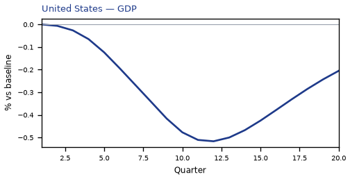

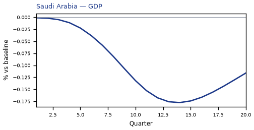

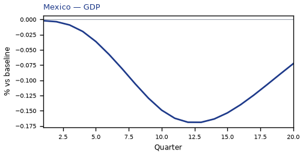


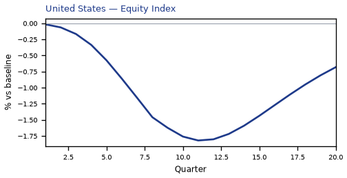

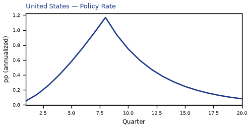

## US — United States

The main impact of a 200 basis-point (2.00 percentage-point) rise in United States interest rates on the United States would be a large drop in GDP of 0.52% by Q12. Equities peak at -1.82% in Q11.

Demand and trade. Consumption peaks at -0.33 % vs baseline in Q12, from -0.01 in Q1 to -0.15 in Q20. Investment peaks at -2.78 % vs baseline in Q8, from -0.07 in Q1 to -0.66 in Q20. Net Exports peaks at -0.03 % vs baseline in Q19, from -0.00 in Q1 to -0.03 in Q20. Gov Spending peaks at +0.10 % vs baseline in Q12, from +0.00 in Q1 to +0.04 in Q20. Gov Debt peaks at -0.10 % vs baseline in Q14, from +0.00 in Q1 to -0.06 in Q20.

External / FX. The real exchange rate shows real appreciation (a stronger home currency). Real Exchange Rate peaks at -0.78 % vs baseline in Q14, from -0.01 in Q1 to -0.70 in Q20.

Labour. Employment peaks at -0.54 % vs baseline in Q14, from +0.00 in Q1 to -0.35 in Q20. Unemployment peaks at +0.31 pp in Q15, from +0.00 in Q1 to +0.24 in Q20. Real Wages peaks at -0.54 % vs baseline in Q20, from +0.00 in Q1 to -0.54 in Q20.

Prices. The three-year CPI impulse is -0.25 percentage points. CPI Inflation peaks at -0.04 pp in Q11, from -0.00 in Q1 to -0.01 in Q20. Domestic Infl. peaks at -0.03 pp in Q11, from -0.00 in Q1 to -0.01 in Q20. Marginal Cost peaks at -0.31 % vs baseline in Q12, from +0.00 in Q1 to -0.12 in Q20.

Financial conditions. Policy Rate peaks at +1.17 pp (annualized) in Q8, from +0.05 in Q1 to +0.08 in Q20. Real Rate peaks at +0.29 pp (annualized) in Q8, from +0.01 in Q1 to +0.02 in Q20. Govt 3M Yield peaks at +1.17 pp (annualized) in Q8, from +0.05 in Q1 to +0.08 in Q20. Govt 2Y Yield peaks at +0.78 pp (annualized) in Q5, from +0.54 in Q1 to +0.04 in Q20. Govt 5Y Yield peaks at +0.43 pp (annualized) in Q2, from +0.43 in Q1 to +0.02 in Q20. Govt 10Y Yield peaks at +0.22 pp (annualized) in Q1, from +0.22 in Q1 to +0.01 in Q20. Govt 30Y Yield peaks at +0.08 pp (annualized) in Q1, from +0.08 in Q1 to +0.00 in Q20. Bond Price (7y) peaks at -7.68 % vs baseline in Q8, from -0.33 in Q1 to -0.53 in Q20. Bond Price 3M peaks at -0.29 % vs baseline in Q8, from -0.01 in Q1 to -0.02 in Q20. Bond Price 2Y peaks at -1.48 % vs baseline in Q5, from -1.03 in Q1 to -0.08 in Q20. Bond Price 5Y peaks at -1.96 % vs baseline in Q2, from -1.95 in Q1 to -0.09 in Q20. Bond Price 10Y peaks at -1.84 % vs baseline in Q1, from -1.84 in Q1 to -0.09 in Q20. Bond Price 30Y peaks at -1.36 % vs baseline in Q1, from -1.36 in Q1 to -0.07 in Q20. Equity Index peaks at -1.82 % vs baseline in Q11, from -0.02 in Q1 to -0.68 in Q20. VIX peaks at +16.29 index_level in Q11, from +15.01 in Q1 to +15.49 in Q20. Tobin's Q peaks at -1.95 % vs baseline in Q8, from -0.05 in Q1 to -0.46 in Q20. House Prices peaks at -0.53 % vs baseline in Q19, from -0.00 in Q1 to -0.52 in Q20. Bank Equity peaks at -0.19 % vs baseline in Q18, from +0.00 in Q1 to -0.18 in Q20. Bank Credit peaks at -0.15 % vs baseline in Q18, from +0.00 in Q1 to -0.15 in Q20. Credit Spread peaks at +0.00 pp in Q18, from +0.00 in Q1 to +0.00 in Q20.

Nominal FX. NEER peaks at +1.38 % vs baseline in Q12, from +0.16 in Q1 to +1.07 in Q20. vs USD peaks at +1.38 % vs baseline in Q12, from +0.16 in Q1 to +1.07 in Q20.

Commodities. Energy Price peaks at +80.00 USD/bbl (level) in Q1, from +80.00 in Q1 to +79.82 in Q20. Metals Price peaks at +100.00 index (level) in Q1, from +100.00 in Q1 to +99.93 in Q20. Food Price peaks at +100.00 index (level) in Q1, from +100.00 in Q1 to +99.85 in Q20. Gas Price peaks at +4.00 USD/mmBtu (level) in Q1, from +4.00 in Q1 to +3.99 in Q20. Copper Price peaks at +100.00 index (level) in Q1, from +100.00 in Q1 to +99.95 in Q20. Wheat Price peaks at +100.00 index (level) in Q1, from +100.00 in Q1 to +99.96 in Q20. Gold Price peaks at +2044.24 USD/oz (level) in Q12, from +1997.97 in Q1 to +2016.01 in Q20.

Sectoral and capital. Manuf. GDP peaks at +0.18 % vs baseline in Q20, from +0.00 in Q1 to +0.18 in Q20. Services GDP peaks at -0.40 % vs baseline in Q12, from +0.00 in Q1 to -0.16 in Q20. Capital Stock peaks at -0.15 % vs baseline in Q20, from -0.00 in Q1 to -0.15 in Q20.

Timing. By Q20 GDP is still -0.21% from baseline.

These figures are model IRFs versus baseline, not forecasts.


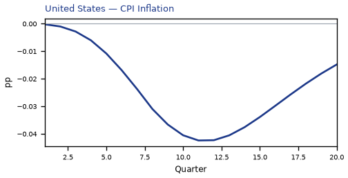


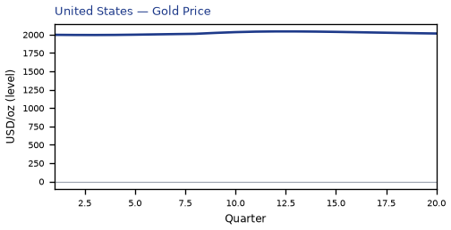


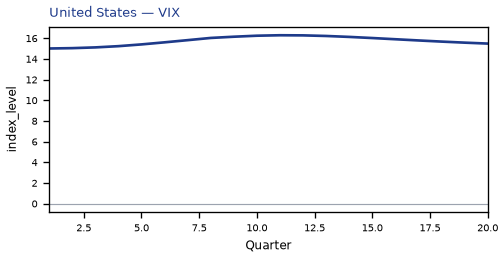

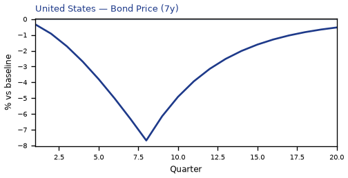

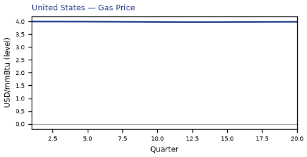

[Q1–Q20 JSON for United States](numbers/US.json)

## SA — Saudi Arabia

The main impact of a 200 basis-point (2.00 percentage-point) rise in United States interest rates on Saudi Arabia would be a moderate drop in GDP of 0.18% by Q14. Equities peak at -0.76% in Q13.

Demand and trade. Consumption peaks at -0.09 % vs baseline in Q8, from -0.01 in Q1 to -0.07 in Q20. Investment peaks at -2.00 % vs baseline in Q8, from -0.08 in Q1 to -0.43 in Q20. Net Exports peaks at -0.17 % vs baseline in Q13, from -0.00 in Q1 to -0.11 in Q20. Gov Spending peaks at -0.02 % vs baseline in Q12, from +0.00 in Q1 to -0.00 in Q20. Gov Debt peaks at -0.26 % vs baseline in Q20, from +0.00 in Q1 to -0.26 in Q20.

External / FX. The real exchange rate shows real appreciation (a stronger home currency). Real Exchange Rate peaks at -0.55 % vs baseline in Q14, from -0.00 in Q1 to -0.50 in Q20.

Labour. Employment peaks at -0.16 % vs baseline in Q18, from +0.00 in Q1 to -0.15 in Q20. Unemployment peaks at +0.06 pp in Q17, from +0.00 in Q1 to +0.06 in Q20. Real Wages peaks at -0.21 % vs baseline in Q20, from +0.00 in Q1 to -0.21 in Q20.

Prices. The three-year CPI impulse is -0.19 percentage points. CPI Inflation peaks at -0.03 pp in Q9, from -0.00 in Q1 to -0.00 in Q20. Domestic Infl. peaks at -0.02 pp in Q9, from -0.00 in Q1 to -0.00 in Q20. Marginal Cost peaks at -0.11 % vs baseline in Q14, from -0.00 in Q1 to -0.07 in Q20.

Financial conditions. Policy Rate peaks at +1.17 pp (annualized) in Q8, from +0.05 in Q1 to +0.08 in Q20. Real Rate peaks at +0.29 pp (annualized) in Q8, from +0.01 in Q1 to +0.02 in Q20. Govt 3M Yield peaks at +1.17 pp (annualized) in Q8, from +0.05 in Q1 to +0.08 in Q20. Govt 2Y Yield peaks at +0.78 pp (annualized) in Q5, from +0.54 in Q1 to +0.04 in Q20. Govt 5Y Yield peaks at +0.43 pp (annualized) in Q2, from +0.43 in Q1 to +0.02 in Q20. Govt 10Y Yield peaks at +0.22 pp (annualized) in Q1, from +0.22 in Q1 to +0.01 in Q20. Govt 30Y Yield peaks at +0.08 pp (annualized) in Q1, from +0.08 in Q1 to +0.00 in Q20. Bond Price (7y) peaks at -5.84 % vs baseline in Q8, from -0.25 in Q1 to -0.40 in Q20. Bond Price 3M peaks at -0.29 % vs baseline in Q8, from -0.01 in Q1 to -0.02 in Q20. Bond Price 2Y peaks at -1.48 % vs baseline in Q5, from -1.03 in Q1 to -0.08 in Q20. Bond Price 5Y peaks at -1.96 % vs baseline in Q2, from -1.95 in Q1 to -0.09 in Q20. Bond Price 10Y peaks at -1.84 % vs baseline in Q1, from -1.84 in Q1 to -0.09 in Q20. Bond Price 30Y peaks at -1.36 % vs baseline in Q1, from -1.36 in Q1 to -0.07 in Q20. Equity Index peaks at -0.76 % vs baseline in Q13, from -0.01 in Q1 to -0.47 in Q20. VIX peaks at +16.29 index_level in Q11, from +15.01 in Q1 to +15.49 in Q20. Tobin's Q peaks at -1.40 % vs baseline in Q8, from -0.05 in Q1 to -0.30 in Q20. House Prices peaks at -0.29 % vs baseline in Q19, from -0.00 in Q1 to -0.29 in Q20. Bank Equity peaks at -0.03 % vs baseline in Q18, from +0.00 in Q1 to -0.02 in Q20. Bank Credit peaks at -0.02 % vs baseline in Q18, from +0.00 in Q1 to -0.02 in Q20. Credit Spread peaks at +0.00 pp in Q18, from +0.00 in Q1 to +0.00 in Q20.

Nominal FX. NEER peaks at +0.69 % vs baseline in Q11, from +0.12 in Q1 to +0.53 in Q20. vs USD peaks at +0.23 % vs baseline in Q14, from +0.00 in Q1 to +0.20 in Q20.

Commodities. Energy Price peaks at +80.00 USD/bbl (level) in Q1, from +80.00 in Q1 to +79.82 in Q20. Metals Price peaks at +100.00 index (level) in Q1, from +100.00 in Q1 to +99.93 in Q20. Food Price peaks at +100.00 index (level) in Q1, from +100.00 in Q1 to +99.85 in Q20. Gas Price peaks at +4.00 USD/mmBtu (level) in Q1, from +4.00 in Q1 to +3.99 in Q20. Copper Price peaks at +100.00 index (level) in Q1, from +100.00 in Q1 to +99.95 in Q20. Wheat Price peaks at +100.00 index (level) in Q1, from +100.00 in Q1 to +99.96 in Q20. Gold Price peaks at +2044.24 USD/oz (level) in Q12, from +1997.97 in Q1 to +2016.01 in Q20.

Sectoral and capital. Manuf. GDP peaks at +0.14 % vs baseline in Q14, from +0.00 in Q1 to +0.13 in Q20. Services GDP peaks at -0.08 % vs baseline in Q14, from -0.00 in Q1 to -0.05 in Q20. Capital Stock peaks at -0.09 % vs baseline in Q20, from -0.00 in Q1 to -0.09 in Q20.

Timing. By Q20 GDP is still -0.12% from baseline.

These figures are model IRFs versus baseline, not forecasts.


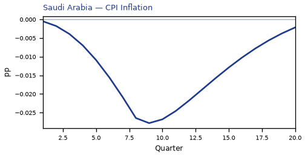

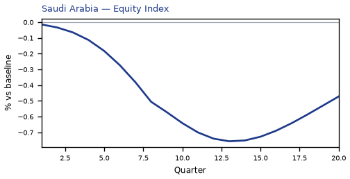


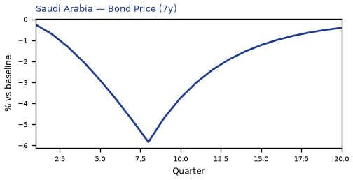


[Q1–Q20 JSON for Saudi Arabia](numbers/SA.json)

## MX — Mexico

The main impact of a 200 basis-point (2.00 percentage-point) rise in United States interest rates on Mexico would be a moderate drop in GDP of 0.17% by Q13. Equities peak at -0.49% in Q8.

Demand and trade. Consumption peaks at -0.09 % vs baseline in Q13, from -0.01 in Q1 to -0.05 in Q20. Investment peaks at -0.62 % vs baseline in Q10, from -0.06 in Q1 to -0.06 in Q20. Net Exports peaks at +0.20 % vs baseline in Q10, from +0.03 in Q1 to +0.12 in Q20. Gov Spending peaks at +0.03 % vs baseline in Q12, from +0.00 in Q1 to +0.01 in Q20. Gov Debt peaks at -0.19 % vs baseline in Q20, from +0.00 in Q1 to -0.19 in Q20.

External / FX. The real exchange rate shows real depreciation (a weaker, more competitive home currency). Real Exchange Rate peaks at +1.11 % vs baseline in Q10, from +0.17 in Q1 to +0.66 in Q20.

Labour. Employment peaks at -0.13 % vs baseline in Q17, from +0.00 in Q1 to -0.12 in Q20. Unemployment peaks at +0.01 pp in Q14, from +0.00 in Q1 to +0.01 in Q20. Real Wages peaks at +0.15 % vs baseline in Q12, from +0.00 in Q1 to -0.02 in Q20.

Prices. The three-year CPI impulse is +0.40 percentage points. CPI Inflation peaks at +0.06 pp in Q2, from +0.04 in Q1 to -0.02 in Q20. Domestic Infl. peaks at +0.04 pp in Q2, from +0.03 in Q1 to -0.01 in Q20. Marginal Cost peaks at -0.10 % vs baseline in Q13, from -0.00 in Q1 to -0.04 in Q20.

Financial conditions. Policy Rate peaks at +0.17 pp (annualized) in Q8, from +0.04 in Q1 to -0.08 in Q20. Real Rate peaks at +0.04 pp (annualized) in Q8, from +0.01 in Q1 to -0.02 in Q20. Govt 3M Yield peaks at +0.17 pp (annualized) in Q8, from +0.04 in Q1 to -0.08 in Q20. Govt 2Y Yield peaks at +0.14 pp (annualized) in Q3, from +0.12 in Q1 to -0.07 in Q20. Govt 5Y Yield peaks at -0.06 pp (annualized) in Q15, from +0.05 in Q1 to -0.05 in Q20. Govt 10Y Yield peaks at -0.04 pp (annualized) in Q14, from -0.00 in Q1 to -0.03 in Q20. Govt 30Y Yield peaks at -0.01 pp (annualized) in Q13, from -0.00 in Q1 to -0.01 in Q20. Bond Price (7y) peaks at -0.69 % vs baseline in Q8, from -0.16 in Q1 to +0.35 in Q20. Bond Price 3M peaks at -0.04 % vs baseline in Q8, from -0.01 in Q1 to +0.02 in Q20. Bond Price 2Y peaks at -0.27 % vs baseline in Q3, from -0.24 in Q1 to +0.14 in Q20. Bond Price 5Y peaks at +0.28 % vs baseline in Q15, from -0.22 in Q1 to +0.24 in Q20. Bond Price 10Y peaks at +0.34 % vs baseline in Q14, from +0.01 in Q1 to +0.27 in Q20. Bond Price 30Y peaks at +0.24 % vs baseline in Q13, from +0.07 in Q1 to +0.17 in Q20. Equity Index peaks at -0.49 % vs baseline in Q8, from -0.02 in Q1 to -0.14 in Q20. VIX peaks at +16.29 index_level in Q11, from +15.01 in Q1 to +15.49 in Q20. Tobin's Q peaks at -0.44 % vs baseline in Q10, from -0.04 in Q1 to -0.04 in Q20. House Prices peaks at -0.21 % vs baseline in Q18, from -0.00 in Q1 to -0.20 in Q20. Bank Equity peaks at -0.03 % vs baseline in Q18, from +0.00 in Q1 to -0.03 in Q20. Bank Credit peaks at -0.03 % vs baseline in Q18, from +0.00 in Q1 to -0.02 in Q20. Credit Spread peaks at +0.00 pp in Q18, from +0.00 in Q1 to +0.00 in Q20.

Nominal FX. NEER peaks at -1.26 % vs baseline in Q11, from -0.10 in Q1 to -0.90 in Q20. vs USD peaks at +1.82 % vs baseline in Q11, from +0.18 in Q1 to +1.36 in Q20.

Commodities. Energy Price peaks at +80.00 USD/bbl (level) in Q1, from +80.00 in Q1 to +79.82 in Q20. Metals Price peaks at +100.00 index (level) in Q1, from +100.00 in Q1 to +99.93 in Q20. Food Price peaks at +100.00 index (level) in Q1, from +100.00 in Q1 to +99.85 in Q20. Gas Price peaks at +4.00 USD/mmBtu (level) in Q1, from +4.00 in Q1 to +3.99 in Q20. Copper Price peaks at +100.00 index (level) in Q1, from +100.00 in Q1 to +99.95 in Q20. Wheat Price peaks at +100.00 index (level) in Q1, from +100.00 in Q1 to +99.96 in Q20. Gold Price peaks at +2044.24 USD/oz (level) in Q12, from +1997.97 in Q1 to +2016.01 in Q20.

Sectoral and capital. Manuf. GDP peaks at -0.36 % vs baseline in Q10, from -0.05 in Q1 to -0.21 in Q20. Services GDP peaks at -0.10 % vs baseline in Q13, from -0.00 in Q1 to -0.04 in Q20. Capital Stock peaks at -0.03 % vs baseline in Q20, from -0.00 in Q1 to -0.03 in Q20.

Timing. By Q20 GDP is still -0.07% from baseline.

These figures are model IRFs versus baseline, not forecasts.


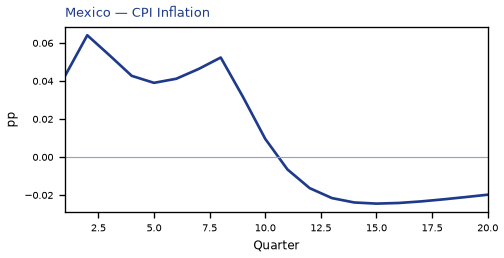

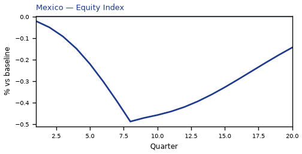


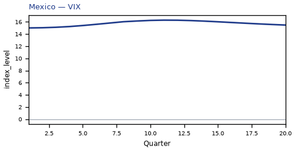


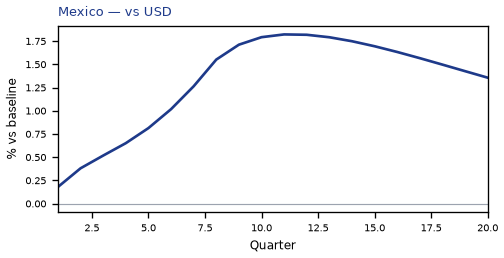

[Q1–Q20 JSON for Mexico](numbers/MX.json)

## CA — Canada

The main impact of a 200 basis-point (2.00 percentage-point) rise in United States interest rates on Canada would be a moderate drop in GDP of 0.15% by Q12. Equities peak at -0.50% in Q10.

Demand and trade. Consumption peaks at -0.09 % vs baseline in Q13, from -0.01 in Q1 to -0.04 in Q20. Investment peaks at -0.57 % vs baseline in Q10, from -0.05 in Q1 to -0.01 in Q20. Net Exports peaks at +0.20 % vs baseline in Q9, from +0.04 in Q1 to +0.11 in Q20. Gov Spending peaks at +0.02 % vs baseline in Q12, from +0.00 in Q1 to +0.01 in Q20. Gov Debt peaks at -0.03 % vs baseline in Q19, from +0.00 in Q1 to -0.03 in Q20.

External / FX. The real exchange rate shows real depreciation (a weaker, more competitive home currency). Real Exchange Rate peaks at +1.43 % vs baseline in Q10, from +0.23 in Q1 to +0.82 in Q20.

Labour. Employment peaks at -0.14 % vs baseline in Q15, from +0.00 in Q1 to -0.11 in Q20. Unemployment peaks at +0.09 pp in Q15, from +0.00 in Q1 to +0.07 in Q20. Real Wages peaks at +0.19 % vs baseline in Q13, from +0.00 in Q1 to +0.09 in Q20.

Prices. The three-year CPI impulse is +0.46 percentage points. CPI Inflation peaks at +0.08 pp in Q2, from +0.05 in Q1 to -0.02 in Q20. Domestic Infl. peaks at +0.05 pp in Q2, from +0.04 in Q1 to -0.01 in Q20. Marginal Cost peaks at -0.09 % vs baseline in Q12, from -0.00 in Q1 to -0.04 in Q20.

Financial conditions. Policy Rate peaks at +0.16 pp (annualized) in Q8, from +0.03 in Q1 to -0.10 in Q20. Real Rate peaks at +0.04 pp (annualized) in Q8, from +0.01 in Q1 to -0.03 in Q20. Govt 3M Yield peaks at +0.16 pp (annualized) in Q8, from +0.03 in Q1 to -0.10 in Q20. Govt 2Y Yield peaks at +0.14 pp (annualized) in Q3, from +0.12 in Q1 to -0.09 in Q20. Govt 5Y Yield peaks at -0.08 pp (annualized) in Q15, from +0.04 in Q1 to -0.07 in Q20. Govt 10Y Yield peaks at -0.05 pp (annualized) in Q14, from -0.01 in Q1 to -0.04 in Q20. Govt 30Y Yield peaks at -0.02 pp (annualized) in Q14, from -0.01 in Q1 to -0.01 in Q20. Bond Price (7y) peaks at -0.93 % vs baseline in Q8, from -0.20 in Q1 to +0.60 in Q20. Bond Price 3M peaks at -0.04 % vs baseline in Q8, from -0.01 in Q1 to +0.03 in Q20. Bond Price 2Y peaks at -0.26 % vs baseline in Q3, from -0.23 in Q1 to +0.17 in Q20. Bond Price 5Y peaks at +0.35 % vs baseline in Q15, from -0.19 in Q1 to +0.30 in Q20. Bond Price 10Y peaks at +0.41 % vs baseline in Q14, from +0.09 in Q1 to +0.33 in Q20. Bond Price 30Y peaks at +0.31 % vs baseline in Q14, from +0.10 in Q1 to +0.25 in Q20. Equity Index peaks at -0.50 % vs baseline in Q10, from -0.01 in Q1 to -0.17 in Q20. VIX peaks at +16.29 index_level in Q11, from +15.01 in Q1 to +15.49 in Q20. Tobin's Q peaks at -0.40 % vs baseline in Q10, from -0.04 in Q1 to -0.01 in Q20. House Prices peaks at -0.14 % vs baseline in Q18, from -0.00 in Q1 to -0.14 in Q20. Bank Equity peaks at -0.04 % vs baseline in Q18, from +0.00 in Q1 to -0.04 in Q20. Bank Credit peaks at -0.04 % vs baseline in Q18, from +0.00 in Q1 to -0.03 in Q20. Credit Spread peaks at +0.00 pp in Q18, from +0.00 in Q1 to +0.00 in Q20.

Nominal FX. NEER peaks at -1.63 % vs baseline in Q11, from -0.17 in Q1 to -1.12 in Q20. vs USD peaks at +2.14 % vs baseline in Q11, from +0.23 in Q1 to +1.52 in Q20.

Commodities. Energy Price peaks at +80.00 USD/bbl (level) in Q1, from +80.00 in Q1 to +79.82 in Q20. Metals Price peaks at +100.00 index (level) in Q1, from +100.00 in Q1 to +99.93 in Q20. Food Price peaks at +100.00 index (level) in Q1, from +100.00 in Q1 to +99.85 in Q20. Gas Price peaks at +4.00 USD/mmBtu (level) in Q1, from +4.00 in Q1 to +3.99 in Q20. Copper Price peaks at +100.00 index (level) in Q1, from +100.00 in Q1 to +99.95 in Q20. Wheat Price peaks at +100.00 index (level) in Q1, from +100.00 in Q1 to +99.96 in Q20. Gold Price peaks at +2044.24 USD/oz (level) in Q12, from +1997.97 in Q1 to +2016.01 in Q20.

Sectoral and capital. Manuf. GDP peaks at -0.45 % vs baseline in Q10, from -0.07 in Q1 to -0.25 in Q20. Services GDP peaks at -0.10 % vs baseline in Q12, from -0.00 in Q1 to -0.04 in Q20. Capital Stock peaks at -0.03 % vs baseline in Q20, from -0.00 in Q1 to -0.03 in Q20.

Timing. By Q20 GDP is still -0.06% from baseline.

These figures are model IRFs versus baseline, not forecasts.

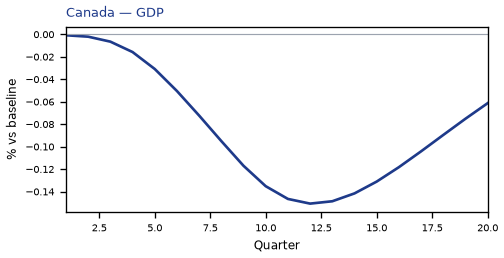

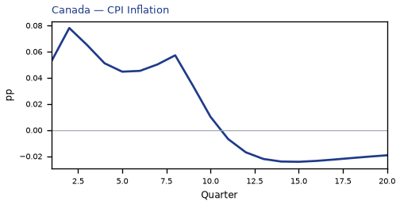

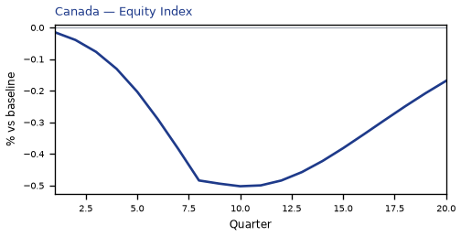


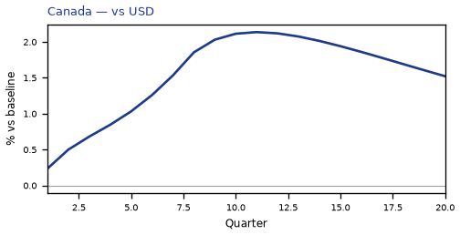

[Q1–Q20 JSON for Canada](numbers/CA.json)

## CO — Colombia

The main impact of a 200 basis-point (2.00 percentage-point) rise in United States interest rates on Colombia would be only a small drop in GDP of 0.08% by Q12. Equities peak at -0.39% in Q8.

Demand and trade. Consumption peaks at -0.04 % vs baseline in Q13, from -0.00 in Q1 to -0.01 in Q20. Investment peaks at -0.25 % vs baseline in Q9, from -0.03 in Q1 to +0.00 in Q20. Net Exports peaks at +0.08 % vs baseline in Q9, from +0.01 in Q1 to +0.03 in Q20. Gov Spending peaks at +0.01 % vs baseline in Q12, from +0.00 in Q1 to +0.00 in Q20. Gov Debt peaks at -0.07 % vs baseline in Q19, from +0.00 in Q1 to -0.07 in Q20.

External / FX. The real exchange rate shows real depreciation (a weaker, more competitive home currency). Real Exchange Rate peaks at +0.83 % vs baseline in Q10, from +0.14 in Q1 to +0.36 in Q20.

Labour. Employment peaks at -0.05 % vs baseline in Q16, from +0.00 in Q1 to -0.04 in Q20. Unemployment peaks at +0.01 pp in Q14, from +0.00 in Q1 to +0.00 in Q20. Real Wages peaks at +0.07 % vs baseline in Q11, from +0.00 in Q1 to -0.03 in Q20.

Prices. The three-year CPI impulse is +0.15 percentage points. CPI Inflation peaks at +0.03 pp in Q2, from +0.02 in Q1 to -0.01 in Q20. Domestic Infl. peaks at +0.02 pp in Q2, from +0.01 in Q1 to -0.01 in Q20. Marginal Cost peaks at -0.05 % vs baseline in Q12, from -0.00 in Q1 to -0.01 in Q20.

Financial conditions. Policy Rate peaks at +0.06 pp (annualized) in Q5, from +0.01 in Q1 to -0.04 in Q20. Real Rate peaks at +0.01 pp (annualized) in Q5, from +0.00 in Q1 to -0.01 in Q20. Govt 3M Yield peaks at +0.06 pp (annualized) in Q5, from +0.01 in Q1 to -0.04 in Q20. Govt 2Y Yield peaks at +0.05 pp (annualized) in Q3, from +0.05 in Q1 to -0.03 in Q20. Govt 5Y Yield peaks at -0.03 pp (annualized) in Q13, from +0.01 in Q1 to -0.02 in Q20. Govt 10Y Yield peaks at -0.01 pp (annualized) in Q12, from -0.00 in Q1 to -0.01 in Q20. Govt 30Y Yield peaks at -0.00 pp (annualized) in Q13, from -0.00 in Q1 to -0.00 in Q20. Bond Price (7y) peaks at -0.21 % vs baseline in Q5, from -0.05 in Q1 to +0.15 in Q20. Bond Price 3M peaks at -0.01 % vs baseline in Q5, from -0.00 in Q1 to +0.01 in Q20. Bond Price 2Y peaks at -0.10 % vs baseline in Q3, from -0.09 in Q1 to +0.06 in Q20. Bond Price 5Y peaks at +0.12 % vs baseline in Q13, from -0.04 in Q1 to +0.07 in Q20. Bond Price 10Y peaks at +0.12 % vs baseline in Q12, from +0.02 in Q1 to +0.07 in Q20. Bond Price 30Y peaks at +0.09 % vs baseline in Q13, from +0.01 in Q1 to +0.05 in Q20. Equity Index peaks at -0.39 % vs baseline in Q8, from -0.02 in Q1 to -0.06 in Q20. VIX peaks at +16.29 index_level in Q11, from +15.01 in Q1 to +15.49 in Q20. Tobin's Q peaks at -0.18 % vs baseline in Q9, from -0.02 in Q1 to +0.00 in Q20. House Prices peaks at -0.08 % vs baseline in Q17, from -0.00 in Q1 to -0.08 in Q20. Bank Equity peaks at -0.01 % vs baseline in Q18, from +0.00 in Q1 to -0.01 in Q20. Bank Credit peaks at -0.01 % vs baseline in Q18, from +0.00 in Q1 to -0.01 in Q20. Credit Spread peaks at +0.00 pp in Q18, from +0.00 in Q1 to +0.00 in Q20.

Nominal FX. NEER peaks at -0.68 % vs baseline in Q11, from -0.03 in Q1 to -0.37 in Q20. vs USD peaks at +1.54 % vs baseline in Q11, from +0.14 in Q1 to +1.06 in Q20.

Commodities. Energy Price peaks at +80.00 USD/bbl (level) in Q1, from +80.00 in Q1 to +79.82 in Q20. Metals Price peaks at +100.00 index (level) in Q1, from +100.00 in Q1 to +99.93 in Q20. Food Price peaks at +100.00 index (level) in Q1, from +100.00 in Q1 to +99.85 in Q20. Gas Price peaks at +4.00 USD/mmBtu (level) in Q1, from +4.00 in Q1 to +3.99 in Q20. Copper Price peaks at +100.00 index (level) in Q1, from +100.00 in Q1 to +99.95 in Q20. Wheat Price peaks at +100.00 index (level) in Q1, from +100.00 in Q1 to +99.96 in Q20. Gold Price peaks at +2044.24 USD/oz (level) in Q12, from +1997.97 in Q1 to +2016.01 in Q20.

Sectoral and capital. Manuf. GDP peaks at -0.26 % vs baseline in Q10, from -0.04 in Q1 to -0.11 in Q20. Services GDP peaks at -0.05 % vs baseline in Q12, from -0.00 in Q1 to -0.01 in Q20. Capital Stock peaks at -0.01 % vs baseline in Q19, from -0.00 in Q1 to -0.01 in Q20.

Timing. By Q20 GDP is still -0.02% from baseline.

These figures are model IRFs versus baseline, not forecasts.

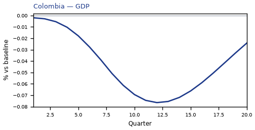

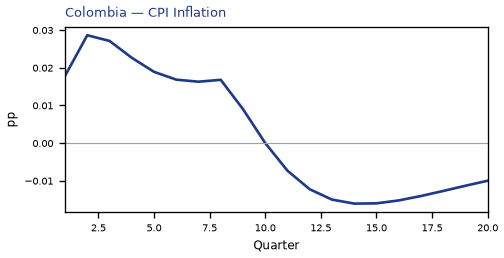

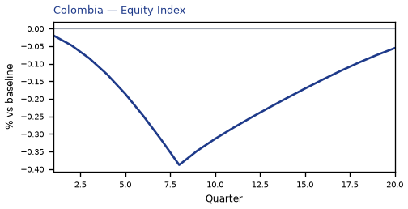


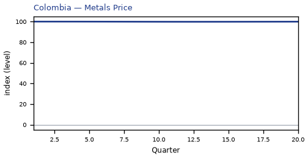


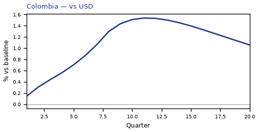

[Q1–Q20 JSON for Colombia](numbers/CO.json)

## AR — Argentina

The main impact of a 200 basis-point (2.00 percentage-point) rise in United States interest rates on Argentina would be only a small drop in GDP of 0.07% by Q10. Equities peak at -0.58% in Q8.

Demand and trade. Consumption peaks at -0.03 % vs baseline in Q10, from -0.00 in Q1 to +0.02 in Q20. Investment peaks at -0.17 % vs baseline in Q8, from -0.04 in Q1 to +0.10 in Q20. Net Exports peaks at +0.02 % vs baseline in Q4, from +0.01 in Q1 to -0.02 in Q20. Gov Spending peaks at +0.01 % vs baseline in Q10, from +0.00 in Q1 to -0.01 in Q20. Gov Debt peaks at -0.02 % vs baseline in Q15, from +0.00 in Q1 to -0.01 in Q20.

External / FX. The real exchange rate shows real depreciation (a weaker, more competitive home currency). Real Exchange Rate peaks at +0.33 % vs baseline in Q8, from +0.19 in Q1 to -0.05 in Q20.

Labour. Employment peaks at -0.03 % vs baseline in Q13, from +0.00 in Q1 to +0.01 in Q20. Unemployment peaks at +0.01 pp in Q12, from +0.00 in Q1 to -0.00 in Q20. Real Wages peaks at -0.07 % vs baseline in Q18, from +0.00 in Q1 to -0.07 in Q20.

Prices. The three-year CPI impulse is -0.02 percentage points. CPI Inflation peaks at +0.02 pp in Q1, from +0.02 in Q1 to +0.00 in Q20. Domestic Infl. peaks at +0.01 pp in Q1, from +0.01 in Q1 to +0.00 in Q20. Marginal Cost peaks at -0.04 % vs baseline in Q10, from -0.00 in Q1 to +0.02 in Q20.

Financial conditions. Policy Rate peaks at -0.06 pp (annualized) in Q12, from +0.02 in Q1 to +0.01 in Q20. Real Rate peaks at -0.01 pp (annualized) in Q12, from +0.01 in Q1 to +0.00 in Q20. Govt 3M Yield peaks at -0.06 pp (annualized) in Q12, from +0.02 in Q1 to +0.01 in Q20. Govt 2Y Yield peaks at -0.04 pp (annualized) in Q9, from +0.01 in Q1 to +0.03 in Q20. Govt 5Y Yield peaks at +0.02 pp (annualized) in Q19, from -0.01 in Q1 to +0.02 in Q20. Govt 10Y Yield peaks at +0.01 pp (annualized) in Q19, from +0.00 in Q1 to +0.01 in Q20. Govt 30Y Yield peaks at +0.00 pp (annualized) in Q19, from +0.00 in Q1 to +0.00 in Q20. Bond Price (7y) peaks at -0.14 % vs baseline in Q8, from -0.06 in Q1 to -0.04 in Q20. Bond Price 3M peaks at +0.01 % vs baseline in Q12, from -0.01 in Q1 to -0.00 in Q20. Bond Price 2Y peaks at +0.08 % vs baseline in Q9, from -0.02 in Q1 to -0.06 in Q20. Bond Price 5Y peaks at -0.10 % vs baseline in Q19, from +0.06 in Q1 to -0.10 in Q20. Bond Price 10Y peaks at -0.08 % vs baseline in Q19, from -0.04 in Q1 to -0.08 in Q20. Bond Price 30Y peaks at -0.05 % vs baseline in Q19, from -0.01 in Q1 to -0.05 in Q20. Equity Index peaks at -0.58 % vs baseline in Q8, from -0.03 in Q1 to +0.04 in Q20. VIX peaks at +16.29 index_level in Q11, from +15.01 in Q1 to +15.49 in Q20. Tobin's Q peaks at -0.12 % vs baseline in Q8, from -0.03 in Q1 to +0.07 in Q20. House Prices peaks at -0.06 % vs baseline in Q14, from -0.00 in Q1 to -0.03 in Q20. Bank Equity peaks at -0.00 % vs baseline in Q17, from +0.00 in Q1 to -0.00 in Q20. Bank Credit peaks at -0.01 % vs baseline in Q18, from +0.00 in Q1 to -0.01 in Q20. Credit Spread peaks at +0.00 pp in Q17, from +0.00 in Q1 to +0.00 in Q20.

Nominal FX. NEER peaks at +0.14 % vs baseline in Q19, from -0.07 in Q1 to +0.14 in Q20. vs USD peaks at +0.93 % vs baseline in Q11, from +0.19 in Q1 to +0.65 in Q20.

Commodities. Energy Price peaks at +80.00 USD/bbl (level) in Q1, from +80.00 in Q1 to +79.82 in Q20. Metals Price peaks at +100.00 index (level) in Q1, from +100.00 in Q1 to +99.93 in Q20. Food Price peaks at +100.00 index (level) in Q1, from +100.00 in Q1 to +99.85 in Q20. Gas Price peaks at +4.00 USD/mmBtu (level) in Q1, from +4.00 in Q1 to +3.99 in Q20. Copper Price peaks at +100.00 index (level) in Q1, from +100.00 in Q1 to +99.95 in Q20. Wheat Price peaks at +100.00 index (level) in Q1, from +100.00 in Q1 to +99.96 in Q20. Gold Price peaks at +2044.24 USD/oz (level) in Q12, from +1997.97 in Q1 to +2016.01 in Q20.

Sectoral and capital. Manuf. GDP peaks at -0.11 % vs baseline in Q8, from -0.06 in Q1 to +0.03 in Q20. Services GDP peaks at -0.04 % vs baseline in Q10, from -0.00 in Q1 to +0.02 in Q20. Capital Stock peaks at -0.01 % vs baseline in Q14, from -0.00 in Q1 to -0.01 in Q20.

Timing. The GDP response has mostly faded by Q16 (Q20 is +0.04%).

These figures are model IRFs versus baseline, not forecasts.

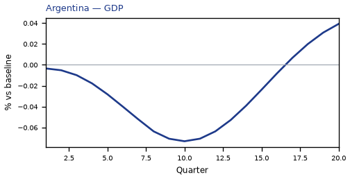

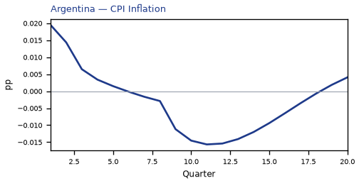

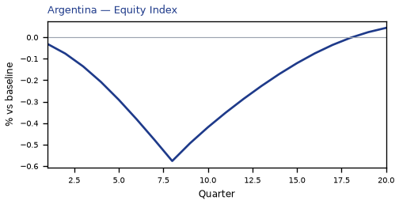


[Q1–Q20 JSON for Argentina](numbers/AR.json)

## BR — Brazil

The main impact of a 200 basis-point (2.00 percentage-point) rise in United States interest rates on Brazil would be only a small drop in GDP of 0.07% by Q12. Equities peak at -0.45% in Q8.

Demand and trade. Consumption peaks at -0.03 % vs baseline in Q13, from -0.00 in Q1 to -0.01 in Q20. Investment peaks at -0.22 % vs baseline in Q9, from -0.02 in Q1 to +0.03 in Q20. Net Exports peaks at +0.03 % vs baseline in Q8, from +0.01 in Q1 to +0.01 in Q20. Gov Spending peaks at +0.01 % vs baseline in Q11, from +0.00 in Q1 to +0.00 in Q20. Gov Debt peaks at -0.01 % vs baseline in Q19, from +0.00 in Q1 to -0.01 in Q20.

External / FX. The real exchange rate shows real depreciation (a weaker, more competitive home currency). Real Exchange Rate peaks at +0.70 % vs baseline in Q10, from +0.11 in Q1 to +0.31 in Q20.

Labour. Employment peaks at -0.04 % vs baseline in Q16, from +0.00 in Q1 to -0.03 in Q20. Unemployment peaks at +0.01 pp in Q14, from +0.00 in Q1 to +0.01 in Q20. Real Wages peaks at -0.04 % vs baseline in Q20, from +0.00 in Q1 to -0.04 in Q20.

Prices. The three-year CPI impulse is +0.08 percentage points. CPI Inflation peaks at +0.01 pp in Q2, from +0.01 in Q1 to -0.01 in Q20. Domestic Infl. peaks at +0.01 pp in Q2, from +0.01 in Q1 to -0.00 in Q20. Marginal Cost peaks at -0.04 % vs baseline in Q12, from -0.00 in Q1 to -0.01 in Q20.

Financial conditions. Policy Rate peaks at -0.05 pp (annualized) in Q16, from +0.01 in Q1 to -0.04 in Q20. Real Rate peaks at -0.01 pp (annualized) in Q16, from +0.00 in Q1 to -0.01 in Q20. Govt 3M Yield peaks at -0.05 pp (annualized) in Q16, from +0.01 in Q1 to -0.04 in Q20. Govt 2Y Yield peaks at -0.04 pp (annualized) in Q14, from +0.04 in Q1 to -0.02 in Q20. Govt 5Y Yield peaks at -0.02 pp (annualized) in Q11, from -0.00 in Q1 to -0.01 in Q20. Govt 10Y Yield peaks at -0.01 pp (annualized) in Q11, from -0.00 in Q1 to -0.00 in Q20. Govt 30Y Yield peaks at -0.00 pp (annualized) in Q11, from -0.00 in Q1 to -0.00 in Q20. Bond Price (7y) peaks at -0.24 % vs baseline in Q8, from -0.04 in Q1 to +0.15 in Q20. Bond Price 3M peaks at +0.01 % vs baseline in Q16, from -0.00 in Q1 to +0.01 in Q20. Bond Price 2Y peaks at +0.08 % vs baseline in Q14, from -0.07 in Q1 to +0.04 in Q20. Bond Price 5Y peaks at +0.11 % vs baseline in Q11, from +0.01 in Q1 to +0.03 in Q20. Bond Price 10Y peaks at +0.09 % vs baseline in Q11, from +0.03 in Q1 to +0.02 in Q20. Bond Price 30Y peaks at +0.06 % vs baseline in Q11, from +0.01 in Q1 to +0.01 in Q20. Equity Index peaks at -0.45 % vs baseline in Q8, from -0.02 in Q1 to -0.04 in Q20. VIX peaks at +16.29 index_level in Q11, from +15.01 in Q1 to +15.49 in Q20. Tobin's Q peaks at -0.15 % vs baseline in Q9, from -0.01 in Q1 to +0.02 in Q20. House Prices peaks at -0.07 % vs baseline in Q16, from -0.00 in Q1 to -0.06 in Q20. Bank Equity peaks at -0.01 % vs baseline in Q17, from +0.00 in Q1 to -0.01 in Q20. Bank Credit peaks at -0.01 % vs baseline in Q17, from +0.00 in Q1 to -0.01 in Q20. Credit Spread peaks at +0.00 pp in Q17, from +0.00 in Q1 to +0.00 in Q20.

Nominal FX. NEER peaks at -0.58 % vs baseline in Q11, from -0.01 in Q1 to -0.33 in Q20. vs USD peaks at +1.42 % vs baseline in Q12, from +0.12 in Q1 to +1.01 in Q20.

Commodities. Energy Price peaks at +80.00 USD/bbl (level) in Q1, from +80.00 in Q1 to +79.82 in Q20. Metals Price peaks at +100.00 index (level) in Q1, from +100.00 in Q1 to +99.93 in Q20. Food Price peaks at +100.00 index (level) in Q1, from +100.00 in Q1 to +99.85 in Q20. Gas Price peaks at +4.00 USD/mmBtu (level) in Q1, from +4.00 in Q1 to +3.99 in Q20. Copper Price peaks at +100.00 index (level) in Q1, from +100.00 in Q1 to +99.95 in Q20. Wheat Price peaks at +100.00 index (level) in Q1, from +100.00 in Q1 to +99.96 in Q20. Gold Price peaks at +2044.24 USD/oz (level) in Q12, from +1997.97 in Q1 to +2016.01 in Q20.

Sectoral and capital. Manuf. GDP peaks at -0.22 % vs baseline in Q10, from -0.03 in Q1 to -0.09 in Q20. Services GDP peaks at -0.05 % vs baseline in Q12, from -0.00 in Q1 to -0.01 in Q20. Capital Stock peaks at -0.01 % vs baseline in Q18, from -0.00 in Q1 to -0.01 in Q20.

Timing. The GDP response has mostly faded by Q20 (Q20 is -0.01%).

These figures are model IRFs versus baseline, not forecasts.

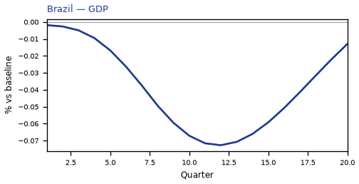

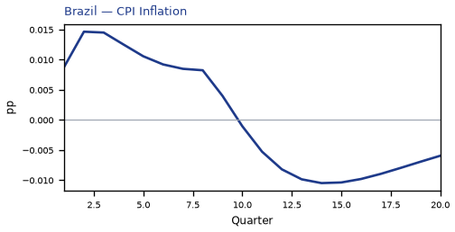

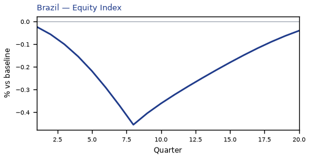


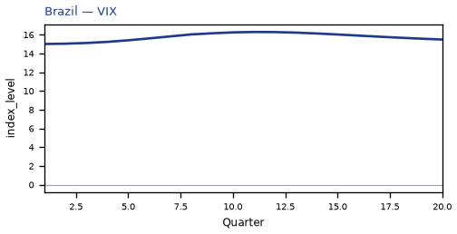

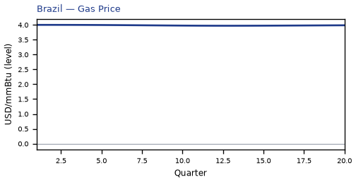

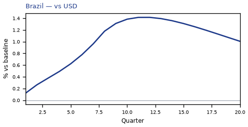

[Q1–Q20 JSON for Brazil](numbers/BR.json)

## UK — United Kingdom

The main impact of a 200 basis-point (2.00 percentage-point) rise in United States interest rates on United Kingdom would be only a small drop in GDP of 0.07% by Q11. Equities peak at -0.35% in Q8.

Demand and trade. Consumption peaks at -0.04 % vs baseline in Q11, from -0.00 in Q1 to -0.01 in Q20. Investment peaks at -0.20 % vs baseline in Q10, from -0.00 in Q1 to -0.03 in Q20. Net Exports peaks at +0.06 % vs baseline in Q9, from +0.01 in Q1 to +0.02 in Q20. Gov Spending peaks at +0.01 % vs baseline in Q11, from +0.00 in Q1 to +0.00 in Q20. Gov Debt peaks at -0.00 % vs baseline in Q13, from +0.00 in Q1 to -0.00 in Q20.

External / FX. The real exchange rate shows real depreciation (a weaker, more competitive home currency). Real Exchange Rate peaks at +0.53 % vs baseline in Q9, from +0.11 in Q1 to +0.14 in Q20.

Labour. Employment peaks at -0.06 % vs baseline in Q14, from +0.00 in Q1 to -0.03 in Q20. Unemployment peaks at +0.04 pp in Q14, from +0.00 in Q1 to +0.03 in Q20. Real Wages peaks at +0.04 % vs baseline in Q12, from +0.00 in Q1 to -0.01 in Q20.

Prices. The three-year CPI impulse is +0.08 percentage points. CPI Inflation peaks at +0.02 pp in Q3, from +0.01 in Q1 to -0.01 in Q20. Domestic Infl. peaks at +0.01 pp in Q3, from +0.01 in Q1 to -0.00 in Q20. Marginal Cost peaks at -0.04 % vs baseline in Q11, from -0.00 in Q1 to -0.01 in Q20.

Financial conditions. Policy Rate peaks at +0.01 pp (annualized) in Q8, from +0.00 in Q1 to -0.01 in Q20. Real Rate peaks at +0.00 pp (annualized) in Q8, from +0.00 in Q1 to -0.00 in Q20. Govt 3M Yield peaks at +0.01 pp (annualized) in Q8, from +0.00 in Q1 to -0.01 in Q20. Govt 2Y Yield peaks at +0.01 pp (annualized) in Q4, from +0.01 in Q1 to -0.01 in Q20. Govt 5Y Yield peaks at -0.01 pp (annualized) in Q19, from +0.00 in Q1 to -0.01 in Q20. Govt 10Y Yield peaks at -0.01 pp (annualized) in Q17, from -0.00 in Q1 to -0.01 in Q20. Govt 30Y Yield peaks at -0.00 pp (annualized) in Q15, from -0.00 in Q1 to -0.00 in Q20. Bond Price (7y) peaks at -0.69 % vs baseline in Q8, from -0.04 in Q1 to +0.04 in Q20. Bond Price 3M peaks at -0.00 % vs baseline in Q8, from -0.00 in Q1 to +0.00 in Q20. Bond Price 2Y peaks at -0.02 % vs baseline in Q4, from -0.01 in Q1 to +0.01 in Q20. Bond Price 5Y peaks at +0.03 % vs baseline in Q19, from -0.01 in Q1 to +0.03 in Q20. Bond Price 10Y peaks at +0.04 % vs baseline in Q17, from +0.01 in Q1 to +0.04 in Q20. Bond Price 30Y peaks at +0.04 % vs baseline in Q15, from +0.03 in Q1 to +0.04 in Q20. Equity Index peaks at -0.35 % vs baseline in Q8, from -0.01 in Q1 to -0.05 in Q20. VIX peaks at +16.29 index_level in Q11, from +15.01 in Q1 to +15.49 in Q20. Tobin's Q peaks at -0.14 % vs baseline in Q10, from -0.00 in Q1 to -0.02 in Q20. House Prices peaks at -0.05 % vs baseline in Q18, from -0.00 in Q1 to -0.05 in Q20. Bank Equity peaks at -0.03 % vs baseline in Q17, from +0.00 in Q1 to -0.03 in Q20. Bank Credit peaks at -0.03 % vs baseline in Q17, from +0.00 in Q1 to -0.03 in Q20. Credit Spread peaks at +0.00 pp in Q17, from +0.00 in Q1 to +0.00 in Q20.

Nominal FX. NEER peaks at -0.28 % vs baseline in Q9, from -0.03 in Q1 to +0.02 in Q20. vs USD peaks at +1.20 % vs baseline in Q11, from +0.11 in Q1 to +0.84 in Q20.

Commodities. Energy Price peaks at +80.00 USD/bbl (level) in Q1, from +80.00 in Q1 to +79.82 in Q20. Metals Price peaks at +100.00 index (level) in Q1, from +100.00 in Q1 to +99.93 in Q20. Food Price peaks at +100.00 index (level) in Q1, from +100.00 in Q1 to +99.85 in Q20. Gas Price peaks at +4.00 USD/mmBtu (level) in Q1, from +4.00 in Q1 to +3.99 in Q20. Copper Price peaks at +100.00 index (level) in Q1, from +100.00 in Q1 to +99.95 in Q20. Wheat Price peaks at +100.00 index (level) in Q1, from +100.00 in Q1 to +99.96 in Q20. Gold Price peaks at +2044.24 USD/oz (level) in Q12, from +1997.97 in Q1 to +2016.01 in Q20.

Sectoral and capital. Manuf. GDP peaks at -0.16 % vs baseline in Q9, from -0.03 in Q1 to -0.04 in Q20. Services GDP peaks at -0.05 % vs baseline in Q11, from -0.00 in Q1 to -0.01 in Q20. Capital Stock peaks at -0.01 % vs baseline in Q20, from +0.00 in Q1 to -0.01 in Q20.

Timing. By Q20 GDP is still -0.02% from baseline.

These figures are model IRFs versus baseline, not forecasts.

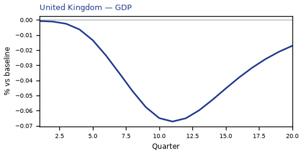

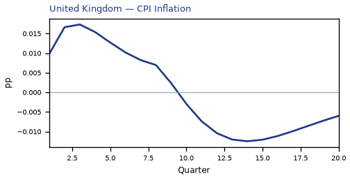

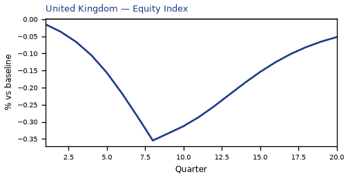

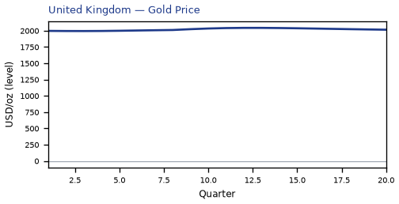


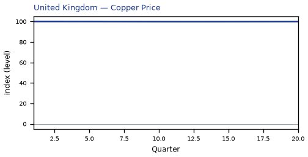


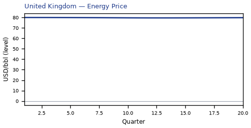


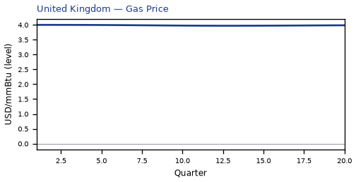

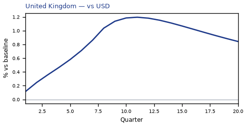

[Q1–Q20 JSON for United Kingdom](numbers/UK.json)

## NO — Norway

The main impact of a 200 basis-point (2.00 percentage-point) rise in United States interest rates on Norway would be only a small drop in GDP of 0.07% by Q12. Equities peak at -0.33% in Q8.

Demand and trade. Consumption peaks at -0.04 % vs baseline in Q13, from -0.00 in Q1 to -0.02 in Q20. Investment peaks at -0.18 % vs baseline in Q11, from -0.01 in Q1 to -0.02 in Q20. Net Exports peaks at -0.03 % vs baseline in Q14, from +0.01 in Q1 to -0.01 in Q20. Gov Spending peaks at -0.02 % vs baseline in Q13, from +0.00 in Q1 to -0.01 in Q20. Gov Debt peaks at +0.01 % vs baseline in Q19, from +0.00 in Q1 to +0.01 in Q20.

External / FX. The real exchange rate shows real depreciation (a weaker, more competitive home currency). Real Exchange Rate peaks at +0.46 % vs baseline in Q11, from +0.05 in Q1 to +0.25 in Q20.

Labour. Employment peaks at -0.05 % vs baseline in Q16, from +0.00 in Q1 to -0.04 in Q20. Unemployment peaks at +0.04 pp in Q15, from +0.00 in Q1 to +0.03 in Q20. Real Wages peaks at +0.03 % vs baseline in Q12, from +0.00 in Q1 to -0.01 in Q20.

Prices. The three-year CPI impulse is +0.08 percentage points. CPI Inflation peaks at +0.01 pp in Q3, from +0.01 in Q1 to -0.00 in Q20. Domestic Infl. peaks at +0.01 pp in Q3, from +0.01 in Q1 to -0.00 in Q20. Marginal Cost peaks at -0.04 % vs baseline in Q12, from -0.00 in Q1 to -0.01 in Q20.

Financial conditions. Policy Rate peaks at -0.03 pp (annualized) in Q18, from +0.00 in Q1 to -0.03 in Q20. Real Rate peaks at -0.01 pp (annualized) in Q18, from +0.00 in Q1 to -0.01 in Q20. Govt 3M Yield peaks at -0.03 pp (annualized) in Q18, from +0.00 in Q1 to -0.03 in Q20. Govt 2Y Yield peaks at -0.03 pp (annualized) in Q15, from +0.02 in Q1 to -0.02 in Q20. Govt 5Y Yield peaks at -0.02 pp (annualized) in Q13, from -0.00 in Q1 to -0.02 in Q20. Govt 10Y Yield peaks at -0.01 pp (annualized) in Q12, from -0.01 in Q1 to -0.01 in Q20. Govt 30Y Yield peaks at -0.00 pp (annualized) in Q11, from -0.00 in Q1 to -0.00 in Q20. Bond Price (7y) peaks at -0.51 % vs baseline in Q8, from -0.03 in Q1 to +0.19 in Q20. Bond Price 3M peaks at +0.01 % vs baseline in Q18, from -0.00 in Q1 to +0.01 in Q20. Bond Price 2Y peaks at +0.06 % vs baseline in Q15, from -0.03 in Q1 to +0.05 in Q20. Bond Price 5Y peaks at +0.10 % vs baseline in Q13, from +0.02 in Q1 to +0.07 in Q20. Bond Price 10Y peaks at +0.11 % vs baseline in Q12, from +0.07 in Q1 to +0.07 in Q20. Bond Price 30Y peaks at +0.08 % vs baseline in Q11, from +0.06 in Q1 to +0.05 in Q20. Equity Index peaks at -0.33 % vs baseline in Q8, from -0.01 in Q1 to -0.06 in Q20. VIX peaks at +16.29 index_level in Q11, from +15.01 in Q1 to +15.49 in Q20. Tobin's Q peaks at -0.13 % vs baseline in Q11, from -0.01 in Q1 to -0.01 in Q20. House Prices peaks at -0.06 % vs baseline in Q19, from -0.00 in Q1 to -0.06 in Q20. Bank Equity peaks at -0.02 % vs baseline in Q18, from +0.00 in Q1 to -0.02 in Q20. Bank Credit peaks at -0.02 % vs baseline in Q18, from +0.00 in Q1 to -0.02 in Q20. Credit Spread peaks at +0.00 pp in Q18, from +0.00 in Q1 to +0.00 in Q20.

Nominal FX. NEER peaks at -0.14 % vs baseline in Q13, from +0.03 in Q1 to -0.04 in Q20. vs USD peaks at +1.21 % vs baseline in Q13, from +0.06 in Q1 to +0.95 in Q20.

Commodities. Energy Price peaks at +80.00 USD/bbl (level) in Q1, from +80.00 in Q1 to +79.82 in Q20. Metals Price peaks at +100.00 index (level) in Q1, from +100.00 in Q1 to +99.93 in Q20. Food Price peaks at +100.00 index (level) in Q1, from +100.00 in Q1 to +99.85 in Q20. Gas Price peaks at +4.00 USD/mmBtu (level) in Q1, from +4.00 in Q1 to +3.99 in Q20. Copper Price peaks at +100.00 index (level) in Q1, from +100.00 in Q1 to +99.95 in Q20. Wheat Price peaks at +100.00 index (level) in Q1, from +100.00 in Q1 to +99.96 in Q20. Gold Price peaks at +2044.24 USD/oz (level) in Q12, from +1997.97 in Q1 to +2016.01 in Q20.

Sectoral and capital. Manuf. GDP peaks at -0.14 % vs baseline in Q11, from -0.02 in Q1 to -0.08 in Q20. Services GDP peaks at -0.04 % vs baseline in Q12, from -0.00 in Q1 to -0.01 in Q20. Capital Stock peaks at -0.01 % vs baseline in Q20, from +0.00 in Q1 to -0.01 in Q20.

Timing. By Q20 GDP is still -0.03% from baseline.

These figures are model IRFs versus baseline, not forecasts.

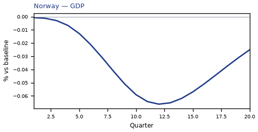

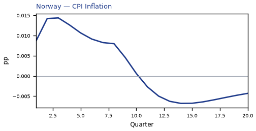

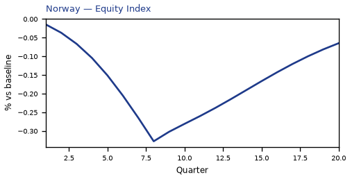


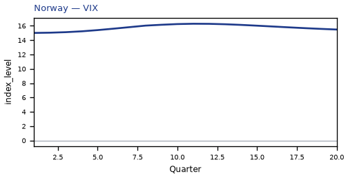


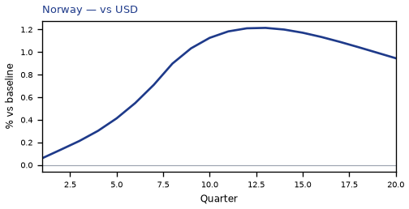

[Q1–Q20 JSON for Norway](numbers/NO.json)

## CL — Chile

The main impact of a 200 basis-point (2.00 percentage-point) rise in United States interest rates on Chile would be only a small drop in GDP of 0.06% by Q12. Equities peak at -0.40% in Q8.

Demand and trade. Consumption peaks at -0.03 % vs baseline in Q13, from -0.00 in Q1 to -0.01 in Q20. Investment peaks at -0.23 % vs baseline in Q9, from -0.03 in Q1 to -0.00 in Q20. Net Exports peaks at +0.08 % vs baseline in Q9, from +0.01 in Q1 to +0.04 in Q20. Gov Spending peaks at +0.01 % vs baseline in Q11, from +0.00 in Q1 to +0.00 in Q20. Gov Debt peaks at -0.04 % vs baseline in Q18, from +0.00 in Q1 to -0.04 in Q20.

External / FX. The real exchange rate shows real depreciation (a weaker, more competitive home currency). Real Exchange Rate peaks at +0.54 % vs baseline in Q9, from +0.10 in Q1 to +0.25 in Q20.

Labour. Employment peaks at -0.04 % vs baseline in Q16, from +0.00 in Q1 to -0.03 in Q20. Unemployment peaks at +0.02 pp in Q14, from +0.00 in Q1 to +0.01 in Q20. Real Wages peaks at +0.07 % vs baseline in Q11, from +0.00 in Q1 to -0.01 in Q20.

Prices. The three-year CPI impulse is +0.15 percentage points. CPI Inflation peaks at +0.03 pp in Q2, from +0.02 in Q1 to -0.01 in Q20. Domestic Infl. peaks at +0.02 pp in Q2, from +0.01 in Q1 to -0.01 in Q20. Marginal Cost peaks at -0.04 % vs baseline in Q12, from -0.00 in Q1 to -0.01 in Q20.

Financial conditions. Policy Rate peaks at +0.06 pp (annualized) in Q8, from +0.01 in Q1 to -0.03 in Q20. Real Rate peaks at +0.01 pp (annualized) in Q8, from +0.00 in Q1 to -0.01 in Q20. Govt 3M Yield peaks at +0.06 pp (annualized) in Q8, from +0.01 in Q1 to -0.03 in Q20. Govt 2Y Yield peaks at +0.05 pp (annualized) in Q3, from +0.05 in Q1 to -0.03 in Q20. Govt 5Y Yield peaks at -0.02 pp (annualized) in Q14, from +0.01 in Q1 to -0.02 in Q20. Govt 10Y Yield peaks at -0.01 pp (annualized) in Q13, from -0.00 in Q1 to -0.01 in Q20. Govt 30Y Yield peaks at -0.00 pp (annualized) in Q13, from -0.00 in Q1 to -0.00 in Q20. Bond Price (7y) peaks at -0.24 % vs baseline in Q8, from -0.06 in Q1 to +0.14 in Q20. Bond Price 3M peaks at -0.01 % vs baseline in Q8, from -0.00 in Q1 to +0.01 in Q20. Bond Price 2Y peaks at -0.10 % vs baseline in Q3, from -0.09 in Q1 to +0.05 in Q20. Bond Price 5Y peaks at +0.10 % vs baseline in Q14, from -0.07 in Q1 to +0.08 in Q20. Bond Price 10Y peaks at +0.12 % vs baseline in Q13, from +0.00 in Q1 to +0.08 in Q20. Bond Price 30Y peaks at +0.09 % vs baseline in Q13, from +0.01 in Q1 to +0.06 in Q20. Equity Index peaks at -0.40 % vs baseline in Q8, from -0.02 in Q1 to -0.06 in Q20. VIX peaks at +16.29 index_level in Q11, from +15.01 in Q1 to +15.49 in Q20. Tobin's Q peaks at -0.16 % vs baseline in Q9, from -0.02 in Q1 to -0.00 in Q20. House Prices peaks at -0.07 % vs baseline in Q17, from -0.00 in Q1 to -0.07 in Q20. Bank Equity peaks at -0.01 % vs baseline in Q17, from +0.00 in Q1 to -0.01 in Q20. Bank Credit peaks at -0.01 % vs baseline in Q17, from +0.00 in Q1 to -0.01 in Q20. Credit Spread peaks at +0.00 pp in Q17, from +0.00 in Q1 to +0.00 in Q20.

Nominal FX. NEER peaks at -0.37 % vs baseline in Q11, from +0.02 in Q1 to -0.26 in Q20. vs USD peaks at +1.25 % vs baseline in Q12, from +0.10 in Q1 to +0.95 in Q20.

Commodities. Energy Price peaks at +80.00 USD/bbl (level) in Q1, from +80.00 in Q1 to +79.82 in Q20. Metals Price peaks at +100.00 index (level) in Q1, from +100.00 in Q1 to +99.93 in Q20. Food Price peaks at +100.00 index (level) in Q1, from +100.00 in Q1 to +99.85 in Q20. Gas Price peaks at +4.00 USD/mmBtu (level) in Q1, from +4.00 in Q1 to +3.99 in Q20. Copper Price peaks at +100.00 index (level) in Q1, from +100.00 in Q1 to +99.95 in Q20. Wheat Price peaks at +100.00 index (level) in Q1, from +100.00 in Q1 to +99.96 in Q20. Gold Price peaks at +2044.24 USD/oz (level) in Q12, from +1997.97 in Q1 to +2016.01 in Q20.

Sectoral and capital. Manuf. GDP peaks at -0.17 % vs baseline in Q9, from -0.03 in Q1 to -0.07 in Q20. Services GDP peaks at -0.04 % vs baseline in Q12, from -0.00 in Q1 to -0.01 in Q20. Capital Stock peaks at -0.01 % vs baseline in Q20, from -0.00 in Q1 to -0.01 in Q20.

Timing. By Q20 GDP is still -0.02% from baseline.

These figures are model IRFs versus baseline, not forecasts.

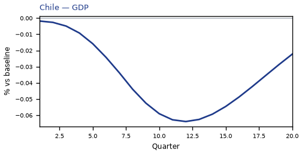

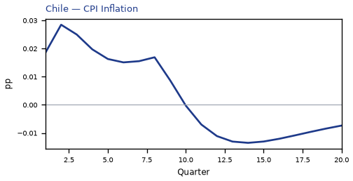


[Q1–Q20 JSON for Chile](numbers/CL.json)

## NL — Netherlands

The main impact of a 200 basis-point (2.00 percentage-point) rise in United States interest rates on Netherlands would be only a small drop in GDP of 0.06% by Q12. Equities peak at -0.33% in Q8.

Demand and trade. Consumption peaks at -0.03 % vs baseline in Q12, from -0.00 in Q1 to -0.01 in Q20. Investment peaks at -0.23 % vs baseline in Q11, from -0.01 in Q1 to -0.09 in Q20. Net Exports peaks at +0.16 % vs baseline in Q15, from +0.01 in Q1 to +0.15 in Q20. Gov Spending peaks at +0.01 % vs baseline in Q11, from +0.00 in Q1 to +0.01 in Q20. Gov Debt peaks at +0.01 % vs baseline in Q20, from +0.00 in Q1 to +0.01 in Q20.

External / FX. The real exchange rate shows real depreciation (a weaker, more competitive home currency). Real Exchange Rate peaks at +0.60 % vs baseline in Q15, from +0.05 in Q1 to +0.57 in Q20.

Labour. Employment peaks at -0.04 % vs baseline in Q16, from +0.00 in Q1 to -0.04 in Q20. Unemployment peaks at +0.04 pp in Q15, from +0.00 in Q1 to +0.03 in Q20. Real Wages peaks at +0.14 % vs baseline in Q18, from +0.00 in Q1 to +0.14 in Q20.

Prices. The three-year CPI impulse is +0.32 percentage points. CPI Inflation peaks at +0.03 pp in Q8, from +0.02 in Q1 to -0.00 in Q20. Domestic Infl. peaks at +0.02 pp in Q8, from +0.01 in Q1 to -0.00 in Q20. Marginal Cost peaks at -0.04 % vs baseline in Q12, from -0.00 in Q1 to -0.02 in Q20.

Financial conditions. Policy Rate peaks at +0.04 pp (annualized) in Q10, from +0.00 in Q1 to +0.02 in Q20. Real Rate peaks at +0.01 pp (annualized) in Q10, from +0.00 in Q1 to +0.00 in Q20. Govt 3M Yield peaks at +0.04 pp (annualized) in Q10, from +0.00 in Q1 to +0.02 in Q20. Govt 2Y Yield peaks at +0.04 pp (annualized) in Q6, from +0.02 in Q1 to +0.01 in Q20. Govt 5Y Yield peaks at +0.03 pp (annualized) in Q3, from +0.03 in Q1 to +0.00 in Q20. Govt 10Y Yield peaks at +0.01 pp (annualized) in Q1, from +0.01 in Q1 to -0.00 in Q20. Govt 30Y Yield peaks at -0.00 pp (annualized) in Q20, from +0.00 in Q1 to -0.00 in Q20. Bond Price (7y) peaks at -0.58 % vs baseline in Q8, from -0.03 in Q1 to -0.12 in Q20. Bond Price 3M peaks at -0.01 % vs baseline in Q10, from -0.00 in Q1 to -0.00 in Q20. Bond Price 2Y peaks at -0.07 % vs baseline in Q6, from -0.04 in Q1 to -0.02 in Q20. Bond Price 5Y peaks at -0.12 % vs baseline in Q3, from -0.12 in Q1 to -0.02 in Q20. Bond Price 10Y peaks at -0.12 % vs baseline in Q1, from -0.12 in Q1 to +0.02 in Q20. Bond Price 30Y peaks at +0.07 % vs baseline in Q20, from -0.02 in Q1 to +0.07 in Q20. Equity Index peaks at -0.33 % vs baseline in Q8, from -0.01 in Q1 to -0.08 in Q20. VIX peaks at +16.29 index_level in Q11, from +15.01 in Q1 to +15.49 in Q20. Tobin's Q peaks at -0.16 % vs baseline in Q11, from -0.01 in Q1 to -0.07 in Q20. House Prices peaks at -0.06 % vs baseline in Q20, from -0.00 in Q1 to -0.06 in Q20. Bank Equity peaks at -0.03 % vs baseline in Q17, from +0.00 in Q1 to -0.03 in Q20. Bank Credit peaks at -0.02 % vs baseline in Q17, from +0.00 in Q1 to -0.02 in Q20. Credit Spread peaks at +0.00 pp in Q17, from +0.00 in Q1 to +0.00 in Q20.

Nominal FX. NEER peaks at -0.43 % vs baseline in Q18, from +0.03 in Q1 to -0.43 in Q20. vs USD peaks at +1.38 % vs baseline in Q14, from +0.05 in Q1 to +1.27 in Q20.

Commodities. Energy Price peaks at +80.00 USD/bbl (level) in Q1, from +80.00 in Q1 to +79.82 in Q20. Metals Price peaks at +100.00 index (level) in Q1, from +100.00 in Q1 to +99.93 in Q20. Food Price peaks at +100.00 index (level) in Q1, from +100.00 in Q1 to +99.85 in Q20. Gas Price peaks at +4.00 USD/mmBtu (level) in Q1, from +4.00 in Q1 to +3.99 in Q20. Copper Price peaks at +100.00 index (level) in Q1, from +100.00 in Q1 to +99.95 in Q20. Wheat Price peaks at +100.00 index (level) in Q1, from +100.00 in Q1 to +99.96 in Q20. Gold Price peaks at +2044.24 USD/oz (level) in Q12, from +1997.97 in Q1 to +2016.01 in Q20.

Sectoral and capital. Manuf. GDP peaks at -0.18 % vs baseline in Q14, from -0.01 in Q1 to -0.17 in Q20. Services GDP peaks at -0.04 % vs baseline in Q12, from -0.00 in Q1 to -0.02 in Q20. Capital Stock peaks at -0.01 % vs baseline in Q20, from +0.00 in Q1 to -0.01 in Q20.

Timing. By Q20 GDP is still -0.03% from baseline.

These figures are model IRFs versus baseline, not forecasts.


[Q1–Q20 JSON for Netherlands](numbers/NL.json)

## MY — Malaysia

The main impact of a 200 basis-point (2.00 percentage-point) rise in United States interest rates on Malaysia would be only a small drop in GDP of 0.06% by Q12. Equities peak at -0.35% in Q8.

Demand and trade. Consumption peaks at -0.03 % vs baseline in Q12, from -0.00 in Q1 to -0.01 in Q20. Investment peaks at -0.18 % vs baseline in Q9, from -0.04 in Q1 to +0.00 in Q20. Net Exports peaks at +0.11 % vs baseline in Q8, from +0.06 in Q1 to +0.02 in Q20. Gov Spending peaks at +0.01 % vs baseline in Q11, from +0.00 in Q1 to +0.00 in Q20. Gov Debt peaks at -0.06 % vs baseline in Q19, from +0.00 in Q1 to -0.06 in Q20.

External / FX. The real exchange rate shows real depreciation (a weaker, more competitive home currency). Real Exchange Rate peaks at +0.39 % vs baseline in Q8, from +0.20 in Q1 to +0.09 in Q20.

Labour. Employment peaks at -0.04 % vs baseline in Q15, from +0.00 in Q1 to -0.03 in Q20. Unemployment peaks at +0.01 pp in Q14, from +0.00 in Q1 to +0.01 in Q20. Real Wages peaks at +0.08 % vs baseline in Q10, from +0.00 in Q1 to -0.03 in Q20.

Prices. The three-year CPI impulse is +0.13 percentage points. CPI Inflation peaks at +0.06 pp in Q1, from +0.06 in Q1 to -0.01 in Q20. Domestic Infl. peaks at +0.05 pp in Q1, from +0.05 in Q1 to -0.00 in Q20. Marginal Cost peaks at -0.03 % vs baseline in Q12, from -0.00 in Q1 to -0.01 in Q20.

Financial conditions. Policy Rate peaks at +0.04 pp (annualized) in Q3, from +0.02 in Q1 to -0.03 in Q20. Real Rate peaks at +0.01 pp (annualized) in Q3, from +0.01 in Q1 to -0.01 in Q20. Govt 3M Yield peaks at +0.04 pp (annualized) in Q3, from +0.02 in Q1 to -0.03 in Q20. Govt 2Y Yield peaks at +0.04 pp (annualized) in Q2, from +0.04 in Q1 to -0.02 in Q20. Govt 5Y Yield peaks at -0.02 pp (annualized) in Q12, from +0.00 in Q1 to -0.01 in Q20. Govt 10Y Yield peaks at -0.01 pp (annualized) in Q11, from -0.00 in Q1 to -0.01 in Q20. Govt 30Y Yield peaks at -0.00 pp (annualized) in Q11, from -0.00 in Q1 to -0.00 in Q20. Bond Price (7y) peaks at -0.22 % vs baseline in Q8, from -0.10 in Q1 to +0.13 in Q20. Bond Price 3M peaks at -0.01 % vs baseline in Q3, from -0.01 in Q1 to +0.01 in Q20. Bond Price 2Y peaks at -0.07 % vs baseline in Q2, from -0.07 in Q1 to +0.04 in Q20. Bond Price 5Y peaks at +0.10 % vs baseline in Q12, from -0.01 in Q1 to +0.05 in Q20. Bond Price 10Y peaks at +0.10 % vs baseline in Q11, from +0.03 in Q1 to +0.05 in Q20. Bond Price 30Y peaks at +0.07 % vs baseline in Q11, from +0.02 in Q1 to +0.04 in Q20. Equity Index peaks at -0.35 % vs baseline in Q8, from -0.02 in Q1 to -0.06 in Q20. VIX peaks at +16.29 index_level in Q11, from +15.01 in Q1 to +15.49 in Q20. Tobin's Q peaks at -0.13 % vs baseline in Q9, from -0.03 in Q1 to +0.00 in Q20. House Prices peaks at -0.07 % vs baseline in Q17, from -0.00 in Q1 to -0.07 in Q20. Bank Equity peaks at -0.01 % vs baseline in Q18, from +0.00 in Q1 to -0.01 in Q20. Bank Credit peaks at -0.01 % vs baseline in Q18, from +0.00 in Q1 to -0.01 in Q20. Credit Spread peaks at +0.00 pp in Q17, from +0.00 in Q1 to +0.00 in Q20.

Nominal FX. NEER peaks at -0.15 % vs baseline in Q8, from -0.07 in Q1 to -0.11 in Q20. vs USD peaks at +1.00 % vs baseline in Q12, from +0.20 in Q1 to +0.79 in Q20.

Commodities. Energy Price peaks at +80.00 USD/bbl (level) in Q1, from +80.00 in Q1 to +79.82 in Q20. Metals Price peaks at +100.00 index (level) in Q1, from +100.00 in Q1 to +99.93 in Q20. Food Price peaks at +100.00 index (level) in Q1, from +100.00 in Q1 to +99.85 in Q20. Gas Price peaks at +4.00 USD/mmBtu (level) in Q1, from +4.00 in Q1 to +3.99 in Q20. Copper Price peaks at +100.00 index (level) in Q1, from +100.00 in Q1 to +99.95 in Q20. Wheat Price peaks at +100.00 index (level) in Q1, from +100.00 in Q1 to +99.96 in Q20. Gold Price peaks at +2044.24 USD/oz (level) in Q12, from +1997.97 in Q1 to +2016.01 in Q20.

Sectoral and capital. Manuf. GDP peaks at -0.12 % vs baseline in Q8, from -0.06 in Q1 to -0.03 in Q20. Services GDP peaks at -0.03 % vs baseline in Q12, from -0.00 in Q1 to -0.01 in Q20. Capital Stock peaks at -0.01 % vs baseline in Q19, from -0.00 in Q1 to -0.01 in Q20.

Timing. By Q20 GDP is still -0.02% from baseline.

These figures are model IRFs versus baseline, not forecasts.


[Q1–Q20 JSON for Malaysia](numbers/MY.json)

## CH — Switzerland

The main impact of a 200 basis-point (2.00 percentage-point) rise in United States interest rates on Switzerland would be only a small drop in GDP of 0.06% by Q11. Equities peak at -0.34% in Q8.

Demand and trade. Consumption peaks at -0.04 % vs baseline in Q11, from -0.00 in Q1 to -0.01 in Q20. Investment peaks at -0.18 % vs baseline in Q10, from -0.01 in Q1 to -0.02 in Q20. Net Exports peaks at +0.08 % vs baseline in Q9, from +0.02 in Q1 to +0.03 in Q20. Gov Spending peaks at +0.01 % vs baseline in Q11, from +0.00 in Q1 to +0.00 in Q20. Gov Debt peaks at -0.02 % vs baseline in Q17, from +0.00 in Q1 to -0.02 in Q20.

External / FX. The real exchange rate shows real depreciation (a weaker, more competitive home currency). Real Exchange Rate peaks at +0.37 % vs baseline in Q9, from +0.08 in Q1 to +0.14 in Q20.

Labour. Employment peaks at -0.04 % vs baseline in Q14, from +0.00 in Q1 to -0.03 in Q20. Unemployment peaks at +0.03 pp in Q14, from +0.00 in Q1 to +0.02 in Q20. Real Wages peaks at +0.07 % vs baseline in Q13, from +0.00 in Q1 to +0.04 in Q20.

Prices. The three-year CPI impulse is +0.14 percentage points. CPI Inflation peaks at +0.02 pp in Q3, from +0.01 in Q1 to -0.01 in Q20. Domestic Infl. peaks at +0.02 pp in Q3, from +0.01 in Q1 to -0.00 in Q20. Marginal Cost peaks at -0.03 % vs baseline in Q11, from -0.00 in Q1 to -0.01 in Q20.

Financial conditions. Policy Rate peaks at +0.02 pp (annualized) in Q7, from +0.00 in Q1 to -0.01 in Q20. Real Rate peaks at +0.01 pp (annualized) in Q7, from +0.00 in Q1 to -0.00 in Q20. Govt 3M Yield peaks at +0.02 pp (annualized) in Q7, from +0.00 in Q1 to -0.01 in Q20. Govt 2Y Yield peaks at +0.02 pp (annualized) in Q3, from +0.02 in Q1 to -0.01 in Q20. Govt 5Y Yield peaks at -0.01 pp (annualized) in Q17, from +0.01 in Q1 to -0.01 in Q20. Govt 10Y Yield peaks at -0.01 pp (annualized) in Q15, from -0.00 in Q1 to -0.01 in Q20. Govt 30Y Yield peaks at -0.00 pp (annualized) in Q14, from -0.00 in Q1 to -0.00 in Q20. Bond Price (7y) peaks at -0.56 % vs baseline in Q8, from -0.03 in Q1 to +0.10 in Q20. Bond Price 3M peaks at -0.01 % vs baseline in Q7, from -0.00 in Q1 to +0.00 in Q20. Bond Price 2Y peaks at -0.04 % vs baseline in Q3, from -0.03 in Q1 to +0.03 in Q20. Bond Price 5Y peaks at +0.06 % vs baseline in Q17, from -0.03 in Q1 to +0.05 in Q20. Bond Price 10Y peaks at +0.08 % vs baseline in Q15, from +0.02 in Q1 to +0.07 in Q20. Bond Price 30Y peaks at +0.06 % vs baseline in Q14, from +0.03 in Q1 to +0.05 in Q20. Equity Index peaks at -0.34 % vs baseline in Q8, from -0.01 in Q1 to -0.08 in Q20. VIX peaks at +16.29 index_level in Q11, from +15.01 in Q1 to +15.49 in Q20. Tobin's Q peaks at -0.13 % vs baseline in Q10, from -0.01 in Q1 to -0.02 in Q20. House Prices peaks at -0.05 % vs baseline in Q18, from -0.00 in Q1 to -0.05 in Q20. Bank Equity peaks at -0.03 % vs baseline in Q17, from +0.00 in Q1 to -0.03 in Q20. Bank Credit peaks at -0.02 % vs baseline in Q17, from +0.00 in Q1 to -0.02 in Q20. Credit Spread peaks at +0.00 pp in Q17, from +0.00 in Q1 to +0.00 in Q20.

Nominal FX. NEER peaks at +0.11 % vs baseline in Q20, from -0.00 in Q1 to +0.11 in Q20. vs USD peaks at +1.06 % vs baseline in Q12, from +0.08 in Q1 to +0.84 in Q20.

Commodities. Energy Price peaks at +80.00 USD/bbl (level) in Q1, from +80.00 in Q1 to +79.82 in Q20. Metals Price peaks at +100.00 index (level) in Q1, from +100.00 in Q1 to +99.93 in Q20. Food Price peaks at +100.00 index (level) in Q1, from +100.00 in Q1 to +99.85 in Q20. Gas Price peaks at +4.00 USD/mmBtu (level) in Q1, from +4.00 in Q1 to +3.99 in Q20. Copper Price peaks at +100.00 index (level) in Q1, from +100.00 in Q1 to +99.95 in Q20. Wheat Price peaks at +100.00 index (level) in Q1, from +100.00 in Q1 to +99.96 in Q20. Gold Price peaks at +2044.24 USD/oz (level) in Q12, from +1997.97 in Q1 to +2016.01 in Q20.

Sectoral and capital. Manuf. GDP peaks at -0.11 % vs baseline in Q9, from -0.02 in Q1 to -0.04 in Q20. Services GDP peaks at -0.04 % vs baseline in Q11, from -0.00 in Q1 to -0.01 in Q20. Capital Stock peaks at -0.01 % vs baseline in Q20, from +0.00 in Q1 to -0.01 in Q20.

Timing. By Q20 GDP is still -0.02% from baseline.

These figures are model IRFs versus baseline, not forecasts.


[Q1–Q20 JSON for Switzerland](numbers/CH.json)

## TR — Turkey

The main impact of a 200 basis-point (2.00 percentage-point) rise in United States interest rates on Turkey would be only a small drop in GDP of 0.05% by Q10. Equities peak at -0.49% in Q8.

Demand and trade. Consumption peaks at -0.02 % vs baseline in Q11, from -0.00 in Q1 to +0.01 in Q20. Investment peaks at -0.14 % vs baseline in Q8, from -0.04 in Q1 to +0.05 in Q20. Net Exports peaks at +0.05 % vs baseline in Q10, from +0.02 in Q1 to +0.01 in Q20. Gov Spending peaks at +0.01 % vs baseline in Q10, from +0.00 in Q1 to -0.00 in Q20. Gov Debt peaks at -0.02 % vs baseline in Q15, from +0.00 in Q1 to -0.01 in Q20.

External / FX. The real exchange rate shows real depreciation (a weaker, more competitive home currency). Real Exchange Rate peaks at +0.26 % vs baseline in Q8, from +0.12 in Q1 to -0.01 in Q20.

Labour. Employment peaks at -0.02 % vs baseline in Q13, from +0.00 in Q1 to -0.00 in Q20. Unemployment peaks at +0.01 pp in Q12, from +0.00 in Q1 to +0.00 in Q20. Real Wages peaks at -0.04 % vs baseline in Q20, from +0.00 in Q1 to -0.04 in Q20.

Prices. The three-year CPI impulse is +0.03 percentage points. CPI Inflation peaks at +0.02 pp in Q1, from +0.02 in Q1 to -0.00 in Q20. Domestic Infl. peaks at +0.01 pp in Q1, from +0.01 in Q1 to -0.00 in Q20. Marginal Cost peaks at -0.03 % vs baseline in Q10, from -0.00 in Q1 to +0.01 in Q20.

Financial conditions. Policy Rate peaks at -0.04 pp (annualized) in Q14, from +0.02 in Q1 to -0.01 in Q20. Real Rate peaks at -0.01 pp (annualized) in Q14, from +0.01 in Q1 to -0.00 in Q20. Govt 3M Yield peaks at -0.04 pp (annualized) in Q14, from +0.02 in Q1 to -0.01 in Q20. Govt 2Y Yield peaks at -0.04 pp (annualized) in Q11, from +0.02 in Q1 to +0.01 in Q20. Govt 5Y Yield peaks at -0.01 pp (annualized) in Q7, from -0.01 in Q1 to +0.01 in Q20. Govt 10Y Yield peaks at -0.00 pp (annualized) in Q9, from +0.00 in Q1 to +0.00 in Q20. Govt 30Y Yield peaks at -0.00 pp (annualized) in Q9, from -0.00 in Q1 to +0.00 in Q20. Bond Price (7y) peaks at -0.14 % vs baseline in Q8, from -0.06 in Q1 to +0.03 in Q20. Bond Price 3M peaks at +0.01 % vs baseline in Q14, from -0.01 in Q1 to +0.00 in Q20. Bond Price 2Y peaks at +0.07 % vs baseline in Q11, from -0.04 in Q1 to -0.01 in Q20. Bond Price 5Y peaks at +0.06 % vs baseline in Q7, from +0.04 in Q1 to -0.04 in Q20. Bond Price 10Y peaks at +0.03 % vs baseline in Q9, from -0.00 in Q1 to -0.03 in Q20. Bond Price 30Y peaks at +0.03 % vs baseline in Q9, from +0.00 in Q1 to -0.02 in Q20. Equity Index peaks at -0.49 % vs baseline in Q8, from -0.03 in Q1 to +0.00 in Q20. VIX peaks at +16.29 index_level in Q11, from +15.01 in Q1 to +15.49 in Q20. Tobin's Q peaks at -0.10 % vs baseline in Q8, from -0.03 in Q1 to +0.04 in Q20. House Prices peaks at -0.05 % vs baseline in Q15, from -0.00 in Q1 to -0.03 in Q20. Bank Equity peaks at -0.00 % vs baseline in Q15, from +0.00 in Q1 to -0.00 in Q20. Bank Credit peaks at -0.00 % vs baseline in Q15, from +0.00 in Q1 to -0.00 in Q20. Credit Spread peaks at +0.00 pp in Q15, from +0.00 in Q1 to +0.00 in Q20.

Nominal FX. NEER peaks at +0.16 % vs baseline in Q20, from -0.03 in Q1 to +0.16 in Q20. vs USD peaks at +0.91 % vs baseline in Q12, from +0.12 in Q1 to +0.69 in Q20.

Commodities. Energy Price peaks at +80.00 USD/bbl (level) in Q1, from +80.00 in Q1 to +79.82 in Q20. Metals Price peaks at +100.00 index (level) in Q1, from +100.00 in Q1 to +99.93 in Q20. Food Price peaks at +100.00 index (level) in Q1, from +100.00 in Q1 to +99.85 in Q20. Gas Price peaks at +4.00 USD/mmBtu (level) in Q1, from +4.00 in Q1 to +3.99 in Q20. Copper Price peaks at +100.00 index (level) in Q1, from +100.00 in Q1 to +99.95 in Q20. Wheat Price peaks at +100.00 index (level) in Q1, from +100.00 in Q1 to +99.96 in Q20. Gold Price peaks at +2044.24 USD/oz (level) in Q12, from +1997.97 in Q1 to +2016.01 in Q20.

Sectoral and capital. Manuf. GDP peaks at -0.08 % vs baseline in Q8, from -0.04 in Q1 to +0.01 in Q20. Services GDP peaks at -0.03 % vs baseline in Q10, from -0.00 in Q1 to +0.01 in Q20. Capital Stock peaks at -0.01 % vs baseline in Q15, from -0.00 in Q1 to -0.01 in Q20.

Timing. The GDP response has mostly faded by Q17 (Q20 is +0.01%).

These figures are model IRFs versus baseline, not forecasts.


[Q1–Q20 JSON for Turkey](numbers/TR.json)

## KR — South Korea

The main impact of a 200 basis-point (2.00 percentage-point) rise in United States interest rates on South Korea would be only a small drop in GDP of 0.05% by Q12. Equities peak at -0.38% in Q8.

Demand and trade. Consumption peaks at -0.02 % vs baseline in Q12, from -0.00 in Q1 to -0.01 in Q20. Investment peaks at -0.21 % vs baseline in Q9, from -0.02 in Q1 to +0.01 in Q20. Net Exports peaks at +0.13 % vs baseline in Q10, from +0.02 in Q1 to +0.06 in Q20. Gov Spending peaks at +0.01 % vs baseline in Q12, from +0.00 in Q1 to +0.00 in Q20. Gov Debt peaks at -0.02 % vs baseline in Q20, from +0.00 in Q1 to -0.02 in Q20.

External / FX. The real exchange rate shows real depreciation (a weaker, more competitive home currency). Real Exchange Rate peaks at +0.52 % vs baseline in Q9, from +0.10 in Q1 to +0.23 in Q20.

Labour. Employment peaks at -0.03 % vs baseline in Q16, from +0.00 in Q1 to -0.03 in Q20. Unemployment peaks at +0.02 pp in Q15, from +0.00 in Q1 to +0.01 in Q20. Real Wages peaks at +0.09 % vs baseline in Q13, from +0.00 in Q1 to +0.03 in Q20.

Prices. The three-year CPI impulse is +0.20 percentage points. CPI Inflation peaks at +0.03 pp in Q2, from +0.02 in Q1 to -0.01 in Q20. Domestic Infl. peaks at +0.02 pp in Q2, from +0.01 in Q1 to -0.01 in Q20. Marginal Cost peaks at -0.03 % vs baseline in Q12, from -0.00 in Q1 to -0.01 in Q20.

Financial conditions. Policy Rate peaks at +0.06 pp (annualized) in Q8, from +0.01 in Q1 to -0.04 in Q20. Real Rate peaks at +0.02 pp (annualized) in Q8, from +0.00 in Q1 to -0.01 in Q20. Govt 3M Yield peaks at +0.06 pp (annualized) in Q8, from +0.01 in Q1 to -0.04 in Q20. Govt 2Y Yield peaks at +0.05 pp (annualized) in Q3, from +0.05 in Q1 to -0.03 in Q20. Govt 5Y Yield peaks at -0.03 pp (annualized) in Q14, from +0.02 in Q1 to -0.02 in Q20. Govt 10Y Yield peaks at -0.02 pp (annualized) in Q14, from -0.00 in Q1 to -0.01 in Q20. Govt 30Y Yield peaks at -0.01 pp (annualized) in Q14, from -0.00 in Q1 to -0.00 in Q20. Bond Price (7y) peaks at -0.30 % vs baseline in Q8, from -0.06 in Q1 to +0.18 in Q20. Bond Price 3M peaks at -0.02 % vs baseline in Q8, from -0.00 in Q1 to +0.01 in Q20. Bond Price 2Y peaks at -0.10 % vs baseline in Q3, from -0.09 in Q1 to +0.06 in Q20. Bond Price 5Y peaks at +0.11 % vs baseline in Q14, from -0.07 in Q1 to +0.09 in Q20. Bond Price 10Y peaks at +0.12 % vs baseline in Q14, from +0.01 in Q1 to +0.09 in Q20. Bond Price 30Y peaks at +0.09 % vs baseline in Q14, from +0.01 in Q1 to +0.07 in Q20. Equity Index peaks at -0.38 % vs baseline in Q8, from -0.02 in Q1 to -0.06 in Q20. VIX peaks at +16.29 index_level in Q11, from +15.01 in Q1 to +15.49 in Q20. Tobin's Q peaks at -0.14 % vs baseline in Q9, from -0.01 in Q1 to +0.01 in Q20. House Prices peaks at -0.05 % vs baseline in Q18, from -0.00 in Q1 to -0.05 in Q20. Bank Equity peaks at -0.01 % vs baseline in Q17, from +0.00 in Q1 to -0.01 in Q20. Bank Credit peaks at -0.01 % vs baseline in Q17, from +0.00 in Q1 to -0.01 in Q20. Credit Spread peaks at +0.00 pp in Q16, from +0.00 in Q1 to +0.00 in Q20.

Nominal FX. NEER peaks at -0.35 % vs baseline in Q11, from +0.01 in Q1 to -0.26 in Q20. vs USD peaks at +1.20 % vs baseline in Q11, from +0.11 in Q1 to +0.93 in Q20.

Commodities. Energy Price peaks at +80.00 USD/bbl (level) in Q1, from +80.00 in Q1 to +79.82 in Q20. Metals Price peaks at +100.00 index (level) in Q1, from +100.00 in Q1 to +99.93 in Q20. Food Price peaks at +100.00 index (level) in Q1, from +100.00 in Q1 to +99.85 in Q20. Gas Price peaks at +4.00 USD/mmBtu (level) in Q1, from +4.00 in Q1 to +3.99 in Q20. Copper Price peaks at +100.00 index (level) in Q1, from +100.00 in Q1 to +99.95 in Q20. Wheat Price peaks at +100.00 index (level) in Q1, from +100.00 in Q1 to +99.96 in Q20. Gold Price peaks at +2044.24 USD/oz (level) in Q12, from +1997.97 in Q1 to +2016.01 in Q20.

Sectoral and capital. Manuf. GDP peaks at -0.16 % vs baseline in Q9, from -0.03 in Q1 to -0.07 in Q20. Services GDP peaks at -0.03 % vs baseline in Q12, from -0.00 in Q1 to -0.01 in Q20. Capital Stock peaks at -0.01 % vs baseline in Q19, from -0.00 in Q1 to -0.01 in Q20.

Timing. By Q20 GDP is still -0.02% from baseline.

These figures are model IRFs versus baseline, not forecasts.


[Q1–Q20 JSON for South Korea](numbers/KR.json)

## RU — Russia

The main impact of a 200 basis-point (2.00 percentage-point) rise in United States interest rates on Russia would be only a small drop in GDP of 0.05% by Q11. Equities peak at -0.48% in Q8.

Demand and trade. Consumption peaks at -0.02 % vs baseline in Q12, from -0.00 in Q1 to -0.00 in Q20. Investment peaks at -0.11 % vs baseline in Q10, from -0.01 in Q1 to +0.01 in Q20. Net Exports peaks at -0.07 % vs baseline in Q13, from +0.00 in Q1 to -0.04 in Q20. Gov Spending peaks at -0.02 % vs baseline in Q14, from +0.00 in Q1 to -0.01 in Q20. Gov Debt peaks at -0.01 % vs baseline in Q17, from +0.00 in Q1 to -0.01 in Q20.

External / FX. The real exchange rate shows real depreciation (a weaker, more competitive home currency). Real Exchange Rate peaks at +0.11 % vs baseline in Q11, from +0.03 in Q1 to +0.02 in Q20.

Labour. Employment peaks at -0.03 % vs baseline in Q15, from +0.00 in Q1 to -0.02 in Q20. Unemployment peaks at +0.02 pp in Q14, from +0.00 in Q1 to +0.01 in Q20. Real Wages peaks at -0.06 % vs baseline in Q20, from +0.00 in Q1 to -0.06 in Q20.

Prices. The three-year CPI impulse is -0.02 percentage points. CPI Inflation peaks at -0.01 pp in Q12, from +0.00 in Q1 to +0.00 in Q20. Domestic Infl. peaks at -0.00 pp in Q12, from +0.00 in Q1 to +0.00 in Q20. Marginal Cost peaks at -0.03 % vs baseline in Q11, from -0.00 in Q1 to -0.00 in Q20.

Financial conditions. Policy Rate peaks at -0.03 pp (annualized) in Q14, from +0.00 in Q1 to -0.01 in Q20. Real Rate peaks at -0.01 pp (annualized) in Q14, from +0.00 in Q1 to -0.00 in Q20. Govt 3M Yield peaks at -0.03 pp (annualized) in Q14, from +0.00 in Q1 to -0.01 in Q20. Govt 2Y Yield peaks at -0.03 pp (annualized) in Q11, from +0.00 in Q1 to +0.00 in Q20. Govt 5Y Yield peaks at -0.01 pp (annualized) in Q5, from -0.01 in Q1 to +0.01 in Q20. Govt 10Y Yield peaks at -0.00 pp (annualized) in Q6, from -0.00 in Q1 to +0.00 in Q20. Govt 30Y Yield peaks at -0.00 pp (annualized) in Q6, from -0.00 in Q1 to +0.00 in Q20. Bond Price (7y) peaks at -0.14 % vs baseline in Q8, from -0.01 in Q1 to +0.03 in Q20. Bond Price 3M peaks at +0.01 % vs baseline in Q14, from -0.00 in Q1 to +0.00 in Q20. Bond Price 2Y peaks at +0.05 % vs baseline in Q11, from -0.00 in Q1 to -0.00 in Q20. Bond Price 5Y peaks at +0.06 % vs baseline in Q5, from +0.06 in Q1 to -0.03 in Q20. Bond Price 10Y peaks at +0.03 % vs baseline in Q6, from +0.02 in Q1 to -0.03 in Q20. Bond Price 30Y peaks at +0.02 % vs baseline in Q6, from +0.02 in Q1 to -0.02 in Q20. Equity Index peaks at -0.48 % vs baseline in Q8, from -0.02 in Q1 to -0.02 in Q20. VIX peaks at +16.29 index_level in Q11, from +15.01 in Q1 to +15.49 in Q20. Tobin's Q peaks at -0.07 % vs baseline in Q10, from -0.01 in Q1 to +0.01 in Q20. House Prices peaks at -0.04 % vs baseline in Q16, from -0.00 in Q1 to -0.04 in Q20. Bank Equity peaks at -0.01 % vs baseline in Q18, from +0.00 in Q1 to -0.01 in Q20. Bank Credit peaks at -0.01 % vs baseline in Q18, from +0.00 in Q1 to -0.01 in Q20. Credit Spread peaks at +0.00 pp in Q18, from +0.00 in Q1 to +0.00 in Q20.

Nominal FX. NEER peaks at +0.24 % vs baseline in Q8, from +0.12 in Q1 to +0.10 in Q20. vs USD peaks at +0.87 % vs baseline in Q13, from +0.04 in Q1 to +0.72 in Q20.

Commodities. Energy Price peaks at +80.00 USD/bbl (level) in Q1, from +80.00 in Q1 to +79.82 in Q20. Metals Price peaks at +100.00 index (level) in Q1, from +100.00 in Q1 to +99.93 in Q20. Food Price peaks at +100.00 index (level) in Q1, from +100.00 in Q1 to +99.85 in Q20. Gas Price peaks at +4.00 USD/mmBtu (level) in Q1, from +4.00 in Q1 to +3.99 in Q20. Copper Price peaks at +100.00 index (level) in Q1, from +100.00 in Q1 to +99.95 in Q20. Wheat Price peaks at +100.00 index (level) in Q1, from +100.00 in Q1 to +99.96 in Q20. Gold Price peaks at +2044.24 USD/oz (level) in Q12, from +1997.97 in Q1 to +2016.01 in Q20.

Sectoral and capital. Manuf. GDP peaks at -0.03 % vs baseline in Q11, from -0.01 in Q1 to -0.00 in Q20. Services GDP peaks at -0.03 % vs baseline in Q11, from -0.00 in Q1 to -0.00 in Q20. Capital Stock peaks at -0.01 % vs baseline in Q18, from +0.00 in Q1 to -0.01 in Q20.

Timing. The GDP response has mostly faded by Q19 (Q20 is -0.00%).

These figures are model IRFs versus baseline, not forecasts.


[Q1–Q20 JSON for Russia](numbers/RU.json)

## NG — Nigeria

The main impact of a 200 basis-point (2.00 percentage-point) rise in United States interest rates on Nigeria would be only a small drop in GDP of 0.05% by Q11. Equities peak at -0.42% in Q8.

Demand and trade. Consumption peaks at -0.02 % vs baseline in Q11, from -0.00 in Q1 to +0.01 in Q20. Investment peaks at -0.11 % vs baseline in Q8, from -0.03 in Q1 to +0.07 in Q20. Net Exports peaks at -0.03 % vs baseline in Q15, from +0.02 in Q1 to -0.02 in Q20. Gov Spending peaks at -0.01 % vs baseline in Q20, from +0.00 in Q1 to -0.01 in Q20. Gov Debt peaks at -0.07 % vs baseline in Q16, from +0.00 in Q1 to -0.05 in Q20.

External / FX. The real exchange rate shows real depreciation (a weaker, more competitive home currency). Real Exchange Rate peaks at +0.35 % vs baseline in Q8, from +0.18 in Q1 to +0.01 in Q20.

Labour. Employment peaks at -0.02 % vs baseline in Q14, from +0.00 in Q1 to -0.01 in Q20. Unemployment peaks at +0.00 pp in Q12, from +0.00 in Q1 to -0.00 in Q20. Real Wages peaks at -0.07 % vs baseline in Q20, from +0.00 in Q1 to -0.07 in Q20.

Prices. The three-year CPI impulse is -0.00 percentage points. CPI Inflation peaks at +0.03 pp in Q1, from +0.03 in Q1 to +0.00 in Q20. Domestic Infl. peaks at +0.02 pp in Q1, from +0.02 in Q1 to +0.00 in Q20. Marginal Cost peaks at -0.03 % vs baseline in Q11, from -0.00 in Q1 to +0.01 in Q20.

Financial conditions. Policy Rate peaks at -0.05 pp (annualized) in Q14, from +0.02 in Q1 to -0.01 in Q20. Real Rate peaks at -0.01 pp (annualized) in Q14, from +0.00 in Q1 to -0.00 in Q20. Govt 3M Yield peaks at -0.05 pp (annualized) in Q14, from +0.02 in Q1 to -0.01 in Q20. Govt 2Y Yield peaks at -0.04 pp (annualized) in Q11, from +0.02 in Q1 to +0.01 in Q20. Govt 5Y Yield peaks at -0.02 pp (annualized) in Q6, from -0.01 in Q1 to +0.01 in Q20. Govt 10Y Yield peaks at +0.01 pp (annualized) in Q20, from -0.00 in Q1 to +0.01 in Q20. Govt 30Y Yield peaks at +0.00 pp (annualized) in Q20, from -0.00 in Q1 to +0.00 in Q20. Bond Price (7y) peaks at +0.13 % vs baseline in Q14, from -0.05 in Q1 to +0.03 in Q20. Bond Price 3M peaks at +0.01 % vs baseline in Q14, from -0.00 in Q1 to +0.00 in Q20. Bond Price 2Y peaks at +0.08 % vs baseline in Q11, from -0.03 in Q1 to -0.02 in Q20. Bond Price 5Y peaks at +0.08 % vs baseline in Q6, from +0.06 in Q1 to -0.05 in Q20. Bond Price 10Y peaks at -0.05 % vs baseline in Q20, from +0.01 in Q1 to -0.05 in Q20. Bond Price 30Y peaks at -0.03 % vs baseline in Q20, from +0.01 in Q1 to -0.03 in Q20. Equity Index peaks at -0.42 % vs baseline in Q8, from -0.02 in Q1 to +0.01 in Q20. VIX peaks at +16.29 index_level in Q11, from +15.01 in Q1 to +15.49 in Q20. Tobin's Q peaks at -0.08 % vs baseline in Q8, from -0.02 in Q1 to +0.05 in Q20. House Prices peaks at -0.04 % vs baseline in Q14, from -0.00 in Q1 to -0.02 in Q20. Bank Equity peaks at -0.01 % vs baseline in Q18, from +0.00 in Q1 to -0.01 in Q20. Bank Credit peaks at -0.01 % vs baseline in Q18, from +0.00 in Q1 to -0.01 in Q20. Credit Spread peaks at +0.00 pp in Q18, from +0.00 in Q1 to +0.00 in Q20.

Nominal FX. NEER peaks at -0.09 % vs baseline in Q8, from -0.06 in Q1 to +0.05 in Q20. vs USD peaks at +0.97 % vs baseline in Q11, from +0.19 in Q1 to +0.71 in Q20.

Commodities. Energy Price peaks at +80.00 USD/bbl (level) in Q1, from +80.00 in Q1 to +79.82 in Q20. Metals Price peaks at +100.00 index (level) in Q1, from +100.00 in Q1 to +99.93 in Q20. Food Price peaks at +100.00 index (level) in Q1, from +100.00 in Q1 to +99.85 in Q20. Gas Price peaks at +4.00 USD/mmBtu (level) in Q1, from +4.00 in Q1 to +3.99 in Q20. Copper Price peaks at +100.00 index (level) in Q1, from +100.00 in Q1 to +99.95 in Q20. Wheat Price peaks at +100.00 index (level) in Q1, from +100.00 in Q1 to +99.96 in Q20. Gold Price peaks at +2044.24 USD/oz (level) in Q12, from +1997.97 in Q1 to +2016.01 in Q20.

Sectoral and capital. Manuf. GDP peaks at -0.11 % vs baseline in Q8, from -0.05 in Q1 to +0.00 in Q20. Services GDP peaks at -0.02 % vs baseline in Q11, from -0.00 in Q1 to +0.01 in Q20. Capital Stock peaks at -0.00 % vs baseline in Q14, from -0.00 in Q1 to -0.00 in Q20.

Timing. The GDP response has mostly faded by Q17 (Q20 is +0.02%).

These figures are model IRFs versus baseline, not forecasts.


[Q1–Q20 JSON for Nigeria](numbers/NG.json)

## ZA — South Africa

The main impact of a 200 basis-point (2.00 percentage-point) rise in United States interest rates on South Africa would be only a small drop in GDP of 0.04% by Q12. Equities peak at -0.42% in Q8.

Demand and trade. Consumption peaks at -0.02 % vs baseline in Q12, from -0.00 in Q1 to -0.01 in Q20. Investment peaks at -0.15 % vs baseline in Q9, from -0.02 in Q1 to +0.00 in Q20. Net Exports peaks at +0.05 % vs baseline in Q9, from +0.01 in Q1 to +0.02 in Q20. Gov Spending peaks at +0.01 % vs baseline in Q11, from +0.00 in Q1 to +0.00 in Q20. Gov Debt peaks at -0.02 % vs baseline in Q19, from +0.00 in Q1 to -0.02 in Q20.

External / FX. The real exchange rate shows real depreciation (a weaker, more competitive home currency). Real Exchange Rate peaks at +0.38 % vs baseline in Q9, from +0.06 in Q1 to +0.16 in Q20.

Labour. Employment peaks at -0.02 % vs baseline in Q15, from +0.00 in Q1 to -0.02 in Q20. Unemployment peaks at +0.01 pp in Q14, from +0.00 in Q1 to +0.01 in Q20. Real Wages peaks at +0.04 % vs baseline in Q11, from +0.00 in Q1 to -0.01 in Q20.

Prices. The three-year CPI impulse is +0.09 percentage points. CPI Inflation peaks at +0.02 pp in Q2, from +0.01 in Q1 to -0.00 in Q20. Domestic Infl. peaks at +0.01 pp in Q2, from +0.01 in Q1 to -0.00 in Q20. Marginal Cost peaks at -0.03 % vs baseline in Q12, from -0.00 in Q1 to -0.01 in Q20.

Financial conditions. Policy Rate peaks at +0.03 pp (annualized) in Q5, from +0.01 in Q1 to -0.02 in Q20. Real Rate peaks at +0.01 pp (annualized) in Q5, from +0.00 in Q1 to -0.01 in Q20. Govt 3M Yield peaks at +0.03 pp (annualized) in Q5, from +0.01 in Q1 to -0.02 in Q20. Govt 2Y Yield peaks at +0.03 pp (annualized) in Q2, from +0.03 in Q1 to -0.01 in Q20. Govt 5Y Yield peaks at -0.01 pp (annualized) in Q12, from +0.00 in Q1 to -0.01 in Q20. Govt 10Y Yield peaks at -0.01 pp (annualized) in Q12, from -0.00 in Q1 to -0.00 in Q20. Govt 30Y Yield peaks at -0.00 pp (annualized) in Q12, from -0.00 in Q1 to -0.00 in Q20. Bond Price (7y) peaks at -0.23 % vs baseline in Q8, from -0.03 in Q1 to +0.09 in Q20. Bond Price 3M peaks at -0.01 % vs baseline in Q5, from -0.00 in Q1 to +0.01 in Q20. Bond Price 2Y peaks at -0.06 % vs baseline in Q2, from -0.05 in Q1 to +0.02 in Q20. Bond Price 5Y peaks at +0.06 % vs baseline in Q12, from -0.02 in Q1 to +0.03 in Q20. Bond Price 10Y peaks at +0.06 % vs baseline in Q12, from +0.00 in Q1 to +0.03 in Q20. Bond Price 30Y peaks at +0.04 % vs baseline in Q12, from +0.00 in Q1 to +0.02 in Q20. Equity Index peaks at -0.42 % vs baseline in Q8, from -0.02 in Q1 to -0.06 in Q20. VIX peaks at +16.29 index_level in Q11, from +15.01 in Q1 to +15.49 in Q20. Tobin's Q peaks at -0.10 % vs baseline in Q9, from -0.01 in Q1 to +0.00 in Q20. House Prices peaks at -0.05 % vs baseline in Q17, from -0.00 in Q1 to -0.04 in Q20. Bank Equity peaks at -0.00 % vs baseline in Q17, from +0.00 in Q1 to -0.00 in Q20. Bank Credit peaks at -0.00 % vs baseline in Q17, from +0.00 in Q1 to -0.00 in Q20. Credit Spread peaks at +0.00 pp in Q16, from +0.00 in Q1 to +0.00 in Q20.

Nominal FX. NEER peaks at -0.15 % vs baseline in Q12, from +0.05 in Q1 to -0.07 in Q20. vs USD peaks at +1.10 % vs baseline in Q12, from +0.07 in Q1 to +0.85 in Q20.

Commodities. Energy Price peaks at +80.00 USD/bbl (level) in Q1, from +80.00 in Q1 to +79.82 in Q20. Metals Price peaks at +100.00 index (level) in Q1, from +100.00 in Q1 to +99.93 in Q20. Food Price peaks at +100.00 index (level) in Q1, from +100.00 in Q1 to +99.85 in Q20. Gas Price peaks at +4.00 USD/mmBtu (level) in Q1, from +4.00 in Q1 to +3.99 in Q20. Copper Price peaks at +100.00 index (level) in Q1, from +100.00 in Q1 to +99.95 in Q20. Wheat Price peaks at +100.00 index (level) in Q1, from +100.00 in Q1 to +99.96 in Q20. Gold Price peaks at +2044.24 USD/oz (level) in Q12, from +1997.97 in Q1 to +2016.01 in Q20.

Sectoral and capital. Manuf. GDP peaks at -0.11 % vs baseline in Q9, from -0.02 in Q1 to -0.05 in Q20. Services GDP peaks at -0.03 % vs baseline in Q12, from -0.00 in Q1 to -0.01 in Q20. Capital Stock peaks at -0.01 % vs baseline in Q19, from -0.00 in Q1 to -0.01 in Q20.

Timing. By Q20 GDP is still -0.01% from baseline.

These figures are model IRFs versus baseline, not forecasts.


[Q1–Q20 JSON for South Africa](numbers/ZA.json)

## JP — Japan

The main impact of a 200 basis-point (2.00 percentage-point) rise in United States interest rates on Japan would be only a small drop in GDP of 0.04% by Q11. Equities peak at -0.23% in Q8.

Demand and trade. Consumption peaks at -0.02 % vs baseline in Q11, from -0.00 in Q1 to -0.01 in Q20. Investment peaks at -0.13 % vs baseline in Q10, from -0.00 in Q1 to -0.02 in Q20. Net Exports peaks at +0.07 % vs baseline in Q10, from +0.01 in Q1 to +0.02 in Q20. Gov Spending peaks at +0.01 % vs baseline in Q11, from +0.00 in Q1 to +0.00 in Q20. Gov Debt peaks at -0.01 % vs baseline in Q20, from +0.00 in Q1 to -0.01 in Q20.

External / FX. The real exchange rate shows real depreciation (a weaker, more competitive home currency). Real Exchange Rate peaks at +0.58 % vs baseline in Q8, from +0.13 in Q1 to +0.07 in Q20.

Labour. Employment peaks at -0.03 % vs baseline in Q13, from +0.00 in Q1 to -0.01 in Q20. Unemployment peaks at +0.03 pp in Q14, from +0.00 in Q1 to +0.02 in Q20. Real Wages peaks at +0.06 % vs baseline in Q13, from +0.00 in Q1 to +0.03 in Q20.

Prices. The three-year CPI impulse is +0.09 percentage points. CPI Inflation peaks at +0.02 pp in Q2, from +0.02 in Q1 to -0.01 in Q20. Domestic Infl. peaks at +0.02 pp in Q2, from +0.01 in Q1 to -0.00 in Q20. Marginal Cost peaks at -0.03 % vs baseline in Q11, from -0.00 in Q1 to -0.01 in Q20.

Financial conditions. Policy Rate peaks at +0.01 pp (annualized) in Q8, from +0.00 in Q1 to -0.00 in Q20. Real Rate peaks at +0.00 pp (annualized) in Q8, from +0.00 in Q1 to -0.00 in Q20. Govt 3M Yield peaks at +0.01 pp (annualized) in Q8, from +0.00 in Q1 to -0.00 in Q20. Govt 2Y Yield peaks at +0.01 pp (annualized) in Q4, from +0.01 in Q1 to -0.00 in Q20. Govt 5Y Yield peaks at +0.00 pp (annualized) in Q1, from +0.00 in Q1 to -0.00 in Q20. Govt 10Y Yield peaks at -0.00 pp (annualized) in Q17, from +0.00 in Q1 to -0.00 in Q20. Govt 30Y Yield peaks at -0.00 pp (annualized) in Q16, from -0.00 in Q1 to -0.00 in Q20. Bond Price (7y) peaks at -0.90 % vs baseline in Q8, from -0.05 in Q1 to -0.04 in Q20. Bond Price 3M peaks at -0.00 % vs baseline in Q8, from -0.00 in Q1 to +0.00 in Q20. Bond Price 2Y peaks at -0.01 % vs baseline in Q4, from -0.01 in Q1 to +0.01 in Q20. Bond Price 5Y peaks at -0.01 % vs baseline in Q1, from -0.01 in Q1 to +0.01 in Q20. Bond Price 10Y peaks at +0.01 % vs baseline in Q17, from -0.00 in Q1 to +0.01 in Q20. Bond Price 30Y peaks at +0.01 % vs baseline in Q16, from +0.00 in Q1 to +0.01 in Q20. Equity Index peaks at -0.23 % vs baseline in Q8, from -0.01 in Q1 to -0.03 in Q20. VIX peaks at +16.29 index_level in Q11, from +15.01 in Q1 to +15.49 in Q20. Tobin's Q peaks at -0.09 % vs baseline in Q10, from -0.00 in Q1 to -0.02 in Q20. House Prices peaks at -0.03 % vs baseline in Q17, from -0.00 in Q1 to -0.03 in Q20. Bank Equity peaks at -0.02 % vs baseline in Q17, from +0.00 in Q1 to -0.02 in Q20. Bank Credit peaks at -0.02 % vs baseline in Q17, from +0.00 in Q1 to -0.02 in Q20. Credit Spread peaks at +0.00 pp in Q16, from +0.00 in Q1 to +0.00 in Q20.

Nominal FX. NEER peaks at -0.38 % vs baseline in Q9, from -0.02 in Q1 to -0.08 in Q20. vs USD peaks at +1.21 % vs baseline in Q10, from +0.14 in Q1 to +0.77 in Q20.

Commodities. Energy Price peaks at +80.00 USD/bbl (level) in Q1, from +80.00 in Q1 to +79.82 in Q20. Metals Price peaks at +100.00 index (level) in Q1, from +100.00 in Q1 to +99.93 in Q20. Food Price peaks at +100.00 index (level) in Q1, from +100.00 in Q1 to +99.85 in Q20. Gas Price peaks at +4.00 USD/mmBtu (level) in Q1, from +4.00 in Q1 to +3.99 in Q20. Copper Price peaks at +100.00 index (level) in Q1, from +100.00 in Q1 to +99.95 in Q20. Wheat Price peaks at +100.00 index (level) in Q1, from +100.00 in Q1 to +99.96 in Q20. Gold Price peaks at +2044.24 USD/oz (level) in Q12, from +1997.97 in Q1 to +2016.01 in Q20.

Sectoral and capital. Manuf. GDP peaks at -0.18 % vs baseline in Q8, from -0.04 in Q1 to -0.02 in Q20. Services GDP peaks at -0.03 % vs baseline in Q11, from -0.00 in Q1 to -0.01 in Q20. Capital Stock peaks at -0.01 % vs baseline in Q20, from +0.00 in Q1 to -0.01 in Q20.

Timing. The GDP response has mostly faded by Q20 (Q20 is -0.01%).

These figures are model IRFs versus baseline, not forecasts.


[Q1–Q20 JSON for Japan](numbers/JP.json)

## DE — Germany

The main impact of a 200 basis-point (2.00 percentage-point) rise in United States interest rates on Germany would be only a small drop in GDP of 0.04% by Q11. Equities peak at -0.24% in Q8.

Demand and trade. Consumption peaks at -0.02 % vs baseline in Q11, from -0.00 in Q1 to -0.01 in Q20. Investment peaks at -0.18 % vs baseline in Q10, from -0.01 in Q1 to -0.07 in Q20. Net Exports peaks at +0.13 % vs baseline in Q13, from +0.01 in Q1 to +0.12 in Q20. Gov Spending peaks at +0.01 % vs baseline in Q11, from +0.00 in Q1 to +0.00 in Q20. Gov Debt peaks at +0.00 % vs baseline in Q20, from +0.00 in Q1 to +0.00 in Q20.

External / FX. The real exchange rate shows real depreciation (a weaker, more competitive home currency). Real Exchange Rate peaks at +0.56 % vs baseline in Q15, from +0.05 in Q1 to +0.55 in Q20.

Labour. Employment peaks at -0.03 % vs baseline in Q15, from +0.00 in Q1 to -0.02 in Q20. Unemployment peaks at +0.03 pp in Q14, from +0.00 in Q1 to +0.02 in Q20. Real Wages peaks at +0.10 % vs baseline in Q18, from +0.00 in Q1 to +0.10 in Q20.

Prices. The three-year CPI impulse is +0.22 percentage points. CPI Inflation peaks at +0.02 pp in Q8, from +0.01 in Q1 to -0.00 in Q20. Domestic Infl. peaks at +0.02 pp in Q8, from +0.01 in Q1 to -0.00 in Q20. Marginal Cost peaks at -0.03 % vs baseline in Q11, from -0.00 in Q1 to -0.01 in Q20.

Financial conditions. Policy Rate peaks at +0.04 pp (annualized) in Q10, from +0.00 in Q1 to +0.02 in Q20. Real Rate peaks at +0.01 pp (annualized) in Q10, from +0.00 in Q1 to +0.00 in Q20. Govt 3M Yield peaks at +0.04 pp (annualized) in Q10, from +0.00 in Q1 to +0.02 in Q20. Govt 2Y Yield peaks at +0.04 pp (annualized) in Q6, from +0.02 in Q1 to +0.01 in Q20. Govt 5Y Yield peaks at +0.03 pp (annualized) in Q3, from +0.03 in Q1 to +0.00 in Q20. Govt 10Y Yield peaks at +0.01 pp (annualized) in Q1, from +0.01 in Q1 to -0.00 in Q20. Govt 30Y Yield peaks at -0.00 pp (annualized) in Q20, from +0.00 in Q1 to -0.00 in Q20. Bond Price (7y) peaks at -0.62 % vs baseline in Q8, from -0.03 in Q1 to -0.12 in Q20. Bond Price 3M peaks at -0.01 % vs baseline in Q10, from -0.00 in Q1 to -0.00 in Q20. Bond Price 2Y peaks at -0.07 % vs baseline in Q6, from -0.04 in Q1 to -0.02 in Q20. Bond Price 5Y peaks at -0.12 % vs baseline in Q3, from -0.12 in Q1 to -0.02 in Q20. Bond Price 10Y peaks at -0.12 % vs baseline in Q1, from -0.12 in Q1 to +0.02 in Q20. Bond Price 30Y peaks at +0.07 % vs baseline in Q20, from -0.02 in Q1 to +0.07 in Q20. Equity Index peaks at -0.24 % vs baseline in Q8, from -0.01 in Q1 to -0.04 in Q20. VIX peaks at +16.29 index_level in Q11, from +15.01 in Q1 to +15.49 in Q20. Tobin's Q peaks at -0.13 % vs baseline in Q10, from -0.00 in Q1 to -0.05 in Q20. House Prices peaks at -0.04 % vs baseline in Q20, from -0.00 in Q1 to -0.04 in Q20. Bank Equity peaks at -0.02 % vs baseline in Q17, from +0.00 in Q1 to -0.02 in Q20. Bank Credit peaks at -0.02 % vs baseline in Q17, from +0.00 in Q1 to -0.01 in Q20. Credit Spread peaks at +0.00 pp in Q16, from +0.00 in Q1 to +0.00 in Q20.

Nominal FX. NEER peaks at -0.35 % vs baseline in Q20, from +0.04 in Q1 to -0.35 in Q20. vs USD peaks at +1.34 % vs baseline in Q15, from +0.05 in Q1 to +1.25 in Q20.

Commodities. Energy Price peaks at +80.00 USD/bbl (level) in Q1, from +80.00 in Q1 to +79.82 in Q20. Metals Price peaks at +100.00 index (level) in Q1, from +100.00 in Q1 to +99.93 in Q20. Food Price peaks at +100.00 index (level) in Q1, from +100.00 in Q1 to +99.85 in Q20. Gas Price peaks at +4.00 USD/mmBtu (level) in Q1, from +4.00 in Q1 to +3.99 in Q20. Copper Price peaks at +100.00 index (level) in Q1, from +100.00 in Q1 to +99.95 in Q20. Wheat Price peaks at +100.00 index (level) in Q1, from +100.00 in Q1 to +99.96 in Q20. Gold Price peaks at +2044.24 USD/oz (level) in Q12, from +1997.97 in Q1 to +2016.01 in Q20.

Sectoral and capital. Manuf. GDP peaks at -0.17 % vs baseline in Q15, from -0.01 in Q1 to -0.16 in Q20. Services GDP peaks at -0.03 % vs baseline in Q11, from -0.00 in Q1 to -0.01 in Q20. Capital Stock peaks at -0.01 % vs baseline in Q20, from +0.00 in Q1 to -0.01 in Q20.

Timing. By Q20 GDP is still -0.02% from baseline.

These figures are model IRFs versus baseline, not forecasts.


[Q1–Q20 JSON for Germany](numbers/DE.json)

## TH — Thailand

The main impact of a 200 basis-point (2.00 percentage-point) rise in United States interest rates on Thailand would be only a small drop in GDP of 0.04% by Q11. Equities peak at -0.31% in Q8.

Demand and trade. Consumption peaks at -0.02 % vs baseline in Q12, from -0.00 in Q1 to -0.01 in Q20. Investment peaks at -0.13 % vs baseline in Q8, from -0.03 in Q1 to +0.02 in Q20. Net Exports peaks at +0.07 % vs baseline in Q8, from +0.04 in Q1 to +0.01 in Q20. Gov Spending peaks at +0.01 % vs baseline in Q11, from +0.00 in Q1 to +0.00 in Q20. Gov Debt peaks at -0.03 % vs baseline in Q17, from +0.00 in Q1 to -0.03 in Q20.

External / FX. The real exchange rate shows real depreciation (a weaker, more competitive home currency). Real Exchange Rate peaks at +0.29 % vs baseline in Q8, from +0.16 in Q1 to +0.04 in Q20.

Labour. Employment peaks at -0.02 % vs baseline in Q14, from +0.00 in Q1 to -0.01 in Q20. Unemployment peaks at +0.00 pp in Q13, from +0.00 in Q1 to +0.00 in Q20. Real Wages peaks at +0.05 % vs baseline in Q10, from +0.00 in Q1 to -0.02 in Q20.

Prices. The three-year CPI impulse is +0.08 percentage points. CPI Inflation peaks at +0.04 pp in Q1, from +0.04 in Q1 to -0.00 in Q20. Domestic Infl. peaks at +0.03 pp in Q1, from +0.03 in Q1 to -0.00 in Q20. Marginal Cost peaks at -0.02 % vs baseline in Q11, from -0.00 in Q1 to -0.01 in Q20.

Financial conditions. Policy Rate peaks at -0.03 pp (annualized) in Q16, from +0.02 in Q1 to -0.02 in Q20. Real Rate peaks at -0.01 pp (annualized) in Q16, from +0.00 in Q1 to -0.01 in Q20. Govt 3M Yield peaks at -0.03 pp (annualized) in Q16, from +0.02 in Q1 to -0.02 in Q20. Govt 2Y Yield peaks at -0.03 pp (annualized) in Q13, from +0.03 in Q1 to -0.01 in Q20. Govt 5Y Yield peaks at -0.02 pp (annualized) in Q11, from -0.00 in Q1 to -0.01 in Q20. Govt 10Y Yield peaks at -0.01 pp (annualized) in Q11, from -0.00 in Q1 to -0.00 in Q20. Govt 30Y Yield peaks at -0.00 pp (annualized) in Q11, from -0.00 in Q1 to -0.00 in Q20. Bond Price (7y) peaks at -0.22 % vs baseline in Q8, from -0.07 in Q1 to +0.10 in Q20. Bond Price 3M peaks at +0.01 % vs baseline in Q16, from -0.00 in Q1 to +0.01 in Q20. Bond Price 2Y peaks at +0.06 % vs baseline in Q13, from -0.05 in Q1 to +0.03 in Q20. Bond Price 5Y peaks at +0.08 % vs baseline in Q11, from +0.00 in Q1 to +0.02 in Q20. Bond Price 10Y peaks at +0.07 % vs baseline in Q11, from +0.02 in Q1 to +0.02 in Q20. Bond Price 30Y peaks at +0.05 % vs baseline in Q11, from +0.01 in Q1 to +0.01 in Q20. Equity Index peaks at -0.31 % vs baseline in Q8, from -0.02 in Q1 to -0.03 in Q20. VIX peaks at +16.29 index_level in Q11, from +15.01 in Q1 to +15.49 in Q20. Tobin's Q peaks at -0.09 % vs baseline in Q8, from -0.02 in Q1 to +0.01 in Q20. House Prices peaks at -0.05 % vs baseline in Q16, from -0.00 in Q1 to -0.04 in Q20. Bank Equity peaks at -0.01 % vs baseline in Q17, from +0.00 in Q1 to -0.01 in Q20. Bank Credit peaks at -0.00 % vs baseline in Q17, from +0.00 in Q1 to -0.00 in Q20. Credit Spread peaks at +0.00 pp in Q17, from +0.00 in Q1 to +0.00 in Q20.

Nominal FX. NEER peaks at +0.04 % vs baseline in Q4, from -0.03 in Q1 to -0.02 in Q20. vs USD peaks at +0.91 % vs baseline in Q12, from +0.17 in Q1 to +0.74 in Q20.

Commodities. Energy Price peaks at +80.00 USD/bbl (level) in Q1, from +80.00 in Q1 to +79.82 in Q20. Metals Price peaks at +100.00 index (level) in Q1, from +100.00 in Q1 to +99.93 in Q20. Food Price peaks at +100.00 index (level) in Q1, from +100.00 in Q1 to +99.85 in Q20. Gas Price peaks at +4.00 USD/mmBtu (level) in Q1, from +4.00 in Q1 to +3.99 in Q20. Copper Price peaks at +100.00 index (level) in Q1, from +100.00 in Q1 to +99.95 in Q20. Wheat Price peaks at +100.00 index (level) in Q1, from +100.00 in Q1 to +99.96 in Q20. Gold Price peaks at +2044.24 USD/oz (level) in Q12, from +1997.97 in Q1 to +2016.01 in Q20.

Sectoral and capital. Manuf. GDP peaks at -0.09 % vs baseline in Q8, from -0.05 in Q1 to -0.01 in Q20. Services GDP peaks at -0.02 % vs baseline in Q11, from -0.00 in Q1 to -0.01 in Q20. Capital Stock peaks at -0.01 % vs baseline in Q17, from -0.00 in Q1 to -0.01 in Q20.

Timing. The GDP response has mostly faded by Q20 (Q20 is -0.01%).

These figures are model IRFs versus baseline, not forecasts.


[Q1–Q20 JSON for Thailand](numbers/TH.json)

## FR — France

The main impact of a 200 basis-point (2.00 percentage-point) rise in United States interest rates on France would be only a small drop in GDP of 0.04% by Q11. Equities peak at -0.28% in Q8.

Demand and trade. Consumption peaks at -0.02 % vs baseline in Q11, from -0.00 in Q1 to -0.01 in Q20. Investment peaks at -0.17 % vs baseline in Q11, from -0.01 in Q1 to -0.07 in Q20. Net Exports peaks at +0.10 % vs baseline in Q14, from +0.01 in Q1 to +0.09 in Q20. Gov Spending peaks at +0.01 % vs baseline in Q11, from +0.00 in Q1 to +0.00 in Q20. Gov Debt peaks at +0.02 % vs baseline in Q20, from +0.00 in Q1 to +0.02 in Q20.

External / FX. The real exchange rate shows real depreciation (a weaker, more competitive home currency). Real Exchange Rate peaks at +0.57 % vs baseline in Q15, from +0.05 in Q1 to +0.55 in Q20.

Labour. Employment peaks at -0.02 % vs baseline in Q16, from +0.00 in Q1 to -0.02 in Q20. Unemployment peaks at +0.02 pp in Q15, from +0.00 in Q1 to +0.02 in Q20. Real Wages peaks at +0.09 % vs baseline in Q20, from +0.00 in Q1 to +0.09 in Q20.

Prices. The three-year CPI impulse is +0.18 percentage points. CPI Inflation peaks at +0.02 pp in Q8, from +0.01 in Q1 to +0.00 in Q20. Domestic Infl. peaks at +0.01 pp in Q8, from +0.01 in Q1 to +0.00 in Q20. Marginal Cost peaks at -0.02 % vs baseline in Q11, from -0.00 in Q1 to -0.01 in Q20.

Financial conditions. Policy Rate peaks at +0.04 pp (annualized) in Q10, from +0.00 in Q1 to +0.02 in Q20. Real Rate peaks at +0.01 pp (annualized) in Q10, from +0.00 in Q1 to +0.00 in Q20. Govt 3M Yield peaks at +0.04 pp (annualized) in Q10, from +0.00 in Q1 to +0.02 in Q20. Govt 2Y Yield peaks at +0.04 pp (annualized) in Q6, from +0.02 in Q1 to +0.01 in Q20. Govt 5Y Yield peaks at +0.03 pp (annualized) in Q3, from +0.03 in Q1 to +0.00 in Q20. Govt 10Y Yield peaks at +0.01 pp (annualized) in Q1, from +0.01 in Q1 to -0.00 in Q20. Govt 30Y Yield peaks at -0.00 pp (annualized) in Q20, from +0.00 in Q1 to -0.00 in Q20. Bond Price (7y) peaks at -0.72 % vs baseline in Q8, from -0.04 in Q1 to -0.12 in Q20. Bond Price 3M peaks at -0.01 % vs baseline in Q10, from -0.00 in Q1 to -0.00 in Q20. Bond Price 2Y peaks at -0.07 % vs baseline in Q6, from -0.04 in Q1 to -0.02 in Q20. Bond Price 5Y peaks at -0.12 % vs baseline in Q3, from -0.12 in Q1 to -0.02 in Q20. Bond Price 10Y peaks at -0.12 % vs baseline in Q1, from -0.12 in Q1 to +0.02 in Q20. Bond Price 30Y peaks at +0.07 % vs baseline in Q20, from -0.02 in Q1 to +0.07 in Q20. Equity Index peaks at -0.28 % vs baseline in Q8, from -0.01 in Q1 to -0.05 in Q20. VIX peaks at +16.29 index_level in Q11, from +15.01 in Q1 to +15.49 in Q20. Tobin's Q peaks at -0.12 % vs baseline in Q11, from -0.01 in Q1 to -0.05 in Q20. House Prices peaks at -0.04 % vs baseline in Q20, from -0.00 in Q1 to -0.04 in Q20. Bank Equity peaks at -0.02 % vs baseline in Q17, from +0.00 in Q1 to -0.02 in Q20. Bank Credit peaks at -0.01 % vs baseline in Q17, from +0.00 in Q1 to -0.01 in Q20. Credit Spread peaks at +0.00 pp in Q17, from +0.00 in Q1 to +0.00 in Q20.

Nominal FX. NEER peaks at -0.27 % vs baseline in Q20, from +0.03 in Q1 to -0.27 in Q20. vs USD peaks at +1.34 % vs baseline in Q14, from +0.05 in Q1 to +1.25 in Q20.

Commodities. Energy Price peaks at +80.00 USD/bbl (level) in Q1, from +80.00 in Q1 to +79.82 in Q20. Metals Price peaks at +100.00 index (level) in Q1, from +100.00 in Q1 to +99.93 in Q20. Food Price peaks at +100.00 index (level) in Q1, from +100.00 in Q1 to +99.85 in Q20. Gas Price peaks at +4.00 USD/mmBtu (level) in Q1, from +4.00 in Q1 to +3.99 in Q20. Copper Price peaks at +100.00 index (level) in Q1, from +100.00 in Q1 to +99.95 in Q20. Wheat Price peaks at +100.00 index (level) in Q1, from +100.00 in Q1 to +99.96 in Q20. Gold Price peaks at +2044.24 USD/oz (level) in Q12, from +1997.97 in Q1 to +2016.01 in Q20.

Sectoral and capital. Manuf. GDP peaks at -0.17 % vs baseline in Q15, from -0.01 in Q1 to -0.16 in Q20. Services GDP peaks at -0.03 % vs baseline in Q11, from -0.00 in Q1 to -0.01 in Q20. Capital Stock peaks at -0.01 % vs baseline in Q20, from +0.00 in Q1 to -0.01 in Q20.

Timing. By Q20 GDP is still -0.02% from baseline.

These figures are model IRFs versus baseline, not forecasts.


[Q1–Q20 JSON for France](numbers/FR.json)

## IN — India

The main impact of a 200 basis-point (2.00 percentage-point) rise in United States interest rates on India would be only a small drop in GDP of 0.04% by Q10. Equities peak at -0.38% in Q8.

Demand and trade. Consumption peaks at -0.01 % vs baseline in Q11, from -0.00 in Q1 to +0.01 in Q20. Investment peaks at -0.11 % vs baseline in Q8, from -0.03 in Q1 to +0.06 in Q20. Net Exports peaks at +0.05 % vs baseline in Q8, from +0.02 in Q1 to +0.01 in Q20. Gov Spending peaks at +0.01 % vs baseline in Q10, from +0.00 in Q1 to -0.00 in Q20. Gov Debt peaks at -0.02 % vs baseline in Q15, from +0.00 in Q1 to -0.01 in Q20.

External / FX. The real exchange rate shows real depreciation (a weaker, more competitive home currency). Real Exchange Rate peaks at +0.36 % vs baseline in Q8, from +0.20 in Q1 to -0.00 in Q20.

Labour. Employment peaks at -0.01 % vs baseline in Q14, from +0.00 in Q1 to -0.00 in Q20. Unemployment peaks at +0.00 pp in Q12, from +0.00 in Q1 to -0.00 in Q20. Real Wages peaks at -0.04 % vs baseline in Q20, from +0.00 in Q1 to -0.04 in Q20.

Prices. The three-year CPI impulse is +0.02 percentage points. CPI Inflation peaks at +0.02 pp in Q1, from +0.02 in Q1 to -0.00 in Q20. Domestic Infl. peaks at +0.02 pp in Q1, from +0.02 in Q1 to -0.00 in Q20. Marginal Cost peaks at -0.02 % vs baseline in Q10, from -0.00 in Q1 to +0.01 in Q20.

Financial conditions. Policy Rate peaks at -0.05 pp (annualized) in Q14, from +0.02 in Q1 to -0.02 in Q20. Real Rate peaks at -0.01 pp (annualized) in Q14, from +0.00 in Q1 to -0.00 in Q20. Govt 3M Yield peaks at -0.05 pp (annualized) in Q14, from +0.02 in Q1 to -0.02 in Q20. Govt 2Y Yield peaks at -0.04 pp (annualized) in Q11, from +0.02 in Q1 to +0.00 in Q20. Govt 5Y Yield peaks at -0.02 pp (annualized) in Q7, from -0.01 in Q1 to +0.01 in Q20. Govt 10Y Yield peaks at +0.01 pp (annualized) in Q20, from +0.00 in Q1 to +0.01 in Q20. Govt 30Y Yield peaks at -0.00 pp (annualized) in Q9, from -0.00 in Q1 to +0.00 in Q20. Bond Price (7y) peaks at -0.28 % vs baseline in Q8, from -0.08 in Q1 to +0.09 in Q20. Bond Price 3M peaks at +0.01 % vs baseline in Q14, from -0.00 in Q1 to +0.00 in Q20. Bond Price 2Y peaks at +0.08 % vs baseline in Q11, from -0.04 in Q1 to -0.00 in Q20. Bond Price 5Y peaks at +0.08 % vs baseline in Q7, from +0.05 in Q1 to -0.04 in Q20. Bond Price 10Y peaks at -0.04 % vs baseline in Q20, from +0.00 in Q1 to -0.04 in Q20. Bond Price 30Y peaks at +0.03 % vs baseline in Q9, from +0.00 in Q1 to -0.03 in Q20. Equity Index peaks at -0.38 % vs baseline in Q8, from -0.02 in Q1 to +0.02 in Q20. VIX peaks at +16.29 index_level in Q11, from +15.01 in Q1 to +15.49 in Q20. Tobin's Q peaks at -0.08 % vs baseline in Q8, from -0.02 in Q1 to +0.05 in Q20. House Prices peaks at -0.03 % vs baseline in Q14, from -0.00 in Q1 to -0.02 in Q20. Bank Equity peaks at -0.00 % vs baseline in Q15, from +0.00 in Q1 to -0.00 in Q20. Bank Credit peaks at -0.00 % vs baseline in Q15, from +0.00 in Q1 to -0.00 in Q20. Credit Spread peaks at +0.00 pp in Q15, from +0.00 in Q1 to +0.00 in Q20.

Nominal FX. NEER peaks at -0.12 % vs baseline in Q8, from -0.10 in Q1 to +0.02 in Q20. vs USD peaks at +0.94 % vs baseline in Q11, from +0.20 in Q1 to +0.70 in Q20.

Commodities. Energy Price peaks at +80.00 USD/bbl (level) in Q1, from +80.00 in Q1 to +79.82 in Q20. Metals Price peaks at +100.00 index (level) in Q1, from +100.00 in Q1 to +99.93 in Q20. Food Price peaks at +100.00 index (level) in Q1, from +100.00 in Q1 to +99.85 in Q20. Gas Price peaks at +4.00 USD/mmBtu (level) in Q1, from +4.00 in Q1 to +3.99 in Q20. Copper Price peaks at +100.00 index (level) in Q1, from +100.00 in Q1 to +99.95 in Q20. Wheat Price peaks at +100.00 index (level) in Q1, from +100.00 in Q1 to +99.96 in Q20. Gold Price peaks at +2044.24 USD/oz (level) in Q12, from +1997.97 in Q1 to +2016.01 in Q20.

Sectoral and capital. Manuf. GDP peaks at -0.11 % vs baseline in Q8, from -0.06 in Q1 to +0.01 in Q20. Services GDP peaks at -0.02 % vs baseline in Q10, from -0.00 in Q1 to +0.01 in Q20. Capital Stock peaks at -0.00 % vs baseline in Q13, from -0.00 in Q1 to -0.00 in Q20.

Timing. The GDP response has mostly faded by Q17 (Q20 is +0.01%).

These figures are model IRFs versus baseline, not forecasts.


[Q1–Q20 JSON for India](numbers/IN.json)

## ID — Indonesia

The main impact of a 200 basis-point (2.00 percentage-point) rise in United States interest rates on Indonesia would be only a small drop in GDP of 0.03% by Q11. Equities peak at -0.29% in Q8.

Demand and trade. Consumption peaks at -0.01 % vs baseline in Q11, from -0.00 in Q1 to +0.00 in Q20. Investment peaks at -0.09 % vs baseline in Q8, from -0.02 in Q1 to +0.03 in Q20. Net Exports peaks at +0.03 % vs baseline in Q8, from +0.02 in Q1 to +0.00 in Q20. Gov Spending peaks at +0.00 % vs baseline in Q10, from +0.00 in Q1 to -0.00 in Q20. Gov Debt peaks at -0.02 % vs baseline in Q15, from +0.00 in Q1 to -0.01 in Q20.

External / FX. The real exchange rate shows real depreciation (a weaker, more competitive home currency). Real Exchange Rate peaks at +0.28 % vs baseline in Q8, from +0.16 in Q1 to +0.01 in Q20.

Labour. Employment peaks at -0.01 % vs baseline in Q14, from +0.00 in Q1 to -0.00 in Q20. Unemployment peaks at +0.00 pp in Q12, from +0.00 in Q1 to +0.00 in Q20. Real Wages peaks at -0.03 % vs baseline in Q20, from +0.00 in Q1 to -0.03 in Q20.

Prices. The three-year CPI impulse is +0.01 percentage points. CPI Inflation peaks at +0.02 pp in Q1, from +0.02 in Q1 to -0.00 in Q20. Domestic Infl. peaks at +0.01 pp in Q1, from +0.01 in Q1 to -0.00 in Q20. Marginal Cost peaks at -0.02 % vs baseline in Q11, from -0.00 in Q1 to +0.00 in Q20.

Financial conditions. Policy Rate peaks at -0.03 pp (annualized) in Q15, from +0.01 in Q1 to -0.02 in Q20. Real Rate peaks at -0.01 pp (annualized) in Q15, from +0.00 in Q1 to -0.00 in Q20. Govt 3M Yield peaks at -0.03 pp (annualized) in Q15, from +0.01 in Q1 to -0.02 in Q20. Govt 2Y Yield peaks at -0.03 pp (annualized) in Q12, from +0.02 in Q1 to -0.00 in Q20. Govt 5Y Yield peaks at -0.01 pp (annualized) in Q8, from -0.01 in Q1 to +0.00 in Q20. Govt 10Y Yield peaks at -0.00 pp (annualized) in Q9, from -0.00 in Q1 to +0.00 in Q20. Govt 30Y Yield peaks at -0.00 pp (annualized) in Q9, from -0.00 in Q1 to +0.00 in Q20. Bond Price (7y) peaks at -0.20 % vs baseline in Q8, from -0.05 in Q1 to +0.07 in Q20. Bond Price 3M peaks at +0.01 % vs baseline in Q15, from -0.00 in Q1 to +0.00 in Q20. Bond Price 2Y peaks at +0.05 % vs baseline in Q12, from -0.03 in Q1 to +0.00 in Q20. Bond Price 5Y peaks at +0.06 % vs baseline in Q8, from +0.03 in Q1 to -0.02 in Q20. Bond Price 10Y peaks at +0.03 % vs baseline in Q9, from +0.01 in Q1 to -0.02 in Q20. Bond Price 30Y peaks at +0.02 % vs baseline in Q9, from +0.00 in Q1 to -0.02 in Q20. Equity Index peaks at -0.29 % vs baseline in Q8, from -0.02 in Q1 to -0.01 in Q20. VIX peaks at +16.29 index_level in Q11, from +15.01 in Q1 to +15.49 in Q20. Tobin's Q peaks at -0.07 % vs baseline in Q8, from -0.02 in Q1 to +0.02 in Q20. House Prices peaks at -0.03 % vs baseline in Q15, from -0.00 in Q1 to -0.02 in Q20. Bank Equity peaks at -0.00 % vs baseline in Q16, from +0.00 in Q1 to -0.00 in Q20. Bank Credit peaks at -0.00 % vs baseline in Q17, from +0.00 in Q1 to -0.00 in Q20. Credit Spread peaks at +0.00 pp in Q16, from +0.00 in Q1 to +0.00 in Q20.

Nominal FX. NEER peaks at +0.04 % vs baseline in Q10, from -0.02 in Q1 to +0.02 in Q20. vs USD peaks at +0.91 % vs baseline in Q12, from +0.17 in Q1 to +0.71 in Q20.

Commodities. Energy Price peaks at +80.00 USD/bbl (level) in Q1, from +80.00 in Q1 to +79.82 in Q20. Metals Price peaks at +100.00 index (level) in Q1, from +100.00 in Q1 to +99.93 in Q20. Food Price peaks at +100.00 index (level) in Q1, from +100.00 in Q1 to +99.85 in Q20. Gas Price peaks at +4.00 USD/mmBtu (level) in Q1, from +4.00 in Q1 to +3.99 in Q20. Copper Price peaks at +100.00 index (level) in Q1, from +100.00 in Q1 to +99.95 in Q20. Wheat Price peaks at +100.00 index (level) in Q1, from +100.00 in Q1 to +99.96 in Q20. Gold Price peaks at +2044.24 USD/oz (level) in Q12, from +1997.97 in Q1 to +2016.01 in Q20.

Sectoral and capital. Manuf. GDP peaks at -0.09 % vs baseline in Q8, from -0.05 in Q1 to +0.00 in Q20. Services GDP peaks at -0.02 % vs baseline in Q11, from -0.00 in Q1 to +0.00 in Q20. Capital Stock peaks at -0.00 % vs baseline in Q15, from -0.00 in Q1 to -0.00 in Q20.

Timing. The GDP response has mostly faded by Q18 (Q20 is +0.00%).

These figures are model IRFs versus baseline, not forecasts.


[Q1–Q20 JSON for Indonesia](numbers/ID.json)

## AU — Australia

The main impact of a 200 basis-point (2.00 percentage-point) rise in United States interest rates on Australia would be only a small drop in GDP of 0.03% by Q11. Equities peak at -0.29% in Q8.

Demand and trade. Consumption peaks at -0.02 % vs baseline in Q12, from -0.00 in Q1 to -0.01 in Q20. Investment peaks at -0.11 % vs baseline in Q9, from -0.01 in Q1 to +0.01 in Q20. Net Exports peaks at +0.04 % vs baseline in Q8, from +0.01 in Q1 to +0.01 in Q20. Gov Spending peaks at +0.00 % vs baseline in Q10, from +0.00 in Q1 to +0.00 in Q20. Gov Debt peaks at -0.01 % vs baseline in Q18, from +0.00 in Q1 to -0.01 in Q20.

External / FX. The real exchange rate shows real depreciation (a weaker, more competitive home currency). Real Exchange Rate peaks at +0.46 % vs baseline in Q10, from +0.08 in Q1 to +0.17 in Q20.

Labour. Employment peaks at -0.02 % vs baseline in Q14, from +0.00 in Q1 to -0.02 in Q20. Unemployment peaks at +0.02 pp in Q15, from +0.00 in Q1 to +0.01 in Q20. Real Wages peaks at +0.04 % vs baseline in Q12, from +0.00 in Q1 to +0.00 in Q20.

Prices. The three-year CPI impulse is +0.08 percentage points. CPI Inflation peaks at +0.02 pp in Q2, from +0.01 in Q1 to -0.00 in Q20. Domestic Infl. peaks at +0.01 pp in Q2, from +0.01 in Q1 to -0.00 in Q20. Marginal Cost peaks at -0.02 % vs baseline in Q11, from -0.00 in Q1 to -0.01 in Q20.

Financial conditions. Policy Rate peaks at +0.03 pp (annualized) in Q6, from +0.00 in Q1 to -0.02 in Q20. Real Rate peaks at +0.01 pp (annualized) in Q6, from +0.00 in Q1 to -0.01 in Q20. Govt 3M Yield peaks at +0.03 pp (annualized) in Q6, from +0.00 in Q1 to -0.02 in Q20. Govt 2Y Yield peaks at +0.02 pp (annualized) in Q3, from +0.02 in Q1 to -0.02 in Q20. Govt 5Y Yield peaks at -0.01 pp (annualized) in Q13, from +0.00 in Q1 to -0.01 in Q20. Govt 10Y Yield peaks at -0.01 pp (annualized) in Q12, from -0.00 in Q1 to -0.00 in Q20. Govt 30Y Yield peaks at -0.00 pp (annualized) in Q13, from -0.00 in Q1 to -0.00 in Q20. Bond Price (7y) peaks at -0.31 % vs baseline in Q8, from -0.03 in Q1 to +0.14 in Q20. Bond Price 3M peaks at -0.01 % vs baseline in Q6, from -0.00 in Q1 to +0.01 in Q20. Bond Price 2Y peaks at -0.04 % vs baseline in Q3, from -0.04 in Q1 to +0.03 in Q20. Bond Price 5Y peaks at +0.07 % vs baseline in Q13, from -0.01 in Q1 to +0.04 in Q20. Bond Price 10Y peaks at +0.07 % vs baseline in Q12, from +0.03 in Q1 to +0.04 in Q20. Bond Price 30Y peaks at +0.05 % vs baseline in Q13, from +0.02 in Q1 to +0.03 in Q20. Equity Index peaks at -0.29 % vs baseline in Q8, from -0.01 in Q1 to -0.03 in Q20. VIX peaks at +16.29 index_level in Q11, from +15.01 in Q1 to +15.49 in Q20. Tobin's Q peaks at -0.08 % vs baseline in Q9, from -0.01 in Q1 to +0.01 in Q20. House Prices peaks at -0.03 % vs baseline in Q17, from -0.00 in Q1 to -0.03 in Q20. Bank Equity peaks at -0.01 % vs baseline in Q17, from +0.00 in Q1 to -0.01 in Q20. Bank Credit peaks at -0.01 % vs baseline in Q17, from +0.00 in Q1 to -0.01 in Q20. Credit Spread peaks at +0.00 pp in Q17, from +0.00 in Q1 to +0.00 in Q20.

Nominal FX. NEER peaks at -0.24 % vs baseline in Q12, from +0.05 in Q1 to -0.11 in Q20. vs USD peaks at +1.18 % vs baseline in Q12, from +0.08 in Q1 to +0.87 in Q20.

Commodities. Energy Price peaks at +80.00 USD/bbl (level) in Q1, from +80.00 in Q1 to +79.82 in Q20. Metals Price peaks at +100.00 index (level) in Q1, from +100.00 in Q1 to +99.93 in Q20. Food Price peaks at +100.00 index (level) in Q1, from +100.00 in Q1 to +99.85 in Q20. Gas Price peaks at +4.00 USD/mmBtu (level) in Q1, from +4.00 in Q1 to +3.99 in Q20. Copper Price peaks at +100.00 index (level) in Q1, from +100.00 in Q1 to +99.95 in Q20. Wheat Price peaks at +100.00 index (level) in Q1, from +100.00 in Q1 to +99.96 in Q20. Gold Price peaks at +2044.24 USD/oz (level) in Q12, from +1997.97 in Q1 to +2016.01 in Q20.

Sectoral and capital. Manuf. GDP peaks at -0.14 % vs baseline in Q10, from -0.02 in Q1 to -0.05 in Q20. Services GDP peaks at -0.02 % vs baseline in Q11, from -0.00 in Q1 to -0.01 in Q20. Capital Stock peaks at -0.01 % vs baseline in Q18, from +0.00 in Q1 to -0.01 in Q20.

Timing. By Q20 GDP is still -0.01% from baseline.

These figures are model IRFs versus baseline, not forecasts.


[Q1–Q20 JSON for Australia](numbers/AU.json)

## ES — Spain

The main impact of a 200 basis-point (2.00 percentage-point) rise in United States interest rates on Spain would be only a small drop in GDP of 0.03% by Q11. Equities peak at -0.28% in Q8.

Demand and trade. Consumption peaks at -0.01 % vs baseline in Q11, from -0.00 in Q1 to -0.01 in Q20. Investment peaks at -0.15 % vs baseline in Q11, from -0.01 in Q1 to -0.07 in Q20. Net Exports peaks at +0.11 % vs baseline in Q14, from +0.01 in Q1 to +0.09 in Q20. Gov Spending peaks at +0.01 % vs baseline in Q11, from +0.00 in Q1 to +0.00 in Q20. Gov Debt peaks at +0.00 % vs baseline in Q20, from +0.00 in Q1 to +0.00 in Q20.

External / FX. The real exchange rate shows real depreciation (a weaker, more competitive home currency). Real Exchange Rate peaks at +0.57 % vs baseline in Q16, from +0.05 in Q1 to +0.55 in Q20.

Labour. Employment peaks at -0.02 % vs baseline in Q16, from +0.00 in Q1 to -0.02 in Q20. Unemployment peaks at +0.01 pp in Q15, from +0.00 in Q1 to +0.01 in Q20. Real Wages peaks at +0.09 % vs baseline in Q20, from +0.00 in Q1 to +0.09 in Q20.

Prices. The three-year CPI impulse is +0.18 percentage points. CPI Inflation peaks at +0.02 pp in Q8, from +0.01 in Q1 to +0.00 in Q20. Domestic Infl. peaks at +0.01 pp in Q8, from +0.01 in Q1 to +0.00 in Q20. Marginal Cost peaks at -0.02 % vs baseline in Q11, from -0.00 in Q1 to -0.01 in Q20.

Financial conditions. Policy Rate peaks at +0.04 pp (annualized) in Q10, from +0.00 in Q1 to +0.02 in Q20. Real Rate peaks at +0.01 pp (annualized) in Q10, from +0.00 in Q1 to +0.00 in Q20. Govt 3M Yield peaks at +0.04 pp (annualized) in Q10, from +0.00 in Q1 to +0.02 in Q20. Govt 2Y Yield peaks at +0.04 pp (annualized) in Q6, from +0.02 in Q1 to +0.01 in Q20. Govt 5Y Yield peaks at +0.03 pp (annualized) in Q3, from +0.03 in Q1 to +0.00 in Q20. Govt 10Y Yield peaks at +0.01 pp (annualized) in Q1, from +0.01 in Q1 to -0.00 in Q20. Govt 30Y Yield peaks at -0.00 pp (annualized) in Q20, from +0.00 in Q1 to -0.00 in Q20. Bond Price (7y) peaks at -0.70 % vs baseline in Q8, from -0.04 in Q1 to -0.12 in Q20. Bond Price 3M peaks at -0.01 % vs baseline in Q10, from -0.00 in Q1 to -0.00 in Q20. Bond Price 2Y peaks at -0.07 % vs baseline in Q6, from -0.04 in Q1 to -0.02 in Q20. Bond Price 5Y peaks at -0.12 % vs baseline in Q3, from -0.12 in Q1 to -0.02 in Q20. Bond Price 10Y peaks at -0.12 % vs baseline in Q1, from -0.12 in Q1 to +0.02 in Q20. Bond Price 30Y peaks at +0.07 % vs baseline in Q20, from -0.02 in Q1 to +0.07 in Q20. Equity Index peaks at -0.28 % vs baseline in Q8, from -0.01 in Q1 to -0.04 in Q20. VIX peaks at +16.29 index_level in Q11, from +15.01 in Q1 to +15.49 in Q20. Tobin's Q peaks at -0.10 % vs baseline in Q11, from -0.01 in Q1 to -0.05 in Q20. House Prices peaks at -0.04 % vs baseline in Q20, from -0.00 in Q1 to -0.04 in Q20. Bank Equity peaks at -0.01 % vs baseline in Q17, from +0.00 in Q1 to -0.01 in Q20. Bank Credit peaks at -0.01 % vs baseline in Q17, from +0.00 in Q1 to -0.01 in Q20. Credit Spread peaks at +0.00 pp in Q17, from +0.00 in Q1 to +0.00 in Q20.

Nominal FX. NEER peaks at -0.32 % vs baseline in Q20, from +0.04 in Q1 to -0.32 in Q20. vs USD peaks at +1.34 % vs baseline in Q15, from +0.05 in Q1 to +1.25 in Q20.

Commodities. Energy Price peaks at +80.00 USD/bbl (level) in Q1, from +80.00 in Q1 to +79.82 in Q20. Metals Price peaks at +100.00 index (level) in Q1, from +100.00 in Q1 to +99.93 in Q20. Food Price peaks at +100.00 index (level) in Q1, from +100.00 in Q1 to +99.85 in Q20. Gas Price peaks at +4.00 USD/mmBtu (level) in Q1, from +4.00 in Q1 to +3.99 in Q20. Copper Price peaks at +100.00 index (level) in Q1, from +100.00 in Q1 to +99.95 in Q20. Wheat Price peaks at +100.00 index (level) in Q1, from +100.00 in Q1 to +99.96 in Q20. Gold Price peaks at +2044.24 USD/oz (level) in Q12, from +1997.97 in Q1 to +2016.01 in Q20.

Sectoral and capital. Manuf. GDP peaks at -0.17 % vs baseline in Q16, from -0.01 in Q1 to -0.16 in Q20. Services GDP peaks at -0.02 % vs baseline in Q11, from -0.00 in Q1 to -0.01 in Q20. Capital Stock peaks at -0.01 % vs baseline in Q20, from +0.00 in Q1 to -0.01 in Q20.

Timing. By Q20 GDP is still -0.02% from baseline.

These figures are model IRFs versus baseline, not forecasts.


[Q1–Q20 JSON for Spain](numbers/ES.json)

## PL — Poland

The main impact of a 200 basis-point (2.00 percentage-point) rise in United States interest rates on Poland would be only a small drop in GDP of 0.03% by Q11. Equities peak at -0.34% in Q8.

Demand and trade. Consumption peaks at -0.01 % vs baseline in Q12, from -0.00 in Q1 to -0.00 in Q20. Investment peaks at -0.11 % vs baseline in Q9, from -0.01 in Q1 to -0.00 in Q20. Net Exports peaks at +0.06 % vs baseline in Q11, from +0.01 in Q1 to +0.03 in Q20. Gov Spending peaks at +0.01 % vs baseline in Q11, from +0.00 in Q1 to +0.00 in Q20. Gov Debt peaks at +0.00 % vs baseline in Q1, from +0.00 in Q1 to +0.00 in Q20.

External / FX. The real exchange rate shows real depreciation (a weaker, more competitive home currency). Real Exchange Rate peaks at +0.21 % vs baseline in Q9, from +0.04 in Q1 to +0.10 in Q20.

Labour. Employment peaks at -0.02 % vs baseline in Q15, from +0.00 in Q1 to -0.01 in Q20. Unemployment peaks at +0.01 pp in Q14, from +0.00 in Q1 to +0.01 in Q20. Real Wages peaks at +0.04 % vs baseline in Q12, from +0.00 in Q1 to +0.01 in Q20.

Prices. The three-year CPI impulse is +0.08 percentage points. CPI Inflation peaks at +0.02 pp in Q2, from +0.01 in Q1 to -0.00 in Q20. Domestic Infl. peaks at +0.01 pp in Q2, from +0.01 in Q1 to -0.00 in Q20. Marginal Cost peaks at -0.02 % vs baseline in Q11, from -0.00 in Q1 to -0.01 in Q20.

Financial conditions. Policy Rate peaks at +0.03 pp (annualized) in Q6, from +0.01 in Q1 to -0.01 in Q20. Real Rate peaks at +0.01 pp (annualized) in Q6, from +0.00 in Q1 to -0.00 in Q20. Govt 3M Yield peaks at +0.03 pp (annualized) in Q6, from +0.01 in Q1 to -0.01 in Q20. Govt 2Y Yield peaks at +0.02 pp (annualized) in Q3, from +0.02 in Q1 to -0.01 in Q20. Govt 5Y Yield peaks at -0.01 pp (annualized) in Q14, from +0.01 in Q1 to -0.01 in Q20. Govt 10Y Yield peaks at -0.01 pp (annualized) in Q13, from +0.00 in Q1 to -0.00 in Q20. Govt 30Y Yield peaks at -0.00 pp (annualized) in Q13, from -0.00 in Q1 to -0.00 in Q20. Bond Price (7y) peaks at -0.35 % vs baseline in Q8, from -0.02 in Q1 to +0.06 in Q20. Bond Price 3M peaks at -0.01 % vs baseline in Q6, from -0.00 in Q1 to +0.00 in Q20. Bond Price 2Y peaks at -0.05 % vs baseline in Q3, from -0.04 in Q1 to +0.02 in Q20. Bond Price 5Y peaks at +0.04 % vs baseline in Q14, from -0.03 in Q1 to +0.03 in Q20. Bond Price 10Y peaks at +0.05 % vs baseline in Q13, from -0.00 in Q1 to +0.04 in Q20. Bond Price 30Y peaks at +0.04 % vs baseline in Q13, from +0.01 in Q1 to +0.03 in Q20. Equity Index peaks at -0.34 % vs baseline in Q8, from -0.02 in Q1 to -0.03 in Q20. VIX peaks at +16.29 index_level in Q11, from +15.01 in Q1 to +15.49 in Q20. Tobin's Q peaks at -0.08 % vs baseline in Q9, from -0.01 in Q1 to -0.00 in Q20. House Prices peaks at -0.03 % vs baseline in Q18, from -0.00 in Q1 to -0.03 in Q20. Bank Equity peaks at -0.00 % vs baseline in Q17, from +0.00 in Q1 to -0.00 in Q20. Bank Credit peaks at -0.00 % vs baseline in Q17, from +0.00 in Q1 to -0.00 in Q20. Credit Spread peaks at +0.00 pp in Q16, from +0.00 in Q1 to +0.00 in Q20.

Nominal FX. NEER peaks at +0.18 % vs baseline in Q20, from +0.04 in Q1 to +0.18 in Q20. vs USD peaks at +0.95 % vs baseline in Q13, from +0.04 in Q1 to +0.80 in Q20.

Commodities. Energy Price peaks at +80.00 USD/bbl (level) in Q1, from +80.00 in Q1 to +79.82 in Q20. Metals Price peaks at +100.00 index (level) in Q1, from +100.00 in Q1 to +99.93 in Q20. Food Price peaks at +100.00 index (level) in Q1, from +100.00 in Q1 to +99.85 in Q20. Gas Price peaks at +4.00 USD/mmBtu (level) in Q1, from +4.00 in Q1 to +3.99 in Q20. Copper Price peaks at +100.00 index (level) in Q1, from +100.00 in Q1 to +99.95 in Q20. Wheat Price peaks at +100.00 index (level) in Q1, from +100.00 in Q1 to +99.96 in Q20. Gold Price peaks at +2044.24 USD/oz (level) in Q12, from +1997.97 in Q1 to +2016.01 in Q20.

Sectoral and capital. Manuf. GDP peaks at -0.06 % vs baseline in Q9, from -0.01 in Q1 to -0.03 in Q20. Services GDP peaks at -0.02 % vs baseline in Q11, from -0.00 in Q1 to -0.01 in Q20. Capital Stock peaks at -0.01 % vs baseline in Q20, from -0.00 in Q1 to -0.01 in Q20.

Timing. By Q20 GDP is still -0.01% from baseline.

These figures are model IRFs versus baseline, not forecasts.


[Q1–Q20 JSON for Poland](numbers/PL.json)

## CN — China

The main impact of a 200 basis-point (2.00 percentage-point) rise in United States interest rates on China would be only a small drop in GDP of 0.03% by Q11. Equities peak at -0.23% in Q8.

Demand and trade. Consumption peaks at -0.02 % vs baseline in Q11, from -0.00 in Q1 to -0.00 in Q20. Investment peaks at -0.08 % vs baseline in Q9, from -0.01 in Q1 to +0.02 in Q20. Net Exports peaks at +0.04 % vs baseline in Q8, from +0.02 in Q1 to +0.01 in Q20. Gov Spending peaks at +0.01 % vs baseline in Q11, from +0.00 in Q1 to +0.00 in Q20. Gov Debt peaks at -0.02 % vs baseline in Q17, from +0.00 in Q1 to -0.02 in Q20.

External / FX. The real exchange rate shows real depreciation (a weaker, more competitive home currency). Real Exchange Rate peaks at +0.29 % vs baseline in Q8, from +0.20 in Q1 to +0.01 in Q20.

Labour. Employment peaks at -0.01 % vs baseline in Q14, from +0.00 in Q1 to -0.01 in Q20. Unemployment peaks at +0.01 pp in Q13, from +0.00 in Q1 to +0.00 in Q20. Real Wages peaks at -0.03 % vs baseline in Q20, from +0.00 in Q1 to -0.03 in Q20.

Prices. The three-year CPI impulse is +0.01 percentage points. CPI Inflation peaks at +0.01 pp in Q2, from +0.01 in Q1 to -0.00 in Q20. Domestic Infl. peaks at +0.01 pp in Q2, from +0.01 in Q1 to -0.00 in Q20. Marginal Cost peaks at -0.02 % vs baseline in Q11, from -0.00 in Q1 to -0.00 in Q20.

Financial conditions. Policy Rate peaks at -0.02 pp (annualized) in Q16, from +0.00 in Q1 to -0.02 in Q20. Real Rate peaks at -0.01 pp (annualized) in Q16, from +0.00 in Q1 to -0.00 in Q20. Govt 3M Yield peaks at -0.02 pp (annualized) in Q16, from +0.00 in Q1 to -0.02 in Q20. Govt 2Y Yield peaks at -0.02 pp (annualized) in Q13, from +0.01 in Q1 to -0.01 in Q20. Govt 5Y Yield peaks at -0.01 pp (annualized) in Q9, from -0.01 in Q1 to -0.00 in Q20. Govt 10Y Yield peaks at -0.00 pp (annualized) in Q9, from -0.00 in Q1 to +0.00 in Q20. Govt 30Y Yield peaks at -0.00 pp (annualized) in Q9, from -0.00 in Q1 to +0.00 in Q20. Bond Price (7y) peaks at -0.28 % vs baseline in Q8, from -0.02 in Q1 to +0.08 in Q20. Bond Price 3M peaks at +0.01 % vs baseline in Q16, from -0.00 in Q1 to +0.00 in Q20. Bond Price 2Y peaks at +0.04 % vs baseline in Q13, from -0.01 in Q1 to +0.02 in Q20. Bond Price 5Y peaks at +0.05 % vs baseline in Q9, from +0.03 in Q1 to +0.00 in Q20. Bond Price 10Y peaks at +0.03 % vs baseline in Q9, from +0.03 in Q1 to -0.01 in Q20. Bond Price 30Y peaks at +0.02 % vs baseline in Q9, from +0.01 in Q1 to -0.01 in Q20. Equity Index peaks at -0.23 % vs baseline in Q8, from -0.01 in Q1 to -0.01 in Q20. VIX peaks at +16.29 index_level in Q11, from +15.01 in Q1 to +15.49 in Q20. Tobin's Q peaks at -0.05 % vs baseline in Q9, from -0.01 in Q1 to +0.01 in Q20. House Prices peaks at -0.03 % vs baseline in Q15, from -0.00 in Q1 to -0.02 in Q20. Bank Equity peaks at -0.01 % vs baseline in Q16, from +0.00 in Q1 to -0.01 in Q20. Bank Credit peaks at -0.01 % vs baseline in Q16, from +0.00 in Q1 to -0.00 in Q20. Credit Spread peaks at +0.00 pp in Q15, from +0.00 in Q1 to +0.00 in Q20.

Nominal FX. NEER peaks at +0.14 % vs baseline in Q13, from -0.11 in Q1 to +0.09 in Q20. vs USD peaks at +0.89 % vs baseline in Q11, from +0.21 in Q1 to +0.71 in Q20.

Commodities. Energy Price peaks at +80.00 USD/bbl (level) in Q1, from +80.00 in Q1 to +79.82 in Q20. Metals Price peaks at +100.00 index (level) in Q1, from +100.00 in Q1 to +99.93 in Q20. Food Price peaks at +100.00 index (level) in Q1, from +100.00 in Q1 to +99.85 in Q20. Gas Price peaks at +4.00 USD/mmBtu (level) in Q1, from +4.00 in Q1 to +3.99 in Q20. Copper Price peaks at +100.00 index (level) in Q1, from +100.00 in Q1 to +99.95 in Q20. Wheat Price peaks at +100.00 index (level) in Q1, from +100.00 in Q1 to +99.96 in Q20. Gold Price peaks at +2044.24 USD/oz (level) in Q12, from +1997.97 in Q1 to +2016.01 in Q20.

Sectoral and capital. Manuf. GDP peaks at -0.09 % vs baseline in Q8, from -0.06 in Q1 to +0.00 in Q20. Services GDP peaks at -0.02 % vs baseline in Q11, from -0.00 in Q1 to -0.00 in Q20. Capital Stock peaks at -0.00 % vs baseline in Q16, from +0.00 in Q1 to -0.00 in Q20.

Timing. The GDP response has mostly faded by Q19 (Q20 is -0.00%).

These figures are model IRFs versus baseline, not forecasts.


[Q1–Q20 JSON for China](numbers/CN.json)

## SE — Sweden

The main impact of a 200 basis-point (2.00 percentage-point) rise in United States interest rates on Sweden would be only a small drop in GDP of 0.02% by Q11. Equities peak at -0.29% in Q8.

Demand and trade. Consumption peaks at -0.01 % vs baseline in Q11, from -0.00 in Q1 to -0.00 in Q20. Investment peaks at -0.09 % vs baseline in Q9, from -0.01 in Q1 to -0.00 in Q20. Net Exports peaks at +0.04 % vs baseline in Q10, from +0.01 in Q1 to +0.02 in Q20. Gov Spending peaks at +0.00 % vs baseline in Q11, from +0.00 in Q1 to +0.00 in Q20. Gov Debt peaks at +0.01 % vs baseline in Q17, from +0.00 in Q1 to +0.01 in Q20.

External / FX. The real exchange rate shows real depreciation (a weaker, more competitive home currency). Real Exchange Rate peaks at +0.22 % vs baseline in Q9, from +0.04 in Q1 to +0.10 in Q20.

Labour. Employment peaks at -0.01 % vs baseline in Q15, from +0.00 in Q1 to -0.01 in Q20. Unemployment peaks at +0.01 pp in Q15, from +0.00 in Q1 to +0.01 in Q20. Real Wages peaks at +0.03 % vs baseline in Q12, from +0.00 in Q1 to +0.01 in Q20.

Prices. The three-year CPI impulse is +0.07 percentage points. CPI Inflation peaks at +0.01 pp in Q2, from +0.01 in Q1 to -0.00 in Q20. Domestic Infl. peaks at +0.01 pp in Q2, from +0.01 in Q1 to -0.00 in Q20. Marginal Cost peaks at -0.01 % vs baseline in Q11, from -0.00 in Q1 to -0.00 in Q20.

Financial conditions. Policy Rate peaks at +0.02 pp (annualized) in Q6, from +0.00 in Q1 to -0.01 in Q20. Real Rate peaks at +0.01 pp (annualized) in Q6, from +0.00 in Q1 to -0.00 in Q20. Govt 3M Yield peaks at +0.02 pp (annualized) in Q6, from +0.00 in Q1 to -0.01 in Q20. Govt 2Y Yield peaks at +0.02 pp (annualized) in Q3, from +0.02 in Q1 to -0.01 in Q20. Govt 5Y Yield peaks at -0.01 pp (annualized) in Q14, from +0.01 in Q1 to -0.01 in Q20. Govt 10Y Yield peaks at -0.01 pp (annualized) in Q14, from -0.00 in Q1 to -0.00 in Q20. Govt 30Y Yield peaks at -0.00 pp (annualized) in Q13, from -0.00 in Q1 to -0.00 in Q20. Bond Price (7y) peaks at -0.49 % vs baseline in Q8, from -0.03 in Q1 to +0.07 in Q20. Bond Price 3M peaks at -0.01 % vs baseline in Q6, from -0.00 in Q1 to +0.00 in Q20. Bond Price 2Y peaks at -0.03 % vs baseline in Q3, from -0.03 in Q1 to +0.02 in Q20. Bond Price 5Y peaks at +0.03 % vs baseline in Q14, from -0.02 in Q1 to +0.03 in Q20. Bond Price 10Y peaks at +0.04 % vs baseline in Q14, from +0.00 in Q1 to +0.03 in Q20. Bond Price 30Y peaks at +0.03 % vs baseline in Q13, from +0.01 in Q1 to +0.02 in Q20. Equity Index peaks at -0.29 % vs baseline in Q8, from -0.02 in Q1 to -0.03 in Q20. VIX peaks at +16.29 index_level in Q11, from +15.01 in Q1 to +15.49 in Q20. Tobin's Q peaks at -0.06 % vs baseline in Q9, from -0.01 in Q1 to -0.00 in Q20. House Prices peaks at -0.02 % vs baseline in Q18, from -0.00 in Q1 to -0.02 in Q20. Bank Equity peaks at -0.01 % vs baseline in Q17, from +0.00 in Q1 to -0.01 in Q20. Bank Credit peaks at -0.01 % vs baseline in Q17, from +0.00 in Q1 to -0.01 in Q20. Credit Spread peaks at +0.00 pp in Q16, from +0.00 in Q1 to +0.00 in Q20.

Nominal FX. NEER peaks at +0.19 % vs baseline in Q20, from +0.03 in Q1 to +0.19 in Q20. vs USD peaks at +0.96 % vs baseline in Q13, from +0.05 in Q1 to +0.80 in Q20.

Commodities. Energy Price peaks at +80.00 USD/bbl (level) in Q1, from +80.00 in Q1 to +79.82 in Q20. Metals Price peaks at +100.00 index (level) in Q1, from +100.00 in Q1 to +99.93 in Q20. Food Price peaks at +100.00 index (level) in Q1, from +100.00 in Q1 to +99.85 in Q20. Gas Price peaks at +4.00 USD/mmBtu (level) in Q1, from +4.00 in Q1 to +3.99 in Q20. Copper Price peaks at +100.00 index (level) in Q1, from +100.00 in Q1 to +99.95 in Q20. Wheat Price peaks at +100.00 index (level) in Q1, from +100.00 in Q1 to +99.96 in Q20. Gold Price peaks at +2044.24 USD/oz (level) in Q12, from +1997.97 in Q1 to +2016.01 in Q20.

Sectoral and capital. Manuf. GDP peaks at -0.07 % vs baseline in Q9, from -0.01 in Q1 to -0.03 in Q20. Services GDP peaks at -0.02 % vs baseline in Q11, from -0.00 in Q1 to -0.01 in Q20. Capital Stock peaks at -0.00 % vs baseline in Q20, from +0.00 in Q1 to -0.00 in Q20.

Timing. By Q20 GDP is still -0.01% from baseline.

These figures are model IRFs versus baseline, not forecasts.


[Q1–Q20 JSON for Sweden](numbers/SE.json)

## IT — Italy

The main impact of a 200 basis-point (2.00 percentage-point) rise in United States interest rates on Italy would be only a small drop in GDP of 0.02% by Q11. Equities peak at -0.27% in Q8.

Demand and trade. Consumption peaks at -0.01 % vs baseline in Q11, from -0.00 in Q1 to -0.01 in Q20. Investment peaks at -0.12 % vs baseline in Q10, from -0.01 in Q1 to -0.06 in Q20. Net Exports peaks at +0.10 % vs baseline in Q14, from +0.01 in Q1 to +0.08 in Q20. Gov Spending peaks at +0.00 % vs baseline in Q11, from +0.00 in Q1 to +0.00 in Q20. Gov Debt peaks at +0.00 % vs baseline in Q13, from +0.00 in Q1 to +0.00 in Q20.

External / FX. The real exchange rate shows real depreciation (a weaker, more competitive home currency). Real Exchange Rate peaks at +0.56 % vs baseline in Q16, from +0.05 in Q1 to +0.54 in Q20.

Labour. Employment peaks at -0.01 % vs baseline in Q18, from +0.00 in Q1 to -0.01 in Q20. Unemployment peaks at +0.01 pp in Q15, from +0.00 in Q1 to +0.01 in Q20. Real Wages peaks at +0.09 % vs baseline in Q20, from +0.00 in Q1 to +0.09 in Q20.

Prices. The three-year CPI impulse is +0.15 percentage points. CPI Inflation peaks at +0.02 pp in Q8, from +0.01 in Q1 to +0.00 in Q20. Domestic Infl. peaks at +0.01 pp in Q8, from +0.00 in Q1 to +0.00 in Q20. Marginal Cost peaks at -0.01 % vs baseline in Q11, from -0.00 in Q1 to -0.01 in Q20.

Financial conditions. Policy Rate peaks at +0.04 pp (annualized) in Q10, from +0.00 in Q1 to +0.02 in Q20. Real Rate peaks at +0.01 pp (annualized) in Q10, from +0.00 in Q1 to +0.00 in Q20. Govt 3M Yield peaks at +0.04 pp (annualized) in Q10, from +0.00 in Q1 to +0.02 in Q20. Govt 2Y Yield peaks at +0.04 pp (annualized) in Q6, from +0.02 in Q1 to +0.01 in Q20. Govt 5Y Yield peaks at +0.03 pp (annualized) in Q3, from +0.03 in Q1 to +0.00 in Q20. Govt 10Y Yield peaks at +0.01 pp (annualized) in Q1, from +0.01 in Q1 to -0.00 in Q20. Govt 30Y Yield peaks at -0.00 pp (annualized) in Q20, from +0.00 in Q1 to -0.00 in Q20. Bond Price (7y) peaks at -0.76 % vs baseline in Q8, from -0.04 in Q1 to -0.12 in Q20. Bond Price 3M peaks at -0.01 % vs baseline in Q10, from -0.00 in Q1 to -0.00 in Q20. Bond Price 2Y peaks at -0.07 % vs baseline in Q6, from -0.04 in Q1 to -0.02 in Q20. Bond Price 5Y peaks at -0.12 % vs baseline in Q3, from -0.12 in Q1 to -0.02 in Q20. Bond Price 10Y peaks at -0.12 % vs baseline in Q1, from -0.12 in Q1 to +0.02 in Q20. Bond Price 30Y peaks at +0.07 % vs baseline in Q20, from -0.02 in Q1 to +0.07 in Q20. Equity Index peaks at -0.27 % vs baseline in Q8, from -0.01 in Q1 to -0.03 in Q20. VIX peaks at +16.29 index_level in Q11, from +15.01 in Q1 to +15.49 in Q20. Tobin's Q peaks at -0.09 % vs baseline in Q10, from -0.01 in Q1 to -0.04 in Q20. House Prices peaks at -0.03 % vs baseline in Q20, from -0.00 in Q1 to -0.03 in Q20. Bank Equity peaks at -0.01 % vs baseline in Q16, from +0.00 in Q1 to -0.00 in Q20. Bank Credit peaks at -0.00 % vs baseline in Q16, from +0.00 in Q1 to -0.00 in Q20. Credit Spread peaks at +0.00 pp in Q16, from +0.00 in Q1 to +0.00 in Q20.

Nominal FX. NEER peaks at -0.28 % vs baseline in Q20, from +0.03 in Q1 to -0.28 in Q20. vs USD peaks at +1.33 % vs baseline in Q15, from +0.05 in Q1 to +1.24 in Q20.

Commodities. Energy Price peaks at +80.00 USD/bbl (level) in Q1, from +80.00 in Q1 to +79.82 in Q20. Metals Price peaks at +100.00 index (level) in Q1, from +100.00 in Q1 to +99.93 in Q20. Food Price peaks at +100.00 index (level) in Q1, from +100.00 in Q1 to +99.85 in Q20. Gas Price peaks at +4.00 USD/mmBtu (level) in Q1, from +4.00 in Q1 to +3.99 in Q20. Copper Price peaks at +100.00 index (level) in Q1, from +100.00 in Q1 to +99.95 in Q20. Wheat Price peaks at +100.00 index (level) in Q1, from +100.00 in Q1 to +99.96 in Q20. Gold Price peaks at +2044.24 USD/oz (level) in Q12, from +1997.97 in Q1 to +2016.01 in Q20.

Sectoral and capital. Manuf. GDP peaks at -0.16 % vs baseline in Q17, from -0.01 in Q1 to -0.16 in Q20. Services GDP peaks at -0.02 % vs baseline in Q11, from -0.00 in Q1 to -0.01 in Q20. Capital Stock peaks at -0.01 % vs baseline in Q20, from +0.00 in Q1 to -0.01 in Q20.

Timing. By Q20 GDP is still -0.01% from baseline.

These figures are model IRFs versus baseline, not forecasts.


[Q1–Q20 JSON for Italy](numbers/IT.json)


---

These figures are model IRFs versus baseline, not forecasts, and not financial advice.
