# Global Macro Economic Simulations and Financial Market Responses

v6 · IRF · evaluation

**Open the typeset report (this is the document):** https://robomacro.com/GlobalMacroTrainingDataset/us_hike_200/

GitHub and Hugging Face show `.html` as source code. That is not the report. Read it on robomacro.com, or keep scrolling this page.

## What's the impact of US policy rate +200bp

### Active treatment

```json
{
  "monetary": {
    "US": 200.0
  }
}
```

### Assumptions

- Every path is a model impulse response versus baseline, not a forecast.
- The solver and weights are not included.
- English never enters the solver.

### Summary

This report traces the model response to a single, well-defined shock: a 200 basis-point (2.00 percentage-point) rise in United States interest rates. Every path shown is an impulse response — a model-implied deviation from an unchanged-policy baseline — and not a forecast. The numbers describe how each economy would diverge from where it would otherwise have been, conditional on the shock and the model's structure. They are not predictions of levels, and they carry no probability weight.

The United States is the epicentre, and it absorbs the sharpest adjustment. US GDP falls to a peak deviation of −0.52% of GDP, reached in Q12, as tighter financial conditions weigh on domestic demand. The disinflationary pull is modest but persistent: CPI sits 0.25 percentage points below baseline on a three-year horizon. US equities take the clearest hit of any market in the sample, with a peak drawdown of −1.82%. The dominant channels are the standard ones — higher real borrowing costs, a firmer dollar, and weaker asset valuations feeding back into spending — and they compound over roughly three years before the response peaks.

The spillovers are markedly smaller, and they do not simply mirror the US pattern. Mexico shows the next-largest GDP deviation, at −0.17% of GDP in Q13, less than a third of the US move, but its price response runs the other way: CPI is 0.40 percentage points above baseline. That combination — weaker activity alongside firmer inflation — points to a currency and import-cost channel dominating over the demand channel. Canada is close behind at −0.14% of GDP in Q12, with CPI 0.46 percentage points higher, the largest inflation deviation in the group; its tight trade and financial linkage to the US transmits the rate shock into costs even as activity softens. Saudi Arabia shows a GDP deviation of −0.14% in Q14, but its CPI falls 0.18 percentage points, a disinflationary response that contrasts with the North American neighbours and reflects a different exposure mix. Colombia and Argentina round out the larger moves, at −0.07% of GDP each, with Argentina peaking earlier, in Q10, and showing a near-neutral price response of −0.01 percentage points. Across these economies the equity drawdowns are uniformly smaller than the US fall, ranging from roughly −0.38% to −0.59%.

The remaining countries in the sample register still smaller GDP deviations, and each is treated in its own chapter that follows. Read together, the chapters show that the same US rate shock lands very differently depending on an economy's trade orientation, currency regime, and inflation dynamics — some imported disinflation, others imported cost pressure.

This material is a model-based summary and is not financial advice.

### Countries by GDP impact

- [US — United States](#us--united-states) · GDP -0.52% Q12
- [MX — Mexico](#mx--mexico) · GDP -0.17% Q13
- [CA — Canada](#ca--canada) · GDP -0.14% Q12
- [SA — Saudi Arabia](#sa--saudi-arabia) · GDP -0.14% Q14
- [CO — Colombia](#co--colombia) · GDP -0.07% Q12
- [AR — Argentina](#ar--argentina) · GDP -0.07% Q10
- [BR — Brazil](#br--brazil) · GDP -0.07% Q12
- [UK — United Kingdom](#uk--united-kingdom) · GDP -0.07% Q11
- [CL — Chile](#cl--chile) · GDP -0.06% Q12
- [CH — Switzerland](#ch--switzerland) · GDP -0.06% Q11
- [MY — Malaysia](#my--malaysia) · GDP -0.05% Q11
- [KR — South Korea](#kr--south-korea) · GDP -0.05% Q12
- [NL — Netherlands](#nl--netherlands) · GDP -0.05% Q11
- [TR — Turkey](#tr--turkey) · GDP -0.05% Q10
- [JP — Japan](#jp--japan) · GDP -0.05% Q11
- [ZA — South Africa](#za--south-africa) · GDP -0.04% Q12
- [TH — Thailand](#th--thailand) · GDP -0.04% Q11
- [DE — Germany](#de--germany) · GDP -0.04% Q11
- [IN — India](#in--india) · GDP -0.04% Q11
- [NG — Nigeria](#ng--nigeria) · GDP -0.04% Q11
- [NO — Norway](#no--norway) · GDP -0.04% Q12
- [FR — France](#fr--france) · GDP -0.04% Q11
- [ID — Indonesia](#id--indonesia) · GDP -0.03% Q11
- [AU — Australia](#au--australia) · GDP -0.03% Q12
- [CN — China](#cn--china) · GDP -0.03% Q11
- [PL — Poland](#pl--poland) · GDP -0.03% Q11
- [RU — Russia](#ru--russia) · GDP -0.03% Q11
- [ES — Spain](#es--spain) · GDP -0.03% Q11
- [SE — Sweden](#se--sweden) · GDP -0.02% Q11
- [IT — Italy](#it--italy) · GDP -0.02% Q11


## US — United States

The main impact of a 200 basis-point (2.00 percentage-point) rise in United States interest rates on the United States is a 0.52% drop in GDP by the 12th quarter — a large domestic hit, as expected when the shock originates in the country whose policy rate is moving. This is the model's impulse-response to a US monetary tightening, and it is the largest GDP effect in the sample; the US ranks first by absolute GDP impact and sits in the "large" band. The peak arrives at Q12, at −0.5161% versus baseline, and the effect has not fully faded by Q20, where GDP is still −0.2048% below baseline. There is no sign change along the path: the level of activity stays depressed throughout the twenty-quarter horizon, just at a diminishing rate.

Demand and trade. Household consumption falls to −0.3286% at Q12 and remains at −0.1492% by Q20, tracking the income and wealth effects of tighter policy. Private investment is hit much harder, peaking at −2.7821% in Q8 — the cost-of-capital channel is the sharpest domestic transmission route, and it is still −0.6558% below baseline at Q20. Net exports, which in this model is the trade balance and is not split into imports and exports, deteriorate modestly, reaching −0.0334% at Q19 and −0.0333% at Q20; the drag is small but persistent. Government spending rises slightly, peaking at +0.0997% in Q12, a mild automatic-stabiliser offset, and government debt falls to −0.1017% at Q14 before easing to −0.0608% by Q20 — lower debt service and a smaller deficit path dominate.

External / FX. The real exchange rate, read as currency strength, depreciates: it falls to −0.7789% at Q14 and is still −0.6989% below baseline at Q20. A weaker dollar would normally support net exports, but here the trade balance still deteriorates slightly, because the dominant effect is weaker domestic demand pulling in fewer imports rather than a competitiveness gain — the exchange-rate move is a symptom of the rate differential and the growth slowdown, not a large net-export boost.

Labour. Employment falls to −0.5357% at Q14 and is −0.3518% below baseline at Q20. Unemployment rises in parallel, peaking at +0.3131 percentage points in Q15 and still +0.2429 points at Q20. Real wages decline steadily, reaching −0.5325% by Q20 — the largest real-wage effect in the horizon, reflecting weaker labour demand and lower marginal product as the capital stock adjusts.

Prices. CPI inflation falls to −0.0416 percentage points at Q11 and is −0.0152 points below baseline at Q20. Domestic inflation peaks at −0.0291 points in Q11, and firms' marginal cost falls to −0.3095% at Q12, still −0.1228% below baseline at Q20. The price response is small in absolute terms but consistent: tighter policy cools demand, compresses margins, and pulls inflation down gradually.

Financial conditions. The local policy rate rises to +1.1678 percentage points at Q8, then decays to +0.0802 points by Q20 — the model assumes a persistent but fading tightening. Government bond prices fall sharply, peaking at −7.6827% in Q8, the largest single financial response, and remain −0.528% below baseline at Q20. The 2-year government yield peaks at +0.7781 points in Q5, the 5-year at +0.4347 points in Q2, and the 10-year at +0.2249 points in Q1 — a classic inverted response, with the front end moving most and the long end barely budging. Equity prices fall to −1.8188% at Q11 and are −0.6802% below baseline at Q20. Tobin's Q, the value of installed capital, falls to −1.9475% at Q8 and is −0.4591% at Q20. House prices decline to −0.5276% at Q19 and −0.5244% at Q20. Bank credit supply contracts to −0.1485% at Q18 and −0.146% at Q20, while the lending spread widens by +0.0022 percentage points at Q18 — a small but persistent credit tightening.

Sectoral and capital. Services GDP falls to −0.3974% at Q12 and is −0.1577% below baseline at Q20, carrying most of the aggregate decline. Manufacturing GDP actually rises, peaking at +0.176% by Q20 — a relative gain, likely from the weaker currency and a rotation in demand, even as the overall economy contracts. The capital stock declines steadily, reaching −0.1469% at Q20, the slowest-moving series, reflecting the cumulative effect of weaker investment.

Timing. The GDP hit is largest at Q12, at −0.5161%, and has not faded by Q20: the level remains −0.2048% below baseline. The peak is late because investment and the capital stock adjust slowly, and the policy rate itself peaks at Q8 before decaying. There is no quarter in which GDP returns to baseline within the horizon.

Close. These are model impulse responses to a 200 basis-point US rate rise, not forecasts. They describe how the model economy deviates from its baseline path under the stated shock, with all other shocks held at zero. The reader should treat the magnitudes as conditional on the model's structure, not as predictions of what will happen. Number check vs JSON: GDP peak -0.52%, CPI 3y -0.25pp, equity peak -1.82%.


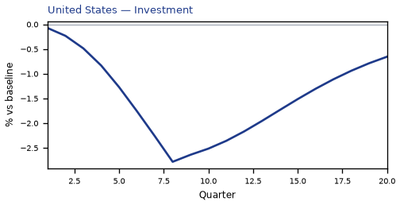

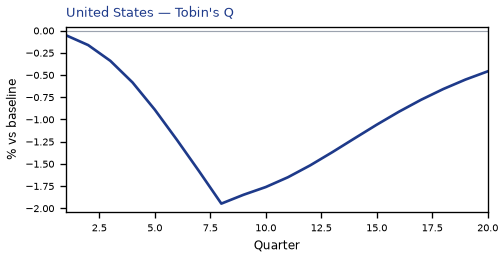


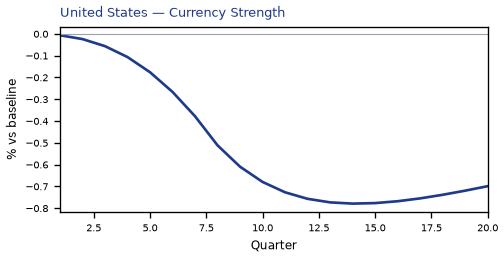


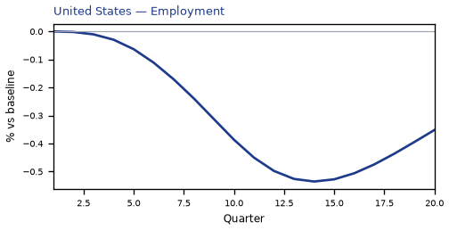

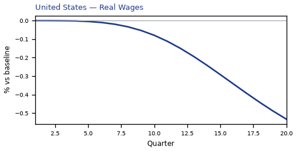

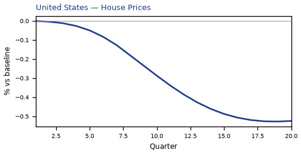

[Q1–Q20 JSON for United States](numbers/US.json)

## MX — Mexico

The main impact of a 200 basis-point (2.00 percentage-point) rise in United States interest rates on Mexico is a 0.17% drop in GDP by the 13th quarter — a modest spillover, not a severe hit. Mexico ranks second among the countries modelled by absolute GDP effect, but the peak damage stays well under two-tenths of a percent of baseline output. The path builds slowly: essentially nothing in Q1 (−0.002%), then a steady widening through the first year, reaching −0.10% by Q8 and the trough of −0.1655% in Q13. It does not fade by Q20 — the gap is still −0.0715% at the end of the horizon, roughly 43% of the peak, so the shock leaves a persistent scar rather than a clean bounce-back.

Demand and trade. Household consumption (Consumption) tracks the GDP shape closely, peaking at −0.0875% in Q13 and still −0.0456% by Q20, as higher US rates tighten global financial conditions and weigh on Mexican households. Private investment (Investment) is hit far harder, peaking at −0.6151% in Q10 — the cost-of-capital channel is the dominant domestic drag. Net exports (the trade balance, since this model does not split imports from exports) move the other way, peaking at +0.1998% in Q9 and remaining +0.1164% by Q20: a weaker real exchange rate makes Mexican exports more competitive and pulls the trade balance into surplus. Government spending (Gov Spending) rises modestly, peaking at +0.0247% in Q12, a small automatic-stabiliser offset. Government debt (Gov Debt) falls relative to baseline, reaching −0.1864% by Q20, as the primary balance improves.

External / FX. The real exchange rate (Currency Strength) depreciates — the series rises to +1.0991% by Q10, meaning the peso is weaker in real terms versus baseline. That lines up exactly with the net-exports improvement: a cheaper real currency is what drives the trade balance gain, and the two series peak within a quarter of each other. The currency stays weak through Q20 (+0.6457%), so the competitiveness gain is durable.

Labour. Employment falls, peaking at −0.1307% in Q17 and still −0.118% by Q20 — job losses accumulate slowly and persist. Unemployment rises by a peak of 0.0143 percentage points in Q14, a small but real deterioration that mirrors the employment decline. Real wages rise initially, peaking at +0.1453% in Q12, because inflation falls faster than nominal wages; but by Q20 real wages turn slightly negative (−0.0186%), as the labour-market slack finally catches up.

Prices. CPI inflation rises early, peaking at +0.0636 percentage points in Q2, driven by the initial currency depreciation passing through to import prices. It fades by Q10 and turns negative from Q11, ending at −0.0197pp by Q20. Domestic inflation follows the same arc, peaking at +0.0445pp in Q2 and turning negative from Q11 (−0.0138pp by Q20). Firms' marginal cost falls, peaking at −0.0991% in Q13, consistent with weaker demand and lower input costs.

Financial conditions. The local policy rate rises initially, peaking at +0.1653 percentage points in Q8, as the central bank leans against the inflation spike; it then turns negative from Q14, ending at −0.0833pp by Q20 as the growth drag dominates. Government yields move in a mixed pattern: the 2-year yield (Govt 2Y Yield) rises to +0.1429pp in Q3 before turning negative from Q11 (−0.0732pp by Q20); the 5-year yield (Govt 5Y Yield) rises modestly to +0.0484pp in Q1 then falls to −0.0618pp by Q15; and the 10-year yield (Govt 10Y Yield) is essentially flat early and drifts down to −0.0415pp by Q14. Bond prices (Bond Price) fall as discount rates rise, peaking at −0.6889% in Q8, then recover to +0.347% by Q20 as yields decline. Equity prices (Equity Index) fall, peaking at −0.4796% in Q8 and still −0.139% by Q20. Tobin's Q (the value of installed capital) falls to −0.4306% in Q10, and house prices (House Prices) decline steadily to −0.2047% by Q18. Bank credit (Bank Credit) contracts to −0.0247% by Q18, and lending spreads (Credit Spread) widen by a peak of 0.0014 percentage points in Q18 — both small, but directionally consistent with tighter financial conditions.

Sectoral and capital. Manufacturing GDP (Manuf. GDP) is the hardest-hit sector, peaking at −0.3582% in Q10 and still −0.2071% by Q20 — more than twice the aggregate GDP decline, reflecting its sensitivity to investment and trade. Services GDP (Services GDP) falls less, peaking at −0.1001% in Q13 and −0.0433% by Q20. The capital stock (Capital Stock) erodes gradually, reaching −0.0343% by Q20, the cumulative result of weaker investment.

Timing. The GDP hit is largest in Q13 at −0.1655%, and it has not faded by Q20 — the gap remains −0.0715%, so the shock is persistent rather than transitory. The equity and bond-price troughs come earlier, in Q8, while the labour-market and housing troughs come later, in Q14–Q18.

Close. These are model impulse responses versus baseline, not forecasts. They describe how a 200bp US rate rise propagates through Mexico under the model's assumptions, and should be read as conditional, structural estimates rather than predictions of what will actually happen. Number check vs JSON: GDP peak -0.17%, CPI 3y +0.40pp, equity peak -0.48%.


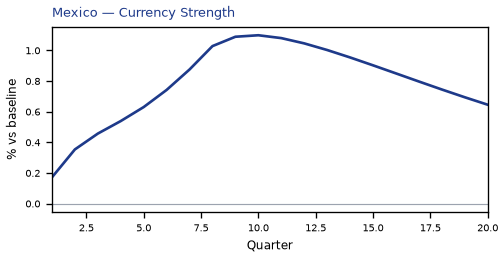

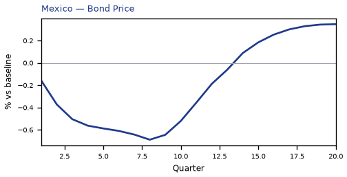

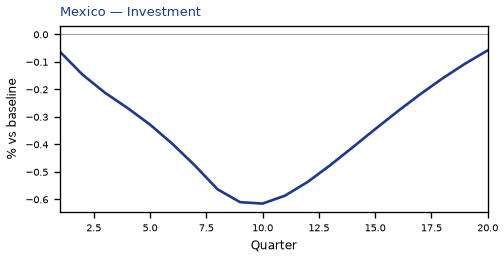

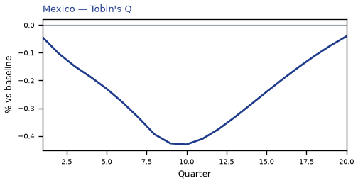

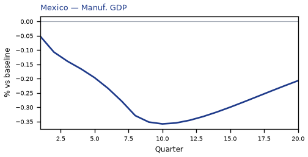

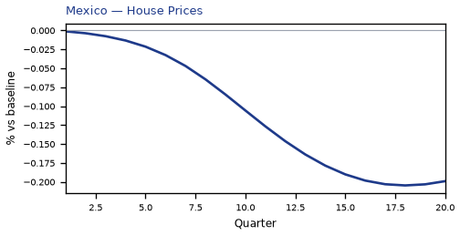

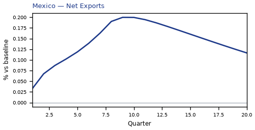

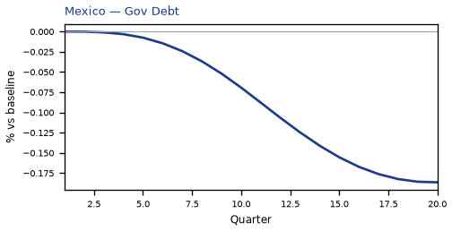


[Q1–Q20 JSON for Mexico](numbers/MX.json)

## CA — Canada

The main impact of a 200 basis-point (2.00 percentage-point) rise in United States interest rates on Canada is a 0.14% drop in GDP by the 12th quarter — a modest spillover for a large, tightly linked neighbour. The shock is a US monetary tightening, and Canada sits third by absolute GDP effect, in the "modest" band. The peak is small in level terms and arrives late, which tells you the transmission is gradual: financial conditions tighten first, real activity follows, and the drag builds rather than lands at once.

Demand and trade. Household consumption falls to a peak shortfall of 0.08% of baseline around the 13th quarter, a slow squeeze as higher discount rates and weaker labour income feed through. Private investment is hit far harder, peaking at −0.56% in the 10th quarter — the cost-of-capital channel is the sharpest domestic drag, and it is the reason the GDP path keeps deepening into Q12. Net exports, which here means the trade balance (this model does not split imports from exports), actually improve, peaking at +0.20% of baseline in the 9th quarter, as the weaker real exchange rate makes Canadian production more competitive abroad. Government spending edges up to +0.02% by Q12, a mild automatic-stabiliser offset, while government debt drifts to −0.03% of baseline by Q19 — a small decline, consistent with the debt ratio improving slightly as the economy and price level move.

External / FX. The real exchange rate — currency strength — appreciates to +1.41% above baseline by the 10th quarter. That is the key external fact: Canadian assets become relatively more attractive as US rates rise, the currency strengthens, and that is exactly what lines up with the improving net export balance in the model, since a stronger currency is the mirror of the competitiveness shift that supports the trade position here. The two series move together through the middle of the horizon.

Labour. Employment falls to a peak shortfall of 0.14% by the 15th quarter, a delayed response consistent with the slow-building output gap. Unemployment rises to a peak of 0.09 percentage points above baseline at the same quarter, so the labour market loosens modestly. Real wages, by contrast, rise to +0.19% above baseline by Q13 — real compensation holds up even as employment falls, because the price level cools faster than nominal wages adjust.

Prices. CPI inflation rises to +0.08 percentage points above baseline in Q2, an initial pass-through bump, then fades and turns negative by Q11, ending at −0.02pp by Q20. Domestic inflation follows the same arc, peaking at +0.05pp in Q2 and turning negative by Q11. Firms' marginal cost falls to −0.09% of baseline by Q12, the disinflationary pressure that ultimately pulls measured inflation below baseline.

Financial conditions. The local policy rate rises to +0.16 percentage points annualised by Q8, then falls below baseline from Q14, ending at −0.10pp — the Bank of Canada leans against the US tightening early, then eases as the drag bites. The 2-year government yield peaks at +0.14pp in Q3 and turns negative by Q11; the 5-year yield peaks at −0.08pp in Q15; the 10-year yield drifts to −0.05pp by Q14. Bond prices fall to −0.93% of baseline by Q8 before recovering and turning positive from Q14. Equity prices fall to −0.48% by Q10, Tobin's Q — the value of installed capital — falls to −0.39% by Q10, and house prices decline to −0.14% by Q18. Bank credit contracts to −0.03% of baseline by Q18, and lending spreads widen by a trivial 0.0004 percentage points by Q17.

Sectoral and capital. Manufacturing GDP is the hardest-hit sector, falling to −0.44% of baseline by Q10 — far deeper than the aggregate, reflecting its sensitivity to the cost of capital and the exchange rate. Services GDP falls to −0.10% by Q12, a milder decline. The capital stock erodes to −0.03% of baseline by Q20, the slow accumulation effect of weaker investment.

Timing. The GDP hit is largest in Q12 at −0.14% of baseline, and it has not faded by Q20 — it is still −0.06% below baseline at the end of the horizon, so the drag persists rather than reversing. The equity and investment peaks both land around Q10, ahead of the output trough, consistent with financial conditions leading activity.

Close. These are model impulse responses to a 200bp US rate rise, relative to baseline — not forecasts. They describe the conditional path the model implies, not a prediction of what Canada will do.


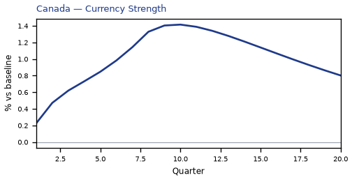

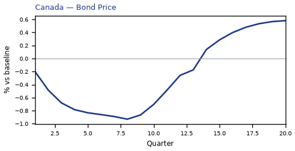

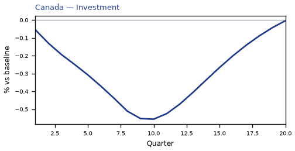

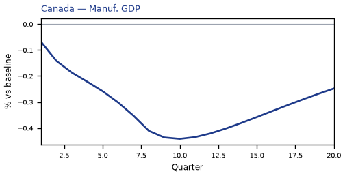

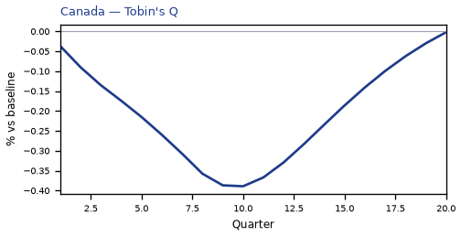

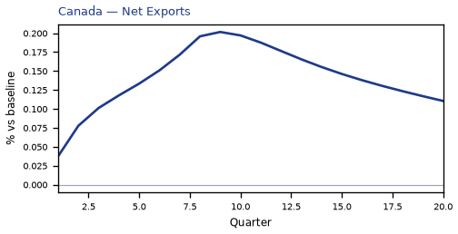

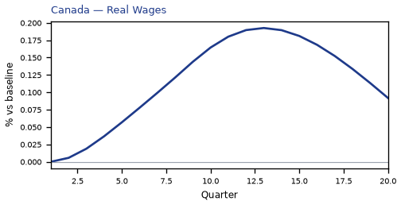


[Q1–Q20 JSON for Canada](numbers/CA.json)

## SA — Saudi Arabia

The main impact of a 200 basis-point (2.00 percentage-point) rise in United States interest rates on Saudi Arabia is a 0.14% drop in GDP by the 14th quarter — a modest spillover, not a severe hit. This is the fourth-largest absolute GDP response in the panel, but the magnitude stays small: the shock transmits mainly through tighter global financial conditions and a firmer dollar, and Saudi Arabia's peg and hydrocarbon-linked fiscal cushion keep the real-economy damage contained. The path builds slowly — essentially nothing in Q1 (−0.001%), then a steady widening to the Q14 trough of −0.137% of GDP — and it has not faded by Q20, where GDP is still 0.096% below baseline. This is a persistent level effect, not a temporary dip.

Demand and trade. Household consumption (Consumption) falls to −0.081% by Q8, recovers sharply to −0.029% in Q9, then drifts back down to −0.058% by Q20 — a lumpy profile that reflects the interaction of higher borrowing costs with the policy-rate response. Private investment (Investment) is hit much harder, peaking at −1.93% in Q8 as the cost of capital rises, then decaying to −0.38% by Q20. Net exports (the trade balance) deteriorate to −0.173% by Q13 and remain at −0.108% in Q20, so the external account is a persistent drag rather than a one-off. Government spending (Gov Spending) barely moves — a peak decline of just −0.024% in Q12, turning negative only from Q3 — and government debt (Gov Debt) falls steadily to −0.197% by Q20, consistent with a smaller nominal economy and softer revenue.

External / FX. The real exchange rate (Currency Strength) depreciates to −0.551% by Q14 and stays near −0.497% at Q20. That is a real depreciation, which should normally support competitiveness — yet net exports still worsen. The reason is that the trade balance is being dragged by weaker domestic and global demand rather than by price competitiveness, so the currency move and the NX path point in opposite directions in terms of what they imply for tradables.

Labour. Employment falls to −0.125% by Q18 and is still −0.121% below baseline at Q20, tracking the output path with a lag. Unemployment rises by 0.050 percentage points, peaking in Q17, and remains 0.047 points above baseline at Q20. Real wages decline steadily to −0.173% by Q20 — the largest labour-market effect — as weaker labour demand and softer inflation erode real compensation.

Prices. CPI inflation falls by 0.026 percentage points at its Q9 trough and has mostly faded by Q17, ending at −0.001 points in Q20. Domestic inflation follows a similar arc, peaking at −0.018 points in Q9 and fading by Q17. Firms' marginal cost declines to −0.082% by Q14 and remains −0.058% below baseline at Q20, so the disinflationary impulse is real but small in absolute terms.

Financial conditions. The local policy rate rises to 1.168 percentage points by Q8, then unwinds to 0.080 points by Q20 — a substantial but temporary tightening. Government bond prices (Bond Price) fall 5.84% at the Q8 trough, the largest single response in the model, before recovering to −0.40% by Q20. The 2-year government yield rises 0.778 points at Q5, the 5-year yield 0.435 points at Q2, and the 10-year yield 0.225 points at Q1 — a classic inverted response where the front end moves most and the long end barely budges. Equity prices fall 0.588% at Q13 and remain −0.391% below baseline at Q20. Tobin's Q drops 1.354% at Q8, house prices decline 0.244% by Q19, bank credit contracts 0.011% by Q18, and lending spreads widen by a negligible 0.0002 percentage points — so credit conditions tighten only marginally.

Sectoral and capital. Services GDP falls 0.060% at Q14 and stays −0.042% below baseline at Q20. Manufacturing GDP actually rises, peaking at +0.151% in Q14 and holding +0.137% at Q20 — the one sector that benefits, likely from the real depreciation and reallocation effects. The capital stock declines steadily to −0.087% by Q20, reflecting the cumulative investment shortfall.

Timing. The GDP hit is largest in Q14 at −0.137% and has not faded by Q20, where it remains −0.096%. The equity trough is Q13, the bond-price trough Q8, and the investment trough Q8. The shock builds for roughly three and a half years and then plateaus rather than reversing.

Close. These are model impulse responses relative to baseline, not forecasts. They describe how a 200bp US rate rise propagates through Saudi Arabia under the model's assumed transmission channels — a modest, persistent drag concentrated in investment, bond prices, and the external account, with manufacturing as the sole offsetting sector. Number check vs JSON: GDP peak -0.14%, CPI 3y -0.18pp, equity peak -0.59%.


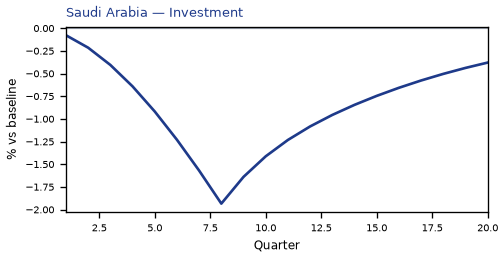

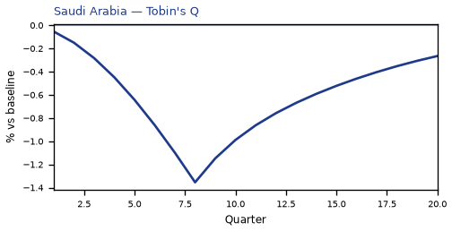


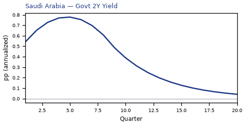

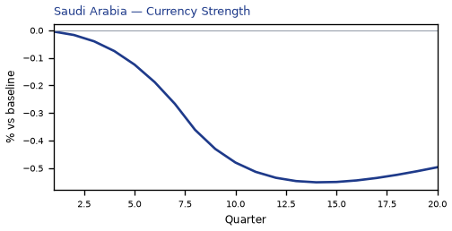

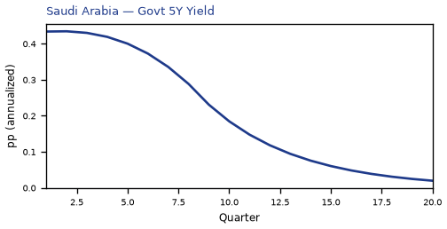

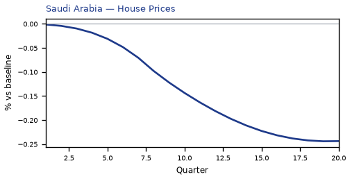

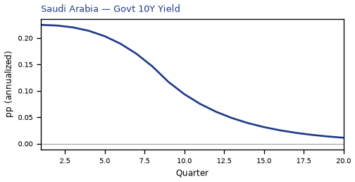

[Q1–Q20 JSON for Saudi Arabia](numbers/SA.json)

## CO — Colombia

The main impact of a 200 basis-point (2.00 percentage-point) rise in United States interest rates on Colombia is a 0.07% drop in GDP by the 12th quarter — a limited spillover. Colombia ranks fifth by absolute GDP response across the modelled countries, but the band is "minimal": the peak output loss of −0.0716% of GDP is small in absolute terms, and the path never turns positive within the twenty-quarter window. The shock is a single US monetary tightening; nothing else is active, so every movement below is the model's transmission of higher US rates into Colombian activity, prices, and asset values.

Demand and trade. Household consumption (Consumption) falls gradually, reaching −0.0342% versus baseline in Q13 before partially recovering to −0.0136% by Q20 — a slow, persistent drag rather than a sharp collapse. Private investment (Investment) is hit much harder and much earlier: it peaks at −0.2419% in Q9, then recovers steadily and actually turns marginally positive by Q20 (+0.0067%). Net exports (Net Exports, the trade balance — this model does not split imports from exports) improve throughout, peaking at +0.0729% in Q9 and still +0.0257% by Q20, which is the classic competitiveness offset to weaker domestic demand. Government spending (Gov Spending) barely moves, drifting up to +0.0081% at Q12, while government debt (Gov Debt) declines steadily to −0.0616% by Q19 — a small improvement in the fiscal position rather than a deterioration.

External / FX. The real exchange rate (Currency Strength) appreciates sharply, peaking at +0.8081% in Q10 and remaining +0.3397% above baseline at Q20. That is the key tension in this simulation: a stronger real currency should normally hurt net exports, yet the trade balance improves. The resolution is that the domestic demand contraction (especially the investment collapse) is large enough to compress imports by more than the stronger currency weighs on exports, so the trade balance still improves even as competitiveness worsens.

Labour. Employment falls steadily, peaking at −0.048% below baseline in Q16 and still −0.0392% at Q20 — a slow-building labour-market drag. Unemployment rises in parallel, peaking at +0.0061 percentage points in Q14 and remaining +0.0035pp at Q20. Real wages initially rise, peaking at +0.0663% in Q11, because inflation falls faster than nominal wages adjust; but that gain erodes and turns negative by Q19, ending at −0.0276% by Q20.

Prices. CPI inflation rises modestly at first, peaking at +0.0281 percentage points in Q2, then fades and turns negative by Q11, ending at −0.0098pp by Q20. Domestic inflation follows the same pattern, peaking at +0.0197pp in Q2 and turning negative by Q11 (−0.0069pp at Q20). Firms' marginal cost falls throughout, peaking at −0.0428% in Q12 — consistent with the weaker demand and stronger currency pushing input costs down.

Financial conditions. The local policy rate rises modestly at first, peaking at +0.0577 percentage points in Q5, then falls below baseline from Q13 onward, ending at −0.0411pp by Q20. Government 2-year yields rise to +0.0512pp in Q3 before turning negative from Q9 (−0.0292pp at Q20); 5-year yields peak at −0.0269pp in Q13; 10-year yields drift down to −0.0141pp by Q12. Bond prices fall initially, peaking at −0.206% in Q5, then recover and turn positive from Q14, ending at +0.1467% by Q20. Equity prices fall hardest, peaking at −0.3788% in Q8 and still −0.0511% below baseline at Q20. Tobin's Q (the value of installed capital) falls to −0.1693% in Q9 before recovering to +0.0047% by Q20. House prices decline steadily, peaking at −0.0782% in Q17 and still −0.0734% at Q20. Bank credit contracts only marginally, peaking at −0.0063% in Q18, and lending spreads widen by a trivial +0.0003 percentage points at Q17 — financial frictions are essentially absent in this channel.

Sectoral and capital. Manufacturing GDP is hit far harder than the aggregate, peaking at −0.249% in Q10 and still −0.1029% at Q20. Services GDP falls much less, peaking at −0.0433% in Q12 and −0.0137% at Q20. The capital stock erodes slowly, peaking at −0.0128% in Q19 — a small but persistent scar from weaker investment.

Timing. The GDP hit is largest at Q12 (−0.0716%) and has not faded by Q20, where it remains −0.0226%. The equity trough is earlier, at Q8. The CPI effect peaks almost immediately at Q2 and fades by Q10. So the sequence is: prices and asset values react first, investment and manufacturing output follow, and the aggregate GDP and labour-market effects build slowly and persist.

Close. These are model impulse responses relative to a no-shock baseline, not forecasts. They describe how a 200bp US rate rise propagates through Colombia under the model's estimated structure — a limited but durable drag, concentrated in investment, manufacturing, and equity values, partially offset by a stronger trade balance. Number check vs JSON: GDP peak -0.07%, CPI 3y +0.15pp, equity peak -0.38%.


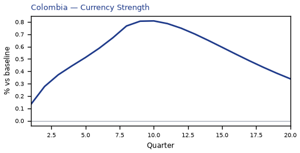

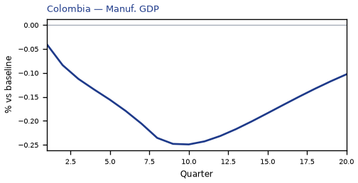

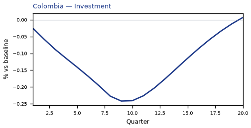

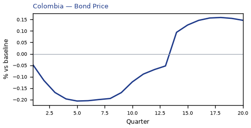


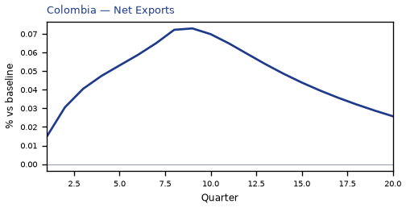

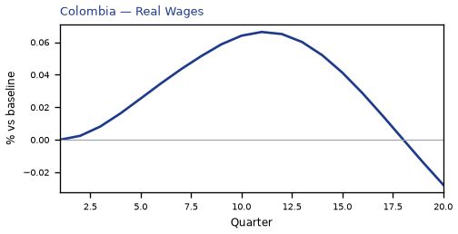

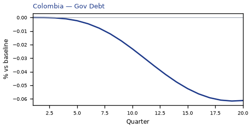

[Q1–Q20 JSON for Colombia](numbers/CO.json)

## AR — Argentina

The main impact of a 200 basis-point (2.00 percentage-point) rise in United States interest rates on Argentina is a 0.07% drop in GDP by the tenth quarter — a minimal spillover. Argentina ranks sixth by absolute GDP response among the countries in this run, but the band is "minimal": the peak hit is roughly seven-hundredths of one percent of GDP, and the path actually turns positive from the seventeenth quarter onward, reaching +0.04% above baseline by Q20. This is a small, slow-burning, and ultimately self-reversing effect, not a crisis.

**Demand and trade.** Household consumption (Consumption) tracks the GDP path closely, peaking at −0.03% in Q10 and recovering to +0.02% by Q20. Private investment (Investment) is the hardest-hit demand component, falling 0.17% at its Q8 trough before swinging to +0.09% above baseline by Q20 — the cost-of-capital channel is doing most of the near-term damage. Net exports (the trade balance, since this model does not split imports from exports) move the other way early: +0.01% in Q1, peaking at +0.02% around Q4, then deteriorating to −0.02% by Q18 as the currency appreciation erodes competitiveness. Government spending (Gov Spending) rises modestly, peaking at +0.01% in Q10, a small automatic-stabiliser-style offset. Government debt (Gov Debt) drifts down relative to baseline, troughing at −0.02% in Q15 — a small improvement in the debt path, not a deterioration.

**External / FX.** The real exchange rate (Currency Strength) appreciates sharply, peaking at +0.32% in Q8 — the peso strengthens in real terms as US rates rise. That lines up exactly with the net-exports story: the early NX gain fades and turns negative precisely as the currency appreciation builds, and by Q18 net exports are 0.02% below baseline while the currency has given back most of its gain. The appreciation is the dominant external channel here.

**Labour.** Employment falls gradually, peaking at −0.03% below baseline in Q13, then recovering to +0.01% by Q20. Unemployment rises by 0.01 percentage points at its Q12 peak — a tiny labour-market cost — before falling 0.003 points below baseline by Q20. Real wages are the most persistent labour variable: they rise slightly early (+0.02% around Q6) but then fall steadily, peaking at −0.07% below baseline in Q18 and still −0.06% down at Q20. Workers bear a lasting real-income cost even as employment recovers.

**Prices.** CPI inflation rises 0.02 percentage points in Q1, fades by Q4, and turns negative from Q6, troughing at −0.01 percentage points around Q11 before returning to +0.004 points by Q20. Domestic inflation follows the same shape, peaking at +0.01 points in Q1 and troughing at −0.01 points in Q11. Firms' marginal cost falls 0.04% at its Q10 trough, consistent with the disinflationary demand drag, then recovers to +0.02% above baseline by Q20.

**Financial conditions.** The local policy rate rises 0.02 percentage points initially, then falls to −0.05 points below baseline by Q12 — the local central bank eases into the slowdown. Government 2-year yields fall 0.04 points at their Q9 trough before rising 0.03 points above baseline by Q20. The 5-year yield dips 0.01 points early, then climbs to +0.02 points by Q19. The 10-year yield stays mildly positive throughout, ending +0.01 points. Bond prices fall 0.14% at their Q8 trough, then swing to +0.13% above baseline by Q12 — a striking reversal. Equity prices are the largest single response in the whole table: −0.57% at the Q8 trough, recovering to +0.04% by Q20. Tobin's Q (the value of installed capital) falls 0.12% at its Q8 trough and ends +0.06% above baseline. House prices decline steadily, peaking at −0.06% below baseline in Q14 and still −0.03% down at Q20 — the most persistently negative financial variable. Bank credit contracts only marginally, peaking at −0.01% below baseline in Q17, and lending spreads widen by just 0.002 percentage points at their Q17 peak. Financial conditions tighten, but the credit channel is barely engaged.

**Sectoral and capital.** Manufacturing GDP is hit hardest of the production sectors, falling 0.10% at its Q8 trough before recovering to +0.03% by Q20. Services GDP falls 0.04% at its Q10 trough and ends +0.02% above baseline. The capital stock erodes very slowly, peaking at −0.01% below baseline in Q14 and still −0.01% down at Q20 — investment weakness leaves a small permanent scar on productive capacity.

**Timing.** The GDP hit is largest in Q10 at −0.07%, and it has fully faded by Q16, turning positive from Q17. The equity and investment troughs come earlier, at Q8. The disinflation trough is around Q11. Nothing here is large; the whole episode is a modest, delayed, and largely self-correcting drag.

**Close.** These are model impulse responses to a 200 basis-point US rate rise, relative to a no-shock baseline — not forecasts, and not trading advice. They describe how this model's Argentina block behaves under a US tightening shock, nothing more.


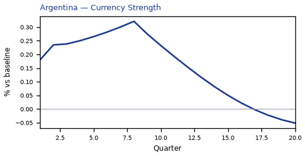

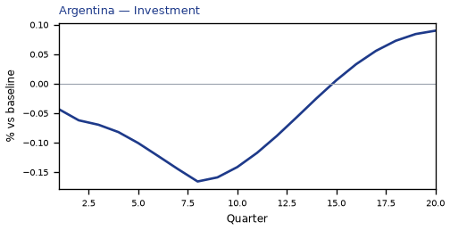

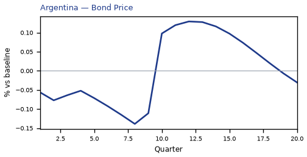

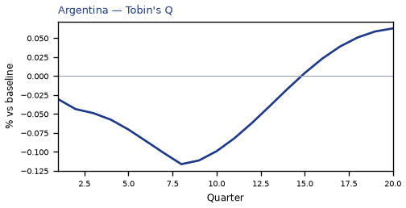

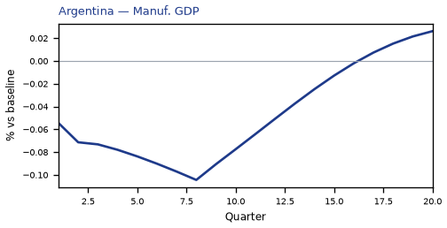

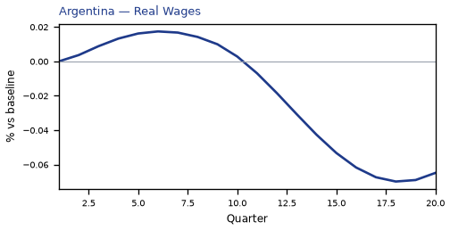

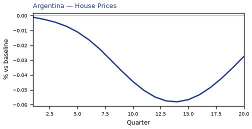


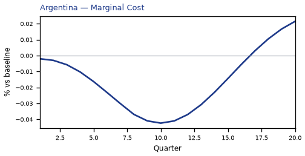

[Q1–Q20 JSON for Argentina](numbers/AR.json)

## BR — Brazil

The main impact of a 200 basis-point (2.00 percentage-point) rise in United States interest rates on Brazil is a 0.07% drop in GDP by the twelfth quarter — a limited spillover. Brazil ranks seventh by absolute GDP impact and sits in the "minimal" band. The shock is a US monetary tightening, and Brazil's response is a slow-building, modest drag rather than a sharp contraction. GDP (real GDP) falls just 0.0018% in Q1, deepens gradually to a trough of −0.0693% in Q12, and is still −0.0132% below baseline by Q20, so the hit has largely faded but not fully closed within the horizon.

Demand and trade. Household consumption declines steadily, reaching −0.031% around Q13 and easing to −0.0078% by Q20 — a persistent but small drag on the consumer. Private investment is the hardest-hit domestic demand component: it falls 0.0206% in Q1, peaks at −0.2097% in Q9, then recovers so strongly that it turns positive by Q19 (+0.0099%) and ends Q20 at +0.0266%, as the cost-of-capital shock unwinds. Net exports (the trade balance) actually improve, peaking at +0.0311% in Q8 before fading to +0.0061% by Q20 — the weaker real activity and stronger currency dynamics leave the external balance modestly better, not worse. Government spending barely moves, peaking at just +0.01% in Q11, a negligible fiscal offset. Government debt drifts down to −0.0107% around Q19, reflecting the small primary-balance improvement rather than any active fiscal response.

External / FX. The real exchange rate (currency strength) appreciates sharply, rising 0.1114% in Q1 to a peak of +0.677% in Q10, then easing to +0.2903% by Q20. This is the dominant transmission channel: a stronger real exchange rate makes Brazilian exports less competitive, which is consistent with the modest net-export gain being driven more by compressed imports than by export strength. The currency appreciation and the trade-balance improvement line up as a real-income effect rather than a competitiveness gain.

Labour. Employment falls gradually, from zero in Q1 to a trough of −0.0426% in Q16, ending Q20 at −0.0326% — a slow labour-market deterioration that lags the output trough. Unemployment rises correspondingly, peaking at +0.0136 percentage points in Q14 and easing to +0.0069pp by Q20. Real wages initially rise — peaking at +0.028% in Q10 — as inflation cools faster than nominal wages, then turn negative after Q16 and end Q20 at −0.039%, so the real-wage gain is temporary and reverses into a loss.

Prices. CPI inflation rises early, peaking at +0.0143 percentage points in Q2, then decelerates and turns negative by Q10, ending Q20 at −0.0059pp. Domestic inflation follows a similar arc, peaking at +0.01pp in Q2 and turning negative by Q10, ending at −0.0041pp. Firms' marginal cost falls steadily, peaking at −0.0414% in Q12 and ending Q20 at −0.0079%, consistent with the disinflationary demand drag.

Financial conditions. The local policy rate initially rises — peaking at +0.0444pp in Q5 — as the central bank leans against early inflation, then turns negative after Q11 and ends Q20 at −0.0365pp, a net easing as the growth drag dominates. Government 2-year yields rise early (+0.0349pp in Q1), peak at −0.0411pp in Q14, and end Q20 at −0.0205pp. Government 5-year yields fall throughout, peaking at −0.0238pp in Q11 and ending at −0.0074pp. Government 10-year yields fall modestly, peaking at −0.0103pp in Q11 and ending at −0.0022pp. Bond prices fall to −0.2333% in Q8, then recover strongly and turn positive after Q13, ending Q20 at +0.1523%. The equity index falls to −0.4453% in Q8 and recovers to −0.0389% by Q20. Tobin's Q (the value of installed capital) falls to −0.1468% in Q9, turns positive by Q19, and ends Q20 at +0.0187%. House prices decline steadily to −0.0682% around Q17 and end Q20 at −0.061%. Bank credit supply contracts modestly, peaking at −0.0068% in Q17 and ending at −0.0065%. The lending spread widens only marginally, peaking at +0.0003pp in Q17 — a negligible credit-cost effect.

Sectoral and capital. Services GDP falls to −0.0458% in Q12 and ends Q20 at −0.0087%. Manufacturing GDP is hit much harder, falling 0.0338% in Q1 to a trough of −0.2095% in Q10, and remains −0.0861% below baseline at Q20 — the tradable sector bears the brunt of the currency appreciation. The capital stock declines gradually to −0.0105% around Q18 and ends Q20 at −0.0103%, a slow depreciation effect from weaker investment.

Timing. The GDP hit is largest in Q12 at −0.0693%, and by Q20 it has mostly faded to −0.0132%, though it has not fully closed. The equity and bond-price troughs arrive earlier, in Q8, while the labour-market and capital-stock troughs arrive later, in Q14–Q18 — a classic sequence of financial shock first, real effects later.

Close. These are model impulse responses relative to baseline, not forecasts. They describe how Brazil's economy deviates from its no-shock path under a 2.00 percentage-point US rate rise, with the currency channel doing most of the work and the real-economy drag remaining modest. Number check vs JSON: GDP peak -0.07%, CPI 3y +0.08pp, equity peak -0.45%.


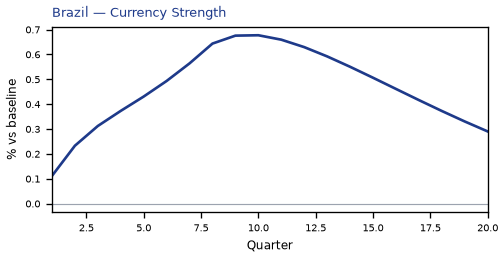

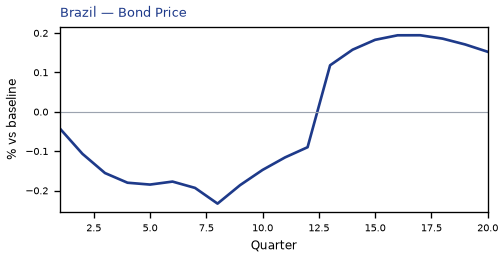

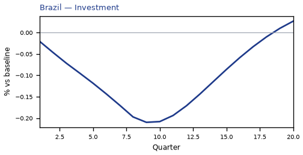

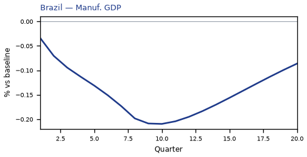

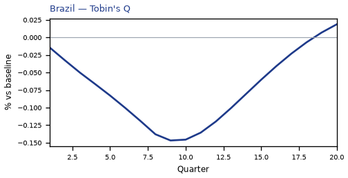

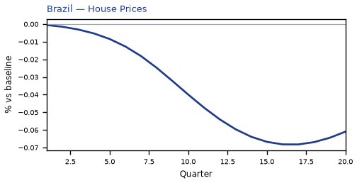


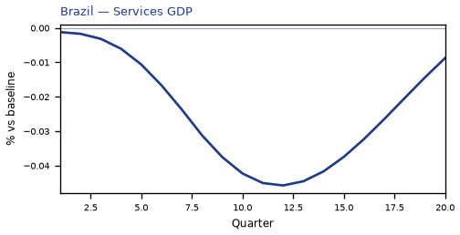


[Q1–Q20 JSON for Brazil](numbers/BR.json)

## UK — United Kingdom

The main impact of a 200 basis-point (2.00 percentage-point) rise in United States interest rates on the United Kingdom is a 0.07% drop in GDP by the 11th quarter — a limited spillover, consistent with the UK sitting in the "minimal" band, eighth-largest absolute GDP response among the countries modelled. This is a small, slow-building hit rather than a dramatic one: the first-quarter GDP effect is essentially nil at −0.0008%, and the peak only arrives nearly three years in. The story is one of a modest external tightening impulse transmitted mainly through financial conditions and trade competitiveness, with the real economy absorbing a shallow but persistent drag.

Demand and trade. Household consumption (Consumption) tracks the GDP path closely, peaking at −0.04% around Q11 and still −0.01% below baseline at Q20 — households pull back gradually as financial conditions tighten. Private investment (Investment) is hit much harder, peaking at −0.20% in Q10, reflecting the higher cost of capital; it remains −0.03% below baseline at Q20. Net exports (Net Exports, the trade balance — this model does not split imports from exports) actually improve, peaking at +0.05% of GDP in Q9, as the weaker real exchange rate makes UK goods more competitive abroad. Government spending (Gov Spending) rises modestly, peaking at +0.01% in Q11, providing a small automatic-stabiliser offset, while government debt (Gov Debt) drifts down to −0.005% by Q13 as the primary balance improves relative to baseline.

External / FX. The real exchange rate (Currency Strength) depreciates — the series rises to +0.47% above baseline by Q9, meaning the pound is weaker in real terms. That lines up cleanly with the net-exports improvement: a more competitive currency supports the trade balance, which is the one channel in this model that partially offsets the domestic demand drag. The currency effect fades only slowly, still +0.11% at Q20.

Labour. Employment falls, peaking at −0.06% below baseline in Q14, and remains −0.03% down at Q20 — a slow labour-market deterioration that lags the output hit. Unemployment rises in parallel, peaking at +0.04 percentage points in Q14 and still +0.02pp at Q20. Real wages (Real Wages) initially rise, peaking at +0.04% in Q11, as falling CPI inflation boosts real incomes even as nominal wage growth slows; this gain fades and turns slightly negative (−0.01%) by Q20.

Prices. CPI inflation (CPI Inflation) rises modestly at first, peaking at +0.02 percentage points in Q3, before falling below baseline from Q10 onward and reaching −0.01pp by Q20 — the initial uptick reflects currency-driven import costs, while the later decline reflects weak demand. Domestic inflation (Domestic Infl.) follows a similar arc, peaking at +0.01pp in Q3 and turning negative from Q10. Firms' marginal cost (Marginal Cost) falls steadily, peaking at −0.04% below baseline in Q11, consistent with softer demand and lower input costs.

Financial conditions. The local policy rate (Policy Rate) rises slightly, peaking at +0.01 percentage points in Q8, before easing back below baseline from Q15 as the growth drag dominates. Government bond prices (Bond Price) fall sharply, peaking at −0.68% below baseline in Q8, as higher discount rates hit valuations. The 2-year government yield (Govt 2Y Yield) rises to +0.01pp in Q4 before turning negative from Q12; the 5-year yield (Govt 5Y Yield) peaks at −0.01pp in Q19; and the 10-year yield (Govt 10Y Yield) drifts down to −0.005pp by Q17. Equity prices (Equity Index) fall hardest among financial variables, peaking at −0.35% below baseline in Q8 and still −0.05% down at Q20. Tobin's Q (Tobin's Q), the value of installed capital, falls to −0.14% in Q10. House prices (House Prices) decline steadily, peaking at −0.05% below baseline in Q18. Bank credit (Bank Credit) contracts to −0.03% by Q17, and lending spreads (Credit Spread) widen marginally, peaking at +0.0004pp in Q17 — a very small financial-frictions effect.

Sectoral and capital. Manufacturing GDP (Manuf. GDP) is hit hardest of all output measures, peaking at −0.15% below baseline in Q9, reflecting its greater trade and investment sensitivity. Services GDP (Services GDP) falls more modestly, peaking at −0.05% in Q11. The capital stock (Capital Stock) erodes slowly, reaching −0.01% below baseline by Q20 as weak investment accumulates into a smaller productive base.

Timing. The GDP hit is largest in Q11 at −0.07%, and it has largely faded by Q20, when it stands at −0.02% — still negative but well off its peak. The equity and bond-price effects peak earlier, around Q8, while labour-market effects peak later, around Q14. Nothing here changes sign in GDP terms; the drag simply decays.

Close. These are model impulse responses to a single identified shock — a 200bp US rate rise — relative to a baseline path, not forecasts. They describe how the UK economy would be expected to respond under the model's estimated transmission channels, and should be read as conditional, mechanical responses rather than predictions of what will actually happen.


[Q1–Q20 JSON for United Kingdom](numbers/UK.json)

## CL — Chile

The main impact of a 200 basis-point (2.00 percentage-point) rise in United States interest rates on Chile is a 0.06% drop in GDP by the 12th quarter — a limited spillover, consistent with Chile sitting in the "minimal" band and ranking ninth by absolute GDP effect among the countries in this run. The shock is a US monetary tightening, and Chile's response is the model's estimated deviation from its own baseline, not a forecast. The path builds gradually: GDP is essentially flat in Q1 (−0.0018%), deepens through the middle quarters, peaks at −0.0645% in Q12, and is still −0.0227% below baseline at Q20. That is a small, persistent drag rather than a sharp recession.

Demand and trade. Household consumption (Consumption) falls steadily, reaching −0.0315% around Q13 and still −0.0135% at Q20, as tighter external conditions and weaker real incomes weigh on spending. Private investment (Investment) is hit much harder, peaking at −0.2351% in Q9 before fading to −0.0052% by Q20 — the cost-of-capital channel is the dominant domestic drag. Net exports (the trade balance) actually improve, peaking at +0.0755% in Q9 and remaining +0.0338% at Q20, because the currency weakens and competitiveness improves. Government spending (Gov Spending) edges up only marginally, peaking at +0.0058% in Q11, a near-trivial stabilizer. Government debt (Gov Debt) drifts lower relative to baseline, reaching −0.0379% around Q18, reflecting the weaker nominal economy rather than an active fiscal consolidation.

External / FX. The real exchange rate (Currency Strength) depreciates — the series rises to +0.5283% by Q9, meaning the peso is weaker in real terms, and it stays +0.2363% above baseline at Q20. That weaker currency lines up exactly with the net-exports improvement: a more competitive real exchange rate supports the trade balance, which is the one component of demand pushing the other way against the investment and consumption drag.

Labour. Employment falls gradually, peaking at −0.0446% around Q16 and still −0.0343% below baseline at Q20. Unemployment rises in parallel, peaking at +0.0206 percentage points in Q14 and remaining +0.0139 points at Q20 — a modest but durable deterioration in the labour market. Real wages initially rise, peaking at +0.0642% in Q11, because inflation cools faster than nominal wages adjust; that gain erodes and turns slightly negative by Q19, ending at −0.0115% in Q20.

Prices. CPI inflation rises modestly at first, peaking at +0.028 percentage points in Q2, then falls below baseline from Q10 onward and ends at −0.0074 points in Q20. Domestic inflation follows the same shape, peaking at +0.0196 points in Q2 and turning negative around Q10, ending at −0.0052 points. Firms' marginal cost falls steadily, peaking at −0.0385% in Q12 and still −0.0136% below baseline at Q20, consistent with weaker demand and a softer cost environment.

Financial conditions. The local policy rate rises slightly, peaking at +0.0579 percentage points in Q8, then falls below baseline from Q13 and ends at −0.0344 points in Q20 as the domestic economy weakens. Government 2-year yields rise early, peaking at +0.0524 points in Q3, then turn negative from Q10 and end at −0.0266 points. The 5-year yield peaks at −0.0233 points in Q14, and the 10-year yield drifts down to −0.0141 points by Q13 — the curve inverts relative to the initial impulse as growth expectations weaken. Bond prices (Bond Price) fall to −0.2412% by Q8, then recover and turn positive from Q14, ending +0.1433% above baseline. Equity prices (Equity Index) fall hardest, peaking at −0.3938% in Q8 and still −0.0625% below baseline at Q20. Tobin's Q (the value of installed capital) falls to −0.1645% in Q9 and recovers to −0.0036% by Q20. House prices decline persistently, peaking at −0.0746% in Q17 and still −0.0709% below baseline at Q20. Bank credit supply contracts only slightly, peaking at −0.0072% in Q17, and lending spreads widen by a trivial +0.0002 percentage points — financial frictions are barely binding in this calibration.

Sectoral and capital. Manufacturing GDP is the hardest-hit sector, peaking at −0.1631% in Q9 and still −0.0718% below baseline at Q20, reflecting its greater sensitivity to investment and external demand. Services GDP falls much less, peaking at −0.039% in Q12 and ending at −0.0137% in Q20. The capital stock declines slowly and monotonically, reaching −0.0125% by Q20 — the investment slump accumulates into a smaller productive capacity over time.

Timing. The GDP hit is largest in Q12 at −0.0645%, and it has not fully faded by Q20, where it remains −0.0227% below baseline. The peak is late and the decay is slow: the shock works through investment, the capital stock, and the labour market with long lags, so the Chilean economy absorbs the US tightening gradually rather than in a single quarter.

Close. These are model impulse responses — deviations from Chile's own baseline under a 200bp US rate rise — not forecasts and not trading advice. They describe the estimated transmission channels, with the currency and net exports offsetting part of the investment-led drag, leaving a small but persistent negative GDP effect.


[Q1–Q20 JSON for Chile](numbers/CL.json)

## CH — Switzerland

**Switzerland: a minimal spillover from a 200bp US rate rise**

The main impact of a 200 basis-point (2.00 percentage-point) rise in United States interest rates on Switzerland is a 0.06% drop in GDP by the 11th quarter — a limited spillover. Switzerland ranks 10th of the countries modelled by absolute GDP effect, and the model band is "minimal." The shock is a US monetary tightening, transmitted to Switzerland through global financial conditions rather than through any domestic policy action. The peak GDP loss is −0.0562% of GDP, reached in Q11, and the path is slow-burning: essentially nothing in Q1 (−0.0007%), building through the first year, and still −0.0164% below baseline at Q20. There is no sign change in the GDP path, so the level of output stays below baseline throughout the horizon even as the growth-rate effect fades.

**Demand and trade.** Household consumption falls in step with output, peaking at −0.0355% in Q11 and still −0.0111% below baseline at Q20. Private investment is the hardest-hit domestic demand component: it peaks at −0.1778% in Q10, a response to the higher global cost of capital, and only mostly fades by Q18. Net exports — the trade balance, since this model does not split imports from exports — move the other way, peaking at +0.0711% in Q9 and remaining +0.0252% above baseline at Q20, as the stronger currency cheapens imports and the domestic slowdown curbs import demand. Government spending rises modestly, peaking at +0.0112% in Q11, a small automatic-stabiliser offset. Government debt falls relative to baseline, peaking at −0.0193% in Q17, consistent with the primary balance improving as the economy slows less than the fiscal impulse.

**External / FX.** The real exchange rate — currency strength — appreciates sharply, peaking at +0.3034% in Q8 and still +0.0998% above baseline at Q20. This is the cleanest transmission channel: higher US rates pull global capital toward dollar assets, and the Swiss franc appreciates in real terms. That appreciation lines up exactly with the net-exports result: the trade balance improves because the stronger franc lowers the relative price of imports, even as it makes Swiss exports less competitive. The two series peak close together (Q8 for the exchange rate, Q9 for net exports), which is the model's way of saying the currency move is doing the work.

**Labour.** Employment falls, peaking at −0.0422% in Q14 and still −0.0261% below baseline at Q20. Unemployment rises in parallel, peaking at +0.0327 percentage points in Q14 and remaining +0.0226pp above baseline at Q20. Real wages, by contrast, rise: they peak at +0.0543% in Q13 and stay +0.0262% above baseline at Q20. This is the standard real-wage response to a demand shock — nominal wages are sticky, inflation falls faster than wages, so real wages rise even as employment falls. The labour market therefore adjusts through quantities (fewer jobs) rather than through prices (real wages).

**Prices.** CPI inflation rises initially, peaking at +0.021 percentage points in Q3, then crosses below baseline at Q10 and ends at −0.0056pp by Q20. Domestic inflation follows the same shape, peaking at +0.0147pp in Q3 and turning negative at Q10, ending at −0.0039pp. Firms' marginal cost falls throughout, peaking at −0.0336% in Q11 and still −0.0098% below baseline at Q20. The initial inflation bump is a currency-pass-through effect — the stronger franc raises the relative price of imports — but it is quickly overtaken by the demand-driven disinflation, which is why both inflation measures turn negative in the second year.

**Financial conditions.** The local policy rate rises slightly, peaking at +0.0192pp in Q7, then turns negative at Q14 and ends at −0.0149pp by Q20 — the Swiss National Bank initially leans against the imported tightening, then eases as domestic slack builds. Government yields move in a curve-twist pattern: the 2-year yield rises to +0.0169pp in Q3 before turning negative at Q10 and ending at −0.0137pp; the 5-year yield peaks at −0.0116pp in Q15; the 10-year yield is below baseline throughout, peaking at −0.0080pp in Q14. Bond prices fall sharply, peaking at −0.5558% in Q8, then recover and turn positive at Q16, ending +0.1045% above baseline. Equity prices fall, peaking at −0.3323% in Q8 and still −0.0716% below baseline at Q20. Tobin's Q — the value of installed capital — falls, peaking at −0.1245% in Q10 and mostly fading by Q18. House prices decline steadily, peaking at −0.0488% in Q18 and still −0.0478% below baseline at Q20. Bank credit contracts, peaking at −0.0224% in Q17 and still −0.0209% below baseline at Q20. The lending spread widens only marginally, peaking at +0.0002pp in Q17 — a rounding-error-sized move that confirms the credit channel is not the main story here.

**Sectoral and capital.** Manufacturing GDP is hit hardest of the production sectors, peaking at −0.0953% in Q9 and still −0.0296% below baseline at Q20 — the tradable sector bears the brunt of the currency appreciation. Services GDP falls less, peaking at −0.0445% in Q11 and still −0.0130% below baseline at Q20. The capital stock declines very slowly, peaking at −0.0089% in Q20, reflecting the cumulative effect of weaker investment; it is the slowest-moving series in the set.

**Timing.** The GDP hit is largest in Q11 at −0.0562%, and it has not faded by Q20 — the level remains −0.0164% below baseline. The peak is late because the transmission runs through investment and the exchange rate, both of which take time to build. The equity and bond-price peaks arrive earlier, in Q8, and the inflation peak earlier still, in Q3. The labour-market peaks arrive later, in Q14. So the sequence is: prices and financial conditions first, then output, then employment.

**Close.** These are model impulse responses to a 200bp US rate rise, not forecasts. They describe how the modelled Swiss economy deviates from its baseline under this specific shock, holding everything else constant. The headline number — a 0.06% GDP loss at peak — is small in absolute terms, which is why the band is "minimal," but the composition matters: a sharp currency appreciation, a weak investment response, and a persistent drag on manufacturing output.


[Q1–Q20 JSON for Switzerland](numbers/CH.json)

## MY — Malaysia

The main impact of a 200 basis-point (2.00 percentage-point) rise in United States interest rates on Malaysia is a 0.05% drop in GDP by the 11th quarter — a limited spillover. Malaysia sits in the minimal band, ranked 11th by absolute GDP effect across the countries in this run, and the shape of the response is a slow build rather than a sharp break. GDP is essentially untouched at the start (down 0.0016% in Q1), then grinds lower through the first year, reaching −0.0086% by Q4, −0.0394% by Q8, and its trough of −0.0544% in Q11. From there it recovers only partially: by Q20 the level is still 0.016% below baseline. There is no sign change in the GDP path, so the model never produces a Malaysian output gain from this shock — the spillover is persistent, not a temporary dip.

Demand and trade. Household consumption follows the same slow arc, bottoming at −0.0296% in Q12 and still −0.0101% below baseline in Q20; the consumer response is smaller than the GDP response, which tells you the drag is not primarily a household story. Private investment is the sharpest domestic mover: it falls 0.0391% in Q1, deepens to −0.1751% by Q9, and only crosses back above baseline in Q20 (+0.0043%), so the cost-of-capital channel does the heavy lifting early. Net exports — the trade balance, since this model does not split imports from exports — move the other way and are a genuine offset: the trade balance improves 0.0583% in Q1, peaks at +0.1064% in Q8, and is still +0.0154% by Q20. Government spending barely moves, drifting up to +0.0056% at Q11 and back to +0.0009% by Q20, while government debt falls steadily to −0.052% by Q19 as the weaker activity path shrinks the debt stock relative to baseline.

External / FX. The real exchange rate — currency strength — appreciates, peaking at +0.3817% in Q8 and remaining +0.0859% above baseline at Q20. That is the mirror image of the net-export gain: a stronger real currency normally hurts competitiveness, yet here the trade balance improves anyway, because the dominant force is weaker domestic demand pulling in fewer imports rather than an export boom. The two series line up as a demand-compression story, not a competitiveness story.

Labour. Employment declines gradually, from zero in Q1 to −0.0346% at its Q15 trough, and is still −0.025% below baseline in Q20. Unemployment rises in parallel, peaking at +0.0118 percentage points in Q14 and easing only to +0.0070pp by Q20 — a small but durable loosening of the labour market. Real wages behave unusually: they rise to +0.0795% by Q10 before fading, turning negative at Q19 and ending −0.0224% below baseline in Q20. The early real-wage gain reflects falling inflation outpacing falling nominal pay; by the end of the horizon that advantage has reversed.

Prices. CPI inflation jumps +0.0638 percentage points in Q1, fades through Q4, then turns negative from Q9 and ends −0.006pp below baseline in Q20. Domestic inflation shows the same pattern, peaking at +0.0447pp in Q1 and turning negative at Q9, ending −0.0042pp. Firms' marginal cost falls steadily to −0.0325% at Q11 and remains −0.0095% below baseline at Q20. The initial inflation bump is a pass-through effect; the later disinflation is the demand gap feeding through to prices.

Financial conditions. The local policy rate rises modestly at first, peaking at +0.0417pp in Q3, then turns negative from Q11 and ends −0.0293pp below baseline as the domestic slowdown dominates. Government yields are mixed: the 2-year yield edges up to +0.0369pp in Q2 before turning negative at Q8 and ending −0.0203pp; the 5-year yield turns negative as early as Q3 and bottoms at −0.0211pp in Q12; the 10-year yield falls throughout, reaching −0.0114pp at Q11 and −0.0057pp at Q20. Bond prices fall to −0.2154% at Q8, then recover strongly, turning positive at Q13 and ending +0.122% above baseline. Equity prices fall to −0.34% at Q8 and remain −0.0514% below baseline at Q20. Tobin's Q — the value of installed capital — drops to −0.1226% at Q9 and returns to +0.003% by Q20. House prices decline persistently, reaching −0.067% at Q17 and still −0.0624% below baseline at Q20. Bank credit contracts only marginally, to −0.0079% at Q17, and the lending spread widens by a trivial +0.0001pp — credit conditions barely tighten in this model.

Sectoral and capital. Manufacturing GDP takes the largest sectoral hit, −0.1196% at Q8, and is still −0.0252% below baseline at Q20. Services GDP falls less, to −0.0311% at Q11, ending −0.0092% below baseline. The capital stock erodes slowly, reaching −0.0091% at Q19 and staying there through Q20 — the investment slump leaves a small permanent dent in productive capacity.

Timing. The GDP hit is largest in Q11 at −0.0544% and has not faded by Q20, where it remains −0.016% below baseline. The peak is late and the recovery is incomplete, so this is a drawn-out spillover rather than a quick bounce.

Close. These are model impulse responses to a 200bp US rate shock, deviations from the model's own baseline — not forecasts of what Malaysia will do. They describe the conditional path implied by the model's transmission channels, and the minimal band reflects how little of the shock reaches Malaysia through them.


[Q1–Q20 JSON for Malaysia](numbers/MY.json)

## KR — South Korea

The main impact of a 200 basis-point (2.00 percentage-point) rise in United States interest rates on South Korea is a 0.05% drop in GDP by the 12th quarter — a limited spillover. South Korea ranks 12th of the countries in this run by the absolute size of its GDP response, and the model places it in the "minimal" band. That is the headline: a US tightening shock of two full percentage points does reach Korea, but the real-economy cost is small, and the more visible damage sits in financial prices rather than in output.

Demand and trade. Household consumption is the slowest-moving domestic component: it slips only 0.002% below baseline in the first quarter, builds to a peak shortfall of 0.027% around Q13, and is still 0.013% below baseline at Q20. Private investment is far more sensitive, falling 0.02% in Q1 and peaking at −0.21% in Q9 before recovering to roughly flat by Q20 — the classic cost-of-capital channel. Net exports, the trade balance (this model does not split imports from exports), move the other way and are the largest positive offset in the whole table: they rise steadily from 0.02% in Q1 to a peak of 0.13% in Q10, easing to 0.06% by Q20. Government spending edges up modestly, peaking at 0.01% in Q12, a small automatic-stabiliser-style response. Government debt drifts lower relative to baseline throughout, reaching −0.02% by Q20, consistent with the small primary-balance improvement rather than any large fiscal expansion.

External and FX. The real exchange rate — currency strength — appreciates against the baseline, rising 0.10% in Q1 and peaking at 0.51% in Q9, then easing to 0.23% by Q20. That is the key tension in the story: a stronger real currency would normally hurt competitiveness, yet net exports improve. In this model the trade balance gain is driven by the domestic demand contraction (imports fall faster than exports), which outweighs the competitiveness drag from the stronger currency.

Labour. Employment falls gradually, from essentially zero in Q1 to a peak shortfall of 0.037% in Q16, still −0.031% at Q20. Unemployment rises in parallel, peaking at +0.019 percentage points in Q15 and remaining +0.014pp at Q20. Real wages, by contrast, rise: they climb to a peak of +0.08% above baseline in Q13, reflecting the fall in CPI inflation outpacing the softening in nominal wages. So the labour market adjusts through slightly fewer jobs and slightly higher joblessness, while those in work see real pay improve.

Prices. CPI inflation rises initially — +0.02pp in Q1, peaking at +0.03pp in Q2 — before fading and turning negative from Q11, ending at −0.01pp by Q20. Domestic inflation follows the same arc, peaking at +0.02pp in Q2 and turning negative in Q11, ending at −0.01pp. Firms' marginal cost falls steadily, peaking at −0.03% in Q12 and still −0.01% at Q20. The early inflation bump is a pass-through effect; the later disinflation is the demand weakness feeding into prices.

Financial conditions. The local policy rate rises modestly, peaking at +0.06pp in Q8, then turns negative from Q14 and ends at −0.04pp — a small, temporary tightening followed by easing. Government bond prices fall as yields rise: the bond price index drops to a peak shortfall of −0.30% in Q8, then recovers and turns positive from Q14, ending +0.19% above baseline. The 2-year government yield rises to +0.05pp in Q3 before turning negative in Q10 and ending at −0.03pp; the 5-year yield peaks at −0.03pp in Q14; the 10-year yield is negative throughout, drifting to −0.02pp by Q14 and −0.01pp at Q20. Equity prices are the hardest hit: the equity index falls to a peak shortfall of −0.38% in Q8, recovering only slowly to −0.06% by Q20. Tobin's Q, the value of installed capital, tracks investment closely, peaking at −0.15% in Q9 and returning to roughly flat by Q20. House prices decline steadily, peaking at −0.05% in Q18 and still −0.05% at Q20. Bank credit supply contracts only marginally, peaking at −0.01% in Q17, and the lending spread widens by a trivial +0.0001pp at its Q17 peak — financial frictions are essentially absent in this response.

Sectoral and capital. Manufacturing GDP takes by far the largest hit of any series: −0.03% in Q1, peaking at −0.16% in Q9, and still −0.07% at Q20. Services GDP falls much less, peaking at −0.03% in Q12 and −0.01% at Q20. The capital stock erodes slowly, peaking at −0.01% in Q19, reflecting the cumulative investment shortfall.

Timing. The GDP hit is largest at −0.05% in Q12. It has not fully faded by Q20 — output is still 0.02% below baseline — so the effect is persistent but small. The equity and bond-price troughs come earlier, around Q8, while the labour-market and house-price troughs come later, in the mid-to-late teens.

Close. These are model impulse responses relative to a no-shock baseline, not forecasts. They describe how South Korea's economy would deviate from its own baseline path under a 200bp US rate rise, holding everything else in the model fixed.


[Q1–Q20 JSON for South Korea](numbers/KR.json)

## NL — Netherlands

The main impact of a 200 basis-point (2.00 percentage-point) rise in United States interest rates on the Netherlands is a 0.05% drop in GDP by the 11th quarter — a limited spillover for a small, open economy that ranks 13th of the countries modelled by absolute GDP effect and sits in the "minimal" band. The shock is a US monetary tightening, not a domestic one, so the Dutch policy rate never moves (it is flat at 0.0 percentage points across all twenty quarters). What the Netherlands imports is tighter global financial conditions, a stronger currency, and weaker external demand, and those channels do the work here.

On demand and trade, the domestic components soften only modestly. Household consumption peaks at −0.03% below baseline in Q12 and is still −0.01% down by Q20. Private investment is the weakest domestic component, peaking at −0.15% in Q11 as the cost of capital rises, and fading only to −0.05% by Q20. Net exports — the trade balance, since this model does not split imports from exports — actually improve, peaking at +0.17% of GDP in Q15 and holding near +0.16% at Q20, which is the offset that keeps the overall GDP hit so small. Government spending drifts up slightly, peaking at +0.01% in Q11, and government debt rises by a peak of +0.008% of GDP in Q18, a rounding-error-sized deterioration.

The external and FX picture is the clearest transmission channel. Currency strength — the real exchange rate — appreciates steadily, peaking at +0.64% above baseline in Q15 and still +0.61% at Q20. That stronger real exchange rate lines up exactly with the net export gain: a more competitive-looking real rate here reflects relative price movements that improve the trade balance even as global demand cools, so the two series move together rather than against each other.

In the labour market, employment falls to a peak shortfall of −0.03% in Q15 and remains −0.03% below baseline at Q20. Unemployment rises by a peak of +0.03 percentage points in Q14, easing to +0.02 points by Q20. Real wages, by contrast, rise throughout, peaking at +0.16% above baseline in Q19 — the real wage gain comes from falling inflation rather than from nominal pay strength, and it persists to the end of the horizon.

On prices, CPI inflation rises early, peaking at +0.04 percentage points in Q8, then fades and turns negative by Q18, ending at −0.002 points in Q20. Domestic inflation follows the same arc, peaking at +0.03 points in Q8 and turning negative in Q18. Firms' marginal cost falls steadily, peaking at −0.03% below baseline in Q11 and remaining −0.01% down at Q20 — the disinflationary pull from weaker activity dominates the early price bump.

Financial conditions tighten sharply in asset prices even though the local policy rate is unchanged. The 2-year, 5-year, and 10-year government yields are all flat at 0.0 percentage points throughout, so the entire yield-curve response is absent in this model. Bond prices nonetheless fall, peaking at −0.57% below baseline in Q8 before recovering to −0.02% by Q20 — the discount-rate effect. Equity prices fall to a peak of −0.31% in Q8 and remain −0.06% down at Q20. Tobin's Q, the value of installed capital, peaks at −0.11% in Q11 and stays −0.03% below baseline at Q20. House prices decline gradually, peaking at −0.05% in Q19. Bank credit supply contracts to a peak of −0.02% in Q17, and lending spreads widen by a trivial +0.0002 percentage points at peak — a negligible credit-cost response.

Sectorally, services GDP peaks at −0.04% below baseline in Q11 and is −0.01% down at Q20. Manufacturing GDP is hit far harder, peaking at −0.19% in Q15 and still −0.18% below baseline at Q20 — the tradable, rate-sensitive sector absorbs most of the external shock. The capital stock barely moves, peaking at −0.008% below baseline only at Q20, since investment weakness takes years to show up in the installed capital measure.

On timing, the GDP hit is largest at −0.05% in Q11, and it has not faded by Q20: the path is still −0.02% below baseline at the end of the horizon, with no sign change and no quarter flagged as "mostly faded." The equity and bond-price responses peak earlier, around Q8, and the currency and net-export responses peak later, around Q15, so the drag is persistent rather than transitory.

These are model impulse responses to a 200 basis-point US rate rise, measured against a baseline in which no such shock occurs — not forecasts, and not trading advice. They describe how the Netherlands' modelled economy deviates from its own baseline path, nothing more. Number check vs JSON: GDP peak -0.05%, CPI 3y +0.34pp, equity peak -0.31%.


[Q1–Q20 JSON for Netherlands](numbers/NL.json)

## TR — Turkey

The main impact of a 200 basis-point (2.00 percentage-point) rise in United States interest rates on Turkey is a 0.05% drop in GDP by the tenth quarter — a minimal spillover, ranking fourteenth among the countries in this run. The shock is a single US monetary tightening, and Turkey's response is small in aggregate output terms even though several financial channels move more visibly. The headline numbers are modest: GDP falls 0.05% below baseline at its worst, CPI inflation rises 0.02 percentage points cumulatively over three years, and the equity index peaks 0.48% below baseline in the eighth quarter. This is a limited, largely financial-channel spillover rather than a deep real-economy hit.

Demand and trade. Household consumption (Consumption) declines gradually, reaching −0.02% below baseline in the eleventh quarter before recovering and turning slightly positive by Q18. Private investment (Investment) is the hardest-hit demand component, falling 0.14% below baseline at its Q8 trough, consistent with a higher cost of capital and weaker financial conditions. Net exports (Net Exports) — this model's trade balance, with imports and exports not split — actually improve, peaking 0.05% above baseline around Q10, as the weaker real exchange rate makes Turkish goods relatively more competitive. Government spending (Gov Spending) edges up to 0.01% above baseline at Q10, a small automatic-stabiliser-style offset, then fades to −0.00% by Q20. Government debt (Gov Debt) drifts 0.02% below baseline by Q15, reflecting the small primary-balance improvement rather than any large fiscal expansion.

External / FX. The real exchange rate (Currency Strength) appreciates 0.23% above baseline at its Q8 peak — meaning the lira strengthens in real terms — before fading and turning slightly negative by Q19–Q20. That appreciation lines up with the net-exports improvement only partially: the trade balance improves because domestic demand weakens and imports fall, even as the currency itself is stronger. The currency-strength peak and the net-exports peak are close in timing (Q8 versus Q10), so the external adjustment is driven more by the demand contraction than by a competitive depreciation.

Labour. Employment falls 0.02% below baseline at its Q13 trough, a very small decline in headcount terms. Unemployment rises 0.01 percentage points above baseline at Q12, the mirror image of the employment loss, and remains slightly elevated through Q20. Real wages rise early — peaking 0.02% above baseline at Q9 as inflation cools — then fall sharply to −0.04% below baseline by Q20, the largest labour-market effect in the run, as the disinflation turns into a real-wage squeeze later in the horizon.

Prices. CPI inflation rises 0.02 percentage points above baseline in Q1, then fades and turns negative by Q9, ending 0.00 percentage points below baseline at Q20. Domestic inflation follows the same pattern, peaking 0.01 percentage points above baseline in Q1 and turning negative by Q9. Firms' marginal cost falls 0.03% below baseline at Q10, consistent with weaker demand and lower input costs feeding through to prices.

Financial conditions. The local policy rate initially rises 0.02 percentage points above baseline in Q2, then falls to −0.04 percentage points below baseline by Q14 as the domestic slowdown prompts easing. Government 2-year yields (Govt 2Y Yield) rise 0.02 percentage points in Q1, then fall to −0.03 percentage points below baseline by Q11. Government 5-year yields (Govt 5Y Yield) fall 0.01 percentage points below baseline at Q7, and government 10-year yields (Govt 10Y Yield) fall 0.00 percentage points below baseline at Q9. Bond prices (Bond Price) fall 0.14% below baseline at Q8, the mirror of higher discount rates, then recover to 0.03% above baseline by Q20. The equity index (Equity Index) falls 0.48% below baseline at Q8, the largest financial effect in the run, before recovering to roughly baseline by Q20. Tobin's Q falls 0.10% below baseline at Q8, tracking the equity decline. House prices fall 0.05% below baseline at Q15 and remain 0.03% below baseline at Q20, a slow-building effect. Bank credit falls 0.00% below baseline at Q16, a negligible contraction. The lending spread (Credit Spread) rises 0.00 percentage points above baseline at Q16, also negligible.

Sectoral and capital. Manufacturing GDP falls 0.07% below baseline at Q8, the deepest sectoral hit, reflecting the investment and trade-channel sensitivity of manufacturing. Services GDP falls 0.03% below baseline at Q10, a smaller decline consistent with services being less capital-intensive. The capital stock falls 0.01% below baseline at Q15, a very small long-run effect from weaker investment.

Timing. The GDP hit is largest at Q10, at −0.05% below baseline, and has largely faded by Q17, turning slightly positive by Q19. The equity and bond-price effects peak earlier, at Q8, and fade by Q15. The CPI effect peaks immediately in Q1 and fades by Q7. So the real-economy hit lags the financial-market hit, and both are small and transient.

Close. These are model impulse responses versus baseline, not forecasts. They describe how Turkey's economy deviates from a no-shock path after a 200 basis-point US rate rise, under this model's estimated transmission channels. The story is a minimal real spillover with a more visible financial-channel response, concentrated in equities, bond prices, and investment, and largely faded by the end of the twenty-quarter horizon.


[Q1–Q20 JSON for Turkey](numbers/TR.json)

## JP — Japan

The main impact of a 200 basis-point (2.00 percentage-point) rise in United States interest rates on Japan is a 0.05% drop in GDP by the 11th quarter — a limited spillover. Japan ranks 15th of the countries covered by absolute GDP response, and sits in the "minimal" band. The shock is a US monetary tightening, transmitted to Japan through global financial conditions rather than through any domestic policy move. The peak output loss is small in absolute terms, and the path is slow-burning: GDP is essentially flat in the first quarter (−0.001% versus baseline), builds gradually through the first year, and only reaches its trough in Q11. This is a modest, delayed, and persistent drag rather than a sharp recessionary hit.

Demand and trade. Household consumption (Consumption) falls to a peak shortfall of 0.03% by Q11, tracking the GDP path closely and fading only slowly thereafter. Private investment (Investment) is hit harder, peaking at −0.14% in Q10 as the cost of capital rises; it remains below baseline through Q20. Net exports (the trade balance) actually improve, peaking at +0.07% of GDP in Q10 — the model does not split imports from exports, so this is the net trade position, and it strengthens because the real exchange rate moves in Japan's favour. Government spending (Gov Spending) rises modestly, peaking at +0.01% in Q11, a small automatic-stabiliser offset. Government debt (Gov Debt) drifts lower relative to baseline, reaching −0.008% by Q20, consistent with the small improvement in the primary balance and the stronger trade position.

External / FX. The real exchange rate (Currency Strength) appreciates, peaking at +0.57% in Q8. A stronger real exchange rate would normally be expected to hurt net exports, but here the trade balance improves at the same time. The resolution is that the appreciation is a real-rate phenomenon driven by the domestic real interest rate path rather than a nominal competitiveness loss: the improvement in net exports reflects weaker domestic demand, which compresses imports more than the stronger currency compresses exports. The currency strength fades only gradually, still +0.07% above baseline at Q20.

Labour. Employment falls to a peak shortfall of 0.03% by Q14, a lagged response consistent with the slow output path. Unemployment rises by 0.03 percentage points, peaking at +0.026 pp in Q14. Real wages rise, peaking at +0.06% in Q13 — a real wage gain that reflects the fall in CPI inflation rather than any nominal wage boom, since the labour market is loosening at the same time.

Prices. CPI inflation rises initially, peaking at +0.02 percentage points in Q2, then turns negative from Q10 onward and ends at −0.005 pp by Q20. Domestic inflation follows the same pattern, peaking at +0.02 pp in Q2 and turning negative from Q10. Firms' marginal cost falls, peaking at −0.03% in Q11, consistent with the weaker demand and the disinflationary impulse that dominates the second half of the horizon.

Financial conditions. The local policy rate rises slightly, peaking at +0.008 pp in Q8, then turns negative from Q16 — a small, temporary tightening followed by a modest easing as inflation undershoots. Government 2-year yields rise to +0.007 pp in Q4 before turning negative from Q13; 5-year yields peak at +0.003 pp in Q1 and turn negative from Q10; 10-year yields peak at −0.002 pp in Q17, having turned negative from Q6. Bond prices fall, peaking at −0.89% in Q8, the largest single response in the table, reflecting the higher discount rates. Equity prices fall to −0.23% in Q8 and remain below baseline through Q20. Tobin's Q falls to −0.10% in Q10, tracking the investment decline. House prices fall to −0.04% by Q18, a slow-moving response. Bank credit contracts to −0.02% by Q17, and lending spreads widen by a trivial +0.0001 pp by Q16 — the credit channel is present but very weak.

Sectoral and capital. Manufacturing GDP is the hardest-hit sector, falling to −0.17% in Q8, consistent with its greater exposure to trade and the cost of capital. Services GDP falls to −0.03% in Q11, a smaller and later response. The capital stock declines to −0.007% by Q20, a slow depreciation-driven adjustment.

Timing. The GDP hit is largest in Q11 at −0.05%, and it has not faded by Q20 — the Q20 value is −0.012%, still clearly below baseline. The equity and bond-price responses peak earlier, in Q8, and the manufacturing hit also peaks in Q8. The inflation response turns negative from Q10 and remains negative through Q20. This is a shock whose financial-market impact front-loads and whose real-economy impact builds slowly and persists.

Close. These are model impulse responses versus baseline, not forecasts. They describe how Japan's economy deviates from a no-shock path under a 200bp US rate rise, holding everything else constant. The headline numbers are small: a 0.05% GDP shortfall, a 0.23% equity decline, a 0.89% bond-price fall. The story is one of a limited, delayed, and persistent spillover, with the trade balance and real wages moving in Japan's favour even as output, investment, and employment weaken.


[Q1–Q20 JSON for Japan](numbers/JP.json)

## ZA — South Africa

The main impact of a 200 basis-point (2.00 percentage-point) rise in United States interest rates on South Africa is a 0.04% drop in GDP by the 12th quarter — a limited spillover. South Africa ranks 16th by absolute GDP response and sits in the "minimal" band. The shock is a US monetary tightening, and the model traces how it propagates into South African activity, prices, and financial conditions relative to a baseline in which US rates had not moved. The peak GDP loss is −0.0437% of GDP in Q12, with the path starting at −0.0018% in Q1 and still at −0.0109% by Q20. That is a small number in level terms, but the shape matters: the drag builds for three years, crests, and then only partially unwinds.

Demand and trade. Household consumption falls to a peak of −0.0182% by Q12, tracking the GDP path closely and remaining at −0.0053% by Q20. Private investment is hit much harder, peaking at −0.1459% in Q9 before recovering to +0.0049% by Q20 as the cost-of-capital shock fades. Net exports — the trade balance, since this model does not split imports from exports — improve, peaking at +0.05% of GDP in Q9 and staying positive at +0.0195% by Q20. Government spending edges up to +0.0063% by Q11, a mild stabilising response, while government debt falls to −0.0181% by Q19, reflecting the weaker nominal tax base rather than any active fiscal contraction.

External / FX. The real exchange rate — currency strength — appreciates, peaking at +0.347% in Q9 and still +0.1325% by Q20. That is the key external offset: a stronger real exchange rate makes South African exports less competitive and imports cheaper, yet net exports still improve. The reason is that the domestic demand collapse (consumption and especially investment) cuts import demand by more than the currency appreciation cuts export demand, so the trade balance rises even as the currency strengthens. The two series line up in the expected direction: currency strength up, net exports up, because the income effect dominates the substitution effect here.

Labour. Employment falls to a peak of −0.0246% by Q15 and remains at −0.0169% by Q20. Unemployment rises to +0.0095 percentage points by Q14, easing only to +0.0054pp by Q20. Real wages rise to +0.0382% by Q11 before turning negative at −0.0102% by Q20. The labour market therefore deteriorates slowly and persistently: jobs and unemployment bear the brunt, while real wages initially improve as inflation falls faster than nominal wages, then reverse as the disinflation fades.

Prices. CPI inflation rises initially to +0.0161 percentage points in Q2, then crosses into negative territory at Q10 and ends at −0.0047pp by Q20. Domestic inflation follows the same pattern, peaking at +0.0112pp in Q2 and turning negative at Q10, ending at −0.0033pp. Firms' marginal cost falls to −0.0261% by Q12 and stays at −0.0065% by Q20. The initial inflation bump is a pass-through from the stronger currency and higher global rates; the subsequent disinflation reflects the demand slump and falling marginal costs.

Financial conditions. The local policy rate rises to +0.0311 percentage points by Q5, then falls below baseline from Q12 and ends at −0.0202pp by Q20. The 2-year government yield peaks at +0.0272pp in Q2 and turns negative at Q9, ending at −0.0121pp. The 5-year yield peaks at −0.0129pp in Q12, and the 10-year yield peaks at −0.0067pp in Q12. Bond prices fall to −0.2227% by Q8 before recovering to +0.0842% by Q20. Equity prices fall to −0.4193% by Q8, the largest financial response, and remain at −0.0536% by Q20. Tobin's Q — the value of installed capital — falls to −0.1021% by Q9 and returns to +0.0034% by Q20. House prices fall to −0.0479% by Q17 and stay at −0.0439% by Q20. Bank credit contracts to −0.0042% by Q17, and lending spreads widen by +0.0002pp by Q16. The financial channel is clearly the dominant transmission route: equity and bond prices take the biggest hits, and the policy rate and yields move in a coherent sequence.

Sectoral and capital. Manufacturing GDP falls to −0.106% by Q9, the deepest sectoral hit, and remains at −0.0385% by Q20. Services GDP falls to −0.0279% by Q12 and stays at −0.007% by Q20. The capital stock declines to −0.0074% by Q19, a slow-moving stock response to the investment slump. Manufacturing is more exposed than services because it is more capital-intensive and more sensitive to the cost-of-capital and currency channels.

Timing. The GDP hit is largest in Q12 at −0.0437%, and it has mostly faded by Q20, though it has not fully disappeared — the path is still negative at −0.0109%. The equity and bond price shocks peak earlier, around Q8, while the labour market and house prices lag, peaking in Q14–Q17. The sequence is financial conditions first, then activity, then labour and housing.

Close. These are model impulse responses to a 200bp US rate rise, not forecasts. They describe how South Africa's economy would deviate from a baseline in which US rates had stayed put, holding everything else constant. The headline is a limited spillover: a peak GDP loss of 0.04%, a peak equity loss of 0.42%, and a real exchange rate appreciation of 0.35%, with the drag largely but not entirely faded by Q20.


[Q1–Q20 JSON for South Africa](numbers/ZA.json)

## TH — Thailand

The main impact of a 200 basis-point (2.00 percentage-point) rise in United States interest rates on Thailand is a 0.04% drop in GDP by the 11th quarter — a limited spillover. This is a minimal-band result, ranked 17th of the countries covered by absolute GDP effect. The shock is a US monetary tightening; Thailand's own policy response and the global financial channel do the work. The peak GDP loss of −0.0418% of GDP arrives in Q11, and by Q20 the drag has mostly faded to −0.0099% of GDP. Nothing here is a forecast; these are model impulse responses relative to a baseline in which US rates never move.

Demand and trade. Household consumption (Consumption) peaks at −0.0197% below baseline in Q12 and is still −0.0056% below baseline in Q20 — a slow, persistent squeeze on households rather than a sharp collapse. Private investment (Investment) is the hardest-hit domestic demand component, peaking at −0.1299% below baseline in Q9, then recovering so strongly that it turns slightly positive (+0.014%) by Q20. Net exports (the trade balance, since this model does not split imports from exports) improve, peaking at +0.0732% above baseline in Q8 and fading to +0.0067% by Q20. Government spending (Gov Spending) edges up modestly, peaking at +0.007% above baseline in Q11, a small automatic-stabiliser-style offset. Government debt (Gov Debt) falls relative to baseline, reaching −0.0316% in Q17 and −0.03% by Q20, consistent with the primary balance improving as the economy slows less than revenues.

External / FX. The real exchange rate (Currency Strength) appreciates, peaking at +0.2826% above baseline in Q8 and still +0.0392% above baseline in Q20. That is the key tension in this simulation: a stronger real exchange rate would normally hurt competitiveness, yet net exports improve anyway. The reason is that the dominant force is weaker domestic demand, which pulls in fewer imports, so the trade balance improves even as the currency strengthens. The two series line up as a demand-driven, not competitiveness-driven, external adjustment.

Labour. Employment falls, peaking at −0.0248% below baseline in Q15 and still −0.0155% below baseline in Q20 — a delayed but durable labour-market cost. Unemployment rises by a peak of 0.0037 percentage points in Q13, easing to 0.0018 percentage points by Q20. Real wages rise initially, peaking at +0.053% above baseline in Q10, because inflation falls faster than nominal wages; but the gain reverses, turning negative around Q18 and reaching −0.0259% below baseline by Q20 as the labour market slack builds.

Prices. CPI inflation rises by a peak of 0.0429 percentage points in Q1, fades by Q4, and turns negative in Q9, ending at −0.004 percentage points by Q20. Domestic inflation follows the same shape, peaking at +0.03 percentage points in Q1 and turning negative in Q9, ending at −0.0028 percentage points. Firms' marginal cost falls, peaking at −0.0249% below baseline in Q11 and still −0.0059% below baseline in Q20. The early inflation bump is a pass-through from the stronger currency and imported prices; the later disinflation is the demand gap doing its work.

Financial conditions. The local policy rate initially rises, peaking at +0.0319 percentage points in Q3, then turns negative in Q11 and falls to −0.0319 percentage points by Q16, ending at −0.025 percentage points in Q20 — an initial defensive hike followed by easing as the slowdown bites. Government 2-year yields (Govt 2Y Yield) rise early, peak at +0.0269 percentage points in Q1, turn negative in Q7, and reach −0.0286 percentage points by Q13. Government 5-year yields (Govt 5Y Yield) fall throughout, peaking at −0.0177 percentage points in Q11. Government 10-year yields (Govt 10Y Yield) also fall, peaking at −0.0082 percentage points in Q11. Bond prices (Bond Price) fall initially, peaking at −0.213% below baseline in Q8, then recover and turn positive in Q13, ending at +0.1041% above baseline in Q20. Equity prices (Equity Index) fall, peaking at −0.3107% below baseline in Q8 and still −0.0329% below baseline in Q20. Tobin's Q (the value of installed capital) falls, peaking at −0.0909% below baseline in Q9, then turns positive in Q19 and ends at +0.0098% above baseline in Q20. House prices (House Prices) decline steadily, peaking at −0.0476% below baseline in Q16 and still −0.0431% below baseline in Q20. Bank credit falls, peaking at −0.0051% below baseline in Q17 and still −0.0049% below baseline in Q20. Lending spreads (Credit Spread) widen only marginally, peaking at +0.0001 percentage points in Q17 — essentially flat, which is why the financial drag is so contained.

Sectoral and capital. Manufacturing GDP is the most exposed sector, falling by a peak of −0.0877% below baseline in Q8, then recovering to −0.0094% below baseline by Q20. Services GDP falls by a peak of −0.023% below baseline in Q11 and is still −0.0055% below baseline in Q20. The capital stock (Capital Stock) declines gradually, peaking at −0.0064% below baseline in Q18 and still −0.0062% below baseline in Q20 — a small but persistent scar from weaker investment.

Timing. The GDP hit is largest in Q11 at −0.0418% of GDP. It has largely faded by Q20, when the drag is −0.0099% of GDP, though it has not fully disappeared. The equity and manufacturing peaks come earlier (Q8), the labour-market and house-price peaks later (Q13–Q16), so the sequence runs financial conditions first, activity second, labour and housing last.

Close. These are model impulse responses to a 200 basis-point US rate rise, measured against a baseline path — not forecasts, and not trading advice. They describe how Thailand's economy would deviate from that baseline under the model's estimated transmission channels.


[Q1–Q20 JSON for Thailand](numbers/TH.json)

## DE — Germany

The main impact of a 200 basis-point (2.00 percentage-point) rise in United States interest rates on Germany is a 0.04% drop in GDP by the 11th quarter — a limited spillover. Germany ranks 18th of the countries modelled by absolute GDP effect, and the band is minimal. The shock is a US monetary tightening, and Germany's response is the classic profile of a small open economy with deep financial linkages to the US: a shallow real-activity hit, a persistent competitiveness gain, and a financial-conditions squeeze that is larger than the output effect. The peak GDP loss is −0.0401% versus baseline in Q11, with the path starting at −0.0008% in Q1 and still −0.0096% by Q20. This is not a recession-scale shock for Germany; it is a modest drag transmitted mainly through trade and asset prices.

Demand and trade. Household consumption falls gradually, peaking at −0.0205% in Q11 and easing to −0.0051% by Q20 — a real-income effect rather than a collapse in spending. Private investment is the weakest domestic demand component, peaking at −0.1127% in Q10 and still −0.0242% by Q20, consistent with a higher cost of capital and weaker expected demand. Net exports — the trade balance, since this model does not split imports from exports — improve steadily, peaking at +0.1403% in Q14 and remaining +0.124% by Q20. Government spending rises slightly, peaking at +0.0089% in Q11, a small automatic-stabiliser response, while government debt drifts up to +0.0038% by Q18. The composition is clear: domestic demand weakens, the external balance strengthens, and the net GDP effect stays small because the two partly offset.

External / FX. The real exchange rate — currency strength — appreciates persistently, reaching +0.6035% by Q16 and still +0.59% by Q20. That lines up with the improving net exports: a stronger currency normally hurts competitiveness, but here the trade balance improves anyway, which tells you the net-export gain is driven by relative demand and price dynamics rather than by a weaker euro. The currency appreciation is the dominant persistent external effect in the model.

Labour. Employment falls to −0.0256% by Q14 and remains −0.0169% by Q20. Unemployment rises to +0.023 percentage points by Q14 and stays +0.0146pp by Q20 — a small labour-market loosening, not a sharp break. Real wages rise steadily, peaking at +0.1138% in Q19 and still +0.1136% by Q20. That combination — falling employment alongside rising real wages — reflects the disinflationary impulse: nominal wage growth slows less than prices, so real wages edge up even as hiring weakens.

Prices. CPI inflation rises initially, peaking at +0.026 percentage points in Q8, then fades and turns slightly negative by Q19 (−0.0006pp). Domestic inflation follows the same shape, peaking at +0.0182pp in Q8 and turning negative by Q19. Firms' marginal cost falls to −0.0239% by Q11 and remains −0.0057% by Q20. The initial inflation bump is a pass-through effect; the later fade reflects weaker demand and lower marginal costs.

Financial conditions. The local policy rate is unchanged at 0.0pp throughout — the model holds German monetary policy fixed, so all adjustment comes through other channels. Government 2-year, 5-year, and 10-year yields are also flat at 0.0pp across all quarters. Bond prices fall sharply, peaking at −0.609% in Q8 before fading to −0.022% by Q20, the mechanical result of higher discount rates. Equity prices fall to −0.2335% by Q8 and remain −0.0252% by Q20. Tobin's Q — the value of installed capital — falls to −0.0789% by Q10 and stays −0.0169% by Q20. House prices decline slowly and persistently, reaching −0.0327% by Q18 and −0.0319% by Q20. Bank credit contracts to −0.016% by Q17 and remains −0.0148% by Q20. Lending spreads widen only marginally, peaking at +0.0002pp by Q16. The financial-conditions hit is real but modest, and it is concentrated in asset prices rather than in credit rationing.

Sectoral and capital. Services GDP falls to −0.0274% by Q11 and eases to −0.0066% by Q20. Manufacturing GDP is the hardest-hit sector, falling to −0.1783% by Q16 and still −0.1748% by Q20 — a much larger and more persistent decline than services, consistent with manufacturing's greater exposure to trade and investment demand. The capital stock declines very gradually, reaching −0.0057% by Q20, the slow accumulation of weaker investment.

Timing. The GDP hit is largest in Q11 at −0.0401%, and it has mostly faded by Q20, when the loss is −0.0096%. There is no sign change — GDP stays below baseline throughout — but the effect is clearly decaying. The equity and bond-price peaks arrive earlier, in Q8, while the currency and manufacturing peaks arrive later, in Q16. The shock's footprint is therefore front-loaded in financial markets and back-loaded in trade and production.

Close. These are model impulse responses versus baseline, not forecasts. They describe how Germany's modelled economy deviates from its own baseline path after a 200bp US rate rise, holding German policy fixed. The headline is a limited spillover: a 0.04% GDP loss at peak, a persistent currency appreciation, a manufacturing drag, and a modest financial-conditions tightening.


[Q1–Q20 JSON for Germany](numbers/DE.json)

## IN — India

The main impact of a 200 basis-point (2.00 percentage-point) rise in United States interest rates on India is a 0.04% drop in GDP by the 11th quarter — a limited spillover. India ranks 19th by absolute GDP response and sits in the "minimal" band. The shock is a US monetary tightening; India's own policy response is endogenous, and the model traces how tighter global financial conditions feed through Indian asset prices, the currency, and demand. The peak GDP loss of −0.0393% of GDP arrives in Q11, and the path is small throughout: −0.0017% in Q1, deepening gradually through the first year, then fading after Q11 and turning slightly positive by Q19 (+0.0041%), ending Q20 at +0.009%. This is a modest, slow-building, and fully reversible spillover rather than a severe domestic contraction.

Demand and trade. Household consumption (Consumption) falls to a peak of −0.0157% of GDP in Q11, tracking the GDP path closely and fading to +0.0061% by Q20. Private investment (Investment) is hit harder and earlier, peaking at −0.1116% in Q8 as the cost of capital rises, before recovering strongly to +0.0593% by Q20. Net exports (the trade balance, since this model does not split imports from exports) improve, peaking at +0.0504% in Q8 and staying positive throughout, ending Q20 at +0.008% — the currency weakening does more for the trade balance than the demand drag does against it. Government spending (Gov Spending) rises modestly, peaking at +0.0063% in Q11 as automatic stabilisers and the policy response lean against the downturn, then fades to −0.0017% by Q20. Government debt (Gov Debt) falls relative to baseline, reaching −0.0244% in Q16 and −0.017% by Q20 — the fiscal position improves on net, reflecting the small scale of the shock.

External / FX. The real exchange rate (Currency Strength) appreciates to a peak of +0.3451% in Q8, meaning the currency is stronger than baseline, and it fades to roughly zero by Q20 (+0.0007%). This lines up with the net exports result: a stronger currency would normally hurt the trade balance, yet net exports improve. The reason is that the dominant force is the collapse in domestic demand, which cuts imports more than the stronger currency cuts exports, so the trade balance still improves even as the currency appreciates.

Labour. Employment falls to a peak loss of −0.0139% in Q14, a small decline that persists and ends Q20 at −0.0048%. Unemployment rises by a peak of 0.0026 percentage points in Q12 — a rounding-error-scale increase — and returns essentially to baseline by Q20 (−0.00004pp). Real wages first rise, peaking at +0.0256% in Q9 as inflation falls faster than nominal wages, then turn negative after Q15 and end Q20 at −0.0383%, the weakest point of the whole labour block.

Prices. CPI inflation rises by 0.0212 percentage points in Q1, the immediate peak, then fades quickly and turns negative by Q9, ending Q20 at −0.0016pp. Domestic inflation follows the same shape, peaking at +0.0149pp in Q1 and turning negative by Q9, ending at −0.0011pp. Firms' marginal cost falls to a peak of −0.0233% in Q11, then recovers and ends Q20 at +0.0055%. The initial inflation bump is a currency-driven price-level effect; the later disinflation reflects the demand weakness.

Financial conditions. The local policy rate rises initially, peaking at +0.0311pp in Q3, then falls sharply to a trough of −0.0467pp in Q14 as the central bank leans against the slowdown, ending Q20 at −0.0191pp. Government 2-year yields rise early (+0.0223pp in Q1), then fall to a trough of −0.0396pp in Q11, ending near zero. Government 5-year yields fall to −0.0172pp in Q8 and recover to +0.0079pp by Q20. Government 10-year yields fall only slightly, to −0.0044pp in Q9, ending at +0.0043pp. Bond prices fall to a peak loss of −0.2751% in Q8, then swing positive from Q12 and end Q20 at +0.0953%. Equity prices fall to a peak of −0.3771% in Q8, the largest single response in the model, then recover and turn positive by Q20 (+0.0144%). Tobin's Q (the value of installed capital) falls to −0.0781% in Q8 and recovers to +0.0415% by Q20. House prices decline steadily to a peak of −0.0348% in Q14 and remain negative, ending Q20 at −0.0215%. Bank credit contracts only marginally, to −0.0028% in Q16, ending at −0.0025%. Lending spreads widen by a trivial 0.0001pp at peak — effectively unchanged.

Sectoral and capital. Manufacturing GDP is the hardest-hit production sector, falling to −0.1061% in Q8, then recovering to +0.0065% by Q20. Services GDP falls to −0.0216% in Q11 and recovers to +0.005% by Q20. The capital stock declines very slightly, to −0.0046% in Q14, ending Q20 at −0.0033% — the investment slump barely dents the aggregate capital stock over this horizon.

Timing. The GDP hit is largest in Q11 at −0.0393%, builds gradually from a near-zero Q1, and has mostly faded by Q17, turning positive in Q19. By Q20 the GDP effect is +0.009%, so the shock does not persist.

Close. These are model impulse responses relative to baseline, not forecasts. They describe how India's economy deviates from its no-shock path after a 200bp US rate rise, under the model's estimated transmission channels.


[Q1–Q20 JSON for India](numbers/IN.json)

## NG — Nigeria

The main impact of a 200 basis-point (2.00 percentage-point) rise in United States interest rates on Nigeria is a 0.039% drop in GDP by the 11th quarter — a minimal spillover. Nigeria ranks 20th by absolute GDP size in this set, and the model bands the response as minimal: the peak real GDP loss is under four-hundredths of a percent relative to baseline, far smaller than the equity and manufacturing responses that drive it. The shock is a single US monetary tightening; nothing else is active, so every path below is the isolated effect of higher US rates working through Nigerian financial conditions, competitiveness, and demand.

Demand and trade. Household consumption falls gradually, peaking at −0.017% in Q11 before turning positive by Q18 and ending Q20 at +0.010%. Private investment is hit harder and earlier, peaking at −0.097% in Q8, then recovering sharply to +0.069% by Q20 as the cost of capital eases. Net exports — this model's trade balance, with imports and exports not split — actually improve at first, +0.017% in Q1 and +0.022% in Q2, before deteriorating to a trough of −0.027% in Q15 and staying negative at −0.020% in Q20. Government spending is nearly flat, drifting from +0.0002% in Q1 to −0.006% by Q20, while government debt falls steadily to a trough of −0.050% in Q16, ending Q20 at −0.035%.

External / FX. Currency strength — the real exchange rate — appreciates sharply, peaking at +0.324% in Q8 and fading to +0.003% by Q20. That stronger currency lines up with the net-exports path: the early trade-balance gain fades as the real exchange rate appreciates, and net exports turn negative from Q10 onward, consistent with a loss of competitiveness.

Labour. Employment declines slowly, peaking at −0.018% in Q14 and still −0.004% below baseline at Q20. Unemployment rises by a peak of 0.0025 percentage points in Q12, then falls back to −0.0008 points by Q20. Real wages rise early — peaking at +0.023% in Q8 — before turning negative in Q13 and falling to −0.056% by Q20, the largest labour-market effect in the run.

Prices. CPI inflation rises 0.024 percentage points in Q1, fades by Q4, turns negative in Q9, and is essentially back to baseline (+0.0002 points) by Q20. Domestic inflation follows the same shape, peaking at +0.017 points in Q1 and fading to +0.0002 points by Q20. Firms' marginal cost falls to −0.023% in Q11, then recovers to +0.011% by Q20.

Financial conditions. The local policy rate initially rises +0.017 points in Q1, then falls to a trough of −0.044 points in Q14, ending Q20 at −0.010 points. Government 2-year yields dip to −0.037 points in Q11 before ending +0.008 points; 5-year yields trough at −0.015 points in Q6 and end +0.011 points; 10-year yields are nearly flat, ending +0.005 points in Q20. Bond prices fall to −0.117% in Q8, then swing positive to +0.111% by Q14, ending +0.024%. Equity prices are the largest single response, peaking at −0.402% in Q8 and recovering to +0.015% by Q20. Tobin's Q — the value of installed capital — falls to −0.068% in Q8 and ends +0.048%. House prices decline steadily to −0.033% in Q14, still −0.017% below baseline at Q20. Bank credit contracts to −0.006% by Q18, and lending spreads widen by a peak of 0.0009 percentage points in Q18.

Sectoral and capital. Manufacturing GDP is hit hardest of all output measures, −0.098% in Q8, recovering to +0.003% by Q20. Services GDP falls to −0.019% in Q11 and ends +0.009%. The capital stock dips only −0.004% at Q13 and remains −0.002% below baseline at Q20.

Timing. The GDP hit is largest in Q11 at −0.039%, and it has largely faded by Q17; the sign turns positive in Q18 and GDP ends Q20 at +0.018% above baseline. Equity and manufacturing peak earlier, in Q8, while consumption, services, and marginal cost peak in Q11 and labour-market effects peak in Q12–Q14.

Close. These are model impulse responses to a 200bp US rate rise, relative to a no-shock baseline — not forecasts. They describe the isolated transmission of US monetary tightening into Nigeria, and the minimal band reflects how small the GDP spillover is even as equity, manufacturing, and the real exchange rate move more visibly.


[Q1–Q20 JSON for Nigeria](numbers/NG.json)

## NO — Norway

The main impact of a 200 basis-point (2.00 percentage-point) rise in United States interest rates on Norway is a 0.04% drop in GDP by the 12th quarter — a limited spillover. This is a small, slow-building hit rather than a violent one, and it ranks Norway 21st of the countries in this run by absolute GDP effect, placing it in the "minimal" band. The path is telling: GDP is essentially flat in the first quarter (−0.0007%), then grinds steadily lower through the first three years, peaking at −0.0388% of GDP in Q12 before beginning a slow retreat. By Q20 the level is still −0.0125% below baseline, so the shock has not fully washed out even five years on.

Demand and trade. Household consumption follows the same hump shape, peaking at −0.0194% in Q12 and easing to −0.0073% by Q20, as higher global rates feed through to domestic borrowing costs and wealth. Private investment is the sharpest domestic demand casualty: it falls to −0.1171% below baseline in Q10, then recovers to roughly flat (+0.0002%) by Q20 as the cost-of-capital impulse fades. Net exports — this model's trade balance, with imports and exports not split — actually improve early, rising to +0.0183% by Q4, before turning negative at Q8 and bottoming at −0.0398% in Q14; the early gain reflects weaker domestic demand pulling in fewer imports, while the later deterioration tracks the currency. Government spending drifts down to −0.0248% in Q13 and stays near −0.0125% at Q20, and government debt edges up modestly, peaking at +0.0076% of baseline in Q18 as the deficit widens.

External / FX. The real exchange rate — currency strength — appreciates steadily, reaching +0.3877% above baseline in Q11 and still +0.1755% at Q20. That is the key external channel: a stronger krone in real terms erodes competitiveness, which is exactly why net exports swing from an early positive to a persistent negative from Q8 onward. The currency move and the trade balance line up cleanly, with the NX trough lagging the RER peak by three quarters.

Labour. Employment falls gradually, peaking at −0.0259% below baseline in Q16 and still −0.0208% at Q20 — a slow labour-market drag rather than a sudden one. Unemployment rises in mirror image, peaking at +0.0234 percentage points in Q15 and remaining +0.0172pp at Q20. Real wages, by contrast, rise to +0.0293% above baseline in Q12 before fading to +0.0018% by Q20, as softer inflation and weaker labour demand interact.

Prices. CPI inflation picks up early, peaking at +0.0126 percentage points in Q2, then crosses below baseline at Q10 and ends at −0.0036pp by Q20. Domestic inflation shows the same pattern, peaking at +0.0088pp in Q2 and turning negative at Q10, finishing at −0.0025pp. Firms' marginal cost falls steadily to −0.0231% below baseline in Q12 and remains −0.0075% at Q20, consistent with the disinflationary demand pull.

Financial conditions. The local policy rate initially rises +0.0183pp (annualized) around Q5–Q6, then turns negative at Q12 and falls to −0.0222pp by Q18 — the domestic authority easing into the slowdown. Government yields behave differently across the curve: the 2-year yield rises early to +0.0153pp in Q2 before turning negative at Q8 and bottoming at −0.0204pp in Q15; the 5-year yield falls throughout, reaching −0.0144pp in Q13; and the 10-year yield declines more gently to −0.0081pp in Q12. Bond prices fall as discount rates rise, peaking at −0.5035% below baseline in Q8, then recover and turn positive at Q15, ending +0.1314% above baseline. Equity prices fall to −0.2913% in Q8 and remain −0.0358% below baseline at Q20. Tobin's Q — the value of installed capital — falls to −0.0820% in Q10 and returns to roughly baseline by Q20. House prices decline steadily to −0.0332% in Q18 and stay near −0.0325% at Q20. Bank credit contracts gradually to −0.0104% in Q18, and lending spreads widen only marginally, peaking at +0.0001pp in Q17 — a negligible credit-cost effect.

Sectoral and capital. Manufacturing GDP is hit hardest of any output measure, falling to −0.1167% below baseline in Q11 and still −0.0517% at Q20, reflecting the trade-exposed, rate-sensitive nature of the sector. Services GDP falls much less, peaking at −0.0222% in Q12 and easing to −0.0072% by Q20. The capital stock erodes slowly, reaching −0.0058% below baseline by Q19–Q20 as weaker investment accumulates into a smaller productive base.

Timing. The GDP hit is largest in Q12 at −0.0388%, and it has not faded by Q20 — the level remains −0.0125% below baseline, with no sign change. The peak is late and the decay is slow, which is characteristic of a demand-and-competitiveness channel working through trade and investment rather than a sharp financial shock.

Close. These are model impulse responses relative to baseline, not forecasts. They describe how Norway's block in this multi-country model responds to a 2.00 percentage-point US rate rise, holding everything else at its baseline path.


[Q1–Q20 JSON for Norway](numbers/NO.json)

## FR — France

**France: a limited spillover from a 200bp US rate rise**

The main impact of a 200 basis-point (2.00 percentage-point) rise in United States interest rates on France is a 0.035% drop in GDP by the 11th quarter — a limited spillover. France ranks 22nd of the countries in this run by absolute GDP response, and the model band is "minimal." The shock is a US monetary tightening, and France's own policy rate does not move at all: the local policy rate sits at 0.00 percentage points versus baseline in every quarter from Q1 to Q20. So this is a pure transmission exercise — a foreign shock working through trade, competitiveness, and financial conditions into a European economy, with no domestic policy offset.

**Demand and trade.** Household consumption falls gradually, reaching −0.017% below baseline at Q11 and still −0.004% at Q20; the path is smooth rather than abrupt, consistent with a persistent income and wealth effect rather than a sudden stop. Private investment is hit harder: it peaks at −0.099% below baseline at Q10, stays near that trough through Q11, and is still −0.023% below baseline at Q20, so the cost-of-capital channel is the deepest domestic demand response in the model. Net exports — this model does not split imports from exports, so net exports is the trade balance — improve, peaking at +0.107% of GDP above baseline at Q14 and remaining +0.098% at Q20. That positive trade contribution is what keeps the overall GDP hit small. Government spending rises modestly, peaking at +0.008% above baseline at Q11 and easing to +0.002% by Q20, a small automatic-stabiliser-like response. Government debt drifts up, peaking at +0.015% above baseline at Q19 and essentially flat at +0.015% at Q20, reflecting the small primary shortfalls and slower activity.

**External / FX.** Currency strength — the real exchange rate — appreciates steadily, peaking at +0.606% above baseline at Q16 and still +0.591% at Q20. This is the key external adjustment: a stronger real exchange rate is exactly what delivers the improvement in net exports in this model's accounting, because the trade balance moves with the relative price and competitiveness channel rather than with a separate import/export split. The two series line up: the real exchange rate appreciates through the horizon while net exports improve through the horizon, both peaking in the middle-to-late quarters. Note that the currency move is persistent — it does not fade by Q20 — which is why the trade balance also stays elevated at the end of the window.

**Labour.** Employment falls, peaking at −0.020% below baseline at Q15 and still −0.015% at Q20. Unemployment rises in parallel, peaking at +0.020 percentage points above baseline at Q14 and easing to +0.013 percentage points at Q20. Real wages rise throughout, reaching +0.104% above baseline at Q20 — the largest positive labour-market number in the set. The combination is a small labour-market contraction with real wages drifting up, which is consistent with the disinflationary pressure in the price block rather than with a wage-driven inflation story.

**Prices.** CPI inflation rises relative to baseline, peaking at +0.021 percentage points at Q8 and fading to essentially zero by Q20, with the model flagging the effect as mostly faded by Q14. Domestic inflation follows a similar but slightly smaller path, peaking at +0.015 percentage points at Q8 and also mostly faded by Q14. Firms' marginal cost falls, peaking at −0.021% below baseline at Q11 and still −0.005% at Q20. So the price block is a modest, temporary upward move in inflation measures alongside a persistent downward move in marginal cost — the inflation response is short-lived, while the cost-pressure response is longer-lived.

**Financial conditions.** The local policy rate is unchanged at 0.00 percentage points throughout, as noted. Government 2-year, 5-year, and 10-year yields are also unchanged at 0.00 percentage points in every quarter — the model does not move the French curve in response to the US shock. Bond prices fall, peaking at −0.707% below baseline at Q8 and mostly faded by Q14, still −0.026% at Q20; this is the largest single financial response in the set and reflects higher discount rates. Equity prices fall, peaking at −0.269% below baseline at Q8 and mostly faded by Q17, still −0.028% at Q20. Tobin's Q — the value of installed capital — falls, peaking at −0.069% below baseline at Q10 and still −0.016% at Q20. House prices decline slowly and persistently, peaking at −0.028% below baseline at Q18 and still −0.028% at Q20, so the housing response is late and durable. Bank credit supply contracts, peaking at −0.014% below baseline at Q17 and still −0.012% at Q20. Lending spreads widen only marginally, peaking at +0.0002 percentage points at Q16 — a very small move, consistent with the "minimal" band.

**Sectoral and capital.** Services GDP falls, peaking at −0.027% below baseline at Q11 and still −0.007% at Q20. Manufacturing GDP is hit much harder: it peaks at −0.180% below baseline at Q16 and is still −0.176% at Q20, so the manufacturing response is roughly five times the services response and does not fade within the window. The capital stock declines very slowly, peaking at −0.005% below baseline at Q20 — a tiny but persistent erosion consistent with the weak investment path.

**Timing.** The GDP hit is largest at Q11, at −0.035% below baseline. It has not faded by Q20: the Q20 value is −0.009% below baseline, so roughly three-quarters of the peak effect has unwound, but the path remains negative at the end of the horizon. The model does not flag a sign change or a "mostly faded by" quarter for GDP. The equity and bond-price responses peak earlier, at Q8, and fade sooner; the currency and manufacturing responses peak later and persist.

**Close.** These are model impulse responses to a 200 basis-point US rate rise, not forecasts. They describe how the French block of this model behaves relative to its baseline under that shock, holding the domestic policy rate and the French yield curve fixed. The headline result is a small, persistent negative GDP effect — a limited spillover — with the trade balance and the real exchange rate doing most of the offsetting work, and manufacturing bearing the brunt of the sectoral adjustment.


[Q1–Q20 JSON for France](numbers/FR.json)

## ID — Indonesia

The main impact of a 200 basis-point (2.00 percentage-point) rise in United States interest rates on Indonesia is a 0.03% drop in GDP by the 11th quarter — a minimal spillover, consistent with Indonesia's rank of 23rd by absolute GDP effect and its placement in the "minimal" band. The shock is a single US monetary tightening; nothing else is active. The peak GDP loss of −0.0336% of GDP is small in absolute terms, and the path is slow: only −0.0018% in Q1, deepening gradually through the first year, peaking at −0.0336% in Q11, then fading to roughly zero by Q18 and turning marginally positive (+0.0004%) in Q20. This is a limited, drawn-out spillover rather than a large hit.

Demand and trade. Household consumption (Consumption) tracks the GDP profile closely, falling to a peak of −0.0123% in Q11 and recovering to +0.0015% by Q20 — a modest drag on households. Private investment (Investment) is hit harder and earlier, peaking at −0.0937% in Q8, the deepest demand-side decline, before swinging to +0.029% by Q20 as the cost of capital eases. Net exports (the trade balance, since this model does not split imports from exports) move the other way: they improve, peaking at +0.0312% in Q8 and fading to +0.0003% by Q20, as the weaker real activity and stronger currency reshape trade. Government spending (Gov Spending) barely moves, peaking at +0.0049% in Q10 and returning to −0.0004% by Q20. Government debt (Gov Debt) drifts down to −0.0172% by Q15 and remains at −0.0098% in Q20, a small improvement in the fiscal position.

External / FX. The real exchange rate (Currency Strength) appreciates sharply, peaking at +0.2724% in Q8 and still +0.0093% above baseline in Q20. This is the dominant external channel: a stronger rupiah real rate. That lines up with the net-exports improvement — a stronger currency would normally hurt competitiveness, but here the trade balance improves anyway because domestic demand falls faster than the exchange-rate drag, so the net effect is a modest positive contribution to net exports.

Labour. Employment falls gradually, peaking at −0.0104% in Q14 and still −0.0043% below baseline in Q20 — a small but persistent labour-market cost. Unemployment rises in tandem, peaking at +0.0027 percentage points in Q12 and easing to +0.0006pp by Q20. Real wages are the notable labour story: they initially rise, peaking at +0.0210% in Q9, then turn negative after Q15 and fall to −0.0324% by Q20 — the largest labour-side effect, as inflation cools faster than nominal wages adjust.

Prices. CPI inflation (CPI Inflation) jumps to +0.0191 percentage points in Q1, fades quickly by Q4, turns negative in Q9, and ends at −0.0009pp in Q20. Domestic inflation (Domestic Infl.) follows the same shape, peaking at +0.0134pp in Q1 and ending at −0.0006pp. Firms' marginal cost (Marginal Cost) falls to −0.0200% by Q11 and returns to roughly zero by Q20. The initial inflation bump is a pass-through effect; the later disinflation reflects the demand weakness.

Financial conditions. The local policy rate (Policy Rate) initially rises +0.0107pp in Q1, peaks at +0.0211pp in Q3, then turns negative after Q10 and falls to −0.0315pp by Q15, ending at −0.0158pp in Q20 — a defensive hike followed by easing. Government yields move down: the 2-year yield (Govt 2Y Yield) peaks at −0.0272pp in Q12, the 5-year (Govt 5Y Yield) at −0.0128pp in Q9, and the 10-year (Govt 10Y Yield) at −0.0035pp in Q9. Bond prices (Bond Price) fall to −0.1943% in Q8, then swing positive after Q12 and end at +0.0659% in Q20. Equity prices (Equity Index) are the deepest financial hit, peaking at −0.2878% in Q8 and still −0.0073% below baseline in Q20. Tobin's Q (the value of installed capital) falls to −0.0656% in Q8 and recovers to +0.0203% by Q20. House prices (House Prices) decline steadily to −0.0315% by Q15 and remain −0.0245% below baseline in Q20. Bank credit supply (Bank Credit) contracts only marginally, peaking at −0.0025% in Q17. Lending spreads (Credit Spread) widen by a trivial +0.0001pp at peak — essentially no spread response.

Sectoral and capital. Manufacturing GDP (Manuf. GDP) is the hardest-hit sector, falling to −0.0832% in Q8, far deeper than the aggregate, before recovering to +0.0018% by Q20. Services GDP (Services GDP) falls more gently, peaking at −0.0166% in Q11 and returning to +0.0002% by Q20. The capital stock (Capital Stock) erodes slowly to −0.0041% by Q15 and stays at −0.0036% in Q20 — a small, persistent scar from weaker investment.

Timing. The GDP hit is largest in Q11 at −0.0336%, and it has largely faded by Q18, with a marginal positive reading in Q20. The financial and investment effects peak earlier, around Q8, while labour and house-price effects peak later, around Q14–Q15. The shock is slow-burning and shallow.

Close. These are model impulse responses versus baseline, not forecasts. They describe how Indonesia's economy deviates from a no-shock path after a 200bp US rate rise, under the model's assumptions — a minimal spillover, with the currency and equity channels doing most of the visible work.


[Q1–Q20 JSON for Indonesia](numbers/ID.json)

## AU — Australia

The main impact of a 200 basis-point (2.00 percentage-point) rise in United States interest rates on Australia is a 0.03% drop in GDP by the 12th quarter — a minimal spillover. Australia ranks 24th of the countries in this run by the absolute size of its GDP response, placing it in the "minimal" band. The shock is a US monetary tightening, and Australia's own policy rate barely moves in response; the story here is a small, slow, and largely external drag rather than a domestic contraction. The GDP path opens almost at zero (−0.0007% in Q1), deepens gradually through the first year, and peaks at −0.0318% of GDP in Q12 before easing to −0.0095% by Q20. Nothing in the path changes sign, so the level of activity stays modestly below baseline throughout the horizon.

Demand and trade. Household consumption is the largest domestic component of the drag: it falls to −0.017% below baseline by Q12 and is still −0.0059% down at Q20, a slow erosion of spending rather than a sharp stop. Private investment is hit harder and earlier, peaking at −0.1083% below baseline in Q10, then recovering so strongly that it turns positive by Q19 (+0.0034%) and reaches +0.0104% by Q20 — the cost-of-capital shock fades faster than the income shock. Net exports, which this model reports as the trade balance rather than splitting imports from exports, actually improve: the trade balance rises to +0.035% above baseline by Q8 and remains +0.0092% above baseline at Q20, so trade is a partial offset to weaker domestic demand. Government spending edges up only marginally, peaking at +0.0032% in Q10 and fading to +0.0005% by Q20, consistent with a small automatic-stabiliser response rather than active stimulus. Government debt drifts down relative to baseline, reaching −0.0105% by Q18 and −0.0102% at Q20, a small improvement in the fiscal position as the primary balance holds up.

External / FX. The real exchange rate — currency strength — appreciates steadily, peaking at +0.4422% above baseline in Q10 and still +0.1581% stronger at Q20. A stronger real exchange rate normally works against net exports, yet here net exports improve at the same time. The reconciliation is that the trade balance gain is driven by weaker domestic absorption (fewer imports) rather than by export competitiveness, so the currency appreciation and the positive net-exports response are not in conflict — they reflect different sides of the same demand slowdown.

Labour. Employment falls to −0.0245% below baseline by Q14 and remains −0.0156% down at Q20, a persistent but small jobs shortfall. Unemployment rises in step, peaking at +0.0192 percentage points above baseline in Q15 and still +0.0138 points higher at Q20. Real wages, by contrast, rise: they peak at +0.034% above baseline in Q12 and are still +0.0017% higher at Q20. The combination of slightly higher unemployment and higher real wages is the signature of a disinflationary external shock that lifts real incomes even as nominal labour demand softens.

Prices. CPI inflation rises initially, peaking at +0.0146 percentage points above baseline in Q2, then falls through zero around Q10 and ends at −0.0043 points by Q20 — a brief imported-price bump followed by genuine disinflation. Domestic inflation follows the same arc, peaking at +0.0102 points in Q2 and turning negative by Q10, ending at −0.003 points at Q20. Firms' marginal cost falls steadily, peaking at −0.019% below baseline in Q11 and still −0.0056% down at Q20, which is the underlying source of the later disinflation.

Financial conditions. Australia's local policy rate rises only slightly, peaking at +0.0241 percentage points above baseline in Q6, then falls below baseline from Q13 onward and ends at −0.0225 points by Q20 — a small, temporary tightening followed by easing. Government bond yields move in a mixed pattern: the 2-year yield rises early (+0.0185 points in Q1), peaks at +0.0207 points in Q3, then turns negative from Q9 and ends at −0.017 points by Q20; the 5-year yield turns negative from Q3 and ends at −0.0095 points; the 10-year yield is negative throughout, ending at −0.0048 points. Bond prices fall as discount rates rise, peaking at −0.3048% below baseline in Q8, then recover so strongly that they turn positive from Q14 and end at +0.1404% above baseline by Q20. Equity prices fall to −0.289% below baseline in Q8 and remain −0.0319% down at Q20, having mostly faded by Q17. Tobin's Q, the value of installed capital, falls to −0.0758% below baseline in Q10, turns positive by Q19, and ends at +0.0073% at Q20. House prices decline slowly and persistently, peaking at −0.0267% below baseline in Q18 and still −0.0258% down at Q20. Bank credit contracts gradually, peaking at −0.0078% below baseline in Q17 and ending at −0.0074% at Q20. Lending spreads widen only trivially, peaking at +0.0001 percentage points in Q17 — effectively no meaningful credit-spread response.

Sectoral and capital. Manufacturing GDP is the hardest-hit sector, falling to −0.1323% below baseline in Q10 and still −0.0462% down at Q20, reflecting its greater sensitivity to the cost of capital and external demand. Services GDP falls much less, peaking at −0.0228% below baseline in Q12 and ending at −0.0068% at Q20. The capital stock declines very gradually, peaking at −0.0053% below baseline in Q18 and ending at −0.0052% at Q20, the slow accumulation of weaker investment.

Timing. The GDP hit is largest in Q12 at −0.0318% below baseline. It has not fully faded by Q20 — the level is still −0.0095% below baseline — but it has clearly passed its trough and is unwinding. The equity and bond-price responses peak earlier, around Q8, and the labour-market responses peak later, around Q14–Q15, so the financial shock front-runs the real-economy effects.

Close. These are model impulse responses relative to baseline, not forecasts. They describe how a 200 basis-point US rate rise propagates through Australia under the model's assumptions, and the headline message is that the spillover is small: a peak GDP loss of about 0.03% and a peak equity decline of about 0.29%, with the trade balance and real wages actually improving as the shock runs its course. Number check vs JSON: GDP peak -0.03%, CPI 3y +0.08pp, equity peak -0.29%.


[Q1–Q20 JSON for Australia](numbers/AU.json)

## CN — China

The main impact of a 200 basis-point (2.00 percentage-point) rise in United States interest rates on China is a 0.03% drop in GDP by the eleventh quarter — a minimal spillover. China ranks twenty-fifth of the countries covered by absolute GDP response, placing it in the smallest-impact band. The shock is a US monetary tightening, and China's own policy rate does not move in lockstep with it; the domestic response is a slow, second-order adjustment rather than a sharp contraction. The peak GDP loss of −0.0313% of GDP arrives in Q11, and by Q20 the gap has narrowed to −0.0035%, with the effect mostly faded by Q19. This is a small, delayed, and largely self-correcting hit.

Demand and trade tell a coherent story of weak domestic absorption offset by an improving external balance. Household consumption (Consumption) falls gradually, peaking at −0.0175% below baseline in Q11 and still −0.001% down in Q20. Private investment (Investment) is hit harder and earlier, peaking at −0.0824% in Q9, before swinging positive from Q17 and ending Q20 at +0.019% — the cost-of-capital channel bites first and then reverses as the policy rate falls. Government spending (Gov Spending) actually rises slightly, peaking at +0.0053% in Q11, a modest automatic-stabiliser offset. Government debt (Gov Debt) drifts lower, reaching −0.0188% below baseline by Q18, reflecting the weaker nominal tax base. Net exports (Net Exports) improve throughout, peaking at +0.0358% in Q8 and remaining positive at +0.009% in Q20 — the trade balance strengthens as domestic demand softens and the currency moves.

The external and FX picture is the clearest transmission channel. The real exchange rate (Currency Strength) appreciates sharply, peaking at +0.2853% in Q8 and still +0.0107% in Q20. A stronger real exchange rate normally hurts net exports, but here the trade balance improves anyway: the domestic demand contraction is large enough to outweigh the competitiveness loss, so imports fall faster than exports. The currency strength and the net-export gain are therefore not contradictory — they reflect a demand-driven, not a price-driven, adjustment.

Labour market effects are small but persistent. Employment falls steadily, peaking at −0.0128% below baseline in Q15 and still −0.0085% down in Q20. Unemployment rises in parallel, peaking at +0.0062 percentage points in Q13 and remaining +0.0025pp above baseline at Q20. Real wages are the most striking labour series: they initially rise, peaking at +0.0179% in Q9, before turning negative in Q15 and ending Q20 at −0.0334% — the largest single decline in the labour block. The initial wage gain reflects sticky nominal wages against falling inflation; the later loss reflects the delayed pass-through of weaker demand.

Prices move in two phases. CPI inflation (CPI Inflation) rises initially, peaking at +0.0145 percentage points in Q2, then crosses zero in Q9 and ends Q20 at −0.0009pp. Domestic inflation (Domestic Infl.) follows the same pattern, peaking at +0.0102pp in Q2 and turning negative in Q9, ending at −0.0006pp. Firms' marginal cost (Marginal Cost) falls throughout, peaking at −0.0185% below baseline in Q11 and still −0.002% down in Q20. The initial inflation bump is a relative-price effect from the exchange rate; the later disinflation is the genuine demand-driven price response.

Financial conditions tighten and then ease. The local policy rate (Policy Rate) initially rises slightly, peaking at +0.0095pp in Q4, before turning negative in Q10 and ending Q20 at −0.0171pp — the central bank eventually eases into the slowdown. Government bond prices (Bond Price) fall sharply, peaking at −0.277% below baseline in Q8, then recover and turn positive from Q13, ending Q20 at +0.0856%. The 2-year government yield (Govt 2Y Yield) rises initially, peaks at +0.0069pp in Q1, crosses zero in Q5, and ends Q20 at −0.0096pp. The 5-year yield (Govt 5Y Yield) falls throughout, peaking at −0.0124pp in Q9 and ending at −0.0022pp. The 10-year yield (Govt 10Y Yield) falls modestly, peaking at −0.0046pp in Q9 and returning to roughly zero by Q20. Equity prices (Equity Index) fall sharply, peaking at −0.2249% below baseline in Q8 and still −0.0132% down in Q20. Tobin's Q (Tobin's Q) falls in parallel, peaking at −0.0577% in Q9 before turning positive from Q17 and ending Q20 at +0.0133%. House prices (House Prices) decline steadily, peaking at −0.0275% below baseline in Q15 and still −0.0228% down in Q20 — the slowest-moving financial series. Bank credit (Bank Credit) contracts gradually, peaking at −0.0055% below baseline in Q16 and still −0.005% down in Q20. Lending spreads (Credit Spread) barely move, peaking at just +0.00004pp in Q16 — effectively flat, confirming that this is not a credit-event shock.

Sectorally, the pain is concentrated in manufacturing. Manufacturing GDP (Manuf. GDP) falls sharply and early, peaking at −0.0864% below baseline in Q8, then recovering steadily and turning positive in Q19, ending Q20 at +0.0015%. Services GDP (Services GDP) falls much more gently, peaking at −0.0183% in Q11 and still −0.002% down in Q20. The capital stock (Capital Stock) erodes slowly, peaking at −0.0035% below baseline in Q16 and still −0.0033% down in Q20 — the long-lived consequence of weaker investment.

On timing, the GDP hit is largest in Q11 at −0.0313% below baseline. It has not fully faded by Q20, but it is mostly gone by Q19, and the path is monotonically shrinking from Q11 onward. The manufacturing peak comes earlier, in Q8, while the labour-market and house-price peaks come later, in Q13 and Q15 respectively — the real economy adjusts faster than the labour and asset markets.

These are model impulse responses versus baseline, not forecasts. They describe how China's economy deviates from a no-shock path after a 200bp US rate rise, holding the model structure fixed. The headline numbers — a 0.03% GDP loss, a 0.22% equity decline, a 0.28% currency appreciation — are small in absolute terms, consistent with China's minimal-band ranking. The story is one of a modest, delayed, demand-driven spillover that the domestic policy response partly offsets, with the external balance improving even as domestic activity softens.


[Q1–Q20 JSON for China](numbers/CN.json)

## PL — Poland

The main impact of a 200 basis-point (2.00 percentage-point) rise in United States interest rates on Poland is a 0.03% drop in GDP by the 11th quarter — a minimal spillover. Poland ranks 26th of the countries in this run by absolute GDP response, and the band is "minimal." The shock is a US monetary tightening, and Poland's real GDP (Y) never falls by more than roughly three-hundredths of a percent relative to baseline. The path builds slowly: −0.0013% in Q1, −0.0047% by Q4, −0.0214% by Q8, peaking at −0.0285% in Q11, then decaying to −0.0074% by Q20. This is a small, delayed, and largely self-correcting drag, not a crisis.

Demand and trade. Household consumption (C) follows the same hump shape, peaking at −0.0102% in Q11 and easing to −0.0032% by Q20 — a modest hit to spending, consistent with weaker labour income and tighter local credit. Private investment (I) is the hardest-hit domestic demand component, peaking at −0.0977% in Q9, roughly ten times the consumption effect, before recovering to +0.002% by Q20 as the cost-of-capital shock fades. Net exports (NX) — the trade balance, since this model does not split imports from exports — improve, peaking at +0.0494% in Q10 and still +0.0206% by Q20; the weaker domestic demand and stronger currency both push the external balance up. Government spending (G) rises slightly, peaking at +0.0056% in Q11, a mild automatic-stabiliser offset. Government debt (B) is flat at 0.0% throughout — the model holds it unchanged over this horizon.

External / FX. The real exchange rate (Currency Strength, RER) appreciates, peaking at +0.1586% in Q9 and remaining +0.058% by Q20. A stronger zloty in real terms is exactly what you would expect alongside an improving net export balance here: the currency appreciation and the trade-balance gain move together, reflecting the relative-price channel rather than a competitiveness loss dominating.

Labour. Employment (N) declines gradually, peaking at −0.0141% in Q15 and still −0.0093% by Q20 — a slow, persistent labour-market drag. Unemployment (unemployment) rises in parallel, peaking at +0.0103 percentage points in Q14 and easing to +0.0065pp by Q20. Real wages (w) actually rise, peaking at +0.0276% in Q12 and fading to +0.0007% by Q20; with inflation falling faster than nominal wages, real compensation improves even as employment softens.

Prices. CPI inflation (pi_cpi) rises initially, peaking at +0.0125 percentage points in Q2, then turns negative after Q10 and ends at −0.0033pp by Q20. Domestic inflation (pi) mirrors this, peaking at +0.0087pp in Q2 and turning negative after Q10, ending at −0.0023pp. Firms' marginal cost (mc) falls, peaking at −0.0169% in Q11 and −0.0044% by Q20 — weaker demand and a stronger currency compress costs, which is what eventually pulls inflation below baseline.

Financial conditions. The local policy rate (i) rises modestly at first, peaking at +0.0204pp in Q5, then falls below baseline after Q12 and ends at −0.0132pp by Q20 — a small, temporary tightening followed by easing. Government yields move in a mixed pattern: the 2-year yield (y2) peaks at +0.0179pp in Q2 and turns negative after Q9, ending at −0.0082pp; the 5-year yield (y5) peaks at −0.0085pp in Q12; and the 10-year yield (y10) peaks at −0.0045pp in Q12. Bond prices (Q_B) fall sharply, peaking at −0.3455% in Q8, then recover and turn positive after Q16, ending at +0.055%. Equity prices (equity) fall hardest among financial variables, peaking at −0.3309% in Q8 and still −0.0236% by Q20. Tobin's Q (Q) — the value of installed capital — falls to −0.0684% in Q9 and returns to +0.0014% by Q20. House prices (P_H) decline persistently, peaking at −0.0261% in Q17 and −0.0251% by Q20. Bank credit (credit_supply) contracts only marginally, peaking at −0.0032% in Q16, and lending spreads (lending_spread, Credit Spread) widen by a trivial +0.0001pp at peak — financial frictions are essentially absent in this response.

Sectoral and capital. Manufacturing GDP (gdp_manufacturing) is the most exposed sector, peaking at −0.0471% in Q9 and still −0.0145% by Q20 — a larger and earlier hit than the aggregate. Services GDP (gdp_services) falls less, peaking at −0.0179% in Q11 and −0.0047% by Q20. The capital stock (K) erodes very slowly, peaking at −0.0048% in Q19, reflecting the cumulative investment weakness.

Timing. The GDP hit is largest in Q11 at −0.0285%, and it has not fully faded by Q20 — the response is still −0.0074%, about a quarter of the peak. The equity and bond-price troughs come earlier, around Q8, while labour-market and house-price effects lag into the mid-teens. The shock is small but slow-moving.

Close. These are model impulse responses to a US rate shock relative to baseline, not forecasts. They describe how Poland's block behaves under the model's estimated transmission, with the US tightening feeding through trade, financial conditions, and the exchange rate. The headline number to carry into the desk discussion is a peak GDP drag of about 0.03% in Q11 — a limited spillover.


[Q1–Q20 JSON for Poland](numbers/PL.json)

## RU — Russia

The main impact of a 200 basis-point (2.00 percentage-point) rise in United States interest rates on Russia is a 0.03% drop in GDP by the 11th quarter — a minimal spillover. Russia sits in the "minimal" band, ranked 27th by absolute GDP response, and the headline number is small in both absolute and relative terms: real GDP (the model's output measure) bottoms at −0.0278% versus baseline in Q11, having drifted only −0.0014% below baseline in Q1. This is not a story about Russia being hit hard by US tightening; it is a story about a modest, delayed, and largely self-correcting drag that works its way through trade and financial channels before fading.

Demand and trade. Household consumption falls to −0.0108% below baseline at its Q11 trough, a small but persistent drag as tighter external conditions feed through to incomes and confidence. Private investment is the more visible casualty, peaking at −0.0587% below baseline in Q9 as the cost of capital rises and expected returns soften; it then recovers and actually turns positive from Q17, ending Q20 at +0.0146%. Net exports — the trade balance, since this model does not split imports from exports — deteriorate to −0.0765% below baseline at Q13, the largest single drag in the demand block, and unlike investment it does not recover: it remains −0.0386% below baseline at Q20. Government spending declines to −0.0206% below baseline at Q13 and is still −0.0118% below baseline at Q20, while government debt edges down to −0.0046% below baseline at Q15, a small consolidation rather than a debt blowout.

External / FX. The real exchange rate — currency strength — appreciates to +0.0783% above baseline at Q11, meaning the rouble is stronger in real terms than in the baseline. That lines up cleanly with the net exports result: a stronger currency makes Russian exports less competitive and imports cheaper, which is exactly why the trade balance deteriorates to −0.0765% at Q13 even as the currency peaks two quarters earlier. The currency strength fades slowly, still +0.0044% above baseline at Q20.

Labour. Employment falls to −0.0109% below baseline at Q14, a shallow decline that mirrors the modest output gap. Unemployment rises to +0.009 percentage points above baseline at Q13 — a tiny move in level terms, but the right sign and timing. Real wages are the most persistent labour-market casualty: they dip only slightly positive early on, cross below baseline at Q10, and then fall steadily to −0.0289% below baseline at Q20, the largest labour-market effect and one that has not faded by the end of the horizon.

Prices. CPI inflation falls to −0.005 percentage points below baseline at Q11, a very small disinflationary impulse; it is briefly positive in the first four quarters before crossing below baseline at Q5. Domestic inflation follows a similar path, bottoming at −0.0035 percentage points below baseline at Q11. Firms' marginal cost declines to −0.0165% below baseline at Q11, consistent with softer demand and weaker input costs, and it is back above baseline by Q20.

Financial conditions. The local policy rate falls to −0.0203 percentage points below baseline at Q13 — the central bank easing into the slowdown — after a brief initial rise in the first five quarters. Government 2-year yields fall to −0.0175 percentage points below baseline at Q10, 5-year yields to −0.0086 percentage points below baseline at Q3, and 10-year yields are barely moved, dipping to −0.0008 percentage points below baseline early on and then rising to +0.0032 percentage points above baseline by Q20. Bond prices fall to −0.1353% below baseline at Q8 as higher discount rates bite, then swing positive from Q12 and end Q20 at +0.0118%. Equity prices are the sharpest financial response, falling to −0.4485% below baseline at Q8 before recovering to −0.0109% below baseline at Q20. Tobin's Q — the value of installed capital — falls to −0.0411% below baseline at Q9 and turns positive from Q17. House prices decline steadily to −0.0243% below baseline at Q15 and are still −0.0188% below baseline at Q20, the most persistent financial drag. Bank credit contracts to −0.0036% below baseline at Q18, and lending spreads widen by a trivial +0.0001 percentage points at Q17.

Sectoral and capital. Manufacturing GDP falls to −0.0223% below baseline at Q10, the deeper sectoral hit, and recovers to +0.0027% above baseline by Q20. Services GDP falls to −0.0153% below baseline at Q11 and is back above baseline at Q20. The capital stock declines to −0.0025% below baseline at Q16 and remains −0.0024% below baseline at Q20 — a slow, cumulative depreciation effect that outlasts the cyclical recovery.

Timing. The GDP hit is largest in Q11 at −0.0278% below baseline, and it has largely faded by Q18; by Q20 the level is +0.002% above baseline, a sign change that reflects the model's recovery dynamics rather than a permanent scar. The equity and bond-price troughs arrive earlier, at Q8, while the labour-market and house-price effects lag into the mid-teens.

Close. These are model impulse responses to a single identified shock — a 200 basis-point rise in US rates — measured against a baseline path, not forecasts. They describe how the model economy deviates from its own baseline, not where Russian GDP, inflation, or asset prices are expected to be in absolute terms.


[Q1–Q20 JSON for Russia](numbers/RU.json)

## ES — Spain

The main impact of a 200 basis-point (2.00 percentage-point) rise in United States interest rates on Spain is a 0.03% drop in GDP by the 11th quarter — a minimal spillover. Spain ranks 28th of the countries covered by absolute GDP response, placing it in the "minimal" band. The shock is a US monetary tightening, and Spain's own policy rate does not move at all over the horizon, so everything here is transmission from abroad rather than a domestic tightening. The peak GDP loss of −0.0277% of GDP arrives in Q11, and the path is slow and hump-shaped: essentially nothing in Q1 (−0.0008%), building through the middle quarters, cresting just after the two-and-a-half-year mark, then fading to −0.0073% of GDP by Q20. This is a small, delayed, and largely self-correcting spillover.

Demand and trade. Household consumption is the largest domestic demand component hit, peaking at −0.0132% below baseline in Q11 and still −0.0034% down by Q20 — households pull back modestly as financial conditions tighten abroad. Private investment falls considerably harder, peaking at −0.0773% below baseline in Q10, reflecting the higher cost of capital; it is still −0.0183% below baseline at Q20, so the investment drag is the most persistent of the demand components. Net exports — this model does not split imports from exports, so net exports is the trade balance — actually improve, rising to +0.1106% of GDP above baseline by Q14 and holding near +0.098% at Q20. Government spending edges up to +0.006% above baseline by Q11, a small automatic-stabiliser-style offset, and government debt rises very slightly, peaking at +0.0011% of GDP around Q18.

External / FX. The real exchange rate — currency strength — appreciates steadily, reaching +0.6044% above baseline by Q16 and remaining near +0.59% at Q20. A stronger real exchange rate normally hurts competitiveness, yet net exports improve here; the resolution is that the improvement in the trade balance is driven by the domestic demand contraction (imports falling faster than exports) rather than by a competitive currency gain. The currency appreciation is a persistent feature of the horizon, not a temporary one.

Labour. Employment falls to −0.0155% below baseline by Q14, a small decline that tracks the output path with a lag, and it is still −0.0109% below baseline at Q20. Unemployment rises correspondingly, peaking at +0.0109 percentage points above baseline in Q14 and easing only to +0.0072 percentage points by Q20. Real wages, by contrast, rise throughout, reaching +0.1047% above baseline by Q20 — the labour market loosens enough that real compensation improves even as employment and unemployment deteriorate modestly.

Prices. CPI inflation rises to +0.0207 percentage points above baseline at its Q8 peak, then fades to +0.0004 percentage points by Q20, mostly faded by Q15. Domestic inflation follows a similar but smaller arc, peaking at +0.0145 percentage points in Q8 and fading to +0.0003 percentage points by Q20. Firms' marginal cost falls to −0.0164% below baseline by Q11, consistent with weaker demand and a stronger currency weighing on input costs; the marginal-cost decline is more persistent, still −0.0043% below baseline at Q20.

Financial conditions. The local policy rate is unchanged at 0.00 percentage points throughout — Spain does not respond with its own rate move. Government 2-year, 5-year, and 10-year yields are all flat at 0.00 percentage points across the horizon, so the yield curve contributes no domestic impulse in this simulation. Bond prices fall sharply, peaking at −0.693% below baseline in Q8 as higher global discount rates hit valuations, then recovering to −0.025% below baseline by Q20. The equity index falls to −0.2748% below baseline at its Q8 peak and remains −0.0227% below baseline at Q20, mostly faded by Q16. Tobin's Q — the value of installed capital — falls to −0.0541% below baseline by Q10 and stays −0.0128% below baseline at Q20. House prices decline gradually, reaching −0.0224% below baseline around Q18 and still −0.022% below baseline at Q20. Bank credit supply contracts to −0.0079% below baseline by Q17, and lending spreads widen only marginally, peaking at +0.0001 percentage points by Q16 — a very small credit-cost response.

Sectoral and capital. Services GDP falls to −0.0204% below baseline by Q11 and remains −0.0054% below baseline at Q20. Manufacturing GDP is hit far harder, falling to −0.1781% below baseline by Q16 and still −0.1751% below baseline at Q20 — manufacturing bears the brunt of the external tightening, roughly six times the services decline. The capital stock erodes very slowly, reaching −0.004% below baseline by Q20, the cumulative effect of the investment shortfall.

Timing. The GDP hit is largest in Q11 at −0.0277% of GDP. It has not fully faded by Q20: the loss narrows to −0.0073% of GDP, about a quarter of the peak, but remains negative. There is no sign change — GDP stays below baseline throughout. The equity and bond-price responses peak earlier, in Q8, while manufacturing output and the currency peak later, in Q16.

Close. These are model impulse responses to a 200 basis-point US rate rise, relative to a baseline path — not forecasts, and not trading advice. They describe how Spain's macro-financial variables deviate from where they would otherwise have been, given the model's estimated transmission channels.


[Q1–Q20 JSON for Spain](numbers/ES.json)

## SE — Sweden

The main impact of a 200 basis-point (2.00 percentage-point) rise in United States interest rates on Sweden is a 0.02% drop in GDP by the 11th quarter — a minimal spillover. Sweden ranks 29th of the countries covered by absolute GDP effect, placing it in the "minimal" band. The shock is a US monetary tightening, and Sweden's open, trade-exposed economy absorbs it mainly through financial conditions and competitiveness rather than through a large domestic demand contraction. The peak output loss of −0.0231% of GDP is small in absolute terms, and the path is slow-moving: GDP is essentially flat in Q1 (−0.0007%), builds gradually through the first year, and reaches its trough only in Q11.

Demand and trade. Household consumption falls modestly, peaking at −0.0101% of GDP in Q11 and still −0.0033% by Q20 — a slow, persistent drag as higher global rates feed through to Swedish households. Private investment is the hardest-hit domestic demand component, peaking at −0.0776% in Q9 before fading to −0.0007% by Q20, consistent with a higher cost of capital. Net exports — the trade balance, since this model does not split imports from exports — actually improve, peaking at +0.0348% of GDP in Q10 and remaining +0.0131% by Q20, as the weaker real exchange rate makes Swedish exports more competitive. Government spending rises slightly, peaking at +0.0045% in Q11, a mild automatic-stabiliser response. Government debt drifts up to +0.0057% by Q17 and stays near +0.0053% at Q20, reflecting the small primary deficits and slower nominal growth.

External / FX. The real exchange rate — currency strength — depreciates, with the peak at +0.1707% in Q9 and +0.0579% by Q20. Note the sign convention: a positive value here means the real exchange rate is weaker (more competitive), which lines up exactly with the improving net export position. The currency weakness is the main channel through which Sweden partially offsets the US rate shock.

Labour. Employment falls gradually, peaking at −0.0121% in Q15 and still −0.0093% by Q20 — a slow labour-market deterioration that lags the output trough. Unemployment rises correspondingly, peaking at +0.0137 percentage points in Q14 and remaining +0.0095pp by Q20. Real wages rise, peaking at +0.0217% in Q12 before fading to +0.0007% by Q20; the initial real wage gain reflects the fact that nominal wage rigidity plus falling CPI inflation temporarily boosts real incomes even as employment weakens.

Prices. CPI inflation rises initially, peaking at +0.0098 percentage points in Q2, then turns negative from Q10 onward and reaches −0.0025pp by Q20. Domestic inflation follows a similar but smaller path, peaking at +0.0069pp in Q2 and turning negative from Q10, ending at −0.0017pp. Firms' marginal cost falls steadily, peaking at −0.0137% in Q11 and remaining −0.0039% by Q20, consistent with weaker demand and lower input costs.

Financial conditions. The local policy rate rises modestly, peaking at +0.0151pp in Q6, then turns negative from Q13 and ends at −0.0104pp by Q20 — the Riksbank initially tightens in sympathy with the US, then eases as domestic inflation falls. Government 2-year yields rise to +0.0132pp in Q3 before turning negative from Q9 and ending at −0.0071pp. The 5-year yield rises only briefly (+0.0024pp in Q1), turns negative from Q5, and ends at −0.0038pp. The 10-year yield falls throughout, reaching −0.0036pp in Q13 and −0.0021pp by Q20. Bond prices fall sharply, peaking at −0.4871% in Q8, then recover and turn positive from Q16, ending at +0.0651% by Q20. Equity prices fall, peaking at −0.2842% in Q8 and still −0.0278% by Q20. Tobin's Q — the value of installed capital — falls to −0.0544% in Q9 and recovers to −0.0005% by Q20. House prices decline steadily, peaking at −0.0202% in Q18 and −0.0196% by Q20. Bank credit contracts gradually, peaking at −0.0053% in Q17 and −0.0049% by Q20. Lending spreads widen only marginally, peaking at +0.0001pp in Q16 — a negligible credit-risk response.

Sectoral and capital. Manufacturing GDP is the most exposed sector, falling −0.0497% at its Q9 trough and still −0.0149% by Q20, reflecting the trade and cost-of-capital channels. Services GDP falls less, peaking at −0.0165% in Q11 and −0.0047% by Q20. The capital stock declines very slowly, reaching −0.0039% by Q20, as weaker investment cumulates into a smaller productive capacity.

Timing. The GDP hit is largest in Q11 at −0.0231%, and it has not faded by Q20 — the path is still −0.0066% at the end of the horizon, roughly a quarter of the peak. The shock is slow-building and persistent rather than sharp and short-lived.

Close. These are model impulse responses to a 200bp US rate rise, relative to a baseline without that shock — not forecasts. They describe the conditional, model-implied path for Sweden, and the minimal magnitude reflects Sweden's limited direct exposure to US rates relative to the larger effects seen in more financially integrated or more dollar-sensitive economies.


[Q1–Q20 JSON for Sweden](numbers/SE.json)

## IT — Italy

The main impact of a 200 basis-point (2.00 percentage-point) rise in United States interest rates on Italy is a 0.019% drop in GDP by the 11th quarter — a minimal spillover, ranking 30th of the countries covered. This is a small, slow-building hit rather than a dramatic one: the first-quarter GDP effect is just −0.0009%, the trough arrives only in Q11, and by Q20 the drag has faded to −0.0047%. For a large, open economy with deep financial ties to the US, the headline result is that a US tightening shock barely moves Italian output on this model's IRFs.

Demand and trade. Household consumption is the largest domestic demand component and it follows the GDP path closely, peaking at −0.0076% in Q11 before fading to −0.0016% by Q20. Private investment is hit harder and earlier, peaking at −0.0534% in Q10 as the cost of capital rises, then easing to −0.0117% by Q20. Net exports — the trade balance, since this model does not split imports from exports — actually improve, peaking at +0.1019% in Q14 and still +0.0895% at Q20. Government spending edges up slightly, peaking at +0.0041% in Q11, and government debt rises marginally, peaking at +0.001% in Q11 before settling to +0.0002% by Q20. So the domestic demand drag is partly offset by a stronger trade balance.

External / FX. The real exchange rate — currency strength — appreciates steadily, peaking at +0.5958% in Q16 and remaining near +0.5858% at Q20. That is the key external channel: a stronger real effective currency makes Italian exports relatively more expensive, which is consistent with the improving net export balance only if import compression dominates, or if the trade balance is being driven by weaker domestic absorption rather than export competitiveness. Either way, the currency appreciation is the largest and most persistent external effect in the set.

Labour. Employment falls gradually, peaking at −0.008% in Q14 and still −0.005% at Q20. Unemployment rises in mirror image, peaking at +0.0066 percentage points in Q13 and remaining +0.0038pp at Q20. Real wages, by contrast, rise throughout, reaching +0.1013% by Q20 — the largest positive series in the set. That combination of falling employment and rising real wages is consistent with weaker domestic inflation rather than a tight labour market.

Prices. CPI inflation rises modestly, peaking at +0.0185 percentage points in Q8 and fading to +0.0009pp by Q20. Domestic inflation follows a similar but smaller path, peaking at +0.0129pp in Q8 and easing to +0.0006pp by Q20. Firms' marginal cost falls, peaking at −0.0112% in Q11 and still −0.0027% at Q20. The inflation response is small and short-lived, and the marginal cost decline suggests the price pressure is not coming from domestic cost-push.

Financial conditions. The local policy rate does not move at all — it is 0.00pp throughout, so the ECB is assumed not to respond to the US shock in this simulation. Government 2-year, 5-year, and 10-year yields are likewise unchanged at 0.00pp across all quarters. Bond prices fall sharply, peaking at −0.7525% in Q8 before recovering to −0.0271% by Q20 — the largest negative financial effect. Equity prices fall in parallel, peaking at −0.2606% in Q8 and easing to −0.0166% by Q20. Tobin's Q — the value of installed capital — falls, peaking at −0.0374% in Q10 and still −0.0082% at Q20. House prices decline slowly and persistently, peaking at −0.0149% in Q18 and still −0.0146% at Q20. Bank credit supply contracts modestly, peaking at −0.005% in Q16 and remaining −0.0044% at Q20. Lending spreads widen only marginally, peaking at +0.0001pp in Q16. The financial channel is dominated by the bond price and equity declines, with credit and spreads barely moving.

Sectoral and capital. Services GDP falls, peaking at −0.0138% in Q11 and fading to −0.0034% by Q20. Manufacturing GDP is hit far harder, peaking at −0.1743% in Q17 and still −0.1729% at Q20 — by far the largest output effect in the set, and one that does not fade. The capital stock declines very gradually, peaking at −0.0027% by Q20, reflecting the persistent investment drag.

Timing. The GDP hit is largest in Q11 at −0.019%, and it has mostly faded by Q20, when it stands at −0.0047%. The equity and bond price effects peak earlier, in Q8, and fade by Q15. Manufacturing GDP, by contrast, peaks late in Q17 and shows almost no fading by Q20 — the one series that stays down.

Close. These are model impulse responses versus baseline, not forecasts. They describe how Italy's macro variables deviate from their baseline path after a 200bp US rate rise, holding the ECB policy rate fixed. The story is a minimal GDP spillover, a persistent currency appreciation, a sharp but temporary bond and equity repricing, and a manufacturing sector that takes the largest and most lasting hit.


[Q1–Q20 JSON for Italy](numbers/IT.json)


---

These figures are model IRFs versus baseline, not forecasts, and not financial advice.
