# Global Macro Economic Simulations and Financial Market Responses

v6 · IRF · evaluation

**Open the typeset report (this is the document):** https://robomacro.com/GlobalMacroTrainingDataset/vix_80/

GitHub and Hugging Face show `.html` as source code. That is not the report. Read it on robomacro.com, or keep scrolling this page.

## What's the impact of VIX 80

VIX at 80. Every path is a model impulse response versus baseline, not a forecast and not financial advice.

### Summary

This note traces the model response to VIX at 80. Every path is an impulse response versus an unchanged baseline — not a forecast of what will happen in the world and not a reading of market data. The chapters that follow are already sorted by the size of the GDP response.

Netherlands takes the largest GDP move on this path. GDP contracts by 2.26% versus baseline by Q1 — a first-order GDP response. Equities soften 6.31%, and the three-year CPI impulse is -0.30 percentage points. The move shows up first in private investment / the cost of capital, then in household consumption, government spending. That is the main adjustment: a change in financial conditions and real income, then the usual lag into activity and prices. It is the conditional elasticity to the shock that was switched on, not a prediction that this path will be realised.

Spillovers are not a carbon copy of that first path. Saudi Arabia contracts by 2.26% versus baseline by Q1 — a first-order GDP response. Equities soften 8.98%, and the three-year CPI impulse is -0.58 percentage points. The move shows up first in private investment / the cost of capital, then in household consumption, government debt. Malaysia contracts by 2.25% versus baseline by Q1 — a first-order GDP response. Equities soften 6.03%, and the three-year CPI impulse is -0.16 percentage points. The move shows up first in private investment / the cost of capital, then in household consumption, government debt. Norway contracts by 2.22% versus baseline by Q1 — a first-order GDP response. Equities soften 4.83%, and the three-year CPI impulse is -0.26 percentage points. The move shows up first in private investment / the cost of capital, then in household consumption, the trade balance. The contrast is the point: the largest spillover is not a scaled copy of the first economy.

Mexico contracts by 2.18% versus baseline by Q1 — a first-order GDP response. Equities soften 3.86%, and the three-year CPI impulse is -0.45 percentage points. The move shows up first in private investment / the cost of capital, then in household consumption, government debt.

A few prices are common across the panel. On the government curve, bond prices (higher discount rates) rally 1.43% by Q5, and unused tenors stay in the background rather than getting a sentence each; versus the dollar the home currency is stronger versus the dollar (-0.51% in Q16); global VIX moves to 80.0 in Q1 (baseline 15). Treat those as the shared financial backdrop, not as extra shocks, unless they appear in the active treatment.

Read GDP as percent of baseline GDP: −0.52 is minus half a percent, never −52%. A 200 basis-point move is 2.00 percentage points on the policy rate. CPI over three years is the sum of twelve quarterly impulses, not an annualised rate. A rising real exchange rate is a real depreciation — a weaker, more competitive home currency.

The remaining economies are smaller spillovers, written in the same order in the chapters that follow. Each chapter is a desk note, not a catalog of every series. This material is a model-based summary and is not financial advice.

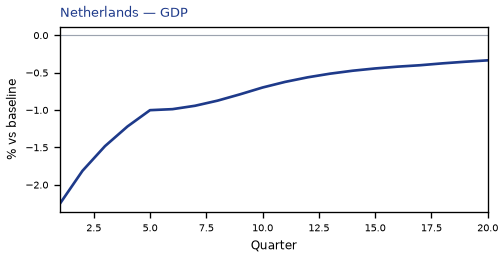

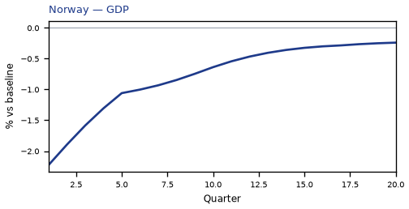

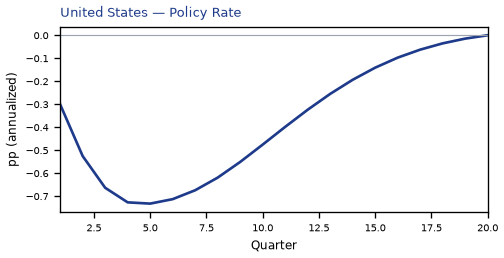

## NL — Netherlands

The main impact of VIX at 80 on Netherlands is a large drop in GDP of 2.26% by Q1. This is a model impulse response versus baseline, not a forecast. Equities soften 6.31% by Q1. The three-year CPI impulse is -0.30 percentage points.

Demand and trade. Private investment / the cost of capital falls 11.44% by Q1; household consumption falls 3.01% by Q1; government spending rises 0.47% by Q1; the trade balance (net exports — this model does not split imports from exports) improves to +0.31% in Q1; the same direction shows up in government debt.

Labour. Real wages falls 1.25% by Q20; employment falls 0.94% by Q7; unemployment rises by +0.75 percentage points in Q6.

Prices. Firms' marginal cost falls 1.35% by Q1; CPI inflation falls 0.08 percentage points by Q2; domestic inflation falls 0.06 percentage points by Q2.

Policy rates and the government curve. Bond prices (higher discount rates) rally 1.43% by Q5; 10-year bond prices rally 0.58% by Q1; 30-year bond prices rally 0.54% by Q1; 5-year bond prices rally 0.50% by Q1; the same direction shows up in 2-year bond prices, the local policy rate, 3-month government yields; the rest of the government curve barely moves.

Exchange rates. Versus the dollar the home currency is stronger versus the dollar (-0.51% in Q16); the real exchange rate shows a real depreciation (a weaker, more competitive home currency), peaking at +0.26% in Q7; the NEER prints a trade-weighted appreciation (+0.18% in Q17).

Equities and risk. Global VIX moves to 80.0 in Q1 (baseline 15); equity prices / financial conditions falls 6.31% by Q1; Tobin's Q (the value of installed capital) falls 4.37% by Q1.

Housing and credit. House prices fall 1.18% by Q13; bank equity falls 0.57% by Q8; bank credit supply falls 0.45% by Q8; house prices and bank credit are close to unchanged.

Commodities. Other published commodity prices stay near their baselines.

Sectors and capital. Services output falls 1.69% by Q1; manufacturing output falls 0.43% by Q1; the capital stock falls 0.20% by Q20.

The GDP response has mostly faded by Q12 (Q20 is still -0.33%).

These figures are model IRFs versus baseline, not forecasts and not financial advice.

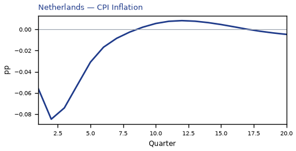

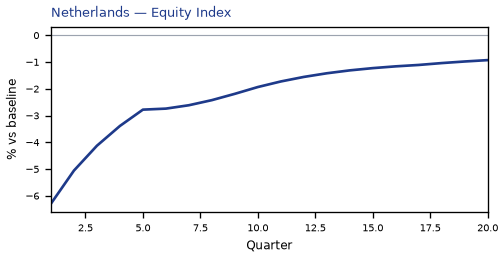

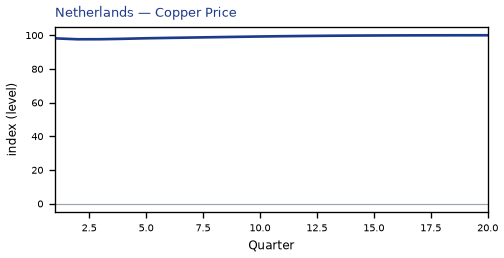

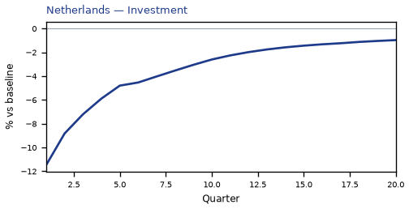

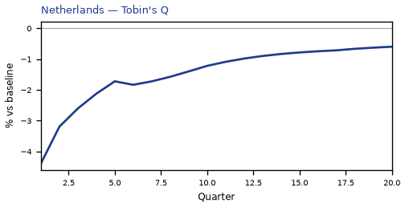

[Q1–Q20 JSON for Netherlands](numbers/NL.json)

## SA — Saudi Arabia

The main impact of VIX at 80 on Saudi Arabia is a large drop in GDP of 2.26% by Q1. This is a model impulse response versus baseline, not a forecast. Equities soften 8.98% by Q1. The three-year CPI impulse is -0.58 percentage points.

Demand and trade. Private investment / the cost of capital falls 11.06% by Q1; household consumption falls 3.02% by Q1; government debt falls 2.14% by Q20; the trade balance (net exports — this model does not split imports from exports) softens to -0.79% in Q3; the same direction shows up in government spending.

Labour. Real wages falls 1.68% by Q20; employment falls 1.20% by Q5; unemployment rises by +0.49 percentage points in Q4.

Prices. Firms' marginal cost falls 1.35% by Q1; CPI inflation falls 0.11 percentage points by Q2; domestic inflation falls 0.08 percentage points by Q2.

Policy rates and the government curve. Bond prices (higher discount rates) rally 3.80% by Q5; 5-year bond prices rally 1.69% by Q1; 10-year bond prices rally 1.61% by Q1; 30-year bond prices rally 1.52% by Q1; the same direction shows up in 2-year bond prices, the local policy rate, 3-month government yields.

Exchange rates. The real exchange rate shows a real depreciation (a weaker, more competitive home currency), peaking at +0.49% in Q13; versus the dollar the home currency is stronger versus the dollar (-0.28% in Q20); the NEER prints a trade-weighted depreciation (-0.08% in Q9).

Equities and risk. Global VIX moves to 80.0 in Q1 (baseline 15); equity prices / financial conditions falls 8.98% by Q1; Tobin's Q (the value of installed capital) falls 4.10% by Q1.

Housing and credit. House prices fall 1.30% by Q10; bank equity falls 0.35% by Q8; bank credit supply falls 0.30% by Q8; house prices and bank credit are close to unchanged.

Commodities. Other published commodity prices stay near their baselines.

Sectors and capital. Services output falls 0.99% by Q1; manufacturing output falls 0.31% by Q1; the capital stock falls 0.17% by Q20.

The GDP response has mostly faded by Q12 (Q20 is still -0.32%).

These figures are model IRFs versus baseline, not forecasts and not financial advice.

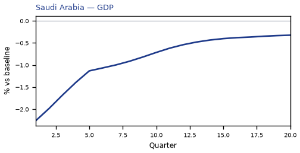

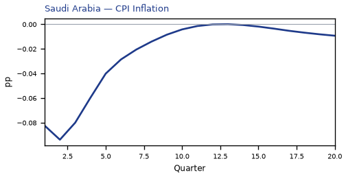

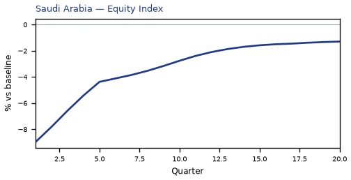

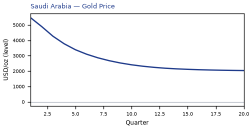

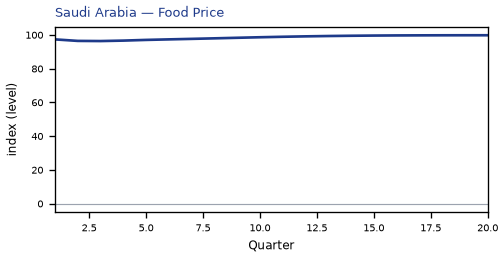

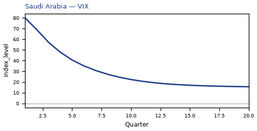

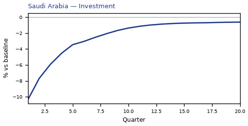

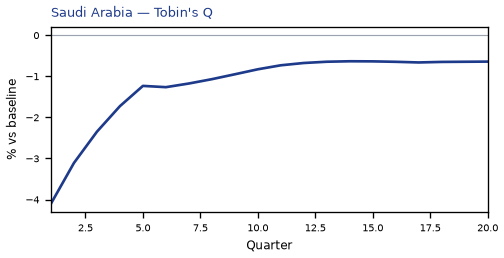

[Q1–Q20 JSON for Saudi Arabia](numbers/SA.json)

## MY — Malaysia

The main impact of VIX at 80 on Malaysia is a large drop in GDP of 2.25% by Q1. This is a model impulse response versus baseline, not a forecast. Equities soften 6.03% by Q1. The three-year CPI impulse is -0.16 percentage points.

Demand and trade. Private investment / the cost of capital falls 11.26% by Q1; household consumption falls 3.19% by Q1; government debt falls 1.54% by Q12; government spending rises 0.34% by Q1; the same direction shows up in the trade balance.

Labour. Real wages falls 1.42% by Q20; employment falls 1.02% by Q5; unemployment rises by +0.28 percentage points in Q4.

Prices. Firms' marginal cost falls 1.35% by Q1; CPI inflation falls 0.08 percentage points by Q2; domestic inflation falls 0.06 percentage points by Q2.

Policy rates and the government curve. Bond prices (higher discount rates) rally 1.61% by Q5; 30-year bond prices rally 1.41% by Q1; 10-year bond prices rally 1.39% by Q1; 5-year bond prices rally 1.08% by Q1; the same direction shows up in 2-year bond prices, the local policy rate, 3-month government yields.

Exchange rates. Versus the dollar the home currency is weaker versus the dollar (+0.57% in Q1); the real exchange rate shows a real depreciation (a weaker, more competitive home currency), peaking at +0.54% in Q4; the NEER prints a trade-weighted depreciation (-0.41% in Q2).

Equities and risk. Global VIX moves to 80.0 in Q1 (baseline 15); equity prices / financial conditions falls 6.03% by Q1; Tobin's Q (the value of installed capital) falls 4.24% by Q1.

Housing and credit. House prices fall 1.32% by Q10; bank equity falls 0.34% by Q7; bank credit supply falls 0.27% by Q7; house prices and bank credit are close to unchanged.

Commodities. Other published commodity prices stay near their baselines.

Sectors and capital. Services output falls 1.29% by Q1; manufacturing output falls 0.67% by Q1; the capital stock falls 0.15% by Q20.

The GDP response has mostly faded by Q10 (Q20 is still -0.23%).

These figures are model IRFs versus baseline, not forecasts and not financial advice.

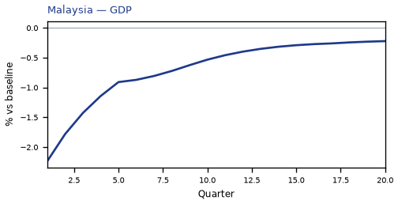

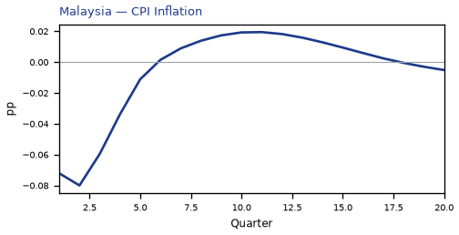

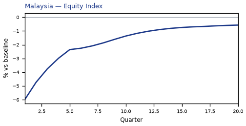

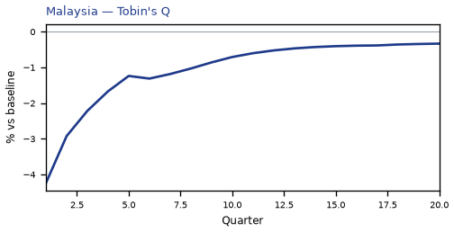

[Q1–Q20 JSON for Malaysia](numbers/MY.json)

## NO — Norway

The main impact of VIX at 80 on Norway is a large drop in GDP of 2.22% by Q1. This is a model impulse response versus baseline, not a forecast. Equities soften 4.83% by Q1. The three-year CPI impulse is -0.26 percentage points.

Demand and trade. Private investment / the cost of capital falls 11.07% by Q1; household consumption falls 2.97% by Q1; the trade balance (net exports — this model does not split imports from exports) softens to -0.44% in Q3; government debt rises 0.30% by Q11; the same direction shows up in government spending.

Labour. Real wages falls 1.22% by Q20; employment falls 1.01% by Q6; unemployment rises by +0.78 percentage points in Q6.

Prices. Firms' marginal cost falls 1.33% by Q1; CPI inflation falls 0.08 percentage points by Q2; domestic inflation falls 0.06 percentage points by Q2.

Policy rates and the government curve. Bond prices (higher discount rates) rally 3.89% by Q6; 30-year bond prices rally 2.54% by Q1; 10-year bond prices rally 2.47% by Q1; 5-year bond prices rally 1.93% by Q1; the same direction shows up in 2-year bond prices, the local policy rate, 3-month government yields.

Exchange rates. Versus the dollar the home currency is weaker versus the dollar (+1.62% in Q2); the real exchange rate shows a real depreciation (a weaker, more competitive home currency), peaking at +1.62% in Q3; the NEER prints a trade-weighted depreciation (-1.46% in Q3).

Equities and risk. Global VIX moves to 80.0 in Q1 (baseline 15); equity prices / financial conditions falls 4.83% by Q1; Tobin's Q (the value of installed capital) falls 4.11% by Q1.

Housing and credit. House prices fall 1.00% by Q11; bank equity falls 0.46% by Q8; bank credit supply falls 0.36% by Q8; house prices and bank credit are close to unchanged.

Commodities. Other published commodity prices stay near their baselines.

Sectors and capital. Services output falls 1.27% by Q1; manufacturing output falls 0.75% by Q2; the capital stock falls 0.14% by Q20.

The GDP response has mostly faded by Q11 (Q20 is still -0.24%).

These figures are model IRFs versus baseline, not forecasts and not financial advice.

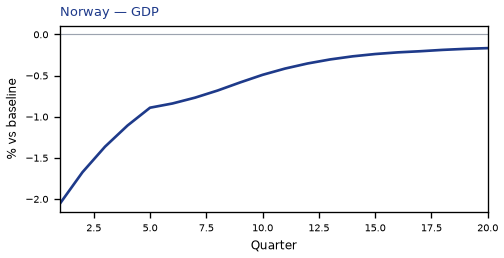

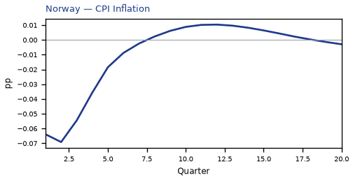

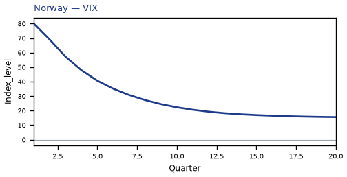

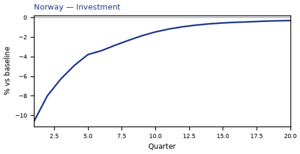

[Q1–Q20 JSON for Norway](numbers/NO.json)

## MX — Mexico

The main impact of VIX at 80 on Mexico is a large drop in GDP of 2.18% by Q1. This is a model impulse response versus baseline, not a forecast. Equities soften 3.86% by Q1. The three-year CPI impulse is -0.45 percentage points.

Demand and trade. Private investment / the cost of capital falls 11.02% by Q1; household consumption falls 2.95% by Q1; government debt falls 1.20% by Q9; government spending rises 0.34% by Q1; the same direction shows up in the trade balance.

Labour. Real wages falls 1.35% by Q18; employment falls 0.87% by Q6; unemployment rises by +0.11 percentage points in Q3.

Prices. Firms' marginal cost falls 1.30% by Q1; CPI inflation falls 0.12 percentage points by Q2; domestic inflation falls 0.08 percentage points by Q2.

Policy rates and the government curve. Bond prices (higher discount rates) rally 2.06% by Q4; 10-year bond prices rally 0.99% by Q1; 30-year bond prices rally 0.97% by Q1; 5-year bond prices rally 0.81% by Q1; the same direction shows up in 2-year bond prices, the local policy rate, 3-month government yields.

Exchange rates. Versus the dollar the home currency is weaker versus the dollar (+1.14% in Q2); the real exchange rate shows a real depreciation (a weaker, more competitive home currency), peaking at +1.11% in Q3; the NEER prints a trade-weighted depreciation (-1.06% in Q2).

Equities and risk. Global VIX moves to 80.0 in Q1 (baseline 15); Tobin's Q (the value of installed capital) falls 4.08% by Q1; equity prices / financial conditions falls 3.86% by Q1.

Housing and credit. House prices fall 1.09% by Q8; bank equity falls 0.30% by Q7; bank credit supply falls 0.29% by Q7; house prices and bank credit are close to unchanged.

Commodities. Other published commodity prices stay near their baselines.

Sectors and capital. Services output falls 1.32% by Q1; manufacturing output falls 0.74% by Q1; the capital stock falls 0.13% by Q20.

The GDP response has mostly faded by Q9 (Q20 is still -0.15%).

These figures are model IRFs versus baseline, not forecasts and not financial advice.

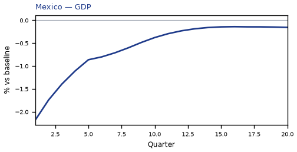

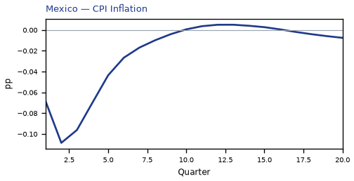

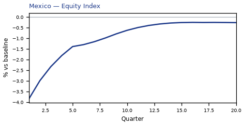

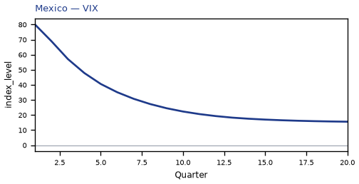

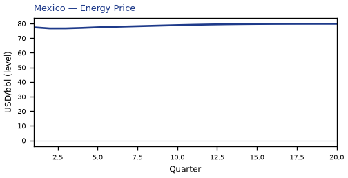

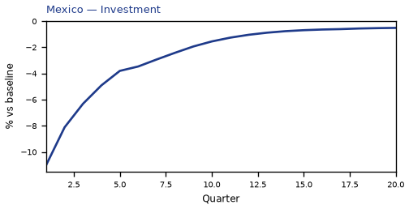

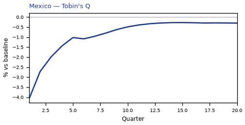

[Q1–Q20 JSON for Mexico](numbers/MX.json)

## CA — Canada

The main impact of VIX at 80 on Canada is a large drop in GDP of 2.17% by Q1. This is a model impulse response versus baseline, not a forecast. Equities soften 5.58% by Q1. The three-year CPI impulse is -0.12 percentage points.

Demand and trade. Private investment / the cost of capital falls 10.86% by Q1; household consumption falls 3.05% by Q1; government spending rises 0.38% by Q1; government debt falls 0.20% by Q10; the same direction shows up in the trade balance.

Labour. Employment falls 1.21% by Q4; real wages falls 1.10% by Q20; unemployment rises by +0.72 percentage points in Q5.

Prices. Firms' marginal cost falls 1.30% by Q1; CPI inflation falls 0.06 percentage points by Q2; domestic inflation stay close to baseline.

Policy rates and the government curve. Bond prices (higher discount rates) rally 3.86% by Q4; 30-year bond prices rally 2.12% by Q1; 10-year bond prices rally 2.07% by Q1; 5-year bond prices rally 1.69% by Q1; the same direction shows up in 2-year bond prices, the local policy rate, 3-month government yields.

Exchange rates. The real exchange rate shows a real depreciation (a weaker, more competitive home currency), peaking at +1.71% in Q3; versus the dollar the home currency is weaker versus the dollar (+1.70% in Q2); the NEER prints a trade-weighted depreciation (-1.60% in Q2).

Equities and risk. Global VIX moves to 80.0 in Q1 (baseline 15); equity prices / financial conditions falls 5.58% by Q1; Tobin's Q (the value of installed capital) falls 3.96% by Q1.

Housing and credit. House prices fall 0.88% by Q10; bank equity falls 0.39% by Q8; bank credit supply falls 0.31% by Q8; house prices and bank credit are close to unchanged.

Commodities. Other published commodity prices stay near their baselines.

Sectors and capital. Services output falls 1.51% by Q1; manufacturing output falls 0.75% by Q2; the capital stock falls 0.12% by Q20.

The GDP response has mostly faded by Q10 (Q20 is still -0.16%).

These figures are model IRFs versus baseline, not forecasts and not financial advice.

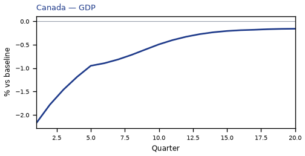

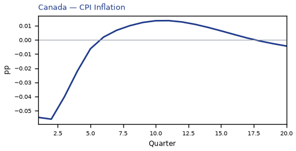

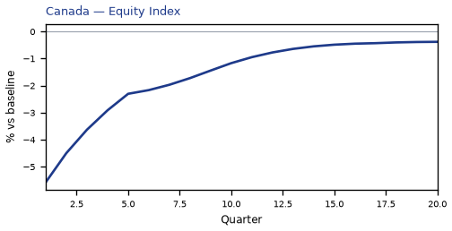

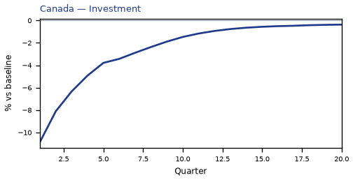

[Q1–Q20 JSON for Canada](numbers/CA.json)

## TH — Thailand

The main impact of VIX at 80 on Thailand is a large drop in GDP of 2.14% by Q1. This is a model impulse response versus baseline, not a forecast. Equities soften 5.31% by Q1. The three-year CPI impulse is -0.29 percentage points.

Demand and trade. Private investment / the cost of capital falls 10.92% by Q1; household consumption falls 3.03% by Q1; government debt falls 1.24% by Q10; government spending rises 0.36% by Q1; the same direction shows up in the trade balance.

Labour. Real wages falls 1.34% by Q18; employment falls 1.00% by Q4; unemployment rises by +0.11 percentage points in Q3.

Prices. Firms' marginal cost falls 1.28% by Q1; CPI inflation falls 0.12 percentage points by Q2; domestic inflation falls 0.08 percentage points by Q2.

Policy rates and the government curve. Bond prices (higher discount rates) rally 1.93% by Q4; 10-year bond prices rally 1.38% by Q1; 30-year bond prices rally 1.37% by Q1; 5-year bond prices rally 1.14% by Q1; the same direction shows up in 2-year bond prices, the local policy rate, 3-month government yields.

Exchange rates. The real exchange rate shows a real depreciation (a weaker, more competitive home currency), peaking at +0.46% in Q13; versus the dollar the home currency is stronger versus the dollar (-0.28% in Q18); the NEER prints a trade-weighted depreciation (-0.08% in Q7).

Equities and risk. Global VIX moves to 80.0 in Q1 (baseline 15); equity prices / financial conditions falls 5.31% by Q1; Tobin's Q (the value of installed capital) falls 4.00% by Q1.

Housing and credit. House prices fall 1.15% by Q9; bank equity falls 0.28% by Q7; bank credit supply falls 0.23% by Q7; house prices and bank credit are close to unchanged.

Commodities. Other published commodity prices stay near their baselines.

Sectors and capital. Services output falls 1.18% by Q1; manufacturing output falls 0.59% by Q1; the capital stock falls 0.13% by Q20.

The GDP response has mostly faded by Q10 (Q20 is still -0.17%).

These figures are model IRFs versus baseline, not forecasts and not financial advice.

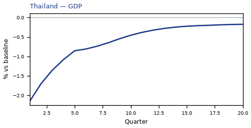

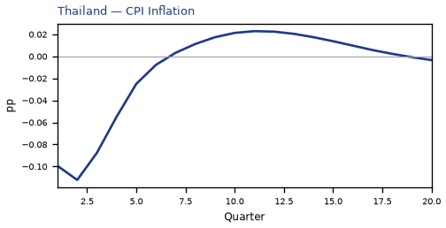

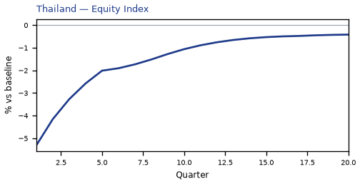

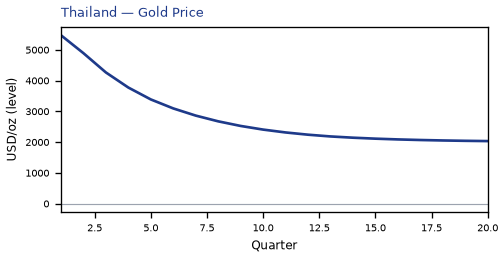

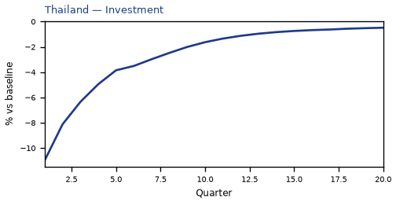

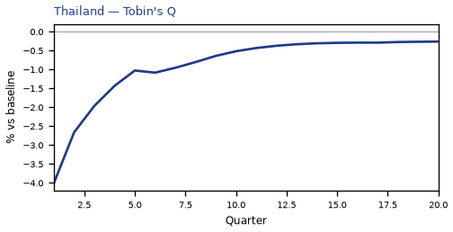

[Q1–Q20 JSON for Thailand](numbers/TH.json)

## CH — Switzerland

The main impact of VIX at 80 on Switzerland is a large drop in GDP of 2.09% by Q1. This is a model impulse response versus baseline, not a forecast. Equities soften 8.34% by Q1. The three-year CPI impulse is -0.20 percentage points.

Demand and trade. Private investment / the cost of capital falls 10.90% by Q1; household consumption falls 3.11% by Q1; government debt falls 0.49% by Q10; government spending rises 0.42% by Q1; the same direction shows up in the trade balance.

Labour. Employment falls 1.06% by Q4; real wages falls 0.76% by Q20; unemployment rises by +0.71 percentage points in Q6.

Prices. Firms' marginal cost falls 1.25% by Q1; CPI inflation falls 0.12 percentage points by Q1; domestic inflation falls 0.08 percentage points by Q1.

Policy rates and the government curve. Bond prices (higher discount rates) rally 1.92% by Q7; 30-year bond prices rally 1.31% by Q1; 10-year bond prices rally 1.30% by Q1; 5-year bond prices rally 0.96% by Q2; the same direction shows up in 2-year bond prices, the local policy rate, 3-month government yields; the rest of the government curve barely moves.

Exchange rates. The NEER prints a trade-weighted appreciation (+0.51% in Q1); versus the dollar the home currency is stronger versus the dollar (-0.51% in Q10); the real exchange rate shows a real appreciation (a stronger home currency), peaking at -0.45% in Q1.

Equities and risk. Global VIX moves to 80.0 in Q1 (baseline 15); equity prices / financial conditions falls 8.34% by Q1; Tobin's Q (the value of installed capital) falls 3.99% by Q1.

Housing and credit. House prices fall 1.03% by Q13; bank equity falls 0.52% by Q8; bank credit supply falls 0.41% by Q8; house prices and bank credit are close to unchanged.

Commodities. Other published commodity prices stay near their baselines.

Sectors and capital. Services output falls 1.66% by Q1; manufacturing output falls 0.27% by Q1; the capital stock falls 0.17% by Q20.

The GDP response has mostly faded by Q12 (Q20 is still -0.28%).

These figures are model IRFs versus baseline, not forecasts and not financial advice.

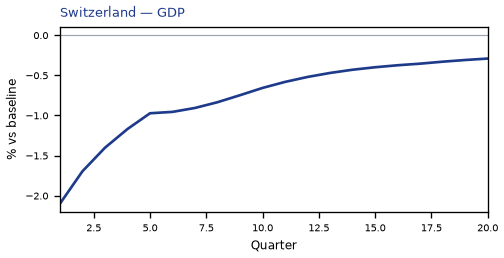

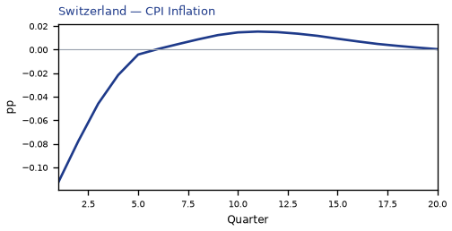

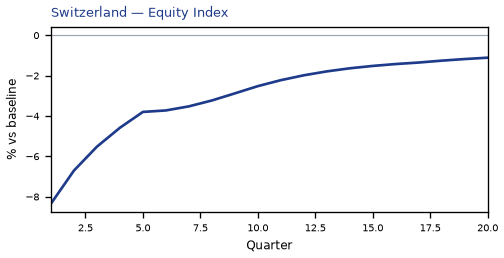

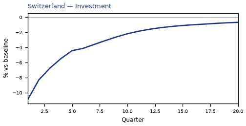

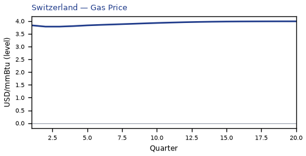

[Q1–Q20 JSON for Switzerland](numbers/CH.json)

## PL — Poland

The main impact of VIX at 80 on Poland is a large drop in GDP of 2.08% by Q1. This is a model impulse response versus baseline, not a forecast. Equities soften 3.70% by Q1. The three-year CPI impulse is -0.39 percentage points.

Demand and trade. Private investment / the cost of capital falls 10.85% by Q1; household consumption falls 2.82% by Q1; government spending rises 0.42% by Q1; the trade balance (net exports — this model does not split imports from exports) improves to +0.37% in Q1; government debt stay close to baseline.

Labour. Real wages falls 1.30% by Q20; employment falls 0.91% by Q4; unemployment rises by +0.40 percentage points in Q4.

Prices. Firms' marginal cost falls 1.25% by Q1; CPI inflation falls 0.10 percentage points by Q2; domestic inflation falls 0.07 percentage points by Q2.

Policy rates and the government curve. Bond prices (higher discount rates) rally 1.28% by Q4; 10-year bond prices rally 0.68% by Q1; 30-year bond prices rally 0.65% by Q1; 5-year bond prices rally 0.57% by Q1; the same direction shows up in 2-year bond prices, the local policy rate, 3-month government yields; the rest of the government curve barely moves.

Exchange rates. Versus the dollar the home currency is stronger versus the dollar (-0.50% in Q17); the real exchange rate shows a real depreciation (a weaker, more competitive home currency), peaking at +0.23% in Q14; the NEER prints a trade-weighted appreciation (+0.19% in Q2).

Equities and risk. Global VIX moves to 80.0 in Q1 (baseline 15); Tobin's Q (the value of installed capital) falls 3.95% by Q1; equity prices / financial conditions falls 3.70% by Q1.

Housing and credit. House prices fall 0.88% by Q11; bank equity falls 0.28% by Q7; bank credit supply falls 0.25% by Q7; house prices and bank credit are close to unchanged.

Commodities. Other published commodity prices stay near their baselines.

Sectors and capital. Services output falls 1.30% by Q1; manufacturing output falls 0.48% by Q1; the capital stock falls 0.15% by Q20.

The GDP response has mostly faded by Q10 (Q20 is still -0.20%).

These figures are model IRFs versus baseline, not forecasts and not financial advice.

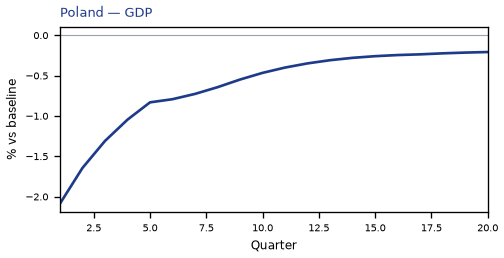

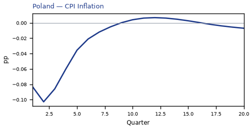

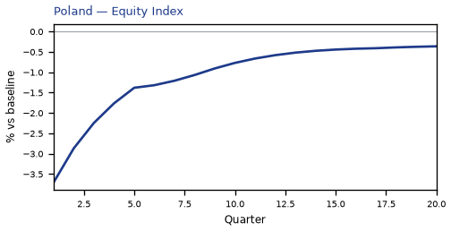

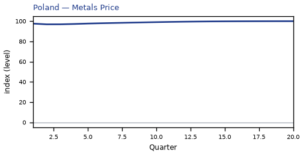

[Q1–Q20 JSON for Poland](numbers/PL.json)

## RU — Russia

The main impact of VIX at 80 on Russia is a large drop in GDP of 2.03% by Q1. This is a model impulse response versus baseline, not a forecast. Equities soften 3.56% by Q1. The three-year CPI impulse is -0.79 percentage points.

Demand and trade. Private investment / the cost of capital falls 10.57% by Q1; household consumption falls 2.83% by Q1; the trade balance (net exports — this model does not split imports from exports) softens to -0.61% in Q3; government debt falls 0.39% by Q9; the same direction shows up in government spending.

Labour. Real wages falls 1.62% by Q16; employment falls 0.86% by Q5; unemployment rises by +0.40 percentage points in Q4.

Prices. Firms' marginal cost falls 1.21% by Q1; CPI inflation falls 0.16 percentage points by Q2; domestic inflation falls 0.11 percentage points by Q2.

Policy rates and the government curve. Bond prices (higher discount rates) rally 1.73% by Q4; 10-year bond prices rally 1.14% by Q1; 30-year bond prices rally 1.13% by Q1; 5-year bond prices rally 1.05% by Q1; the same direction shows up in 2-year bond prices, the local policy rate, 3-month government yields.

Exchange rates. Versus the dollar the home currency is weaker versus the dollar (+0.78% in Q2); the real exchange rate shows a real depreciation (a weaker, more competitive home currency), peaking at +0.75% in Q3; the NEER prints a trade-weighted depreciation (-0.71% in Q2).

Equities and risk. Global VIX moves to 80.0 in Q1 (baseline 15); Tobin's Q (the value of installed capital) falls 3.76% by Q1; equity prices / financial conditions falls 3.56% by Q1.

Housing and credit. House prices fall 0.98% by Q8; bank equity falls 0.26% by Q8; bank credit supply falls 0.23% by Q8; house prices and bank credit are close to unchanged.

Commodities. Other published commodity prices stay near their baselines.

Sectors and capital. Services output falls 1.11% by Q1; manufacturing output falls 0.52% by Q1; the capital stock falls 0.10% by Q20.

The GDP response has mostly faded by Q9 (Q20 is still -0.04%).

These figures are model IRFs versus baseline, not forecasts and not financial advice.

[Q1–Q20 JSON for Russia](numbers/RU.json)

## CL — Chile

The main impact of VIX at 80 on Chile is a large drop in GDP of 2.02% by Q1. This is a model impulse response versus baseline, not a forecast. Equities soften 4.59% by Q1. The three-year CPI impulse is -0.46 percentage points.

Demand and trade. Private investment / the cost of capital falls 10.63% by Q1; household consumption falls 2.93% by Q1; government debt falls 0.73% by Q8; government spending rises 0.28% by Q1; the trade balance stay close to baseline.

Labour. Real wages falls 1.26% by Q17; employment falls 0.93% by Q4; unemployment rises by +0.36 percentage points in Q4.

Prices. Firms' marginal cost falls 1.21% by Q1; CPI inflation falls 0.12 percentage points by Q2; domestic inflation falls 0.08 percentage points by Q2.

Policy rates and the government curve. Bond prices (higher discount rates) rally 1.74% by Q4; 10-year bond prices rally 0.90% by Q1; 30-year bond prices rally 0.87% by Q1; 5-year bond prices rally 0.78% by Q1; the same direction shows up in 2-year bond prices, the local policy rate, 3-month government yields; the rest of the government curve barely moves.

Exchange rates. Versus the dollar the home currency is weaker versus the dollar (+0.97% in Q2); the real exchange rate shows a real depreciation (a weaker, more competitive home currency), peaking at +0.94% in Q3; the NEER prints a trade-weighted depreciation (-0.73% in Q2).

Equities and risk. Global VIX moves to 80.0 in Q1 (baseline 15); equity prices / financial conditions falls 4.59% by Q1; Tobin's Q (the value of installed capital) falls 3.80% by Q1.

Housing and credit. House prices fall 0.97% by Q8; bank equity falls 0.27% by Q7; bank credit supply falls 0.22% by Q7; house prices and bank credit are close to unchanged.

Commodities. Other published commodity prices stay near their baselines.

Sectors and capital. Services output falls 1.22% by Q1; manufacturing output falls 0.53% by Q1; the capital stock falls 0.12% by Q20.

The GDP response has mostly faded by Q9 (Q20 is still -0.12%).

These figures are model IRFs versus baseline, not forecasts and not financial advice.

[Q1–Q20 JSON for Chile](numbers/CL.json)

## DE — Germany

The main impact of VIX at 80 on Germany is a large drop in GDP of 2.02% by Q1. This is a model impulse response versus baseline, not a forecast. Equities soften 4.01% by Q1. The three-year CPI impulse is -0.45 percentage points.

Demand and trade. Private investment / the cost of capital falls 10.75% by Q1; household consumption falls 2.85% by Q1; government spending rises 0.45% by Q1; the trade balance (net exports — this model does not split imports from exports) improves to +0.41% in Q1; the same direction shows up in government debt.

Labour. Real wages falls 1.22% by Q20; employment falls 0.90% by Q6; unemployment rises by +0.67 percentage points in Q6.

Prices. Firms' marginal cost falls 1.21% by Q1; CPI inflation falls 0.10 percentage points by Q2; domestic inflation falls 0.07 percentage points by Q2.

Policy rates and the government curve. Bond prices (higher discount rates) rally 1.43% by Q5; 10-year bond prices rally 0.58% by Q1; 30-year bond prices rally 0.54% by Q1; 5-year bond prices rally 0.50% by Q1; the same direction shows up in 2-year bond prices, the local policy rate, 3-month government yields; the rest of the government curve barely moves.

Exchange rates. Versus the dollar the home currency is stronger versus the dollar (-0.54% in Q14); the real exchange rate shows a real depreciation (a weaker, more competitive home currency), peaking at +0.19% in Q16; the NEER prints a trade-weighted appreciation (+0.19% in Q5).

Equities and risk. Global VIX moves to 80.0 in Q1 (baseline 15); equity prices / financial conditions falls 4.01% by Q1; Tobin's Q (the value of installed capital) falls 3.88% by Q1.

Housing and credit. House prices fall 0.96% by Q12; bank equity falls 0.49% by Q8; bank credit supply falls 0.39% by Q8; house prices and bank credit are close to unchanged.

Commodities. Other published commodity prices stay near their baselines.

Sectors and capital. Services output falls 1.38% by Q1; manufacturing output falls 0.48% by Q1; the capital stock falls 0.17% by Q20.

The GDP response has mostly faded by Q12 (Q20 is still -0.24%).

These figures are model IRFs versus baseline, not forecasts and not financial advice.

[Q1–Q20 JSON for Germany](numbers/DE.json)

## SE — Sweden

The main impact of VIX at 80 on Sweden is a large drop in GDP of 2.01% by Q1. This is a model impulse response versus baseline, not a forecast. Equities soften 6.01% by Q1. The three-year CPI impulse is -0.36 percentage points.

Demand and trade. Private investment / the cost of capital falls 10.71% by Q1; household consumption falls 2.89% by Q1; government spending rises 0.42% by Q1; government debt rises 0.39% by Q10; the same direction shows up in the trade balance.

Labour. Real wages falls 1.20% by Q20; employment falls 0.81% by Q7; unemployment rises by +0.65 percentage points in Q5.

Prices. Firms' marginal cost falls 1.21% by Q1; CPI inflation falls 0.09 percentage points by Q2; domestic inflation falls 0.06 percentage points by Q2.

Policy rates and the government curve. Bond prices (higher discount rates) rally 1.43% by Q5; 10-year bond prices rally 0.65% by Q1; 30-year bond prices rally 0.62% by Q1; 5-year bond prices rally 0.54% by Q1; the same direction shows up in 2-year bond prices, the local policy rate, 3-month government yields; the rest of the government curve barely moves.

Exchange rates. Versus the dollar the home currency is stronger versus the dollar (-0.50% in Q17); the real exchange rate shows a real depreciation (a weaker, more competitive home currency), peaking at +0.33% in Q3; the NEER prints a trade-weighted appreciation (+0.14% in Q20).

Equities and risk. Global VIX moves to 80.0 in Q1 (baseline 15); equity prices / financial conditions falls 6.01% by Q1; Tobin's Q (the value of installed capital) falls 3.86% by Q1.

Housing and credit. House prices fall 0.89% by Q12; bank equity falls 0.42% by Q8; bank credit supply falls 0.33% by Q8; house prices and bank credit are close to unchanged.

Commodities. Other published commodity prices stay near their baselines.

Sectors and capital. Services output falls 1.44% by Q1; manufacturing output falls 0.45% by Q1; the capital stock falls 0.16% by Q20.

The GDP response has mostly faded by Q11 (Q20 is still -0.23%).

These figures are model IRFs versus baseline, not forecasts and not financial advice.

[Q1–Q20 JSON for Sweden](numbers/SE.json)

## KR — South Korea

The main impact of VIX at 80 on South Korea is a large drop in GDP of 1.98% by Q1. This is a model impulse response versus baseline, not a forecast. Equities soften 4.88% by Q1. The three-year CPI impulse is -0.25 percentage points.

Demand and trade. Private investment / the cost of capital falls 10.40% by Q1; household consumption falls 2.91% by Q1; the trade balance (net exports — this model does not split imports from exports) improves to +0.52% in Q2; government debt falls 0.46% by Q10; the same direction shows up in government spending.

Labour. Real wages falls 1.13% by Q19; employment falls 0.80% by Q5; unemployment rises by +0.37 percentage points in Q4.

Prices. Firms' marginal cost falls 1.19% by Q1; CPI inflation falls 0.09 percentage points by Q2; domestic inflation falls 0.06 percentage points by Q2.

Policy rates and the government curve. Bond prices (higher discount rates) rally 2.54% by Q4; 10-year bond prices rally 1.20% by Q1; 30-year bond prices rally 1.16% by Q1; 5-year bond prices rally 1.05% by Q1; the same direction shows up in 2-year bond prices, the local policy rate, 3-month government yields.

Exchange rates. The NEER prints a trade-weighted appreciation (+0.53% in Q2); the real exchange rate shows a real depreciation (a weaker, more competitive home currency), peaking at +0.41% in Q15; versus the dollar the home currency is stronger versus the dollar (-0.37% in Q4).

Equities and risk. Global VIX moves to 80.0 in Q1 (baseline 15); equity prices / financial conditions falls 4.88% by Q1; Tobin's Q (the value of installed capital) falls 3.64% by Q1.

Housing and credit. House prices fall 0.74% by Q9; bank equity falls 0.32% by Q7; bank credit supply falls 0.26% by Q7; house prices and bank credit are close to unchanged.

Commodities. Other published commodity prices stay near their baselines.

Sectors and capital. Services output falls 1.20% by Q1; manufacturing output falls 0.49% by Q1; the capital stock falls 0.10% by Q20.

The GDP response has mostly faded by Q9 (Q20 is still -0.09%).

These figures are model IRFs versus baseline, not forecasts and not financial advice.

[Q1–Q20 JSON for South Korea](numbers/KR.json)

## FR — France

The main impact of VIX at 80 on France is a large drop in GDP of 1.98% by Q1. This is a model impulse response versus baseline, not a forecast. Equities soften 4.54% by Q1. The three-year CPI impulse is -0.42 percentage points.

Demand and trade. Private investment / the cost of capital falls 10.66% by Q1; household consumption falls 2.82% by Q1; government debt rises 0.67% by Q15; government spending rises 0.47% by Q1; the same direction shows up in the trade balance.

Labour. Real wages falls 0.94% by Q20; employment falls 0.82% by Q7; unemployment rises by +0.66 percentage points in Q6.

Prices. Firms' marginal cost falls 1.19% by Q1; CPI inflation falls 0.09 percentage points by Q2; domestic inflation falls 0.07 percentage points by Q2.

Policy rates and the government curve. Bond prices (higher discount rates) rally 1.43% by Q5; 10-year bond prices rally 0.58% by Q1; 30-year bond prices rally 0.54% by Q1; 5-year bond prices rally 0.50% by Q1; the same direction shows up in 2-year bond prices, the local policy rate, 3-month government yields; the rest of the government curve barely moves.

Exchange rates. Versus the dollar the home currency is stronger versus the dollar (-0.54% in Q14); the real exchange rate shows a real depreciation (a weaker, more competitive home currency), peaking at +0.19% in Q15; the NEER prints a trade-weighted appreciation (+0.12% in Q11).

Equities and risk. Global VIX moves to 80.0 in Q1 (baseline 15); equity prices / financial conditions falls 4.54% by Q1; Tobin's Q (the value of installed capital) falls 3.82% by Q1.

Housing and credit. House prices fall 0.90% by Q12; bank equity falls 0.49% by Q8; bank credit supply falls 0.39% by Q8; house prices and bank credit are close to unchanged.

Commodities. Other published commodity prices stay near their baselines.

Sectors and capital. Services output falls 1.53% by Q1; manufacturing output falls 0.31% by Q1; the capital stock falls 0.17% by Q20.

The GDP response has mostly faded by Q11 (Q20 is still -0.23%).

These figures are model IRFs versus baseline, not forecasts and not financial advice.

[Q1–Q20 JSON for France](numbers/FR.json)

## ES — Spain

The main impact of VIX at 80 on Spain is a large drop in GDP of 1.94% by Q1. This is a model impulse response versus baseline, not a forecast. Equities soften 3.86% by Q1. The three-year CPI impulse is -0.39 percentage points.

Demand and trade. Private investment / the cost of capital falls 10.54% by Q1; household consumption falls 2.82% by Q1; government spending rises 0.42% by Q1; the trade balance (net exports — this model does not split imports from exports) improves to +0.30% in Q1; government debt stay close to baseline.

Labour. Real wages falls 0.86% by Q20; employment falls 0.81% by Q6; unemployment rises by +0.41 percentage points in Q5.

Prices. Firms' marginal cost falls 1.16% by Q1; CPI inflation falls 0.09 percentage points by Q2; domestic inflation falls 0.06 percentage points by Q2.

Policy rates and the government curve. Bond prices (higher discount rates) rally 1.43% by Q5; 10-year bond prices rally 0.58% by Q1; 30-year bond prices rally 0.54% by Q1; 5-year bond prices rally 0.50% by Q1; the same direction shows up in 2-year bond prices, the local policy rate, 3-month government yields; the rest of the government curve barely moves.

Exchange rates. Versus the dollar the home currency is stronger versus the dollar (-0.55% in Q14); the NEER prints a trade-weighted appreciation (+0.22% in Q4); the real exchange rate shows a real depreciation (a weaker, more competitive home currency), peaking at +0.18% in Q16.

Equities and risk. Global VIX moves to 80.0 in Q1 (baseline 15); equity prices / financial conditions falls 3.86% by Q1; Tobin's Q (the value of installed capital) falls 3.73% by Q1.

Housing and credit. House prices fall 0.80% by Q11; bank equity falls 0.34% by Q7; bank credit supply falls 0.27% by Q7; house prices and bank credit are close to unchanged.

Commodities. Other published commodity prices stay near their baselines.

Sectors and capital. Services output falls 1.43% by Q1; manufacturing output falls 0.32% by Q1; the capital stock falls 0.14% by Q20.

The GDP response has mostly faded by Q10 (Q20 is still -0.19%).

These figures are model IRFs versus baseline, not forecasts and not financial advice.

[Q1–Q20 JSON for Spain](numbers/ES.json)

## AU — Australia

The main impact of VIX at 80 on Australia is a large drop in GDP of 1.94% by Q1. This is a model impulse response versus baseline, not a forecast. Equities soften 4.79% by Q1. The three-year CPI impulse is -0.32 percentage points.

Demand and trade. Private investment / the cost of capital falls 10.29% by Q1; household consumption falls 2.93% by Q1; government debt falls 0.39% by Q10; government spending rises 0.33% by Q1; the same direction shows up in the trade balance.

Labour. Real wages falls 1.12% by Q20; employment falls 1.04% by Q4; unemployment rises by +0.62 percentage points in Q5.

Prices. Firms' marginal cost falls 1.16% by Q1; CPI inflation falls 0.09 percentage points by Q2; domestic inflation falls 0.06 percentage points by Q2.

Policy rates and the government curve. Bond prices (higher discount rates) rally 3.53% by Q5; 10-year bond prices rally 1.80% by Q1; 30-year bond prices rally 1.74% by Q1; 5-year bond prices rally 1.58% by Q1; the same direction shows up in 2-year bond prices, the local policy rate, 3-month government yields.

Exchange rates. Versus the dollar the home currency is weaker versus the dollar (+2.17% in Q2); the real exchange rate shows a real depreciation (a weaker, more competitive home currency), peaking at +2.15% in Q3; the NEER prints a trade-weighted depreciation (-2.09% in Q2).

Equities and risk. Global VIX moves to 80.0 in Q1 (baseline 15); equity prices / financial conditions falls 4.79% by Q1; Tobin's Q (the value of installed capital) falls 3.57% by Q1.

Housing and credit. House prices fall 0.72% by Q9; bank equity falls 0.36% by Q7; bank credit supply falls 0.29% by Q7; house prices and bank credit are close to unchanged.

Commodities. Other published commodity prices stay near their baselines.

Sectors and capital. Services output falls 1.39% by Q1; manufacturing output falls 0.82% by Q2; the capital stock falls 0.09% by Q20.

The GDP response has mostly faded by Q9 (Q20 is still -0.09%).

These figures are model IRFs versus baseline, not forecasts and not financial advice.

[Q1–Q20 JSON for Australia](numbers/AU.json)

## CO — Colombia

The main impact of VIX at 80 on Colombia is a large drop in GDP of 1.93% by Q1. This is a model impulse response versus baseline, not a forecast. Equities soften 3.42% by Q1. The three-year CPI impulse is -0.63 percentage points.

Demand and trade. Private investment / the cost of capital falls 10.31% by Q1; household consumption falls 2.84% by Q1; government debt falls 0.96% by Q9; government spending rises 0.30% by Q1; the trade balance stay close to baseline.

Labour. Real wages falls 1.24% by Q15; employment falls 0.80% by Q5; unemployment rises by +0.10 percentage points in Q3.

Prices. Firms' marginal cost falls 1.16% by Q1; CPI inflation falls 0.15 percentage points by Q2; domestic inflation falls 0.11 percentage points by Q2.

Policy rates and the government curve. Bond prices (higher discount rates) rally 1.87% by Q4; 10-year bond prices rally 0.87% by Q1; 30-year bond prices rally 0.82% by Q1; 5-year bond prices rally 0.81% by Q1; the same direction shows up in 2-year bond prices, the local policy rate, 3-month government yields; the rest of the government curve barely moves.

Exchange rates. Versus the dollar the home currency is weaker versus the dollar (+1.16% in Q2); the real exchange rate shows a real depreciation (a weaker, more competitive home currency), peaking at +1.14% in Q3; the NEER prints a trade-weighted depreciation (-0.93% in Q2).

Equities and risk. Global VIX moves to 80.0 in Q1 (baseline 15); Tobin's Q (the value of installed capital) falls 3.58% by Q1; equity prices / financial conditions falls 3.42% by Q1.

Housing and credit. House prices fall 0.86% by Q8; bank equity falls 0.23% by Q7; bank credit supply falls 0.20% by Q7; house prices and bank credit are close to unchanged.

Commodities. Other published commodity prices stay near their baselines.

Sectors and capital. Services output falls 1.17% by Q1; manufacturing output falls 0.59% by Q1; the capital stock falls 0.09% by Q20.

The GDP response has mostly faded by Q8 (Q20 is still -0.08%).

These figures are model IRFs versus baseline, not forecasts and not financial advice.

[Q1–Q20 JSON for Colombia](numbers/CO.json)

## ZA — South Africa

The main impact of VIX at 80 on South Africa is a large drop in GDP of 1.92% by Q1. This is a model impulse response versus baseline, not a forecast. Equities soften 7.61% by Q1. The three-year CPI impulse is -0.44 percentage points.

Demand and trade. Private investment / the cost of capital falls 10.34% by Q1; household consumption falls 2.82% by Q1; government debt falls 0.59% by Q10; government spending rises 0.32% by Q1; the same direction shows up in the trade balance.

Labour. Real wages falls 1.17% by Q16; employment falls 0.85% by Q4; unemployment rises by +0.23 percentage points in Q4.

Prices. Firms' marginal cost falls 1.15% by Q1; CPI inflation falls 0.11 percentage points by Q2; domestic inflation falls 0.08 percentage points by Q2.

Policy rates and the government curve. Bond prices (higher discount rates) rally 1.63% by Q4; 10-year bond prices rally 0.65% by Q1; 30-year bond prices rally 0.60% by Q1; 5-year bond prices rally 0.59% by Q1; the same direction shows up in 2-year bond prices, the local policy rate, 3-month government yields; the rest of the government curve barely moves.

Exchange rates. Versus the dollar the home currency is weaker versus the dollar (+0.78% in Q2); the real exchange rate shows a real depreciation (a weaker, more competitive home currency), peaking at +0.74% in Q3; the NEER prints a trade-weighted depreciation (-0.65% in Q2).

Equities and risk. Global VIX moves to 80.0 in Q1 (baseline 15); equity prices / financial conditions falls 7.61% by Q1; Tobin's Q (the value of installed capital) falls 3.60% by Q1.

Housing and credit. House prices fall 0.89% by Q8; bank equity falls 0.29% by Q7; bank credit supply falls 0.25% by Q7; house prices and bank credit are close to unchanged.

Commodities. Other published commodity prices stay near their baselines.

Sectors and capital. Services output falls 1.22% by Q1; manufacturing output falls 0.47% by Q1; the capital stock falls 0.11% by Q20.

The GDP response has mostly faded by Q8 (Q20 is still -0.11%).

These figures are model IRFs versus baseline, not forecasts and not financial advice.

[Q1–Q20 JSON for South Africa](numbers/ZA.json)

## NG — Nigeria

The main impact of VIX at 80 on Nigeria is a large drop in GDP of 1.91% by Q1. This is a model impulse response versus baseline, not a forecast. Equities soften 2.94% by Q1. The three-year CPI impulse is -0.94 percentage points.

Demand and trade. Private investment / the cost of capital falls 10.09% by Q1; household consumption falls 2.80% by Q1; government debt falls 1.71% by Q9; government spending rises 0.25% by Q1; the same direction shows up in the trade balance.

Labour. Real wages falls 1.30% by Q11; employment falls 0.59% by Q5; unemployment rises by +0.08 percentage points in Q3.

Prices. Firms' marginal cost falls 1.15% by Q1; CPI inflation falls 0.25 percentage points by Q2; domestic inflation falls 0.17 percentage points by Q2.

Policy rates and the government curve. Bond prices (higher discount rates) rally 1.86% by Q4; 2-year bond prices rally 1.05% by Q1; 10-year bond prices rally 0.80% by Q1; 5-year bond prices rally 0.79% by Q1; the same direction shows up in 30-year bond prices, the local policy rate, 3-month government yields; the rest of the government curve barely moves.

Exchange rates. The real exchange rate shows a real depreciation (a weaker, more competitive home currency), peaking at +0.50% in Q7; versus the dollar the home currency is weaker versus the dollar (+0.47% in Q1); the NEER prints a trade-weighted depreciation (-0.24% in Q3).

Equities and risk. Global VIX moves to 80.0 in Q1 (baseline 15); Tobin's Q (the value of installed capital) falls 3.42% by Q1; equity prices / financial conditions falls 2.94% by Q1.

Housing and credit. House prices fall 0.78% by Q6; bank credit supply falls 0.36% by Q7; bank equity falls 0.20% by Q7; lending spreads rises 0.05 percentage points by Q7.

Commodities. Other published commodity prices stay near their baselines.

Sectors and capital. Services output falls 0.95% by Q1; manufacturing output falls 0.25% by Q1; the capital stock stay close to baseline.

The GDP response has mostly faded by Q7 (Q20 is still +0.03%).

These figures are model IRFs versus baseline, not forecasts and not financial advice.

[Q1–Q20 JSON for Nigeria](numbers/NG.json)

## IT — Italy

The main impact of VIX at 80 on Italy is a large drop in GDP of 1.88% by Q1. This is a model impulse response versus baseline, not a forecast. Equities soften 3.37% by Q1. The three-year CPI impulse is -0.39 percentage points.

Demand and trade. Private investment / the cost of capital falls 10.38% by Q1; household consumption falls 2.74% by Q1; government spending rises 0.41% by Q1; the trade balance (net exports — this model does not split imports from exports) improves to +0.31% in Q2; the same direction shows up in government debt.

Labour. Employment falls 0.78% by Q6; real wages falls 0.73% by Q20; unemployment rises by +0.37 percentage points in Q4.

Prices. Firms' marginal cost falls 1.13% by Q1; CPI inflation falls 0.10 percentage points by Q2; domestic inflation falls 0.07 percentage points by Q2.

Policy rates and the government curve. Bond prices (higher discount rates) rally 1.42% by Q5; 10-year bond prices rally 0.58% by Q1; 30-year bond prices rally 0.54% by Q1; 5-year bond prices rally 0.50% by Q1; the same direction shows up in 2-year bond prices, the local policy rate, 3-month government yields; the rest of the government curve barely moves.

Exchange rates. Versus the dollar the home currency is stronger versus the dollar (-0.56% in Q13); the NEER prints a trade-weighted appreciation (+0.24% in Q3); the real exchange rate shows a real appreciation (a stronger home currency), peaking at -0.20% in Q2.

Equities and risk. Global VIX moves to 80.0 in Q1 (baseline 15); Tobin's Q (the value of installed capital) falls 3.62% by Q1; equity prices / financial conditions falls 3.37% by Q1.

Housing and credit. House prices fall 0.75% by Q11; bank equity falls 0.36% by Q7; bank credit supply falls 0.30% by Q7; house prices and bank credit are close to unchanged.

Commodities. Other published commodity prices stay near their baselines.

Sectors and capital. Services output falls 1.37% by Q1; manufacturing output falls 0.32% by Q1; the capital stock falls 0.14% by Q20.

The GDP response has mostly faded by Q10 (Q20 is still -0.17%).

These figures are model IRFs versus baseline, not forecasts and not financial advice.

[Q1–Q20 JSON for Italy](numbers/IT.json)

## TR — Turkey

The main impact of VIX at 80 on Turkey is a large drop in GDP of 1.87% by Q1. This is a model impulse response versus baseline, not a forecast. Equities soften 3.05% by Q1. The three-year CPI impulse is -0.56 percentage points.

Demand and trade. Private investment / the cost of capital falls 10.00% by Q1; household consumption falls 2.79% by Q1; government debt falls 0.60% by Q8; the trade balance (net exports — this model does not split imports from exports) improves to +0.36% in Q2; the same direction shows up in government spending.

Labour. Real wages falls 1.14% by Q13; employment falls 0.66% by Q4; unemployment rises by +0.22 percentage points in Q3.

Prices. Firms' marginal cost falls 1.12% by Q1; CPI inflation falls 0.16 percentage points by Q2; domestic inflation falls 0.11 percentage points by Q2.

Policy rates and the government curve. Bond prices (higher discount rates) rally 1.92% by Q3; 2-year bond prices rally 0.80% by Q1; 10-year bond prices rally 0.64% by Q1; 30-year bond prices rally 0.62% by Q1; the same direction shows up in the local policy rate, 3-month government yields, 5-year bond prices; the rest of the government curve barely moves.

Exchange rates. Versus the dollar the home currency is stronger versus the dollar (-0.41% in Q20); the real exchange rate shows a real depreciation (a weaker, more competitive home currency), peaking at +0.41% in Q10; the NEER prints a trade-weighted depreciation (-0.08% in Q7).

Equities and risk. Global VIX moves to 80.0 in Q1 (baseline 15); Tobin's Q (the value of installed capital) falls 3.36% by Q1; equity prices / financial conditions falls 3.05% by Q1.

Housing and credit. House prices fall 0.76% by Q6; bank equity falls 0.22% by Q7; bank credit supply falls 0.19% by Q7; house prices and bank credit are close to unchanged.

Commodities. Other published commodity prices stay near their baselines.

Sectors and capital. Services output falls 1.13% by Q1; manufacturing output falls 0.47% by Q1; the capital stock stay close to baseline.

The GDP response has mostly faded by Q7 (Q20 is still -0.01%).

These figures are model IRFs versus baseline, not forecasts and not financial advice.

[Q1–Q20 JSON for Turkey](numbers/TR.json)

## BR — Brazil

The main impact of VIX at 80 on Brazil is a large drop in GDP of 1.87% by Q1. This is a model impulse response versus baseline, not a forecast. Equities soften 3.63% by Q1. The three-year CPI impulse is -0.59 percentage points.

Demand and trade. Private investment / the cost of capital falls 9.99% by Q1; household consumption falls 2.76% by Q1; government spending rises 0.35% by Q1; the trade balance (net exports — this model does not split imports from exports) softens to -0.26% in Q3; the same direction shows up in government debt.

Labour. Real wages falls 1.11% by Q14; employment falls 0.71% by Q5; unemployment rises by +0.21 percentage points in Q3.

Prices. Firms' marginal cost falls 1.12% by Q1; CPI inflation falls 0.15 percentage points by Q2; domestic inflation falls 0.10 percentage points by Q2.

Policy rates and the government curve. Bond prices (higher discount rates) rally 3.16% by Q4; 2-year bond prices rally 1.08% by Q1; 5-year bond prices rally 0.88% by Q1; 10-year bond prices rally 0.88% by Q1; the same direction shows up in 30-year bond prices, the local policy rate, 3-month government yields; the rest of the government curve barely moves.

Exchange rates. The real exchange rate shows a real depreciation (a weaker, more competitive home currency), peaking at +0.85% in Q4; versus the dollar the home currency is weaker versus the dollar (+0.84% in Q2); the NEER prints a trade-weighted depreciation (-0.64% in Q3).

Equities and risk. Global VIX moves to 80.0 in Q1 (baseline 15); equity prices / financial conditions falls 3.63% by Q1; Tobin's Q (the value of installed capital) falls 3.35% by Q1.

Housing and credit. House prices fall 0.73% by Q6; bank equity falls 0.26% by Q7; bank credit supply falls 0.22% by Q7; house prices and bank credit are close to unchanged.

Commodities. Other published commodity prices stay near their baselines.

Sectors and capital. Services output falls 1.24% by Q1; manufacturing output falls 0.51% by Q1; the capital stock stay close to baseline.

The GDP response has mostly faded by Q7 (Q20 is still +0.05%).

These figures are model IRFs versus baseline, not forecasts and not financial advice.

[Q1–Q20 JSON for Brazil](numbers/BR.json)

## ID — Indonesia

The main impact of VIX at 80 on Indonesia is a large drop in GDP of 1.87% by Q1. This is a model impulse response versus baseline, not a forecast. Equities soften 3.69% by Q1. The three-year CPI impulse is -0.79 percentage points.

Demand and trade. Private investment / the cost of capital falls 10.16% by Q1; household consumption falls 2.82% by Q1; government debt falls 1.06% by Q8; government spending rises 0.30% by Q1; the same direction shows up in the trade balance.

Labour. Real wages falls 1.27% by Q14; employment falls 0.60% by Q6; unemployment rises by +0.09 percentage points in Q3.

Prices. Firms' marginal cost falls 1.12% by Q1; CPI inflation falls 0.19 percentage points by Q2; domestic inflation falls 0.13 percentage points by Q2.

Policy rates and the government curve. Bond prices (higher discount rates) rally 2.20% by Q4; 10-year bond prices rally 0.93% by Q1; 5-year bond prices rally 0.92% by Q1; 30-year bond prices rally 0.86% by Q1; the same direction shows up in 2-year bond prices, the local policy rate, 3-month government yields; the rest of the government curve barely moves.

Exchange rates. The real exchange rate shows a real depreciation (a weaker, more competitive home currency), peaking at +0.46% in Q9; versus the dollar the home currency is weaker versus the dollar (+0.44% in Q1); the NEER prints a trade-weighted depreciation (-0.18% in Q2).

Equities and risk. Global VIX moves to 80.0 in Q1 (baseline 15); equity prices / financial conditions falls 3.69% by Q1; Tobin's Q (the value of installed capital) falls 3.47% by Q1.

Housing and credit. House prices fall 0.81% by Q7; bank credit supply falls 0.22% by Q7; bank equity falls 0.22% by Q7; house prices and bank credit are close to unchanged.

Commodities. Other published commodity prices stay near their baselines.

Sectors and capital. Services output falls 0.93% by Q1; manufacturing output falls 0.48% by Q1; the capital stock falls 0.08% by Q20.

The GDP response has mostly faded by Q8 (Q20 is still -0.04%).

These figures are model IRFs versus baseline, not forecasts and not financial advice.

[Q1–Q20 JSON for Indonesia](numbers/ID.json)

## UK — United Kingdom

The main impact of VIX at 80 on United Kingdom is a large drop in GDP of 1.87% by Q1. This is a model impulse response versus baseline, not a forecast. Equities soften 4.67% by Q1. The three-year CPI impulse is -0.70 percentage points.

Demand and trade. Private investment / the cost of capital falls 10.40% by Q1; household consumption falls 2.88% by Q1; government spending rises 0.39% by Q1; the trade balance (net exports — this model does not split imports from exports) improves to +0.18% in Q2; the same direction shows up in government debt.

Labour. Real wages falls 1.05% by Q20; employment falls 1.04% by Q4; unemployment rises by +0.63 percentage points in Q6.

Prices. Firms' marginal cost falls 1.12% by Q1; CPI inflation falls 0.12 percentage points by Q2; domestic inflation falls 0.09 percentage points by Q2.

Policy rates and the government curve. 30-year bond prices rally 0.85% by Q1; bond prices (higher discount rates) rally 0.81% by Q9; 10-year bond prices rally 0.71% by Q3; 5-year bond prices rally 0.46% by Q4; the same direction shows up in 2-year bond prices, the local policy rate, 3-month government yields; the rest of the government curve barely moves.

Exchange rates. Versus the dollar the home currency is stronger versus the dollar (-0.62% in Q13); the NEER prints a trade-weighted appreciation (+0.34% in Q8); the real exchange rate shows a real depreciation (a weaker, more competitive home currency), peaking at +0.15% in Q20.

Equities and risk. Global VIX moves to 80.0 in Q1 (baseline 15); equity prices / financial conditions falls 4.67% by Q1; Tobin's Q (the value of installed capital) falls 3.64% by Q1.

Housing and credit. House prices fall 0.82% by Q12; bank equity falls 0.41% by Q8; bank credit supply falls 0.33% by Q8; house prices and bank credit are close to unchanged.

Commodities. Other published commodity prices stay near their baselines.

Sectors and capital. Services output falls 1.48% by Q1; manufacturing output falls 0.24% by Q1; the capital stock falls 0.16% by Q20.

The GDP response has mostly faded by Q11 (Q20 is still -0.21%).

These figures are model IRFs versus baseline, not forecasts and not financial advice.

[Q1–Q20 JSON for United Kingdom](numbers/UK.json)

## AR — Argentina

The main impact of VIX at 80 on Argentina is a large drop in GDP of 1.84% by Q1. This is a model impulse response versus baseline, not a forecast. Equities soften 2.70% by Q1. The three-year CPI impulse is -0.56 percentage points.

Demand and trade. Private investment / the cost of capital falls 9.63% by Q1; household consumption falls 2.66% by Q1; government debt falls 0.39% by Q6; government spending rises 0.33% by Q1; the same direction shows up in the trade balance.

Labour. Real wages falls 1.17% by Q9; employment rises 0.80% by Q19; unemployment eases by -0.20 percentage points in Q16.

Prices. Firms' marginal cost falls 1.10% by Q1; CPI inflation falls 0.23 percentage points by Q2; domestic inflation falls 0.16 percentage points by Q2.

Policy rates and the government curve. Bond prices (higher discount rates) rally 2.21% by Q3; 5-year bond prices cheapen 1.42% by Q9; 10-year bond prices cheapen 1.26% by Q9; 2-year bond prices rally 1.05% by Q1; the same direction shows up in the local policy rate, 3-month government yields, 30-year bond prices; the rest of the government curve barely moves.

Exchange rates. The real exchange rate shows a real depreciation (a weaker, more competitive home currency), peaking at +0.55% in Q7; versus the dollar the home currency is weaker versus the dollar (+0.45% in Q1); the NEER prints a trade-weighted depreciation (-0.13% in Q4).

Equities and risk. Global VIX moves to 80.0 in Q1 (baseline 15); Tobin's Q (the value of installed capital) falls 3.10% by Q1; equity prices / financial conditions falls 2.70% by Q1.

Housing and credit. House prices fall 0.61% by Q5; bank credit supply falls 0.38% by Q7; bank equity falls 0.18% by Q7; lending spreads rises 0.11 percentage points by Q7.

Commodities. Other published commodity prices stay near their baselines.

Sectors and capital. Services output falls 1.05% by Q1; manufacturing output falls 0.39% by Q1; the capital stock stay close to baseline.

The GDP response has mostly faded by Q5 (Q20 is still +0.36%).

These figures are model IRFs versus baseline, not forecasts and not financial advice.

[Q1–Q20 JSON for Argentina](numbers/AR.json)

## US — United States

The main impact of VIX at 80 on the United States is a large drop in GDP of 1.82% by Q1. This is a model impulse response versus baseline, not a forecast. Equities soften 5.73% by Q1. The three-year CPI impulse is -0.59 percentage points.

Demand and trade. Private investment / the cost of capital falls 9.83% by Q1; household consumption falls 2.89% by Q1; government spending rises 0.35% by Q1; government debt falls 0.22% by Q3; the trade balance stay close to baseline.

Labour. Employment falls 1.07% by Q4; real wages falls 0.96% by Q17; unemployment rises by +0.59 percentage points in Q5.

Prices. Firms' marginal cost falls 1.09% by Q1; CPI inflation falls 0.13 percentage points by Q2; domestic inflation falls 0.09 percentage points by Q2.

Policy rates and the government curve. Bond prices (higher discount rates) rally 5.00% by Q5; 5-year bond prices rally 1.69% by Q1; 10-year bond prices rally 1.61% by Q1; 30-year bond prices rally 1.52% by Q1; the same direction shows up in 2-year bond prices, the local policy rate, 3-month government yields.

Exchange rates. The real exchange rate shows a real depreciation (a weaker, more competitive home currency), peaking at +0.72% in Q15; the NEER prints a trade-weighted appreciation (+0.54% in Q1); versus the dollar the home currency is weaker versus the dollar (+0.54% in Q1).

Equities and risk. Global VIX moves to 80.0 in Q1 (baseline 15); equity prices / financial conditions falls 5.73% by Q1; Tobin's Q (the value of installed capital) falls 3.24% by Q1.

Housing and credit. House prices fall 0.58% by Q8; bank equity falls 0.32% by Q8; bank credit supply falls 0.26% by Q8; house prices and bank credit are close to unchanged.

Commodities. Other published commodity prices stay near their baselines.

Sectors and capital. Services output falls 1.40% by Q1; manufacturing output falls 0.22% by Q1; the capital stock stay close to baseline.

The GDP response has mostly faded by Q9 (Q20 is still +0.05%).

These figures are model IRFs versus baseline, not forecasts and not financial advice.

[Q1–Q20 JSON for United States](numbers/US.json)

## IN — India

The main impact of VIX at 80 on India is a large drop in GDP of 1.81% by Q1. This is a model impulse response versus baseline, not a forecast. Equities soften 4.79% by Q1. The three-year CPI impulse is -0.80 percentage points.

Demand and trade. Private investment / the cost of capital falls 9.83% by Q1; household consumption falls 2.79% by Q1; government debt falls 0.94% by Q8; government spending rises 0.30% by Q1; the same direction shows up in the trade balance.

Labour. Real wages falls 1.13% by Q13; employment falls 0.51% by Q6; unemployment rises by +0.07 percentage points in Q3.

Prices. Firms' marginal cost falls 1.08% by Q1; CPI inflation falls 0.22 percentage points by Q2; domestic inflation falls 0.15 percentage points by Q2.

Policy rates and the government curve. Bond prices (higher discount rates) rally 3.74% by Q4; 2-year bond prices rally 1.08% by Q1; 5-year bond prices rally 0.89% by Q1; 10-year bond prices rally 0.86% by Q1; the same direction shows up in 30-year bond prices, the local policy rate, 3-month government yields; the rest of the government curve barely moves.

Exchange rates. The real exchange rate shows a real depreciation (a weaker, more competitive home currency), peaking at +0.41% in Q12; versus the dollar the home currency is stronger versus the dollar (-0.40% in Q20); the NEER prints a trade-weighted appreciation (+0.28% in Q2).

Equities and risk. Global VIX moves to 80.0 in Q1 (baseline 15); equity prices / financial conditions falls 4.79% by Q1; Tobin's Q (the value of installed capital) falls 3.24% by Q1.

Housing and credit. House prices fall 0.70% by Q6; bank equity falls 0.24% by Q7; bank credit supply falls 0.21% by Q7; house prices and bank credit are close to unchanged.

Commodities. Other published commodity prices stay near their baselines.

Sectors and capital. Services output falls 1.00% by Q1; manufacturing output falls 0.38% by Q1; the capital stock stay close to baseline.

The GDP response has mostly faded by Q7 (Q20 is still +0.02%).

These figures are model IRFs versus baseline, not forecasts and not financial advice.

[Q1–Q20 JSON for India](numbers/IN.json)

## CN — China

The main impact of VIX at 80 on China is a large drop in GDP of 1.79% by Q1. This is a model impulse response versus baseline, not a forecast. Equities soften 3.70% by Q1. The three-year CPI impulse is -0.73 percentage points.

Demand and trade. Private investment / the cost of capital falls 9.87% by Q1; household consumption falls 3.03% by Q1; government debt falls 0.89% by Q12; government spending rises 0.31% by Q1; the same direction shows up in the trade balance.

Labour. Real wages falls 1.28% by Q15; employment falls 0.58% by Q6; unemployment rises by +0.21 percentage points in Q4.

Prices. Firms' marginal cost falls 1.07% by Q1; CPI inflation falls 0.17 percentage points by Q2; domestic inflation falls 0.12 percentage points by Q2.

Policy rates and the government curve. Bond prices (higher discount rates) rally 3.18% by Q7; 10-year bond prices rally 1.98% by Q1; 5-year bond prices rally 1.92% by Q1; 30-year bond prices rally 1.79% by Q1; the same direction shows up in 2-year bond prices, the local policy rate, 3-month government yields.

Exchange rates. The real exchange rate shows a real depreciation (a weaker, more competitive home currency), peaking at +0.61% in Q19; the NEER prints a trade-weighted depreciation (-0.26% in Q20); versus the dollar the home currency is weaker versus the dollar (+0.24% in Q1).

Equities and risk. Global VIX moves to 80.0 in Q1 (baseline 15); equity prices / financial conditions falls 3.70% by Q1; Tobin's Q (the value of installed capital) falls 3.27% by Q1.

Housing and credit. House prices fall 0.76% by Q8; bank equity falls 0.27% by Q7; bank credit supply falls 0.21% by Q7; house prices and bank credit are close to unchanged.

Commodities. Other published commodity prices stay near their baselines.

Sectors and capital. Services output falls 1.04% by Q1; manufacturing output falls 0.52% by Q1; the capital stock stay close to baseline.

The GDP response has mostly faded by Q9 (Q20 is still +0.03%).

These figures are model IRFs versus baseline, not forecasts and not financial advice.

[Q1–Q20 JSON for China](numbers/CN.json)

## JP — Japan

The main impact of VIX at 80 on Japan is a large drop in GDP of 1.78% by Q1. This is a model impulse response versus baseline, not a forecast. Equities soften 4.97% by Q1. The three-year CPI impulse is -0.37 percentage points.

Demand and trade. Private investment / the cost of capital falls 10.15% by Q1; household consumption falls 2.91% by Q1; government spending rises 0.35% by Q1; the trade balance (net exports — this model does not split imports from exports) improves to +0.33% in Q2; the same direction shows up in government debt.

Labour. Employment falls 0.87% by Q4; unemployment rises by +0.58 percentage points in Q5; real wages falls 0.36% by Q20.

Prices. Firms' marginal cost falls 1.06% by Q1; CPI inflation falls 0.11 percentage points by Q1; domestic inflation falls 0.08 percentage points by Q1.

Policy rates and the government curve. Bond prices (higher discount rates) rally 0.33% by Q7; 30-year bond prices rally 0.22% by Q1; 10-year bond prices rally 0.20% by Q2; 5-year bond prices rally 0.15% by Q2; the same direction shows up in 2-year bond prices; the rest of the government curve barely moves.

Exchange rates. The NEER prints a trade-weighted appreciation (+0.96% in Q3); versus the dollar the home currency is stronger versus the dollar (-0.81% in Q9); the real exchange rate shows a real appreciation (a stronger home currency), peaking at -0.66% in Q2.

Equities and risk. Global VIX moves to 80.0 in Q1 (baseline 15); equity prices / financial conditions falls 4.97% by Q1; Tobin's Q (the value of installed capital) falls 3.46% by Q1.

Housing and credit. House prices fall 0.73% by Q11; bank equity falls 0.42% by Q7; bank credit supply falls 0.33% by Q7; house prices and bank credit are close to unchanged.

Commodities. Other published commodity prices stay near their baselines.

Sectors and capital. Services output falls 1.23% by Q1; manufacturing output falls 0.23% by Q1; the capital stock falls 0.15% by Q20.

The GDP response has mostly faded by Q10 (Q20 is still -0.18%).

These figures are model IRFs versus baseline, not forecasts and not financial advice.

[Q1–Q20 JSON for Japan](numbers/JP.json)

---

These figures are model IRFs versus baseline, not forecasts, and not financial advice.
