# Global Macro Economic Simulations and Financial Market Responses

v6 · IRF · evaluation

**Open the typeset report (this is the document):** https://robomacro.com/GlobalMacroTrainingDataset/vix_80/

GitHub and Hugging Face show `.html` as source code. That is not the report. Read it on robomacro.com, or keep scrolling this page.

## What's the impact of VIX 80

### Active treatment

```json
{
  "vix": 80.0
}
```

### Assumptions

- Every path is a model impulse response versus baseline, not a forecast.
- The solver and weights are not included.
- English never enters the solver.

### Summary

This report traces the model response to VIX at 80. Every path is an impulse response versus an unchanged baseline — not a forecast and not market data. The question was: What's the impact of VIX 80

Netherlands sees a -2.25% GDP peak at Q1, with CPI -0.32pp over three years and equities -6.29%. Malaysia sees a -2.23% GDP peak at Q1, with CPI -0.15pp over three years and equities -5.98%. Mexico sees a -2.16% GDP peak at Q1, with CPI -0.43pp over three years and equities -3.83%. Thailand sees a -2.16% GDP peak at Q1, with CPI -0.29pp over three years and equities -5.34%.

The remaining countries are smaller spillovers and are covered in the chapters that follow. This material is a model-based summary and is not financial advice.

### Countries by GDP impact

- [NL — Netherlands](#nl--netherlands) · GDP -2.25% Q1
- [MY — Malaysia](#my--malaysia) · GDP -2.23% Q1
- [MX — Mexico](#mx--mexico) · GDP -2.16% Q1
- [TH — Thailand](#th--thailand) · GDP -2.16% Q1
- [CA — Canada](#ca--canada) · GDP -2.13% Q1
- [CH — Switzerland](#ch--switzerland) · GDP -2.10% Q1
- [PL — Poland](#pl--poland) · GDP -2.09% Q1
- [NO — Norway](#no--norway) · GDP -2.06% Q1
- [DE — Germany](#de--germany) · GDP -2.03% Q1
- [CL — Chile](#cl--chile) · GDP -2.03% Q1
- [SE — Sweden](#se--sweden) · GDP -2.02% Q1
- [KR — South Korea](#kr--south-korea) · GDP -2.00% Q1
- [SA — Saudi Arabia](#sa--saudi-arabia) · GDP -2.00% Q1
- [FR — France](#fr--france) · GDP -1.99% Q1
- [ES — Spain](#es--spain) · GDP -1.95% Q1
- [AU — Australia](#au--australia) · GDP -1.94% Q1
- [ZA — South Africa](#za--south-africa) · GDP -1.93% Q1
- [CO — Colombia](#co--colombia) · GDP -1.91% Q1
- [IT — Italy](#it--italy) · GDP -1.90% Q1
- [TR — Turkey](#tr--turkey) · GDP -1.89% Q1
- [RU — Russia](#ru--russia) · GDP -1.89% Q1
- [ID — Indonesia](#id--indonesia) · GDP -1.88% Q1
- [UK — United Kingdom](#uk--united-kingdom) · GDP -1.88% Q1
- [BR — Brazil](#br--brazil) · GDP -1.86% Q1
- [NG — Nigeria](#ng--nigeria) · GDP -1.85% Q1
- [AR — Argentina](#ar--argentina) · GDP -1.83% Q1
- [IN — India](#in--india) · GDP -1.83% Q1
- [US — United States](#us--united-states) · GDP -1.82% Q1
- [CN — China](#cn--china) · GDP -1.80% Q1
- [JP — Japan](#jp--japan) · GDP -1.80% Q1


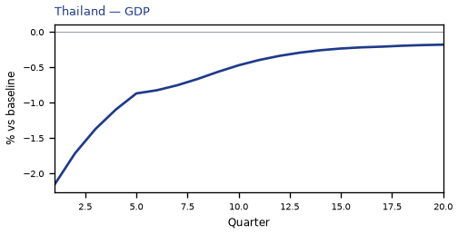


## NL — Netherlands

The main impact of VIX at 80 on Netherlands would be a large drop in GDP of 2.25% by Q1. Equities peak at -6.29% in Q1.

Demand and trade. Consumption peaks at -3.01 % vs baseline in Q1, from -3.01 in Q1 to -0.22 in Q20. Investment peaks at -11.46 % vs baseline in Q1, from -11.46 in Q1 to -0.97 in Q20. Net Exports peaks at +0.31 % vs baseline in Q1, from +0.31 in Q1 to +0.08 in Q20. Gov Spending peaks at +0.47 % vs baseline in Q1, from +0.47 in Q1 to +0.07 in Q20. Gov Debt peaks at +0.23 % vs baseline in Q13, from +0.06 in Q1 to +0.21 in Q20.

External / FX. The real exchange rate shows real depreciation (a weaker, more competitive home currency). Currency Strength peaks at +0.23 % vs baseline in Q2, from +0.21 in Q1 to +0.13 in Q20.

Labour. Employment peaks at -0.94 % vs baseline in Q8, from -0.38 in Q1 to -0.51 in Q20. Unemployment peaks at +0.75 pp in Q6, from +0.35 in Q1 to +0.35 in Q20. Real Wages peaks at -1.27 % vs baseline in Q20, from -0.02 in Q1 to -1.27 in Q20.

Prices. The three-year CPI impulse is -0.32 percentage points. CPI Inflation peaks at -0.07 pp in Q2, from -0.04 in Q1 to -0.00 in Q20. Domestic Infl. peaks at -0.05 pp in Q2, from -0.03 in Q1 to -0.00 in Q20. Marginal Cost peaks at -1.35 % vs baseline in Q1, from -1.35 in Q1 to -0.20 in Q20.

Financial conditions. Policy Rate peaks at -0.09 pp (annualized) in Q7, from -0.02 in Q1 to -0.04 in Q20. Govt 2Y Yield peaks at -0.08 pp (annualized) in Q4, from -0.07 in Q1 to -0.04 in Q20. Govt 5Y Yield peaks at -0.07 pp (annualized) in Q2, from -0.07 in Q1 to -0.03 in Q20. Govt 10Y Yield peaks at -0.05 pp (annualized) in Q1, from -0.05 in Q1 to -0.02 in Q20. Bond Price peaks at +0.60 % vs baseline in Q7, from +0.16 in Q1 to +0.31 in Q20. Equity Index peaks at -6.29 % vs baseline in Q1, from -6.29 in Q1 to -0.93 in Q20. Tobin's Q peaks at -4.38 % vs baseline in Q1, from -4.38 in Q1 to -0.60 in Q20. House Prices peaks at -1.20 % vs baseline in Q13, from -0.29 in Q1 to -1.13 in Q20. Bank Credit peaks at -0.45 % vs baseline in Q8, from -0.15 in Q1 to -0.25 in Q20. Credit Spread peaks at +0.00 pp in Q8, from +0.00 in Q1 to +0.00 in Q20.

Sectoral and capital. Manuf. GDP peaks at -0.42 % vs baseline in Q1, from -0.42 in Q1 to -0.10 in Q20. Services GDP peaks at -1.68 % vs baseline in Q1, from -1.68 in Q1 to -0.25 in Q20. Capital Stock peaks at -0.21 % vs baseline in Q20, from -0.03 in Q1 to -0.21 in Q20.

Timing. The GDP response has mostly faded by Q12 (Q20 is -0.34%).

These figures are model IRFs versus baseline, not forecasts.


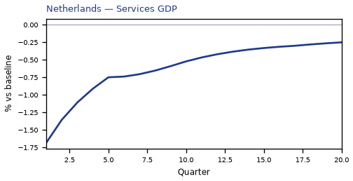

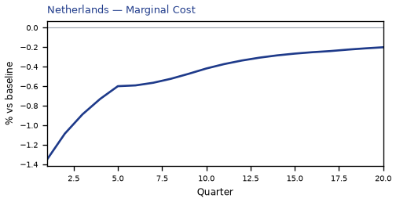

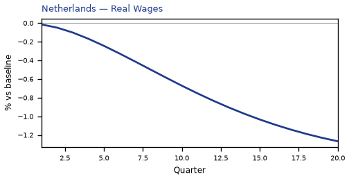

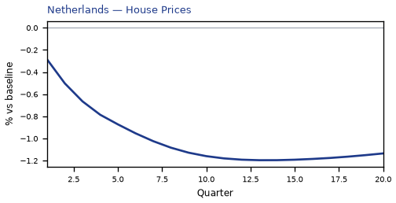

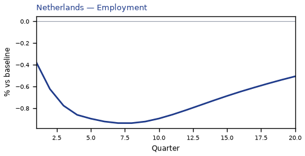

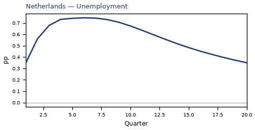

[Q1–Q20 JSON for Netherlands](numbers/NL.json)

## MY — Malaysia

The main impact of VIX at 80 on Malaysia would be a large drop in GDP of 2.23% by Q1. Equities peak at -5.98% in Q1.

Demand and trade. Consumption peaks at -3.18 % vs baseline in Q1, from -3.18 in Q1 to -0.18 in Q20. Investment peaks at -11.22 % vs baseline in Q1, from -11.22 in Q1 to -0.57 in Q20. Net Exports peaks at +0.31 % vs baseline in Q1, from +0.31 in Q1 to +0.14 in Q20. Gov Spending peaks at +0.34 % vs baseline in Q1, from +0.34 in Q1 to +0.03 in Q20. Gov Debt peaks at -1.51 % vs baseline in Q12, from -0.39 in Q1 to -1.38 in Q20.

External / FX. The real exchange rate shows real depreciation (a weaker, more competitive home currency). Currency Strength peaks at +0.54 % vs baseline in Q4, from +0.37 in Q1 to +0.38 in Q20.

Labour. Employment peaks at -1.00 % vs baseline in Q5, from -0.48 in Q1 to -0.30 in Q20. Unemployment peaks at +0.27 pp in Q4, from +0.15 in Q1 to +0.07 in Q20. Real Wages peaks at -1.39 % vs baseline in Q20, from -0.03 in Q1 to -1.39 in Q20.

Prices. The three-year CPI impulse is -0.15 percentage points. CPI Inflation peaks at -0.07 pp in Q2, from -0.07 in Q1 to -0.00 in Q20. Domestic Infl. peaks at -0.05 pp in Q2, from -0.05 in Q1 to -0.00 in Q20. Marginal Cost peaks at -1.34 % vs baseline in Q1, from -1.34 in Q1 to -0.13 in Q20.

Financial conditions. Policy Rate peaks at -0.37 pp (annualized) in Q5, from -0.15 in Q1 to -0.11 in Q20. Govt 2Y Yield peaks at -0.34 pp (annualized) in Q3, from -0.32 in Q1 to -0.10 in Q20. Govt 5Y Yield peaks at -0.24 pp (annualized) in Q1, from -0.24 in Q1 to -0.10 in Q20. Govt 10Y Yield peaks at -0.16 pp (annualized) in Q1, from -0.16 in Q1 to -0.08 in Q20. Bond Price peaks at +1.55 % vs baseline in Q5, from +0.64 in Q1 to +0.45 in Q20. Equity Index peaks at -5.98 % vs baseline in Q1, from -5.98 in Q1 to -0.57 in Q20. Tobin's Q peaks at -4.21 % vs baseline in Q1, from -4.21 in Q1 to -0.32 in Q20. House Prices peaks at -1.30 % vs baseline in Q9, from -0.40 in Q1 to -0.99 in Q20. Bank Credit peaks at -0.26 % vs baseline in Q7, from -0.09 in Q1 to -0.14 in Q20. Credit Spread peaks at +0.00 pp in Q7, from +0.00 in Q1 to +0.00 in Q20.

Sectoral and capital. Manuf. GDP peaks at -0.67 % vs baseline in Q1, from -0.67 in Q1 to -0.17 in Q20. Services GDP peaks at -1.28 % vs baseline in Q1, from -1.28 in Q1 to -0.13 in Q20. Capital Stock peaks at -0.15 % vs baseline in Q20, from -0.03 in Q1 to -0.15 in Q20.

Timing. The GDP response has mostly faded by Q10 (Q20 is -0.22%).

These figures are model IRFs versus baseline, not forecasts.


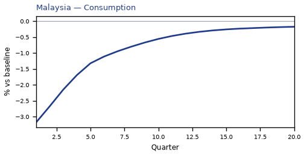

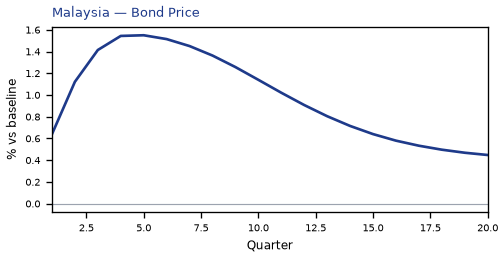


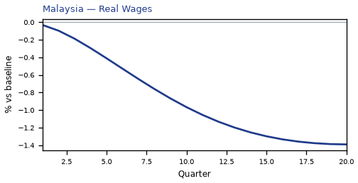

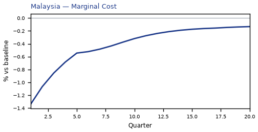

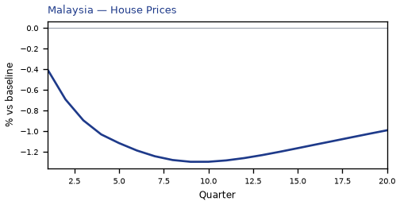

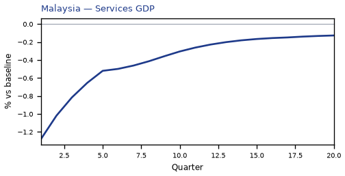

[Q1–Q20 JSON for Malaysia](numbers/MY.json)

## MX — Mexico

The main impact of VIX at 80 on Mexico would be a large drop in GDP of 2.16% by Q1. Equities peak at -3.83% in Q1.

Demand and trade. Consumption peaks at -2.95 % vs baseline in Q1, from -2.95 in Q1 to -0.10 in Q20. Investment peaks at -10.99 % vs baseline in Q1, from -10.99 in Q1 to -0.52 in Q20. Net Exports peaks at +0.18 % vs baseline in Q1, from +0.18 in Q1 to +0.06 in Q20. Gov Spending peaks at +0.34 % vs baseline in Q1, from +0.34 in Q1 to +0.02 in Q20. Gov Debt peaks at -1.18 % vs baseline in Q9, from -0.34 in Q1 to -0.92 in Q20.

External / FX. The real exchange rate shows real depreciation (a weaker, more competitive home currency). Currency Strength peaks at +1.10 % vs baseline in Q3, from +0.86 in Q1 to +0.32 in Q20.

Labour. Employment peaks at -0.86 % vs baseline in Q6, from -0.39 in Q1 to -0.19 in Q20. Unemployment peaks at +0.11 pp in Q3, from +0.07 in Q1 to +0.01 in Q20. Real Wages peaks at -1.33 % vs baseline in Q18, from -0.03 in Q1 to -1.32 in Q20.

Prices. The three-year CPI impulse is -0.43 percentage points. CPI Inflation peaks at -0.11 pp in Q2, from -0.07 in Q1 to -0.01 in Q20. Domestic Infl. peaks at -0.08 pp in Q2, from -0.05 in Q1 to -0.01 in Q20. Marginal Cost peaks at -1.29 % vs baseline in Q1, from -1.29 in Q1 to -0.09 in Q20.

Financial conditions. Policy Rate peaks at -0.47 pp (annualized) in Q4, from -0.17 in Q1 to -0.01 in Q20. Govt 2Y Yield peaks at -0.37 pp (annualized) in Q2, from -0.36 in Q1 to -0.04 in Q20. Govt 5Y Yield peaks at -0.18 pp (annualized) in Q1, from -0.18 in Q1 to -0.06 in Q20. Govt 10Y Yield peaks at -0.12 pp (annualized) in Q1, from -0.12 in Q1 to -0.05 in Q20. Bond Price peaks at +1.95 % vs baseline in Q4, from +0.69 in Q1 to +0.05 in Q20. Equity Index peaks at -3.83 % vs baseline in Q1, from -3.83 in Q1 to -0.26 in Q20. Tobin's Q peaks at -4.06 % vs baseline in Q1, from -4.06 in Q1 to -0.28 in Q20. House Prices peaks at -1.08 % vs baseline in Q8, from -0.36 in Q1 to -0.71 in Q20. Bank Credit peaks at -0.28 % vs baseline in Q7, from -0.10 in Q1 to -0.14 in Q20. Credit Spread peaks at +0.02 pp in Q7, from +0.01 in Q1 to +0.01 in Q20.

Sectoral and capital. Manuf. GDP peaks at -0.73 % vs baseline in Q1, from -0.73 in Q1 to -0.13 in Q20. Services GDP peaks at -1.31 % vs baseline in Q1, from -1.31 in Q1 to -0.09 in Q20. Capital Stock peaks at -0.13 % vs baseline in Q20, from -0.03 in Q1 to -0.13 in Q20.

Timing. The GDP response has mostly faded by Q9 (Q20 is -0.15%).

These figures are model IRFs versus baseline, not forecasts.


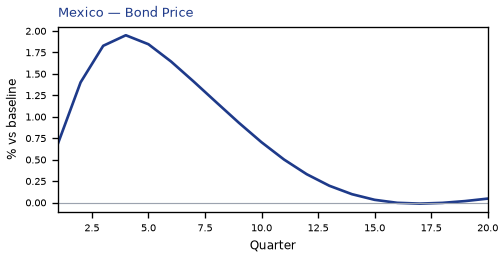

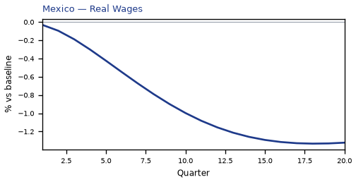

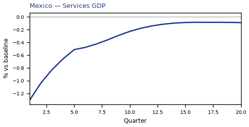

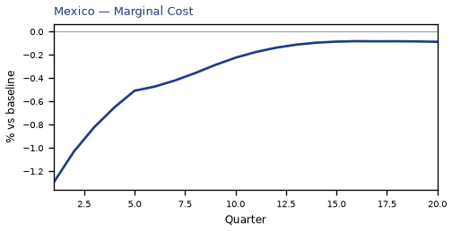

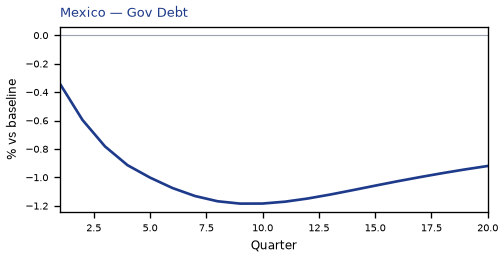

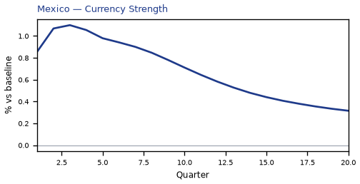

[Q1–Q20 JSON for Mexico](numbers/MX.json)

## TH — Thailand

The main impact of VIX at 80 on Thailand would be a large drop in GDP of 2.16% by Q1. Equities peak at -5.34% in Q1.

Demand and trade. Consumption peaks at -3.03 % vs baseline in Q1, from -3.03 in Q1 to -0.13 in Q20. Investment peaks at -10.96 % vs baseline in Q1, from -10.96 in Q1 to -0.49 in Q20. Net Exports peaks at +0.24 % vs baseline in Q1, from +0.24 in Q1 to +0.12 in Q20. Gov Spending peaks at +0.36 % vs baseline in Q1, from +0.36 in Q1 to +0.03 in Q20. Gov Debt peaks at -1.26 % vs baseline in Q10, from -0.36 in Q1 to -1.03 in Q20.

External / FX. The real exchange rate shows real depreciation (a weaker, more competitive home currency). Currency Strength peaks at +0.46 % vs baseline in Q13, from +0.06 in Q1 to +0.41 in Q20.

Labour. Employment peaks at -1.01 % vs baseline in Q4, from -0.51 in Q1 to -0.22 in Q20. Unemployment peaks at +0.11 pp in Q3, from +0.07 in Q1 to +0.02 in Q20. Real Wages peaks at -1.36 % vs baseline in Q18, from -0.03 in Q1 to -1.35 in Q20.

Prices. The three-year CPI impulse is -0.29 percentage points. CPI Inflation peaks at -0.11 pp in Q2, from -0.10 in Q1 to -0.00 in Q20. Domestic Infl. peaks at -0.08 pp in Q2, from -0.07 in Q1 to -0.00 in Q20. Marginal Cost peaks at -1.29 % vs baseline in Q1, from -1.29 in Q1 to -0.11 in Q20.

Financial conditions. Policy Rate peaks at -0.45 pp (annualized) in Q5, from -0.18 in Q1 to -0.08 in Q20. Govt 2Y Yield peaks at -0.40 pp (annualized) in Q2, from -0.38 in Q1 to -0.08 in Q20. Govt 5Y Yield peaks at -0.26 pp (annualized) in Q1, from -0.26 in Q1 to -0.09 in Q20. Govt 10Y Yield peaks at -0.17 pp (annualized) in Q1, from -0.17 in Q1 to -0.07 in Q20. Bond Price peaks at +1.89 % vs baseline in Q5, from +0.75 in Q1 to +0.34 in Q20. Equity Index peaks at -5.34 % vs baseline in Q1, from -5.34 in Q1 to -0.43 in Q20. Tobin's Q peaks at -4.03 % vs baseline in Q1, from -4.03 in Q1 to -0.26 in Q20. House Prices peaks at -1.17 % vs baseline in Q9, from -0.37 in Q1 to -0.85 in Q20. Bank Credit peaks at -0.24 % vs baseline in Q7, from -0.08 in Q1 to -0.13 in Q20. Credit Spread peaks at +0.00 pp in Q7, from +0.00 in Q1 to +0.00 in Q20.

Sectoral and capital. Manuf. GDP peaks at -0.59 % vs baseline in Q1, from -0.59 in Q1 to -0.17 in Q20. Services GDP peaks at -1.19 % vs baseline in Q1, from -1.19 in Q1 to -0.10 in Q20. Capital Stock peaks at -0.13 % vs baseline in Q20, from -0.03 in Q1 to -0.13 in Q20.

Timing. The GDP response has mostly faded by Q10 (Q20 is -0.18%).

These figures are model IRFs versus baseline, not forecasts.


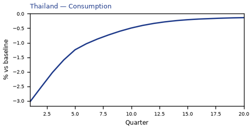


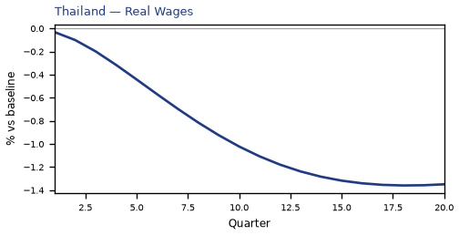

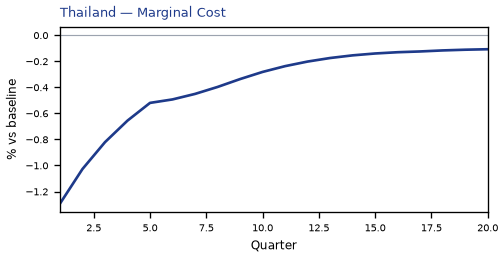

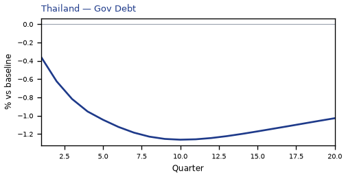


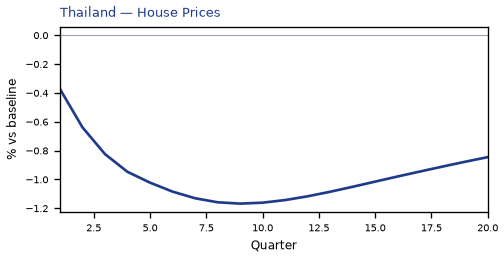

[Q1–Q20 JSON for Thailand](numbers/TH.json)

## CA — Canada

The main impact of VIX at 80 on Canada would be a large drop in GDP of 2.13% by Q1. Equities peak at -5.47% in Q1.

Demand and trade. Consumption peaks at -3.03 % vs baseline in Q1, from -3.03 in Q1 to -0.11 in Q20. Investment peaks at -10.76 % vs baseline in Q1, from -10.76 in Q1 to -0.33 in Q20. Net Exports peaks at -0.12 % vs baseline in Q3, from -0.01 in Q1 to +0.10 in Q20. Gov Spending peaks at +0.37 % vs baseline in Q1, from +0.37 in Q1 to +0.03 in Q20. Gov Debt peaks at -0.19 % vs baseline in Q10, from -0.05 in Q1 to -0.14 in Q20.

External / FX. The real exchange rate shows real depreciation (a weaker, more competitive home currency). Currency Strength peaks at +1.70 % vs baseline in Q3, from +1.22 in Q1 to +0.65 in Q20.

Labour. Employment peaks at -1.17 % vs baseline in Q4, from -0.63 in Q1 to -0.14 in Q20. Unemployment peaks at +0.69 pp in Q5, from +0.33 in Q1 to +0.18 in Q20. Real Wages peaks at -1.06 % vs baseline in Q20, from -0.02 in Q1 to -1.06 in Q20.

Prices. The three-year CPI impulse is -0.11 percentage points. CPI Inflation peaks at -0.06 pp in Q2, from -0.05 in Q1 to -0.00 in Q20. Domestic Infl. peaks at -0.04 pp in Q2, from -0.04 in Q1 to -0.00 in Q20. Marginal Cost peaks at -1.28 % vs baseline in Q1, from -1.28 in Q1 to -0.09 in Q20.

Financial conditions. Policy Rate peaks at -0.61 pp (annualized) in Q4, from -0.27 in Q1 to -0.12 in Q20. Govt 2Y Yield peaks at -0.55 pp (annualized) in Q2, from -0.52 in Q1 to -0.11 in Q20. Govt 5Y Yield peaks at -0.36 pp (annualized) in Q1, from -0.36 in Q1 to -0.12 in Q20. Govt 10Y Yield peaks at -0.24 pp (annualized) in Q1, from -0.24 in Q1 to -0.11 in Q20. Bond Price peaks at +3.64 % vs baseline in Q4, from +1.59 in Q1 to +0.72 in Q20. Equity Index peaks at -5.47 % vs baseline in Q1, from -5.47 in Q1 to -0.34 in Q20. Tobin's Q peaks at -3.89 % vs baseline in Q1, from -3.89 in Q1 to -0.15 in Q20. House Prices peaks at -0.85 % vs baseline in Q10, from -0.24 in Q1 to -0.67 in Q20. Bank Credit peaks at -0.30 % vs baseline in Q7, from -0.10 in Q1 to -0.16 in Q20. Credit Spread peaks at +0.00 pp in Q7, from +0.00 in Q1 to +0.00 in Q20.

Sectoral and capital. Manuf. GDP peaks at -0.74 % vs baseline in Q2, from -0.70 in Q1 to -0.22 in Q20. Services GDP peaks at -1.48 % vs baseline in Q1, from -1.48 in Q1 to -0.10 in Q20. Capital Stock peaks at -0.12 % vs baseline in Q20, from -0.03 in Q1 to -0.12 in Q20.

Timing. The GDP response has mostly faded by Q10 (Q20 is -0.14%).

These figures are model IRFs versus baseline, not forecasts.


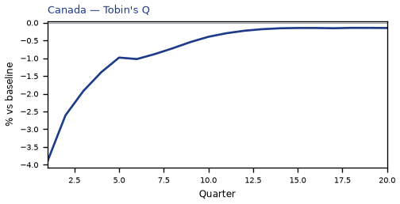

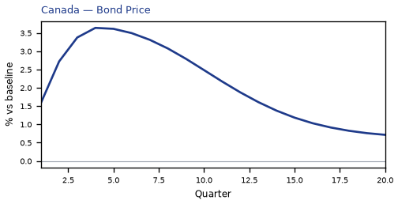

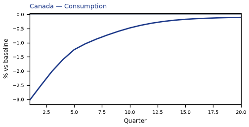

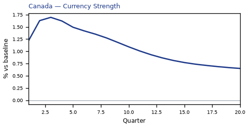

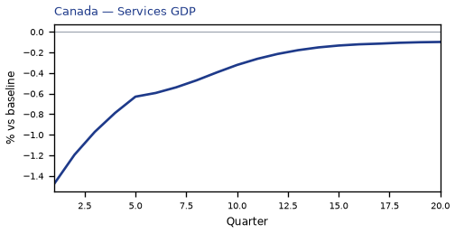

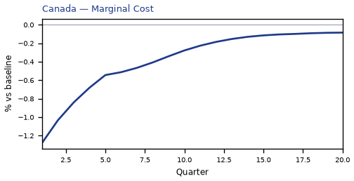

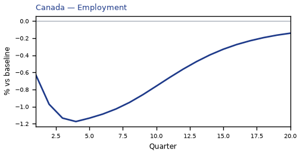


[Q1–Q20 JSON for Canada](numbers/CA.json)

## CH — Switzerland

The main impact of VIX at 80 on Switzerland would be a large drop in GDP of 2.10% by Q1. Equities peak at -8.37% in Q1.

Demand and trade. Consumption peaks at -3.12 % vs baseline in Q1, from -3.12 in Q1 to -0.22 in Q20. Investment peaks at -10.92 % vs baseline in Q1, from -10.92 in Q1 to -0.69 in Q20. Net Exports peaks at +0.21 % vs baseline in Q1, from +0.21 in Q1 to +0.10 in Q20. Gov Spending peaks at +0.42 % vs baseline in Q1, from +0.42 in Q1 to +0.06 in Q20. Gov Debt peaks at -0.49 % vs baseline in Q10, from -0.14 in Q1 to -0.39 in Q20.

External / FX. The real exchange rate shows real appreciation (a stronger home currency). Currency Strength peaks at -0.45 % vs baseline in Q1, from -0.45 in Q1 to +0.29 in Q20.

Labour. Employment peaks at -1.06 % vs baseline in Q4, from -0.54 in Q1 to -0.38 in Q20. Unemployment peaks at +0.71 pp in Q6, from +0.33 in Q1 to +0.32 in Q20. Real Wages peaks at -0.77 % vs baseline in Q20, from -0.01 in Q1 to -0.77 in Q20.

Prices. The three-year CPI impulse is -0.19 percentage points. CPI Inflation peaks at -0.11 pp in Q1, from -0.11 in Q1 to +0.00 in Q20. Domestic Infl. peaks at -0.08 pp in Q1, from -0.08 in Q1 to +0.00 in Q20. Marginal Cost peaks at -1.26 % vs baseline in Q1, from -1.26 in Q1 to -0.17 in Q20.

Financial conditions. Policy Rate peaks at -0.27 pp (annualized) in Q7, from -0.10 in Q1 to -0.15 in Q20. Govt 2Y Yield peaks at -0.26 pp (annualized) in Q4, from -0.23 in Q1 to -0.13 in Q20. Govt 5Y Yield peaks at -0.21 pp (annualized) in Q2, from -0.21 in Q1 to -0.11 in Q20. Govt 10Y Yield peaks at -0.16 pp (annualized) in Q1, from -0.16 in Q1 to -0.09 in Q20. Bond Price peaks at +1.89 % vs baseline in Q7, from +0.71 in Q1 to +1.05 in Q20. Equity Index peaks at -8.37 % vs baseline in Q1, from -8.37 in Q1 to -1.13 in Q20. Tobin's Q peaks at -4.00 % vs baseline in Q1, from -4.00 in Q1 to -0.40 in Q20. House Prices peaks at -1.04 % vs baseline in Q13, from -0.25 in Q1 to -0.96 in Q20. Bank Credit peaks at -0.41 % vs baseline in Q8, from -0.13 in Q1 to -0.24 in Q20. Credit Spread peaks at +0.00 pp in Q8, from +0.00 in Q1 to +0.00 in Q20.

Sectoral and capital. Manuf. GDP peaks at -0.27 % vs baseline in Q1, from -0.27 in Q1 to -0.15 in Q20. Services GDP peaks at -1.66 % vs baseline in Q1, from -1.66 in Q1 to -0.23 in Q20. Capital Stock peaks at -0.18 % vs baseline in Q20, from -0.03 in Q1 to -0.18 in Q20.

Timing. The GDP response has mostly faded by Q12 (Q20 is -0.29%).

These figures are model IRFs versus baseline, not forecasts.


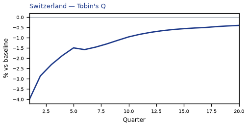

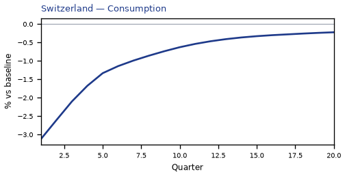

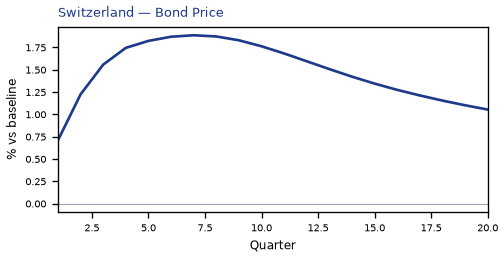

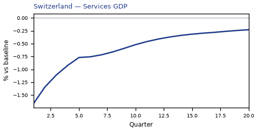

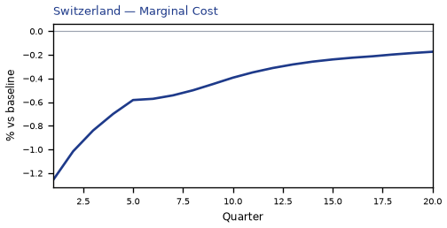

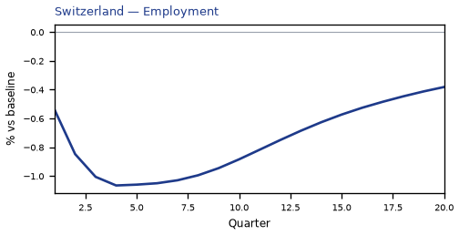

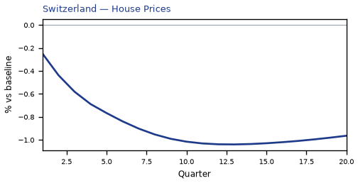

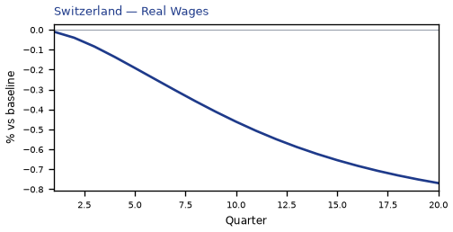

[Q1–Q20 JSON for Switzerland](numbers/CH.json)

## PL — Poland

The main impact of VIX at 80 on Poland would be a large drop in GDP of 2.09% by Q1. Equities peak at -3.72% in Q1.

Demand and trade. Consumption peaks at -2.83 % vs baseline in Q1, from -2.83 in Q1 to -0.12 in Q20. Investment peaks at -10.88 % vs baseline in Q1, from -10.88 in Q1 to -0.66 in Q20. Net Exports peaks at +0.37 % vs baseline in Q1, from +0.37 in Q1 to +0.07 in Q20. Gov Spending peaks at +0.42 % vs baseline in Q1, from +0.42 in Q1 to +0.04 in Q20. Gov Debt peaks at +0.00 % vs baseline in Q1, from +0.00 in Q1 to +0.00 in Q20.

External / FX. The real exchange rate shows real depreciation (a weaker, more competitive home currency). Currency Strength peaks at +0.23 % vs baseline in Q14, from -0.11 in Q1 to +0.19 in Q20.

Labour. Employment peaks at -0.92 % vs baseline in Q4, from -0.45 in Q1 to -0.27 in Q20. Unemployment peaks at +0.40 pp in Q4, from +0.21 in Q1 to +0.12 in Q20. Real Wages peaks at -1.32 % vs baseline in Q20, from -0.02 in Q1 to -1.32 in Q20.

Prices. The three-year CPI impulse is -0.38 percentage points. CPI Inflation peaks at -0.10 pp in Q2, from -0.08 in Q1 to -0.01 in Q20. Domestic Infl. peaks at -0.07 pp in Q2, from -0.05 in Q1 to -0.01 in Q20. Marginal Cost peaks at -1.25 % vs baseline in Q1, from -1.25 in Q1 to -0.12 in Q20.

Financial conditions. Policy Rate peaks at -0.29 pp (annualized) in Q4, from -0.10 in Q1 to -0.02 in Q20. Govt 2Y Yield peaks at -0.24 pp (annualized) in Q2, from -0.23 in Q1 to -0.03 in Q20. Govt 5Y Yield peaks at -0.13 pp (annualized) in Q1, from -0.13 in Q1 to -0.04 in Q20. Govt 10Y Yield peaks at -0.08 pp (annualized) in Q1, from -0.08 in Q1 to -0.03 in Q20. Bond Price peaks at +1.21 % vs baseline in Q4, from +0.43 in Q1 to +0.09 in Q20. Equity Index peaks at -3.72 % vs baseline in Q1, from -3.72 in Q1 to -0.37 in Q20. Tobin's Q peaks at -3.98 % vs baseline in Q1, from -3.98 in Q1 to -0.38 in Q20. House Prices peaks at -0.89 % vs baseline in Q11, from -0.25 in Q1 to -0.78 in Q20. Bank Credit peaks at -0.26 % vs baseline in Q8, from -0.09 in Q1 to -0.14 in Q20. Credit Spread peaks at +0.01 pp in Q8, from +0.00 in Q1 to +0.00 in Q20.

Sectoral and capital. Manuf. GDP peaks at -0.48 % vs baseline in Q1, from -0.48 in Q1 to -0.11 in Q20. Services GDP peaks at -1.31 % vs baseline in Q1, from -1.31 in Q1 to -0.13 in Q20. Capital Stock peaks at -0.15 % vs baseline in Q20, from -0.03 in Q1 to -0.15 in Q20.

Timing. The GDP response has mostly faded by Q10 (Q20 is -0.21%).

These figures are model IRFs versus baseline, not forecasts.


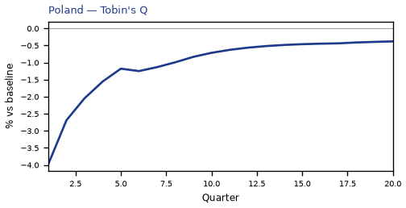


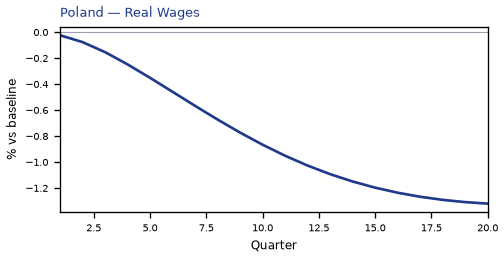


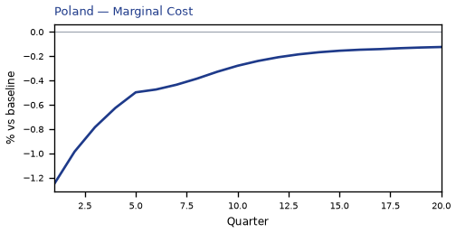

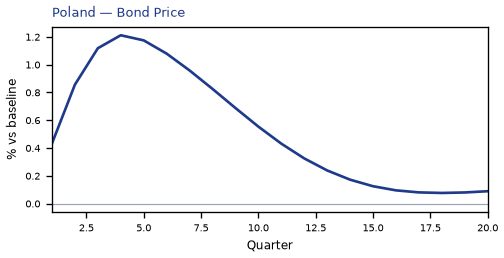

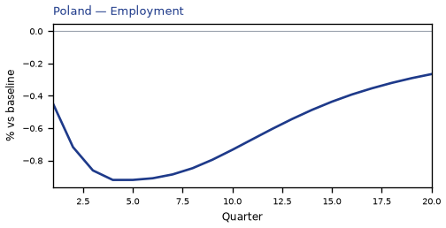


[Q1–Q20 JSON for Poland](numbers/PL.json)

## NO — Norway

The main impact of VIX at 80 on Norway would be a large drop in GDP of 2.06% by Q1. Equities peak at -4.46% in Q1.

Demand and trade. Consumption peaks at -2.89 % vs baseline in Q1, from -2.89 in Q1 to -0.11 in Q20. Investment peaks at -10.63 % vs baseline in Q1, from -10.63 in Q1 to -0.32 in Q20. Net Exports peaks at -0.46 % vs baseline in Q3, from -0.28 in Q1 to +0.08 in Q20. Gov Spending peaks at +0.22 % vs baseline in Q1, from +0.22 in Q1 to +0.02 in Q20. Gov Debt peaks at +0.25 % vs baseline in Q10, from +0.07 in Q1 to +0.21 in Q20.

External / FX. The real exchange rate shows real depreciation (a weaker, more competitive home currency). Currency Strength peaks at +1.59 % vs baseline in Q3, from +1.16 in Q1 to +0.64 in Q20.

Labour. Employment peaks at -0.87 % vs baseline in Q6, from -0.38 in Q1 to -0.28 in Q20. Unemployment peaks at +0.67 pp in Q5, from +0.32 in Q1 to +0.21 in Q20. Real Wages peaks at -1.02 % vs baseline in Q20, from -0.02 in Q1 to -1.02 in Q20.

Prices. The three-year CPI impulse is -0.22 percentage points. CPI Inflation peaks at -0.07 pp in Q2, from -0.06 in Q1 to -0.00 in Q20. Domestic Infl. peaks at -0.05 pp in Q2, from -0.04 in Q1 to -0.00 in Q20. Marginal Cost peaks at -1.23 % vs baseline in Q1, from -1.23 in Q1 to -0.10 in Q20.

Financial conditions. Policy Rate peaks at -0.54 pp (annualized) in Q5, from -0.21 in Q1 to -0.17 in Q20. Govt 2Y Yield peaks at -0.50 pp (annualized) in Q3, from -0.46 in Q1 to -0.14 in Q20. Govt 5Y Yield peaks at -0.36 pp (annualized) in Q1, from -0.36 in Q1 to -0.13 in Q20. Govt 10Y Yield peaks at -0.24 pp (annualized) in Q1, from -0.24 in Q1 to -0.11 in Q20. Bond Price peaks at +3.37 % vs baseline in Q5, from +1.33 in Q1 to +1.04 in Q20. Equity Index peaks at -4.46 % vs baseline in Q1, from -4.46 in Q1 to -0.32 in Q20. Tobin's Q peaks at -3.80 % vs baseline in Q1, from -3.80 in Q1 to -0.15 in Q20. House Prices peaks at -0.85 % vs baseline in Q10, from -0.23 in Q1 to -0.70 in Q20. Bank Credit peaks at -0.32 % vs baseline in Q8, from -0.10 in Q1 to -0.17 in Q20. Credit Spread peaks at +0.00 pp in Q8, from +0.00 in Q1 to +0.00 in Q20.

Sectoral and capital. Manuf. GDP peaks at -0.70 % vs baseline in Q2, from -0.67 in Q1 to -0.22 in Q20. Services GDP peaks at -1.18 % vs baseline in Q1, from -1.18 in Q1 to -0.10 in Q20. Capital Stock peaks at -0.12 % vs baseline in Q20, from -0.03 in Q1 to -0.12 in Q20.

Timing. The GDP response has mostly faded by Q10 (Q20 is -0.17%).

These figures are model IRFs versus baseline, not forecasts.


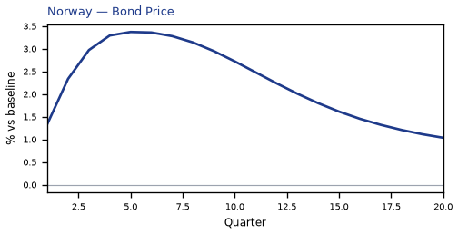


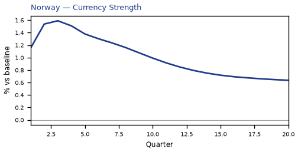

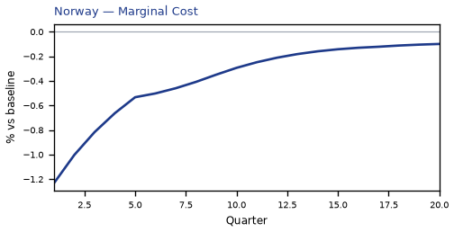

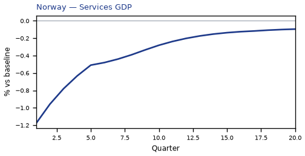

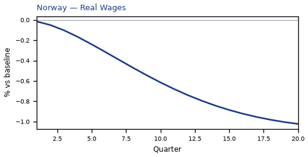

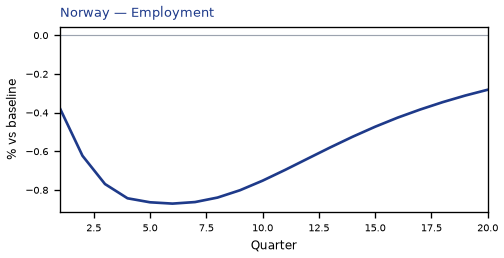

[Q1–Q20 JSON for Norway](numbers/NO.json)

## DE — Germany

The main impact of VIX at 80 on Germany would be a large drop in GDP of 2.03% by Q1. Equities peak at -4.05% in Q1.

Demand and trade. Consumption peaks at -2.86 % vs baseline in Q1, from -2.86 in Q1 to -0.17 in Q20. Investment peaks at -10.84 % vs baseline in Q1, from -10.84 in Q1 to -0.77 in Q20. Net Exports peaks at +0.41 % vs baseline in Q1, from +0.41 in Q1 to +0.06 in Q20. Gov Spending peaks at +0.46 % vs baseline in Q1, from +0.46 in Q1 to +0.06 in Q20. Gov Debt peaks at +0.15 % vs baseline in Q14, from +0.03 in Q1 to +0.14 in Q20.

External / FX. The real exchange rate shows real depreciation (a weaker, more competitive home currency). Currency Strength peaks at +0.12 % vs baseline in Q20, from -0.00 in Q1 to +0.12 in Q20.

Labour. Employment peaks at -0.92 % vs baseline in Q7, from -0.40 in Q1 to -0.39 in Q20. Unemployment peaks at +0.68 pp in Q6, from +0.31 in Q1 to +0.29 in Q20. Real Wages peaks at -1.27 % vs baseline in Q20, from -0.01 in Q1 to -1.27 in Q20.

Prices. The three-year CPI impulse is -0.47 percentage points. CPI Inflation peaks at -0.08 pp in Q3, from -0.04 in Q1 to -0.01 in Q20. Domestic Infl. peaks at -0.06 pp in Q3, from -0.03 in Q1 to -0.00 in Q20. Marginal Cost peaks at -1.22 % vs baseline in Q1, from -1.22 in Q1 to -0.16 in Q20.

Financial conditions. Policy Rate peaks at -0.09 pp (annualized) in Q7, from -0.02 in Q1 to -0.04 in Q20. Govt 2Y Yield peaks at -0.08 pp (annualized) in Q4, from -0.07 in Q1 to -0.04 in Q20. Govt 5Y Yield peaks at -0.07 pp (annualized) in Q2, from -0.07 in Q1 to -0.03 in Q20. Govt 10Y Yield peaks at -0.05 pp (annualized) in Q1, from -0.05 in Q1 to -0.02 in Q20. Bond Price peaks at +0.60 % vs baseline in Q7, from +0.16 in Q1 to +0.31 in Q20. Equity Index peaks at -4.05 % vs baseline in Q1, from -4.05 in Q1 to -0.52 in Q20. Tobin's Q peaks at -3.95 % vs baseline in Q1, from -3.95 in Q1 to -0.45 in Q20. House Prices peaks at -1.00 % vs baseline in Q13, from -0.24 in Q1 to -0.92 in Q20. Bank Credit peaks at -0.40 % vs baseline in Q8, from -0.13 in Q1 to -0.23 in Q20. Credit Spread peaks at +0.00 pp in Q8, from +0.00 in Q1 to +0.00 in Q20.

Sectoral and capital. Manuf. GDP peaks at -0.48 % vs baseline in Q1, from -0.48 in Q1 to -0.10 in Q20. Services GDP peaks at -1.38 % vs baseline in Q1, from -1.38 in Q1 to -0.18 in Q20. Capital Stock peaks at -0.19 % vs baseline in Q20, from -0.03 in Q1 to -0.19 in Q20.

Timing. The GDP response has mostly faded by Q12 (Q20 is -0.26%).

These figures are model IRFs versus baseline, not forecasts.


[Q1–Q20 JSON for Germany](numbers/DE.json)

## CL — Chile

The main impact of VIX at 80 on Chile would be a large drop in GDP of 2.03% by Q1. Equities peak at -4.62% in Q1.

Demand and trade. Consumption peaks at -2.94 % vs baseline in Q1, from -2.94 in Q1 to -0.09 in Q20. Investment peaks at -10.67 % vs baseline in Q1, from -10.67 in Q1 to -0.45 in Q20. Net Exports peaks at -0.07 % vs baseline in Q3, from +0.03 in Q1 to +0.05 in Q20. Gov Spending peaks at +0.28 % vs baseline in Q1, from +0.28 in Q1 to +0.02 in Q20. Gov Debt peaks at -0.74 % vs baseline in Q8, from -0.24 in Q1 to -0.48 in Q20.

External / FX. The real exchange rate shows real depreciation (a weaker, more competitive home currency). Currency Strength peaks at +0.94 % vs baseline in Q3, from +0.70 in Q1 to +0.29 in Q20.

Labour. Employment peaks at -0.94 % vs baseline in Q4, from -0.47 in Q1 to -0.14 in Q20. Unemployment peaks at +0.36 pp in Q4, from +0.20 in Q1 to +0.06 in Q20. Real Wages peaks at -1.28 % vs baseline in Q17, from -0.03 in Q1 to -1.26 in Q20.

Prices. The three-year CPI impulse is -0.46 percentage points. CPI Inflation peaks at -0.11 pp in Q2, from -0.09 in Q1 to -0.01 in Q20. Domestic Infl. peaks at -0.08 pp in Q2, from -0.06 in Q1 to -0.00 in Q20. Marginal Cost peaks at -1.22 % vs baseline in Q1, from -1.22 in Q1 to -0.08 in Q20.

Financial conditions. Policy Rate peaks at -0.40 pp (annualized) in Q4, from -0.14 in Q1 to -0.02 in Q20. Govt 2Y Yield peaks at -0.33 pp (annualized) in Q2, from -0.32 in Q1 to -0.03 in Q20. Govt 5Y Yield peaks at -0.17 pp (annualized) in Q1, from -0.17 in Q1 to -0.05 in Q20. Govt 10Y Yield peaks at -0.11 pp (annualized) in Q1, from -0.11 in Q1 to -0.04 in Q20. Bond Price peaks at +1.65 % vs baseline in Q4, from +0.58 in Q1 to +0.06 in Q20. Equity Index peaks at -4.62 % vs baseline in Q1, from -4.62 in Q1 to -0.29 in Q20. Tobin's Q peaks at -3.83 % vs baseline in Q1, from -3.83 in Q1 to -0.23 in Q20. House Prices peaks at -0.98 % vs baseline in Q8, from -0.32 in Q1 to -0.65 in Q20. Bank Credit peaks at -0.22 % vs baseline in Q7, from -0.08 in Q1 to -0.11 in Q20. Credit Spread peaks at +0.01 pp in Q7, from +0.00 in Q1 to +0.00 in Q20.

Sectoral and capital. Manuf. GDP peaks at -0.53 % vs baseline in Q1, from -0.53 in Q1 to -0.11 in Q20. Services GDP peaks at -1.23 % vs baseline in Q1, from -1.23 in Q1 to -0.08 in Q20. Capital Stock peaks at -0.12 % vs baseline in Q20, from -0.03 in Q1 to -0.12 in Q20.

Timing. The GDP response has mostly faded by Q9 (Q20 is -0.13%).

These figures are model IRFs versus baseline, not forecasts.


[Q1–Q20 JSON for Chile](numbers/CL.json)

## SE — Sweden

The main impact of VIX at 80 on Sweden would be a large drop in GDP of 2.02% by Q1. Equities peak at -6.03% in Q1.

Demand and trade. Consumption peaks at -2.89 % vs baseline in Q1, from -2.89 in Q1 to -0.15 in Q20. Investment peaks at -10.74 % vs baseline in Q1, from -10.74 in Q1 to -0.70 in Q20. Net Exports peaks at +0.23 % vs baseline in Q1, from +0.23 in Q1 to +0.06 in Q20. Gov Spending peaks at +0.42 % vs baseline in Q1, from +0.42 in Q1 to +0.05 in Q20. Gov Debt peaks at +0.39 % vs baseline in Q10, from +0.12 in Q1 to +0.31 in Q20.

External / FX. The real exchange rate shows real depreciation (a weaker, more competitive home currency). Currency Strength peaks at +0.33 % vs baseline in Q3, from +0.23 in Q1 to +0.19 in Q20.

Labour. Employment peaks at -0.81 % vs baseline in Q7, from -0.35 in Q1 to -0.36 in Q20. Unemployment peaks at +0.65 pp in Q5, from +0.31 in Q1 to +0.26 in Q20. Real Wages peaks at -1.21 % vs baseline in Q20, from -0.02 in Q1 to -1.21 in Q20.

Prices. The three-year CPI impulse is -0.36 percentage points. CPI Inflation peaks at -0.08 pp in Q2, from -0.07 in Q1 to -0.01 in Q20. Domestic Infl. peaks at -0.06 pp in Q2, from -0.05 in Q1 to -0.00 in Q20. Marginal Cost peaks at -1.21 % vs baseline in Q1, from -1.21 in Q1 to -0.14 in Q20.

Financial conditions. Policy Rate peaks at -0.21 pp (annualized) in Q5, from -0.07 in Q1 to -0.04 in Q20. Govt 2Y Yield peaks at -0.19 pp (annualized) in Q2, from -0.18 in Q1 to -0.04 in Q20. Govt 5Y Yield peaks at -0.12 pp (annualized) in Q1, from -0.12 in Q1 to -0.04 in Q20. Govt 10Y Yield peaks at -0.08 pp (annualized) in Q1, from -0.08 in Q1 to -0.03 in Q20. Bond Price peaks at +1.34 % vs baseline in Q5, from +0.45 in Q1 to +0.24 in Q20. Equity Index peaks at -6.03 % vs baseline in Q1, from -6.03 in Q1 to -0.70 in Q20. Tobin's Q peaks at -3.88 % vs baseline in Q1, from -3.88 in Q1 to -0.41 in Q20. House Prices peaks at -0.90 % vs baseline in Q12, from -0.24 in Q1 to -0.82 in Q20. Bank Credit peaks at -0.33 % vs baseline in Q8, from -0.11 in Q1 to -0.19 in Q20. Credit Spread peaks at +0.00 pp in Q8, from +0.00 in Q1 to +0.00 in Q20.

Sectoral and capital. Manuf. GDP peaks at -0.46 % vs baseline in Q1, from -0.46 in Q1 to -0.10 in Q20. Services GDP peaks at -1.44 % vs baseline in Q1, from -1.44 in Q1 to -0.17 in Q20. Capital Stock peaks at -0.16 % vs baseline in Q20, from -0.03 in Q1 to -0.16 in Q20.

Timing. The GDP response has mostly faded by Q11 (Q20 is -0.24%).

These figures are model IRFs versus baseline, not forecasts.


[Q1–Q20 JSON for Sweden](numbers/SE.json)

## KR — South Korea

The main impact of VIX at 80 on South Korea would be a large drop in GDP of 2.00% by Q1. Equities peak at -4.93% in Q1.

Demand and trade. Consumption peaks at -2.92 % vs baseline in Q1, from -2.92 in Q1 to -0.07 in Q20. Investment peaks at -10.47 % vs baseline in Q1, from -10.47 in Q1 to -0.33 in Q20. Net Exports peaks at +0.52 % vs baseline in Q2, from +0.49 in Q1 to +0.10 in Q20. Gov Spending peaks at +0.36 % vs baseline in Q1, from +0.36 in Q1 to +0.02 in Q20. Gov Debt peaks at -0.47 % vs baseline in Q10, from -0.13 in Q1 to -0.37 in Q20.

External / FX. The real exchange rate shows real depreciation (a weaker, more competitive home currency). Currency Strength peaks at +0.41 % vs baseline in Q15, from -0.28 in Q1 to +0.38 in Q20.

Labour. Employment peaks at -0.81 % vs baseline in Q5, from -0.39 in Q1 to -0.15 in Q20. Unemployment peaks at +0.38 pp in Q4, from +0.20 in Q1 to +0.06 in Q20. Real Wages peaks at -1.16 % vs baseline in Q20, from -0.02 in Q1 to -1.16 in Q20.

Prices. The three-year CPI impulse is -0.24 percentage points. CPI Inflation peaks at -0.08 pp in Q2, from -0.07 in Q1 to -0.00 in Q20. Domestic Infl. peaks at -0.06 pp in Q2, from -0.05 in Q1 to -0.00 in Q20. Marginal Cost peaks at -1.20 % vs baseline in Q1, from -1.20 in Q1 to -0.06 in Q20.

Financial conditions. Policy Rate peaks at -0.49 pp (annualized) in Q4, from -0.21 in Q1 to -0.04 in Q20. Govt 2Y Yield peaks at -0.41 pp (annualized) in Q2, from -0.40 in Q1 to -0.05 in Q20. Govt 5Y Yield peaks at -0.24 pp (annualized) in Q1, from -0.24 in Q1 to -0.06 in Q20. Govt 10Y Yield peaks at -0.15 pp (annualized) in Q1, from -0.15 in Q1 to -0.06 in Q20. Bond Price peaks at +2.44 % vs baseline in Q4, from +1.07 in Q1 to +0.21 in Q20. Equity Index peaks at -4.93 % vs baseline in Q1, from -4.93 in Q1 to -0.23 in Q20. Tobin's Q peaks at -3.69 % vs baseline in Q1, from -3.69 in Q1 to -0.15 in Q20. House Prices peaks at -0.77 % vs baseline in Q9, from -0.23 in Q1 to -0.57 in Q20. Bank Credit peaks at -0.26 % vs baseline in Q7, from -0.09 in Q1 to -0.14 in Q20. Credit Spread peaks at +0.00 pp in Q7, from +0.00 in Q1 to +0.00 in Q20.

Sectoral and capital. Manuf. GDP peaks at -0.49 % vs baseline in Q1, from -0.49 in Q1 to -0.14 in Q20. Services GDP peaks at -1.21 % vs baseline in Q1, from -1.21 in Q1 to -0.06 in Q20. Capital Stock peaks at -0.10 % vs baseline in Q20, from -0.03 in Q1 to -0.10 in Q20.

Timing. The GDP response has mostly faded by Q9 (Q20 is -0.10%).

These figures are model IRFs versus baseline, not forecasts.


[Q1–Q20 JSON for South Korea](numbers/KR.json)

## SA — Saudi Arabia

The main impact of VIX at 80 on Saudi Arabia would be a large drop in GDP of 2.00% by Q1. Equities peak at -7.93% in Q1.

Demand and trade. Consumption peaks at -2.89 % vs baseline in Q1, from -2.89 in Q1 to -0.13 in Q20. Investment peaks at -10.34 % vs baseline in Q1, from -10.34 in Q1 to -0.61 in Q20. Net Exports peaks at -0.81 % vs baseline in Q3, from -0.57 in Q1 to +0.03 in Q20. Gov Spending peaks at -0.16 % vs baseline in Q4, from +0.06 in Q1 to +0.02 in Q20. Gov Debt peaks at -1.56 % vs baseline in Q20, from -0.30 in Q1 to -1.56 in Q20.

External / FX. The real exchange rate shows real depreciation (a weaker, more competitive home currency). Currency Strength peaks at +0.48 % vs baseline in Q13, from +0.03 in Q1 to +0.39 in Q20.

Labour. Employment peaks at -0.96 % vs baseline in Q5, from -0.46 in Q1 to -0.23 in Q20. Unemployment peaks at +0.40 pp in Q4, from +0.20 in Q1 to +0.10 in Q20. Real Wages peaks at -1.26 % vs baseline in Q20, from -0.01 in Q1 to -1.26 in Q20.

Prices. The three-year CPI impulse is -0.43 percentage points. CPI Inflation peaks at -0.09 pp in Q2, from -0.08 in Q1 to -0.01 in Q20. Domestic Infl. peaks at -0.07 pp in Q2, from -0.06 in Q1 to -0.01 in Q20. Marginal Cost peaks at -1.20 % vs baseline in Q1, from -1.20 in Q1 to -0.11 in Q20.

Financial conditions. Policy Rate peaks at -0.73 pp (annualized) in Q5, from -0.30 in Q1 to +0.00 in Q20. Govt 2Y Yield peaks at -0.65 pp (annualized) in Q2, from -0.62 in Q1 to +0.01 in Q20. Govt 5Y Yield peaks at -0.38 pp (annualized) in Q1, from -0.38 in Q1 to -0.01 in Q20. Govt 10Y Yield peaks at -0.20 pp (annualized) in Q1, from -0.20 in Q1 to -0.03 in Q20. Bond Price peaks at +3.66 % vs baseline in Q5, from +1.50 in Q1 to -0.00 in Q20. Equity Index peaks at -7.93 % vs baseline in Q1, from -7.93 in Q1 to -0.72 in Q20. Tobin's Q peaks at -3.60 % vs baseline in Q1, from -3.60 in Q1 to -0.35 in Q20. House Prices peaks at -0.99 % vs baseline in Q9, from -0.31 in Q1 to -0.73 in Q20. Bank Credit peaks at -0.24 % vs baseline in Q7, from -0.08 in Q1 to -0.13 in Q20. Credit Spread peaks at +0.01 pp in Q7, from +0.00 in Q1 to +0.00 in Q20.

Sectoral and capital. Manuf. GDP peaks at -0.27 % vs baseline in Q1, from -0.27 in Q1 to -0.14 in Q20. Services GDP peaks at -0.88 % vs baseline in Q1, from -0.88 in Q1 to -0.08 in Q20. Capital Stock peaks at -0.11 % vs baseline in Q20, from -0.03 in Q1 to -0.11 in Q20.

Timing. The GDP response has mostly faded by Q10 (Q20 is -0.18%).

These figures are model IRFs versus baseline, not forecasts.


[Q1–Q20 JSON for Saudi Arabia](numbers/SA.json)

## FR — France

The main impact of VIX at 80 on France would be a large drop in GDP of 1.99% by Q1. Equities peak at -4.57% in Q1.

Demand and trade. Consumption peaks at -2.83 % vs baseline in Q1, from -2.83 in Q1 to -0.15 in Q20. Investment peaks at -10.74 % vs baseline in Q1, from -10.74 in Q1 to -0.73 in Q20. Net Exports peaks at +0.27 % vs baseline in Q1, from +0.27 in Q1 to +0.04 in Q20. Gov Spending peaks at +0.47 % vs baseline in Q1, from +0.47 in Q1 to +0.06 in Q20. Gov Debt peaks at +0.70 % vs baseline in Q16, from +0.15 in Q1 to +0.68 in Q20.

External / FX. The real exchange rate shows real depreciation (a weaker, more competitive home currency). Currency Strength peaks at +0.12 % vs baseline in Q20, from +0.01 in Q1 to +0.12 in Q20.

Labour. Employment peaks at -0.84 % vs baseline in Q7, from -0.33 in Q1 to -0.40 in Q20. Unemployment peaks at +0.67 pp in Q6, from +0.31 in Q1 to +0.28 in Q20. Real Wages peaks at -0.97 % vs baseline in Q20, from -0.01 in Q1 to -0.97 in Q20.

Prices. The three-year CPI impulse is -0.43 percentage points. CPI Inflation peaks at -0.08 pp in Q2, from -0.05 in Q1 to -0.00 in Q20. Domestic Infl. peaks at -0.06 pp in Q2, from -0.04 in Q1 to -0.00 in Q20. Marginal Cost peaks at -1.19 % vs baseline in Q1, from -1.19 in Q1 to -0.15 in Q20.

Financial conditions. Policy Rate peaks at -0.09 pp (annualized) in Q7, from -0.02 in Q1 to -0.04 in Q20. Govt 2Y Yield peaks at -0.08 pp (annualized) in Q4, from -0.07 in Q1 to -0.04 in Q20. Govt 5Y Yield peaks at -0.07 pp (annualized) in Q2, from -0.07 in Q1 to -0.03 in Q20. Govt 10Y Yield peaks at -0.05 pp (annualized) in Q1, from -0.05 in Q1 to -0.02 in Q20. Bond Price peaks at +0.60 % vs baseline in Q7, from +0.16 in Q1 to +0.31 in Q20. Equity Index peaks at -4.57 % vs baseline in Q1, from -4.57 in Q1 to -0.56 in Q20. Tobin's Q peaks at -3.87 % vs baseline in Q1, from -3.87 in Q1 to -0.43 in Q20. House Prices peaks at -0.94 % vs baseline in Q12, from -0.23 in Q1 to -0.86 in Q20. Bank Credit peaks at -0.40 % vs baseline in Q8, from -0.13 in Q1 to -0.23 in Q20. Credit Spread peaks at +0.00 pp in Q8, from +0.00 in Q1 to +0.00 in Q20.

Sectoral and capital. Manuf. GDP peaks at -0.32 % vs baseline in Q1, from -0.32 in Q1 to -0.08 in Q20. Services GDP peaks at -1.53 % vs baseline in Q1, from -1.53 in Q1 to -0.19 in Q20. Capital Stock peaks at -0.18 % vs baseline in Q20, from -0.03 in Q1 to -0.18 in Q20.

Timing. The GDP response has mostly faded by Q12 (Q20 is -0.25%).

These figures are model IRFs versus baseline, not forecasts.


[Q1–Q20 JSON for France](numbers/FR.json)

## ES — Spain

The main impact of VIX at 80 on Spain would be a large drop in GDP of 1.95% by Q1. Equities peak at -3.90% in Q1.

Demand and trade. Consumption peaks at -2.84 % vs baseline in Q1, from -2.84 in Q1 to -0.13 in Q20. Investment peaks at -10.63 % vs baseline in Q1, from -10.63 in Q1 to -0.60 in Q20. Net Exports peaks at +0.30 % vs baseline in Q1, from +0.30 in Q1 to +0.04 in Q20. Gov Spending peaks at +0.43 % vs baseline in Q1, from +0.43 in Q1 to +0.04 in Q20. Gov Debt peaks at +0.06 % vs baseline in Q12, from +0.02 in Q1 to +0.06 in Q20.

External / FX. The real exchange rate shows real appreciation (a stronger home currency). Currency Strength peaks at -0.13 % vs baseline in Q3, from -0.07 in Q1 to +0.11 in Q20.

Labour. Employment peaks at -0.82 % vs baseline in Q6, from -0.37 in Q1 to -0.30 in Q20. Unemployment peaks at +0.42 pp in Q5, from +0.21 in Q1 to +0.15 in Q20. Real Wages peaks at -0.90 % vs baseline in Q20, from -0.01 in Q1 to -0.90 in Q20.

Prices. The three-year CPI impulse is -0.42 percentage points. CPI Inflation peaks at -0.09 pp in Q2, from -0.07 in Q1 to -0.00 in Q20. Domestic Infl. peaks at -0.06 pp in Q2, from -0.05 in Q1 to -0.00 in Q20. Marginal Cost peaks at -1.17 % vs baseline in Q1, from -1.17 in Q1 to -0.12 in Q20.

Financial conditions. Policy Rate peaks at -0.09 pp (annualized) in Q7, from -0.02 in Q1 to -0.04 in Q20. Govt 2Y Yield peaks at -0.08 pp (annualized) in Q4, from -0.07 in Q1 to -0.04 in Q20. Govt 5Y Yield peaks at -0.07 pp (annualized) in Q2, from -0.07 in Q1 to -0.03 in Q20. Govt 10Y Yield peaks at -0.05 pp (annualized) in Q1, from -0.05 in Q1 to -0.02 in Q20. Bond Price peaks at +0.60 % vs baseline in Q7, from +0.16 in Q1 to +0.31 in Q20. Equity Index peaks at -3.90 % vs baseline in Q1, from -3.90 in Q1 to -0.39 in Q20. Tobin's Q peaks at -3.80 % vs baseline in Q1, from -3.80 in Q1 to -0.34 in Q20. House Prices peaks at -0.83 % vs baseline in Q11, from -0.22 in Q1 to -0.74 in Q20. Bank Credit peaks at -0.28 % vs baseline in Q7, from -0.09 in Q1 to -0.15 in Q20. Credit Spread peaks at +0.00 pp in Q7, from +0.00 in Q1 to +0.00 in Q20.

Sectoral and capital. Manuf. GDP peaks at -0.32 % vs baseline in Q1, from -0.32 in Q1 to -0.07 in Q20. Services GDP peaks at -1.44 % vs baseline in Q1, from -1.44 in Q1 to -0.15 in Q20. Capital Stock peaks at -0.16 % vs baseline in Q20, from -0.03 in Q1 to -0.16 in Q20.

Timing. The GDP response has mostly faded by Q10 (Q20 is -0.20%).

These figures are model IRFs versus baseline, not forecasts.


[Q1–Q20 JSON for Spain](numbers/ES.json)

## AU — Australia

The main impact of VIX at 80 on Australia would be a large drop in GDP of 1.94% by Q1. Equities peak at -4.80% in Q1.

Demand and trade. Consumption peaks at -2.94 % vs baseline in Q1, from -2.94 in Q1 to -0.08 in Q20. Investment peaks at -10.32 % vs baseline in Q1, from -10.32 in Q1 to -0.18 in Q20. Net Exports peaks at -0.13 % vs baseline in Q3, from -0.04 in Q1 to +0.06 in Q20. Gov Spending peaks at +0.34 % vs baseline in Q1, from +0.34 in Q1 to +0.02 in Q20. Gov Debt peaks at -0.40 % vs baseline in Q10, from -0.11 in Q1 to -0.30 in Q20.

External / FX. The real exchange rate shows real depreciation (a weaker, more competitive home currency). Currency Strength peaks at +2.16 % vs baseline in Q3, from +1.60 in Q1 to +0.63 in Q20.

Labour. Employment peaks at -1.04 % vs baseline in Q4, from -0.55 in Q1 to -0.09 in Q20. Unemployment peaks at +0.63 pp in Q5, from +0.30 in Q1 to +0.14 in Q20. Real Wages peaks at -1.13 % vs baseline in Q20, from -0.02 in Q1 to -1.13 in Q20.

Prices. The three-year CPI impulse is -0.30 percentage points. CPI Inflation peaks at -0.08 pp in Q2, from -0.07 in Q1 to -0.00 in Q20. Domestic Infl. peaks at -0.05 pp in Q2, from -0.05 in Q1 to -0.00 in Q20. Marginal Cost peaks at -1.17 % vs baseline in Q1, from -1.17 in Q1 to -0.06 in Q20.

Financial conditions. Policy Rate peaks at -0.55 pp (annualized) in Q5, from -0.21 in Q1 to -0.13 in Q20. Govt 2Y Yield peaks at -0.51 pp (annualized) in Q3, from -0.47 in Q1 to -0.11 in Q20. Govt 5Y Yield peaks at -0.35 pp (annualized) in Q1, from -0.35 in Q1 to -0.09 in Q20. Govt 10Y Yield peaks at -0.22 pp (annualized) in Q1, from -0.22 in Q1 to -0.08 in Q20. Bond Price peaks at +3.45 % vs baseline in Q5, from +1.34 in Q1 to +0.81 in Q20. Equity Index peaks at -4.80 % vs baseline in Q1, from -4.80 in Q1 to -0.21 in Q20. Tobin's Q peaks at -3.58 % vs baseline in Q1, from -3.58 in Q1 to -0.05 in Q20. House Prices peaks at -0.73 % vs baseline in Q10, from -0.21 in Q1 to -0.55 in Q20. Bank Credit peaks at -0.29 % vs baseline in Q7, from -0.10 in Q1 to -0.16 in Q20. Credit Spread peaks at +0.00 pp in Q7, from +0.00 in Q1 to +0.00 in Q20.

Sectoral and capital. Manuf. GDP peaks at -0.82 % vs baseline in Q2, from -0.73 in Q1 to -0.20 in Q20. Services GDP peaks at -1.39 % vs baseline in Q1, from -1.39 in Q1 to -0.07 in Q20. Capital Stock peaks at -0.09 % vs baseline in Q20, from -0.03 in Q1 to -0.09 in Q20.

Timing. The GDP response has mostly faded by Q9 (Q20 is -0.10%).

These figures are model IRFs versus baseline, not forecasts.


[Q1–Q20 JSON for Australia](numbers/AU.json)

## ZA — South Africa

The main impact of VIX at 80 on South Africa would be a large drop in GDP of 1.93% by Q1. Equities peak at -7.65% in Q1.

Demand and trade. Consumption peaks at -2.83 % vs baseline in Q1, from -2.83 in Q1 to -0.07 in Q20. Investment peaks at -10.38 % vs baseline in Q1, from -10.38 in Q1 to -0.46 in Q20. Net Exports peaks at +0.12 % vs baseline in Q1, from +0.12 in Q1 to +0.04 in Q20. Gov Spending peaks at +0.32 % vs baseline in Q1, from +0.32 in Q1 to +0.02 in Q20. Gov Debt peaks at -0.60 % vs baseline in Q11, from -0.16 in Q1 to -0.53 in Q20.

External / FX. The real exchange rate shows real depreciation (a weaker, more competitive home currency). Currency Strength peaks at +0.74 % vs baseline in Q3, from +0.57 in Q1 to +0.22 in Q20.

Labour. Employment peaks at -0.86 % vs baseline in Q4, from -0.42 in Q1 to -0.10 in Q20. Unemployment peaks at +0.23 pp in Q4, from +0.13 in Q1 to +0.03 in Q20. Real Wages peaks at -1.19 % vs baseline in Q17, from -0.03 in Q1 to -1.16 in Q20.

Prices. The three-year CPI impulse is -0.43 percentage points. CPI Inflation peaks at -0.11 pp in Q2, from -0.08 in Q1 to -0.00 in Q20. Domestic Infl. peaks at -0.07 pp in Q2, from -0.06 in Q1 to -0.00 in Q20. Marginal Cost peaks at -1.15 % vs baseline in Q1, from -1.15 in Q1 to -0.07 in Q20.

Financial conditions. Policy Rate peaks at -0.37 pp (annualized) in Q4, from -0.14 in Q1 to +0.01 in Q20. Govt 2Y Yield peaks at -0.29 pp (annualized) in Q2, from -0.28 in Q1 to -0.01 in Q20. Govt 5Y Yield peaks at -0.13 pp (annualized) in Q1, from -0.13 in Q1 to -0.03 in Q20. Govt 10Y Yield peaks at -0.08 pp (annualized) in Q1, from -0.08 in Q1 to -0.02 in Q20. Bond Price peaks at +1.54 % vs baseline in Q4, from +0.57 in Q1 to -0.04 in Q20. Equity Index peaks at -7.65 % vs baseline in Q1, from -7.65 in Q1 to -0.46 in Q20. Tobin's Q peaks at -3.62 % vs baseline in Q1, from -3.62 in Q1 to -0.24 in Q20. House Prices peaks at -0.90 % vs baseline in Q8, from -0.30 in Q1 to -0.57 in Q20. Bank Credit peaks at -0.25 % vs baseline in Q7, from -0.09 in Q1 to -0.13 in Q20. Credit Spread peaks at +0.01 pp in Q7, from +0.00 in Q1 to +0.00 in Q20.

Sectoral and capital. Manuf. GDP peaks at -0.47 % vs baseline in Q1, from -0.47 in Q1 to -0.08 in Q20. Services GDP peaks at -1.23 % vs baseline in Q1, from -1.23 in Q1 to -0.07 in Q20. Capital Stock peaks at -0.11 % vs baseline in Q20, from -0.03 in Q1 to -0.11 in Q20.

Timing. The GDP response has mostly faded by Q9 (Q20 is -0.11%).

These figures are model IRFs versus baseline, not forecasts.


[Q1–Q20 JSON for South Africa](numbers/ZA.json)

## CO — Colombia

The main impact of VIX at 80 on Colombia would be a large drop in GDP of 1.91% by Q1. Equities peak at -3.38% in Q1.

Demand and trade. Consumption peaks at -2.83 % vs baseline in Q1, from -2.83 in Q1 to -0.05 in Q20. Investment peaks at -10.26 % vs baseline in Q1, from -10.26 in Q1 to -0.37 in Q20. Net Exports peaks at -0.04 % vs baseline in Q3, from +0.03 in Q1 to +0.03 in Q20. Gov Spending peaks at +0.29 % vs baseline in Q1, from +0.29 in Q1 to +0.01 in Q20. Gov Debt peaks at -0.93 % vs baseline in Q9, from -0.27 in Q1 to -0.69 in Q20.

External / FX. The real exchange rate shows real depreciation (a weaker, more competitive home currency). Currency Strength peaks at +1.13 % vs baseline in Q3, from +0.84 in Q1 to +0.29 in Q20.

Labour. Employment peaks at -0.78 % vs baseline in Q5, from -0.36 in Q1 to -0.04 in Q20. Unemployment peaks at +0.10 pp in Q3, from +0.06 in Q1 to +0.01 in Q20. Real Wages peaks at -1.21 % vs baseline in Q15, from -0.03 in Q1 to -1.10 in Q20.

Prices. The three-year CPI impulse is -0.60 percentage points. CPI Inflation peaks at -0.14 pp in Q2, from -0.12 in Q1 to +0.00 in Q20. Domestic Infl. peaks at -0.10 pp in Q2, from -0.08 in Q1 to +0.00 in Q20. Marginal Cost peaks at -1.14 % vs baseline in Q1, from -1.14 in Q1 to -0.04 in Q20.

Financial conditions. Policy Rate peaks at -0.50 pp (annualized) in Q4, from -0.19 in Q1 to +0.03 in Q20. Govt 2Y Yield peaks at -0.39 pp (annualized) in Q2, from -0.38 in Q1 to +0.00 in Q20. Govt 5Y Yield peaks at -0.17 pp (annualized) in Q1, from -0.17 in Q1 to -0.03 in Q20. Govt 10Y Yield peaks at -0.10 pp (annualized) in Q1, from -0.10 in Q1 to -0.03 in Q20. Bond Price peaks at +1.77 % vs baseline in Q4, from +0.67 in Q1 to -0.11 in Q20. Equity Index peaks at -3.38 % vs baseline in Q1, from -3.38 in Q1 to -0.13 in Q20. Tobin's Q peaks at -3.54 % vs baseline in Q1, from -3.54 in Q1 to -0.18 in Q20. House Prices peaks at -0.84 % vs baseline in Q8, from -0.29 in Q1 to -0.46 in Q20. Bank Credit peaks at -0.20 % vs baseline in Q7, from -0.07 in Q1 to -0.10 in Q20. Credit Spread peaks at +0.01 pp in Q7, from +0.00 in Q1 to +0.00 in Q20.

Sectoral and capital. Manuf. GDP peaks at -0.58 % vs baseline in Q1, from -0.58 in Q1 to -0.10 in Q20. Services GDP peaks at -1.16 % vs baseline in Q1, from -1.16 in Q1 to -0.04 in Q20. Capital Stock peaks at -0.09 % vs baseline in Q20, from -0.03 in Q1 to -0.09 in Q20.

Timing. The GDP response has mostly faded by Q8 (Q20 is -0.07%).

These figures are model IRFs versus baseline, not forecasts.


[Q1–Q20 JSON for Colombia](numbers/CO.json)

## IT — Italy

The main impact of VIX at 80 on Italy would be a large drop in GDP of 1.90% by Q1. Equities peak at -3.40% in Q1.

Demand and trade. Consumption peaks at -2.75 % vs baseline in Q1, from -2.75 in Q1 to -0.11 in Q20. Investment peaks at -10.47 % vs baseline in Q1, from -10.47 in Q1 to -0.56 in Q20. Net Exports peaks at +0.31 % vs baseline in Q2, from +0.30 in Q1 to +0.04 in Q20. Gov Spending peaks at +0.41 % vs baseline in Q1, from +0.41 in Q1 to +0.04 in Q20. Gov Debt peaks at +0.12 % vs baseline in Q2, from +0.09 in Q1 to +0.02 in Q20.

External / FX. The real exchange rate shows real appreciation (a stronger home currency). Currency Strength peaks at -0.21 % vs baseline in Q3, from -0.14 in Q1 to +0.11 in Q20.

Labour. Employment peaks at -0.80 % vs baseline in Q6, from -0.36 in Q1 to -0.28 in Q20. Unemployment peaks at +0.37 pp in Q4, from +0.19 in Q1 to +0.12 in Q20. Real Wages peaks at -0.76 % vs baseline in Q20, from -0.01 in Q1 to -0.76 in Q20.

Prices. The three-year CPI impulse is -0.39 percentage points. CPI Inflation peaks at -0.08 pp in Q2, from -0.06 in Q1 to -0.00 in Q20. Domestic Infl. peaks at -0.06 pp in Q2, from -0.05 in Q1 to -0.00 in Q20. Marginal Cost peaks at -1.14 % vs baseline in Q1, from -1.14 in Q1 to -0.11 in Q20.

Financial conditions. Policy Rate peaks at -0.09 pp (annualized) in Q7, from -0.02 in Q1 to -0.04 in Q20. Govt 2Y Yield peaks at -0.08 pp (annualized) in Q4, from -0.07 in Q1 to -0.04 in Q20. Govt 5Y Yield peaks at -0.07 pp (annualized) in Q2, from -0.07 in Q1 to -0.03 in Q20. Govt 10Y Yield peaks at -0.05 pp (annualized) in Q1, from -0.05 in Q1 to -0.02 in Q20. Bond Price peaks at +0.60 % vs baseline in Q7, from +0.16 in Q1 to +0.31 in Q20. Equity Index peaks at -3.40 % vs baseline in Q1, from -3.40 in Q1 to -0.32 in Q20. Tobin's Q peaks at -3.69 % vs baseline in Q1, from -3.69 in Q1 to -0.31 in Q20. House Prices peaks at -0.79 % vs baseline in Q11, from -0.21 in Q1 to -0.70 in Q20. Bank Credit peaks at -0.30 % vs baseline in Q7, from -0.10 in Q1 to -0.17 in Q20. Credit Spread peaks at +0.00 pp in Q7, from +0.00 in Q1 to +0.00 in Q20.

Sectoral and capital. Manuf. GDP peaks at -0.32 % vs baseline in Q1, from -0.32 in Q1 to -0.07 in Q20. Services GDP peaks at -1.38 % vs baseline in Q1, from -1.38 in Q1 to -0.14 in Q20. Capital Stock peaks at -0.15 % vs baseline in Q20, from -0.03 in Q1 to -0.15 in Q20.

Timing. The GDP response has mostly faded by Q10 (Q20 is -0.19%).

These figures are model IRFs versus baseline, not forecasts.


[Q1–Q20 JSON for Italy](numbers/IT.json)

## TR — Turkey

The main impact of VIX at 80 on Turkey would be a large drop in GDP of 1.89% by Q1. Equities peak at -3.09% in Q1.

Demand and trade. Consumption peaks at -2.80 % vs baseline in Q1, from -2.80 in Q1 to +0.00 in Q20. Investment peaks at -10.08 % vs baseline in Q1, from -10.08 in Q1 to -0.23 in Q20. Net Exports peaks at +0.36 % vs baseline in Q2, from +0.34 in Q1 to +0.05 in Q20. Gov Spending peaks at +0.33 % vs baseline in Q1, from +0.33 in Q1 to +0.00 in Q20. Gov Debt peaks at -0.62 % vs baseline in Q8, from -0.19 in Q1 to -0.38 in Q20.

External / FX. The real exchange rate shows real depreciation (a weaker, more competitive home currency). Currency Strength peaks at +0.39 % vs baseline in Q11, from +0.07 in Q1 to +0.27 in Q20.

Labour. Employment peaks at -0.67 % vs baseline in Q5, from -0.31 in Q1 to +0.10 in Q20. Unemployment peaks at +0.22 pp in Q3, from +0.13 in Q1 to -0.01 in Q20. Real Wages peaks at -1.17 % vs baseline in Q13, from -0.04 in Q1 to -0.87 in Q20.

Prices. The three-year CPI impulse is -0.56 percentage points. CPI Inflation peaks at -0.15 pp in Q2, from -0.11 in Q1 to +0.00 in Q20. Domestic Infl. peaks at -0.10 pp in Q2, from -0.08 in Q1 to +0.00 in Q20. Marginal Cost peaks at -1.13 % vs baseline in Q1, from -1.13 in Q1 to -0.00 in Q20.

Financial conditions. Policy Rate peaks at -0.58 pp (annualized) in Q3, from -0.27 in Q1 to +0.05 in Q20. Govt 2Y Yield peaks at -0.40 pp (annualized) in Q1, from -0.40 in Q1 to +0.00 in Q20. Govt 5Y Yield peaks at -0.13 pp (annualized) in Q1, from -0.13 in Q1 to -0.02 in Q20. Govt 10Y Yield peaks at -0.08 pp (annualized) in Q1, from -0.08 in Q1 to -0.03 in Q20. Bond Price peaks at +1.80 % vs baseline in Q3, from +0.85 in Q1 to -0.17 in Q20. Equity Index peaks at -3.09 % vs baseline in Q1, from -3.09 in Q1 to -0.03 in Q20. Tobin's Q peaks at -3.41 % vs baseline in Q1, from -3.41 in Q1 to -0.08 in Q20. House Prices peaks at -0.78 % vs baseline in Q6, from -0.30 in Q1 to -0.24 in Q20. Bank Credit peaks at -0.19 % vs baseline in Q7, from -0.07 in Q1 to -0.10 in Q20. Credit Spread peaks at +0.02 pp in Q7, from +0.01 in Q1 to +0.01 in Q20.

Sectoral and capital. Manuf. GDP peaks at -0.48 % vs baseline in Q1, from -0.48 in Q1 to -0.08 in Q20. Services GDP peaks at -1.14 % vs baseline in Q1, from -1.14 in Q1 to -0.00 in Q20. Capital Stock peaks at -0.07 % vs baseline in Q8, from -0.02 in Q1 to -0.06 in Q20.

Timing. The GDP response has mostly faded by Q7 (Q20 is -0.00%).

These figures are model IRFs versus baseline, not forecasts.


[Q1–Q20 JSON for Turkey](numbers/TR.json)

## RU — Russia

The main impact of VIX at 80 on Russia would be a large drop in GDP of 1.89% by Q1. Equities peak at -3.32% in Q1.

Demand and trade. Consumption peaks at -2.77 % vs baseline in Q1, from -2.77 in Q1 to -0.01 in Q20. Investment peaks at -10.21 % vs baseline in Q1, from -10.21 in Q1 to -0.17 in Q20. Net Exports peaks at -0.62 % vs baseline in Q3, from -0.43 in Q1 to -0.00 in Q20. Gov Spending peaks at +0.17 % vs baseline in Q1, from +0.17 in Q1 to -0.01 in Q20. Gov Debt peaks at -0.33 % vs baseline in Q9, from -0.09 in Q1 to -0.22 in Q20.

External / FX. The real exchange rate shows real depreciation (a weaker, more competitive home currency). Currency Strength peaks at +0.74 % vs baseline in Q3, from +0.55 in Q1 to +0.25 in Q20.

Labour. Employment peaks at -0.76 % vs baseline in Q5, from -0.34 in Q1 to -0.00 in Q20. Unemployment peaks at +0.35 pp in Q4, from +0.19 in Q1 to +0.01 in Q20. Real Wages peaks at -1.39 % vs baseline in Q15, from -0.03 in Q1 to -1.26 in Q20.

Prices. The three-year CPI impulse is -0.68 percentage points. CPI Inflation peaks at -0.14 pp in Q2, from -0.11 in Q1 to +0.00 in Q20. Domestic Infl. peaks at -0.10 pp in Q2, from -0.08 in Q1 to +0.00 in Q20. Marginal Cost peaks at -1.13 % vs baseline in Q1, from -1.13 in Q1 to -0.00 in Q20.

Financial conditions. Policy Rate peaks at -0.48 pp (annualized) in Q4, from -0.18 in Q1 to +0.02 in Q20. Govt 2Y Yield peaks at -0.40 pp (annualized) in Q2, from -0.39 in Q1 to +0.00 in Q20. Govt 5Y Yield peaks at -0.20 pp (annualized) in Q1, from -0.20 in Q1 to -0.02 in Q20. Govt 10Y Yield peaks at -0.11 pp (annualized) in Q1, from -0.11 in Q1 to -0.03 in Q20. Bond Price peaks at +1.51 % vs baseline in Q4, from +0.55 in Q1 to -0.07 in Q20. Equity Index peaks at -3.32 % vs baseline in Q1, from -3.32 in Q1 to -0.01 in Q20. Tobin's Q peaks at -3.51 % vs baseline in Q1, from -3.51 in Q1 to -0.04 in Q20. House Prices peaks at -0.85 % vs baseline in Q8, from -0.29 in Q1 to -0.39 in Q20. Bank Credit peaks at -0.20 % vs baseline in Q7, from -0.07 in Q1 to -0.10 in Q20. Credit Spread peaks at +0.01 pp in Q7, from +0.00 in Q1 to +0.00 in Q20.

Sectoral and capital. Manuf. GDP peaks at -0.49 % vs baseline in Q1, from -0.49 in Q1 to -0.07 in Q20. Services GDP peaks at -1.04 % vs baseline in Q1, from -1.04 in Q1 to -0.00 in Q20. Capital Stock peaks at -0.08 % vs baseline in Q11, from -0.03 in Q1 to -0.08 in Q20.

Timing. The GDP response has mostly faded by Q8 (Q20 is -0.00%).

These figures are model IRFs versus baseline, not forecasts.


[Q1–Q20 JSON for Russia](numbers/RU.json)

## ID — Indonesia

The main impact of VIX at 80 on Indonesia would be a large drop in GDP of 1.88% by Q1. Equities peak at -3.70% in Q1.

Demand and trade. Consumption peaks at -2.82 % vs baseline in Q1, from -2.82 in Q1 to -0.03 in Q20. Investment peaks at -10.19 % vs baseline in Q1, from -10.19 in Q1 to -0.27 in Q20. Net Exports peaks at +0.12 % vs baseline in Q1, from +0.12 in Q1 to +0.03 in Q20. Gov Spending peaks at +0.30 % vs baseline in Q1, from +0.30 in Q1 to +0.01 in Q20. Gov Debt peaks at -1.07 % vs baseline in Q8, from -0.36 in Q1 to -0.54 in Q20.

External / FX. The real exchange rate shows real depreciation (a weaker, more competitive home currency). Currency Strength peaks at +0.44 % vs baseline in Q9, from +0.25 in Q1 to +0.29 in Q20.

Labour. Employment peaks at -0.61 % vs baseline in Q6, from -0.25 in Q1 to -0.08 in Q20. Unemployment peaks at +0.09 pp in Q3, from +0.06 in Q1 to +0.00 in Q20. Real Wages peaks at -1.27 % vs baseline in Q15, from -0.03 in Q1 to -1.12 in Q20.

Prices. The three-year CPI impulse is -0.77 percentage points. CPI Inflation peaks at -0.18 pp in Q2, from -0.15 in Q1 to +0.00 in Q20. Domestic Infl. peaks at -0.12 pp in Q2, from -0.10 in Q1 to +0.00 in Q20. Marginal Cost peaks at -1.12 % vs baseline in Q1, from -1.12 in Q1 to -0.02 in Q20.

Financial conditions. Policy Rate peaks at -0.50 pp (annualized) in Q4, from -0.17 in Q1 to +0.03 in Q20. Govt 2Y Yield peaks at -0.42 pp (annualized) in Q2, from -0.40 in Q1 to +0.01 in Q20. Govt 5Y Yield peaks at -0.20 pp (annualized) in Q1, from -0.20 in Q1 to -0.02 in Q20. Govt 10Y Yield peaks at -0.11 pp (annualized) in Q1, from -0.11 in Q1 to -0.03 in Q20. Bond Price peaks at +2.08 % vs baseline in Q4, from +0.72 in Q1 to -0.13 in Q20. Equity Index peaks at -3.70 % vs baseline in Q1, from -3.70 in Q1 to -0.08 in Q20. Tobin's Q peaks at -3.49 % vs baseline in Q1, from -3.49 in Q1 to -0.11 in Q20. House Prices peaks at -0.82 % vs baseline in Q8, from -0.29 in Q1 to -0.42 in Q20. Bank Credit peaks at -0.22 % vs baseline in Q7, from -0.08 in Q1 to -0.12 in Q20. Credit Spread peaks at +0.01 pp in Q7, from +0.00 in Q1 to +0.01 in Q20.

Sectoral and capital. Manuf. GDP peaks at -0.48 % vs baseline in Q1, from -0.48 in Q1 to -0.09 in Q20. Services GDP peaks at -0.93 % vs baseline in Q1, from -0.93 in Q1 to -0.02 in Q20. Capital Stock peaks at -0.08 % vs baseline in Q20, from -0.02 in Q1 to -0.08 in Q20.

Timing. The GDP response has mostly faded by Q8 (Q20 is -0.04%).

These figures are model IRFs versus baseline, not forecasts.


[Q1–Q20 JSON for Indonesia](numbers/ID.json)

## UK — United Kingdom

The main impact of VIX at 80 on United Kingdom would be a large drop in GDP of 1.88% by Q1. Equities peak at -4.68% in Q1.

Demand and trade. Consumption peaks at -2.89 % vs baseline in Q1, from -2.89 in Q1 to -0.15 in Q20. Investment peaks at -10.42 % vs baseline in Q1, from -10.42 in Q1 to -0.56 in Q20. Net Exports peaks at +0.18 % vs baseline in Q2, from +0.17 in Q1 to +0.03 in Q20. Gov Spending peaks at +0.39 % vs baseline in Q1, from +0.39 in Q1 to +0.04 in Q20. Gov Debt peaks at -0.09 % vs baseline in Q4, from -0.05 in Q1 to -0.03 in Q20.

External / FX. The real exchange rate shows real appreciation (a stronger home currency). Currency Strength peaks at -0.15 % vs baseline in Q2, from -0.12 in Q1 to +0.15 in Q20.

Labour. Employment peaks at -1.04 % vs baseline in Q4, from -0.54 in Q1 to -0.25 in Q20. Unemployment peaks at +0.64 pp in Q6, from +0.29 in Q1 to +0.25 in Q20. Real Wages peaks at -1.05 % vs baseline in Q20, from -0.01 in Q1 to -1.05 in Q20.

Prices. The three-year CPI impulse is -0.67 percentage points. CPI Inflation peaks at -0.11 pp in Q2, from -0.09 in Q1 to -0.01 in Q20. Domestic Infl. peaks at -0.08 pp in Q2, from -0.06 in Q1 to -0.01 in Q20. Marginal Cost peaks at -1.12 % vs baseline in Q1, from -1.12 in Q1 to -0.13 in Q20.

Financial conditions. Policy Rate peaks at -0.11 pp (annualized) in Q10, from -0.02 in Q1 to -0.09 in Q20. Govt 2Y Yield peaks at -0.11 pp (annualized) in Q8, from -0.07 in Q1 to -0.09 in Q20. Govt 5Y Yield peaks at -0.10 pp (annualized) in Q5, from -0.09 in Q1 to -0.08 in Q20. Govt 10Y Yield peaks at -0.09 pp (annualized) in Q4, from -0.09 in Q1 to -0.07 in Q20. Bond Price peaks at +0.76 % vs baseline in Q10, from +0.14 in Q1 to +0.66 in Q20. Equity Index peaks at -4.68 % vs baseline in Q1, from -4.68 in Q1 to -0.51 in Q20. Tobin's Q peaks at -3.65 % vs baseline in Q1, from -3.65 in Q1 to -0.31 in Q20. House Prices peaks at -0.83 % vs baseline in Q12, from -0.20 in Q1 to -0.74 in Q20. Bank Credit peaks at -0.33 % vs baseline in Q8, from -0.11 in Q1 to -0.18 in Q20. Credit Spread peaks at +0.00 pp in Q8, from +0.00 in Q1 to +0.00 in Q20.

Sectoral and capital. Manuf. GDP peaks at -0.24 % vs baseline in Q1, from -0.24 in Q1 to -0.08 in Q20. Services GDP peaks at -1.49 % vs baseline in Q1, from -1.49 in Q1 to -0.17 in Q20. Capital Stock peaks at -0.16 % vs baseline in Q20, from -0.03 in Q1 to -0.16 in Q20.

Timing. The GDP response has mostly faded by Q11 (Q20 is -0.21%).

These figures are model IRFs versus baseline, not forecasts.


[Q1–Q20 JSON for United Kingdom](numbers/UK.json)

## BR — Brazil

The main impact of VIX at 80 on Brazil would be a large drop in GDP of 1.86% by Q1. Equities peak at -3.61% in Q1.

Demand and trade. Consumption peaks at -2.75 % vs baseline in Q1, from -2.75 in Q1 to +0.04 in Q20. Investment peaks at -9.97 % vs baseline in Q1, from -9.97 in Q1 to -0.17 in Q20. Net Exports peaks at -0.26 % vs baseline in Q3, from -0.16 in Q1 to +0.01 in Q20. Gov Spending peaks at +0.35 % vs baseline in Q1, from +0.35 in Q1 to -0.01 in Q20. Gov Debt peaks at -0.16 % vs baseline in Q8, from -0.05 in Q1 to -0.09 in Q20.

External / FX. The real exchange rate shows real depreciation (a weaker, more competitive home currency). Currency Strength peaks at +0.84 % vs baseline in Q4, from +0.61 in Q1 to +0.37 in Q20.

Labour. Employment peaks at -0.70 % vs baseline in Q5, from -0.31 in Q1 to +0.13 in Q20. Unemployment peaks at +0.21 pp in Q3, from +0.12 in Q1 to -0.03 in Q20. Real Wages peaks at -1.10 % vs baseline in Q14, from -0.03 in Q1 to -0.91 in Q20.

Prices. The three-year CPI impulse is -0.57 percentage points. CPI Inflation peaks at -0.14 pp in Q2, from -0.11 in Q1 to +0.01 in Q20. Domestic Infl. peaks at -0.10 pp in Q2, from -0.08 in Q1 to +0.01 in Q20. Marginal Cost peaks at -1.11 % vs baseline in Q1, from -1.11 in Q1 to +0.03 in Q20.

Financial conditions. Policy Rate peaks at -0.71 pp (annualized) in Q4, from -0.28 in Q1 to +0.12 in Q20. Govt 2Y Yield peaks at -0.54 pp (annualized) in Q1, from -0.54 in Q1 to +0.05 in Q20. Govt 5Y Yield peaks at -0.19 pp (annualized) in Q1, from -0.19 in Q1 to -0.01 in Q20. Govt 10Y Yield peaks at -0.10 pp (annualized) in Q1, from -0.10 in Q1 to -0.02 in Q20. Bond Price peaks at +2.97 % vs baseline in Q4, from +1.18 in Q1 to -0.49 in Q20. Equity Index peaks at -3.61 % vs baseline in Q1, from -3.61 in Q1 to +0.07 in Q20. Tobin's Q peaks at -3.34 % vs baseline in Q1, from -3.34 in Q1 to -0.03 in Q20. House Prices peaks at -0.72 % vs baseline in Q7, from -0.27 in Q1 to -0.18 in Q20. Bank Credit peaks at -0.21 % vs baseline in Q7, from -0.07 in Q1 to -0.11 in Q20. Credit Spread peaks at +0.01 pp in Q7, from +0.00 in Q1 to +0.00 in Q20.

Sectoral and capital. Manuf. GDP peaks at -0.50 % vs baseline in Q1, from -0.50 in Q1 to -0.10 in Q20. Services GDP peaks at -1.23 % vs baseline in Q1, from -1.23 in Q1 to +0.04 in Q20. Capital Stock peaks at -0.06 % vs baseline in Q8, from -0.02 in Q1 to -0.05 in Q20.

Timing. The GDP response has mostly faded by Q7 (Q20 is +0.06%).

These figures are model IRFs versus baseline, not forecasts.


[Q1–Q20 JSON for Brazil](numbers/BR.json)

## NG — Nigeria

The main impact of VIX at 80 on Nigeria would be a large drop in GDP of 1.85% by Q1. Equities peak at -2.86% in Q1.

Demand and trade. Consumption peaks at -2.78 % vs baseline in Q1, from -2.78 in Q1 to +0.03 in Q20. Investment peaks at -9.97 % vs baseline in Q1, from -9.97 in Q1 to -0.22 in Q20. Net Exports peaks at -0.24 % vs baseline in Q3, from -0.13 in Q1 to +0.01 in Q20. Gov Spending peaks at +0.24 % vs baseline in Q1, from +0.24 in Q1 to -0.01 in Q20. Gov Debt peaks at -1.61 % vs baseline in Q9, from -0.43 in Q1 to -1.17 in Q20.

External / FX. The real exchange rate shows real depreciation (a weaker, more competitive home currency). Currency Strength peaks at +0.47 % vs baseline in Q7, from +0.27 in Q1 to +0.22 in Q20.

Labour. Employment peaks at -0.56 % vs baseline in Q5, from -0.24 in Q1 to +0.15 in Q20. Unemployment peaks at +0.08 pp in Q3, from +0.05 in Q1 to -0.02 in Q20. Real Wages peaks at -1.22 % vs baseline in Q11, from -0.04 in Q1 to -0.62 in Q20.

Prices. The three-year CPI impulse is -0.87 percentage points. CPI Inflation peaks at -0.22 pp in Q2, from -0.19 in Q1 to +0.02 in Q20. Domestic Infl. peaks at -0.16 pp in Q2, from -0.13 in Q1 to +0.01 in Q20. Marginal Cost peaks at -1.11 % vs baseline in Q1, from -1.11 in Q1 to +0.03 in Q20.

Financial conditions. Policy Rate peaks at -0.68 pp (annualized) in Q4, from -0.28 in Q1 to +0.13 in Q20. Govt 2Y Yield peaks at -0.51 pp (annualized) in Q1, from -0.51 in Q1 to +0.06 in Q20. Govt 5Y Yield peaks at -0.16 pp (annualized) in Q1, from -0.16 in Q1 to -0.00 in Q20. Govt 10Y Yield peaks at -0.09 pp (annualized) in Q1, from -0.09 in Q1 to -0.02 in Q20. Bond Price peaks at +1.70 % vs baseline in Q4, from +0.69 in Q1 to -0.32 in Q20. Equity Index peaks at -2.86 % vs baseline in Q1, from -2.86 in Q1 to +0.02 in Q20. Tobin's Q peaks at -3.34 % vs baseline in Q1, from -3.34 in Q1 to -0.08 in Q20. House Prices peaks at -0.74 % vs baseline in Q6, from -0.28 in Q1 to -0.15 in Q20. Bank Credit peaks at -0.34 % vs baseline in Q7, from -0.12 in Q1 to -0.18 in Q20. Credit Spread peaks at +0.05 pp in Q7, from +0.02 in Q1 to +0.03 in Q20.

Sectoral and capital. Manuf. GDP peaks at -0.24 % vs baseline in Q1, from -0.24 in Q1 to -0.06 in Q20. Services GDP peaks at -0.92 % vs baseline in Q1, from -0.92 in Q1 to +0.02 in Q20. Capital Stock peaks at -0.06 % vs baseline in Q7, from -0.02 in Q1 to -0.04 in Q20.

Timing. The GDP response has mostly faded by Q7 (Q20 is +0.04%).

These figures are model IRFs versus baseline, not forecasts.


[Q1–Q20 JSON for Nigeria](numbers/NG.json)

## AR — Argentina

The main impact of VIX at 80 on Argentina would be a large drop in GDP of 1.83% by Q1. Equities peak at -2.70% in Q1.

Demand and trade. Consumption peaks at -2.65 % vs baseline in Q1, from -2.65 in Q1 to +0.22 in Q20. Investment peaks at -9.64 % vs baseline in Q1, from -9.64 in Q1 to +0.31 in Q20. Net Exports peaks at -0.19 % vs baseline in Q3, from -0.10 in Q1 to -0.01 in Q20. Gov Spending peaks at +0.33 % vs baseline in Q1, from +0.33 in Q1 to -0.07 in Q20. Gov Debt peaks at -0.39 % vs baseline in Q6, from -0.12 in Q1 to +0.13 in Q20.

External / FX. The real exchange rate shows real depreciation (a weaker, more competitive home currency). Currency Strength peaks at +0.54 % vs baseline in Q7, from +0.25 in Q1 to +0.32 in Q20.

Labour. Employment peaks at +0.79 % vs baseline in Q19, from -0.31 in Q1 to +0.78 in Q20. Unemployment peaks at -0.20 pp in Q16, from +0.12 in Q1 to -0.16 in Q20. Real Wages peaks at -1.16 % vs baseline in Q9, from -0.06 in Q1 to +0.65 in Q20.

Prices. The three-year CPI impulse is -0.56 percentage points. CPI Inflation peaks at -0.22 pp in Q2, from -0.18 in Q1 to +0.06 in Q20. Domestic Infl. peaks at -0.15 pp in Q2, from -0.13 in Q1 to +0.04 in Q20. Marginal Cost peaks at -1.10 % vs baseline in Q1, from -1.10 in Q1 to +0.22 in Q20.

Financial conditions. Policy Rate peaks at -0.86 pp (annualized) in Q3, from -0.45 in Q1 to +0.35 in Q20. Govt 2Y Yield peaks at -0.54 pp (annualized) in Q1, from -0.54 in Q1 to +0.21 in Q20. Govt 5Y Yield peaks at +0.31 pp (annualized) in Q9, from +0.02 in Q1 to +0.09 in Q20. Govt 10Y Yield peaks at +0.15 pp (annualized) in Q9, from +0.05 in Q1 to +0.03 in Q20. Bond Price peaks at +2.14 % vs baseline in Q3, from +1.14 in Q1 to -0.88 in Q20. Equity Index peaks at -2.70 % vs baseline in Q1, from -2.70 in Q1 to +0.41 in Q20. Tobin's Q peaks at -3.11 % vs baseline in Q1, from -3.11 in Q1 to +0.30 in Q20. House Prices peaks at -0.62 % vs baseline in Q5, from -0.26 in Q1 to +0.51 in Q20. Bank Credit peaks at -0.38 % vs baseline in Q7, from -0.13 in Q1 to -0.19 in Q20. Credit Spread peaks at +0.11 pp in Q7, from +0.04 in Q1 to +0.06 in Q20.

Sectoral and capital. Manuf. GDP peaks at -0.39 % vs baseline in Q1, from -0.39 in Q1 to -0.02 in Q20. Services GDP peaks at -1.05 % vs baseline in Q1, from -1.05 in Q1 to +0.21 in Q20. Capital Stock peaks at -0.04 % vs baseline in Q4, from -0.02 in Q1 to +0.04 in Q20.

Timing. The GDP response has mostly faded by Q5 (Q20 is +0.37%).

These figures are model IRFs versus baseline, not forecasts.


[Q1–Q20 JSON for Argentina](numbers/AR.json)

## IN — India

The main impact of VIX at 80 on India would be a large drop in GDP of 1.83% by Q1. Equities peak at -4.84% in Q1.

Demand and trade. Consumption peaks at -2.80 % vs baseline in Q1, from -2.80 in Q1 to +0.02 in Q20. Investment peaks at -9.90 % vs baseline in Q1, from -9.90 in Q1 to -0.26 in Q20. Net Exports peaks at +0.24 % vs baseline in Q2, from +0.23 in Q1 to +0.03 in Q20. Gov Spending peaks at +0.31 % vs baseline in Q1, from +0.31 in Q1 to -0.00 in Q20. Gov Debt peaks at -0.96 % vs baseline in Q9, from -0.27 in Q1 to -0.67 in Q20.

External / FX. The real exchange rate shows real depreciation (a weaker, more competitive home currency). Currency Strength peaks at +0.39 % vs baseline in Q12, from -0.04 in Q1 to +0.28 in Q20.

Labour. Employment peaks at -0.52 % vs baseline in Q6, from -0.21 in Q1 to +0.02 in Q20. Unemployment peaks at +0.08 pp in Q3, from +0.05 in Q1 to -0.01 in Q20. Real Wages peaks at -1.14 % vs baseline in Q13, from -0.03 in Q1 to -0.86 in Q20.

Prices. The three-year CPI impulse is -0.79 percentage points. CPI Inflation peaks at -0.21 pp in Q2, from -0.18 in Q1 to +0.01 in Q20. Domestic Infl. peaks at -0.14 pp in Q2, from -0.12 in Q1 to +0.01 in Q20. Marginal Cost peaks at -1.09 % vs baseline in Q1, from -1.09 in Q1 to +0.01 in Q20.

Financial conditions. Policy Rate peaks at -0.71 pp (annualized) in Q4, from -0.27 in Q1 to +0.12 in Q20. Govt 2Y Yield peaks at -0.54 pp (annualized) in Q2, from -0.54 in Q1 to +0.06 in Q20. Govt 5Y Yield peaks at -0.20 pp (annualized) in Q1, from -0.20 in Q1 to -0.00 in Q20. Govt 10Y Yield peaks at -0.11 pp (annualized) in Q1, from -0.11 in Q1 to -0.02 in Q20. Bond Price peaks at +3.54 % vs baseline in Q4, from +1.36 in Q1 to -0.59 in Q20. Equity Index peaks at -4.84 % vs baseline in Q1, from -4.84 in Q1 to +0.02 in Q20. Tobin's Q peaks at -3.29 % vs baseline in Q1, from -3.29 in Q1 to -0.10 in Q20. House Prices peaks at -0.72 % vs baseline in Q7, from -0.28 in Q1 to -0.23 in Q20. Bank Credit peaks at -0.21 % vs baseline in Q7, from -0.07 in Q1 to -0.11 in Q20. Credit Spread peaks at +0.01 pp in Q7, from +0.00 in Q1 to +0.00 in Q20.

Sectoral and capital. Manuf. GDP peaks at -0.38 % vs baseline in Q1, from -0.38 in Q1 to -0.07 in Q20. Services GDP peaks at -1.01 % vs baseline in Q1, from -1.01 in Q1 to +0.01 in Q20. Capital Stock peaks at -0.06 % vs baseline in Q8, from -0.02 in Q1 to -0.05 in Q20.

Timing. The GDP response has mostly faded by Q7 (Q20 is +0.02%).

These figures are model IRFs versus baseline, not forecasts.


[Q1–Q20 JSON for India](numbers/IN.json)

## US — United States

The main impact of VIX at 80 on the United States would be a large drop in GDP of 1.82% by Q1. Equities peak at -5.73% in Q1.

Demand and trade. Consumption peaks at -2.89 % vs baseline in Q1, from -2.89 in Q1 to +0.02 in Q20. Investment peaks at -9.85 % vs baseline in Q1, from -9.85 in Q1 to +0.01 in Q20. Net Exports peaks at +0.03 % vs baseline in Q17, from +0.02 in Q1 to +0.03 in Q20. Gov Spending peaks at +0.35 % vs baseline in Q1, from +0.35 in Q1 to -0.01 in Q20. Gov Debt peaks at -0.22 % vs baseline in Q3, from -0.14 in Q1 to +0.01 in Q20.

External / FX. The real exchange rate shows real depreciation (a weaker, more competitive home currency). Currency Strength peaks at +0.71 % vs baseline in Q15, from -0.20 in Q1 to +0.67 in Q20.

Labour. Employment peaks at -1.07 % vs baseline in Q4, from -0.62 in Q1 to +0.12 in Q20. Unemployment peaks at +0.59 pp in Q5, from +0.28 in Q1 to +0.02 in Q20. Real Wages peaks at -0.95 % vs baseline in Q18, from -0.01 in Q1 to -0.94 in Q20.

Prices. The three-year CPI impulse is -0.57 percentage points. CPI Inflation peaks at -0.12 pp in Q2, from -0.10 in Q1 to +0.01 in Q20. Domestic Infl. peaks at -0.08 pp in Q2, from -0.07 in Q1 to +0.00 in Q20. Marginal Cost peaks at -1.09 % vs baseline in Q1, from -1.09 in Q1 to +0.03 in Q20.

Financial conditions. Policy Rate peaks at -0.73 pp (annualized) in Q5, from -0.30 in Q1 to +0.00 in Q20. Govt 2Y Yield peaks at -0.65 pp (annualized) in Q2, from -0.62 in Q1 to +0.01 in Q20. Govt 5Y Yield peaks at -0.38 pp (annualized) in Q1, from -0.38 in Q1 to -0.01 in Q20. Govt 10Y Yield peaks at -0.20 pp (annualized) in Q1, from -0.20 in Q1 to -0.03 in Q20. Bond Price peaks at +4.82 % vs baseline in Q5, from +1.98 in Q1 to -0.00 in Q20. Equity Index peaks at -5.73 % vs baseline in Q1, from -5.73 in Q1 to +0.15 in Q20. Tobin's Q peaks at -3.25 % vs baseline in Q1, from -3.25 in Q1 to +0.09 in Q20. House Prices peaks at -0.59 % vs baseline in Q8, from -0.19 in Q1 to -0.32 in Q20. Bank Credit peaks at -0.26 % vs baseline in Q8, from -0.09 in Q1 to -0.14 in Q20. Credit Spread peaks at +0.00 pp in Q8, from +0.00 in Q1 to +0.00 in Q20.

Sectoral and capital. Manuf. GDP peaks at -0.22 % vs baseline in Q1, from -0.22 in Q1 to -0.19 in Q20. Services GDP peaks at -1.40 % vs baseline in Q1, from -1.40 in Q1 to +0.04 in Q20. Capital Stock peaks at -0.07 % vs baseline in Q9, from -0.02 in Q1 to -0.05 in Q20.

Timing. The GDP response has mostly faded by Q9 (Q20 is +0.05%).

These figures are model IRFs versus baseline, not forecasts.


[Q1–Q20 JSON for United States](numbers/US.json)

## CN — China

The main impact of VIX at 80 on China would be a large drop in GDP of 1.80% by Q1. Equities peak at -3.73% in Q1.

Demand and trade. Consumption peaks at -3.04 % vs baseline in Q1, from -3.04 in Q1 to +0.01 in Q20. Investment peaks at -9.92 % vs baseline in Q1, from -9.92 in Q1 to +0.23 in Q20. Net Exports peaks at +0.23 % vs baseline in Q2, from +0.21 in Q1 to +0.06 in Q20. Gov Spending peaks at +0.31 % vs baseline in Q1, from +0.31 in Q1 to -0.00 in Q20. Gov Debt peaks at -0.91 % vs baseline in Q12, from -0.21 in Q1 to -0.83 in Q20.

External / FX. The real exchange rate shows real depreciation (a weaker, more competitive home currency). Currency Strength peaks at +0.62 % vs baseline in Q19, from +0.04 in Q1 to +0.62 in Q20.

Labour. Employment peaks at -0.59 % vs baseline in Q6, from -0.24 in Q1 to -0.11 in Q20. Unemployment peaks at +0.21 pp in Q4, from +0.12 in Q1 to +0.00 in Q20. Real Wages peaks at -1.29 % vs baseline in Q16, from -0.03 in Q1 to -1.18 in Q20.

Prices. The three-year CPI impulse is -0.71 percentage points. CPI Inflation peaks at -0.15 pp in Q2, from -0.13 in Q1 to +0.01 in Q20. Domestic Infl. peaks at -0.11 pp in Q2, from -0.09 in Q1 to +0.01 in Q20. Marginal Cost peaks at -1.08 % vs baseline in Q1, from -1.08 in Q1 to +0.02 in Q20.

Financial conditions. Policy Rate peaks at -0.63 pp (annualized) in Q7, from -0.21 in Q1 to -0.18 in Q20. Govt 2Y Yield peaks at -0.59 pp (annualized) in Q4, from -0.52 in Q1 to -0.11 in Q20. Govt 5Y Yield peaks at -0.43 pp (annualized) in Q1, from -0.43 in Q1 to -0.07 in Q20. Govt 10Y Yield peaks at -0.25 pp (annualized) in Q1, from -0.25 in Q1 to -0.06 in Q20. Bond Price peaks at +3.15 % vs baseline in Q7, from +1.04 in Q1 to +0.88 in Q20. Equity Index peaks at -3.73 % vs baseline in Q1, from -3.73 in Q1 to +0.09 in Q20. Tobin's Q peaks at -3.30 % vs baseline in Q1, from -3.30 in Q1 to +0.24 in Q20. House Prices peaks at -0.77 % vs baseline in Q8, from -0.27 in Q1 to -0.34 in Q20. Bank Credit peaks at -0.21 % vs baseline in Q7, from -0.07 in Q1 to -0.11 in Q20. Credit Spread peaks at +0.00 pp in Q7, from +0.00 in Q1 to +0.00 in Q20.

Sectoral and capital. Manuf. GDP peaks at -0.52 % vs baseline in Q1, from -0.52 in Q1 to -0.17 in Q20. Services GDP peaks at -1.05 % vs baseline in Q1, from -1.05 in Q1 to +0.02 in Q20. Capital Stock peaks at -0.07 % vs baseline in Q9, from -0.02 in Q1 to -0.05 in Q20.

Timing. The GDP response has mostly faded by Q9 (Q20 is +0.03%).

These figures are model IRFs versus baseline, not forecasts.


[Q1–Q20 JSON for China](numbers/CN.json)

## JP — Japan

The main impact of VIX at 80 on Japan would be a large drop in GDP of 1.80% by Q1. Equities peak at -5.02% in Q1.

Demand and trade. Consumption peaks at -2.92 % vs baseline in Q1, from -2.92 in Q1 to -0.14 in Q20. Investment peaks at -10.20 % vs baseline in Q1, from -10.20 in Q1 to -0.59 in Q20. Net Exports peaks at +0.33 % vs baseline in Q2, from +0.28 in Q1 to +0.02 in Q20. Gov Spending peaks at +0.36 % vs baseline in Q1, from +0.36 in Q1 to +0.04 in Q20. Gov Debt peaks at -0.26 % vs baseline in Q20, from -0.04 in Q1 to -0.26 in Q20.

External / FX. The real exchange rate shows real appreciation (a stronger home currency). Currency Strength peaks at -0.66 % vs baseline in Q2, from -0.62 in Q1 to +0.00 in Q20.

Labour. Employment peaks at -0.89 % vs baseline in Q4, from -0.45 in Q1 to -0.24 in Q20. Unemployment peaks at +0.59 pp in Q5, from +0.28 in Q1 to +0.21 in Q20. Real Wages peaks at -0.35 % vs baseline in Q20, from -0.00 in Q1 to -0.35 in Q20.

Prices. The three-year CPI impulse is -0.35 percentage points. CPI Inflation peaks at -0.10 pp in Q1, from -0.10 in Q1 to +0.00 in Q20. Domestic Infl. peaks at -0.07 pp in Q1, from -0.07 in Q1 to +0.00 in Q20. Marginal Cost peaks at -1.08 % vs baseline in Q1, from -1.08 in Q1 to -0.11 in Q20.

Financial conditions. Policy Rate peaks at -0.04 pp (annualized) in Q7, from -0.01 in Q1 to -0.02 in Q20. Govt 2Y Yield peaks at -0.04 pp (annualized) in Q4, from -0.03 in Q1 to -0.02 in Q20. Govt 5Y Yield peaks at -0.03 pp (annualized) in Q2, from -0.03 in Q1 to -0.02 in Q20. Govt 10Y Yield peaks at -0.02 pp (annualized) in Q2, from -0.02 in Q1 to -0.01 in Q20. Bond Price peaks at +0.30 % vs baseline in Q7, from +0.08 in Q1 to +0.14 in Q20. Equity Index peaks at -5.02 % vs baseline in Q1, from -5.02 in Q1 to -0.51 in Q20. Tobin's Q peaks at -3.50 % vs baseline in Q1, from -3.50 in Q1 to -0.33 in Q20. House Prices peaks at -0.75 % vs baseline in Q11, from -0.20 in Q1 to -0.66 in Q20. Bank Credit peaks at -0.33 % vs baseline in Q8, from -0.11 in Q1 to -0.18 in Q20. Credit Spread peaks at +0.00 pp in Q8, from +0.00 in Q1 to +0.00 in Q20.

Sectoral and capital. Manuf. GDP peaks at -0.23 % vs baseline in Q1, from -0.23 in Q1 to -0.05 in Q20. Services GDP peaks at -1.24 % vs baseline in Q1, from -1.24 in Q1 to -0.13 in Q20. Capital Stock peaks at -0.15 % vs baseline in Q20, from -0.03 in Q1 to -0.15 in Q20.

Timing. The GDP response has mostly faded by Q11 (Q20 is -0.18%).

These figures are model IRFs versus baseline, not forecasts.


[Q1–Q20 JSON for Japan](numbers/JP.json)


---

These figures are model IRFs versus baseline, not forecasts, and not financial advice.
